Wan Lei · Anthony C.K. Soong Liu Jianghua · Wu Yong · Brian Classon Weimin Xiao · David Mazzarese Zhao Yang · Tony Saboorian 5G System Design An End to End Perspective Second Edition

[TOC]

## Wireless Networks

Series Editor Xuemin Sherman Shen, University of Waterloo, Waterloo, ON, Canada The purpose of Springer's Wireless Networks book series is to establish the state of the art and set the course for future research and development in wireless communication networks. The scope of this series includes not only all aspects of wireless networks (including cellular networks, WiFi, sensor networks, and vehicular networks), but related areas such as cloud computing and big data. The series serves as a central source of references for wireless networks research and development. It aims to publish thorough and cohesive overviews on specifc topics in wireless networks, as well as works that are larger in scope than survey articles and that contain more detailed background information. The series also provides coverage of advanced and timely topics worthy of monographs, contributed volumes, textbooks and handbooks.

** Indexing: Wireless Networks is indexed in EBSCO databases and DPLB **
More information about this series at http://www.springer.com/series/14180 Wan Lei - Anthony C. K. Soong Liu Jianghua - Wu Yong - Brian Classon Weimin Xiao - David Mazzarese Zhao Yang - Tony Saboorian

## 5G System Design

An End to End Perspective Second Edition

| Brian Classon Futurewei Technologies, USA Rolling Meadows, IL, USA   |
|----------------------------------------------------------------------|

| David Mazzarese Huawei Technologies Beijing, China Tony Saboorian Futurewei Technologies, USA Plano, TX, USA   |
|----------------------------------------------------------------------------------------------------------------|

| Wan Lei Huawei Technologies  Beijing, China   |
|-----------------------------------------------|

ISSN 2366-1186 ISSN 2366-1445 (electronic) Wireless Networks ISBN 978-3-030-73702-3 ISBN 978-3-030-73703-0 (eBook) https://doi.org/10.1007/978-3-030-73703-0
© Springer Nature Switzerland AG 2020, 2021 This work is subject to copyright. All rights are reserved by the Publisher, whether the whole or part of the material is concerned, specifcally the rights of translation, reprinting, reuse of illustrations, recitation, broadcasting, reproduction on microflms or in any other physical way, and transmission or information storage and retrieval, electronic adaptation, computer software, or by similar or dissimilar methodology now known or hereafter developed. The use of general descriptive names, registered names, trademarks, service marks, etc. in this publication does not imply, even in the absence of a specifc statement, that such names are exempt from the relevant protective laws and regulations and therefore free for general use. The publisher, the authors, and the editors are safe to assume that the advice and information in this book are believed to be true and accurate at the date of publication. Neither the publisher nor the authors or the editors give a warranty, expressed or implied, with respect to the material contained herein or for any errors or omissions that may have been made. The publisher remains neutral with regard to jurisdictional claims in published maps and institutional affliations. This Springer imprint is published by the registered company Springer Nature Switzerland AG The registered company address is: Gewerbestrasse 11, 6330 Cham, Switzerland

| Anthony C. K. Soong Futurewei Technologies, USA Plano, TX, USA   |
|------------------------------------------------------------------|

| Liu Jianghua Huawei Technologies  Beijing, China   |
|----------------------------------------------------|

| Wu Yong Huawei Technologies Beijing, China Weimin Xiao Futurewei Technologies, USA Rolling Meadows, IL, USA Zhao Yang Huawei Technologies  Shanghai, China   |
|--------------------------------------------------------------------------------------------------------------------------------------------------------------|

To all the global health-care and other front-line workers who worked so tirelessly to take care of us during the Covid-19 pandemic.

# Preface To The First Edition

It is hard to overstate the impact that HSPA and LTE technology have had on our global society. Mobile subscriptions for these technologies are now counted in the billions, touching lives and changing business everywhere on the planet. How did this come to pass? The dominance of these 3rd Generation Partnership (3GPP) technologies was not known a priori when their studies were frst approved. There are many factors to explain the success, but surely these factors include the quality of the standards and technology as well as economies of scale from global deployment. For 5G, the ffth generation of telecommunication systems, the situation is different in that it is expected, even before the frst equipment delivery, that 3GPP technology will dominate future global deployments. The vision for 5G also goes beyond traditional mobile broadband services. In 2015, ITU-R (International Telecommunication Union-Radio communications sector) established the 5G 
requirements for IMT-2020 (International Mobile Telecommunication system2020), targeting diverse requirements from three key usage scenarios: enhanced mobile broadband (eMBB), massive machine-type communication (mMTC), and ultrareliable and low-latency communication (URLLC).

Mobile broadband services like web browsing, social apps with text messaging, fle sharing, music downloading, and video streaming are already very popular and supported by 4G communication systems. In the 5G era, these and other applications such as ultrahigh-defnition (UHD) video, 3D video, and augmented reality 
(AR) and virtual reality (VR) will be better served with data rates up to hundreds of megabits per second or even gigabits per second. In addition, the demand of uplink high data rate service is also emerging, for example with HD video sharing. These service requirements, together with the anywhere anytime experience requirements with high user density and user mobility, defne new limits for the eMBB scenario.

In the future, any object that can beneft from being connected will be connected, either partially or dominantly, through wireless technologies. This trend poses a huge demand for connecting objects/machines/things in a wide range of applications. Driverless cars, enhanced mobile cloud services, real-time traffc control optimization, emergency and disaster response, smart grid, e-health, and industrial communications, to name just a few, are all expected to be enabled or improved by wireless connectivity. By a closer observation of these applications, there are two major characteristics of these services: one is the number of desired connections; the other is the requested reliability within a given latency budget. These two signifcant characteristics drive the defnitions of the mMTC and URLLC scenarios.

Accordingly, ITU-R defnes the IMT-2020 requirements for all the above potential use cases, including eight key capabilities: 20 Gbps peak rate, 100 Mbps user perceived data rate at cell edge, 3 times spectrum effciency of IMT-Advanced, mobility up to 500 km/h, low latency with less than 1 ms air interface round-trip time (RTT), connectivity density of 10 M connections per square kilometer, 100 times energy effciency of IMT-Advanced, and traffc density with 10  Mbps per square meter. It is anticipated that the area traffc capacity is predicted to be increased by at least 100 times in 5G, with available bandwidth increased by 10 times. Altogether, the 5G system can provide a basic information infrastructure to be used by both people and machines for all of these applications, similar to the transportation system and electric power system infrastructure that we use now.

Each region in the world is planning their 5G spectrum. In Europe, multiple countries have allocated 5G spectrum mainly in C-band and released 5G operational licenses among mobile network operators. The UK has already auctioned 190 MHz sub-6  GHz spectrum for 5G deployment, with another 340  MHz low-frequency spectrum auction ongoing. In Asia, China has newly allocated 390 MHz bandwidth in 2.6 GHz, 3.5 GHz, and 4.9 GHz frequency bands among the three major operators for 5G deployment by 2020; Japan has allocated totally 2.2 GHz 5G spectrum including 600 MHz in C-band and 1.6 GHz in 28 GHz mm-wave spectrum among four mobile carriers, with 5G investment around JPY 1.6 trillion ($14.4 billion) over the next 5 years; South Korea has auctioned 280 MHz bandwidth in 3.5 GHz and 2.4 GHz bandwidth in 28 GHz spectrum for 5G network among the three telco carriers, with SKT having already released the frst 5G commercial services since April 3rd, 2019. In the USA, 5G licenses are permitted in the existing 600 MHz, 2.6 GHz, and mm-wave frequency bands of 28 GHz and 38 GHz, with additional 3 millimeterwave spectrum auctions in 2019 on 28 GHz, 24 GHz, as well as higher mm-wave spectrum at 37 GHz, 39 GHz, and 47 GHz. Europe, Asia, and North America have all announced early 5G network deployment by 2020.

This treatise elaborates on the 5G specifcations of both the 5G new radio (5GNR) and 5G new core (5G-NC) and provides a whole picture on 5G end-to-end system and key features. Additionally, this book provides the side-by-side comparison between 5G-NR and long-term evolution (LTE, also called as 4G) to address the similarities and the differences, which benefts those readers who are familiar with LTE system. 3GPP Release-15, i.e., the frst release of 5G standard, has completed the standardization of both 5G non-stand-alone (NSA) and stand-alone (SA) architecture. 5G deployment will eventually go to SA deployment based on 5G new carrier (NC) with advanced core network features as slicing, MEC, and so on. Some operators, however, due to their business case balance between the signifcant investments and quick deployment, may consider NSA deployment from the beginning, i.e., with a primary connection to LTE and a secondary connection to NR. In addition to the network architecture, NR has built-in provisions in confguration and operation for coexistence with LTE. These include same-band (and even same channel) deployment of NR and LTE in low-band spectrum. An especially important use case is a higher frequency NR TDD deployment that, for coverage reasons, includes a supplemental uplink (SUL) carrier placed in an existing LTE band.

The book is structured into six main chapters. The frst chapter looks at the use cases, requirements, and standardization organization and activities for 5G. These are 5G requirements and not NR requirements, as any technology that meets the requirements may be submitted to the ITU as 5G technology including a set of radio access technologies (RATs) consisting of NR and LTE, with each RAT meeting different aspects of the requirements. A second chapter describes, in detail, the air interface of NR and LTE side by side. The basic aspects of LTE that NR builds upon are frst described, followed by sections on the NR-specifc technologies such as carrier/channel, spectrum/duplexing (including SUL), LTE/NR coexistence, and new physical layer technologies (including waveform, polar/LDPC channel coding, MIMO, and URLLC/mMTC). In all cases, the enhancements made relative to LTE are made apparent. The third chapter contains description of NR procedures (IAM/ beam management/power control/HARQ), protocols (CP/UP/mobility, including grant-free), and RAN architecture. The fourth chapter has a detailed discussion related to end-to-end system architecture, and the 5G Core (5GC), network slicing, service continuity, relation to EPC, network virtualization, and edge computing. The ffth chapter describes the ITU submission and how NR and LTE meet the 5G requirements in signifcant detail, from the rapporteur responsible for leading the preparation and evaluation. Finally, the book concludes with a look at the 5G market and the future.

Beijing, China Wan Lei Plano, TX, USA Anthony C. K. Soong Beijing, China Liu Jianghua Beijing, China Wu Yong Rolling Meadows, IL, USA Brian Classon Rolling Meadows, IL, USA Weimin Xiao Beijing, China David Mazzarese Shanghai, China Zhao Yang Plano, TX, USA Tony Saboorian 

# Preface To The Second Edition

In the 15 months since the publication of the frst edition and the writing of this treatise, 3GPP has completed Release-16 of 5G.  It has enhanced 5G with many features that were requested by the vertical industries. Loosely speaking, 5G Release-15 can be characterized as being optimized for the cellular eMBB service while 5G Release-16 is the beginning of the optimization of 5G for the vertical industries. It mainly focused on the support of the vehicular vertical and industrial Internet of Things. As such, we have signifcantly altered the frst edition to cover the key features standardized in Release-16.

In particular, since the key focus of 5G Release-15 was on eMBB, it made sense to describe the key physical layer of NR in one chapter. That now no longer makes sense, and we have broken the chapter up into fve chapters. The frst two, Chaps. 2 and 3, describe the fundamental aspects of the LTE and NR air interface, respectively. By fundamental, we mainly mean the features that were needed to support eMBB services. The NR discussion in Chap. 3 has been enhanced with new discussions on MIMO enhancements, unlicensed access, positioning, and power savings. 

The other three chapters are new to the 2nd edition; Chaps. 7, 8, and 9 discuss the beginning of our journey on 5G support for the verticals (URLLC, V2X, industrial/ manufacturing) after a complete end-to-end discussion of the fundamental aspects of 5G. The chapters are organized by verticals with descriptions of both Release-15 and -16 features that were developed in 3GPP mainly for that vertical contained in one place.

Chapter 4 contains the 5G RAN procedures, protocols, and architecture. It has been updated with the newly standardized beam management techniques and the IAB features. Other aspects standardized in Release-15 and -16 for the vertical industry have now been moved to their respective vertical chapters.

The end-to-end architecture is described in Chap. 5. This chapter has been enhanced with the newly standardized feature that accounts for the fact that there will exist a number of wireless technologies, some non-3GPP, for the user to access the Internet. As such, access traffc steering, switching, and splitting features were standardized in Release-16. These features enable a multi-access PDU connectivity service that allows one PDU session to be established with two simultaneous access connections, where one uses 3GPP access network and the other uses non-3GPP access network. The mechanisms for supporting non-3GPP access technology in 5G via untrusted non-3GPP access networks, trusted non-3GPP access networks, and wireline access networks are given. The chapter also discusses 5GC support for data analytics, cellular IoT, location services, and IMS.

Chapter 6 is a totally new chapter on 5G security. To ensure the entirety of 5G is secure, each architectural deployment model sports its own security architecture, features, and capabilities. The 5G security features, considerations, services, and capabilities are frst described. Security enhancements that mainly targeted at the support of URLLC, CIoT, service-base architecture, network slicing, 5WWC, radio voice call continuity, vertical industries, and IAB are then each described. Not only does 5G need to be secure, but it has to also give assurance to other entity of its security in order to function as the wireless access part of a larger global network. Consequently, the last part of the chapter investigates 5G security assurance.

The 5G features that support URLLC are elucidated in Chap. 7. Physical layer changes to the PDCCH, UCI, and PUSCH that allow for transmissions with short latency and enhance reliability are introduced. Since URLLC services are likely to coexist with other services, mechanisms exist in the standards to allow for an effcient support of services with different requirements in the same band. DL preemption indication and CBG-based retransmissions to facilitate DL inter-UE 
multiplexing of UEs with different services have been specifed in Release-15 while UL intra-UE prioritization and inter-UE multiplexing were specifed in Release-16. From an end-to-end system perspective, Release-16 added redundant transmission and QoS monitoring for the URLLC service.

Chapter 8 focuses on the features for V2X service. It frst gives a detailed description of the LTE V2X feature and then introduces the NR V2X sidelink feature by comparing and contrasting it to the V2X feature in LTE. The discussion will give an in-depth understanding of the physical structure, synchronization, physical layer and power control procedures, resource allocation and QoS and congestion control mechanism, layer 2/3 enhancements, as well as the architecture of the V2X feature. The operation was designed to work in both FR1 and FR2, but no effort was spent in Release-16 to optimize the FR2 operation. This optimization is widely expected to be the topic of future Releases of 5G.

Chapter 9 focuses on the features for the support of the OT (operational technology) industry. It starts with a discussion on how 5G enables the promise of Industrie 4.0 and the ecosystem that is forming to facilitate 3GPP to support the OT industry. As countries recognize the importance of OT for their economy, spectrum bands are being allocated by the respective regulatory bodies for nonpublic networks to support the smart factories of the future. The bulk of the chapter will detail the enhancement in Release-16 for IIoT including the support of TSN by the 5GC.

Chapter 10 is now the chapter that describes the ITU submission and how NR 
and LTE meet the 5G requirements in signifcant detail, from the rapporteur responsible for leading the preparation and evaluation. A new section has been added to the chapter on the ITU evaluations since the last edition.

The last chapter was highly reworked. It starts, as in the last edition, with a discussion on the 5G market and argues that vertical industries are critical to the robust growth of the wireless industry. Instead of detailing the 5G trials next, it now contains a detailed discussion on global 5G deployments. It next discusses the trials for different verticals that are ongoing at different parts of the world. The chapter then ends with a look into the future and gives a description of what is anticipated to be in 5G Release-17 that is expected to be fnalized in June of 2022.

| Beijing, China           | Wan Lei             |
|--------------------------|---------------------|
| Plano, TX, USA           | Anthony C. K. Soong |
| Beijing, China           | Liu Jianghua        |
| Beijing, China           | Wu Yong             |
| Rolling Meadows, IL, USA | Brian Classon       |
| Rolling Meadows, IL, USA | Weimin Xiao         |
| Beijing, China           | David Mazzarese     |
| Shanghai, China          | Zhao Yang           |
| Plano, TX, USA           | Tony Saboorian      |

# Acknowledgement

The authors would like to thank our colleagues from all over the world that participated in the different standardization and industrial fora for 5G development. It is through our collective hard labor in harmonization from which 5G was born. In addition, the efforts made by operators from all the three regions are appreciated very much, by identifying focused use cases, key features, and solutions, as well as prioritizing architecture option, spectrum bands, and terminal confgurations, especially for the early deployment. Without this support, 3GPP can hardly complete the 5G standardization within such a short time. The frst release of 5G standardization was done within 3 years, including study item and work item, which breaks the record in the history of 3GPP. Such an astonishing speed is a testimony to the joint cooperation and collaboration from all the members in the ecosystem, including operators, network vendors, devices, and chipset vendors. All from the industry are expecting 5G, and all have contributed to 5G standardization.

We also thank the editorial and publication staff at Springer Nature for their support of this manuscript; chief among them are Susan Lagerstrom-Fife, our editor for the frst edition, as well as Mary James, our editor, and Shabib Shaikh, our project coordinator for the second edition.

Most importantly, we thank the support of our spouse/signifcant others and family members for putting up with the many days that we were away from home at the various meetings of the standard bodies and industry fora. But for 2020, we thank them for taking care of us while we were at home for almost the entire year with our virtual standards meeting that runs at all hours of the day and night.

| 1          | From 4G to 5G: Use Cases and Requirements                                    | 1   |
|------------|------------------------------------------------------------------------------|-----|
| 1.1        | Introduction                                                                 | 1   |
| 1.2        | Global 5G Development                                                        | 3   |
| 1.2.1      | ITU-R Development on 5G/IMT-2020                                             | 3   |
| 1.2.2      | Regional Development/Promotion on 5G                                         | 6   |
| 1.2.3      | Standard Development                                                         | 8   |
| 1.3        | Use Case Extensions and Requirements                                         | 9   |
| 1.3.1      | 5G Usage Cases and Service Requirement                                       | 10  |
| 1.3.2      | 5G Key Capabilities and Technical Performance  Requirements                  | 20  |
| 1.3.3      | Summary on 5G Requirements                                                   | 25  |
| 1.4        | Standard Organization and 5G Activities                                      | 27  |
| 1.4.1      | ITU-R Procedure/Process of IMT-2020 Submission                               | 27  |
| 1.4.2      | 3GPP Development Toward ITU-R Submission                                     | 30  |
| 1.4.3      | Independent Evaluation Groups to Assist ITU-R Endorse  IMT-2020 Specifcation | 31  |
| 1.4.4      | Status in ITU                                                                | 32  |
| 1.5        | Summary                                                                      | 32  |
| References | 33                                                                           |     |
| 2          | 4G LTE Fundamental Air Interface Design                                      | 35  |
| 2.1        | LTE Air Interface Overview                                                   | 35  |
| 2.2        | LTE Frame Structure                                                          | 36  |
| 2.3        | Physical Layer Channels                                                      | 37  |
| 2.3.1      | Multiple-Access Scheme                                                       | 38  |
| 2.3.2      | System Bandwidth                                                             | 40  |
| 2.3.3      | Numerology                                                                   | 41  |
| 2.3.4      | Physical Channel Defnition                                                   | 43  |
| 2.4        | Reference Signal                                                             | 44  |
| 2.4.1      | Downlink Reference Signals                                                   | 44  |
| 2.4.2      | Uplink Reference Signals                                                     | 55  |

| 2.5          | Downlink Transmission                                              | 63   |
|--------------|--------------------------------------------------------------------|------|
| 2.5.1        | PBCH                                                               | 63   |
| 2.5.2        | Control Channel                                                    | 65   |
| 2.5.3        | PDSCH                                                              | 70   |
| 2.5.4        | Modulation Coding Scheme (MCS)                                     | 72   |
| 2.6          | Uplink Transmission                                                | 74   |
| 2.6.1        | PUCCH                                                              | 74   |
| 2.6.2        | PUSCH                                                              | 79   |
| 2.6.3        | Modulation                                                         | 80   |
| 2.7          | HARQ Timing                                                        | 81   |
| 2.8          | Carrier Aggregation (CA) and Band Combinations                     | 84   |
| 2.9          | Initial Access and Mobility Procedures                             | 84   |
| 2.10 Summary | 88                                                                 |      |
| References   | 89                                                                 |      |
| 3            | 5G Fundamental Air Interface Design                                | 91   |
| 3.1          | 5G-NR Design of Carrier and Channels                               | 91   |
| 3.1.1        | Numerology for the Carrier                                         | 91   |
| 3.1.2        | Frame Structure                                                    | 94   |
| 3.1.3        | Physical Layer Channels                                            | 98   |
| 3.1.4        | Physical Layer (PHY) Reference Signals                             | 109  |
| 3.2          | 5G-NR Spectrum and Band Defnition                                  | 129  |
| 3.2.1        | 5G Spectrum and Duplexing                                          | 129  |
| 3.2.2        | 3GPP 5G-NR Band Defnition                                          | 146  |
| 3.3          | 4G/5G Spectrum Sharing (a.k.a. LTE/NR Coexistence)                 | 157  |
| 3.3.1        | Motivation and Beneft                                              | 157  |
| 3.3.2        | LTE/NR Spectrum Sharing: Network Deployment  Scenarios             | 167  |
| 3.3.3        | LTE/NR Spectrum Sharing: Requirements  for Highly Effcient Sharing | 172  |
| 3.3.4        | NR SUL Band Combinations: Uplink Carrier  Selection and Switching  | 184  |
| 3.3.5        | 4G/5G DL Spectrum Sharing Design                                   | 192  |
| 3.4          | 5G-NR New Physical Layer Technologies                              | 196  |
| 3.4.1        | Waveform and Multiple Access                                       | 196  |
| 3.4.2        | Channel Coding                                                     | 199  |
| 3.4.3        | MIMO Design                                                        | 205  |
| 3.4.4        | 5G-NR Unifed Air Interface Design for eMBB  and URLLC              | 218  |
| 3.4.5        | mMTC                                                               | 218  |
| 3.5          | NR-Based Unlicensed Access                                         | 224  |
| 3.6          | Positioning in NR                                                  | 231  |
| 3.7          | Power Saving                                                       | 234  |
| 3.7.1        | PDCCH-Based Indication of Wake-Up Signal  and Dormancy Adaptation  | 235  |

xviii

| 3.7.2                                                                         | Cross-Slot Scheduling-Based Power Saving         | 237   |
|-------------------------------------------------------------------------------|--------------------------------------------------|-------|
| 3.7.3                                                                         | BWP-Based MIMO Adaptation                        | 239   |
| 3.7.4                                                                         | RRM Relaxation                                   | 239   |
| 3.7.5                                                                         | RRC Release Request and UE Assistance            | 240   |
| 3.8                                                                           | Summary                                          | 240   |
| References                                                                    | 243                                              |       |
| 4                                                                             | 5G Procedure, RAN Architecture, and Protocol     | 249   |
| 4.1                                                                           | 5G-NR New Procedures                             | 249   |
| 4.1.1                                                                         | Initial Access and Mobility (IAM)                | 249   |
| 4.1.2                                                                         | Beam Management                                  | 253   |
| 4.1.3                                                                         | Power Control                                    | 256   |
| 4.1.4                                                                         | HARQ                                             | 258   |
| 4.1.5                                                                         | Multi-TRP Transmission                           | 260   |
| 4.2                                                                           | RAN Architecture Evolution and Protocol          | 262   |
| 4.2.1                                                                         | Overall Architecture                             | 262   |
| 4.2.2                                                                         | Fundamental Procedures for NR Stand-Alone        | 280   |
| 4.2.3                                                                         | Mobility Control                                 | 288   |
| 4.2.4                                                                         | Vertical Support                                 | 292   |
| 4.3                                                                           | Summary                                          | 293   |
| References                                                                    | 295                                              |       |
| 5                                                                             | 5G System Architecture                           | 297   |
| 5.1                                                                           | 5G System Architecture                           | 298   |
| 5.2                                                                           | 5G Core (5GC) Service-Based Architecture         | 300   |
| 5.3                                                                           | Network Slicing                                  | 303   |
| 5.4                                                                           | Registration, Connection, and Session Management | 305   |
| 5.4.1                                                                         | Registration Management                          | 306   |
| 5.4.2                                                                         | Connection Management                            | 306   |
| 5.4.3                                                                         | Registration Call Flow                           | 307   |
| 5.4.4                                                                         | PDU Session Establishment Call Flow              | 308   |
| 5.4.5                                                                         | Service Request                                  | 310   |
| 5.4.6                                                                         | Other Procedures                                 | 311   |
| 5.5                                                                           | Session and Service Continuity in 5GC            | 311   |
| 5.6                                                                           | Interworking with EPC                            | 314   |
| 5.7                                                                           | CP and UP Protocols in 5G Core                   | 315   |
| 5.7.1                                                                         | CP Protocol Stack                                | 315   |
| 5.7.2                                                                         | User Plane Protocol Stack                        | 316   |
| 5.8                                                                           | Support for Virtualized Deployments              | 317   |
| 5.9                                                                           | Support for Edge Computing                       | 318   |
| 5.10 Policy and Charging Control in 5G System                                 | 324                                              |       |
| 5.11 Access Traffc Steering, Switching, Splitting (ATSSS)                     | 327                                              |       |
| 5.12 Network Data Analytics Services                                          | 329                                              |       |
| 5.12.1 Example of Observed Service Experience-Related  Network Data Analytics | 331                                              |       |
| 5.13 Support of Non-3GPP Access                                               | 333                                              |       |

| 5.14 Examples of Other Features Supported by 5GSG                                   | 335                                                       |     |
|-------------------------------------------------------------------------------------|-----------------------------------------------------------|-----|
| 5.14.1 Support for Cellular IoT                                                     | 335                                                       |     |
| 5.14.2 Support for Location Services                                                | 336                                                       |     |
| 5.14.3 Support for IP Multimedia Core Network  Subsystem (IMS)                      | 337                                                       |     |
| 5.15 Summary                                                                        | 337                                                       |     |
| References                                                                          | 338                                                       |     |
| 6                                                                                   | 5G Security System Design for All Ages                    | 341 |
| 6.1                                                                                 | Wireless Security Through the Lens of Time                | 341 |
| 6.2                                                                                 | 5G Security Goals                                         | 342 |
| 6.3                                                                                 | Deployment Models                                         | 343 |
| 6.4                                                                                 | Analyzing Known System Vulnerabilities                    | 344 |
| 6.4.1                                                                               | IMSI Catcher                                              | 344 |
| 6.4.2                                                                               | Redirect and DoS Attack                                   | 345 |
| 6.4.3                                                                               | Other Attacks                                             | 346 |
| 6.4.4                                                                               | 2G and 3G Security                                        | 347 |
| 6.4.5                                                                               | 4G (and NSA) Security                                     | 349 |
| 6.5                                                                                 | 5G Security                                               | 353 |
| 6.5.1                                                                               | Security Framework                                        | 354 |
| 6.5.2                                                                               | Addressing the Vulnerabilities                            | 363 |
| 6.6                                                                                 | Security for 5G Services                                  | 365 |
| 6.6.1                                                                               | URLLC                                                     | 365 |
| 6.6.2                                                                               | CIoT                                                      | 366 |
| 6.6.3                                                                               | Service-Based Architecture                                | 368 |
| 6.6.4                                                                               | Network Slicing                                           | 370 |
| 6.6.5                                                                               | 5WWC                                                      | 372 |
| 6.6.6                                                                               | Support for the Vertical Industries                       | 373 |
| 6.6.7                                                                               | Integrated Access Backhaul                                | 376 |
| 6.6.8                                                                               | Single Radio Voice Call Continuity from 5G to 3G          | 376 |
| 6.6.9                                                                               | Security of 5G Enhanced Location Service                  | 378 |
| 6.6.10 Authentication and Key Management  for Application Based on 3GPP Credentials | 378                                                       |     |
| 6.6.11 User Plane Gateway Function for Inter-PLMN Security . . .                    | 379                                                       |     |
| 6.7                                                                                 | Security Assurance in 5G                                  | 380 |
| 6.7.1                                                                               | The Need for Security Assurance                           | 381 |
| 6.7.2                                                                               | Joint Effort Between 3GPP and GSMA                        | 383 |
| 6.7.3                                                                               | Security Assurance in 5G                                  | 386 |
| 6.7.4                                                                               | Latest                                                    | 387 |
| 6.8                                                                                 | Summary                                                   | 388 |
| References                                                                          | 389                                                       |     |
| 7                                                                                   | 5G URLLC                                                  | 391 |
| 7.1                                                                                 | Enhancements for Physical-Layer Control and Data Channels | 394 |
| 7.1.1                                                                               | PDCCH Monitoring and DCI Enhancements                     | 394 |
| 7.1.2                                                                               | UCI Enhancements                                          | 397 |

Contents

| 7.1.3                                                         | PUSCH Enhancements                                    | 398   |
|---------------------------------------------------------------|-------------------------------------------------------|-------|
| 7.2                                                           | Enhancements to Grant-Free and DL SPS Transmissions   | 398   |
| 7.3                                                           | Intra-UE and Inter-UE eMBB and URLLC Multiplexing     | 399   |
| 7.3.1                                                         | UL Intra-UE eMBB and URLLC Multiplexing               | 399   |
| 7.3.2                                                         | UL Inter-UE eMBB and URLLC Multiplexing               | 401   |
| 7.4                                                           | End-to-End 5G System Support for URLLC                | 405   |
| 7.4.1                                                         | Redundant Transmission Within 5G System               | 405   |
| 7.4.2                                                         | QoS Monitoring for URLLC                              | 407   |
| 7.5                                                           | Summary                                               | 409   |
| References                                                    | 410                                                   |       |
| 8                                                             | NR V2X Sidelink Design                                | 413   |
| 8.1                                                           | V2X Ecosystem                                         | 414   |
| 8.1.1                                                         | 5GAA Work on 5G Development for Connected  Automotive | 414   |
| 8.1.2                                                         | Higher Layer Efforts                                  | 415   |
| 8.1.3                                                         | IEEE Efforts                                          | 420   |
| 8.2                                                           | 3GPP Ecosystem                                        | 424   |
| 8.2.1                                                         | Sidelink Standardization Timeline                     | 424   |
| 8.2.2                                                         | Interactions Between LTE-V and NR Sidelink V2X        | 429   |
| 8.3                                                           | LTE-V                                                 | 430   |
| 8.3.1                                                         | Requirements for safety                               | 430   |
| 8.3.2                                                         | Deployment Constraints and Design Philosophy          | 436   |
| 8.3.3                                                         | Physical Structure                                    | 439   |
| 8.3.4                                                         | Synchronization procedures                            | 450   |
| 8.3.5                                                         | Synchronization Procedure for Out-of-coverage UEs     | 451   |
| 8.3.6                                                         | Resource Allocation                                   | 452   |
| 8.3.7                                                         | Physical Layer Procedures                             | 459   |
| 8.3.8                                                         | QoS and Congestion Control Mechanisms                 | 460   |
| 8.3.9                                                         | Specifcities for Non V2V Traffc                       | 461   |
| 8.3.10 Layer 2/3 Enhancements for LTE V2X Communication . . . | 462                                                   |       |
| 8.3.11 Architecture                                           | 464                                                   |       |
| 8.4                                                           | NR                                                    | 467   |
| 8.4.1                                                         | Requirements                                          | 467   |
| 8.4.2                                                         | Physical Structure                                    | 473   |
| 8.4.3                                                         | Synchronization Procedures                            | 486   |
| 8.4.4                                                         | Resource Allocation                                   | 490   |
| 8.4.5                                                         | Physical Layer Procedures                             | 499   |
| 8.4.6                                                         | Power Control Procedures                              | 503   |
| 8.4.7                                                         | QoS and Congestion Control Mechanisms                 | 504   |
| 8.4.8                                                         | Cross-RAT Operation                                   | 505   |
| 8.4.9                                                         | Layer 2/3 Enhancements for NR V2X Communication . . . | 506   |
| 8.4.10 Architecture                                           | 507                                                   |       |
| 8.5                                                           | Summary                                               | 511   |
| References                                                    | 512                                                   |       |

| 9            | 5G Industrial IoT                                                                                      | 515   |
|--------------|--------------------------------------------------------------------------------------------------------|-------|
| 9.1          | 5G-ACIA for 5G Development in Manufacturing  and Processing Industry                                   | 515   |
| 9.2          | IIoT Spectrums                                                                                         | 518   |
| 9.3          | IIoT Enhancements                                                                                      | 520   |
| 9.3.1        | Accurate Reference Timing Provisioning                                                                 | 520   |
| 9.3.2        | Scheduling Enhancements                                                                                | 524   |
| 9.3.3        | Ethernet Header Compression                                                                            | 525   |
| 9.3.4        | Intra-UE Prioritization/Multiplexing                                                                   | 526   |
| 9.3.5        | PDCP Duplication                                                                                       | 526   |
| 9.3.6        | 5G Non-Public Network                                                                                  | 527   |
| 9.4          | Summary                                                                                                | 531   |
| References   | 532                                                                                                    |       |
| 10           | 5G Capability: ITU-R Submission and Performance Evaluation . . .                                       | 533   |
| 10.1         | Overview of 5G Requirements                                                                            | 533   |
| 10.2         | Overview of Evaluation Methodologies                                                                   | 535   |
| 10.2.1       | System-Level Simulation for eMBB Technical  Performance Requirements                                   | 536   |
| 10.2.2       | Full System-Level Simulation and System  plus Link-Level Simulation for Connection  Density Evaluation | 537   |
| 10.2.3       | System-Level plus Link-level Simulation  for Mobility and Reliability                                  | 538   |
| 10.2.4       | Analysis Method                                                                                        | 539   |
| 10.2.5       | Inspection Method                                                                                      | 539   |
| 10.3         | Detailed Defnition of Evaluation Metrics and Evaluation  Method                                        | 539   |
| 10.3.1       | Evaluation Metrics for eMBB Requirements                                                               | 539   |
| 10.3.2       | Evaluation Metrics for mMTC Requirements                                                               | 552   |
| 10.3.3       | Evaluation Metrics for URLLC Requirements                                                              | 553   |
| 10.4         | 5G Performance Evaluation                                                                              | 554   |
| 10.4.1       | 5G Wideband Frame Structure and Physical Channel  Structure                                            | 554   |
| 10.4.2       | NR MIMO, Multiple Access, and Waveform                                                                 | 573   |
| 10.4.3       | LTE/NR Coexistence (DL/UL Decoupling)                                                                  | 582   |
| 10.4.4       | NB-IoT                                                                                                 | 592   |
| 10.4.5       | Evaluation Situation in ITU                                                                            | 593   |
| 10.4.6       | Field Test of LTE/NR Spectrum Sharing                                                                  | 594   |
| 10.5         | Summary                                                                                                | 600   |
| Bibliography | 601                                                                                                    |       |
| 11           | The Future of 5G                                                                                       | 603   |
| 11.1         | 5G Market                                                                                              | 603   |
| 11.1.1       | 5G for Enhanced Mobile Broadband Service                                                               | 604   |
| 11.1.2       | 5G for Vertical Applications                                                                           | 605   |

xxii Contents Contents

| 11.2       | Global Unifed 5G Standards and Ecosystem    | 605   |
|------------|---------------------------------------------|-------|
| 11.2.1     | 3GPP                                        | 606   |
| 11.3       | 5G Deployments                              | 614   |
| 11.4       | 5G Trial for Vertical Industry              | 616   |
| 11.5       | Looking Forward                             | 618   |
| 11.5.1     | Release-17                                  | 619   |
| 11.6       | Conclusion                                  | 633   |
| References | 634                                         |       |
| Index      | 637                                         |       |

xxiii

# Contributors

Mazin Al-Shalash Futurewei Technologies, Plano, TX, USA
Brian Classon Futurewei Technologies, Rolling Meadows, IL, USA
Shao Jiafeng Huawei Technologies, Beijing, China Liu Jianghua Huawei Technologies, Beijing, China John Kaippallimalil Futurewei Technologies, Plano, TX, USA Wan Lei Huawei Technologies, Beijing, China David Mazzarese Huawei Technologies, Beijing, China Tony Saboorian Futurewei Technologies, Plano, TX, USA Philippe Satori Futurewei Technologies, Rolling Meadows, IL, USA Thorsten Schier Huawei Technologies, Lund, Sweden Anthony C. K. Soong Futurewei Technologies, Plano, TX, USA Marcus Wong Futurewei Technologies, Bridgewater, NJ, USA Amanda Xiang Futurewei Technologies, Plano, TX, USA Weimin Xiao Futurewei Technologies, Rolling Meadows, IL, USA Cheng Yan Huawei Technologies, Beijing, China Zhao Yang Huawei Technologies, Shanghai, China Wu Yong Huawei Technologies, Beijing, China

# Abbreviations

| 3GPP   | 3rd Generation Partnership Project                                                                                                                                                                |       |
|--------|---------------------------------------------------------------------------------------------------------------------------------------------------------------------------------------------------|-------|
| 5GAA   | 5G Automotive Association                                                                                                                                                                         |       |
| 5GACIA | 5G Alliance for Connected Industries and Automation                                                                                                                                               |       |
| 5GC    | 5G core network                                                                                                                                                                                   |       |
| 5G-RG  | 5G Residential Gateway                                                                                                                                                                            |       |
| 5GS    | 5G system                                                                                                                                                                                         |       |
| 5GWWC  | 5G Wireless and Wireline Convergence                                                                                                                                                              |       |
| AAnF   | AKMA Anchor Function                                                                                                                                                                              |       |
| AES    | Advanced Encryption Standard                                                                                                                                                                      |       |
| AF     | Application function                                                                                                                                                                              |       |
| AKA    | Authentication and key agreement                                                                                                                                                                  |       |
| AKMA   | Authentication and key management for applications                                                                                                                                                |       |
| AM     | Acknowledged mode                                                                                                                                                                                 |       |
| AMBR   | Aggregate maximum bit rate                                                                                                                                                                        |       |
| AMC    | Adaptive modulation and coding                                                                                                                                                                    |       |
| AMF    | Access and mobility management function                                                                                                                                                           |       |
| AoA    | Angle of arrival                                                                                                                                                                                  |       |
| AoD    | Angle of departure                                                                                                                                                                                |       |
| APRF   | Authentication credential Repository and Processing Function                                                                                                                                      |       |
| ARP    | Allocation and retention priority                                                                                                                                                                 |       |
| A-S    | Access-Stratum (Note that this abbreviation is AS in 3GPP, which  overloaded the abbreviation with  application server. A different  abbreviation from 3GPP is used in this treatese for clarity) |       |
| AS     | Application server                                                                                                                                                                                |       |
| AUSF   | Authentication server function                                                                                                                                                                    |       |
| AV     | Authentication vectors                                                                                                                                                                            |       |
| BFR    | Beam failure recovery                                                                                                                                                                             |       |
| BLER   | Block error rate                                                                                                                                                                                  |       |
| BM-SC  | Broadcast multicast service center                                                                                                                                                                |       |
| BSSID  | Basic service set identifer                                                                                                                                                                       |       |
| BWP    | Bandwidth part                                                                                                                                                                                    | xxvii |

| CA      | Carrier aggregation                                                          |
|---------|------------------------------------------------------------------------------|
| CAG ID  | Closed access group identifer                                                |
| CAG     | Closed access group                                                          |
| CBG     | Code block group                                                             |
| CBGTI   | CBG transmission information                                                 |
| CC      | Component carrier or in security assurance context common criteria           |
| CCE     | Control channel element                                                      |
| CCRA    | Common Criteria Recognition Arrangement                                      |
| CDF     | Cumulative distribution function                                             |
| CDM     | Code division multiplexing                                                   |
| C-DRX   | Connected-mode discontinuous reception                                       |
| CE      | Controlled element                                                           |
| CF      | Correction feld                                                              |
| CG      | Confgured grant                                                              |
| CH      | Compressed header                                                            |
| CM      | Cubic metric                                                                 |
| CMP     | Cubic metric preserving                                                      |
| CNC     | Centralized network confguration                                             |
| CORESET | Control resource set                                                         |
| COT     | Channel occupancy time                                                       |
| CP      | Cyclic prefx                                                                 |
| CP-OFDM | Cyclic Prefx-Orthogonal Frequency-Division Multiplexing                      |
| CQI     | Channel quality indication                                                   |
| CRB     | Common resource block                                                        |
| CRI     | CSI-RS resource indicator                                                    |
| CRS     | Cell-specifc reference signal                                                |
| CSG     | Closed subscriber group                                                      |
| CSI     | Channel state information                                                    |
| CSI-IM  | Channel state information-interference measurement                           |
| CSI-RS  | CSI reference signal                                                         |
| CTCPEC  | Canadian Trusted Computer Product Evaluation Criteria                        |
| CU      | Centralized unit                                                             |
| D2D     | Device to device                                                             |
| DC      | Dual connectivity                                                            |
| DCI     | Downlink control information                                                 |
| DCN     | Dedicated core network                                                       |
| DFT     | Digital Fourier transform                                                    |
| DM-RS   | UE-specifc reference signal (also known as "demodulation reference  signal") |
| DN      | Data network                                                                 |
| DNAI    | Data network access identifer                                                |
| DNS     | Domain name system                                                           |
| DRB     | Dedicated radio bearer                                                       |
| DRS     | Discovery reference signal                                                   |
| DRX     | Discontinuous reception                                                      |

| Abbreviations   | xxix                                                                     |
|-----------------|--------------------------------------------------------------------------|
| DS-TT           | Device-side TSN translator                                               |
| DTLS            | Datagram Transport Layer Security                                        |
| DU              | Distributed unit                                                         |
| EAP             | Extensible Authentication Protocol                                       |
| EC-GSM          | Extended coverage for GSM                                                |
| E-CID           | Enhanced-Cell ID                                                         |
| ECIES           | Elliptic Curve Integrated Encryption Scheme                              |
| EDT             | Early data transmission                                                  |
| EHC             | Ethernet header compression                                              |
| eIMTA           | Enhanced interference management traffc adaption                         |
| eLCS            | Enhanced location services                                               |
| eMBB            | Enhanced mobile broadband                                                |
| eMTC            | Enhanced machine-type communication                                      |
| eNB             | Enhanced Node B                                                          |
| EN-DC           | E-UTRA-NR dual connectivity                                              |
| eNodeB          | Evolved NodeB (the base station for LTE radio)                           |
| EPDCCH          | Enhanced physical downlink control channel                               |
| EPS             | Enhanced packet core                                                     |
| E-UTRAN         | Evolved Universal Terrestrial Radio Access Network (LTE access  network) |
| FD              | Full duplex                                                              |
| FDD             | Frequency division duplex                                                |
| FDMA            | Frequency division multiple access                                       |
| FeMIMO          | Further enhanced MIMO                                                    |
| FH              | Full header                                                              |
| FN-RG           | Fixed Network Residential Gateway                                        |
| FR              | Frequency range                                                          |
| FR1             | Frequency range 1 (below 6 GHz)                                          |
| FR2             | Frequency range 2 (above 6 GHz)                                          |
| FSTD            | Frequency switched transmit diversity                                    |
| GAA             | Generic Authentication Architecture                                      |
| GBA             | Generic Bootstrap Architecture                                           |
| GBR             | Guaranteed bit rate                                                      |
| GM              | Grand master                                                             |
| gNB             | g-node B (NR node B)                                                     |
| GoS             | Grade of service                                                         |
| gPTP            | Generalized Precision Time Protocol                                      |
| GSCN            | Global synchronization channel number                                    |
| GTP-U           | General Packet Radio System (GPRS) Tunnelling Protocol User Plane        |
| GUTI            | Globally unique temporary identifer                                      |
| HeNB            | Home enhanced node B                                                     |
| HPLMN           | Home PLMN                                                                |
| hSEPP           | Home Security Edge Protection Proxy                                      |
| HSS             | Home subscriber server                                                   |
| HST             | High-speed train                                                         |

| xxx     | Abbreviations                                       |
|---------|-----------------------------------------------------|
| IAB     | Integrated access and backhaul                      |
| IAM     | Initial access and mobility                         |
| IIoT    | Industrial Internet of Things                       |
| IMS     | IP Multimedia Subsystem                             |
| IMSI    | International Mobile Subscriber Identity            |
| IMT     | International mobile technology                     |
| IoT     | Internet of Things                                  |
| IPX     | IP Packet Exchange                                  |
| ITSEC   | Information Technology Security Evaluation Criteria |
| ITU     | International Telecommunication Union               |
| ITU-R   | ITU-Radiocommunication sector                       |
| L.MBMS  | Local MBMS                                          |
| L1-SNR  | Layer 1 (physical layer) SNR                        |
| LAA     | License-assisted access                             |
| LBRM    | Limited buffer rate matching                        |
| LBT     | Listen before talk                                  |
| LI      | Layer indicator                                     |
| LOS     | Line-of-sight                                       |
| LPWA    | Low-power wide area                                 |
| LTE     | Long-term evolution                                 |
| LTE-UU  | The reference point between the E-UTRAN and the UE  |
| LTE-V   | Long-term evolution-vehicle                         |
| MAPSEC  | Mobile application part security                    |
| MBMS    | Multimedia broadcast and multicast services         |
| MBS     | Multicast and broadcast services                    |
| MBSFN   | MBMS Single-Frequency Network                       |
| MCC     | Mobile country code                                 |
| MCE     | Multi-cell/multicast coordination entity            |
| MCL     | Maximum coupling loss                               |
| MCOT    | Maximum channel occupancy time                      |
| MCS     | Modulation coding scheme                            |
| MIB     | Master information block                            |
| MIMO    | Multiple input multiple output                      |
| MME     | Mobility management entity                          |
| mMTC    | Massive machine-type communication                  |
| MO      | Mobile Originated                                   |
| MSD     | Maximum sensitivity deduction                       |
| MTC     | Machine-type communication                          |
| N3IWF   | Non-3GPP Interworking Function                      |
| NAI     | Network access identifer                            |
| NAS     | Non-access stratum                                  |
| NB-CIoT | NarrowBand cellular IoT                             |
| NB-IoT  | Narrow Band-Internet of Things                      |
| NB-M2M  | Narrow Band M2M                                     |
| NC-JT   | Non-coherent joint transmission                     |

| Abbreviations   | xxxi                                                            |
|-----------------|-----------------------------------------------------------------|
| NDS             | Network domain security                                         |
| NE-DC           | NR-E-UTRA dual connectivity                                     |
| NEF             | Network exposure function                                       |
| NESAS           | Network Equipment Security Assurance Scheme                     |
| NGEN-DC         | NG-RAN E-UTRA-NR dual connectivity                              |
| NGMN            | Next-generation mobile networks                                 |
| NID             | Network identifer                                               |
| NIDD            | Non-IP data delivery                                            |
| NLOS            | Non-line-of-sight                                               |
| NR              | New radio                                                       |
| NRF             | Network repository function                                     |
| NSA             | Non-stand-alone                                                 |
| NSaaS           | Network slice as a service                                      |
| NSSAFF          | Network Slice Specifc Authentication and Authorization Function |
| NSSAI           | Network slice selection assistance information                  |
| NSSF            | Network slice selection function                                |
| NW-TT           | Network-side TSN translator                                     |
| NZP             | Nonzero power                                                   |
| OCC             | Orthogonal cover code                                           |
| OFDM            | Orthogonal frequency-division multiplexing                      |
| OFDMA           | Orthogonal frequency division multiple access                   |
| OS              | OFDM symbol                                                     |
| PAPR            | Peak-to-average power ratio                                     |
| PBCH            | Physical broadcast channel                                      |
| PC5             | The sidelink interface for V2X communications                   |
| PCC             | Primary component carrier                                       |
| PCF             | Policy control function                                         |
| PCFICH          | Physical control format indicator channel                       |
| PDCCH           | Physical downlink control channel                               |
| PDCP            | Packet data convergence protocol                                |
| PDSCH           | Physical downlink shared channel                                |
| PDU             | Protocol Data Unit                                              |
| PF              | Paging frame                                                    |
| PGW             | Packet gateway                                                  |
| PHICH           | Physical hybrid ARQ indicator channel                           |
| PKI             | Public Key Infrastructure                                       |
| PLMN            | Public land mobile network                                      |
| PMCH            | Physical multicast channel                                      |
| PMI             | Precoding matrix indicator                                      |
| PMI             | Precoding matrix indicator                                      |
| PNiNPN          | Public network integrated nonpublic network                     |
| PO              | Paging occasion                                                 |
| PRACH           | Physical random access channel                                  |
| PRB             | Physical resource block                                         |
| PRG             | Precoding resource block groups                                 |

xxxii

| PSA     | PDU session anchor                                |
|---------|---------------------------------------------------|
| PSM     | Power saving mode                                 |
| PSS     | Primary synchronization signal                    |
| PTM     | Point to multipoint                               |
| PTP     | Point to point                                    |
| PT-RS   | Phase tracking reference signal                   |
| PUCCH   | Physical uplink control channel                   |
| PUSCH   | Physical uplink shared channel                    |
| QCL     | Quasi-co-location                                 |
| QoS     | Quality of service                                |
| QRO     | Quasi-row orthogonal                              |
| RAN     | Radio access network                              |
| RAR     | Random access response                            |
| RB      | Resource block                                    |
| RedCap  | Reduced capacity                                  |
| REG     | Resource element group                            |
| RI      | Rank indication                                   |
| RIT     | Radio Interface Technology                        |
| RLC     | Radio link control                                |
| RMSI    | Remaining master system information               |
| RN      | Relay node                                        |
| RRC     | Radio resource control                            |
| RRM     | Radio resource management                         |
| RS      | Reference signal                                  |
| RSFP    | RAT frequency selection priority                  |
| RSRP    | Reference signal received power                   |
| RSRQ    | Reference signal received quality                 |
| RSU     | Roadside unit                                     |
| RTT     | Round-trip time                                   |
| S1 AP   | S1 application protocol                           |
| SAS     | Security accreditation scheme                     |
| SBA     | Service-based architecture                        |
| SBI     | Service-based interfaces                          |
| SCAS    | Security Assurance Specifcation                   |
| SCC     | Secondary component carrier                       |
| SCell   | Secondary cell                                    |
| SC-FDMA | Single-carrier-frequency division multiple access |
| SC-PTM  | Single-cell point-to-multipoint transmission      |
| SCS     | Subcarrier spacing                                |
| SD      | Slice differentiator                              |
| SDAP    | Service data adaptation protocol                  |
| SDL     | Supplementary downlink                            |
| SEAF    | Security Anchor Function                          |
| SECAM   | Security Assurance Methodology                    |
| SECOP   | Service Communication Proxy                       |

| Abbreviations   | xxxiii                                        |
|-----------------|-----------------------------------------------|
| SEPP            | Security edge protection proxies              |
| SFBC            | Space frequency block coding                  |
| SFN             | System Frame Number                           |
| SGW             | Serving Gateway                               |
| SI              | Study item                                    |
| SIB             | System information block                      |
| SIDF            | Subscription Identifer De-concealing Function |
| SIM             | Subscriber Identity Module                    |
| SINR            | Signal-to-interference plus noise ratio       |
| SLA             | Service-level agreement                       |
| SMF             | Session management function                   |
| SMS             | Short message service                         |
| SNPN            | Stand-alone nonpublic network                 |
| SPS             | Semi-persistent scheduling                    |
| SR              | Scheduling request                            |
| SRI             | SRS resource indicator                        |
| SRIT            | Set of Radio Interface Technologies           |
| SRS             | Sounding reference signal                     |
| S-RSRP          | Sidelink reference signal received power      |
| SRVC            | Single radio voice call continuity            |
| SS              | Search space                                  |
| SS7             | Common Channel Signaling System 7             |
| SSB             | Synchronization signal/PBCH block             |
| SSBRI           | SSB resource indicator                        |
| SSID            | Service Set Identifer                         |
| SSS             | Secondary synchronization signal              |
| SST             | Slice/service type                            |
| SUL             | Supplementary uplink                          |
| SUPI            | Subscription permanent identifer              |
| TBCC            | Tail-biting convolutional code                |
| TBS             | Transport block size                          |
| TCI             | Transmission confguration indicator           |
| TCSEC           | Trusted Computer Security Evaluation Criteria |
| TDD             | Time division duplex                          |
| TDMA            | Time division multiple access                 |
| TDoA            | Time difference of arrival                    |
| TDRA            | Time domain resource allocation               |
| telco           | Telephone company                             |
| TLS             | Transport Layer Security                      |
| TM              | Transmission mode                             |
| TMSI            | Temporary Mobile Subscriber Identity          |
| TPMI            | Transmit precoding matrix indicator           |
| TRI             | Transmit rank indicator                       |
| TRP             | Transmit/receive point                        |
| TRS             | Tracking reference signal                     |

| TS     | Time slot                                   |
|--------|---------------------------------------------|
| TSC    | Time-sensitive information                  |
| TSe    | Egress timestamp                            |
| TSi    | Ingress timestamp                           |
| TSN AF | TSN adaption function                       |
| TSN    | Time-sensitive network                      |
| TTI    | Transmission time interval                  |
| UCI    | Uplink control information                  |
| UDM    | Unifed data management                      |
| UDR    | Unifed data repository                      |
| UICC   | Universal integrated circuit card           |
| UL CI  | Uplink cancellation indication              |
| UM     | Unacknowledged mode                         |
| UMa    | Urban macro cell                            |
| UMi    | Urban micro cell                            |
| UPF    | User plane function                         |
| UPGF   | User Plane Gateway Function                 |
| URLLC  | Ultrareliable and low-latency communication |
| URSP   | UE route selection policy                   |
| USD    | User service descriptions                   |
| USIM   | User Subscriber Identity Module             |
| V2X    | Vehicle to Everything                       |
| VPLMN  | Visited Public Land Mobile Network          |
| vSEPP  | Visited Security Edge Protection Proxy      |
| W-5GAN | Wireline 5G Access Network                  |
| WRC    | World Radiocommunication Conference         |
| WUS    | Wake-up signal                              |
| XR     | Extended reality                            |
| ZP     | Zero power                                  |

xxxiv

# Chapter 1

 From 4G To 5G: Use Cases And Requirements

This chapter investigates the motivations and driving forces of 5G development as well as introduces the 5G use cases and technical requirements. 5G is the frst generation that devotes itself to connecting both humans and machines. Accordingly, the service requirements and the technical performance requirements are extended from mobile broadband (MBB) to the new use cases. The diverse requirements pose signifcant challenges to system design.

This chapter also presents how 5G development is made based on industry collaboration, where ITU-R and 3GPP play the central role in this process. It introduces and reviews the ITU-R procedure on IMT-2020 development and 3GPP 5G 
standardization process. With the guidance of ITU-R and the well-harmonized technical development in 3GPP, 5G technology is well developed; which is one of the major keys for 5G success.

## 1.1 **Introduction**

Mobile cellular network has been developing since the 1970s.1 The frst-generation 
(1G) mobile network was based on frequency division multiple access (FDMA) (Fig. 1.1). It provided analog voice service to mobile users. After approximately 10 years, time division multiple access (TDMA) was developed in the second-generation (2G) network which enabled the digital voice service and low data rate service. In mid-1990 to 2000s, coding division multiple access (CDMA) was employed to develop the third-generation (3G) mobile network. The CDMA access enabled more effcient multiple user access through the specifed bandwidth. By this means, the data rate can reach several kilobits per second to several megabits per second, which enables fast data transmission for multimedia.

By the mid-2000s, ubiquitous data began to transform the meaning of mobile telephony service. The ever-increasing demand on data service stressed the capability of the 3G mobile network. Users are expecting to connect to the network anywhere, on the go or at home. More frequent data transmission happens, and faster data rates are becoming essential. Users start demanding broadband experience from their wireless mobile network service.

In 2005, the industry started the development of the fourth-generation (4G) 
mobile network that aims to provide ubiquitous mobile broadband (MBB) service. 3GPP developed the Long Term Evolution (LTE) that employs Orthogonal Frequency Division Multiple Access (OFDMA) to offer a good compromise on multiuser data rates and complexity. LTE development received a wide range of industry support. The OFDMA concept is well incorporated with multiple-input multiple-output (MIMO) technology, and the complexity is signifcantly reduced.

International Telecommunication Union (ITU), especially its Radiocommunication Sector (ITU-R), has played an important role in mobile network development since 3G.  Due to the great success of 1G and 2G mobile networks, the industry and research interests were increased exponentially for 3G development. Therefore, many stakeholders were involved in 3G development with respect to previousgeneration mobile networks. A global standardization was becoming necessary due to the involvement of a variety of network vendors, user terminal manufacturers, and chipset providers. Global spectrum harmonization also becomes a critical issue for the successful development and deployment of the mobile network. In order to harmonize the spectrum use in different regions for appropriate technologies for 3G 
mobile network, ITU-R established procedures to address the allocation of spectrum for 3G mobile network, and to identify the appropriate radio interface technology that could be deployed on those spectrums globally. In this context, International Mobile Technology-2000 (IMT-2000) was specifed by the ITU, where a family of technologies were identifed as radio interface technologies for 3G mobile network (IMT-2000 system). Such procedures provide fair opportunity for the proponents that are interested in mobile network development, as well as set the necessary performance requirements to guarantee that candidate technology can effectively meet the requirements. The procedure is further developed and applied to 4G and 5G 

development in ITU-R. This has resulted in the IMT family specifcation: IMT-2000 for "3G," IMT-Advanced for "4G," and IMT-2020 for "5G."
While ITU-R plays the central role in defning appropriate technology for each generation of mobile network, the technology development is conducted in standard development organizations (SDOs). In 1998, the third-generation partnership project (3GPP) was initiated by the key players of the mobile network development, and is currently supported by seven regional SDOs from Europe, China, Japan, Korea, America, and India. It laid the foundation of global development for mobile technologies, and attracted the participation of a variety of industry and academy players. 3GPP has grown to be the essential standard organization for technology development for mobile networks since 3G.

## 1.2 **Global 5G Development**

In July 2012, ITU-R started the development of the vision for IMT for 2020 and beyond, which is later known as "IMT-2020." Following the ITU-R activity, in 2013–2015, several regional promotion groups and research forums were established in China, Europe, Korea, Japan, and America for 5G development. The regional studies provided extensive investigations of 5G use cases and capability requirement, which formed a global foundation for 5G vision developments in ITUR. In 2015, the 5G vision was set up in ITU-R based on the regional convergence.

Along with the gradual maturity of the 5G vision, in late 2014, 5G technology studies received increasing attention from industry and academy: with many new technologies and concepts proposed. In 2015, when ITU-R created the 5G vision, 3GPP as one of the most widely supported global standardization organizations started the technical requirement study and deployment scenario investigation, targeting to fulflling the 5G vision. In 2016, 3GPP initiated the 5G new radio (NR) 
technology study. Industry members, institutions, and universities are actively engaged in 3GPP study, which forms the solid foundation for 5G radio interface technology that encompasses a wide range of usage scenarios and features.

In December 2017, 3GPP accomplished the frst milestone of 5G specifcation. 

An initial characteristic description was submitted to ITU-R in February 2018. The ongoing global 5G development opens the gate to the fully connected world. The global harmonization and coordination are the essential keys throughout the 5G development.

## 1.2.1 Itu-R Development On 5G/Imt-2020

For different radio services to coexist, it must rely on the allocated spectrum resources to deliver their capability. ITU-R is responsible for coordinating the spectrum allocation and spectrum usage for many different radio services, including satellite, broadcast, scientifc research, and mobile service. The radio spectrum resources are rather limited and, thus, effcient use of spectrum by each of the radio services should be guaranteed. This is also part of the responsibility of the ITU-R. It conducts technology studies to continuously improve the effciency of spectrum usage, and compatibility studies are conducted among the radio services to make sure that different radio services with appropriate spectrum allocation can coexist in an effcient manner. To this end, a range of study groups (SGs) and, under a specifc SG, a number of working parties (WPs) are established in ITU-R. The technical and spectrum experts with rich expertise on related felds are gathered under WPs and SGs for the study of applying appropriate technologies for the specifc radio services, and to investigate the spectrum allocation for specifc radio service purposes.

WP 5D is the expert group under SG 5 for the study of International Mobile Technology (IMT) services in ITU-R. To guarantee that the IMT technologies can utilize the spectrum effciently, and can well coexist with other radio services, the expert group devotes itself to develop a globally implemented radio interface standard that has high spectral effciency and other key capabilities, which are widely supported by a variety of network vendors, user terminal manufacturers, and chipset providers.

The history of the development of IMT-2000 (3G), IMT-Advanced (4G), and IMT-2020 (5G) is depicted in Fig. 1.2 (see also [1]).

As seen from Fig. 1.2, ITU-R usually spent around 10 years for the development of each generation of the mobile network (or IMT network under ITU-R context). From IMT-Advanced, a vision development was always made before the technical development. The vision study usually covers the investigation of high-level requirements, use cases, and key capabilities desired by the next-generation mobile 

network. This is becoming an important step to converge the regional desires from different parts of the globe. It is observed that one ITU-R study period (3–4 years) 
is usually spent for this purpose. After that, another 1–2 (or even more) study periods are used to develop the technical aspects and to conduct the compatibility study if the new IMT spectrum that is requested is already used by other radio services. 

The time plan might be depending on the technical complexity of technology to achieve the vision, and the new spectrum it may utilize to reach the demanded capability.

For 5G development, the vision study was from 2012 to 2015. During this time period, regional 5G promotion groups and research forums were established to gather and converge the regional interest of 5G vision, and the regional views are contributed to ITU-R through the representative administration members and sector members.

From 2015, ITU-R started the technical development of 5G which aimed to defne an IMT-2020 (5G) global specifcation by November 2020. The technical development phase usually contains the defnition of minimum technical requirements and evaluation guidelines, as well as an IMT-2020 submission and evaluation procedure. The minimum technical requirements guarantee that the candidate proposal can achieve the vision and can utilize the spectrum (including the potential new IMT spectrum) effectively. The submission and evaluation procedure defnes the criteria of acceptance for IMT-2020 proposal, the procedure of inviting external organizations to submit IMT-2020 proposal and inviting the independent evaluation groups to evaluate the proposal, as well as ITU-R's procedure of approving the proposal. Following the ITU-R procedure, external organizations like 3GPP initiated their technical development of 5G from 2015 which will be reviewed in Sect. 1.2.3. More detailed discussion on the 5G timeline and the submission and evaluation procedure can be found in Sect. 1.4. Concurrently ITU-R also started the compatibility study of potential new spectrum for 5G deployment. Such studies consist of three parts. Part 1 is for the new IMT spectrums that were allocated in world radio communication conference (WRC) 2015. For example, the frequency ranges of 3.3–3.8 GHz and 4.5–4.8 GHz 
(usually referred to as C-band) were identifed as IMT spectrum globally or regionally. Part 2 is for potential new IMT spectrums in WRC-19. For example, the frequency ranges of 24.25–27.5  GHz (usually referred to as millimeter wave), 
37–43.5 GHz, and 66–71 GHz and others were identifed as IMT spectrum globally or regionally. ITU-R continued to study the remaining issues on compatibility study on these bands in WP 5D.  Part 3 is for potential new IMT spectrums, such as 6425–7125 MHz, which will be discussed at WRC-23. ITU-R has already begun its work on evaluating new spectrum by requesting technical development on feasible technologies to guarantee the effcient use of these potential new bands, and the compatibility studies to guarantee that they can effciently coexist with other radio services.

The 5G spectrum will be discussed in more detail in Sect. 3.2.1.1.

## 1.2.2 Regional Development/Promotion On 5G

After ITU-R started 5G vision study in 2012, several regional promotion groups and research forums were founded in China, Europe, Korea, Japan, and America. These regional activities include the study of 5G requirements, use cases, and deployment scenarios, as well as exploring the key technologies and the nature of 5G spectrum. 

These activities are briefy discussed in this section.

## 1.2.2.1 **Ngmn**

Next-Generation Mobile Networks (NGMN) is an alliance with worldwide leading operators and vendors that aims to expand the communications experience which will bring affordable mobile broadband services to the end user. It has a particular focus on 5G while accelerating the development of LTE-Advanced and its ecosystem.

NGMN published the "5G white paper" [2] in February 2015 which provided a list of requirements from the operator perspective to 5G networks. The requirements indicated a demand for capacity increase and the uniform user experience data rate across urban areas to rural areas. It also indicated that 5G networks should be capable of delivering diverse services including massive Internet of Things like sensor networks, extreme real-time communications like tactile Internet, and ultrareliable communications like e-Health services, to name a few. The services should be delivered in diverse scenarios, including high-speed trains, moving hotspots, aircrafts, etc.. Such diversity fts in ITU's envisioned 5G use cases as described in Sect. 1.3.

## 1.2.2.2 **Imt-2020 (5G) Promotion Group**

In February 2013, the IMT-2020 (5G) promotion group was established in China by three ministries: the Ministry of Industry and Information Technology (MIIT), the National Development and Reform Commission, and the Ministry of Science and Technology. It is the major platform to promote the research and development of 5G in China. The promotion group consists of leading Chinese operators, network equipment vendors, research institutions, and universities.

The IMT-2020 (5G) promotion group published its 5G vision white paper [3] in May 2014. The white paper indicated two important 5G usage categories: mobile broadband and Internet of Things. The mobile broadband use cases will continue to be addressed by 5G network that provides 1  Gbps user-experienced data rate in many deployment scenarios. The Internet of Things use cases on the other hand would be the other major driver to 5G network deployment, which requires a very capable 5G network to provide massive connections, very low latency, and high reliability. This forms a frst overview of 5G use cases that were later developed into three 5G usage scenarios identifed by ITU-R.

## 1.2.2.3 **Europe: 5G Ia**

The 5G Infrastructure Public Private Partnership (5G PPP) is a joint initiative between the European Commission and European ICT industry for 5G study in Europe. It is a huge collaborative research program with a lifetime of 2014 to 2020 and is addressing all major building blocks of 5G. Then, its name is replaced by 5G 
Infrastructure Association (5GIA).

Before the frst phase of 5G PPP initiative, an important 5G project was founded in November 2012, called Mobile and wireless communications Enablers for Twentytwenty (2020) Information Society (METIS). In April 2013, METIS published their study on 5G use cases, requirements, and scenarios (see [4]). In this study, METIS mentioned a number of new industrial and machine-type communications for 5G besides mobile broadband applications. In April 2015, METIS summarized these use cases into three categories in [5], in accordance with ITU-R development on 5G use cases. The three use cases are extreme mobile broadband (xMBB), massive machinetype communications (mMTC), and ultrareliable machine-type communications 
(uMTC), which are converged to ITU-R vision on 5G requirement and use cases as will be discussed in Sect. 1.3.1. The second-phase projects started around June/July 2017; many of these organizations are actively participating in international standardization and the ITU-R process toward IMT-2020.

## 1.2.2.4 **Korea: 5G Forum**

The 5G Forum was founded by the Ministry of Science, ICT and Future Planning and mobile industries in Korea in May 2013. The members of 5G Forum consisted of mobile telecommunication operators, manufacturers, and academic professionals. The goal of the 5G Forum is to assist in the development of the standard and contribute to its globalization.

Five core 5G services were foreseen by the 5G forum, including social networking services; mobile 3D imaging; artifcial intelligence; high-speed services; ultraand high-defnition resolution capabilities; and holographic technologies. Such new services will be enabled by the 5G network with powerful capabilities that provide ultrahigh capacity and data rates.

TTA 5G Technology Evaluation Special Project Group (TTA SPG33) is under 5G Special Technical Committee (5G STC) of TTA and responsible for evaluating the proposed candidate IMT-2020 RIT(s)/SRIT(s).

## 1.2.2.5 **Japan: 5Gmf**

The Fifth Generation Mobile Communications Promotion Forum (5GMF) was founded in September 2014 in Japan. 5GMF conducts research and development related to 5G including the standardization, coordination with related organizations, and other promotion activities.

5GMF published the white paper "5G Mobile Communications Systems for 2020 and beyond" [6] in July 2016, which highlighted the 5G use cases of high data rate services, self-driving, location-based services, etc. It foresaw that 5G network needs to be extremely fexible to reach the requirements of these diverse requirements.

## 1.2.2.6 **North And South America: 5G Americas**

5G Americas is an industry trade organization composed of leading telecommunications service providers and manufacturers. It was continued in 2015 from the previously known entity: 4G Americas. The organization aims to advocate for and foster the advancement and full capabilities of LTE wireless technology and its evolution beyond 5G, throughout the ecosystem's networks, services, applications, and wirelessly connected devices in the Americas. 5G Americas is invested in developing a connected wireless community while leading 5G development for the Americas.

5G Americas published its white paper on 5G Services & Use Cases [7] in November 2017. It provided an insightful report on 5G technology addressing new trends in a broad range of use cases and business models, with technical requirements and mappings to 5G capabilities. This is a continued study on 5G use cases for future uses.

## 1.2.2.7 **Global 5G Event**

The 5G regional developments call for a global coordination to form a unifed 5G standard that is applicable worldwide. The regional 5G developers, including IMT-2020 (5G) PG, 5G IA, 5G forum, 5GMF, 5G Americas, and 5G Brazil, have answered this call by setting up a global 5G event to share the views and development status in each region. These events will be instrumental in building global consensus on 5G with the world's 5G promotion organizations. This series of events have been putting its efforts in promoting the usage of 5G for different vertical industries and 5G ecosystems and inviting key industry players, administrations, and regulators to participate in the discussion.

The frst global 5G event was hosted by IMT-2020 PG in Beijing, May 2016, and the event is held twice a year in rotation. The most recent event was held July 2-3, 2020 at the Shanghai International Convention Center, Shanghai China. 

## 1.2.3 Standard Development

Along with ITU-R and regional activities toward 5G development, standardization organizations have also focused their attention on 5G since 2014. The global partnership project, 3GPP, has become the key standard organization of 5G development. It has become a global initiative for mobile cellular standard since the development of the 3G network. The current 4G, LTE mobile broadband standard is one of the most successful mobile standards and it is used worldwide.

3GPP is an organization that unites telecommunications standard development organizations (SDOs) all over the world. These SDOs are known as organization partners (OPs) in 3GPP, and currently there are seven OPs: ARIB and TTC from Japan, ATIS from America, CCSA from China, ETSI from Europe, TSDSI from India, and TTA from Korea. The seven OPs provide the members with stable environment to develop 3GPP technology. The OP members include key industry players, leading operators, vendors, user terminal manufacturers, and chipset developers. 

Research institutes with regional impacts, academic organizations, and universities are also included. It covers almost all the key parties as far as a mobile cellular standard is concerned. The members of the OPs are heavily involved in the technical standard development, which ensures that the 3GPP technology addresses the concerns and issues from different parties and different regions. Based on the consensus of the members from different OPs, the technical specifcations defned by 3GPP are transposed by the OPs into their regional specifcations. By this means, global mobile standards are developed. It can be argued that this is the essential key for the success of 3GPP standard development.

LTE is an early example under this consensus-based spirit of development. The global and wide-range participation laid the foundation for the success of LTE development, standardization, and implementation. Due to the great success of LTE, 3GPP has become the essential standard development body for 5G. In late 2014, 3GPP initiated 5G studies and development along with the gradual maturing of the 5G vision.

During late 2015 to early 2017, when 3GPP was in its 14th release time frame 
(known as Release-14), 5G studies on technical requirements and deployment scenarios were conducted. These studies aimed to achieve the 5G vision as defned by ITU-R in June 2015. The study of a new radio (NR) interface was initiated following the requirement study. The key technical components were identifed for the NR 
development, which form the basis of the specifcation work in the next release (i.e., Release-15) that lasts from early 2017 to June 2018. The full-capability 3GPP 5G technology, including NR and LTE, was developed in Release-16 during the time frame from early 2018 to September of 2020. In particular, the September 2020 TSG-RAN meeting agreed that a UE or network vendor wishing to support Release-16 must use version 16.2.0 or later of TS 38.331/TS 36.331 [8], because it agreed to some non-backward compatible changes. With this phased approach, 3GPP will bring its 5G solution to ITU-R as IMT-2020 in the year 2020. The ITU 
approved the frst version of IMT-2020 in February of 2021.

## 1.3 **Use Case Extensions And Requirements**

Cellular communication system, from its frst generation, is focused on connecting humans. The 1G and 2G communication system provided ubiquitous voice service between persons, which enables us to talk freely to our friends when we are at home, in offce, or on the move. From 3G to 4G, multimedia and other mobile broadband applications are supported, and we are able to do much more, such as browsing the Web, sharing nice pictures with our friends, chatting on short videos, etc., while on the move. For 5G, however, the study of the use cases reveals some new demands that are beyond the mobile broadband (MBB) which primarily aims to connect human beings and machines. This section provides a review of 5G use cases, requirements, and key capabilities.

## 1.3.1 5G Usage Cases And Service Requirement

5G communication is envisioned to enable a full connected world for 2020 and beyond. This full connectivity is not only targeted at communication of the people, but also enables the communication of machines and things that can bring added value to improving the operational effciency of the society, and facilitate our everyday life. Under this vision, 5G use cases are extended from mobile broadband 
(MBB) to Internet of Things (IoT).

## 1.3.1.1 **Extended Usage Scenarios: From Embb To Iot (Mmtc** And Urllc)

ITU-R established the 5G vision in 2015 through its Recommendation ITU-R M.2083 [1], indicating that 5G will extend its usage scenario from enhanced mobile broadband (eMBB) to massive machine-type communication (mMTC) and ultrareliable and low-latency communication (URLLC). The mMTC and URLLC services are a subset of Internet of Things (IoT) services. They are considered as the frst step for 5G network stepping into the broad range of IoT services that are characterized by the key service requirements. Consequently, 5G will be the frst-generation that targets to extend wireless connection to other than human-to-human connections.

The extension of 5G from eMBB to mMTC and URLLC comes from the observation and the demand of the user and application trend. On the one hand, high data rate video streams both down to the people (e.g., video streaming downloading) and up to the cloud server (e.g., users share their produced videos to their friends) are expected, and instantaneous and low-latency connectivity becomes very vital to the user experiences for including augmented reality (AR) and virtual reality (VR). The user density with such high demand also increases, especially in urban areas, while in rural and/or high-mobility cases, satisfactory end-user experiences are also desired by the users. Therefore, the challenging per-user high data rate request combined with high user density and user mobility becomes a driven force for 5G development, which requests signifcantly enhanced capability for mobile broadband services.

On the other hand, in the future, any object that can beneft from being connected will be connected, though, partially or dominantly, wireless technologies. This trend poses a huge amount of connectivity demand for connecting objects/machines/ things in a wide range of applications. For example, driverless cars, enhanced mobile cloud services, real-time traffc control optimization, emergency and disaster response, smart grid, e-health, or effcient industrial communications are what are expected to be enabled or improved by wireless technologies/connections to name just a few [1]. By a closer observation of these applications, one can fnd two major characteristics of these services: one is the number of desired connections, and the other is the requested reliability within a given latency budget. These two signifcant characteristics provide the nature of mMTC and URLLC.

Therefore, 5G puts itself on the target to support diverse usage scenarios and applications including eMBB, mMTC, and URLLC. The following is a frst glance on what the three usage scenarios indicate, which comes from [1]: - *Enhanced mobile broadband*: Mobile broadband addresses the human-centric use cases for access to multimedia content, services, and data. The demand for mobile broadband will continue to increase, leading to enhanced mobile broadband. The enhanced mobile broadband usage scenario will come with new application areas and requirements in addition to existing mobile broadband applications for improved performance and an increasingly seamless user experience. This usage scenario covers a range of cases, including wide area coverage and hotspot, which have different requirements. For the hotspot case, i.e., for an area with high user density, very high traffc capacity is needed, while the requirement for mobility is low and user data rate is higher than that of wide area coverage. For the wide area coverage case, seamless coverage and medium to high mobility are desired, with much improved user data rate compared to existing data rates. However, the data rate requirement may be relaxed compared to hotspot.

- *Ultrareliable and low latency communications*: This use case has stringent requirements for capabilities such as throughput, latency, and availability. Some examples include wireless control of industrial manufacturing or production processes, remote medical surgery, distribution automation in a smart grid, transportation safety, etc.

- *Massive machine-type communications*: This use case is characterized by a very large number of connected devices typically transmitting a relatively low volume of non-delay-sensitive data. Devices are required to be of low cost, and should have a very long battery life. Additional use cases are expected to emerge, which are currently not foreseen. 

For future IMT, fexibility will be necessary to adapt to new use cases that come with a wide range of requirements.

In the following, we will frst give a survey on the diverse services that are envisioned as 5G use cases, and then investigate the service requirements. Then technical performance requirements are extracted by grouping the similar service requirements to one characterized technical requirement. The importance of the technical requirement will be mapped to different usage scenarios based on the group of services under the specifc usage scenario.

## 1.3.1.2 **Survey Of Diverse Services Across 5G Usage Scenarios** And The Diverse Requirements

There are a broad range of emerging services that are expected to appear for the year 2020 and beyond that are under the scope of the 5G study. Generally, these 5G services are categorized into three groups according to the three usage scenarios elucidated in the last section.

## Embb Services

Mobile broadband services like web browsing, social apps with text messaging, fle sharing, and music downloading are already very popular and well supported by 4G communication systems. In the future, it is expected that higher data rate services like ultrahigh-defnition (UHD) video, 3D video, and augmented reality and virtual reality will be dominating the human-to-human communication requirements. In addition to the abovementioned downlink high data rate services, the demand of uplink high data rate service is also emerging, e.g., the HD video sharing from the users. These service requirements defne new horizon limits for eMBB development, together with the anywhere anytime experience requirements.

## Uhd/3D Video Streaming

The 4 K/8 K UHD video streaming requires up to 300 Mbit/s experienced data rate. From the study of technology enablers of enhanced mobile broadband conducted in 3GPP [9], the requested data rates of 4 K and 8 K UHD video are listed in Table 1.1.

## Video Sharing

With the increased popularity of social applications, video sharing from the users to the cloud is becoming popular. The full HD (1080p) video can be assumed, and 4 K/8 K UHD video sharing can be expected in the 2020 and beyond. The requested data rates of 4 K and 8 K UHD video are the same as those listed in Table 1.1. The required data rates of 1080p and 720p video are given in Table 1.2 [10].

## Ar/Vr Delivery To The User

Augmented reality (AR) and virtual reality are the applications that bring fresh new experience to the eMBB users. Augmented reality provides the users with interactive experience of a real-world environment with "augmented" views generated by computer graphics. Virtual reality (VR) provides another interactive experience with an immersive environment created by computer graphics which can be fantastical or dramatic compared to physical reality. Both AR and VR require very high data rate and low latency to deliver the computer-generated graphics and multimedia contents to the end users with guaranteed and smooth experience.

| Table 1.1   | Required data rate of UHD video   |                   |          |                |              |
|-------------|-----------------------------------|-------------------|----------|----------------|--------------|
| Video       | Video                             | Frame rate (frame | Encoding | Quality        | Required     |
| type        | resolution                        | per second, FPS)  | scheme   | requirement    | data rate    |
| 4 K         | 3840 × 2160                       | 50                | HEVC     | Medium quality | 20–30 Mbit/s |
| UHD 4 K     | 3840 × 2160                       | 50                | HEVC     | High quality   | ~75 Mbit/s   |
| UHD 4 K     | 3840 × 2160                       | 50                | AVC      | High quality   | ~150 Mbit/s  |
| UHD 8 K     | 7680 × 4320                       | 50                | HEVC     | High quality   | ~300 Mbit/s  |
| UHD         |                                   |                   |          |                |              |

| Video type   | Video resolution   | Frame rate (FPS)   | Encoding scheme   | Required data rate   |
|--------------|--------------------|--------------------|-------------------|----------------------|
| 720p         | 1280 × 720         | 60                 | H.264             | 3.8 Mbit/s           |
| 1080p        | 1920 × 1080        | 40                 | H.264             | 4.5 Mbit/s           |
| 1080p        | 1920 × 1080        | 60                 | H.264             | 6.8 Mbit/s           |

The required data rate and round-trip delay of VR application are listed in Table 1.3 (see [11]).

In general, it is observed from the above examples that future eMBB services will require very high data rate compared with the requirement today. In addition, for AR/VR, the latency requirement is becoming more important. Therefore, the high data rate and low latency would become dominant for 5G eMBB services.

## Mmtc Services

Massive machine-type communication (mMTC) refers to a group of emerging services that typically use massive number of sensors to report the sensing data to the cloud or a central data center in order to make smart decisions and/or reduce the human workload for collecting these data.

In the study of technology enablers of massive Internet of Things conducted in 3GPP (see [12]), various services are investigated. Here we just mention some of them.

For example, the electric company deploys a large number of smart meters for each apartment within an apartment complex, and the smart meters report electricity usage to the company periodically.

Another example is the number of video recorders that are installed along or at the corner of the streets. The camera records continuous video, and stores the content for some period of time. The device periodically sends a status update to the traffc police indicating how the traffc is moving. When an accident occurs at the intersection, the device begins sending high-quality video to the traffc police of the accident and ensuing traffc congestion.

| Round                                                                                   | trip delay                                                                        | 30 ms  (2D) 20 ms  (3D) Full  view: 75 Mbps  (2D) 120  Mbps  (3D)                   | 10 ms                | 20 ms Full          | view: 630  Mbps   |
|-----------------------------------------------------------------------------------|-----------------------------------------------------------------------------------|-------------------------------------------------------------------------------------|----------------------|---------------------|-------------------|
| FOV: 340 Mbps                                                                     | 10 ms Full                                                                        | view: 4.4  Gbps                                                                     |                      |                     |                   |
| FOV: 2.34 Gbps                                                                    |                                                                                   |                                                                                     |                      |                     |                   |
| 5 ms                                                                              | 5 ms                                                                              |                                                                                     |                      |                     |                   |
| Required  instantaneous data                                                      | rate                                                                              |                                                                                     |                      |                     |                   |
| Color  depth                                                                      | 120 Mbps (2D) 200 Mbps (3D)                                                       | 3.36 Gbps                                                                           |                      |                     |                   |
| Field of                                                                          | view  (FOV): 40 Mbps  (2D) 63 Mbps  (3D)                                          | 1.4 Gbps                                                                            |                      |                     |                   |
| 10                                                                                | 12                                                                                |                                                                                     |                      |                     |                   |
| 8                                                                                 |                                                                                   |                                                                                     |                      |                     |                   |
| Encoding  scheme                                                                  |                                                                                   |                                                                                     |                      |                     |                   |
| Frame                                                                             | rate  (FPS) Single-eye resolution                                                 | H.265                                                                               | H.265                | H.266               |                   |
| 120                                                                               | 120 7680 × 7680 [with                                                             | view angle of 120°]                                                                 | 200                  |                     |                   |
| 30 1920 × 1920 [with                                                              | view angle of 110o]                                                               | 90                                                                                  | 60 3840 × 3840 [with | view angle of 120°] |                   |
| Full-view 8 K 2D/3D video  (full-frame resolution  7680 × 3840) Weak  interaction | Full-view 12 K 3D video  (full-frame resolution  11,520 × 5760) Weak  interaction | Full-view 24 K 3D video  (full-frame resolution  23,040 × 11,520) Weak  interaction |                      |                     |                   |
| Video resolution                                                                  |                                                                                   |                                                                                     |                      |                     |                   |
| Table 1.3 Required data rate of VR                                                | VR level                                                                          | Strong  interaction                                                                 | Strong  interaction  | Strong  interaction |                   |
| Entry-level  VR                                                                   | Advanced  VR                                                                      | Ultimate  VR                                                                        |                      |                     |                   |

Farm machinery is increasingly being automated. Farm machinery can report various sensor data, such as soil condition and crop growth, so that the farmer can remotely monitor the farm condition and control machinery.

There are other examples that have very similar paradigm to the abovementioned applications. The common service requirements can be summarized as follows:
- These services usually require large amount of sensors within a specifc area. If we further consider the network needs to provide connection to multiple types of sensor or sensor applications, the amount will soon become incredibly large. In this sense, it is not diffcult to imagine that there might be 1 sensor per square meter for the year 2020 and beyond. For example, if an apartment is of the size of 80 m2, and in one apartment building we have ten foors, then if one apartment has eight sensors (for example, various smart meters for electricity use, water use, indoor air quality monitoring, temperature monitoring, etc.), we will have 80 sensors in the apartment building. It indicates 1 sensor per square meter.

- These services have a range of data rate request; however, the recent applications might be dominant by small data packet sizes. For example, the smart metering reports usually small amount of data.2 The farm machinery also reports small amount of data at a time. In the video recorder application, although sometimes video needs to be transmitted when the accident occurs, the small data is dominant in daily case.

- Device battery life is critical to the economic success of these applications. 

Otherwise frequent reinstallation of the sensors will be required. Considering the huge amount of sensor deployment, such reinstallation can be very costly. In [13], it is required that the device battery life should be longer than 10 years.

- Coverage is very important in this use case. The connection service needs to be provided to the sensors deployed in deep coverage environment, e.g., in basement. Therefore, it is important to guarantee that the network can reach such sensors. In summary, the service requirements for mMTC applications are primarily on connection density (the number of devices per unity area) under a specifc quality of service (e.g., the data rate), the battery life, and the coverage capability of the sensors. There might be different specifc values for the above requirements. Nevertheless, high connection density, long battery life, and deep coverage capability are foreseen as the major service requirements for mMTC.

## Urllc Services

Ultrareliable and low-latency communication (URLLC) is the group of emerging services that are very sensitive to latency and loss of data packets. In [1], some examples are given, which include wireless control of industrial manufacturing or production processes, remote medical surgery, distribution automation in a smart grid, transportation safety, etc. In the study of technology enablers of massive Internet of Things conducted in 3GPP (see [14]), similar examples are mentioned, with more detailed descriptions on the service applications and envisaged application scenarios.

In [14], the service requirements for this type of applications are summarized. As indicated by its name "URLLC," the primary requirements are low latency and ultrareliability. They need to be achieved at the same time. That is, for a transmitted data packet, high reliability (very low loss of data) should be guaranteed within a given time duration.

## 1.3.1.3 **Supporting Requirements And Operational Requirements** To Enable 5G Service Deployment

The service requirement is from the perspective of an individual user or device, and it is independent to the deployment environment. However, from system design perspective, how the network can guarantee, as much as possible, a service that is supported is needed, especially in a cost-effective manner. Therefore, besides the service requirement that is raised from a service perspective, it is also desired to defne the related supporting and operational requirements to guarantee certain level of service support from system design and operating perspective.

## Embb

For eMBB services, it is needed to consider to what extent the high data rate can be supported. From a system perspective, there are multiple users in a given environment. If one assumes that data transmission of a specifc service type simultaneously happens on these users, it is straightforward to consider the area traffc volume requirement, as well as to defne a "cell edge" user-experienced data rate requirement such that most of the users can achieve the required data rate for this service.

To this end, area traffc capacity and edge user-experienced data rate requirement are defned.

## Edge User-Experienced Data Rate

Edge user (e.g., ffth percentile)-experienced data rate is defned to guarantee that most of the users (e.g., at least 95% of the users) can exceed a specifc user data rate. In NGMN white paper [2], the edge user-experienced data rate requirement is given in Table 1.4. By recalling the different service requirements in eMBB, it is seen that with such requirements, UHD video is expected to be well supported in dense urban environment, and advanced or "ultimate" AR/VR are expected to be well supported in indoor. For crowded environment as well as in rural and high-speed vehicle environment, 1080p and 720p video is expected to be well supported.

| Table 1.4               | Edge user-experienced data rate requirement in NGMN white paper User-experienced   |              |                  |
|-------------------------|------------------------------------------------------------------------------------|--------------|------------------|
| Environment             | Use case category                                                                  | data rate    | Mobility         |
| Dense urban             | Broadband access in dense                                                          | DL: 300 Mbps | On demand,       |
| areas                   | UL: 50 Mbps                                                                        | 0–100 km/h   |                  |
| Indoor                  | Indoor ultrahigh                                                                   | DL: 1 Gbps   | Pedestrian       |
| broadband access        | UL: 500 Mbps                                                                       |              |                  |
| Crowded environment     | Broadband access in a                                                              | DL: 25 Mbps  | Pedestrian       |
| (e.g., stadium)         | crowd                                                                              | UL: 50 Mbps  |                  |
| Rural                   | 50+ Mbps everywhere                                                                | DL: 50 Mbps  | 0–120 km/h       |
| UL: 25 Mbps             |                                                                                    |              |                  |
| High-speed vehicle      | Mobile broadband in                                                                | DL: 50 Mbps  | On demand, up to |
| vehicles (cars, trains) | UL: 25 Mbps                                                                        | 500 km/h     |                  |

It is also noted that mobility is defned to support the specifc user-experienced data rate requirement. This is from the motivation that specifc services need to be well supported also on the go.

## Area Traffc Capacity

Area traffc capacity is the amount of the total traffc in the given area. The total amount of traffc is related to the number of simultaneous users with specifc service requirement. It provides the capability requirement on the number of supported users with a guaranteed average user data rate.

For example, for indoor environment, if we assume that 20 users per 1000 m2 are simultaneously transmitting data with service required data rate of 500 Mbps, then the area traffc capacity requirement would be 20 × 500 Mbps/1000 m2 = 10 Mbps/m2.

Another perspective is from the prediction of the amount of increased traffc. It is predicted that for the year of 2020 and beyond, the total traffc amount will be increased by 100 times to 1000 times compared to that in 2010s. In this case, by investigating the traffc amount in the 2010s, and by applying the increasing time prediction, one can derive the area traffc capacity requirement for 5G time frame. Besides the requirements that support successful deployment of eMBB services from system perspective, the operational requirements that aim to improve the resource utilization effciency so as to reduce the cost are also defned.

## Spectral Effciency

Unlike wireline communication, radio spectrum is a scarce resource. Consequently, spectral effciency is very critical for eMBB services since the 3G era.

For 5G, it is anticipated that the requested data rate is signifcantly increased. The area traffc capacity is predicted to be increased by at least 100 times. This means in a given area, the total amount of data rate will be increased by at least 100 times. The total amount of data rate is given by averaged spectrum effciency (bps/Hz per base station) multiplying with the available system bandwidth (Hz) and the number of base stations in the area. If we assume that the base station deployment within the given area can be increased by three times, and the available bandwidth can be increased by ten times, then the average spectrum effciency should be increased by at least three times.

Besides the average spectral effciency, there is a strong desire in the industry to improve the edge user spectral effciency. Here we note that it is a *desideratum* and leave the quantitative requirement to be discussed in Chap. 10.

## Energy Effciency

Energy effciency is motivated by recognizing that it is not affordable to provide 100 times network area traffc capacity with 100 times energy consumption increase. Indeed, the network energy consumption increase should be very limited, e.g., see analysis in [15].

Specifcally, it is reported that currently the radio access network infrastructure consume about 0.5% of the global energy consumption [16], which is already a considerable portion. To avoid the 5G network from becoming a major consumer of the global energy production, it is reasonable to constrain the increase of energy consumption of 5G radio access network, such that its energy consumption ratio is below or at least at the same level compared to today. That is to say, the energy consumption increase of radio access needs to follow the pace of global energy consumption increase, or even slower.

Based on the data from [17] reproduced in Fig. 1.3, one can see that between 1990 and 2013, the CAGR of global energy consumption is about 1.91%, which indicates 1.2 times increase in one decade. Thus, one can forecast that in 2020 the global energy consumption would increase no more than 20% compared to 2010. Therefore, the power consumption of 5G network in 2020 should be no more than 1.2 times as compared to 4G network in 2010.

This implies that if the area traffc capacity increases by 100 times, with the assumption of very limited or no energy consumption increase, the network energy effciency measured as bit per Joule (or bit/s per Watt) needs to be improved by approximately 100 times.

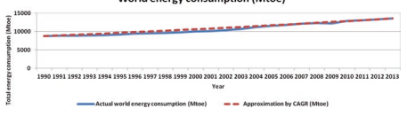

Energy effciency is also important for mMTC and URLLC as operating requirements. However, eMBB may come as the frst urgency in terms of this requirement.

## Mmtc

For mMTC, area traffc capacity can also be used as one of the requirements for system design. However, if the current focus is on small data packet transmission, the requirement would be very loose. However, for the services with larger devicewise data rate requirement (e.g., video recorder applications), the area traffc capacity would become important in addition to the service requirement.

## Urllc Availability

To guarantee the users in different regions within the area achieving the service requirement (low latency and ultrahigh reliability), the availability is defned in [2] as follows: the network is available for the targeted communication in 95% of the locations where the network is deployed and 100% of the time. Within the 95% of the locations the URLLC service requirement is achieved in 1 ms latency. This is a very stringent target for system design for URLLC applications.

## General

In addition to the above requirements, coverage capability of a network is the key for network operational cost.

## Coverage

Coverage is defned as the maximum geographical range of a radio access point to provide a certain quality of service (QoS). For different QoS level, the coverage of a network will be different. For example, the uplink coverage will be more challenging for a service requirement of data rate of 1 Mbps than that of 100 kbps. Coverage is also highly related to site density. If the coverage for a certain QoS is small, operators need to deploy much dense network to provide the desired QoS.  For example, in eMBB, if the coverage for providing UL data rate of 10 Mbps is 50 m, then the inter-site distance (ISD) could be hardly larger than 100 m. In this case, the number of sites required would be huge, leading to unacceptable cost. In this sense, coverage capability is fundamental for eMBB, URLLC, and mMTC usage scenarios.

## 1.3.2 5G Key Capabilities And Technical Performance Requirements

The 5G services form a solid basis for the defnition of 5G key capability and the related technical requirements. In ITU-R, the key capabilities for 5G are defned together with 5G envisaged usage scenarios. Technical performance requirements are defned based on the 5G vision and key capabilities.

## 1.3.2.1 **Key Capabilities For 5G**

The key capabilities for 5G (also known as IMT-2020 in ITU-R context) are shown in Fig. 1.4 (see [1]). Figure 1.4(a) demonstrates the targets of 5G key capabilities as well as the enhancement compared to 4G (also known as IMT-Advanced). 

Figure 1.4(b) gives the importance of each key capability in the three usage scenarios. In the following, the key capabilities for each usage scenario are discussed.

## Embb

In ITU-R, the user-experienced data rate and area traffc capacity are identifed as 

part of the key capabilities most relevant for eMBB. As discussed in previous section, the two capabilities guarantee the system support of a specifc eMBB service to be successfully delivered to most of the users, with a given number of users in the system.

## User-Experienced Data Rate

User-experienced data rate is defned as the achievable data rate that is available ubiquitously across the coverage area to a mobile user/device (in Mbps). The term "ubiquitous" is related to the considered target coverage area and is not intended to relate to an entire region or country [1]. It can be seen that ten times user-experienced data rate is expected compared to 4G. It can also be seen that 100 Mbps edge userexperienced data rate is indicated for downlink in dense urban areas (Fig.  1.4). 

Although the target capability is a bit lower than the NGMN requirement, it still guarantees that most users experience good UHD video and have partial AR/VR capabilities. Undoubtedly this capability is well beyond the service requirement of 1080p and 720p video.

## Area Traffc Capacity

Area traffc capacity is defned [1] as the total traffc throughput served per geographic area (in Mbps/m2).

Area traffc capacity of 10 Mbps/m2 is expected in high user density scenarios, e.g., indoor. This means that if we assume 20 users per 1000 m2 simultaneously transmitting data, the service required data rate of 500 Mbps can be supported.

This capability demonstrates a 100 times improvement compared to 4G. This is the result of ten times user-experienced data rate improvement together with ten times connection density capability.

## Mobility

Mobility is an important capability that allows the support of high data rate transmission inside high-speed vehicles.

It is defned as the maximum speed at which a defned QoS and seamless transfer between radio nodes which may belong to different layers and/or radio access technologies (multilayer/−RAT) can be achieved (in km/h) [1].

The capability of up to 500 km/h is to be supported. This mobility class is 1.4 times of 4G (where up to 350 km/h mobility class is defned).

## Peak Data Rate

The peak data rate is defned as the maximum achievable data rate under ideal conditions per user/device (in Gbps) [1]. It indicates the maximum capability of the data rate of a device. It is seen that 10–20 Gbps is expected. This means the device under the ideal condition can support AR/VR applications. Besides the above capabilities, the effciency capabilities that are helpful to reduce the operational cost are identifed as key capabilities for 5G. Energy Effciency Network energy effciency is identifed as one of the key capabilities that enable the economics of 5G.

Energy effciency has two aspects [1]: - On the network side, energy effciency refers to the quantity of information bits transmitted to/received from users, per unit of energy consumption of the radio access network (RAN) (in bit/Joule)
- On the device side, energy effciency refers to the quantity of information bits per unit of energy consumption of the communication module (in bit/Joule)
For network energy effciency, it is required that the energy consumption should not be greater than the radio access networks deployed today while delivering the enhanced capabilities. Therefore, if area traffc capacity is increased by 100 times, the network energy effciency should be improved by a similar factor.

## Spectral Effciency

Spectral effciency includes two aspects. The average spectrum effciency is defned as the average data throughput per unit of spectrum resource and per transmitreceive point (bps/Hz/TRxP). The edge user spectral effciency is defned as the ffth percentile user data throughput per unit of spectrum resource (bps/Hz).

As discussed in Sect. 1.3.1.3, the requirement on average spectral effciency improvement is related to the required amount of increase in area traffc capacity. ITU-R defnes 100 times improvement capability for area traffc capacity. In this case, the total amount of data rate will be increased by at least 100 times. The total amount of data rate is given by averaged spectrum effciency (bps/Hz/TRxP) multiplying with the available system bandwidth (Hz) and the number of transmit-receive point (TRxP) in the area. If we assume that the TRxP deployment within the given area can be increased by three times, and the available bandwidth can be increased by ten times, then the average spectrum effciency should be increased by at least three times.

For edge user spectral effciency, the requirement of improvement is related to the supported edge user-experienced data rate, the number of users under one TRxP, and the available bandwidth. If we assume that the connection density within the area is increased by ten times (see below on "connection density" capability) while the number of TRxPs within the area can be increased by three times, then the number of users in one TRxP will be increased by three times. On the other hand, one may assume that the available bandwidth in one TRxP is increased by ten times. 

This means for an individual user, the available bandwidth is increased by 10/3 = 3.3 times. In this case, to consider the support of ten times edge user-experienced data rate (see above on "user-experienced data rate" capability), the edge user spectral effciency should be improved by three times.

## Mmtc

For mMTC usage scenario, connection density and energy effciency are identifed as the two most relevant key capabilities. Besides key capabilities, operational lifetime is also identifed as desired capabilities for 5G network for mMTC.  These capabilities will now be discussed *in ordinem.*

## Connection Density

Connection density is the total number of connected and/or accessible devices per unit area (per km2) [1]. For mMTC usage scenario, connection density is expected to reach 1,000,000 devices per km2 due to the demand of connecting a vast number of devices in the time frame of 2020 and beyond. This is a ten times improvement compared to 4G (IMT-Advanced).

## Network Energy Effciency

Network energy effciency is also identifed as one of the important key capabilities for mMTC. This is because the large coverage provided for mMTC devices should not be at the cost of signifcantly increased energy consumption.

## Operational Lifetime

Operational lifetime refers to operation time per stored energy capacity. This is particularly important for machine-type devices requiring a very long battery life (e.g., more than 10 years) whose regular maintenance is diffcult due to physical or economic reasons [1].

## Urllc

As discussed in the previous sections, latency, mobility, and reliability are identifed as the two most relevant key capabilities of URLLC.

## Latency

In [1], user plane latency is highlighted. It is defned as the contribution by the radio network to the time from when the source sends a packet to when the destination receives it (in ms).

The 1 ms latency is desired. Reliability is further defned in technical performance requirements and will be discussed in the following sections.

Mobility Mobility is relevant to URLLC usage scenario because the transportation safety applications, etc. are usually under high-speed mobility.

Besides the above key capabilities, reliability and resilience are also identifed as desired capabilities for 5G network for URLLC.

## Reliability

Reliability relates to the capability to provide a given service with a very high level of availability [1].

## Resilience

Resilience is the ability of the network to continue operating correctly during and after a natural or man-made disturbance, such as the loss of mains power [1]. Other Capabilities Other capabilities for 5G are also defned in [1]. Spectrum and Bandwidth Flexibility Spectrum and bandwidth fexibility refer to the fexibility of the system design to handle different scenarios, and in particular to the capability to operate at different frequency ranges, including higher frequencies and wider channel bandwidths than today.

## Security And Privacy

Security and privacy refer to several areas such as encryption and integrity protection of user data and signaling, as well as end-user privacy preventing unauthorized user tracking, and protection of network against hacking, fraud, denial of service, man-in-the-middle attacks, etc.

The above capabilities indicate that 5G spectrum and bandwidth fexibility, as well as security and privacy, will be further enhanced.

## 1.3.2.2 **Technical Performance Requirements For 5G**

Based on the key capabilities and IMT-2020 vision defned in [1], technical performance requirements are defned in Report ITU-R M.2410 (see [18]).

The technical performance requirements are summarized in Tables 1.5, 1.6, and 1.7. The detailed defnition of the technical performance requirements can be found in [18].

To reach the 5G vision defned by ITU-R, 3GPP further studied the deployment scenarios and the related requirements associated with the three usage scenarios as documented in 3GPP TR 38.913 (see [13]). These requirements are usually higher than ITU's technical performance requirement, showing 3GPP's ambition of providing higher capability than ITU required. A detailed description of the 3GPP 
requirements is beyond the scope of this book. This interested reader is encouraged to consult [13].

## 1.3.3 Summary On 5G Requirements

From the analyses in the previous sections, it can be seen that 5G has diverse requirements. For eMBB usage scenario, the edge user-experienced data rate should 

| Table 1.5                                                                                        | eMBB technical performance requirements   | Comparison to  IMT-Advanced  requirement   |                                          |
|--------------------------------------------------------------------------------------------------|-------------------------------------------|--------------------------------------------|------------------------------------------|
| Peak data rate                                                                                   | 20 Gbit/s                                 | 10 Gbit/s                                  | ~6× LTE-A  (Release-10)                  |
| Peak spectral effciency                                                                          | 30 bit/s/Hz                               | 15 bit/s/Hz                                | 2× IMT-Advanced                          |
| User-experienced data rate  (ffth percentile user data  rate) Technical performance  requirement | DL                                        | UL                                         |                                          |
| 100 Mbit/s                                                                                       | 50 Mbit/s                                 | -                                          |                                          |
| 5th percentile user spectral                                                                     | ~3x                                       | ~3x                                        | ~3× IMT-Advanced                         |
| effciency                                                                                        | IMT-Advanced                              | IMT-Advanced                               |                                          |
| Average spectral effciency                                                                       | ~3x                                       | ~3x                                        | ~3× IMT-Advanced                         |
| IMT-Advanced                                                                                     | IMT-Advanced                              |                                            |                                          |
| Area traffc capacity                                                                             | 10 Mbit/s/m2                              | -                                          | -                                        |
| Energy effciency                                                                                 | High sleep ratio and long sleep           | -                                          |                                          |
| duration under low load                                                                          |                                           |                                            |                                          |
| Mobility class With traffc channel link data  rates -                                            | Up to 500 km/h,                           | 1.4× mobility class                        |                                          |
| with 0.45 bit/s/Hz                                                                               | 1.8× mobility link data  rate             |                                            |                                          |
| User plane latency                                                                               | 4 ms                                      | 4 ms                                       | >2× reduction  compared to  IMT-Advanced |
| Control plane latency                                                                            | 20 ms                                     | 20 ms                                      | >5× reduction  compared to  IMT-Advanced |
| Mobility interruption time                                                                       | 0                                         | 0                                          | Much reduced                             |

be enhanced to deliver high-quality video at anywhere and anytime to the end users, 

| Table 1.6                  | URLLC technical performance requirements   |                |                                          |
|----------------------------|--------------------------------------------|----------------|------------------------------------------|
| Technical performance      | Comparison to IMT-Advanced                 |                |                                          |
| requirement                | DL                                         | UL             | requirement                              |
| User plane latency         | 1 ms                                       | 1 ms           | >10× reduction compared to  IMT-Advanced |
| Control plane latency      | 20 ms                                      | 20 ms          | >5× reduction compared to  IMT-Advanced  |
| Mobility interruption time | 0                                          | 0              | Much reduced                             |
| Reliability                | 99.999% within                             | 99.999% within | -                                        |
| 1 ms                       | 1 ms                                       |                |                                          |

Table 1.7 mMTC technical performance requirements

| Technical performance   | Comparison to IMT-Advanced   |                    |             |
|-------------------------|------------------------------|--------------------|-------------|
| requirement             | DL                           | UL                 | requirement |
| Connection density      | -                            | 1,000,000 devices/ | -           |
| km2                     |                              |                    |             |

and high data rate transmission should also be possible under high mobility class. The area traffc capacity is required to be improved by 100 times or more to enable more users to enjoy high data rate service. Latency is also found to be of increasing importance for eMBB: for example, in AR/VR applications. The above performance requirements need to be provided in an affordable manner, which in turn requires spectral effciency to be improved at least by three times, and energy effciency to be signifcantly enhanced. Note that not all of these requirements are unique to the eMBB service; for example, energy effciency is also desired for network providing mMTC and URLLC services.

For the mMTC usage scenario, connection density of the order of 1,000,000 devices per km2 should be supported to enable mMTC services that are delivered to a huge number of sensors, with variable data rates. Long battery life and deep coverage are desired.

For URLLC usage scenario, low latency together with high reliability is required. 

High availability should also be targeted from a long-term perspective which further ensures that most of the locations within the network coverage are able to achieve the URLLC service requirement.

Coverage is a fundamental requirement when providing eMBB, URLLC, and mMTC services, because otherwise the site deployment would become very dense. A balance will need to be struck between density and network cost to make the system design economically feasible.

Other requirements including privacy and security enhancement, which makes 5G a safer network, are also necessary. This is of vital importance especially given that 5G targets to connect everything.

## 1.4 **Standard Organization And 5G Activities**

5G development is a vast process that needs wide support from both industries, SDOs, and administrations. As is seen from Sect. 1.2, different regions show their visions for 5G development and applications. Consequently, for effcient 5G development, global efforts are needed to harmonize the regional concepts, from both technology perspective and spectrum perspective, so as to develop a unifed 5G technology that is applicable on 5G potential bands.

To achieve this goal, the following organizations play a vital role in 5G standardization and development. ITU-R, as the leading organization of identifying qualifed 5G technology (known as IMT-2020 in ITU-R context) for effcient spectrum use, develops strict procedures for IMT-2020 submission and evaluation. These procedures are open to all technical standard development organizations, and they guarantee that the proposed technology could fulfll a specifc set of requirements that are suitable for 5G deployment and to reach the vision of the envisaged network system for 2020 and beyond. On the other hand, 3GPP, as a very active technical partnership project, becomes the essential standard development organization for 5G development for the SDOs. This section discusses the ITU procedures for IMT-2020 submission and 3GPP developments toward ITU-R submission.

## 1.4.1 Itu-R Procedure/Process Of Imt-2020 Submission

ITU-R is the leading organization for IMT-2020 development. ITU-R's role is to identify the IMT-2020 (5G) vision which will serve as the overall target for 5G development for 2020 and beyond, and to invite the technical standard development organizations to submit their candidate technologies that are capable to achieve the IMT-2020 vision. The qualifed technology proposals are allowed to be deployed on IMT bands that are licensed to operators.

ITU-R Working Party 5D (WP 5D), which is the responsible working party in ITU-R for IMT system development, made an overall time plan for the above process in Fig. 1.5.

There are, generally, three stages to develop IMT-2020:

## Stage 1: Imt-2020 Vision Development (2012–2015).

From July 2012 to June 2015, ITU-R WP 5D developed the IMT-2020 vision 
(Recommendation ITU-R M.2083) to defne the framework of IMT-2020. At the same time, the study on technology trends and IMT feasibility for above 6 GHz was conducted in preparation for 5G development.

Stage 2: IMT-2020 technical performance and evaluation criteria development 
(2015–2017).

After the IMT-2020 vision is developed, WP 5D started the defnition of IMT-2020 requirements in 2016. The requirements include three aspects: technical performance requirements, service requirements, and spectrum requirements. These requirements are used to evaluate whether a candidate proposal is a qualifed technical proposal that has the potential to be included as IMT-2020 standard for global deployment. At the same time, the evaluation criteria and methods are developed by ITU-R to evaluate whether a specifc requirement is achieved by the candidate proposal. Submission templates are also developed such that a unifed submission format can be used among the proponents, which is helpful to ease the work of ITU-R and independent evaluation groups when evaluating the received candidate technologies. In 2017, ITU-R published three reports related to the above aspects: - Report ITU-R M.2411: *Requirements, evaluation criteria, and submission* templates for the development of IMT-2020, which defned IMT-2020 requirements, evaluation criteria, and submission templates. Technical performance requirements are detailed in Report ITU-R M.2410. And evaluation criteria and method are detailed in Report ITU-R M.2412.

- Report ITU-R M.2410: *Minimum requirements related to technical performance for IMT-2020 radio interface(s)*, which defnes the 13 technical performance requirements for IMT-2020 development.

- Report ITU-R M.2412: *Guidelines for evaluation of radio interface technologies for IMT-2020,* which defnes the test environment, evaluation method, and detailed evaluation parameters for the technical performance requirement. Evaluation criteria on how to conduct these test environment, method, and parameters, and how to determine that a requirement is fulflled, are defned in suffcient details.

- Besides the above three important reports, Document IMT-2020/02 (Rev. 1) [19] 
further defnes the criteria for accepting a proposal to enter the IMT-2020 evalu-

ation procedure and the criteria for accepting a proposal to be approved as IMT-2020. It is, currently, required that the proposed radio interface technology should meet the requirement of at least two eMBB test environments and one URLLC or one mMTC test environment when it is considered for acceptance to enter the IMT-2020 evaluation process (see below). Furthermore, it is required that the requirements should be met for all test environments in eMBB, URLLC, 
and mMTC when it is considered to be approved as IMT-2020. By this means, the developers have the chance to enter IMT-2020 development process at the beginning of IMT-2020 submission phase, and further develop itself to achieve the full vision of IMT-2020 when approved.

## Stage 3: Imt-2020 Submission, Evaluation, And Specifcation Development (2016–2020).

In February 2016, the ITU-R issued the Circular Letter that invited the submission of IMT-2020 technologies among ITU members and external organizations. This Letter offcially announces that the evaluation and submission procedure is initialized. This procedure includes several steps that span from 2017 to 2020. As can be roughly seen in Fig. 1.5, there are generally three phases: - "Submission phase" (see "Proposals IMT-2020" in Fig. 1.5): In this phase, the proponents can propose IMT-2020 candidate technologies. Self-evaluation will need to be provided by the proponent to demonstrate that their proposed technology can pass the minimum set of requirements requested by ITU-R.

- "Evaluation phase": In this phase, independent evaluation groups are invited to evaluate the qualifed candidate technologies. Evaluation reports from the evaluation groups will be reviewed by WP 5D to determine which candidates pass the requested minimum set of requirements based on a predefned criteria. These technologies will go into specifcation phase.

- "Specifcation phase": In this phase, the qualifed technologies will be specifed and captured in a recommendation of ITU-R for global IMT-2020 standard. The technologies captured in IMT-2020 standard will be able to be deployed on IMT bands licensed to operators.

- Consensus building is brought across the procedure to achieve a unifed IMT-2020 technology.

The detailed procedure is given in Document IMT-2020/02 (Rev. 2) [19].

Based on the guidance of ITU-R procedure for IMT-2020 submission, the technical standard development organizations can submit their candidate technologies to ITU-R, and ITU-R will invite independent evaluation groups to make an independent evaluation to all the received candidates that declare themselves capable of meeting IMT-2020 requirements. 3GPP as one of the technical standard partnership projects has made such efforts for IMT-2020 submission.

## 1.4.2 3Gpp Development Toward Itu-R Submission

3GPP is a partnership project formed during the 3G development era that targets to develop a global harmonized technical specifcation for wireless cellular systems. It unites seven telecommunications standard development organizations from different regions worldwide. The seven organizations, also known as "Organizational Partners" (OPs) of 3GPP, as discussed in Sect. 1.2.3. provide their members with a stable environment to produce the Reports and Specifcations that defne 3GPP technologies.

It should be observed that the seven OPs have a good representation and worldwide coverage for the global development on wireless telecommunications. Through the seven OPs, the member companies, universities, and research institutes can join the technical discussions of 3GPP and contribute to the technology development. This is a very essential base that 3GPP can gather a wide range of support across industry, academy, and other stakeholders for wireless system development. 

Therefore, 3GPP continues to be the essential technology standard partnership project for 5G.

In 2015, after ITU-R published the IMT-2020 vision (Recommendation ITU-R M.2083), 3GPP started the new radio (NR) study in Release-14 time frame (Fig. 1.6), which targets to fulfll IMT-2020 requirements. This study item (SI) included new numerology and frame structure design, coding scheme development, fexible duplexing study, and multiple access study. At the frst stage, NR study focuses on eMBB and URLLC usage scenarios as defned in IMT-2020 vision. NR mMTC may be developed in a later stage, since the earlystage mMTC applications are expected to be supported by NB-IoT or eMTC 
developed earlier in LTE.

In 2017, 3GPP started the normative work in Release-15 time frame for NR. The NR work item (WI) was set up to specify the technologies identifed useful for 5G development in Release-14 NR SI. The NR numerology, frame structure, duplex, and multiple access were specifed. NR MIMO was discussed and developed. The specifcation considers the IMT-2020 requirement and the potential spectrum deployment for 5G, including the high data rate and high spectral effciency 

requirement, low latency requirement and high reliability requirement, etc., together with wide area coverage. Specifcally, the C-band characteristics played a key role in 5G development. To address the high data rate and low latency target simultaneously with large coverage issue, 3GPP developed several key technical components. 

These key components include numerologies and frame structures that are suitable for large bandwidth, massive MIMO technology that is suitable for C-band deployment, and downlink uplink decoupling that is suitable for achieving high data rate 
(especially for UL) on C-band with existing inter-site distance.

In the Release-16 time frame, 3GPP will continue to enhance its NR capability to address higher spectral effciency for eMBB, and to enhance URLLC in multiuser scenarios. 3GPP also targets to extend NR usage to more vertical scenarios, including vehicular communications.

5G self-evaluation study was set up in 2017 to conduct the self-evaluation of 3GPP technologies developed in Release-15 and Release-16 for IMT-2020 submission. The preliminary self-evaluation was submitted to ITU-R in October 2018, and the fnal evaluation results were submitted in June 2019.

## 1.4.3 Independent Evaluation Groups To Assist Itu-R Endorse Imt-2020 Specifcation

To assist ITU-R on evaluating whether a candidate technology can fulfll the IMT-2020 requirements, ITU-R invites independent evaluation groups to conduct evaluation on the received candidates and reports to WP 5D on their conclusions. As of February 2020, there are 14 registered independent evaluation groups: - 5G Infrastructure Association - ATIS WTSC IMT-2020 Evaluation Group - ChEG Chinese Evaluation Group. - Canadian Evaluation Group - Wireless World Research Forum - Telecom Centres of Excellence, India. - The Fifth Generation Mobile Communications Promotion Forum, Japan - TTA 5G Technology Evaluation Special Project Group (TTA SPG33). - Trans-Pacifc Evaluation Group - ETSI Evaluation Group - 5G India Forum - Africa Evaluation Group. - Beijing National Research Center for Information Science and Technology 
(Bnrist EG) (application form—restricted access).

- Chinese Industry and Research Alliance of Telecommunications (CIRAT).

## 1.4.4 Status In Itu

As of the writing of this treatise, the independent evaluation entities have all completed their evaluations and submitted their results to the ITU. At the November 23rd, 2020, meeting, ITU-R SG 5 approved WP5D's draft recommendation [20], 
IMT 2020.SPECS which is the frst offcial 5G RAN standard. The IMT 2020.

SPECS was approved by the 193 member states of the ITU in February of 2021. The specifcation, "Detailed specifcations of the radio interfaces of IMT-2020" (ITU-R M.[IMT-2020.SPECS]), is now available on the ITU website [21].

## 1.5 **Summary**

In this section, the motivation and driving forces of 5G development are investigated, and the 5G use cases and technical requirements are introduced. Cellular communication system, from its frst generation, is focused on connecting humans. From 5G, however, the use cases are extended beyond MBB for connecting human beings to mMTC and URLLC for connecting different machines. 5G will therefore be the frst generation that devotes itself to connecting both humans and machines.

Accordingly, the service requirements and the technical performance requirements are extended from eMBB to the new use cases (or usage scenarios). For eMBB, it requires signifcant increase of data rate to adapt to the emerging highdefnition video and AR/VR transmission, at the cost of affordable energy consumption and spectrum occupation. This implies that both energy effciency and spectral effciency should be considerably increased. Furthermore, the cell edge data rate should be signifcantly increased to several or tens of megabits per second, with the similar coverage of existing network deployment, which poses a big challenge for eMBB 5G design. For URLLC, very low latency is required and at the same time high reliability should be guaranteed. On the other hand, such capability should be provided under various conditions including mobility. For mMTC, the large connection density is desired to provide massive connection in an effcient manner. 

Besides, in both use cases, coverage is needed to enable an affordable network deployment. Finally, the above requirements should be achieved by a unifed air interface framework from a cost effciency perspective. In summary, 5G requirements are diverse, but at the same time the cost of energy, spectrum, and deployment should be restricted to an affordable level. All these issues pose signifcant challenges to system design.

Like previous generations, 5G development is based on industry collaboration, where ITU and 3GPP play the central role in this process. ITU-R defned the 5G 
vision, technical performance requirements, and evaluation criteria for the candidate 5G technologies, from the perspective of effcient use of spectrum and other resources, e.g., energy, site and deployment, to address the diverse requirements from 5G use cases. ITU-R has a well-established procedure of the IMT-2020 development, which guarantees that only the technologies that pass the abovementioned requirements could be approved as IMT-2020 (the name of 5G in ITU-R), 
and only such technologies can be allowed to use IMT spectrums. By this means, the technologies that are able to be deployed on IMT spectrum are guaranteed to be of high performance and high effciency when using the scarce spectrum and other resources. On the other hand, 3GPP is the major organization for 5G technical development which unites the telecommunications standard development organizations (SDOs) all over the world. By the support of the seven SDOs (also known as organization partners, OPs): ARIB and TTC from Japan, ATIS from America, CCSA from China, ETSI from Europe, TSDSI from India, and TTA from Korea, 3GPP provides the members with stable environment for 5G technology development. The OP members cover almost all the key parties, which ensure that the 3GPP 
technology addresses the concerns and issues from different parties and different regions. With the guidance of ITU-R and the well-harmonized technical development in 3GPP, 5G technology and 5G standardization are well developed. This is the key for 5G success.

Now that we have an understanding of the requirements of 5G and the process by which it was developed, the next chapter will begin our study of the enablers of the 5G wireless system. The discussion will begin with technical overview of LTE. This will naturally lead us to understand the 5G air interface by comparing and contrasting with the LTE design.

## References

1. ITU-R, "Recommendation ITU-R M.2083," September 2015. [Online]. Available: https://
www.itu.int/rec/R-REC-M.2083.

2. NGMN, "NGMN 5G White Paper," February 2015. [Online]. Available: https://www.ngmn.

org/5g-white-paper/5g-white-paper.html.

3. IMT-2020 (5G) PG, "5G vision and requirement white paper," May 2014. [Online]. Available: 
http://www.imt-2020.cn/zh/documents/download/1.

4. METIS, "D1.1 Scenarios, requirements and KPIs for 5G mobile and wireless system," 2013 April. [Online].

5. METIS, "D6.6 Final report on the METIS 5G system concept and technology roadmap," 2015 April. [Online].

6. 5GMF, "5G Mobile Communications Systems for 2020 and beyond," 2016 July. [Online]. 

Available: http://5gmf.jp/en/whitepaper/5gmf-white-paper-1-01/.

7. 5G Americas, "5G services and use cases"," 2017 November. [Online]. Available: http://
www.5gamericas.org/fles/9615/1217/2471/5G_Service_and_Use_Cases__FINAL.pdf.

8. 3GPP TSG-RAN Secretariat, "3GPP RAN RP-202124: Draft report of electronic meeting RAN \#89e held 14.09.-18.09.2020," December 2020. [Online]. Available: https://www.3gpp. org/ftp/tsg_ran/TSG_RAN/TSGR_90e/Docs.

9. 3GPP, "3GPP TR22.863: Feasibility Study on New Services and Markets Technology Enablers - 
Enhanced Mobile Broadband," September 2016. [Online]. Available: https://portal.3gpp.org/ desktopmodules/Specifcations/SpecifcationDetails.aspx?specifcationId=3015.

10. Wikipedia, "Bit Rate," [Online]. Available: https://en.wikipedia.org/wiki/Bit_rate. [Accessed 23 May 2019].

11. Huawei iLab, "Cloud VR Bearer Networks," 2017. [Online]. Available: https://wwwfle.huawei.com/-/media/CORPORATE/PDF/ilab/cloud_vr_oriented_bearer_network_white_
paper_en_v2.pdf?source=corp_comm.

12. 3GPP, "3GPP TR22.861: Feasibility Study on New Services and Markets Technology Enablers for Massive Internet of Things", September 2016. [Online]. Available: https://portal.3gpp.org/ desktopmodules/Specifcations/SpecifcationDetails.aspx?specifcationId=3013.

13. 3GPP, "3GPP TR 38.913: STudy on scenarios and requirements for next generation access technologies v15.0.0," June 2018. [Online]. Available: https://portal.3gpp.org/desktopmodules/Specifcations/SpecifcationDetails.aspx?specifcationId=2996.

14. 3GPP, "3GPP TR22.862: Feasibility Study on New Services and Markets Technology Enablers for Critical Communications," 2018 September. [Online]. Available: https://portal.3gpp.org/ desktopmodules/Specifcations/SpecifcationDetails.aspx?specifcationId=3014.

15. China (Peoples Republic of), "ITU Document 5D/757: Discussion on energy effciency and the requirement for future IMT," September 2014. [Online]. Available: https://www.itu.int/md/ meetingdoc.asp?lang=en&parent=R12-WP5D-C&PageLB=300.

16. The Climate Group, "Smart 2020: Enabling the low carbon economy in the information age," 
2008. [Online]. Available: https://www.theclimategroup.org/sites/default/fles/archive/fles/ Smart2020Report.pdf.

17. Enerdata, "Global energy statistical yearbook 2014," 2014. [Online]. Available: http://yearbook.enerdata.net/.

18. ITU-R, "ITU-R Report M.2410: Minimum requirements related to technical performance for IMT-2020 radio interface(s)", November 2017. [Online]. Available: https://www.itu.int/ pub/R-REP-M.2410-2017.

19. Document IMT-2020/02 (Rev. 2), "Submission, evaluation process and consensus building for IMT-2020," July 2019. [Online]. Available: https://www.itu.int/md/R15-IMT.2020-C-0002.

20. ITU, "ITU completes evaluation for global affrmation of IMT-2020 technologies," 26 November 2020. [Online]. Available: https://www.itu.int/en/mediacentre/Pages/pr26-2020evaluation-global-affrmation-imt-2020-5g.aspx. [Accessed 1 December 2020].

21. ITU, "ITU-R Report M.2150: Detailed specifcation of the terrestrial radio interfaces of International Mobile Telecommunications-2020 (IMT-2020)", February 2021. [Online]. Available: https://www.itu.int/rec/R-REC-M.2150/en.

# Chapter 2

 4G Lte Fundamental Air Interface Design

Before we start our investigation of NR, we will frst give a detailed review of LTE. The focus will be on the basic aspects of LTE that NR builds upon. This will serve as a solid foundation for us to understand the 5G NR air interface. Those readers that are professionals in LTE may choose to skip this chapter and move directly to the NR air interface.

## 2.1 **Lte Air Interface Overview**

As the NR air interface borrows some design from LTE, one straightforward way to understand NR for those who are at least passingly familiar with LTE is to look at the differences between LTE and NR. This chapter reviews the signifcant parts of LTE that are critical to the understanding of NR. The interested reader on details of LTE is referred to some literatures such as [1, 2].

LTE standardization started from Release-8  in 3GPP, and then many features were standardized in the following releases from Release-8 to Release-14. The evolution in the standard from Release-15 which parallels NR is still going on to support different new features from industry interests. The designed LTE network can support diverse services including eMBB, Voice, Multimedia Broadcast Multicast Services (MBMS), D2D, IoT, Vehicle, etc. These services can be transmitted in the form of unicast transmission, or single-cell point-to-multipoint transmission (SC-PTM), or MBSFN (MBMS Single-Frequency Network) transmission. The transmission is mainly operated in the licensed spectrum, but eMBB can also be transmitted in the unlicensed spectrum. For conciseness of description, the overview of LTE air interface in the following sections will focus on unicast transmission for both downlink and uplink in the licensed spectrum.

## 2.2 **Lte Frame Structure**

The frame structure is dependent on the duplex scheme applied in the spectrum. Two duplex schemes FDD and TDD are supported. FDD is operated in the paired spectrum (see Sect. 3.2.1), where the downlink and uplink transmissions are performed in different carrier frequencies. For FDD, whether downlink and uplink transmission can occur simultaneously depends on UE capability. Half-duplex FDD is for the case when the UE cannot transmit and receive at the same time while there are no such restrictions for full-duplex FDD. TDD is operated in the unpaired spectrum; see Sect. 3.2.1, where the downlink and uplink transmissions occur in different time instances of the same carrier frequency. For TDD, switching time is needed to guarantee the switching from downlink to uplink transmission.

Two different frame structures, denoted as type 1 and type 2, are supported, which are applicable to FDD and TDD operated in licensed spectrum, respectively.

For frame structure type 1, one radio frame consists of ten sub-frames and each sub-frame is 1 ms consisting of two slots. There are ten sub-frames available for downlink transmission and ten sub-frames available for uplink transmission in each 10 ms interval as shown in Fig. 2.1.

For frame structure type 2, the length of one radio frame is 10 ms and each radio frame consists of ten sub-frames with 1 ms each. Each sub-frame consists of two slots of length 0.5 ms. The sub-frames in one radio frame are reserved for downlink transmissions, switching from downlink to uplink transmission and uplink transmissions separately. The sub-frame(s) reserved for switching transmission direction is called special sub-frame. There are three felds in the special sub-frame which are DwPTS, GP, and UpPTS, where DwPTS and UpPTS are used for downlink and uplink transmission separately as shown in Fig. 2.2. GP is the time duration without both downlink and uplink transmission, which is to mainly avoid the overlap of 

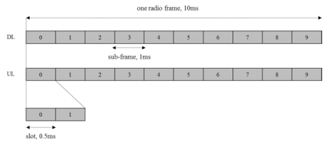

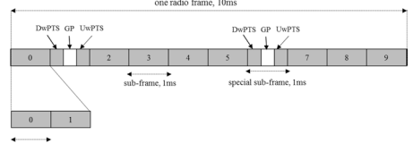

uplink reception and downlink transmission at the base station side. The length of GP is related to the cell size as determined by the round-trip time of propagation. As there are different deployment scenarios in the practical network, several GP confgurations are supported in [3]. The supported downlink-to-uplink switching periodicities are 5 ms and 10 ms.

The uplink-downlink sub-frame confguration in one radio frame depends on the UL/DL traffc ratio. Normally, the DL/UL traffc is asymmetric and DL has more traffc than UL statistically [4], and therefore more DL sub-frames are needed in one radio frame. There are seven different uplink-downlink sub-frame confgurations defned in [3] to match different DL/UL traffc patterns, which are provided in Table 2.1 [3]. In the existing TDD commercial networks over the world, uplinkdownlink confguration 2 is a typical confguration.

As downlink and uplink transmissions are operated in the same carrier frequency for TDD, serious cross-link interference may occur without network synchronization; for example, uplink transmission suffers from downlink transmission of neighboring cell as illustrated in Fig.  2.3. In other words, the same uplink-downlink confguration needs to be confgured among the different cells of the same operator or between different operators. Due to the requirement of such strict confguration, the uplink-downlink confguration is semi-static and cannot be changed dynamically; otherwise it will cause severe cross-link interference.

## 2.3 **Physical Layer Channels**

The properties of the physical layer channels are described in this section starting with the multiple-access schemes.

| Table 2.1                                                                                         | Uplink-downlink confgurations   | Sub-frame number   |    |    |    |    |    |    |    |    |    |
|---------------------------------------------------------------------------------------------------|---------------------------------|--------------------|----|----|----|----|----|----|----|----|----|
| Uplink-downlink                                                                                   | Downlink-to-uplink switch-point |                    |    |    |    |    |    |    |    |    |    |
| confguration                                                                                      | periodicity                     | 0                  | 1  | 2  | 3  | 4  | 5  | 6  | 7  | 8  | 9  |
| 0                                                                                                 | 5 ms                            | D                  | S  | U  | U  | U  | D  | S  | U  | U  | U  |
| 1                                                                                                 | 5 ms                            | D                  | S  | U  | U  | D  | D  | S  | U  | U  | D  |
| 2                                                                                                 | 5 ms                            | D                  | S  | U  | D  | D  | D  | S  | U  | D  | D  |
| 3                                                                                                 | 10 ms                           | D                  | S  | U  | U  | U  | D  | D  | D  | D  | D  |
| 4                                                                                                 | 10 ms                           | D                  | S  | U  | U  | D  | D  | D  | D  | D  | D  |
| 5                                                                                                 | 10 ms                           | D                  | S  | U  | D  | D  | D  | D  | D  | D  | D  |
| 6                                                                                                 | 5 ms                            | D                  | S  | U  | U  | U  | D  | S  | U  | U  | D  |
| Note: "D," "S," and "U" represent the sub-frame that is reserved for downlink, downlink-to-uplink |                                 |                    |    |    |    |    |    |    |    |    |    |

## 2.3.1 Multiple-Access Scheme

Orthogonal Frequency-Division Multiplexing (OFDM)-based scheme is the basic transmission scheme for LTE downlink and uplink transmission. The basic principle of OFDM can be found in some textbooks [1, 5, 6]. OFDM is a multi-carrier technology which generates a number of orthogonal subcarriers with small bandwidth. Each subcarrier with small bandwidth faces relatively fat fading in the propagation, which can effectively remove the impact of frequency-selective fading and simplify the equalizer at the receiver especially for wideband transmission. OFDM can be implemented by IFFT which is illustrated in Fig. 2.4, and DFT is used for OFDM reception.

Some of the main aspects that led to the selection of OFDM for the downlink transmission include low cost and complexity implementation for wide (20 MHz) bandwidth, inherent and simple multipath protection through the use of a cyclic prefx, and a naturally scalable implementation where multiple system bandwidths can be supported.

Due to the multi-carrier transmission, the instantaneous OFDM signal has a large variation and results in high peak-to-average power ratio (PAPR). For the LTE uplink, PAPR was a hot discussion, soon to be replaced with the more accurate but not-as-straightforward-to-calculate cubic metric (CM) [7]. The power amplifer is required to have a large linear dynamic range, which will cause high cost and low effciency of power amplifer. Alternatively, the nonlinearity of the device results in 

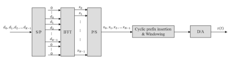

the distortion of the signal with large variation distortion, and power back-off is needed which reduces the cell coverage. Hence OFDM is not a good choice for UE in the uplink transmission. The selection of a single-carrier waveform allowed for a substantially lower CM for the uplink, thus facilitating lower cost lower power consumption UE.  The SC-FDMA waveform used is "DFT"-spread OFDM (DFT-SOFDM), using with an extra DFT block making the net signal single carrier, which is illustrated in Fig. 2.5. SC-FDMA with cyclic prefx in the form of DFT-S-OFDM 
is used to achieve uplink inter-user orthogonality and to enable effcient frequencydomain equalization at the receiver side. This allows for a relatively high degree of commonality with the downlink OFDM scheme and the same parameters, e.g., clock frequency, can be reused [8].

Based on the downlink and uplink transmission scheme described above, UE 
multiplexing in the downlink and uplink transmission is operated by OFDMA and SC-FDMA as the multiple-access scheme, respectively. As DFT-S-OFDM is based on OFDM, different UEs in the downlink or uplink transmission can be multiplexed over different subcarriers within a certain time interval in terms of several OFDM symbols. An exemplary downlink and uplink UE multiplexing is illustrated in Fig. 2.6.

The downlink supports the transmission to UE in either localized or distributed manner. For localized transmission, a set of resources being consecutive in the frequency domain is allocated to achieve scheduling gain. In this case, it implies that the base station knows the part of the wideband channel that is of good quality for a certain UE, and then schedules the corresponding part for transmitting data to the UE. The distributed transmission is that a set of resources allocated for a certain UE where the resources are distributed in the frequency domain to achieve frequency diversity gain. Normally, due to the high mobility or the worse channel condition, the UE cannot accurately track or timely report the channel state information to the base station. In this case, since scheduling gain cannot be achieved, it is better to schedule for frequency diversity gain. It can be seen that knowledge of the channel information is key to making good scheduling decision and, thus, the UE is required to report the channel state information to the base station.

In the uplink, in order to keep the single carrier property with low CM, the UE 
multiplexing is different from downlink. All the subcarriers allocated for one UE have to be localized.

## 2.3.2 System Bandwidth

LTE targets for operating below 6 GHz and most of the existing LTE commercial networks are deployed in sub-3GHz licensed spectrum. As the spectrum has multiple channel bandwidths existing in sub-3 GHz, LTE is designed to support scalable channel bandwidth in order to facilitate the deployment. The supported channel bandwidth is shown in Table 2.2 [9].

If all the subcarriers corresponding to a certain channel bandwidth are utilized, there is the problem of out-of-band emissions because the added window for the OFDM symbol cannot completely remove the side lobes in the frequency domain. The out-of-band emissions will interfere with the adjacent channel. To avoid the serious impact of out-of-band emissions, a number of subcarriers at the edge of channel bandwidth need to be used as guard band without data transmission. In 

| Channel bandwidth (MHz)                 | 1.4   | 3   | 5   | 10   | 15   | 20   |
|-----------------------------------------|-------|-----|-----|------|------|------|
| Transmission bandwidth confguration NRB | 6     | 15  | 25  | 50   | 75   | 100  |

LTE, at least 10% of channel bandwidth is required for the guard band. The transmission bandwidth is the actual bandwidth available for data transmission, which is smaller than the channel bandwidth; see Fig. 2.7 [9]. The transmission bandwidth is expressed in terms of the number of resource blocks (RB), and the bandwidth of one resource block is 180 KHz. The spectrum utilization is defned as the ratio of transmission bandwidth over channel bandwidth. It can be observed that there is 90% 
spectrum utilization for LTE except for the 1.4 MHz bandwidth.

Table 2.2 Channel bandwidth and the transmission bandwidth confguration

## 2.3.3 Numerology

The subcarrier spacing of OFDM in LTE is selected as 15 kHz for both downlink and uplink unicast transmission. It is noted that LTE also supports 7.5 kHz subcarrier spacing for dedicated MBMS network and 3.75  kHz subcarrier spacing for NB-IoT uplink. The selection of subcarrier spacing takes into account the impact of Doppler spread which is related to the candidate carrier frequency of LTE network and the supported velocity of up to 350 km/h [10]. In case of 15 kHz subcarrier spacing, the number of subcarriers for a channel bandwidth can be determined. A cyclic prefx is used to mitigate the impact of delay spread at the cost of overhead. Two cyclic prefx lengths including normal cyclic prefx and extended cyclic prefx are supported. The extended cyclic prefx is applied for the very large cell, e.g., 
100 km cell radius and MBSFN transmission by using large number of cells simultaneously. The selection of cyclic prefx is a balance of overhead and mitigating delay spread impact.

In case of normal cyclic prefx, there are 7 OFDM symbols in one slot with 0.5 ms (Fig. 2.8). For the extended cyclic prefx, the number of OFDM symbols per slot is 6. A resource block (RB) is defned as 7 consecutive OFDM symbols with normal cyclic prefx in the time domain and 12 consecutive subcarriers in the frequency domain. A Resource element (RE) is defned as one subcarrier over one OFDM symbol, which is the smallest resource unit. There are 84 (7*12) REs in one resource block in the case of normal cyclic prefx while there are 72 REs in the case of extended cyclic prefx. The selection of RB size is a trade-off between resource allocation size and padding for small packets.

A resource grid consists of a number of NRB,T RBs, where 6 ≤ NRB, T ≤ 110. The functionality defned in the specifcation [3] supports the downlink and uplink transmission from 6 to 110 RBs; however, the actual number of used RBs is restricted by the transmission bandwidth defned in Table 2.2.

Fig. 2.8 Resource grid of normal cyclic prefix

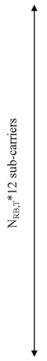

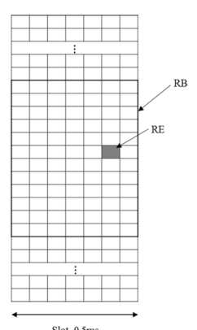

The scheduling unit in the time domain is one sub-frame. A physical resource block (PRB) pair is defned as the two physical resource blocks in one sub-frame having the same frequency position. For the downlink and uplink localized transmission, the resource allocation unit is a physical resource block pair; that is, the same resource blocks in the two slots within one sub-frame are allocated. However, for the downlink distributed transmission or uplink transmission with intra-subframe frequency hopping, the allocated resource blocks for a certain UE in the two slots of one sub-frame are different.

## 2.3.4 Physical Channel Defnition

A downlink physical channel is defned as a set of resource elements carrying information originating from higher layers [3]. The following downlink physical channels are defned:
- Physical Downlink Shared Channel, PDSCH - Physical Broadcast Channel, PBCH - Physical Multicast Channel, PMCH - Physical Control Format Indicator Channel, PCFICH - Physical Downlink Control Channel, PDCCH - Physical Hybrid ARQ Indicator Channel, PHICH
The information from higher layer is carried on the channels defned in higher layer including logical channels and downlink transport channels. The mapping from higher layer channels to physical channels is given in Fig. 2.9 [11].

The following uplink physical channels are defned [3, 11] (Fig. 2.10):
- Physical Uplink Shared Channel, PUSCH

 - Physical Uplink Control Channel, PUCCH - Physical Random Access Channel, PRACH

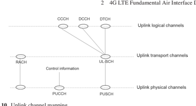

## 2.4 **Reference Signal**

Reference signal refers to the so-called pilot signal used for channel estimation by the receiver. Specifcally in LTE, a reference signal is a predefned signal transmitted over a set of predefned resource elements in a resource grid. The concrete purpose of the estimated channel depends on the defnition of the corresponding reference signal. From the receiver perspective, the reference signal is utilized to obtain estimates of the channel of the resource grid conveying it, and therefore the channel of symbols conveyed on the same resource grid can be inferred from the derived channel. Each reference signal is associated with one antenna port.

## 2.4.1 Downlink Reference Signals

Downlink reference signals are used for downlink channel measurement and/or coherent demodulation of downlink transmission. The following reference signals are defned in downlink [3]:

- Cell-specifc reference signal (CRS) - UE-specifc reference signal (DM-RS) - CSI reference signal (CSI-RS) - Discovery reference signal (DRS) - MBSFN reference signal - Positioning reference signal

## 2.4.1.1 **Cell-Specifc Reference Signal**

The CRS is a basic signal defned in Release-8 and is used by UEs accessing LTE network. The demodulation of PBCH, PDCCH/PCFICH/PHICH, and PDSCH in transmission mode (TM) 1–6 [12] uses the channel estimation based on  the CRS. When precoding is used for PDSCH transmission in case of multiple CRS, the used precoding matrices for PDSCH are signaled in downlink control information 
(DCI). The UE utilizes the estimated channel from the CRS and the signaled precoding matrices to generate the equivalent channel for coherent demodulation of PDSCH. The CRS is also used to derive the channel state information (CSI) in the form of CQI/RI/PMI for PDSCH scheduling in TM 1–8. In addition, the CRS can be used for both synchronization tracking after initial synchronization by PSS/SSS and RRM measurement for cell selection.

The CRS is transmitted in all downlink sub-frames for frame structure type 1, and all downlink sub-frames and DwPTS for frame structure type 2. In the normal subframe, the CRS is distributed over the two slots within one sub-frame. Futhermore, the CRS is only transmitted in the frst two OFDM symbols of MBSFN sub-frame and is defned for 15 kHz subcarrier spacing only. The number of CRS in one cell can be one, two, and four, which corresponds to one, two, and four antenna ports. The CRS antenna ports are named as antenna port 0, 1, 2, and 3. The structure of the CRS in one resource block pair in case of normal cyclic prefx is illustrated in Fig. 2.11 [3]. The CRS spans over the whole system bandwidth in its located OFDM symbol. It is noted that the frequency position of different CRS in Fig. 2.11 is relative.

For each CRS port, the distance between two adjacent reference signals in one OFDM symbol is 6 REs, and the starting position of the CRS has 6 frequency shifts. 

The frequency shift is cell specifc, which is obtained by performing *Ncell ID* mod 6. Ncell ID is the cell ID index selected from [0, 503], where there are 504 cell IDs defned. The frequency shift is to enable the adjacent cells to avoid the CRS intercell interference. The CRS for antenna port 0/1 is located at the frst and ffth OFDM 

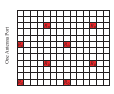

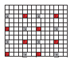

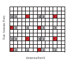

symbols of one slot in a staggered manner; however, the CRS for antenna port 2/3 is only located in the second OFDM symbol of each slot in order to reduce the overhead of reference signal. The CRS overhead in case of two antenna ports is 16/168 = 9.52%, and it would be 19.05% if assuming the same density applied for antenna ports 2 and 3 in case of 4 antenna ports which is too high. The lower density of antenna port 2/3 may degrade the channel estimation performance at very high velocity.

The reference signal of antenna ports 0 and 1 is separated by FDM. The resource elements on antenna port 0 are not used for transmission when these resource elements correspond to the positions of the reference signal of antenna port 1. The power of the resource elements not used for transmission can be transferred to the resource elements of reference signal within the same OFDM symbol, which can improve the channel estimation performance. This is applied for antenna ports 2 and 3 as well.

In addition to using the CRS for CSI measurement and coherent demodulation of physical channels, the CRS is also used for measurement for cell selection/reselection and cell handover. CRS port 0 is used for determining reference signal received power (RSRP), and CRS port 1 can be optionally used depending on whether the UE can reliably detect if CRS port 1 is available. RSRP is defned as the linear average over the power contributions (in [W]) of the resource elements that carry cellspecifc reference signals within the considered measurement frequency bandwidth 
[13]. The network makes the decision whether to perform cell selection/reselection or cell handover based on the reported RSRP and another parameter, the reference signal received quality (RSRQ) [13].

## 2.4.1.2 **Ue-Specifc Reference Signal**

UE-specifc reference signal1 is used for demodulation of PDSCH in TM 7–10 [12]. 

The UE-specifc reference signal is only present in the scheduled resource blocks of the PDSCH transmission. For the UE-specifc reference signal-based PDSCH transmission, the used precoding matrix for PDSCH is transparent to UE and, hence, the signaling in DCI is not needed. As the UE does not have the information on how the precoding matrix is used over different resource blocks, it cannot perform channel interpolation among different scheduled resource blocks. In order to balance the precoding gain and channel estimation performance loss, PRB bundling is supported in TM9 and it is assumed that the same precoding matrix is applied in precoding resource block groups (PRGs). The PRG size depends on the system bandwidth; see Table 2.3 [12].

UE-specifc reference signal-based PDSCH transmission TM7 was frst introduced in Release-8, which only supports single-layer beamforming. The defned UE-specifc reference signal corresponds to antenna port 5 shown in Fig. 2.12 [12].

Table 2.3 PRG size

| System bandwidth (number of PRBs)   | PRG size (number of PRBs)   |
|-------------------------------------|-----------------------------|
| ≤10                                 | 1                           |
| 11–26                               | 2                           |
| 27–63                               | 3                           |
| 64–110                              | 2                           |

Fig. 2.12 Structure of antenna port 5 with normal cyclic prefx

In Release-9, TM8 was introduced to support dual-layer beamforming and two new reference signals were defned corresponding to antennas 7 and 8 in Fig. 2.13. Due to the support of backward compatibility, the introduced UE-specifc reference signal shall avoid the collision with cell-specifc reference signal, PDCCH and PBCH/PSS/SSS. The position is located at the last two OFDM symbols of each slot within one sub-frame. There are 12 REs for each UE-specifc reference signal in one resource block pair. The two UE-specifc reference signals occupy the same resource elements but are separated by code division multiplexing (CDM). The two codes [+1 +1 +1 +1] and [+1 –1 +1 –1] spanning in the time domain are used for antenna ports 7 and 8, respectively. The designed UE-specifc reference signal in TM8 supports the dynamic switching between SU-MIMO and MU-MIMO. The MU-MIMO 
transmissions are transparent to UE; that is, SU-MIMO operation is always assumed from the UE perspective. There are two candidate predefned sequences for the reference signal in TM8, and the two sequences are quasi-orthogonal. For each of the predefned sequences, the generated UE-specifc reference signals corresponding to antenna ports 7 and 8 are orthogonal to each other; however, the UE-specifc reference signals generated from the two predefned sequences are quasi-orthogonal. 

Which sequence is used for the UE-specifc reference signal of a certain UE is indicated by DCI. Hence, it can support up to 4 UEs for MU-MIMO in TM8.

In Release-10, TM9 was introduced to support up to eight-layer transmission based on UE-specifc reference signal and thus up to eight UE-specifc reference signals need to be defned. The UE-specifc reference signals are extended from antenna ports 7 and 8 by extending the number of orthogonal cover code (OCC) from 2 to 4 and the number of resource elements from 12 to 24. The corresponding antenna ports are 7, 8, 9, 10, 11, 12, 13, and 14. For each group of 12 resource elements, there are 4 antenna ports which are separated by 4 codes. The mapping between the antenna port and the OCC code is shown in Table 2.4. The mapping of UE-specifc reference signal for antenna ports 7,8, 9, and 10 in case of normal cyclic prefx is illustrated in Fig. 2.14.

## 2.4.1.3 **Csi Reference Signal**

CSI reference signal is used for measuring the channel state information, which was introduced in LTE Release-10 and applicable for both TM9 and TM10. To increase the peak data rate, eight-layer transmission support was a requirement for Release-10 development. Extending the methodology of CRS antenna ports 0/2/4 design for 8 antenna ports is ineffcient and complicated. First, the resource overhead of 8 CRS ports would not be acceptable. As described in Sect. 2.4.1.1, the overhead of 4 CRS antenna ports is already 14.28% and the overhead of 8 antenna ports may be about 30%. Furthermore, in a practical network, the number of UEs operating larger than rank 4 transmission is small. Second, due to the requirement of backward compatibility, the legacy UEs operating in LTE Release-8 are required to work in LTE 
Release-10 and the legacy CRS antenna ports have to be presented in Release-10 network. It would be complicated for the newly defned 8 antenna ports and the legacy CRS antenna ports to coexist. These considerations necessitated a new methodology for reference signal design that is different from the CRS design. The functionalities of reference signal including channel measurement and demodulation are performed by the CSI reference signal and UE-specifc reference signal separately. The UE-specifc reference signal is described in Sect. 2.4.1.2.

Table 2.4 The mapping between antenna port and OCC code

R7R7 *R7R7* R8 R8 R8 R8

| Antenna port   | OCC code      |      |    |
|----------------|---------------|------|----|
| 7              | [+1  + 1  + 1 | + 1] |    |
| 8              | [             | ]    |    |
| +              | −             | +    |    |
| 1              | 1             | 1 −1 |    |
| 9              | [             | ]    |    |
| +              | +             | +    |    |
| 1              | 1             | 1    | +1 |
| 10             | [             | ]    |    |
| +              | −             | +    |    |
| 1              | 1             | 1 −1 |    |
| 11             | [             | ]    |    |
| +              | +             |      |    |
| 1              | 1 −           | −    |    |
| 1              | 1             |      |    |
| 12             | [             | ]    |    |
| −              | −             | +    |    |
| 1              | 1             | 1+1  |    |
| 13             | [             | ]    |    |
| +              | −             | −    |    |
| 1              | 1             | 1+1  |    |
| 14             | [             | ]    |    |
| −              | +             | +    |    |
| 1              | 1             | 1 −1 |    |

Antenna Port 7 Antenna Port 8 Antenna Port 9 Antenna Port 10
Although the CSI reference signal is introduced because of supporting eightlayer transmission, the CSI reference signal is also defned for 1, 2, and 4 antenna ports in Release-10. The CSI reference signal is transmitted on one, two, four, or eight antenna ports, and the corresponding antenna ports are 15, 15/16, 15/16/17/18, and 15/16/17/18/19/20/21/22, respectively. As the CSI reference signal is only for channel measurement, low-density CSI reference signal is desired to reduce the overhead. Optimizing the trade-off between CSI reference signal overhead and channel measurement performance, the transmission of each CSI reference signal is wideband and the average number of RE per port in one resource block pair is 1 in the frequency domain. The periodicity in the time domain is confgurable with values of 5, 10, 20, 40, and 80 sub-frames.

The CSI reference signals in one resource block pair are multiplexed by CDM or hybrid FDM and TDM. Each CSI reference signal spans over two consecutive REs in the time domain, and the two consecutive REs can convey two CSI reference signals multiplexed by CDM. The two OCC codes are [+1 +1] and [+1 –1], respectively. The locations of CSI reference signal should avoid collisions with the CRS, 
UE-specifc reference signal, positioning reference signal, PDCCH, PBCH, and PSS/SSS. There are 40 REs reserved for CSI reference signal in one resource block pair for both frame structure type 1 and type 2, which correspond to 20, 10, and 5 CSI reference signal confgurations for the number of CSI reference signals being 1 or 2, 4, and 8, respectively. The CSI reference signal confgurations for different number of CSI reference signals applicable for both frame structure type 1 and type 2 in case of normal cyclic prefx are illustrated in Fig. 2.15, where the resource elements marked by the same color correspond to one CSI reference signal confguration and the number represents the index of CSI reference signal confguration; the resource elements marked with grey and "x" represent the positions of CRS or UE-specifc reference signal. In addition, there are additional 12, 6, and 3 CSI reference signal confgurations corresponding to a number of 1 or 2, 4, and 8 CSI reference signals defned for frame structure type 2 only [3].

The number of CSI reference signal and the corresponding CSI reference signal confguration are confgured by higher layer in a UE-specifc manner. The CSI reference signals within a CSI reference signal confguration are multiplexed by CDM 
and FDM, where the four pairs of antenna ports 15/16, 17/18, 19/20, and 21/22 are multiplexed by FDM and the two antenna ports of each pair are code multiplexed. Figure 2.16 takes CSI reference signal confguration 0 as an example to illustrate the CSI reference signal of different antenna ports.

As the CSI reference signal is a wideband transmission, it may collide with the resource blocks scheduled for Release-8 legacy UEs. In this case, data puncturing is performed for Release-8 legacy UEs. Since the base station knows the CSI reference signal confguration and Release-8 legacy UEs' scheduling, the impact of data puncturing on the legacy UEs can be mitigated by the scheduling and link adaption. For the Release-10 and later release UEs, rate matching is operated around the CSI 

 

reference signal. Due to the UE-specifc CSI reference signal confguration, a UE 
does not know the confgured CSI reference signal of other UEs and therefore cannot do rate matching around the confgured CSI reference signal. To enable the rate matching, a zero-power CSI reference signal confguration is signaled to a UE and the UE assumes zero-power transmission in these resource elements. The zeropower CSI reference signal confguration reuses the CSI reference signal confguration of four CSI reference signals. The CSI reference signal confgurations for which the UE shall assume zero transmission power in a sub-frame are given by a 16-bit bitmap. For each bit set to one in the 16-bit bitmap, the UE shall assume zero transmission power for the resource elements corresponding to the CSI reference signal confguration.

The number of antenna ports was extended to 12, 16, 20, 24, 28, and 32  in Release-13 and -14 in the context of supporting full-dimension MIMO (FD-MIMO) [14, 15]. The indices for 12, 16, 20, 24, 28, and 32 antenna ports are labeled as p = 15,…, 26, p = 15,…, 30, p = 15,…, 34, p = 15,…, 38, p = 15,…, 44, p = 15,…, 38, and p = 15,…, 46, respectively. In case the number of antenna ports is larger than 8, the corresponding CSI reference signals are generated by aggregating Nres CSI > 1 CSI reference signal confgurations within one sub-frame. The number of antenna ports *NCSIres* ports per CSI reference signal confguration is 4 or 8. Although 2 antenna ports per CSI reference signal confguration is the most fexible confguration for aggregation, it will result in signifcant number of confgurations to increase signaling overhead and confguration complexity. The supported confgurations of aggregated CSI-RS confgurations are shown in Table 2.5.

The resource elements in one resource block pair corresponding to each aggregated CSI reference signal confguration with 4 or 8 antenna ports are same as shown in Fig. 2.15. In the case of CDM where OCC = 2 is used, each reference signal spans over two resource elements and the two reference signals multiplexed on the two same resource elements are separated by [+1 +1] and [+1 –1], which is shown in Fig. 2.16. When CDM OCC = 4 is applied, each reference signal spans over four resource elements within one resource block pair and is separated by 
[+1 +1 +1 +1], [+1 –1 +1 –1], [+1 +1 –1 −1], and [+1 –1 −1 +1]. An example of CSI 
reference signal confguration 0 with 4 and 8 antenna ports in the case of CDM OCC = 4 is illustrated in Figs. 2.17 and 2.18, respectively.

The mapping between the antenna ports of one CSI reference signal confguration and the code of OCC = 4 is provided in Tables 2.6 and 2.7.

| Total number of antenna   | Number of antenna ports per CSI-RS   | Number of CSI-RS   |     |
|---------------------------|--------------------------------------|--------------------|-----|
| CSI                       | ports                                | ports              | CSI |
| ports N                   | N                                    |                    |     |
| res                       | confguration NCSIres                 | confgurations Nres |     |
| CSIres                    |                                      |                    |     |
| 12                        | 4                                    | 3                  |     |
| 16                        | 8                                    | 2                  |     |
| 20                        | 4                                    | 5                  |     |
| 24                        | 8                                    | 3                  |     |
| 28                        | 4                                    | 7                  |     |
| 32                        | 8                                    | 4                  |     |

Fig. 2.17 CSI reference signal confguration 0 with 4 antenna ports (CDM OCC  =  4, normal cyclic prefx)
R22 R22 R22 R22 R21 R21 R21 R21 R20 R20 R20 R20 R19 R19 R19 R19 Fig. 2.18 CSI reference signal confguration 0 with 8 antenna ports (CDM OCC  =  4, normal cyclic prefx)

| Table 2.6       | OCC code assignment for one CSI reference signal confguration with 4 antenna ports   |    |    |    |
|-----------------|--------------------------------------------------------------------------------------|----|----|----|
| REs             | [w(0) w(1) w(2) w(3)]                                                                |    |    |    |
| Antenna port 15 | +1                                                                                   | +1 | +1 | +1 |
| 16              | +1                                                                                   | −1 | +1 | −1 |
| 17              | +1                                                                                   | +1 | −1 | −1 |
| 18              | +1                                                                                   | −1 | −1 | +1 |

Table 2.7 OCC code assignment for one CSI reference signal confguration with 8 antenna ports

| REs   | [w(0) w(1) w(2) w(3)]   | [w(0) w(1) w(2) w(3)]   |    |    |
|-------|-------------------------|-------------------------|----|----|
| AP 15 | +1                      | +1                      | +1 | +1 |
| 16    | +1                      | −1                      | +1 | −1 |
| 17    | +1                      | +1                      | +1 | +1 |
| 18    | +1                      | −1                      | +1 | −1 |
| 19    | +1                      | +1                      | −1 | −1 |
| 20    | +1                      | −1                      | −1 | +1 |
| 21    | +1                      | +1                      | −1 | −1 |
| 22    | +1                      | −1                      | −1 | +1 |

When CDM OCC = 8 is applied, each reference signal spans over eight resource elements within one resource block pair and is separated by the code with length equal to 8. It should be noted that CDM OCC = 8 is only applicable for 32 and 24 antenna ports. For the case of CDM OCC = 8 and the number of antenna ports equal to 32, the aggregated 4 CSI reference signal confgurations with 8 antenna ports each are restricted to one of {0, 1, 2, 3}, or {0, 2, 3, 4}, or {1, 2, 3, 4}; for the number of antenna ports equal to 24, the aggregated 3 CSI reference signal confgurations with 8 antenna ports each are restricted to {1, 2, 3}. The aggregated CSI 
reference signal confgurations can be found in Fig. 2.15. The OCC code assignments for different antenna ports in case of 32 and 24 antenna ports are illustrated in Tables 2.8 and 2.9, respectively.

For the number of antenna ports larger than 8, the total number of antenna ports equals Nres N CSICSIres ports which are labeled as p Nres N CSI*CSIres* ports = … 15, , 16 15 + −1. The number of antenna ports per CSI reference signal confguration is *NCSIres* ports , and the antenna ports are indexed as p N ′ = … + − *CSIres* ports 15, , 16 15 1. The relation between p and p′ is [3],
if CDM OCC = 2:

$$p=\left\{\begin{array}{ccc}p^{\prime}+\dfrac{N_{\mathit{CSI\,res}}^{\mathit{pous}}}{2}\,i&p^{\prime}\in\left\{15,16,\ldots,15+\dfrac{N_{\mathit{CSI\,res}}^{\mathit{pous}}}{2}-1\right\}\\ p^{\prime}+\dfrac{N_{\mathit{CSI\,res}}^{\mathit{pous}}}{2}\left(i+N_{\mathit{res}}^{\mathit{CSI}}-1\right)&p^{\prime}\in\left\{15+\dfrac{N_{\mathit{CSI\,res}}^{\mathit{pous}}}{2},\ldots,15+N_{\mathit{CSI\,res}}^{\mathit{pous}}-1\right\}\\ i\in\left\{0,1,\ldots N_{\mathit{res}}^{\mathit{CSI}}-1\right\}\end{array}\right.$$

| 1st aggregated  CSI reference  signal  confguration                             |
|---------------------------------------------------------------------------------|
| REs of each antenna port in  the aggregated CSI reference  signal confgurations |

15 17 19 21 +1 +1 +1 +1 +1 +1 +1 +1

16 18 20 22 +1 −1 +1 −1 +1 −1 +1 −1

23 25 27 29 +1 +1 −1 −1 +1 +1 −1 −1

24 26 28 30 +1 −1 −1 +1 +1 −1 −1 +1 31 33 35 37 +1 +1 +1 +1 −1 −1 −1 −1

32 34 36 38 +1 −1 +1 −1 −1 +1 −1 +1

39 41 43 45 +1 +1 −1 −1 −1 −1 +1 +1 40 42 44 46 +1 −1 −1 +1 −1 +1 +1 −1

| 2nd aggregated  CSI reference  signal  confguration   |
|-------------------------------------------------------|

| 4th aggregated  CSI reference  signal  confguration   |
|-------------------------------------------------------|

| 3rd aggregated  CSI reference  signal  confguration   |
|-------------------------------------------------------|

| REs of each antenna port in the aggregated  CSI reference signal confgurations   | [w(0) w(1) w(2) w(3) w(4) w(5) w(6) w(7)]   |           |           |           |           |           |           |           |    |    |
|----------------------------------------------------------------------------------|---------------------------------------------|-----------|-----------|-----------|-----------|-----------|-----------|-----------|----|----|
| CSI-RS                                                                           | CSI-RS                                      | CSI-RS    | CSI-RS    | CSI-RS    | CSI-RS    | CSI-RS    | CSI-RS    | CSI-RS    |    |    |
| Config. 1                                                                        | Config. 2                                   | Config. 3 | Config. 1 | Config. 2 | Config. 3 | Config. 1 | Config. 2 | Config. 3 |    |    |
| 15                                                                               | 31                                          | 25        | +1        | +1        | +1        | +1        | +1        | +1        | +1 | +1 |
| 16                                                                               | 32                                          | 26        | +1        | −1        | +1        | −1        | +1        | −1        | +1 | −1 |
| 19                                                                               | 35                                          | 29        | +1        | +1        | −1        | −1        | +1        | +1        | −1 | −1 |
| 20                                                                               | 36                                          | 30        | +1        | −1        | −1        | +1        | +1        | −1        | −1 | +1 |
| 23                                                                               | 17                                          | 33        | +1        | +1        | +1        | +1        | −1        | −1        | −1 | −1 |
| 24                                                                               | 18                                          | 34        | +1        | −1        | +1        | −1        | −1        | +1        | −1 | +1 |
| 27                                                                               | 21                                          | 37        | +1        | +1        | −1        | −1        | −1        | −1        | +1 | +1 |
| 28                                                                               | 22                                          | 38        | +1        | −1        | −1        | +1        | −1        | +1        | +1 | −1 |

else

$p=p^{\prime}+N_{\text{CStress}}^{\text{ports}}i\quad p^{\prime}\in\left\{15,16,...,15+N_{\text{CStress}}^{\text{ports}}-1\right\}$  $$i\in\left\{0,1,...N_{\text{res}}^{\text{CSI}}-1\right\}$$
end.

For each CSI reference signal confguration using CDM OCC = 2, the set of 

 ### 54 Teacher's sigma  $p'=15,16,\ldots,15$ . 
antenna ports p′ = … + −
$N_{\text{C}}^{\text{parts}}-1$ and $p^{\prime}=15+\frac{N_{\text{C}}^{\text{parts}}}{2},...,15+N_{\text{C}}^{\text{parts}}$
15 16 152 , , , 1 and p′ = + … + − NN CSIres ports 152 , ,15 1 represent the antenna ports corresponding to two different polarizations in case of cross-polarization antenna confguration. Hence, the mapping between p and p′ can enable the overall antenna ports:

enlobe the overall antenna PMS.  $p=15,16,\ldots,15+\frac{N_{\text{CNT}}^{\text{PWN}}N_{\text{rc}}^{\text{CSI}}}{2}-1$ and $p=15+\frac{N_{\text{CNT}}^{\text{PWN}}N_{\text{rc}}^{\text{CSI}}}{2},\ldots,15+N_{\text{CIS}}^{\text{PWN}}N_{\text{rc}}^{\text{CSI}}-1$ represent two different polarizations.  

## 2.4.1.4 **Discovery Signal**

Discovery signal was introduced in Release-12 for small cell deployment scenario. In order to mitigate the interference between small cells and save energy, adaptive cell on/off that is adaptive with traffc load was defned [16]. Discovery signal is used to facilitate the fast and effcient discovery of small cells, which can reduce the transition time.

The discovery signal is transmitted in the downlink sub-frame(s) or DwPTS 
region of special sub-frame. A discovery signal consists of primary synchronization signal (PSS)/secondary synchronization signal (SSS), CRS port 0, and confgurable CSI-RS. The period of a discovery signal occasion for a cell can be confgured. The period can be 1–5 consecutive sub-frames for frame structure type 1 and 2–5 consecutive sub-frames for frame structure type 2. The periodicity of the discovery signal occasion is confgured by higher layer parameter.

During the period of a discovery signal occasion, PSS is in the frst sub-frame of the period for frame structure type 1 or the second sub-frame of the period for frame structure 2, SSS is in the frst sub-frame of the period, CRS port 0 is in all downlink sub-frames and in DwPTS of all special sub-frames in the period, and the CSI-RS is confgured in some sub-frames within the period if there is.

## 2.4.1.5 **Other Downlink Reference Signals**

In addition to the reference signals described above, there are some other downlink reference signals in LTE, including MBSFN reference signal which are only applicable for PMCH transmission, positioning reference signal for positioning, demodulation reference signals associated with EPDCCH, etc. Due to space limitations, these reference signals will not be discussed here and the details can be found in [3].

## 2.4.2 Uplink Reference Signals

Similar to the downlink reference signal, uplink reference signals are used for coherent demodulation and uplink channel measurement. In the downlink, the reference signal can be common for all the UEs in a broadcast manner, e.g., CRS; however, for uplink the reference signals are UE specifc. Two types of uplink reference signals are supported: - Uplink demodulation reference signal (DM-RS) - Sounding reference signal (SRS)

## 2.4.2.1 **Uplink Demodulation Reference Signal**

Uplink DM-RS is used for channel estimation by the base station to perform coherent demodulation of PUSCH and PUCCH. There are two types of DM-RS; one type is associated with the PUSCH and the other with the PUCCH transmission. For DM-RS, only single-antenna port is supported for PUSCH and PUCCH transmission in Release-8. In Release-10, it is extended to support 2 and 4 antenna ports for PUSCH transmission and 2 antenna ports for PUCCH transmission. The maximum number of DM-RS ports for PUSCH or PUCCH transmission is confgured by higher layer in a UE-specifc manner. The DM-RS antenna port labeling for PUSCH and PUCCH transmission is summarized in Table 2.10 [3].

DM-RS is described starting from single-antenna port transmission for simplicity and then extended to the case with multiple-antenna port transmission. As it is required to have low cubic metric transmission in uplink, DM-RS and data are time multiplexed in the assigned resource block(s) within one slot to preserve the single carrier property. DM-RS spans the same bandwidth as data in the frequency domain to estimate the channel of data transmission. For PUSCH, DM-RS is transmitted in the fourth OFDM symbol of the scheduled resource blocks within one slot and the remaining 6 OFDM symbols are used for data. The PUCCH transmission is constrained to one resource block. The multiplexing of PUCCH DM-RS and data in the resource block depends on PUCCH format; for example, for PUCCH format 1/1a/1b, the third, fourth, and ffth OFDM symbols in one resource block are used for DM-RS transmission. The multiplexing of DM-RS and data is illustrated in Fig. 2.19.

Different from downlink reference signal, the uplink DM-RS sequence shall have constant amplitude in both frequency and time domain. The constant amplitude of DM-RS sequence in the frequency domain is for obtaining the evenly estimated channel performance over different subcarriers. The constant amplitude in the time domain is to keep low cubic metric. However, due to oversampling in IFFT operation, there would be some amplitude variation in the time domain but still with low cubic metric. In addition, it is also desirable that the DM-RS sequence have zero autocorrelation for optimizing the channel estimation and low cross-correlation property to mitigate inter-cell interference.

| Maximum number of antenna ports confgured 1 2 4   |     |     |    |
|---------------------------------------------------|-----|-----|----|
| PUSCH                                             | 10  | 20  | 40 |
| -                                                 | 21  | 41  |    |
| -                                                 | -   | 42  |    |
| -                                                 | -   | 43  |    |
| PUCCH                                             | 100 | 200 | -  |
| 201                                               | -   |     |    |

Zadoff-Chu (ZC) sequence was, therefore, selected as the uplink DM-RS 
sequence because of its good auto- and cross-correlational properties [17]. ZC sequence is defned by

$$x_{q}\left(m\right)=e^{-j{\frac{\pi q m\left(m+1\right)}{N_{2C}^{E S}}}}\quad0\leq m\leq N_{2C}^{E S}-1$$

where NZC
RS is the length of ZC sequence and q represents the qth root ZC sequence. 

For a certain ZC sequence length NZC
RS, the number of available root sequence equals to the number of integers being relative prime to NZC
RS. That is to say the number of root sequence if the ZC sequence length is a prime number is maximized. More root sequences for a certain length means that different root sequences can be allocated to more different cells to mitigate inter-cell interference. For this reason, ZC sequence length is selected to be prime number in LTE.

DM-RS sequence spans the same bandwidth as PUSCH. The bandwidth of PUSCH depends on the number of assigned consecutive resource blocks, i.e., 
Msc = 12 ∗ NRB, where NRB is the number of scheduled resource blocks. The length of DM-RS sequence is equal to Msc. As the ZC sequence length is a prime, a ZC sequence with length close to Msc can be extended or truncated to generate the DM-RS sequence. The method of ZC sequence cyclic extension is adopted because of better cubic metric property [18]. The length NZC
RS of the ZC sequence is determined as the largest prime number being smaller than Msc. Then the ZC sequence is extended to generate the DM-RS base sequence equal to Msc by

$$1\leq M_{s c}-1$$

## Ru V N Xq Z N N C N M Rs , Mo Sc ( ) = ( ) D , 0 1 ≤ ≤ −

There are multiple base sequences corresponding to each possible scheduled bandwidth. The base sequences are divided into 30 groups with u ∈ {0, 1, …, 29} 
denoting the group number. The relationship between the group number u and the qth root sequence can be found in [3]. In each group, it is comprised of the base sequences with different lengths corresponding to different scheduled bandwidth NRB. The number of base sequences for each length in one group depends on the scheduled bandwidth NRB. When 1 ≤ NRB ≤ 2, the number of available base sequences of length Msc = 12 ∗ NRB is less than 30 because the length of ZC root sequence is smaller than 30. Consequently, it is not possible for each group to have one base sequence of such length. Instead, computer search generation method is used to generate 30 groups of base sequences of length Msc = 12 ∗ NRB, 1 ≤ NRB ≤ 2 in the form of ru(n)  =  ejφ(n)π/4, 0 ≤ n ≤ MSC −  1, where φ(n) is defned in [3]. As PUCCH transmission is constrained within one resource block, DM-RS sequence for PUCCH will use the computer search sequences. The length NZC
RS of ZC sequence is larger than 30 when 3 ≤ NRB which allows for the generation of more than 30 base sequences for each length of Msc. In this case, each group contains one base sequence 
(v = 0) of each length Msc = 12 ∗ NRB, 3 ≤ NRB ≤ 5 and two base sequences (v = 0, 1) of each length Msc = 12 ∗ NRB, 6 ≤ NRB.

The DM-RS is located at the same position among different cells, which may cause serious inter-cell interference if the DM-RS base sequences are not assigned well. The base sequences are grouped to mitigate the inter-cell interference. The base sequences of each length are assigned to the different group, and one group is comprised of the base sequences with different lengths. Each cell is associated with one group. In this case, the DM-RS interference between the cells using different groups can be mitigated because of low cross-correlation property of ZC sequence. As there are only 30 base sequence groups, it can only enable 30 cells to associate with different base sequence groups. In case of 504 cells with different cell IDs, each base sequence group will be reused by 17 cells. Clearly two cells associated with the same base sequence group will result in very serious interference. This situation is solved by cell planning; that is, the adjacent cells are planned to associate different base sequence groups. This method can avoid the adjacent cells using the same base sequence group, but it is infexible and complicated because all the cell IDs need to be updated once a new cell is added in the network. Another method is to introduce base sequence group hopping over different time instances; that is, the base sequence group of one cell varies over different slots to randomize the inter-cell interference.

There are 17 different hopping patterns and 30 different sequence shift patterns. 

The base sequence group number u is determined by

## U F N F = ( ) Gh ( )S S + S Mod30

The sequence group hopping can be enabled or disabled by the cell-specifc higher layer parameter. The sequence group hopping pattern is generated by a pseudorandom sequence and the pseudorandom sequence generator is initialized with NcellID
30
. There will be 30 cells associated with each sequence group hopping pattern. 

Then 30 sequence shift patterns associated with the 30 cells are used to generate different base sequence group numbers. The sequence shift pattern fss defnition differs between PUSCH and PUCCH. The sequence shift patterns for PUSCH and PUCCH are provided by fss = (Ncell ID + Δss) mod 30, *where* Δss ∈ {0, 1, …, 29} and fss = Ncell ID mod 30, respectively. Here TM10 uplink CoMP is not assumed; otherwise the physical cell ID *Ncell ID* can be replaced by a higher confgured virtual cell ID. The detail can be found in [3].

In one cell, when the UEs are scheduled in different resource blocks for PUSCH 
transmission, the corresponding DM-RS base sequences from the same group are transmitted in FDM which are orthogonal to each other. However, when uplink multiuser MIMO or virtual MIMO is applied, multiple users are scheduled on the same resource blocks to transmit simultaneously. For PUCCH, multiple users are multiplexed by CDM in one resource block. In this case, the DM-RS sequences of different UEs need to be orthogonal. Since the DM-RS base sequences have the zero autocorrelation property, the cyclic shift of the base sequence in the time domain can be assigned to different UEs. The length of cyclic shift shall be larger than the delay spread in order to differentiate different UEs. With the cyclic prefx length selected to be larger than the delay spread, the cyclic shift length can be determined to be larger than the cyclic prefx. Based on such considerations, it can support a maximum of 12 cyclic shifts. The cyclic shift in the time domain is equal to the phase shift in the frequency domain. The phase shift of base sequence is given by

$$r_{u,v}^{\alpha}\left(n\right)=e^{j\alpha n}r_{u,v}\left(n\right),0\leq n\leq M_{s c}-1$$
e of $n_{\mathrm{c}}$ is 
where $\alpha=\frac{2\pi n_{\alpha}}{12},n_{\alpha}\in\{0,1,...11\}$. The 
0 1 11 n n cscs , , , . The value of ncs is signaled by DCI for PUSCH 
and higher layer confgured for PUCCH. The detail of signaling can be found in [19].

In Release-10, uplink multiple-antenna transmission is introduced to support up to four-layer PUSCH transmission. It is needed to defne up to 4 DM-RS and each DM-RS is associated with one layer. Similar to uplink virtual MIMO, the cyclic shifts of the base sequence can be used for different layers. In addition, orthogonal cover code (OCC) in time domain is also used to generate two-dimension DM-RS. The OCC codes [+1 + 1] and [−1–1] are used for the DM-RS in the two slots of one sub-frame as shown in Fig. 2.20. As there are 12 cyclic shifts and 2 OCC codes in time domain, in principle there are up to 24 DM-RS available. The cyclic shift is sensitive to frequency selectivity and the OCC code is sensitive to mobility. To achieve the better orthogonality of the DM-RS corresponding to different layers, there are eight combinations of cyclic shift and OCC codes are defned for up to four layers [3].

## 2.4.2.2 **Uplink Sounding Reference Signal (Srs)**

Uplink sounding reference signal is not associated with PUSCH transmission; that 

 is, there is no need to transmit SRS and PUSCH or PUCCH together. The SRS is used by base station for uplink channel measurement. The channel measurement is for uplink adaptation, uplink scheduling, power control, etc. In addition, the SRS can also be used for downlink beamforming due to channel reciprocity with TDD system.

For SRS, single-antenna port transmission was supported in Release-8, and then up to 4 SRS antenna port transmissions were introduced in Release-10. The number of SRS antenna ports is confgured by higher layer, which can be confgured as 1, 2, and 4. The SRS antenna port number and the number of confgured SRS antenna ports are given in Table 2.11.

## Srs Transmission In Time Domain

The sub-frames used for SRS transmission are confgured by a cell-specifc higher layer parameter, which enables all the UEs in the cell to know the position of the SRS. There are 16 SRS sub-frame confgurations defned for both frame structure type 1 and 2 [3]. An extreme case is that all the uplink sub-frames can be confgured for SRS transmission in the context of high load in the cell. For all the sub-frames other than special sub-frames confgured for SRS, SRS is transmitted in the last symbol of the sub-frame. In the special sub-frames, it supports up to two symbols for SRS transmission before Release-13, and then was extended to support up to 6 symbols for SRS in Release-13 because of the requirement of SRS capacity increase. 

For each UE, a subset of sub-frames within the confgured cell-specifc SRS subframes are confgured for its own SRS transmission. The starting sub-frame and periodicity of SRS transmission for each UE are confgured by a UE-specifc parameter. The location of SRS in time domain is illustrated in Fig. 2.21. In the sub-frames confgured for SRS transmission, PUSCH and PUCCH will not be transmitted in the last symbol to avoid the collision.

## Srs Transmission In Frequency Domain

There is a cell-specifc SRS bandwidth confgured by a cell-specifc parameter which is common for all the UEs in the cell. There are eight cell-specifc SRS bandwidth confgurations for different system bandwidths. For each UE, there is one UE-specifc SRS bandwidth confguration. The UE-specifc SRS bandwidth is in multiples of four resource blocks. There are two methods to transmit SRS which are 

| Table 2.11              | SRS antenna port number   | Number of confgured SRS antenna ports 1 2 4   |    |
|-------------------------|---------------------------|-----------------------------------------------|----|
| SRS antenna port number | 10                        | 20                                            | 40 |
| -                       | 21                        | 41                                            |    |
| -                       | -                         | 42                                            |    |
| -                       | -                         | 43                                            |    |

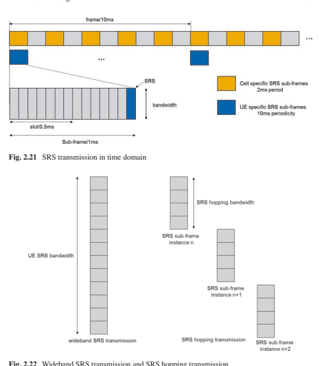

wideband transmission and frequency hopping (Fig. 2.22). The wideband transmission is that the UE transmits the SRS spanning the whole UE-specifc SRS bandwidth in one shot. It can obtain the whole-channel measurement result in one sub-frame. However, the power spectrum density is lower which will degrade the channel estimation performance especially for power-limited UE. Hence, the wideband SRS transmission is useful in the scenarios with good channel condition and the UE power is not limited. In the UE power-limited scenario, SRS frequency hopping can be used; that is, UE transmits SRS in a subset of SRS bandwidth in one shot and spans multiple time instance to obtain the whole-channel measurement result. It can improve the channel estimation performance in each shot, but there is latency to obtain the whole-channel information.

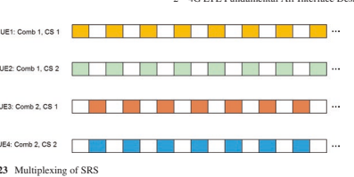

SRS is transmitted in every second subcarrier within the SRS transmission bandwidth in the form of comb transmission. The SRS on the two combs is multiplexed by FDM and the SRS on the same comb is multiplexed by CDM as shown in Fig. 2.23.

If the SRS bandwidth is *MSRS* resource blocks, then the length of SRS sequence is MSC = *MSRS* ∗ 12/2. The SRS sequence is defned by

$$r_{s R S}^{P}\left(n\right)=e^{j\alpha_{p}n}r_{u,v}\left(n\right),0\leq n\leq M_{s c}-1$$

where u is the base sequence group number and v is the sequence number. The determination process of u is same as that with DM-RS, but the difference is that the sequence shift pattern is fss = Ncell ID mod 30. The cyclic shift of SRS is given as

$$\alpha_{_{p}}=2\pi\,\frac{n_{_{C S}}^{p}}{8},n_{_{C S}}^{p}\in\left\{0,1,\ldots7\right\}$$  $$n_{_{C S}}^{p}=\left(n_{_{S S}}^{C S}+\frac{8p}{N_{\mathrm{ap}}}\right)\mathrm{mod}8$$  $$p\in\left\{0,1,\ldots,N_{\mathrm{ap}}-1\right\}$$

where Nap is the number of confgured SRS antenna ports, and *nSRS*
CS ∈{ } 0 1, ,234 , , , , 5 6,7 is the cyclic shift signaled by the higher layer parameter. For the comblike transmission, the signal is a repetition in time domain which reduces the number of available cyclic shifts.

## Aperiodic Srs

In addition to periodic SRS transmission, aperiodic SRS transmission was introduced in Release-10. Since uplink MIMO is supported in Release-10, more SRS 
resources were needed. Given the existing SRS capacity, the periodicity of SRS needs to be increased in order to support multiple antennas. In this case, the channel measurement will not track the channel variation timely due to the longer SRS periodicity especially for high mobility. To obtain accurate channel information, aperiodic SRS is supported. Different from periodic SRS transmission, aperiodic SRS is triggered by uplink grant and not with a higher layer parameter. The confgurations of aperiodic SRS transmission are still higher layer confgured, e.g., the comb, SRS 
bandwidth, and cyclic shift. Once it is triggered, aperiodic SRS is transmitted in the confgured SRS sub-frame immediately after the PDCCH UL grant. With proper aperiodic trigger, the channel variations can be properly tracked.

## 2.5 **Downlink Transmission**

Now that the role of the reference signals is understood, the different physical channels as introduced that are essential to grasp the operation of LTE in Sect. 2.3 can be described in detail. In this section, the transmissions of physical downlink broadcast channel, control channels, and data channel are introduced. There are also some other physical channels including PMCH, EPDCCH, MPDCCH, etc., which will not be discussed here for simplicity.

## 2.5.1 Pbch

Before the UE sets up the connection with a cell, the UE frst acquires the cell synchronization (including time/frequency/frame synchronization and cell ID) based on Primary Synchronization Signal (PSS) and Secondary Synchronization Signal (SSS). Then the UE needs to determine the system information, such as system bandwidth and number of antenna ports. The system information is divided into the Master Information Block (MIB) and a number of *System Information Blocks* (SIBs) [11]. The MIB is transmitted on the PBCH and includes a limited number of the most essential and most frequently transmitted parameters that are needed to acquire the other information from the cell.

The information in the MIB includes [11]:
- Downlink bandwidth: indicates the system (for both downlink and uplink) bandwidth in terms of the number of resource blocks from {6, 15, 25, 50, 75, 100}, 3 bits.

- PHICH confguration: indicates the PHICH resource used to derive the resources for control channel and data channel, 3 bits.

- System frame number (SFN): eight most signifcant bits of SFN are included in the MIB, which indicates the number of the starting frame with PBCH transmission.

- Spare bits: 10 spare bits are reserved.

Since the UE does not know the system information before PBCH detection, the PBCH is transmitted in a predefned position so that the UE can detect it after cell synchronization. The PBCH is located at the central 72 subcarriers (i.e., central 6 resource blocks) of the carrier which is same as that of PSS/SSS, and the frst four consecutive OFDM symbols in slot 1 in sub-frame 0 of each radio frame. The transmission time interval (TTI) of the PBCH is 40 ms (4 consecutive radio frames). 

Consequently, it is transmitted on each radio frame fulflling nf mod 4 = 0. Recalled from the description of the CRS, some of the OFDM symbols within PBCH are for the transmission of the CRS, and therefore rate matching around the CRS is needed when performing resource mapping for PBCH.  However, the number of CRS antenna ports is unknown before PBCH detection. To simplify the UE receiver design, it is assumed that there are always 4 CRS antenna ports for PBCH resource mapping regardless of the actual number of CRS antenna ports. Then the number of available resource elements for PBCH within one TTI is 240*4 = 960. The resource mapping of PBCH is illustrated in Fig. 2.24.

The system designer will need to guarantee that the performance of PBCH transmission is such that all the UEs in the cell can detect the PBCH. As the payload size of PBCH is small with only 40 bits (24 information bits+16 CRC bits), convolutional coding and QPSK modulation are used because of their better performance. 

The rate matching is done by using a 1/3 mother coding rate with repetition to obtain a very low coding rate (40/1920 = ~0.02) for the PBCH, which enables the PBCH in each radio frame within one TTI to be decodable. In addition, transmit diversity scheme space-frequency block coding (SFBC) and SFBC+frequency shift transmit diversity (FSTD) are used in the case of 2 and 4 CRS antenna ports, respectively. The information on the number of CRS antenna ports is embedded in the CRC mask of the PBCH; that is, there are three different CRC masks that correspond to 1, 2, and 4 CRS antenna ports [19]. The number of CRS antenna ports is blindly detected by the UE.

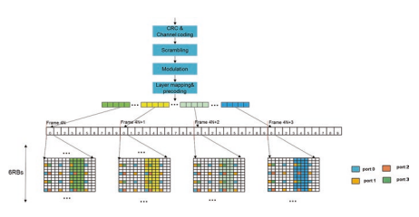

## 2.5.2 Control Channel

The downlink physical control channel and data channel are time multiplexed as shown in Fig. 2.25. Normally, in one sub-frame, the control region is located within the frst *n = 1/2/3* OFDM symbols or *n = 2/3/4* for bandwidth smaller than 10 RBs. 

The maximum number of OFDM symbols in the control region is dependent on sub-frame type [3]. The number of OFDM symbols in the control region is dynamically changing. Time division multiplexing (TDM) of the control region with the data region has the beneft of low latency and power saving for the UE. For example, with TDM, once the UE completes the PDCCH detection, it can immediately start decoding the scheduled data and reduce the waiting time. Furthermore, if the UE detects that there is no PDCCH transmission for it, it can go to micro sleep for power saving. In the control region, three downlink physical control channels PCFICH, PDCCH, and PHICH are transmitted. The function and processing of each downlink physical control channel are described in the following sections.

## 2.5.2.1 **Pcfich**

The function of the PCFICH is to transmit an indicator to the UE of the number of OFDM symbols used for the transmission of the PDCCHs in a sub-frame. Moreover, the starting position of PDSCH can be implicitly derived from the PCFICH transmission. Since the number of OFDM symbols used for PDCCH is dynamically Fig. 2.25 Multiplexing of 

control region and PDSCH (e.g., 3 OFDM symbols)
changing, the PCFICH is always transmitted in the frst symbol of each sub-frame so that the UE knows where to detect it.

To guarantee the reliability of PCFICH detection, three code words with a length of 32 bits are used to represent 1, 2, or 3 (or 2, 3, or 4) OFDM symbols [19]. The 32 bits are modulated to 16 QPSK symbols which are divided into 4 groups. Each group with 4 QPSK symbols is mapped onto one resource element group (REG) 
which is the resource unit for control channel to resource element mapping [3]. There are 6 consecutive resource elements in one REG in the frst OFDM symbol, where two resource elements are reserved for CRS.  The four REGs are almost evenly distributed over the whole bandwidth to achieve frequency diversity shown in Fig. 2.26. In addition, the PCFICH is transmitted on the same set of antenna ports as PBCH. In case of 2 or 4 CRS antenna ports, SFBC or SFBC+FSTD is applied to achieve transmit diversity gain.

As the PCFICH is located as the frst OFDM symbol of each sub-frame for all the cells, it may cause interference between the PCFICH of different adjacent cells. To randomize the interference, cell-specifc scrambling sequence and cell-specifc starting position of the frst REG of PCFICH are used.

## 2.5.2.2 **Pdcch**

The PDCCH transmits downlink control information (DCI) including downlink scheduling assignments, uplink scheduling assignments (i.e., UL grant), and power control information to the UE. A number of DCI formats are defned such as format 0/1/1A/1B/1C/1D/2/2A/2B/2C/3/3A/4, which depends on downlink or uplink scheduling assignment, carried control information (e.g., power control, MCC change), transmission scheme, and payload size. For simplicity, the DCI formats in Release-10 are summarized in Table 2.12. It should be noted that some new DCI formats are introduced after Release-10. These new DCI formats and the detail of the information feld in each DCI format can be found in [19].

A PDCCH is transmitted on an aggregation of one or several consecutive control channel elements (CCE), where one CCE corresponds to 9 REGs and there are 4 available REs per REG. The supported CCE aggregation levels are 1, 2, 4, and 8. The number of CCEs assigned for one PDCCH depends on the channel quality and the payload size of PDCCH. The channel quality is based on the reported CQI from the scheduled UE, and the payload size depends on the DCI format.

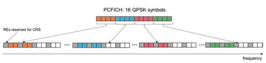

| Table 2.12   | DCI formats         |                                                                 |
|--------------|---------------------|-----------------------------------------------------------------|
| DCI  formats | Control information | Usage of DCI                                                    |
| 0            | Uplink grant        | PUSCH scheduling with one antenna port                          |
| 1            | Downlink            | PDSCH scheduling with one code word                             |
| assignment   |                     |                                                                 |
| 1A           | Downlink            | Compact scheduling of one PDSCH code word                       |
| assignment   |                     |                                                                 |
| 1B           | Downlink            | CRS-based PDSCH with rank 1 precoding                           |
| assignment   |                     |                                                                 |
| 1C           | Downlink            | Very compact scheduling of one PDSCH code word                  |
| assignment   |                     |                                                                 |
| 1D           | Downlink            | CRS-based MU-MIMO                                               |
| assignment   |                     |                                                                 |
| 2            | Downlink            | Closed-loop spatial multiplexing using CRS                      |
| assignment   |                     |                                                                 |
| 2A           | Downlink            | Open-loop spatial multiplexing using CRS                        |
| assignment   |                     |                                                                 |
| 2B           | Downlink            | Dual-layer beamforming with DM-RS                               |
| assignment   |                     |                                                                 |
| 2C           | Downlink            | Up to eight-layer transmission with DM-RS                       |
| assignment   |                     |                                                                 |
| 3            | Power control       | TPC commands for PUCCH/PUSCH with 2-bit power  adjustments      |
| 3A           | Power control       | TPC commands for PUCCH/PUSCH with single-bit power  adjustments |
| 4            | Uplink grant        | Uplink spatial multiplexing                                     |

The number of available CCEs in the system is NCCE = ⌊*NREG*/9⌋ and they are enumerated from 0 to *NCCE* − 1, where *NREG* is the number of REGs not assigned to PCFICH and PHICH; see Sect. 2.5.2.1. When assigning the CCEs for PDCCH, a PDCCH consisting of n consecutive CCEs can only start on a CCE fulflling *i mod n* = 0, where i is the CCE number. In principle, the number of candidate positions in the system for the PDCCH with aggregation level n would be Ln = ⌊*NCCE*/n⌋. Consequently, for aggregation level n, a UE has to blindly detect Ln candidate PDCCH positions. To reduce the complexity of PDCCH blind detection, the number of candidate positions for a PDCCH with aggregation level n is restricted to be a small value and the CCEs of all the candidate positions are required to be consecutive. For example, the numbers of candidate positions for aggregation levels 1, 2, 4, and 8 are 6, 6, 2, and 2, respectively. How to place the PDCCHs on the CCEs to minimize the number of PDCCH blind detection is part of the search space design by the system designer [12].

Given that the PDCCHs to be transmitted in a sub-frame are placed on the CCEs as aforementioned, the block of information bits on each PDCCH is multiplexed. If there is no PDCCH on some CCEs, <NIL> elements are inserted during the multiplexing to enable the PDCCHs to start at the required CCE position. The block of multiplexed bits is scrambled with a cell-specifc scrambling sequence and then modulated to QPSK symbols. The QPSK symbols are grouped into a sequence of symbol quadruplets, where each symbol quadruplet consists of 4 consecutive QPSK 
symbols. Then the sequence of symbol quadruplets is interleaved by using a subblock interleaver [19]. The block of symbol quadruplet output from the interleaver is cyclically shifted, where the cyclic shift size is determined by the physical cell identity. The interleaving can enable CCEs of one PDCCH to be distributed in the frequency domain to take advantage of frequency diversity gain. The cell-specifc scrambling sequence and cell-specifc shift size are provided to the system designer to randomize the inter-cell interference to the PDCCH.

An illustration of REG is given in Fig. 2.27. The cyclically shifted symbol quadruplets are sequentially mapped onto the REGs not assigned to either the PCFICH 
or the PHICH. The mapping is time frst and then going to the frequency domain. The size of REG depends on which OFDM symbol is located in the control region and the number of CRS antenna ports. In the frst OFDM symbol, one REG consists of six consecutive REs in one resource block and there are two REGs per resource block, where two REs in each REG are reserved for CRS regardless of one or two CRS antenna ports. In case of four CRS antenna ports, the REG defnition in the second OFDM symbol within control region is same as that of the frst OFDM symbol. With two CRS antenna ports, each REG in the second OFDM symbol consists of four consecutive REs in one resource block and there are three REGs per resource block. For the third OFDM symbol, the REG is defned as that of the second OFDM symbol with two CRS antenna ports.

The same set of antenna ports as the PBCH are used for PDCCH transmission. 

In case of two or four CRS antenna ports, SFBC or SFBC+FSTD is applied to achieve transmit diversity gain. The processing of PDCCH is illustrated in Fig. 2.28.

## 2.5.2.3 **Phich**

The PHICH carries the hybrid-ARQ (HARQ) ACK/NACK in response to uplink 

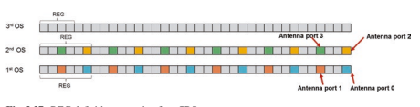

PUSCH transmission. For proper uplink HARQ system operation, PHICH performance should be maintained with very low error probability to reduce the number 

of retransmission and avoid the fail reception of a transport block in MAC layer.2 The target performance is up to the system designer but it is nominally acknowledged that the probability of ACK erroneously detected as NACK is in the order of 10−2 and the error rate of NACK detected as ACK shall be at least lower than 10−3.

In the case of PUSCH transmission with one or two transport blocks, there are the corresponding one or two bits HARQ ACK/NACK.  Multiple PHICHs are mapped to the same set of resource elements and code multiplexed by using different orthogonal sequences *nPHICH*
seq , which are known as a PHICH group *nPHICH*
group . A 
PHICH resource is identifed by the index pair n n *PHICH*
group PHICH
seq
( , ).

The number of PHICH groups supported in the system is confgurable and is transmitted to the UE in the MIB of the PBCH. In the PBCH, PHICH confguration includes 1-bit PHICH duration and 2-bit PHICH resource. The PHICH duration indicates that PHICH spans 1 or 3 OFDM symbols in the control region. If the PHICH is only located at the frst OFDM symbol of the control region, the room for power boosting of PHICH would be limited because of the power use to transmit the PCFICH and PDCCH if they also exist in the frst OFDM symbol and therefore the coverage of PCFICH would be restricted. LTE, thus, provides the PHICH resource to indicate the number of PHICH groups expressed as a fraction of the downlink system bandwidth in terms of resource blocks so that the system designer can spread the PHICH over multiple OFDM symbols. For frame structure type 1, the number of PHICH groups is constant in all sub-frames according to the confguration from PBCH. However, for frame structure type 2, the number of PHICH groups may vary between downlink sub-frames because each downlink sub-frame may associate with different number of uplink sub-frames. For example, in uplink-downlink confguration 0, the PHICHs in sub-frame 0 associate with the PUSCHs from two uplink sub-frames [12]; for other cases, the PHICHs in one downlink sub-frame associate with the PUSCHs from one uplink sub-frame.

In a PHICH group, there are up to eight orthogonal sequences in the case of normal cyclic prefx and four orthogonal sequences in the case of extended cyclic prefx. The orthogonal sequences used in one PHICH group are shown in Table 2.13.

For one UE, each of the HARQ ACK-NACK bits transmitted on one PHICH in one sub-frame is encoded with three repetitions resulting in a block of coded bits. The block of coded bits is modulated using BPSK to generate a block of modulation 

| Table 2.13     | Orthogonal sequences for PHICH           |                       |    |    |    |
|----------------|------------------------------------------|-----------------------|----|----|----|
| Sequence index | Orthogonal sequences Normal cyclic prefx | Extended cyclic prefx |    |    |    |
| 0              | [                                        | ]                     |    |    |    |
| +              | +                                        | +                     | +  |    |    |
| 1              | 1                                        | 1                     | 1  | [  | ]  |
| +              | +                                        |                       |    |    |    |
| 1              | 1                                        |                       |    |    |    |
| 1              | [                                        | ]                     |    |    |    |
| +              | −                                        | +                     | −  |    |    |
| 1              | 1                                        | 1                     | 1  | [  | ]  |
| +              | −                                        |                       |    |    |    |
| 1              | 1                                        |                       |    |    |    |
| 2              | [                                        | ]                     |    |    |    |
| +              | +                                        | −                     | −  |    |    |
| 1              | 1                                        | 1                     | 1  | [  | ]  |
| +              | +                                        |                       |    |    |    |
| j              | j                                        |                       |    |    |    |
| 3              | [                                        | ]                     |    |    |    |
| +              | −                                        | −                     | +  |    |    |
| 1              | 1                                        | 1                     | 1  | [  | ]  |
| +              | −                                        |                       |    |    |    |
| j              | j                                        |                       |    |    |    |
| 4              | [                                        | ]                     |    |    |    |
| +              | +                                        | +                     | +  |    |    |
| j              | j                                        | j                     | j  | -  |    |
| 5              | [                                        | ]                     |    |    |    |
| +              | −                                        |                       |    |    |    |
| j              | j                                        | +                     | −  |    |    |
| j              | j                                        | -                     |    |    |    |
| 6              | [                                        | ]                     |    |    |    |
| +              | +                                        | −                     |    |    |    |
| j              | j                                        | j                     | j  |    |    |
| −              | -                                        |                       |    |    |    |
| 7              | [                                        | ]                     |    |    |    |
| + j            | j                                        | j                     |    |    |    |
| −              | −                                        | + j                   | -  |    |    |

symbols. There are three modulation symbols corresponding to one HARQ ACK/
NACK bit and each of the modulation symbols is spread with the assigned orthogonal sequence. The spread modulation symbols from different UE are multiplexed and mapped onto REGs as shown in Fig. 2.29. The distance of two adjacent REGs of one PHICH group in the frequency domain is almost 1/3 the system bandwidth to achieve the frequency diversity gain.

In the case of two CRS antenna ports, SFBC is used for PHICH transmission. 

However, in case of four CRS antenna ports, SFBC+FSTD cannot be directly used. To keep the orthogonality of PHICH sequences in one REG, the four modulation symbols mapped onto the same REG have to be transmitted on the same antenna port. Hence it only performs SFBC on two antenna ports for the modulation symbols within one REG of PHICH, which causes the power imbalance among different antenna ports. To achieve more transmit diversity gain and enable the power balance over different antenna ports, SFBC operation on (port 0, *port* 2) or (port 1, *port* 3) is switched over the frst, second, and third REGs of one PHICH group.

## 2.5.3 Pdsch

PDSCH carries the data to be transmitted in the downlink with the following transmission schemes [12]:

## - **Single-Antenna Port Scheme:**

- PDSCH transmission is on one antenna port which can be on port 0 (transmission mode (TM) 1), port 5 (TM7), port 7, or port 8 (TM8).

- **Transmit diversity scheme:**
- It is an open-loop rank 1 transmission scheme based on CRS antenna ports. In case of two and four CRS antenna ports, the transmit diversity schemes are SFBC and SFBC+FSTD, respectively. Transmit diversity scheme is supported in TM 2. It is also the fallback transmission scheme in TM3–10.

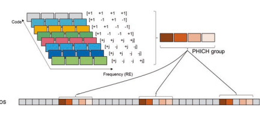

- **Large-delay CDD scheme:**
- It is CRS based open-loop spatial multiplexing with rank = 2/3/4 transmission, which is supported in TM3.

- **Closed-loop spatial multiplexing scheme:**
- CRS-based closed-loop spatial multiplexing with up to four layers, which is supported in TM4/6.

- **Multiuser MIMO scheme:**
- Up to two users are multiplexed together for MU-MIMO, which is CRS-based transmit scheme and supported in TM5.

- **Dual-layer scheme:**
- It was introduced in Release-9 for dual-layer beamforming. PDSCH is performed with two transmission layers on antenna ports 7 and 8 in TM8.

- **Up to eight-layer transmission scheme:**
- It is introduced in Release-10 and DM-RS-based transmission scheme. PDSCH 
would be performed with up to 8 transmission layers on antenna ports 7–14. It is supported in TM 9 and 10. The UE is semi-statically confgured via higher layer signaling to receive PDSCH 
data transmissions signaled via PDCCH according to one of ten transmission modes, denoted as TM 1–10. The general structure of PDSCH processing is shown in Fig. 2.30.

Transmission of up to two transport blocks is supported in one TTI. After the formation of each transport block, CRC and channel coding are performed. At this point, there is a one-to-one mapping between transport block and code word. The number of code word (i.e., transport block) is determined by the value of rank. If the rank in the initial transmission equals to 1, there is only one code word; otherwise two code words are supported. For code word to layer mapping, one code word can be mapped onto more than one layer when rank is larger than 2. The selection of up to two code word transmission is a trade-off of performance and signaling overhead. 

If each code word is mapped onto one layer, it can enable UE to perform SIC operation for performance improvement; however, the overhead of required DL/UL 

Fig. 2.30 General structure of PDSCH processing

2 4G LTE Fundamental Air Interface Design
signaling, e.g., MCS/CQI, would be proportional to the number of code words. The detailed mapping of the code word to layers is rather complicated and is beyond the scope of this treatise. The interested reader should consult the standard [3].

The precoding operation is different among the aforementioned transmission schemes. For the transmission schemes in TM 1–6, the antenna ports after the precoding in Fig. 2.30 refer to CRS antenna port which can be confgured as 1/2/4. In this case, the precoding matrix is predefned or signaled to UE by DCI; that is, UE knows what precoding matrix is used at the eNB side. The precoding matrices are defned in [3]. However, for the transmission schemes in TM 7–10, the antenna ports are DM-RS ports and the number of DM-RS ports is equal to the number of layers. The precoding is transparent to UE and the signaling of the precoding matrices is not needed anymore. The precoding information is embedded in the DM-RS.  The precoding matrix used for PDSCH is up to eNB implementation, which gives the freedom for eNB operation. Such operation is friendly to TDD because of utilizing channel reciprocity and without the need of precoding matrix indicator (PMI) feedback. For FDD, precoding matrices are defned only for CSI reporting. The UE performs channel measurement based on CSI-RS and reports the selected precoding matrices to the eNB for reference. Regarding how to use the reported precoding matrices, this is left for eNB implementation.

The resource mapping is the same for all the transmission schemes. The precoded data is mapped onto the resource elements of each antenna port. The resource mapping is performed from frequency frst and then time within the assigned PDSCH resource blocks. The mapping skips the resource elements occupied by different kinds of reference signal, e.g., CRS, DM-RS, and CSI-RS.

## 2.5.4 Modulation Coding Scheme (Mcs)

Scheduling based on the reported channel state information (CSI), such as rank indication (RI), precoding matrix indicator (PMI), and channel quality indication 
(CQI), is an important characteristic of LTE system. CQI refects the channel quality and is reported via the modulation scheme and coding rate. A number of 15 CQI 
values are defned, and the step size in terms of SINR is about 2 dB. When UE reports a CQI index based on the channel measurement, there is the assumption that "a single PDSCH transport block with a combination of modulation scheme and transport block size corresponding to the reported CQI index, and occupying a group of downlink physical resource blocks termed the CQI reference resource, could be received with a transport block error probability not exceeding 0.1" [12]. Then eNB performs PDSCH scheduling based on the reported CSI.

In order for the UE to receive the PDSCH transmission, it needs to determine the modulation order, transport block sizes (TBS), and assigned resource blocks. The combination of modulation order and TBS index is indicated by a 5-bit MCS feld in the DCI. The assigned resource blocks are also signaled in the DCI according to the resource allocation types. The 5-bit MCS table includes 29 combinations of modulation and TBS index and three states reserved for implicit modulation order and TBS signaling for retransmissions. The 29 MCS correspond to 29 spectral effciency with fner granularity compared to the CQI values, where the spectral effciency has an overlap between QPSK and 16QAM and also for 16QAM and 64QAM. In total there are 27 different spectral effciencies because some values of the 5-bit MCS table have the same spectral effciency. Although the spectral effciency of two modulation schemes is same, different modulation order shows better performance in different fading channels. It is up to system designer to select the modulation order given the same spectral effciency based on the fading channels.

There is a basic TBS table defned, the dimension of which is 27 × 110 for the case one transport block not mapping to more than one layer. From the signaled MCS in the DCI, the modulation order and TBS index can be determined. The TBS of PDSCH is determined by looking up the basic TBS table according to the TBS index and the number of assigned resource blocks. If the transport block is mapped to more than one layer, the determined TBS from the basic TBS table is then translated to a fnal TBS corresponding to the number of layers that the transport block is mapped to. The three entries for retransmission in the 5-bit MCS table represent that the TBS is assumed to be as determined from DCI transported in the latest PDCCH for the same transport block.

In principle, the TBS can be directly calculated according to the MCS and the number of available resource elements, which results in an arbitrary TBS. The arbitrary TBS would not match the size of Turbo QPP interleaver (the padding or depadding is needed) and the MAC payload size is normally calculated with bytes [20, 21]. In addition, the TBS may vary during the initial transmission and retransmission because the number of available resource elements could be different, e.g., the control region is changed. Hence, it is desirable that TBS corresponding to different number of resource blocks is constant across different sub-frames, and the TBS 
should be aligned with QPP sizes to remove the need for padding/depadding. 

Calculating the TBS from MCS requires a resource assumption: three OFDM symbols for control region, two CRS antenna ports, no PSS/SSS/PBCH, and normal CP 
[20]. The generated TBS tables can be found in [12]. It is noted that the actual resource allocations may not be same as the resource assumptions for generating TBS tables, e.g., the number of OFDM symbols in the control region is not 3 and the existence of CSI-RS or DM-RS. The resulted coding rate may not be the exact coding rate of MCS, but is close to the MCS.

## 2.6 **Uplink Transmission** 2.6.1 Pucch

Uplink control information (UCI) including scheduling request (SR), HARQ-ACK, and periodic CSI is transmitted on PUCCH when there is no PUSCH transmission in the same sub-frame. In the case of concurrent transmission of PUCCH and PUSCH, UCI is piggybacked on PUSCH if the simultaneous transmission of PUCCH and PUSCH is not confgured. The PUCCH is located at the resource blocks at the edge of the transmission bandwidth within one slot and frequency hopping across the two slots within one sub-frame is performed as shown in Fig. 2.31. 

The placement of PUCCH at the edge is to facilitate the continuous resource block allocation for PUSCH and to achieve frequency diversity gain. The resource blocks allocated for PUCCH are defned by the scheduler and are transmitted via higher layer signaling.

Several PUCCH formats are defned according to the conveyed UCI on PUCCH. Some PUCCH formats (e.g., format 3) are extended to accommodate new UCI as the releases evolve. For this treatise, only the original function of such kind of PUCCH format is introduced for simplicity. The extended function can be found in [12]. The conveyed UCI of different PUCCH formats is summarized in Table 2.14.

## 2.6.1.1 **Pucch Formats 1/1A/1B**

For PUCCH format 1, scheduling request (SR) is carried by the presence or absence 

 of transmission of PUCCH from the UE.  The periodic resource for SR is UE-specifcally confgured by higher layer signaling. If there is the scheduling request in the SR time instance, UE transmits the bit "1" in the form of BPSK on 

| Table 2.14   | Conveyed UCI on PUCCH formats   |                               |
|--------------|---------------------------------|-------------------------------|
| PUCCH format | Conveyed UCI                    | Originally introduced release |
| 1            | SR                              | Release-8                     |
| 1a/1b        | HARQ-ACK                        | Release-8                     |
| 2            | periodic CSI                    | Release-8                     |
| 2a/2b        | CSI + HARQ-ACK                  | Release-8                     |
| 3            | HARQ-ACK                        | Release-10                    |
| 4            | HARQ-ACK or periodic CSI        | Release-13                    |
| 5            | HARQ-ACK or periodic CSI        | Release-13                    |

PUCCH; otherwise, UE does not transmit anything. PUCCH format 1a/1b carries 1-bit and 2-bit HARQ-ACK, and the corresponding modulation schemes are BPSK and QPSK, respectively.

The modulation symbol is multiplied with a cyclically shifted sequence with length 12, where the sequence is the same as the uplink DM-RS sequence defned for one resource block. The multiplied sequence is block-wise spread with an orthogonal sequence with length 4 or 3 depending on the number of OFDM symbols for PUCCH 1/1a/1b within one slot. Then the two-dimensional spread symbol is mapped onto one resource block. The three OFDM symbols in the middle of the resource block are reserved for PUCCH DM-RS for coherent detection, and the remaining OFDM symbols are for PUCCH data as shown in Fig. 2.32. The PUCCH DM-RS is also a two-dimensional sequence, which is a cyclic shift (CS) of one sequence with length 12 that is block-wise spread with an orthogonal sequence with length 3.

The PUCCH format 1/1a/1b from different UEs is multiplexed in one resource block by using different two-dimensional sequences. The PUCCH resource is indicated by a combination of CS index and orthogonal code covering (OCC) index. 

The sequence in the frequency domain is a CS of one sequence. The number of available CS depends on the CS distance with three values, 1, 2, or 3, which is confgured by higher layer and dependent on the delay spread. The confgured CS distance is applied for both PUCCH data and PUCCH DM-RS. The CS varies with the symbol number and slot number in a cell-specifc manner to randomize the intercell interference. Considering the additional 4 OCC in time domain, the maximum number of available two-dimensional sequence for PUCCH data is 48, 24, 16 in principle. The OCC length for PUCCH DM-RS is 3, and therefore the maximum number of available DM-RS is 36, 18, 12 , respectively. Due to the requirement of coherent detection and the restriction of the number of PUCCH DM-RS, only three OCCs are needed for PUCCH data. The sequences of OCC = 4 and 3 are summarized in Table 2.15. For PUCCH data, OCC = 4 is applied for both slots within one sub-frame or OCC = 4 is applied for the frst slot and OCC = 3 is applied for the second slot in case the last OFDM symbol is reserved for SRS.

Fig. 2.32 PUCCH format 1/1a/1b

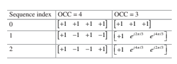

Table 2.15 Orthogonal sequences with OCC for PUCCH format 1/1a/1b

## 2.6.1.2 **Pucch Format 2/2A/2B**

PUCCH format 2 is to convey periodic CSI including RI, PMI, and CQI. The Reed– Muller (RM) code is used to encode the periodic CSI with up to 11 bits and the output of encoding is 20 bits [19]. QPSK modulation is performed to generate ten QPSK symbols. Each modulation symbol is multiplied with a cyclically shifted sequence with length 12 and it is mapped onto one symbol within one resource block. For the case of normal CP, there are two symbols reserved for DM-RS and the remaining fve symbols for PUCCH data in one resource block as shown in Fig. 2.33. In the case of extended CP, there is only one symbol for DM-RS located at the fourth symbol of the resource block.

The total ten QPSK symbols are mapped onto two resource blocks from two different slots within one sub-frame. Similar to PUCCH format 1/1a/1b, the CS of one base sequence is assigned to different UEs for multiplexing and the number of available CS depends on the confgured CS distance. Typically, it can support up to 6 UEs multiplexed together. The resource of PUCCH format 2 is semi-statically confgured via higher layer signaling.

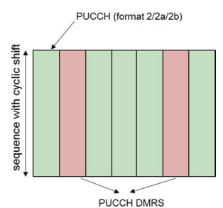

Fig. 2.33 Transmission structure of PUCCH format 2/2a/2b in case of normal CP
PUCCH format 2a/2b is used when periodic CSI and ACK/NACK feedback from a certain UE occurs at the same sub-frame, and it is only applicable in the case with normal CP. The ACK/NACK modulation symbol is multiplied by the second DM-RS sequence within one resource block; that is, the ACK/NACK information is conveyed by the relative phase between the two DM-RS symbols. PUCCH format 2a/2b corresponds to 1-bit or 2-bit ACK/NACK, respectively. In the case of extended CP, the periodic CSI and 1- or 2-bit ACK/NACK are concatenated and then encoded by the RM coding.

## 2.6.1.3 **Pucch Format 3**

In Release-10, carrier aggregation with up to fve component carriers was supported. As there is an independent HARQ entity per carrier, the number of reported ACK/NACK bits increased. For example, there are up to ten-bit ACK/NACK for FDD and even more for TDD depending on the DL-UL sub-frame confguration. PUCCH 1a/1b/2 is not able to convey so many ACK/NACK bits. PUCCH format 3 was introduced to support up to 11 bits for FDD corresponding to up to 10-bit ACK/ NACK and 1-bit positive/negative SR, and up to 21 bits for TDD corresponding to up to 20-bit ACK/NACK and 1-bit positive/negative SR.

PUCCH format 3 uses RM (**32, O**) as the channel coding scheme [19], where O
is the number of ACK/NACK bits with the maximum value being 11. When the number of ACK/NACK/SR bits is less than or equal to 11 bits, the output of encoding is 32 bits, and then circular repetition is performed to obtain 48 bits corresponding to 24 QPSK symbols. Each modulation symbol is spread in time domain by a sequence with length 5 and mapped onto the 5 REs with the same sub-carrier index in one resource block. The mapping of 24 modulation symbols spans two resource blocks of two slots within one sub-frame. The DM-RS location is same as that of PUCCH format 2/2a/2b. As the maximum size of O is 11, in case the number of ACK/NACK/SR bits is larger than 11 bits, the ACK/NACK/SR bits are evenly divided into two blocks and the size of each block is no more than 11 bits. The same channel coding scheme using RM with (**32, O**) is separately performed for each block, i.e., dual-RM code [22], and the output is restricted to be 24 bits corresponding to 12 QPSK symbols. To achieve the frequency diversity gain, the modulation symbols from these two blocks are alternately mapped onto the REs in the frequency domain. This enables the total 12 QPSK symbols of each block to be distributed over the two PUCCH resource blocks. The transmission structure of PUCCH 
format 3 is demonstrated in Fig. 2.34.

## 2.6.1.4 **Pucch Format 4/Format 5**

In Release-13, massive carrier aggregation with up to 32 component carriers was 

 introduced. Normally, it is not possible for one operator to have so many licensed component carriers for aggregation. However, there is larger unlicensed spectrum bandwidth available for use below 6 GHz. Due to the larger number of carriers, the payload size of periodic CSI and/or ACK/NACK is further signifcantly increased, and therefore PUCCH format 4/5 was introduced as the container.

The transmission of the PUCCH format 4 is similar to the PUSCH. Up to eight resource blocks can be confgured for PUCCH format 4, and frequency hopping across two slots of one sub-frame is applied to reap the frequency diversity gain. Only QPSK modulation is supported for the robust transmission of the PUCCH. Similar to the PUSCH, DFT-based transform precoding is applied for the modulation symbols. The DM-RS transmission is also the same as that of PUSCH. Normal PUCCH format and shortened PUCCH format are defned corresponding to whether SRS is present at the last symbol of the second slot. For normal PUCCH format, there are 12 (normal CP) and 10 (extended CP) symbols for the PUCCH data transmission. For the shortened PUCCH format, there are 11 (normal CP) and 9 (extended CP) symbols for PUCCH data. The number of coded bits conveyed by PUCCH format 4 is NRB N PUCCH*symbol* 4 4 *PUCCH* ∗ ∗ 12 ∗2, where NRB
PUCCH 4 is the number of confgured resource blocks and Nsymbol PUCCH 4 is the number of symbols. Tail biting convolutional code (TBCC) with CRC is used as the channel code for PUCCH format 4.

PUCCH format 5 transmission is restricted to one resource block and with frequency hopping across the two slots within the one sub-frame. The operation of channel coding, modulation, and DFT-based transform precoding is similar to that of PUCCH format 4. The difference is that there is a block-wise spread operation before DFT-based transform precoding. A block of six modulation symbols is spread using [+1 + 1] or [+1 − 1] to obtain 12 modulation symbols and then the 12 modulation symbols are operated on by DFT-based transform precoding. The number of coded bits conveyed by PUCCH format 5 is 6 2 5 ∗ ∗ *Nsymbol* PUCCH , where NRB
PUCCH5 is the number of symbols depending on normal or shortened PUCCH format. PUCCH format 5 is applicable for the medium payload size. Since two spread sequences are used, it can support up to two UEs multiplexed.

## 2.6.2 Pusch

The two transmission schemes for the PUSCH are:

## - **Single-Antenna Port Scheme:**

- It is the transmission scheme in uplink TM1 and fallback transmission scheme in TM2.

- **Closed-loop spatial multiplexing:**
- Up to four-layer transmission is supported and it is the transmission scheme in TM2.

The general structure of PUSCH processing is shown in Fig. 2.35. For the singleantenna port scheme, there is only one transport block. In case of closed-loop spatial multiplexing, similar to the downlink, up to two transport blocks are supported. The number of layers (i.e., rank) and the precoding matrix used for the PUSCH transmission are determined by the eNB and then signaled to UE via the UL grant. The maximum number of layers supported is 4. The code word-to-layer mapping is the same as that of the PDSCH.  The cubic metric preserving (CMP) codebook was introduced in order to preserve the single carrier property of PUSCH transmission on each antenna port. There is only one nonzero element in each row of the precoding matrix, which avoids the mix of the two signals on the same antenna port. In addition, antenna selection precoding matrices for 2 and 4 antenna ports are 

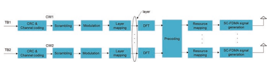

Fig. 2.35 General structure of PUSCH processing 2 4G LTE Fundamental Air Interface Design
supported. It may occur that part of transmit antennas are blocked due to hand grabbing for mobile phone, which causes signifcant loss in the radio signal. In this case, antenna selection is used to save transmission power. The details of CMP codebook for different ranks are beyond the scope of this treatise and can be found in [3].

PUSCH transmission is based on DM-RS ports, and the number of DM-RS ports is equal to the rank signaled in the UL grant. It is different from downlink that the precoding of the PUSCH transmission is not transparent. In uplink, the precoding matrix and the corresponding MCS signaled to the scheduled UE are determined by the eNB. The UE is mandated in the standards and is tested via test specifed by RAN 4 to use the signaled precoding matrix. MU-MIMO is also supported for the PUSCH transmission. That is, multiple UEs transmitting PUSCH data on the same time and frequency resources can be separated by eNB because of its multiple receive antenna capability. Uplink MU-MIMO is also known as virtual MIMO 
because the multiple transmit antennas are from different UEs. From the UE perspective, it does not know whether there are some other UEs multiplexed with it together. That is, MU-MIMO is transparent to UE. To separate the PUSCH from different UEs, uplink DM-RS is assigned to different UEs by using different cyclic shifts of one DM-RS sequence. As there are eight cyclic shifts available, it can, in principle, support up to eight UEs for MU-MIMO in principle. The assignment of cyclic shifts for different UEs is applicable for the case of aligned resource allocation among the MU-MIMO UEs. In Release-10, OCC over time domain for uplink DM-RS was introduced (see Sect. 2.4.2), which supports two UEs with unaligned resource allocation for MU-MIMO. In a practical system, especially for TDD systems, there are a large number of receive antennas, e.g., 8 or 16, and the uplink resource is limited; consequently there is the desire to support more UEs with unaligned resource allocation for MU-MIMO. In Release-14, uplink DM-RS in the form of comb as SRS is introduced to support up to four UEs with unaligned resource allocation.

## 2.6.3 Modulation

In order for the eNB to receive the PUSCH transmission, the modulation order and transport block sizes (TBS) need to be determined. The procedure of determining MCS and TBS for PUSCH is same as that for PDSCH.  The combination of modulation order and TBS index is also indicated by a 5-bit MCS feld in the uplink grant. The 5-bit MCS table for PUSCH is originated from that of PDSCH with some changes. The change is that for the frst four MCS indices corresponding to 64QAM the modulation scheme is treated as 16QAM. The reason is that many UE categories do not support 64QAM or eNB does not support 64QAM transmission for PUSCH. In this case, the highest MCS corresponding to 16QAM is 2.41 bits/symbol which restricts the peak data rate, and therefore the related changes are done and the MCS can reach 3.01 bits/symbol [23].

## 2.7 **Harq Timing**

HARQ uses the stop-and-wait protocol for transmission. After a transport block transmission, the transmitter stops to wait until receiving the confrmation from the receiver. The receiver reports an indicator (i.e., ACK or NACK) to the transmitter based on the transport block detection result. If ACK is received, the transmitter will transmit a new transport block; otherwise, the erroneously detected transport block is retransmitted. Each stop-and-wait protocol transmission forms one HARQ process. The downlink HARQ operation is illustrated in Fig. 2.36.

Multiple parallel HARQ processes are supported to improve the overall system performance. The maximum number of HARQ process depends on the round-trip time (RTT) as shown in Fig. 2.36, where RTT is restricted by the eNB and UE processing time [1]. In LTE, it is assumed that the eNB processing time is 3 ms and UE 
processing time is 3 − TA ms in case of 1 ms TTI for PDSCH [24]. Based on that assumption, the maximum of HARQ process for FDD DL/UL was set to be 8. The maximum number of HARQ processes for TDD depends on DL/UL confguration and the eNB/UE processing capability [12, 25], which are summarized in Table 2.16.

There are two types of HARQ mechanisms defned as synchronous HARQ and asynchronous HARQ [8]: - Synchronous HARQ: the (re)transmissions for a certain HARQ process are restricted to occur at known time instants.

- Asynchronous HARQ: the (re)transmissions for a certain HARQ process may occur at any time, but the duration between the transmission and retransmission is larger than the RTT. For synchronous HARQ, the time instants for the (re)transmission for a certain HARQ process are predefned, and therefore the HARQ process number can be derived from the time instant directly.3 In this case, the retransmission can reuse the same transmission format as the initial transmission including the resource allocations and MCS without control signaling, which is known as nonadaptive HARQ. This has the beneft of controlling signaling overhead reduction and simple 

0 4 7 1 7 4 2 10 2 3 9 6 4 12 3 5 15 2 6 6 1
scheduling. On the contrary, asynchronous HARQ requires the explicit signaling of HARQ process number, but has the advantage of scheduling fexibility for the retransmission(s). This is suitable for downlink transmission because it can fexibly schedule the retransmission to avoid the MBSFN sub-frames or in the sub-frames with paging or system information. In LTE, synchronous HARQ is used for uplink and asynchronous HARQ is used for downlink.

Soft combing schemes for the HARQ retransmission include chase combining and incremental redundancy (IR). Chase combining implies that the retransmission bits are exactly identical to the initially transmitted information bits. For IR, however, it is not necessary that the retransmission bits must be the same as those of the initial transmission. Instead, compared to the coded bits transmitted in the previous transmission (initial or retransmission), there are incremental coded bits transmitted in the next retransmission. In both cases soft combining after the retransmission will result in a lower code rate to increase the detection probability. The incremental coded bits in the retransmission are named as redundancy version (RV) which is 

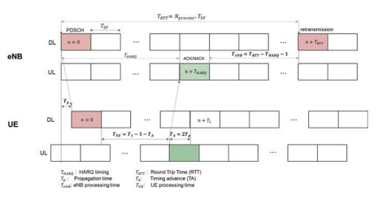

implicitly indicated by the MCS index in the DCI. In LTE, HARQ is based on IR. It is noted that CC is a special case of IR. 4 Regardless of synchronous or asynchronous HARQ, the HARQ timing in LTE is predefined; that is, upon the detection of the transport block at sub-frame n , the corresponding ACK/NACK is transmitted in sub-frame n + T HARQ as illustrated in Fig. 2.36 . For FDD, the HARQ timing THARQ for both DL and UL is 4, which is shown in Fig. 2.37 . For TDD, the HARQ timing depends on the DL/UL configuration and the location of the PDSCH/PUSCH. It can be seen that the HARQ ACK/
NACK corresponding to the PDSCHs transmitted in several downlink sub-frames is transmitted in one uplink sub-frame, but it requires that T HARQ ≥ 4, e.g., the HARQ
timing for DL/UL configuration 2 in Fig. 2.37 .

## 2.8 **Carrier Aggregation (Ca) And Band Combinations**

For LTE Release-8, the maximum channel bandwidth of a single carrier is 20 MHz and the peak data rate can reach ~300 Mbps assuming 64QAM and four layers [9]. 

In order to fulfll the requirement for peak data rate of 1 Gbps [26], CA was introduced in Release-10 to support up to fve component carrier aggregation and the maximum channel bandwidth of each component carrier is 20 MHz. In Release-12, CA was enhanced to support the aggregation of FDD and TDD carrier, which is a kind of FDD and TDD convergence because the merits of both FDD and TDD can be jointly utilized. In Release-13, CA was further enhanced to support up to 32 component carrier aggregation, and in principle it can support up to 32  ×  20  =  640MHz. However, it is diffcult for one operator to have 640  MHz licensed spectrum in the practical system, and the aggregated component carriers can also be on unlicensed spectrum. Based on whether the aggregated component carriers are within the same band or not, intra-band CA and inter-band CA are defned. The LTE bands and different CA bands are defned in [9]. CA is a very important feature for LTE and there are already 241 commercial networks in the world [27].

As mentioned, an important target of CA was to increase the peak data rate. 

However, other important advantages of CA are scheduling gain and load balancing. There are many UE categories defned corresponding to different combinations of the number of component carriers, layers, and modulation order. The UE categories with the typical peak data rates are listed in Table 2.17 [9].

## 2.9 **Initial Access And Mobility Procedures**

Before a UE can operate on a LTE carrier, the UE needs to frst perform the initial access procedure to access the network and establish radio resource control (RRC) connection. The initial access procedure includes cell search, random access, and RRC connection establishment.

| DL/UL   | UE category   | Peak data rate   | No. of component carriers   | No. of layers   | Modulation   |
|---------|---------------|------------------|-----------------------------|-----------------|--------------|
| DL      | 4             | 150 Mbps         | 1                           | 2               | 64QAM        |
| DL      | 5             | 300 Mbps         | 1                           | 4               | 64QAM        |
| DL      | 8             | 3 Gbps           | 5                           | 8               | 64QAM        |
| DL      | 14            | 3.9 Gbps         | 5                           | 8               | 256QAM       |
| DL      | 17            | 25 Gbps          | 32                          | 8               | 256QAM       |
| UL      | 5             | 75 Mbps          | 1                           | 1               | 64QAM        |
| UL      | 13            | 1.5 Gbps         | 5                           | 4               | 64QAM        |
| UL      | 19            | 13.56 Gbps       | 32                          | 4               | 256QAM       |

Cell search is the procedure by which a UE acquires the time (symbol/slot/frame) 
and frequency synchronization with a cell as well as physical layer cell identity (cell ID). There are 504 physical layer cell IDs supported and many layer 1 transmission parameters such as reference signal sequence generation and scrambling sequence are dependent on the physical layer cell ID. The 504 physical layer cell IDs are grouped into 168 unique physical layer cell ID groups and each group contains three IDs. The primary and secondary synchronization signals (PSS and SSS) are defned to facilitate the cell search. Since there are not any prior knowledge before the UE performs the cell search, the synchronization signals are always transmitted in the center six resource blocks of the system bandwidth, so that the UE always knows where it is. The PSS is transmitted in the last OFDM symbol of slots 0 and 10 for frame structure type 1 and the third OFDM symbol in slots 2 and 12 for frame structure type 2. The SSS is transmitted in the second last OFDM symbol of slots 0 and 10 for frame structure type 1 and the last OFDM symbol in slots 1 and 11 for frame structure type 2.

The PSS transmitted in the two slots of one radio frame is same. This transmission is used to acquire the symbol synchronization and part of the cell ID information. There are three different ZC root sequences with length 63 defned for PSS to represent the three unique IDs within one physical layer cell ID group. The middle element of the sequence is punctured when mapped onto the center six resource blocks due to the existence of direct current (DC) subcarrier. The mapping results in the symmetric property of PSS in time domain which can reduce the computation complexity at the UE [28]. Once the PSS is acquired, UE can detect SSS based on the time relationship between PSS and SSS. As the time relationship between PSS and SSS is different for frame structure types 1 and 2, the detection of SSS can also obtain the information of the frame structure and cyclic prefx. Due to the close distance between PSS and SSS symbol, the PSS may be used for coherent detection of SSS, which is up to UE implementation. The SSS is represented by two short sequences with length 31 and the 168 unique combinations of two short sequences represent the physical layer cell ID groups. For all the combinations of the two short sequences, the index of the frst short sequence is always less than that of the second short sequence, which can reduce the ambiguity of cell group ID detection [29]. The positions of two short sequences of SSS are switched across the two slots of one radio frame, which can be used to acquire the sub-frame synchronization.

After the cell search is done, UE needs to acquire the system broadcast information conveyed on PBCH and SIBs. The PBCH is detected to obtain the system bandwidth, number of CRS antenna ports, SFN, and PHICH duration described in Sect. 2.5.1. The SIBs are mapped to the PDSCH in physical layer, and the corresponding PDCCH with CRC scrambled by the system information radio network temporary identifer (SI-RNTI) is transmitted in the common search space for all the UE's detection. The PDCCH indicates the scheduled resources, MCS, etc. of SIBs. There is a periodicity to the transmission of SIBs with different periodicity. The SIB1 uses a fxed periodicity of 80 ms and there are four repetitions within 80 ms. The frst transmission of SIB1 is scheduled in sub-frame 5 of radio frames for which the SFN mod 8 = 0, and the repetitions are scheduled in sub-frame 5 of all other radio frames for which SFN mod 2 = 0 [11]. The SIB1 contains the information to determine whether a UE is allowed to access this cell and defnes the scheduling of other system information (SI). The SI message is used to convey one or more SIBs other than SIB1. All the SIBs included in one SI message are transmitted with the same periodicity, and one SIB can only be mapped to one SI message. The SIB2 is always mapped to the frst SI confgured in SIB1. The SIB2 contains radio resource confguration information that is common for all UEs, e.g., MBSFN subframe confguration and PRACH confguration information. The detail information of each SIB can be found in [11].

The UE needs to perform random access to achieve uplink synchronization for the PUSCH transmission and establish RRC connection after obtaining the system information related to random access including PRACH confguration, frequency position, root sequences, cyclic shift, set type (restricted or unrestricted), and so on. The transmission of PRACH occupies six resource blocks in a sub-frame or more consecutive sub-frames, which is scalable to different system bandwidths. Contention base random access procedure is used during initial access phase because the UE is in idle state, which has four steps as shown in Fig. 2.38 [30]. Step 1: Random Access Preamble Transmission: The UE frst selects one preamble sequence from the confgured preamble sequence set(s), and transmits it in the confgured frequency resource with the desired power.

Step 2: Random Access Response (RAR): Upon the successfully detected preamble sequences, the eNB will transmit the RAR 
in downlink in response to these transmitted preamble sequences. The RAR is transmitted in the scheduled PDSCH indicated by a PDCCH marked with random-access RNTI (RA-RNTI). The RAR conveys at least the identity of the detected random-access preamble, timing alignment information, and Random Access Response Grant (RARG) [12] and the assignment of Temporary cell RNTI (Temporary C-RNTI). If there are multiple random-access preambles detected simultaneously, the intended information in RAR can be contained in one PDSCH.

Step 3: PARG-based UL Transmission:
After the reception of RAR, the UE would be synchronized in uplink using the signaled timing alignment information. However, the UE does not establish the connection with the cell yet. The PUSCH scheduled by RARG conveys some request information from higher layer, e.g., RRC Connection Request and NAS UE identifer [30]. The PUSCH is scrambled by the Temporary C-RNTI.

Step 4: Contention Resolution on Downlink:
It may happen that multiple UEs transmit the same random-access preambles simultaneously and then receive the same RAR, which results in the collision of different UEs using the same Temporary C-RNTI. To solve the collision, the eNB 
transmits a downlink message in PDSCH scheduled by a PDCCH marked with Fig. 2.38 Contentionbased random access 

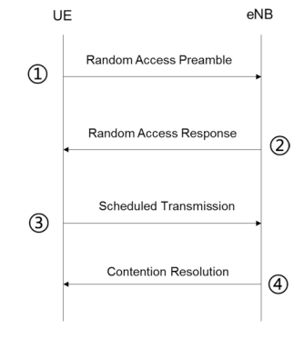

procedure the Temporary C-RNTI in Step 2. The UEs will check whether the UE identity signaled in the downlink message is the same as the identity conveyed in Step 3. If it is matched, it implies that the random access is successful and the Temporary C-RNTI will be promoted to C-RNTI for the UE; otherwise, the UE needs to restart the random access procedure from Step 1.

In addition to the contention-based random access procedure, there is also noncontention-based random access procedure applicable to only handover and DL 
data arrival during RRC_CONNECTED requiring random access procedure [30].

There are two states defned for the UE which are RRC_IDLE and RRC_
CONNECTED (Fig. 2.39) [30]. In RRC_IDLE state, there are no RRC context and specifc cell attachment. The UE under this state does not have data to receive/transmit and can be in sleep mode for power saving. Once it is triggered to establish RRC connection, the random access procedure as described above is performed and it establishes the RRC context to move to RRC_CONNECTED state. In case of RRC_CONNECTED state, the normal communication between the UE and eNB can be performed under the RRC context known by both UE and eNB. If there is no data to transfer, the RRC connection can be released to go to RRC_IDLE state.

## 2.10 **Summary**

When LTE was initially designed, the considered aspects of the system are signifcantly simpler and more focused comparing to the recent situation. Relatively lowfrequency bands with FDD were the main consideration while TDD was largely an add-on feature by augmenting the FDD frame structure. System bandwidth is relatively narrow even though 20 MHz carrier bandwidth was deemed wide (in terms of implementation complexity and needed data rate) at that point of time. Deployment scenario is for homogeneous network topology of macro base stations. While data rate improvement was a priority for LTE, coverage and robustness of the network were certainly the essential factors. MIMO was introduced in LTE from the beginning as an advanced feature for improving spectrum effciency and peak data rate. 

However, the number of antennas at the base station was limited to up to 4 and only SU-MIMO was supported in the frst release. OFDMA for downlink and DFT-SOFDM for uplink were selected for fexible multiplexing of channels and much easier support of MIMO transceiver schemes. As a result, the initial LTE design was that of a simple and rigid framework. In a nutshell, the basic air-interface design of LTE can be described as a single carrier with fxed bandwidth (with a small set of candidate values) of a single numerology and rigid frame structure, with fxed always-on CRS for all transmission schemes, and infexible control region and initial access channels.

Though a very-well-designed system, the simple and infexible framework of LTE soon became problematic after its frst 2–3 releases when new use cases and requirements need to be met. For MBB traffc, much higher system capacity demands pushed for wider system bandwidth (which drove the networks to higher frequency bands where TDD instead of FDD bands are more prominent), dense deployments of macro base station as well as small cells (where overhead and interference of always-on CRS transmissions became a signifcantly limiting factor to performance and compatibility issue to new feature introduction), and introduction of MU-MIMO and massive MIMO (which demands a DM-RS- and CSI-RS-centric design for transmission and CSI feedback). In addition to MBB, support of new applications such as machine-type communication, D2D/V2X, and URLLC in LTE requires substantial effort to work under its frame structure. Features such as carrier 

aggregation, FD-MIMO, sidelink/V2X, NB-IoT/eMTC, small cell on/off, and HRLLC were introduced in later releases of LTE to address these issues.

All these are like lessons learned or exploration into new domains which point to elements that are needed when it is time to design a new air interface. Even without changing the fundamental waveform and similarity to basic frame structure, NR 
adopted a drastically different framework of multiple/scalable numerologies, fexible frame structure, DM-RS- and CSI-RS-centric reference signal design without any always-on signal, and mechanism to ensure forward compatibility. The next chapter will begin our investigation of the 5G NR air interface.

## References

1. E.  Dahlman, S.  Parkvall and J.  Skold, 4G: LTE/LTE-Advanced for Mobile Broadband, Amsterdam, The Netherlands: Elsevier Press, 2011.

2. S. Sesia, I. Toufk and M. Baker (eds), LTE: The UMTS Long Term Evolution, section edition, NY, NY: John Wiley and Sons Publishing, 2011.

3. 3GPP, "TS 36.211: Evolved Universal Terrestrial Radio Access (E-UTRA); Physical channels and modulation," June 2018. [Online]. Available: https://portal.3gpp.org/desktopmodules/
Specifcations/SpecifcationDetails.aspx?specifcationId=2425.

4. ITU-R, "Report M.2370: IMT Traffc estimates for the years 2020 to 2030," July 2015. 

[Online]. Available: https://www.itu.int/pub/r-rep-m.2370.

5. R. V. Nee and R. Prasad, OFDM wireless multimedia communications, Boston, Massachusetts: 
Artech House Publisher, 2000.

6. C.  C. Yin, T.  Luo and G.  X. Yue, Multi-carrier Broadband Wireless Communication Technology, Beijing, China: Beijing University of Posts and Telecommunications Press, 2004.

7. Motorola, "R1-060385: Cubic metric in 3GPP-LTE," 3GPP TSG-RAN WG1 Meeting \#44, Denver, CO, USA, February, 2006. [Online]. Available: https://www.3gpp.org/ftp/tsg_ran/ WG1_RL1/TSGR1_44/Docs.

8. 3GPP, "TR 25.814, Physical layer aspects for evolved Universal Terrestrial Radio Access 
(UTRA) (Release 7)," September 2006. [Online]. Available: https://portal.3gpp.org/desktopmodules/Specifcations/SpecifcationDetails.aspx?specifcationId=1247.

9. 3GPP, "TS 36.104: Evolved Universal Terrestrial Radio Access (E-UTRA); Base Station (BS) 
radio transmission and reception," March 2010. [Online]. Available: https://portal.3gpp.org/ desktopmodules/Specifcations/SpecifcationDetails.aspx?specifcationId=2412.

10. 3GPP, "TR 25.913: Requirements for Evolved UTRA (E-UTRA) and Evolved UTRAN 
(E-UTRAN) (Release 8),"December 2008. [Online]. Available: https://portal.3gpp.org/desktopmodules/Specifcations/SpecifcationDetails.aspx?specifcationId=1342.

11. 3GPP, "TS 36.331: Radio Resource Control (RRC) Protocol Specifcation (Release 8)," 
September 2009. [Online]. Available: https://portal.3gpp.org/desktopmodules/Specifcations/ SpecifcationDetails.aspx?specifcationId=2440.

12. 3GPP, "TS 36.213: Evolved Universal Terrestrial Radio Access (E-UTRA); Physical Layer Procedures (Release 15)," June 2008. [Online]. Available: https://portal.3gpp.org/desktopmodules/Specifcations/SpecifcationDetails.aspx?specifcationId=2427.

13. 3GPP, "TS 36.214: Evolved Universal Terrestrial Radio Access (E-UTRA); Physical layer; Measurements (Release 15)," June 2018. [Online]. Available: https://portal.3gpp.org/desktopmodules/Specifcations/SpecifcationDetails.aspx?specifcationId=2428.

14. Samsung and Nokia Networks, "RP-141644: New SID Proposal: Study on Elevation Beamforming/Full-Dimension (FD) MIMO for LTE," 3GPP TSG-RAN \#65, Edinburgh, UK, September, 2014. [Online]. Available: https://www.3gpp.org/ftp/tsg_ran/TSG_RAN/ TSGR_65/Docs/.

15. Samsung, "RP-160623: New WID Proposal: Enhancements on Full-Dimension (FD) MIMO 
for LTE," 3GPP TSG RAN Meeting\#71, Göteborg, Sweden, March, 2016. [Online]. Available: https://www.3gpp.org/ftp/tsg_ran/TSG_RAN/TSGR_71/Docs/.

16. 3GPP, "TR 36.872: Small cell enhancements for E-UTRA and E-UTRAN, Physical layer aspects (Release 12)," December 2013. [Online]. Available: https://portal.3gpp.org/desktopmodules/Specifcations/SpecifcationDetails.aspx?specifcationId=2573.

17. D. C. Chu, "Polyphase Codes with Good Periodic Correlation Properties," IEEE Trans. On Information Theory, vol. 18, no. 4, pp. 531–532, 1972.

18. Panasonic and NTT DoCoMo, "R1-073626: Reference signal generation method for E-TTRA 
uplink," 3GPP TSG-RAN WG1 Meeting \#50, Athens, Greece, August, 2007. [Online]. Available: https://www.3gpp.org/ftp/tsg_ran/WG1_RL1/TSGR1_50/Docs/.

19. 3GPP, "TS 36.212: Evolved Universal Terrestrial Radio Access (E-UTRA); Multiplexing and channel coding (Release 15)," June 2018. [Online]. Available: https://portal.3gpp.org/desktopmodules/Specifcations/SpecifcationDetails.aspx?specifcationId=2426.

20. Motorola, "R1-080072: TBS and MCS Table Generation and Signaling for E-UTRA," 3GPP 
TSG RAN1 Meeting\#51bis, Seville, Spain, January, 2008. [Online]. Available: https:// www.3gpp.org/ftp/tsg_ran/WG1_RL1/TSGR1_51b/Docs/.

21. Ericsson, "R1-080556: Outcome of ad hoc discussions on TB size signaling," 3GPP TSG 
RAN1 Meeting\#51bis, Seville, Spain, January, 2008. [Online]. Available: https://www.3gpp.

org/ftp/tsg_ran/WG1_RL1/TSGR1_51b/Docs/.

22. Huawei and HiSilicon, "R1-105247: A/N coding schemes for large payload using DFT-SOFDM," 3GPP TSG RAN1 \#62bis, Xi'an, China, October, 2010. [Online]. Available: https://
www.3gpp.org/ftp/tsg_ran/WG1_RL1/TSGR1_62b/Docs.

23. Ericsson, Panasonic and Motorola, "R1-082091: MCS and TBS Tables for PUSCH," 3GPP 
TSG RAN1 \#53, Kansas City, MO, USA, May, 2008. [Online]. Available: https://www.3gpp. org/ftp/tsg_ran/WG1_RL1/TSGR1_55/Docs.

24. Ericsson et al., "R1-073871: Maximum number of hybrid ARQ processes," 3GPP TSG RAN1 
\#50, Athens, Greece, August, 2007. [Online]. Available: https://www.3gpp.org/ftp/tsg_ran/ WG1_RL1/TSGR1_50/Docs.

25. Huawei et  al., "R1-081124, Way forward for TDD HARQ process," 3GPP TSG RAN1 
\#52, Sorrento, Italy, February, 2008. [Online]. Available: https://www.3gpp.org/ftp/tsg_ran/ WG1_RL1/TSGR1_52/Docs.

26. 3GPP, "TR 36.913: Requirements for further advancements for Evolved Universal Terrestrial Radio Access (E-UTRA) (LTE-Advanced) (Release 8)," March 2009. [Online]. Available: https://portal.3gpp.org/desktopmodules/Specifcations/SpecifcationDetails.aspx?specifcati onId=2585.

27. GSA, "Evolution from LTE to 5G," April 2018. [Online]. Available: https://gsacom.com/
paper/evolution-lte-5g/.

28. Huawei, "R1-072321: P-SCH sequences," 3GPP TSG RAN1 \#49, Kobe, Japan, May, 2007. 

[Online]. Available: https://www.3gpp.org/ftp/tsg_ran/WG1_RL1/TSGR1_49/Docs.

29. Texas Instruments et  al., "R1-074143: Way Forward for Secondary SCH Mapping and Scrambling," 3GPP TSG RAN1 \#50, Shanghai, China, October, 2007. [Online]. Available: https://www.3gpp.org/ftp/tsg_ran/WG1_RL1/TSGR1_50/Docs.

30. 3GPP, "TS 36.300: Evolved Universal Terrestrial Radio Access (E-UTRA) and Evolved Universal Terrestrial Radio Access Network (E-UTRAN); Overall description; Stage 2 
(Release 15)," June, 2007. [Online]. Available: https://portal.3gpp.org/desktopmodules/
Specifcations/SpecifcationDetails.aspx?specifcationId=2430.

31. S. Wicker, Error Control Systems for Digital Communication and Storage, Englewood Cliffs: 
Prentice Hall, 1995.

# Chapter 3

 5G Fundamental Air Interface Design

Now that we have a good grounding in the fundamental of LTE design, it is now natural to understand the new 5G air interface by comparing and contrasting the designs between the two systems. We will begin of discourse with the NR-specifc designs for the carrier, frame structure, physical channels, and reference signals. Then the global candidate spectrum for 5G-NR is introduced which demonstrates the new characteristic with wider frequency range and bandwidth impacting NR design. With respect to C-band as NR deployment typical spectrum, the coverage issue is identifed and the mechanism of UL/DL decoupling scheme (i.e., LTE/NR spectrum sharing) to solve the coverage issue is mainly introduced. Afterwards, NR physical layer technologies including waveform, polar/LDPC codes, MIMO, and mMTC are described, and in all cases the enhancements of NR made relative to LTE are made apparent.

## 3.1 **5G-Nr Design Of Carrier And Channels** 3.1.1 Numerology For The Carrier

NR spans much wider frequency range compared to LTE, which currently defnes two frequency ranges (FR) as FR1 and FR2. The corresponding frequency ranges for FR1 and FR2 are 450–6000 MHz and 24,250–52,600 MHz, respectively, and a set of operating bands are defned for FR1 and FR2 [1]. For the spectrum beyond 3 GHz, there is larger spectrum bandwidth available; see Sect. 3.2.1, which can be utilized to fulfll the high data rate requirement of IMT-2020 [2]. For each operating band, a UE or base station can support a number of carriers which is dependent on the bandwidth of a carrier and the UE capability. The carrier bandwidth is related to base station and UE processing capability. The supported carrier bandwidths for FR1 and FR2 are summarized in Table  3.1. However, from UE perspective, the 

Table 3.1 Carrier bandwidth 

supported in NR Frequency range

Carrier bandwidth 

(MHz)a

FR1 5, 10, 15, 20, 25, 

30, 40, 50, 60, 70, 80, 90, 100

FR2 50, 100, 200, 400

aCarrier bandwidth is dependent on the subcarrier spacing and operating band [1]

supported transmission bandwidth (i.e., UE channel bandwidth) may be smaller than the carrier bandwidth due to the restriction of UE capability. In this case, the network can confgure a part of contiguous spectrum being equal to or smaller than UE channel bandwidth from the carrier for the UE, which is also called as bandwidth part (BWP). A UE can be confgured with up to four BWPs in the downlink and uplink, but there is only one BWP being active at a given time. The UE is not expected to receive or transmit outside an active BWP, which is benefcial for UE 
power saving because it does not have to transmit or receive on the entire system bandwidth.

Since CP-OFDM-based waveform is applied for both downlink and uplink transmission, see Sect. 3.4.1; the design of numerology for a carrier is similar to LTE that includes subcarrier spacing (SCS) and CP. The key factor to determine the SCS is the impact of Doppler shift which is related to the carrier frequency and mobility. The frequency range of LTE operating bands is within that of NR. The 15 kHz SCS 
design has been well verifed in the practical networks. Hence 15 kHz SCS is supported in NR as well. Considering the mobility requirement supporting up to 500 km/h and the wider frequency range, having only 15 kHz SCS is not enough and multiple larger SCS values with 2μ × 15 kHz, where μ = 0, 1, 2, 3, 4 were introduced. Larger SCS results in the shorter time duration of OFDM symbol which is helpful for short TTI transmission especially for the latency-sensitive service, e.g., remote control. Such design of SCS also has the beneft of reducing implementation complexity in terms of the number of subcarriers for a certain carrier bandwidth. The utilization of SCS is dependent on the frequency range. Of course, it is not necessary to support all the SCS values for each and every frequency range.

The CP length was determined to well mitigate the impact of the delay spread and have a reasonable overhead. In the case of 15 kHz SCS of LTE, the ratio of CP length over the duration of one OFDM symbol is 144/2048 = 7.03% for the OFDM symbols other than the frst one in each slot. The CP length for the frst OFDM symbol in each slot is slightly longer as 160/2048 = 7.81% due to the restriction of 0.5 ms slot and to help with the settling of the automatic gain adjustment. This CP length has been shown to be a good trade-off between the mitigation of delay spread and the CP overhead, and is, therefore, reused for NR in the case of 15 kHz SCS and normal CP. As the duration of one OFDM symbol is equal to the reciprocal of SCS, 
the CP length for other SCS will be proportionally reduced by 2μ, μ = 0, 1, 2, 3, 4 which keeps the same ratio of CP overhead as 15 kHz. This can also enable the OFDM symbols of different SCS within one slot to align, which is benefcial for the coexistence of carriers with different SCS especially for the TDD networks because of the need of synchronization. It is noted that the CP length of the 1st and 7 ∗ 2μth OFDM symbols within one sub-frame is slightly longer, and the detail of frame structure can be found in Sect. 3.1.2. Extended CP is only supported for 60 kHz SCS, and the length of extended CP is scaled from that of LTE. The 60 kHz SCS is envisioned to be applicable for URLLC service because of the resulting shorter TTI. When the URLLC service using 60 kHz SCS is deployed in sub-3 GHz, the normal CP may not be able to mitigate the inter-symbol interference in case of highdelay-spread scenario, and the extended CP is useful in this scenario.

Due to the proportional reduction of CP for larger SCS, it is clear that the CP will not be proper for scenarios with large delay spread. The larger SCS is, thus, typically utilized for high frequency which has smaller delay spread [3]. There is the frequency range restriction for different SCS as shown in Table 3.2. The SCS and CP for one BWP can be obtained from the higher layer parameters *subcarrierSpacing* and *cyclicPrefx*, respectively. In one carrier, multiple numerologies can be confgured.

Given a certain SCS, a resource block is defned as 12 consecutive subcarriers in the frequency domain. It is different from LTE which always has 7 or 6 OFDM symbols within one resource block. Here there is no restriction on the number of symbols within one resource block to facilitate the multiple short TTI transmission per SCS. The smallest resource unit within the resource block is called resource element (RE) indicated by (k, l), where k is the subcarrier index in the frequency domain and l represents the OFDM symbol index relative to a starting position in the time domain.

Two kinds of resource blocks are defned: common resource block (CRB) and physical resource block (PRB). The CRB is defned from the system perspective, where the CRBs are numbered from 0 and upwards in the frequency domain for subcarrier spacing confguration μ, i.e., n k CRB
  / 12 , where k is the subcarrier index relative to a frequency starting position (i.e., reference point) of a carrier 

| Table 3.2                                      | Supported transmission numerologies   |                            |                     |            |    |    |    |    |
|------------------------------------------------|---------------------------------------|----------------------------|---------------------|------------|----|----|----|----|
| SCS                                            | Cyclic prefx                          | Applicable frequency range |                     |            |    |    |    |    |
| ∆f = 2μ .  15  [kHz] Type                      | Length of CP within one sub-frame     | FR1 Sub-1                  | 1–3                 | 3–6        |    |    |    |    |
| l = 0 or 7. 2                                  | FR2                                   |                            |                     |            |    |    |    |    |
| μ  (normal CP)                                 | Others                                | GHz                        | GHz                 | GHz        |    |    |    |    |
| 0                                              | 15                                    | Normal                     | 144 ∗ ∆ + 16 ∗ ∆    | 144 ∗ ∆    | √  | √  | √  | -  |
| 1                                              | 30                                    | Normal                     | 144 ∗ ∆/2 + 16 ∗ ∆  | 144 ∗ ∆/2  | √  | √  | √  | -  |
| 2                                              | 60                                    | Normal                     | 144 ∗ ∆/4 + 16 ∗ ∆  | 144 ∗ ∆/4  | -  | √  | √  | √  |
| 2                                              | 60                                    | Extended                   | 512 ∗ ∆             | -          | √  | √  | -  |    |
| 3                                              | 120                                   | Normal                     | 144 ∗ ∆/8 + 16 ∗ ∆  | 144 ∗ ∆/8  | -  | -  | -  | √  |
| 4                                              | 240                                   | Normal                     | 144 ∗ ∆/16 + 16 ∗ ∆ | 144 ∗ ∆/16 | -  | -  | -  | -  |
| Note: ∆ is the oversampling factor over 2048 μ |                                       |                            |                     |            |    |    |    |    |

common for all SCS. The PRB is defned within one BWP which is a set of contiguous common resource blocks. The relation between the CRB and RRB is n n CRB PRB *NBWP i* start   , , where N i start BWP, is the starting position of BWP i, i = 0, 1, 2, 3 expressed by CRB.

The actual number of resource blocks per carrier depends on the carrier bandwidth, SCS, and frequency band [1].

## 3.1.2 Frame Structure

One radio frame with 10 ms duration consists of 10 sub-frames and each sub-frame is of 1 ms duration. Each radio frame is divided into two equally sized half-frames of fve sub-frames, which are half-frame 0 consisting of sub-frame 0–4 and halfframe 1 consisting of sub-frames 5–9. The number of slots within one sub-frame is 2μ, μ = 0, 1, 2, 3, 4 which is dependent on SCS. In one slot, there are always 14 OFDM symbols regardless of the SCS confguration in the case with normal CP. The relationship among the number of OFDM symbol, slot, sub-frame, and radio frame is demonstrated in Fig. 3.1.

NR has very fexible frame structure compared to LTE, which has only two frame structures which are for FDD and TDD, respectively. The slots in one radio frame can be fexibly confgured for downlink or uplink transmission. The 14 OFDM symbols in one slot can be classifed as "downlink," "fexible," or "uplink." A slot format includes downlink symbols, uplink symbols, and fexible symbols. The downlink and uplink symbols can only be used for downlink and uplink transmission, respectively; however the fexible symbols can be used for downlink transmission, uplink transmission, GP, or reserved resources. The slots can be classifed into fve 

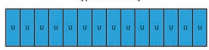

## Fig. 3.2 Slot Types

 3.1.2.1 **Cell-Specifc Higher Layer Confguration**

different types: as downlink only, uplink only, downlink dominant, uplink dominant, and full fexible (Fig. 3.2). For type 3 or type 4, the downlink PDSCH scheduling and the corresponding ACK/NACK or the UL grant and PUSCH transmission are contained in one slot, which can be considered as a type of self-contained transmission to reduce latency. All the OFDM symbols in type 5 slot are fexible and can be reserved for future to achieve the forward compatibility.

The fexible frame structure is benefcial to adapt the service traffc in downlink and uplink, which can be found in Sect. 3.2.1. The signaling of slot formats is needed for UE to obtain the frame structure that includes cell-specifc higher layer confguration, UE-specifc higher layer confguration, UE-group DCI, and UE-specifc DCI as below: The cell-specifc higher layer parameter *TDD-UL-DL-ConfgurationCommon* is used by the UE to set the slot format per slot over a number of slots indicated by the parameter. The higher layer parameter includes [4]:
{
- Reference SCS - Pattern 1
- DL/UL transmission periodicity (P1) - Number of downlink slots (X1): Number of consecutive full DL slots at the beginning of each DL-UL pattern

- Number of downlink OFDM symbols (x1): Number of consecutive DL symbols in the beginning of the slot following the last full DL slot
- Number of uplink slots (Y1): Number of consecutive full UL slots at the end of each DL-UL pattern
- Number of uplink OFDM symbols (y1): Number of consecutive UL symbols at the end of the slot preceding the frst full UL slot
}
Additionally, a second pattern, i.e., pattern 2, can be confgured in the *TDD-ULDL-ConfgurationCommon*, which has a different confguration; for example, the second pattern has more uplink slot confguration for uplink capacity and coverage. 

In this case, it is known as dual-periodicity slot confguration (Fig. 3.3). The confguration of the second pattern is optional. It is noted that the remaining slots and symbols not addressed by *TDD-UL-DL-ConfgurationCommon* during the DL/UL transmission period are default to be "fexible" and can be further confgured by other signaling.

## 3.1.2.2 **Ue-Specifc Higher Layer Confguration**

The UE-specifc higher layer parameter *TDD-UL-DL-ConfgDedicated* can be additionally confgured to override only the fexible symbols provided by *TDD-UL-DLConfgurationCommon*. The *TDD-UL-DL-ConfgDedicated* provides a set of slot 

confgurations, where each slot confguration includes the slot index and the symbol confguration for the indicated slot. The symbols in the indicated slot can be confgured for all downlink, all uplink, or a number of downlink frst symbols in the slot and a number of uplink last symbols in the slot [5].

## 3.1.2.3 **Group Common Pdcch**

In case the symbols in a set of consecutive slots in time domain indicated to a UE as fexible by higher layer parameters *TDD-UL-DL-ConfgurationCommon* and *TDDUL-DL-ConfgDedicated*, the layer 1 signaling DCI format 2_0 can be used to provide the slot format(s) for the set of consecutive slots. There are a total number of 56 slot formats defned in the specifcation [5].

DCI format 2_0 is a group common PDCCH which can be detected by a group of UEs. Whether a UE needs to detect DCI format 2_0 is confgured by the network. When a UE is confgured by higher layer signaling with parameter SlotFormatIndicator, the UE is provided with a slot format indicator (SFI-RNTI) and the payload size of DCI format 2_0. In addition, the location of SFI-index feld for a cell in DCI format 2_0 is provided. The SFI-index represents a slot format combination. The mapping between a list of slot format combinations and the corresponding SFI-index is confgured by the parameter *SlotFormatIndicator.* The slot format combination refers to the one or more slot formats that occur in the set of consecutive slots in time domain.

## 3.1.2.4 **Dl/Ul Dynamic Scheduling**

If an SFI-index feld value in DCI format 2_0 indicates the set of symbols of the slot as fexible, the set of symbols can be dynamically scheduled for downlink or uplink transmission, which depends on the received DCI format. When the UE receives a DCI format (e.g., DCI format 1_0, 1_1, 0_1 [6]) for scheduling downlink transmission PDSCH or CSI-RS in the set of symbols of the slot, the set of symbols will be used for downlink transmission. In case the UE receives a DCI format (e.g., DCI format 0_0, 0_1 [6]) for scheduling PUSCH, PUCCH, or SRS transmission in the set of symbols, it will be used for uplink transmission. If there is not any scheduling information for the set of symbols, the UE does not transmit or receive in these resources.

In summary, there are four levels of signaling to confgure the frame structure which provides much fexibility as shown in Fig.  3.4. However, considering the potential complexity and the cost of cross-link interference mitigation in the practical system, it may be enough to use only a few frame structure. Regarding the signaling, it is not mandatory for the UE to receive all the four levels of signaling. The UE can receive one or more of these signaling to obtain the frame structure.

1. Cell-specific higher layer configuration

## 3.1.3 Physical Layer Channels

After the initial access procedure (see Sect. 4.1.1 ), gNB starts to perform normal communication with the UE. The information to be transmitted in both the downlink and uplink is conveyed on different physical channels. The physical channels correspond to a set of resource elements carrying the information originating from higher layers. According to the transmission direction and the characteristics of the carried information of physical channel, a set of downlink and uplink physical channls are defined [ 7 ]. In this section, the functions of different physical channels in the DL and UL transmission are introduced. The physical random-access channel does not convey the information from higher layer, and transmits the preamble to build RRC connection, uplink synchronization, etc., which is discussed in Sect. 4.1.1.

## 3.1.3.1 Physical Broadcast Channel (Pbch)

The PBCH is detected by UE and is used to acquire the essential system information during the initial access described in the section of IAM. The system information from higher layer is divided into MIB (Master Information Block) and a number of SIB (System Information Block). The MIB is always carried on the PBCH with 80 ms periodicity and makes repetitions within 80 ms. The MIB includes the following information [ 4 ]:
System Frame Number (SFN): the 6 most significant bit (MSB) of the 10-bit SFN
Subcarrier spacing for SIB1, Msg.2/4 for initial access and broadcast SI messages
- SSB Subcarrier Offset: the frequency domain offset between SSB and the overall resource block grid in a number of subcarriers
- The time position of the frst DM-RS for the downlink or uplink - The resource confguration for SIB1 detection, e.g., a common control resource set, a common search space, and necessary PDCCH parameters for SIB1
- The cell is barred or not
- Intra-frequency reselection is allowed or not In addition to the information from the MIB transmitted in the PBCH, there are additionally 8 bits of information from physical layer as 4 least signifcant bit (LSB) of 10-bit SFN, 1 bit half-frame indication, and 3 MSB of SS/PBCH block index in case with 64 candidate SS/PBCH blocks (otherwise there is one bit as MSB of PRB offset and two reserved bits). The total payload size of PBCH is 56 bits including 24-bit CRC, which is encoded to 864 bits with very low coding rate to guarantee the reliability of PBCH detection.

The PBCH is transmitted with PSS and SSS together as the SS/PBCH block 
(SSB). The same subcarrier spacing and cyclic prefx are applied for PSS, SSS, and PBCH. An SSB consists of 4 consecutive OFDM symbols in the time domain and 240 consecutive subcarriers forming 20 SSB resource blocks in the frequency domain (Fig. 3.5). For each SSB, the PSS and SSS are located at the frst and the third OFDM symbols, respectively, and the length of PSS and SSS sequence is 127 symbols mapped onto the center resource elements of each located RB; PBCH and the associated DM-RS are mapped onto at the second and the fourth OFDM symbols and partial of the third OFDM symbol. There is one DM-RS resource element, with every four resource elements giving a PBCH DM-RS density of 1/4. For the third OFDM symbol within one SSB, PBCH and the associated DM-RS are mapped onto the 48 resource elements of both sides.

In NR, beam-based access mechanism was adopted for cell coverage. Multiple SSBs covering different beam directions are used for performing beam sweeping. More SSBs are needed in the high-frequency scenario. The maximum number of candidate SSBs within a half frame is 4/8/64 corresponding to the sub-3  GHz, 3–6 GHz, and above 6 GHz scenario, respectively. The transmission time instances of candidate SSBs, i.e., SSB pattern, within one half frame are predefned which is dependent on the subcarrier spacing and the applicable frequency range [5]. As SSB is used to determine the sub-frame timing of the associated PRACH resources, etc., the candidate SSBs need to be identifed. The candidate SSBs in a half frame are indexed from 0 to L − 1, where L = 4, 8, 64. The index of candidate SSB is implicitly associated with its corresponding PBCH DM-RS sequence when L = 4 and 8. In case L = 64, if there are 64 DM-RS sequences to associate with the SSB index, it will signifcantly increase the SSB blind detection complexity. To help with the blind detection, the index of candidate SSB is determined by obtaining the three MSB from the PBCH and three LSB from the PBCH DM-RS sequences. Once the UE successfully detects one SSB, the UE will obtain the essential system information from PBCH, frame timing according to the SFN, and index of detected SSB. For the initial-access UE, the UE can assume that the periodicity of SSBs in a half frame is 20 ms.

3

The channel raster and synchronization raster in NR are decoupled in order to have a sparse synchronization raster for reducing search complexity. In this case, the SB resource block may not be aligned with the common resource block, and there is a subcarrier offset between them. The subcarrier offset is from subcarrier 0 in the common resource block with the subcarrier spacing provided by MIB to subcarrier 0 of the SSB, where this common resource block overlaps with the subcarrier 0 of the first resource block of SSB as shown in Fig. 3.6. As the system bandwidth is not signaled in PBCH as in LTE, the UE cannot obtain the frequency position of common resource blocks according to the system bandwidth. Hence, a subcarrier offset is signaled in the PBCH for the UE to determine the frequency location of common reference point A and the common resource block arrangement. This is different from LTE in which PSS/SSS/PBCH is always located at the center of the system bandwidth, where the channel and synchronization have the same raster.

## 3.1.3.2 **Physical Shared Data Channel (Pdsch)**

There is only one transmission scheme defned for the PDSCH transmission, which is based on DM-RS similar to TM9 in LTE. From the UE perspective, up to eightlayer transmission is supported. There is no open-loop transmit diversity scheme as SFBC used in LTE defned for PDSCH transmission, which means that NR could be less robust in certain environments (such as high speeds). Hence, link adaptation in NR plays a crucial role in the network's choice of transmission parameters such as spatial precoder, frequency domain granularity of spatial precoder, and time-domain granularity of spatial precoder.

The maximum number of code word per UE for the PDSCH transmission is 2 and there is a one-to-one mapping between transport block and code word. Similar to LTE, there are the corresponding MCS, HARQ-ACK, and CQI for each code word. However, the code word to layer mapping is slightly different from LTE discussed in Sect. 3.4.3.1.1. There is one code word if the number of transmission layer is less than or equal to 4; otherwise the number of code word is 2. Such code word to layer mapping has the beneft of reducing the signaling overhead of the MCS, 
HARQ, and CQI when the rank is no more than 4, but it cannot enable to use the successive interference cancellation at the UE side in case of single code word transmission. The relationship between the number of code word and layer is a trade-off of performance and signaling overhead. The general transmission structure of NR PDSCH is shown in Fig.  3.7. As NR only supports DM-RS-based 

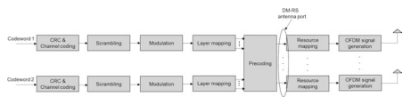

transmission scheme, the precoding operation is transparent and the data of each layer is directly mapped onto the DM-RS ports.

The channel coding scheme used for PDSCH transmission is LDPC; see Sect. 

3.4.2.1. The scrambling and modulation operation is similar to LTE, and the modulation schemes for PDSCH are QPSK, 16QAM, 64QAM, and 256QAM.

In NR, since low latency is a very important requirement [2, 8], shorter TTI is a key feature supported to fulfll the requirement. To enable the shorter TTI, the resource allocation for the PDSCH is more fexible especially in the time domain. The number of OFDM symbols allocated for PDSCH can be {3, 4,…,14} or {2,4,7} which is dependent on PDSCH mapping type. PDSCH mapping type A is used for starting the PDSCH in the frst three symbols of a slot with a duration of three symbols or more until the end of a slot. PDSCH mapping type B is used for starting the PDSCH anywhere in the slot, with a duration of 2, 4, or 7 OFDM symbols. In addition, the slot aggregation in time domain for PDSCH transmission is supported to improve the coverage. In this case, the same symbol allocation is used across a number of consecutive slots. The number of aggregated slots can be 2, 4, or 8, which is confgured by higher signaling, but there is only one downlink control channel for the slot aggregation to reduce the signaling overhead. The frequency domain resource allocation supports two types, and it is relative to a bandwidth part. Type 0 allocates resources with a bitmap of resource block groups (RBG), where each RBG is a set of consecutive virtual resource blocks. Type 1 allocates resources as a set of contiguous non-interleaved or interleaved virtual resource blocks. The network can also indicate to the UE how many physical resource blocks (PRB) are bundled with the same precoder, which constitutes precoding resource block groups (PRG) (see Sect. 3.4.3.1.2).

On the downlink, the UE receives a DL DCI over PDCCH (see Sect. 3.1.3.3). 

DCI format 1_1 offers the most scheduling fexibility, while DCI format 1_0 is more robust and can be used for fallback. A DCI scheduling PDSCH can also indicate a rate-matching pattern that allows reserving resource elements where PDSCH 
and DM-RS cannot be mapped. Such resource reservation signaling allows for example rate matching around entire OFDM symbols or PRBs, or rate matching around LTE common reference signals (CRS), or rate matching around ZP CSI-RS resources. This signaling also allows dynamic mapping of the PDSCH in REs that are semi-statically allocated for PDCCH, when the network decided not to use those resources for PDCCH in a certain slot.

## 3.1.3.3 **Physical Downlink Control Channel (Pdcch)**

The PDCCH carries downlink control information (DCI) for PDSCH scheduling, PUSCH scheduling, or some group control information, e.g., power control information for PUSCH/PUCCH/SRS and slot format confguration. The defned set of DCI formats are shown in Table 3.3 [6].

Similar to LTE, to minimize the PDSCH decoding latency, the PDCCH is normally located at the beginning 1/2/3 OFDM symbols of a slot in time domain. 

| Table 3.3   | DCI formats                                                                                                                |
|-------------|----------------------------------------------------------------------------------------------------------------------------|
| DCI  format | Usage                                                                                                                      |
| 0_0         | Scheduling of PUSCH in one cell                                                                                            |
| 0_1         | Scheduling of PUSCH in one cell                                                                                            |
| 1_0         | Scheduling of PDSCH in one cell                                                                                            |
| 1_1         | Scheduling of PDSCH in one cell                                                                                            |
| 2_0         | Notifying a group of UEs of the slot format                                                                                |
| 2_1         | Notifying a group of UEs of the PRB(s) and OFDM symbol(s) where UE may  assume that no transmission is intended for the UE |
| 2_2         | Transmission of TPC commands for PUCCH and PUSCH                                                                           |
| 2_3         | Transmission of a group of TPC commands for SRS transmissions by one or more  UEs                                          |

However PDCCH does not span the entire carrier bandwidth in the frequency domain as in LTE. The rationale is that the UE channel bandwidth may be smaller than carrier bandwidth, as well as the resource granularity of the PDCCH spanning the entire carrier bandwidth is rough which could result in increasing the resource overhead especially for larger bandwidth, e.g., 100  MHz. Hence, a number of resource blocks in the frequency domain are confgured by a higher layer for the PDCCH. The multiplexing of the PDCCH and PDSCH in one slot is TDM-like but not pure TDM. In NR, the PDSCH resource mapping is rate matched around the control resource set(s) when the PDSCH is overlapped with the confgured control resource sets.

The resource unit assigned for PDCCH is known as a control resource set 
(CORESET). A control resource set consists of NRB
CORESET resource blocks in the frequency domain and Nsymb CORESET symbols in the time domain, where the resource blocks are confgured by a bitmap. These two parameters are confgured by the higher layer parameter *ControlResourceSet* IE [4]. The assigned resource blocks are in the form of a number of resource block group (RBG) consisting of six consecutive resource blocks each. Up to three control resource sets can be confgured for one UE to reduce the PDCCH blocking probability.

Given the confgured PDCCH resources, the PDCCH is mapped onto these resources and transmitted. A PDCCH is formed by aggregating a number of control channel elements (CCEs), which depends on the aggregation level of that particular PDCCH. The aggregation level may be 1, 2, 4, 8, or 16. One CCE consists of six resource element groups (REGs) where a REG equals one resource block during one OFDM symbol. There is one resource element for PDCCH DM-RS every 4 resource elements in one REG, and therefore the number of available resource elements of one CCE is 48. The REGs within a control resource set, are numbered in increasing order in a time-frst manner, starting with 0 for the frst OFDM symbol and the lowest-numbered resource block in the control resource set as demonstrated in Fig. 3.8.

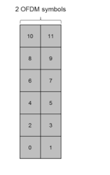

The PDCCH transmission is also based on DM-RS as PDSCH, and the transparent precoding cycling can be applied to achieve transmit diversity gain. More precoders for one PDCCH are benefcial for performance from diversity perspective, but it impacts the channel estimation performance because channel interpolation cannot be performed across the resources using different precoders. To balance the precoding gain and channel estimation performance, the concept of REG bundle was introduced. An REG bundle consists of L consecutive REGs, and the same precoding is used within a REG bundle. One CCE consists of 6/L REG bundles. The two modes of CCE to REG mapping in one control resource set are non-interleaving and interleaving. The non-interleaving mapping is such that the REG bundles of one CCE are consecutive and located together. For the interleaving mode, the REG bundles of one CCE are interleaved and distributed to achieve frequency diversity gain and randomize the inter-cell interference [7]. The REG bundle size depends on the CCE to REG mapping mode, which is summarized in Table 3.4. The bundle size enables the REGs with the same resource block index spanning over different OFDM symbols to belong to one REG bundle as illustrated in Fig. 3.9. The bundle size in the case of interleaving mode is confgurable.

At the receiver side, PDCCH is blindly detected by UE. To reduce the blind detection complexity, the number of candidate PDCCHs for blind detection is restricted while reducing the PDCCH blocking probability. A set of PDCCH candidates for a UE to monitor is defned as the PDCCH search space set. A search space set can be a common search space set or UE-specifc search space set. The common search space normally conveys some common control information for many UEs, e.g., SIB, paging, RACH response, slot format confguration, and TPC command. 

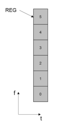

| REG bundle size                     |                  |              |
|-------------------------------------|------------------|--------------|
| Number of OFDM symbols in a CORESET | Non-interleaving | Interleaving |
| 1                                   | 6                | 2, 6         |
| 2                                   | 6                | 2, 6         |
| 3                                   | 6                | 3, 6         |

Hence, the supported aggregation levels in the common search space are high as 4/8/16 to guarantee the performance. DCI formats 0_0, 1_0, 2_0, 2_1, 2_2, and 2_3 can be signaled in the common search space. DCI formats 0_1 and 1_1 for UE-specifc scheduling information are signaled in the UE-specifc search space. The aggregation levels of UE-specifc search space are 1/2/4/8/16.

The PDCCH blind detection procedure is similar to LTE, but the difference is some related blind detection parameters are confgured by the network for fexibility. The number of search space sets for UE to monitor is confgured by higher layer signaling, and each search space set is associated with one control resource set. In addition, the information related to each confgured search space set is also signaled, e.g., common or UE-specifc search space set and the number of PDCCH 
candidates for each aggregation level [9].

## 3.1.3.4 **Physical Uplink Shared Data Channel (Pusch)**

For PUSCH, both DFT-S-OFDM- and CP-OFDM-based transmissions are supported (see Sect. 3.4.1). Two transmission schemes are supported for the PUSCH: codebook-based transmission and non-codebook-based transmission. The difference of these two schemes is whether the precoding operation is transparent or not. 

For codebook-based transmission scheme, the UE is confgured to use one or more SRS resources for SRS transmission. More than one SRS resource is better for The PUCCH conveys uplink control information (UCI) including scheduling request (SR), HARQ-ACK, and periodic CSI.  Based on the control content and payload size of PUCCH, multiple PUCCH formats are supported as shown in Table 3.5.

The PUCCH has a short-duration transmission with 1 or 2 OFDM symbols and a long-duration transmission with 4–14 OFDM symbols within one slot. Within one slot, intra-slot frequency hopping can be confgured to take advantage of the frequency diversity gain in case the number of OFDM symbols is more than 1. If it is confgured, the number of symbols in the frst hop is the foor of half of the length of OFDM symbols. The support of duration less than 4 symbols PUCCH is for lowlatency transmission. The number of symbols for PUCCH is confgured by higher layer signaling based on the requirement of both latency and coverage. The PUCCH formats with one or two symbols are normally applied in the DL dominant slot, which is transmitted in the last one or two symbols of one slot. Other PUCCH formats can be used in the UL dominant slot.

3 5G Fundamental Air Interface Design higher frequency scenario because beam management is easier. Based on the transmitted SRS, the network selects the preferred SRS resource, transmission rank, and precoder corresponding to the preferred SRS resource. Then the network signals them in the uplink grant DCI format 0_1. The signaled information is used by the UE for PUSCH precoding. The codebooks used for DFT-S-OFDM and CP-OFDM 
are defned in [7]. In the case of DFT-S-OFDM, only rank 1 codebook was defned for both two and four antenna ports. The reason is that DFT-S-OFDM is normally used for the coverage-limited scenario due to low cubic metric. In this scenario, rank 1 transmission is the typical case. For non-codebook-based transmission scheme, the UE frst determines a number of precoders based on the measurement from CSI-RS in downlink. Then a number of SRS is precoded by these precoders and transmitted by the UE. The network selects the preferred precoded SRS. After the selection, the network signals the index of the preferred precoded SRS to UE. The UE uses the precoder corresponding to the signaled precoded SRS for the PUSCH transmission, but the precoding is transparent. The non-codebook-based transmission scheme is more applicable for TDD operation with channel reciprocity.

PUSCH transmission is based on DM-RS and up to four-layer transmission for one UE is supported. The number of transmission layer is determined by the network regardless of codebook- or non-codebook-based transmission scheme. The same code word to layer mapping as downlink is used, and, therefore, there is only one code word for PUSCH. However, from the network perspective, it can support up to 12-layer transmission in the form of MU-MIMO because of DM-RS capacity. In NR, downlink and uplink use the same DM-RS structure in order to keep the orthogonality of downlink and uplink reference signal, which can ease the crosslink interference mitigation in the case of fexible duplex.

## 3.1.3.5 **Physical Uplink Control Channel (Pucch)**

| Table 3.5      | PUCCH formats Length of OFDM  symbols L   | Number of bits   | UCI type                                     |
|----------------|-------------------------------------------|------------------|----------------------------------------------|
| 0              | 1–2                                       | 1 or 2           | HARQ-ACK, SR, HARQ-ACK/SR                    |
| PUCCH format 1 | 4–14                                      | 1 or 2           | HARQ-ACK, SR, HARQ-ACK/SR                    |
| 2              | 1–2                                       | >2               | HARQ-ACK, HARQ-ACK/SR, CSI,  HARQ-ACK/SR/CSI |
| 3              | 4–14                                      | >2               | HARQ-ACK, HARQ-ACK/SR, CSI,  HARQ-ACK/SR/CSI |
| 4              | 4–14                                      | >2               | CSI, HARQ-ACK/SR, HARQ-ACK/ SR/CSI           |

## 3.1.3.5.1 Pucch Format 0

The transmission of PUCCH format 0 is constrained to one resource block in the frequency domain. The 1- or 2-bit information on PUCCH format 0 is transmitted by performing sequence selection. The used sequences are the cyclic shifts of one low PAPR base sequence [7]. One cyclic shift is selected from a set of 2 or 4 cyclic shifts according to the 1- or 2-bit information to be transmitted. The selected cyclic shift is used to generate PUCCH sequence and then transmitted. For SR, a positive SR uses a predefned cyclic shift and the sequence corresponding to the predefned cyclic shift is transmitted, and nothing is transmitted for negative SR. In case there is simultaneous transmission of HARQ-ACK and positive SR, a different set of 2 or 4 cyclic shift values are used for selection. It should be noted that for PUCCH format 0 there is no DM-RS sequence for coherent detection. The network can detect the received sequence to obtain the information.

## 3.1.3.5.2 Pucch Format 1

The one or two information bits are modulated as one BPSK or QPSK symbol, respectively. The modulation symbol is spread by a sequence with length 12, and then is block-wise spread with an orthogonal code covering (OCC). Two-dimensional spreading is used, which is similar to the PUCCH format 1a/1b in LTE. The multiplexing of PUCCH data and DM-RS is interlaced in the time domain. The length of the PUCCH data depends on the number of OFDM symbols for PUCCH format 1, which is equal to ⌊L/2⌋. The remaining L − ⌊L/2⌋ symbols are used for DM-RS. The multiplexing capacity is determined by the number of available cyclic shifts and OCC. The transmission structure of PUCCH format 1 with 14 OFDM symbols is illustrated in Fig. 3.10.

## 3.1.3.5.3 Pucch Format 2

The PUCCH format 2 is for moderate payload size UCI transmission due to the restriction of the number of OFDM symbols. As the typical scenario of PUCCH 
format 2 with 1 or 2 OFDM symbols is not the coverage-limited case, PUCCH format 2 transmission is similar to OFDM-based PUSCH. The coded information bits after channel coding are scrambled and QPSK modulated. The modulation symbols are then mapped onto the resource elements of the physical resource blocks confgured for PUCCH format 2. In each of the symbols confgured for PUCCH format 2, DM-RS and PUCCH UCI information are FDM-based multiplexed, and there is one resource element for DM-RS every three resource elements as shown in Fig. 3.11. The number of resource block and symbol for PUCCH format 2 is confgured by higher layer signaling.

## 3.1.3.5.4 Pucch Formats 3 And 4

PUCCH format 3 is for large payload size of UCI. Both PUCCH format 3 and 4 transmissions are based on DFT-S-OFDM which has low PAPR to enhance coverage, which is similar to LTE PUCCH formats 4 and 5, respectively. The difference is that the number of symbols, ranging from 4 to 14, is confgured. The number of subcarrier assigned for PUCCH format 3 shall fulfll the requirement of 2 3 5 α2 α α 3 5 .

| Table 3.6    | DM-RS positions for PUCCH formats 3 and 4 DM-RS position l within PUCCH span No additional DM-RS   | Additional DM-RS   |         |      |
|--------------|----------------------------------------------------------------------------------------------------|--------------------|---------|------|
| No hopping   | Hopping                                                                                            | No hopping         | Hopping |      |
| 4            | 1                                                                                                  | 0, 2               | 1       | 0, 2 |
| 5            | 0, 3                                                                                               | 0, 3               |         |      |
| 6            | 1, 4                                                                                               | 1, 4               |         |      |
| 7            | 1, 4                                                                                               | 1, 4               |         |      |
| 8            | 1, 5                                                                                               | 1, 5               |         |      |
| 9            | 1, 6                                                                                               | 1, 6               |         |      |
| 10           | 2, 7                                                                                               | 1, 3, 6, 8         |         |      |
| 11           | 2, 7                                                                                               | 1, 3, 6, 9         |         |      |
| 12           | 2, 8                                                                                               | 1, 4, 7, 10        |         |      |
| 13           | 2, 9                                                                                               | 1, 4, 7, 11        |         |      |
| 14           | 3, 10                                                                                              | 1, 5, 8, 12        |         |      |
| PUCCH length |                                                                                                    |                    |         |      |

as PUSCH to reduce the implementation complexity. PUCCH format 4 is, however, constrained in one resource block, and block-wise spreading across the frequency domain within one resource block is used. The length of block-wise spreading is 2 or 4. The PUCCH format 4 of different UEs can be multiplexed by using different orthogonal sequences. The orthogonal sequence is confgured by the higher layer signaling. To preserve the single carrier property, the multiplexing of PUCCH data and DM-RS is TDM as in Table 3.6 [7].

## 3.1.4 Physical Layer (Phy) Reference Signals

For a wireless communication system, reference signal (aka pilot signal) is one of the key elements of the system design. Reference signal in general carries multiple fundamental functionalities to ensure proper and highly effcient PHY layer performances. Such functionalities include synchronization in time, frequency, and phase between the transmitters and receivers, conveying channel characteristics (long term and short term) for transmission property determination at the transmitter side and channel estimation and feedback at the receiver side; access link identifcation; and quality measurement. Though designing a single reference (for downlink) to fulfll all of these functionalities is possible, as in the case of the frst release of LTE, 
it will largely limit the performance and fexibility of the system. Therefore, fabricating a set of small number of reference signals to jointly fulfll these functionalities is a better choice. While on the surface NR may appear to have quite some similarity in terms of reference signal design to that of LTE, learning from the advantages and shortcomings of LTE, NR reference signal adopted a new design framework from the beginning and took into account additional design requirements that are unique for 5G networks. In the following, NR reference signal design framework and considerations are frst elaborated followed by design details for each type of reference signal including demodulation reference signal (DM-RS), channel state information reference signal (CSI-RS), sounding reference signal (SRS), and phase tracking reference signal (PT-RS). Quasi-co-location (QCL) and transmission confguration indicator (TCI) are then described as the linkage between different reference signals.

## 3.1.4.1 **Reference Signal Design Framework And Considerations**

As of the design framework, one of the fundamental changes of NR is to remove cell common reference signal (CRS) as in LTE system [10]. In LTE, CRS carries several important functionalities including cell identifcation, time and frequency synchronization, RRM measurement, data and control channel demodulation, and CSI measurement. It is (almost) the single reference signal for downlink in LTE Release-8 and is to transmit in every downlink sub-frame with certain time and frequency density to meet the minimum requirements of the most stringent functionality. CRS transmission is always on regardless of the presence and absence of data transmission except for the case with cell on/off and license-assisted access 
(LAA) introduced in its later releases. An always-on signal imposes persistent interference and overhead even when there is no data traffc and degrades the system performance signifcantly especially when the network deployment is dense [11]. In addition to interference and overhead issue, always-on CRS also largely limits the fexibility of the system design and forward compatibility which is a problem that became obvious for LTE during the discussions of small cell enhancements and new carrier type in 3GPP Release-12. Therefore, eliminating always-on CRS was adopted as a basic design assumption for NR.

The functionalities carried by CRS thus should be distributed among other reference signals or newly designed NR reference signals. Figure 3.12 shows the overview of LTE functionalities and the corresponding reference signals. As shown in Fig. 3.12, in LTE, UE acquires coarse time/frequency synchronization and cell identifcation through the detection of PSS/SSS (SS). Cell identifcation is also partially carried out through CRS as PBCH demodulation reference signal. CRS also carries the functionalities of digital AGC, fne time/frequency synchronization, and RRM measurement. CRS provides data demodulation reference signal for transmission modes 1–6 and control demodulation reference signal for all of the transmission modes (except for EPDCCH demodulation). In CSI measurement, CRS is used for deriving the signal part for transmission modes 1–8 and the interference part for transmission modes 1–9. CSI-RS is utilized in transmission modes 9 and 10 for measuring signal quality. DM-RS is the data demodulation reference signal for transmission modes 7–10 and EPDCCH control channel demodulation reference signal. DRS consists of SS, windowed CRS, and optionally CSI-RS 
and carries the functionalities of cell discovery and RRM measurement.

Fig. 3.12 LTE reference signal set and functionalities In LTE, QCL is defned with respect to delay spread, Doppler spread, Doppler shift, average gain, and average delay. LTE defnes several QCL assumptions among reference signals: - CRS ports of serving cell are assumed to be quasi-co-located with respect to delay spread, Doppler spread, Doppler shift, average gain, and average delay.

- CSI-RS, DM-RS ports, and their tied CRS ports are assumed to be quasi-colocated with respect to Doppler spread, Doppler shift, delay spread, and average delay.

- SS and CRS ports are assumed to be quasi-co-located with respect to Doppler shift and average gain.

The long-term channel characteristics derived from CRS can be utilized to facilitate the reception of the target reference signals when they can be assumed to be quasi-co-located.

With the removal of CRS, all of the functionalities (including cell identifcation 
(partial), fne time/frequency tracking, RRM measurements, digital AGC, CSI acquisition (partial), control channel demodulation) and long-term channel property estimation for QCL assumptions carried by it should be distributed to other reference signals or newly designed NR reference signals.

In addition, NR design should support frequency of up to 100 GHz. To combat the signifcantly higher path loss at these high-frequency bands, hybrid (analog/
digital) beamforming as a good trade-off between complexity and performance needs to be supported. In addition to the RS functionalities for the low-frequency band, NR design should consider the additional RS design to facilitate the analog beam acquisition, tracking, and feedback. Another issue for communication system in the high carrier frequency band is the phase noise. Compared to low-frequency band, the phase noise is considerably larger in the high-frequency band. Performance degradation caused by phase noise could be mitigated by increasing the subcarrier spacing to some extent. However, larger subcarrier spacing means shorter symbol length and larger CP length overhead. Thus with the possible maximum subcarrier spacing limitation, a specifc RS to fulfll this purpose may be introduced.

The overall reference signal design framework is summarized as follows 
(Fig. 3.13): - SSB enhanced for T/F synchronization
- CSI-RS confgurations to multiple functionalities such as fne T/F synchronization and main QCL assumption source (as TRS), RRM (jointly with SSB), CSI 
acquisition, discovery, and beam management
- DM-RS for demodulation of PDSCH/PUSCH and PDCCH - PT-RS is introduced for phase noise compensation - Uplink SRS
One key aspect that is worth mentioning is that all of the above reference signals are UE specifcally confgurable and hence effectively no cell common reference signal exists in NR.

## 3.1.4.2 **Demodulation Reference Signal**

As only one transmission scheme based on DM-RS is defned in NR, its design needs to consider different scenarios and various and sometimes conficting requirements including:
- Good channel estimation performance: as the reference signal for demodulation, 

good channel estimation performance is a most important criteria for DM-RS design. This demands suffcient signal density in time and frequency matching the underlined radio channel characteristics and the confgured numerology.

- DM-RS time and frequency pattern design need to support a large range of carrier frequency from below 1 GHz to up to 100 GHz and various velocities of up to 500 km/h while also considering that numerology may generally scale with carrier frequency.

- Total number of orthogonal DM-RS ports and its multiplexing scheme(s) with relatively small DM-RS overhead while ensuring good demodulation performance to support the large number of data layers for massive SU/MU-MIMO 
transmissions.

- In addition to MBB traffc, NR also needs to support URLLC type of services. 

DM-RS design should then also enable very small channel estimation and demodulation processing time at the receiver.

- Flexible and confgurable numerology and frame structure are key properties of the NR design. DM-RS design needs to ft into these vast number of possible confgurations. One implementation of the fexible frame structure is to enable fexible duplexing of downlink and uplink transmission which may introduce severe cross-link interference. To mitigate the impact of such interference to channel estimation performance, common downlink and uplink DM-RS design that allows confguration of orthogonal downlink and uplink DM-RS transmissions is desirable.

In the following, overall design of NR DMRS is described followed by details of type 1 and type 2 DM-RS confgurations.

## 3.1.4.2.1 Overall Design Of Nr Dm-Rs

For DM-RS time and frequency pattern, two types (type 1 and type 2) of confgurations are introduced in NR. Type 1 DM-RS supports up to 4 orthogonal DM-RS ports when 1 symbol is confgured for DM-RS transmission and up to 8 orthogonal DM-RS ports when 2 symbols are confgured. Type 2 DM-RS supports up to 6 orthogonal DM-RS ports when 1 symbol is confgured for DM-RS transmission and up to 12 orthogonal DM-RS ports when 2 symbols are confgured. These orthogonal DM-RS ports are multiplexed in time domain and frequency domain by OCC. Both types of DM-RS confgurations are confgurable for downlink and for uplink and it can be confgured such that the DM-RSs for downlink and uplink are orthogonal to each other.

Two 16-bit confgurable DM-RS scrambling IDs are supported. The confguration is by RRC and in addition the scrambling ID is dynamically selected and indicated by DCI. Before RRC confguring the 16-bit DM-RS scrambling IDs, cell ID 
is used for DM-RS scrambling.

When mapping to symbol locations of a PDSCH/PUSCH transmission within a slot, front-loaded DM-RS symbol(s) only or front-loaded DM-RS plus additional DM-RS symbol(s) can be confgured. The additional DM-RS when present should be the exact copy of the front-loaded DM-RS for the PDSCH/PUSCH transmission, i.e., the same number of symbols, antenna ports, and sequence.

With front-loaded-only DM-RS, channel estimation can only rely on these 1 or 2 

symbols in the early part of data transmission duration in order to speed up demodulation and reduce overall latency. However, without additional DM-RS symbol to enable time domain interpretation/fltering, the channel estimation and hence overall performance will degrade for scenarios with just moderate mobility.

For PDSCH/PUSCH mapping type A, the front-loaded DM-RS starts from the third or fourth symbols of each slot (or each hop if frequency hopping is supported). For PDSCH/PUSCH mapping type B, the front-loaded DM-RS starts from the frst symbol of the transmission duration. Number of additional DM-RS can be 1, 2, or 3 per network confgurations. The location of each additional DM-RS depends on the duration (i.e., number of OFDM symbols) of the PDSCH/PUSCH transmission and follows a set of general rules for better channel estimation performance. These rules include no more than 2 OFDM symbols for PDSCH/PUSCH after the last DM-RS, 2 to 4 symbols between neighboring DM-RSs, and DM-RSs almost evenly distributed in time. Figures 3.14 and 3.15 show some examples.

Two enhancements to reduce DM-RS PAPR are introduced in Release-16. For CP-OFDM PDSCH and PUSCH, code division multiplexing (CDM) group-dependent sequence generation is used for DM-RS to solve the high PAPR issue observed for Release-15 design where same sequences are used for different CDM groups. In addition, for PUSCH/PUCCH DM-RS for pi/2 modulation, new DM-RS sequences are specifed in Release-16 to reduce the PAPR to the same level as for data symbols. In these cases, computer-generated sequence is used for lengths 6, 12, 18, and 24. For lengths 12, 18, and 24, BPSK sequences are adopted. For length 6, 8PSK 
sequences are selected. For sequences with length 30 or larger, DMRS for π/2 BPSK modulation for PUCCH is generated based on gold sequence followed by π/2 BPSK 
modulation followed by transform precoding.

## 3.1.4.2.2 Dm-Rs Type 1 Confguration

For DM-RS type 1 confguration, as shown in Fig. 3.16, comb of every other tone in frequency and a cyclic shift in frequency is allocated to a DM-RS antenna port. With 2 combs and 2 cyclic shifts, 4 orthogonal DM-RS ports are supported when 1 OFDM symbol is confgured. When 2 OFDM symbols are confgured for DM-RS 
type 1 confguration, time domain OCC of size 2 is further used to generate orthogonal DM-RS ports which gives a total of 8 orthogonal ports.

DM-RS type 1 can be confgured for CP-OFDM PDSCH and PUSCH. For DFTs-OFDM PUSCH, only type 1 DM-RS is used. Type 1 DM-RS with a specifc confguration is also used before RRC as default DM-RS pattern.

For DM-RS type 2 confguration, as shown in Fig. 3.17, frequency domain OCC of size 2 over adjacent 2 REs and FDM are used to support 6 orthogonal DM-RS ports when 1 OFDM symbol is confgured. When 2 OFDM symbols are confgured for DM-RS type 2 confguration, time domain OCC of size 2 is further used to generate orthogonal DM-RS ports which gives a total of 12 orthogonal ports. With more orthogonal ports, type 2 confguration can potentially provide high system throughput for massive MIMO where a large number of data streams of MU-MIMO is desired. DM-RS type 2 can only be confgured for CP-OFDM PDSCH and PUSCH by RRC confguration.

## 3.1.4.3 **Csi-Rs**

CSI reference signal (CSI-RS) for NR generally takes the LTE CSI-RS as starting point, but is expended further to support, in addition to CSI acquisition, beam management, time and frequency tracking, and RRM measurement. In order to support these variety of functionalities which naturally come with different performance target and design requirements, NR CSI-RS overall design needs to have a lot more fexibility and confgurability in terms of number of antenna ports, time and frequency resource pattern, density in frequency, periodicity in time, etc. In the following, we frst describe the overall design of CSI-RS followed by specifcs of CSI-RS for each functionality.

## 3.1.4.3.1 General Design Of Csi-Rs

Overall, NR CSI-RS was designed to support a variety of number of antenna ports from single port to up to 32 orthogonal ports, different frequency domain density of {1/2, 1, 3} REs per PRB, and confgurable periodicity of {4, 5, 8, 10, 16, 20, 32, 40, 64, 80, 160, 320, 640} slots as well as aperiodic (i.e., trigger based) transmission. 

Note that here the periodicity in time is in the unit of slot and hence depends on the numerology of the carrier/BWP.

The numbers of CSI-RS antenna ports supported are {1, 2, 4, 8, 12, 16, 24, and 32}. Extensive discussions and considerations had been taken into account to design the time and frequency resource mapping and CDM multiplexing of these antenna ports as shown in Table 3.7 [7]. In general, a CSI-RS resource pattern is aggregated with 2- or 4- or 8-port CSI-RS patterns and multiple density {1/2, 1, 3} and CDM of 2, 4, or 8 is supported. More specifcally:

| Table 3.7                    | CSI-RS locations (time and frequency patterns) within a slot   |           |            |                                                                                                                                                                                           |            |       |      |    |
|------------------------------|----------------------------------------------------------------|-----------|------------|-------------------------------------------------------------------------------------------------------------------------------------------------------------------------------------------|------------|-------|------|----|
| Number                       | Time and frequency                                             | CDM group |            |                                                                                                                                                                                           |            |       |      |    |
| Row                          | of ports                                                       | Density   | cdm-Type   | locations ( k l,                                                                                                                                                                          | )          | index | k′   | l′ |
| 1                            | 1                                                              | 3         | No CDM     | (k0, l0), (k0 + 4, l0),                                                                                                                                                                   | 0, 0, 0    | 0     | 0    |    |
| (k0 + 8, l0)                 |                                                                |           |            |                                                                                                                                                                                           |            |       |      |    |
| 2                            | 1                                                              | 1, 0.5    | No CDM     | (k0, l0)                                                                                                                                                                                  | 0          | 0     | 0    |    |
| 3                            | 2                                                              | 1, 0.5    | FD-CDM2    | (k0, l0)                                                                                                                                                                                  | 0          | 0, 1  | 0    |    |
| 4                            | 4                                                              | 1         | FD-CDM2    | (k0, l0), (k0 + 2, l0)                                                                                                                                                                    | 0, 1       | 0, 1  | 0    |    |
| 5                            | 4                                                              | 1         | FD-CDM2    | (k0, l0), (k0, l0 + 1)                                                                                                                                                                    | 0, 1       | 0, 1  | 0    |    |
| 6                            | 8                                                              | 1         | FD-CDM2    | (k0, l0), (k1, l0), (k2, l0),  0, 1, 2, 3                                                                                                                                                 | 0, 1       | 0     |      |    |
| (k3, l0)                     |                                                                |           |            |                                                                                                                                                                                           |            |       |      |    |
| 7                            | 8                                                              | 1         | FD-CDM2    | (k0, l0), (k1, l0), (k0,                                                                                                                                                                  | 0, 1, 2, 3 | 0, 1  | 0    |    |
| l0 + 1), (k1, l0 + 1)        |                                                                |           |            |                                                                                                                                                                                           |            |       |      |    |
| 8                            | 8                                                              | 1         | CDM4 (FD2, | (k0, l0), (k1, l0)                                                                                                                                                                        | 0, 1       | 0, 1  | 0, 1 |    |
| TD2)                         |                                                                |           |            |                                                                                                                                                                                           |            |       |      |    |
| 9                            | 12                                                             | 1         | FD-CDM2    | (k0, l0), (k1, l0), (k2, l0),  0, 1, 2, 3, 4, 5                                                                                                                                           | 0, 1       | 0     |      |    |
| (k3, l0), (k4, l0), (k5, l0) |                                                                |           |            |                                                                                                                                                                                           |            |       |      |    |
| 10                           | 12                                                             | 1         | CDM4 (FD2, | (k0, l0), (k1, l0), (k2, l0)                                                                                                                                                              | 0, 1, 2    | 0, 1  | 0, 1 |    |
| TD2)                         |                                                                |           |            |                                                                                                                                                                                           |            |       |      |    |
| 11                           | 16                                                             | 1, 0.5    | FD-CDM2    | (k0, l0), (k1, l0), (k2, l0),  (k3, l0), (k0, l0 + 1),  (k1, l0 + 1), (k2,  l0 + 1), (k3, l0 + 1) 0, 1, 2, 3, 4, 5,                                                                       | 0, 1       | 0     |      |    |
| 6, 7                         |                                                                |           |            |                                                                                                                                                                                           |            |       |      |    |
| 12                           | 16                                                             | 1, 0.5    | CDM4 (FD2, | (k0, l0), (k1, l0), (k2, l0),  0, 1, 2, 3                                                                                                                                                 | 0, 1       | 0, 1  |      |    |
| TD2)                         | (k3, l0)                                                       |           |            |                                                                                                                                                                                           |            |       |      |    |
| 13                           | 24                                                             | 1, 0.5    | FD-CDM2    | (k0, l0), (k1, l0), (k2, l0),  (k0, l0 + 1), (k1,  l0 + 1), (k2, l0 + 1),(k0,  l1), (k1, l1), (k2, l1), (k0,  l1 + 1), (k1, l1 + 1),  (k2, l1 + 1) 0, 1, 2, 3, 4, 5,  6, 7, 8, 9,  10, 11 | 0, 1       | 0     |      |    |
| (continued)                  |                                                                |           |            |                                                                                                                                                                                           |            |       |      |    |

| Table 3.7   | (continued)                                                         |           |            |                                                                                                                                                                                                                                                              |         |       |       |    |
|-------------|---------------------------------------------------------------------|-----------|------------|--------------------------------------------------------------------------------------------------------------------------------------------------------------------------------------------------------------------------------------------------------------|---------|-------|-------|----|
| Number      | Time and frequency                                                  | CDM group |            |                                                                                                                                                                                                                                                              |         |       |       |    |
| Row         | of ports                                                            | Density   | cdm-Type   | locations ( k l,                                                                                                                                                                                                                                             | )       | index | k′    | l′ |
| 14          | 24                                                                  | 1, 0.5    | CDM4 (FD2, | (k0, l0), (k1, l0), (k2, l0),  0, 1, 2, 3, 4, 5                                                                                                                                                                                                              | 0, 1    | 0, 1  |       |    |
| TD2)        | (k0, l1), (k1, l1), (k2, l1)                                        |           |            |                                                                                                                                                                                                                                                              |         |       |       |    |
| 15          | 24                                                                  | 1, 0.5    | CDM8 (FD2, | (k0, l0), (k1, l0), (k2, l0)                                                                                                                                                                                                                                 | 0, 1, 2 | 0, 1  | 0, 1, |    |
| TD4)        | 2, 3                                                                |           |            |                                                                                                                                                                                                                                                              |         |       |       |    |
| 16          | 32                                                                  | 1, 0.5    | FD-CDM2    | (k0, l0), (k1, l0), (k2, l0),  (k3, l0),(k0, l0 + 1), (k1,  l0 + 1), (k2, l0 + 1),  (k3, l0 + 1), (k0, l1),  (k1, l1), (k2, l1), (k3, l1),  (k0, l1 + 1), (k1,  l1 + 1), (k2, l1 + 1),  (k3, l1 + 1) 0, 1, 2, 3, 4, 5,  6, 7, 8, 9, 10,  11, 12, 13,  14, 15 | 0, 1    | 0     |       |    |
| 17          | 32                                                                  | 1, 0.5    | CDM4 (FD2, | (k0, l0), (k1, l0), (k2, l0),                                                                                                                                                                                                                                |         |       |       |    |
| TD2)        | (k3, l0), (k0, l1), (k1, l1),  (k2, l1), (k3, l1) 0, 1, 2, 3, 4, 5, | 0, 1      | 0, 1       |                                                                                                                                                                                                                                                              |         |       |       |    |
| 6, 7        |                                                                     |           |            |                                                                                                                                                                                                                                                              |         |       |       |    |
| 18          | 32                                                                  | 1, 0.5    | CDM8 (FD2, | (k0, l0), (k1, l0), (k2, l0),  0, 1, 2, 3                                                                                                                                                                                                                    | 0, 1    | 0, 1, |       |    |
| TD4)        | (k3, l0)                                                            | 2, 3      |            |                                                                                                                                                                                                                                                              |         |       |       |    |

- For 1-port CSI-RS, comblike resource mapping in frequency domain without CDM is used. For density (ρ) of 3 REs/PRB, comb-4 is used and for density of 1 or 0.5 REs/PRB, comb-12 is used within a PRB while every other PRB is mapped for density of 0.5 REs/PRB. See rows 1 and 2 of the table.

- For 2-port CSI-RS, frequency domain CDM of 2 (FD-CDM2) over 2 consecutive REs is used. For density of 0.5 REs/PRB, every other PRB is mapped. See row 3 of the table.

- For 4-port CSI-RS, FDM over 2 neighboring pairs of 2 consecutive REs with FD-CDM2 (as given in row 4) and TDM over 2 consecutive OFDM symbols each with FD-CDM2 of 2 REs of the same location (as given in row 5) are supported.

- For 8-port CSI-RS, FDM over 4 pairs of 2 consecutive REs with FD-CDM2 (as given in row 6) or TDM over 2 consecutive OFDM symbols each on the same location having FDM over 2 pairs of FD-CDM2 of 2 REs (as given in row 7) or FDM over 2 sets of 4 REs each of which in term uses CDM4 from a combination of FD2 (over 2 consecutive REs) and TD2 (over 2 consecutive OFDM symbols) (as shown in row 8) is supported.

- For 12-port CSI-RS, FDM over 6 pairs of 2 consecutive REs with FD-CDM2 (as given in row 9) or FDM over 3 sets of 4 REs each of which in term uses CDM4 from a combination of FD2 (over 2 consecutive REs) and TD2 (over 2 consecutive OFDM symbols) (as shown in row 10) is supported.

- For 16-port CSI-RS, TDM over 2 consecutive OFDM symbols each on the same location having FDM over 4 pairs of FD-CDM2 of 2 REs (as given in row 11) or FDM over 4 sets of 4 REs each of which in term uses CDM4 from a combination of FD2 (over 2 consecutive REs) and TD2 (over 2 consecutive OFDM symbols) (as shown in row 12) is supported.

- For 24-port CSI-RS, TDM over 2 sets of 2 consecutive OFDM symbols (i.e., 
total 4 OFDM symbols) each on the same location having FDM over 3 pairs of FD-CDM2 of 2 REs (as given in row 13) or TDM of 2 sets of 12 ports where each set uses FDM over 3 sets of 4 REs each of which in term uses CDM4 from a combination of FD2 (over 2 consecutive REs) and TD2 (over 2 consecutive OFDM symbols) and these two sets of 12 ports is aligned in frequency location (as given in row 14), or FDM over 3 sets of 8 REs each of which in term uses CDM8 from a combination of FD2 (over 2 consecutive REs) and TD4 (over 4 consecutive OFDM symbols) (as shown in row 15) is supported.

- For 32-port CSI-RS, TDM over 2 sets of 2 consecutive OFDM symbols (i.e., 
total 4 OFDM symbols) each on the same location having FDM over 4 pairs of FD-CDM2 of 2 REs (as given in row 16) or TDM of 2 sets of 16 ports where each set uses FDM over 4 sets of 4 REs each of which in term uses CDM4 from a combination of FD2 (over 2 consecutive REs) and TD2 (over 2 consecutive OFDM symbols) and these two sets of 16 ports is aligned in frequency location (as given in row 17), or FDM over 4 sets of 8 REs each of which in term uses CDM8 from a combination of FD2 (over 2 consecutive REs) and TD4 (over 4 consecutive OFDM symbols) (as shown in row 18) is supported. Among the above time and frequency pattern and multiplexing confgurations, a subset of them may be used for different functionalities.

## 3.1.4.3.2 Csi-Rs For Csi Acquisition

The prominent usage of CSI-RS, as indicated by its name, is for UE to preform measurements for CSI report. CSI-RS-related resource confgurations for CSI 
reporting are described below. A very-high-level description is given here. In general, UE needs to perform channel measurement(s) for reporting CSI over some NZP (nonzero power) CSI-RS resource(s). For certain cases, UE also needs to perform interference measurement(s) over additional resource(s) in order to derive proper CSI report(s) and these additional resource(s) can be CSI-IM (channel state information-interference measurement) resources or they can also be NZP CSI-RS resources or a combination of both.

The resources for CSI reporting, named CSI resource settings, are confgured via higher layer signaling. Each CSI resource setting *CSI-ResourceConfg* contains a confguration of a list of CSI resource sets (given by higher layer parameter *csi-RSResourceSetList*), where the list is comprised of references to either or both of NZP 
CSI-RS resource set(s) and SS/PBCH block set(s) or the list is comprised of references to CSI-IM resource set(s). Each NZP CSI-RS resource set consists of a number of NZP CSI-RS resource(s). The UE can be confgured with one or more CSI-IM 
resource set confguration(s) as indicated by the higher layer parameter *CSI-IMResourceSet*. Each CSI-IM resource set consists of a number of CSI-IM resource(s).

A CSI-IM resource confguration is basically a set of RE resources with time and frequency pattern of (2, 2) or (4, 1). The UE is to measure interference level on CSI-IM resource but not any specifc signal. On the other hand, when NZP CSI-RS 
resource is confgured for interference measurement, the UE is to measure interference level associated with specifc signals transmitted there.

It is worth to clarify here what is a ZP (zero power) CSI-RS resource in NR. UE 
can be confgured with one or more ZP CSI-RS resource set confgurations, with each ZP CSI-RS resource set consisting of a number of ZP CSI-RS resources. A ZP 
CSI-RS resource confguration consists of a set of RE resources with time and frequency pattern as of a CSI-RS resource and, with corresponding confguration and indication from the network, the UE will then assume that the RE resources associated with the ZP CSI-RS resource(s) are not mapped for PDSCH transmission.

## 3.1.4.3.3 Csi-Rs For Beam Management

For downlink beam management as well as uplink beam management when beam correspondence is supported by the UE, CSI-RS resource set is confgured for the UE to select preferred downlink transmit beam(s) (i.e., spatial domain transmission flter) via L1 RSRP reporting.

Downlink receiving beam sweeping can be implemented by gNB that confgures and transmits a CSI-RS resource set with the higher layer parameter *repetition* set to "on," and the UE may assume that the CSI-RS resources within the set are transmitted with the same downlink transmission beam and hence try different receiving beam. Downlink transmission beam sweeping can be implemented by gNB that confgures and transmits a CSI-RS resource set with the higher layer parameter repetition set to "off," and the UE shall not assume that the CSI-RS resources within the set are transmitted with the same downlink transmission beam. The UE may use the same receiving beam to receive and measure these CSI-RS resources and then report the best CSI-RS resources which correspond to the best transmission beams at the gNB side. With the combination of multiple CSI-RS resource sets with higher layer parameter *repetition* set to "on" or "off" and proper confguration of UE reporting, different beam management procedures can be implemented. Note that for CSI-RS resource set used for beam management purpose, it should have only the same number (1 or 2) of ports for all the CSI-RS resources within the set.

## 3.1.4.3.4 Csi-Rs For Time And Frequency Tracking

Tracking functionalities in NR system (as in LTE) include coarse time/frequency tracking, fne time/frequency tracking, and delay/Doppler spread tracking. In addition to the absence of CRS, NR supports a large variety of system bandwidth, subcarrier spacing, and carrier frequency. In addition to meeting the tracking performance requirements, signaling overhead, confguration fexibility, and performance robustness should also be considered. In order to satisfy tracking performance, based on the evaluation for various applicable scenarios, the reference signal should meet certain minimum design criteria, for example, time and frequency density and spacing, periodicity, and bandwidth.

Based on the above considerations, instead of introducing a separate type of reference signal for tracking purposes, NR defnes a set of CSI-RS resources for tracking which are labeled with higher layer parameter trs-Info as tracking reference signal. To guarantee UE baseband performance, though CSI-RS for tracking is UE specifcally confgurable, a UE in RRC connected mode is expected to receive higher layer confguration of at least one such type of CSI-RS resource set. The CSI-RS for tracking when confgured should satisfy the following restriction: - 2 or 4 CSI-RS resources of 1 antenna port in the CSI-RS resource set: For FR1 and FR2, 4 CSI-RS resources can be confgured within 2 consecutive slots with 2 CSI-RS resources per slot. In addition, for FR2, 2 CSI-RS resources can be confgured within 1 slot.

- The time-domain locations of the two CSI-RS resources in a slot are spaced by 4 OFDM symbols.

- Each CSI-RS resource is of a single port with frequency density of 3, i.e., mapping to every 4th tone.

- The bandwidth of the CSI-RS for tracking is confgurable but should be at least of 52 PRB or equal to the number of resource blocks of the associated BWP.

- The periodicity of the periodic CSI-RS for tracking is confgured as {10, 20, 40, or 80} ms. Periodic CSI-RS for tracking should be always available for a UE in connected mode. In addition, aperiodic CSI-RS for tracking is also supported in association with a periodic CSI-RS for tracking when confgured. Due to its design purpose and property, periodic CSI-RS for tracking is used by the UE to estimate long-term properties of its observed channels including timing, carrier frequency, Doppler, etc. It is then natural for the UE to use these long-term properties to derive channel estimator for receiving subsequent control and data channels. Therefore, periodic CSI-RS for tracking serves the main source reference signal for QCL assumptions at the UE.

## 3.1.4.3.5 Csi-Rs For Mobility Measurement

CSI-RS is also used for mobility measurement when it is confgured with the higher layer parameter *CSI-RS-Resource-Mobility* either independently or jointly with an associated SSB indicated by the higher layer parameter *associatedSSB* where the UE obtains the timing of the CSI-RS resource from the timing of the corresponding serving cell. And only CSI-RS resource with one antenna port can be confgured for mobility measurement.

## 3.1.4.4 **Sounding Reference Signal**

Sounding reference signal (SRS) is supported in NR transmitting from the UE at the uplink. Compared to that of the LTE, several new aspects are considered in NR to augment the SRS design.

The most prominent use case for uplink SRS is to obtain downlink CSI information in TDD system and enable outstanding downlink MIMO performance by utilizing channel reciprocity. Since uplink SRS is a UE-specifc signal, with potentially large number of active UEs in the cell as well as mobility of these UEs, SRS capacity may become a bottleneck. In addition, UE transmission power is generally much lower than that of a gNB, and SRS can be power limited and received at a relatively low SINR level resulting in poor estimation quality of CSI. Therefore, increasing SRS capacity as well as coverage performance is a critical issue to solve.

Another issue is the unbalanced UE capability for downlink reception versus uplink transmission. In general, most UEs can receive with more antennas at a number of downlink aggregated carriers but may only be able to transmit with a subset of these antennas at a smaller number of uplink carrier(s) at the same time which then hinders the gNB's capability to obtain full CSI knowledge of the downlink channels. In order to address these issues without dramatically increasing the complexity and cost of the UEs, switching SRS transmission from antenna to antenna and from carrier to carrier is specifed in NR.

SRS can of course also be used to obtain uplink CSI and enable uplink MIMO 
schemes. In addition to codebook-based uplink MIMO as in LTE, NR also introduced non-codebook-based MIMO scheme for uplink where potential uplink precoding choice(s) (determined by the UE) is conveyed through precoded SRS(s). In addition, to support FR2 with beamforming, uplink beam management using SRS is needed at least for UE without the capability of beam correspondence.

In the following, general SRS design is described followed by SRS specifcs for different use cases.

## 3.1.4.4.1 General Design Of Srs

In NR, an SRS resource with 1, 2, or 4 antenna ports is supported which can be mapped to 1, 2, or 4 consecutive OFDM symbols. Comb transmission on every 2 or 4 REs in frequency domain is supported. In addition, cyclic shift is supported with the maximum number of cyclic shifts equal to 12 (or 8) when comb of size 4 (or 2) 
is used. SRS sequence ID is confgured by higher layer parameter. Up to 6 OFDM 
symbols from the end of a slot may be used for SRS transmission which is a signifcant increase from that of LTE. A SRS resource may be confgured for periodic, semi-persistent, aperiodic SRS transmission. In frequency domain, SRS allocation is aligned with 4 PRB grids. Frequency hopping is supported as in the case of LTE. With same design approach, NR SRS bandwidth and hopping confguration are designed to cover a larger span of values compared to that of LTE.

For a given SRS resource, the UE is confgured with repetition factor 1, 2, or 4 by higher layer parameter to improve coverage. When frequency hopping within an SRS resource in each slot is not confgured, i.e., the number of repetition is equal to the number of SRS symbols, each of the antenna ports of the SRS resource in each slot is mapped in all the SRS symbols to the same set of subcarriers in the same set of PRBs. When frequency hopping within an SRS resource in each slot is confgured without repetition, each of the antenna ports of the SRS resource in each slot is mapped to different sets of subcarriers in each OFDM symbol, where the same transmission comb value is assumed for different sets of subcarriers. When both frequency hopping and repetition within an SRS resource in each slot are confgured, i.e., with 4 SRS symbols and repetition of 2, each of the antenna ports of the SRS resource in each slot is mapped to the same set of subcarriers within each pair of 2 adjacent OFDM symbols, and frequency hopping is across the two pairs.

A UE may be confgured with single symbol periodic or semi-persistent SRS 
resource with inter-slot hopping, where the SRS resource occupies the same symbol location in each slot. A UE may be confgured with 2- or 4-symbol periodic or semipersistent SRS resource with intra-slot and inter-slot hopping, where the N-symbol SRS resource occupies the same symbol location(s) in each slot. For the case of 4 symbols, when frequency hopping is confgured with repetition 2, intra-slot and inter-slot hopping is supported with each of the antenna ports of the SRS resource mapped to different sets of subcarriers across two pairs of 2 adjacent OFDM symbol(s) of the resource in each slot. Each of the antenna ports of the SRS resource is mapped to the same set of subcarriers within each pair of 2 adjacent OFDM symbols of the resource in each slot. For the case where the number of SRS symbols is equal to repetition factor, when frequency hopping is confgured, inter-slot frequency hopping is supported with each of the antenna ports of the SRS resource mapped to the same set of subcarriers in adjacent OFDM symbol(s) of the resource in each slot.

The UE can be confgured with one or more SRS resource sets. For each SRS 
resource set, a UE may be confgured with a number of SRS resources. The use case 
(such as beam management, codebook-based uplink MIMO, and non-codebookbased uplink MIMO, and antenna switching which actually is for general downlink CSI acquisition) for a SRS resource set is confgured by the higher layer parameter.

## 3.1.4.4.2 Srs For Dl Csi Acquisition

For downlink CSI acquisition, the usage of the SRS resource set is confgured as 
"antenna switching" to cover not only the cases where SRS transmission antenna switching happens but also the case where the numbers of transmit and receive antennas are the same and no antenna switching happens. As stated above, in the case that UE supports a smaller number of uplink carrier than downlink carrier, SRS switching between component carriers is also supported in NR.

## 3.1.4.4.2.1 Srs Antenna Switching

For SRS antenna switching, the following cases are supported: 1 (or 2) TX (transmission) to 2 (or 4) RX (receiving) antenna switching denoted as "1T2R," "2T4R," "1T4R," and "1T4R/2T4R" where a UE supports both "1T4R" and "2T4R" switching. In addition, "T=R" where the numbers of transmission and receiving are equal is also supported.

To support antenna switching, an SRS resource set is confgured with two (for 
"1T2R" or "2T4R") or four (for "1T4R") SRS resources transmitted in different symbols. Each SRS resource consists of one (for "1T2R" or "1T4R") or two (for "2T4R") antenna port(s) and the SRS port(s) of each SRS resource is associated with different UE antenna port(s). In addition, for the case of "1T4R," two aperiodic SRS resource sets with a total of four SRS resources transmitted in different symbols of two different slots can be confgured. The SRS port of each SRS resource in given two sets is associated with a different UE antenna port. The two sets are each confgured with two SRS resources, or one set is confgured with one SRS resource and the other set is confgured with three SRS resources.

Due to hardware limitation, the UE is confgured with a guard period of a number of symbols in between the SRS resources of a set for antenna switching. During these symbols, the UE does not transmit any other signal, in case the SRS resources of a set are transmitted in the same slot. The number of symbols depends on the subcarrier spacing.

## 3.1.4.4.2.2 Srs Carrier Switching

For a UE with the capability of supporting more downlink carriers than uplink carrier(s), in TDD system, a carrier with slot formats comprised of DL and UL symbols may not be confgured for PUSCH/PUCCH transmission. In such a case, normally no uplink transmission including that of SRS is expected. In order to obtain downlink CSI and take advantages of TDD reciprocity via SRS, the UE can be confgured with SRS resource(s) in this carrier. Since the UE may not have RF capability to transmit SRS on carrier(s) without PUSCH/PUCCH and at the same time to transmit on carrier(s) confgured with PUSCH/PUCCH, the UE needs to borrow some RF capability from a carrier confgured with PUSCH/PUCCH 
(denoted as switch-from carrier) and to switch the associated RF chain for transmission of SRS on this carrier (denoted as switch-to carrier). The switch-from carrier is confgured by the network according to the UE's reported capability. During SRS transmission on switching-to carrier including any interruption due to uplink and downlink UE RF retuning time as reported by the UE, the UE temporarily suspends the uplink transmission on the switching-from carrier.

In the case of collision between SRS transmission (including any interruption due to uplink and downlink RF retuning) on the switch-to carrier and uplink or downlink transmission(s) on the switch-from carrier, priority rules are defned for collision handling.

Both periodic/semi-persistent and aperiodic SRS are supported on the switch-to carrier. For triggering aperiodic SRS transmission, in addition to DL and UL DCI, group-based DCI format is also introduced.

## 3.1.4.4.3 Srs For Codebook- And Non-Codebook-Based Uplink Mimo

In NR uplink, UE can be confgured by the network for codebook-based transmission or non-codebook-based transmission.

For codebook-based uplink PUSCH transmission, one or two SRS resources can be confgured for the UE. When multiple SRS resources are confgured, an SRS resource indicator feld in uplink DCI is used to indicate the selected SRS resource whose antenna ports are used by the network to derive the precoding for uplink transmission.

For non-codebook-based uplink PUSCH transmission, multiple (up to 4) SRS 
resources can be confgured for the UE. The UE can calculate the precoder used for the transmission of precoded SRS based on the measurement of an associated NZP 
CSI-RS resource. The network determines the preferred precoder for PUSCH transmissions based on the reception of these precoded SRS transmissions from the UE 
and indicates to the UE via the wideband SRS resource indicator either in DCI for dynamic scheduling or in RRC for confgured grant.

## 3.1.4.4.4 Srs For Ul Beam Management

In the case that beam correspondence is not supported by the UE, the UE will not be able to determine its transmission beam for uplink based on downlink beam management outcomes. SRS with higher layer parameter usage set to "BeamManagement" will then be used for uplink beam management. To enable beam sweeping, when the higher layer parameter *usage* for SRS is set to "BeamManagement," only one SRS resource in each of the multiple SRS sets can be transmitted at a given time instant. The SRS resources in different SRS resource sets can be transmitted simultaneously. SRS resource indicator is used to indicate the selected beam from the network.

## 3.1.4.5 **Phase Tracking Reference Signal**

Phase tracking reference signal (PT-RS) is introduced in NR for high-frequency band (FR2) to compensate phase noise for both downlink and uplink data transmissions (PDSCH/PUSCH). When PT-RS is confgured and dynamically indicated 
(implicitly via DCI) by the network, the UE shall assume PT-RS being present only in the resource blocks used for the PDSCH/PUSCH with corresponding time/frequency density and location determined by several factors of the associated data transmission format. Specifcs of PT-RS design are different for PDSCH, PUSCH with CP-OFDM, and PUSCH with DFT-s-OFDM.

## 3.1.4.5.1 Pt-Rs For Pdsch

The presence of PT-RS is confgurable by the network. In addition, the time and frequency density of the PT-RS are dependent on the scheduled MCS and bandwidth of its associated PDSCH transmission for good trade-off of PT-RS overhead and PDSCH demodulation performance as shown in Table 3.8.

The thresholds in the tables are confgured by higher layer signaling. For the network to derive the values of these thresholds to determine the density and location of the PT-RS inside PDSCH transmission resource blocks, a UE reports its preferred MCS and bandwidth thresholds based on the UE capability at a given carrier frequency, for each subcarrier spacing applicable to data channel at this carrier frequency, assuming the MCS table with the maximum modulation order as it is reported to support.

The DL DM-RS port(s) associated with PT-RS port are assumed to be quasi-colocated. For PDSCH transmission of a single code word, the PT-RS antenna port is associated with the lowest indexed DM-RS antenna port for the PDSCH.

For PDSCH transmission of two code words, the PT-RS antenna port is associated with the lowest indexed DM-RS antenna port assigned for the code word with the higher MCS. If the MCS indices of the two code words are the same, the PT-RS antenna port is associated with the lowest indexed DM-RS antenna port assigned for code word 0.

## 3.1.4.5.2 Pt-Rs For Pusch Of Cp-Ofdm

PT-RS for PUSCH of CP-OFDM is generally similar to that of PDSCH which of course uses the same CP-OFDM waveform with the difference described in the following.

For uplink MIMO transmission, depending on the implementation architecture, antennas and RF chains at the UE may differ in terms of supporting of coherent transmission from these antennas and RF chains. If a UE has reported the capability of supporting full-coherent UL transmission, the UE shall expect the number of UL 

| Table 3.8                      | Confguration of PT-RS       |
|--------------------------------|-----------------------------|
| Scheduled MCS                  | Time density (L_PTRS)       |
| IMCS < ptrsthMCS1              | PT-RS is not present        |
| ptrsthMCS1 ≤ IMCS < ptrsthMCS2 | Present on every 4th symbol |
| ptrsthMCS2 ≤ IMCS < ptrsthMCS3 | Present on every 2nd symbol |
| ptrsthMCS3 ≤ IMCS              | Present on every symbol     |
| Scheduled bandwidth            | Frequency density (K_PTRS)  |
| NRB < ptrsthRB0                | PT-RS is not present        |
| ptrsthRB0 ≤ NRB < ptrsthRB1    | Present on every 2nd RB     |
| ptrsthRB1 ≤ NRB                | Present on every 4th RB     |

PT-RS ports to be confgured as one if UL-PTRS is confgured. For partial-coherent and non-coherent codebook-based UL transmission, the actual number of UL PT-RS port(s) is determined based on TPMI and/or TRI in DCI.  The maximum number of confgured PT-RS ports is given by the higher layer parameter and the UE is not expected to be confgured with a larger number of UL PT-RS ports than it has been reported as needed.

For codebook- or non-codebook-based UL transmission, the association between UL PT-RS port(s) and DM-RS port(s) is signaled by DCI when needed. For noncodebook-based UL transmission, the actual number of UL PT-RS port(s) to transmit is determined based on SRI(s). A UE may be confgured with the PT-RS port index for each confgured SRS resource by the higher layer parameter.

## 3.1.4.5.3 Pt-Rs For Pusch Of Dft-S-Ofdm

For PUSCH of DFT-s-OFDM waveform, DFT transform precoding is enabled. 

When PT-RS is confgured for PUSCH transmission of DFT-s-OFDM, PT-RS samples are inserted into data transmission before DFT transform as shown in Fig. 3.18. 

PT-RS before DFT transform is divided into a number of (2, 4, or 8) PT-RS groups and each PT-RS group consists of a number of (2 or 4) samples. An orthogonal sequence of the same size is applied within a PT-RS group.

The group pattern of PT-RS depends on the scheduled bandwidth according to Table 3.9 [12] and the thresholds are confgured by the network.

A scaling factor is applied according to the scheduled modulation order per [12] 
(Table 3.10).

Note that since PUSCH of DFT-s-OFDM only supports 1-layer transmission, its associated PT-RS has also only 1 port and the mapping is straightforward.

| Scheduled bandwidth NRB   | Number of PT-RS groups   | Number of samples per PT-RS group   |
|---------------------------|--------------------------|-------------------------------------|

## 3.1.4.6 **Quasi-Co-Location And Transmission Confguration Indicator**

| Table 3.10     | PT-RS    | Scheduled modulation   | PT-RS scaling factor   |
|----------------|----------|------------------------|------------------------|
| scaling factor | π/2-BPSK | 1                      |                        |
| QPSK           | 1        |                        |                        |
| 16QAM          | 3 5      |                        |                        |
| 64QAM          | 7 21     |                        |                        |
| 256QAM         | 15 85    |                        |                        |

As discussed in Sect. 3.1.4.1, there is no common and always-on CRS-type reference signal in NR and the necessary functionalities are distributed into a set of downlink reference signals. Therefore, these distributed functionalities need to be integrated properly at the receiver to facilitate good performance of data and control channel demodulation, measurements, etc. Quasi-co-location between antenna ports is used as the venue for such integration.

The defnitions of antenna port and quasi-co-location are given in [7] as follows: "An antenna port is defned such that the channel over which a symbol on the antenna port is conveyed can be inferred from the channel over which another symbol on the same antenna port is conveyed.

Two antenna ports are said to be quasi co-located if the large-scale properties of the channel over which a symbol on one antenna port is conveyed can be inferred from the channel over which a symbol on the other antenna port is conveyed. The large-scale properties include one or more of delay spread, Doppler spread, Doppler shift, average gain, average delay, and spatial Rx parameters."
Via quasi-co-location relationship between antenna ports of a source reference signal and a target reference signal with respect to a set of large-scale channel properties, the UE receiver can utilize channel properties estimated/derived from the source reference signal for channel estimation and measurement performed on the target reference signal.

Quasi-co-location relationship between reference signals is confgured and signaled through TCI (transmission confguration indicator) state(s). The UE shall not assume that two antenna ports are quasi-co-located with respect to any QCL type unless specifed otherwise. A TCI state contains information for confguring quasico-location relationship including one or two downlink reference signals as the source reference signal and the QCL types associated with the one or two source reference signals. QCL types are defned in the following to categorize a subset of QCL parameters: - "QCL-TypeA": {Doppler shift, Doppler spread, average delay, delay spread} - "QCL-TypeB": {Doppler shift, Doppler spread} - "QCL-TypeC": {Doppler shift, average delay} - "QCL-TypeD": {Spatial Rx parameter}
As different reference signals are designed and optimized for different purpose(s), 
a single type of reference signal is not feasible to derive all QCL parameters of a channel between the TRP and the UE with suffcient accuracy. For example, CSI-RS for tracking is specifcally designed to obtain and maintain fne time and frequency synchronization and Doppler estimation for a channel on certain spatial (or beamforming) direction and should be used to derive parameters in QCL-TypeA in most of the situations. However, CSI-RS for tracking may not be a good option to obtain spatial Rx parameter via beam sweeping which can result in very large overhead and long delay. On the other hand, CSI-RS for beam management (i.e., CSI-RS resource confgured with higher layer parameter *repetition*) is generally used to derive QCL-TypeD for FR2. Therefore, it needs both CSI-RS for tracking and CSI-RS for beam management for the UE to obtain a full set of quasi-co-location parameters. For the case of two source DL RSs, the QCL types should not be the same, regardless of whether the references are to the same DL RS or different DL RSs.

The possible confgurations of quasi-co-location relationship through TCI states are given in Table 3.11. Note that QCL-TypeD may not always be applicable.

In the absence of CSI-RS confguration, for example before RRC confguration, the UE may assume PDSCH/PDCCH DM-RS and SS/PBCH block to be quasi-colocated with respect to Doppler shift, Doppler spread, average delay, delay spread, and, when applicable, spatial Rx parameters.

## 3.2 **5G-Nr Spectrum And Band Defnition** 3.2.1 5G Spectrum And Duplexing 3.2.1.1 **Imt-2020 Candidate Spectrum**

The IMT spectra identifed in the ITU's World Radiocommunication Conferences (WRC) 2015 and 2019 (which are below 6 GHz and above 24 GHz, respectively) are applicable for 5G deployments. 3GPP defnes frequency bands for the 5G-NR 

| Source reference signal(s) and QCL   |                                                                                                                                                                   |                                   |
|--------------------------------------|-------------------------------------------------------------------------------------------------------------------------------------------------------------------|-----------------------------------|
| Target reference signal              | type(s)                                                                                                                                                           | Notes                             |
| Periodic CSI-RS for                  | SS/PBCH block | QCL-TypeC and                                                                                                                                     |                                   |
| tracking                             | QCL-TypeD SS/PBCH block | QCL-TypeC CSI-RS for BM | QCL-TypeD                                                                                                     |                                   |
| Aperiodic CSI-RS for                 | Periodic CSI-RS for tracking |                                                                                                                                    |                                   |
| tracking                             | QCL-TypeA and QCL-TypeD                                                                                                                                           |                                   |
| CSI-RS for CSI                       | CSI-RS for tracking | QCL-TypeA                                                                                                                                   |                                   |
| acquisition                          | and QCL-TypeD CSI-RS for tracking | QCL-TypeA SS/PBCH block | QCL-TypeD CSI-RS for tracking | QCL-TypeA CSI-RS for BM | QCL-TypeD CSI-RS for tracking | QCL-TypeB | When QCL-TypeD is not  applicable |
| CSI-RS for BM                        | CSI-RS for tracking | QCL-TypeA  and QCL-TypeD CSI-RS for tracking | QCL-TypeA CSI-RS for BM | QCL-TypeD SS/PBCH block | QCL-TypeC and  QCL-TypeD                 |                                   |
| DM-RS for PDCCH                      | CSI-RS for tracking | QCL-TypeA  and QCL-TypeD CSI-RS for tracking | QCL-TypeA CSI-RS for BM | QCL-TypeD CSI-RS for CSI acquisition |                             | When QCL-TypeD is not             |
| QCL-TypeA                            | applicable                                                                                                                                                        |                                   |
| DM-RS for PDSCH                      | CSI-RS for tracking | QCL-TypeA  and QCL-TypeD CSI-RS for tracking | QCL-TypeA CSI-RS for BM | QCL-TypeD CSI-RS for CSI acquisition |  QCL-TypeA and QCL-TypeD    |                                   |
| Table 3.11                           | Confgurations of quasi-co-location relationship via TCI states                                                                                                    |                                   |

interface according to the guidance both from ITU and from the regional regulators, with prioritization according to the operators' commercial 5G plan. According to [13], three frequency ranges are identifed for 5G deployments for both eMBB and IoT applications, including the new frequency ranges of 3–5 GHz and 24–40 GHz, as well as the existing LTE bands below 3 GHz.

As illustrated in Fig. 3.19, generally, a triple-layer concept can be applied to the spectral resources based on different service requirements. An "over-sailing layer" below 2 GHz is expected to remain the essential layer for extending the 5G mobile broadband coverage both to wide areas and to deep indoor environments. This is especially important for mMTC and URLLC applications. On the other hand, the "coverage and capacity layer" spanning from 2 to 6 GHz can be used for striking a 

compromise between capacity and coverage. However, compared to the range below 2 GHz, these bands suffer from a higher penetration loss and propagation attenuation. The "super data layer" above 6  GHz can be invoked for use cases requiring extremely high data rates but relaxed coverage. Given this triple-layer concept, the eMBB, mMTC, and URLLC services that require different coverage and rate capability can be accommodated in the appropriate layer. However, a service-based single-layer operation would complicate the 5G deployments and it is ineffcient in delivering services that simultaneously require both good coverage and high data rate as well as low latency. To accommodate these diverse services, the employment of joint multiple spectral layers becomes a "must" for a meritorious 5G network.

## 3.2.1.1.1 C-Band (3300–4200 Mhz And 4400–5000 Mhz)

Spectrum availability for IMT in the 3300–4200 and 4400–5000 MHz ranges is increasing globally (Fig. 3.20). The 3400–3600 MHz frequency band is allocated to mobile service on a co-primary basis in almost all countries throughout the world. Administrations will make available different portions of the 3300–4200 and 4400–5000 MHz ranges at different times, incrementally building large contiguous blocks.

The 3GPP 5G-NR specifcation supports 3300–3800 MHz from the start, using a TDD access scheme. In line with the release plans from many countries, the 3300–3800 MHz band will be the primary 5G band with greatest potential for global harmonization over time: it is recommended that at least 100 MHz of contiguous bandwidth from this band be allocated to each 5G network. In order to take advantage of the harmonized technical specifcation—the 3GPP 5G-NR specifcation for 3300–3800 MHz band—regulators are recommended to adopt a frequency arrangement with an aligned lower block edge of usable spectrum and harmonized technical regulatory conditions, at least in countries of the same region. The 5G-NR 
ecosystem of 3300–3800 MHz is expected to be commercially ready in 2018 in all the three regions [14].

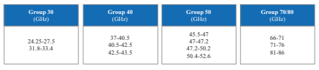

## 3.2.1.1.2 Mm-Wave Bands

The World Radiocommunication Conference 2015 (WRC-15) paved the way for the future development of IMT on higher frequency bands by identifying several frequencies for study within the 24.25–86 GHz range (Fig. 3.21) for possible identifcation for IMT under Agenda Item 1.13 of WRC-19. The 24.25–27.5 and 37–43.5 GHz bands are prioritized within the ongoing ITU-R work in preparation for WRC-19; all regions and countries are recommended to support the identifcation of these two bands for IMT during WRC-19 and should aim to harmonize technical conditions for use of these frequencies in 5G.  The frequency band of 27.5–29.5 GHz, though not included in the WRC-19 Agenda Item 1.13, is considered for 5G in the USA, South Korea, and Japan.

The 24.25–29.5 and 37–43.5 GHz ranges are the most promising frequencies for the early deployment of 5G millimeter wave systems, and several leading markets are considering portions of these two ranges for early deployments (Fig. 3.22), and the two ranges are also being specifed in 3GPP Release-15 based on a TDD access scheme. It is recommended that at least 400 MHz of contiguous spectrum per network from these ranges be assigned for the early deployment of 5G.

## 3.2.1.1.3 Sub-6 Ghz Frequency Bands For 5G

Sub-3 GHz candidate frequency bands are given in Fig. 3.23.

The S-band (2496–2690 MHz) is another 5G candidate band that may have early commercial deployment. Currently, there are LTE TDD networks deployed in this band partially in both China and the USA, while EU deploys LTE FDD in the two edges of this band instead. It is highly likely that those regions may deploy 5G with TDD duplex mode on the left spectrum of that band, with maximized ecosystem sharing.

The L-band (1427–1518 MHz) is one 5G candidate band that has the potential to be allocated to mobile in most countries in the world. CEPT and CITEL regions have adopted the SDL (Supplemental Downlink) scheme for this band. The requirement for stand-alone operation in the band (both UL and DL transmissions) has emerged in some other regions. In the case of stand-alone 5G systems, a TDD access scheme is a potentially appropriate option, which can accommodate traffc asymmetry in the UL/DL directions with good potential for economies of scale. The same 5G-NR equipment can serve both the TDD and SDL markets. In addition, the SDL band can be paired with an individual SUL band (as described in Sect. 3.2.2) 
as well, following the traditional way of FDD operation.

The 700 MHz band has already been harmonized for mobile in most countries. 

Europe plans to use this band for 5G. Over the long term, the other frequencies of UHF band (470–694/698 MHz) could also be used for mobile, while the USA has already started the process of transferring the band from broadcasting to mobile service.

## 3.2.1.2 **5G Duplexing Mechanisms** 3.2.1.2.1 5G Candidate Band Types And Duplex Modes

Duplexing is another key factor affecting the network operation. There are two typical spectrum types available for IMT systems, i.e., paired spectrum and unpaired spectrum. At present, FDD and TDD are two dominant duplex modes, which are adopted to paired spectrum and unpaired spectrum, respectively, as introduced in the following:
- **FDD over paired spectrum:** FDD is more mature in 2G/3G/4G telecommunication systems, whose spectra are mainly located in low frequency range below 3 GHz. Due to the limited frequency resource in low frequency range, generally the bandwidth of a FDD band is quite limited. In addition, common RF flter design for FDD band is needed for the convenience of ecosystem sharing; thus a fxed duplex distance between DL and UL spectra is defned for each FDD band, which is also the obstacle in expanding the bandwidth of a FDD band.

- **TDD over unpaired spectrum:** With the increasing telecommunication traffc load, TDD attracts more attention due to more available wideband unpaired spectrum in middle and high frequency range. LTE TDD successfully operates the wide-coverage public networks for eMBB service in 2.6 GHz (Band 41) and 3.5 GHz (Band 42). Moreover, the DL and UL channel reciprocity in TDD system can well accommodate the optimized multi-antenna operation with effcient sounding design instead of redundant feedback of channel state information, which brings a signifcant throughput gain especially for multiple-user MIMO mechanisms. The channel statement information feedback overhead required for multi-antenna mechanism is un-neglectable for a spectrum with very large DL transmission bandwidth; thus TDD operation with UL sounding is a must for the multi-antenna solutions in C-band and mm-wave bands. This is also one of the 

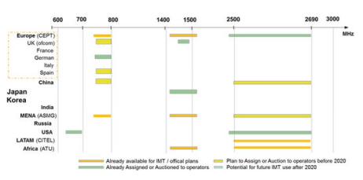

main reasons that the current 5G new spectrum in C-band and mm-wave chooses TDD mode.

- **SDL over unpaired spectrum:** LTE also defnes a supplementary DL (SDL) 
band type, which also fts to unpaired spectrum. However, SDL band type can only operate jointly with a normal FDD or TDD band which has UL transmission resources for feedback. A SDL carrier is aggregated to a normal FDD or TDD primary carrier, following the normal access, scheduling, and HARQ processes, which is quite in line with a normal FDD DL carrier.

In addition to the traditional band types, 5G introduces a new supplementary UL 
(SUL) type.

- **SUL over unpaired spectrum:** SUL band is combined with a normal 5G TDD 
(or SDL and FDD) band, to provide the UL control signal and feedback transmission as well as UL data transmission. The original introduction of SUL band type is to compensate the UL coverage shortage of the 5G TDD spectrum in C-band and mm-wave bands, where SUL bands are generally overlapped with the UL spectrum region of the existing LTE FDD band, which provides the possibility for an operator to reuse their spared UL frequency resources in LTE network for 5G-NR UL transmission for cell-edge users. The detailed concept, specifcations, and benefts of SUL band combinations are introduced in Sect. 3.3.

## 3.2.1.2.2 Flexible Duplex: Convergence Of Fdd And Tdd

In the future, more and more operators will own multiple spectrum bands, and most likely both FDD and TDD bands. Consequently, there are, currently, many LTE networks operating in both FDD and TDD bands jointly to accommodate the eMBB and IoT services to end users. It is foreseen that convergence of TDD and FDD will be the evolution trend of mobile communication systems.

## 3.2.1.2.2.1 Joint Operation Of Fdd And Tdd

There are several FDD/TDD joint operation mechanisms specifed in 3GPP, as below:
- Common network with multi-RATs **of FDD and TDD:** One public cellular network contains two radio access layers in a FDD band and a TDD band individually, with the authentication, access, and mobility control by a common core network. Which radio access layer is selected by a user is dependent on the coverage and the available radio resource units of the two layers. Switching between FDD and TDD layers is generally triggered by the inter-RAT handover based on the UE reference signal receiving power (RSRP) measurement of the FDD cell and TDD cell, respectively. In such a joint FDD/TDD multi-RAT operation, the FDD or TDD radio access layer provides independent scheduling and transmission procedure.

- **FDD/TDD carrier aggregation:** LTE-Advanced system introduced FDD/TDD 
carrier aggregation mechanism since Release-12, which enables the physical layer scheduling of parallel data transmission in both FDD and TDD carriers for a single UE, which requires either co-site FDD/TDD eNodeB (eNB) or ideal backhaul between FDD and TDD eNBs. Either a FDD carrier or a TDD carrier can be the anchor carrier to provide the basic mobility functions such as handover and cell reselection, while it can activate and deactivate one or more (up to four in DL and two in UL) secondary component carriers for parallel data transmission. In LTE-Advanced system, each component carrier has its own scheduling control signaling and HARQ process, while the HARQ feedback of the SCCs can be transmitted only on the UL carrier of PCC. Accordingly, 3GPP defnes detailed specifcations on how to deal with HARQ feedback timing and potential confiction cases for different TDD DL/UL confgurations. 5G-NR goes further by enabling the SCC scheduling via PCC DL control signaling. However, 3GPP Release-15 only specifes the cross-carrier scheduling for the component carriers with the same numerology, while 5G-NR TDD carriers in mm-wave band and C-band generally have different numerologies from that of low-frequency FDD band.

- **FDD/TDD dual connectivity (DC)**: FDD/TDD DC provides the capability of parallel transmit multiple streams over FDD and TDD to a single UE semi-statically confgured at higher layer. The higher layer (RLC/PDCH or upward) parallel transmission makes it applicable to those deployment scenarios without ideal almost zero-latency backhaul, such as inter-site FDD/TDD stream aggregation for a single UE.

## 3.2.1.2.2.2 Synchronization For Tdd Band

Network synchronization is a basic requirement for the TDD cellular systems. It requires multiple cells to synchronize the TDD frame structure, including DL and UL switching point, as well as DL/UL confgurations.

There are multiple types of synchronization requirements as the following:
- Intra-frequency inter-cell synchronization
- Figure 3.24 describes the inter-cell interference, while (a) is the given network topology with (b) for the scenario with two neighboring cells that are confgured with two different TDD DL/UL confgurations, and (c) is for the scenario with two neighboring cells that are asynchronous in DL/UL switching points. It can be seen that the period with cell 1 schedules DL transmission while cell 2 schedules the UL transmission at the same time, and the high transmit power from cell 1 base station (BS) ends to a strong interference at the receiver of the cell 1 BS, and thus may block the cell 1 BS reception during that time period.

- To avoid such inter-cell BS-to-BS interference, it is recommended for the operator to deploy a TDD network with frame synchronization. Guard period 

between DL and UL transmission is usually chosen corresponding to the interference-protection distance from an aggregator BS to the victim BS.

- Intra-band inter-frequency inter-cell synchronization
- When one operator deploys TDD system on two or more carriers in the same band, network synchronization is also necessary. Figure 3.25 describes the inter-frequency BS-to-BS interference, for both neighboring carrier and two carriers with a certain frequency distance. Since the BS-to-BS interference comes from the same network and also the same BS, the intra-band transmission signals will fall into the RF flter of the same receiver flter range and thus block the BS receiver totally.

- Intra-band inter-operator synchronization with regional regulation coordination
- For different operators who deploy TDD systems on their own spectrum located in the same band, the similar inter-frequency BS-to-BS interference is suffered from the victim TDD network that with the UL time widow overlaps with the aggressor TDD network with the DL transmission. There was a proposal to introduce a guard band between the two neighboring TDD networks in the same frequency band; however for cellular network with macro BSs, a quite big guard band is required in addition to the inter-operator special isolation to avoid the BS receiver blocking and basic receiving performance of the victim TDD network. According to the regulation evaluation in both China MIIT [15] and EU ECC [16], a guard band of 5–10 MHz is needed for two 2.6 GHz LTE TDD systems with an operating bandwidth of 20 MHz individually, and more than 25 MHz guard band is required for two 3.5 GHz NR TDD 
systems with an operating bandwidth of 100 MHz individually as shown in Fig.  3.26. Such big guard band is a big waste of the cherished spectrum resources, and thus is unacceptable for any regional regulator as well as operators.

To reach the intra-band inter-operator TDD synchronization, the regional regulator generally specifes a common TDD DL/UL frame structure according to the DL/ UL traffc load ratio statistics from multiple operators. Few countries also ask operators to do coordination if they have to deploy TDD network in the same band.

- **China:** For the frst 2.6 GHz TDD network in the world, China operators contributed many efforts to coordinate the network. Finally, under the guideline of MIIT (Ministry of Industry and Information Technology) of China, the synchronization among operators' networks at the band of 2.6 GHz was implemented based on the same frame structure TDD confguration 2 and the same DL/UL 
traffc ratio of 4:1. China MIIT is actively organizing MNOs and relevant stakeholders to negotiate a single frame structure for synchronization of 5G networks in 3.5 GHz band.

- **Japan:** Public open hearing of potential operators for Japan 3.4–3.6 GHz band was held by MIC (Ministry of Internal Affairs and Communications) on 23rd January 2014. All operators presented a clear position of TDD and advocated the necessity of operator's consensus for collaboration for realizing TDD synchronization including the DL/UL confguration ideally, in order to achieve No Guard Band for effcient usage of spectrum resources. All the operators have the same opinion of DL heavy frame confguration, by referring to the heavy data traffc in the downlink side. Japan Ministry of Internal Affairs and Communications (MIC) 
issued the guideline for the introduction of 4G for comments in September 2014, which included that 3480–3600 MHz should be assigned for 3 operators (40 MHz per operator) for TDD use, and licensees are obliged to agree with each other in advance about the matters for TDD synchronized operation, where frame structure confguration 2 is also chosen.

Fig. 3.27 UK 3.4 GHz band plan based on fnal auction results

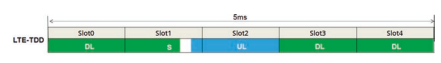

Fig. 3.28 TDD frame structure with DL/UL ratio of 4:1. (a) LTE-TDD frame structure of confguration 2, 5 ms single DL/UL switching period. (b) 5G-NR frame structure of 2.5 ms single DL/UL 

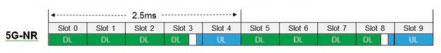

switching period
- On 6 April 2018, MIC allocated the remaining spectrum of 3.5 GHz to 2 operators, and the two licenses are to synchronize existing 3.5 GHz TDD network.

- UK: On 11 July 2017, UK Ofcom issued auction regulations [17] for the award of the 2.3 and 3.4  GHz spectrum bands and also updated Information Memorandum [18] alongside the regulations. The updated Information Memorandum sets out the conditions of the licenses that will be issued for the 2.3 and 3.4 GHz bands, respectively. The licenses are technology neutral and based on Time Division Duplex (TDD) mode. Licensees will be required to synchronize their networks in order to avoid interference to one another, so traffc alignment and the "Preferred Frame Structure confguration 2" as in Fig. 3.28 (a) 
for transmission with the limits of the Permissive Transmission Mask are mandated to implement the synchronization. Time slots must have the duration of 1 millisecond. TD-LTE frame confguration 2 (DL/UL ratio 4:1) is compatible with this frame structure. Other details of the preferred frame structure can be found in paragraph 12 in the Information Memorandum.

- In early 2019, Ofcom conducted the auction, and the 3.4 GHz band plan based on fnal auction results1 is shown in Fig. 3.27.

- As described above, almost all the commercial LTE TDD systems globally adopt TDD confguration 2, i.e., 5 ms period with "DSUDD" pattern and the DL/UL ratio of around 4:1 as in Fig.  3.28(a). For the TDD band with only 5G-NR deployment, the same DL/UL ratio of 4:1 can be chosen as well, but with 2.5 ms period with "DDDSU" pattern due to wider subcarrier spacing and shorter slot length, as shown in Fig. 3.28(b). As described in Sect. 3.1.2, 3GPP specifes a very fexible frame structure for 5G-NR; therefore other TDD DL/UL confgurations can also be adopted according to regional regulation coordination among operators, while both the traffc statistics and the implementation complexity should be taken into account.

- **Intra-band LTE/NR synchronization**
For both 2.6 GHz Band 41 and 3.5 GHz Band 42, there are countries, e.g., China and Japan, that have planned to deploy both LTE TDD and 5G-NR systems within the same band. Same as the intra-band inter-operator TDD synchronization, the regulators mandate the same DL/UL switching period and switching points. LTE and 5G-NR usually have different numerologies, i.e., 15 kHz subcarrier spacing for LTE and 30 kHz subcarrier spacing for NR. For LTE TDD, the frame confguration 2 is the most widely used frame structure, i.e., 3:1 DL/UL ratio with 5 ms DL/UL switching period. Then, 5G-NR is recommended to operate with a TDD DL/UL switching period of 5 ms with the pattern of "DDDDDDDSUU" and the DL/UL 
ratio of 8:2 to attain synchronization with LTE. In addition, the slot format confguration in NR is very fexible which can match all the confgurations of special subframe in LTE. The only modifcation is to adjust the starting point of the frame as shown in Fig. 3.29.

It is worth noting that network synchronization is not an exclusive feature of communication systems that work in Time Division Duplex (TDD) mode, while it could also be applied to the communication systems working in Frequency Division Duplex (FDD) mode if performance gain is expected by utilizing techniques such as interference cancellation (IC). The difference lies in the requirement of synchronization accuracy precision. GSM, UMTS, WCDMA, and LTE-FDD mobile technologies require only frequency synchronization with accuracy within 50 parts per billion (ppb) at the radio interface. CDMA2000, TD-SCDMA, and LTE-TDD services have the same frequency requirements as the other earlier 2G/3G network, but also specify requirements for phase and time. Different with FDD systems where frequency synchronization is generally suffcient, it is essential that the time and phase reference in TDD system is traceable to Coordinated Universal Time (UTC). 

| technologies as delineated in [16]   | Synchronization requirements   |                                  |
|--------------------------------------|--------------------------------|----------------------------------|
| Radio access technology              | Frequency accuracy             | Phase accuracy                   |
| GSM, UMTS, WCDMA, LTE-FDD            | 50 ppb                         | NA                               |
| CDMA2000                             | 50 ppb                         | ±3 μs to ±10 μs                  |
| TD-SCDMA                             | 50 ppb                         | ±3 μs                            |
| LTE-TDD                              | 50 ppb                         | ±1.5 μs (for cell radius  ≤3 km) |
| 50 ppb                               | ±5 μs (for cell radius >3  km) |                                  |
| 5G-NR                                | 50 ppb                         | ±1.5 μs                          |

Without the common UTC time reference cell sites cannot operate as intended. In the LTE-TDD system, two phase accuracy granularities are specifed, 1.5μs and 5μs, corresponding to two cell radius sizes differentiated by 3 km. Table 3.12 presents a summary of the synchronization requirements of different mobile network modes.

The mechanisms to guarantee the TDD network synchronization are mature since 3G TD-SCDMA system, and already widely used in LTE TDD systems globally. Currently, the main solutions include:
- **Type 1: distributed synchronization scheme based on GNSS systems.** GNSS 
signal receivers are directly deployed on the terminal and BSs; each BS acquires satellite time signals (GPS, Beidou, Glaness, etc.) directly to achieve the time synchronization between different BSs and to ensure the maximum deviation of any two of the base stations no more than 3 us. Generally macro BSs are located in open areas, which makes it easy to install GPS antenna with good satellite signal receiving performance. However, for those BSs deployed indoor or outdoor but surrounded by tall objects that easily block GPS signals, it will be diffcult to receive GPS signal correctly.

- **Type 2: centralized synchronization scheme based on IEEE1588v2** system maintained by the cellular network backhaul. IEEE 1588v2 specifes accurate time transfer protocol, which can achieve sub-microsecond precision time synchronization like the current GPS. The clock synchronization information of the main time source is transmitted through the 1588v2 protocol packet on the transmission network. The BSs can obtain time information from transmission network through the 1588v2 interface to achieve synchronization accuracy of ns level. It requires all nodes of the bearer network to support PTP, and additionally the clock synchronization quality is affected by network QoS. The above two types of synchronization solutions are quite complemented to each other. Both of them are widely used in the commercial LTE networks already. It is up to each operator to choose their own network synchronization solutions.

## 3.2.1.2.2.3 Dynamic Tdd And Flexible Duplex

Traditional TDD network has a static TDD DL/UL confguration, which is usually decided by the statistical UL/DL traffc load ratio among multiple operators in a specifc country or region. However, in the practical telecommunication networks, the DL traffc constitutes a large portion of the entire tele-traffc, as shown in the practical network traffc statistics in Fig.  3.30(a). With the popularity of video streaming increasing, it is forecast that the proportion of DL content will grow even further in the future as in Fig. 3.30(b) [19]; hence it is natural that more resources should be allocated to the DL. Therefore, a smaller proportion of the resources is left for the UL, which will further affect the UL coverage performance.

Telecommunication industry never gives up on improving the total spectrum utilization effciency [20]. If the network can confgure the DL/UL radio resource ratio according to the actual DL/UL traffc ratio geographically and also timely, assuming that it can resolve the serious DL-to-UL interference in the wide-area TDD 
network, the spectrum utilization can be improved a lot. There are two steps in the duplex evolving road map as below; additionally there were academia papers proposing full duplex [21, 22] as the fnal duplex evolution step, which is however far immature due to many implementation challenges.

## Dynamic Tdd

LTE-Advanced system introduced the dynamic confguration of TDD DL/UL ratio 

 (Fig. 3.31) from 3GPP Release-12 and onwards, called as enhanced interference management traffc adaption (eIMTA) [23]. In the theoretical analyses and simulation [24], eIMTA can be applied to an isolated area such as indoor hotspot scenario like football game with a very special DL/UL traffc statistics. One drawback of eIMTA is that the newly introduced interference between DL and UL signals will 

reduce signal-to-interference plus noise ratio (SINR) when the inter-cell interference is present, and thus cause the communication quality degradation over that of the conventional TDD system. As interpreted in the following fgure, the interference suffered by Cell 0 base station receiver increases since the DL signals from neighbor base stations with higher transmit power than UL signals cause strong interference.

The commercial LTE TDD networks are mainly wide-coverage cellular network; thus eIMTA has not yet been deployed in practical systems due to its severe intercarrier and intra-carrier interference of the normal transceiver implementation in Macro eNB.

## Flexible Duplex

- Flexible confguration on **DL/UL ratio**: 5G standardization takes into account the future trend of FDD/TDD convergence from day 1, which *defnes* a very fexible physical layer design as well as the symmetric DL/UL air interface. 5G-NR 
inherits the dynamic TDD DL/UL ratio from LTE eIMTA, while it goes further with both static cell-specifc DL/UL confgurations and DL/UL switching period, as well as the additional potential semi-static or dynamic UE-specifc DL/UL confgurations. As shown in Fig. 3.32, 3GPP Release-15 specifes up to 62 slot confgurations with each OFDM symbol marked as DL, UL, or unknown direction, while the unknown-direction symbols can be confgured specifcally for each UE receiver. Among those 62 slot confgurations, there are 4 typical confgurations as DL-only slot, DL-dominant slot, UL-only slot, and UL-dominant slot [5]. Within one 5G-NR radio frame, each slot can have its own DL/UL confgurations out of the total 62 candidates. Theoretically, 5G-NR can support a large number of candidate DL/UL confgurations for the frame structure seen from UE side, while keeping the basic cell-level TDD synchronization on those basic DL or UL symbols which does not necessarily occupy the whole time of a frame.

Fig. 3.32 5G-NR slot DL/UL confgurations in 3GPP Release-15

- **Other application scenarios of fexible duplex**: Theoretically, such fexible slot direction can be confgured for paired spectrum as well. Due to the more and more serious imbalance between DL and UL traffc load, the symmetric DL/UL bandwidths in FDD band end to more and more spared UL radio resources when FDD DL resources are fully occupied by the eMBB traffc. Accordingly, there is a potential solution to make use of the spared UL for the low-power DL transmission of pico cells, as shown in Fig. 3.33(a). The fexible duplex mode can also be applied to some new FDD DL spectrum and SDL band as in Fig. 3.33(b), where there is possibility to introduce SRS in the DL carriers to enable effcient multiantenna mechanism based on the DL/UL channel reciprocity. For fexible duplex application in FDD DL or UL spectrum or SDL bands, the main limit would be regional spectrum regulation restrictions. Flexible duplex is also applicable to access-integrated wireless backhaul, D2D, 
etc., as in Fig. 3.34. In reality, it is very costly for operators to widely deploy highspeed and low-latency backhaul (e.g., fber), considering the cost and diffculty to fnd suitable sites, while the traditional wireless backhauling or relay requires additional spectrum to avoid the interference to and from the access link [25, 26], which is very low effcient. With fexible duplex, the same resource may be allocated to the backhaul link and access link, with MU-MIMO type of advanced receiver to mitigate the inter-link interference. The similar mechanism is for in-band D2D system as well.

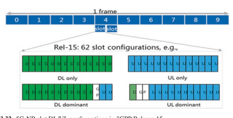

- **Flexible duplex interference mitigation mechanisms:** For cellular network with fexible duplex confguration, the main issue is still the DL-to-UL interference among cells. To reach a good inter-cell inter-direction interference mitigation performance with an acceptable advanced receiver implementation complexity, 5G-NR air interface is designed to have a symmetrical DL/UL transmission format, multi-access, as well as similar reference signals for channel estimation and demodulation. A. Multi-Access Aspect
- In LTE, DFT-S-OFDMA was adopted as the multiple-access scheme for UL due to low peak-to-average power ratio (PAPR) for better coverage, while OFDMA is adopted for DL for more effcient wideband frequency-domain selective scheduling. Accordingly, the subcarrier mapping schemes are different for DL 
and UL signals, leading to half-subcarrier offset between the two kinds of signals, as interpreted in Fig. 3.35. Such design works well in conventional systems but cannot support new applications in 5G. In order to support fexible duplex, symmetrical design is proposed for multiple-access schemes with both DL and UL signals adopting OFDMA scheme. Subcarrier mapping scheme should also align with each other, so as to avoid inter-carrier interference between DL and UL signals. Based on such symmetry, current processes to receive two DL (UL) signals can be reused to receive DL and UL signals simultaneously.

## B. Reference Signal Aspect

In LTE, the reference signal (RS) patterns were designed quite differently for DL 
and UL. In order to well support simultaneous reception of DL and UL signals, it is preferred to avoid interference between data and DM RSs and ensure DL and UL DM RSs to be orthogonal with each other, so that the receiver can estimate DL and UL fading channels for both signals accurately to ensure decoding afterwards. In 5G, the DL/UL symmetric air interface enables the orthogonal resources among reference signals or between reference signal and data transmissions in different transmission directions. By such design, the inter-direction interference will be seen from the advanced receiver as the orthogonal streams in multiuser MIMO of the actual scheduled signal. Virtual MIMO advanced receiver is well implemented in LTE network already, which can be the basis of the 5G fexible duplex advanced receiver.

## 3.2.2 3Gpp 5G-Nr Band Defnition 3.2.2.1 **3Gpp Rel.15 5G-Nr Band Defnition**

The 5G-NR candidate spectrums specifed in 3GPP Release-15 are classifed into two frequency ranges. FR1 represents the sub-6 GHz spectrum, and ranges from 450 MHz to 6 GHz, while FR2 is for millimeter wave, from 24.25 GHz to 52.6 GHz.

FR1 consists of the traditional LTE bands as well as the new bands identifed for IMT-2020 in WRC'15, which are listed in Table 3.13 [27]. In addition to the duplexing mode FDD, TDD, and SDL, there are six SUL bands with the new duplexing mode defned in Release-15. Among FR1 bands, NR bands n7, n38, n41, n77, n78, and n79 mandate UE capable of supporting four receiving antenna ports to maximize the massive MIMO UE experience [27, 28].

3GPP Release-15 only specifes four-millimeter-wave bands within FR2 as listed in Table 3.14 [29]. All of the Release-15 FR2 bands adopt TDD mode for the convenience of effciently utilizing the DL/UL channel reciprocity for multi-antenna transmission.

## 3.2.2.2 **3Gpp 5G-Nr Band Combination**

Due to the large path loss and penetration loss of middle- and high-frequency 5G new bands, C-band (n77, n78, n79) and millimeter-wave bands (n257, n258, n260, n261) have very limited coverage and thus limit the cell-edge user experience throughput of the UEs that access the operated NR base station. Therefore, typical 

| Table 3.13                                                                                                                                                                              | NR operating bands in FR1   | Downlink (DL) operating band BS transmit/UE receive FDL_low - FDL_high   | Duplex mode   |
|-----------------------------------------------------------------------------------------------------------------------------------------------------------------------------------------|-----------------------------|--------------------------------------------------------------------------|---------------|
| n1                                                                                                                                                                                      | 1920–1980 MHz               | 2110–2170 MHz                                                            | FDD           |
| n2                                                                                                                                                                                      | 1850–1910 MHz               | 1930–1990 MHz                                                            | FDD           |
| n3                                                                                                                                                                                      | 1710–1785 MHz               | 1805–1880 MHz                                                            | FDD           |
| n5                                                                                                                                                                                      | 824–849 MHz                 | 869–894 MHz                                                              | FDD           |
| n7                                                                                                                                                                                      | 2500–2570 MHz               | 2620–2690 MHz                                                            | FDD           |
| n8                                                                                                                                                                                      | 880–915 MHz                 | 925–960 MHz                                                              | FDD           |
| n12                                                                                                                                                                                     | 699–716 MHz                 | 729–746 MHz                                                              | FDD           |
| n20                                                                                                                                                                                     | 832–862 MHz                 | 791–821 MHz                                                              | FDD           |
| n25                                                                                                                                                                                     | 1850–1915 MHz               | 1930–1995 MHz                                                            | FDD           |
| n28                                                                                                                                                                                     | 703–748 MHz                 | 758–803 MHz                                                              | FDD           |
| n34                                                                                                                                                                                     | 2010–2025 MHz               | 2010–2025 MHz                                                            | TDD           |
| n38                                                                                                                                                                                     | 2570–2620 MHz               | 2570–2620 MHz                                                            | TDD           |
| n39                                                                                                                                                                                     | 1880–1920 MHz               | 1880–1920 MHz                                                            | TDD           |
| n40                                                                                                                                                                                     | 2300–2400 MHz               | 2300–2400 MHz                                                            | TDD           |
| n41                                                                                                                                                                                     | 2496–2690 MHz               | 2496–2690 MHz                                                            | TDD           |
| n50                                                                                                                                                                                     | 1432–1517 MHz               | 1432–1517 MHz                                                            | TDD1          |
| n51                                                                                                                                                                                     | 1427–1432 MHz               | 1427–1432 MHz                                                            | TDD           |
| n66                                                                                                                                                                                     | 1710–1780 MHz               | 2110–2200 MHz                                                            | FDD           |
| n70                                                                                                                                                                                     | 1695–1710 MHz               | 1995–2020 MHz                                                            | FDD           |
| n71                                                                                                                                                                                     | 663–698 MHz                 | 617–652 MHz                                                              | FDD           |
| n74                                                                                                                                                                                     | 1427–1470 MHz               | 1475–1518 MHz                                                            | FDD           |
| n75                                                                                                                                                                                     | N/A                         | 1432–1517 MHz                                                            | SDL           |
| n76                                                                                                                                                                                     | N/A                         | 1427–1432 MHz                                                            | SDL           |
| n77                                                                                                                                                                                     | 3300–4200 MHz               | 3300–4200 MHz                                                            | TDD           |
| n78                                                                                                                                                                                     | 3300–3800 MHz               | 3300–3800 MHz                                                            | TDD           |
| n79                                                                                                                                                                                     | 4400–5000 MHz               | 4400–5000 MHz                                                            | TDD           |
| n80                                                                                                                                                                                     | 1710–1785 MHz               | N/A                                                                      | SUL           |
| n81                                                                                                                                                                                     | 880–915 MHz                 | N/A                                                                      | SUL           |
| n82                                                                                                                                                                                     | 832–862 MHz                 | N/A                                                                      | SUL           |
| n83                                                                                                                                                                                     | 703–748 MHz                 | N/A                                                                      | SUL           |
| n84                                                                                                                                                                                     | 1920–1980 MHz               | N/A                                                                      | SUL           |
| n86                                                                                                                                                                                     | 1710–1780 MHz               | N/A                                                                      | SUL           |
| Note 1: UE that complies with the NR band n50 minimum requirements in this specifcation shall  NR  operating  band Uplink (UL) operating band BS receive/UE transmit FUL_low - FUL_high |                             |                                                                          |               |

network operation will combine the new wideband middle- or high-frequency 5G 
band with the low-frequency band, while the latter band will serve as an anchor carrier to provide a continuous coverage and seamless mobility. Different operators may choose different band combination(s) for their 5G network deployment according to their own spectrum.

Operating band

Uplink (UL) operating band Downlink (DL) operating band Duplex 

fUL_low - fUL_high fDL_low - fDL_high mode

n257 26,500 MHz–29,500 MHz 26,500 MHz–29,500 MHz TDD n258 24,250 MHz–27,500 MHz 24,250 MHz–27,500 MHz TDD n260 37,000 MHz–40,000 MHz 37,000 MHz–40,000 MHz TDD n261 27,500 MHz–28,350 MHz 27,500 MHz–28,350 MHz TDD

## 3.2.2.2.1 5G-Nr Band Combination Mechanisms

3GPP specifed two band combination mechanisms for LTE-Advanced: carrier aggregation (CA) since Release-10 and dual connectivity (DC) since Release-12. For 5G-NR, 3GPP defnes two additional band combination mechanisms, which are LTE/NR DC with typically NR non-stand-alone operation and NR band combination of the normal TDD (or FDD/SDL) band with a SUL band. In total, there are three potential band combination mechanisms for 5G-NR stand-alone deployment and two potential band combination mechanisms for 5G-NR non-stand-alone deployment, described as below:
For 5G-NR stand-alone deployment, the following three band combination mechanisms can be adopted. However, only NR-NR DL CA and SUL specifcations are completed within Release-15, while NR-NR DC only specifes few mm-wave and C-band combinations partially. - NR-NR CA: An operated network aggregates multiple NR component carriers 
(CC) to serve a single UE in order to increase the potential scheduled bandwidth and therefore increase the experience throughput (Fig. 3.36). The data transmission in the secondary CC (SCC) can be scheduled by the control signaling of the primary CC (PCC), and the HARQ feedback of the SCC can be transmitted over the PCC as well. There are three types of NR-NR CA, i.e., intra-band CA with continuous CC, intra-band CA with noncontinuous CA, and inter-band CA, as shown in Fig. 3.36(a), (b), and (c), respectively.

- NR-NR DC: Similar to NR-NR CA, the data streams of single UE can be transmitted over multiple CCs simultaneously to reach a higher bit rate. However, NR-NR DC forces a self-contained data scheduling, transmission, and HARQ procedure within a CC, and requires longer activating and deactivating period for a CC.

- NR band combination for SUL [30]: This band combination combines the NR 
SUL CC with the normal NR CC(s) that contains DL, which can be one or multiple TDD CC(s), FDD CC(s), or SDL CC(s). The typical operation combination for SUL is to combine with a TDD CC. Different from NR-NR CA, the combined normal NR CC and SUL CC forms a single cell, with all the UL time-frequency resources in the normal CC and SUL CC forming a single pool for a single-cell scheduling, as well as sharing the same HARQ process. Such a mechanism has the beneft of supporting both simultaneous UL carrier switching and good balance between DL capacity and UL coverage, as described in Sect. 3.3.

CC1 CC2 … CCn CC1 CC2 … CCn

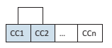

(a) Intra-band contiguous-CC CA (b) Intra-band non-contiguous-CC CA

Fig. 3.36 NR-NR CA. (a) Intra-band contiguous-CC CA. (b) Intra-band noncontiguous-CC 
CA. (c) Inter-band CA

| LTE bands                                                             | NR bands       |
|-----------------------------------------------------------------------|----------------|
| Band 25, 26, 41                                                       | 2.496–2.69 GHz |
| Band 1, 3, 8, 11, 18, 19, 20, 21, 26, 28, 40, 41, 42                  | 3.3–4.2 GHz    |
| Band 1, 2, 3, 5, 7, 8, 11, 18, 19, 20, 21, 26, 28, 38, 39, 41, 42, 66 | 3.3–3.8 GHz    |
| Band 1, 3, 8, 11, 18, 19, 21, 26, 28, 39, 41, 42                      | 4.4–5.0 GHz    |
| Band 1, 3, 5, 7, 8, 11, 18, 19, 21, 26, 28, 41, 42, 66                | 26.5–29.5 GHz  |
| Band 3, 7, 8, 20, 28, 39, 41                                          | 24.25–27.5 GHz |
| Band 2, 5, 12, 30, 66                                                 | 37–40 GHz      |
| Band 5, 66                                                            | 27.5–28.35 GHz |

For 5G-NR non-stand-alone deployment, the following two band combination mechanisms were specifed within Release-15. - LTE/NR DC: One network can allow single-UE data transmission of multiple streams over LTE and NR in parallel. The typical operation mode is called EN-DC, i.e., the non-stand-alone NR deployment with LTE as the anchor network to provide the basic coverage and mobility layer, accessing the EPC.

- LTE-FDD and NR SUL band combination: One special case of the LTE/NR DC 
operation mode is to confgure the NR cell as NR band combination with SUL, while the SUL carrier can be either orthogonal from LTE UL carrier or shared with LTE UL carrier. More details will be introduced in Sect. 3.3.

## 3.2.2.2.2 5G Band Combination Defnition

3GPP Release-15 only completed the specifcations of some prioritized 5G band combinations for LTE/NR DC and NR band combination for SUL, NR-NR CA, and NR-NR DC, as shown in Tables 3.15, 3.16, 3.17, and 3.18 respectively.

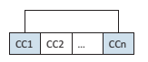

| Table 3.16       | NR band combinations for SUL (data from [27, 31, 32])   |                                                      |                                   |                                                                                                                                                                    |
|------------------|---------------------------------------------------------|------------------------------------------------------|-----------------------------------|--------------------------------------------------------------------------------------------------------------------------------------------------------------------|
| NR stand-alone   | NR non-stand-alone LTE/NR SUL                           |                                                      |                                   |                                                                                                                                                                    |
| SUL combinations | SUL band (UL)                                           | NR band (UL/DL)                                      | combinations                      |                                                                                                                                                                    |
| Release-15       | SUL_n78-n80                                             | 1710–1785 MHz                                        | 3.3–3.8 GHz                       | DC_1-SUL_n78-n80 DC_3_SUL_n78-n80 DC_7_SUL_n78-n80 DC_8_SUL_n78-n80 DC_20_SUL_n78-n80 DC_1-3-SUL_n78-n80 DC_3-7-SUL_n78-n80 DC_3-8-SUL_n78-n80 DC_3-20-SUL_n78-n80 |
| SUL_n78-n81      | 880–915 MHz                                             | DC_3-SUL_n78-n81 DC_8_SUL_n78-n81                    |                                   |                                                                                                                                                                    |
| SUL_n78-n82      | 832–862 MHz                                             | DC_3-SUL_n78-n82 DC_20_SUL_n78-n82                   |                                   |                                                                                                                                                                    |
| SUL_n78-n83      | 703–748 MHz                                             | DC_8-SUL_n78-n83 DC_20_SUL_n78-n83 DC_28_SUL_n78-n83 |                                   |                                                                                                                                                                    |
| SUL_n78-n84      | 1920–1980 MHz                                           | DC_20-SUL_n78-84 DC_1_SUL_n78-n84 DC_3_SUL_n78-n84   |                                   |                                                                                                                                                                    |
| SUL_n78-n86      | 1710–1780 MHz                                           | DC_8-SUL_n78-n86 DC_66_SUL_n78-n86                   |                                   |                                                                                                                                                                    |
| SUL_n79-n80      | 1710–1785 MHz                                           | 4.4–5.0 GHz                                          | DC_8-SUL_n79-n80 DC_3_SUL_n79-n80 |                                                                                                                                                                    |
| SUL_n79-n81      | 1710–1780 MHz                                           | DC_8-SUL_n79-n81                                     |                                   |                                                                                                                                                                    |
| SUL_n79-n84      | 1920–1980 MHz                                           | DC_1-SUL_n79-n84                                     |                                   |                                                                                                                                                                    |
| SUL_n75-n81      | 880–915 MHz                                             | 1432–1517 MHz                                        | DC_8-SUL_n75-n81                  |                                                                                                                                                                    |
| (SDL)            |                                                         |                                                      |                                   |                                                                                                                                                                    |
| SUL_n75-n82      | 832–862 MHz                                             | DC_20-SUL_n75-n82                                    |                                   |                                                                                                                                                                    |
| SUL_n76-n81      | 880–915 MHz                                             | 1427–1432 MHz                                        | DC_8-SUL_n76-n81                  |                                                                                                                                                                    |
| SUL_n76-n82      | 832–862 MHz                                             | DC_20-SUL_n76-n82                                    |                                   |                                                                                                                                                                    |
| (SDL)            |                                                         |                                                      |                                   |                                                                                                                                                                    |
| SUL_n41-n80      | 1710–1785 MHz                                           | 2496–2690 MHz                                        | DC_3-SUL_n41-n80                  |                                                                                                                                                                    |
| SUL_n41-n81      | 880–915 MHz                                             | DC_8-SUL_n41-n81                                     |                                   |                                                                                                                                                                    |
| SUL_n77_n80      | 1710–1785 MHz                                           | 3.3–4.2 GHz                                          | DC_1-SUL_n77-n80 DC_3_SUL_n77-n80 |                                                                                                                                                                    |
| SUL_n77_n84      | 1920–1980 MHz                                           | DC_1_SUL_n77-n84 DC_3_SUL_n77-n84                    |                                   |                                                                                                                                                                    |
| Release-16       | DL_n78(2A)_                                             | 1710–1780 MHz                                        | 3.3–3.8 GHz                       | DC_66_SUL_                                                                                                                                                         |
| UL_n78-n86       | n78(2A)-n86                                             |                                                      |                                   |                                                                                                                                                                    |

For the aforementioned band combination mechanisms, the coexistence of multiple bands may suffer from severe receiver desensitization due to spurious emissions, and thus the strict RF requirements as well as the corresponding solutions for each 

| Table 3.17            | NR-NR CA [55]                                             |                       |                                                       |            |         |
|-----------------------|-----------------------------------------------------------|-----------------------|-------------------------------------------------------|------------|---------|
| Intra-band contiguous | Intra-band contiguous CA                                  |                       |                                                       |            |         |
| CA in FR1             | in FR1                                                    | FR1/FR2 inter-band CA |                                                       |            |         |
| NR CA                 | NR CA                                                     |                       |                                                       |            |         |
| band                  | NR band                                                   | band                  | NR band                                               | NR CA band | NR band |
| CA_n77                | 3300–                                                     | CA_n3An77A                       | FDD:                                                  |            |         |
| 4200 MHz              | 1805– 1880 MHz  and  1710– 1785 MHz TDD:  3300– 4200 MHz  | CA_n8-n258            | FDD: 880–915 MHz  and 925–960 MHz TDD: 24.25–27.5 GHz |            |         |
| CA_n78                | 3300–                                                     | CA_n3An78A                       | FDD:                                                  |            |         |
| 3800 MHz              | 1805– 1880 MHz  and  1710– 1785 MHz TDD:  3300– 3800 MHz  | CA_n71-n257           | FDD: 663–698 MHz  and 617–652 MHz TDD: 26.5–29.5 GHz  |            |         |
| CA_n79                | 4400–                                                     | CA_n3An79A                       | FDD:                                                  |            |         |
| 5000 MHz              | 1805– 1880 MHz  and  1710– 1785 MHz TDD:  4400– 5000 MHz  | CA_n77-n257           | TDD: 3.3–4.2 GHz TDD: 26. 5–29.5 GHz                  |            |         |
| CA_n8An75A                       | FDD:  880– 915 MHz and  925– 960 MHz SDL:  1432– 1517 MHz | CA_n78-n257           | TDD: 3.3–3.8 GHz TDD: 26.5–29.5 GHz                   |            |         |
| CA                    | FDD:                                                      |                       |                                                       |            |         |
| n8-n78A               | 880– 915 MHz and  925– 960 MHz TDD:  3300– 3800 MHz       | CA_n79-n257           | TDD: 4.4–5.0 GHz TDD: 26.5–29.5 GHz (continued)       |            |         |

| Table 3.17                                                                                                  | (continued)                                               |                       |         |            |         |
|-------------------------------------------------------------------------------------------------------------|-----------------------------------------------------------|-----------------------|---------|------------|---------|
| Intra-band contiguous                                                                                       | Intra-band contiguous CA                                  |                       |         |            |         |
| CA in FR1                                                                                                   | in FR1                                                    | FR1/FR2 inter-band CA |         |            |         |
| NR CA                                                                                                       | NR CA                                                     |                       |         |            |         |
| band                                                                                                        | NR band                                                   | band                  | NR band | NR CA band | NR band |
| CA_n8An79A                                                                                                             | FDD:  880– 915 MHz and  925– 960 MHz TDD:  4400– 5000 MHz |                       |         |            |         |
| CA_ n28A_ n78A                                                                                              | FDD:  703– 748 MHz and  758– 803 MHz TDD:  3300– 3800 MHz |                       |         |            |         |
| CA_ n41An78Aa                                                                                                             | TDD:  2496– 2690 MHz TDD:  3300– 3800 MHz                 |                       |         |            |         |
| CA_ n75An78Aa                                                                                                             | SDL:  1432– 1517 MHz TDD:  3300– 3800 MHz                 |                       |         |            |         |
| CA_ n77An79A                                                                                                             | TDD:  3300– 4200 MHz TDD:  4400– 5000 MHz                 |                       |         |            |         |
| CA_ n78An79A                                                                                                             | TDD:  3300– 3800 MHz TDD:  4400– 5000 MHz                 |                       |         |            |         |
| a Applicable for UE supporting inter-band carrier aggregation with mandatory simultaneous Rx/Tx  capability |                                                           |                       |         |            |         |

band combinations individually have to be defned. Spurious emissions are emissions which are caused by unwanted transmitter effects such as harmonics emission and intermodulation products. Receiver desensitization is specifed in terms of maximum sensitivity deduction (MSD) in UE specifcations [31].

| Table 3.18   | Band combinations of NR-DC (two bands)   |
|--------------|------------------------------------------|
| NR-DC band   | NR band                                  |
| DC_n77-n257  | TDD: 3.3–4.2 GHz TDD: 26.5–29.5 GHz      |
| DC_n78-n257  | TDD: 3.3–3.8 GHz TDD: 26.5–29.5 GHz      |
| DC_n79-n257  | TDD: 4.4 - 5.0 GHz TDD: 26.5–29.5 GHz    |

The intermodulation is the unwanted emission within the downlink transmission bandwidth of the FDD band, generated by the dual-uplink transmissions at different frequencies via the nonlinear transceivers at UE side. Low-order intermediation causes severe interference for some band combinations of LTE/NR DC, CA, and LTE/NR SUL. For those band combinations, single UL transmission at UE side is recommended to avoid the FDD DL performance degradation due to intermodulation.

Harmonic emission is generated by the active uplink in a lower frequency band within a specifed frequency range, whose transmitter harmonics from the UE side fall within the downlink transmission bandwidth assigned in a higher band at the UE receiver. Harmonic can be mitigated by harmonic rejection flter at lower band or avoided by limiting the spectrum resources of the UL transmission in the lowfrequency band, and coordination with the DL scheduled resource allocation in the high-frequency band.

Unlike the usual harmonic issue which is concerned more with UE self-desensitization problem when low-frequency band UL harmonics falls onto high-frequency band DL carriers, some band combinations may be subjected to low-band desensitization when high-band UL carrier is located at 3rd or 5th harmonic of low-band DL carrier, due to the known harmonic mixing problem.

## 3.2.2.2.3.1 Intermodulation Avoidance With Single Ul Transmission

The intermodulation is the generation of signals in its nonlinear elements caused by the presence of two or more signals at different frequencies reaching the transmitter via the antenna, as shown in Fig. 3.37. For a UE confgured with some band combinations, intermodulation emission may occur, which is regardless of the band combination mechanism including LTE/NR DC, LTE/NR UL sharing, and inter-band CA or DC either in LTE or in NR system. Low-order intermodulation can be so severe that it can cause serious damage for the low-frequency band DL reception. For example, for Band 3 (FDD: DL/1805–1880 MHz, UL/1710–1785 MHz) and Band 42 (TDD: DL and UL/3400–3600 MHz) LTE-CA [33], the LTE DL sensitivity would decrease by 29.8 dB due to the second-order intermodulation interference. Such serious intermodulation issue and the challenge to UE implementation were acknowledged by 3GPP industries for a long time and were hotly discussed during Release-15 5G-NR standardization period.

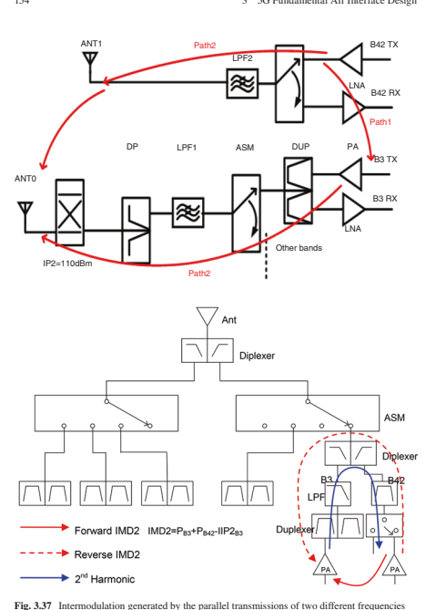

Taking the example of the NR core band n78 (3.3–3.8 GHz)-related band combinations, Table 3.19 gives the intermodulation analysis, where IMDn stands for the nth-order intermodulation. The analysis can also be extended to 3.3–4.2 GHz. From the table, it can be seen that among all the band combinations involving C-band, combination with B1 and B3 will suffer from very strong IMD interference at 2nd 

| Table 3.19   | IMD for LTE NR band combinations for NR band n78   |                                                                         |                                                                      |
|--------------|----------------------------------------------------|-------------------------------------------------------------------------|----------------------------------------------------------------------|
| LTE band     | NR band                                            |                                                                         |                                                                      |
| fx           | fy                                                 | Source of IMD                                                           | Note for victim band(s)                                              |
| B1           | n78 (3.3–3.8 GHz)                                  | IMD2, IMD4, IMD5                                                        | IMD2: Band1, fy − fx IMD4: Band1, 3*fx − fy IMD5: Band1, 2*fy − 3*fx |
| B3           | IMD2, IMD4, IMD5                                   | IMD2: Band 3, fy − fx IMD4: Band 3, 3*fx − fy IMD5: Band 3, 2*fy − 3*fx |                                                                      |
| B5           | IMD4                                               | Band 5, fy − 3*fx                                                       |                                                                      |
| B7           | IMD4                                               | Band Z, 3*fx − fy                                                       |                                                                      |
| B8           | IMD4                                               | Band 8, fy − 3*fx                                                       |                                                                      |
| B20          | IMD4                                               | Band 20, fy − 3*fx                                                      |                                                                      |
| B28          | IMD5                                               | Band 28, fy − 4*fx                                                      |                                                                      |
| B39          | N/A                                                |                                                                         |                                                                      |
| B41          | N/A                                                |                                                                         |                                                                      |
| B42          | N/A                                                |                                                                         |                                                                      |

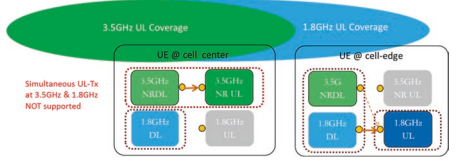

order, while B5, B7, B8, and B20 will suffer from the 4th order of IMD, and B28 suffers from the 5th order of IMD. Intermodulation at 2nd order and 3rd order will cause unacceptable performance degradation at tens of dB level in the corresponding emission frequency range, while even the 4th-order and 5th-order IMD impacts are also quite obvious.

Due to the serious degradation to the low-frequency FDD DL performance, 3GPP specifed a single UL solution for those band combinations with intermodulation issue: limiting the UL transmission in a single band. That is, the UE operates on only one of the carriers at a given time among a pair of low-frequency and highfrequency carriers.

For all the band combination mechanisms, which band to choose for the UL 
transmission at a time is dependent on the RSRP measurements. Usually the highfrequency UL carrier is selected for the UEs at cell center, while low-frequency UL 
carrier is selected for the UEs at cell edge (Fig. 3.38). 3.2.2.2.3.2 Harmonics Distortion Avoidance by Cross-Band Scheduling Coordination Different from intermodulation generated by the transmissions from different frequencies jointly, harmonic emission is generated by a single active uplink in a lower frequency band, whose transmitter harmonics from the UE side fall within the downlink transmission bandwidth assigned in a higher band at the UE receiver.

Taking band n78 again as the example, Table 3.20 provides the harmonic analyses for these band combinations. It shows that for C-band n78-involved band combinations, the combinations with B2, B3, and B66 suffer a 2nd-order harmonics issue, while the combinations with B8, B20, and B26 suffer a 4th-order harmonics issue, and the combination with B28 suffers a 5th-order harmonics issue.

Besides utilizing harmonic rejection flter at lower band to mitigate the MSD 
issue, harmonic can largely be avoided by limiting the spectrum resources of the UL transmission in the low-frequency band, and coordination with the DL scheduled resource allocation in the high-frequency band. Since the high-frequency band has a very wide bandwidth, e.g., 100 MHz carrier at C-band, while the harmonic issue only falls at a much narrower frequency range than the whole carrier bandwidth in the high-frequency band, it is, thus, straightforward to schedule the DL transmission for the UE to avoid the frequency range which may suffer the harmonics issue from its simultaneous UL transmission in the low-frequency FDD band.

| Table 3.20   | Harmonic mixing for LTE NR band combinations with 3.5 GHz band   |                          |
|--------------|------------------------------------------------------------------|--------------------------|
| LTE band, fx | NR band, fy                                                      | Order of harmonic mixing |
| B2           | 3.3–3.8 GHz (band n78)                                           | 2nd                      |
| B3           | 2nd                                                              |                          |
| B8           | 4th                                                              |                          |
| B20          | 4th                                                              |                          |
| B26          | 4th                                                              |                          |
| B28          | 5th                                                              |                          |
| B66          | 2nd                                                              |                          |
| B1           | 3.3–4.2 GHz (band n77)                                           | 2nd                      |
| B3           | 2nd                                                              |                          |
| B8           | 4th                                                              |                          |
| B18          | 4th, 5th                                                         |                          |
| B19          | 5th                                                              |                          |
| B20          | 4th                                                              |                          |
| B26          | 4th                                                              |                          |
| B28          | 5th                                                              |                          |

## 3.3 **4G/5G Spectrum Sharing (A.K.A. Lte/Nr Coexistence)**

The 3GPP standardization of stand-alone and non-stand-alone 5G-NR was frozen on June 2018 and December 2017, respectively. The C-band (3300–4200 and 4400–5000 MHz) is emerging as the primary frequency band for the introduction of 5G by 2020, with the availability of at least 100 MHz channel bandwidth per 5G 
network. It is crucial for 5G-NR commercial deployment to provide an optimal balance between coverage and capacity, and preferable to deploy 5G-NR BSs co-site with the existing LTE BSs for cost-effcient implementation. 5G-NR with the adoption of massive MIMO will boost DL throughput at both cell center and cell edge with affordable complexity. Beamforming can be used to reach similar coverage as the LTE network deployed at 1.8 GHz band. However, due to limited transmit power at terminal and limited UL transmission slots, it is diffcult for 5G-NR to improve its UL coverage only based on C-band TDD carrier. Accordingly, 4G/5G spectrum sharing, also called as LTE/NR coexistence, was proposed to reuse the UL spare resources in the lower frequencies already licensed for mobile use (e.g., 700, 800, 900, 1800, and 2100  MHz) as the coverage compensation to 5G-NR network, scheduled as a supplementary UL in combination with 3300–3800 MHz. 4G/5G sharing allows operators to beneft from faster and cost-effcient deployment of C-band (can expand to SDL and mm-wave in the future), and thus delivers enhanced capacity without incurring network densifcation costs.

## 3.3.1 Motivation And Beneft

5G-NR was developed for supporting diverse services, such as enhanced mobile broadband (eMBB), massive machine-type communication (mMTC), and ultrareliable low-latency communication (URLLC). The new spectrum released for 5G 
deployments, primarily above 3 GHz, unfortunately has a relatively high path loss, which limits the coverage, especially for the uplink (UL). The high propagation loss, the limited number of UL slots in a TDD frame, and the limited user power gravely limit the UL coverage, but the available spectrum bandwidth is very rich. 

Moreover, the stringent requirements of the 5G diverse applications lead to a number of 5G challenges, such as ensuring seamless coverage, high spectrum effciency, and low latency. This section addresses some of those challenges with the aid of a unifed spectrum sharing mechanism, and by means of a UL/DL decoupling solution based on 4G/5G frequency sharing, which has already been specifed in 3GPP 
Release-15. The key concept is to accommodate the UL resources in a LTE FDD frequency band as a supplemental UL carrier in addition to the NR operation in the TDD band above 3 GHz. The performance of the spectrum sharing has been confrmed with feld trials (see Sect. 10.4.6).

## 3.3.1.1 **Nr Coverage On New Spectrum**

Coverage is a very essential performance criterion for wireless communication system and is affected by numerous factors, including the transmission power, propagation loss, and receiver sensitivity. Since the propagation loss varies with the frequency, the coverage substantially differs in different frequency bands. Therefore, the provision of a good performance in all frequency bands remains a key challenge for 5G deployments. Furthermore, due to the limited UL transmission power and higher path loss in NR than in LTE, the UL coverage is usually the bottleneck in 5G deployments.

## 3.3.1.1.1 Link Budget

In Fig. 3.39, the coverage performance of the 3.5 GHz TDD band compared to that 

 of the 1.8 GHz FDD band is portrayed. Partial list of the parameters assumed for this comparison is shown in the fgure, while the rest are given in Table 3.21. In the link budget, the UL coverage is calculated when the UL data rate is set to 1 Mbps for supporting typical uplink video traffc. By contrast, the DL coverage is usually limited by the physical downlink control channel (PDCCH) quantifed in terms of the block error rate of the primary PDCCH. It can be observed that the UL coverage and DL coverage are balanced over the 1.8 GHz FDD band with the aid of 4 transmit and 4 receive antennas. For the 3.5 GHz TDD band using the same transmit and receive antennas as that of 1.8 GHz scenario, an excess of 10 dB coverage gap is observed. This is mainly due to the large propagation loss, the penetration loss, and the limited number of UL transmission slots in a frame of the 3.5 GHz TDD band. 

| Table 3.21                                     | Parameters assumed in the link budgets 1.8 GHz with 4T4R 3.5 GHz with 4T4R   | 3.5 GHz with 64T64R   |         |         |         |         |
|------------------------------------------------|------------------------------------------------------------------------------|-----------------------|---------|---------|---------|---------|
| Parameters                                     | PDCCH                                                                        | PUSCH                 | PDCCH   | PUSCH   | PDCCH   | PUSCH   |
| 17                                             | 0                                                                            | 17                    | 0       | 10      | 0       |         |
| Tx antenna gain GAnt TX (dBi)                  | 2                                                                            | 0                     | 0       | 0       | 2       | 0       |
| Tx cable loss LCL TX (dB)                      | 0                                                                            | 18                    | 0       | 18      | 0       | 10      |
| RX                                             |                                                                              |                       |         |         |         |         |
| Rx antenna gain GAnt (dBi)                     | 0                                                                            | 2                     | 0       | 0       | 0       | 2       |
| Rx cable loss LCL RX (dB) Penetration loss Lpe | 21                                                                           | 21                    | 26      | 26      | 26      | 26      |
| (dB) Receiver sensitivity γ                    | −129.44                                                                      | −134.3                | −129.44 | −134.3  | −141.02 | −141.23 |
| (dBm) Shadowing loss LSF                       | 9                                                                            | 9                     | 9       | 9       | 9       | 9       |
| (dB) Propagation loss due                      | 0                                                                            | 0                     | 5.78    | 5.78    | 5.78    | 5.78    |
| to frequency Lf (dB) Interference margin Im    | 14                                                                           | 3                     | 14      | 3       | 7       | 2       |
| (dB) Thermal noise per                         | −132.24                                                                      | −132.24               | −129.23 | −129.23 | −129.23 | −129.23 |
| subcarrier NRE (dBm) Noise fgure NF (dB)       | 7                                                                            | 2.3                   | 7       | 3.5     | 7       | 3.5     |

By comparison, for the 3.5 GHz TDD band using 64 transmit and 64 receive antennas, a similar DL coverage performance can be achieved to that of 1.8 GHz, due to the beamforming gain provided by massive MIMOs and by the DL interference margin difference. Explicitly, since massive MIMOs also reduce the inter-cell interference, they reduce the DL interference margin. However, the UL coverage is poorer compared to the DL of 3.5 GHz, even when massive MIMOs are employed, because the UL power spectral density of the 3.5 GHz TDD band is lower than that of the 1.8 GHz FDD band at the same maximum device transmission power. This is partly due to having less UL slots in a TDD frame than in an FDD frame, which means that more frequency resources per slot should be allocated for a given UL throughput of say 1 Mbps. Therefore, how to improve the UL coverage is indeed an important issue for 5G deployments.

## 3.3.1.1.2 Ul/Dl Assignment Impact On Nr Coverage

As described in Sect. 3.2.1.2, the UL/DL traffc ratio in a TDD system is usually DL dominant adaptive to the eMBB DL/UL traffc load statistics, which is 4:1 for almost all the commercial LTE TDD systems, and is most likely the chosen operating point for 5G-NR TDD confguration as well. Therefore, a smaller proportion of the resources is left for the UL, which will further affect the UL coverage performance.

In contrast, the UL coverage is pretty good for the low-frequency FDD band, due to both the low path loss and penetration loss as well as the continuous available UL slots all the time for the potential transmission of terminals at the cell edge.

Moreover, for LTE FDD band, the same bandwidth is allocated to both the UL 
and DL, which means that the UL spectrum resources are underutilized. However in practical networks, the corresponding UL and DL resource utilization rates in LTE FDD systems are provided in Fig. 3.40 by several operators. Based on the statistics of four operators in 2016 Q4, the average downlink resource utilization rate is from 40% to 60%, while the average uplink resource utilization rate is about 10%. Such situation gives the possibility to utilize the FDD UL spared spectrum resources for 5G-NR UL transmission for the cell-edge users, to compensate for its transmission in the high-frequency TDD band.

## 3.3.1.1.3 5G-Nr Deployment Challenges Due To The Coverage

In the following, we will discuss a few challenging issues that have to be considered in 5G deployments, particularly for the TDD mode and in higher frequency bands. - **5G Band selection: Wideband spectrum availability vs. coverage.**
The availability of the bands below 3 GHz remains limited for 5G-NR in the near future and the lower bands fail to support high data rates due to their limited bandwidth. On the other hand, the wider NR bands above 3  GHz experience increased propagation losses, leading to a limited coverage. Therefore, independent usage of the spectrum below and above 3 GHz fails to strike a compelling trade-off between a high data rate and large coverage.

- **TDD DL/UL ratio: Spectrum utilization effciency vs. DL/UL coverage balance vs. multi-service operation**
As discussed, the NR TDD operation is usually confgured for a limited number of UL transmission slots (e.g., DL:UL = 4:1) in a frame due to the heavy DL traffc load, even though more slots should be allocated to the UL for improving the UL coverage. This can increase the UL data rates, when the bandwidth can-

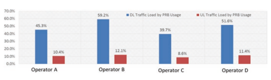

not be further increased due to the maximum transmission power constraint. Since the DL spectral effciency is usually higher than that of the UL, having more UL slots would, then, further reduce the spectral utilization effciency. 

Therefore, there is a clear trade-off between the UL coverage and spectral utilization effciency.

In addition, 5G system is required to provide diverse services including eMBB, 
mMTC, and URLLC. As analyzed in Sect. 3.2, it is hard for a single-network TDD confguration to ft to both eMBB and IoT type of services. Effcient eMBB 
transmission requires high DL resource proportion, while IoT services for lowpower wide-area scenario (LPWA) are highly dependent on the UL coverage and thus need continuous UL transmission and preferably as low path loss as possible. Therefore, effcient 5G spectrum exploitation mechanism is desired to support all kinds of services using a unifed TDD confguration.

- **TDD DL/UL switching period: Transmission effciency vs. latency.**
For the TDD operation, frequent DL/UL switching is required for URLLC services to provide very quick DL/UL scheduling and almost immediate ACK/
NACK feedback. However, a certain guard period is also needed at each DL/UL 
switching point (e.g., 130μs is used in TD-LTE networks) for avoiding serious blocking of the UL receiver due to the strong DL interference emanating from other cells. Frequent DL/UL switching would lead to a high idle time (14.3% vs. 2.8% for 1 ms and 5 ms switch period). Such a short DL/UL switching period in a single TDD band network operation will lead to an unacceptable degradation of spectrum effciency for eMBB transmission, which is generally in favor of a larger DL/UL switching period, e.g., 2.5 ms or 5 ms.

- **Site planning: seamless coverage vs. deployment investment and mobility.**
For early 5G-NR deployment, co-site installation with the existing LTE networks would be cost effective and convenient. However, due to the higher propagation loss above 3 GHz, one has to introduce denser cells and new sites. Otherwise, 5G-NR cannot attain the same seamless UL coverage as that of LTE. In the following, we will discuss a few challenging issues that have to be considered in 5G 
deployments, particularly for the TDD mode and in higher frequency bands.

In summary, for a fast and cost-effective 5G network deployment, to accommodate multi-services of both eMBB and IoT applications effciently, and to balance the spectrum effciency, coverage, as well as low latency, 5G network has to operate on both high-frequency wideband TDD band for high capacity and lowfrequency band with good coverage.

## 3.3.1.2 **Ul/Dl Decoupling Enabled By 4G/5G Ul Spectrum Sharing**

To circumvent the challenges discussed above, a new UL/DL decoupling concept was accepted by 3GPP, which will be elaborated below.

The concept of UL/DL decoupling is to exploit the spare resources in the existing LTE frequency band for 5G-NR operation as a complement of the new 5G wideband spectrum. For example, as shown in Fig. 3.41, the C-band (frequency ranges of 3–5 GHz) TDD carrier can be paired with the UL part of a FDD band overlapped with LTE (e.g., 1.8 GHz). In other words, a UL carrier within the lower frequency FDD band is coupled with a TDD carrier in the higher frequency band for NR users. Then a NR user has two UL carriers and one DL carrier in the same serving cell. By contrast, only one DL carrier and one UL carrier are invoked for a traditional serving cell. With the advent of this concept, the cell-edge NR users can employ either the lower frequency FDD band carrier (UL part) or the higher frequency TDD band carrier to transmit their uplink data. In this case, since the UL propagation loss on the lower frequency band is much lower than that of the higher frequency TDD band, the coverage performance of NR users can be substantially extended and a high UL data rate is guaranteed even if this user is relatively far from the BS. Moreover, the cell center users can rely on the higher frequency TDD band to take advantage of its higher bandwidth.

Usually, it is not necessary to allocate the low-frequency FDD band for the DL 
of NR since the DL coverage in the C-band is good. Then the low-frequency FDD band is employed in NR only for the UL. In 3GPP, the UL-only carrier frequency is referred to as the supplementary uplink (SUL) frequency from a NR perspective.

## 3.3.1.3 **Benefts Of 4G/5G Uplink Spectrum Sharing** 3.3.1.3.1 Higher Spectrum Utilization Effciency

UL/DL decoupling is instrumental in striking a compelling trade-off between high spectrum exploitation effciency and wider DL/UL coverage. For the high-frequency TDD carrier, the DL/UL time slot (TS) ratio confguration only has to take into 

account the long-term DL/UL traffc statistics for guaranteeing the DL spectrum exploitation effciency (usually 4:1). The cell-edge users and IoT devices may opt for the SUL carrier philosophy for their UL transmission. In this case, the high DL/ UL time slot (TS) ratio on the TDD carrier does not impose any detrimental effects on IoT services. In addition, the lower propagation loss of the lower band is helpful for improving the spectrum effciency. As a result, given a certain packet size, the requirements imposed on the scheduled bandwidth, or the UE's transmit power, are reduced on the lower band compared to those on the higher band.

Let us now observe the UL user throughputs of various UL channel allocations in the 3.5 GHz band, the joint 3.5 GHz and 0.8 GHz bands, and joint 3.5 GHz and 1.8  GHz bands seen in Fig.  3.42. The UE's maximum total transmission power across all frequency bands is 23 dBm and the DL/UL TS ratio of the 3.5 GHz TDD 
system is 4:1. The channel bandwidths of the 3.5 GHz, 0.8 GHz, and 1.8 GHz scenarios are 100 MHz, 10 MHz, and 20 MHz, respectively. It can be seen that the UL 
throughput of the cell-edge UEs relying on the SUL is substantially improved compared to that of a UE operating without SUL, which is a joint beneft of the additional bandwidth, of the lower propagation loss and of the continuous UL resource in the SUL. Additionally, the UL throughput of UEs relying on the SUL at 0.8 GHz is better than that of the UEs with SUL at 1.8 GHz at lower throughput, but it is lower than that of UEs with SUL at 1.8 GHz at higher throughput. The reason for this trend is that when the UL throughput is low, the UEs are usually power limited and the propagation loss is lower at low frequencies; hence the throughput of the SUL at 0.8 GHz is better than that at 1.8 GHz. By contrast, when the throughput is high, the uplink transmission power is not an issue and it is the bandwidth that becomes the bottleneck; thus the throughput of the SUL at 1.8 GHz within a 20 MHz bandwidth outperforms that at 0.8 GHz with 10 MHz bandwidth. Therefore, with the advent of the UL/DL decoupling concept, the spectrum exploitation effciency and DL/UL coverage can be benefcially balanced.

## 3.3.1.3.2 Feedback Latency And Effciency

From the previous discussions, it is clear that low latency is a critical requirement for URLLC services. In 5G-NR design, a self-contained TDD frame structure [34] is proposed, where in each sub-frame/slot, both DL and UL can be included. As indicated, frequent DL/UL switching may help reduce the UL latency, but it also introduces a non-negligible overhead, which is ineffcient for both eMBB and URLLC services in a unifed system.

Under the UL/DL decoupling concept, the URLLC devices can be scheduled at the SUL carrier for the UL data or control messages, which means that UL resources always exist, whenever a UL message arrives. Thus, the latency due to the discontinuous UL resources of the TDD carrier is benefcially reduced and simultaneously the overhead caused by the frequent DL/UL switching on the higher frequency TDD band can also be avoided.

Figure 3.43 shows both the latency and the overhead comparison of various TDD 
frame structures. For the "TDD carrier-only" system associated with a 5 ms switch period, the round-trip time (RTT) cannot be tolerated by the URLLC services, due to the long feedback latency. If a self-contained TDD frame is applied in the "TDD carrier-only" system having a 1 ms switch period, although the RTT is reduced, the overhead increases dramatically due to the frequent DL/UL switch. For the 

proposed UL/DL decoupling concept, the SUL can provide timely UL feedback without frequent DL/UL switching, which hence benefcially reduces the RTT without any extra overhead. Therefore, the transmission effciency and latency become well balanced.

In addition, with this concept, the 5G-NR systems can operate with a combined 5G-NR cell of a TDD carrier in a new frequency band (e.g., C-band or mm-wave band) and a SUL carrier in the existing LTE spectrum (lower than 3 GHz). 5G-NR DL traffc is only scheduled on the TDD carrier with dominant DL slots to utilize the large bandwidth of the new frequency band as much as possible, with enhanced DL spectrum effciency as well as control channel coverage based on massive MIMO and multiple beam scanning.

## 3.3.1.3.3 Seamless Coverage, Deployment Investment, And Mobility

Seamless coverage is highly desirable for 5G-NR in order to provide a uniform user experience. For early 5G-NR deployment, co-site installation with the existing LTE networks would be cost effective and convenient. Again, it is diffcult for 5G-NR to achieve seamless coverage in case of co-site deployment with LTE by only using the frequency band above 3 GHz. Due to the higher propagation loss above 3 GHz, one has to introduce denser cells and new sites, which requires higher investment.

With the advent of the UL/DL decoupling, the 5G-NR UL becomes capable of exploiting the precious limited spectrum resources in the lower frequency bands that the operators have been using for LTE. The NR UL coverage can, therefore, be improved to a similar level as that of LTE. This implies that the seamless NR coverage can be supported in co-site NR/LTE deployment.

By doing so, the mobility-related user experience is also improved. As illustrated in the co-site deployment example of Fig. 3.44(a), due to the limited UL coverage, the radius of 5G C-band cells is much smaller than that of the LTE 1.8 GHz cells. 

When a UE roams within the cells, inter-Radio Access Technology (RAT) handovers will occur. Note that each inter-RAT handover will impose interruptions in excess of 100 ms, which is much higher than that of the intra-RAT handover. With the advent of the LTE/NR spectrum sharing concept, the SUL carrier benefcially extends the coverage of 5G cells. As shown in Fig. 3.44(b), with the help of SUL, the coverage range of 5G cells and LTE cells becomes similar. Then inter-RAT handovers are only encountered when the UE goes beyond the boundaries between the areas only containing 5G cells and the areas only containing LTE cells. Thus the probability of the inter-RAT handovers is benefcially reduced. Consequently, seamless coverage can be provided by the LTE/NR spectrum sharing concept.

## 3.3.1.3.4 Unifed Network Confguration For Various Traffc Types

5G is developed to support various traffc types such as eMBB, URLLC, and IoT services. Different traffc types may require different network deployments if 5G is deployed only on the new spectrum which is TDD spectrum. For eMBB service, it requires much more downlink resources than uplink resources and less UL-DL switching points for higher spectrum effciency. While URLLC service requires continuous uplink and downlink resources in time domain to transmit the packets immediately at the time it arrives, this may require a self-contained slot structure where in each slot there is available downlink and uplink symbols. For IoT service, it may require more uplink resources due to much more uplink traffc for data collection from the devices than downlink control messages. Using only the new TDD 
spectrum cannot balance the diverse requirements of various traffc types.

By the employment of the UL/DL decoupling one unifed network confguration can fulfll all the requirements mentioned above. In the UL/DL decoupling concept, in one cell, a new TDD spectrum with wide channel bandwidth is paired with one continuous uplink (SUL) resource on a lower frequency. For downlink eMBB traffc, it can be scheduled on the TDD carrier with wide channel bandwidth and larger portion of downlink slots providing high downlink throughput. For the uplink eMBB traffc of cell center UE, it can be scheduled on the TDD carrier for higher throughput with wide channel bandwidth. However for the uplink eMBB traffc of cell-edge UE, it can be scheduled on the SUL for higher throughput due to limited transmit power and continuous uplink traffc on the SUL. This is also similar with the URLLC traffc, where downlink traffc is scheduled on the TDD carrier and uplink is scheduled on the SUL. The latency performance will be achieved due to the continuous uplink resources on SUL and almost continuous downlink resources on the TDD carrier in time domain. For IoT services, the SUL flls the gap of the large coverage requirements.

It should now become clear that one network confguration allows 5G to provide services to all types of devices with various traffc types including eMBB, URLLC, 
and IoT services via UL/DL decoupling deployments.

## 3.3.1.4 **Summary Of Lte/Nr Spectrum Sharing Scenarios**

In summary, for NR with both stand-alone deployment and non-stand-alone deployment, UL sharing between NR SUL carrier and LTE UL carrier is completely supported by 3GPP Release-15. This mechanism provides an effcient and costly 

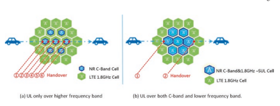

network deployment with a good balance between DL capacity and UL coverage, and brings beneft in coverage, latency, throughput, etc. It also potentially improves the spectrum utilization of the LTE UL.

## 3.3.2 Lte/Nr Spectrum Sharing: Network Deployment Scenarios

In UL, when NR is deployed in the LTE band, NR and LTE can share the resource in LTE band. LTE/NR UL sharing focuses on the sharing between NR SUL (supplementary uplink) carrier and UL part of LTE FDD.

Generally, the UL resource can be shared in TDM or FDM manner.

- For TDM sharing, both the NR and LTE share the whole UL carrier in different time slots (or symbols), while each of them can schedule the UL data and control signaling transmission in the frequency resources along the whole bandwidth of the UL carrier.

- For FDM sharing, the NR and LTE occupy the UL resource in different frequency resources, which are orthogonal to each other.

From network coupling point of view, the UL resource sharing can be done statically, semi-statically, or dynamically, as illustrated in Fig. 3.45(a), (b), and (c), 
respectively.

- Static LTE/NR UL sharing normally adopts FDM manner. As shown in Fig. 3.45(a), NR TDD carrier at frequency f0 is combined with a SUL carrier at frequency f3, which is independent from the LTE UL carrier at frequency f2. The NR SUL carrier at f3 and the LTE UL carrier at f2 belong to the same FDD band; that is, the NR SUL transmission and LTE UL transmission share the same UL 
band. With the static sharing, the NR SUL carrier and LTE UL carrier have independent scheduling, where NR SUL transmission is scheduled by the NR TDD 
carrier DL control signaling, and the LTE UL carrier is associated to the LTE DL carrier(s) at frequency f1 in the same FDD band.

- For most countries, one operator owns the FDD spectrum with symmetric DL 
and UL bandwidths. Consequently, when splitting the total UL spectrum into two parts, NR SUL spectrum and LTE UL carrier, the normal static sharing would result in a narrower LTE UL spectrum bandwidth than the LTE DL spectrum bandwidth; Fig. 3.45(a) illustrates two options of network operation:
- Option 1 in the left fgure bounds a LTE DL carrier with double bandwidth of that of a LTE UL carrier. However, although 3GPP LTE TS36 series specifed the physical layer signaling of unequal DL and UL bandwidth, there are no RAN4 test cases specifed yet and thus there is no legacy LTE terminals that can support that. To avoid this issue in the legacy LTE system, option 1 is not feasible in the practical network deployment.

 (b) Semi-static LTE/NR UL sharing, by FDM or TDM 

Option 2 in the right figure uses the equal bandwidth for the LTE DL and UL
carrier, while it introduces the second component carrier operated with DL
CA to make full use of the FDD DL spectrum resources. Among legacy LTE
terminals, there were, by the end of 2017, around 20–40% CA-capable terminls in the commercial markets in different regions. This percentage will only keep increasing in the future.

In summary, only option 2 of the static LTE/NR UL FDM sharing is feasible in the practical network deployment.

Semi-static LTE/NR UL sharing can be done in both FDM and TDM manner.

Different from the static sharing options, all the semi-static sharing solutions can
.

support the overlapped LTE UL carrier and NR SUL carrier, which can have the same bandwidth while maintaining the equality of the UL bandwidth with that of the LTE DL carrier as well. - The semi-static FDM sharing solution is shown on the left part of Fig. 3.45(b). 

Taking into account that LTE system provides a UE-specifc confguration of the frequency-domain-symmetric PUCCH resources, the network can easily perform the FDM sharing by confguring the frequency boundary of the LTE UL control channel PUCCH with a certain distance to the LTE UL carrier boundary assumed by the legacy LTE terminal, which is based on the bandwidth signaled to the UE from network.

- Moreover, network can schedule all the LTE UL data transmission in the middle part of frequency resources in the carrier while scheduling the NR SUL 
data and control signaling transmission at the edge part of the carrier frequency resources. By such a semi-static sharing, LTE system and NR system can do their own scheduling independently, with the only slow or even fxed coordination between the participation of LTE UL and NR SUL frequency resources.

- The semi-static TDM sharing solution is shown on the right side of Fig. 3.45(b). 

To permit a clean TDM partition between LTE UL and NR SUL transmission, it is important to limit the legacy UE to transmit PUCCH signaling and feedback following the standardized MBSFN pattern. This is because the legacy LTE terminals would assume that those UL sub-frames that are associated with the DL sub-frames in the MBSFN pattern are unused and skip that automatically. Based on the MBSFN pattern that is negotiated between LTE and NR network, either fxed or semi-statically, LTE and NR network can do their own scheduling independently.

- Semi-static solutions are based on RRC signaling to the terminals by the network. It provides the possibilities of proceeding a fexible resource splitting between LTE UL and NR SUL resource, based upon the timely traffc statistics of both LTE and NR systems.

- Dynamic LTE/NR UL sharing is done in TFDM manner (Fig. 3.45c). If NR and LTE are tightly coupled, dynamic sharing, which has no explicit division of UL resource for the two systems, can be used. The NR and LTE can schedule their UEs in any UL resource that is orthogonal to the reserved regions of the legacy LTE PUCCH (at the two edge parts of the carrier frequency) and periodic LTE 
SRS signals (in the last OFDM symbol of few confgured sub-frames). The interference avoidance and confict resolution are totally left to the system designer.

From the network perspective, there are two kinds of deployment of NR: SA 
(stand-alone) and NSA (non-stand-alone), as illustrated in Sect. 3.3. The differences of UL resource sharing corresponding to these two deployments are introduced in the following subsections.

## 3.3.2.1 **Lte/Nr Ul Sharing For Nr Stand-Alone Deployment**

In NR stand-alone deployment scenario, NR core network and air interface are stand-alone deployed. The NR UE does not have to access the LTE RAN (radio resource network) or EPC (evolved packet core), but only access NR RAN and NGC (next-generation core). In such a stand-alone scenario, LTE/NR UL sharing is done from the network perspective always, i.e., seen from each NR-UE; even though the SUL is deployed in LTE band, the NR UE does not have to know whether an LTE system is deployed in the same band or not. The resource occupied by LTE (if any) is scheduled to other LTE UEs, which are transparent to the NR UE.

An example for the UL sharing in the NR stand-alone deployment with SUL 
band combination case is shown in Fig. 3.46. The NR UE does not do concurrent transmission in NR UL and SUL mainly to simplify the implementation complexity at UE side, and to allow concentration of the UE transmit power in a single UL carrier to maximize the UL throughput and coverage in each UL sub-frame.

## 3.3.2.2 **Lte/Nr Ul Sharing For Non-Stand-Alone Nr Deployment,** From Network And Ue Perspective

In NR non-stand-alone deployment scenario, the NR UE is expected to have EN-DC 
capability.2 In NSA NR EN-DC mode, the NR-UE should access LTE RAN frst, and then is confgured to access an NR cell in the good coverage area of the NR base stations. So, the MCG (master cell group) uses LTE and the SCG (secondary cell group) uses NR. In this case, if NR confgures a UE with a SUL band combination, the NR SUL carrier and LTE UL carrier will share the same frequency band. Such sharing can be classifed into UE perspective solution and network perspective solution individually.

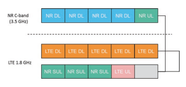

- LTE/NR UL sharing from UE perspective provides the highest fexibility of sharing the resources. The transmission on SUL carrier scheduled by NR cell and transmission on the UL carrier of LTE FDD scheduled by LTE can be in overlap frequency band. As shown in Fig. 3.47, the UL transmission scheduled by LTE 
and NR is TDM in the shared carrier. The UE is required to be capable of immediate transmission switching between LTE UL carrier and NR SUL carrier. It is worth noting the premise that the NR UE does not support concurrent transmission on NR UL carrier and NR SUL carrier generally; there exists the case that the UL transmission in a sub-frame on the NR UL carrier contains only SRS signals, and the UL scheduling in the corresponding sub-frame on the shared carrier is permitted.

- LTE/NR UL sharing from network perspective performs the resource sharing with the relaxed UE implementation complexity, as shown in Fig. 3.48. In such a case, each UE is scheduled in either LTE UL transmission or NR UL transmission at a certain time; that is, the NR UE does not support concurrent transmission in NR UL or NR SUL. While it works with an NR SUL transmission mode, the other resources in the same sub-frame can be allocated to other UEs that may work with LTE UL transmission mode, and vice versa. Following that solution, the time and frequency domain resources in a network will not be wasted. Note that the LTE UE (UE2 in the fgure) is not necessary to be an EN-DC UE. The LTE/NR sharing of the overlapped UL carrier resource among multiple UEs can be done either in TDM manner or in FDM manner.

## 3.3.2.3 **Lte/Nr Sharing In Tdd Band**

The aforementioned UL sharing scenarios are all in the LTE FDD bands, and the option of LTE/NR UL sharing in TDD bands is available as well. The DL/UL confguration of NR needs to be the same as that of LTE to facilitate UL sharing between LTE and NR in TDM manner. As shown in Fig. 3.49, NR and LTE can occupy different UL sub-frames from either network or UE perspective to fully use all the available UL resources. It should also be noted that NR and LTE DL may also be multiplexed in a TDM manner due to the restriction of legacy LTE HARQ timing.

## 3.3.3 Lte/Nr Spectrum Sharing: Requirements For Highly Effcient Sharing

This section introduces the standardized mechanisms for highly effcient LTE/NR UL sharing in Release-15, including overhead-avoidance mechanism such as LTE/ NR subcarrier alignment and PRB alignment, channel raster alignment to guarantee the validness of NR SUL shared carrier, synchronization between LTE UL and NR SUL carriers for the TDM resource coordination, and corresponding time advance mechanism.

## 3.3.3.1 **Subcarrier Alignment For Lte/Nr Spectrum Sharing**

LTE/NR subcarrier alignment on the shared carrier is required to avoid the extra overhead of the guard bands at each boundary between LTE UL transmission and NR SUL transmission in the shared spectrum.

As is well known in OFDM numerology design since 4G standardization period, subcarrier misalignment will result in severe performance degradation because of Fig. 3.49 Illustration of UL sharing between LTE and NR in TDD band

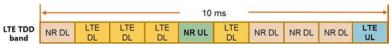

inter-subcarrier interference. To suppress the negative impact caused by inter-subcarrier interference, hundreds of kHz guard band between any subcarrier-misaligned transmissions should be reserved. It has been evaluated that at least 180 kHz (equal to one LTE PRB) is needed as the guard band for low modulation order, i.e., QPSK. However for higher modulation order including 16QAM and 64QAM, more than 360 kHz (i.e., 2 LTE PRBs) is required for guard band in order to meet the outof-band emission requirement [35]. The guard band will lead to a very ineffcient transmission in the LTE/NR shared carrier. Consequently, subcarrier alignment between LTE and NR is a basic requirement in the LTE/NR UL sharing scenario.

To attain the subcarrier alignment between LTE UL and NR SUL carrier, there are two aspects to be considered: - Alignment of the numerology of subcarrier spacing of the shared carrier:

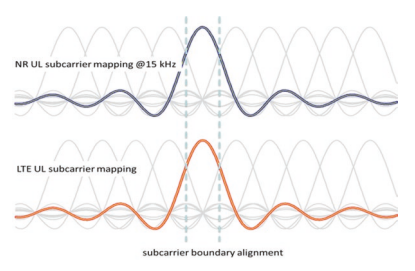

As mentioned in the previous section, UL sharing in the FDM manner has signifcant benefts compared with TDM. For the case that NR is with subcarrier spacing larger than 15 kHz as in LTE, hundreds of kHz guard band is needed to suppress inter-subcarrier interference between LTE and NR. While for the case that 15 kHz subcarrier spacing is used in NR, inter-subcarrier interference can be avoided if there is subcarrier alignment between LTE and NR and then the guard band is no longer needed.

- **Alignment of the subcarrier shift and DC position of the shared carrier:**
In LTE, different subcarrier mapping rules are applied to downlink and uplink, where a half-tone shift is adopted to the uplink compared with that in downlink as shown in Fig. 3.50. More concretely, for the LTE downlink, the middle subcarrier is mapping on the carrier frequency and such subcarrier is nulled due to the severe distortion caused by the direct current used for up-conversion. However for the LTE uplink, the middle subcarrier is preferred to be maintained in order to ensure the single carrier property since DFT-S-OFDM waveform is used to obtain a low PAPR. Consequently, for LTE uplink, the half-tone shift can avoid the impact of signal distortion on the middle subcarrier and the distortion can be spread over adjacent multiple subcarriers.

In the early stage of NR discussion, a common subcarrier mapping rule was preferred for both downlink and uplink where the same subcarrier mapping rule as that in LTE downlink was adopted but without nulling the middle subcarrier. Such a common subcarrier mapping rule is benefcial to facilitate cross-link interference mitigation for fexible duplex with DL and UL (and/or backhaul link and D2D link) sharing the same carrier. Particularly, advanced receiver in baseband is feasible to cancel cross-link interference with this design. When it comes to the UL sharing scenario between LTE and NR, NR UL subcarriers will be misaligned with LTE UL subcarriers, even when the LTE system is using 15 kHz subcarrier spacing, resulting in inter-subcarrier interference. Such inter-subcarrier interference will highly degrade the performance for both LTE and NR when they are multiplexed with each other in frequency division. 

Therefore, NR introduces fexible confguration between the two types of subcarrier mapping rules where the network will indicate to UE whether to apply a shift of 7.5 kHz for UL transmission, which is different from LTE. The intention is that the UL subcarrier shift of 7.5 kHz is only supported for the frequency bands that may be shared between LTE and NR uplink. However for other frequency bands including all TDD bands, a common subcarrier mapping rule without the 7.5 kHz shift was adopted for both downlink and uplink.

Theoretically there are multiple implementation solutions at the UE side to perform the half-tone subcarrier spacing. The most used are baseband and RF shift as shown in Fig. 3.51.

- In baseband shift, the half-tone shift in LTE uplink is achieved during the baseband signal generation. This solution can be straightforward to implement for NR to achieve the shift of 7.5 kHz with very low complexity.

- For RF shift, the 7.5 kHz shift is accomplished at the radio frequency (RF) via up-converting the baseband signal to the carrier frequency with an addition of 7.5 kHz offset.
The baseband solution is more suitable than the latter one especially for LTE/NR 
dual-connectivity (EN-DC) UE. This is because EN-DC UE already has a phaselocked loop (PLL) to lock on the carrier frequency for LTE UL. When the 7.5 kHz shift is applied at the baseband, the EN-DC UE can share the same PLL for LTE UL 
without adjusting the locked frequency. However for the RF solution, the UE has to maintain two different carrier frequencies, and adjust the locked frequency when the transmission between LTE and NR UL is switched. Or it may need to implement two PLLs for the shared uplink carrier. Although baseband solution has shown advantage compared with RF solution, considering it is an implementation issue up to the UE designer, both the options have been captured in the specifcation.

## 3.3.3.2 **Prb Alignment For Lte/Nr Spectrum Sharing**

LTE/NR PRB alignment is necessary to reach a non-overhead scheduled resource participation between LTE UL and NR SUL transmissions in the shared carrier. 

Purely aligning subcarrier between LTE and NR, however, can only avoid interference between these two RATs. Scheduling constraint is still needed because the granularity of the frequency-domain resource allocation for both NR and LTE is in a physical resource block (PRB) level, each of which consists of 12 subcarriers. If the PRB grids of NR and LTE are not aligned, it would result in certain unused PRB within the carrier for all static, semi-static, and dynamic sharing mechanisms. Furthermore, more number of guard bands are needed when UL sharing between LTE and NR because of more boundaries between LTE UL and NR SUL transmissions, as shown in Fig. 3.52. Such a large number of guard bands will highly reduce the spectrum effciency. PRB alignment between LTE and NR is therefore supported in UL sharing.

There are clear benefts of LTE/NR PRB alignment:
- The LTE/NR UL sharing transmission can be very effcient because additional overhead between LTE and NR in UL is not needed.

- The UL scheduling and network managements in both LTE and NR systems are very easy with perfect PRB alignment between LTE UL carrier and NR SUL carrier. It removes the necessity of coordination on the scheduling units and reserved frequency domain resources. To reach LTE/NR PRB alignment, both the NR scheduling unit of bandwidth part and the multi-numerology mechanisms are specifed in 3GPP Release-15: - **NR PRB scheduling unit of bandwidth part:**
In NR, the basic scheduling unit is known as bandwidth part [7]. A bandwidth part is a subset of contiguous common resource blocks. Bandwidth parts can be used to allow the UE to operate with the bandwidths less than the system bandwidth. Confguration of a bandwidth part is described in clause 12 of [5]. A UE 
can be confgured with up to four different bandwidth parts in both DL and UL with a single downlink bandwidth part being active at a given time. The UE is not expected to receive PDSCH, PDCCH, or CSI-RS (except for RRM) outside an active bandwidth part. If a UE is confgured with a supplementary uplink, the UE 
can in addition be confgured with up to four bandwidth parts in the supplementary uplink with a single supplementary uplink bandwidth part being active at a given time. The UE does not transmit PUSCH or PUCCH outside an active bandwidth part. For an active cell, the UE does not transmit SRS outside an active bandwidth part.

- Multiple numerologies **for a NR cell with a TDD carrier and a SUL carrier**
As stated before, it is desirable that the same subcarrier spacing is used for the LTE UL carrier and the shared NR SUL carrier. Consequently, multiple OFDM numerologies are supported in Release-15.

For data channels, subcarrier spacing of 15 kHz, 30 kHz, and 60 kHz is applicable to a frequency range below 6 GHz, while subcarrier spacing of 60 kHz and 120 kHz is applicable to a frequency range above 6 GHz (Table 3.22). From that table, each operator can choose their preferred numerologies for both NR TDD carrier and NR SUL carrier in their deployment of the chosen SUL band combinations.

| Table 3.22                       | Channel bandwidths for each NR band [27]   |       |     |     |     |     |     |     |     |             |     |     |     |
|----------------------------------|--------------------------------------------|-------|-----|-----|-----|-----|-----|-----|-----|-------------|-----|-----|-----|
| NR band/SCS/UE channel bandwidth |                                            |       |     |     |     |     |     |     |     |             |     |     |     |
| NR                               | SCS  5                                     | 101,2 | 152 | 202 | 252 | 30  | 40  | 50  | 60  | 80          | 90  | 100 |     |
| band                             | kHz                                        | MHz   | MHz | MHz | MHz | MHz | MHz | MHz | MHz | MHz         | MHz | MHz | MHz |
| n1                               | 15                                         | Yes   | Yes | Yes | Yes |     |     |     |     |             |     |     |     |
| 30                               | Yes                                        | Yes   | Yes |     |     |     |     |     |     |             |     |     |     |
| 60                               | Yes                                        | Yes   | Yes |     |     |     |     |     |     |             |     |     |     |
| n2                               | 15                                         | Yes   | Yes | Yes | Yes |     |     |     |     |             |     |     |     |
| 30                               | Yes                                        | Yes   | Yes |     |     |     |     |     |     |             |     |     |     |
| 60                               | Yes                                        | Yes   | Yes |     |     |     |     |     |     |             |     |     |     |
| n3                               | 15                                         | Yes   | Yes | Yes | Yes | Yes | Yes |     |     |             |     |     |     |
| 30                               | Yes                                        | Yes   | Yes | Yes | Yes |     |     |     |     |             |     |     |     |
| 60                               | Yes                                        | Yes   | Yes | Yes | Yes |     |     |     |     |             |     |     |     |
| n5                               | 15                                         | Yes   | Yes | Yes | Yes |     |     |     |     |             |     |     |     |
| 30                               | Yes                                        | Yes   | Yes |     |     |     |     |     |     |             |     |     |     |
| 60                               |                                            |       |     |     |     |     |     |     |     |             |     |     |     |
| n7                               | 15                                         | Yes   | Yes | Yes | Yes |     |     |     |     |             |     |     |     |
| 30                               | Yes                                        | Yes   | Yes |     |     |     |     |     |     |             |     |     |     |
| 60                               | Yes                                        | Yes   | Yes |     |     |     |     |     |     |             |     |     |     |
| n8                               | 15                                         | Yes   | Yes | Yes | Yes |     |     |     |     |             |     |     |     |
| 30                               | Yes                                        | Yes   | Yes |     |     |     |     |     |     |             |     |     |     |
| 60                               |                                            |       |     |     |     |     |     |     |     |             |     |     |     |
| n12                              | 15                                         | Yes   | Yes | Yes |     |     |     |     |     |             |     |     |     |
| 30                               | Yes                                        | Yes   |     |     |     |     |     |     |     |             |     |     |     |
| 60                               |                                            |       |     |     |     |     |     |     |     |             |     |     |     |
| n20                              | 15                                         | Yes   | Yes | Yes | Yes |     |     |     |     |             |     |     |     |
| 30                               | Yes                                        | Yes   | Yes |     |     |     |     |     |     |             |     |     |     |
| 60                               |                                            |       |     |     |     |     |     |     |     |             |     |     |     |
| n25                              | 15                                         | Yes   | Yes | Yes | Yes |     |     |     |     |             |     |     |     |
| 30                               | Yes                                        | Yes   | Yes |     |     |     |     |     |     |             |     |     |     |
| 60                               | Yes                                        | Yes   | Yes |     |     |     |     |     |     |             |     |     |     |
| n28                              | 15                                         | Yes   | Yes | Yes | Yes |     |     |     |     |             |     |     |     |
| 30                               | Yes                                        | Yes   | Yes |     |     |     |     |     |     |             |     |     |     |
| 60                               |                                            |       |     |     |     |     |     |     |     |             |     |     |     |
| n34                              | 15                                         | Yes   | Yes | Yes |     |     |     |     |     |             |     |     |     |
| 30                               | Yes                                        | Yes   |     |     |     |     |     |     |     |             |     |     |     |
| 60                               | Yes                                        | Yes   |     |     |     |     |     |     |     |             |     |     |     |
| n38                              | 15                                         | Yes   | Yes | Yes | Yes |     |     |     |     |             |     |     |     |
| 30                               | Yes                                        | Yes   | Yes |     |     |     |     |     |     |             |     |     |     |
| 60                               | Yes                                        | Yes   | Yes |     |     |     |     |     |     |             |     |     |     |
| n39                              | 15                                         | Yes   | Yes | Yes | Yes | Yes | Yes | Yes |     |             |     |     |     |
| 30                               | Yes                                        | Yes   | Yes | Yes | Yes | Yes |     |     |     |             |     |     |     |
| 60                               | Yes                                        | Yes   | Yes | Yes | Yes | Yes |     |     |     |             |     |     |     |
| n40                              | 15                                         | Yes   | Yes | Yes | Yes | Yes | Yes | Yes | Yes |             |     |     |     |
| 30                               | Yes                                        | Yes   | Yes | Yes | Yes | Yes | Yes | Yes | Yes |             |     |     |     |
| 60                               | Yes                                        | Yes   | Yes | Yes | Yes | Yes | Yes | Yes | Yes | (continued) |     |     |     |

| Table 3.22                       | (continued)   |       |      |      |      |      |     |     |     |     |     |     |     |
|----------------------------------|---------------|-------|------|------|------|------|-----|-----|-----|-----|-----|-----|-----|
| NR band/SCS/UE channel bandwidth |               |       |      |      |      |      |     |     |     |     |     |     |     |
| NR                               | SCS  5        | 101,2 | 152  | 202  | 252  | 30   | 40  | 50  | 60  | 80  | 90  | 100 |     |
| band                             | kHz           | MHz   | MHz  | MHz  | MHz  | MHz  | MHz | MHz | MHz | MHz | MHz | MHz | MHz |
| n41                              | 15            | Yes   | Yes  | Yes  | Yes  | Yes  |     |     |     |     |     |     |     |
| 30                               | Yes           | Yes   | Yes  | Yes  | Yes  | Yes  | Yes | Yes | Yes |     |     |     |     |
| 60                               | Yes           | Yes   | Yes  | Yes  | Yes  | Yes  | Yes | Yes | Yes |     |     |     |     |
| n51                              | 15            | Yes   |      |      |      |      |     |     |     |     |     |     |     |
| 30 60                            |               |       |      |      |      |      |     |     |     |     |     |     |     |
| n66                              | 15            | Yes   | Yes  | Yes  | Yes  | Yes  |     |     |     |     |     |     |     |
| 30                               | Yes           | Yes   | Yes  | Yes  |      |      |     |     |     |     |     |     |     |
| 60                               | Yes           | Yes   | Yes  | Yes  |      |      |     |     |     |     |     |     |     |
| n70                              | 15            | Yes   | Yes  | Yes  | Yes3 | Yes3 |     |     |     |     |     |     |     |
| 30                               | Yes           | Yes   | Yes3 | Yes3 |      |      |     |     |     |     |     |     |     |
| 60                               | Yes           | Yes   | Yes3 | Yes3 |      |      |     |     |     |     |     |     |     |
| n71                              | 15            | Yes   | Yes  | Yes  | Yes  |      |     |     |     |     |     |     |     |
| 30                               | Yes           | Yes   | Yes  |      |      |      |     |     |     |     |     |     |     |
| 60                               |               |       |      |      |      |      |     |     |     |     |     |     |     |
| n75                              | 15            | Yes   | Yes  | Yes  | Yes  |      |     |     |     |     |     |     |     |
| 30                               | Yes           | Yes   | Yes  |      |      |      |     |     |     |     |     |     |     |
| 60                               | Yes           | Yes   | Yes  |      |      |      |     |     |     |     |     |     |     |
| n76                              | 15            | Yes   |      |      |      |      |     |     |     |     |     |     |     |
| 30 60                            |               |       |      |      |      |      |     |     |     |     |     |     |     |
| n77                              | 15            | Yes   | Yes  | Yes  | Yes  | Yes  |     |     |     |     |     |     |     |
| 30                               | Yes           | Yes   | Yes  | Yes  | Yes  | Yes  | Yes | Yes | Yes |     |     |     |     |
| 60                               | Yes           | Yes   | Yes  | Yes  | Yes  | Yes  | Yes | Yes | Yes |     |     |     |     |
| n78                              | 15            | Yes   | Yes  | Yes  | Yes  | Yes  |     |     |     |     |     |     |     |
| 30                               | Yes           | Yes   | Yes  | Yes  | Yes  | Yes  | Yes | Yes | Yes |     |     |     |     |
| 60                               | Yes           | Yes   | Yes  | Yes  | Yes  | Yes  | Yes | Yes | Yes |     |     |     |     |
| n79                              | 15            | Yes   | Yes  |      |      |      |     |     |     |     |     |     |     |
| 30                               | Yes           | Yes   | Yes  | Yes  | Yes  |      |     |     |     |     |     |     |     |
| 60                               | Yes           | Yes   | Yes  | Yes  | Yes  |      |     |     |     |     |     |     |     |
| n80                              | 15            | Yes   | Yes  | Yes  | Yes  | Yes  | Yes |     |     |     |     |     |     |
| 30                               | Yes           | Yes   | Yes  | Yes  | Yes  |      |     |     |     |     |     |     |     |
| 60                               | Yes           | Yes   | Yes  | Yes  | Yes  |      |     |     |     |     |     |     |     |
| n81                              | 15            | Yes   | Yes  | Yes  | Yes  |      |     |     |     |     |     |     |     |
| 30                               | Yes           | Yes   | Yes  |      |      |      |     |     |     |     |     |     |     |
| 60                               |               |       |      |      |      |      |     |     |     |     |     |     |     |
| n82                              | 15            | Yes   | Yes  | Yes  | Yes  |      |     |     |     |     |     |     |     |
| 30                               | Yes           | Yes   | Yes  |      |      |      |     |     |     |     |     |     |     |
| 60                               |               |       |      |      |      |      |     |     |     |     |     |     |     |
| n83                              | 15            | Yes   | Yes  | Yes  | Yes  |      |     |     |     |     |     |     |     |
| 30                               | Yes           | Yes   | Yes  |      |      |      |     |     |     |     |     |     |     |
| 60                               | (continued)   |       |      |      |      |      |     |     |     |     |     |     |     |

| NR band/SCS/UE channel bandwidth SCS  5  101,2 152 202 252          | 30   | 40   | 50   | 60   | 80   | 90   | 100   |     |     |     |     |     |
|---------------------------------------------------------------------|------|------|------|------|------|------|-------|-----|-----|-----|-----|-----|
| kHz                                                                 | MHz  | MHz  | MHz  | MHz  | MHz  | MHz  | MHz   | MHz | MHz | MHz | MHz | MHz |
| n84                                                                 | 15   | Yes  | Yes  | Yes  | Yes  |      |       |     |     |     |     |     |
| 30                                                                  | Yes  | Yes  | Yes  |      |      |      |       |     |     |     |     |     |
| 60                                                                  | Yes  | Yes  | Yes  |      |      |      |       |     |     |     |     |     |
| n86                                                                 | 15   | Yes  | Yes  | Yes  | Yes  | Yes  |       |     |     |     |     |     |
| 30                                                                  | Yes  | Yes  | Yes  | Yes  |      |      |       |     |     |     |     |     |
| 60                                                                  | Yes  | Yes  | Yes  | Yes  |      |      |       |     |     |     |     |     |
| Note 1: 90% spectrum utilization may not be achieved for 30 kHz SCS |      |      |      |      |      |      |       |     |     |     |     |     |

## 3.3.3.3 **Channel Raster For The Nr Sul Band**

PRB alignment also requires the alignment of the carrier frequency (also refers to RF reference frequency in NR), which is supposed to be placed on the channel raster. In LTE, the channel raster is on the frequencies of N*100 kHz where N is an integer. While for NR, especially for the operating bands that can be coexisted with LTE, the corresponding channel raster is also defned on the frequencies of N*100 kHz. Thus, it is possible for the operator to deploy both LTE and NR on the same carrier frequency to ensure PRB alignment between LTE and NR.  As an example in Fig. 3.53, the frequency domain gap between LTE PRB and NR PRB is unavoidable when NR PRB is not aligned with LTE PRB, which also results in less available PRB for NR compared with the case of PRB alignment due to the guard band requirement for the given bandwidth.

The channel raster defnes a set of RF reference frequencies which are used to identify the position of carriers. In other words, only the frequencies defned by channel raster are valid to deploy carriers where the corresponding carrier frequency must be on the channel raster. In LTE, the channel raster is on the frequencies of N*100 kHz where N is a positive integer. However during the discussion of channel raster for NR, companies think that the channel raster defned in LTE is rather sparse which may cause severe restriction for operators to deploy networks especially for the operators having a small amount of spectrum. Hence, it was proposed to apply the most fexible design where the channel raster is on the frequencies of N*15 kHz for all frequency ranges, and thus operators can deploy the network more fexibly.

But from the perspective of UL sharing between LTE and NR, such channel raster design for NR will seldom achieve subcarrier alignment between LTE and NR though a 7.5 kHz shift is applied for NR UL. More concretely, subcarrier alignment can only be obtained for the cases that the carrier frequency of LTE uplink is on multiple of 300 kHz. That is to say only one-third of frequencies within LTE channel raster can be used for deployment of UL sharing, which is a tremendous restriction on the usage of UL sharing. Besides, considering that LTE networks have already been deployed in certain frequencies, it is not expected to affect current LTE network when NR shares uplink frequencies with LTE. Otherwise, the operator may have to redeploy current LTE networks whose carrier frequency is not on multiple of 300 kHz.

Obviously, a straightforward approach to achieve subcarrier alignment between LTE and NR is that the NR networks are deployed in the same frequencies as LTE networks; that is, the channel raster for NR SUL band is also on the frequencies of N*100 kHz. Hence, it is possible for the operator to deploy NR on the same carrier frequency as legacy LTE network to ensure subcarrier alignment between LTE and NR. It is necessary to stress that the requirement of subcarrier alignment is only for the frequency bands that have the chance to be shared between LTE and NR in the uplink. As for the other bands, the 15 kHz channel raster is preferable since it is more fexible. Owing to the aforementioned reasons, both 100 and 15 kHz channel raster are supported in NR but for different operating bands. Particularly, the 100 kHz channel raster is supported for most operating bands below 3 GHz.

## 3.3.3.4 **Synchronization And Timing For Lte/Nr Ul Sharing**

Synchronization is crucial for both NR SUL band combination and LTE/NR spectrum sharing. For both LTE/NR TDM and FDM semi-static and dynamic sharing, symbol synchronization is required at the BS receiver for the shared carrier in both LTE and NR systems, to avoid inter-subcarrier interference and thus avoid the potential guard band between the resources allocated to LTE UL transmission and NR SUL transmission, which is independent of the network perspective sharing or UE perspective sharing. In addition, sub-frame/slot-level synchronization is also necessary for the sharing coordination on the per-sub-frame resource allocation between the UL carrier in the LTE cell and the shared SUL carrier in the NR cell. Consequently, Release-15 specifed the corresponding time advance mechanism for NR SUL band combinations, as well as the enhancement on LTE HARQ timing confguration to guarantee the effcient LTE DL transmission that is associated to the shared carrier.

For NR TDD network, synchronization among different gNBs should be maintained in order to avoid co-channel interference. Cell-level synchronization accuracy for TDD is defned as the maximum absolute deviation in frame start timing between any pair of cells on the same frequency that have overlapping coverage areas. The cell-level synchronization accuracy measured at BS antenna connectors needs to be better than 3μs, which is the minimum requirement defned in the 3GPP 
specifcation.

As for the scenario of LTE and NR UL sharing, synchronization is required at the network side for the LTE UL cell and NR UL cell that serve at least one NR UE with SUL transmission, to maintain high spectrum effciency and reduce implementation complexity at gNB side. There are two levels of synchronization requirements:
- **Symbol-level synchronization** is required with both FDM-based and TDMbased LTE/NR spectrum sharing: Taking FDM-based resource sharing as an illustrative example, gNB only needs to perform one reception; for example, one FFT operation is needed to obtain baseband signal when LTE UL and NR UL are both time and frequency synchronized. Otherwise, the gNB will need to perform separate signal reception for both LTE and NR. While for TDM-based resource sharing, if LTE UL and NR UL are not synchronized, symbols between adjacent LTE and NR sub-frames would be overlapped with each other which cause intersymbol interference between the two RATs. Guard period with puncturing of the corresponding symbols may be reserved to suppress the inter-symbol interference, leading to time-domain resource reduction. LTE and NR are, therefore, required to be synchronized with each other at the symbol level in the shared UL frequency.

- **Sub-frame/slot-level synchronization** is mandated for TD-based LTE/NR spectrum sharing, which is also benefcial to FDM-based LTE/NR spectrum sharing because it simplifes scheduling and receiver implementations. As addressed in the previous section, LTE/NR TDM sharing schedules different sub-frames/slots to different users, and also enables a NR UE to switch between LTE UL transmission mode and NR SUL transmission mode from slot to slot. If the LTE UL 
cell and the NR SUL cell are asynchronous in the sub-frame/slot boundary, while both of them are the serving cells for a certain UE, it would be hard to schedule the sub-frame/slot after switching point in either system for the UL transmission from that UE. Such a restriction on scheduling of the sub-frame/slot at the boundary would result in a signifcant overhead loss. To resolve this issue, Release-15 defnes a clear guidance of the sub-frame/slot-level synchronization requirements to align the boundary of the sub-frames of LTE UL carrier and NR SUL 
carrier for the LTE cell and NR cell, which are usually provided in collocated base station, when they are sharing the same UL spectrum.

Since time synchronization between LTE UL and NR SUL and between two ULs for NR are both achieved at the network side, timing synchronization for LTE UL and the two ULs of NR at UE side is also needed. Particularly for the two ULs of NR, time synchronization can be obtained by using a single timing adjustment command and defning a same value for TA offset, as described in [5, 36]. As for time synchronization between the LTE UL and NR UL on the shared frequency, it can be achieved through network implementation.

As shown in Fig. 3.54, the same time advance is used for NR TDD UL carrier and NR SUL carrier for a single NR UE, whose transmit time at UE side is TAUE,NRTDD time ahead of the slot boundary at the NR base station transmitter. At the same time the LTE/NR sharing requires that the boundary of LTE UL sub-frames and NR UL slots for the TDM sharing is synchronized. To achieve this, the UE at EN-DC mode would transmit the LTE FDD UL signals at the time raster that is multiples of millisecond time shift of its transmission of NR SUL signals. The LTE system has an individual time advance command TAUE,LTE-FDD for the same UE which is working at EN-DC mode. Generally for a co-located deployment of LTE and NR EN-DC, 
TAUE,NR-TDD and TAUE,LTE-FDD are most likely similar to each other. Thus the LTE FDD 
DL cell and NR TDD DL cell working jointly to serve the same group of UEs are synchronized in sub-frame/slot level for the co-site LTE/NR deployment base stations.

It is necessary to note that the time synchronization among different cells or sites in LTE FDD system is not required, and thus different LTE sites may have different timings on the shared UL frequency. Since LTE UL and NR UL are required to be time synchronized on the shared UL frequency, any asynchrony would result in asynchrony among the NR ULs on shared frequency from different sites, i.e., timedomain mismatching (i.e., non-synchronization) between signal and inter-cell interference. Release-15 focused on the scenarios that the LTE UL cell and the shared NR SUL cell are collocated, where single time advance command is enough for a 

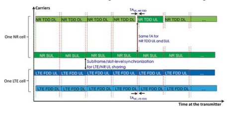

NR UE. Release-16 will enhance the LTE/NR sharing to support the non-collocated scenario by providing multiple time advance commands for NR TDD UL carrier and NR SUL carrier, respectively. Note that, for the case where two UL signals at a NR base station receiver are unsynchronized, the gNB is also required to perform separate reception for the UL on TDD frequency and the UL on shared frequency. 

However only one time of reception is needed for synchronization case. It now becomes clear that synchronization between UL on TDD frequency and UL on shared frequency for NR is benefcial to simplify the gNB implementation.

## 3.3.3.4.3 Nsa Lte/Nr Ul Sharing Tdm Confguration For Harq Timing

Particularly for NSA deployment from the UE perspective, the UE can access both the LTE and NR networks which work in E-UTRA and NR dual-connectivity (ENDC) mode. Focusing on the resource utilization on the shared UL frequency, both FDM-based and TDM-based schemes can be used. For FDM-based resource sharing, the UE can assume that both the LTE UL and NR UL could fully occupy all the UL resource within the shared UL frequency and the network can avoid resource overlapping via scheduling. As for TDM-based resource sharing, the UE will transmit UL using different radio access technologies, either LTE or NR, in different UL 
sub-frames. Given that the HARQ timing in LTE is not as fexible as that in NR, semi-static TDM-based resource sharing solution is much better than dynamic approach. Moreover, purely adopting sub-frame separation between LTE and NR will further degrade the DL data rate at the UE side due to the fact that couples of DL sub-frames cannot be used for DL data transmission because the associated UL sub-frames used for HARQ transmission have been assigned for NR transmission. To avoid such performance degradation, case 1 HARQ timing has been introduced for EN-DC UE to facilitate the usage of all DL sub-frames at the LTE side for DL data transmission, as in Fig. 3.55.

In summary, to achieve high spectrum effciency in LTE/NR sharing scenario, the following mechanisms are required for the shared LTE UL carrier and NR SUL carrier: - On the frequency domain both subcarrier and PRB should be aligned between 

LTE and NR so that all the frequency-domain resource within the carrier can be fully utilized, without additional interference. In addition, the channel raster of NR SUL carrier should be able to match with the LTE UL carriers in currently deployed commercial networks in different countries.

- On the time domain, network synchronization at both symbol level and subframe/slot level between LTE UL carrier and NR SUL needs to be supported for TDM sharing of the radio resources. The aforementioned requirements are needed for LTE/NR sharing from both network perspective and UE perspective.

## 3.3.4 Nr Sul Band Combinations: Uplink Carrier Selection And Switching 3.3.4.1 **Single-Cell Concept**

5G-NR introduces a new band type of SUL, and at the same time also introduces a new cell structure correspondingly. Cells are the basic elements of a mobile network. The basic logical element of UL/DL decoupling is one cell confgured with two uplinks and one downlink. As shown in Fig. 3.56, a typical deployment for a SUL band combination is that every cell has one radio DL carrier associated with two collocated radio UL carriers, one in the normal TDD or FDD band and another in SUL band.

The single-cell structure accommodates dynamic scheduling and carrier switching between SUL and normal UL without any interruption time. It facilitates SUL 
to be very compatible to carrier aggregation and to maximally reuse L2/L3 designs of single cell. The UE is confgured with two ULs for one DL of the same cell, and uplink transmissions on those two ULs are controlled by the network to avoid overlapping PUSCH/PUCCH transmissions in time for the best uplink power 

concentration. Overlapping transmissions on PUSCH are avoided through scheduling while overlapping transmissions on PUCCH are avoided through confguration; that is, PUCCH can only be confgured for only one of the two ULs of the cell [4, 37].

## 3.3.4.2 **Ul Carrier Selection And Switch**

As discussed in Sect. 3.3.1, UL/DL decoupling enlarges cell coverage by introducing additional lower uplink frequency to alleviate the coverage bottleneck. 

Considering the uplink bandwidth of lower frequency is usually smaller than that of higher frequency, e.g., 20  MHz at 1.8  GHz versus 100  MHz at 3.5 GHz; better uplink throughput can be provided by higher uplink frequency to those UEs which are close enough to a base station or not suffering high large-scale propagation loss on high-frequency uplink. Therefore, UL/DL decoupling should enable a fexible network operation that UEs can access to network on lower frequency f1 for uplink when they are at the cell edge while on the higher frequency f2 for uplink when they are at the cell center, as shown in Fig. 3.57. UEs will select the best uplink of the cell based on downlink measurement in both idle mode and connected mode.

Additionally, even for the cell-edge UEs having data uplink transmission on the lower frequency f1, it is necessary to occasionally transmit sounding reference signal (SRS) on the higher frequency f2 to have the reciprocal channel information for DL massive MIMO. This also requires uplink selection and switching. This section discusses the mechanism of UE uplink selection and uplink switching.

To ensure the coverage for initial access, a UE may be confgured with PRACH 
resources on both SUL and NUL (normal uplink). In connected mode, the base station can indicate the selected uplink by DCI to UE for PRACH transmission. 

However, in idle mode, the uplink for PRACH has to be selected by the UE because the UE has not attached to the network yet. More details about PRACH selection procedure between two uplinks are discussed as below.

## - **Prach Ul Carrier Selection From Ue Side:**

As shown in Fig. 3.58 [38], when the random access procedure is initiated on a serving cell with a SUL carrier, the UE would compare its RSRP measurement of the DL carrier of the same NR cell with the cell broadcasted threshold rsrpThresholdSSB-SUL. If RSRP measurement is below the threshold, it means that the UE is at the cell edge of the NR cell, where UE should select SUL carrier for random access. Otherwise, it supposes that the UE is at the cell center of the NR cell and thus will trigger the random access procedure via the normal UL carrier.

## - **Prach Ul Carrier Selection From Network Side:**

In [6], 3GPP Release-15 also specifed the PDCCH command on RACH procedure. If the CRC of the DCI format 1_0 is scrambled by C-RNTI and the 
"Frequency domain resource assignment" feld is of all ones, the DCI format 1_0 is for random access procedure initiated by a PDCCH order.

.

When the Random Access Preamble index (6 bits according to ra-PreambleIndex in Subclause 5.1.2 of [ 38 ]) is not all zero, and if the UE is configured with SUL in the cell, the following indicators are valid:
UL/SUL indicator (1 bit) indicates which UL carrier in the cell is to transmit the PRACH.

SS/PBCH index (6 bits) indicates the SS/PBCH that shall be used to determine the RACH occasion for the PRACH transmission.

PRACH Mask index (4 bits) indicates the RACH occasion associated with the S/PBCH indicated by "SS/PBCH index" for the PRACH transmission, according to [ 38 ].

## 3.3.4.2.2 Connected Mode Ul Selection: Pusch/Pucch Scheduling

Figure 3.59 shows that a UE can be served by a SUL-capable cell with two uplink configurations.

If both normal uplink and SUL are configured within a cell, which uplink to transmit is determined by UL/SUL indication (Fig. 3.60 ) in the DCI [6] with either fallback DCI 0-0 or non-fallback DCI 0-1. The fallback DCI is designed to be compatible to both SUL-capable UEs and SUL-incapable UEs so that a SUL-capable cell can serve SUL-incapable UEs which may be roaming from other countries or other carrier networks.

The mobility functions including measurement, cell selection, reselection, and handover for the SUL-capable cell are the same as those for a normal cell. The main difference is only that uplink selection is performed after the cell selection process is completed.

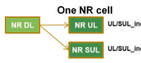

Fig. 3.60 UL/SUL indication for the cell confgured with two uplinks

## - **Ul Data Transmission: Pusch Scheduling Mechanisms**

For the UL data transmission, dynamic PUSCH selection is based on DCI 0_0 and DCI 0_1, with the switching time between SUL and non-SUL 0 or 140 us, as specifed in Table 5.2C-1 of [27] and Table 5.2B.4.2-1 of [31]. Uplink transmission faces many aspects of challenges, such as uplink power control, timing advance, HARQ feedback, and resource multiplexing, which are discussed below.

- In the uplink, the gNB can dynamically allocate resources to UEs via the C-RNTI 
on PDCCH(s). A UE always monitors the PDCCH(s) in order to fnd possible grants for uplink transmission when its downlink reception is enabled (activity governed by DRX when confgured). When CA is confgured, the same C-RNTI applies to all serving cells.

- **Dynamic UL/SUL selection:** DCI format 0_0 is used for the dynamic scheduling of PUSCH in one cell [6] based on UL/SUL indicator  (Table 3.23), 
where "0" means the selection of normal UL carrier and "1" means the selection of the SUL carrier.

- **Semi-static UL/SUL selection:** In case the "UL/SUL indicator" is not present, i.e., the number of bits for DCI format 1_0 before padding is not larger than the number of bits for DCI format 0_0 before padding, high-layer RRC 
confguration on UL/SUL selection for PUSCH transmission is done following the high-layer parameter *pucch-Confg.*
In addition, with confgured grants, the gNB can allocate uplink resources for the initial HARQ transmissions to UEs. Two types of confgured uplink grants are defned:
- With type 1, RRC directly provides the confgured uplink grant (including the periodicity).

- With type 2, RRC defnes the periodicity of the confgured uplink grant while PDCCH addressed to CS-RNTI can either signal and activate the confgured uplink grant or deactivate it; that is, a PDCCH addressed to CS-RNTI indicates that the uplink grant can be implicitly reused according to the periodicity defned by RRC, until deactivated.

When a confgured uplink grant is active, if the UE cannot fnd its C-RNTI/
CS-RNTI on the PDCCH(s), an uplink transmission according to the confgured uplink grant can be made. Otherwise, if the UE fnds its C-RNTI/
CS-RNTI on the PDCCH(s), the PDCCH allocation overrides the confgured uplink grant. Retransmissions other than repetitions are explicitly allocated via PDCCH(s).

Table 3.23 UL/SUL indicator

| Value of UL/SUL indicator   | Uplink                       |
|-----------------------------|------------------------------|
| 0                           | The non-supplementary uplink |
| 1                           | The supplementary uplink     |

## - **Ul Control Information Transmission Mechanisms** [9, 39]

Single uplink operation for EN-DC is supported by NR Release-15 where UE is capable of multiple uplinks but only one uplink transmission at one time. It is useful to avoid intermodulation UE self-interference [4, 31] and to achieve maximum transmission power for either LTE uplink or NR uplink when a UE is not capable of dynamic power sharing. However, reduced number of LTE PUCCH sub-frames results in less downlink throughput due to lack of HARQ feedback occasion for synchronous HARQ downlink scheduling. Therefore, LTE HARQ case 1 is introduced.

- **UCI multiplexing**
- In Release-15, UE must support UCI multiplexing into PUSCH [5].

- If a UE would multiplex UCI in a PUCCH transmission that overlaps with a PUSCH transmission, and the PUSCH and PUCCH transmissions fulfll the conditions in Subclause 9.2.5 for UCI multiplexing, the UE multiplexes the UCI in the PUSCH transmission and does not transmit the PUCCH.

- If a UE multiplexes aperiodic CSI in a PUSCH and the UE would multiplex UCI in a PUCCH that overlaps with the PUSCH, the UE multiplexes the UCI in the PUSCH.

- If a UE transmits multiple PUSCHs in a slot on respective serving cells that include frst PUSCHs that are in response to detection by the UE of DCI format(s) 0_0 or DCI format(s) 0_1 and second PUSCHs confgured by respective higher layer parameters *ConfguredGrantConfg*, and the UE would multiplex UCI in one of the multiple PUSCHs, and the multiple PUSCHs fulfl the conditions in Subclause 9.2.5 for UCI multiplexing, the UE multiplexes the UCI in a PUSCH from the frst PUSCHs.

- If a UE transmits multiple PUSCHs in a slot in response to detection by the UE of DCI format(s) 0_0 or DCI format(s) 0_1 on respective serving cells and the UE would multiplex UCI in one of the multiple PUSCHs and the UE does not multiplex aperiodic CSI in any of the multiple PUSCHs, the UE multiplexes the UCI in a PUSCH of the serving cell with the smallest *ServCellIndex* subject to the conditions in Subclause 9.2.5 for UCI multiplexing being fulflled. If the UE transmits more than one PUSCH in the slot on the serving cell with the smallest *ServCellIndex* that fulfls the conditions in Subclause 9.2.5 for UCI multiplexing, the UE multiplexes the UCI in the PUSCH that the UE transmits frst in the slot.

## 3.3.4.3 **Srs Switching**

It has been observed that SRS on the TDD uplink can to a large extent enhance its corresponding downlink massive MIMO performance by enabling accurate reciprocal channel information. For the existing UE categories, the typical CA-capable UEs only support one or two uplink carriers. Increasing supported number of uplink carriers means higher UE costs, bigger size, and more power consumption. Therefore, an economic practical solution is SRS switching where the same set of UE uplink hardware are shared by different multiple uplink carriers.

## - **Srs Switching Between Sul And Normal Uplink:**

Due to hardware sharing between different uplink transmissions, switching time may not be zero, which is determined case by case. For a single serving cell confgured with SUL, UE is capable of zero versus uplink carrier switching time for SRS switching between SUL and NUL, as shown in Table 5.2C-1 of [27]. If the serving cell with SUL is confgured with EN-DC and both the SUL and the LTE uplink carrier frequencies are the same, UE is also capable of zero versus switching time between SUL and NUL. In case of EN-DC with different carrier frequencies between SUL and LTE uplink, 140 versus switching time is applied to allow RF retuning, as shown in Table 5.2B.4.2-1 of [31]. For those cases with zero switching time, no performance loss is expected. However, for the case with nonzero switching time, the scheduler at base station has to take it into account and some uplink throughput loss may be inevitable. To trigger the SRS switching between SUL and NUL, an UL/SUL indicator feld is contained in the SRS request feld for both DCI downlink grant and DCI uplink 

## Grant [6]. - **Srs Switching Between Lte Uplink And Sul** Switching Time ~0 And <20 Μs: S6.3B.1.1 Of [31]. Carrier Aggregation With Srs Carrier Switching

In mobile networks, there are many kinds of downlink heavier traffc, which leads to more number of aggregated downlink component carriers (CC) than the number of (aggregated) uplink CCs. UE generally has the capability of aggregating larger number of DL carriers than that in the UL. As a result, some of the TDD carriers with DL transmission for the UE will have no UL transmission including SRS, and channel reciprocity cannot be utilized for these carriers. 

Allowing fast carrier switching to and between TDD UL carriers becomes a solution to allow SRS transmission on these TDD carriers.

A UE can be confgured with SRS resource(s) on a carrier c1 with slot formats comprised of DL and UL symbols and not confgured for PUSCH/PUCCH transmission. For carrier c1, the UE is confgured with higher layer parameter *srsSwitchFromServCellIndex* and *srs-SwitchFromCarrier*, the switching from carrier c2 which is confgured for PUSCH/PUCCH transmission. During SRS transmission on carrier c1 (including any interruption due to uplink or downlink RF retuning time [36] as defned by higher layer parameters *rf-RetuningTimeUL* and *rf-RetuningTimeDL*), the UE temporarily suspends the uplink transmission on carrier c2 [12].

## 3.3.4.4 **Power Control**

Ideally, there should be no inter-cell nor inter-user interference in cellular mobile network. However, in practical network there are. For example, the uplink signals of one UE camping in one cell interfere with other UEs' uplink reception in the neighboring cell. The higher transmit power of the uplink signal usually means better receiving quality but also may saturate the receiver and results in higher inter-cell interference. To combat this challenge, power control mechanism provides adaptation of dynamic transmit power to the UE environment by measuring the UE receiving SINR and signaling the UE-appropriate transmit power.

## - **Pc For En-Dc**

If a UE is confgured with a MCG using E-UTRA radio access and with a SCG 
using NR radio access, the UE is confgured with a maximum power PLTE for transmissions on the MCG by higher layer parameter *p-MaxEUTRA* and a maximum power PNR for transmissions on the SCG by higher layer parameter p-NR. The UE determines a transmission power for the MCG as described in [5] 
using PLTEas the maximum transmission power. The UE determines transmission power for the SCG as described in Subclauses 7.1 through 7.5 of [5] using PNR as the maximum transmission power for PCMAX ≤ PNR.

- If a UE is confgured with *PLTE* ˆ ˆPLTE PˆTotal EN DC    , where PLTE is the linear value of PLTE, PNR is the linear value of PNR, and P t ˆTotal EN−DC is the linear value of a confgured maximum transmission power for EN-DC operation as defned in [31] for frequency range 1, the UE determines a transmission power on the SCG as follows. - If the UE is confgured with reference TDD confguration for EUTRA (by higher layer parameter *tdm-PatternConfg-r15* in [5]).

- If the UE does not indicate a capability for dynamic power sharing between EUTRA and NR, the UE is not expected to transmit in a slot on the SCG when a corresponding sub-frame on the MCG is a UL sub-frame in the reference TDD confguration; at the same time, the UE is expected to be confgured with reference TDD confguration for EUTRA (by higher layer parameter tdm-PatternConfg-r15 in [9]).

- If the UE indicates a capability for dynamic power sharing between EUTRA 
and NR and if the UE is not confgured for operation with shortened TTI and processing time on the MCG [9], and if the UE transmission(s) in sub-frame i1 of the MCG overlap in time with UE transmission(s) in slot i2 of the SCG, 
and if P i ˆ ˆP i Pˆ MCG sCG *Total* EN DC   1 2      in any portion of slot i2 of the SCG, the UE reduces transmission power in any portion of slot i2 of the SCG so that P i ˆ ˆP i Pˆ MCG SCG Total EN DC   1 2      in any portion of slot i2, where P i ˆMCG   1 and P i ˆSCG   2 are the linear values of the total UE transmission powers in subframe i1 of the MCG and in slot i2 of the SCG, respectively.

## - **Pc For Physical Uplink Shared Channel** [5]

If a UE transmits a PUSCH on UL BWP b of carrier f of serving cell c using parameter set confguration with index j and PUSCH power control adjustment state with index l, the UE determines the PUSCH transmission power PPUSCH, b, f, c(i, j, qd, l) in PUSCH transmission occasion i as

PUSCH O PUSCH b f c , , , , , , , , min _ , , , ,  P i    P j b f c d CMAX f c        RB PUSCH P i j q l   10 2 10 log , , , , ,          M i j PL q b f c b f c      ,     TF f c b f c i f i l , ,    ,   b f c d b , , , ,
[dBm]

## - **Pc For Physical Uplink Control Channel**

If a UE transmits a PUCCH on active UL BWP b of carrier f in the primary cell c using PUCCH power control adjustment state with index l, the UE determines the PUCCH transmission power PPUSCH, b, f, c(i, j, qd, l) in PUCCH transmission occasion i as

$$P_{\text{PUSGRLb,\,f,c}}\left(i,j,q_{d},l\right)=\min\begin{cases}P_{\text{GMAX,\,f,c}}\left(i\right),\\ P_{\text{O\_PUSGRLb,\,f,c}}\left(j\right)+10\log_{10}\left(2^{n}\cdot M_{\text{Rxb,\,f,c}}^{\text{PUSGRH}}\left(i\right)\right)+\alpha_{b,\,f,c}\left(j\right),\\ PL_{b,\,f,c}\left(q_{d}\right)+\Delta_{\text{TF,\,b,\,f,c}}\left(i\right)+f_{b,\,f,c}\left(i,l\right)\end{cases}$$

[dBm]
- **TPC for SRS**
TPC for SRS is indicated by three kinds of DCI, DCI UL grant, and DCI format 2_2 and format 2_3 [5, 6].

## 3.3.5 4G/5G Dl Spectrum Sharing Design

NR and LTE can share the spectrum resource not only in UL but also in DL. Both FDM and TDM can be used. One of the most important issues is ICI (inter-carrier interference) avoidance between the two systems.

Note that the same waveform with LTE DL, i.e., CP-OFDM, is applied in NR 
DL. If deployed in LTE band, NR can use the same SCS (sub-carrier space) and CP (cyclic prefx) with LTE. Also, NR and LTE have the same sub-frame length (1 ms) and the same number of OFDM symbols (14) within a sub-frame. These allow ICI avoidance between NR and LTE, since the subcarriers and symbol boundaries of the two system can be aligned.

Moreover, downlink resource sharing between NR and LTE can beneft from the mechanisms below.

## 3.3.5.1 **Rate Matching Around Crs**

NR supports rate matching around LTE CRS (cell-specifc reference signal). In LTE, CRS will be sent in every effective DL sub-frame and DwPTS within the effective bandwidth. Such "always-on" reference signal will be applied to LTE UEs for CRS-based data demodulation, channel estimation, etc. So, for NR, when coexisting with LTE in DL spectrum, it is necessary to support not mapping DL data in the REs (resource elements) that carry LTE CRS, i.e., rate matching around CRS.

The following IEs (information elements) will be informed to the NR UE to determine the location of CRS:
(a) Central frequency of LTE carrier
(b) DL bandwidth of LTE carrier
(c) Number of LTE CRS port
(d) v-shift parameter of LTE CRS
(e) MBSFN sub-frame confguration of LTE (optional)
Confgured with these IEs, NR UE is aware of the REs that carry CRS, which is sent by LTE. Then, the NR UE will not receive DL data from such REs. An example is shown in Fig. 3.61.

Note that rate matching around LTE CRS is only supported for NR PDSCH. For other channels, e.g., PDCCH and SSB (synchronization signal block), rate matching around CRS is not supported.

## 3.3.5.2 **Mbsfn-Type Sharing**

MBSFN (Multimedia Broadcast multicast service Single Frequency Network)- related mechanism in LTE can be applied to the DL sharing scenario. In LTE, if a sub-frame is confgured as MBSFN sub-frame, the sub-frame is divided into two regions: non-MBSFN region and MBSFN region. The MBSFN region spans the frst one or two OFDM symbols in an MBSFN sub-frame. The LTE UE is not expected to receive PDSCH or PDCCH in the MBSFN region.

Originally, MBSFN region in the MBSFN sub-frames is used for PMCH transmission. When NR and LTE coexist, MBSFN mechanism and confguration can be reused for resource sharing. The MBSFN region can be utilized for NR DL transmission, where no LTE PDCCH, LTE PDSCH, and LTE CRS will be transmitted, as shown in Fig. 3.62.

Note that the MBSFN confguration in LTE can be transparent to NR UEs. The NR base station can avoid scheduling NR UE in the non-MBSFN region totally up to implementation. This is not the same with the case of rate matching around LTE CRS.

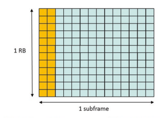

## 3.3.5.3 **3.3.5.3 Mini-Slot Scheduling**

In NR, non-slot-based scheduling is supported both in DL and UL, where only several OFDM symbols within a slot rather than a whole slot will be scheduled. This is also known as mini-slot scheduling. The valid starting symbol and symbol length are given in Table 3.24 [12].

| Normal cyclic prefx                                           | Extended cyclic prefx   |          |          |           |          |          |
|---------------------------------------------------------------|-------------------------|----------|----------|-----------|----------|----------|
| PDSCH  mapping type                                           | S                       | L        | S + L    | S         | L        | S + L    |
| Type A                                                        | {0,1,2,3}               | {3,…,14} | {3,…,14} | {0,1,2,3} | {3,…,12} | {3,…,12} |
| (Note 1)                                                      | (Note 1)                |          |          |           |          |          |
| Type B                                                        | {0,…,12}                | {2,4,7}  | {2,…,14} | {0,…,10}  | {2,4,6}  | {2,…,12} |
| Note 1: S = 3 is applicable only if DM-RS-TypeA-Posiition = 3 |                         |          |          |           |          |          |

In the above table, S denotes the index of starting symbol, and L denotes the scheduled length of symbols. Mini-slot scheduling can be used in the LTE/NR coexistence scenario. For example, the NR UE can be scheduled in the OFDM symbols that are not overlapped with LTE CRS. For another example, the NR UE can be scheduled in the OFDM symbols that are within the MBSFN region from LTE's point of view.

## 3.3.5.4 **Ss Scs Defnition For Coexisting Bands**

In NR, SSB includes PSS, SSS, and PBCH. An SSB occupies 4 consecutive OFDM symbols in time domain and 20 RBs in frequency domain. The NR UE can obtain key system information from SSB, e.g., PCID (physical cell ID) and SFN (system frame number).

SSB is critical for initial access and DL channel measurement. It is important to avoid interference from LTE to NR SSB. In LTE, the PSS, SSS, and PBCH are transmitted in the central 6 RBs of the system bandwidth. In NR, the frequency location of SSB is more fexible and is not necessary to be located in the central bandwidth. When coexisting with LTE in DL, NR SSB can avoid interfering with LTE PSS, SSS, and PBCH by FDM manner. The only thing that should be considered is the interference from LTE CRS, since CRS is always on in non-MBSFN region.

When coexisting with LTE in DL (below 3G Hz), NR may use SSB with 30 kHz SCS. NR supports two different SSB candidate patterns when SCS = 30 kHz, i.e., Case B and Case C (Fig. 3.63). In Case B, the frst symbols of the candidate SS/
PBCH blocks have indexes {4, 8, 16, 20} + 28*n within a half fame, where n = 0 for carrier frequencies smaller than or equal to 3 GHz (major LTE/NR coexistent band). In Case C, the frst symbols of the candidate SS/PBCH blocks have indexes 
{2, 8} + 14*n within a half frame, where n = 0, 1 for carrier frequencies smaller than or equal to 3 GHz. The following fgure shows the SSB candidates of these two cases, where LTE CRS (4 ports) is also illustrated for comparison.

As can be seen from the above fgure, even in the worst case (4 CRS ports, no MBSFN confguration), Case B still has one SSB candidate (the 1st one) that is not overlapped with any OFDM symbols containing CRS. This guarantees that at least one SSB can be delivered without interfering with LTE CRS. On the other hand, if MBSFN is confgured to LTE, all SSB candidates in Case B can be transmitted without interfering with LTE CRS.  This provides maximum fexibility of SSB transmission.

Fig. 3.63 SSB candidates for SCS = 30 kHz

## 3.4 **5G-Nr New Physical Layer Technologies** 3.4.1 Waveform And Multiple Access

OFDM has become a proven success in LTE, but it took some years to be considered mature enough to be selected. OFDM in the ETSI concept group gamma lost out to WCDMA in June 1998 for UMTS. Interest in OFDM did not diminish, however, as seen in various feld tests (e.g., [40]) and further study in 3GPP from 2002 to 2004 [41]. The primary track in 3GPP after WCDMA was HSPA, with study approved in March 2000 [42, 43], leaving OFDM to be developed in IEEE802.16d/e (WiMAX). 

For EUTRA, the LTE study approved in RAN\#26 in December 2004 focused primarily but not exclusively on OFDM, and it was not until RAN\#30 in December 2005 that a decision was frmly made to purse an OFDM downlink and SC-FDMA uplink over MC-CDMA and other alternatives [44].

Some of the main aspects that led to the selection of OFDM for the downlink include low cost and complexity of implementation for wide (20 MHz) bandwidth, inherent and simple multipath protection through the use of a cyclic prefx, and a naturally scalable implementation where multiple system bandwidths can be supported. Subcarriers were grouped together in sets of 12 to form a PRB. The number of 12 was chosen as a trade-off between resource allocation size and padding for small packets [45]. A 0.5 ms slot could hold either 7 or 6 OFDM symbols, allowing multiple CP choices. (The 1 ms sub-frame with two 0.5 ms slots was a simplifying compromise on proposals ranging in (or indeed adapting between) 0.5 and 2 ms.) Many different SCS were investigated under the basic assumption of keeping a 10 ms radio frame and providing two reasonably sized CP for the expected deployments. 15 kHz offered 4.67 and 16.67μs CP. Occupancy was targeted at roughly 90%, again for implementation purposes.

For the LTE uplink, a primary concern was an effcient 20 MHz implementation. 

A 20 MHz uplink represented a big departure from what was commercially used in cellular systems at that time, and there was much worry that the PA and other components would drive the cost too high for widespread adoption. There was much discussion on whether a smaller minimum UE bandwidth could be supported, such as 10 MHz [46]; this idea was eventually discarded because of the added system complexity for initial access for a UE bandwidth without a fxed relation to the synchronization signals and the system bandwidth [47]. (More than 10 years later NR 
repeated the discussion, and given the very large range of carrier bandwidths decided to a support minimum UE bandwidth much smaller than the maximum carrier bandwidth, see Sect. 3.1.1, and locations of synchronization signals not fxed within the UE bandwidth or system bandwidth.) Peak-to-average power ratio (PAPR) was a hot discussion, soon to be replaced with the more accurate but not as straightforward to calculate cubic metric (CM) [48]. The selection of a single-carrier waveform allowed for a substantially lower CM for the uplink, thus facilitating lower cost lower power consumption UE.  The SC-FDMA waveform used is "DFT"- spread OFDM (DFT-S-OFDM), with an extra DFT block making the net signal single carrier. Trade-offs for this waveform included a design that did not mix data and reference symbols in the same SC-FDMA symbol, and restrictions on allocations to only have factors of 2, 3, and 5 for ease of DFT implementation. Multicluster UL transmission (with higher CM) or simultaneous PUSCH and PUCCH 
were not specifed until Release-10.

For NR, there were a number of proposals again, but the time for waveform selection was signifcantly reduced compared to LTE. The NR study item began in April 2016, and the basic waveform for up to 52.6 GHz (the upper limit of a range of bands identifed for WRC-19) was selected to be a cyclic prefx (CP) OFDM spectrally confned waveform. Several different variants of spectrally confned waveforms were studied, including "windowed" and "fltered" OFDM. In the end it was agreed that it would be possible to assign much larger (for example, 106 PRBs in 20 MHz instead of 100 PRBs as in LTE; see [49] Sect. 5.3.2) numbers of resources within the carrier bandwidth, higher than the ~90% for LTE [50, 51]. However, the fltering operations necessary to meet those requirements were agreed to be not specifed and left up to implementation. As with LTE, the specifcations developed in RAN1 still allow the base station to have higher spectrum utilization (Y%) than the minimum requirements defned in RAN4 (X%) [51, 52] \# of PRBs [53] (Fig. 3.64).

The CP-OFDM waveform was selected to be the basic waveform for both the downlink and the uplink. DFT-S-OFDM was not selected as the basic waveform for the uplink as part of the initial decision on the uplink waveform. Part of the reason is an increased focus in NR on unpaired spectrum, and symmetry of design including DM-RS was seen to be appealing particularly when considering cross-link interference measurements. DFT-S-OFDM was also selected as a complementary waveform because of its PAPR advantage. All NR UEs were required to provide mandatory support for both CP-OFDM and DFT-S-OFDM [54, 55]. DFT-S-OFDM is intended only for single-layer transmission, targeting limited coverage scenarios. The UL waveform is indicated by RMSI for Msg 3 of the RACH procedure and later 

Fig. 3.64 An exemplary illustration of the frequencies used by the system and that by particular UEs

3 5G Fundamental Air Interface Design
by UE-specifc RRC for non-fallback DCI (fallback DCI uses the same waveform as for Msg 3).

The modulation supported in NR is very similar to that in LTE. QPSK to 256 QAM is supported, with 256 QAM mandatory for DL in FR1 and having optional feature signaling for UL and FR2. Higher constellation, such as 1024 QAM, is not supported in Release-15 NR, though it is supported for the LTE DL intended for high-capacity stationary terminals. Release-16 NR studied the usage of 1024 QAM as part of the integrated access and backhaul study item, 1024 QAM for DL was specifed in Release-17 NR as part of a RAN4-led work item.

One difference between NR and LTE is that NR will support π/2 BPSK for DFTS-OFDM [56, 57], which with frequency domain spectral shaping (FDSS) in Fig. 3.65 offers lower CM operation. The FDSS flter is up to UE implementation (i.e., the Tx FDSS flter is transparent to the Rx) [58, 59].

The handling of the "DC subcarrier" is different in LTE and NR. For LTE, a DC 
subcarrier was reserved and not used for data transmission on the DL, and a 7.5 kHz shift was introduced on the uplink to avoid having DC fully aligned with a single subcarrier. For NR, the DL and UL are symmetric with no explicit DC subcarrier reserved. The transmit DC subcarrier is modulated (at either the gNB or the UE), 
and not rate matched or punctured. The receiver may know if the transmit DC subcarrier is present or not within the receiver BW, and if present the location. At the receiver side, no special handling of DC subcarrier(s) is specifed in RAN1. One reason for a difference in handling of transmitter- and receiver-side DC in NR than from LTE is that there may be different minimum bandwidths for different UEs, with UE receiver bandwidth not necessarily aligned in the center of the gNB carrier bandwidth.

One important issue with NR is coexistence with LTE; see Sect. 3.3. In case NR 
and LTE are both deployed in the same band, it is desirable to align the uplink subcarriers to minimize the inter-subcarrier interference. Therefore NR has introduced the possibility to shift the uplink raster by 7.5 kHz. In this case, the uplink LTE and NR subcarriers will be aligned (Figs. 3.66 and 3.67).

## 3.4.2 Channel Coding

Channel coding at peak data rates is a hardware challenge for each new generation; 5G-NR is no different. The top LTE UE category is very high (UE cat 26, ~3.5 Gbps), and theoretically LTE can even meet the ITU requirements exceeding 20 Gbps (32 20 MHz carriers at 256 QAM/1024 QAM). 5G-NR will support 20 Gbps or more for eMBB, having similar or greater throughputs as LTE initially and much higher as time goes on. At long block sizes and high data rates, the challenge is keeping good (near Shannon limit) performance with reasonable complexity and latency. At 

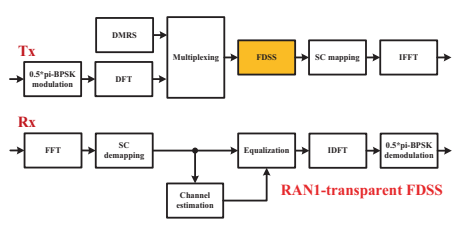

Fig. 3.65 Uplink transmission and reception with π/2 BPSK and FDSS
Fig. 3.66 Do nothing at DC

 #### Fig. 3.67  Uplink raster $\;$ with 7.5 kHz shift 

small block lengths (less than a few hundred bits) there is an opportunity for improvement (1–2 dB) over TBCC (tail-biting convolutional codes). In addition, NR must maintain the excellent fexibility and HARQ support as provided in LTE.  This is essential for "real-world" scheduling and adaptive modulation and coding (AMC).

The focus on short block lengths in addition to long block lengths is one difference of NR compared to LTE. Long blocks may dominate "worst-case" implementation complexity and latency seen when considering the peak data rate performance of the system. However, short blocks may dominate overall system performance. A signifcant percentage (~50–90%) of packets less than 200 bytes for background traffc, instant messaging, gaming, etc. was shown in TR36.822, Enhancements for Diverse Data Applications. System information, RRC signaling, and L1 DL/UL control are all typically less than 200 bytes. The performance of small packets and control information may limit the system link budget and system coverage. Coverage for control may be especially important when data is beamformed and has naturally greater coverage than control.

As in LTE, the channel coding discussion for NR occurred in two phases: code down-selection and code design.

- **LTE down-selection**: April 2005 to Aug 2006, WCDMA turbo (legacy) vs. contention-free turbo vs. LDPC
- **LTE design**: Nov 2006 to Feb 2008, contention-free turbo design (not as much attention on control channel coding, convolutional code design selected as TBCC March 2007)
- **NR down-selection**: April 2016 to Oct/Nov 2016, contention-free turbo (legacy) 
vs. LDPC vs. polar (control channel also considers TBCC)
- **NR design**: Nov 2016/Jan 2017 to Dec 2017. LDPC and polar codes.

The discussion of codes for NR focused primarily on turbo codes (as used in LTE), LDPC codes (as discussed for LTE and used in Wi-Fi), and polar codes (new to standards). At the time of LTE down-selection, LDPC codes [60] although an older concept were seen as infexible compared to turbo codes, with implementations that were not as mature compared to turbo codes. Turbo codes were therefore selected for LTE, suitably improved from the version used in HSPA [61]. In the decade since, LDPC codes have been better understood and commercially developed for 802.11n and 802.11ac [62]. Polar codes had few (if any) published implementations, and so were a "less well-established" candidate. They were however considered promising for low-complexity simple decoding at highest data rates as well as performance at small block sizes [63]. Turbo codes were well known, but the following was observed for their application to NR: "For turbo codes, there are concerns that implementation with attractive area and energy effciency is challenging when targeting the higher throughput requirements of NR" [55]. Table  3.25 highlights the selection phase summary of the coding options.

| Table 3.25                     | Properties of the codes considered for NR                |                          |                               |
|--------------------------------|----------------------------------------------------------|--------------------------|-------------------------------|
| Factor                         | LTE (turbo)                                              | LDPC                     | Polar                         |
| Maturity                       | Established  (widely  implemented)                       | Established (widely      | Less well established (no     |
| implemented)                   | commercial implementation at  the time of NR study item) |                          |                               |
| Performance                    | OK for large                                             | OK for large             | OK for large Better for small |
| Complexity                     | Throughput  and area  effciency not  suffcient for  NR   | Best throughput and area | Implementable with smaller    |
| effciency for NR               | (L = 8) list and block sizes                             |                          |                               |
| Latency at high  Parallel, but | Best (highly parallel)                                   | Acceptable               |                               |
| data rates                     | enough?                                                  |                          |                               |
| Flexibility                    | Acceptable                                               | Acceptable               | Acceptable                    |
| Other                          | Chase and IR                                             | Chase and IR             | Chase and IR                  |

## 3.4.2.1 **Ldpc**

LDPC codes are used for data transmission in NR for both the DL and UL. There are two base graph designs, targeting small and large block sizes.

An LDPC code takes K information bits and creates N parity bits using an 
(N − K) × N bit parity check matrix. The code is represented by a base graph whose entries are replaced by sub-matrices of size Z. NR has two base graphs, BG1 and BG2. The frst base graph  =  46  ×  68, and Z is one of 51 values in 
{2,3,4,…,320,352,384}. The information block sizes of K = 22*Z are directly supported, with a maximum K = 8448 for Z = 384. There is a second base graph targeting smaller block sizes, with base graph  =  42*52, same Z choices, maximum K = 3840 = 10*Z with N = 50/10 * K, and other small differences. The sub-matrices are all zero, identity, or circular shifted identity matrices.

The block diagram for the downlink is shown in Fig. 3.68. Similar to LTE, rate matching and segmentation/concatenation are defned. The larger information blocks are segmented into multiple code blocks, with a CRC per block, as in LTE. Rate matching supports other information sizes, code rates, and IR-HARQ. The frst 2*Z bits are not included in the circular buffer, so the mother code rate for BG1 is 22/66 = 1/3, with N = 66/22 * K. Four redundancy versions (RVs), as in LTE, are defned. Limited buffer rate matching (LBRM) may be confgured. A bit interleaver for scrambling is applied after rate matching to distribute bits into higher order modulation symbols for a small gain.

The selected LDPC codes have good properties for implementation (e.g., quasirow orthogonal (QRO), dual diagonal; Fig. 3.69).

The same base graph is used for the initial transmission and retransmissions of the same code block. Figure 3.70 illustrates the usage of BG1 and BG2 with respect to the code rate (up to 0.95) and the number of information bits (up to 8448 bits). A UE can skip decoding when the effective code rate is >0.95 (some CB sizes may not be decodable above code rate of 0.92).

## 3.4.2.2 **Polar Code**

Polar codes are used for control information on the downlink (DCI) and uplink (UCI), as well as for the PBCH, with slight differences in the code construction and design for each of these cases. The information block sizes for polar codes in NR are therefore smaller than those seen in the data channel, with K a maximum of 140 for DCI and 1706 for UCI (before segmentation). Rate matching is performed for both UCI and DCI, segmentation, and bit interleaving only for UCI. As in LTE, the very smallest UCI information block sizes use different coding, repetition, simplex, and RM codes [6].

Polar coding involves encoding in such a way that positions in the code word can be ordered in terms of reliability. The most reliable positions are used for important 
"assistant" bits (such as CRC bits or other bits) that can be used to assist decoding, then other input information bits, and then "frozen" bits in the lowest reliability positions. At the decoder, these lowest reliability positions will be set to a known value (zero) in the decoder.

The polar coding fow is shown in Fig. 3.71. An encoding vector is generated by placing the input information bits together with the assistant bits. An encoding vector is then generated using a polar sequence of length with a power of 2 and greater than the input plus assistant size, ordered in ascending order of reliability. After Arikan encoding, rate matching is performed to produce an output code word.

For the DCI code construction, the assistant bits are a 24-bit CRC. Initialization of CRC shift register is all ones. An interleaver of size 164 distributes CRC bits within the encoding vector to help provide early termination gains at the decoder. 

The polar sequence is of length 512. Rate matching (sub-block interleaving, bit collection) is performed. Segmentation and bit interleaving are not used for the DCI. The CRC length for the DCI is larger than the 16-bit CRC used in LTE considering that more blind decodes may be performed per unit time in NR than LTE and that the CRC bits are also used for polar coding. The target false alarm rate is roughly equal to that of a 21-bit CRC.

For the UCI code construction, the assistant bits are an 11-bit CRC for 20 or more input information bits, or a 6-bit CRC and 3 parity check (PC) bits for fewer input information bits. Initialization of CRC shift register is all zeros. The CRC bits are appended, not distributed by an interleaver. PC-bit positions are chosen among the highest reliable bit sets reserved for the information bits and are calculated from the information bits. Positions and calculation are known to the decoder. The UCI 
feld order is CRI → RI → padding bits (if present) → PMI →  CQI.  The polar sequence is of length 1024. Rate matching also includes bit interleaving. 

| Table 3.26                                  | Channel coding schemes for NR control channels   |         |                                                 |          |           |            |            |
|---------------------------------------------|--------------------------------------------------|---------|-------------------------------------------------|----------|-----------|------------|------------|
| Payload type                                | UCI                                              | BCH     | DCI 11 < K (padding is  used to  reach  K = 12) |          |           |            |            |
| Coding and                                  | Repetition                                       | Simplex | Block code  Polar                               | Polar    | Polar     | Polar      |            |
| subclause                                   | 5.3.3.1                                          | 5.3.3.2 | 5.3.3.3                                         | 5.3.1.2  | 5.3.1.2   | 5.3.1.2    | 5.3.1.2    |
| nmax                                        | N/A                                              | N/A     | N/A                                             | 10       | 10        | 9          | 9          |
| CRC                                         | N/A                                              | N/A     | N/A                                             | gCRC6(D) | gCRC11(D) | gCRC24C(D) | gCRC24C(D) |
| polynomial Payload size  (excluding  CRC if | 11 < K                                           |         |                                                 |          |           |            |            |
| applicable)                                 | K = 1                                            | K = 2   | 2 < K ≤ 11                                      | ≤ 19     | 19 < K    | K = 32     |            |
| Initial CRC                                 | N/A                                              | N/A     | N/A                                             | 0x00     | 0x000     | 0x000000   | 0xFFFFFF   |
| remainder Maximum  number of  segments      | N/A                                              | N/A     | N/A                                             | 1        | 2         | 1          | 1          |
| Payload  interleaving  (IIL)                | N/A                                              | N/A     | N/A                                             | No (0)   | No (0)    | Yes (1)    | Yes (1)    |
| Total number  of parity bits  (nPC) N/A     | N/A                                              | N/A     | 3                                               | N/A      | N/A       | N/A        |            |
| Number of  parity bits in  minimum  weight  locations  wm   nPC N/A                                             | N/A                                              | N/A     | 0 or 1                                          | N/A      | N/A       | N/A        |            |
| Coded-bit  interleaving  (IBIL)             | N/A                                              | N/A     | N/A                                             | Yes (1)  | Yes (1)   | No (0)     | No (0)     |

Segmentation and code block concatenation are used when K ≥ 360 and M ≥ 1088 
(where M is coded bits for UCI), with two equal-sized blocks each with CRC based on that segment.

The polar coding for NR-PBCH is the same as for DCI: polar code with distributed CRC (32 information bits plus 24-bit D-CRC, Nmax = 512). Coding steps for PBCH include payload generation, scrambling, CRC addition, channel coding, and rate matching. Payload generation is unique for PBCH in that the PBCH felds that may have known bit values (e.g., SS block time index, SFN bits in handover cases) 
are placed in a specifc order to enable improved PBCH decoder performance/ latency.

Channel coding schemes for control channels are summarized in Table 3.26 [64].

## 3.4.3 Mimo Design

MIMO operation in NR is based very closely on that developed in Release-14 LTE, 
with a few main differences summarized below and discussion in details in the following sections, and an overall summary is given in Table 3.27.

As discussed in Sect. 3.1.4 on reference signals, cell-common reference signal as in LTE no longer exists in NR standards and the whole framework of reference signal designs changes. As a consequence, MIMO transmission in NR is based only on DM-RS for demodulation with assistance of TRS for time and frequency tracking and of PT-RS for phase tracking in FR2. Note that there is no uplink or downlink 

| Table 3.27                              | An overall summary of the MIMO feature in 5G                                                                                                                                                                                                                                                                         |
|-----------------------------------------|----------------------------------------------------------------------------------------------------------------------------------------------------------------------------------------------------------------------------------------------------------------------------------------------------------------------|
| Aspect                                  | Description                                                                                                                                                                                                                                                                                                          |
| Reference signal                        | Removed LTE-like CRS, introduced PT-RS for phase noise                                                                                                                                                                                                                                                               |
| framework                               | compensation, and uses various CSI-RS confgurations for multiple  functionalities such as fne T/F synchronization and QCL assumption,  RRM, CSI acquisition, and beam management                                                                                                                                     |
| DMRS                                    | Extended and more fexible than LTE. Introduced type 1 and type 2  confgurations that occupy confgurable 1 or 2 symbols. Supports up to  12 orthogonal layers with type 2 and two symbol confgurations.  Supports front-loaded only (for low latency) and front-loaded plus  additional DMRS location(s) for mobility |
| CSI-RS                                  | Expanded use from LTE with more options of T/F patterns and densities.  Introduced different confgurations to support, in addition to CSI  acquisition, BM, tracking (TRS), NZP IM for probing, RRM  (optionally), and RLM                                                                                           |
| SRS                                     | Similar as Release-15 LTE, enhanced to support up to 4 ports, antenna,  and carrier switching, as well as non-codebook-based UL MIMO                                                                                                                                                                                 |
| Confgurable  scrambling/ initialization | Available for UL and DL data, PUCCH, UL, and DL RS. Based on cell  ID may be default but enables the possibility of UE-centric operation                                                                                                                                                                             |
| Beam management                         | New for NR, needed for >6 GHz, can be used below 6 GHz. "Beam" is  used in RRC, and "Transmission Confguration Indication" (TCI) with  type D QCL is used in PHY to indicate beam                                                                                                                                    |
| Beam failure                            | New for NR. UE measures downlink signal (CSI-RS/SSB) to detect                                                                                                                                                                                                                                                       |
| recovery                                | beam failure and to fnd new candidate beam(s), sends PRACH to report,  and then looks on corresponding CORESET for gNB response                                                                                                                                                                                      |
| DL MIMO                                 | Type I codebook is very similar to that of LTE Release-14. Type II  codebook introduced with higher accuracy. CSI reporting framework is  extended in terms of fexibility and supporting of beam management and  interference measurements. Nontransparent MU-MIMO and simpler  code word to layer mapping           |
| UL MIMO                                 | Similar as LTE: Codebook based. Framework is LTE (codebooks  updated) New for NR: non-codebook based. Better resolution than codebook.  Needs extra signaling and improved for using TDD reciprocity-based  operation                                                                                                |

transmit diversity, however, which means that NR could be less robust in certain environments (such as high speeds).

A large number of antennas are envisioned in NR networks while a relatively small number of antennas are at the handsets; therefore multiuser (MU) MIMO is critical to really take advantage of the spatial dimension of the multi-antenna system for high spectrum effciency. To achieve good trade-off between the MU-MIMO 
performance and overhead associated with the potentially large number of layers for the UEs, explicit indication of DM-RS antenna ports utilized for multiple UEs is supported which is not the case for LTE. Code word-to-layer mapping and RE mapping are now also different in NR.

CSI report framework is expanded and modifed in NR in order to accommodate features like beam management, new nonzero power (NZP) CSI-RS interference measurement resource, etc. Feedback codebook design is also expanded to cover multiple panels, and to have higher accuracy with larger overhead.

For UL MIMO, in addition to codebook-based MIMO scheme, non-codebookbased MIMO scheme is introduced. To support FR2 in higher frequency, beam management procedures are introduced for beam sweeping/selection, beam failure recovery, etc.

The fact that NR does not have a number of transmission modes like LTE does not mean that NR is simpler than LTE. In actuality, this "single mode" is extremely confgurable, including the new beam management functionality, RS, and other enhancements. NR has upwards of about 50 related UE capabilities and about 200 RRC parameters, a signifcant increase over the ~15 and ~50 seen in LTE Release-13/14 MIMO. It is likely that signifcant efforts will be needed to ensure that gNB and devices can interoperate beyond the most basic functionality and defaults to reach the full potential of NR MIMO.

## 3.4.3.1 **Dm-Rs-Based Mimo Transmission**

In NR, both uplink and downlink data transmissions (PUSCH and PDSCH) are based on DM-RS for demodulation. For DM-RS design, please refer to Sect. 3.1.4.2. For SU-MIMO, NR supports maximum eight orthogonal DL DM-RS ports and maximum four orthogonal UL DM-RS ports conditioning on the related UE capability. For MU-MIMO, NR supports maximum 12 orthogonal DM-RS ports for both downlink and uplink. For DFT-s-OFDM waveform, only single layer (i.e., rank 1) per UE is supported. For CP-OFDM waveform, the actually supported maximum ports per UE depend on the confgurations of DM-RS types and number of occupied OFDM symbols as shown in Table 3.28.

In the following, more details are provided for codeword-to-MIMO layer mapping, PRB bundling for precoding, and DCI indication for DM-RS ports.

| Max ports per UE in  MU-MIMO  (CP-OFDM)   |    |    |    |    |
|-------------------------------------------|----|----|----|----|
| DL                                        | UL | DL | UL |    |
| Type 1 with 1 symbol                      | 4  | 4  | 2  | 2  |
| Type 1 with 2 symbols                     | 8  | 4  | 4  | 4  |
| Type 2 with 1 symbol                      | 6  | 4  | 4  | 4  |
| Type 2 with 2 symbols                     | 8  | 4  | 4  | 4  |
| Max ports per UE in SU-MIMO  (CP-OFDM)    |    |    |    |    |
| DM-RS confguration                        |    |    |    |    |

## 3.4.3.1.1 Codeword-To-Layer Mapping

Compared to LTE where generally two codewords are mapped once there are more than one layer for PDSCH/PUSCH transmission, in NR up to four layers are mapped to a single codeword and fve or more layers are mapped to two codewords. Rationale behind this design includes signaling overhead, robustness of link adaptation, demodulation/decoding latency, etc. Since a single MCS level is assigned for a code word of multiple MIMO layers whose channel quality can be very different, there may be potential performance degradation while the exact amount of loss depends on many factors.

For fve or more layers, frst ⌊L/2⌋ layers are mapped to the frst code word 
(CW0) and the remaining layers to the second code word (CW1).

When mapping coded modulation symbols, the order is layer frst, then frequency (in terms of subcarrier), and last time (in terms of OFDM symbol).

## 3.4.3.1.2 Prb Bundling

Frequency domain granularity of precoding of DM-RS trades off more precise precoding versus better channel estimation performance. Similar to LTE, this frequency domain granularity is defned via PRB bundling where UE may assume that the same precoding is applied for a set of contiguous (and bundled) PRBs. The PRB bundling size is confgurable in NR. The candidate sizes include 2, 4, or wideband. In the case of wideband PRB bundling, the UE is not expected to be scheduled with noncontiguous PRBs and the UE may assume that the same precoding is applied to the allocated resource. In the case of PRB bundling size of 2 or 4, the corresponding bandwidth part (BWP) is partitioned into precoding resource block groups (PRGs) 
of size 2 or 4 with aligned boundary to facilitate multiple-user pairing. PRB bundling size is UE-specifcally confgured. It can be confgured as static with 1 value. 

It can also be confgured for dynamic indication via a 1-bit feld in DCI and PDSCH resource allocation to jointly determine the size. Default size 2 is used before RRC confguration and for PDSCH with DCI format 1_0. The procedure to determine PRB size is shown in Fig. 3.72.

Note that NR also supports DM-RS bundling in time domain across slots when contiguous slots are assigned for a PDSCH transmission.

## 3.4.3.1.3 Dci For Mu-Mimo

To achieve high spectrum effciency, MU-MIMO transmission and reception have to adapt dynamically to channel conditions, UE distribution, data traffc, etc. This implies that the number of MIMO layers and the occupied DM-RS ports for the paired UEs vary with time (from transmission to transmission) and frequency (from RBG to RBG). More transmission layers may provide higher throughput at the cost of DM-RS overhead. In NR, in addition to the DM-RS ports used for data transmission (PDSCH or PUSCH) of the intended UE, DCI also indicates the number of DM-RS CDM group(s) that are without data mapped to their corresponding REs. 

These DM-RS CDM groups include of course the CDM group(s) of the UE's DM-RS ports, and in addition, it can include CDM group(s) that may be for other UEs' DM-RS ports. Therefore, this signal can be used to indicate MU-MIMO transmission and dynamically adjust the associated overhead. For downlink (and in a sense uplink as well), this falls between transparent MU-MIMO where the UE has no knowledge of paired UE(s) in terms of their used DM-RS ports and the nontransparent MU-MIMO where the UE knows exactly which DM-RS ports are used for other UE(s).

## 3.4.3.2 **Csi Acquisition**

To facilitate downlink MIMO transmission, especially for FDD system, channel state information (CSI) is fed back by the UE for the network to determine the pairing of UEs, precoding, number of layers, MCS level, etc.

## 3.4.3.2.1 Framework For Confguration And Signaling Of Csi Acquisition

For CSI acquisition, the UE measures channel and interference over confgured resources, generates intended CSI report(s), and sends the report(s) over the confgured uplink channel(s) at the right time (by confguration and/or by triggering). In NR, a confguration and signaling framework is specifed for CSI acquisition. The framework covers mainly three aspects: resource setting, reporting setting, and list of report triggers (Fig. 3.73).

A resource setting comprises a number of CSI resource sets where each CSI 
resource set consists of a number of nonzero power (NZP) CSI-RS resources, a number of SS/PBCH block resources, or a number of CSI-IM (interference measurement) resources. The number of NZP CSI-RS resource sets is indexed to the pool of resource sets of NZP CSI-RS confgured for the UE of the CC/BWP wherein each NZP CSI-RS resource set is given a resource set identifcation. Resource sets of SS/PBCH block resources and of CSI-IM are confgured in the same way. A number of resource settings may be confgured for the UE of the CC/BWP.

A number of report setting may be confgured for the UE of the CC/BWP. A 
report setting confgures information for the UE to measure and report certain channel state information (Fig. 3.74). These information include measurement resources 
(as resource setting(s)) where channel measurement is performed and if confgured where interference measurement is performed, report type (periodic, semi-persistent on PUCCH or PUSCH, or aperiodic), report quality, report frequency confguration (wideband versus sub-band), time restriction for channel or interference measurement (on or off), codebook confguration, group-based beam reporting, CQI table, sub-band size, non-PMI port indication, etc.

A list of trigger states can be confgured for aperiodic CSI reporting triggered by DCI feld of CSI request and another list of trigger states may be confgured for semi-persistent CSI reporting on PUSCH. For aperiodic CSI reporting, each code point of the DCI feld of CSI request is associated with one trigger state. Each trigger state contains a list of associated report setting as described above. If a resource setting linked to a report setting has multiple aperiodic resource sets, only one of the aperiodic CSI-RS resource sets from the resource setting is associated with the trigger state, and the UE is higher layer confgured per trigger state per resource setting to select one CSI-IM/NZP CSI-RS resource set from the resource setting. Upon reception of the value associated with a trigger state, the UE will perform measurement and aperiodic reporting accordingly.

## 3.4.3.2.2 Measurement For Csi Acquisition

As aforementioned, the resources for a UE to measure channel and interference for CSI reporting are confgured in the report setting as one or more resource settings. 

The number of resource settings can be one, two, or three. When one resource setting is confgured, the resource setting is for channel measurement for L1-RSRP 
computation. When two resource settings are confgured, the frst resource setting is for channel measurement and the second one is for interference measurement performed on CSI-IM or on NZP CSI-RS. When three resource settings are confgured, 

the first resource setting is for channel measurement, the second one is for CSI-IM- based interference measurement, and the third one is for NZP CSI-RS-based interference measurement.

Resource setting of NZP CSI-RS or SS/PBCH block resource can be used for channel measurement. For interference measurement, resource setting of CSI-IM or NZP CSI-RS can be used for interference measurement. In the case of CSI-IM for interference measurement, the UE measures the interference assuming that no specific signal was transmitted over the REs of the CSI-IM resources.

For the case of NZP CSI-RS-based interference measurement, a UE assumes:
Each NZP CSI-RS port configured for interference measurement corresponds to an interference transmission layer. All interference transmission layers on NZP CSI-RS ports for interference measurement take into account the associated EPRE ratios.

- Other interference signal on REs of NZP CSI-RS resource for channel measurement, NZP CSI-RS resource for interference measurement, or CSI-IM resource for interference measurement. The UE accumulates interference measured over these resources to derive CSI 
report. The UE measurement behavior defned here combined with proper network implementation can realize much more accurate link adaptation and hence improve system performance. For example, precoded CSI-RS may be sent over the NZP CSI-RS resources for interference measurement where each port mimics an intended data transmission layer of users paired for MU-MIMO transmissions. UE measures these NZP CSI-RS resources for interference (and for channel) such that the reported CQI refects the actual MU-MIMO interference condition with much higher accuracy. Similarly, combining CSI-IM-based and NZP CSI-RS-based interference measurements, the network can send proper CSI-RS signals to probe the inter-cell and intra-cell interference condition and obtain CQI with high accuracy and hence better link adaptation performance.

## 3.4.3.2.3 Feedback Report And Calculation

A list of parameters are supported under NR CSI acquisition procedure. In addition to MIMO transmission-related reports such as CQI (channel quality indicator), PMI (precoding matrix indicator), and RI (rank indicator), beam management-related reports such as CRI (CSI-RS resource indicator), SSBRI (SSB resource indicator), and L1-RSRP are also supported. Brief description for each of these parameters is given below:
- CRI (CSI-RS resource indicator) indicates the selected CSI-RS resource from the multiple CSI-RS resources of the NZP CSI-RS resource set confgured for the CSI reporting. The higher layer parameter "repetition" should be set to "off" for the NZP CSI-RS resource set as different transmission beams may be applied on these CSI-RS resources to facilitate beam selection and reporting at the UE.

- **SSBRI** (SSB resource indicator), similar to CRI, indicates the selected SSB 
resource from the multiple SSB resources confgured for reporting to facilitate SSB-based beam selection and reporting at the UE.

- **L1-RSRP** (layer 1 reference signal received power) is measured either over the SSB resource indicated by the reported SSBRI or over the CSI-RS resource indicated by the reported CRI.

- RI (rank indicator) reports the rank for PDSCH transmission selected by the UE.

- PMI (precoding matrix indicator) reports the precoding matrix selected from the codebook. Details of codebook and PMI are given in the following section.

- LI (layer indicator) indicates which column of the precoder matrix of the reported PMI corresponds to the strongest layer of the codeword corresponding to the largest reported wideband CQI. If two wideband CQIs are reported and have equal value, LI corresponds to the strongest layer of the frst code word.

- CQI (channel quality indicator) reports the highest CQI index such that a single PDSCH transport block with a combination of modulation scheme, target code rate, and transport block size corresponding to the CQI index, and occupying a group of downlink physical resource blocks termed the CSI reference resource, could be received with a transport block error probability not exceeding a target BLER value. Note that in NR there are two different target BLER values, 0.1 (for general traffc) and 0.00001 (for URLLC traffc). Here for CSI reporting, the CSI reference resource is defned in frequency domain as the group of downlink physical resource blocks corresponding to the band to which the derived CSI 
relates and in time domain as a single downlink slot derived based on the reporting time, downlink and uplink numerology, measurement CSI resources, UE 
capabilities, etc. In addition, to calculate and report CQI (and PMI and RI if confgured), a set of common assumptions of PDSCH transmission are assumed by the UE, including number of OFDM symbols for control channel, DM-RS and PDSCH, amount of overhead for other channels, redundancy version for channel coding, PRB bundling size, PDSCH antenna ports, etc.

Note that there is dependency between the different CSI parameters. More specifcally, RI shall be calculated conditioned on the reported CRI; PMI conditioned on reported RI and CRI; CQI conditioned on reported PMI, RI, and CRI; and LI conditioned on reported CQI, PMI, RI, and CRI.

In the report setting, a list of possible combination of CSI parameters that may be confgured for reporting are "none," "cri-RI-PMI-CQI," "cri-RI-i1," "cri-RI-i1- CQI," "cri-RI-CQI," "cri-RSRP," "ssb-Index-RSRP," or "cri-RI-LI-PMI-CQI." 
When report quantity is set to "none," UE will not report any quantity for the corresponding report setting. When report quantity is set to "cri-RI-i1," the UE expects to be confgured with type I single-panel codebook and to report a PMI consisting of a single wideband indication for the entire CSI reporting band. When report quantity is set to "cri-RI-i1-CQI," the UE is expected to be confgured with type I 
single-panel codebook and to report a PMI consisting of a single wideband indication (i.e., "i1") for the entire CSI reporting band. The CQI is calculated conditioned on the reported wideband indication assuming PDSCH transmission with a number of precoders (corresponding to the same i1 but different i2), where the UE assumes that one precoder is randomly selected from the set of precoders for each PRG on PDSCH. When report quantity is set to "cri-RI-CQI," the UE calculates the CQI for the reported rank using the ports indicated (via higher layer confguration) for that rank for the selected CSI-RS resource.

CSI reporting is effectively very calculation and memory heavy as it involves channel and interference estimation and measurement, codebook selection, feedback report channel coding and modulation, etc. However, it is not an easy task to quantify the amount of resource needed for different types of CSI reporting and to allow reuse of computing and memory resource in a handset across different reporting events. In NR specifcation, UE reports the number of supported simultaneous CSI calculation as the number of CSI Processing Unit (CPU) for processing CSI reports across all confgured cells. Processing of a CSI report will occupy a number 

| Table 3.29        | CSI reports and uplink channels Periodic CSI   | Semi-persistent CSI   | Aperiodic CSI                                                                             |                                                         |
|-------------------|------------------------------------------------|-----------------------|-------------------------------------------------------------------------------------------|---------------------------------------------------------|
| Codebook(s) and   | Type I CSI                                     |                       |                                                                                           |                                                         |
| reporting channel |                                                | -                     | Short PUCCH                                                                               |                                                         |
|                   | -                                              | Long PUCCH            | Type I CSI  - Short/long PUCCH  - PUSCH Type II CSI  - Long PUCCH (only  part 1)  - PUSCH | Type I CSI  - Short PUCCH  - PUSCH Type II CSI  - PUSCH |

of CPUs for an amount of time (in terms of number of OFDM symbols) where the exact number and time for different report quantity and reporting situation vary. When CSI reports require more CPUs than the UE supports, the UE is not required to update some of the request CSI reports according to the time that these CSI reports start occupying the CPUs and their priorities.

The priority of a CSI report is given by its reporting type in the order of aperiodic CSI on PUSCH > semi-persistent on PUSCH > semi-persistent on PUCCH > periodic on PUCCH, then CSI report carrying L1-RSRP > others, then by the serving cell index, and then by report setting ID. This priority is also used to determine whether and which CSI report(s) to drop when physical channels carrying the CSI reports overlap in at least one OFDM symbol and are transmitted on the same carrier.

CSI reports can be carried on PUSCH and/or PUCCH as illustrated in Table 3.29.

## 3.4.3.2.4 Codebooks For Pmi Report

NR codebooks for RI and PMI report include type I and type II codebooks.

Type I codebook is very similar to that of LTE later releases with some moderate extensions and modifcations. In Release-13 and -14, beam selection codebook was introduced into LTE known as Class A codebook. Same design principle is used to design NR type I codebook with slightly different structure and parameters. Type I codebook is defned for single antenna panel case and multiple (2 or 4) panel cases. In the case of single-panel codebook, beam selection is done by frst choosing the beam of the frst layer and then choosing the adjacent orthogonal beams for the other layers which is different from that of LTE Class A codebook. The multi-panel codebook is an extension of single-panel codebook by adding inter-panel wideband or sub-band co-phasing parameter.

Instead of beam selection, a combination of multiple beams is used in type II 
codebook design to improve the accuracy of CSI feedback at the cost of much higher overhead. Type II codebook includes single-panel codebook and port selection codebook. Only rank 1 and 2 codebook is defned for type II single-panel codebook in Release-15. In addition to sub-band phase reporting, amplitude reporting of wideband or subband is supported with uneven bit allocation for sub-band where less quantization bits are used for the coeffcients with smaller amplitude. Port selection type II codebook is an extension from the type II single-panel codebook to combine multiple ports based on beamformed CSI-RS.

Although Release-15 type II codebook provides high-resolution CSI to the gNB, 
it causes very high feedback overhead at the uplink. To resolve this, in addition to spatial domain compression, enhancement was introduced in Release-16 type II 
codebook with additional compression in the frequency domain. Like the linear combination performed on the spatial domain basis matrix, linear combination of the frequency domain DFT basis matrix is used to remove the necessity of reporting coeffcients per sub-band and hence reducing overhead.

## 3.4.3.3 **Uplink Mimo**

For NR uplink, in addition to the codebook-based MIMO scheme similar to that of LTE, non-codebook-based uplink MIMO scheme is introduced.

## 3.4.3.3.1 Codebook-Based Uplink Mimo

For codebook-based uplink MIMO scheme, transmission codebooks for both DFTs-OFDM and CP-OFDM waveforms are designed. The codebook for DFT-s-OFDM is based on the LTE Release-10 design and only rank 1 (i.e., single layer) transmission is supported. For CP-OFDM, DFT-based codebook design is adopted.

Coherent capability of the UE transmit antennas is reported by the UE that whether all the UE antennas are coherent (denoted as "fullyAndPartialAndNonCoherent"), or there are two groups of UE antennas where antennas within a group are coherent and antennas within different groups are non-coherent (denoted as "partialAndNonCoherent"), or all UE antennas are non-coherent (denoted as "nonCoherent"). Subsets of codebook are then designed to match the UE antenna coherent capability.

For 2-transmit antenna codebook, there are two subsets. One "fullyAndNonCoherent" subset contains code words with 1 nonzero port per layer and code words with 2 nonzero ports per layer and this subset can be indicated for transmission by UE with full antenna coherent capability. Another "nonCoherent" subset contains code words with 1 nonzero port per layer which can be indicated for transmission by UE with non-coherent capability.

For 4-transmit antenna codebook (Fig. 3.75), there are three subsets. One "fullyAndNonCoherent" subset contains code words with 1 nonzero port per layer and 2 nonzero ports per layer and 4 nonzero ports per layer which can be indicated for transmission by UE with full antenna coherent capability. One "partialAndNonCoherent" subset contains code words with 1 nonzero port per layer and 2 nonzero ports per layer which can be indicated for transmission by UE with partial coherent capability. And one "nonCoherent" subset contains code words with 1 nonzero port per layer which can be indicated for transmission by UE with non-coherent capability. Note that port grouping is aligned for each code word.

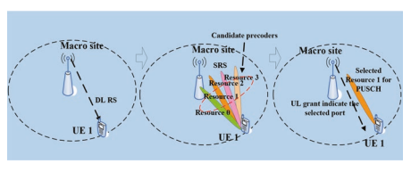

Transmission PMI is determined based on SRS measurement at the gNB and indicated to the UE by DCI via felds including SRI (SRS resource indicator), TRI (transmit rank indicator), and TPMI (transmit PMI).

## 3.4.3.3.2 Non-Codebook-Based Uplink Mimo

In non-codebook-based uplink transmission, the precoder applied at the UE side is determined at the gNB with assistance from UE via uplink SRS transmission and no explicit transmission PMI is needed from the gNB.

As illustrated in Fig.  3.76, a UE can be confgured with a number of SRS 
resources based on its capability. The UE determines precoder for each SRS resource based on downlink CSI-RS measurement. The gNB measures these SRS transmissions to select the proper precoder(s) associated with a subset of the SRS resources and then indicates via SRI (SRS resource indicator) to the UE the selected 

precoder(s) (and transmission rank) for PUSCH transmission. The SRS resource set and the associated CSI-RS resource can be jointly triggered by SRS request feld in DCI.

## 3.4.3.3.3 Uplink Full-Power Transmission

For non-codebook-based UL transmissions, full-power transmission is supported from Release-15. However, for codebook-based UL transmissions, due to power scaling (i.e., ratio of the number of antenna ports with nonzero PUSCH transmission power to the maximum number of SRS ports supported by the UE in one SRS 
resource), only partial power transmission may be supported for non-coherent and partial-coherent TPMIs.

In Release-16, three modes of uplink full-power transmission are specifed. When *ul-FullPowerTransmission* is set to *fullpower*, any TPMIs can be used for UL full-power transmission. The mode is only applicable to PA architecture of UE capability 1 as illustrated in Fig. 3.77 where all PAs are full power rated.

When *ul-FullPowerTransmission* is set to *fullpowerMode1*, the UE can be confgured with one or more SRS resources with same number of SRS ports within an SRS resource set with usage set to "codebook," and gNB can confgure the UE to use a subset of TPMIs that combine ports in a layer to produce full-power transmission for non-coherent or partial-coherent UEs. This mode is applicable to PA architecture of UE capability 1, 2, and 3.

When *ul-FullPowerTransmission* is set to *fullpowerMode2*, the UE can be confgured with one SRS resource or multiple SRS resources with different number of SRS ports within a SRS resource set with usage set to "codebook." UE transmits SRS and PUSCH in the same manner whether antenna virtualization is used or not. 

UE reports which TPMIs can be used for full-power transmission. Uplink fullpower transmission is then achieved according to the indicated SRI and/or TMPI 
indicated by the gNB.

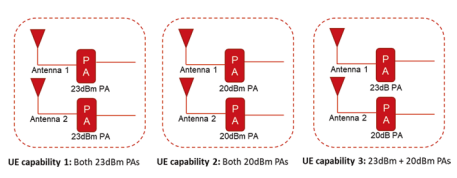

## 3.4.4 5G-Nr Unifed Air Interface Design For Embb And Urllc

The LTE air interface provides fexible support for a large number of services, including MBB, VoIP, and MBMS. In later releases specifc optional enhancements were developed for verticals such as V2X and MTC [NB-IoT (narrow band-Internet of Things)/eMTC (enhanced machine-type communication)]. The MTC enhancements made extensive use of repetition to reach the coverage enhancement targets. 

For LTE, some additional functionalities targeting low latency and high reliability were introduced in Release-15 [65, 66]. Though these URLLC enhancements came later in the life of LTE, they were actually considered in the very early stages of LTE development. It was conceived that users could be scheduled from one to four slots depending on the characteristics such as latency and reliability [67], but in the end to stabilize the system design a sub-frame was fxed at two slots [45]. Chapter 7 details enhancements made in NR to support the URLLC vertical. For other verticals, studies are underway to further expand the supported services for the transport industry, factory automation/IIoT, power/smart grid, and AR/VR [68–71], taking into account requirements for these services (c.f. Table 7.1 taken from 3GPP SA1 TS22.104). A key difference from Release-15 is that supporting more than a single user is considered, which resulted in the standard starting development of enhancements needed to help increase the number of users supported that can meet the latency and reliability requirements.

## 3.4.5 Mmtc

Machine-type communication (MTC) is a broad class of communication where the cellular network connects devices or applications that are machines. As we have seen in the previous section, factory automation/IIoT is in fact a type of MTC, albeit one that may have very stringent requirements of latency and reliability, and so therefore is treated as URLLC. Massive MTC (mMTC) is most often associated with LPWA (low-power wide area) communication, a type of MTC that 3GPP spent many years developing in the form of NB-IoT and eMTC. The hallmarks of LPWA include: - Very low power consumption (>10–15 years with simple batteries)
- Wide area (sometimes in coverage-limited locations)
- Low cost - High connectivity Even for mMTC there is no uniform use case, but applications do include sensors, monitors, and meters, as well as movable or even mobile devices. The designs are optimized for smaller, more infrequent transmissions. As expected, the supported data rates go down as cost, coverage, power consumption, and connectivity improve [72].

## 3.4.5.1 **Nb-Iot**

NB-IoT has been widely deployed or launched over the world based on the industry report [73] since Release-13 NB-IoT standard was fnalized in June 2016. Before NB-IoT going to Release-13 standardization, there were extensive discussions on the cellular based technologies supporting IoT in 3GPP. In May 2014, a Study Item 
(SI) of the cellular system-based M2M technology supporting low-throughput and low-complexity MTC was frst approved in 3GPP GERAN [74]. One reason for doing it in GERAN was that many M2M businesses at that period relied on the use of legacy GPRS, and it was motivated to study new solutions for M2M with much competitiveness in terms of coverage, complexity, cost, power effciency, connectivity, etc. compared to the legacy GPRS. Both backward compatible with GPRS 
and clean slate solution are under the study.

During the study period, a clean slate proposal narrow band M2M (NB-M2M) 
[75] and a backward compatible with GSM proposal extended coverage for GSM 
(EC-GSM) [76] were frst discussed, and later on there was another clean slate solution narrow band OFDMA (NB-OFDM) [77] proposed. In May 2015, the air interface technologies of NB-M2M and NB-OFDM were merged to use OFDMA in downlink and FDMA in uplink, and the name was changed to NarrowBand Cellular IoT (NB-CIoT) [78]. At the last meeting of the SI in August 2015, an additional proposal Narrow Band LTE (NB-LTE) [79] was submitted. In GERAN\#67 meeting, the SI was completed and there was the outcome that NB-CIoT and EC-GSM concluded and showed compliance to all objectives [78], but there is no agreement whether NB-LTE is a clean slate or not in the SI.

According to the decision from 3GPP PCG\#34 [80], the normative work of 
"clean slate" scheme resulting from the study will be undertaken within TSG 
RAN. Then in RAN\#69, the work item on NB-IoT [81] was approved after extensive discussions on the submitted proposals of NB-CIoT and NB-LTE, and it was targeted to be fnalized in June 2016 during Release-13 to fulfll the requirement of time to market.

Considering the deployment fexibility, the system bandwidth of one NB-IoT 
carrier is designed to be 180 kHz, which is helpful to gradually refarm GSM carrier with 200 kHz each. It also enables the system to be easily deployed in some scenarios with at least 180 kHz contiguous spectrum for IoT. In these scenarios, NB-IoT 
is deployed in a stand-alone manner. In addition, the 180 kHz carrier bandwidth of NB-IoT is compatible with one resource block in LTE, and NB-IoT also supports in-band and guard-band deployments in LTE.  One NB-IoT carrier occupies one resource block of LTE carrier for in-band deployment. Multiple NB-IoT carriers can be deployed over different resource blocks of the LTE carrier. In this case, one NB-IoT carrier is the anchor carrier which conveys the basic system information, e.g., synchronization signal and primary broadcast channel. The remaining carriers are non-anchor carriers without these system information transmissions, which are only used for random access, paging, and data transmission with low overhead. For guard-band deployment, NB-IoT is deployed in the unutilized resource block(s) located at the guard band of LTE carrier. The three deployments of NB-IoT are illustrated in Fig. 3.78.

For NB-IoT, the downlink is based on OFDMA with 15 kHz subcarrier spacing which is compatible with LTE numerology. The downlink resource allocation granularity is 180 kHz for data transmission. The uplink supports single-tone and multitone (including 3/6/12 tones) transmission as shown in Fig. 3.79. Two subcarrier spacing values are supported as 15 kHz and 3.75 kHz in case of single-tone transmission. As most IoT services are from the uplink, i.e., the device sends the message to base station like sensor result reporting, the uplink transmission shall be effective to fulfl the massive connectivity requirement. For NB-IoT, the uplink single-tone narrow-band transmission results in high-power spectral density (PSD), which is effective to improve the number of connections especially in the coverage-limited scenario. The advantage of NB-IoT in the aspect of connection density can be seen in the system simulations in Sect. 10.4.4. For multi-tone transmission, only 15 kHz subcarrier spacing is supported and SC-FDMA is applied in this case.

Deep coverage is required for NB-IoT, and there is the requirement of 20 dB 
coverage enhancement compared to GPRS with 144 dB maximum coupling loss (MCL). Normally, uplink is the coverage bottleneck due to the restriction of UE transmission power. For NB-IoT, the narrow-band transmission (e.g., 3.75  kHz) 
with PSD boost is helpful for coverage extension. As LPWA kind of service is typically small packet and not latency sensitive, repetition is an effective method to improve the coverage, and up to 128 repetitions for NB-IoT uplink transmission are supported. In addition, other methods, e.g., new modulation scheme as π/2-BPSK and π/4-QPSK, are supported for single-tone transmission with lower PAPR.

Regarding low cost for NB-IoT, from hardware complexity reduction perspective, the technical components include the 180 kHz system bandwidth reducing the RF and base band cost due to the limited bandwidth, single receiver RF chain, 20 dBm and 14 dBm low transmit power classes, half-duplex operation, etc. In addition, some further steps are performed, e.g., supporting only 1 or 2 HARQ processes to reduce the soft buffer size, low order modulation, etc. [82].

Considering the characteristics of NB-IoT service, e.g., long periodicity of packet arrival, stationary NB-IoT device, long duty cycle of DRX up to almost 3 h, power saving mode (PSM) time up to 400 days, and cell reselection without cell handover, helps to save power and prolong battery life. Some further enhancements on power consumption including wake-up signal (WUS) and early data transmission (EDT) during random access in idle mode are introduced in Release-15.

After the fnalization of NB-IoT in Release-13, the standard continues evolving until now to optimize the mechanism and address some practical requests from the experience of NB-IoT real deployments. In Release-14, the functionalities of multicast and positioning are supported, and category NB2 with higher peak data rate 
(>100 kbps) is introduced [83]. In Release-15, as mentioned above, WUS, EDT, TDD for NB-IoT, etc. are supported [84]. In Release-16, it is proposed that NB-IoT connecting to NG Core and coexistence of NB-IoT with NR are supported [85].

## 3.4.5.2 **Emtc**

eMTC is a feature originated from LTE for machine-type communication, which is introduced in Release-13. Before Release-13, frst there was a study item on lowcost MTC UEs based on LTE in Release-12 [86], which is targeted to study LTEbased MTC solutions with low cost and good coverage. It is called as low-cost MTC. A set of proposals for reducing cost and improving coverage were studied 
[87]. In Release-12, only low-cost part is specifed and 15 dB coverage enhancement was removed at the later stage because of standard progress. A new UE category with low cost (i.e., Cat.0) is introduced in Release-12. The cost is reduced to an extent compared to UE Cat.1 by using peak data rate reduction (the maximum transport block size for unicast is restricted to 1000 bits), single receiver RF chain, and half-duplex [87]. In Release-13, the target is to further reduce the cost and support 15 dB coverage enhancement, and the name is changed to be eMTC which is commonly used in the standard and industry feld now. Another UE category (i.e., Cat. M1) is introduced [88]. The standardization of eMTC is completed in June 2016. Currently, the deployment and launch of eMTC are ongoing over the world [73].

As eMTC is based on LTE, it only supports in-band transmission before Release-16, i.e., eMTC is embedded in the LTE network. It is different from NB-IoT as a clean slate proposal with totally new design for these signals and channels; eMTC reuses the signals and physical channels of LTE for initial access including PSS/SSS/PBCH/PRACH.  Hence, the minimum system bandwidth of eMTC UE cannot be smaller than six resource blocks, which is much larger than 180  kHz NB-IoT. To reduce the cost of eMTC UE, the bandwidth is limited to 1.4 MHz for both downlink and uplink. In addition, reducing of maximum UE transmit power, UE processing relaxing (e.g., number of HARQ process, relaxed TX/RX EVM requirement), etc. are applied.

The scheduling granularity of eMTC for downlink and uplink data transmission is one resource block (i.e., 180 kHz), and up to six resource blocks can be allocated which is suitable for medium data rate IoT service. As mentioned in Sect. 3.4.5.1, narrow-band transmission is more effective especially in the coverage-limited scenario. Due to the wider uplink transmission, the connection density of eMTC is smaller than NB-IoT (see Sect. 10.4.4). To further increase the connection density of eMTC, it is enhanced to support 2/3/6 tones' uplink transmission in Release-15.

There are two coverage enhancement modes defned for eMTC as CE modes A 
and B which correspond to 0–5 dB and 5–15 dB coverage enhancement, respectively. Repetition in time domain is a key method for coverage enhancement, and up to 2048 repetitions are supported for data channel. Repetition is applied for common channel, control channel, and data channel to improve the coverage. The physical downlink control channel of eMTC (i.e., MPDCCH) has a big change compared to the conventional PDCCH in order to address the requirement of coverage. 

MPDCCH spans the whole sub-frame and is multiplexed with PDSCH in the frequency domain. In addition, frequency hopping is supported to achieve frequency diversity gain.

Similar to NB-IoT, eMTC continues evolution to optimize the performance and extend the functionality after Release-13. In Release-14, the functionality of positioning and single cell-point-to-multipoint transmission (SC-PTM)-based multicast is supported. Multicast is an effective method for the software upgrade of eMTC UEs. The coverage enhancement techniques are extended for normal UE and VoLTE. In Release-15, to differentiate NB-IoT and eMTC and avoid the confusion in the market, it is agreed [89] that:
- eMTC-capable-only UE category with a maximum supported channel bandwidth is no less than 6 PRB in UL and DL. - NB-IoT-capable-only UE category with a maximum supported channel bandwidth is no more than 1 PRB in UL and DL.

Under this guidance, resource element-level uplink scheduling (i.e., 2/3/6 tones) 
is supported for connection density improvement. In Release-16, it is proposed to consider the eMTC connecting to NG Core and the coexistence of eMTC with [85].

## 3.4.5.3 **Nr Mmtc**

3GPP LPWA solutions have been rapidly deployed worldwide. Given the signifcant effort spent to develop NB-IoT/eMTC, the effciency of those solutions for LPWA, and the very long lifetime of the deployed devices, there is no hurry to replicate LPWA functionality on NR. The 5G ITU requirements for mMTC are easily met by NB-IoT and eMTC. (Compare results in Sect. 10.4.4 to the requirement in Table 10.3.) The work in Release-15 for NR has instead included mechanism designs to allow good coexistence with LTE, including NB-IoT and eMTC. In particular, NR supports PDSCH RE-mapping patterns which indicate REs declared as not available for PDSCH, which can include RB and symbol-level bitmaps [90]. BWPs may also be defned that avoid resources in use by legacy NB-IoT/eMTC.

In the future there may be mMTC applications that are LPWA-like that are not well served by LTE solutions. One example is high-defnition video surveillance [91]. As seen in the previous sections, the techniques to improve coverage for NB-IoT/eMTC are similar to those described or considered above for URLLC reliability, namely repetition of control and data channels. Devices built for the scenario without any or with a small amount of coverage enhancement may involve just a small number of repetitions as defned in Release-15 NR. Although lowest cost may not be the focus of NR mMTC, NR in Release-15 supported 5 MHz bandwidth devices that could use single PRB transmission and low PAPR modulation. Such "narrowband" devices may take longer to transmit a packet, but these devices can have lower complexity, cost, and operating power than a typical NR device. Narrower band transmissions can also have a higher PSD which can help coverage and connection effciency. Evaluations show that 5 MHz NR mMTC can meet the 5G ITU mMTC requirements for connectivity [92].

There are some studies ongoing in Release-16 that could be used to improve reliability (URLLC SI), have faster transmissions from idle (NR-U SI), save power 
(power savings SI), reduce cost by allowing a 1T2R UE (V2X RAN4 SI), or increase connectivity by overloading resources (NOMA SI), even though there is no concerted effort to create an NR-IoT LPWA device. Table 3.30 summarizes LTE and NR with respect to LPWA characteristics.

| Table 3.30           | LTE and NR properties for LPWA service                                            |                                                                |
|----------------------|-----------------------------------------------------------------------------------|----------------------------------------------------------------|
| mMTC characteristic  | LTE (NB-IoT and eMTC)                                                             | NR                                                             |
| Connection density   | Meets ITU requirement                                                             | Meets ITU requirement (using 5 MHz  BW, not as good as NB-IoT) |
| Battery life         | Highly optimized design,                                                          | Small BWP/UE BW                                                |
| eDRX, PSM, WUS       | Grant free Release-16 SI: WUS, 1T2R                                               |                                                                |
| Wide area (coverage, | Highly optimized design                                                           |                                                                |
| reliability)         | (normal/small and large)  coverage extension)                                     | Repetition (up to 8) 16 CCE                                    |
| Low cost             | Highly optimized design  (including low-end software  DSP NB-IoT  implementation) | Small BWP/ UE BW π/2 BPSK UL Release-16 SI: 1T2R               |

## 3.5 **Nr-Based Unlicensed Access**

Release-16 introduced the support of unlicensed spectrum operation with NR, also called NR-U. Band n46 for NR was defned covering the range of 5150–5925 MHz. Bands covering parts of the 6 GHz spectrum will be defned for regions allowing unlicensed operations, such as in the USA, based on the same design as for the 5 GHz band.

The enhancements introduced for the support of unlicensed operation mainly consist of specifying channel access mechanisms such as Listen-Before-Talk for shared spectrum access, and other modifcations to the physical layer and MAC 
layer that were necessary for complying with regulations and for ensuring fair coexistence with other devices operating in unlicensed spectrum such as Wi-Fi. Contrary to LTE LAA (Licensed Assisted Access), which required carrier aggregation between a licensed band and an unlicensed band, NR-U additionally supports standalone operation where initial access is also performed in the unlicensed band. The NR-U Work Item Description [RP-192926] details the enhancements specifed after the 3GPP study [TR 38.889], and lists the various deployment scenarios supported by Release-16: - Scenario A: Carrier aggregation between licensed band NR (PCell) and NR-U 
(SCell). - NR-U SCell may have both DL and UL, or DL only. - In this scenario, NR PCell is connected to 5G-CN.

- Scenario B: Dual connectivity between licensed band LTE (PCell) and NR-U 
(PSCell) - In this scenario, LTE PCell is connected to EPC as higher priority than PCell connected to 5G-CN.

- Scenario C: Stand-alone NR-U
- In this scenario, NR-U is connected to 5G-CN.

- Scenario D: A stand-alone NR cell in unlicensed band and UL in licensed band 
(single-cell architecture). - In this scenario, NR-U is connected to 5G-CN.

- Scenario E: Dual connectivity between licensed band NR and NR-U.

- In this scenario, PCell is connected to 5G-CN.

The channel access mechanisms specifed are similar to those used for LTE-LAA 
and very much aligned with the requirements specifed for compliance in the European harmonized standard for WAS/RLAN in 5 GHz [EN 301 893]. The basic mechanism relies on LBT with truncated exponential back-off based on energy detection (ED), also referred to as LBT Category 4 (Cat4 LBT) in 3GPP. The channel access mechanisms also allow a device to resume a channel occupancy (CO) or to continue the channel occupancy initiated by another device. Under certain conditions a short LBT or no channel sensing may be allowed, for example when the gap between successive transmissions is 25 μs or 16 μs or smaller. The channel occupancy time (COT) is the time during which a channel is considered occupied using one of the multiple transmissions and gaps based on an initial LBT. The maximum COT duration is specifed as a function of the type of initial LBT and access priority, which depends on the type of traffc intended to be carried by the transmission. The various LBT types supported by NR, in conjunction with greatly reduced UE processing times in NR compared to LTE, allow more effcient self-contained COT 
operation where DL and UL can occur within the same COT, including scheduling assignment, data transmission and reception, and transmission of HARQ acknowledgments.

Two basic types of channel access mechanisms are defned: dynamic and semistatic, which, respectively, correspond to the rules for load-based equipment (LBE) 
and frame-based equipment (FBE) in [EN 301 893]. Semi-static channel access mechanism relies on a fxed frame period where attempts to access the channel by the gNB can only occur at periodic instances. This type of access may be well suited to certain industrial IoT applications in controlled environments where interference from other networks or unlicensed devices is absent. For eMBB services, dynamic channel access mechanism would preferably be used especially in coexistence with Wi-Fi devices.

The LBT types supported for both DL and UL are type 1 (CAT4 LBT) and type 2A (CAT2 LBT with 25 μs gap) where the 25 μs sensing interval starts and ends by a 9 μs sensing slot and both slots have to be sensed idle, type 2B (CAT2 LBT with 16 μs gap) where a sensing slot occurs within the last 9 μs and the channel is idle if it is sensed to be idle for a total of at least 5μs with at least 4μs of sensing occurring in that last sensing slot, and type 2C (CAT1 or no LBT) with a gap of up to 16 μs but for which the transmission duration is limited to 584 μs. The multichannel (or multicarrier) access mechanisms are defned in the same way as for LTE-LAA type A and type B multichannel access mechanisms, with the difference that for the determination of the Contention Window Size (CWS) for LBT Cat4, any PDSCH or PUSCH 
transmission that fully or partially overlaps with the sensed channel is considered.

Type 1 channel access mechanism is used for the DL transmission(s) including PDSCH/PDCCH/EPDCCH, transmission(s) including unicast PDSCH with user plane data, and transmission(s) with only discovery burst or with discovery burst multiplexed with non-unicast information, where the duration is larger than 1 ms or the discovery burst duty cycle exceeds 1/20. Type 1 channel access mechanism is used for the UL PUSCH/SRS transmission(s) scheduled or confgured by eNB/ gNB, PUCCH transmission(s) scheduled or confgured by gNB, and transmission(s) 
related to random access procedure.

Type 2A channel access mechanism is used for the DL transmission(s) with only discovery burst or with discovery burst multiplexed with non-unicast information, where the transmission(s) duration is at most 1 ms, and the discovery burst duty cycle is at most 1/20, and for transmission(s) following transmission(s) by a UE 
after a gap of 25 μs. Type 2A channel access mechanism is used for the UL PUSCH 
transmission(s) as indicated by scheduling UL grant, PUCCH transmission(s) as indicated by scheduling DL grant, transmission(s) related to random access procedure, and UL transmission(s) confgured with type 1 fall in a gNB-initiated COT upon detecting COT duration information in SFI.

Type 2B and 2C channel access mechanisms are used for the DL transmission(s) 
following transmission(s) by a UE after a gap of 16 μs or up to 16 μs, respectively. 

Type 2B and 2C channel access mechanisms are used for the UL transmission(s) 
following transmission(s) by a gNB after a gap of 16 μs or up to 16 μs, respectively, as indicated by scheduling UL or DL grant.

A user plane mechanism is introduced for reporting of consistent LBT failure mechanism and for recovering from such consistent LBT failure for uplink transmissions at the UE. UL LBT failures are detected per BWP per serving cell. The UE 
will report the occurrence of consistent UL LBT failures on PSCell and SCells, and this will trigger BWP switching recovery or radio link failure (RLF).

For a transmission of PUSCH or PUCCH by a UE on the uplink, the type of channel access mechanism is signaled or confgured by the network as a combination of channel access type, cyclic prefx extension (CPE), and channel access priority class (CAPC). CP extension can be used for adjusting the gap between two consecutive transmissions and ensuring that it fts the conditions of the targeted channel access type.

As in licensed bands and unlike LTE-LAA, NR supports channel bandwidths larger than 20 MHz in unlicensed spectrum. The channel access procedure, however, operates on chunks of 20 MHz. Therefore if a NR carrier is Nx20 MHz, the transmitting device should perform energy detection over N continuous LBT bandwidths. The LBT bandwidth or LBT sub-band usually corresponds to 20  MHz bandwidth. LBT may pass on none, one, or more than one LBT bandwidths, and successful LBT bandwidths may not be continuous in frequency. An *RB set* defnes a range of available PRBs and typically corresponds to an LBT bandwidth. Only contiguous RB sets can be allocated. Intra-carrier guard bands are the PRBs which separate the RB sets. The guard band size is confgurable and can be different from inter-carrier guard bands defned for RF emissions in NR carrier aggregation. The use of no intra-carrier guard band is supported by the specifcations and may be supported by specifc implementations. RB sets are used for signaling of resource allocation.

For wideband operation in DL with a single-serving cell operation within a carrier with bandwidth larger than 20 MHz (up to 80 or 100 MHz), multiple BWPs can be confgured, a single BWP can be activated, and the gNB may transmit PDSCH on parts or on the entirety of the single active BWP where CCA (Clear Channel Assessment) is successful at gNB, as illustrated in Fig. 3.80.

For UL transmissions in a serving cell with carrier bandwidth greater than the LBT bandwidth, for the case where a UE performs CCA before UL transmission, the UE transmits on the UL only if CCA is successful in all LBT bandwidths that overlap with the resource allocation for the UL transmission. While confgured intra-carrier guard band PRBs can usually not be scheduled for downlink reception right after a successful CCA, due to processing delays, the gNB may schedule reception on intra-carrier guard band PRBs after adjusting its transmit flter and after informing the UEs using PDCCH. At the UE side, some delay may also be 

required for the UE to adapt its receiver flter for reception on confgured intra-carrier guard PRBs. Such delays can be small, on the order of a slot. Because the network cannot know in advance in which PRBs of a carrier it will be able to send downlink control information in a PDCCH to a UE before CCA, NRU allows the gNB to confgure a UE to monitor PDCCH on multiple LBT bandwidths (RB sets), 
while being confgured with at most three CORESETs per serving cell. The maximum number of monitored PDCCH candidates per slot and per serving cell, and the maximum number of non-overlapped CCEs per slot and per serving cell, are unchanged from Release-15. The wideband modes of operation supported by NR-U in Release-15 are summarized below.

Downlink:
- Mode1: Single wideband carrier operation when LBT is successful in all LBT 
sub-bands
- Mode2: Single wideband carrier operation when LBT is successful in a subset of the LBT sub-bands which are contiguous
- Mode3: Single wideband carrier operation when LBT is successful in a subset of the LBT sub-bands which are noncontiguous Uplink:
- UE transmits the PUSCH only if CCA is successful at UE in all LBT bandwidths of the scheduled PUSCH, where all LBT sub-bands within the scheduled UL transmission are contiguous. Certain modifcations to the transmission of signals and channels used for initial access and for channel measurements were necessary for dealing with the case where a device cannot transmit such signals periodically because the channel is occupied by another device, as detected by a level of energy higher than the energy detection threshold (EDT) during CCA. A discovery burst is introduced where SS/
PBCH blocks can be transmitted at several candidate times within a periodic window. Since the transmission symbol of a SSB is no longer fxed with respect to the frame period, the QCL relations for SSB also had to be redefned, as well as rules for PDSCH mapping in slots with SSB.

For NR-U, the SS/PBCH block supports 15 kHz (SCell and SpCell) or 30 kHz SCS (Pcell and SCell) and the same subcarrier spacing must be used for CORESET0 in the initial BWP. In order to increase the chances for transmitting SS/ PBCH blocks and its associated RMSI PDCCH/PDSCH, SS/PBCH block and CORESET multiplexing pattern allow their transmission in the same slot (i.e., based on common channel sensing). The sync raster is unique in one 20 MHz channel raster assuming 60 kHz SCS, and is placed close to the edge of the 20 MHz channel raster to make more REs available for transmission of RMSI PDSCH assuming resource allocation type 1.

For the uplink during initial access, two new Zadoff-Chu sequence lengths are introduced for wideband PRACH preamble transmission, which occupies a large portion of a 20 MHz channel as compared to Release-15 PRACH. The new PRACH sequences have a length of 1151 with 15 kHz SCS, and a length of 571 with 30 kHz SCS. The sequence mapping is contiguous in frequency, i.e., without interlacing. SIB1 signaling indicates which PRACH preamble length should be used by the UE attempting initial access. Other PRACH sequence parameters are as specifed in Release-15. Occupying a large percentage of the channel bandwidth is a requirement for devices operating in unlicensed spectrum in order to allow other devices to detect their energy correctly. This is referred to as occupied channel bandwidth (OCB) requirements. The Random Access Response (RAR) reception window is extended to be at most 40 ms, which provides more opportunities for RAR transmission since some attempts may fail due to LBT.  The two-step RACH procedure defned in Release-16 for NR can also be used in unlicensed spectrum, while the four-step RACH procedure is also supported for unlicensed spectrum operation. To cope with CCA failures during initial access, the preamble transmission counter is not increased if the preamble is not transmitted due to LBT failure. The power ramping counter is not increased if the preamble is not transmitted due to LBT failure. The actual transmission for message 1 where CCA was successful is used for starting the RAR window.

For the same reason of ensuring a minimum occupied channel bandwidth while meeting requirements on maximum power spectral density, a new mapping of PUSCH and PUCCH was introduced in Release-16, where the new mapping follows a PRB interlace. This ensures that those channels are transmitted almost uniformly across the 20 MHz channel bandwidth without requiring all subcarriers to be occupied, therefore maximizing the power of the signal on the occupied subcarriers. For the PUSCH with 1 kHz SCS there are ten interlaces each using every tenth PRB.  For 30  kHz SCS there are fve interlaces each using every ffth PRB.  For 60 kHz SCS no interlaces needed to be defned for a 20 MHz channel bandwidth. 

The number of PRBs in an interlace is 10 or 11 in a 20 MHz bandwidth (e.g., 106 PRBs with 15 kHz SCS). Non-interlaced transmissions on the uplink can still be confgured for a UE, and in this case the resource allocation needs to ensure that the OCB requirements are met. PUSCH resource allocations can span more than 20 MHz if the UE is confgured with a wideband carrier, i.e., with bandwidth being a multiple of 20 MHz. The PRBs of the PUSCH resource allocation are obtained from the intersection of PRBs of allocated interlaces, PRBs of allocated RB sets, and PRBs in intra-carrier guard bands (between RB sets corresponding to contiguous LBT bandwidths). For 15  kHz SCS, interlaces are allocated by a Resource Indicator Value (RIV). For 30 kHz SCS, interlaces are allocated by a bitmap. Both contiguous and noncontiguous interlaces can be allocated for PUSCH.

For PUCCH with PRB-interlaced resource allocation, the PUCCH resource does not exceed the bandwidth corresponding to a 20 MHz carrier (LBT bandwidth). 

Either one or two full interlaces are used for one PUCCH, depending on the confgured maximum code rate and UCI payload size. The DMRS of the PUCCH is mapped to the PRBs of the allocated interlace(s). Increased UE multiplexing is defned for some PUCCH formats due to the larger overhead of PRB interlacing. For the enhanced PUCCH format 0 and PUCCH format 1, the Release-15 PUCCH sequence is repeated in each PRB of the interlace, with 10 or 11 PRBs per interlace. A PRB-specifc cyclic shift term is added in order to reduce the cubic metric of the repetitive sequence mapping. For the enhanced PUCCH format 2, one or two interlaces can be confgured, and UE multiplexing can be used when one interlace is used. The number of PRBs per interlace is 10 or 11. UE multiplexing is achieved by means of Orthogonal Cover Codes (OCC) in frequency domain with spreading factors 2 and 4. PRB-specifc OCCs are used to reduce the cubic metric of the repeated modulation symbols from the OCC spreading. For the enhanced PUCCH format 3, one or two interlaces can be confgured, and UE multiplexing can be used when one interlace is used. The number of PRBs per interlace is 10 or 20. Pre-DFT precoder OCCs with spreading factor 2 and 4 are used for UE multiplexing with one interlace. The OCCs are DFT sequences and result in FDM of UEs (e.g., comb-2 or comb-4 within the interlace).

While transmissions on the downlink channels and signals did not require any major change compared to the design for licensed operation from Release-15, enhancements were introduced to better cope with missed transmissions due to LBT. In particular, signaling of the COT in DCI format 2_0 helps a UE to determine which signals are expected to be present on the DL, e.g., the CSI-RS that is used for downlink channel measurements. Knowledge of the COT duration was also used to defne a mechanism for allowing the UE to change the periodicity it uses for monitoring DL control (PDCCH), with more frequent monitoring within a gNB-initiated COT and less frequent monitoring outside a COT, in order to realize UE power savings. This is achieved by Search Space Set group switching, where the UE switches between two confgurations (two sets of search spaces), where the two confgurations are associated with different PDCCH monitoring periodicities. Switching between the Search Space Sets can be explicitly signaled by the gNB in DCI format 2_0, or implicitly derived by the UE based on the expiry of a timer or the detection of a DCI (other than DCI format 2_0).

The number of available OFDM symbols for SRS is increased compared to Release-15, and the SRS OFDM symbol start position is confgurable between 0, 1, ..., 13. For transmissions on the uplink, it was also useful to introduce the possibility of scheduling multiple consecutive PUSCH transmissions with a single PDCCH carrying a single UL DCI. This avoids having to transmit multiple PDCCHs, which in turn avoids having to perform LBT multiple times. A similar feature was specifed for LTE-LAA in Release-14. For PUSCH confgured grants, a similar mechanism allows for confguring multiple consecutive PUSCHs within each slot without gaps. To increase opportunities for uplink transmissions in unlicensed spectrum, the specifcations also introduced the possibility to carry UCI on a CG-PUSCH. To avoid gaps between allocated slots of an active confguration, multiple active confgurations can be used.

Acknowledgment of uplink receptions by the network was introduced in Release-16 for unlicensed NR (as for LTE-LAA), where the network transmits CG-DFI (downlink feedback information) to a UE in a DCI format 0_1 with CRC scrambled by CS-RNTI. This DFI is only present if the UE is confgured with CG type 1 and activated CG type 2. A DFI fag is set to 1 to indicate the presence of DFI 
contents in the DCI format. A 16-bit bitmap allows reporting all UL HARQ processes including confgured grants and dynamic grants. A TPC command is also included in DFI, as well as a carrier indicator feld (CIF). Valid HARQ information is only provided for PUSCH transmissions that were received by the network in previous slots with a minimum delay for the network to be able to process the PUSCH. Only TB-based HARQ is reported in DFI.

Uplink control information (UCI) can also be transmitted on a CG PUSCH. The UCI payload is mapped to the frst non-DM-RS symbols with the highest priority (before HARQ-ACK bits if any). The UCI can contain COT sharing information to allow downlink transmissions following CG PUSCH transmissions in the same COT, where the network only needs to perform type 2 LBT before the DL transmission. For doing so, the UE informs the network using UCI about the start time for potential DL transmission, and the remaining time in the CO acquired by the UE. If the UE is not provided with an energy detection threshold by the network for its uplink transmission, then the downlink transmission shall not include any unicast transmissions with user plane data and its duration shall be less than 2, 4, or 8 symbols for 15, 30, and 60 kHz subcarrier spacing, respectively. If the network provides an energy detection threshold to the UE, then the UE provides a combination of 
{offset, duration, CAPC} in UCI for the gNB assumption of a channel access priority class (CAPC) and a starting slot offset from the end of the slot where CG-UCI is detected, for the gNB downlink transmission where user plane data is allowed on a number of slots not exceeding the indicated duration.

Operation in shared spectrum also means that acknowledgments of the successful or unsuccessful reception of a downlink transport block may not be received as scheduled by the gNB if a UE fails to access the channel on the resource scheduled for HARQ feedback due to LBT failure. Enhancements to HARQ feedback were introduced to allow the network to request a UE to report again the HARQ-ACK 
feedback that was not received as scheduled, either due to LBT failure at the UE or due to detection failure at the gNB. Another enhancement was introduced to allow delaying the scheduling of the HARQ feedback. In a typical case where the network schedules multiple downlink PDSCH receptions for one or more users, the network may try its best to also schedule PUCCH resources in the same COT for HARQ feedback (e.g., in the last slot of the COT) so that UEs can report the HARQ with minimal delay by sharing the COT acquired by the gNB.  This minimizes the likelihood of LBT failure for uplink transmission since only a short LBT may be required if the network ensures only a small gap between downlink and uplink allocations. A PDSCH scheduled near the end of the COT, however, does not leave enough time for the UE to process the HARQ information before the end of the COT. For such PDSCH, the UE is not provided with a time for reporting the HARQ 
information. Instead the UE can be provided with an index (a PDSCH group number) that can later be used by the network for requesting HARQ feedback for all the PDSCHs with the same group index, including PDSCHs for which the UE is reporting HARQ feedback for the frst time or for which the UE may be requested to report the HARQ feedback again. The possibility for the network to request HARQ 
feedback for all the HARQ processes confgured for a UE across all carriers confgured for the UE was also introduced for NR operation in unlicensed spectrum, where the UE provides in a single transmission all HARQ bits for all HARQ process identities via the construction of a type 3 HARQ-ACK codebook. This may be useful if there is a large backlog of HARQ acknowledgments missing for a UE at the network side.

## 3.6 **Positioning In Nr**

Release-16 introduced the support for NR positioning based on the NR air interface, in addition to the basic support for positioning already specifed in Release-15. In Release-15, RAT-independent and E-UTRA RAT-dependent positioning schemes are supported by transport of LPP messages between 5G-CN and UE through gNB, and by transport of LPPa-type messages between 5G-CN and NG-RAN hosting E-UTRA (eNB), as well as support of measurement gaps and idle periods for location-related inter-RAT measurements. The only NR-based positioning technique supported in Release-15 is via network-based NR CID and cell portion positioning, including the defnition of messages and transport between 5G-CN and NG-RAN hosting NR (gNB). Therefore, many of the conventional positioning schemes are not supported via the NR air interface in Release-15. Positioning relies on measurements of signals transmitted or received by one or multiple transmission and reception points (TRPs), where a TRP consists of a number of collocated antennas. Those measurements are then used to calculate quantities such as time difference of arrival (TDOA), round-trip time (RTT), angle of arrival (AoA), or angle of departure (AoD), which are fed into algorithms that compute an absolute position for a device based on the knowledge of the location of the TRPs at a location server. Techniques are specifed in 3GPP to ensure the privacy of the location data in the network.

In Release-16, enhancements were brought to the air interface in order to support the conventional positioning techniques (E-CID, DL-TDOA, UL-TDOA), as well as new and more advanced NR-specifc positioning techniques (DL-AoD, UL-AoA, multi-cell RTT). Angle-based positioning (DL-AoD, UL-AoA) and multi-RTT are robust techniques for network synchronization timing errors and are not supported by LTE positioning. These techniques were frst studied and documented in a technical report [93].

The support for positioning was introduced in NR not only for regulatory purposes but also to target vertical applications such as positioning in industrial environments. 3GPP defned improved channel models for evaluating positioning techniques in factories. Service-level requirements for positioning were defned in 
[TS 22.261]. Although not all of these targets are met with Release-16, certain targets were set for Release-16:
The performance requirements for horizontal and vertical positioning service levels are summarized in Table 3.31. For regulatory use cases, the following requirements were considered as a minimum performance target for NR positioning:
- Horizontal positioning error ≤50 m for 80% of UEs
- Vertical positioning error <5 m for 80% of UEs - End-to-end latency and TTFF <30 s As a starting point for commercial use cases, the following requirements were considered as performance targets for RAT-dependent solutions: - Horizontal positioning error <3 m for 80% of UEs in indoor deployment scenarios - Vertical positioning error <3 m for 80% of UEs in indoor deployment scenarios - Horizontal positioning error <10  m for 80% of UEs in outdoor deployment scenarios
- Vertical positioning error <3 m for 80% of UEs in outdoor deployment scenarios - End-to-end latency <1 s Positioning support in NR is not fundamentally different than in 4G. The network enables the positioning feature based on a request from a positioning server, and then a UE takes various measurements and reports the measurements to its serving base station, which forwards those measurements to the positioning server. It is the positioning server that computes the location of the UE and sends the location to the application layer.

A mapping of the various positioning methods and measurements is provided in Table 3.32. A number of basic measurements were defned for the support of the various positioning techniques, certain measurements being relevant for one or multiple techniques. Downlink positioning reference signals (DL PRS), which need to be dense enough in time and frequency although not necessarily transmitted all the time by the network, can be used for measurements of DL RSTD (sub-frame timing difference between two TRPs), PRS-RSRP, UE Rx - Tx time difference (sub-frame timing difference between Rx timing and Tx timing, where Rx time is based on DL-PRS and Tx time is based on SRS for positioning), and gNB Rx - Tx time difference (sub-frame timing difference between Rx timing and Tx timing, where Rx time is based on SRS for positioning, and Tx time is based on DL PRS), which can then be used with DL-TDOA, DL-AoD, and multi-RTT positioning techniques. Positioning SRS can be used for measurements of UE Rx - Tx time difference, gNB 
Rx - Tx time difference, UL RTOA (receive time of arrival with respect to a reference time), UL SRS-RSRP, and UL AoA, which can then be used with UL TDOA, 

| Table 3.31                    | Performance requirements for 5G Release-16 positioning service [94] Positioning  service  latency   |          |              |       |       |
|-------------------------------|-----------------------------------------------------------------------------------------------------|----------|--------------|-------|-------|
| 1                             | A                                                                                                   | 10 m     | 3 m          | 95%   | 1 s   |
| 2                             | A                                                                                                   | 3 m      | 3 m          | 99%   | 1 s   |
| 3                             | A                                                                                                   | 1 m      | 2 m          | 99%   | 1 s   |
| 4                             | A                                                                                                   | 1 m      | 2 m          | 99.9% | 15 ms |
| 5                             | A                                                                                                   | 0.3 m    | 2 m          | 99%   | 1 s   |
| 6                             | A                                                                                                   | 0.3 m    | 2 m          | 99.9% | 10 ms |
| 7                             | R                                                                                                   | 0.2 m    | 0.2 m        | 99%   | 1 s   |
| Absolute (A) or  relative (R) | Horizontal                                                                                          | Vertical |              |       |       |
| positioning                   | accuracy                                                                                            | accuracy | Availability |       |       |
| Positioning  service level    |                                                                                                     |          |              |       |       |

| Table 3.32       | Measurements required for various positioning methods   |                   |          |             |
|------------------|---------------------------------------------------------|-------------------|----------|-------------|
| Positioning      | Measurement                                             | Measurement       | Location |             |
| method           | signal                                                  | Measurement type  | entity   | calculation |
| DL-AoD           | DL PRS                                                  | DL PRS-RSRP       | UE       | LMF, UE     |
| DL-TDOA          | DL PRS                                                  | DL RSTD, PRS-RSPP | UE       | LMF, UE     |
| UL-TDOA          | SRS                                                     | UL RTOA           | TRP      | LMF         |
| UL-AoA           | SRS                                                     | UL AoA            | TRP      | LMF         |
| Multi-RTT        | PRS,  positioning  SRS                                  | UE-RxTxTimeDiff,  | UE, TRP  | LMF         |
| gNB-RxTxTimeDiff |                                                         |                   |          |             |

UL-AoA, multi-RTT, and E-CID positioning techniques. Release-15 SRS can also be used for some of these measurements but will not allow reaching suffcient accuracy for measuring UE Rx - Tx time difference and gNB Rx - Tx time difference compared to the newly introduced positioning SRS in Release-16. Additional measurements of RSRP and RSRQ based on SSB or CSI-RS can also be exploited for positioning by E-CID.

A DL PRS resource corresponds to a beam and defnes a single PRS antenna port. The following parameters are confgurable for a DL PRS resource: frst symbol in a slot, number of symbols, comb offset for the frst symbol, slot offset with respect to the frst slot of a DL PRS resource set, and QCL source. These confgurations defne various time-frequency staggering patterns that offer various trade-offs between PRS density and overhead. The comb value (2, 4, 6, or 12 subcarriers) defnes the spacing between two PRS symbols in the frequency domain. A DL PRS resource set is a collection of beams from a single TRP. A single PRS resource can be confgured to repeat itself within its periodicity with or without gaps between the symbols used for the repetitions. DL PRS muting is defned by two types of muting confgurations; type 1 defnes muting on the level of the PRS occasion group (similar to LTE), while type 2 defnes muting on the level of repetition. Neither, either, or both of the two types of muting can be confgured. If a UE is not confgured with a measurement gap, the PRS is only received in semi-statically confgured downlink or fexible symbols for the serving cell. The sequence used for scrambling PRS symbols is based on gold sequence and compatible with CSI-RS sequences. The network provides the UE with a receive timing reference for the measurements of PRS, which is associated with a reference TRP. A QCL confguration is also provided for the SSB of the same cell, or for another DL PRS.

SRS for positioning resource is confgured by RRC per BWP. The sequence design is similar to ZC-based Release-15 SRS except the use of 16-bit sequence ID. Inter-slot or intra-slot frequency hopping is not supported. SRS for positioning can be periodic, semi-persistent, or aperiodic. The transmission comb of values 2, 4, and 8 is supported with, respectively, maximum cyclic shifts of 8, 12, and 8. Only a single-port resource is supported, with up to 16 resources per set and up to a total of 64 resources per BWP. There are 1, 2, 4, 8, and 12 symbols per resource, with starting symbol anywhere in the slot as long as the SRS resource is contained within one slot. Multiple staggered resource mapping combinations are specifed, offering various trade-offs between overhead, density, and latency. SRS open-loop power control toward a neighboring TRP is specifed, with a path loss reference associated with the SSB from a non-serving cell or with the PRS from a neighboring TRP. Similarly, the transmit beam used for SRS toward a neighboring TRP can be set according to assistance information provided for the SSB from a non-serving cell or for the PRS from a neighboring TRP.

The Location Management Function (LMF) calculates the fnal location estimate information based on the positioning measurements collected by UE and NG-RAN, and also manages the coordination and scheduling of positioning resource. The 5G Core Access and Mobility Management Function (AMF) manages positioning for a target UE for all types of location request. The NRPPa protocol provides the following functions. The E-CID Location Information Transfer function allows the NG-RAN node to exchange location information with LMF for the purpose of E-CID positioning. The OTDOA Information Transfer function allows the NG-RAN 
node to exchange information with the LMF for the purpose of OTDOA positioning. The Reporting of General Error Situations function allows reporting of general error situations, for which function-specifc error messages have not been defned. The Positioning Information Transfer function allows the NG-RAN node to exchange positioning information with the LMF for the purpose of positioning. The Measurement Information Transfer function allows the LMF to exchange measurement information with the NG-RAN node for the purpose of positioning. The TRP 
Information Transfer function allows an LMF to obtain TRP-related information from an NG-RAN node.

## 3.7 **Power Saving**

Release-16 introduced mechanisms to reduce the UE power consumption for NR, in addition to the BWP adaptation and DRX mechanism in Release-15. Both connected mode power saving and IDLE mode power saving mechanisms were specifed. The PDCCH-based indication of WUS and dormancy adaptation, the cross-slot scheduling-based power saving, and per-BWP confgured maximum MIMO layer adaptation were introduced for connected mode UEs. RRM relaxation was introduced to relax RRM measurement for IDLE mode UEs for power saving.

## 3.7.1 Pdcch-Based Indication Of Wake-Up Signal And Dormancy Adaptation

For connected-mode UEs, it was observed that a large portion of UE power is consumed by the blind detection of PDCCH monitoring in a slot where there is no DCI 
transmitted through the monitored PDCCH for the UE (PDCCH-only slots). 

Release-16 power saving introduced mechanisms to indicate UE to skip the monitoring of PDCCH in the PDCCH-only slots, and therefore can reduce the UE power consumption.

Wake-up indication bit was introduced to dynamically indicate UE to skip the monitoring of PDCCH for an associated C-DRX cycle; see Fig. 3.81. The wake-up indication bit can be confgured to be carried by a DCI format which is monitored before the start of ON duration of a C-DRX cycle if confgured. The ON duration timer of a DRX cycle shall not be triggered if the value "0" of the wake-up indication bit is received. In this case, the UE shall not monitor DCIs during the DRX 
cycle according to the MAC specifcation. If the value "1" of the wake-up indication bit is received, the ON duration timer shall start as that in Release-15 C-DRX.

The network can utilize the wake-up indication to indicate UE to skip a whole DRX cycle when there is no data that needs to be scheduled for the UE. Comparing the UE behavior of Release-15 C-DRX mechanism and Release-16 wake-up indication mechanism, it can be observed that some of the PDCCH monitoring can be skipped if there is no data that needs to be scheduled for a DRX cycle. This can bring attractive power saving gain for bursty traffc and the power saving gain increases when the C-DRX cycle length decreases.

In order to carry the wake-up indication bit, a new DCI format, DCI format 2_6, Fig. 3.82, was introduced as a group common DCI, which is a block-wise-based DCI for one or more UEs. Each block in a DCI format 2_6 is confgured for a specifc UE by using higher layer parameter, *SizeDCI_2-6, ps-PositionDCI2-6 and* Scell-groups-for-dormancy-outside-active-time. For a given UE, the following felds are defned in the block confgured for the UE: - 1 bit wake-up indication bit is on the bit location determined by higher layer parameter *ps-PositionDCI2-6*.

- 0, 1, 2, 3, 4, or 5-bit SCell dormancy indication bits follow after the wake-up indication bit.

The DCI format 2_6 is monitored before the ON duration of a DRX cycle according to the confguration. As illustrated in Fig.  3.83, a monitoring window is 

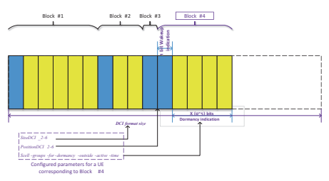

determined according to the higher layer parameter *PS_offset* and "the minimum time gap" reported by the UE. The UE shall monitor DCI format 2_6 on the confgured search space sets in the frst full duration inside the monitoring window.

When there is no DCI format 2_6 detected before the ON duration, the UE can be confgured to wake-up or not wake-up according to the higher layer parameter PS_wakeup. If there is no available PDCCH monitoring occasion for DCI format 2_6 inside the monitoring window, the UE shall wake up by default as that in Release-15 NR.

Besides the wake-up indication, dormancy indication bits can be optionally confgured for a UE in the DCI format 2_6. The dormancy indication bits are used to 

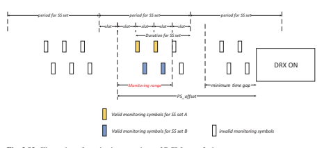

indicate a set of confgured SCell switch between dormant BWP and nondormant BWPs simultaneously. On a dormant BWP of a SCell, the UE is not required to monitor PDCCH for the SCell or on the SCell, and the CSI measurement/reporting shall not be impacted on a dormant BWP. The UE can save power if a number of SCells switch to the dormant BWPs. As an example, if the data amount to be scheduled on a DRX cycle is large, the network can indicate the UE to wake up and also set the active BWPs of SCells as the nondormant BWPs. However, if there is few data to be scheduled, network can just indicate UE to wake up on the C-DRX cycle but set the active BWP of SCells as the corresponding dormant BWPs on the SCells, respectively. By doing this, the UE power consumption can be further adapted in frequency domain according to the network indication.

## 3.7.2 Cross-Slot Scheduling-Based Power Saving

In Release-15 NR, the time domain resource allocation (TDRA) table for the scheduling can be confgured with same-slot scheduling; that is, the corresponding K0 is 0 in the TDRA entry. The information carried by scheduling DCI is unknown before the decoding of the PDCCH candidates and parsing of the decoded DCI. Therefore, if there exists TDRA entries with same-slot scheduling, the UE needs to always buffer a number of DL OFDM symbols in the active BWP after the last symbol of the CORESET; see Fig. 3.84. The buffering of OFDM symbols causes wasting of UE power in case the UE is not actually scheduled with a PDSCH in the same slot.

Therefore, if it is known in advance by a UE that all the valid schedulable DL 
TDRA entries have the K0 value larger than 0, the UE is able to just receive the OFDM symbols corresponding to PDCCH monitoring occasions and CORESET. In this case, there is no need to buffer the additional DL OFDM symbols with the potential wide bandwidth in the active BWP. Furthermore if the UL schedulable DTRA entries have only the cross-slot scheduling, the UE can further relax the processing timeline for PDCCH to save power.

Considering the above motivation for power saving, scheduling restrictions were introduced in Release-16 for downlink scheduling and uplink scheduling when applied. The downlink scheduling offset restriction, K0min, was defned as a threshold for downlink scheduling. When a K0min is applied, the UE shall not expect a downlink scheduling with a K0 value which is smaller than the applied K0min. Similarly, the uplink scheduling offset restriction, K2min, was also a threshold for uplink scheduling if applied. The UE does not expect to receive an uplink scheduling with a K2 value smaller than the applied K2min. The applied K0min and K2min can be set to zero, which means that there is no scheduling offset restriction. The applied K0min and K2min can be dynamically indicated by either DCI format 1_0 or DCI format 1_1. This enables the dynamic adaptation between same-slot scheduling and cross-slot scheduling, which allows the network to use same-slot scheduling for data scheduling and use the scheduling offset restriction to save UE power when there is no data to be scheduled. One or two candidate values can be confgured through the higher layer parameter minimumSchedulingOffsetK0 or *minimumSchedulingOffsetK2* for a downlink BWP or an uplink BWP, respectively. If *minimumSchedulingOffsetK0* is confgured for the active DL BWP, 1-bit indication "Minimum applicable scheduling offset indicator" feld is carried by the DCI format 1_1. Similarly, if *minimumSchedulingOffsetK2* is confgured for the active UL BWP, 1-bit indication "Minimum applicable scheduling offset indicator" feld is carried by the DCI format 0_1. The UE 
applies the minimum scheduling offset restriction K0min indicated by the "Minimum applicable scheduling offset indicator" feld in DCI format 1_1 or DCI format 0_1 if the same feld is available. And the UE applies the minimum scheduling offset restriction K2min indicated by the "Minimum applicable scheduling offset indicator" 

| Table 3.33                 | Joint indication of minimum applicable scheduling offset K0/K2 Minimum applicable K2 for the active  UL BWP, if  minimumSchedulingOffsetK2 is  confgured for the UL BWP                |                                                                                                                                |
|----------------------------|----------------------------------------------------------------------------------------------------------------------------------------------------------------------------------------|--------------------------------------------------------------------------------------------------------------------------------|
| 0                          | The frst value confgured by  minimumSchedulingOffsetK0 for the  active DL BWP Minimum applicable K0 for the  active DL BWP, if  minimumSchedulingOffsetK0 is  confgured for the DL BWP |                                                                                                                                |
| Bit feld  mapped to  index | The frst value confgured by  minimumSchedulingOffsetK2 for the  active UL BWP                                                                                                          |                                                                                                                                |
| 1                          | The second value confgured by  minimumSchedulingOffsetK0 for the  active DL BWP if the second value  is confgured; 0 otherwise                                                         | The second value confgured by  minimumSchedulingOffsetK2 for the  active UL BWP if the second value is  confgured; 0 otherwise |

feld in DCI format 0_1 or DCI format 1_1 if the same feld is available. The mapping between the indication value and the applied minimum scheduling offsets is defned in Table 3.33.

## 3.7.3 Bwp-Based Mimo Adaptation

In Release-15, the maximum number of MIMO layers is confgured per cell on a given UE. Even if the UE switches to an active BWP with smaller bandwidth for power saving, the maximum number of MIMO layers is not changed and the UE still needs to use the same number of RF chains for reception. Release-16 NR power saving introduced per BWP confgured maximum number of MIMO layers. This allows the network to confgure a smaller number of maximum MIMO layers for a BWP of the UE to save power. The UE can be indicated to switch to the BWP for power saving and the UE may just use a smaller number of RF chains which equals to the confgured smaller number of maximum MIMO layers for the BWP. The UE power can be reduced a lot considering that some of the RF chains can be switched off in this case.

When there is data arrival of the UE, the network can use BWP switching mechanism to switch the UE to a BWP confgured with a larger number of maximum MIMO layers. By doing this, Release-16 supports the dynamic adaptation of a UE between a low-power-consumption BWP with a smaller number of RF chains and a BWP with high performance to use a larger number of RF chains.

## 3.7.4 Rrm Relaxation

UE needs to do the neighbor cell measurements when the UE camps on a serving cell in IDLE/in-active mode, which consumes UE power a lot. Release-16 power saving introduced RRM relaxation of neighbor cell measurement for low-mobility UEs and the UEs at cell center. When a UE fulflls specifc criteria, the measurement cycle can be increased to save power. Network can confgure RRM measurement relaxation via broadcast and the following triggering criteria can be confgured independently (i.e., either UE location or low mobility or both):

- Based on UE location in the cell (e.g., cell center or cell edge): Serving cell RSRP and/or RSRQ (confgurable by network) is above a threshold.

- Based on low mobility: Serving cell RSRP measurement does not change more than a relative threshold during a time period.

## 3.7.5 Rrc Release Request And Ue Assistance

Release-16 introduced UE assistance information to allow UE to recommend preferred confgurations for UE power saving. "Power saving preference" and "RRC 
Release Request" can be included in UE assistance information. The power saving preference includes the following information related with UE power consumption: - Preferred C-DRX confguration - Long DRX cycle, short DRX cycle, DRX inactivity timer, short DRX cycle timer 
(any value within the current value range)
- No DRX on duration and DRX start offset - Preferred max number of confgured SCells - Preferred max aggregated bandwidth - Preferred max number of MIMO layers - K0/K2 value RRC Release Request can be reported in UE assistance information to release the RRC connection with the following information:

- UE prefers to be released without state preference (i.e., IE *outOfConnected*) - UE prefers to be released with explicit state preference (i.e., IE *idle* or IE *inactive*) - UE prefers to revert an earlier indication to leave RRC_CONNECTED (i.e., IE 
connected), confgurable by NW
The triggering condition to report Release Request in the UE assistance information is up to UE implementation, i.e., UE expects not to send or receive more data in near future. It is up to the network whether and which state the UE should transition to by using legacy release mechanism.

## 3.8 **Summary**

The basic air interface design of 5G-NR described in this chapter gives a framework understanding of the NR physical layer. For NR, it needs to fulfll the diverse requirements defned in Sect. 1.3. In addition, the deployment spectrum has much wider frequency range than LTE (restricted below 6 GHz), and therefore some new designs for NR are needed. The design of NR in the aspects of numerology, frame structure, physical channels, reference signals, waveform, channel coding, and MIMO is elaborated. Furthermore, because C-band will become a typical spectrum for the frst round of NR deployment all over the world, it is identifed that coverage is a key issue to be solved for NR. To address this issue, the DL/UL decoupling scheme (i.e., LTE/NR spectrum sharing) is briefy introduced.

For LTE, the initial design was that the transmission scheme is based on CRS 
being always on in every sub-frame, which can simplify the system operation. During the evolution of LTE, due to the requirement of backward compatibility, the always-on CRS limits the fexibility of system design and the compatibility with new features. When LTE was evolved to TM9 based on DM-RS, the coexistence of CRS and CSI-RS/DM-RS impacts the system performance due to the overhead. Taking the lesson from LTE, for NR, *forward compatibility* is required which is a big change compared to LTE. To achieve the forward compatibility, always-on CRS is eliminated. However, the functionalities of CRS still have to be implemented, and these functionalities are achieved by a set of NR reference signals such as CSI-RS, DM-RS, and PT-RS.

From the deployment spectrum perspective, NR spans a much wider frequency range which includes FR1 and FR2 corresponding to 450–6000  MHz and 24,500–52,600 MHz, respectively, and *wider carrier bandwidth* is supported. Because of the available wider spectrum, e.g., C-band and mm-wave bands, the maximum carrier bandwidth is extended to 100 MHz for FR1 and 400 MHz for FR2, respectively, which is very helpful to achieve the peak data rate of 5G. In addition, multiple numerologies in terms of subcarrier spacing and cyclic prefx are supported to adapt to different frequency bands and service requirements. A set of NR frequency bands are defned and the corresponding subcarrier spacing(s) is given for each band.

Although the available spectrum bandwidth is rich for the  higher frequency band, there is the high propagation loss which limits the coverage especially for UL due to the limited user power. The new spectrum released for 5G deployments is primarily above 3 GHz, and therefore the coverage of NR is a serious problem to be solved; otherwise, the cost will be increasing with more base stations to guarantee the experience which is not desirable for operators. In addition, because it is more and more diffcult to fnd the base station sites, it is motivated to enable NR with C-band and LTE colocated, i.e., they have the same coverage. The UL/DL decoupling based on *LTE/NR spectrum sharing* can enable to achieve the target, which is to accommodate the UL resources in an LTE FDD frequency band as a supplemental UL carrier in addition to the NR operation in the TDD band above 3 GHz.

For duplexing, FDD and TDD are two conventional dominant duplex modes applied for paired spectrum and unpaired spectrum, respectively, which cannot fexibly adapt to the traffc load variation. Due to the more and more serious imbalance between DL and UL traffc load, the symmetric DL/UL bandwidths in FDD result in the ineffective utilization of the UL spectrum. Although TDD can be confgured with different DL/UL sub-frame, due to the requirement of synchronization, the confguration is semi-static and relatively slow. To address this issue, *fexible duplex* in addition to FDD and TDD is introduced in NR which enables the spectrum utilization to adapt to the traffc load. Due to the fexible duplexing, there is a very fexible frame structure for NR and each symbol in one slot can be fexibly confgured as downlink or uplink transmission in principle.

Regarding the NR new physical layer technologies, the CP-OFDM waveform was selected to be the basic waveform for both the downlink and the uplink. DFTS-OFDM is also supported in uplink for the sake of coverage which is only applicable for rank-1 transmission. Given the CP-OFDM-based waveform, the spectrum utilization is improved to be larger or equal to 90% which depends on the frequency band and the carrier bandwidth. The channel coding for NR is totally different from LTE; that is, LDPC and polar code were selected as the coding scheme for data channel and control channel, respectively. The selection of LDPC for both DL and UL data channel is due to the advantage in the decoding latency, complexity, and performance especially for high data rate. The polar code shows the performance advantage when it is used for control channel. Massive MIMO is an important technical component of NR to increase the spectrum effciency by effectively utilizing MU-MIMO. The DM-RS, interference measurement, and codebook are newly designed to show the performance advantage. In addition, beam management is supported for high-frequency scenario. Finally, NR is designed to have a unifed air interface to accommodate eMBB, URLLC, and mMTC, which enables one carrier to support the multiplexing of different kinds of service with diverse requirements. For mMTC, LPWA is still based on NB-IoT/eMTC and it is not touched in NR Release-15 and -16. As the industry of NB-IoT is becoming mature and there is already a large scale of NB-IoT/eMTC commercial deployment over the world, the industry trend is to protect the existing investments by continuously evolving NB-IoT/eMTC for LPWA and it is not urgent to do a new LPWA in NR. For NR, it can address some new MTC services which are complementary with LPWA, e.g., video surveillance and industrial sensors.

The MIMO support was enhanced in Release-16. Frequency domain compression for the type II codebook is used to further reduce the overhead of providing high-resolution CSI. Three modes of uplink full-power transmission for codebookbased UL transmission were specifed: (a) *fullpower* where any TPMIs can be used for UL full-power transmission; (b) *fullpowerMode1* where the gNB can confgure the UE to use a subset of TPMIs that combine ports in a layer to produce full-power transmission; and (c) *fullpowerMode2* where the UE reports which TPMIs can be used for full-power transmissions as indicated by the gNB.

NR-based unlicensed access, positioning, and power saving were added in Release-16 to augment the capability of 5G. NR unlicensed access increases the spectrum that can be utilized by NR with the unlicensed bands by mainly specifying channel access mechanisms, such as Listen-Before-Talk for shared spectrum access and other modifcations to the physical layer and MAC layer, that are necessary for both complying with regulations and fairness with other devices operating in unlicensed spectrum. Positioning enhancements now allow for the support of conventional positioning techniques (E-CID, DL-TDOA, UL-TDOA), as well as new and more advanced NR-specifc positioning techniques (DL-AoD, UL-AoA, multi-cell RTT). Angle-based positioning (DL-AoD, UL-AoA) and multi-RTT are robust techniques for network synchronization timing errors and are not supported by LTE positioning. Both connected-mode power saving and IDLE-mode power saving mechanisms were specifed to enhance the BWP adaptation and DRX power saving mechanism in Release-15.

It should now be clear that there are signifcant physical layer changes in 5G such that it can satisfy the various requirements that we discussed in Chap. 1. Due to the newly introduced physical layer technologies discussed in this chapter, the physical layer procedures and RAN protocol have some changes which will be described in some detail next.

## References

1. 3GPP, "TS 38.104, Base Station (BS) radio transmission and reception (Release 15)," 
December 2018. [Online]. Available: https://portal.3gpp.org/desktopmodules/Specifcations/ SpecifcationDetails.aspx?specifcationId=3202.

2. IMT-2020 (5G) PG, "5G vision and requirement white paper," May, 2014. [Online]. Available: 
at http://www.imt-2020.cn/zh/documents/download/1.

3. 3GPP, "TR 38.901: Study on channel model for frequencies from 0.5 to 100 GHz (Release 15)," June, 2018. [Online]. Available: https://portal.3gpp.org/desktopmodules/Specifcations/ SpecifcationDetails.aspx?specifcationId=3173.

4. 3GPP, "TS 38.331: NR, Radio Resource Control (RRC) protocol specifcation (Release 15)," 
September, 2018. [Online]. Available: https://portal.3gpp.org/desktopmodules/Specifcations/ SpecifcationDetails.aspx?specifcationId=3197.

5. 3GPP, "TS 38.213: NR, Physical Layer Procedures for Control (Release 15)," September, 2018. [Online]. Available: https://portal.3gpp.org/desktopmodules/Specifcations/ SpecifcationDetails.aspx?specifcationId=3215.

6. 3GPP, "TS 38.212: NR, Multiplexing and Channel Coding (Release 15)," September, 2018. [Online]. Available: https://portal.3gpp.org/desktopmodules/Specifcations/ SpecifcationDetails.aspx?specifcationId=3214.

7. 3GPP, "TS 38.211: NR, Physical Channels and Modulation (Release 15)," September, 2018. [Online]. Available: https://portal.3gpp.org/desktopmodules/Specifcations/ SpecifcationDetails.aspx?specifcationId=3213.

8. 3GPP, "TR 38.913 Study on scenarios and requirements for next generation access technologies," June 2017. [Online]. Available: https://portal.3gpp.org/desktopmodules/Specifcations/
SpecifcationDetails.aspx?specifcationId=2996.

9. 3GPP, "TS 36.213: Evolved Universal Terrestrial Radio Access (E-UTRA); Physical Layer Procedures (Release 15)," June 2008. [Online]. Available: https://portal.3gpp.org/desktopmodules/Specifcations/SpecifcationDetails.aspx?specifcationId=2427.

10. Huawei and HiSilicon, "R1-167224: Principles for Reference Signal Design and QCL 
Assumptions for NR," 3GPP TSG RAN WG1 Meeting \#86, August, 2016. [Online]. Available: https://www.3gpp.org/ftp/TSG_RAN/WG1_RL1/TSGR1_86/Docs.

11. J.  Liu, W.  Xiao and A.  C. K.  Soong, "Dense Network of Small Cells," in *(A.  Anpalagan,* 
M.  Bennis and R.  Vannithamby eds.), Design and Deployment of Small Cell Networks, Cambridge, Cambridge University Press, 2016, pp. 96-121.

12. 3GPP, "TS 38.214: NR, Physical Layer Procedures for data (Release 15)," September, 2018. [Online]. Available: https://portal.3gpp.org/desktopmodules/Specifcations/ SpecifcationDetails.aspx?specifcationId=3216.

13. NTT DoCoMo, "R4-1706982, WF on band specifc UE channel bandwidth," 3GPP TSG-RAN 
WG4-NR Meeting \#2, Qingdao, China, June, 2017. [Online]. Available: https://www.3gpp. org/ftp/TSG_RAN/WG4_Radio/TSGR4_AHs/TSGR4_NR_Jun2017/Docs/.

14. GSA, "The future development of IMT in 3300-4200  MHz band," June, 2017. [Online]. 

Available: https://gsacom.com/paper/future-imt-3300-4200-mhz-frequency-range/.

15. TD Industry Alliance, "TD-LTE Industry White Paper," January, 2013.

16. European Communications Offce, "ECC Report 281: Analysis of the suitability of the regulatory technical conditions for 5G MFCN operation in the 3400–3800 MHz band," July, 2018. 

[Online]. Available: https://www.ecodocdb.dk/document/3360.

17. OFCOM, "Award of the 2.3 and 3.4GHz spectrum bands, Competition issues and auction regulations," 11 July 2017. [Online]. Available: https://www.ofcom.org.uk/__data/assets/pdf_
fle/0022/103819/Statement-Award-of-the-2.3-and-3.4-GHz-spectrum-bands-Competitionissues-and-auction-regulations.pdf.

18. OFCOM, "Award of the 2.3 and 3.4GHz spectrum bands, Information Memorandum," 11 July 2017. [Online]. Available: https://www.ofcom.org.uk/spectrum/spectrum-management/ spectrum-awards/awards-archive/2-3-and-3-4-ghz-auction.

19. ITU-R, "Report M.2370: IMT Traffc estimates for the years 2020 to 2030," July 2015. 

[Online]. Available: https://www.itu.int/pub/r-rep-m.2370.

20. L.  Wan, M.  Zhou and R.  Wen, "Evolving LTE with Flexible Duplex," in *IEEE Globecom* Workshops (GC Wkshps), Atlanta, GA, USA, December, 2013.

21. E. Everett, M. Duarte and C. Dick et al., "Empowering Full-Duplex Wireless Communication by Exploiting Directional Diversity," in 2011 Asilomar Conference on Signals, Systems and Computers (ASILOMAR), Davis, CA, USA, November, 2011.

22. J. Choi, M. Jain, K. Srinivasan, P. Levis and S. Katti, "Achieving single channel, full duplex wireless communication," in *the 16th Annual International Conference onMobile Computing* and Networking (ACM MobiCom), Chicago, IL, USA, 2011.

23. CATT, "RP-121772: Further Enhancements to LTE TDD for DL-UL Interference Management and Traffc Adaptation," 3GPP TSG RAN\#58, December, 2012. [Online]. Available: https:// www.3gpp.org/ftp/tsg_ran/TSG_RAN/TSGR_58/Docs.

24. 3GPP, "TR 36.828: Further Enhancements to LTE Time Division Duplex(TDD) for Downlink-Uplink (DL-UL) Interference Management and Traffc Adaptation (Release 11)," June, 2012. [Online]. Available: https://portal.3gpp.org/desktopmodules/Specifcations/ SpecifcationDetails.aspx?specifcationId=2507.

25. K. Doppler, M. Rinne, C. Wijting and et al., "Device-to-device communication as an underlay to LTE-advanced networks," *IEEE Communications Magazine,* vol. 47, no. 12, pp. 42-49, December, 2009.

26. O. Sahin, O. Simeone and E. Erkip, "Interference channel with an out-of-band relay," IEEE 
Transactions on Information Theory, vol. 57, no. 5, pp. 2746-2764, May, 2011.

27. 3GPP, "TS 38.101-1: NR, User Equipment radio transmission and reception; Part 1: Range 1 Standalone (Release 15)," June, 2018. [Online]. Available: https://portal.3gpp.org/desktopmodules/Specifcations/SpecifcationDetails.aspx?specifcationId=3283.

28. Vodafone, "RP-172788, Mandatory 4Rx antenna performance for NR UE," 3GPP TSG 
RAN\#78, Lisbon Portugal, December, 2017. [Online]. Available: https://www.3gpp.org/ftp/
tsg_ran/TSG_RAN/TSGR_78/Docs.

29. 3GPP, "TS 38.101-2: NR, User Equipment radio transmission and reception; Part 2: Range 2 Standalone (Release 15)," June, 2018. [Online]. Available: https://portal.3gpp.org/desktopmodules/Specifcations/SpecifcationDetails.aspx?specifcationId=3284.

30. 3GPP, "TR 36.872: Small cell enhancements for E-UTRA and E-UTRAN, Physical layer aspects (Release 12)," December 2013. [Online]. Available: https://portal.3gpp.org/desktopmodules/Specifcations/SpecifcationDetails.aspx?specifcationId=2573.

31. 3GPP, "TS 38.101-3: NR, User Equipment radio transmission and reception; Part 3: Range 1 and Range 2 Interworking operation with other ratios (Release 15)," June, 2018. [Online]. Available: https://portal.3gpp.org/desktopmodules/Specifcations/SpecifcationDetails.aspx?s pecifcationId=3285.

32. Huawei and HiSilicon, "RP-190714: Revised WID on Band combinations for SA NR 
Supplementary uplink (SUL), NSA NR SUL, NSA NR SUL with UL sharing from the UE perspective (ULSUP)," 3GPP TSG-RAN Meeting \#83, March, 2019. [Online]. Available: https://
www.3gpp.org/ftp/tsg_ran/tsg_ran/TSGR_83/Docs.

33. 3GPP, "TS 36.101: Evolved Universal Terrestrial Radio Access (E-UTRA); User Equipment 
(UE) radio transmission and reception (Release 15)," September, 2018. [Online]. Available: https://portal.3gpp.org/desktopmodules/Specifcations/SpecifcationDetails.aspx?specifcati onId=2411.

34. Q. Wang, Z. Zhao, Y. Guo, X. Gong, M. Schubert, M. Schellmann and W. Xu, "Enhancing OFDM by Pulse Shaping for Self-Contained TDD Transmission in 5G," in *IEEE 83rd* Vehicular Technology Conference (VTC Spring), Nanjing, China, 2016.

35. Huawei and HiSilicon, "R1-1709980: Subcarrier mapping for LTE-NR coexistence," 3GPP 
TSG RAN WG1 NR AH Meeting, June, 2017. [Online]. Available: https://www.3gpp.org/ftp/ TSG_RAN/WG1_RL1/TSGR1_AH/NR_AH_1706/Docs/.

36. 3GPP, "TS 38.133: NR, Requirements for support of radio resource management (Release 15)," 
September, 2018. [Online]. Available: https://portal.3gpp.org/desktopmodules/Specifcations/
SpecifcationDetails.aspx?specifcationId=3204.

37. 3GPP, "TS 36.300: Evolved Universal Terrestrial Radio Access (E-UTRA) and Evolved Universal Terrestrial Radio Access Network (E-UTRAN); Overall description; Stage 2 (Release 15)," June, 2007. [Online]. Available: https://portal.3gpp.org/desktopmodules/ Specifcations/SpecifcationDetails.aspx?specifcationId=2430.

38. 3GPP, "TS 38.321: NR, Medium Access Control (MAC) protocol specifcation (Release 15)," 
December, 2018. [Online]. Available: https://portal.3gpp.org/desktopmodules/Specifcations/ SpecifcationDetails.aspx?specifcationId=3194.

39. 3GPP, "TS 36.331: Radio Resource Control (RRC) Protocol Specifcation (Release 8)," 
September 2009. [Online]. Available: https://portal.3gpp.org/desktopmodules/Specifcations/ SpecifcationDetails.aspx?specifcationId=2440.

40. M. D. Balariere, J. F. Kepler, T. P. Krauss and et al., "An Experimental OFDM System for Broadband Mobile Communications," in *IEEE 54th Vehicular Technology Conference*, 
Atlantic City, NJ, USA, October, 2001.

41. 3GPP, "TR 25.892: Feasibility Study for Orthogonal Frequency Division Multiplexing (OFDM) 
for UTRAN Enhancement (Release 6)," June, 2004. [Online]. Available: https://portal.3gpp. org/desktopmodules/Specifcations/SpecifcationDetails.aspx?specifcationId=1325.

42. Motorola, "RP-000032: Work item description sheet for High Speed Downlink Packet," 
3GPP TSG RAN meeting \#7 March, 2000. [Online]. Available: https://www.3gpp.org/ftp/ TSG_RAN/TSG_RAN/TSGR_07/Docs/Zips.

43. Motorola, "RP-0000126: Details of high speed downlink packet access," 3GPP TSG RAN 
meeting \#7, March, 2000. [Online]. Available: https://www.3gpp.org/ftp/TSG_RAN/ TSG_RAN/TSGR_07/Docs/Zips.

44. 3GPP, "TR 25.814, Physical layer aspects for evolved Universal Terrestrial Radio Access 
(UTRA) (Release 7)," September 2006. [Online]. Available: https://portal.3gpp.org/desktopmodules/Specifcations/SpecifcationDetails.aspx?specifcationId=1247.

45. 3GPP MCC, "R1-063013: Approved minutes of 3GPP TSG RAN WG1 \#46 Tallinn (Tallinn, Estonia, 28th August - 1st September, 2006)," 3GPP TSG RAN WG1 \#46bis, October, 2006. [Online]. Available: https://www.3gpp.org/ftp/TSG_RAN/WG1_RL1/TSGR1_46bis/Docs.

46. 3GPP MCC, "R1-061099: Approved Report of 3GPP TSG RAN WG1 \#44 meeting (Denver, Colorado, USA, 13th to 17th February, 2006)," 3GPP TSG RAN WG1 \#44bis, March, 2006. [Online]. Available: https://www.3gpp.org/ftp/TSG_RAN/WG1_RL1/TSGR1_44bis/Docs.

47. 3GPP MCC, "R1-070633: Approved Report of 3GPP TSG RAN WG1 \#47(Riga, Latvia, 06-10 November, 2006)," 3GPP TSG RAN WG1 \#47bis, January, 2006. [Online]. Available: https://www.3gpp.org/ftp/TSG_RAN/WG1_RL1/TSGR1_47bis/Docs.

48. Motorola, "R1-060385: Cubic metric in 3GPP-LTE," 3GPP TSG-RAN WG1 Meeting \#44, Denver, CO, USA, February, 2006. [Online]. Available: https://www.3gpp.org/ftp/tsg_ran/ WG1_RL1/TSGR1_44/Docs.

49. 3GPP, "TS 38.101-4: NR; User Equipment (UE) radio transmission and reception; Part 4: 
Performance requirements V15.7.0," October 2020. [Online]. Available: https://portal.3gpp. org/desktopmodules/Specifcations/SpecifcationDetails.aspx?specifcationId=3366.

50. Huawei, HiSilicon et al., "R1-167963: Way forward on waveform," 3GPP TSG RAN WG1 
\#86, August, 2016. [Online]. Available: https://www.3gpp.org/ftp/TSG_RAN/WG1_RL1/ TSGR1_86/Docs .

51. 3GPP MCC, "R1-1608562: Final Report of 3GPP TSG RAN WG1\#86 (Gothenburg, Sweden, 22nd-26th August 2016)," 3GPP TSG RAN WG1\#86bis, September, 2016. [Online]. Available: https://www.3gpp.org/ftp/TSG_RAN/WG1_RL1/TSGR1_86b/Docs.

52. 3GPP TSG-RAN WG1, "R1-1715184: LS response on spectrum utilization," 3GPP TSG 
RAN WG1 \#90, August, 2017. [Online]. Available: https://www.3gpp.org/ftp/TSG_RAN/ WG1_RL1/TSGR1_90/Docs.

53. Samsung et al., "R4-1709075: Way forward on spectrum utilization," 3GPP TSG RAN WG4 
\#84, August, 2017. [Online]. Available: https://www.3gpp.org/ftp/TSG_RAN/WG4_Radio/
TSGR4_84/Docs.

54. Qualcomm et al., "R1-1610485: WF on Waveform for NR Uplink," 3GPP TSG RAN WG1 
\#86bis, October, 2016. [Online]. Available: https://www.3gpp.org/ftp/TSG_RAN/WG1_RL1/ TSGR1_86b/Docs.

55. 3GPP MCC, "R1-1611081: Final Report of 3GPP TSG RAN WG1\#86bis (Lisbon, Portugal, 10th-14th October 2016)," 3GPP TSG RAN WG1\#87, November, 2016. [Online]. Available: https://www.3gpp.org/ftp/TSG_RAN/WG1_RL1/TSGR1_87/Docs.

56. IITH et  al., "R1-1701482: WF on pi/2 BPSK Modulation with frequency domain shaping," 3GPP TSG RAN WG1 AH_NR Meeting, January, 2017. [Online]. Available: https://
www.3gpp.org/ftp/TSG_RAN/WG1_RL1/TSGR1_AH/NR_AH_1701/Docs.

57. 3GPP MCC, "R1-1701553: Final Report of 3GPP TSG RAN WG1\#AH1_NR (Spokane, USA, 
16th-10th January 2017)," 3GPP TSG RAN WG1 \#88, February, 2017. [Online]. Available: https://www.3gpp.org/ftp/TSG_RAN/WG1_RL1/TSGR1_88/Docs.

58. 3GPP TSG-RAN WG1, "R1-1715312: LS on further considerations on pi/2 BPSK with spectrum shaping," 3GPP TSG RAN WG1 \#90, August, 2017. [Online]. Available: https:// www.3gpp.org/ftp/TSG_RAN/WG1_RL1/TSGR1_90/Docs.

59. 3GPP MCC, "R1-1716941: Final Report of 3GPP TSG RAN WG1\#90 (Prague, Czech Republic, 21st-25th August 2017)," 3GPP TSG RAN WG1\#90bis, September, 2017. [Online]. Available: https://www.3gpp.org/ftp/TSG_RAN/WG1_RL1/TSGR1_90b/Docs.

60. R.  G. Gallager, "Low-Density Parity-Check Codes," Ph.D. dissertation, Massachusetts Institute of Technology, September, 1960.

61. S. Sesia, I. Toufk and M. Baker (eds), LTE: The UMTS Long Term Evolution, section edition, NY, NY: John Wiley and Sons Publishing, 2011.

62. H.  Park and S.  Lee, "The hardware design of LDPC decoder in IEEE 802.11n/ac," in Proceedings of the 2014 6th International Conference on Electronics, Computers and Artifcial Intelligence (ECAI), Bucharest, Romania, October, 2014.

63. E. Arikan, "Channel Polarization: A Method for Constructing Capacity-Achieving Codes for Symmetric Binary-Input Memoryless Channels," *IEEE Transactions on Information Theory,* vol. 55, no. 7, pp. 3051-3073, July, 2009.

64. Qualcomm, "R1-1801271: Polar Coding," 3GPP TSG RAN WG1 Meeting \#AH1801, January, 2018. [Online]. Available: https://www.3gpp.org/ftp/TSG_RAN/WG1_RL1/TSGR1_AH/ NR_AH_1801/Docs.

65. Ericsson, "RP-181870: Summary for WI Shortened TTI and processing time for LTE," 3GPP 
TSG RAN Meeting \#81, September, 2018. [Online]. Available: https://www.3gpp.org/ftp/ TSG_RAN/TSG_RAN/TSGR_81/Docs.

66. Ericsson, "RP-181869: Summary for WI Ultra Reliable Low Latency Communication for LTE," 3GPP TSG RAN meeting\#81, September, 2018. [Online]. Available: https://www.3gpp. org/ftp/TSG_RAN/TSG_RAN/TSGR_81/Docs.

67. Motorola, "R1-050246: Downlink Multiple Access for EUTRA," 3GPP TSG RAN1\#40bis, April, 2005. [Online]. Available: https://www.3gpp.org/ftp/TSG_RAN/WG1_RL1/ TSGR1_40bis/Docs.

68. 3GPP, "TR 22.804: Study on Communication for Automation in Vertical Domains (Release 16)," December, 2018. [Online]. Available: https://portal.3gpp.org/desktopmodules/ Specifcations/SpecifcationDetails.aspx?specifcationId=3187.

69. 3GPP, "TS 22.186: Service requirements for enhanced V2X scenarios (Release 16)," 
December, 2018. [Online]. Available: https://portal.3gpp.org/desktopmodules/Specifcations/ SpecifcationDetails.aspx?specifcationId=3180.

70. 3GPP, "TR 38.824: Study on physical layer enhancements for NR ultra-reliable and low latency case (URLLC) (Release 16)," November, 2018. [Online]. Available: https://portal.3gpp.org/ desktopmodules/Specifcations/SpecifcationDetails.aspx?specifcationId=3498.

71. 3GPP, "TR 38.825: Study on NR Industrial Internet of Things (IoT) (Release 16)," 
November, 2018. [Online]. Available: https://portal.3gpp.org/desktopmodules/Specifcations/
SpecifcationDetails.aspx?specifcationId=3492.

72. GSMA, "3GPP LOW POWER WIDE AREA TECHNOLOGIES White Paper," 7 October 2016. [Online]. Available: https://www.gsma.com/iot/ resources/3gpp-low-power-wide-area-technologies-white-paper/.

73. GSA, "NB-IoT and LTE-M: Global Market Status," August, 2018. [Online]. Available: https://
gsacom.com/paper/nb-iot-lte-m-global-market-status/.

74. Vodafone Group Plc., "GP-140421: New Study Item on Cellular System Support for Ultra Low Complexity and Low Throughput Internet of Things," 3GPP TSG GERAN Meeting \#62, May, 2014. [Online]. Available: https://www.3gpp.org/ftp/tsg_geran/TSG_GERAN/ GERAN_62_Valencia/docs/.

75. Huawei and HiSilicon, "GP-140322: Discussion on MTC Evolution for Cellular IoT," 3GPP 
TSG GERAN Meeting \#62 May, 2014. [Online]. Available: https://www.3gpp.org/ftp/ tsg_geran/TSG_GERAN/GERAN_62_Valencia/docs/.

76. Ericsson, "GP-140297: GSM/EDGE optimization for Internet of Things," 3GPP TSG 
GERAN Meeting \#62, May, 2014. [Online]. Available: https://www.3gpp.org/ftp/tsg_geran/ TSG_GERAN/GERAN_62_Valencia/docs/.

77. Qualcomm Inc., "GP-140839: Narrow band OFDMA based proposal for GERAN Cellular IoT," 3GPP TSG GERAN Meeting \#64, November, 2014. [Online]. Available: https:// www.3gpp.org/ftp/tsg_geran/TSG_GERAN/GERAN_64_San_Francisco/Docs.

78. 3GPP, "TR 45.820: Cellular system support for ultra-low complexity and low throughput Internet of Things (CIoT) (Release 13)," November, 2015. [Online]. Available: https://
portal.3gpp.org/desktopmodules/Specifications/SpecificationDetails.aspx?specificati onId=2719.

79. Ericsson et  al., "GP-150863: Narrowband LTE-Concept description," 3GPP TSG GERAN 
Meeting \#67, August, 2015. [Online]. Available: https://www.3gpp.org/ftp/tsg_geran/
TSG_GERAN/GERAN_67_Yinchuan/Docs/.

80. 3GPP PCG Secretary, "Revised Draft Summary minutes, decisions and actions from 3GPP 
PCG Meeting\#34, held in Sophia Antipolis, France, on 28 April 2015," 2015. [Online]. Available: https://www.3gpp.org/ftp/PCG/PCG_34/report.

81. Qualcomm, "RP-151621: New Work Item: NarrowBand IOT (NB-IOT)," 3GPP TSG RAN 
Meeting \#69, September, 2015. [Online]. Available: https://www.3gpp.org/ftp/tsg_ran/ TSG_RAN/TSGR_69/Docs.

82. Huawei, "RWS-180023: 3GPP's Low-Power Wide-Area IoT Solutions: NB-IoT and eMTC," 
3GPP RAN-Workshop on 3GPP submission towards IMT-2020 October, 2018. [Online]. Available: https://portal.3gpp.org/ngppapp/CreateTDoc.aspx?mode=view&contributionUid= RWS-180023.

83. Vodafone, Huawei et al., "RP-161324: New work item proposal; Enhancements of NB-IoT," 
3GPP TSG RAN Meeting \#72, June, 2016. [Online]. Available: https://www.3gpp.org/ftp/ tsg_ran/TSG_RAN/TSGR_72/Docs.

84. Huawei, HiSilicon and Neul, "RP-170852: New WID on Further NB-IoT enhancements," 
3GPP TSG RAN Meeting \#75, March, 2017. [Online]. Available: https://www.3gpp.org/ftp/ tsg_ran/TSG_RAN/TSGR_75/Docs.

85. Ericsson, "RP-180581: Interim conclusions on IoT for Rel-16," 3GPP TSG RAN Meeting 
\#79, March, 2018. [Online]. Available: https://www.3gpp.org/ftp/tsg_ran/TSG_RAN/ TSGR_79/Docs.

86. Vodafone, "RP-121283: Updated SID on: Provision of low-cost MTC UEs based on LTE," 
3GPP TSG RAN Meeting \#57, September, 2012. [Online]. Available: https://www.3gpp.org/ ftp/tsg_ran/TSG_RAN/TSGR_57/Docs.

87. 3GPP, "TR 36.888: Study on provision of low-cost Machine-Type Communications (MTC) 
User Equipments (UEs) based on LTE (Release 12)," June, 2013. [Online]. Available: https://portal.3gpp.org/desktopmodules/Specifcations/SpecifcationDetails.aspx?specifcati onId=2578.

88. Ericsson and Nokia Networks, "RP-141660: New WI proposal: Further LTE Physical Layer Enhancements for MTC," 3GPP TSG RAN Meeting \#65, September, 2014. [Online]. Available: https://www.3gpp.org/ftp/tsg_ran/TSG_RAN/TSGR_65/Docs.

89. Deutsche Telekom et al., "RP-171467: Way forward on NB-IoT and eMTC evolution and UE 
capability," 3GPP TSG RAN Meeting \#76, June, 2017. [Online]. Available: https://www.3gpp. org/ftp/tsg_ran/TSG_RAN/TSGR_76/Docs.

90. NTT DoCoMo and AT&T, "3GPP RAN1 NR UE features," 3GPP TSG-RAN WG \#94bis, October, 2018. [Online]. Available: https://www.3gpp.org/ftp/TSG_RAN/WG1_RL1/ TSGR1_94b/Docs.

91. Huawei and HiSilicon, "RP-180888: Motivation for WI proposal on NR uplink enhancements for broadband MTC," 3GPP TSG RAN Meeting\#80, June, 2018. [Online]. Available: https:// www.3gpp.org/ftp/tsg_ran/TSG_RAN/TSGR_80/Docs.

92. Huawei and HiSilicon, "R1-1808080: Considerations and evaluation results for IMT-2020 for mMTC connection density," 3GPP TSG-RAN WG1 \#94, August, 2018. [Online]. Available: https://www.3gpp.org/ftp/tsg_ran/WG1_RL1/TSGR1_94/Docs.

93. 3GPP, "3GPP TR 38.855: Study on NR positioning support V16.0.0," March 2019. [Online]. 

Available: https://portal.3gpp.org/desktopmodules/Specifcations/SpecifcationDetails.aspx?s pecifcationId=3501.

94. 3GPP, "TS 22.261: Service requirements for the 5G system v16.13.0," October 2020. [Online]. 

Available: https://portal.3gpp.org/desktopmodules/Specifcations/SpecifcationDetails.aspx?s pecifcationId=3107.

# Chapter 4

 5G Procedure, Ran Architecture, And Protocol

In this chapter, the newly introduced procedures (IAM/beam management/power control/HARQ) in 5G NR are frst described by taking into account the characteristics of the NR design. The concept "beam" is used in NR and the beam-based operation is applied in the procedures such as initial access and beam management for both downlink and uplink. HARQ is enabled to be much more fexible to achieve the low latency requirement. Then RAN architecture is introduced considering different 5G deployment options including NR stand-alone and LTE-NR dual connectivity and RAN functionality split. Finally, the protocols related to higher layer procedures including UE state transition, paging, mobility, etc. for stand-alone NR are described.

## 4.1 **5G-Nr New Procedures** 4.1.1 Initial Access And Mobility (Iam)

Before being able to operate on a NR carrier, a UE needs to access the network and establish an RRC connection with the network. There are two methods of accessing the system depending on if NR is operating in non-stand-alone or stand-alone mode. 

In the non-stand-alone mode of operation, access to the 5G network can be performed on a LTE carrier that supports dual connectivity with NR. In this case, normal LTE initial access procedures apply (see Sect. 2.9), and once the network has learnt that the UE supports NR then it may confgure the UE with a secondary cell group on a NR carrier frequency. The UE will not need to perform initial access on the NR carrier in this case, although the UE will still have to obtain time synchronization (system frame number (SFN) timing of the SCG) via the reception of the SS/
PBCH block, and if beam sweeping is in operation on the NR carrier the UE will have to perform beam management procedures to obtain a transmit/receive beam pair for operating on the NR carrier. In non-stand-alone mode of operation for NR, the NR RRC information is delivered to the UE via its LTE PCell.

In stand-alone NR deployments, the UE will perform initial access directly on a NR carrier. The UE scans the NR frequencies for SS/PBCH blocks, and will try and access the network over the most favorable carrier using the SS/PBCH block that corresponds to the most favorable broadcast beam from the network. The SS/PBCH block that the UE decided to use for initial access provides resources that the UE will use for its frst uplink transmission of the PRACH to the network. The PRACH resource corresponds to the SS/PBCH block index detected by the UE, which ensures that the network will receive the PRACH using the same transmit/receive beam pair that the UE used for detecting the most favorable downlink broadcast beam.

In order to fnd NR cells, the UE scans its known NR frequency bands. With the large number of large-bandwidth bands supported by NR below 6 GHz and between 24 GHz and 52.6 GHz, it was important to ensure that the UE cell search can be performed in an energy-effcient manner. This led to the design where the synchronization raster for NR was decoupled from the channel raster of NR. The synchronization raster indicates the frequency positions of the SS block that can be used by the UE for system acquisition. For frequency bands above 3 GHz the gap between two frequency positions of the SS block in the synchronization raster is enlarged to 1.44 MHz compared to the LTE 100 kHz channel raster [1] in order to reduce the number of frequency positions that the UE has to search. For frequency bands below 3 GHz, the synchronization raster has a gap of 1.2 MHz between frequency positions. The UE will then test several hypotheses for the transmission of the SS block from the system, including the frequency raster position in the scanned band, SS block subcarrier spacing and SS block pattern used for the SS block transmission (one or two hypotheses per band as defned by the global synchronization channel number (GSCN) parameters for the global frequency raster and by the applicable SS 
raster entries per operating band specifed in [2]), and cell identity where the number of NR physical cell identities is 1008 (twice that of LTE). The maximum number of SS/PBCH blocks within a SS burst set is L = 4/8/64 for frequency ranges of 0–3 GHz/3–6 GHz/6–52.6 GHz, respectively.

Once the UE has acquired a SS/PBCH block, it will read the system information transmitted in the MIB (Master Information Block) in Fig. 4.1. The MIB is transmitted with a periodicity of 80 ms and repetitions are made within 80 ms. The MIB 
informs the UE of the basic physical layer parameters (frame timing reference, frequency domain offset between SSB and the overall resource block grid) that the UE 
needs to know in order to receive downlink control (PDCCH containing the scheduling RNTI, i.e., SI-RNTI, sent in the RMSI CORESET) that schedules the remaining system information (SIB1). The UE may be redirected to another SS/PBCH 
block present in the same carrier at a different frequency position, if the detected SS/PBCH block is not a cell-defning SS/PBCH block. This is indicated in the PBCH by the GSCN offset/range that allows the UE to search for the cell-defning SS/PBCH block.

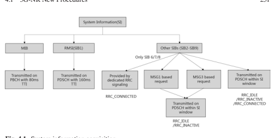

System information block 1 (SIB1) provides the UE with information that allows the UE to determine whether it is allowed to access this cell, public land mobile network (PLMN) identity, and cell-specifc parameter confguration and other radio resource confguration (RRC) information common to all UEs on that cell. In particular, SIB1 tells the UE about downlink confguration, one or both of a normal uplink (NUL) and supplementary uplink (SUL) confgurations, initial downlink BWP common confguration, TDD DL/UL confguration, and physical resources reserved for coexistence. The downlink confguration in SIB1/RMSI includes the absolute frequency position of the reference resource block,1 a subcarrier spacing value, and at least one frequency band to which this carrier belongs. Note that for NR the UE cannot derive the carrier position in the frequency domain just from the detection of the SS/PBCH blocks, since contrary to LTE the NR SS/PBCH block is not necessarily at the center of a carrier. Similar information is provided in uplink confguration, with an optional confguration of frequency shift of 7.5 kHz for a SUL.

In addition, SIB1 includes the information on the availability and scheduling 
(e.g., mapping of SIBs to SI message, periodicity, SI-window size) of other SIBs with an indication whether one or more SIBs are only provided on demand. In cases where the on-demand request for some SIBs is confgured by SIB1, the SIBs can be requested on demand by the UE in the RRC_IDLE/RRC_INACTIVE state, by either message 1 (MSG 1) or message 3 (MSG 3) in the RACH procedure, and OSI will be broadcast by PDSCH within the SI window. When on-demand request is not confgured by SIB1 for some SIBs, these SIBs are broadcast in the PDSCH within the SI window. For a UE in RRC_CONNECTED, the network can provide system information (e.g., SIB6/7/8) through dedicated RRC signaling.

At this point, the UE has acquired the common RRC information, and is able to determine resources for downlink reception and uplink transmission, but the UE is still not connected to the cell. The UE must frst perform the initial access procedure by transmitting message 1 (msg1) over the PRACH resource determined by the UE 
in the uplink confguration information2 provided in SIB1, where the RACH 
resources are associated with SS/PBCH block. In cases where a SUL is indicated in the SIB1, the UE must frst determine whether to initiate its PRACH transmission on the normal UL or on the SUL, based on comparing its measured downlink RSRP 
with a threshold provided in SIB1. Once the UE has determined the uplink and resource available for its PRACH transmission, the UE will send message 1 to the network. The fow of random-access resource determination at the network and UE side is illustrated in Fig. 4.2. The four-step contention-based RACH procedure is same as that of LTE (see Sect. 2.9).

Fig. 4.2 Flow of 

random-access resource determination

## 4.1.2 Beam Management

Supporting high-frequency bands in FR2 is a major feature for NR.  The main enabling techniques for FR2 utilization include beam management to overcome much larger path loss and blockage probability and phase tracking reference signal 
(PT-RS) to compensate for phase noise which is discussed in the section for PT-RS.

## 4.1.2.1 **Downlink Beam Management**

Figure 4.3 shows the main steps for downlink beam management defned in NR. First, a set of beamformed downlink signals (CSI-RS and/or SS/PBCH blocks) are confgured and transmitted to the UE so that proper beam(s) may be selected for transmissions of the PDSCH and PDCCH. Confguration and transmission of the beamformed CSI-RS and SS/PBCH blocks to facilitate downlink beam management are discussed in the sections for CSI-RS and SS/PBCH designs. UE then measures the set of downlink beamformed signals to select beam(s) and reports via CRI (CSI-RS resource indicator), SSBRI (SS/PBCH block indicator), and received power of the corresponding beam(s)/signal(s) as L1-RSRP as part of the CSI acquisition discussed in Sect. 3.4.3.2. In Release-16, in order to support interference-aware beam selection, L1-SINR is introduced as a  UE measurement and report for beam management. 

Based on the UE reports, the network determines the transmission beam(s) for subsequent downlink transmissions (PDSCH, PDCCH, and CSI-RS for CSI acquisition, etc.) and indicates the transmission beam(s) to the UE so that proper receiver beam(s) is applied. Indication of transmission beam(s) is done through the spatial QCL (also known as Type-D QCL) information associated with each state of TCI (transmission confguration indicator) which is confgured by RRC and dynamically indicated in DCI as discussed in Sect. 3.1.4.6. Due to mobility and blockage, the current beam(s) between the TRP and UE may be lost, and a beam failure recovery mechanism is defned to quickly reestablish the connection via new beam(s). Details of beam failure recovery are discussed in the following part.

Note that during initial access stage, the best beam (of a SS/PBCH block) is indicated implicitly by the associated PRACH resource the UE uses to send PRACH signals for initial access.

In Release 16, a few small features are introduced to enhancement beam management procedure. The main goals are to reduce signalling overhead due to periodic beam sweeping reference signals per BWP per CC and higher layer signalling for confguration per BWP per CC, and to reduce latency, for example, from RRC 
reconfguration.

Fig. 4.3 Procedure for downlink beam management Default spatial relation and pathloss reference signal is introduced for dedicated PUCCH, PUSCH scheduled by DCI format 0_0, and SRS. This potentially reduces the latency and overhead by bypassing explicit confguration signaling of spatial relation reference signal and pathloss reference signal and instead using a specifc downlink reference signal, for example, the downlink CSI-RS associated with the CORESET of lowest ID.

Instead of having to separately update TCI state for downlink or spatial relation for uplink on each CC, simultaneous update of PDSCH/PDCCH TCI states and simultaneous update of SRS/PUSCH spatial relation across multiple CCs within a group can be done by MAC-CE in Release 16. Up to two CC lists can be confgured by RRC for downlink and uplink, respectively. This obvious can reduce both overhead and latency.

Similarly, instead of per resource, PUCCH spatial relation activation/deactivation per PUCCH resource group is supported. Up to four PUCCH resource groups can be confgured by RRC per BWP and a single MAC-CE can activate/deactivate a common spatial relation reference signal for all the PUCCH resources in a group.

Another feature is to use MAC CE based spatial relation indication for aperiodic and semi-persistent SRS. Comparing to RRC only confguration in Release 15 with possibly large signalling overhead and long latency if the number of SRS resources is large, a MAC CE can update spatial relations of multiple SRS resources of an SRS resource set.

MAC CE is also supported to update pathloss reference signal for aperiodic or semi-persistent SRS and PUSCH. In Release 15, only up to 4 pathloss reference signals can be confgured, frequent RRC reconfguration is needed when beam switching happens due to mobility. In Release 16, up to 64 pathloss reference signals can be confgured and a MAC CE activates up to four of them to be used.

## 4.1.2.2 **Beam Failure Recovery**

Beam failure recovery procedure, as shown in Fig. 4.4, includes four steps. UE monitors periodic CSI-RS/SSB associated (as spatial QCL source reference signal) with the UE's CORESET(s) of PDCCH to detect if a beam failure trigger condition has been met, that is, whether its hypothetical PDCCH BLER is above a threshold for a number of consecutive instances. The UE also monitors the confgured SSB, CSI-RS, or a combination of SSB and CSI-RS to identify new candidate beam(s) with L1-RSRP above certain threshold. After the UE detects beam failure and identifes new candidate beam(s), it notifes the gNB about the new candidate beam(s) by contention-free or contention-based RACH transmissions. Upon detection of the request of the beam failure recovery, the gNB responds on the PDCCH. In the case that contention-free RACH is used for beam failure recovery request, the UE monitors PDCCH CORESET(s) for beam failure recovery and C-RNTI scrambled DCI as the gNB response. In the case that contention-based RACH is used, the procedure is similar to that of initial access. If no response is detected within a certain time window, the UE retransmits the beam failure recovery request. If beam failure recovery fails after a number (confgured by the network) of attempts, higher layer entities are notifed. In Release-16, beam failure recovery is introduced also for SCell to improve the reliability of the SCell using very similar procedure as that of the PCell.

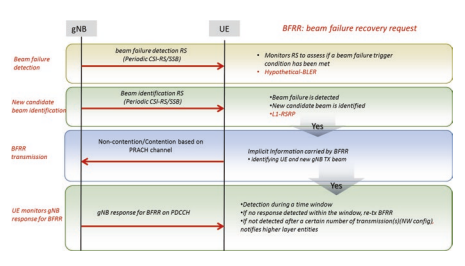

## 4.1.2.3 **Uplink Beam Management**

Uplink beam management can be done in two different approaches. The frst approach as given in Fig. 4.5 is similar to that of the downlink beam management procedure. Based on network confgurations, the UE transmits a set of SRS resources (with usage set as "beam management") with different transmitting beams. The gNB then measures the set of SRS resources and selects the transmitting (and receiving) beam(s) accordingly and indicates to the UE the selected transmitting beam(s) via the SRI (SRS resource indicator) for PUSCH and PUCCH.

For the second approach, UEs that support beam correspondence between its receiving and transmitting beams have the ability to select a corresponding beam for UL transmission based on DL measurements without relying on network-assisted UL beam management. Basically, the beam used for receiving SSB/CSI-RS can be used for transmitting corresponding signal/channel, and the SSB/CSI-RS is contained in spatial relation indication for PUSCH and PUCCH transmissions. 

Requirements on beam correspondence are verifed for FR2 in terms of the minimum peak EIRP and spherical coverage requirements to ensure small enough difference between the UE's receiving and transmitting beams.

## 4.1.3 Power Control

Power control is a key technique for cellular communication to improve channel quality, reduce interference, and save energy. On the one hand, increasing transmission power may facilitate higher transmission data rate and lower error rate. On the other hand, high transmission power could contribute to severe interference in the system on channels on the same carrier as well as on the neighboring carriers. Especially for uplink, transmission without proper power control can dramatically reduce the handset battery life. Therefore, transmission power control needs to be designed carefully.

In NR, power control applies to both uplink and downlink and is very similar to that of LTE. Uplink power control is still based on fractional power control approach, and downlink part only has very limited specifcation impact and mainly relies on network implementation.

The principle of fractional power control (FPC) is extended in NR uplink power control by taking into account the overall design and newly introduced features.

## 4.1.3.1 **Fractional Power Control Design**

Fractional power control was proposed to manage uplink interference for LTE system [3, 4]. To optimize spectrum effciency, all neighboring cells occupy the same time and frequency resources for uplink transmission. If UEs transmit at full power, the perceived inter-cell interference at the base station becomes very severe resulting in very poor performance for UEs at the cell edge. On the other hand, traditional power control fully compensates the path loss (and fast fading) such that the uplink interference level is well controlled but the uplink data rate and spectrum effciency are very low.

Through partial compensation of UE's path loss, the UE closer to the base station with smaller path loss transmits with relatively smaller power to reduce its contribution to interference to the neighbors but is still received with relatively higher power to support higher data rate. The UE at the cell edge will transmit with higher (or even full) power to ensure good cell edge performance without unnecessarily increasing the overall interference level. A good trade-off can be achieved between spectrum effciency and cell edge performance.

Figure 4.6 [3] shows user throughput under different power control schemes. 

When path loss compensation factor (α) is set to zero, UE transmits at full power resulting in very high interference level and very poor cell edge performance. When α = 1, all UE received at the same power level (via full path loss compensation) and the system performance is low. With fractional compensation, for example α = 1/2, good cell edge user throughput and system performance can be achieved simultaneously. By choosing values for path loss compensation factor α and open-loop target received power, the network can adopt different power control policies to adjust the uplink interference level and trade-off edge and average performance.

In addition to the slow open-loop fractional path loss compensation, two fast compensation factors were introduced in LTE. One is the closed-loop compensation factor where the base station sends transmit power control (TPC) command in the DCI to 

quickly adjust the uplink transmission power on top of path loss compensation. This gives the system another mechanism to control the UE transmission power for interference management or data rate boosting based on the uplink traffc load, interference level, etc. Another fast compensation factor is an offset based on the uplink transmission MCS level and allocated bandwidth. This allows the system to control UE transmission power jointly with resource allocation and link adaptation.

## 4.1.3.2 **Nr Uplink Power Control Design Requirements And Framework**

In NR, LTE fractional power control is extended to support new design aspects and features of NR. Compared to LTE, one major change is the removal of the cell common reference signal (CRS) for much higher fexibility and eliminating the constant source of interference in the network and hence improving spectrum effciency. Without the CRS, path loss measurement for power control needs to be based on other reference signals and the natural choices are CSI-RS and SS/PBCH.

Another unique feature of NR is to support high-frequency bands (FR2) by introducing beam management procedure to overcome its coverage issue. The introduction of beamforming complicates the estimation of path loss estimation as the effective path loss depends on the transmitting and receiving beamforming gains at gNB and UE and the UE may communicate with the gNB using different pairs of transmitting and receiving beams on different slots and channels. Therefore, for different beams, UE needs to measure path loss via different downlink reference signals.

Furthermore, NR supports confgurable numerology, frame structure, both CP-OFDM and DFT-s-OFDM uplink waveforms, and various services (for example, eMBB and URLLC). This fexibility requires that uplink power control should be very fexible for various scenarios and requirements. However, the potential number of combinations is very high and independent confguration for each of the scenarios can cause very high complexity for the UE and the network.

Uplink transmission power is calculated according to the following formula:

$$P=\min\Bigl{[}P_{\text{CMAX}},\bigl{\{}\text{Open loop}PC\bigr{\}}+\bigl{\{}\text{Closed Loop}\text{State}\bigr{\}}+\bigl{\{}\text{Other Offsets}\bigr{\}}\Bigr{]}$$ $$=\min\Bigl{[}P_{\text{CMAX}},\bigl{\{}P_{0}\left(j\right)+\alpha\bigl{(}k\bigr{)}\cdot PL\bigl{(}q\bigr{)}\bigr{\}}+\bigl{\{}f\bigl{(}l\bigr{)}\bigr{\}}+\bigl{\{}10\log_{10}M+\Delta\bigr{\}}\Bigr{]}$$

Among the key components of uplink power control, it is apparent that path loss measurement and closed-loop state have larger impacts on UE complexity while open-loop parameters are relatively simple. The confguration framework of NR uplink power control is defned to maintain relatively low complexity of the UE 
with yet suffcient fexibility for the network implementation. The UE can be confgured with a small number (up to 4) of downlink signal (CSI-RS or SS/PBCH 
block) for path loss measurement for possibly different TRP and/or transmitting and receiving beam pairs, a small number of (up to 2) closed-loop power control states with corresponding TPC monitoring, and a relatively large number (up to 32) of sets of open-loop parameters (Po and α). The network confgures (semi-statically via RRC) and indicates (dynamically via DCI) to the UE to apply a combination of proper path loss, open-loop parameters, and closed-loop state to calculate uplink transmission power.

## 4.1.4 Harq

HARQ in NR is adaptive and asynchronous for both the downlink and the uplink. On the downlink, a UE supports at most 16 HARQ processes but can be confgured with fewer processes. Contrary to LTE where the time gap between the reception of PDSCH and the reporting of HARQ-ACK feedback is fxed to 4  ms, NR was designed to ensure a large amount of fexibility for the network and the UE in reporting HARQ-ACK feedback. A feld in the DCI tells UE the number of slots and symbols between the end of the PDSCH reception and the transmission of HARQACK feedback over PUCCH along with the corresponding PUCCH resource, or over PUSCH if data is transmitted on the uplink at the same time. This fexibility allows the network to request very fast HARQ-ACK feedback, e.g., for low-latency services, or to delay the HARQ-ACK feedback as needed, e.g., to accommodate some other downlink or uplink transmission in the meantime.

The timing confgurable for HARQ-ACK feedback by the network depends on the UE processing capability. In Release-15, NR supports a fast UE PDSCH processing capability. This is specifed by the minimum number of uplink OFDM symbols (N1) between the last symbols of the PDSCH and the frst symbol of the PUCCH which carries the HARQ-ACK feedback. The minimum time required by the UE to process the PDSCH, to compute the HARQ result, and to prepare the PUCCH or PUSCH transmission is expressed in number of OFDM symbols depending on the subcarrier spacing confgured on downlink and uplink, the PDSCH mapping type, and the number of DM-RS symbols, and other conditions such as the number of component carriers in a cell group and timing difference between the component carriers, the number of symbols of the CORESET carrying the scheduling PDCCH, and depending on multiplexing HARQ-ACK feedback with other UCI in the PUCCH or PUSCH.

Since a slot consists of 14 OFDM symbols, it can be inferred from Table 4.1 that some UEs can support transmitting HARQ-ACK feedback in the same slot used for receiving the PDSCH. This allows for very-low-latency services.

The UE can be confgured for TB-based HARQ feedback of CBG-based HARQ 
feedback. Code block group (CBG) HARQ allows one transport block (TB) to be divided into code block groups where each code block group is transmitted with its own CRC check. This allows the UE to report that only some CBGs were not successfully received, and allows the network to retransmit only the CBGs that the UE 
failed to receive. This not only saves downlink resources, but also allows the gNB to puncture an ongoing transmission for one UE with another shorter transmission for another UE, in case that other UE receives a service with lower latency QoS, without corrupting the entire TB for the frst UE. HARQ-ACK feedback for CBGs comes at the expense of higher feedback overhead. The UE is confgured with the maximum number of CBGs per transport block and determines the exact number of CBGs depending on the number of code blocks in the scheduled TB. CBG transmission information (CBGTI) is signaled to the UE in the downlink DCI that schedules the PDSCH. A DCI sent for a retransmission of a PDSCH initially transmitted with CBGs indicates which of the CBGs are being retransmitted and can also indicate whether the previously transmitted CBGs were actually transmitted or not. This allows the UE to fush its buffer for the corresponding CBG, instead of assuming that some valid transmission was previously received for this CBG when the UE had in fact only received noise and interference. A CBG can only be retransmitted with the same code blocks as in the initial transmission of the TB.

| Table 4.1                          | Minimum UE PDSCH processing time N1 (OFDM symbols)   | Fast processing        |                     |
|------------------------------------|------------------------------------------------------|------------------------|---------------------|
| Minimum processing (capability #1) | (capability #2) UE confgured to  handle only frontloaded DM-RS                                                      |                        |                     |
| 15 kHz                             | 8 symbols [571μs]                                    | 13 symbols [929μs]     | 3 symbols [214μs]   |
| SCS                                | UE confgured to handle only                          | UE confgured to handle |                     |
| front-loaded DM-RS                 | additional DM-RS                                     |                        |                     |
| 30 kHz                             | 10 symbols [357μs]                                   | 13 symbols [464μs]     | 4.5 symbols [161μs] |
| SCS 60 kHz                         | 17 symbols [304μs]                                   | 20 symbols [357μs]     | 9 symbols [161μs]   |
| SCS                                | (for frequency range 1)                              |                        |                     |
| 120 kHz                            | 20 symbols [179μs]                                   | 24 symbols [214μs]     |                     |
| SCS                                |                                                      |                        |                     |

As in LTE, NR supports that the UE reports HARQ-ACK feedback for multiple HARQ processes in the same uplink transmission, with HARQ multiplexing and HARQ bundling. HARQ multiplexing supports semi-static HARQ codebook and dynamic HARQ codebook aided by DAI (downlink association index) signaling in DCI. HARQACK bundling can be adapted in dynamic manner according to UCI payload.

On the uplink, HARQ was already very fexibly designed in LTE. This fexibility is enhanced in NR with similar features as on the downlink. While LTE supported an indication of HARQ ACK or NACK for a UL TB from the network in the downlink physical indication channel, all HARQ-ACK indication from the network can only be carried in a DCI in NR. This means that the UE knows whether its uplink transmission was successful only if the UE receives another UL DCI granting the UE a retransmission of a TB on the uplink. Since the UL grant timing for PUSCH is very fexible in NR, so is the timing between two transmissions of the same TB by a UE. Uplink in NR also supports TB-based and CBG-based HARQ.

## 4.1.5 Multi-Trp Transmission

In Release-15, transmission only from a single TRP is supported while dynamic power selection can be performed with PDSCH and associated reference signals decoupled from the cell ID and via fexible and dynamic QCL indication. Transmission from multiple TRP is introduced in Release-16 to improve cell edge performance and transmission reliability by utilizing spatial diversity. Both single DCI- and multiple DCI-based multi-TRP transmissions are supported.

For multi-DCI-based multi-TRP transmission, two TRPs are associated with two CORESET groups by RRC parameter *CORESETPoolIndex* in each CORESET and each TRP has its own DCI, CQI, MCS, and DMRS ports. A UE may expect to detect two PDCCHs scheduling two PDSCH transmissions at the same time. These two PDSCHs may be fully, partially, or non-overlapped in time and frequency domain and each PDSCH may have up to four transmission layers. For fully or partially overlapping PDSCHs, the UE is not expected to have DM-RS ports in a CDM group indicated by two TCI states in the two DCIs. Both joint feedback and separate feedback of HARQ-ACK are specifed for type 1 and type 2 HARQ-ACK codebook. 

Separate HARQ on two PUCCHs is supported for nonideal backhaul and joint HARQ on one PUCCH for ideal backhaul.

For single-DCI-based multi-TRP transmission, two TRPs are associated with one PDCCH and one PDSCH where different transmission layers (and the associated DM-RS ports) correspond to different TRPs. Each TCI code point can be confgured with one or two TCI states. When confgured with two TCI states, the frst TCI state corresponds to the frst DM-RS CDM group and the second TCI state to the second DM-RS CDM group. Two ports PT-RS are supported for the case with two TCI states in a TCI code point.

To improve downlink transmission reliability by utilizing spatial diversity from multiple TRPs/panels, in addition to SDM scheme where different transmission 

layers are from two different TRPs, four other multi-TRP transmission schemes with single DCI are introduced as illustrated in Fig. 4.7.

For FDM Scheme A, two TCI states are indicated in a DCI and the UE shall receive a single PDSCH transmission occasion of the TB with each TCI state associated to a non-overlapping frequency domain resource allocation. This scheme only supports a single RV and one CW. For FDM Scheme B, two TCI states are indicated in a DCI and the UE shall receive two PDSCH transmission occasions of the same TB with each TCI state associated to a PDSCH transmission occasion which has nonoverlapping frequency domain resource allocation with respect to the other PDSCH transmission occasion. This scheme supports two RVs and two CWs. For intra-slot TDM scheme, two TCI states are indicated in a DCI and the UE shall receive two PDSCH transmission occasions of the same TB with each TCI state associated to a PDSCH transmission occasion which has nonoverlapping time domain resource allocation with respect to the other PDSCH transmission occasion and both PDSCH transmission occasions shall be received within a given slot. For inter-slot TDM scheme, a UE is confgured by the higher layer parameter *repetitionNumber-r16* and two TCI states are indicated in a DCI, and the UE may expect to receive multiple slot-level PDSCH transmission occasions of the same TB with two TCI states associated to *repetitionNumber-r16* consecutive slots (up to 16). Each PDSCH transmission occasion is expected to have the same SLIV. The UE may be confgured with either cyclicMapping or *sequentialMapping* for given TCI state mapping pattern.

## 4.2 **Ran Architecture Evolution And Protocol** 4.2.1 Overall Architecture

The 5G system provides an enhanced end-to-end architecture to support multiple deployment options. The following options have been included in Release-15 to support the fexibility of network deployment for requirements for different markets: - Option2: stand-alone NR - Option3: E-UTRAN-NR Dual Connectivity - Option4: NR-E-UTRA Dual Connectivity - Option5: E-UTRA connecting to 5GC - Option7: NG-RAN E-UTRAN-NR - NR-NR Dual Connectivity In addition, a CU-DU architecture with RAN split into different functional entities have been provided. The major design of the above RAN architecture is introduced in the following sections.

## 4.2.1.1 **Ran Architecture Overview**

In 5G, RAN network nodes are called NG-RAN, which includes gNB and ngeNB. gNB provides NR control plane and user plane functions and ng-eNB provides EUTRA control plane and user plane functions [15].

The NG interface is to connect NG-RAN toward 5GC (5G Core network). For the control plane NG-RAN is connected to the access and mobility management function (AMF) via NG-C interface and for the user plane NG-RAN is connected to the user plane function (UPF) via NG-U interface. The gNBs and ng-eNBs are interconnected with each other via Xn interface. The overall architecture is shown in Fig. 4.8.

In terms of functionality, the NG-RAN provides functions for Radio Resource Management, IP header compression, encryption and integrity protection of data, selection of/routing of Control Plane data to AMF and routing of User Plane data to UPF, RRC connection management, interworking between NR and E-UTRA, etc.

The AMF/UPF/session management function (SMF) provides the functions from the core network. AMF provides mainly the control plane functions including Access Authentication and Access Authorization, mobility management, SMF selection, etc. UPF provides functions including packet routing and forwarding, QoS handling, etc. SMF mainly provides session management-related functions.

The above functional split is summarized in Fig. 4.9 where grey boxes depict the logical nodes and blue boxes depict the main functions, and the details can also be seen in Sect. 4.2 of [5].

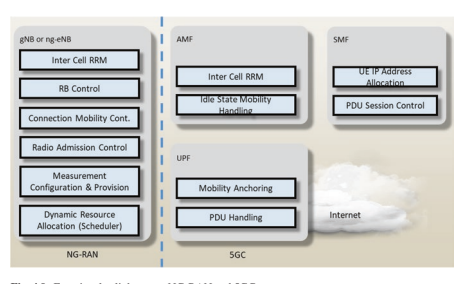

## 4.2.1.2 Rn Architecture Options

There are multiple options accepted in Release-15 to support the flexibility of network deployment for different markets (Fig. 4.10 ).

The deployment options can be differed into two types:
Stand-alone deployment for one RAT, i.e., NR stand-alone deployment and/or
-
E-UTRA stand-alone deployment with connection to 5GC for each RAN node Non-stand-alone deployment which is MR-DC, i.e., the multi-RAT dual connec-
-
tivity between E-UTRA and NR

One option of MR-DC is EN-DC (E-UTRA-NR Dual Connectivity) which allows deployment of NR without 5GC with E-UTRA as the master node and NR as the secondary node.

In the EN-DC case Fig. 4.10, the master eNB (MeNB) connects to the EPC via the S1 interface (both CP and UP) and secondary gNB (SgNB) connects to EPC via S1-U interface (only UP). MeNB connects to en-gNB via X2 interface (both CP and UP) and en-gNB connects to en-gNB via X2-U interface (only UP).

In addition to EN-DC, there are also other multi-RAT deployment options which have connectivity to the 5GC: NG-RAN E-UTRA-NR Dual Connectivity (NGEN-DC) (Fig. 4.11) and NR-E-UTRA Dual Connectivity (NE-DC) (Fig. 4.12).

In the case of stand-alone NR deployment mentioned above, it is also possible to support NR-DC, i.e., NR-NR dual connectivity where a master gNB connects to the 5GC but also to a secondary gNB in order to provide additional resources for the 

same user. This option is useful especially in the case where the operators want to utilize FR1 and FR2 spectrum resources together. In 3GPP, NGEN-DC, NE-DC, and NR-DC are grouped together and are known as multi-radio dual connectivity.

## 4.2.1.3 **Cu-Du Split**

Within an NG-RAN node, there are two functional entities: gNB-CU (gNB central unit) and gNB-DU (gNB distributed unit) shown in Fig. 4.13. A gNB consists of a gNB-CU and one or more gNB-DU(s), and the interface between a gNB-CU and a gNB-DU is called F1 interface.

The CU provides the functions for RRC/PDCP/SDAP layers, and DU provides functions for PHY, MAC, and RLC layers. One CU is allowed to connect to multiple DUs while one DU can only connect to one CU. The F1 interface is only visible within one gNB; outside the gNB the interface between different CUs uses the Xn interface. The NG interface is also reused for the connection between CU and 5GC.

For a single CU, there is a further function split between its control plane (CP) 
and user plane (UP) (Fig.  4.14). The E1 interface is to connect CU-CP and CU-UP. The CU-CP is connected to the DU through the F1-C interface, and the CU-UP is connected to the DU through the F1-U interface.

## 4.2.1.4 **Integrated Access And Backhaul**

Rel. 16 introduced integrated access and backhaul (IAB), which is a system-level solution to enable wireless relaying in NG-RAN. IAB can be seen as extending the concept of disaggregation of the gNB introduced with the CU-DU split, such that the F1 interface between CU and DU can be relayed over a wireless backhaul. The IAB architecture allows for relaying across one or multiple backhaul links Fig. 4.14 CP and UP 

separation for CU
connecting relaying nodes, referred to as IAB nodes. The gNB supporting one or multiple IAB nodes is referred to as an IAB donor.

The IAB node comprises gNB-DU functionality, which terminates the F1 protocol to the gNB-CU functionality in the upstream direction and terminates the NR 
access interface to UEs and next-hop IAB nodes in the downstream direction. To interface with upstream IAB nodes, the IAB node supports a subset of the UE functionality referred to as the IAB-MT (IAB mobile termination). The IAB-MT essentially supports the RAN functionalities of a UE and supports control plane network interfaces (RRC with gNB-CU and NAS with the NGC).

In the case of an EN-DC deployment, IAB nodes may also connect via E-UTRA 
to a MeNB. In this case IAB donor terminates X2-C as SgNB. Figure 4.15 illustrates the IAB architecture for both IAB node SA mode with NGC and IAB node using EN-DC.

## 4.2.1.5 **Ran Protocol And Stack** 4.2.1.5.1 Nr Stand-Alone Network Protocol Architecture

In stand-alone NR, the radio interface protocol is also split into control plane and user plane as in E-UTRA and the detailed design is introduced in the following sections.

## 4.2.1.5.1.1 Control Plane

For the control plane, all layers shown in Fig. 4.16 provide similar functions as those in E-UTRA [5].

The NR RRC layer provides functions including system information, paging, RRC connection management, security, Signaling Radio Bearers (SRB) and Data Radio Bearers (DRB) establishment/modifcation, mobility management for UEs in different RRC states, QoS management functions, UE measurement management, radio link failure detection and recovery, etc. If carrier aggregation or dual connectivity is supported, the RRC layer also provides support of addition, modifcation, and release of these features.

Fig. 4.16 Block diagram of the control plane

4 5G Procedure, RAN Architecture, and Protocol
Compared with E-UTRA, the RRM measurements have been enhanced to support beam-based measurement and reporting. In addition a new RRC state, RRC_
INACTIVE, was introduced to save power and reduce the signaling overhead and latency for subsequent data transmission. The RRC layer also supports confguration of new concepts introduced in the physical layer like bandwidth part, supplementary UL, and beam management. The system information mechanism is further enhanced to reduce the broadcast capacity consumption, e.g., on-demand SI acquisition is introduced for NR [6].

In the case of IAB, the IAB node needs to support two control plane protocol stacks: the F1-C stack that terminates at the DU entity of the IAB node (Fig. 4.17) and the RRC/NAS stack that terminates the corresponding SRBs at the IAB-MT (Fig. 4.18).

## 4.2.1.5.1.2 User Plane

For the user plane (Fig. 4.19), medium access control (MAC)/Radio Link Control (RLC)/packet convergence protocol (PDCP) layer provides similar functions as those in E-UTRA [5]. Additionally, NR introduced a new protocol: the Service Data Adaptation Protocol (SDAP).

For IAB the F1-U interface is transported between the donor's CU-U and the DU 
entity of the IAB node, over the wireless backhaul links (Fig. 4.20). Note that an additional protocol layer, the Backhaul Adaptation Layer (BAP), is introduced to support the relaying of both F1-U and F1-C stacks over the wireless backhaul.

The IAB donor DU maps/de-maps user plane packets that are encapsulated within the GTP-U/UDP/IP transport stack, to an appropriate backhaul RLC channel for transport over the wireless backhaul. This mapping functionality enables a UE's radio bearer (identifed by the GTP-U header) to be mapped to backhaul RLC channel that is confgured to support the appropriate QoS. Furthermore, IAB in Rel. 16 introduced functionality to enable multiple UE radio bearers to map to the same backhaul RLC channel. This allows for more effcient management of RLC channels over the wireless backhaul network and is particularly useful for best effort 

traffic flows. However, in some cases it may be desirable that a backhaul RLC channel is not shared among multiple UE radio bearers (one-to-one bearer mapping), for example to provide critical QoS treatment to a high-priority radio bearer.

## Mc Layer

The MAC layer provides functions including mapping between logical channels and transport channels, (de)multiplexing of MAC SDUs, HARQ process, power headroom reporting, scheduling and priority handling for multiple UEs, etc.

Compared with E-UTRA, the MAC layer is enhanced to support multiple

numerologies, bandwidth parts, beam-relevant functions (e.g., beam failure recovery), and supplementary UL handling. In the initial version of NR, only fundamental functions have been defined and some other functions might be supported in the future, e.g., broadcast/multicast services.

RC is in control of the MAC configuration. The functions, timers, and parameters for different MAC entities in the UE are operated or configured independently in general. Each cell group has one MAC entity; that is, when the UE is configured with SCG, two MAC entities are configured to the UE: one for the MCG and one for the SCG. Figure 4.21 shows the structure of the MAC entity.

Figure 4.22 shows the structure for the MAC entities when MCG and SCG are configured.

Similar as E-UTRA, NR defnes the transport channels and logical channels as in Tables 4.2 and 4.3. The MAC entity is responsible for mapping logical channels onto transport channels, which applies to both uplink and downlink, as also shown in Figs. 4.21 and 4.22.

The MAC PDU formats for DL and UL are shown in Figs. 4.23 and 4.24. The MAC PDU consists of multiple MAC subPDUs. For the DL MAC PDU, the MAC CE is placed before any MAC data subPDU and the MAC subPDU with padding is placed in the end. For the UL MAC PDU, the MAC data subPDU is placed before any MAC CE, and the subPDU with padding is placed in the end. For NR, the MAC subheader and MAC CE/MAC SDU are interleaved. A MAC subheader in general has four header felds R/F/LCID/L, and "F" feld indicates the size of the length ("L") feld, the value 0 indicates 8 bits of the "L" feld, and the value 1 indicates 16 

| Transport channel name   | Acronym   | Link     |
|--------------------------|-----------|----------|
| Broadcast channel        | BCH       | Downlink |
| Downlink shared channel  | DL-SCH    | Downlink |
| Paging channel           | PCH       | Downlink |
| Uplink shared channel    | UL-SCH    | Uplink   |
| Random access channel    | RACH      | Uplink   |

| Logical channel name      | Acronym   | Channel type    |
|---------------------------|-----------|-----------------|
| Broadcast control channel | BCCH      | Control channel |
| Paging control channel    | PCCH      | Control channel |
| Common control channel    | CCCH      | Control channel |
| Dedicated control channel | DCCH      | Control channel |
| Dedicated traffc channel  | DTCH      | Traffc channel  |

bits of the "L" feld. The LCID is the logical channel identifer to identify the logical channel instance of the corresponding MAC SDU or the type of the corresponding MAC CE which has 6 bits.

The MAC layer for NR is designed to support new features including bandwidth parts, supplementary uplink, beam recovery, and multiple numerologies. In addition, the NR MAC is different from that in E-UTRA as follows: the number of Table 4.2 Table of the transport channels used by MAC
Table 4.3 Table of the logical channels provided by MAC
logical channels is expanded, only asynchronous HARQ is supported, and the scheduling mechanism is further enhanced. Each of these will now be discussed in order.

In E-UTRA, ten LCIDs are reserved for logical channels: LCID 1 and LCID 2 are reserved for SRB1 and SRB2, and totally eight DRBs can be supported. While in NR, as SRB3 is introduced, LCID 1–3 are reserved for the three SRBs, respectively, and therefore up to 29 DRBs can be supported in a MAC entity.

In NR only asynchronous HARQ is supported for both UL and DL. To enhance the reliability of data transmission slot aggregation is introduced and the number of repetitions is confgured by RRC. To also improve the effciency of retransmission CBG-based retransmission is supported at physical layer, which is transparent to the MAC layer.

Both dynamic scheduling and semi-static scheduling are supported in NR. Furthermore, the scheduling request (SR) mechanism and Buffer Status Report (BSR) have been further improved compared with E-UTRA.

NR signifcantly enhanced the SR mechanism. Each SR confguration can now be associated with multiple PUCCH confgurations across multiple bandwidth parts or serving cells. Furthermore, for a single MAC entity, multiple SR confgurations are supported.

The BSR can be triggered with uplink data arrivals when UL data with higher priority arrives for a certain LCG (logical channel group) or when previously none of the logical channels within the LCG contain any uplink data. It can also be triggered when periodic BSR timer expires, or when there are padding bits left. 

Correspondingly regular BSR, periodic BSR, or padding BSR is reported. The long BSR has been improved to use a variable size to support more effcient reporting. The long truncated BSR format has been introduced so that it can report, as many as possible, the buffered data for multiple LCGs.

This discussion in the differences between the NR and E-UTRA MAC has been cursory in nature. The interested reader can fnd further details in [7].

## Rlc Layer

Same as E-UTRA RLC, NR RLC also has three modes: AM (acknowledge mode), UM (unacknowledged mode), and TM (transparent mode), respectively, as shown in Fig. 4.25.

The RLC AM entity includes a transmitting side and a receiving side supporting retransmission. The RLC UM entity is confgured as either a transmitting entity or a receiving entity. The RLC TM entity is either a transmitting entity or a receiving entity. System information and paging use RLC TM mode.

The most signifcant change in the NR RLC compared with the E-UTRA RLC is that RLC concatenation is removed and reordering is not performed in NR RLC. The former feature is to facilitate the preprocessing in NR such that it can meet the high demand in NR for latency. The latter feature is because the reordering functionality has been moved to the PDCP layer. In this case, there is no need to duplicate the reordering functionality in the RLC layer and when a complete packet is received, it is forwarded to PDCP layer immediately. More details can be seen in [8].

Fig. 4.25  Diagrams of the

## Pdcp Layer

The PDCP sublayer provides header (de)compression, (de)ciphering, and integrity protection and verifcation, as well as transfer of data for both user plane and control plane for various bearer types. The maximum supported size of a PDCP SDU and PDCP Control PDU is 9000 bytes.

Unlike E-UTRA, out-of-order delivery is supported in NR PDCP to allow ordering made only in upper layer. In addition, packet duplication is also supported to improve the reliability by transmission on different links, for both dual connectivity and carrier aggregation. Integrity protection is also newly introduced for data bearers in NR PDCP.

Figure 4.26 shows the functional overview of the PDCP layer. In transmitting operation for each PDCP SDU, the PDCP entity frst starts the discard timer, assigns COUNT associated with the PDCP SDU, and performs header compression and then integrity protection and ciphering which is confgurable at a DRB level. If split bearer is confgured, the PDCP PDU can be delivered to either the RLC primary path or the secondary path based on the condition whether the total amount of data volume is equal to or above the configured threshold.

In receiving operation, the PDCP entity determines the COUNT value of the received PDCP PDU and performs deciphering and integrity verification for the packet. Duplication detection and removal are then performed. If for a DRB, out-oforder delivery is not configured, reordering is also performed. Then after header decompression, the data packet is ready to be delivered to upper layers. More details can be seen in [9].

## Sdap Layer

Another major difference for user plane is that a new layer named the service data adaptation protocol (SDAP) was introduced. This layer provides QoS flow management.

Figure 4.27 shows the SDAP layer structure [ 10 ]. There are two layers for mapping of data packets to data bearer:
At NAS level, packet filters in the UE and in the 5GC associate UL and DL pack-

ets with QoS flows
- At AS level, mapping functions in the UE and in the NG-RAN associate UL and DL QoS fows with DRBs SDAP allows the transmission of data packets with the QoS fow identifer indicated by NAS and RAN manages the mapping of QoS fows to DRB via refective mapping or explicit confguration.

In summary the overall user plane data handling is illustrated in Fig. 4.28. When the UE has set up the RRC connection with the network and wants to send data, it frst selects the data bearer according to the QoS fow for the packet. Subsequently it applies header compression and security based on the network confguration. After PDCP layer processing, the UE will form the RLC and then MAC packet and fnally delivers it to the physical layer.

## 4.2.1.5.2 Mr Dc Protocol Architecture

The section will provide a cursory discussion on the MR-DC protocol architecture. The interested reader can fnd more details in [11].

The control plane is shown in Fig. 4.29. The UE has a single RRC state based on the master node (MN) RRC and only has a single C-plane connection toward the CN. Both MN and secondary node (SN) gNB/eNB have their own RRC entities.

For EN-DC, NGEN-DC, and NR-DC, SRB3 may be set up directly between the UE and the NR SN to speed up RRC signaling which is independent from the MN, e.g., measurement confguration and reporting for intra-MN mobility.

For the user plane, the protocol architecture is designed in Fig. 4.30 from the UE 
side for EN-DC and MR-DC with 5GC, respectively. From UE perspective, the bearer type includes MCG bearer, SCG bearer, and MCG/SCG split bearer based on different confgurations. Split bearer is mainly used to offoad the traffc to different legs or to support DC duplication to enhance the reliability. MCG and SCG bearer can be used for CA duplication as well.

Figures 4.31 and 4.32 show the protocol architecture from network point of view. 

As it is allowed to have RLC/MAC layer in one RAT while PDCP layer in another RAT, the bearer type visible in eNB/gNB can be summarized as below: - MN terminated MCG bearer - MN terminated SCG bearer - MN terminated split bearer - SN terminated MCG bearer - SN terminated SCG bearer - SN terminated split bearer Like for E-UTRA, NR uses a RAN-level key specifc to a UE-RAN node connection, from which ciphering and integrity protection keys are derived for SRBs and for each DRB. For MR-DC, this key is only used for MN terminated bearers and SRB1/2 and the UE is allocated with a secondary key, which is used to derive ciphering and integrity protection keys for SN terminated bearers and SRB3.

Apart from this aspect, the termination point is transparent to the UE as this only impacts the coordination between the eNB/gNBs.

## 4.2.2 Fundamental Procedures For Nr Stand-Alone 4.2.2.1 Ue State Transition

In NR the state transition between RRC_CONNECTED and RRC_IDLE is the same as E-UTRA. In general the UE camps on a cell, reading the system information, and listens to the paging periodically in idle mode. When the UE wants to initiate data transmission or responding to the paging, the UE initiates the random access procedure to enter RRC_CONNECTED state. The subsequent sections are organized in such an order to introduce basic procedures for each step. Further details for the RRC procedure can be found in [ 6 ].

Different from E-UTRA, a new UE state is introduced as NR RRC_INACTIVE. If the UE is in RRC_CONNECTED and the network sends RRCRelease message to the UE with suspend indication, the UE keeps the original context and enters RRC_ INACTIVE state (Fig. 4.33). The next time when the UE has data or signaling (e.g., 
to perform RNA) to transmit, it sends the RRCResumeRequest message to the network and the RRC connection can be resumed. In this way the UE in RRC_
INACTIVE can transmit and receive data with reduced signaling and latency compared to a UE moving from RRC_IDLE, because a UE in RRC_IDLE has to perform RRC connection establishment procedure every time when there is data to transmit. On the other hand, the UE in RRC_INACTIVE state also achieves the power consumption benefts from UE-based mobility and IDLE mode DRX compared with the case in RRC_CONNECTED state. The state transition is illustrated in Fig. 4.33.

## 4.2.2.2 **System Information Acquisition**

Similar to E-UTRA, the system information is divided into MIB (Master Information Block) and SIB (System Information Block). MIB is transmitted on BCH with a periodicity of 80 ms and repetitions are made within 80 ms.

SIBs are further divided into SIB1 and other SIBs which are transmitted on DL-SCH. The minimum system information (that is, the system information essential for the UE to perform an initial access to the cell, such as access control information and common channel confgurations) is provided in MIB and SIB1, and is always broadcast. SIB1 is transmitted with a periodicity of 160 ms. The default transmission repetition periodicity of SIB1 is 20 ms and variable transmission repetition periodicity is up to network confguration. SIB1 also includes the scheduling information for other SIBs.

Fig. 4.33 RRC state 

transition diagram Other system information consists of system information not essential for initial access, and this may be optionally always provided by broadcast, or otherwise provided on demand. In the initial version of NR, SIB2-SIB9 have been introduced:
- SIB2 contains cell reselection information, mainly related to the serving cell. - SIB3 contains information about the serving frequency and intra-frequency neighboring cells relevant for cell reselection.

- SIB4 contains information about other NR frequencies and inter-frequency neighboring cells relevant for cell reselection.

- SIB5 contains information about E-UTRA frequencies and E-UTRA neighboring cells relevant for cell reselection.

- SIB6 contains an ETWS primary notifcation. - SIB7 contains an ETWS secondary notifcation. - SIB8 contains a CMAS warning notifcation. - SIB9 contains GPS time and Coordinated Universal Time (UTC), by which the UE can obtain the UTC, the GPS, and the local time. Other than SIB1, SIBs having the same periodicity can be included to the same SI message with its own time domain windows. Such SI windows do not overlap with different SI messages.

Compared with EUTRA, the SI acquisition procedure additionally introduced on-demand SI (Fig. 4.34), to reduce the overhead for the broadcast control channel. The network can, at the UE (or UEs) request, mute some SI messages for some broadcast periods. On-demand system information request can be sent based on MSG 1 or MSG 3 in RACH procedure. In case of MSG1-based solution, a particular RACH resource for SI request is mapped to a set of SI messages, while for MSG3based solution, the request for system information is indicated with a bitmap in MSG3 of the RACH procedure.

Another difference than E-UTRA is that NR introduces the concept of areabased SI. The system information (except for minimum system information in MIB 
and SIB1) that has been acquired by the UE in a cell may be valid also in other cells. If, after obtaining SIB1, the UE verifes that the SIB provided on a new cell is within Fig. 4.34 Overview of 

 on-demand SI acquisition the same System Information Area and the value tag is also the same, the UE would consider that the stored SIB is valid and may use the stored SIB without reading the SI again. In this way the UE can reduce the unnecessary reading of the SI which is helpful to reduce UE power consumption, as well as broadcast overhead.3 This is illustrated with Fig. 4.35. When the UE moves from cell1 to cell2 or from cell4 to cell5, acquisition of all of the SI is not needed since they are in the same SI area and have the same SI.

## 4.2.2.3 **Paging And Drx**

Paging is used for the network to transmit paging information to the UEs who are in RRC_IDLE or RRC_INACTIVE, and to notify UEs in RRC_IDLE, RRC_ INACTIVE, and RRC_CONNECTED state of system information change and earthquake or emergency warning messages. - For UEs in RRC_IDLE, the paging is sent from the 5GC to the gNBs which are 

within that tracking area, and these gNBs then send these paging messages to the UE.

- For UEs in RRC_INACTIVE, a RAN-based notifcation area is confgured. The gNB already knows which RAN notifcation area the UE is camping on and only sends the paging in that area to reduce the radio resources consumed on paging. 

The paging message is same for both RAN-initiated paging and CNinitiated paging.

- For indicating the notifcation of system information modifcation and ETWS/
CMAS indication, NR has introduced short message which is transported by the DCI by PDCCH in the physical layer.
In case of paging for UEs in RRC_INACTIVE, a RAN area update procedure is introduced to allow the gNB to know whether the UE changes the RAN-based notifcation area (RNA). Such RNA update (RNAU) is periodically sent by the UE and is also sent when the UE selects a cell that does not belong to the confgured RNA; see Fig. 4.36.

Discontinuous reception (DRX) for idle mode and connected mode is supported in NR.  The former one applies to the UE in RRC_IDLE and RRC_INACTIVE states in order to reduce power consumption. The defnition of PF and PO is reused in NR. One Paging Frame (PF) is one Radio Frame and may contain one or multiple paging occasions (PO) or starting point of a PO. A PO is a set of PDCCH monitoring occasions and can consist of multiple time slots (e.g., subframe or OFDM symbol) where paging DCI can be sent [12]. The UE monitors one paging occasion 
(PO) per DRX cycle.

In multi-beam operations, the length of one PO is one period of beam sweeping and the UE can assume that the same paging message is repeated in all beams of the sweeping pattern and thus the selection of the beam(s) for the reception of the paging message is up to UE implementation.

## 4.2.2.4 **Access Control**

RAN supports various overload and access control functionalities such as RACH back-off, RRC Connection Reject, RRC Connection Release, and UE-based access barring.

In NR, the unifed access control (UAC) feature was introduced, so that operatordefned access categories can be used to enable differentiated handling for different slices. NG-RAN may broadcast barring control information (i.e., a list of barring parameters associated with operator-defned access categories) to minimize the impact of congested slices.

One unifed access control framework applies to all UE states (RRC_IDLE, 
RRC_INACTIVE, and RRC_CONNECTED) for NR. NG-RAN broadcasts barring control information associated with Access Categories and Access Identities (in case of network sharing, the barring control information can be set individually for each PLMN). The UE determines whether an access attempt is authorized based on the barring information broadcast for the selected PLMN, and the selected Access Category and Access Identity(ies) for the access attempt: - For NAS-triggered requests, NAS determines the Access Category and Access Identity(ies).

- For AS-triggered requests, RRC determines the Access Category while NAS 
determines the Access Identity(ies). Table 4.4 shows the mapping between Access Category and type of access attempt [13]. The gNB handles access attempts with establishment causes "emergency," "mps-PriorityAccess," and "mcs-PriorityAccess" (i.e., emergency calls, MPS, MCS subscribers) with high priority and responds with RRC Reject to these access attempts only in extreme network load conditions that may threaten the gNB stability.

## 4.2.2.5 **Random Access Procedure**

Normally when the UE has data to transmit and passes the access control, the UE 
can initiate random access procedure. To be more specifc, there are various conditions to trigger random access procedure as below:
- Initial access from RRC_IDLE - RRC connection reestablishment procedure
- Handover (HO)
- Arrival of DL/UL data during RRC_CONNECTED but UL is non-synchronized
- Arrival of UL data during RRC_CONNECTED when there are no PUCCH 
resources for SR available
- SR failure - Request by RRC upon synchronous reconfguration

| Table 4.4               | Access category                                                                                                                                              |                                                              |
|-------------------------|--------------------------------------------------------------------------------------------------------------------------------------------------------------|--------------------------------------------------------------|
| Access category  number | Condition related to UE                                                                                                                                      | Type of access attempt                                       |
| 0                       | All                                                                                                                                                          | Mobile Originated (MO)  signaling resulting from  paging     |
| 1                       | UE is confgured for delay-tolerant service and  subjected to access control for Access Category 1,  which is a function of UE's HPLMN and the  selected PLMN | All except for  emergency, or MO  exception data             |
| 2                       | All                                                                                                                                                          | Emergency                                                    |
| 3                       | All except for the condition in Access Category 1                                                                                                            | MO signaling on NAS  level resulting from  other than paging |
| 4                       | All except for the condition in Access Category 1                                                                                                            | MMTEL voice                                                  |
| 5                       | All except for the condition in Access Category 1                                                                                                            | MMTEL video                                                  |
| 6                       | All except for the condition in Access Category 1                                                                                                            | SMS                                                          |
| 7                       | All except for the condition in Access Category 1                                                                                                            | MO data that do not  belong to any other  Access Categories  |
| 8                       | All except for the condition in Access Category 1                                                                                                            | MO signaling on RRC  level resulting from  other than paging |
| 9                       | All except for the condition in Access Category 1                                                                                                            | MO IMS registration  related signaling                       |
| 10                      | All                                                                                                                                                          | MO exception data                                            |
| 11–31                   | Reserved standardized  Access Categories                                                                                                                     |                                                              |
| 32–63                   | All                                                                                                                                                          | Based on operator  classifcation                             |

- To establish time alignment at SCell addition - Transition from RRC_INACTIVE - Request for Other SI - Beam failure recovery The random access can be done in two ways: contention-based access and contention-free access as shown in Fig. 4.37. For contention-based random access, the UE randomly selects a preamble for access and consequently there are risks to have conficts with other UEs. In this case the contention resolution procedure has to be performed. For contention-free access, as the preamble is assigned by the network to a specifc UE, such risks can be avoided and the contention resolution is not needed.

In general the network confgures the preambles mapped to each SSB, as well as the PRACH occasions associated with an SSB/CSI-RS in the system information. When the UE wants to initiate the random access, it selects an SSB/CSI-RS prior to RA resource selection. If there is an SSB/CSI-RS signal above with the confgured threshold in the candidate list, the UE selects this SSB/CSI-RS; otherwise the UE 

selects any SSB which is up to UE implementation. The power ramping mechanism and back-off timer also apply to NR random access.

There are additional functions supported in NR for random access compared with E-UTRA: UL selection and beam failure recovery. For UL selection, when one cell is confgured with two UL (i.e., a normal NR UL and a supplementary UL), the UE would initiate random access on the UL based on the confgured threshold. If the measured RSRP for the downlink is lower than the threshold, the UE would select the SUL. For beam failure recovery, it is introduced in beam-level mobility section.

## 4.2.2.6 **Rrc Procedures Supporting Rrc_Inactive State**

The fundamental procedures for RRC connection management like RRC establishment, reestablishment, and release are similar to those in E-UTRA [6]. The major new procedure was introduced to support RRC_INACTIVE state.

If the UE has already set up the RRC connection, the network can use RRC 
Connection Release procedure to suspend the RRC connection, which includes the suspension of the established radio bearers. Both the UE and the network side store the UE context and the UE enters RRC_INACTIVE state.

When the UE wants to initiate data transmission, it needs to transit from RRC_
INACTIVE to RRC_CONNECTED state. Figure  4.38 shows the procedure to resume the RRC connection. By doing so, the UE can save the signaling overhead to establish a new RRC connection repeatedly.

The trigger of such transition might not be only from the UE side; the network side can also trigger the resume procedure if there is a RAN paging which requires the response from the UE. Figure 4.39 shows the principle of network-triggered transition.

## 4.2.3 Mobility Control 4.2.3.1 Cell Selection

For cell selection the principle is the same as the generic cell selection procedures for E-UTRA [ 14 ]. The UE NAS layer selects and indicates the selected PLMN and equivalent PLMNs to the RRC layer, and the cell selection is based on the existing principle. For cell selection in multi-beam operations, measurement quantity of a cell is up to UE implementation. If no suitable cell is found the UE would then identify an acceptable cell to camp on.

## 4.2.3.2 **Cell Reselection**

Cell reselection within NR is also based on the existing principle for E-UTRA with additional beam-level measurements [14]. For cell reselection in multi-beam operations, the measurement quantity of this cell is derived among the beams corresponding to the same cell based on SS/PBCH block, either by deriving a cell measurement quantity using the highest beam measurement quantity value or by deriving a cell measurement quantity as the linear average of the power values of up to a maximum confgured highest beam measurement quantity value above a confgured threshold. Intra-frequency cell reselection is based on the ranking of cells and inter-frequency cell reselection is based on priority-based cell reselection.

For inter-RAT cell reselection, currently only cell reselection between E-UTRA 
and NR is supported and priority-based inter-RAT cell reselection mechanism is reused.

Compared with E-UTRA, the main difference is that the ranking of the cells may be confgured to take multi-beam aspect and SUL into account. There is some compensation for cells with more beams above a threshold or better quality beams so that these cells can be prioritized. For SUL aspect, since not all UEs support this feature, there would be different compensation parameters for SUL-capable UEs so that UEs can timely reselect to another cells according to their own capabilities.

## 4.2.3.3 **Measurements In Rrc_Connected**

When UE is in RRC_CONNECTED, the network may provide measurement confguration via RRC for the UE to report various measurement reporting. The measurement confguration includes measurement objects, reporting confgurations, measurement identities, quantity confgurations, and measurement gaps.

In NR, intra/inter-frequency measurement for NR and inter-RAT measurement toward E-UTRA are supported, which can be reported periodically or event triggered. For event-triggered inter-RAT measurement reporting, Events B1 (inter-RAT 
neighbor becomes better than threshold) and B2 (PCell becomes worse than threshold1 and inter-RAT neighbor becomes better than threshold2) are supported. For intra-RAT measurement reporting in NR, the following event-triggered measurements are supported:
- Event A1 (serving becomes better than threshold) - Event A2 (serving becomes worse than threshold) - Event A3 (neighbor becomes offset better than SpCell) - Event A4 (neighbor becomes better than threshold)

- Event A5 (SpCell becomes worse than threshold1 and neighbor becomes better than threshold2)
- Event A6 (neighbor becomes offset better than SCell)
In NR the measurements can be performed based on SSB or CSI-RS. SMTC (SS/
PBCH block measurement timing confguration) is introduced to confgure measurement timing confgurations, i.e., timing occasions at which the UE measures SSBs. The measurement gap needs also to be confgured for inter-frequency or inter-RAT cases based on UE capabilities: if the UE only supports per-UE gap, the UE is not able to receive or transmit data in all serving cells; if the UE supports perFR gap, the UE can continue receiving or transmitting data in the serving cells in FR2 when measuring FR1 cells.

The above measurements are mainly used for the purpose of connected mode mobility and SCG management in dual-connectivity cases. In addition CGI reporting for the purpose of ANR (Automatic Neighbor Relation) is also supported. Once confgured by the network, the UE can report the cell identity to the network for a certain cell to help the network automatically maintain the neighbor cell list.

Another important measurement is called SFTD (SFN and Frame Timing Difference). This measurement is used to indicate the timing difference between two cells, which helps the network to make more accurate measurement confguration to the UEs especially considering the case where the neighbor cells are not synchronized with the serving cell.

More specifcally, in MR-DC case, measurements can be confgured independently by the MN and by the SN. The SN can only confgure intra-RAT measurements and coordination via inter-node signaling between the MN and the SN is used to ensure consistent measurement confguration between these two nodes without exceeding the UE measurement capabilities. When SRB3 is confgured, reports for measurements confgured by the SN are sent on SRB3.

## 4.2.3.4 **Inter-System/Inter-Rat Mobility In Connected Mode**

In Release-15 NR mobility procedure reuses LTE handover procedures in a large extent with additional beam management. The mobility includes cell-level mobility 
(handover) and beam-level mobility (intra-cell beam switch). The cell-level mobility is based on the L3 cell-level measurements while the beam-level mobility is based on the L1 measurement on individual beams.

## 4.2.3.4.1 Beam-Level Mobility

For the beam mobility management, Fig. 4.40 shows the corresponding procedure. The network frst confgures up to 64 beams which includes a list of SSB/CSR-RS 
confgurations and the conditions for beam failure detection as well as the confguration for beam failure recovery. Upon receiving the confguration from the 

network, the UE keeps measuring beam quality. If the beam failure is detected at physical layer, PHY layer would inform the MAC layer. Once the criteria are fulflled by the timer for beam failure instance and the threshold for the max number of beam failure instances, UE can use RACH procedure to request the recovery. The network in this case decides to reconfgure the UE with the updated beam confgurations.

## 4.2.3.4.2 Handover

The process for intra/inter-frequency handover is shown in Fig. 4.41. The Handover Request message includes beam measurement information associated to SSB(s) and CSI-RS(s) for the reported cell. Flow-based QoS is taken into account for HO 
procedure.

The Handover command confgures dedicated RACH resources associated either to the SSB(s) or to the CSI-RS(s), with which the UE can perform contention-free RACH procedure to the target cell. Since common RACH resources can only be associated to the SSB(s), CSI-RS resources are confgured with additional RACH occasions.

Fig. 4.41 Generic handover procedure
- Intra-system intra-RAT handover:
- Both intra-NR handover and intra-EUTRA handover without CN change are supported.

- Intra-system inter-RAT handover between EUTRA and NR:
- This only applies to the case where both RATs are connected to 5GC. Both Xn-based and NG-based handover are supported in this case.

- Inter-system intra-RAT handover:
- This case refers to the case that the EUTRA cells are connected to EPC and 5GC, respectively. When the UE moves between these two cells inter-system handover is supported.

- Inter-system inter-RAT handover:
- This case refers to the case that the EUTRA cell is connected to EPC and the UE moves between such a EUTRA cell and a NR cell. In this case only CNbased handover is supported and in-sequence and lossless handover is not supported.

## 4.2.4 Vertical Support

The RAN procedure and architecture that support the 5G fundamental key features of slicing will be discussed here. Other 5G procedures and RAN architecture features for the support of the vertical industry, such as URLLC, V2X, and industrial Internet of Things, will be discussed in Chaps. 7, 8, and 9, respectively, where the 5G features supporting these verticals are discussed.

## 4.2.4.1 **Slicing**

5G introduced slicing, which is an end-to-end function, to allow more fexible resource utilization and differentiated treatment depending on different customer requirements, service-level agreement (SLA), and subscriptions. This is a key feature that allows for the hyper-customization of the system to support the vertical services.4 A network slice always consists of a RAN part and a CN part. From the RAN 
point of view, traffc for different slices is handled by different PDU sessions. The network can realize the different network slices by scheduling and also by providing different L1/L2 confgurations. NG-RAN supports awareness of the slicing and a differentiated handling for different network slices which have been pre-confgured. The detailed resource management among different slices is up to the network implementation.

NG-RAN also supports the selection of the RAN part of the network slice, by assistance information provided by the UE or the 5GC.

The RAN awareness of slice is introduced at PDU session level by indicating the slicing identifer corresponding to the PDU session. NG-RAN is confgured with a set of different confgurations for different network slices by OAM so as to enable differentiated handling of traffc for network slices with different SLA. In addition, the slice-aware mobility is supported by RAN, which is to enable slice-aware admission and congestion control by transferring the slice identifer during mobility procedures. Beam failure recovery for the SCell was introduced to improve its reliability.

To also help to fnd a suitable CN slice, the UE can provide an identifer which is assigned by the 5GC in MSG5 and the NG-RAN would use this identifer to route the messages to the suitable AMF.

## 4.3 **Summary**

The newly introduced procedures in 5G are discussed here by taking into account the characteristics of the NR design. The new procedures include initial access, beam management, power control, and HARQ. In addition, the RAN architecture, fundamental procedures for stand-alone NR, and mobility control are discussed to provide the basic framework.

The concept "beam" is used in NR and the beam-based operation is applied in different procedures. In LTE, the common channels are based on a wide beam, which can enable the UEs located at different positions of the cell to receive it. Because the typical deployment spectrum of LTE is low-frequency band with less path loss, the wide beam can cover the whole cell. However for NR going to high frequency, the path loss is increased signifcantly and the cell coverage will shrink if the common channels are still based on the wide beam due to the limited beamforming gain. As multiple antennas are normally employed in NR, the beamforming can be used to compensate the path loss. The beam with high beamforming gain is narrow, and therefore multiple beams are needed to perform beam sweeping to guarantee the cell coverage. In this case, the common signals/channels, i.e., SS/
PBCH (SSB), are conveyed on multiple beams, and the UE acquires the best SSB among the multiple SSBs to obtain the cell knowledge. Then the UE can obtain the RACH resources, the CORESET resources for RMSI, etc. which are associated with the detected SSB. Once the UE has these information, it will go to the normal communication procedure.

Beam management procedure is to overcome much larger path loss and blockage probability. Based on a set of confgured beamformed downlink signals (CSI-RS 
and/or SSBs), the UE reports the detection quality of the downlink signals to network and the network selects the proper beam(s) for transmissions of PDSCH and PDCCH. Once the link for the associated beam is failed according to the detection result, the beam failure recovery procedure is triggered to look for a new proper beam for PDSCH/PDCCH transmission. For uplink, the UE transmits multiple beamformed SRS resource and the network can select the proper uplink beam for PUCCH/PUSCH transmission. Another method is that there is a beam correspondence between its receiving and transmitting beams. The UE selects a corresponding beam for UL transmission based on DL measurements without relying on network-assisted UL beam management.

To reduce the beam management signaling overhead and latency, Release-16 enhanced beam management with the following features: default spatial relation and path loss reference signal for dedicated PUCCH, PUSCH scheduled by DCI format 0_0, and SRS; simultaneous TCI/spatial relation update across multiple CCs; PUCCH spatial relation activation/deactivation per PUCCH resource group; MAC CE-based spatial relation indication for aperiodic/semi-persistent SRS; and MAC CE-based path loss reference signal update for aperiodic/semi-persistent SRS and PUSCH.

In NR, power control applies to both uplink and downlink and is very similar to that of LTE. Uplink power control is still based on fractional power control approach, and downlink part only has very limited specifcation impact and mainly relies on network implementation.

In NR, adaptive and asynchronous HARQ is applied for both the downlink and the uplink. The HARQ timing is much fexible compared to LTE fxed to 4  ms between data reception and HARQ-ACK feedback, and the HARQ timing is signaled in the DCI.  A feld in the DCI tells UE the number of slots and symbols between the end of the PDSCH reception and the transmission of HARQ-ACK feedback. The confguration of HARQ timing depends on the UE processing capability.

To improve cell edge performance and transmission reliability by utilizing spatial diversity in Release-16, both single DCI- and multiple DCI-based multi-TRP 
transmissions are supported.

5G system supports multiple deployment options, including NR stand-alone and LTE-NR dual-connectivity. RAN is further split into different functional entities such as CU and DU. The design of RAN architecture is introduced in this part. In addition, the protocol for stand-alone NR including UE state transition, paging, random access procedure, etc. is discussed, which gives the detail of stand-alone NR operation.

The discussion in our 5G journey has so far focused on the physical layer and the associated RAN procedures and architecture. The multiple deployment options of the 5G system are dependent on the relationship between the RAN and the connected core network, which will be the topic of our next dissertation.

## References

1. 3GPP TS 36.104, Base station (BS) radio transmission and reception (Release 15), June, 2018. 2. 3GPP TS 38.104, Base Station (BS) radio transmission and reception (Release 15), 
September 2018.

3. Motorola, R1-060401 "Interference Mitigation via Power Control and FDM Resource Allocation and UE Alignment for E-UTRA Uplink and TP", 3GPP TSG RAN1\#44, Denver, USA, Feb. 2006.

4. W. Xiao, R. Ratasuk, Ghosh, R. Love, Y. Sun, and R. Nory, "Uplink power control, interference coordination and resource allocation for 3GPP E-UTRA," in Proc., IEEE Veh. Technology Conf., Sept. 2006, pp. 1-5.

5. 3GPP TS 38.300, NR; NR and NG-RAN Overall Description; Stage 2 (Release 15), 
December 2018.

6. 3GPP TS 38.331, NR; Radio Resource Control (RRC) protocol specifcation (Release 15), 
December 2018.

7. 3GPP TS 38.321, NR; Medium Access Control (MAC) protocol speciation (Release 15), 
December 2018.

8. 3GPP TS 38.322, NR, Radio Link Control (RLC) protocol specifcation (Release 15), 
March 2019.

9. 3GPP TS 38.323, NR, Packet Data Convergence Protocol (PDCP) specifcation (Release 15), 
March 2019.

10. 3GPP TS 37.324, E-UTRA and NR; Service Data Adaptation Protocol (SDAP) specifcation 
(Release 15), December 2018.

11. 3GPP TS 37.340, Evolved Universal Terrestrial Radio Access (E-UTRA) and NR; Multiconnectivity; Stage 2 (Release 15), December 2018.

12. 3GPP TS 38.213, NR, Physical Layer Procedures for Control (Release 15), September 2018. 13. 3GPP, TS 22.261 Service requirements for the 5G system; Stage 1 (Release 16) V16.14.0., 
March, 2021, available at: https://portal.3gpp.org/desktopmodules/Specifcations/ SpecifcationDetails.aspx?specifcationId=3107.

14. 3GPP, TS 38.304 User Equipment (UE) procedures in Idle mode and RRC Inactive state 
(Release 15), v15.4.0, June 2019, [Online], https://portal.3gpp.org/desktopmodules/ Specifcations/SpecifcationDetails.aspx?specifcationId=3192 15. 3GPP, TS 38.401, NG-RAN Architecture Description (Release 15), v15.9.0, October, 2020. 

[Online], https://portal.3gpp.org/desktopmodules/Specifcations/SpecifcationDetails.aspx? specifcationId=3219

# Chapter 5

 5G System Architecture

This chapters provide a concise description of the 3GPP standards for the 5G System 
(5GS) and highlight the major enhancements over 4G. Network slicing, virtualization, and edge computing with enhanced connectivity, session/mobility management are some key enhancements. They cater to the requirements of a diverse set of services requiring low latency, high reliability or a massive number of connections for short, intermittent periods over the same network.

It starts an overview of the end-to-end 5GS. It then describes the service-based architecture (SBA) that organizes core network functions into a set of serviceoriented functions and inherent support for virtualization. Network slicing for supporting the broad range of services over the same network is described. An overview of connection and session management including new service and session continuity modes for mobility is given. It then outlines how the 5GC interworks with a 4G 
Evolved Packet Core (EPC). A detailed description of the control plane (CP) and user plane (UP) protocols in 5GC is then given. Support for virtualized deployments and edge computing is then elucidated followed by discussions on policy and charging for roaming and non-roaming cases. Besides 5G, there exists a number of other wireless technologies for a user to access the internet. Consequently, we next discuss the access traffc steering, switching, and splitting features which enables a multi-access PDU connectivity service. These features allow one PDU session to be established with two simultaneous access connections where one uses 3GPP access network and the other uses non-3GPP access network. The support of artifcial intelligence in the 5G network is then explored. After which, 5G support for non 3GPP 
access technology via untrusted non-3GPP access networks, trusted non-3GPP 
access networks, and wireline access networks are then discussed. The last part of the chapter is a discourse on the 5GC support of cIoT, location services, and IMS.

## 5.1 **5G System Architecture**

As in the 4G (LTE/EPC) and previous generations, the 3GPP 5G system defnes the architecture for communication between a User Equipment (UE) and an end point, such as an Application Server (AS) in the Data Network (DN), or another UE. The interaction between the UE and the Data Network is via the Access Network and Core Network as defned by 3GPP Standards. Figure 5.1 depicts a simple representation of an end-to-end architecture. In this chapter we focus on describing the 5G 
Core as defned by 3GPP 5G standards for PLMN [1–3]. The Access Network in 3GPP is referred to as Radio Access Network (RAN).

At a very high level, the Core and RAN consist of several Network Functions which are associated with Control Plane and User Plane functionalities. The actual data (also refer it as user data) is normally transported via a path in the User Plane, while the Control Plane is used to establish the path in the User Plane. The Short Message Service (SMS) is an exception in which the data (short message) is communicated via the Control Plane. The 5G System architecture (5GS) is represented in two ways in the 3GPP standards, one is a service-based representation in which the control plane network functions access each other's services, and the other is a reference point representation in which the interaction between the network functions is shown with point-topoint reference points. In this chapter we use the service-based representation since the 5G architecture is defned as service-based architecture. The 3GPP 5GS servicebased non-roaming reference architecture in shown in Fig. 5.2. In current specifcations, the Service-based interfaces are defned within the Control Plane only. In 3GPP terminology, "a network function can be implemented either as a network element on a dedicated hardware, as a software instance running on a dedicated hardware, or as a virtualized function instantiated on an appropriate platform, e.g. on a cloud infrastructure." The Release 16 specifcations add capability for Direct Communication and Indirect Communication between the Network Functions and Network Function services. The indirect communication is via a Service Communication Proxy (SCP). The SCP is not used for Direct Communication.

The EPC in Release-14 was enhanced with an optional feature that allowed separation of control plane and user plane. In this feature, the Serving Gateway (SGW) 
and Packet Gateway (PGW) are divided into distinct control plane and user plane functions (e.g., SGW-C and SGW-U). This optional feature provided more fexibility and effciency in network deployment—See [4] for details. In 5G architecture, the separation of control plane and user plane is an inherent capability. The Session Management Function (SMF) handles the control plane functionality for setup and 

management of sessions, while the actual user data is routed through the User Plane Function (UPF). The UPF selection (or re-selection) is handled by SMF.  The deployment options allow for centrally located UPF and/or distributed UPF located close to or at the Access Network.

In EPC, the mobility management functionality and session management functionality are handled by Mobility Management Entity (MME). In 5GC, these functionalities are handled by separate entities. The Access and Mobility Management function (AMF) handles the mobility management and procedures. AMF is termination point for control plane connection from (Radio) Access Network ((R)AN) and UE.  The connection between UE and AMF (which traversed through RAN) is referred to as Non-Access Stratum (NAS). The Session Management Function (SMF) 
handles the session management procedures. The separation of the mobility and session management functionalities allows for one AMF to support different Access Networks (3GPP and non-3GPP), while SMF can be tailored for specifc Accesses.

Figure 5.3 shows a Roaming architecture with local breakout at the Visited PLMN (VPLMN). In this scenario the Unifed Data Management (UDM), which includes the subscription information, Authentication Server Function (AUSF), which includes authentication/authorization data, and Network Slice-Specifc Authentication and Authorization Function (NSSAAF), which support Network Slice-Specifc Authentication and Authorization, are located in the Home PLMN 
(HPLMN). There are Security Edge Protection Proxies (SEPP) that protect the communication between the Home and Visited PLMNS.  UE communicates to Data Network (DN) via the User Plane Functions (UPF) in the VPLMN. The AMF and the Session Management Function (SMF) which handle the mobility and the session management for the UE are located in the VPLMN as well.

## 5.2 **5G Core (5Gc) Service-Based Architecture**

A major change in the 5G Core (5GC) architecture compared to EPC and the previous generations is the introduction of the service-based architecture. In EPC architecture, the control plane functions communicate with each other via the direct interfaces (or reference points) with a standardized set of messages. In the servicebased architecture, the Network Functions (NF), using a common framework, expose their services for use by other network functions. In the 5GC architecture model, the interfaces between the networks functions are referred to as Service Based Interfaces (SBI). The Service Framework defnes the interaction between the NFs over SBI using a Producer–Consumer model. As such a service offered by a NF (Producer) could be used by another NF (Consumer) that is authorized to use the service. The services are generally referred to as "NF Service" in 3GPP specifcations.

The interaction between the NFs may be a "Request-response" or a "SubscribeNotify" mechanism. In the "Request-response" model, an NF (consumer) request another NF (producer) to provide a service and/or perform a certain action (see Fig. 5.4). In "Subscribe-Notify" model, an NF (consumer) subscribes to the services offered by another NF (producer) which notifes the subscriber of the result (Fig. 5.5). The communication between the NF Service consumers and NF Service Producers maybe direct or indirect. The indirect communication is via a Service 

| Fig. 5.4                                                                                        | "Request   |
|-------------------------------------------------------------------------------------------------|---|
| response" NF Service  illustration. Example of  request response using  Indirect Communication. |   |

Communication Proxy (SCP). The SCP is not used for direct Communication. The NF Service Producer/Consumer may include a Binding Indication in the Response/ Request, which may be used by the NF Service Consumer to select a NF service producer instance for subsequent requests or used by the NF Service Producer to discover a suitable notifcation endpoint. For indirect communication, the binding indication is used by the SCP to discover a suitable NF service producer instance or a suitable notifcation target as appropriate (see [1] for details).

As can be seen in Fig. 5.3, in the 5G System Architecture, each network function has an associated service-based interface designation. For example, "Namf" designates the services exhibited by the Access and Mobility Management function 
(AMF). 3GPP specifcations defne a set of Services that are offered/supported by each Network Function. For example, the NF services specifed for AMF are shown in Table 5.1. The details for Service descriptions are described in [2].

There are three main procedures associated with the Service Framework as defned in 3GPP—see [1, 5] for details:
NF service registration and de-registration: to make the Network Repository Function (NRF) aware of the available NF instances and supported services.

NF service discovery: enables a NF (Consumer) to discover NF instance(s) 
(Producer) that provide the expected NF service(s). A NF typically performs a Services Discovery procedure with NRF for NF and NF service discovery.

NF service authorization: to ensure the NF Service Consumer is authorized to access the NF service provided by the NF Service Provider (Producer).

Fig. 5.5 "SubscribeNotify" NF Service 

illustration

| Service name          | Description                                                                                                                                                                                     |
|-----------------------|-------------------------------------------------------------------------------------------------------------------------------------------------------------------------------------------------|
| Namf_                 | This service enables an NF to communicate with the UE through N1 NAS                                                                                                                            |
| Communication         | messages or with the AN. Enables an NF consumer to communicate with  the UE and/or the AN through the AMF. This service enables SMF to request EBI allocation to support interworking  with EPS |
| Namf_                 | Enables other NF consumers to subscribe or get notifed of the mobilityrelated events, statistics, or other Event ID                                                                                                                                                                                                 |
| EventExposure Namf_MT | Enables an NF consumer to make sure UE is reachable to send MT  signaling or data to a target UE                                                                                                |
| Namf_Location         | Enables an NF consumer to request location information for a target UE                                                                                                                          |

## Example Of Nf Service Registration

In this example (Fig. 5.6) AMF as the NF service consumer sends a HTTP PUT request to NRF with the resource URI representing the NF Instance. The request contains Nnrf_NFManagement_NFRegister request message (the NF profle of NF service consumer) to NRF to inform the NRF of its NF profle. The NF profle of NF 
service consumer includes information such as NF type, FQDN or IP address of NF, 
names of supported services, etc. The NRF authorizes the request and upon success stores the NF profle of NF service consumer and marks the NF service consumer available. The NRF acknowledges the success of AMF Registration by returning a HTTP 201Created response containing the Nnrf_NFManagement_NF Register response (including the NF profle). The interested reader can fnd further details in 3GPP TS 23.501 [1] and 3GPP TS 29.510 [5].

## Example Of Nf Service Discovery

In this example (Fig. 5.7), the AMF as NF service consumer intends to discover NF instances or services available in the network for a targeted NF type. The AMF sends HTTP GET request to NRF in the same PLMN by invoking Nnrf_ NFDiscovery_Request. This request contains Expected NF service Name, NF Type of the expected NF instance, NF type of the NF consumer, and may also include other information/parameters such as Subscription Permanent Identifer (SUPI), AMF Region ID, etc. The NRF authorizes the request, and if allowed the NRF determines the discovered NF instance(s) or NF service instance(s) and provides the search results to the NF service consumer (e.g., AMF) in a HTTP 200 OK. The interested reader can fnd further details in 3GPP TS 23.501 [1] and 3GPP TS 29.510 [5].

## 5.3 **Network Slicing**

From the 3GPP point of view, a 5G network slice is viewed as a logical network with specifc functions/elements dedicated for a particular use case, service type, traffc type, or other business arrangements with agreed upon service-level agreement (SLA). It is important to note that 3GPP only defnes network slicing for 3GPP 
defned system architecture and does not address transport network slicing or resource slicing of components.

The most commonly discussed slice types in industry are enhanced Mobile Broadband (eMBB), Ultra-Reliable Low Latency Communications (URLLC), and massive IoT (mIoT). However, there could be many more network slices. In 4G systems (EPS) there is an optional feature called eDecor to support Dedicated Core Networks (DCNs) to allow selection of the core networks based on UE's subscription and usage type. The network slicing in 5GS is more complete solution that provides capabilities for composing multiple dedicated end-to-end networks as slices.

An end-to-end Network Slice includes the Core Network Control Plane and User Plane Network Functions as well as the Access Network (AN). The Access Network could be the Next Generation (NG) Radio Access Network described in 3GPP TS 
38.300 [6] or the non-3GPP Access Network with the Non-3GPP InterWorking Function (N3IWF) or Trusted Non-3GPP Gateway Function TNGF, or the Trusted WLAN Interworking Function (TWIF) to the trusted WLAN (in case of interworking with Wireline Access Network, it will be Wireline Access Gateway Function 
(W-AGF)). To emphasis that there could be multiple instances of a network slice, the 3GPP 5GS specifcations defne the term 'Network Slice instance' as set of Network Function instances and resources (e.g., compute, storage, and networking resources) which form a Network Slice.

In 5GS, the Network Slice Selection Assistance Information (NSSAI) is a collection of identifcations for network slices. A network slice is identifed by a term referred to as Single-NSSAI (S-NSSAI). The S-NSSAI signaled by the UE to the network assists the network in selecting a particular Network Slice instance. An S-NSSAI is comprised of a Slice/Service type (SST) and an optional Slice Differentiator (SD) which may be used to differentiate among multiple Network Slices of the same Slice/Service type.

An S-NSSAI can have standard values or non-standard values. The S-NSSAI 
with standard value means that it is comprised of an SST with a standardized SST value. An S-NSSAI with a non-standard value identifes a single Network Slice within the PLMN with which it is associated.

3GPP has defned some standardized SST values in TS 23.501 [1] (Table 5.2). 

These SST values are to refect the most commonly used Slice/Service Types and will assist with global interoperability for slicing. The support of all standardized SST values is not required in a PLMN.

As is defned in 3GPP standards, a network may serve a single UE with one or more Network Slice instances simultaneously via a 5G-AN. Figure 5.8 shows an example of three Network Slices in 5GS. For Slice 1 and Slice 2, the Access and Mobility Management Function (AMF) instance that is serving the UE1 and UE2 is common (or logically belongs) to all the Network Slice instances that are serving them. The UE in Slice 3 is served by another AMF. Other network functions, such as the Session Management Function (SMF) or the User Plan Function (UPF), may be specifc to each Network Slice.

The Network Slice instance selection for a UE is normally triggered as part of the registration procedure by the frst AMF that receives the registration request from the UE. The AMF retrieves the slices that are allowed by the user subscription and may interact with the Network Slice Selection Function (NSSF) to select the appropriate Network Slice instance (e.g., based on Allowed S-NSSAIs, PLMN ID, etc.). 

The NSSF contains the Operators' policies for slice selection. Alternatively, the slice selection policies may be confgured in the AMF. It is also possible for the Home PLMN to provision the UE with Network Slice selection policy (NSSP) as part of the URSP (UE Route Selection Policy) rules.

The data connection between the UE and Data Network (DN) is referred to as PDU session in 5GS. In 3GPP standards, a PDU Session is associated to an S-NSSAI 

| Slice/service   | SST   |                                                                               |
|-----------------|-------|-------------------------------------------------------------------------------|
| type            | value | Characteristics                                                               |
| eMBB            | 1     | Slice suitable for the handling of 5G enhanced Mobile Broadband               |
| URLLC           | 2     | Slice suitable for the handling of ultra-reliable low latency  communications |
| MIoT            | 3     | Slice suitable for the handling of massive IoT                                |
| V2X             | 4     | Slice suitable for the handling of V2X services                               |

and a DNN (Data Network Name). The establishment of a PDU session is triggered when the AMF receives a Session Management message from UE. The AMF discovers candidate Session Management Functions (SMF) using multiple parameters 
(including the S-NSSAI provided in the UE request) and selects the appropriate SMF. The selection of the User Plane Function (UPF) is performed by the SMF. The Network Repository Function (NRF) is used for the discovery of the required Network Functions using the selected Network Slice instance—the detailed procedures are specifed in 3GPP TS 23.502 [2]. The data transmission can take place after a PDU session to a Data Network is established in a Network Slice. The S-NSSAI associated with a PDU Session is provided to the (R)AN, and to the policy and charging entities, to apply slice-specifc policies.

For roaming scenarios, S-NSSAI values applicable in the Visited PLMN 
(VPLMN) depend on if the UE only uses standard S-NSSAI values or not. If UE is using the standard S-NSSAI values, then Home PLMN (HPLMN) S-NSSAI values will be used in Visited PLMN (VPLMN). If there is an SLA between the Visited and Home networks to support non-standard S-NSSAI values, then the NSSF in VPLMN maps the Subscribed S-NSSAIs values to the S-NSSAI values that are to be used in the VPLMN. It is also possible for the visited operator to set policy and the confguration in the AMF, in which case the AMF may decide the S-NSSAI values to be used in the VPLMN and the mapping to the Subscribed S-NSSAIs.

## 5.4 **Registration, Connection, And Session Management**

This section provides an overview of the high-level features for registration, connection management, and session management in 5GS.

## 5.4.1 Registration Management

A user (UE) registers periodically with the network to remain reachable, in case of mobility or to update its capabilities. During initial registration, the UE is authenticated and access authorization information based on subscription profle in UDM 
(Unifed Data Management) is confgured on AMF, and the identifer of the serving AMF is stored in UDM. When this registration process is complete, the state for the UE is 5GMM-REGISTERED (at the UE and AMF). In the 5GMM-REGISTERED state, the UE can perform periodic registration updates to notify that it is active, and mobility registration update if the serving cell is not in the list of TAI (Tracking Area Identifer) that was provisioned during registration. The UE/AMF state machine will transition to 5GMM-DEREGISTERED when the timers expire (and the UE has not performed periodic registration) or if the UE or network explicitly deregisters. When a UE is served by 3GPP and non-3GPP accesses of the same PLMN, the AMF associates multiple access-specifc registration contexts with the same 5G-GUTI (Globally Unique Temporary Identifer).

## 5.4.2 Connection Management

For signaling between the UE and AMF, NAS (Non-Access Stratum) connection management procedures are used. When the UE is in 5GMM-REGISTERED state and has no NAS connection established with the UE (i.e., in 5GMM-IDLE state), the UE will respond to paging (unless in MICO (Mobile Initiated Connections Only) mode) by performing a Service Request procedure and enter into 5GMMCONNECTED mode. The UE will perform a Service Request procedure also and enter into 5GMM-CONNECTED mode if it has signaling or user data to send. The AMF enters into 5GMM-CONNECTED mode for that UE when the N2 connection (between Access Network and AMF) is established. Figure 5.9 shows the transitions between 5GMM-IDLE and 5GMM-CONNECTED for both the UE and the AMF.

The UE can go from 5GMM-CONNECTED to 5GMM-IDLE when the Access Network (AN) signaling connection is released on inactivity (RRC Idle state). The AMF enters 5GMM-IDLE for the UE when the NGAP signaling connection (N2 context) and N3 user plane connection are released. When the UE is in RRC Inactive state and 5GMM-CONNECTED, the UE reachability and paging are managed by the RAN.  The AMF provides assistance by confguring UE-specifc DRX 
(Discontinuous Reception) values, registration area, periodic registration update Fig. 5.9 Connection management state transitions

timer value, and MICO mode indication. The UE monitors for paging with the 5G S-TMSI (Temporary Mobile Subscriber Identity) and RAN identifer.

Note: TS 23.501 [1] uses states RM-REGISTERED and RM-DEREGISTERED, 
while TS 24.501 [7] uses 5GMM-REGISTERED and 5GMM-DEREGISTERED for the same set of states. Similarly, 23.501 [1] uses CM-IDLE and CM-CONNECTED, while TS 24.501 [7] uses 5GMM-IDLE and 5GMMCONNECTED to refer to the same set of states.

## 5.4.3 Registration Call Flow

Figure 5.10 provides an overview1 of the registration management procedure call fow. Initially, the UE and network states are RRC-Idle, 5GMM-IDLE, and 5GMMDEREGISTERED. An RRC (Radio Resource Connection) layer is needed between the UE and gNB to exchange messages. Following the radio link establishment, an RRC connection is established between the UE and gNB (1) (gNB is short term for next generation NodeB).

Once the RRC connection is set up, the UE is ready to start registering itself with the network. The Registration Request (2) includes registration type (initial, mobility registration or periodic registration, emergency registration), UE subscriber and 

network identifers (SUCI/SUPI/5G-GUTI), security parameters, requested NSSAI 
(see details in Sect. 5.3), UE capability, and PDU session information (status, sessions to be re-activated, follow-on request, and MICO mode preference). If UE 
supports RACS (radio capability signaling) and has UE Radio Capability ID(s), then UE shall also indicate a UE Radio Capability ID as defned in TS 23.501 [1]. 

If the UE is an IAB node (Integrated Access and Backhaul) accessing 5GS, then an IAB Indication shall be included.

The subsequent steps here are for an initial registration. The gNB uses SUPI 
(Subscription Permanent Identifer) and NSSAI to select an AMF and forward the Registration Request to the selected AMF (2).

The AMF selects an AUSF (Authentication Server Function) and initiates authentication based on SUPI or Subscription Concealed Identifer (SUCI). If it is an emergency registration, authentication is skipped. The AMF initiates NAS security functions and upon completion, the AMF initiates the NGAP procedure (for a logical, per UE association between a 5G access node and AMF). Following the security procedures, the UE is authenticated and gNB/access node stores the security context and uses it to protect messages exchanged with the UE (details are described in TS 33.501).

The AMF selects a UDM (Unifed Data Management) and in turn a UDR (Unifed Data Repository) instance based on the SUPI and retrieve access and mobility subscription data, SMF selection subscription data. The AMF then creates an MM 
Context based on the subscription data obtained. The AMF then selects a PCF (Policy Control Function) and requests non-session policy (access and mobility related, further described in Sect. 5.10).

The AMF sends a Registration Accept to the UE with 5G-GUTI, Registration Area, Mobility restrictions, allowed NSSAI, Periodic Registration Update Timer, MICO mode information, and other session information. If the 5G-GUTI is new, the UE replies with a Registration Complete. The state in the UE and network for this UE is 5GMM-REGISTERED. Before the Periodic Registration Update Timer Expires, the UE can send a Registration Request (type: periodic update) to remain in 5GMM-REGISTERED state (the timer is also reset when the UE/network enters the 5GMM-CONNECTED state).

The UE can request the use of MICO (Mobile Initiated Connection Only) mode during regular (non-emergency) registration in a 3GPP access (gNB). In MICO mode, all NAS timers are stopped (except for periodic registration update timer and a few others) and the UE cannot be paged.

## 5.4.4 Pdu Session Establishment Call Flow

The fow description in Fig. 5.11 provides an overview of how a PDU session can be established following registration of the UE.

The UE initiates session establishment by sending to the AMF a PDU Session Establishment Request (1) with S-NSSAI, request type (initial request, existing 

PDU, emergency request), old PDU session id if one exists, and the N1 SM container (PDU Session Establishment Request).

When the AMF receives this request in (1), it determines the request type—in this case, an initial request—and selects an SMF based on S-NSSAI, subscription permissions on Local Breakout (LBO) roaming, selected Data Network Name 
(DNN) and per DNN local breakout/S-NSSAI permissions and local operator policies, load and access technology used by the UE. Since this is an initial request, the AMF initiates a create session context messaging request and response sequence (2) with the newly selected SMF. The AMF forward the SM Container (PDU Session Establishment Request) and parameters along with the GUAMI (Globally Unique AMF Identifer). For an initial request, subscription parameters from UDM include authorized PDU type, authorized SSC modes (described further in section on Session and Service Continuity in 5GC), default 5QI (5G QoS Identifer), ARP (Allocation and Retention Priority), and subscribed session AMBR (Aggregate Maximum Bit Rate). If the UE request is compliant with subscription policies, the SMF responds back to the AMF (2, response).

The SMF then selects a PCF for dynamic policy or may apply local policy if dynamic PCC (Policy Control and Charging) is not deployed. Session managementrelated policy control includes gating, charging control, QoS, and per application policy (described further in Sect. 5.10).

Following dynamic policy installation, the SMF selects one or more UPFs (User Plane Functions). UPF selection includes deployment considerations (example central anchor and intermediate UPF close to access node), roaming consideration, confguration information from OA&M (such as capacity, location, supported capabilities) and dynamic conditions (such as UPF load). The SMF initiates the N4 Session Establishment request/response sequence (3) with the UPF (or UPFs) with packet detection, enforcement and reporting rules, CN tunnel information and user plane inactivity timer for deactivation. The SMF also allocates IPv4/IPv6 addresses and installs forwarding rules. For an unstructured PDU session, neither MAC nor IP address is assigned by SMF.

Following UPF session establishment, the SMF confgures session information at the gNB and UE (sequence of messages 4 in Fig. SM). The SMF sends N2 SM Information (PDU Session ID, QFI, QoS Profle, CN Tunnel info, S-NSSAI, AMBR, PDU session type) and N1 SM Container (PDU Session Establishment Accept with QoS, slice and session parameters) in an N1N2Transfer Message to the AMF. The AMF sends the NAS message PDU Session Establishment Accept targeted to the UE, and N2 SM message to the gNB. The responses from the UE and gNB to the AMF contains the list of rejected QFIs and established AN Tunnel information.

The AMF sends Nsmf_PDUSession_UpdateSMContext Request (5) to the SMF 
with rejected QFI and AN tunnel information. The SMF performs an N4 session modifcation sequence (5) to update the AN tunnel and QoS information. At this point, the PDU session setup is complete.

IPv6 address Router advertisement (6) is initiated by the SMF and forwarded by the UPF for dynamic IP addresses (static IP addresses may be sent in earlier signaling). The interface identifer sent earlier is used to derive the complete IPv6 address. 

IP data traffc can be sent at this time.

## 5.4.5 Service Request

The Service Request procedure allows a UE to transition from a 5GMM-IDLE to 5GMM-CONNECTED state. For example, when the UE is in 5GMM-IDLE state 
(and not in MICO mode), the network may page the UE to indicate that it has downstream data (which is temporarily buffered at the UPF). Once the service request procedure is executed, the UE and network transition to 5GMM-CONNECTED state for that UE and control and data plane paths are established. In the case above, downstream data that has been buffered at the UPF can then be delivered to the UE.

Service requests can be UE triggered or network triggered. In a UE triggered services request, the UE in 5GMM-IDLE state requests the establishment of a secure connection to the AMF. The UE triggering service request maybe as a result of receiving a paging request from the network, or when the UE wants to send uplink signaling messages or data. After receiving the service request, the network initiates procedures to set up the control plane and the user plane. The service request procedure may support independent activation of the UP connections for existing PDU sessions.

Network-triggered service request procedure is used when the network needs to signal (N1 signaling) or deliver mobile terminating user data to a UE (e.g., SMS). 

The network-triggered service request may be invoked in 5GMM-IDLE or 5GMMCONNECTED state.

## 5.4.6 Other Procedures

There are a number of procedures that 5GS provides to support various session management capabilities. For session management, in addition to PDU Session Establishment (described above), they include PDU Session Modifcation and Session Release.

UE connection, registration, and mobility procedures include all the registration, service request procedures, UE confguration, AN release, and N2 signaling procedures. SMF and UPF procedures are used to set up and manage PDU session state in UPF (setup, modify, delete, reporting, charging). User profle management procedures are used to notify subscriber data updates, session management subscription notifcations, and purge of subscriber data in AMF.

Details of these and other procedures can be found in 3GPP TS 23.502, Sect. 5.4
(System Procedures) [2].

## 5.5 **Session And Service Continuity In 5Gc**

5G support for a range of services from IoT to critical communications introduces various requirements on packet data and user plane including degrees of mobility and session continuity for connections with varying levels of latency, bandwidth, and reliability. Thus, the connectivity service (PDU sessions) modes support classical session continuity with a central anchor as in 4G systems, or newer forms where a PDU session can be retained until after establishing another PDU session to the same data network (DN), or where a PDU session is released prior to a new PDU session establishment to that DN. Handling of IP addresses for these PDU sessions, subnets, and the layout of IP networks and gateways are important to consider when discussing how session and service continuity is handled. An outline of how the 5G control plane and user plane entities behave to support the modes of session and service continuity is discussed below.

In 5GC, PDU sessions and the IP addresses that identify it are anchored at a UPF 
PSA (PDU Session Anchor). There are three session continuity modes supported by the 5G system to satisfy the continuity requirements of different applications: SSC Mode 1, Mode 2, and Mode 3. PDU sessions established with SSC Mode 1 maintain the same session anchor for the length of the session. Thus, with SSC mode 1 the network selects a centrally located UPF PSA so that it is able to serve the PDU session even when the UE moves across radio access locations. This is shown in Fig. 5.12.

Figure 5.12 also shows an outline of a handover in SSC Mode 1. The UE initially has a PDU session to DN (external data network) with UPF2 as ULCL (Uplink Classifer) and UPF 1 as the PSA. As the UE moves to new radio networks and based on location information from the AMF, the SMF decides to relocate the ULCL from UPF2 to UPF3. The PDU session continues to be anchored at UPF1 since it is SSC Mode 1.

With SSC Modes 2 and 3, there is the option to relocate the PDU session anchor as the PDU session can be released and a new one established to continue the connection. In the case of SSC Mode 2, the UPF anchor (PSA) is released, and a new anchor is selected and programmed by the SMF. In the case of SSC Mode 3, the UPF anchor (PSA) is released only after a new anchor is programmed. Applications that need continuous availability of a connection path may select SSC Mode 3, while applications that can tolerate a break in connectivity before a new path can select SSC Mode 2.

In addition to the PDU session management, the 5GC also needs to manage IP 
addresses. When the SMF selects a new anchor UPF for the PDU session, the IP 
address assigned to that PDU session also needed to be re-assigned to a topologically correct one. For example, an application that uses TCP transport over SSC 
Mode 2 PDU connection may stream data over a TCP connection and when moving 

establish a new TCP connection as a result of a new IP address/PDU connection establishment. The application would have means to associate the two TCP connections by means of a cookie or other state information. SSC Mode 3 and applications using MPTCP (Multi-Path TCP) and multiple connection paths can on the other hand use different IP addresses and connection paths in parallel. During the handover process, both the connection path segment from the source UPF PSA and the connection path segment from the target UPF PSA can be handled by MPTCP. IP address management may also have a bearing on privacy (inadvertent leakage of location) related to the location of the UPF PSA/IP address anchor. IP addresses assigned to PDU sessions can be tracked externally because they reveal topological information as to where the UPF PSA is located. Many applications are sensitive to privacy and inadvertent leakage of fne-grained location information via the IP address can be avoided by assigning an IP address centrally. While this takes care of privacy concerns, sessions that require low latency are not served well as the path to the central anchor can be long (relative to an anchor that is closer). In Fig. 5.13, an example of how IP address/location privacy can be maintained along with low latency paths is shown.

Figure 5.13 shows an example of handover with PDU session anchors near local data networks (Local Data Center) while the IP address anchor can be more central (UPFa). Initially, the SMF installs PDU forwarding information at UPFa and UPFb. Thus, the UE has a short, low latency path to AS1 while IP address gateway at UPFa does not leak accurate location information to external entities. When the UE moves to another radio access, the SMF re-programs the forwarding information at UPFc 

(add forwarding info) and UPFb (remove forwarding info). The SMF also provides events to AF (via NEF (Network Exposure Function), if AF cannot directly subscribe to UE information from SMF). The AF can use events received on UE session relocation to provision or migrate the application session from AS1 to AS2.

For session continuity in 5GC as the UE moves, the SMF reprograms UPF forwarding state of the PDU sessions as described in this section. In addition to the change in forwarding path, transport of packets with minimal loss and re-ordering is needed. The UPFs buffer packets and use end-markers to avoid re-ordering during the transition from one UPF to another. End-to-end congestion and fow control mechanisms in TCP and QUIC are also managed to prevent congestion collapse during the handover—especially with short round trip times and low latency fows.

## 5.6 **Interworking With Epc**

The network deployments may comprise of 5GC and EPC as well as coexistence of 

 UEs supporting 5G and 4G within the same network (i.e., within one PLMN). The UEs that supports 5G may also be supporting EPC NAS (Non-Access Stratum) 
procedures to provide service in legacy 4G networks when roaming to those networks. 3GPP standards have defned architecture options to support interworking and migration from EPC to 5GC. Figure 5.14 shows an example of a non-roaming architecture for interworking between EPC and 5GC. For migration scenarios, it is generally assumed that the subscriber database is common between 5GC and EPC. That is the UDM in 5GC and the HSS in EPC is a common database. Optionally it could be further assumed that PCRF (Policy and Charging Rules Function) in EPC and PCF in 5G, PGW Control plane function (PGW-C) in 4G and SMF in 5G, 
PGW User plane function (PGW-U) in 4G and UPF in 5G are collocated respectively and dedicated for interworking between EPC and 5GC. These are referred to as HSS + UDM, PCF + PCRF, SMF + PGW-C, and UPF + PGW-U. For User Plane management and connectivity when interworking with EPC, the SMF + PGW-C provides information over N4 to the UPF + PGW-U related to the handling of traffc over S5-U.

An optional interface, N26, is defned to provide an inter Core Networks interface between EPC and 5GC by interconnecting MME and AMF.  Since N26 is optional, the networks may provide interworking without N26 interface as well. Interworking procedures with N26 provide IP address continuity on inter-system mobility to UEs that support single registration mode as well as both 5GC NAS and EPC NAS (when the N26 interface is used for interworking, the UE operates in single-registration mode). Networks that support interworking procedures without N26 provide IP address continuity on inter-system mobility to UEs operating in both single- and dual-registration modes. The N26 interface enables the exchange of mobility and session management states (MM and SM) between the source and the target network. In these interworking scenarios the MM state for the UE is either kept in the AMF or MME, and the AMF or the MME is registered in the HSS + UDM. The details on interworking between EPC and 5GC are defned in TS 23.501clause 4.3 and 5.17.

## 5.7 **Cp And Up Protocols In 5G Core**

5G core (5GC) protocols are used for registering the UE, managing its access and connections, transporting user data packets and for signaling among 5G network functions to manage and control various aspects for the user. The most signifcant change is the introduction of SBA (Service-Based Architecture) with virtualization and disaggregation—and the resulting changes in signaling protocols.

## 5.7.1 Cp Protocol Stack

The control plane (CP) protocol stack comprises the CP stack between 5GAN and the 5G core (N2 interface), CP stack between the UE and 5GC, CP stack between the network functions in 5GC and the CP stack for untrusted non-3GPP access. Figure 5.15 shows the CP stack from UE to network.

The set of protocols on N1 interface across UE–5GAN depends on the access network. In the case of NG-RAN, the radio protocol between the UE and NG-RAN (eNB, gNB) is specifed in TS 36.300 and TS 38.300 [6]. For non-3GPP accesses, EAP-5G/IKEv2 and IP are used over the non-3GPP radio (WLAN) for establishing the IPSec SA (Security Association), and the NAS is sent over the established IPSec connection.

The N2 interface between 5G-AN and AMF has an SCTP/IP transport connection over which the NG-AP protocol runs. The control plane interface between 5G-AN and 5GC supports connection of different kinds of AN (3GPP RAN, N3IWF) with the same protocol. The AN–SMF protocols where N2 SM (Session Management) messages are relayed via AMF uses NG-AP between 5G-AN and AMF. In addition, the NAS protocol from the UE side is also relayed over NG-AP.

The NAS MM layer between UE and AMF is used for Registration Management 
(RM) and Connection Management (CM) as well as for relaying Session Management (SM) messages. The NAS-SM layer carries session management messages between UE and SMF. 5G NAS protocols are defned in TS 24.501 [7]. The Nsmf interface and protocol between AMF and SMF is based on ServiceBased Architecture (SBA) using HTTPS protocol over a transport layer of TCP. It is expected that as QUIC transport is standardized and stable in IETF, 3GPP will adopt it as the SBA signaling transport layer. Functions in the core network interact with each other over in the SBA architecture using 1:N (many) bus over HTTPS. Service discovery in SBA is via the NRF (Nnsf interface) that resolves the destination service function based on a number of request criteria. Control plane signaling between SMF and UPF however uses the N4 interface and extensions to PFCP (Packet Flow Control Protocol) defned in TS 29.244 [8].

## 5.7.2 User Plane Protocol Stack

The User Plane (UP) protocol stack consists of the protocol stack for a PDU session and the user plane for an untrusted, non-3GPP access (Fig. 5.16).

User plane protocol stack is primarily to transport PDU sessions across from the UE to the UPF (PDU session anchor). The PDU layer can be IPv4, IPv6, or IPv4v6. 

For IPv4 and IPv6, the SMF is responsible for allocating and managing the IP address. When the PDU session type is unstructured, Ethernet is used. In the case of Ethernet, the SMF does not allocate MAC or IP addresses. Since the 3GPP access is an NBMA (Non-broadcast Multiple Access)-type network, tunneling is used to carry packets to the PDU session anchor. GTP-U (GPRS Tunneling Protocol—User Plane) multiplexes user data over N3 between 5G-AN and intermediate UPF (e.g., UPF that performs uplink classifcation) and over N9 toward a PDU session anchor UPF. Unlike 4G where the GTP-U tunnels correspond to a bearer (and a UE may have multiple bearers), all UE packets of a UE across an N3 or N9 interface are transported over a single GTP-U connection. QFI/ fow marking associated with a QoS fow is signaled explicitly in this connection to indicate the level of QoS in the IP transport layer.

## 5.8 **Support For Virtualized Deployments**

The 5GS embraces Network Function virtualization (NFV) and cloudifcation for its architecture design. The 5GS supports different virtualization deployment scenarios, such as - A Network Function instance can be deployed as fully distributed, fully redundant, stateless, and fully scalable NF instance that provides the services from several locations and several execution instances in each location.

- A Network Function instance can also be deployed such that several network function instances that are present within a NF set are fully distributed, fully redundant, stateless, and scalable as a set of NF instances.

The network slicing feature supported by 5GS is also enabled by the virtualization. Network function instances can be created, instantiated, and isolated with each other in the virtualized environment, into different network slices in order to serve different services.

In order to manage the life cycle of the virtualized 5GS functions and its instances as well as the virtual resource of network slice, 5G OAM provides means to integrate with virtualized network function management and orchestration capability, as well as providing standardized life cycle management interfaces with other virtualized function management and orchestration system which are defned by other standards, such as ETSI ISG NFV, and other open source project, such as ONAP.

Figure 5.17 illustrates the integration of 5G OAM system with ETSI NFV management and orchestration (MANO) system [9]. In this illustration, 5G management system provides the 5G service and functionality management, such as NM plays one of the roles of OSS/BSS and provides the functions for the management of mobile network which includes virtualized network functions; and EM/DM is responsible for FCAPS management functionality for a VNF on an application level and physical NE on a domain and element level. ETSI ISG NFV MANO provides the virtualized resource and life cycle management for those virtualized 5G functions and the network service and network slice composed by those functions.

## 5.9 **Support For Edge Computing**

Edge computing is considered a key technology for effcient routing to application servers hosted by the operator or a third party to achieve low latency as well as effcient use of the transport network.

In the context of 3GPP, the Edge Computing refers to the scenarios where the services need to be hosted close to the access network of the UE (e.g., at or close to 

the RAN). As described earlier, in 5GS the routing of the data (or user) traffc is done via UPF interface to a Data Network. The 5G core network supports the capability to select a UPF that allows routing of traffc to a local Data Network that is close to the UE's access network. This includes the local breakout scenarios for roaming UEs as well as non-roaming scenarios.

The decision for selection (or reselection) of UPF for local routing may be based on the information from an Edge Computing Application Function (AF) and/or to other criteria such as the subscription, location, and policies. Depending on the operator's policy and arrangements with the third parties, an AF may access the 5G core directly or indirectly via the Network Exposure Function (NEF). For example, an external AF at the edge data center could infuence the routing of the traffc by altering the SMF routing decisions via its interaction with the Policy Control Function (PCF).

The 3GPP TS 23.501 clause 5.13 [1] defnes several enablers that support Edge Computing including user plane selection, local routing and steering, session and service continuity, QoS, AF infuenced routing, network capability exposure, and support for local area data networks (LADN). This section described these capabilities for edge computing. Edge computing may be deployed using multiple PDU session connection models. In the traditional mode supported in 4G as well, the PDU session anchor (PSA) 
UPF is at a central location and fxed for the duration of the session (SSC mode 1). Other modes include the case where the PDU session anchor is distributed close to the UE/radio access network, or the connectivity model where there is a session breakout with an UPF uplink classifer (ULCL) and local UPF anchor. In these connectivity models, SSC modes (2, 3) where the UPF session anchor maybe relocated are supported.

In each of the connection models, it should be possible to select the closest server and route application data packets to it. Server selection typically involves DNS resolution of the FQDN (Fully Qualifed Domain Name) part of the URL (Uniform Resource Locator). Following the DNS resolution, the application packet should be routed optimally to the edge computing site that hosts the application server. Routing in the 3GPP network focuses on forwarding to the closest server for the PDU session and in the case of session breakout (ULCL—local PSA), routing information in the ULCL to direct the application data packet to the local PSA. The fgure below shows PDU sessions that are centrally and locally routed (Fig. 5.18).

The fgure above shows local and central data networks (DN) that a UE can reach for edge compute services. In this example, each of the UEs (UE1–3) requests the SMF to establish PDU sessions with a central and local anchor. The SMF establishes UPF anchor (PSA-0) as the central anchor for each of the PDU sessions, but they each have different UPF PSA for session breakout since the aim is to breakout to a local N6 network that is proximate to the edge application server (EAS).

Following PDU session establishment, the network is ready to forward UE's application messages to the "closest" server. For example, UE1 may request for a DNS resolution of an application URL. The SMF has established a PDU session with central (PSA-0) and session breakout (ULCL1, PSA-1) branches but has not installed any route flters at ULCL1. Thus, the DNS resolution request is forwarded 

to UPF PSA-0. In the N6 network that follows, IP routing is used to forward the request to an MNO operated or third party resolver. The MNO may provide DNS resolver address during PDU session establishment that identifes the closest DNS resolver. Many third-party DNS resolvers use anycast addressing since it is possible to select the closest instance and is robust to DDoS and other attacks. The authoritative DNS server responds to select the best server based on the location of the DNS 
resolver or other client network identifers in the request.

Forwarding in PDU sessions with distributed UPF PSAs (not shown in fgure) is similar in behavior with respect to how application traffc for edge computing is handled. However, there is no ULCL/session breakout UPF and thus the application data packet is sent to the UPF PSA. Routing in the N6 IP network is the same as described for UE1 except that with highly distributed UPF PSA, the N6 IP network is close to the RAN/UE.

Forwarding in the session breakout case works when the SMF sets up a route flter at the ULCL UPF during PDU session setup. This is the case with UE3 where the SMF installs "IP-route" during the PDU session setup. The IP route flters may consist of a set of IP addresses that are forwarded by the ULCL (ULCL3) to the local UPF PSA (PSA3). If there is no match in the route flter, the packets are forwarded to the central UPF PSA (PSA 0). For example, the SMF may provision flters for IP-a, IP-b, and IP-x destinations at ULCL3. UE3 starts an application and sends a DNS request with destination address IP-x which is steered by ULCL3 to PSA3. From PSA3, standard IP routing is used to get to the destination. The response from DNS may have an application server address IP-a. In this case application packets to server IP-a are also steered just as for the DNS packets. However, if the DNS resolution provides another IP address (say IP-s), there is no route flter and thus ULCL3 forward it to the central UPF PSA.

For end-to-end QoS and other service guarantees (reliability, protection, etc.), 
the PDU session segment and the N6 segment to the application server are important to manage. 3GPP-specifed QoS with URLLC considers the PDU session segment. For the N6 segment, IP routing and transport network underlays with SD-WAN, MPLS, TSN, or other means of providing reliable service guarantees is necessary. If the PDU session segment and the N6 segments are operated by different providers (e.g., MNO, IP transport provider, application service provider) there needs to be coordination to support end-to-end guarantees. Some further details for edge computing can be found in TS 23.501, Sect. 5.13.

The paragraphs above have described the different PDU session connectivity models and local routing with session breakout. Another concept introduced in 5G standards to support routing to application data networks (DN) based on the origin/ location of the request from the UE. This is shown in Fig. 5.19.

The UE is confgured with LADN (Local Area Data Network) information on a per PLMN basis for 3GPP accesses. LADN Service Area applies to a set of tracking areas (TA) of PLMN and is confgured in AMF and is only accessible by the UE at those specifc locations. An LADN DNN (Data Network Name) corresponds to an LADN service that the UE is confgured with during registration. 3GPP specifcation on LADN aspects can be found in TS 23.501, Sect. 5.6.5.

Location-based selection and direction of application data packets is facilitated by LADN. For example, in the fgure above, there are three LADN (xl1, xl2, xl3) comprising of a set of TAs (some of which may overlap). A UE that registers and is confgured to use these sets of services (S1, S2, S3). Each of these sets may consist of applications that can only be accessed from a DNAI (Data Network Access Identifer). A data network (DN) where applications are located is identifed by a DNAI. For example, UEs with LADN xl1 is allowed to access the set of services in S1 via DNAI = xyz. Route flters in ULCL perform access fltering to limit access to only authorized sessions.

The local N6 interface also needs to be managed to direct access to the applications. There are two broad approaches that can be taken here. One option is to locate the local PSA (e.g., PSA-3 in the case of DNAI xyz) next to the application server. This solves the problem of limiting access to only subscribed UEs; however, there are other issues that need to be considered. Key among them is that the security domain of the local UPF PSA and that of the application server (e.g., set of 

applications in S1) is most often not the same. An MNO may supply the UPF PSA while the application server is hosted by an application provider. Another aspect to consider is that for managing a resilient application service, it should be possible to relocate the service when necessary. In this model, it implies that the PDU session should also be relocated along with the application server instance. 3GPP TS 
23.501, Sect. 5.6.7 specifes AF infuenced routing, but this requires signifcant coordination across the two domains on a per session basis to facilitate the transfer.

Another approach is to use 3GPP mechanisms for LADN to forward packets over the PDU session to the local PSA and use IP route advertisements in the local N6 directed to DNAI for which the service is accessible. Following the example, UE with subscription and access permissions during registration in LADN xl1, and its PDU session packets are directed to DNAI, the local PSA (PSA-3). IP routes for applications in service set S1 are advertised at DNAI = xyz. Thus, when the packet arrives at PSA-3 with a destination address for an application in S1, there is a route to forward the packet. If a UE in another LADN attempts to access this service, the route is not programmed and thus access is limited based on the location of the UE and subscription. It may be noted that DNAI and IP route advertisements may be terminated on a router in the DNAI and not necessarily on the UPF.

Edge computing also considers how applications at the edge are served optimally when either the UE moves or the server is relocated. Some of the key aspects for edge application server relocation due to UE mobility, congestion, outage, and DNAI change are considered here. Stateful applications store client information on the server or persistence layer while stateless applications do not. Thus, stateless applications are not directly affected by relocation of UE or edge application server (EAS) since a datagram service can be between UE and any EAS instance.

When a UE moves, the PDU session and DNAI is changed and thus the UE gets a new IP address for that session. Current application sessions (e.g., HTTPS session) are able to recognize that it is the same UE by using context data to verify the integrity of HTTPS connection and identify the client/user (for stateful sessions) independent of the IP address. Thus, when a UE moves to a new location/DNAI, this "context data" identifes the user independent of IP address.

Figures 5.20 and 5.21 and the descriptions below go over the scenario to show how a stateful application functions with mobility.

For stateful applications and UE mobility (new IP access/DNAI), it results in selecting a new LDN (Local Data Network). The UE continues to be served by the old LDN location where its data is stored. In the fgure, after the PDU session is set up (step 0), the UE is served by EAS-1 in the local data network (step 1). After handover (step 2), the UE continues to be served by EAS-1 (step 3). The rationale is that not all UE mobility requires application server relocation. It may be that the current application server is close enough, or that closer application servers may be overloaded. The application domain orchestrator determines the appropriate change of application server based on UE mobility, but also managing congestion, site outage, mitigation of DDoS attacks, and other administrative policy.

The application domain may also decide to move the serving application server for a variety of reasons. The trigger may be that following handover, the UE is better served 

by a closer server, but the change of application server may be initiated to balance application load, handle server failure, or comply with domain policies on transit cost.

Figure 5.21 shows an overview of possible steps to achieve the relocation of application server. 3GPP procedures also describe application server relocation using AF infuenced routing. In this case, the AF coordinates both PDU session and application server relocation.

When the application domain orchestrator (AF in fgure) determines that the server should be relocated based on IP address change or other criteria (step 4), it selects the new server (EAS2). The old server (EAS1) and new server (EAS2) replicate state (step 5) for the UE during this transition. The old server (EAS1) then sends an application layer redirect request, e.g., HTTPS redirect (step 6) to the new server (EAS2). The UE has the URL translated and initiates application message to EAS2 (step 7), and the replication of state across EAS1/EAS2 is stopped. Thus, PDU session relocation and application relocation can both be accomplished with minimum coordination. Engineered backhauls and IP transport along with new protocols such as QUIC enable a good end-to-end QoS during this transition by using zero RTT application session establishment capability.

3GPP Release-17 is continuing to study and refne capabilities to address fnegrained server discovery to enable selection of the closest server, as well as QoS 
end-to-end, i.e., the PDU session and the N6 segment. Connectivity models with private and enterprise networks and security aspects (e.g., co-location of core and access components) and physical security are other aspects that are being enhanced.

## 5.10 **Policy And Charging Control In 5G System**

The Policy and Charging Control Function (PCF) is responsible for fow-based offine and online charging control, policy for authorization, mobility, QoS, session management and UE access and PDU session selection. 5G support for URLLC and millions of IoT connections in addition to mobile broadband require extensive policy and charging capabilities. The policy and charging control system in 5GS support the ability to manage session QoS and charging, access management 
(non-session), network and subscription policy in real time. The system also supports service capabilities exposure for applications in edge networks and policies based on network analytics and load information. There is support for online and offine charging based on the requirements of the operator and application. The above policy control can be broadly classifed as session management policy and non-session management policy. This is described in further detail followed by the functions and architecture for non-roaming and roaming with local breakout or home routed sessions. Non-session management related policy control includes access and mobility management policy, access and PDU selection policy. Access and mobility policies are installed by the PCF when the UE initially registers with AMF. AMF provides the PCF with the SUPI (Subscription Permanent Identifer), 
user location information, time zone, serving radio access of the UE, and parameters received from the UDM including service area restrictions, RSFP (RAT 
Frequency Selection Priority) index, and GPSI (Generic Public Subscriber Identifer). The PCF makes policy decisions and provides UE access network discovery and selection policy, URSP (UE Route Selection Policy) and revised access and mobility policy (RFSP and service area restrictions). These policies can be modifed as a result of changes and notifed by the PCF, or re-evaluated if triggered by the AMF.

Session management-related policy control includes gating control (to discard packets that do not match any policy), charging control and QoS for PDU session as well as SDF (Service Data Flow) and per application policy (service data fow and application policy is only set up as needed). QoS control policies may be servicebased, subscription-based, or predefned policies that can be applied at the PDU 
session level or per SDF. SDF flters include fow, precedence, provider identifer, charging key, charging method (online, offine), and measurement method (volume, time, event, or combinations of these). Gating policies allow gate open/closed for SDF, 5QI, refective QoS, GBR (Guaranteed Bit Rate), and AMBR (Aggregate Maximum Bit Rate) parameters.

The session-based policies also include usage monitoring control, application detection, service capability exposure, and traffc steering. Usage monitoring policies may be applied to a PDU session, service data fow, or have rules for PDU session monitoring that excludes specifc data fows.

The PCF may subscribe to Network Data Analytic Function (NWDAF), or initiate a request–response sequence for load-level information of a network slice instance to make the policy decisions.

Figure 5.22 shows a service-based representation of the policy and charging architecture for the non-roaming Scenario. The PCF and AMF interact over the Npcf/Namf interfaces to create an AM Policy association and provision non-session policy for access and mobility management. The PCF and SMF interact over the Npcf/Nsmf interfaces to create an SM Policy association and provision policy for sessions and charging control. The interactions between SMF and CHF enable offine charging, while online charging is handled at the OCS (N28 interface).

The PCF may access policy control-related subscription information at the UDR 
(Npcf/Nudr interfaces). The UDR may notify the PCF on subscription changes. The PCF may also subscribe to the UDR for AF requests targeting a DNN and S-NSSAI or a group of UEs identifed by an internal group identifer.

The PCF and AF interact to transport application-level session information to the AF including IP flter information (or Ethernet packet flter information) for policy control or differentiated charging, media bandwidth for QoS control and for sponsored data connectivity. The Npcf and Naf enable the AF to subscribe to notifcations of PDU session events. The PCF and AF may also interact over Rx (Diameter) 
interface for IMS-based and Mission Critical Push to Talk (MCPTT) services. For deployments where the AF belongs to a third party, AF requests to the PCF and SMF may not be allowed to interact directly. In this case, these requests and notifcations are handled by the NEF.

Figure 5.23 shows a home routed LBO (Local Breakout) roaming architecture.

In the LBO roaming architecture, the H-PCF and UDR are in the home PLMN, while other functions are in the visited PLMN. In this case the V-PCF (PCF in the visited PLMN) uses locally configured policies according to the roaming agreement. The V-PCF obtains UE access selection and PDU session selection information from the H-PCF using either the Npcf or N24 interface. There is no offline charging support in this scenario. It may be noted that an SEPP (Security Edge Protection Proxy) may be used for filtering and policing messages on the inter-
PLMN control plane interface.

In a home routed roaming architecture, the access management functions are in the visited PLMN while session and policy management are in the home PLMN
( Fig. 5.24 ).

## 5.11 **Access Traffc Steering, Switching, Splitting (Atsss)**

5G is one of the main wireless connectivity technology to connect the user to the internet, but it is not the only wireless technology to link the user to the internet, and there are many different non-3GPP wireless technologies in the market, like Wi-Fi and Bluetooth, and almost every smartphone has Wi-Fi capability. There are many scenarios that the UE may use different wireless access technologies to connect to the different application servers under different conditions, also in order to achieve the higher reliability, UE may leverage all those available connections it can get to deliver some high reliable traffc. 3GPP standard defnes ATSSS (access traffc steering, switching, and splitting) feature to enable a multi-access PDU Connectivity Service, which allows one PDU session to be established with two simultaneous access connections which one uses 3GPP access network and the other uses non-3GPP access network and the PDU session can have two independent N3/N9 tunnels between the PSA and RAN/AN. With these two access connections, UE can steer, switch, and split traffc within that PDU session to different access paths. In order to active ATSSS, UE with ATSSS capability can request to establish multiaccess PDU session with the network, then network will apply the QoS and ATSSS 
rule to the established multi-access PDU session and UE. The UE and Network will use the provisioned ATSSS rule to steer and switch the traffc. The ATSSS architecture is illustrated in the following.

- High-layer steering functionality, which operates above the IP layer. Currently, 3GPP defned IETF MPTCP-based high-layer steering functionality, which can only support TCP traffc, and requires UE to support MPTCP while UPF is required to support MPTCP proxy.

- Low-layer steering functionality, which operates below the IP layer and defned by 3GPP. This steering functionality can be applied to steer, switch, and split all types of traffc, including TCP traffc, UDP traffc, and Ethernet traffc. ATSSS-LL functionality is mandatory for MA PDU Session of Ethernet-type traffc. Those two functionalities can coexist, and both can be activated within one 

UE. For example, within the same MA PDU Session in the UE, it is possible to steer the MPTCP fows by using the MPTCP functionality and, simultaneously, to steer all other fows by using the ATSSS-LL functionality. But for the same packet fow, only one steering functionality is used. All the steering functionalities in the UE use the same set of rules for traffc steering, switch, and split to avoid conficts.

UE
Figure Example of ATSSS functionality in 5G UE
Currently there are four types of steering mode defned and supported in 3GPP, 
and the UE and network use the ATSSS rules in which the mode is defned to decide how to steer the traffc: - Active-Standby: in this mode, there is only one access in active mode and the data will be conveyed via that access, while the other access is in standby mode and only be aviated while the active access become unavailable.

- Smallest Delay: This mode allows the network and UE to select the access with the smallest Round-Trip Time (RTT). This requires UE and UPF to obtain the measurements using 3GPP-defned mechanism and determine the RTT over 3GPP access and over non-3GPP access. In addition, if one access becomes unavailable, all the traffc is switched to the other available access if it is allowed by the policy.

- Load-Balancing: This mode is to allow a data fow being split to across both accesses if both accesses are available, in order to reduce the load for one access. 

It allows the rule to defne the percentage of the traffc to each access. In the latest 3GPP standard, this Load-Balancing is only applicable to non-GBR QoS 
fow. Like other steering modes, if one access becomes unavailable, 100% of the traffc is switched to the other available access if it is allowed by the policy.

- Priority-based: This mode is used to steer all the traffc of a data fow to the highpriority access, until this access is determined to be congested. When the congestion occurs, the data fow can be split, and some traffc will be sent over the low-priority access. How UE and UPF determine when a congestion occurs on an access is up to the implementation.

## 5.12 **Network Data Analytics Services**

There are several services that beneft from network data analytic information, and many use cases are envisioned. The 3GPP specifcations have addressed some of the use cases as part of the work on Enablers for Network Automation for 5G. Some examples of the use cases that could beneft from network data analytics are listed in the following (note that current (Release-16) standards do not provide solutions for all the use cases yet):
- A framework for exchange for analytics data/information with third party application functions to better address service requirements.

- Providing analytics and network information that can assist with improving the network resource utilization and user QoS experience.

- Providing analytics and RAN/network information to assist traffc handling (e.g., 
assist with UPF selection).

- UE mobility-related analytical report (e.g., historical mobility-related data) that can help to customize or optimize mobility management for UE.

- Providing analytics and network information in a specifc area (e.g., traffc volume, congestion level, load status) that can assist with creating/updating Policy 
(e.g., assisting PCF with creating/updating policy, exposing policy to third party), or adjusting QoS parameters.

- Providing predictable network performance information (e.g., latency, reliability) that can assist with V2X application server with autonomous driving mode in the upcoming 5G-RAN.

- Providing analytics and network information that can help with guarantee of slice-level SLA (e.g., providing information to OAM that can assist with the guarantee of slice SLA, determining the distribution of UEs' Service Experience per slice, adjustment of network resource scheduling, etc.)
- Providing analytics and additional network information (e.g., load information in some locations, UE's mobility information) that can assist with Edge Computing in 5G.

The 5GS have specifed a framework for collection of data and feedback of analytics information to consumers (i.e., Network Functions and OAM (Operation, 

Administration, and Maintenance)). The 5G architecture includes a logical function named Network Data Analytic Function (NWDAF) which supports data collection from NFs, AFs, and OAM, as well as on demand provisioning of analytics to consumers. The analytics information can be either statistical information of the past events or predictive information. It should be noted that 3GPP does not defne the algorithms for data analytics.

The AF maybe an external entity such as a third party entity outside of the operator's networks. This will allow external party to receive analytical information generated by 5GS. The exposure of such analytical information to external parties is usually via Network Exposure Function (NEF) as described previously.

There are two main categories of services offered by NWDAF: Nnwdaf Events Subscription Service (Nnwdaf_EventsSubscription) and Nnwdaf Analytics Information Service (Nnwdaf_AnalyticsInfo). Note that the Nnwdaf_ EventsSubscription service in 3GPP TS 29.520 corresponds to the Nnwdaf_ AnalyticsSubscription service as defned in 3GPP TS 23.288. Further, two modes are defned for exposure of network data analytics to the consumer. One is SubscribeNotify model that allows for continuous data analytics exposure, and the second is Request-Response model for one-time data analytics exposure response from the NWDAF.

As of Release-16 of 3GPP specifcation, the known consumers of both the Nnwdaf_EventsSubscription service and Nnwdaf_AnalyticsInfo service can be: Policy Control Function (PCF), Network Slice Selection Function (NSSF), Access and Mobility Management Function (AMF), Session Management Function (SMF), Network Exposure Function (NEF), Unifed Data Management (UDM), Application Function (AF), or Operation, Administration, and Maintenance (OAM).

For details on Network Data Analytic Services, see TS 23.288 [X] and TS 29.520 
[Y]. The Stage-2 specifcations in TS 23.288 defne an Analytics ID information element in order to identify the type of supported analytics that NWDAF can generate. The Stage-3 specifcations in TS 29.520 defne event attributes that corresponded to Analytic IDs defned in TS 23.288. When interacting with OAM (to collect OAM global NF data), the NWDAF shall use one of the relevant OAM services in the Generic management services as defned in TS 28.532 [N], the Performance Management services as defned in TS 28.550 [M], or the Fault Supervision services as defned in TS 28.545 [K].

Table 5.3 shows the analytics information provided by NWDAF service as defned in TS 23.288:

## 5.12.1 Example Of Observed Service Experience-Related Network Data Analytics

Figure 5.25 shows an example of procedures on how NWDAF can provide Observed Service Experience analytics (statistics or predictions) for a particular application to a service consumer. For example, this could be average of observed Service MoS for services such as audio-visual streaming, or other services such as V2X and Web Browsing services. The consumer request indicates Analytics ID "Service Experience," including the Application ID for which the Service Experience is requested, and indicates that the Target of Analytics Reporting is "any UE."
This procedure allows the consumer to request Analytics ID "Service Experience" for a particular Application. The consumer includes both the Application ID for which the Service Experience is requested and indicates that the Target of Analytics Reporting is "any UE." At the same time, for an Application ID, a set of initial QoS parameter combinations per service experience window (e.g., one is for 3<Service MOS<4 and another is for 4<Service MOS<5) is defned in PCF (e.g., by confguration of operator policies) that may be updated based on the Service Experience reported by NWDAF. 1. Consumer NF sends Nnwdaf_AnalyticsInfo_Request or a Nnwdaf_
AnalyticsSubscription_Subscribe (Analytics ID = Service Experience, Target of Analytics Reporting = any UE, Analytics Filter information = (Application ID, Analytics target period S-NSSAI, DNN, Area of Interest)) to NWDAF.

2. NWDAF subscribes the service data from AF in Table 6.4.2-1 of TS 23.288 by invoking Nnef_EventExposure_Subscribe or Naf_EventExposure_Subscribe service (Event ID  =  Service Experience information, Application ID, Event Filter information, Target of Event Reporting  =  Any UE) as defned in TS 23.502 [2].

3. NWDAF subscribes the network data from 5GC NF(s) in Table 6.4.2-2 of TS 
23.288 by invoking Nnf_EventExposure_Subscribe service operation.

4. With these data, the NWDAF estimates the Service experience for the application.

| Table 5.3                                 | in 23.288: Analytics information provided by NWDAF                                                                                                                                                                                                                        |                                                                                                                    |
|-------------------------------------------|---------------------------------------------------------------------------------------------------------------------------------------------------------------------------------------------------------------------------------------------------------------------------|--------------------------------------------------------------------------------------------------------------------|
| Analytics  information                    | Request description                                                                                                                                                                                                                                                       | Response description                                                                                               |
| Slice Load level                          | Analytics ID: load                                                                                                                                                                                                                                                        | Load level of a Network Slice Instance reported                                                                    |
| information                               | level information                                                                                                                                                                                                                                                         | either as notifcation of crossing of a given threshold  or as periodic notifcation (if no threshold is  provided). |
| Observed Service  experience  information | Analytics ID:                                                                                                                                                                                                                                                             | Observed Service experience statistics or predictions                                                              |
| Service Experience                        | may be provided for a Network Slice or an  Application. They may be derived from an individual  UE, a group of UEs, or any UE. For slice service  experience, they may be derived from an  Application, a set of Applications, or all Applications  on the Network Slice. |                                                                                                                    |
| NF Load                                   | Analytics ID: NF                                                                                                                                                                                                                                                          | Load statistics or predictions information for specifc                                                             |
| information                               | load information                                                                                                                                                                                                                                                          | NF(s).                                                                                                             |
| Network  Performance  information         | Statistics or predictions on the load in an Area of  Interest; in addition, statistics or predictions on the  number of UEs that are located in that Area of  Interest.                                                                                                   |                                                                                                                    |
| UE mobility                               | Analytics ID: UE                                                                                                                                                                                                                                                          | Statistics or predictions on UE mobility.                                                                          |
| information                               | Mobility Analytics ID:  Network  Performance                                                                                                                                                                                                                              |                                                                                                                    |
| UE  Communication  information            | Analytics ID: UE                                                                                                                                                                                                                                                          | Statistics or predictions on UE communication.                                                                     |
| Communication                             |                                                                                                                                                                                                                                                                           |                                                                                                                    |
| Expected UE  behavioral  parameters       | Analytics ID: UE  Mobility and/or UE  Communication                                                                                                                                                                                                                       | Analytics on UE Mobility and/or UE  Communication.                                                                 |
| UE Abnormal  behavior  information        | Analytics ID:                                                                                                                                                                                                                                                             | List of observed or expected exceptions, with                                                                      |
| Abnormal behavior                         | Exception ID, Exception Level and other  information, depending on the observed or expected  exceptions.                                                                                                                                                                  |                                                                                                                    |
| User Data  Congestion  information        | Analytics ID: User                                                                                                                                                                                                                                                        | Statistics or predictions on the user data congestion                                                              |
| Data Congestion                           | for transfer over the user plane, for transfer over the  control plane, or for both.                                                                                                                                                                                      |                                                                                                                    |
| QoS Sustainability                        | Analytics ID: QoS                                                                                                                                                                                                                                                         | For statistics, the information on the location and the                                                            |
| Sustainability                            | time for the QoS change and the threshold(s) that  were crossed; or, for predictions, the information on  the location and the time when a potential QoS  change may occur and what threshold(s) may be  crossed.                                                         |                                                                                                                    |

5. The NWDAF provides the observed Service Experience to the consumer NF by means of either Nnwdaf_AnalyticsInfo_Request response or Nnwdaf_
AnalyticsSubscription_Notify, depending on the service used in Step 1, indicating how well the used QoS Parameters satisfy the Service MoS agreed between the MNO and the end user or between the MNO and the external application service provider.

For example, if the consumer NF is a PCF and the received analytics indicate that the application SLA is not satisfed, then it may determine new QoS parameters for the service based on Observed Service Experience and the required Service Experience.

## 5.13 **Support Of Non-3Gpp Access**

The Release-16 of the 3GPP specifcations provide support for connectivity of UEs via Untrusted non-3GPP access networks, Trusted non-3GPP access networks, and Wireline access networks. The architecture and procedures to support non-3GPP access networks are defned in TS 23.501 [1] and TS 23.502 [2], with additional specifcation for support of Wireline access networks in TS 23.316 [10].

A Trusted Non-3GPP Gateway Function (TNGF) is used for connecting a trusted non-3GPP access network to the 5GC Network. A Non-3GPP InterWorking Function (N3IWF) is used for connecting an untrusted non-3GPP access network to the 5GC Network. The TNGF in trusted scenario and the N3IWF in the untrusted scenario connect to the 5GC Control Plane via N2 interface and to the 5GC User Plan via the N3 interface. The UE in these scenarios support NAS signaling with 5GC Control Plane via the N1 interface.

The UE may connect to the 5G Core Network via a 3GPP access and a non-3GPP 
access, in which case there shall be multiple instances of the N1 interface for each connection. If the UE is simultaneously connected to the same 5G Core Network of a PLMN (i.e., over a 3GPP and a non-3GPP access), then the UE shall be served by a single AMF in that 5G Core Network. It is also possible that the UE selects one PLMN for 3GPP access and a different PLMN for non-3GPP access, in which case it will register with different AMFs. The UE needs to establish an IPsec tunnel with the N3IWF or with the TNGF in order to register with the 5G Core Network over non-3GPP access.

A Wireline Access Gateway Function (W-AGF) is used for connecting a Wireline 5G Access Network (W-5GAN) to the 5GC Network. The W-AGF connect to the 5GC Control Plane via N2 interface and to the 5GC User Plan via the N3 interface. The UE supports NAS signaling with 5GC Control Plane via the N1 interface.

The 5G Residential Gateway (5G-RG) may connect to the 5G Core Network via a 3GPP access and a wireline access (W-5GAN), in which case there shall be multiple instances of the N1 interface for each connection. If the 5G-RG is simultaneously connected to the same 5G Core Network of a PLMN (i.e., over a 3GPP and a W-5GAN), then the UE shall be served by a single AMF in that 5G Core Network.

For the scenario that a Fixed Network Residential Gateway (FN-RG), which is not 5G capable, is used to connect W-5GAN to 5G Core Network, the W-AGF provides the N1 interface to AMF on behalf of the FN-RG. For details, see 3GPP standards as indicated above.

The examples of architecture reference model for untrusted and trusted Non-3GPP Accesses for non-roaming scenarios are shown in Figures 5.26 and 5.27. The example of non-roaming architecture reference model for Wireline Access Network is shown in Fig. 5.28. For details, see 3GPP standards as indicated above.

## Examples Of Other Features Supported By 5Gsg 5.14 5.14.1 Support For Cellular Iot

earlier specifications in 3GPP provided support for Machine The Type Communication (MTC). In recent releases, including 5G, the MTC support is covered under the Cellular Internet-of-Things (CIoT). As a result of a 5G work item
(Cellular IoT support and evolution for the 5G System), the functionality is specifed in 5G specifcations to enable MTC and NB-IoT (Narrow band IoT) connection to 5G Core. Details for support of Cellular IoT are specifed in [1–3]. The CIoT 
functionality is supported in home and visited networks, and applies to both nonroaming and roaming scenarios. Examples of features supported by CIoT as specifed in [1] are as follows:
- **The Control Plane CIoT 5GS Optimisation** is used to exchange user data between the UE and the SMF as payload of a NAS message in both uplink and downlink directions, avoiding the establishment of a user plane connection for the PDU Session.

- **Non-IP Data Delivery (NIDD)**—Functions for NIDD may be used to handle Mobile Originated (MO) and Mobile Terminated (MT) communication for unstructured data (also referred to as Non-IP). Such delivery to the AF is accomplished by one of the following two mechanisms: Delivery using the NIDD API; 
Delivery using UPF via a Point-to-Point (PtP) N6 tunnel.

- The **Reliable Data Service (RDS)** may be used between the UE and NEF or UPF when using a PDU Session of PDU Type "Unstructured." The service provides a mechanism for the NEF or UPF to determine if the data was successfully delivered to the UE and for the UE to determine if the data was successfully delivered to the NEF or UPF. When a requested acknowledgment is not received, the Reliable Data Service retransmits the packet.

- **Power Saving Enhancements**—features added to enable UE power saving and to enhance MT reachability: Extended Discontinuous Reception (DRX) for CMIDLE and CM-CONNECTED with RRC-INACTIVE; MICO mode with Extended Connected Time; MICO mode with Active Time; MICO mode and Periodic Registration Timer Control.

- **High Latency Communication** may be used to handle mobile terminated (MT) 
communication with UEs being unreachable while using power saving functions. High latency communication is supported by extended buffering of downlink data in the UPF, SMF, or NEF when a UE is using power-saving functions in CM-IDLE state and the UE is not reachable.

- **User Plane CIoT 5GS Optimisation** enables transfer of user plane data from CM-IDLE without the need for using the Service Request procedure to establish Access Stratum (AS) context in NG-RAN and UE.

## 5.14.2 Support For Location Services

The 5GC architecture, reference point, and procedures for support of Location Services are defned in 3GPP TS 23.273 [11]. The NG-RAN architecture and signaling procedures for support of Location Services are defned in TS 38.305 [12]. 

Location Service feature is applicable to both regulatory services and commercial services. The service requirements defned in TS 22.261 [13] and TS 22.071 [14].

## 5.14.3 Support For Ip Multimedia Core Network Subsystem (Ims)

The IMS comprises all core network elements for provision of multimedia services. The Architecture and procedures for IMS support for 5G Core is defned in [15]. The 5G System architecture supports N5 interface between PCF and Proxy-Call Session Control Function (P-CSCF) and supports Rx interface between PCF and P-CSCF, to enable IMS service.

## 5.15 **Summary**

The 3GPP standards that defne the 5G System (5GS) architecture provide enhanced connection, session, and mobility management services with major enhancements from 4G to support network slicing, virtualization, and edge computing. These capabilities are designed to provide support for a range of services requiring low latency, high reliability, high bandwidth, or a massive amount of connectivity over the same network.

As described in this section, the 3GPP standards defne the 5GS architecture which consist of network functions and interfaces between them. In the 5GS servicebased architecture, the service-based interfaces (SBI) are defned within the control plane to allow the network functions to access each other's services using a common framework. The Service Framework defnes the interaction between the NFs over SBI using a Producer–Consumer model. The 5GS embraces Network Function virtualization and cloudifcation for its architecture design. The 5GS supports different virtualization deployment scenarios where for example a NF instance can be deployed as fully distributed, fully redundant, stateless, and fully scalable NF instance.

A major feature of 5GS is network slicing. In 3GPP view network slice is a logical network with specifc functions/elements dedicated for a particular use case, service type, traffc type, or other business arrangements. The most commonly discussed slice types in industry are enhanced Mobile Broadband (eMBB), UltraReliable Low Latency Communications (URLLC), and massive IoT (mIoT). In this chapter we provided an overview of network slicing as defned in 3GPP 5G core standards.

The 5GS architecture has been designed taking the Edge Computing requirements in mind. In the context of 3GPP, the Edge Computing refers to the scenarios that the services need to be hosted close to the access network of the UE. The 5G core network supports the capability to select a User Plane Function (UPF) that allows routing of traffc to a local Data Network that is close to the UE's access network.

An overview of 5G architecture, network functions, and new capabilities (e.g., 
Network Slicing) as well as high-level features for registration, connection management, and session management are provided in this chapter. In comparison to 4G/EPS, the 5G System defnes more capabilities for degrees of mobility and session continuity for connections with varying levels of latency, bandwidth, and reliability. Thus, in 5GS the connectivity service (PDU sessions) modes support classical session continuity with a central anchor as in 4G systems, or newer forms where a PDU session can be retained until after establishing another PDU session to the same data network (DN), or where a PDU session is released prior to a new PDU session establishment to that DN.

The discussion on the system aspect of 5G continues in the next section with security. Given the fundamental shift that 5G represents in our communication system, 3GPP has endeavor to design, for the beginning, state-of-the-art security into 5G.

## References

1. 3GPP, "3GPP TS 23.501: Technical Specifcation Group Services and System Aspects; System Architecture for the 5G System; Stage 2," June 2019. [Online]. Available: https://www.3gpp. org/ftp/Specs/archive/23_series/23.501/.

2. 3GPP, "3GPP TS 23.502: Technical Specifcation Group Services and System Aspects; Procedures for the 5G System; Stage 2," June 2019. [Online]. Available: https://www.3gpp. org/ftp/Specs/archive/23_series/23.502/.

3. 3GPP, "3GPP TS 23.503: Technical Specifcation Group Services and System Aspects; Policy and Charging Control Framework for the 5G System; Stage 2," June 2019. [Online]. Available: https://www.3gpp.org/ftp/Specs/archive/23_series/23.503/.

4. 3GPP, "3GPP TS 23.214: Technical Specifcation Group Services and System Aspects; Architecture enhancements for control and user plane separation of EPC nodes; Stage 2," June 2019. [Online]. Available: https://www.3gpp.org/ftp/Specs/archive/23_series/23.214/.

5. 3GPP, "3GPP TS 29.510: Technical Specifcation Group Core Network and Terminals; 5G 
System; Network Function Repository Services; Stage 3," June 2019. [Online]. Available: https://www.3gpp.org/ftp/Specs/archive/29_series/29.510/.

6. 3GPP, "3GPP TS 38.300: Technical Specifcation Group Radio Access Network; NR; NR and NG-RAN Overall Description; Stage 2," June 2019. [Online]. Available: https://www.3gpp. org/ftp/Specs/archive/38_series/38.300/.

7. 3GPP, "3GPP TS 24.501: Technical Specifcation Group Core Network and Terminals; Non-Access-Stratum (NAS) protocol for 5G System (5GS); Stage 3," June 2019. [Online]. Available: https://www.3gpp.org/ftp/Specs/archive/24_series/24.501/.

8. 3GPP, "3GPP TS 29.244: Technical Specifcation Group Core Network and Terminals; Interface between the Control Plane and the User Plan Nodes; Stage 3," June 2019. [Online]. Available: https://www.3gpp.org/ftp/Specs/archive/29_series/29.244/.

9. 3GPP, "3GPP TS 28.500: Technical Specifcation Group Services and System Aspects; Telecommunication management; Management concept, architecture and requirements for mobile networks that include virtualized network functions," June 2019. [Online]. Available: https://www.3gpp.org/ftp/Specs/archive/28_series/28.500/
10. 3GPP, "3GPP TS 23.316: Technical Specifcation Group Services and System Aspects; Wireless and wireline convergence access support for the 5G System (5GS)," December 2020. [Online]. Available: https://portal.3gpp.org/desktopmodules/Specifcations/SpecifcationDetails. aspx?specifcationId=3576.

11. 3GPP, "3GPP TS 23.273: 5G System (5GS) Location Services (LCS); Stage 2 V16.4.0," 
July 2020. [Online]. Available: https://portal.3gpp.org/desktopmodules/Specifcations/ SpecifcationDetails.aspx?specifcationId=3577 12. 3GPP, "3GPP TS 38.305: NG Radio Access Network (NG-RAN); Stage 2 functional specifcation of User Equipment (UE) positioning in NG-RAN V16.2.0," October 2020. [Online]. 

Available: https://portal.3gpp.org/desktopmodules/Specifcations/SpecifcationDetails. aspx?specifcationId=3310 13. 3GPP, "3GPP TS 22.261: Service requirements for the 5G system v17.4.0," October 2020. [Online]. Available: https://portal.3gpp.org/desktopmodules/Specifcations/ SpecifcationDetails.aspx?specifcationId=3107 14. 3GPP, "3GPP TS 22.071: Location Services (LCS); Service description; Stage 1 V16.0.0," 
July 2020. [Online]. Available: https://portal.3gpp.org/desktopmodules/Specifcations/ SpecifcationDetails.aspx?specifcationId=584.

15. 3GPP, "3GPP TS 23.228: IP Multimedia Subsystem (IMS); Stage 2 V16.5.0," September 2020. [Online]. Available: https://portal.3gpp.org/desktopmodules/Specifcations/ SpecifcationDetails.aspx?specifcationId=821.

# Chapter 6

 5G Security System Design For All Ages

The 5G specifcations have been ready since December 2017 with the publication of Phase 1. The standards and the industry have chosen an evolutionary path to 5G 
from 4G LTE by allowing various deployment models including variations of NonStandalone Architecture (NSA or commonly known as "option 3") and Standalone Architecture (SA) so that the transition to 5G can be as seamless as possible for the operators. To secure 5G in its entirety, each architectural deployment model sports its own security architecture, features, and capabilities. This Chapter describes the 5G security features, considerations, services, and capabilities. Stepping back through time to visit how security was provided in previous generation of wireless systems can help the readers better understand the security in 5G including some of the system design constraints, guiding security principles, decisions, and how it relates to securing the different architectural deployment models.

## 6.1 **Wireless Security Through The Lens Of Time**

Even the most primitive wireless communication systems that predated the modern 5G mobile communication system by more than 2000 years had security inherently built in. Take the fre and smoke system from ancient China used on the Great Wall 
[1] to communicate the incoming of intruders over long distances: the signal (consisted of merely one bit of information, i.e., "0" or "1" in modern terms) can be considered authenticated by the fact that only authorities (i.e., soldiers) sanctioned by the ruling government can start such a fre on the wall whereas any other unauthorized party that does the same (or in some cases even light up a torch) would be subject to severe punishment, most likely death (Fig. 6.1).

Fast forward 2000 years, the security of wireless communication systems has made great strides as the wireless communication systems themselves have progressed tremendously in leaping manners: from 1G the so-called analog systems to 2G digital systems, to 3G, 4G, and now 5G. The security was always an important integral part of the core design of the overall system, even though at times it did seem that the security was added as an afterthought. Like all wireless communication systems preceded 1G, the decisions and principles that led to the fnal system design were based on a number of constraints: availability of technology at the time, anticipated threats and threat capabilities, and the biggest of which is cost. Earlier systems gauged the success of security on the fact that as long as the fnancial losses due to system breaches or attacks did not exceed the cost to countermeasures against the losses (e.g., putting additional investment into security), the system security would be considered adequate. Inherency in security is not a suffcient means anymore. Over the years, the standards developing organizations, 3GPP in particular, have taken evolutionary steps in terms of security improvements over GSM in UMTS as well as over UMTS in LTE to address the shortcomings from the previous versions. Additionally, the security improvements are also infuenced by advances in cryptographic algorithm design, security protocol design, network equipment capability, terminal equipment capability, and to a certain degree the capabilities of adversaries.

## 6.2 **5G Security Goals**

As with any other network deployment, the goal of security is always the same: to make the system as secure as possible within the confnes of the overall system design. Given that 5G is not envisioned to be a revolutionary leap over 4G, the goals becomes quite clear: it has to be as secure as 4G but with incremental improvements to address some of the vulnerabilities (and perceived vulnerabilities) discovered along the way to make the 5G network the most secure network of all times. Being as secure as 4G is bound by the fact that some of the initial deployment models of 5G rely on 4G core. Luckily, in the development of LTE standards, some of the most sophisticated security protocols, capabilities, and features have been engineered into the system from the beginning. 4G security has a good track record during the 10 plus years the networks have been operating where there were no known attacks on the networks. However, the 3GPP community does acknowledge that vulnerabilities have been discovered along the way by security researchers. Therefore, the second goal of 5G security is to address these vulnerabilities and to make improvements to the already very secure system. Some of the immediate needs are as below. 

To help understand why improvements are necessary, some descriptions of the attacks are explored in greater detail in Sect. 6.4.

## 6.3 **Deployment Models**

To leverage the tremendous investment the operators already made in 4G and lessen the pain of an abrupt transition to 5G from the get-go, several deployment models have been devised [2]. Many factors such as the availability of handsets, radio access equipment, or core equipment would most likely infuence the operator deployment of 5G. Users, for example, may choose to retain their handsets for a longer period of time before upgrading to 5G-capable devices and thereby forcing the operators to maintain their older network equipment (i.e., LTE) longer. After all, upgrading the network with new equipment is more expensive than maintaining existing network infrastructure, especially when many users still use the networks without any problems. Essentially, deployment models and options can be summarized roughly into two categories (Fig. 6.2):
- Reusing existing 4G core: using a 4G core connected by 5G RAN and/or 4G 
RAN leveraging the dual-connectivity technology developed in 4G as the initial deployment for majority of the operators that already operate a successful 4G network.

- Deploying new 5G core: using a 5G core connected by 5G RAN and/or 4G RAN 
in future deployments. From the deployment options, it becomes crystal clear that both 4G and 5G will coexist for a long time as new deployments of 4G continues around the world and much earlier systems such as 2G and 3G are still in operation even today in some less developed regions of the world. 4G network has been around for more than a decade and has been proven to be secure and free of the many vulnerabilities that plagued earlier systems. However, it is not perfect and still had room to improve, especially given the increased threat and attack capabilities of the new generation of attackers. As the design of security still falls within the somewhat restrictive confnes of the overall system design, some of the risks were considered acceptable, especially given the cost and beneft of some of the potential attacks. Some potential attacks the researchers have found may sound sensational in the headlines of the news media, but it becomes apparent the attack is only possible in controlled environments after the attacker overcomes a number of nearly impossible obstacles of which there are a number of checks and balances to guard against. Other vulnerabilities (and perceived vulnerabilities) discovered recently, while they have not led to serious attacks of the system, still need to be addressed.

## 6.4 **Analyzing Known System Vulnerabilities** 6.4.1 Imsi Catcher

The so-called IMSI catcher attacker takes advantage of the fact that in LTE, when the UE is unknown to the network, the UE has to send its true identity (i.e., IMSI) in the clear so that the serving network can retrieve information from the UE's home network in order to register, authenticate, and provide service to the UE (Fig. 6.3). Such is as in the case of a UE entering a new serving network that the UE has never visited before or a user turns on the newly bought phone, for example, in an airport of a new country when a user gets off the plane and the UE is turned on for the frst time in that serving area. A passive attacker (one that listens on all over-the-air communication) with the IMSI catcher, a listening device that is designed to be tuned to all (or a set of) possible known radio frequencies used between the UE and eNB for transmitting and receiving message exchanges, listens for message exchange between UE and eNB, and analyze the messages to extract the IMSI sent by the UE 

in the clear. Initially, when the IMSI is sent in the clear, the attacker can easily recover it by listening on the exchange. That IMSI recovered by the attacker then can be used to track the geographical movement of the UE, record the communication of the UE and potentially recover the communication using other attacks such as brute-force attack, and possibly perform other more serious attacks. Once the UE is authenticated to the serving the network, though the IMSI is no longer used or transmitted in the clear while the UE stays in the serving network, with some effort, it may still be possible for the attacker to associate the pseudo-identities that will be used to the IMSI that was used by the UE earlier and maintain the tracking of the UE. At the least, the privacy of the UE's location is compromised, at the worst, the UE's communication may also be compromised when the attacker puts in additional efforts.

An example of "IMSI catchers" used by attackers is the report of such devices fnding their way into the area near the White House of the United States [3] as a way to track and even intercept communication of the offcials in and around the White House.

## 6.4.2 Redirect And Dos Attack

Some vulnerabilities are a result of coexistence of networks with capability inequality, especially in terms of security. As 4G coexists with both 3G and 2G in many cases, there are times when the current 4G network coverage is not available entirely, about to lose the UE in coverage, or is not able to serve a particular UE. When this happens, the UE may be requested by the 4G network to be directed to another mobile network in order to maintain service continuity, may it be an earlier generation network such as 2G or 3G or even to another 4G network. Since the signaling messages carrying the system command from the core network to instruct the UE to go to another network is not protected by either encryption or authentication, an attacker can modify the message by directing the UE to a network that is most likely a fake one that is set up by the attacker (Fig. 6.4). In this case, the attacker would need to set up a fake base station in the vicinity of the UE. When the UE connects to the network through a fake base station, the attacker would also likely attempt turning off any security (e.g., ciphering) for the UE to further exploit the UE leading to both privacy invasion and fnancial losses for the user.

The lack of security, specifcally the lack of integrity protection, on some of the signaling messages can also lead to other attacks. One example of signaling message not having protection is the lack of protection of the NAS (NonAccess-Stratum) 
Reject message. Because it is not protected, an UE attempting to connect to the network can be fooled into receiving such a reject message from a fake base station. The UE goes away as requested by the network (fake base station in this case) for sometimes before reattempt to connect again. The reject message can be replayed to the UE again and again causing the UE continuously being denied access to the network hence the name denial-of-service attack (Fig. 6.5).

## 6.4.3 Other Attacks

Another attack that takes advantage of the lack of integrity protection on the user plane in LTE is the so-called DNS (Domain Name System) altering attack [4] 
(Fig. 6.6). Integrity protection is a means to provide authentication to the communication exchange by way of attaching a message authentication code (a fancy way of saying a cryptographic checksum) to the message to prevent the content of the message from being modifed by an attacker. However, the inclusion of a message authentication code in every message adds overhead to a message. For over-the-air messages that are of fxed size, this overhead can be signifcant, especially if the message carries user plane traffc and the amount of the traffc is signifcant (e.g., in the order of multiple Mbits/s for video streaming services). That was why the feature was only applied to the control plane for signaling exchanges and not on the user Fig. 6.4 Example of 

 redirect attack

plane for user data exchanges in LTE. By replacing the original DNS IP that is being requested by the UE (DNS request is carried as a user plane packet) sent to the core network to a particular DNS server on the Internet with a manipulated DNS IP, an attacker in theory can direct the user to a malicious DNS server and hence a malicious web site to exploit the user further. Even though the message or request itself may be encrypted and, while replacing the entire encrypted message is extremely diffcult, using some known attacking and ciphertext mask manipulation techniques an active attacker acting as a man-in-the-middle can replace some legitimate content (e.g., requested DNS IP server address or a requested web server IP address) without knowledge or authorization by the user and without detection from the user.

## 6.4.4 2G And 3G Security

To understand the path leading to the security of 4G and 5G, it is important to note that 3GPP has taken an evolutionary approach in terms of security improvements over GSM in UMTS and over UMTS in LTE to address the shortcomings from the previous versions. With every iteration of network and network improvements, it is also important to maintain backward compatibility between the older network and the newer network. This makes a lot of sense because both the older networks and the newer networks will coexist for a long time; sometimes over multiple generation of networks. For example, even though 4G LTE has been in operation for about 10 years now and GSM almost 30 years, there are still many regions in the world where 2G GSM still dominates as the primary mobile communication network for providing basic and critical communication as well as e-commerce services to the users. The security improvements are also infuenced by advances in cryptographic algorithm design, security protocol design, equipment capability, and to a certain degree the capabilities of adversaries.

2G systems were not only the frst digital cellular system, but it was also the frst system designed with security in mind, using (at that time) the state-of-the-art cryptographic techniques for both authentication and data protection. Comparing to the security of the frst-generation analog cellular system and other more primitive wireless communication systems, GSM was truly revolutionary. Encrypting signaling data using 64-bit encryption algorithms at a time where the use of encryption was only considered for high-value security needs and that the export of encryption technology having a key size of more than 40 bits was treated in the same order as exporting a nuclear weapon. Years of operating GSM networks exposed some of the critical security shortcomings. GSM was designed to provide only access security over-the-air interface while the backhaul was not protected. It is assumed that the backhaul was suffciently secured by physical means and that the network that links the mobile operators together is inaccessible to the outsiders. GSM did not address active attacks in cases of base station impersonation scenarios as the base station was bulky, complex, expensive, and not available to attackers. As with the base station, the network itself was considered not forgeable in that the authentication was designed to authenticate the UE and not the network. Due to the limitation of computing capability on the mobile and on the SIM cards, only 64-bit keys were used at the time when ciphering algorithms with 40-bit keys were the maximum allowed by many countries for export control purposes. 64-bit algorithms are used for both authentication and ciphering. As attackers become more and more sophisticated, vulnerabilities began to appear and both operators and network designers realize that the GSM security was not enough and needed to be part of the security design for the next iteration of the system. Enter 3G: these critical short comings were suffciently addressed in UMTS security architecture with the following major improvements that made 3G stronger and yet maintaining the evolutionary path chosen by the 3GPP community:
- Mutual authentication between UE and base station by way of a new protocol and new set of algorithms (authentication and key agreement or AKA).

- Message integrity protection for the UE to verify the origin and authenticity of the signaling message from the base station to protect against certain false base station attacks (e.g., base station impersonation).

- Backhaul security with the addition of mobile application part security 
(MAPSEC) and network domain security (using IPsec).

- Splitting the functional design of the base station and increasing the security scope by implementing many base station security functions in the radio network controller closer to the core network.

- Ability to extend security features as required by new threats and services (e.g., 
IMS, MBMS, GBA, etc.)
- Support for larger key size of 128 bits as 64-bit security has proven to be grossly inadequate in the new age of increased computing capabilities and attacker capabilities.

- Newer and stronger cryptographic algorithms, including Snow 3G [5], and Advanced Encryption Standard1 (AES) [6] via vigorous evaluation and analysis.

- Use of publicly available security algorithms instead of closed or private ones. - New (User) Subscriber Identity Module ((U)SIM) that offers better security and ease of roaming between partnering operator's mobile networks. All these improvements made UMTS's security better and stronger.

## 6.4.5 4G (And Nsa) Security

When LTE was in its infancy stages, designers took yet another systematic approach to further improve security that was already in place for UMTS.  The new LTE security architecture defnes fve separate security feature groups or domains (Fig. 6.7), namely: - Network access security (I): the set of security features that provide users with secure access to services and protect against attacks on the (radio) access link.

- Network domain security (II): the set of security features that enable nodes to securely exchange signaling data, user data (between Access Network and the service network and within the access network), and protect against attacks on the wireline network.

- User domain security (III): the set of security features that secure access to mobile stations.

- Application domain security (IV): the set of security features that enable applications in the user and in the provider domain to securely exchange messages.

- Visibility and confgurability of security (V): the set of features that enables the user to inform himself whether a security feature is in operation or not and whether the use and provision of services should depend on the security feature. Note that this group is not represented in Fig. 6.7, but more is described later.

These improvements made LTE security much better than UMTS. With LTE's fatter architecture approach, the concept of "stratum" was introduced, with security and that the security procedures on the access-stratum (between UE and the eNB) 
and nonaccess-stratum (between UE and MME) being defned separately, that further improved security. This approach further segregated the access and the core. 

Essentially, LTE extended UMTS authentication and key agreement so that larger 
(up to 256 bit) key size can be supported as evidenced by the newly improved capability of the newer generation of SIM cards, offered better interworking security and network interconnect security. In addition to the existing Snow 3G and AES 128-bit security algorithms supported in UMTS, LTE also supports a new regional encryption algorithm (i.e., ZUC) [7] in later releases when it became apparent that different regions have different regulatory requirements. ZUC algorithm was designed to be used as the mandatory encryption in the domestic China market when LTE was deployed nationally for both domestic users as well as inbound roaming users coming from abroad. Increasing the number of algorithms also makes it fexible to switch to another algorithm in case one algorithm becomes compromised, a lesson learned from GSM days when weaker algorithms had to be deprecated due to divulged vulnerabilities of the algorithm (i.e., broken). To say the task of removing a weaker algorithm is challenging is really a misnomer in disguise, it had proven to be enormously diffcult as it took some 10 years in some case to remove the broken GSM algorithm completely from both the network side and the UE side.

Other notable security features include:
- Separation of access-stratum and nonaccess-stratum.

This important architecture change allows more critical communication to be protected and terminated deeper in the core network while over-the-air security 

continues to be used. This separation of stratum also made separation of keys used for protecting different stratum possible and added yet another layer to the key hierarchy to the system. Security for the nonaccess-stratum now terminates deep in the core network side in the MME while security for the access-stratum (i.e., over-the-air interface) continues terminating in the eNB. In keeping up with cryptographic separation of keys, the separation of strata also resuscitated the need to establish a new layer of keys to be used as a longer term key.

- Key-change-on-the-fy.

Using intra-cell handover procedures defned for mobility events instead of a full (re)authentication procedure, this feature allows session keys and mid- to longer term keys to be updated or changed by the network when the cryptographic synchronization count is about to wrap around or when security context changes. 

This is to avoid key stream reuse and lessen the likelihood of providing the attackers with multiple ciphertexts masked with the same key stream.

- Security visibility and confgurability.

This feature is the ability of the network to inform the users that certain optional security feature is turned on gives user confdence that the communication is protected while enjoying the LTE services the network offers to the users. On handsets that support this capability, whenever the communication is protected, the handsets inform the user by promptly displaying an indicator2 (Fig. 6.8). This feature increases the user's confdence that his communication between him and the network is protected over the air. Furthermore, the feature is independent of whether the user enjoys additional application layer security, for example, when the user's communication is protected end-to-end that terminates in an application server beyond the walls of the mobile operator's network.

- Security to support Dual-Connectivity (DC).

This feature allows a UE to connect to two eNBs simultaneously for both data offoading and for increasing throughput (Fig. 6.9). This sets up the stage for one Fig. 6.8 Example of 

security visibility icon

of the most important paths to 5G: the reusing of 4G core deployment option. In the dual-connectivity scenario, the primary (or master) eNB provides both control and user plane security to the UE while coordinates/synchronizes the user plane security of the secondary eNB to the UE. The security of user plane on the UE to master eNB and UE to secondary eNB is based on using the keys established between UE and the eNB (i.e., KeNB) as a result of the initial authentication when UE is authenticated by the network.

- Security to support relay node (RN).

Relay nodes allow a small cell (e.g., a cell mounted on a moving bus or train) to maintain connection to a macro eNB while providing services to the UEs as a eNB (Fig. 6.10). This feature thus allows a device that supports both eNB functionality and UE functionality to extend the network coverage. The eNB functionality of the relay node allows it to connect to a UE that is otherwise out of normal network coverage of an eNB while the UE functionality of the relay node allows it to connect to an eNB wirelessly. RN relies on the capability of the newer generation of SIM card (called UICC) that can support multiple USIM profles. 

In this case, USIM-INI and USIM-RN are used, one for establishing IP connectivity when certifcate-based security is used to bind the RN to an eNB and the other one for attaching and establishing connection to an eNB. IP connectivity is needed for the RN to reach a certifcate verifcation or validation server on the Internet as well as in the certifcate enrollment case when the vendor certifcates Fig. 6.10 Typical relay 

 node use case in the eNBs are replaced with operator certifcates after initial deployment. UE functionality aspect of the RN also allows the interface between RN and eNB to be secured using existing UE-eNB security procedures with the additional requirement that the user plane can also be optionally integrity-protected.

The features described above are the basis for providing security of 5G NSA 
(i.e., option 3) as core network functions that provide the security capabilities remains 4G. After operating the LTE network for more than 10 years, it has proven that the security of the LTE network is fundamentally sound and free from attacks and incidents that plagued other earlier generation network and that the principles in designing the 4G system to be as secure as possible worked fawlessly. Since the LTE security is carried over to 5G in many initial deployments and the LTE system will coexist with 5G for a long time, it can be construed that 5G is secured from the beginning. This however does not mean that 5G security cannot be improved. Security improvements to 5G are part of the initial design of 5G system from the very beginning.

## 6.5 **5G Security**

Deployment models dictated that the frst iterations of 5G security inherited many of the security features and capabilities of 4G core. A survey of operators' 5G deployment plans suggests that many operators are not looking to deploy or upgrade to 5G core until close to the year 2025. Even though the vulnerabilities described earlier did not revolve into actual attacks, the system designers nevertheless took the vulnerabilities very seriously especially since 5G is now a much bigger target than before and attackers have much more to gain by attacking the system. Mobile communication networks are public networks, known vulnerabilities not being looked and not being addressed seriously would reduce the confdence of the users relying on these networks to communicate, create panic in the marketplace, and ultimately drive away the very users that will rely on these networks on a daily basis. In the course of 5G development, the system designers addressed these vulnerabilities one-by-one with incremental changes from LTE security and much more.

## 6.5.1 Security Framework

In addition to the solid and proven security foundation laid out in 4G, 5G security comes in with these notable improvements.

## 6.5.1.1 **Trust Model**

The trust always starts with the physical tamper-resistant universal integrated circuit or UICC (commonly known as the SIM card) that hosts the USIM(s) on the UE or handset side [8] (Fig. 6.11). On the network side, the equivalent is deep in the core in the form of the UDM and ARPF. As the network radiates outward further away from the core, the trust level decreases and therefore the need for increased security.

In the age of 5G, the trust model takes into account the service contract between the user and the service, the service contract and SLA between the service and the network, the distribution of identity and credentials to the device, and mutual authentication between the network and the device (Fig. 6.12).

## 6.5.1.2 **Imsi Protection**

The lack of protection for the IMSI during the initial network access stage is 

becoming one of the most prominent vulnerabilities in previous generation of networks, leading to the tracking and tracing of the subscriber's location and exposure of UE's privacy. SUPI, the subscriber permanent identifer used in 5G is the equivalent of IMSI in previous generations of mobile networks. Not only is this Fig. 6.12 Trust interaction 

 among stakeholders identifer (i.e., SUPI) never sent over the air in the clear (i.e., unprotected) 
(Fig. 6.13), it is also never sent within the core network or between networks without the proper protection of using network domain security [9]. Whenever the true identity of the subscriber needs to be sent over the air, it is concealed (or ciphered) 
by the use of the subscriber's home public key before sending over the air. Each subscriber (in the subscriber's UICC or in the subscriber's mobile equipment) is pre-provisioned with the public key of the subscriber's home network operator and a profle containing the parameters needed to synchronize the concealment of the SUPI so that the home network can de-conceal the protected SUPI that is sent from the UE to the network.

## 6.5.1.3 **Unifed Authentication And Authentication Enhancement**

AKA, or authentication and key agreement that has been used since 3G based on pre-provisioned shared secret in the UE and in the network, is still the primary protocol to provide mutual authentication between the UE and the network. 5G further enhances the AKA protocol from 4G to 5G with more home network control with explicit success confrmation and keys are bound by the serving network so that they cannot be reused even if UE moves to another service network. Authentication Vectors (AV), each one being unique with its own sequence number, are no longer sent to the serving network in batches of multiple AVs to reduce the potential for mis-synchronization of the sequence as authentication is considered as a rare event when the UE session duration is assumed to be long and reauthentication less frequent. Of course, the network still has the ability to request reauthentication of the UE at any time based on the network operator's security policy, but the longer lived semi-permanent keys generated with proper cryptographic separation make this event a rare one and possibly practically unnecessary.

## 6.5.1.4 **Secondary Authentication**

As primary authentication (i.e., 5G AKA or EAP-AKA') for mutual authentication between the network and the UE is always mandatory prelude for access, a secondary authentication is also possible for UEs that are accessing a data network that is outside of 3GPP network. Because the support for the Extensible Authentication Protocol (EAP) framework is mandatory for 5G, the secondary authentication also takes the advantage of this support and can use any supported EAP-based authentication method based on either certifcates or pre-shared keys, such as EAP-TLS [10]. Additionally, secondary authentication and the support for EAP framework also allows for slice-specifc authentication using the NSSAAF (Network Slice-Specifc Authentication and Authorization Function), non-public network access authentication, or any other vertical services that require additional authentication.

## 6.5.1.5 **Security Architecture And Key Hierarchy**

With 5G, a new service-based architecture (Fig. 6.14) is envisioned to better leverage virtualization and all nodes in the core network become network functions 
(NF). All NFs can expose its functional capabilities as services to other NFs so that NFs can request services from one to another as a way to set up communication between the NFs. Security-wise, this architecture (Fig. 6.15) supports (additional) security functionality in the form of SEcurity Anchor Function (SEAF), Security Edge Protection Proxy (SEPP), Authentication Function (AUSF), Authentication credential Repository and Processing Function (ARPF), Network Slice-Specifc 

Authentication and Authorization Function (NSSAAF), and Subscription Identifer De-concealing Function (SIDF) (Fig.  6.16). Due to functional split and other performance-related enhancements over LTE, some of the other security functionalities have been split up and placed in other NFs, such as Access and Mobility Management Function (AMF), Session Management Function (SMF), and others, but the overall security architecture remains strikingly similar to that of the one in LTE with a new security domain to accommodate the service-based architecture.

The security function SEAF creates an additional layer of protection and security separation between the home network and the serving network, effectively positions itself as an anchor point for the UE while it is away from its home network. The SEAF holds a semi-permanent longer term key (as opposed to the permanent 

Fig. 6.16 5G Key hierarchy

## 6.5.1.6 **User Plane Integrity Protection**

The importance and benefts of integrity protection are well recognized. It can provide authentication of the origin of the communication while preventing the modifcation of the communication content by appending a cryptographically calculated message code (known as a MAC or message authentication code) to every packet of communication. Since integrity protection comes with an over-the-air overhead that is simply too great to ignore and processing overhead that can constrain earlier generations of UEs, it was why this protection is used sparingly only on the signaling plane for communicating the most critical control messages between the UE and the network in the past. However, due to increase vulnerability, such as the potential for DNS-altering attacks, it becomes increasingly apparent that the beneft of integrity protection should also be extended to the user plane as an optional feature so that the most critical user plane traffc can also enjoy the same beneft of signaling plane data protection. Note that for high throughput user plane communications, this added MAC to every packet may signifcantly increase the overhead of the communication, but still well within the expected capability of a well-designed UE. For this reason, some vendors have argued against having mandatory support for this feature because of their inability to provide the hardware necessary for UEs to enable full-rate user plane integrity protection in the initial phases of 5G.

## 6.5.1.7 **On-Demand User Plane Security Policy**

As 5G is becoming more and more complex and with the new features introduced for 5G (e.g., user plane integrity protection), a single user plane security policy is no longer viable to support the plethora of newer services. For one thing, 128-bit security is expected to be increased to 256-bit security in the near future and well before 5G transitions to the next G (e.g., 6G). Both 128-bit security and 256-bit security will coexist for a long time. It is also foreseeable that the existing cipher algorithms of AES, Snow 3G as well as ZUC may out-live the life-expectancy of their original designs. Extending these algorithms from 128-bits to 256-bits will likely extend the life-expectancy of these algorithms but there is no guarantee that these algorithms are unbreakable, especially given the expected advance in quantum computing. A 
fexible way of negotiating and communicating the user plane security policy, consequently, forms the basis for the on-demand user security policy feature in 5G. Depending on the type of services, user equipment security capability (support for different security algorithms), as well network operator policy, user plane protection can be provided as ciphered, integrity-protected, or a combination thereof. 

For example, a user downloading a full-length high-quality movie (in the hundreds of megabytes) may not require user plane integrity protection. On the other hand, a user plane stream carrying a DNS request or similar control traffc should be user plane integrity-protected.

## 6.5.1.8 **Initial Nas Message Protection**

Establishing NAS security is the most important step in establishing overall security between the user and the network. If the UE has been previously registered in the network and established prior security context with the network, it can simply reuse the security context by protecting the entire NAS message in a ciphered container. 

When the frst such step however involves a UE attempting to contact the network by sending an initial NAS message when UE has no prior security context with the network3, the UE has no security context to protect the message and yet need to have the message be properly routed to the home network. Therefore, 5G specifes for the UE to include a bare minimum set of very limited parameters that are not considered privacy-sensitive in the initial NAS message (Fig. 6.17). The sole purpose of these parameters is for the network to be able to route the initial NAS request to the home network and that the UE identity can be established. This also triggers the network to either request an authentication of the UE or to retrieve the UE's security context from the last time the UE was authenticated. Once this is done, the entire initial NAS message can be included in a NAS container that is protected in the NAS security mode command procedure so that the NAS security can be enabled for subsequent NAS signaling exchanges between the UE and the network.

## 6.5.1.9 **Security Algorithms**

Security algorithms include cipher algorithms, integrity algorithms, and hash algorithms. During the initial 5G security study phase in 3GPP, it was observed that the arrival of large-scale quantum computers for codebreaking will have the capabilities to render asymmetric algorithms such as RSA and DH obsolete. Claims that increased key sizes in symmetric cipher algorithms such as AES may extend resistance to quantum-based attacks are without concrete proof. With the recommendation from experts and NIST to extend larger sized keys to existing symmetric algorithms, asymmetric algorithms and hash algorithms while obsoleting weaker algorithms such as SHA-1, SHA-256, and 4096-bit asymmetric algorithms are already a reality. It is expected that during the lifetime of 5G, 256-bit symmetric algorithms such as AES-256, Snow 3G-256, and ZUC-256 will be standardized very soon, driven by the need to have better and stronger protection. Furthermore, increasing the key length (effectively increasing the entropy of the security algorithms) may not prevent the inevitability of quantum-based attacks in the future. 

Other quantum-resistance or quantum-safe algorithms, such as a BB84 [12] like algorithm4, may eventually fnd their way to 5G. The fexibility of 5G architecture already provides the foundation to support larger key sizes, such as the UICC supporting both 128- and 256-bit root keys, the key derivation functions and key transport mechanism also support deriving and transporting larger (i.e., 256-bit) key sizes between the network entities. Asymmetric algorithms (or public-key algorithms), once only limited to be used for key exchanges found their way into performing ciphering duties as it is used in the protection of SUPI. SUPI is protected using the mandatorily supported Elliptic Curve Integrated Encryption Scheme (ECIES) that is based on the Elliptic Curve asymmetric key algorithms as specifed by SECG documents in [13, 14].

## 6.5.1.10 **Backhaul Security/Interconnect Security**

Interconnection between network operators relies on the SS7 network interconnect or commonly known as the Common Channel Signaling System 7, a protocol that had been around since the mid 1970s. SS7 allows the exchange of information and data between network operators necessary for connecting subscribers' calls between one network (e.g., originating network) and another network (e.g., terminating network) and to facilitate charging and billing for making the connections between the subscribers. The problem of SS7 is that it is vulnerable to spoofng, faking, and fraud due to the insecure design of the protocol; a protocol that was designed under the premise that in order to attack the SS7 network, a physical tap into the line is necessary [15]. However, the days of IP and Internet made that assumption obsolete and the exposure of some well-known vulnerabilities made the improvements to the backhaul and interconnect security one of the more critical aspect of 5G security. With the 5G architecture that is fully service-based, the most outward network entity that borders other network is the Security Edge Protection Proxy (Fig. 6.18).

The SEPPs (vSEPP and hSEPP) establishes secure communication between the PLMNs by either using Transport Layer Security (TLS) protocol when there are no other IP Packet Exchange service providers (IPX) are used between the PLMNS or by using application layer security JOSE [16] when IPX service providers are located between the PLMNs. The established secure communication path vastly improves the security of the inter-PLMN and inter-Operator control plane to prevent SS7-like attacks that have plagued the telecom network for some time now.

Furthermore, with the service-based architecture enhancement, all the network functions fully support TLS and TLS is mandated to be used for transport layer security protection of the service-based interfaces within a PLMN absence of network security provided by other means. This is in addition to whether the previously specifed network domain security [17, 18] is used at the network layer.

## 6.5.1.11 **Enhanced Access Node Security**

5G supports fexible deployment scenarios where the radio access network node can 

 be realized in a split access network architecture where gNB is internally split into gNB-DU(s) (i.e, gNB Distributed Unit) and gNB-CU (i.e., gNB Central Unit) connected via F1 interface(s) (Fig.  6.19). This RAN split optimization allows more critical and computationally intensive tasks to be performed in the gNB-CU that is closer to the core network where additional processing and computational capabilities are located where as gNB-DUs potentially require less computing capabilities. 

When control plane and user plane handling within the gNB is further split (i.e., 

Fig. 6.19 Split RAN architecture Control User Plane Separation5, a feature already supported in LTE) into logical entities within the gNB-CU, the logical interface connecting the two logical entities is the E1 interface (below). The F1 interface is further classifed as F1-C and F1-U interfaces for connections between gNG-DU and gNB-CU for control plane and user plane, respectively (Fig.  6.20). The interfaces E1 and F1, though logically located within a gNB, still require security protection such as IPsec, Datagram Transport Layer Security (DTLS), Network Domain Security (NDS)/IP, or by physical means as part of the deployment.

## 6.5.2 Addressing The Vulnerabilities

It is important to note that the vulnerabilities researchers discovered have not led to any known attacks on the live networks in operation. Nevertheless, these vulnerabilities are being addressed in earnest one-by-one:

## 6.5.2.1 **Imsi Catcher**

The cause of the IMSI catcher lies in the fact that for the network to authenticate a user, the network must know who the user is. 3GPP already has an extensive history of using pseudo-identities or temporary identities once a user has been authenticated. The problem here is that in order to make that association or mapping between a pseudonym and a true identity of a legitimate user, the user has to send his identity to the network over-the-air link. However, the identity cannot be protected over the air without having established security between the user and the network. But if the user does reveal the identity over the air without frst having established security, he risks the IMSI catcher sniffng it right out of the air. 5G devised a solution to take advantage of the fact that in a public-key-private-key scheme, the encryption and decryption use different keys (hence the public key and private key pair). The beneft of using a public key (a key that can be revealed without losing security benefts) to encrypt a piece of information, only the party holding the private key (kept private and not revealed to any other party) can decrypt. In 5G, the very frst IMSI (or SUPI) sent over the air when the network and the user know nothing about each other is encrypted using the public key of the home network. Since the home network is the only party that can decrypt the SUPI of the user, the user is protected from sending his SUPI over the air in the clear and thus rendering the IMSI catcher useless. The use of this public-key scheme only requires that the public key of the home network be pre-provisioned in the UE while the complexity of the Public Key Infrastructure (PKI) is avoided.

## 6.5.2.2 **Redirect And Dos**

Even though signaling between the UE and the network has enjoyed the protection of ciphering since the early days of 2G GSM while integrity protection was mandatory since 3G, there were times and there were reasons when integrity protection is 

not applied. In cases before the network and the UE have successfully set up security, the messages must be accepted by the UE without integrity protection. In case when the message is to redirect the UE to an older generation of radio access technology network(e.g., from LTE to 3G), the signaling message that redirects the UE 
is protected so that the UE is assured that the messages genuinely comes from the network and not from a network impersonator.

## 6.5.2.3 **Dns Altering**

When user plane integrity protection becomes mandatory to support in 5G, it also becomes apparent that service requests between the UE and the application server over the 5G network can be protected when the feature is turned on. Any modifcation of service requests (in this case DNS request) carried over the user plane will be detected. Since user plane integrity protection is only available in 5G, research is ongoing to see whether this can be extended to the previous generation of networks, especially when the previous generation of networks are more susceptible to the DNS-altering attack.

## 6.6 **Security For 5G Services**

Enhanced Mobile Broadband (eMBB), massive machine-type communications (eMTC), and ultra-reliable low latency communication (URLLC) defne what 5G is in the broadest sense by the ITU. In addition to being able to support diverse services types and service industries (e.g., vertical industry such as smart factory, automotive, etc.), 5G is also about support for more access types. The security for these services and accesses are just as, if not more, important aspect of 5G security.

## 6.6.1 Urllc

URLLC in itself is sometimes not considered as a separate service, but it provides the foundation to offer other types of services, such as online gaming, augmented reality, virtual reality, and remote medical services. While the ultra-reliability and low latency aspect of URLLC service is not the subject of the current section (it is discussed in Chap. 7), the security aspect that supports and enables the URLLC service is. Using redundant transmission paths on the user plane (i.e., two redundant PDU sessions) (Fig. 6.21) to support URLLC, the security mirrors that of the security for protecting dual-connectivity case. The master node in the two redundant PDU sessions is preconfgured with the knowledge of security capability of the secondary node, for example, 4G-based nodes not upgraded to support 5G security will most likely not support any of the user plane integrity algorithms and therefore cannot provide user plane integrity protection even if the security policy of the network operator says that it prefers to turn user plane integrity on. In this case, the master node makes decisions as to what the highest level of security to apply concurrently to both master and secondary nodes to ensure that the same user plane security policy is uniformly applied. For example, if the secondary nodes cannot support user plane integrity protection while the master node can, both master node and secondary node will not use user plane integrity protection for the duration of the URLLC session. When the network operator mandates that user plane integrity is mandatory for the URLLC service and if either the master node or secondary node cannot support this capability, the URLLC service cannot be provided and no redundant transmission paths will be set up between the UE and the network as a result.

The use of redundant transmission on the N3/N9 (Fig. 6.22) interface can also be used to provide URLLC service. In this case, there are no additional security requirements on the UE side and the security of the N3/N9 interface is provided by the use of network domain security [17, 18], which is already mandatorily specifed since 3G days.

## 6.6.2 Ciot

IoT, short for Internet of Things, by defnition, is the network of devices whether they are embedded in sensors, appliances, or automobiles that enables other things or devices to communicate. These devices or UEs are designed to be low cost, low power, and low throughput devices while having communications capabilities such as wired connection using Ethernet or wireless connections using WLAN, Bluetooth, 3G, 4G, or 5G technologies. The nature of these devices poses a number of security challenges [19] (Fig. 6.23): - Physical constraints, low power, low cost, and lack of physical security. - Theft and physical tampering. - DoS/DDoS attacks on the networks. - Unsecure credentials (hardcoded, defaults, etc.), Unsecured interfaces (web interface, open ports), Unsecured confgurations.

- Unprotected data paths. - Protocol weakness.

- SW implementation errors. - Diffcult to update frmware, OS, or security patches.
Data exchanges in Cellular Internet of Things (CIoT) use cases are generally characterized as the sending and receiving small amount of data infrequently while the UE 
remains idle or inactive most of the time in order for the UE to conserve resources 
(e.g., power). This feature in the R16 of 5G is an enhancement of what is already supported in 4G, namely the use of control plane over NAS for the transferring of small data, the use of user plane for sending small data, and the use of non-IP data delivery 
(NIDD) interfaces for delivering data. The goal of CIoT security is to provide confdentiality and integrity protection to the data being transferred while not impacting the overall health of the system in particular minimizing the power consumption of the UE.

In control plane CIoT optimization, UE reestablishes NAS security by way of trigger from the access-stratum (A-S) layer since only the A-S layer is aware that the UE has experienced radio link failure. Based on the NAS signaling algorithm the NAS integrity key and the next NAS count in use before the radio link failure occurred, the UE is able to generate a unique token that is to be used to protect the reestablishment request. Included in the reestablishment request is a truncated Temporary Mobile Subscriber Identity (TMSI) as a way to implicitly signaling to the network that this reestablishment is for sending CIoT data. To minimize the impact of the existing NAS 
signaling and to live within the confne of the existing NAS message header, a full 32-bit TMSI cannot be used and has to be truncated before being able to ft into the existing header structure. Since this only requires a minimal amount of control plane signaling to establish connection and NAS security again, the UE is able to either send or receive CIoT related data before going back to idle again.

User plane CIoT optimization involves the network (i.e., ng-eNB, an eNB that is enhanced to support 5G-capable UEs) to suspend a RRC connection and place the UE in idle mode in the hope that the RRC connection can be resumed at a later time for the purpose of sending or receiving CIoT data on the user plane. During the suspend and resume, A-S security context is preserved along with a resume identifer to identify which A-S security context is to be reused between the UE and the network and reactivated once the resume occurs. Since the suspension can happen in one serving ng-eNB while resume can happen in the same or different serving ng-eNB. In case the security capabilities of the new serving ng-eNB may not be the same as the old serving ng-eNB, the resume procedure takes into account the local operator policy dictating the selection of security algorithms (ciphering algorithm and integrity algorithm) and generate a new set of keys (ciphering and integrity keys) that is used to protect the user plane on the RRC layer.

Data exchanges involving the communication of unstructured data over NIDD 
interfaces, Network Exposure Function exposes the NIDD API and the use of standard TLS is used to protect the NIDD interfaces.

## 6.6.3 Service-Based Architecture

With the new service-based architecture in 5G, a new set of service-based interfaces (SBI) is introduced, both internally as well as externally. SBI simplifes not only the architecture but also the interaction between the network functions that have been defned for the 5G core. Interactions between one network function and another network function have been reduced to interactions between a consumer and a producer. A consumer makes a request to a producer for some type of service and the producer in return provides the service requested by the consumer. Before a consumer network function can make a request to a producer network function, the consumer must make a discovery of the producer network function through the use of the network repository function (NRF) which has the network topology (as depicted in Fig. 6.14). In setting up the pair of exchanges between the two network functions, including a potential consumer network function establishing communication with the NRF for the purpose of discovering a potential producer network function, they must be both be mutually authenticated and authorized (by way of an access token being granted before service is provided) to request or provide the service. Since it is mandatory for all network functions to support TLS as well as both server-side and client-side certifcates, TLS is used for the protection between the network functions on the network or transport layers. Alternatively, application layer security can also be used when the communication is between SEPPs of two different operators' networks (Fig.  6.24). The interface linking the two SEPPs between the networks is defned as a N32 interface. Even in the case when application layer security is used to protect the N32 interfaces, TLS that is used to establish the connection between two SEPPs is still used to negotiate the security confguration and capabilities (e.g., session key agreement, security parameter exchanges, modifcation policy, data-type encryption policy, integrity protection policy, cipher suites for encryption, etc.) to set up the application layer security exchanges.

Since the connection between two SEPPs may span an interconnect network 
(e.g., SS7 network) serviced by multiple interconnect service providers, the SEPPs using JavaScript Object Notation (JSON)-based protocols serve two purposes in providing the security over the N32 interface: 1. On the outbound side, the SEPP parses the HTTP messages fully and applies protection on each part of the message.

2. On the inbound side, the SEPP verifes the messages received and discards the malformed messages.

JSON-based protocols entail using JSON Web Encryption [20] for protecting 

messages on the N32 interface and JSON Web Signatures [21] for signing their modifcations needed for their mediation services.

Some deployments based on operator requirements require a Network Function and its Network Function Services to interact with other NF and its Network Function Services via a Service Communication Proxy (SECOP), another network entity as part of the 5G System Architecture. In this case, the SECOP and each of the NFs that it interacts with are required to be mutually authenticated and authorized before the interaction between the NFs can occur via the SECOP. Additionally, the SECOP also needs to interact with the NRF to perform service registration/
deregistration and service discovery on behalf of another NF. The interactions and any subsequent communication between the NFs will be confdentiality-protected, integrity-protected, and replay-protected, just like any other communication paths between any two NFs via direct or indirect communication. In some even rarer deployments with multiple SECOPs in the network, the security handling for any communication between the SECOPs is no different than that of the security handling between any two NFs.

## 6.6.4 Network Slicing

One of major the advantages of 5G compared to the previous generations of networks is the ability to create an instance of the network as a slice. A network slice represents a complete network that is composed of a collection of logical network functions that supports the communication service requirements necessary to offer the services to that group of users to suit their particular use cases. These customized services through management services to the service consumers based on the Network Slice as a Service (NSaaS) model where the services offered are characterized by the network slice's properties, e.g., radio access technology, bandwidth, latency, reliability, guaranteed/non-guaranteed QoS, and security  needs, etc. The network slice essentially shields other network functions and also other network slices that are not necessary for the service from the users (and also potential attackers) and is able to add effciency, fexibility, and agility to address specifc user needs by tailoring a service that group of users.

Since the network slice represents a complete network view to those users accessing the slice, the users are required to be authenticated and authorized by frst selecting the slice that they wish to be connected to before being allowed to gain access to the slice. Each network slice is uniquely identifed by a slice identifer called the Network Slice Selection Assistance Information or NSSAI. The authentication and authorization to gain access to the slice is mandatory and in addition to any secondary or slice-specifc authentication required (as illustrated by Fig. 6.25) 
before getting the subscribed services from the slice; especially if the slice is hosted by the operator for a service offered by a third-party.

The secondary or slice authentication is analogous to users of 5G frst needing to get on to the network through a primary authentication frst before getting service through an external data network through another (potentially optional) secondary authentication. The network slicing model needs to accommodate various level of trust relationships between the operator and the network slices that are hosted in the operator's network (Fig. 6.26), the third-party that operates the slice can trust the 

scenarios

operator completely by relying on the operator to authenticate and authorize the user without any additional authentication or authorization, it can also rely on the operator to perform authentication but chooses to perform additional slice-specific authentication and/or authorization. Since slice authentication is not considered as primary authentication, the EAP framework is exclusively used and that the authentication credentials used in slice-specific authentication and user identity are different than that of the identity and credentials used in the primary authentication for PLMN access. As with provisioning of the user's primary 3GPP credentials, the provisioning of the slice-specifc authentication identities and credentials are not standardized. The network slicing architecture is fexible enough to accommodate many other relationships between the operator and the slice operator.

Like IMSI or SUPI, the NSSAI including every variation of it (e.g., S-NSSAI or Selected NSSAI) is also privacy-sensitive and needs to be protected. For example, if a sensitive slice is allocated to serve the frst responders, such as police or frefghters, divulging the NSSAI to an attacker may lead to the slice being targeted for denial-of-service attacks or other attacks and potentially putting the users of that slice in harm's way. NSSAIs and along with other identifers related to NSSAI should never be sent in the clear and should never be sent outside of the operator's network; this is not only to protect the privacy of the network slices but also the privacy of the users that access those slices.

## 6.6.5 5Wwc

Being able to allow non-3GPP access through Wi-Fi has expanded LTE coverage tremendously. 5G Wireless and wireline convergence (5WWC) system will bring 5G to another level, offering unprecedented 5G services through traditional wireline or fxed networks such as cable networks to the masses. This then effectively doubles the 5G user base over that of 4G or earlier. The goal of 5WWC is to allow seamless access to 5G core network from devices (both 5G-capable and pre-5G devices) that are being served in the wireline networks through one of several manners: 1. Access to 5G core through a 5G Residential Gateway (5G-RG) that has the role of a 5G UE and a residential gateway. The 5G-RG can connect to the 5G Core via either a 5G Access Node or a Wireline 5G Access Node and acts as a relay for those devices in the wireline network that are capable of 5G.

2. Access to 5G core through a Fixed Network Residential Gateway (FN-RG) via a wireline access node. Devices behind the FN-RG are assumed to be less 5G-capable.

5G-RG is assumed to be capable of being a 5G UE and therefore supports a full suite of 5G security capabilities, including that of the unifed authentication framework. Authentication can reuse either 5G AKA or EAP-AKA' as defned for 5G mutual authentication. When the 5G-RG connects to the 5G Core via a Wireline 5G Access Network (W-5GAN), the W-5GAN, in this case, is analogous to that of an interworking function in the case of untrusted non-3GPP access and therefore reuses the procedures defned for untrusted non-3GPP access in TS 33.501 [9], including the use of EAP-AKA' for authentication and the NAS security establishment procedures.

In the case of FN-RG connecting to 5G core via a W-5GAN, the W-5GAN (specifcally the Fixed Access Gateway Function in the W-5GAN) authenticates the FN-RG on behalf of AMF. Because of the trust relationship between the AMF and the W-5GAN by way of the fact that network domain security is enabled (mandatorily between the core network entities) via either NDS/IP or DTLS, there is no need for the AUSF to authenticate the FN-RG as in the normal case where the AUSF has to authenticate the UE. Since FN-RG is not capable of connecting to a gNB directly (by design due to the lack of N1 functionalities), connecting to W-5GAN is the only way devices in the wireline network that do not support 5G capability (e.g., laptop computer, tablet, e-reader, etc.) can gain access to the 5G core.

As of the current release (e.g., Release-16), much work is still ongoing to bring other 5WWC functionalities, features, and capabilities into 5G.

## 6.6.6 Support For The Vertical Industries

Momentum to bring other vertical industries into the 5G realm gained much traction during the use-case study phase of evolving 4G into 5G. 5G is a technology not only for the telecommunication industry but it has evolved into the de facto standard technology for almost all industries. The so-called vertical industries include manufacturing industry, transportation industry, medical industry, just to name a few. 

Every one of these industries and many others can beneft tremendously from being part of the vast number of use cases in 5G, from smart factories to isolated enterprise networks to vehicle-to-everything. The limits are endless.

One way to support the vertical industries is via non-public networks (NPN). An NPN is a 5G network deployed for non-public use and can be either stand-alone non-public network (SNPN), a public network integrated non-public network (PNiNPN) that is Stand-alone Non-Public Network (SNPN) or even a network slice within the public network but dedicated to support a particular vertical industry. This is because a network slice is also considered to be a "separate" network in the eyes of the users who accesses the services offered exclusively by that slice.

When the NPN is a stand-alone 5G network, it is important to note that all of the security principles, requirements, capabilities, and features of a 5G network deployed for public use are still intact, with several distinguishing differences: - Subscription credentials may not be limited to what has been specifed for 3GPP 
to allow various other credentials to be supported that suit the needs of the use cases defned for the NPN. The non-3GPP credential may be public-key-based certifcate in this case.

- Authentication methods may not be limited to AKA-based authentication (e.g., 
5G-AKA and EAP-AKA') in order to accommodate other supported credentials for NPN. Depending on authentication method chosen by the NPN operator, other network entities such as an AAA server may be additionally deployed. This is already supported in many cases since EAP framework is mandatorily supported in 5G and there are numerous EAP-based authentication methods to choose from, such as EAP-TLS [10], EAP-TTLS, among others. 5G specifes a key hierarchy based on 3GPP credentials and the use of AKA, but NPN may support different key hierarchy depending on the credentials and authentication methods chosen (Fig. 6.27).

- Identifers used in NPN (e.g., Network-Specifc Identifer or NSI) may or may not be the same as ones used in the public network. However, the identifer, if not in IMSI format or network access identifer (NAI) format, still need to be converted into a suitable format for proper concealing as the privacy of UE identifer still applies in this case.

- Roaming between a 5G public network and a NPN may not be supported even if the same operator manages both the public network and the NPN. When the NPN is a public network integrated non-public network, there are also some additional differences: - UE authentication to gain access to the NPiNPN is in addition to the primary authentication that is needed to access the public network (see Sect. 6.6.4) is also known as secondary authentication or slice-specifc authentication.

- UEs accessing the network slice that is the PNiNPN may not have access or have limited access to the public network or other slices belonging to the public network depending on the subscription of the UE.

- The NPiNPN or the network slice that is the NPiNPN may choose to implement a closed access group (CAG) to allow UEs that are authorized to gain access to cells that are associated with the CAG and the slice that the cells serve while preventing other UEs that are not part of the CAG to have access to the same cells. CAGs identify one or more cells and are similar to the concept of closed 

subscriber group (CSG) used in allowing Home (e)NBs (H(e)NB) to allow certain UEs accessing the home base station.

To support certain time sensitive communication (TSC) such as in smart factories where the operation of robotic equipment having stringent timing requirements, time sensitive network (TSN) as defned by IEEE 802.1Q [22] may be desirable for the NPN to be integrated transparently as a bridge in the IEEE TSN. To protect the communication needed for the applications to achieve the level of timing precision, the interfaces interacting with the TSN network are confdentiality-, integrity-, and replay-protected with a generous application of a number of available tools to the 5G network such as application layer based security, TLS, and NDS/IP.

In some cases, supporting the vertical industry does not necessarily mean 5G 
network has to provide end-to-end security solutions for every application, even if end-to-end security is provided in some cases. However, 5G security is designed to offer hop-by-hop security for the most part, i.e., between UE and the radio access network and among nodes within the core network. In the case of supporting vehicle-to-everything (V2X) applications, security is applied as part of the infrastructure relying on years of expertise and development in the automotive industry and other standards developing organizations as well as the security and robustness of the 5G network. From 3GPP perspective, the security provided at the application layer as defned by IEEE 802.11p [23] and IEEE 1609 [24] family of standards complement the security provided in 5G and LTE over the PC5 interface (interface between two vehicle UEs) and over the Uu interface (interface between vehicle UE and a network access node such as an eNB or a gNB). Application layer security dictated the use of public-key certifcate-based security solution to protect the mostly broadcast nature of the communication sent from vehicle UEs and a universally available public key infrastructure that are responsible for distributing the public-key certifcates, invoking the certifcates when they are no longer used, and for verifying the authenticity of the certifcates when they are used. It is acknowledged that the goal of a universally available public key infrastructure is one of the most challenging ones in all of the security. Since most communications are of broadcast type, and the time-sensitivity is more critical than the content, for example, announcement of location of vehicle UE, the messages that carry these communications are protected using digital signature-based scheme that works well for providing broadcast security. LTE and 5G networks provide the underlying transport for distributing large quantities of certifcates to the vehicle UEs initially and when the stockpile of certifcates in the vehicle UEs run low and in need of replenishment. Furthermore, the 3GPP network also provides mechanisms for updating and randomizing the identities used in 3GPP periodically or when the identifers in the application layer change. This mechanism prevents active attackers lock on to the identities used by a vehicle UE in an attempt to track the location and movement of that UE. When there is no network connectivity available (e.g., 3GPP network or Wi-Fi network), such as in remote areas, the communication between the vehicle UEs communicates via PC5 interfaces. One of the drawbacks of any V2X system is the need for a universal PKI system, one that works for all vehicle UEs regardless of vehicle manufacturer and the mobile network operators that provide underlying 5G (and 4G) services required of a cellular V2X system. The need for such a universal PKI system is also one of the reasons that certifcate-based credentials are not commonly used in 3GPP as it is not only an enormous taking in terms of managing the certifcates used but also a regulatory one as such a system would need to work across an entire country, region, or even globally.

## 6.6.7 Integrated Access Backhaul

Integrated Access Backhaul (see Chap. 4) or IAB extends network coverage by linking IAB-capable gNBs similar to the relay feature that has been supported since Release 10 [25]. This enables wireless in-band and out-of-band relaying of NR Uu access traffc via NR Uu backhaul links. From the UE's perspective, accessing the 5G core network is transparent and the UE is unaware of the number of IAB nodes in the link between the serving gNB and the core network. The security that is required to protect the IAB links is also transparent to the UE. Since an IAB node interfaces with the 5G core network and with another gNB (or another IAB node in case of multi-hop IAB) (Fig. 6.28), the interfaces must be secured. Each IAB node consists of a UE function and a DU function. For connection to the 5G core network, the IAB node just acts as a normal UE and applies existing registration, security mechanisms, and protocols for establishing NAS security while establishing A-S security with another IAB node at the same time. The UE aspect of the IAB node is strictly restricted in that it is not authorized for any other service, i.e., the UICC card that holds the IAB subscription is not allowed access, even if it is removed and reinserted into a normal 5G UE. The F1 interface security is also set up as part of the overall security procedure for establishing a secure IAB. When there are multiple hops involved in the IAB, each hop is securely set up in the same way. Unlike relay node feature supported in the LTE days where the interface between two relay nodes is secured by PDCP layer security, the interface in IAB is secured over layer 2.

## 6.6.8 Single Radio Voice Call Continuity From 5G To 3G

The need to support single radio voice call continuity (SRVCC) from 5G to 3G is to allow operators who still predominantly rely on 3G networks to provide voice services to their customers to continue leveraging the existing infrastructure in regions where 3G coverage is abundant, such as in the developing countries. This is the only exception made for interworking with a previous generation network as 5G is only designed for interworking with 4G LTE. Maintaining the continuity of a voice call that is established in 5G to 3G requires that the call be handed over to 3G. But since 5G can only interwork with 4G by design, there is no direct interface between AMF 

in 5G network and MSC server in 3G network, an intermediary node in 4G is required, namely an MME making this handover essentially a two-hop handover except that the UE does not make connection to an eNB but instead jumps from gNB to NB directly as a result of the handover. The security context is frst derived for handing off to the MME and then the MME further derives the security context based on mapping from 5G for when the call is fnally handed over to 3G. The voice call continuity from 5G to 3G is only unidirectional and once the call is handed off to 3G, the only way for the UE to get back to 5G is through another full (re)authentication to 5G, rendering any security context that was previously used for handing off to 3G useless. This one-way voice call continuity by design prevents inherently weaker security used in 3G potentially bringing any associated vulnerabilities to the 5G network.

## 6.6.9 Security Of 5G Enhanced Location Service

Location Services (LCS) and enhanced Location Services (eLCS) in 5G allow the operator to have more accurate knowledge of the UE whether it is for the purpose of tailoring value-added service offerings to the UE based on the location or for the purpose of locating the UE under emergency situations. However, the location of the UE is always a sensitive matter that needs to be treated with extreme care especially since if the information is misused, the location of the UE can then be tracked or traced, leading to the loss of user privacy (see Sect. 6.4.1). To this matter, the users have choices and preferences in many instances on whether they want to share their location with the operator or even third-party applications that can also consume the location information in an attempt to provide location-based service offerings. The LCS subscriber location profle (e.g., location privacy settings, preferences, etc) is securely stored in the UDM [26], along with other UE subscription information and the credentials. Obtaining accurate location of the UE also requires the collection of location information. This can be done based on a number of techniques, such as UEs self-reporting location information (i.e., measurements based on WLAN access points or Bluetooth beacons in addition to the measurements based on gNB coverage) [27]. The use of WLAN access points or Bluetooth beacons for location collection also requires that care to be taken by the operator to ensure that WLAN access points are physically secured and are tamper-resistant and that any spoofed Basic Service Set Identifers (BSSIDs) or Service Set Identifers (SSIDs) received from the UEs are detected and excludes as to not to corrupt the location data. Similar care is also needed to protect the Bluetooth beacons and detect and exclude spoofed Bluetooth public addresses and Bluetooth device-names received from the UE.

## 6.6.10 Authentication And Key Management For Application Based On 3Gpp Credentials6

Leveraging 3GPP credentials to support a variety of applications is a powerful tool that brings signifcant benefts in 5G. This feature allows applications that require authentication and subsequent security protection to rely on the security credentials and user identities that have been preestablished between the UE and the network operator for 5G network access. Provisioning, one of the more involved operations necessary to begin offering service to the UEs, can be skipped since the applications that are offered in the operator's network, whether by the operator directly or thirdparty applications hosted in the operator's network, can extend the trust between the application and the operator's network to secure the access to those applications. The 5G architecture is enhanced to support authentication and key management for applications (AKMA) by introducing a new function called the AKMA Anchor Function (AAnF) (Fig. 6.29).

Fig. 6.29 AKMA Architecture AKMA uses the same UE subscription and credentials for 5G access. After the mandatory initial primary authentication for 5G access, an additional key is derived for AKMA access. When a UE attempts to access an AKMA application, the AKMA key is used to generate an application-specifc key on the UE side. The AKMA application makes a request to the AAnF to fetch the application-specifc key based on the UE identity. By providing the application key to the AKMA application, the AAnF, if need can also request the AUSF to provide the initial AKMA key if the UE is making a request for AKMA service for the frst time, implicitly authorizes and authenticates the UE's access to the application. The application key now common between the UE and the AKMA application can be used to secure the communication. Though this feature is quite similar to the GBA and Generic Authentication Architecture (GAA) [28] and GBA Push [29] introduced in earlier releases, it does not require the equivalent of bootstrapping function and home subscriber server (HSS) in 5G core. Even if the equivalent of those two functions are to be introduced to 5G, the need for security enhancement to bring them to 5G security level and the need to support the service-based interfaces would make the tasks too diffcult. 

Since the AAnF is a logical function, it can be easily colocated with existing network function such as the AUSF and any interfaces between the AAnF and the network entities that need to interface with it would also require security protection (e.g., NDS/IP), just like any other defned interfaces in the 5G architecture.

## 6.6.11 User Plane Gateway Function For Inter-Plmn Security

In roaming scenarios, the interface between UPFs can span across the PLMN boundary. To protect the inter-PLMN user plane connection, the 5G core network has been enhanced to include a User Plane Gateway Function (UPGF) (Fig. 6.30). The UPGF acts as a flter on the General Packet Radio System (GPRS) Tunnelling Protocol User Plane (GTP-U) traffc on the inter-PLMN interface between Home PLMN (HPLMN) and Visited PLMN (VPLMN). The purpose of the UPGF is also similar to that of the SEPP or security gateway on the edge of the operator network. 

Since UPGF is mainly for the purpose of outbound UPF traffc protection and inbound UPF traffc flter, for convenience of deployment, the UPF and the UPGF can be colocated even though functionally, the UPGF is considered as a separate functional entity. The protection of the interface between the UPFGs uses the NDS/ IP security as defned for other similar internal and external interfaces.

## 6.7 **Security Assurance In 5G**

3GPP security assurance is not new to 5G, but it will be one of the most important security features in 5G as the industry is developing security assurance specifcations for all network products to be deployed in 5G. The process already exists for many reasons for IT products. The process can be used for networking products to a certain extent but with some degree of limitations. The most notable of these developments is the Common Criteria (CC7) and the Common Criteria Recognition Arrangement (CCRA) [30] that were based on the combination of three standards: Information Technology Security Evaluation Criteria (ITSEC), Canadian Trusted Computer Product Evaluation Criteria (CTCPEC), and Trusted Computer Security Evaluation Criteria (TCSEC) originally developed by the governments of European countries, Canada, and US, respectively. Because of the cost of certifying a particular product or a system, that process has been used in highly secure systems and networks such as governmental networks and military systems.

Many factors contribute to cybersecurity attacks in telecommunication systems and networks: lack of comprehensive threat and security analysis in initial design, 

poor implementation, rushed testing, careless deployment, etc. that result in weaknesses and holes to be exploited by attackers. All these factors point to a break-andfx philosophy that has not worked in the past. The lack of a complete and systematic approach to combating cybersecurity threats and attacks calls for a fundamental paradigm shift to a security assurance process, especially since 5G is the de facto 
"G" that will replace all previous "G"s and will become the ubiquitous network that everyone depends on for all of the communication needs. To put it in the simplest terms, security assurance is a way to address cybersecurity head-on in an internationally recognizable standardized way to evaluate the security of network equipment by a competent test laboratory with defned and standardized security tests.

## 6.7.1 The Need For Security Assurance

Ever since the early days of electronic networking (e.g., telephone networks), various forms of cybersecurity attacks have been around. Back then, many of the attacks were simple, crude, but effective. The earliest such attack originated with the telephone systems. An attacker would climb up to the telephone poles, physically splice the wires together, and call up the operator to place a call, as with all telephone calls that had to be placed by operators then. Since telephones were only available to the privileged few, there was no authentication of the caller as the operators would assume that the call had been originated from the person who had the telephone installed in his premise and then would connect the call as requested. As telephone technologies advanced, telephone system switches become automated and the use of operators to place calls had been replaced by switches that can detect the number of electric pulses from the telephone set as the user placed a call via electric pulses or dials. Soon after, touch tone replaced rotary dial: instead of using the number of electrical pulses, special tones, or sounds that are generated on specifc frequencies are used to represent the digit that is being dialed. The switch in the central offce would interpret the sounds by the frequencies and place the call accordingly. Similarly, coin-operated telephones in public telephone booths also use sound detecting technology, not only for the digit being dialed but also for the coins being deposited as coins of different denominations made unique sounds by weight. When the sounds of the coin deposited are transmitted to the central offce, the switch then authorized the call to be placed according to the number of coins being deposited. Lacking cell phones in the old days, the public telephone made it easy for people to connect on the go, but it also made hackers' life easier as well. Some of the more effective hacks on the public phone systems entailed making sound generating devices (e.g., Red Box) that mimicked the sounds of each coin being deposited in the coin-operated public phones. These attackers not only benefted from making free calls but more importantly benefted from making calls that were untraceable while they went on to other illegal activities.

Fast track 30  years, the Internet boom and cellular technology has literally replaced most of the telephone system as we knew it then. This shift in technological advance along with security awareness, while thwarted the attack on some older and antiquated technologies, such as the public telephone system, has brought new cybersecurity attacks that are much larger in scale and cause much more damage than before. Stakes are much higher as the fnancial motivation of cybersecurity attacks is much higher as well. Recently, the attackers in the 2016 Bangladesh Bank heist [31] made off with about $101 million (though some $38 million had been recovered) in one of the biggest cybersecurity attacks in history. Other attacks are much more diffcult to quantify fnancially as in the recent attack that saw hacked cameras and video recorders were used to launch several massive Internet attacks that took down or slowed down a number of popular websites such as Amazon, Netfix®, etc. In terms of losses from potential revenue, the many websites that rely on revenue from traffc driven by the number of clicks on an advertisement, number of products sold, other forms of redirect, and potential for future business opportunities are diffcult to quantify. Costs related to recovery, reputation, potential product updates, and/or recalls (due to vulnerabilities, incompliance, or faulty design, etc.) have a bigger ripple effect on the entire ecosystem that is far more diffcult to quantify.

For every cybersecurity breach that is reported, there are many more that are not reported. After all, acknowledging such an attack while not providing assurance such vulnerability has been fxed is yet another invitation for further attacks. Additionally, some victims took the approach that if the loss costs less than the fx; they treated the loss as part of the business. This was the case for numerous wireless operators operating frst-generation mobile networks where they viewed fraud resulting from cybersecurity attacks as part of the business.

Throughout the years, the communication and networking industry, then the telephone network to the wireless to the Internet, all have been victimized as the catand-mouse game between the network operators and the cyber attackers continues. 

Products and networks would be built and deployed, and that the services being offered, at the same time, attackers have stepped up their games in seeking out vulnerabilities and launching newer, more sophisticated, and more powerful attacks. In turn, the product vendors, network operators, security experts, and even nationstates came together to thwart off the attacks by plugging the vulnerability holes and add additional security measures. Driven by the temptation of fnancial gains, notoriety recognitions, and other undisclosed reasons (e.g., vengeance), the attackers also put in additional effort, found new vulnerabilities to exploit, and launched new attacks. Breaking-and-fxing as a norm between the good and the evil has resulted in a vicious cycle that calls out a new paradigm shift in this endless game. However, when some of the vulnerabilities and attacks are state-sponsored, it is a new ball game altogether: Snowden's revelation of massive abuse of power, privilege, trust by state actors, rogue states' hacking into other legitimate government and business' networks and systems, infltration of computerized command and controls of utility companies in the US and around the world further illustrates the need to reevaluating the approach taken by the industry to combat these cybersecurity attacks. The break-and-fx paradigm that the entire cybersecurity ecosystem has focused on for many years simply did not work.

Additionally, as more and more countries are looking for ways to gain security assurance due to national regulations that may hold accountable by law and/or regulation for running a reliable and robust mobile network, they rely on the security of network equipment being provided by their network equipment vendors and that the deployments of the network products would not introduce vulnerabilities in the operator's networks, many of which are even considered to be part of that country's critical national infrastructure. Without having to acquire the resources, expertise and costs associated with gaining the assurance needed for deployment that requires extensive analysis, vigorous testing, and so on, these countries can simply rely on international standards and check a few boxes on their RFP before making a vendor selection. For these reasons, security assurance has become the perfect storm.

## 6.7.2 Joint Effort Between 3Gpp And Gsma

Security assurance in 3GPP started in 2012 as a joint effort between 3GPP and GSMA with inputs taken from many other organizations and standards (i.e., IETF, ITU, NIST, ISO, ETSI, GISFI, etc.). Security assurance (known as the Network Equipment Security Assurance Scheme or NESAS [32] consists of Security Assurance Methodology (SECAM) [33] evaluation process which is under the control of GSMA and Security Assurance Specifcations (SCASs) which are under the control of 3GPP (Fig. 6.31).

SECAM defnes accrediting evaluation laboratories (including relation to SECAM Accreditation body, roles, vendor evaluation laboratories, and third-party evaluation laboratories) and resolution in case of disputes between the vendors and operators that are intended to test the network products to the requirements and test cases specifed in the security assurance specifcations (SCASs) to provide the expected security assurance. The concrete security requirements based on threat analysis and asset to be protected will be part of the SCASs for each network 

product class (e.g., MME, eNB, AMF, etc.) in addition to test cases used to verify that the security requirements can be met and verifed for the network product. Since the security assurance process is not created in isolation, many of the lessons learned, including common practices, principles of information security assurance, and the series of related standards (e.g., ISO 27001, ISO 15408, etc.) have been incorporated. In summary, here is the approach and process taken in 3GPP to develop a security assurance specifcation: 1. Establish and methodology for 3GPP security assurance. 2. Identify assets to be protected and threats. 3. Create testable requirements and test cases.

4. Develop specifcation on security assurance for a particular 3GPP network product (e.g., MME, P-GW, eNB starting in 4G).

5. Test and fne-tune the process. 6. Extend the process for all 3GPP network products in 5G.

## 6.7.2.1 **Role Of Gsma In Nesas/Scas**

Even before GSMA took on the challenge of being part of the network equipment security assurance development, the group has had experience overseeing the creation of the security accreditation scheme (SAS) for the UICC cards (otherwise known as the SIM cards). In the process, GSMA has developed auditing standards, requirements, and methodologies for SAS in collaboration with SIM card suppliers and security auditing companies. It was natural for GSMA to take on similar roles when NESAS was being considered in its infancy.

The role of GSMA in NESAS (Fig. 6.32) comprises of the following:

- NESAS accreditation board, - security test laboratory accreditation requirement and process, - vendor development and product lifecycle assessment methodology, - vendor development and product lifecycle security management, - NESAS resolution dispute process and NESAS resolution dispute committee.

## 6.7.2.2 **Role Of 3Gpp In Nesas/Scas**

On the 3GPP side, a set of two technical reports provided the base reference for outlining the assurance methodology for 3GPP network products (TR 33.916 [33]) and for identifying the critical asset and associated threats (based on ITU X.800 and STRIDE threat models (Fig. 6.33) to be protected from within each network product (TR 33.926 [34]) and a generic catalog of general security assurance requirements and test cases that are common to all 3GPP network product classes (TS 33.117 [35]). Consequently, for each network product, the specifc additional security requirements and test cases are captured in their entirety.

The 3GPP has the following responsibilities (Fig. 6.34):
- Describe and model the network product. - Defne the security threats and problems. - Identify the security requirements and test cases.

Unlike CC and CCRA, NESAS does not evaluate and certify a tested product to 

a particular security level nor is there equivalent security levels (e.g., Evaluation Assurance Level 3 or EAL 3). Instead, the entire set of security requirements, operational environment assumptions, and attacker model is considered to achieve a level 

deemed relevant by 3GPP for a network product resulting in what is known as a security baseline. The intent is that every network product will have its own security baseline.

## 6.7.2.3 **Nesas Pilot Run**

For 4G LTE, three sets of security assurance specifcations were produced for the following network elements:

- eNB (3GPP TS 33.216). - MME (3GPP TS 33.116). - PGW (3GPP TS 33.250).
The slowly readying NESAS process, the availability of testing laboratory, and the vendor's willingness to provide the network product (e.g., MME) resulted in a successful pilot run under the supervision of GSMA. Results and feedback from the pilot run provided valuable input for GSMA to formally launching the NESAS scheme in October 2019. Feedback has also been communicated back to 3GPP to make improvements in the related security assurance specifcations and test cases. Furthermore, additional planned network product testing and fne-tuning will make the process even better.

## 6.7.3 Security Assurance In 5G

Since the fnalization of the 5G network architecture and subsequent release(s) of 5G, all 5G network elements have been incorporated into part of the family of 3GPP security assurance specifcations (Fig. 6.35). At the end of September 2019, 3GPP security assurance specifcations that cover all network entities that comprise of the 5G network have been published. These specifcations cover the following network elements: - gNB (3GPP TS 33.511). - AMF (3GPP TS 33.512).

- UPF (3GPP TS 33.513). - UDM (3GPP TS 33.514). - SMF (3GPP TS 33.515). - AUSF (3GPP TS 33.516). - SEPP (3GPP TS 33.517). - NRF (3GPP TS 33.518). - NEF (3GPP TS 33.519). - N3IWF (3GPP TS 33.520)*. - NWDAF (3GPP TS 33.521)*. - SECOP (3GPP TS 33.522)*. - IPUPS (3GPP TS 33.5XX)*. - MEC (3GPP TS 33.5YY)**. * Denotes R17 publication anticipated in the year 2021.

** Denotes R18 publication anticipated in the year 2022 or 2023.

## 6.7.4 Latest

Since the beginning of NESAS development and subsequent GSMA publication of the set of standards following the pilot run, NESAS has gained traction among many operators and nation-states eager to deploy 5G.

Germany's Bundesamt für Sicherheit in der Informationstechnik (BSI), the Federal Offce for Information Security as the agency responsible for evaluating the security of the national infrastructure including secure deployment of 5G in Germany, has accepted and signed on promoting NESAS as a candidate security assurance scheme under European Union's Cyber Security Act [36] that will eventually require a EU-wide cybersecurity certifcation of network products and vendors.

China Communications Standards Association (CCSA) has started work to formally adopt SCAS/NESAS process as national and regional standards. At the same time, major operators are making use of the SCAS/NESAS as a criterion in their request for proposal in their vendor selection process.

India's Department of Telecommunication (DOT), the regulatory body that is responsible for setting 5G policy and defning security requirements in India, has actively participated in the NESAS/SCAS process and chose to adopt the process as a baseline. The European Commission aims to set out guidance on appropriate risk analysis and management measures at the national level, on developing a coordinated European risk assessment and on establishing a process to develop a common toolbox of best risk management measures.

Work is ongoing to bring even more 3GPP network elements under the security assurance specifcation umbrella, including those that are part of the IP multimedia subsystems (IMS).

## 6.8 **Summary**

The days of relying on government sanctioned threat (e.g., fnes and jail time) as a way of providing inherent security for a wireless communication system have long passed. Security design has been based on more methodical approach with proper threat analysis, attack surface, security by design, and defense in depth. 4G has proven to be secure and laid the foundation for a better and more secure 5G. As 5G will be around for a long time, constant improvements to make 5G more and more secure are always in the minds of researchers, system designers as well as the entire 5G ecosystem and its stakeholders.

While this chapter only serves to give the reader a general sense of what 5G 
security entails, many details have been left out. The interested readers are encouraged to peruse through the complete set of 3GPP 5G security specifcations to gain a more complete understanding. Since 5G is constantly improving, so is 5G security. As additional features (e.g., enhanced broadcast multicast services, mobile edge computing, enhanced proximity services, etc.) are expected to be added to the future releases of 5G, additional security needed to ensure that any additional features added will have to be as secure as the underlying network that supports them. 

Furthermore, 3GPP as a community of researchers, developers, vendors, operators, and users will constantly try to improve the security of 5G in the coming years. The journey into 5G security has just begun. Stay tuned.

This then concludes the discussion of the system aspect of 5G. The next few sections will begin the discussion of 5G features that are used for the support of vertical industries. The elucidation will begin next with the URLLC feature.

## References

1. M. Wong, Femtocells: Secure Communication and Networking, River Publishers, 2014. 2. GSMA, "5G Implementation Guideline," July 2019. [Online]. Available: https://www.gsma.

com/futurenetworks/wp-content/uploads/2019/03/5G-Implementation-Guideline-v2.0- July-2019.pdf.

3. Politico, "Israel Accused of Planting Mysterious Spy Devices near the White House," 2019. [Online]. Available: https//www.politico.com/story/2019/09/12/ israel-white-house-spying-devices-1491351.

4. K. H. P. Rupprecht, May 2019. [Online]. Available: https://alter-attack.net/media/breaking_
lte_on_layer_two.pdf.

5. 3GPP, "3GPP TS 35.216: Specifcation of the 3GPP confdentiality and integrity Algorithms UEA2 & UIA2; Document 2: SNOW 3G specifcation: v16.0.0," July 2020. [Online]. Available: https://portal.3gpp.org/desktopmodules/Specifcations/SpecifcationDetails.aspx?s pecifcationId=2396.

6. J. Daemen and V. Rijmen, The Design of Rijndael, Berlin: springer-Verlag, 2002.

7. 3GPP, "3GPP TS 35.222," June 2018. [Online]. Available: https://portal.3gpp.org/desktopmodules/Specifcations/SpecifcationDetails.aspx?specifcationId=2400.

8. 3GPP, "5G Trust Model," May 2014. [Online]. Available: http://www.3gpp.org/
news-events/3gpp-news/1975-sec_5g.

9. 3GPP, "3GPP TS 33.501," July 2020. [Online]. Available: https://portal.3gpp.org/desktopmodules/Specifcations/SpecifcationDetails.aspx?specifcationId=3169.

10. IETF, "IETF RFC 5216 The EAP-TLS Authentication Protocol," March 2008. [Online]. 

Available: https://tools.ietf.org/html/rfc5216.

11. 3GPP, "3GPP TS 33.402," July 2020. [Online]. Available: https://portal.3gpp.org/desktopmodules/Specifcations/SpecifcationDetails.aspx?specifcationId=2297.

12. H.-K. Lo, H. Chau and M. Ardehali, "Effcient Quantum Key Distribution Scheme and a Proof of Its Unconditional Security," *Journal of Cryptology,* vol. 18, pp. 133-165, 2005.

13. SECG, "Recommended Elliptic Curve Cryptography," May 2009. [Online]. Available: https://
www.secg.org/sec1-v2.pdf.

14. SECG, "Recommended Elliptic Curve Domain Parameters," January 2010. [Online]. Available: 
https://www.secg.org/sec2-v2.pdf.

15. P.  Security, "SS7, telecoms' largest security hole," April 2019. [Online]. Available: https://
portal.3gpp.org/desktopmodules/Specifications/SpecificationDetails.aspx?specificati onId=3169.

16. IETF, "IETF RFC 7165 Use Cases and Requirements for JSON Object Signing and Encryption," May 2015. [Online]. Available: https://tools.ietf.org/html/rfc7565.

17. 3GPP, "3GPP TS 33.210," July 2020. [Online]. Available: https://portal.3gpp.org/desktopmodules/Specifcations/SpecifcationDetails.aspx?specifcationId=2279.

18. 3GPP, "3GPP TS 33.310," July 2020. [Online]. 19. M.  Wong, "Standards University: IoT Security Considerations in 5G," 
October 2018. [Online]. Available: https://www.standardsuniversity.org/e-- magazine/october-2018-volume-9-issue-3-privacy-freedom-human-rights/ iot-security-considerations-in-5g/.

20. IETF, "IETF RFC 7516 JSON Web Encryption (JWE)," May 2015. [Online]. Available: 
https://tools.ietf.org/html/rfc7516.

21. IETF, "IETF RFC 7515 JSON Web Signature (JWS)," May 2015. [Online]. Available: https://
tools.ietf.org/html/rfc7515.

22. IEEE, "IEEE P802.1Q Standards for Local and metropolitan area networks - - Bridges and Bridged Networks," 2020. [Online]. Available: https://standards.ieee.org/project/802_1Q.html.

23. IEEE, "IEEE 802.11p-2010 Part 11: Wireless LAN Medium Access Control (MAC) 
and Physical Layer (PHY) Specifcations Amendment 6: Wireless Access in Vehicular Environments," 2010. [Online]. Available: https://standards.ieee.org/standard/802_11p2010.html.

24. IEEE, "IEEE Std 1609: Family of Standards for Wireless Access in Vehicular Environments 
(WAVE)," [Online]. Available: https://standards.ieee.org/standard/1609_2-2016.html.

25. 3GPP, "3GPP TS 33.401," July 2020. [Online]. Available: https://portal.3gpp.org/desktopmodules/Specifcations/SpecifcationDetails.aspx?specifcationId=2296. 26. 3GPP, "3GPP TS 23.273," July 2020. [Online]. Available: https://portal.3gpp.org/desktopmodules/Specifcations/SpecifcationDetails.aspx?specifcationId=3577. 27. 3GPP, "3GPP TS 38.305," July 2020. [Online]. Available: https://portal.3gpp.org/desktopmodules/Specifcations/SpecifcationDetails.aspx?specifcationId=3310. 28. 3GPP, "3GPP TS 33.220," July 2020. [Online]. Available: https://portal.3gpp.org/desktopmodules/Specifcations/SpecifcationDetails.aspx?specifcationId=2280. 29. 3GPP, "3GPP TS 33.223," July 2020. [Online]. Available: https://portal.3gpp.org/desktopmodules/Specifcations/SpecifcationDetails.aspx?specifcationId=2283. 30. C. Criteria, "Common Criteria CCRA Introdution," [Online]. Available: http://www.commoncriteriaportal.org/ccra.

31. M.  Gopalakrishnan, "Reuters: Bangladesh Heist," May 2016. [Online]. Available: https://
www.reuters.com/article/us-cyber-heist-philippines/bangladesh-bank-offcials-computer-washacked-to-carry-out-81-million-heist-diplomat-idUSKCN0YA0CH.

32. GSMA, "GSMA NESAS Overview," October 2019. [Online]. Available: https://www.gsma.

com/security/wp-content/uploads/2019/11/FS.13-NESAS-Overview-v1.0.pdf.

33. 3GPP, "3GPP TR 33.916," July 2020. [Online]. Available: https://portal.3gpp.org/desktopmodules/Specifcations/SpecifcationDetails.aspx?specifcationId=2345.

34. 3GPP, "3GPP TR 33.926," March 2020. [Online]. Available: https://portal.3gpp.org/desktopmodules/Specifcations/SpecifcationDetails.aspx?specifcationId=3002. 35. 3GPP, "3GPP TS 33.117," July 2020. [Online]. Available: https://portal.3gpp.org/desktopmodules/Specifcations/SpecifcationDetails.aspx?specifcationId=2928.

36. E. U. A. f. C. Security, "ENISA Cyber Security Act," April 2019. [Online]. Available: https://
eur-lex.europa.eu/legal-content/EN/TXT/PDF/?uri=CELEX:32019R0881&from=EN.

37. A. S. Cacciapuoti, M. Caleff, A. C. K. Soong and L. Hanzo, "Quantum Communications - 
A Glimpse Beyond Moore's Law," in *IEEE Globecom 2020 Tutorial*, Taipei, Taiwan, December, 2020.

The last few chapters have discussed the fundamental 5G features. They demonstrated that eMBB remains a foundational service for 5G and that much effort was spent on optimizing the system for this service. 5G however was also developed with a view of expanding the commercial wireless service beyond the eMBB service and support vertical industries. This convergence of human-to-human communication with human-to-machine and machine-to-machine communications will be a key enabler of the fourth industrial revolution1. How the industry plans to move forward, with a globally unifed 5G standards and ecosystem for the different verticals, will be presented in the next few chapters. This chapter will elucidate the frst major 5G feature to support the vertical expansion: URLLC. Follow-on chapters will detail the 5G features for the vehicle to everything (V2X) and industrial Internet of things.

NR has been designed to accommodate a range of URLLC services from the very beginning, allowing improved latency and reliability for a wide range of services including those with high data rates such as AR/VR. This is in contrast to LTE, 
where some reliability and latency enhancements were added only in later releases of the standard (see Sect. 3.4.4). The ITU URLLC targets [1] will generically support URLLC services from Release-15. These requirements are a "5 nines" 
(99.999%) reliability and 1 ms latency for single UE for a single 32byte layer 2 PDU. Table 7.1 summarizes some of the key differences between LTE and NR for the support of URLLC services.

The primary latency reduction in LTE Release-15 is to schedule slot or sub-slot transmissions. NR has similar fexibility, with the ability to schedule as short as 2 symbol downlink/one symbol uplink transmissions. With a larger possible subcarrier spacing, latency can thus be signifcantly reduced. The performance of NR for URLLC will strongly depend on whether FDD or TDD is used and the 

| Table 7.1                  | LTE and NR URLLC service details                                            |                                                                                  |
|----------------------------|-----------------------------------------------------------------------------|----------------------------------------------------------------------------------|
| Features supporting  URLLC | LTE                                                                         | NR                                                                               |
| Network slicing            | No                                                                          | Yes (see [3])                                                                    |
| Bandwidth parts            | No                                                                          | Yes                                                                              |
| SCS                        | 15 kHz                                                                      | 15, 30, 60 kHz in FR1 60, 120 kHz in FR2                                         |
| Time-domain                | Subframe (1 ms, 14 symbols)                                                 | 14 symbol slot                                                                   |
| scheduling                 | Release-15: 2/3 or 7 symbols                                                | 2/4/7 symbols DL mini-slot (2–13 symbols DL in Rel-16) 1–14 symbols UL mini-slot |
| PDCCH monitoring           | Subframe/slot/sub-slot                                                      | Slot Multiple per slot Span-based (Rel-16)                                       |
| FDD/TDD                    | FDD/TDD (subframe-level                                                     | FDD/TDD (LTE-like, self-contained                                                |
| (confguration)             | semi-static confguration)                                                   | slot, dynamic per symbol)                                                        |
| SUL                        | N/A                                                                         | Yes (for latency and reliability)                                                |
| Processing times           | Normal (n + 4) Release-15: Shortened (n + 3  subframe, n + 4 slot/sub-slot) | Normal (set #1) Shortened (set #2)                                               |
| Inter-UE multiplexing      | No                                                                          | DL preemption UL cancellation and UL power  boosting (Release-16)                |
| PDCCH aggregation          | Up to 8                                                                     | Up to 16                                                                         |
| level Compact DCI          | No                                                                          | Yes (Release-16)                                                                 |
| Repetition (lower          | PUCCH (up to 6)                                                             |                                                                                  |
| layers)                    | Release-15: UL SPS, PDSCH  (up to 6), PDCCH (no  combining)                 | Up to 8 for long PUCCH, Up to 16 for  data                                       |
| Repetition (higher         | PDCP repetition                                                             | PDCP repetition                                                                  |
| layers) PDCCH-less         | SPS                                                                         | SPS, Grant-Free (multiple                                                        |
| transmission               | confgurations from Release-16)                                              |                                                                                  |
| MCS tables                 | MBB w/some VoIP entries                                                     | eMBB, URLLC                                                                      |
| CQI tables                 | MBB                                                                         | eMBB, URLLC                                                                      |
| Multiple Priority          | No                                                                          | Two levels, for HARQ-ACK                                                         |
| Handling at PHY            | corresponding to PDSCH, PUSCH,  SR (Release-16)                             |                                                                                  |

confguration for TDD, the subcarrier spacing, the monitoring capability and the supported processing times. NR TDD with a self-contained slot (i.e., a slot contains both symbol(s) for downlink transmission and symbol(s) for uplink transmission including uplink control information) can offer lower latency than the traditional TDD confgurations supported in LTE, while FDD and SUL have the lowest latency (see Sect. 3.3.1.3.2). For monitoring capability, there is also PDCCH monitoring capability supporting PDCCH search space monitoring occasions at, in principle, any symbol within a slot. Depending on the UE capability, up to seven PDSCHs/ PUSCHs can be scheduled during one slot. Many of these are optional capabilities that may not be supported in all devices, at least initially [2].

For reliability, LTE in Release-15 supports some repetition of DL and UL 
(SPS) data, as well as multiple decoding occasions for sPDCCH.  NR also has built-in repetition capability for DL and UL data, as well as additional enhancements such as higher aggregation level PDCCH, "grant-free" operation (confgured UL grant type 1, fully RRC confgured) and MCS/CQI tables targeted for high reliability. URLLC traffc may also be directed to an SUL with superior coverage/reliability (see Sect. 3.3.1.3.4). NR also has considered that eMBB traffc may need to be preempted in order to serve URLLC traffc, including a "group common" PDCCH as a preemption indicator that helps eMBB UEs avoid corrupting their HARQ buffers. Both LTE and NR can take advantage of higher layer packet duplication, which may be available and useful especially for the downlink carrier aggregation case. In addition, the fundamental channel coding operation in NR offers better performance for small packets (see Sect. 3.4.2) and the selective retransmission of code block groups.

For Release-16, studies were undertaken to further expand the supported services for the transport industry, factory automation/IIoT, power distribution/smart grid and AR/VR [4–7] taking into account requirements for these services (c.f. Table 7.1 taken from 3GPP SA1 TS22.104). A key difference from Release-15 is that supporting more than a single user is considered. Release-16 specifcation support includes PDCCH enhancements (compact DCI and increased PDCCH 
monitoring capability), UCI enhancements (sub-slot-based HARQ-ACK feedback and two simultaneously constructed HARQ-ACK codebooks), PUSCH 
enhancements (PUSCH repetition type B, dynamic indication of the number of repetitions for PUSCH repetition type A), intra- and inter-UE multiplexing, enhanced confgured grant and other IIoT improvements for time sensitive networks. Work under MIMO also specifes multi-TRP operation to improve reliability and robustness.

Based on the URLLC framework established in Release-15, NR Release-16 provides air interface related enhancements to further improve latency and reliability, including: - enhancements for physical-layer control and data channels; - enhancements for UL grant-free and DL SPS transmissions; - intra-UE and UL inter-UE eMBB and URLLC multiplexing.

# 7.1 **Enhancements For Physical-Layer Control** And Data Channels

## 7.1.1 Pdcch Monitoring And Dci Enhancements Pdcch Monitoring Enhancements

NR Release-15 supports multiple PDCCH monitoring occasions within a slot which allows for a low latency [8, 9]. But the maximum number of nonoverlapping CCEs and the maximum number of blind decodes (i.e., the maximum number of PDCCH candidates as defned in TS 38.213) per slot is rather limited, which leads to low scheduling fexibility for subcarrier spacing 15 kHz and 30 kHz. For example, it is not possible to support very frequent monitoring occasions (e.g., 7) within one slot, when also a large number of nonoverlapping CCEs should be monitored in each occasion. Large number of nonoverlapping CCEs in each occasion could be needed in some scenarios to ensure a reliable detection of the PDCCH. These limitations are overcome in NR Release-16, where the total number of nonoverlapping CCEs and blind decodes per slot is increased [10]. In order to facilitate this with reasonable UE complexity, an additional span-based PDCCH monitoring capability is introduced. A span is a set of consecutive symbols within a slot in which the UE is confgured to monitor PDCCH candidates. In each span a maximum number of nonoverlapping CCEs and blind decodes is allowed and then a processing gap until the start of the next span is given in which the UE can perform the required computations to decode PDCCH(s). In Release-16, three different span combinations (X, 
Y) = {(2, 2), (4, 3), (7, 3)} are defned, where X describes the minimum gap in OFDM symbols between the start of two consecutive spans and Y is the maximum duration of a given span. The maximum numbers of nonoverlapping CCEs and PDCCH candidates for Release-15 and Release-16 are summarized in Table 7.2. It can be observed that for 15 kHz and 30 kHz subcarrier spacing, the number of nonoverlapping CCEs and PDCCH candidates per slot is roughly doubled in Release-16 compared to Release-15.

| Release-15, slot  limits of  nonoverlapping  CCEs and PDCCH  candidates                                                                                                                         | Release-16, span limits of  nonoverlapping CCEs and  PDCCH candidates   | Release-16, resulting slot  limits of nonoverlapping  CCEs and PDCCH candidates   |       |       |        |        |        |
|-------------------------------------------------------------------------------------------------------------------------------------------------------------------------------------------------|-------------------------------------------------------------------------|-----------------------------------------------------------------------------------|-------|-------|--------|--------|--------|
| Subcarrier  spacing                                                                                                                                                                             | (2,2)                                                                   | (4,3)                                                                             | (7,3) | (2,2) | (4,3)  | (7,3)  |        |
| 15 kHz                                                                                                                                                                                          | 56/44                                                                   | 18/14                                                                             | 36/28 | 56/44 | 126/98 | 108/84 | 112/88 |
| 30 kHz                                                                                                                                                                                          | 56/36                                                                   | 18/12                                                                             | 36/24 | 56/36 | 126/84 | 108/72 | 112/72 |
| It should be emphasized that the same span patterns for PDCCH monitoring are also supported in  Release-15, but the Release-15 CCE/PDCCH candidate limitations apply per slot and can be freely |                                                                         |                                                                                   |       |       |        |        |        |

The Release-16 enhancements are especially well suited for URLLC applications, where frequent PDCCH monitoring throughout the slot with high detection reliability is needed. For example, with the combination (2, 2), a Release-16 UE could monitor on 1*AL16 + 1*AL2 every second symbol, whereas Release-15 only would allow for 1 AL8.

As discussed previously, slot-based PDCCH monitoring was defned in Release-15 while Release-16 added span-based PDCCH monitoring from the maximum number of nonoverlapping CCE and PDCCH candidates' perspective. If a UE 
reports Rel-16 PDCCH monitoring capability, then either Rel-15 PDCCH monitoring capability or Rel-16 PDCCH monitoring capability can be confgured for a certain serving cell by the base station [10, 11]. It should be noted that mixed PDCCH 
monitoring is supported for the case of carrier aggregation. Each confgured cell can be set up differently with either PDCCH monitoring according to Release-15 or according to Rel-16. This can, for example, be of advantage when a UE is simultaneously supporting eMBB and URLLC services on different cells. For the former, Release-15 PDCCH monitoring can be useful, since the low latency demand is not that crucial, and the control channel would typically only need to be transmitted at the beginning of a slot. Whereas for the latter, low latency is critical, and there should be multiple PDCCH transmission opportunities during one slot. Then, Release-16 PDCCH monitoring is preferable.

From Fig. 7.1, it can be seen that the spans for different combinations of (X, Y) 
are associated with different maximum numbers of nonoverlapping CCEs and PDCCH candidates. The explanation for this is rather intuitive, as the larger the processing gap is between two consecutive spans the more candidates can of course be processed. For example, for (2, 2), two consecutive spans can be located back-toback giving very little time for the UE to fnish the processing, whereas for (7, 3) 
there are at least four empty symbols between two spans and higher limits per span can be allowed.

The gNB and the UE need to have the same understanding of which combination 
(X, Y) shall be applied, so that the same processing limits are assumed on both sides. 

395

The span pattern is not explicitly confgured by the gNB, instead it is implicitly derived from the confgured monitoring occasions and reported UE capabilities [9, 10]. Assume the following example for illustration: The UE has reported that it is capable to support the combinations (2, 2), (4, 3) and (7, 3) and the network has confgured CORESETs of duration 1OS, 2OS and 3OS according to the illustration in Fig. 7.2. The minimum distance between the start of two consecutive spans is 4OS thus X = 4. And the maximum duration of a span is 3 OS thus Y = 3. The applicable combination is then (4, 3).

For carrier aggregation, the UE reports one or multiple combinations on the number of cells it can support with Release-15 and Release-16 PDCCH monitoring [12]. As long as the UE is not confgured with more serving cells for a given PDCCH monitoring mode than it has reported to support, the CCE and PDCCH candidate numbers given in Table 7.2 apply for each serving cell with this monitoring mode. 

However, the UE can also be confgured above its reported capability. In this situation, the maximum numbers of CCEs and PDCCH candidates that the UE is required to monitor per serving cell are down-scaled according to predefned rules in the 3GPP specifcation [10].

## Dci Enhancements

NR Release-16 introduces new DCI formats 0_2 (for PUSCH scheduling) and 1_2 (for PDSCH scheduling) with confgurable felds to achieve a fexible range of DCI payload sizes and to optimize the DCI felds for the needs to effciently support URLLC services. For example, when applicable in a given scenario, it is possible to reduce the DCI payload to a minimum, resulting in a "compact DCI"2 to facilitate reliable detection. Since URLLC transmissions are typically wide in frequency, but short in duration, for type 1 frequency domain resource allocation, the required bit feld size can be reduced with help of the confgurable resource block group (RBG) granularity. Also for time domain resource allocation, the overhead can be further 

reduced by a confgurable TDRA table. In addition, the reference of the time domain resource allocation can be confgured to the starting symbol of the PDCCH monitoring occasion where DCI format 1_2 is detected to further reduce the DCI size since it can provide more possibilities to confgure a small TDRA table.

## 7.1.2 Uci Enhancements

NR release-15 only supports one PUCCH with HARQ-ACK transmission in a slot, which would increase the delay of URLLC.  In NR release-16, sub-slot-based HARQ-ACK feedback is introduced to support more than one PUCCH for HARQACK transmission within a slot to achieving low latency as shown in Fig. 7.3. An UL slot consists of a number of sub-slots. No more than one PUCCH carrying HARQ-ACKs starts in a sub-slot. A UE can indicate the supported sub-slot confguration among the candidate values of {7-symbol*2, 2-symbol*7 and 7-symbol*2} 
for normal CP or {6-symbol*2, 2-symbol*6 and 6-symbol*2} for extended CP. To save RRC signaling overhead, the PUCCH confguration in each sub-slot is the same, and one PUCCH cannot cross sub-slot boundary. Sub-slot-based HARQACK codebook is only supported for type 2 HARQ-ACK codebook (i.e., dynamic HARQ-ACK codebook), and not supported for type 1 HARQ-ACK codebook (i.e., semi-static HARQ-ACK codebook) in NR release-16.

NR release-16 further supports two HARQ-ACK codebooks with different priorities to be simultaneously constructed, which is mainly benefcial for improving reliability for services with higher priority. Two priorities are supported in NR release-16, e.g., higher priority can correspond to URLLC while lower priority can correspond to eMBB. Each of the two HARQ-ACK codebooks can be either slotbased HARQ-ACK codebook or sub-slot-based HARQ-ACK codebook. Accordingly, PUCCH confgurations for different service priorities can be separately confgured, including confgurations of PUCCH resource set, PUCCH format information, timeline set and power control parameters [13, 14]. How to identify the service priority is illustrated in Sect. 7.3.1 on intra-UE multiplexing.

## 7.1.3 Pusch Enhancements

NR release-15 supports slot-based PUSCH repetitions for high reliability, and the repetition level N is confgured by higher layers. To cater the fexible starting position and high reliability, mini-slot-based PUSCH repetition is introduced in NR 
release-16 for both dynamic and confgured scheduling, by indicating a nominal PUSCH and a repetition level K to a UE, named type B PUSCH repetition. The starting symbol and length of the nominal PUSCH are separately indicated, and the value K is informed by implicitly being linked to the time domain resource allocation (TDRA) feld. Type B repetition bundle can cross-slot boundary. As shown in Fig. 7.4, a nominal PUSCH should be divided into two actual PUSCHs when it crosses the slot boundary. Type B repetition supports inter-slot or inter-nominal PUSCH frequency hopping. In addition, NR release-16 also supports dynamic slotbased PUSCH repetitions, named type A PUSCH repetition [15]. Type A or type B 
PUSCH repetition can be confgured by higher layers.

## 7.2 **Enhancements To Grant-Free And Dl Sps Transmissions**

In NR, transmission/reception without dynamic grant has been enhanced to further reduce the latency brought by dynamic resource scheduling. For DL reception, SPS (semi-persistent scheduling) is supported similar to E-UTRA.

UL grant-free, also called UL confgured grant (CG), is introduced in NR release-15 with one activated CG confguration supported for one bandwidth part (BWP). NR release-16 supports multiple UL CG active confgurations and multiple DL SPS confgurations for one BWP, the key motivation of which is to support different services with different latency requirements. Two new types of resource grants have been introduced: Confgured Grant Type 1 and Confgured Grant type 2. For Type 1, the uplink grant is provided and activated by RRC and stored as a confgured grant. For Type 2, the confguration is provided by RRC and 

activated/deactivated via L1 signaling, which is quite similar to E-UTRA UL SPS. For the same serving cell, either Type 1 or Type 2 can be confgured.

Compared with Confgured Grant Type 2, Confgured Grant Type 1 saves signaling for activation/deactivation as it is confgured by RRC, which can further reduce the latency. Both types of confgured Grant can also support repetition to improve the reliability by confguring the period of a transmission bundle for a transmission block, the number of repetition times and RV sequence for each repetition.

Multiple DL SPS or UL type 2 CG confgurations should be separately activated but can be separately or jointly released. Cross-carrier release is also supported for DL SPS and UL type 2 CG. The minimum periodicity of DL SPS is reduced to one slot.

Originally, SPS HARQ-ACK for a given feedback occasion only corresponds to one SPS PDSCH considering the minimum periodicity of DL SPS is 10 ms in NR release-15. However, a given feedback occasion may contain SPS HARQ-ACKs corresponding to multiple SPS PDSCHs, considering multiple DL SPS confgurations are supported and/or the minimum periodicity of DL SPS is one slot. For the SPS HARQ-ACK only case, the PUCCH resource is determined by the number of SPS HARQ-ACK bits and the mapping order is cell ID frst, then SPS ID and then time occasion. The NR release-15 multiplexing rule is largely reused for the joint SPS HARQ-ACK and dynamic HARQ-ACK case.

## 7.3 **Intra-Ue And Inter-Ue Embb And Urllc Multiplexing**

While dedicated frequency resources may be allocated for some URLLC services, in many cases URLLC will coexist along with traditional eMBB. 3GPP 
has therefore designed mechanisms for NR that allow effcient support of services with different requirements in the same band. In Release-15, DL preemption indication and CBG-based retransmissions have been specifed to facilitate DL inter-UE multiplexing of UEs with different services and in Release-16 UL intra-UE and inter-UE multiplexing have been added to the features that are supported by NR.

## 7.3.1 Ul Intra-Ue Embb And Urllc Multiplexing

For UL intra-UE multiplexing, a two-level physical priority indicator is introduced in NR release-16. The value of the indicator controls which channel or signal the UE should send and which to cancel in case they are scheduled on colliding resources. For multiplexing of eMBB and URLLC services, typically URLLC would be associated with a high priority and eMBB with a low priority [16].

The priority indicator can be carried in the DL assignment or UL grant for dynamic scheduling and can be confgured by higher layers for non-dynamic scheduling, e.g., SPS or SR. Aperiodic CSI and aperiodic SRS follow the priority indicator in the triggering DCI. Other UL channels or signals including PRACH, periodic SRS, periodic and SPS CSI are treated as low priority. If the priority indicator is not confgured, the corresponding channels or signals are also treated as low priority.

Using the priority indicator ensures that services with different importance such as URLLC and eMBB can be simultaneously supported and prioritized in the same UE. The gNB can, for example, schedule higher priority URLLC traffc even if an eMBB uplink transmission is ongoing.

Based on the physical priority indicator, NR release-16 follows a simple rule for intra-UE prioritization, wherein the channel or signal with higher priority is transmitted and the channel or signal with lower priority is dropped whenever they are overlapping. In case of overlapping resources, NR has specifed timelines that need to be fulflled for the transmission of the high priority channel/signal as shown in the two examples of Fig.  7.5. Tproc,1 represents the UE processing time capability to transmit the HARQ-ACK corresponding to a PDSCH reception and Tproc,2 is the UE 
processing time capability to prepare a PUSCH transmission. The parameters d1 and d2 can be set to 0, 1, or 2 OFDM symbols and are reported independently from each other as a UE capability. It should be noted that the UE is expected to cancel the low priority transmission at latest from the frst overlapping symbol, depending on UE implementation it may apply the canceling earlier [17].

Tproc1 is specifed in 38.214 as the time between the end of the PDSCH and the earliest possible start of the corresponding PUCCH carrying HARQ-ACK, it is mainly defned by the parameter N1, which depends on the UE processing time capability (the normal capability \#1 or the more aggressive capability \#2) and the confgured subcarrier spacing. The numbers are summarized in Table 7.3 for the case that no Additional DMRS is confgured in the PDSCH.

| Table 7.3                                                                    | [18]—PDSCH decoding time N1 for capability #1 and capability #2 when   |                                 |
|------------------------------------------------------------------------------|------------------------------------------------------------------------|---------------------------------|
| DMRS-AdditionalPosition = pos0 Subcarrier  PDSCH decoding time N1 capability | PDSCH decoding time N1 capability                                      |                                 |
| spacing                                                                      | 1 (symbols)                                                            | 2 (symbols)                     |
| 15 kHz                                                                       | 8                                                                      | 3                               |
| 30 kHz                                                                       | 10                                                                     | 4.5                             |
| 60 kHz                                                                       | 17                                                                     | 9 for FR1 (not defned for FR2)  |
| 120 kHz                                                                      | 20                                                                     | n.a.                            |
| Table 7.4                                                                    | PUSCH preparation time N2 for capability #1 and capability #2          |                                 |
| Subcarrier                                                                   | PUSCH preparation time N2                                              | PUSCH preparation time N2       |
| spacing                                                                      | capability 1 (symbols)                                                 | capability 2 (symbols)          |
| 15 kHz                                                                       | 10                                                                     | 5                               |
| 30 kHz                                                                       | 12                                                                     | 5.5                             |
| 60 kHz                                                                       | 23                                                                     | 11 for FR1 (not defned for FR2) |
| 120 kHz                                                                      | 36                                                                     | n.a.                            |

Tproc2 is specifed in 38.214 as the time between the end of the PDCCH and the earliest possible start of the corresponding scheduled PUSCH, it is mainly defned by the parameter N2, which depends on the UE processing time capability (the normal capability \#1 or the more aggressive capability \#2) and the confgured subcarrier spacing. The numbers are summarized in Table 7.4.

In Release 16, the intra-UE prioritization is specifed for the UL only and also for dynamically scheduled transmissions only between control and data or control and control information, i.e., a HP PUSCH may cancel a LP PUCCH and a HP PUCCH may cancel a LP PUSCH. The overlap of LP and HP PUSCH transmissions is only allowed for a confgured grant so far. Consequently, further optimizations for intraUE multiplexing such as out-of-order HARQ or scheduling PDSCHs on colliding resources can be expected in future releases.

## 7.3.2 Ul Inter-Ue Embb And Urllc Multiplexing Basic Concept Of Uplink Cancellation Indication (Ulci)

NR Release-15 supports only DL inter-UE eMBB and URLLC multiplexing. The base station may cancel all or part of an eMBB transmission and replace it with an urgent URLLC transmission to another UE, afterward it may use a DL preemption indicator to inform the eMBB UE of the preempted part in order for the eMBB UE to discard the soft decoding information received in the indicated resource. Although this is helpful to secure the eMBB performance, the DL preemption indicator in downlink is not essential to achieve multiplexing of services with different priorities on shared resources. In the downlink direction, the gNB has full control over which data it is going to send to a specifc UE. It can always abort an ongoing PDSCH transmission to one UE and schedule another, e.g., URLLC, transmission to another UE. Release-15 also specifes CBG-based retransmission that allows for an effcient retransmission of the canceled resources. With the support of CBGs, only the previously canceled or erroneously received code block groups need to be (re)-sent instead of the entire transport block.

In NR release-16, UL inter-UE eMBB and URLLC multiplexing are introduced for dynamically scheduled PUSCH and SRS. The proper support of this functionality is more complicated in uplink than it is downlink because the gNB has not full control anymore and two mechanisms, UL cancellation indication (CI) and an UL power control enhancement for superimposed transmissions have been specifed.

On frst sight, UL CI could seem rather similar to the DL PI which is known already from Release-15. However, they are fundamentally different. DL PI is a tool that may help the eMBB UE to secure its performance, it is implemented on the same UE that would beneft from the information carried in the DL PI. UL CI, on the other hand, is used so that an already scheduled eMBB cancels its transmission and that the gNB can grant these resources to another URLLC UE. It is crucial that the eMBB UE can receive the UL CI before the start of the URLLC transmission so that it has time to react and to ensure that the gNB can receive the URLLC transmission without interference. The basic concept of UL inter-UE prioritization with UL 
CI is illustrated in Fig. 7.6. The eMBB UE cancels its uplink transmission from the frst symbol indicated by UL CI.

In Table 7.5, the main differences between DL PI are UL CI are summarized. The UL CI is carried in a group common DCI that divides a resource reference region into time-frequency blocks and then indicates a set of blocks in which a UE shall cancel its transmission, as shown in Fig. 7.7 [19]. The start of the reference region is defned by a gap counted from the last symbol of the PDCCH carrying UL CI. The gap duration is determined by the PUSCH processing capability 2 and a confgured parameter. The reference region shall exclude synchronization signal blocks (SSB) and semi-static TDD DL symbols.

In 3GPP it has been lively discussed whether an eMBB UE should only cancel its transmission in the resources that are indicated by UL CI or if a coarser 

| Table 7.5                            | Differences between DL PI and UL CI DL PI                                                                                                          | UL CI                                                                                                                                    |
|--------------------------------------|----------------------------------------------------------------------------------------------------------------------------------------------------|------------------------------------------------------------------------------------------------------------------------------------------|
| Impacted UE/                         | Monitoring DL PI is implemented by the                                                                                                             |                                                                                                                                          |
| Benefting UE                         | eMBB UE which PDSCH transmissions  are canceled. The benefting UE is the  same eMBB UE. It may be able to repair  a corrupted eMBB transport block | Monitoring UL CI is implemented  by the eMBB UE which PDSCH  transmission is canceled. The  benefting UE is another URLLC  UE            |
| Time instance                        | DL PI is sent after the canceled                                                                                                                   | UL CI must be received before the                                                                                                        |
| of transmission                      | transmission                                                                                                                                       | transmission is canceled                                                                                                                 |
| Required  reliability for  reception | The same or even more relaxed than the                                                                                                             | At least the same reliability as the                                                                                                     |
| BLER target for the eMBB service     | required URLLC reliability for the  benefciary UE which is much  higher than for the other PDCCHs  that are monitored by this UE                   |                                                                                                                                          |
| Consequence if                       | Not severe. The information cannot be                                                                                                              |                                                                                                                                          |
| not received                         | used for the eMBB PDSCH decoding  and the probability to obtain a correct  result is reduced.                                                      | Fatal. The eMBB UE will not stop  its transmission and the gNB will  receive the URLLC transmission  with interference from the eMBB  UE |

Fig. 7.7 Resource 

indication by UL CI
cancellation should be applied. Eventually, the latter, where the UE should cancel its entire transmission starting from the frst canceled symbol, was decided to ease the UE implementation. This means that a "stop-and-resume" mechanism is not supported [16] as shown in the example of Fig. 7.8.

## Confgurable Priority Levels For Cancellation

As discussed in the section about intra-UE multiplexing, two priority levels are defned on the PHY layer. For UL inter-UE multiplexing, a RRC parameter determines whether UL CI should apply only on low priority transmissions or on transmissions regardless of their priority.

If the RRC parameter is set to only apply on low priority transmissions, a potential problem with self-cancellation is avoided: assume (i) that a UE is confgured to 

support both URLLC and eMBB with different priority levels, (ii) that it is monitoring UL CI, and (iii) that it is canceling an UL transmission of any priority. If this UE 
would need to send an URLLC transmission, the gNB will then indicate the granted resources in the group common DCI for UL CI. All eMBB UEs within this group, including the dual service eMBB/URLLC UE, will monitor the UL CI and act accordingly. This means that also eMBB/URLLC UE would also block the indicated resource for UL transmission and cannot send its URLLC data. This can be avoided if only low priority transmissions are being canceled. However, as useful this confguration is to prevent self-cancellation, to always only allow LP transmissions to be canceled can become a problem when more than two priority levels are supported in the cell. Note [20] that on the PHY layer there are only two priorities but on the cell level, many more priority levels than that can be supported. In the situation where, for example, UE1 multiplexes two services with different priorities but UE2 would carry a service with an even higher priority, for example, a very important safety application, then it would be risky to only cancel a transmission with low PHY priority because UE2 transmission could then be interfered by UE1. In this scenario, it is appropriate to confgure UE1 in such a way that UL CI applies to both PHY priority levels.

## Power Boosting For Urllc On Superimposed Resources

Another Release-16 approach to facilitate UL inter-UE multiplexing is power boosting. This method can be used as an alternative to UL CI or together with it. As opposed to UL CI, power boosting is implemented on the URLLC UE, which means on the same device that is benefting from it. In deployments where the majority of devices are eMBB UEs and there would be only very few URLLC UEs, it seems attractive that the tool to enable URLLC/eMBB multiplexing is implemented on the rare URLLC device instead of requiring it to be supported on all eMBB UEs. Also, the reliability aspect of the PDCCH reception that plays a crucial role for UL CI is irrelevant for power boosting, because the power boosting command is included in the same DCI that also is scheduling the UL URLLC transmission. The gNB can schedule an urgent URLLC transmission on top of an ongoing eMBB transmission from another UE. To enable a reliable reception from the URLLC UE, two sets of open-loop power control parameters are preconfgured. Then the gNB can dynamically indicate one of them depending on if the transmission would overlap with another UE or not [11]. A drawback of this approach is if the URLLC UE would operate in power limited conditions where it is not possible to increase the transmission power.

The described methods are only valid for dynamically scheduled transmission. 

For UL CG URLLC it is not possible that the gNB can predict UL packet arrival for the UL CG UE and further enhancements can be expected in future releases.

## 7.4 **End-To-End 5G System Support For Urllc**

From the application point of view, the overall 5G system can be considered as a black box, the total reliability and low latency requirement are applied to the 5G system and it is the responsibility of the 5G system to deliver those stringent URLLC services. Therefore, 5G supporting URLLC is not only relying on developing the advanced RAN technologies, but also the 5G core is playing an important role of support in this URLLC service from overall 5G system point of view, such as to provision and divide the QoS requirements between 5G core and NG-RAN, make sure lossless data connections and mobility within 5GS for ultra-high reliability and provide QoS monitoring for those URLLC traffc, and so on. Upon the publishing of this book, the following system level features were defned by 3GPP standard to support URLLC.

## 7.4.1 Redundant Transmission Within 5G System

In order to prevent any packet loss for high-reliability communication within the 5G 
system under certain unpredicted and uncontrolled situations such as radio interference, network function outage, redundant user planes and control planes can be deployed. There are several redundant transmission options, such as using different UE to send/receive duplicated data, or one UE creates redundant user planes with the same or different 5G network nodes but different transport paths (e.g., NG-RAN 
or UPF). Because the former case does not require standard changes, 3GPP standards were focusing on the latter case. In release 16, one UE can create extra user planes (e.g., PDU session) as redundant transmission alone with the main user plane and send/receive duplicated traffc to those two user planes. The redundant user plane can use the same or different 5G network nodes but need to have different transport layer paths.

For the deployment option which allows a UE to use different 5G network nodes 
(e.g., different NG_RAN and UPF) to have different redundant transmission paths, a UE can initiate to set up two independent PDU sessions with the same application server with different NG-RANs and UPFs (Fig. 7.9). In order to allow the 5G system to associate these two independent PDU sessions together, the SMF uses the policies provided by PCF for the PDU Session, the combination of the S-NSSAI 
and DNN provided by UE during the PDU session establishment, or user subscription and local policy confguration, to determine that the PDU Sessions that are needed to be handled as a redundant path to each other. Then SMF indicates the redundant user plane requirements for the PDU Sessions to NG-RAN which can handle accordingly, e.g., establish dual connectivity for the redundant transmission if UE also supports this capability. For this dual PDU session for redundancy, it is the  application level's responsibility to correlate the duplicated packets going through those two different PDU sessions. For each PDU session, different UE route selection Policy (URSP) or UE local confguration for these two PDU sessions are used for redundancy.

For the deployment option with redundant data transmission via single UPF and single RAN node but using different transport layer paths Fig. 7.10, the redundant transmission is only considered between UPF and NR-RAN with two independent transport tunnels N3 between NG-RAN and UPF.  For this deployment option, the  UE will only initiate establishing one PDU session, but SMF will base on the UE's subscription and local policy to determine and coordinate with the NG-RAN and the UPF to establish two independent N3 tunnels for this PDU session. In order to prevent these two tunnels from sharing the same transport layer path to increase reliability, the  SMF will provide different routing information (e.g., different IP address or different network instances) in the tunnel information providing to the NG-RAN and  the UPF.  During the URLLC traffc transmission, the  UPF or the NG-RAN will duplicate the packets, assigns the same GTP-U sequence number to them for redundant transmission, then transmit them separately via those two N3 tunnels. The receiver (UPF or NG-RAN) will use the GTP-U sequence to organize the receiving data from those two tunnels and eliminates the duplicated packet based on the GTP-U sequence number accordingly.

For the control plane, redundancy can also be supported by 3GPP by using the Service Based Architecture (SBA). The SBA control plane redundancy is independent and different from user plane redundancy solutions, such as using 

virtualization technologies to deploy distributed, redundant and load-balanced control functions. The other control plane redundancy deployment option is that some of the Equivalent Control Plane network functions instances can be grouped into Network function Sets for sharing, e.g., several SMF instances are grouped into an SMF Set. The 5G network function instances within that function Set are interchangeable and have the same functionality and share the same context. The control functions can be deployed in different locations, e.g., different data centers or edges and each of those control Network Functions can be deployed with different redundancy mechanisms, such as hot or cold standby.

## 7.4.1.1  Packet Duplication In The Air Interface

The previous discussion elucidated how redundant transmission is supported in the core network. In Release-15 two types of duplication are supported from the higher layer of the air interface: One is CA duplication (Fig.  7.11), the other is Dual Connectivity (DC) duplication (Fig. 7.12). The duplication can apply to both SRB and DRBs.

More specifcally, the PDCP layer generates two copies for each packet and then delivers them to two RLC entities. In the case of CA duplication, the primary path and the secondary path must be on two different carriers to ensure transmission diversity, and up to 8 DRBs and 2 SRBs can be confgured with duplication at the same time. In the case of DC duplication, the primary path and secondary path are on MCG and SCG, respectively, and the network indicates the primary path and secondary path for the duplication in the RRC confguration.

## 7.4.2 Qos Monitoring For Urllc

Because whether the network can deliver the ultra-reliable low latency traffc per the requirement can signifcantly impact the operation of the service, it is important for the 5G network and the service operator to be able to monitor the QoS 

performance and status of those URLLC traffic. One of the key QoS characteristic for monitoring is the UL/DL packet delay measurement within the 5G system between the UE and the edge of the 5GS (e.g., the PSA UPF). This packet delay measurement is the combination of two segments of the delay: the segment between the UE and the NG-RAN and the segment between the NG-RAN and the PSA
UPF. Upon the release of this book, the 5G system can support per QoS fow per UE and per GTP-U path level packet delay measurement.

During the PDU session establishment and modifcation phases, the QoS monitoring feature can be activated by the SMF which sends the activation request to the NG-RAN and the UPF based on the operator policy or the request from the application/service that is associated with the URLLC traffc. It is the UPF's responsibility to calculate the fnal DL/UL packet delay with the report from the NG-RAN 
regarding the delay on the Uu interface and the DL packet delay between the NG-RAN and the UPF as input, then sends the results to the SMF which subsequently provides those information to network management system or application which is associated with this URLLC traffc.

There are two ways to calculate the DL/UL packet delay, per fow or per UE, on the 5G core from the NG-RAN to the PSA UPF depending on if the NG-RAN and the PSA UPF are time synchronized or not. If the NG-RAN and the PSA UPF are time synchronized (e.g., in the TSN integration deployment), the NG-RAN and the PSA UPF can use the time difference between the time stamps in the received GTP-U header and the local time to calculate the DL (received by the NG-RAN) and UL (received by the PSA UPF) packet delay between the NG-RAN and the PSA UPF. If the NG-RAN and the PSA UPF are not time synchronized, the PSA UPF creates and sends some special monitoring packets to the NG-RAN. Those measurement packets' GTP-U header includes some information for measurement, such as sequence number and QoS monitoring indicator. The PSA UPF records the local time T1 when the packet is sent. The NG-RAN will respond to the PSA UPF by sending a response monitoring packet with the same sequence number, the roundtrip delay measurement between UE and GN-RAN, as well as two local time stamps: when it received this monitoring packet from the UPF PSA (T1) and when it sends out the responses (T5). With these time informations, the PSA UPF can calculate the roundtrip delay. There is an assumption that the DL and UL packet delay are the same for this latter approach.

The 5G system can also monitor the overall GTP-U transport layer path delay between the PSA UPF and the NG-RAN by using the echo request and response messages and measuring the time elapse between them.

## 7.5 **Summary**

In contrast to LTE, NR has been designed to accommodate more than just eMBB 
from the very beginning, allowing improved latency and reliability for a wide range of services including those with high data rates such as AR/VR. From Release-15, NR has both physical layer features for latency reduction and reliability, as well as end-to-end reliability features of user plane redundancy, packet duplication in the air interface and QoS monitoring. From Release-16, additional enhancements are available to further expand the usability of URLLC, both in terms of numbers of users and how effciently a mix of URLLC and non-URLLC services can be provided in a network.

The primary latency reduction in NR rel-15 is the ability to schedule mini-slot 
(as short as 2 symbol downlink/one symbol uplink) transmissions in addition to slot transmissions. For TDD, it is even possible to have both DL and UL within a "selfcontained" slot. Selecting a larger subcarrier spacing or using the shorter of the two available processing timelines can also reduce latency. Using UL confgured grants can reduce latency for certain uplink traffc. Preemption techniques can also help to interrupt DL eMBB with a "group common" PDCCH in order to deliver downlink URLLC more quickly. Within Release-16, latency can be further reduced through the defnition of span-based monitoring, where more monitoring occasions translate into being able to transmit URLLC with less delay. In addition, techniques were introduced that can improve the latency or reliability when UEs with URLLC traffc are in the presence of eMBB traffc from themselves (more than one HARQ codebook, multiple priority handling) or others (UL cancellation and power boosting, similar to DL preemption). The increased support of multiple confgurations of SPS or confgured grant allows further optimization of a UE with different traffc mixes.

For reliability, NR has built-in repetition capability for DL and UL data, and additional enhancements such as higher aggregation level PDCCH, MCS/CQI tables targeted for high reliability. URLLC traffc may also be directed to an SUL with superior coverage/reliability. Some of the features mentioned above for latency also help reliability such as "grant-free" operation which does not need a PDCCH 
to be received correctly (type 1, fully RRC confgured), or the DL preemption indicator which helps the preempted eMBB UEs avoid corrupting their HARQ buffers. In addition, the fundamental channel coding operation in NR offers better performance for small packets and the selective retransmission of code block groups. The end-to-end reliability features also improve reliability. For Release-16, compact DCI can reduce the PDCCH payload and improve reliability, especially in the case where multiple UEs are present and blocking can be reduced. Finally, PUSCH reliability is improved with fexible mini-slot repetition.

In the end, it is up to the ecosystem to provide enough spectrum for many users and enough UEs that support the (often optional) URLLC UE features. However, the tools are there—the NR Release-15 and 16 specifcations fully allow networks to provide a wide range of URLLC services and a mixture of URLLC and eMBB services.

## References

4. 3GPP, "TR 22.804: Study on Communication for Automation in Vertical Domains (Release 16)," December, 2018. [Online]. Available: https://portal.3gpp.org/desktopmodules/ Specifcations/SpecifcationDetails.aspx?specifcationId=3187.

5. 3GPP, "TS 22.186: Service requirements for enhanced V2X scenarios (Release 16)," 
December, 2018. [Online]. Available: https://portal.3gpp.org/desktopmodules/Specifcations/ SpecifcationDetails.aspx?specifcationId=3180.

6. 3GPP, "TR 38.824: Study on physical layer enhancements for NR ultra-reliable and low latency case(URLLC) (Release 16)," November, 2018. [Online]. Available: https://portal.3gpp.org/ desktopmodules/Specifcations/SpecifcationDetails.aspx?specifcationId=3498.

7. 3GPP, "TR 38.825: Study on NR Industrial Internet of Things (IoT) (Release 16)," 
November, 2018. [Online]. Available: https://portal.3gpp.org/desktopmodules/Specifcations/ SpecifcationDetails.aspx?specifcationId=3492.

8. 3GPP, "3GPP TS 38.213, NR; Physical layer procedures for control (Release 15)," September 2020. [Online]. Available: https://www.3gpp.org/ftp/Specs/2020-09/Rel-15/38_series/38213fb0.zip.

9. 3GPP, "3GPP TR 38.822, NR; User Equipment (UE) feature list (Release 15)," July 2019. 

[Online]. Available: ttps://www.3gpp.org/ftp/Specs/2020-09/Rel-15/38_series/38822-f01.zip.

10. 3GPP, "3GPP TS 38.213, NR; Physical layer procedures for control (Release 16)," September 2020. [Online]. Available: https://www.3gpp.org/ftp/Specs/2020-09/Rel-16/38_series/38213g30.zip.

11. 3GPP RAN1 Secretariat, "3GPP R1-2000151, Final Report of 3GPP TSG RAN WG1 \#99 v.1.0.0 (Reno, USA, 18th  - 22nd November 2019)," February 2020. [Online]. Available: https://www.3gpp.org/ftp/TSG_RAN/WG1_RL1/TSGR1_99/Report/Final_Minutes_report_ RAN1%2399_v100.zip.

12. 3GPP RAN 1 Secretariat, "3GPP R1-2003251: Final Report of 3GPP TSG RAN WG1 
\#100bis-e v1.0.0," May 2020. [Online]. Available: https://www.3gpp.org/ftp/tsg_ran/ WG1_RL1/TSGR1_101-e/Docs.

13. OPPO, "3GPP R1-1907777, Summary \#2 on UCI enhancements for URLLC," May 2019. 

[Online]. Available: https://www.3gpp.org/ftp/TSG_RAN/WG1_RL1/TSGR1_97/Docs/ R1-1907777.zip.

14. 3GPP RAN1 Secretariat, "3GPP R1-1907973: Final Report of 3GPP TSG RAN WG1 \#97 v1.0.0," June 2020. [Online]. Available: https://www.3gpp.org/ftp/tsg_ran/WG1_RL1/ TSGR1_98/Docs.

15. Nokia, "3GPP R1-1907861, Summary of Thursday offine discussion on PUSCH enhancements for NR eURLLC (AI 7.2.6.3)," May 2019. [Online]. Available: https://www.3gpp.org/
ftp/TSG_RAN/WG1_RL1/TSGR1_97/Docs/R1-1907861.zip.

16. 3GPP RAN1 Secretariat, "3GPP R1-1913275, Final Report of 3GPP TSG RAN WG1 \#98 v.2.0.0 (Prague, Czech Rep, 26th - 30th August 2019)," November 2019. [Online]. Available: https://www.3gpp.org/ftp/tsg_ran/WG1_RL1/TSGR1_99/Docs.

17. Qualcomm, "3GPP R1-2005071, Summary \#3 of email discussion [101-e-NR-L1enhURLLC-HARQ&Scheduling-01]," May 2020. [Online]. Available: https://www.3gpp.org/ftp/
TSG_RAN/WG1_RL1/TSGR1_101-e/Docs/R1-2005071.zip.

18. 3GPP, "3GPP TS 38.214, NR; Physical layer procedures for data (Release 16)," September 2020. [Online]. Available: https://www.3gpp.org/ftp/Specs/2020-09/Rel-16/38_series/38314g10.zip.

19. 3GPP, "3GPP TS 28.212, NR; Multiplexing and channel coding (Release 16)," September 2020. [Online]. Available: https://www.3gpp.org/ftp/Specs/2020-09/Rel-16/38_series/38212g30.zip.

20. Vivo, "3GPP R1-20202738, Summary \#2 of UL inter UE Tx prioritization for URLLC," April 2020. [Online]. Available: https://www.3gpp.org/ftp/TSG_RAN/WG1_RL1/TSGR1_100b_e/ Docs/R1-2002738.zip.

# Chapter 8

 Nr V2X Sidelink Design

Thanks to the revolutionary changes of the past decade in the automotive industry, vehicles are fnally ready for the serious consideration of autonomous driving. 

Achieving full autonomous driving can fundamentally transform society by removing the constraint of reduced mobility and rendering car crashes a rarity.

Wireless communication between vehicles is a key component of autonomous driving. Inter-vehicular wireless communication can complement sensors to enable seamless lane mergers, navigation in dense traffc, and even platoon driving (reduced inter-vehicle distance). All these benefts mean that by improving traffc fow and reducing traffc congestion, wireless communication can vastly improve the quality of life.

Efforts to enable Vehicle-to-Vehicle (V2V) communication began circa 2000 with IEEE 802.11p. In 3GPP, circa 2017, Release-14 LTE-V was standardized. 

These efforts were mostly focused on basic safety, with simple communication protocols mostly relying on broadcasting. With the advent of NR, a much more ambitious Vehicle-to-Everything (V2X) effort began, with the goals of supporting the advanced services necessary for autonomous driving. The standardization of NR sidelink V2X was initiated in Release-16.

In this chapter, we discuss NR sidelink V2X. We frst explain the V2X efforts in other standards that led to the development of necessary building blocks for V2X communication, such as the ETSI messages for V2X communication. NR sidelink V2X should be viewed as one component of 5G V2X within the 3GPP standards family. It was built using the principles of LTE-V, as well as with the goal of being complementary with LTE-V. Thus, in the second section, we discuss, in some detail, LTE-V. Finally, the second half of this chapter is devoted to describing in detail NR 
sidelink V2X.

## 8.1 **V2X Ecosystem**

Before V2X standardization started in earnest in 3GPP, early work was done in the 5G Automotive Association (5GAA) on requirements (see Sect. 8.1.1). At the higher layers, the V2X messages were defned. In IEEE, the standardization of DSRC/802.11p led to the frst V2X system. In order to fully understand V2X communication, it is important to be familiar with these early efforts.

## 8.1.1 5Gaa Work On 5G Development For Connected Automotive

In order for the Automotive industry to better embrace 5G technologies, the 5G Automotive Association (5GAA) was founded in September 2016 and currently has over 80 member companies from the automotive and ICT industries, including 8 founding members: AUDI AG, BMW Group, Daimler AG, Ericsson, Huawei, Intel, Nokia, and Qualcomm Incorporated. It is a global, cross-industry organization of companies from the automotive, technology, and telecommunications industries (ICT), working together to develop end-to-end solutions for future mobility and transportation services using 5G technology.

There are 5 working groups in 5G AA to cover various aspects of developing future connected automotive and its applications (Fig. 8.1): - WG1: This is the "Use Cases and Technical Requirements" group, which defnes 

end-to-end view on use cases and derives technical requirements and performance indicators for the certifcation of connected mobility solutions (e.g., on communication architecture, radio protocols, radio parameters, frequency spectra, and carrier aggregation combinations). It ensures interoperability for V2X 
and other affected technologies.

- WG2: This is the "System Architecture and Solution Development" group, which defnes, develops, and recommends system architectures and interoperable end-to-end solutions to address use cases and Services of Interest. The Working Group also reviews currently available solutions in technical areas such as wireless air interface technologies, wireless network deployment models, radio access networks and networked clouds, connectivity and device management or security, privacy, and authentication.

- WG3: This is the "Evaluation, Testbeds, and Pilots" group, which evaluates and validates end-to-end solutions through testbeds. Promote commercialization and standardization via pilots and large-scale trials by selecting the use cases in conjunction with go-to-market strategies. This includes multi-phase/multi-year planning with prioritization for applicability to automotive applications.

- WG4: This is the "Standards and Spectrum" group, which acts as "Industry Specifcation Group," to provide recommendations, contributions, and positions to ETSI, 3GPP, and other standards development organizations. It develops spectrum requirements for V2X in ITS, MBB, and unlicensed bands. It also represents the association vis-à-vis other industry organizations.

- WG5: This is the "Business Models and Go-To-Market Strategies" group, which identifes involved organizations and companies, and priorities them. It drafts exemplary go-to-market plan as straw man function for agreed use cases under test and business models. It also provides the guideline to best achieve a global approach to certifcation of the target connected mobility solutions. As a member of 3GPP MRP, 5GAA is working closely with 3GPP. Working within SA1, 5GAA was a critical source in the development of the 3GPP service requirements on V2X [1]. The other 3GPP working group will develop the fnal V2X technical solution based upon those requirements. The V2X feature includes four types of communication: Vehicle-to-Vehicle (V2V), Vehicle-to-Infrastructure (V2I), Vehicle-to-Network (V2N), and Vehicle-to-Pedestrian (V2P). The feature has two complementary communication links: network and sidelink. The network link is the traditional cellular link and it provides long-range capability. The sidelink is the direct link between the different vehicles and it generally has lower latency than the network link and is of a shorter range. The sidelink was implemented in LTE as the PC5 link and the frst aspect of V2X support in NR was completed in Release 16.

5GAA has also done an extensive analysis on the cellular V2X architectural solutions against two main use cases of interest: the intersection movement assist and the vulnerable user discovery [2]. Their conclusion showed that Release-15 can adequately support both use cases.

## 8.1.2 Higher Layer Efforts

In order to have a fully functional V2X system, it is necessary to have architectures and common messages defned. When a UE sends a message, the receiving UE(s) must be able to understand it. Toward that goal, message formats and dictionaries must be defned. This work was done outside of the realm of 3GPP. Several efforts were initiated around the world. In Europe, the ETSI Intelligent Transport System 
(ITS) technical committee is "*responsible for standardization to support the development and implementation of ITS service provision across the network, for transport networks, vehicles and transport users, including interface aspects, multiple* modes of transport and interoperability between systems."1 In North America, the messages were defned by the "Society of Automotive Engineers" (SAE) by the V2X Communication Steering Committee in the J2945 standards. Other efforts were pursued around the world but largely reuse both the ETSI and SAE work.

In this section, we introduce the basic structure of messages used for V2X. The goal here is by no means to provide an expansive description of the higher layer V2X messages. However, the structure of these messages has a signifcant impact on the design of the protocols and of the physical layer. Thus, it is necessary to get an overview of the message design. We mostly focus on the ETSI effort, but also quickly go over the SAE messaging. A lot of the description in this section is based on [3].

## 8.1.2.1 **Etsi Its Messaging**

The ETSI messaging is defned in ETSI TS 102 637 [4–6]. Two types of messages are defned by ETSI:
- **Cooperative Awareness Messages** (CAM) [4], which are continuously triggered by vehicle dynamics to refect the vehicle status.

- **Decentralized Environmental Notifcation Messages** (DENM) [5], which are triggered only when vehicle-related safety event occurs.

## 8.1.2.1.1 Cam Messages

CAM messages are described in [5, 7]. CAM messages carry the location of each car and as such are useful for basic safety since they can be used to update the location of surrounding vehicles. Each CAM message contains the element of Table 8.1:
As it can be seen from Table 8.1, the message size is variable: it depends on the message type (special vehicle container), but also on the time when it is sent: for instance, if the message is sent more than once every 500 ms, the LF container may not be present all the time. However, the size is deterministic and is predictable in time. This aspect is used for transmission on the physical layer.

For basic safety messages, CAMs are continuously triggered with a frequency of 1–10 Hz, which depends on the **speed, acceleration**, and **heading** of the vehicle. Vehicles check **every 100 ms** for the three conditions of Table 8.2.

| Table 8.1       | CAM message content                                               | Typical  Size  (Bytes)                                                                                                                                                                                                                                | Description                                                                |
|-----------------|-------------------------------------------------------------------|-------------------------------------------------------------------------------------------------------------------------------------------------------------------------------------------------------------------------------------------------------|----------------------------------------------------------------------------|
| Header          | Mandatory                                                         | 8                                                                                                                                                                                                                                                     | Protocol version, message type, sender  address, and time stamp            |
| Basic container | Mandatory                                                         | 18                                                                                                                                                                                                                                                    | Station type (e.g., light truck, cyclist,  pedestrians, etc.) and position |
| High-frequency  | Mandatory                                                         | 23                                                                                                                                                                                                                                                    | All fast-changing status information of the                                |
| (HF) container  | vehicle, i.e., heading, speed, acceleration,  etc.                |                                                                                                                                                                                                                                                       |                                                                            |
| Low-frequency   | Mandatory                                                         | 60                                                                                                                                                                                                                                                    | Static or slow-changing vehicle data                                       |
| (LF) container  | (every 500 ms)                                                    | consisting of mainly path history. The path  history is made up of several path history  points. According to [6], 7 path history  points are enough to cover over 90% of cases  based on extensive testing. Each point is  approximately 8 bytes [4] |                                                                            |
| Special vehicle | Optional                                                          | 2–11                                                                                                                                                                                                                                                  | Specifc vehicles role in road traffc (e.g.,                                |
| container       | public transport, vehicles realizing a rescuing  operation, etc.) |                                                                                                                                                                                                                                                       |                                                                            |
| Data Elements   | Type                                                              |                                                                                                                                                                                                                                                       |                                                                            |

| Triggering condition                                                                                                                                                                                                                                                                                                                                    | Compute difference with previous CAM   |
|---------------------------------------------------------------------------------------------------------------------------------------------------------------------------------------------------------------------------------------------------------------------------------------------------------------------------------------------------------|----------------------------------------|
| Speed: The current position and  position included in previous  CAM exceeds 4 m Acceleration: The absolute  difference between current speed  and speed included in previous  CAM exceeds 0.5 m/s Heading: The absolute difference  between current direction of the  vehicle (toward North) and  direction included in previous  CAM exceeds 4 degrees |                                        |

Ignoring acceleration and heading, the vehicle speed provides a lower bound for the triggering of CAM message, as shown in Table 8.3. At highway speeds, CAMs are generated every 100 ms, whereas in urban, low-speed environments, the frequency can be as low as every second.

Based on the CAM generation, at high speed where a CAM is triggered every 100 ms, the CAM packets look like as shown in Fig. 8.2, whereas at low speed, it can look similar to Fig. 8.3.

While defned for safety services, CAM messages (or similar messages) can be used for more advanced services (e.g., platooning), but need to be sent with a higher frequency (e.g., 20 ms). However, the design principles are the same. They provide 

| Speed Range   | Triggered CAM periodicity   |                      |
|---------------|-----------------------------|----------------------|
| 1             | >144 km/h                   | 100 ms (lower bound) |
| 2             | 72–144 km/h                 | 200 ms               |
| 3             | 48–72 km/h                  | 300 ms               |
| 4             | 36–48 km/h                  | 400 ms               |
| 5             | 28.8–36 km/h                | 500 ms               |
| 6             | 24–28.8 km/h                | 600 ms               |
| 7             | 20.6–24 km/h                | 700 ms               |
| 8             | 18–20.6 km/h                | 800 ms               |
| 9             | 16–18 km/h                  | 900 ms               |
| 10            | <16 km/h                    | 1 s (upper bound)    |

Table 8.3 Dependency between vehicular speed and CAM triggering

a type of periodic traffc with variable payload. The characteristics of the CAM messages were heavily used for the design of both LTE-V and NR V2X resource allocation procedures.

## 8.1.2.1.2 Denm Messages

DENM messages are described in [6] and [8]. They are event-driven triggered. They can provide very diverse information. For basic safety, examples of event leading to DENM message triggering are listed in Table 8.4.

The characterization of DENM messages is more diffcult than CAM: they are generated at non-predictable times, may or may not be periodic, and may have 

| Table 8.4                            | Use cases for DENM [6]       | Sub  cause  code                              | Sub cause              |                             |
|--------------------------------------|------------------------------|-----------------------------------------------|------------------------|-----------------------------|
| Emergency electronic                 | 101                          | Dangerous                                     | 1                      | Hard brake vehicle          |
| brake lights                         | Driving                      |                                               |                        |                             |
| Direct                               |                              |                                               |                        |                             |
| Use case                             | cause code                   | Direct cause                                  |                        |                             |
| Wrong way driving                    | *                            | Wrong way                                     | 0                      |                             |
| warning                              | driving                      |                                               |                        |                             |
| Signal violation                     | 102                          | Intersection                                  | 1                      | Stop sign violation         |
| warning                              | violation                    | 2                                             | Traffc light violation |                             |
| 3                                    | Turning regulation violation |                                               |                        |                             |
| Stationary                           | *                            | Accident                                      | 0                      |                             |
| vehicle—accident Stationary vehicle— | 103                          | Vehicle problems                              | 1                      | Break down vehicle          |
| vehicle problem                      | 2                            | Vehicle speed reduced with  safety lights on. |                        |                             |
| Slow vehicle warning                 | *                            | Slow vehicle                                  | 0                      |                             |
| Traffc condition                     | *                            | Traffc jam                                    | 0                      |                             |
| warning Roadwork warning             | *                            | Road work                                     | 0                      |                             |
| Collision risk warning               | 104                          | Intersection                                  | 1                      | Left turn collision risk    |
| collision                            | 2                            | Right turn collision risk                     |                        |                             |
| 3                                    | Crossing collision risk      |                                               |                        |                             |
| 4                                    | Merging collision risk       |                                               |                        |                             |
| Hazardous location                   | 105                          | Hazardous                                     | 1                      | Dangerous curve             |
| location                             | 2                            | Obstacle on the road                          |                        |                             |
| Precipitation                        | *                            | Precipitation                                 | *                      | Heavy rain                  |
| *                                    | Heavy snow                   |                                               |                        |                             |
| Wind                                 | *                            | Extreme weather                               | 0                      |                             |
| condition                            |                              |                                               |                        |                             |
| Road adhesion                        | *                            | Slippery Road                                 | *                      | Low road adhesion           |
| *                                    | Black ice                    |                                               |                        |                             |
| Visibility                           | *                            | Visibility                                    | *                      | Bad visibility due to frost |
| reduced                              | *                            | Bad visibility due to storm                   |                        |                             |
| Emergency vehicle                    | *                            | Rescue on the                                 | *                      | Emergency vehicle           |
| approaching                          | way                          |                                               |                        |                             |

variable, non-predictable size. Consequently, these messages are generally regarded as random and are similar to event-driven traffc on the cellular link. For the design of LTE-V, their traffc characteristics were largely ignored, although they could still be transmitted in a relatively effcient manner. The rationale was most of the basic safety traffc would be CAM, with DENM mostly the exception. However, for NR 
V2X, where the proportion of DENM-like message is higher, the resource allocation process was designed with event-driven traffc in mind.

## 8.1.2.2 **Sae Messaging**

In the USA, SAE is responsible for the standardization of V2X messages. Fifteen types of V2X messages are defned in SAE J2735 [9]. The most important of these messages is the Basic Safety Message (BSM) that must be transmitted by every vehicle. The BSM message is defned in SAE J2945.1 [10]. The BSM is functionally equivalent to the CAM. The BSM content is given in Table 8.5. Each BSM is transmitted every 100 ms.

As it can be seen, a BSM is quite like a CAM, with a deterministic message size. 

Unlike CAM, they are triggered at fxed intervals (100 ms), whereas the CAM is generated at a multiple of 100 ms. However, both traffc types are periodic. The resource allocation procedures defned for LTE-V and NR V2X can accommodate both CAM and BSM with high effciency.

The non BSM messages defned by SAE are also like DENM.

## 8.1.3 Ieee Efforts

The earliest efforts on V2X standardization were initiated by IEEE with what is known as IEEE802.11p, Distributed Short Range Communication (DSRC), or WAVE. The effort started after the regulator in the US (FCC) allocated a spectrum for vehicular applications in 1999. In 2009, the last brick of the puzzle, 802.11p was completed and provided a full set of specifcations from the physical layer to the application layer for V2X services.

In this section, we provide a brief overview of the IEEE efforts, as well as a comparison with the 3GPP strategies. The goal is not to provide a tutorial of DSRC, nor an extensive comparison of the technologies, but simply to show where each standard stands, and what role they can play. There are plenty of available papers providing a description of DSRC (e.g., [11]) or performance comparisons (e.g., [12]).

| Table 8.5               | BSM message content Typical size   |           |                                                                                                                                                                                                                                                                           |                                             |
|-------------------------|------------------------------------|-----------|---------------------------------------------------------------------------------------------------------------------------------------------------------------------------------------------------------------------------------------------------------------------------|---------------------------------------------|
| Data Elements           | Type                               | (Bytes)   | Description                                                                                                                                                                                                                                                               |                                             |
| Part I                  | Mandatory                          | 39        | Fast-changing vehicle dynamics and message  IDs                                                                                                                                                                                                                           |                                             |
| Part                    | Event fags                         | Mandatory | 2                                                                                                                                                                                                                                                                         | Safety-related event indication (e.g., hard |
| II                      | braking, control loss, etc.)       |           |                                                                                                                                                                                                                                                                           |                                             |
| Path                    | Mandatory                          | 3         | Estimation of the driver's intended future path                                                                                                                                                                                                                           |                                             |
| Prediction Path history | Mandatory                          | 56        | Static or slow-changing vehicle data mainly path  history. The path history is made up of several  path history points. According to [6], 7 path  history points are enough to cover over 90% of  cases based on extensive testing. Each point is  approximately 8 bytes. |                                             |

## 8.1.3.1 **General Overview Of Ieee802.11P**

IEEE 802.11p was developed by basically taking the existing IEEE 802.11a standards and by scaling it by a factor of 2. As such, a lot of the parameters can be derived and taking into account this factor of 2: for instance, the IEEE 802.11p channel bandwidth is 10 MHz, whereas for IEEE 802.11a it is 20 MHz. The IEEE 
802.11p subcarrier spacing is half the one of IEEE 802.11a, and the number of subcarriers is the same for both systems. The main physical layer characteristics of IEEE 802.11p are given in Table 8.6.

This scaling by a factor of 2 between IEEE 802.11a and IEEE 802.11p is probably the main advantage of IEEE 802.11p: the IEEE 802.11p chipsets can reuse the same architecture as the widely available IEEE 802.11a chipsets, thereby giving a large cost advantage for IEEE 802.11p. The technology was also widely simulated and tested and showed that it could provide basic safety messages relatively reliable.

## 8.1.3.2 **Comparison Between 802.11P And Lte-V**

While LTE-V will be described in detail in later sections of this chapter, it is useful to compare at a high level the performance of both systems. The main differences between LTE-V and 802.11p are as follows:
- **Use of full bandwidth for DSRC while LTE-V enables frequency multiplexing:** the way DSRC is designed, a UE always must transmit using the 10 MHz bandwidth. On the other hand, with LTE-V, transmission can occur on a much smaller bandwidth. This gives an advantage to LTE-V in terms of link budget since for the same modulation/coding rate, a narrowed bandwidth transmission is longer range than a large bandwidth transmission.

- **DSRC uses convolutional coding whereas LTE-V uses turbo codes.** This leads to a 2  ~  4  dB advantage in link budge for LTE-V, thereby increasing the range.

| Parameter          | Value                                                                      |
|--------------------|----------------------------------------------------------------------------|
| Channel bandwidth  | 10 MHz (other values, e.g., 7 MHz are possible, but not used in  practice) |
| Subcarrier spacing | 156 kHZ                                                                    |
| Symbol duration    | 8us                                                                        |
| Guard time         | 1.6us                                                                      |
| Bit rate           | Depending on modulation/coding rate, from 3Mbps to 27Mbps                  |
| Modulation         | BPSK, QPSK, 16-QAM, 64-QAM                                                 |
| Coding             | Convolutional, 1/2, 2/3, 3/4                                               |
| Multiple access    | TDMA, with OFDM as a modulation                                            |

- **Lower coding rates for LTE-V than for DSRC**, and more time diversity with the use of retransmission.
Overall, this gives LTE-V a 10 dB performance advantage in link budget over DSRC/IEEE 802.11p. As an example, Fig. 8.4 (data from [13]) illustrates the performance beneft of LTE-V over DSRC.

Other studies were conducted in non-budget-limited environments, with interference being the limiting factor. In these studies, it was also shown that LTE-V outperformed DSRC by a signifcant margin. Results in Fig.  8.5 [14] show that at 300 m (a distance of interest) in a highway scenario, the packet reception ratio is 20% for DSRC, but in the 75–90% range for LTE-V. Other deployment scenarios, such as in urban environments, show similar trends.

## 8.1.3.3 **Evolutions Of 802.11P**

DSRC was designed for safety-only applications. For more advanced services (platooning, sensor sharing, etc.) and more generally, with the development of automated driving solutions, it was clear that a refresh was needed. Toward that end, a Study Group was created in May 2018 and was converted into a standardization effort in November 2018: IEEE 802.11bd. The completion date is anticipated to be the end of 2021. The scope of the project is defned as follows [15]:
This amendment defnes at least one mode that achieves at least 2 times higher throughput 

(measured at the MAC data service access point) than as in IEEE Std 802.11™-2016 operating at maximum mandatory data rate as defned in the 5.9  GHz band (12 Mb/s in a 10 MHz channel), in high mobility channel environments at vehicle speeds up to 250 km/h (closing speeds up to 500 km/h); this amendment also defnes at least one mode that achieves at least 3dB lower sensitivity level (longer range), than that of the lowest data rate defned in IEEE Std 802.11™-2016 operating in 5.9 GHz band (3 Mb/s in a 10 MHz channel); and this amendment defnes procedures for at least one form of positioning in conjunction with V2X communications.

Fig. 8.4 Packet Error Rate vs. path loss for LTE-V and DSRC [13]
8 NR V2X Sidelink Design

Standardization work is ongoing, and the specifcations are not yet available. Nevertheless, there are some design directions that are currently considered:

- Backward compatibility with DSRC. - Extension to 20 MHz channel bandwidth. - Use of repetition to increase system range. - Use of LDPC codes. - Higher order modulation (256-QAM). - Spatial techniques (MIMO, STBC). - Better reference signals to track Doppler (midamble sequences).
The jury is still out on what IEEE 802.11bd will look like. Standard drafts are far from being fnalized. However, at this stage, it appears that IEEE 802.11bd is more an evolution than a revolution. On the other hand, NR V2X specifcations are already available. How IEEE 802.11bd will fare compared with NR V2X remains to be seen, and more importantly, how IEEE 802.11bd will be able to handle advanced vehicular services still has to be evaluated.

## 8.1.3.4 **Conclusion**

In this section, we discussed the IEEE efforts toward V2X communication, namely DSRC and IEEE 802.11bd. DSRC was the frst technology available for V2X communication, and although it took a long time to get adopted, looked at one point as if it was going to take over the world. However, once LTE-V was developed, the momentum stopped. DSRC is deployed in Japan. In Europe and in the US, after initial decisions favoring DSRC, LTE-V is now on equal footing, if not ahead. China will go the LTE-V way. Auto-manufacturers are split about which standards to support with, e.g., Toyota being a strong supporter of DSRC, and, e.g., Ford a strong supporter of LTE-V.

At this stage, it appears that DSRC can support basic safety services. However, the performance of LTE-V is clearly better, as it should be: DSRC relies on IEEE 802.11a, a standard written in 1999, whereas LTE-V was designed 15 years later. When looking at the evolutions of both DSRC and LTE-V, it clearly looks like NR 
V2X has the edge on IEEE 802.11bd at this time (although this will need to be confrmed once the IEEE 802.11bd amendment is available). However, perhaps the strongest advantage of 3GPP techniques over IEEE techniques is the integration with cellular services: for LTE-V/NR V2X, this integration is built-in: the V2X support can be through the network only, on the sidelink but assisted by the network, or on the sidelink without network. The IEEE standards are independent of the cellular operation. While an integration of DSRC/NGV could be done with 5G cellular, this would require writing, standardizing, and developing an additional layer for interoperability.

## 8.2 **3Gpp Ecosystem**

V2X standardization in 3GPP has been complex and relies on earlier efforts for sidelink standardization. It has also two components: the LTE component and the NR one. In this section, we provide a timeline of the standardization efforts for the sidelink and explain how the NR/LTE components interact with each other.

## 8.2.1 Sidelink Standardization Timeline

The V2X standardization within 3GPP has been a long effort that has spanned fve releases so far. It started in Rel-12 with the standardization of device-to-device communication and has been present in every release up to now, including Release-17. 

The content of each release is shown in Fig. 8.6.

## 8.2.1.1 **Release-12**

Release-12 was the frst release where the device-to-device was standardized. It started with a Study Item (SI) in December 2012 [16] followed by a Work Item (WI) 
adopted in March 2014 [17]. It was the frst release to include the concept of "sidelink": just like uplink is the link from the UE to the base station, and downlink the link from the base station to the UE, the sidelink is defned as the link from a UE to another UE. The concepts of uplink, downlink, and sidelink are shown in Fig. 8.7.

Two main D2D concepts were studied, and then standardized:
- **Discovery**, where a UE attempts to discover neighboring UEs, either on its own 

or directed by the eNB. This concept mostly was for the UE to discover services, and no communication link between UEs was established. This aspect was not really pushed further in later releases and is not used for V2X communication at this stage, although it may become necessary in the future to introduce it.

- **Communication**, where one UE directly communicates with another UE without the data transiting through the eNB. It was developed mostly with public safety in mind. In Release-12, only broadcast communication is possible at the physical layer. Formally, a  D2D link is a direct communication between two Fig. 8.7 Illustration of the 

sidelink concept UEs, without having the radio bearer for the communication transiting through the eNB. This communication mode is the basis for the LTE-V link and, indirectly, for NR V2X.

Most of the basic concepts used for LTE-V and NR V2X were developed in Release-12. Both network-assisted operation and autonomous operation were standardized. With autonomous operation, the UE operates entirely on their own without network oversight. With network-assisted operation, the data is directly exchanged between UEs, but some of the control information transits through the network, as shown in Fig. 8.8. Note that between these two modes of operation, there are multiple shades of gray with, e.g., UEs autonomously communicating between them, but synchronization is obtained through signals sent by the eNB.

The importance of Release-12 for V2X communication cannot be overstated. 

While D2D communication as defned in Release-12 never got much mainstream traction, all the basic concepts of V2X communication were laid out. As will be described later in this chapter, concepts such as resource pool, in-coverage/out-ofcoverage communication, as well as the sidelink channels (PSBCH, PSSCH, PSCCH) were defned in this release. At higher layers, the architecture and protocols defned in Release-12 also laid the groundwork for vehicular communications.

## 8.2.1.2 **Release-13**

For the sidelink, Release-13 was a small release with a WI adopted in March 2015 [18]. The main feature of this release was the introduction of UE relaying. This technique has not yet been implemented in V2X, although there was a lot of discussion on this topic within the Working Group [19].

## 8.2.1.3 **Release-14**

During Release-14, there was a slew of activity that resulted in the frst set of 3GPP specifcations for V2X services. The activity started with a SI [20], followed by a WI focused on V2V only [21], which morphed into a WI covering V2X services [22]. V2X is more general than V2V, and encompasses the following:
Fig. 8.8 Example of 

network-assisted operation

## - **V2V: Communication Between Vehicles.**

- **V2P (vehicle to pedestrians): communication between vehicles and pedestrians**. Note that in Release-14, only "P2V" is mandated, where a pedestrian UE 
sends messages and vehicular UEs receive them.

- **V2I (vehicle-to-infrastructure): communication between a vehicle and a**
Road Side Unit (RSU). An RSU is a piece of infrastructure, generally viewed as stationary, that communicates with vehicular UEs. It can for instance be installed at an intersection, on a traffc light, and provide the traffc light information to vehicular UEs. Other examples include sensors strategically located on the side of the road. During Release-14 LTE-V, the following aspects were specifed:
- **Sidelink physical layer structure**. This structure is heavily based on the Release-12 D2D structure.

- **Sidelink resource allocation procedures**. These procedures can be either network-assisted or UE-autonomous. They reuse Release-12 D2D resource allocation principles to a large extent, but the end-result procedures signifcantly differ from the D2D procedures.

- Sidelink synchronization **procedures**: again, using D2D procedures when useful. However, when available Global Navigation Satellite Systems (GNSS) such as GPS are generally used.

- **Specifcation for V2V communication using the cellular link instead of the** 
sidelink.

- **Necessary protocols to support V2X communication in all use cases** (over sidelink, cellular link, network-assisted, fully autonomous operation).

- **Necessary specifcations for deployment in various frequency bands**, the most important being the Intelligent Transportation System (ITS) band, which was reserved for vehicular service.

- Support for V2P **services.**
Release-14 LTE-V started as the 3GPP response to DSRC and is what is used for basic safety messages. However, its impact overall is even more signifcant than that since the solutions adopted in the standards in Release-14 were to a large extent ported to NR sidelink Release-16 and are the building blocks for a wireless system enabling advanced vehicular services such as automated driving.

## 8.2.1.4 **Release-15**

After Release-14 was developed, the work on vehicular services continued in Release-15 on the LTE side with a WI referred to as "V2X Phase 2" [23]. This WI, while smaller than the Release-14 one, contained multiple signifcant enhancements such as: - Carrier aggregation. - Reduced latency. - Use of 64-QAM.

These improvements flled holes where DSRC could be viewed as higher performance than LTE-V (e.g., support of 64-QAM, something that DSRC had but LTE-V 
did not for Release-14). For the frst time, in the motivation for the work, advanced services were mentioned (platooning, extended sensors, advanced driving, remote driving). This makes Release-15 LTE-V the frst system to expand beyond basic safety and to start including other driving services, although in a limited way.

In addition to the LTE work, the NR standardization began, with a small NR SI 
to specify the evaluation methodology for NR sidelink V2X [24]. The work in this SI can be viewed as the preparation work for the actual specifcation work of NR 
sidelink V2X and defned the evaluation methodology to be used. The most important aspects were:
- The defnition of the evaluation scenarios. - The traffc models to be used for advanced V2X services. - The V2X channel models.

## 8.2.1.5 **Release-16**

In Release-16, NR sidelink V2X was standardized in earnest. The work started with a SI [25] followed by a WI [26]. The work was offcially completed in December 2019, but the specifcations can be viewed as fully functional since July 2020, with the ASN.1 code for Release-16 being offcially frozen.

Release-16 NR-V2X is by far the most comprehensive and advanced vehicular communication standards ever developed. It is fully capable of addressing all advanced vehicular use cases and can provide high data rate, very low latency, as well as the high reliability needed for advanced driving. The system will be described in detail later in this chapter. Release-16 NR V2X heavily reuses concepts developed for LTE-V, but provides signifcant improvements, notably:
- The ability to provide true unicast services, with a feedback channel from the receiver UE to the transmitting UE.

- Support for Hybrid ARQ (HARQ) and full support for Adaptive Modulation/
Coding (AMC).

- Use of multiple antenna techniques for diversity or multi-stream transmission. - Support of services with URLLC-like requirements. - Seamless integration with LTE-V with a focus on the complementarity of both systems.

Like LTE-V, NR sidelink V2X was designed with the ability to work with or without a network and has a fully UE-autonomous mode as well as a networkassisted mode.

The performance provided by NR sidelink V2X is truly astonishing and will enable the deployment of advanced vehicular systems. The modular and evolutive structure of the standards should ensure that the system will be relevant and in use for multiple decades.

## 8.2.1.6 **Release-17**

The work on NR sidelink will continue in Release-17 with a WI adopted by RAN [27]. The work in Release-17 aims at addressing other use cases than V2X, such as public safety, as well as addressing V2X services other than V2X: for instance, the V2P component was not optimized in Release-16, and will be standardized in Release-17 with, e.g., resource allocation techniques that reduce power consumption.

In addition, RAN is also already starting the work for future enhancements of NR sidelink V2X with a SI on sidelink positioning [28]. Sidelink positioning is viewed as an important building block of automated driving by both the wireless and automotive industries [29].

## 8.2.2 Interactions Between Lte-V And Nr Sidelink V2X

At frst glance, it might appear redundant to have two V2X systems within the 3GPP family, and one could think that a single system (e.g., NR V2X sidelink) would be enough. However, the two systems are designed to be fully complementary and work together to meet the requirements of the vehicular industry. Basic safety messages (e.g., CAM) are intended to be sent on the Release-14 LTE component, which has been optimized to send such messages, whereas advanced services are sent on the NR V2X component or the Release-15 LTE component, as illustrated in Fig. 8.9.

In addition, when NR sidelink V2X was standardized in Release 16, the following aspects were standardized:
- Ability by the NR system to schedule traffc on LTE sidelink. - Ability by the LTE system to schedule traffc on NR sidelink. - Solutions for in-device coexistence between LTE and NR (when not occupying the same carrier).

| Fig. 8.9                                         | Interaction and   |
|--------------------------------------------------|-------------------|
| dependencies between  LTE-V and NR  sidelink V2X |                   |

These techniques will be covered in detail later but ensure that LTE-V and NR 
sidelink V2X work together to provide the best possible system performance and ensure operability with legacy vehicles that would have only the LTE-V component implemented.

## 8.3 **Lte-V**

Since LTE-V and NR-V2X are so intertwined, and since a lot of NR-V2X concepts are based in LTE, this section describes LTE-V. In order to understand NR sidelink V2X, it is necessary to be familiar with LTE-V.

## 8.3.1 Requirements For Safety

The standards work in 3GPP for V2X started in SA WG1, usually referred as SA1. SA1 is the 3GPP working group that defnes the service requirements, and as such, usually is the frst organ of 3GPP to start work on a given topic. SA1 started with an SI in 2015 that resulted in a frst Technical Report [30], followed by a Work Item in 2016 resulting in Technical specifcations [1]. These studies and requirements were generated by considering inputs from both the wireless industry and the automotive industry.

## 8.3.1.1 **Study Item Outputs**

The objective of the Study Item was as follows [30]:
The objective of this TR is to identify use cases and associated potential requirements for LTE support of V2X services taking into account V2X Services and parameters defned in other SDOs (e.g. GSMA Connected Living, ETSI ITS (Intelligent Transportation System), US SAE) or related governmental agency (e.g. C-ITS project in Korean Ministry of Land, Infrastructure and Transport). The essential use cases for LTE V2X (V2V, V2I, and V2P) to be studied and requirements identifed are as follows;

- V2V: covering LTE-based communication between vehicles.

- V2P: covering LTE-based communication between a vehicle and a device carried by an individual (e.g. handheld terminal carried by a pedestrian, cyclist, driver or passenger).

- V2I: covering LTE-based communication between a vehicle and a roadside unit.
The study item defned 27 different use cases within this objective, such as forward collision warning, V2V Emergency Stop, and vulnerable road user safety. 

Other considerations were addressed as well, but perhaps the most important output of [1] was a table listing use cases and associated requirements, shown in Table 8.7.

| Table 8.7                                                  | [30]. Example of requirements for V2X services   | Minimum  radio layer  message  reception  reliability  (probability  that the  recipient gets  it within  100 ms) at  effective  distance   |          |           |     |     |
|------------------------------------------------------------|--------------------------------------------------|---------------------------------------------------------------------------------------------------------------------------------------------|----------|-----------|-----|-----|
| Relative  speed  between 2  UEs  supporting  V2X  Services |                                                  |                                                                                                                                             |          |           |     |     |
| Absolute  speed of a  UE  supporting  V2X  Services        | Example  Cumulative  transmission  reliability   |                                                                                                                                             |          |           |     |     |
| #1  (suburban/ major road)                                 | Maximum  tolerable  latency                      |                                                                                                                                             |          |           |     |     |
| Effective  distance 200 m                                  | 50 km/h                                          | 100 km/h                                                                                                                                    | 100 ms   | 90%       | 99% |     |
| #2 (freeway/                                               | 320 m                                            | 160 km/h                                                                                                                                    | 280 km/h | 100 ms    | 80% | 96% |
| motorway) #3                                               | 320 m                                            | 280 km/h                                                                                                                                    | 280 km/h | 100 ms    | 80% | 96% |
| (autobahn) #4 (NLOS/                                       | 150 m                                            | 50 km/h                                                                                                                                     | 100 km/h | 100 ms    | 90% | 99% |
| urban) #5 (urban                                           | 50 m                                             | 50 km/h                                                                                                                                     | 100 km/h | 100 ms    | 95% | -   |
| intersection) #6 (campus/ shopping  area)                  | 50 m                                             | 30 km/h                                                                                                                                     | 30 km/h  | 100 ms    | 90% | 99% |
| #7  (Imminent  crash)                                      | 20 m                                             | 80 km/h                                                                                                                                     | 160 km/h | 20 ms**** | 95% | -   |

The important aspects to see from Table 8.7 are as follows:
- Speed requirements are quite different, depending on the use case. At the physical layer level, this translated as supporting a maximum relative speed between vehicles of 500 km/h. This can be viewed as the autobahn case with two vehicles going in opposite directions at 250 km/h absolute speed each.

- The latency is 100 ms for most services, except for the immediate collision warning, where 20 ms is used. These values were initially used for the system design but were later chosen as more stringent (20 ms for all services in Release-14, 10 ms in Release-15) in order to be competitive with DSRC.

- The reception reliability at the physical layer is relatively low: 90% or lower for all cases except the urban intersection use case and imminent crash indication.

- The distance at which services are relevant is relatively low: 320 m or lower in freeway-type environments, 50–150 m in urban environments, and 20 m for the imminent crash indication.

## 8.3.1.2 **Sa1 Requirements**

After the work done in the SI, SA1 was able to defne 33 requirements for V2X services [1], the most important being listed here:
1. **Ability to work both in and out-of-coverage.**
These requirements imply that V2X communication must be able to work in the following conditions:
(a) **In-coverage operation**, where both UEs are within the coverage of an eNB, 
as shown in Fig. 8.10 (a).

(b) **Partial coverage operation**, where one UE is within coverage of an eNB, 
and a UE is not within coverage of an eNB, as shown in Fig. 8.10 (b).

(c) **Out-of-coverage operation**, where both UEs are not under coverage of an eNB, as shown in Fig. 8.10 (c).

## 2. **Support For Rsu.**

RSUs are viewed as an important component of V2X communication. They can for instance be fxed entities deployed at an intersection, e.g., on a traffc light, as shown in Fig. 8.11. While support is extremely important for practical deployment scenarios, the implications on system design are relatively simple: if the RSU communicates with vehicles using the sidelink, it can be viewed as a stationary vehicular UE (sometimes referred to as UE-type RSU). If the RSU communicates using the cellular link, it can be viewed as a simplifed base station (sometimes referred to as eNB-type RSU).

3. Ability for V2X communication to occur between two UEs on a different network. This requirement does not have any meaningful impact on the physical layer design but required some higher signaling mechanisms (signals and protocols) to be defned in order to support it.

4. **Support of high density of UEs.**
This requirement is very important since it ensures that the system scales up and can be used by all vehicles on the road.

5. **Maximum latency up to 100 ms, except for pre-cash sensing where the maximum latency is 20 ms.**
This was used for the frst pass of the design of LTE-V in Release-14. However, later, the maximum latency was lowered to 20 ms for all services in Release-14, and 10 ms in Release-15.

6. **Support for high reliability.**
SA1 was not specifc on what high reliability meant here. It was generally interpreted to mean 90% at the physical layer, based in part on Table 8.7.

7. Transmission of periodic messages on the sidelink with a payload size of 50–300 bytes, and event-driven messages up to 1200 bytes. These requirements put constraints on the Modulation/Coding Schemes (MCS) that could be supported, and the resource allocation procedures.

Fig. 8.11 Example of RSU
8. **Transmission frequency of up to 10 Hz.**
This requirement was also made obsolete later. However, the use of 10 Hz/100 ms is still quite apparent in the specifcation.

9. **Support of relative velocity of 500 km/h for V2V communication.**
While high, this value is necessary for the German autobahns. It puts a signifcant constraint on the design of the reference signals and on channel estimation.

## 8.3.1.3 **Impact Of Requirements On System Design And Evaluation**

Once SA1 completed the work on requirements, the RAN design could begin. The frst stage in RAN was a study item where the evaluation methodology was defned [31]. Based on the work done in SI, it was decided to use the Packet Reception Ratio (PRR) as the main metric to evaluate the performance of a V2X system. PRR is defned as the ratio of successfully received packets to the total number of transmitted packets. It is generally evaluated at a given distance with a granularity of 20 m. Two environments were defned: an urban deployment and a freeway deployment. For the urban deployment, a Manhattan-type grid was used for evaluation, as shown in Fig. 8.12. For link budget and PRR purposes, the distance of interest was set to 150 m.

For the freeway deployment, a six-lane road was modeled, with three lanes in each direction. RSUs/eNBs were located at an inter-site distance of 1732  m, as shown in Fig. 8.13. For link budget and PRR purposes, the distance of interest was set to 320 m.

For urban deployments, the two considered speeds of interest were 15 km/h and 60 km/h. For freeway deployments, the speeds were 70 km/h and 140 km/h. Each lane was fully occupied, with vehicles separated by 2.5 s.

It should be noted that the conditions for evaluations are quite drastic: 2.5 s on the freeway is widely viewed as the most challenging environment for wireless 

communication, both in terms of interference and link budget. In addition, the chosen density of vehicles is high: 2.5 s is widely viewed as the typical spacing between two vehicles. Placing cars 2.5 s away on all lanes essentially results in saturation of traffc for the considered speeds. In addition, evaluations were performed for a single 10 MHz channel, whereas the amount of spectrum allocated to vehicular services usually consists of more channels (e.g., 3). Designing and evaluating a V2X 
system under this challenging methodology ensured that the system would be able to perform well, even when the system is pushed to its limits.

## 8.3.2 Deployment Constraints And Design Philosophy

Now that the requirements are clear, we can delve into the system design. However, before describing the details of the system, it is necessary to understand the principles of how LTE-V was designed. Several principles were adopted.

## 8.3.2.1 **Reuse The Lte Modem Design As Much As Possible**

LTE-V was standardized in Release-14, which was the seventh LTE release. At that time, there was a large base of techniques already standardized in LTE, so the decision was made earlier to reuse the LTE architecture and building blocks as much as possible. In fact, there was a tacit rule during standardization that nothing would be redesigned if it did not have to be redesigned. This sometimes led to slightly suboptimal design choices, such as the use of SC-FDMA for transmission, as explained later in this chapter. It also can lead to designs that somewhat reduced the system fexibility. Overall, reusing LTE as much as possible overwhelmingly resulted in positive outcomes: most of the existing modem blocks could be reused, with only relatively minor changes. Consequently, the cost of LTE-V is low due the limited development work needed, there was no surprise in performance since most of the basic blocks were in use already, and LTE-V could be deployed to market quickly. These three characteristics were key since LTE-V was competing against DSRC, a system that was already fully designed, tested, and evaluated before the LTE-V standardization process began.

In particular, in Release-12, Device-to-Device (D2D) communication had been standardized for public safety. Thus, there already was a sidelink transmission mode available for LTE. One of the frst decisions during the LTE-V standardization, if not the frst, was to rely on the existing Release-12 D2D standards as much as possible for LTE-V.  This decision, while common sense, was extremely useful in speeding up the LTE-V standardization process, and really jumpstarted the effort. Note however that even with this existing base, the amount of work for completing LTE-V was signifcant, and that in the end, the LTE-V specifcations substantially differ from the Release-12 D2D specifcations.

## 8.3.2.2 **Design A System That Can Work In-Coverage Or Out-Of-Coverage**

As was explained earlier, one of the SA1 requirements was that the system was able to work both in-coverage and out-of-coverage. As a result, LTE-V needed to work with or without a network being present. Release-12 D2D was also able to operate with or without a network being present, and the D2D concepts were reused:
- (Pre)confguration of the transmission parameters: a UE has either been preconfgured or obtained the necessary information through the network before its V2V operation.

- After (pre)confguration has been obtained, a UE on a sidelink carrier is capable of fully receiving on the sidelink without any other information. This means that the sidelink carrier must contain all the control information to obtain and process data, as well as all the parameters for the reference signals to be able to demodulate the signal. In addition, all the synchronization process and timing information must be self-contained on the sidelink carrier.

- Two different resource allocation processes: one network-assisted, where the eNB provides the sidelink grant through a regular Downlink Control Information (DCI) message, and be fully autonomous where the UE selects resources on its own, mostly relying on sensing procedures.

## 8.3.2.3 **Design A System That Can Work On A Dedicated Or A Shared** Cellular-Sidelink Carrier

Two deployments for sidelink were considered for LTE-V:
- **Dedicated carrier**: In this case, the sidelink and cellular carriers occupy different frequencies. On the carrier where the sidelink is present, there is no network infrastructure (eNBs). Note that this does not imply anything in terms of network control: It is possible to have the network scheduling resources on the dedicated carrier. This is the type of deployment currently being considered for LTE-V: for instance, in Europe and in the US, some spectrum split into 10 MHz carriers is reserved for V2X services in the 5.9  GHz band, where no infrastructure is deployed. An example of such deployment is shown in Fig. 8.14 (a).

Fig. 8.14 Dedicated 

 carrier and shared carrier deployments. (a) Dedicated carrier. (b) Shared carrier
- **Shared carrier**: In this case, the sidelink and cellular carriers occupy the same carrier. The division between sidelink and cellular is done in a time division manner. Note that in such a case, the sidelink is deployed within the uplink resources of the cellular system in order to limit the interference on the cellular system. Such an example of deployment is shown in Fig. 8.14 (b).

## 8.3.2.4 **Design A System That Can Work With Or Without Gnss**

One aspect that was debated was whether synchronization could be based on GNSS systems such as GPS, Glonass, etc., or if more was needed. The argument was that GNSS is necessary for V2X communications since a UE needs to broadcast its location, and therefore there is no point in doing V2X if there is no location available. 

However, it was pointed out that there are times where GNSS is not available for a long time (e.g., a tunnel), and that even without GNSS, a UE could still know its location through the use of gyroscopes, accelerometers, trajectory tracking, etc., 
and thus could still send its location. On the other hand, in order to use V2X services, the UE needs synchronization, and therefore must be able to obtain it without GNSS. It was then decided that the V2X system must be able to obtain synchronization from the following sources: GNSS, eNB, and UE (for the cases where neither GNSS nor cellular service is available), as illustrated in Fig. 8.15.

## 8.3.2.5 **Design A System Adapted To The Traffc Type**

As was explained earlier, the V2X traffc can be either periodic (e.g., CAM), or 

 event-driven (e.g., DENM), with most of the traffc being CAM-like for basic safety. The resource allocation for LTE-V was designed in a way that it can handle both periodic and non-periodic traffc but was specifcally optimized for CAM traffc. Resource allocation based on sensing and reservation for traffc with a periodicity of 100 ms or a multiple of 100 ms was designed and can be viewed as a way to accommodate the CAM traffc. The end result is a system that provides highly optimized performance for V2X traffc. Note that the same approach was used later for NR sidelink V2X and can also provide high performance for advanced vehicular services.

## 8.3.3 Physical Structure 8.3.3.1 **Frame Structure**

At the physical layer, LTE-V uses most of the parameters of LTE. In particular, the subcarrier spacing is 15 kHz. The concept of Resource Elements (RE) and Physical Resource Blocks (PRB) are reused. However, there are some differences in the subframe and timing. In addition, a concept of subchannel is introduced for LTE-V. In this section, we explain these elements.

## 8.3.3.2 **Lte-V Subframe**

Just like cellular LTE, LTE-V uses the concept of radio-frames split into 10 subframes. The subframe for LTE-V is very similar to one of the cellular LTE and is shown in Fig. 8.16.

Just like for cellular LTE, the subframe comprises 14 symbols. However, symbols \#0 and \#13 are different:
- Symbol \#0 is for Automatic Gain (AGC) **control for LTE-V**: Generally speaking, a receiver must deal with power variations of several degrees of magnitude. 

On the other hand, the Analog-to-Digital Converter (ADC) has a limited resolution (e.g., 12 bits). Thus, before converting the analog signal into digital, the receiver ensures that the signal is scaled in such a way that it covers the full dynamic range of the ADC. This is performed by the AGC. AGC convergence is an iterative process and can take a signifcant fraction of a symbol to converge. 

 

The larger the power differences, the longer the AGC takes to converge. When the UE listens to the eNB, the power variations from subframe to subframe are limited since the UE receives from the same source. However, for sidelink communication, the UE can receive a signal from a close-by UE on one subframe, and from a UE far away in the next subframe, with power variations of several tens of dB, and thus large convergence time. In order to give enough time for the AGC to converge, the frst symbol of the LTE-V subframe is reserved for AGC convergence. Note that this has no specifcation impact: regular transmission occurs on the AGC symbol. However, since the UE is not expected to receive it, the selected MCS is adjusted accordingly.

- **Symbol\#13 is a guard time symbol where no transmission occurs**: Timing will be explained in more detail in the next section but for cellular downlink transmission, all signals come from the eNB and use the same timing thus are synchronized with each other. For V2X communication, timing can come from multiple UEs, and the UE must adjust its timing for each transmission: timing will be different for reception of signal from a close-by UE than for a far-away UE. The problem is similar to uplink transmission. On the uplink, this problem is solved by providing each UE with a Timing Advance (TA) so that all signals are synchronized when received at the base station. On the sidelink, such an approach is not possible, and in order to avoid subframes overlapping, the last symbol is left unoccupied. In addition, this timing difference enables the UE to switch to/from transmission from/to reception.

## 8.3.3.3 **Lte-V Timing**

UEs in an area all synchronize to the same timing. However, there are still timing 

 issues: assume a scenario like the one in Fig. 8.17.

In the scenario depicted in Fig. 8.17 UE 1 receives in the same subframe two signals multiplexed in frequency: one from UE 2 and one from UE 3. In order to use a single receiver, UE 1 needs to receive both UE 2 and UE 3 within the Cyclic Prefx (CP) length. Let us call d the difference between the propagation time between UE 
3 and UE 1 and the propagation distance between UE 2 and UE 1, r1 the delay spread of the channel between UE 1 and UE 2, and r2 the delay spread of the channel between UE 3 and UE 2. In order to avoid interference between the two links, we need to have d > r1 + r2.

For LTE, the CP length is 4.7μs. This corresponds to a distance of 4.7 × 10−6 × 3 × 108 = 1,400 meters. Considering that the distance of interest for V2X communication is 320  m for freeway deployments and 150  m for urban deployments, it is clear that the CP length is large enough to compensate for the difference in propagation delay as well as multipath on both channels. Thus, reusing the same CP length as for LTE is enough.

Note that LTE also supports a transmission mode with extended CP, where the CP is about 25% of the total symbol duration. Given that the normal CP length was enough for the use cases of interest of V2X, it was decided not to support extended CP for LTE-V.

## 8.3.3.4 **Subchannel**

In addition to the PRB, a new physical concept in the frequency domain was defned for LTE-V: the subchannel. A subchannel consists of a group of RBs in a given subframe, as shown in Fig. 8.18.

The size of a subchannel is confgurable, with the minimum subchannel size being 4 PRBs. The allowed subchannel sizes (in number of PRBs) are 4, 5, 6, 8, 9, 10, 12, 15, 16, 18, 20, 25, 30, although the smallest subchannel sizes are the most likely to be used. The subchannel is the atomic resource allocation unit for LTE-V, just like the RB is the unit for resource allocation type 2, or the RBG the unit for resource allocation type 1 for cellular LTE. The subchannel is used for both transmitting control and data information, as will be explained later.

## 8.3.3.5 Resource Pools

The resource pool concept was introduced in Release-12 for D2D communication.

It is essentially a way to define the resources where a UE can communicate on the sidelink and to decouple them from the actual physical resources. Once the resource pools are defined, all resource allocation indexing is done with logical indexing on the resource pool, independently from where the actual resources are physically located. It is also a powerful means of multiplexing cellular and sidelink on the same carrier.

The ASN.1 code defining a resource pool for LTE-V is given in Fig. 8.19 .

The main elements defining a resource pool are as follows:
.

.

A subframe bitmap to indicate which subframes are included in the resource pool
(sl-Subframe-r14). This enables time multiplexing between the sidelink and a cellular system on a shared carrier, among other things.

The subchannel size, as explained in Sect. 8.3.3.4 . The number of subchannels.

The starting point of the first subchannel, referred to by its index in the carrier.

With the resource pools defined as follows, there are two weak constraints:
.

Carrier sharing can only be done at the subframe-level. However, as explained during the frame structure description, one guard symbol is needed at the end of a sidelink transmission. With sharing at the subframe-level, this guard symbol already represents a 7% overhead, a non-negligible overhead by any means.

 n30,
Sharing at a lower granularity than the subframe (e.g., the slot level) would result in too-high overhead.

- **The subchannels need to be adjacent**. While this somewhat reduces scheduling fexibility, as will be described later, LTE-V uses single carrier modulation. In order to beneft from the advantages of single carrier modulation (low PAPR), 
occupied subcarriers need to be adjacent, and thus there really is no drawback in having a resource pool defned with adjacent subchannels. With this in mind, Fig. 8.20 shows how a resource pool looks like on a carrier.

## 8.3.3.6 **Modulation**

For LTE D2D communication, SC-FDMA was adopted as the modulation of choice. This was done mostly for Peak-to-Average Power Ratio (PAPR): SC-FDMA has a lower PAPR than OFDM thus requires a less powerful amplifer for the same average transmitted power, and results in slightly lower power consumption. While this was an advantage for public safety transmissions with battery-powered handheld units, it can be argued that it is not necessary for a vehicle-mounted UE. However, in the interest of maximum reuse of the physical layer defned for D2D, it was decided to reuse SC-FDMA for V2X transmission on the sidelink. This has several consequences: - Adjacent subchannels need to be allocated to a given link: otherwise, the PAPR 
advantage of SC-FDMA disappears.

- All REs of a SC-FDMA symbol must be occupied by the same transmission. It implies that when a UE transmits a reference signal, it has to occupy all the REs of a symbol and, unlike OFDM, it is not possible to multiplex data and reference signals in the same symbol. While these two constraints are quite signifcant, it is still possible to design an effcient sidelink system, as will be explained in the following sections.

Fig. 8.20 Example of a 

resource pool

## 8.3.3.7 **Demodulation Reference Signals**

The demodulation reference signals (DMRS) generated a lot of discussion during the LTE-V standardization process. The problem at heart is the high Doppler conditions that can be experienced by a vehicle. Cellular LTE was designed with one end of the link being stationary (the eNB). Consequently, having two DMRS symbols spaced 0.5 ms apart provides a good enough performance on the cellular link. For LTE-V however the problems are different: - The relative speeds are twice what they are for cellular: 280 km/h relative speed was the initial target for LTE-V design, later increased to 500 km/h.

- The Voltage Controlled Oscillators (VCO) are not as accurate on the UE side than on the eNB side.

- Practical deployments considered for LTE-V, e.g., in the European ITS band, are at relatively high frequencies (5.9 GHz). At 500 km/k, the maximum Doppler frequency is in the order of 2.8 KHz. On top of that, the Carrier Frequency Offset (CFO) has to be added. For LTE-V, up to 600 Hz of drifting was considered (300 Hz drift for both the receiving and transmitting UE). This has two impacts: - With such a large Doppler, it is likely that for many channel conditions, the channel coherence time will be lower than 0.5  ms, the spacing between the two DMRS symbols.

- The frequency drift between the transmitting UE and receiving UE can be up to 3.4 kHz. This is a very signifcant variation, given that one subcarrier is 15 kHZ. Figure 8.21 shows the link level performance for 2 DMRS symbols for various speeds. As it can be seen, at a relative speed of 280 km/h, there is an error foor, thereby showing that there are not enough pilot symbols to reliably transmit on this link.

The DMRS density thus needed to be increased. The four options of Fig. 8.22 were considered. In addition, two different cases for the CFO were considered:
- Case 1: worst-case scenario. With +0.1 ppm. For the transmitting UE and −0.1 PPM the receiving UE.

- Case 2: Frequency error for both the transmitting and receiving UE is uniformly distributed within [−0.1, 0.1] ppm.

In addition, a frequency reference error for the sources used by the transmitting and receiving UEs was assumed to be either 0 Hz (case A) or + 0.05 ppm for the transmitting UE and − 0.05 ppm for the receiving UE (case B).

Figure 8.23 shows the performance for these 4 cases for QPSK transmission with a coding rate of 0.7 for a speed of 280 km/h. As it can be seen, with 4 DMRS symbols, the link performance is acceptable with option 1.

Later, the extremely high-speed scenario, with relative speeds of up to 500 km/h was introduced. Under such scenario, increasing the DMRS density was not an 

option, since the overhead would have been too large. In order to meet the performance requirements, several improvements are necessary:
- Use of more receive antennas. - Use a channel estimation algorithm where the frequency offset is frst estimated, then compensated. The receiver where the frequency offset is frst estimated, then compensated as shown in Fig. 8.24.

The frequency offset is estimated in time domain per DMRS symbol and averaged across multiple DMRS symbols. Detailed description of an estimation algorithm is as follows.

With this receiver, the performance is shown in Fig. 8.25 for transmission of a 300-byte packet, with both Doppler and CFO considered. As it can be seen, the packet can be received even for the extremely high-speed scenario with both 2 or 4 antennas at the receiver. The use of 4 antennas enables the use of higher code rates.

Taking these results into account, 3GPP decided to increase the number of DMRS symbols from 2 to 4 for the data/control channels, and from 2 to 3 for the synchronization channel. This is the most signifcant physical sidelink structure difference between LTE D2D and LTE-V. The differences are shown in Fig. 8.26. While the DMRS structure of LTE-V enables the system to meet all the performance requirements for which it was designed, it does so at the expense of high overhead since 4 symbols out of 12 usable symbols are used for demodulation purpose. For extremely high-speed cases, it also limits the maximum MCS that can be used. While not important for LTE-V, this is more a limitation for advanced vehicular services. For NR sidelink V2X, the DMRS had to be fully redesigned, with signifcant consequences over the entire physical sidelink structure.

## 8.3.3.8 **Channels For Data Transmission**

Several channels were defned on the sidelink for LTE D2D, and are reused for LTEV. They consist of the following: - The Physical Sidelink Shared Channel (PSSCH): this is the channel to transmit data. - The Physical Sidelink Control Channel (PSCCH): this is the channel that transmits the grants. - The Physical Sidelink Broadcast Channel (PSBCH), which is used for synchronization purposes. In this section, we describe the PSSCH, the PSCCH, and how they are multiplexed together. The PSBCH will be described in the "Synchronization" section.

## 8.3.3.8.1 Pssch

The PSSCH is functionally equivalent to the PDSCH or PUSCH. On the PSSCH, 
MAC Packet Data Units (PDU) are transmitted. This channel is used for data transmission as well as MAC and RRC signaling. Overall, this is a simple channel and there is little difference compared with the transmission of PUSCH.

The PSSCH is encoded with the same turbo codes as LTE cellular. It can use QPSK, 16-QAM, and 64-QAM (Release-15 only). SC-FDMA is used. For LTE-V, the PSSCH is used for broadcast transmission only. Consequently, the scrambling used is non-UE-specifc so that each UE can decode it.

The PSSCH granularity is the subchannel in frequency and the subframe in time.

## 8.3.3.8.2 Pscch

The PSSCH transmits the sidelink grants. Sidelink grants are referred to as Sidelink Control Information (SCI). The PSSCH always occupies the lowest two PRBs of a subchannel and occupies all symbols of the subframe. The PSCCH is transmitted with tail-biting convolutional codes using QPSK and SC-FDMA.

The UE obtains the PSCCH as follows: the UE blindly attempts to decode the PSSCH on the lowest two PRBs of each subchannel (up to 50 blind decodes). Note that this blind decoding process is very different from the PDCCH blind decoding: there is no hypothesis testing on the coding rate (aggregation level).

## 8.3.3.8.3 Pssch/Pscch Multiplexing

Figure 8.28 summarizes how the system is occupied by the PSSCH and PSCCH. The UEs are allocated resources on a per-subframe basis, and on a per-subchannel basis in frequency. The lowest subchannel index contains the PSCCH on the lowest two PRB indexes. If the UE occupies more than one subchannel, the subchannel with higher indices are fully allocated to the PSSCH. This powerful structure provides effcient multiplexing both in time and frequency.

## 8.3.4 Synchronization Procedures

Synchronization is a necessary block to communicate. Before even establishing a link, two UEs must be able to operate at the same timing.

## 8.3.4.1 **Possible Synchronization Sources**

The LTE-V synchronization has two important characteristics:
- **GNSS is available**: when transmitting the CAM/BSM, the UE needs to send its location. Thus, it is generally admitted that the UE has access to a satellite positioning system (GPS, Glonass, Galileo, etc.). Given that GNSS rely on precise timing measurements, when available, they can be used to obtain location with high accuracy. However, GNSS are not always available (e.g., in a tunnel), nor always accurate (e.g., in a dense urban environment). Thus, the UE cannot always rely on GNSS.

- **Synchronization must be possible in and out-of-coverage**. Consequently, it cannot rely on eNB synchronization only.

In order to provide synchronization in all scenarios, three possible synchronization sources can be used: an eNB, a GNSS, and even a UE, if there is no cellular link nor GNSS coverage.

A UE is likely to be in a situation where it can be in presence of multiple synchronization sources. Consequently, it is necessary to defne a synchronization source hierarchy. The hierarchy was defned as follows:
- **Tier 1: GNSS or eNB**. This is confgured by the network. While it would seem natural to use GNSS with the highest priority when available since it is an absolute time reference, there are plenty of cases where a network is not time-aligned with GNSS. Given that on a shared sidelink-cellular carrier, the sidelink and the cellular links need to be aligned at the subframe-level, in such a case, it is logical to prioritize the eNB over GNSS for synchronization.

- Tier 2: **GNSS**. If the eNB was the highest priority source, GNSS is the second priority source.

- Tier 3: **in-coverage UE or UEs synchronized with GNSS**. If neither GNSS nor eNB are available, the UE must synchronize to another UE. It makes sense to privilege the in-coverage UEs over the out-of-coverage UEs since these may be synchronized to the eNB, if the eNB is the highest priority source. Thus, when the UE becomes in-coverage of the eNB, it is already synchronized with the eNB. If more than one in-coverage UE is available, the UE selects the UE with the highest signal strength.

- **Tier 4: out-of-coverage UEs**. When no in-coverage UE are available, the UE 
must rely on out-of-coverage UEs. Note however that this is not necessarily a bad synchronization source: quite often, an out-of-coverage UE may be synchronized using GNSS, and thus can be an excellent synchronization source.

The synchronization source selection procedure is illustrated in Fig. 8.29 . Note that if the UE is not able to find a synchronization source, it can become a synchronization source itself.

## 8.3.5 Synchronization Procedure For Out-Of-Coverage Ues

When a UE synchronizes to an eNB, it uses the cellular procedure. When a UE
synchronizes to the GNSS, the UE determines the frame and symbol timing based on the absolute timing. However, when the UE synchronizes to another UE, it needs to use some reference signals. A synchronization procedure where a UE can transmit synchronization signals was defined for LTE-V. There are two synchronization signals defined: the Primary Sidelink Synchronization Signal (PSSS) and the Secondary Sidelink Synchronization signal (SSS). The PSSS and SSSS each occupy two SC-FDMA symbols in time and the six central RBs in frequency. The location of the synchronization signals is shown in Fig. 8.30 .

In addition, a channel containing the initial information needed to access the system is defined: the Physical Sidelink Broadcast Channel (PSBCH). The PSBCH is functionally equivalent to the cellular PBCH. The PSBCH is transmitted in the same subframe as the sidelink synchronization signals on the six central RBs on the

Table 8.8 LTE 

PSBCH content

Field Number of bits Sidelink system bandwidth

3

| Field                            | Number of bits   |
|----------------------------------|------------------|
| Sidelink system                  | 3                |
| bandwidth TDD UL-DL              | 3                |
| confguration Direct frame number | 10               |
| Direct subframe number           | 4                |
| In-coverage indicator            | 1                |
| Reserved bits                    | 19               |

fve symbols not occupied by reference signals. The PSBCH is transmitted with QPSK and is encoded with tail-biting convolutional codes.

The synchronization procedure is very similar to the cellular LTE one. First, the UE attempts to obtain coarse synchronization by fnding the PSSS. The PSSS is a known SC-FDMA sequence. There are two PSSS sequences defned.

After the PSSS is acquired, the UE attempts to obtain fne synchronization by looking for the SSSS. There are 336 possible sequences defned by an index NID
SL . 

Once fne synchronization is obtained, the UE decodes the PSBCH and obtains the necessary information to access the system.

The content of the PSBCH is given in Table 8.8. The sidelink system bandwidth feld is needed so that the UE knows where it can transmit. The information to know timing is also included: it provides subframe synchronization information. In addition, the TDD confguration is provided for the shared carrier case so that for the sidelink, the UE only transmits and listens in uplink resources. The in-coverage indicator, in conjunction with the NID
SL , is used to determine if a UE is in-coverage/
out-of-coverage, and if out-of-coverage, if it is synchronized with an in-coverage UE.

## 8.3.6 Resource Allocation 8.3.6.1 **Sci Concept**

As explained in Sect. 8.3.3.8, data/higher layer signaling is transmitted on the PSSCH and physical layer information (transmission/reception grants) on the PSCCH. The message sent on the PSCCH is a Sidelink Control Information (SCI) 

| Table 8.9                                                  | SCI format 1 content                                  |              |    |    |
|------------------------------------------------------------|-------------------------------------------------------|--------------|----|----|
| Field                                                      | Length                                                |              |    |    |
| Priority                                                   | 3 bits                                                |              |    |    |
| Resource reservation                                       | 4 bits                                                |              |    |    |
| Frequency resource location of                             | log                                                   | /            |    |    |
| 2                                                          | N                                                     | N            | 1  | 2  |
| subchannel                                                 | SL                                                    |              |    |    |
| (                                                          | )                                                     |              |    |    |
| (                                                          | )                                                     |              |    |    |
| +                                                          | , where Nsubchannel                                   |              |    |    |
| SL                                                         | SL                                                    | is the total |    |    |
| frst transmission                                          | subchannel                                            |              |    |    |
| number of subchannels in the resource pool                 |                                                       |              |    |    |
| Time gap between initial  transmission and  retransmission | 4 bits                                                |              |    |    |
| Modulation and coding                                      | 5 bits                                                |              |    |    |
| scheme Retransmission index                                | 1 bit                                                 |              |    |    |
| Transmission format                                        | Indicates whether rate matching or puncturing is used |              |    |    |
| Reserved bits                                              | Padding to reach 32 bits                              |              |    |    |

message. For LTE-V, SCI format 1 is defned in [35]. The content of the SCI format 1 is given in Table 8.9. In addition, a 16-bit CRC is used.

With this format, sidelink bandwidths up to 20 MHz can be used. The reason for these felds to be included will be discussed later, but are briefy explained below:
- **The priority feld indicates the packet priority**. Unlike LTE, priority handling is done at the physical layer. The priority feld is used for when the UE autonomously selects resources, and for when Quality of Service (QoS) purpose.

- **The resource reservation is used to indicate if a resource is occupied only** 
once (indicated by "0000") or is reserved for future use. If it is reserved, this feld indicates the reservation period.

- **The frequency resource location of the frst transmission indicates the frequency resource allocation** (expressed in number of channels). Note that since the SCI is transmitted on the PSCCH, the set of subframes and resource blocks for PSSCH transmission is calculated from the resource used for the PSCCH transmission containing the associated SCI format 1 as specifed in clause 14.1.1.4c of [49].

- The time gap is used to signal the time gap between the initial transmission and retransmission.

2 Since a given packet can be transmitted with a single transmission or two transmissions, when the packet is transmitted twice, a 4-bit feld, is used to indicate the number of subframes separating the two transmissions. When the packet is transmitted once, this feld is set to "0000."
- **The retransmission index indicates if this is the frst or second transmission**. 

One of the more interesting features associated with the retransmission index is that if the UE has missed the SCI associated with the frst transmission, it can fgure it out, and assuming it has buffered the previous subframes, can go backward and decode the frst transmission.

- **Transmission format** was introduced in Release-15 to indicate how DMRS is handled: puncturing or rate matching.

- **Reserved bits are added to pad the payload to 32 bits** (48 bits with the CRC). 

In addition to simplify the system by having a single SCI format, these bits can be used for further releases. One of these bits was used in Release-15 to indicate the transmission format. An SCI is transmitted with each packet transmission. In each subframe, it is not possible to have a PSSCH transmission without an SCI on its associated PSCCH.

## 8.3.6.2 **Lte-V Resource Allocation Modes**

Two resource allocation modes are defned:
- **Mode-3 resource allocation** (aka eNB-scheduled mode): with mode-3, the UE 
transmitting on the sidelink receives a transmission grant from the sidelink from the eNB.

- **Mode-4 resource allocation** (aka autonomous resource selection mode): with mode-4, the UE selects the resource on its own after sensing the medium.

Congestion control Done by eNB and UE Done by UE only Synchronization eNB or GNSS eNB or GNSS
8 NR V2X Sidelink Design Both modes have their benefts and drawbacks. Since mode-3 is eNB, a more central controller, scheduled, it has better knowledge of the environment, and it can allocate resources that are orthogonal in time and frequency. Thus, a better interference control and higher system throughput can be achieved than with mode-4. 

However, this mode requires network infrastructure being deployed. Furthermore, while the receiving sidelink UE can either be in-coverage or out-of-coverage, the transmitting UE must be within network coverage. Mode-4, on the other hand, does not need infrastructure and obviously works for both in-coverage and out-of-coverage scenarios. Note that both resource allocations can either work for a dedicated sidelink carrier (e.g., in the ITS band) or a shared sidelink-cellular. The characteristics of both modes are given in Table 8.10.

| Congestion control   | Done by eNB and UE                                                       | Done by UE only                           |
|----------------------|--------------------------------------------------------------------------|-------------------------------------------|
| Synchronization      | eNB or GNSS                                                              | eNB or GNSS                               |
| Mode-3               | Mode-4                                                                   |                                           |
| Scheduling           | Done by eNB                                                              | Done by UE (sensing)                      |
| Spectrum             | Shared or dedicated                                                      | Shared or dedicated                       |
| Interference control | Interference is minimized  (at the expense of a  centralized controller) | Interference is avoided (through sensing) |

## 8.3.6.3 **Mode-3 Resource Allocation**

With mode-3, the eNB is in charge of the resource allocation. The UE requests resources that the eNB grants using a Downlink Control Information (DCI) format 5A. DCI format 5A is designed and used only for V2X resource allocation. The mode-3 resource allocation procedure is shown in Fig. 8.31 for a case where the sidelink is on a dedicated carrier in the ITS band.

The content of DCI format 5A is given in Table 8.11. There are two types of DCI format 5A:
- **One format for dynamic scheduling:** In such a case there is only one packet transmission scheduled, with one or two transmissions.

- One format for **semi-persistent scheduling (SPS):** For SPS, the allocation is provided by RRC scheduling and provides periodic resources. Up to four SPS 
processes can be defned. The DCI format 5A only provides the activation/deactivation for a given SPS confguration index.

The two types of DCI are differentiated by scrambling the CRC with a different 

Radio Temporary Network Identifer (RNTI) for dynamic scheduling and SPS. A UE having no RRC confguration for SPS only use the dynamic RNTI, whereas a Fig. 8.31 Illustration of mode-3 resource allocation

| Table 8.11                                                         | DCI format 5 content                                          |                      |
|--------------------------------------------------------------------|---------------------------------------------------------------|----------------------|
| Field                                                              | Length                                                        |                      |
| Carrier indicator                                                  | 3 bits                                                        |                      |
| Lowest index of the subchannel allocation                          | log2                                                          | Nsubchannel SL ( ) s |
| Frequency resource location of initial transmission and            | See Table 8.9                                                 |                      |
| retransmission for SCI 1 Time gap between initial transmission and | See Table 8.9                                                 |                      |
| retransmission for SCI 1 SL index                                  | 2 bits. Optional, for TDD only                                |                      |
| SL SPS confguration index                                          | 2 bits. Optional, only with CRC  scrambled with SL-SPS-V-RNTI |                      |
| Activation/release indication                                      | 1 bit. Optional, only with CRC  scrambled with SL-SPS-V-RNTI  |                      |

UE being confgured for SPS does two hypothesis testing: one for the dynamic RNTI, one for the SPS RNTI.

For both dynamic scheduling and SPS, the DCI 5A felds include the following:
- **Carrier indicator**: To indicate for which carrier the scheduling applies. The UE 
is RRC confgured with a set of carriers where it can transmit. Each carrier is referenced by an index. The index is what is sent in the DCI.

- **Lowest index of the subchannel**: For the SCI, this value is implicitly known by the UE, since the PSCCH is transmitted on the subchannel of the PSSCH allocation with the lowest index. Such a mechanism is not possible for the DCI, and thus this value needs to be signaled.

- **Resource allocation** that needs to be sent in the SCI. - **SL index**: two bits in the case of TDD if confgurations 0–6 are used.

Mode-3 is a direct extension of the scheduling mechanism used for LTE cellular and is straightforward to implement.

## 8.3.6.4 **Mode-4 Resource Allocation**

The UE-autonomous resource allocation mode is one of the rare features where the technical solution is very different from LTE D2D. For D2D communication, the assumption was that the number of UEs in the system was relatively limited and that each UE has low-data traffc needs (mostly voice). Thus, the UE-autonomous resource allocation for D2D relies on random resource allocation with interference averaging.

For V2X, the traffc is drastically different: there are a large number of UEs on the carrier, and while the traffc needs of each individual UE are relatively low, they are several times higher than what a public safety voice traffc is. Furthermore, whereas a public safety UE may transmit relatively rarely, a vehicular UE continuously sends messages with a frequency in the order of 1–10 Hz. For that reason, the UE-autonomous resource allocation process was fully redesigned, and relies on two main concepts:
- **Sensing**: Before transmitting, the system listens to see which resources are free. 

The sensing process is very different than the IEEE 802.11 sensing and is done with a subframe granularity. The sensing is based on SCI decoding and energy measurements.

- **Reservation**: when a UE transmits, it indicates in the SCI its message periodicity for receivers to expect next message and exclude resource for selection.

The general illustration of the mode-4 resource allocation procedure is shown in Fig. 8.32.

Two windows are defned:
- **The sensing window**: This window is 1 s long. The UE monitors the media prior to selecting a resource.

- **The resource selection window**: This is the window where the UE selects its transmission resources.

## 8.3.6.4.1 Sensing Procedure

During the sensing procedure, the UE performs two processes: - It monitors the SCI. - It measures the energy level (Sidelink Reference Signal Received Power 
(S-RSRP)) of each subchannel. When monitoring the SCI, the UE obtains the resource allocation (number of subchannels), whether the resource is reserved, and the priority level of the packet. Using the reservation feld, it assumes that the packet will repeat with the given indicated reservation period. Consequently, the UE can determine a map of the subchannels for future use with the RSRP per subchannel. It also assumes that transmissions in the future will have the same priority as the priority indicated by the decoded SCI. In addition, if the UE was unable to perform measurements on some resources (e.g., because it was transmitting, and thus was unable to listen), it assumes that the resources are occupied, and will be occupied in the future.

## 8.3.6.4.2 Resource Selection

After having obtained the S-RSRP map, the UE uses the map to determine which resources are free in the resource selection window. In order to do so, it compares the expected S-RSRP with a threshold. The threshold is dependent on the priority of the packet the UE must transmit and the priority of the packet to be transmitted on the resource deemed occupied. After this step, it thus has a map of resources that are available. If the resources that are available in the resource selection window represent 20% or more of the total amount of resources, the UE can select resources. If it is less than 20%, the UE increases all the RSRP thresholds by 3  dB  and  compares again. This process repeats until at least 20% of the resources are deemed available.

Once the UE can select resources (more than 20% of resources deemed available), the UE randomly selects resources to transmit among the top 20% resources. 

The reason that the UE does not necessarily select the absolute best resource is to introduce some randomization to avoid having two close-by UEs selecting resources at the same time and selecting the same resource.

This procedure works well but as always with a sensing-based resource selection procedure, does not ensure a collision-free process. In order to mitigate this issue, all UEs reselect resources at random times. Note that the resource reselection must not be too frequent, in order to avoid the sensing results of a UE becoming meaningless.

As a summary, the overall procedure of sensing and resource selection for mode-4 is shown in Fig. 8.33.

The mode-4 resource allocation is relatively simple, yet extremely powerful: it takes into account the traffc specifcities, both in terms of periodicity and priority, to select a resource. While mode-4 does not provide a system performance as good as mode-3, it still is high effciency, does not require infrastructure, and easily outperforms DSRC for basic safety message type traffc.

## 8.3.7 Physical Layer Procedures

Now that we have described the basic elements of the LTE physical layer, it is time to explain the procedures that enable smooth operations. The procedures we discuss in this section are the casting type, the "HARQ" operation, the power control procedures, and the priority rules. As will become quickly apparent, the physical layer procedures of LTE-V are quite simple. This is in contrast with NR sidelink V2X, where given that the transmissions are much more complex, signifcant work was done to have robust physical layer procedures.

## 8.3.7.1 **Broadcast Operation**

LTE-V is built upon LTE D2D. For D2D, only broadcast operation is supported at the physical layer. Given that for LTE-V, the dominant traffc is basic safety, which also requires broadcast only, no other operation than broadcast is supported at the physical layer level. This had some consequences on the system design: - No receiving UE scrambling code can be used. However, there is still a need to scramble signals to whiten the interference. When appropriate, the scrambling sequences used had to be linked to the resource allocation.

- No UE-specifc reference signal could be used. - While in theory, high order modulations and/or high coding rates are supported, in practice, the broadcast aspect of the communication makes using these high MCSs challenging, and they can only be used in specifc circumstances/scenarios. Overall, the decision to standardize broadcast-only was wise. It enabled 3GPP to have a fully functional V2X system relatively quickly. As will be explained in Sect. 8.4.5, NR sidelink V2X supports unicast. The work needed for supporting unicast was signifcant and was one of the main areas of work for NR sidelink V2X.

## 8.3.7.2 **"Harq" Operation**

Being a broadcast system, there is no real HARQ operation for LTE-V.3 However, a physical layer packet can be repeated up to one time. This provides additional reliability for a packet. Note that the goal is not really to obtain combining gain, but to transmit a packet twice so that if one is missed due to a collision, the second one can hopefully be received. However, there are cases where the combining gain can somewhat help, such as in some dense urban environments where buildings can signifcantly block a link.

## 8.3.7.3 **Power Control Procedures**

LTE-V supports some limited power control procedures. The goal of the power control algorithm is not to improve the sidelink, but merely to protect the eNB from interference from a UE transmitting on the sidelink. As such, RSRP-based openloop power control is supported. This power control only applies for the shared sidelink-cellular carrier. On a dedicated sidelink carrier, there is no power control.

## 8.3.7.4 **Priority Rules**

As explained in Sect. 8.3.6.1, unlike for cellular transmission, priority handling is done at least partly at the physical layer. As indicated earlier, the SCI contains a priority indicator for the transmission associated with it. This priority is used for two main purposes:
- **Preemption**: For mode-4 transmission, when the UE senses the medium, the threshold to determine whether a subchannel is free depends on the priority of the scheduled traffc, and of the packet on which the RSRP is measured (if there is one). This can be done to enable preemption: for instance, for a packet of the highest priority, the threshold can be set to minus infnity so that any resource appears as free from the transmitter's perspective.

- **Priority**: As will be described in Sect. 8.3.8, QoS is partially handled at the physical layer. When QoS control mechanisms kick in, the frst packets to be dropped are those of lowest priority.

## 8.3.8 Qos And Congestion Control Mechanisms

QoS and congestion control mechanisms are important for any communication system. However, when a network is present, they can be handled by the higher layers and are transparent to the UE: when the system becomes congested, the network does not give transmission grants to the UE. For sidelink transmissions however the decision to transmit or not is at least partially decentralized, and thus the UE needs to be involved: if, for instance, on a dedicated carrier, no congestion control is applied, the probability of successfully receiving a packet dramatically drops if the traffc load becomes too high.

In order to avoid such a case, congestion control mechanisms were standardized for LTE-V. When the measured traffc load becomes too high, a UE starts to restrict its transmission.

The main measurement used for determining the congestion level is the Channel Busy Ratio (CBR), as defned in [36]. It is defned for PSSCH as the portion of subchannels in the resource pool whose Sidelink Received Signal Strength Indicator (S-RSSI) measured by the UE exceeds a (pre)confgured threshold.

Congestion control can be done by the UE or by the eNB. When it is done by the eNB, the eNB requests the UE to report congestion level. The UE can then adjust the transmission parameters, as shown in Fig. 8.34.

Based on the measured CBR level, the UE self-limits (or is limited) the amount of time it can occupy the medium. A second metric, the Channel occupancy Ratio (CR) is defned as follows in [36]: "Channel occupancy ratio (CR) evaluated at subframe n is defned as the total number of subchannels used for its transmissions in subframes [n − a, n − 1] and granted in subframes [n, n + b] divided by the total number of confgured subchannels in the transmission pool over [n − a, n + b]," 
where a and b are two parameters that are mostly left up to the implementation.

When using resource allocation mode-4, the UE determines the CR per priority level. For each priority level k, a threshold *CRLimit(k)* is defned. A UE can transmit a packet of priority level k only the channel occupancy level for packets of priority k or lower is I lower than *CRLimit(k)*. Given the CR defnition, after the transmission is suspended for a few subframes, the UE will be able to transmit again.

Note that the CR concept considers the priority level since the threshold is defned per priority level. By carefully selecting the thresholds, it is possible to make sure that the lowest priority packets get dropped frst. In the extreme case, for the packets of highest priority, congestion control can effectively be disabled by selecting the threshold to 1.

## 8.3.9 Specifcities For Non V2V Traffc

Up to this point, all the transmissions apply to V2X traffc, in general. For V2P traffc, different resource allocation modes were defned.

Resource allocation mode-4, while being an effective resource allocation procedure, is not power effcient: in essence, the UE must be constantly sensing the media. This approach is feasible for a vehicle, but not necessarily for a pedestrian UE. A pedestrian UE is typically be viewed as a regular UE with the ability to transmit on the sidelink when the pedestrian is in danger, e.g., when stepping on the road. 

For this case, two resource allocation mechanisms were defned:
- **Random resource allocation**: In such a case, the UE does not perform any sensing and just randomly selects a resource in the transmission resource pool. While there is a relatively high chance of interference, some vehicular UEs and hopefully the ones in the close vicinity of the transmitting pedestrian UE will be able to receive the message and will be able to take corrective action.

- **Partial sensing**: with partial sensing, the UE only senses the carrier for a fraction of the time (10%). When selecting a resource (typically 1 transmission per second), the UE will be able to avoid the interferers it detected. Partial sensing proved to work well to warn vehicles of the pedestrians. However, it does have an impact on the V2V performance, especially when the density of pedestrians is high.

## 8.3.10 Layer 2/3 Enhancements For Lte V2X Communication

V2X services can be provided by the PC5 interface over the sidelink, and/or by the Uu interface. LTE introduced upper layer enhancements to each of these interfaces in order to support V2X services. In the following sections, we briefy summarize the most important of these enhancements.

## 8.3.10.1 **Enhancements For Sps Resource Allocations**

One of the main characteristics of V2X traffc is that V2X application-related messaging is often periodic in nature (see Sect. 8.1.2.1.1). Furthermore, the periodicity at which these messages are triggered may be dependent on the speed of the vehicle. With this in mind, one key enhancement for V2X compared to device-to-device sidelink communication for public safety was the support of semi-persistent sidelink resource allocations.

For V2X the maximum number of SPS confgurations with different parameters that can be confgured by the eNB was increased to 8 for both Uu and Sidelink interfaces. All 8 SPS confgurations can be active at the same time. Activation/deactivation of SPS confguration is signaled via PDCCH by eNB. However, as the eNB 
is typically not aware of which messages the V2X UE needs to transmit, and the periodicity at which these messages are triggered by the application layer, LTE provides a mechanism for the V2X UE to indicate/update its periodic resource requirements to the eNB via the UE assistance information message. The UE assistance information for V2X communication can include several parameters, which the UE can derive based on the observed traffc pattern. These parameters include a set of preferred SPS intervals, timing offset with respect to subframe 0 of SFN 0, and maximum TB size. In addition, in the case of SPS Sidelink communications, the UE assistance information includes the ProSe per packet priority (PPPP), Prose Per-Packet Reliability (PPPR), and Destination Layer-2 ID for the related traffc streams.

The V2X UE itself decides when to send a new UE assistance information message to the eNB. This enables the V2X UE to report a change in estimated periodicity and/or timing offset (for example, due to a change of vehicle speed or other conditions).

## 8.3.10.2 **Enhancements For Support For V2X Sidelink Communication**

In general, V2X communications built upon the earlier support for direct device-todevice (D2D) sidelink communication. D2D communication was primarily introduced for the support of public safety application proximity services (ProSe) in LTE. This means that V2X sidelink communications inherited the protocol stack and procedures that had been introduced for D2D communications in earlier releases. However, in addition to these, several enhancements were introduced specifcally for the support of V2X.

One issue that differentiates V2X from other D2D use cases is the potentially very large density of UEs (vehicles) involved in V2X sidelink communication. A 
key concern for V2X is the scalability of radio resource availability, which is particularly challenging in the case of UE-autonomous resource selection. To this end, it is particularly useful to support mechanisms to achieve geographical reuse of resources among V2X UEs. In order to assist the eNB to provide sidelink resources, a V2X UE in RRC_CONNECTED may report geographical location information to the eNB. Additionally, a V2X UE can be confgured by the eNB with geographical zones, which repeat periodically in latitude/longitude. The V2X UE uses the knowledge of its location (e.g., from GNSS) and the (pre)confgured zone defnition parameters to determine its zone identity. Preconfguration of the zone parameters can be used so that the V2X UE can identify its zone identity even when out-ofcoverage of the LTE network. A mapping between zone(s) and V2X sidelink transmission resource pools is confgured to the V2X UE using RRC signaling (or preconfgured for out-of-coverage V2X UEs). The V2X UE then selects transmission sidelink resources from the resource pool corresponding to the zone where it is currently located. This approach can guarantee a certain physical reuse distance for autonomous V2X resource pools. If these resource pools are sized appropriately for the expected maximum vehicular traffc in a particular geographical area, then when used in conjunction with the V2X congestion control mechanisms (6.4.8) collisions between transmissions from different V2X UEs can to a large extent be avoided.

V2X UEs may use carrier aggregation (CA) for V2X sidelink communication. 

However, sidelink CA presents certain challenges, especially for autonomous resource selection. Sidelink communication resource pools are associated to a single carrier. Therefore, carrier selection is frst performed at MAC layer, depending on the CBR of the (pre)confgured V2X sidelink carriers and the PPPP of the V2X messages to be transmitted. Carrier reselection may be performed when resource reselection is triggered for a given Sidelink process. However, to avoid frequent switching across different carriers, it is useful for the carrier selection to be "sticky." Therefore, if the measured CBR on a current carrier is lower than a (pre)confgured threshold, this carrier selection is retained. Furthermore, all selected carriers should have the same synchronization reference or the same synchronization priority confguration.

In order to enhance the reliability of V2X communications, especially for safety critical messages, sidelink packet duplication and duplication detection are supported at the V2X sidelink PDCP layer starting from Release-15. Duplicated PDCP 
PDUs are submitted to two different RLC entities, associated with two different sidelink logical channels, and transmitted on different sidelink carriers. Mechanisms are defned in the MAC to allow packet duplication to be controlled based on packet PPPR values and confguration from the eNB.

## 8.3.11 Architecture

As discussed in the last section, two modes of V2X communication were defned in LTE: over the LTE-UU and over PC5 reference point.4 The communication over LTE-UU can be unicast and/or MBMS traffc. The UE, furthermore, can use these two modes independently for transmission and reception. The architecture model and concepts for these modes of V2X communication will be discussed in this section.

## 8.3.11.1 **Reference Model**

The reference non-roaming architecture for the two modes of V2X communications are shown in Fig. 8.35. Other reference architectures for Roaming and inter-PLMN 
are similar and can be found in [37]. The architecture assumes that the V2X application servers can communicate with each other. Regional lawful interception requirements apply to the V2X service. The roadside unit is not an architecture entity but is rather an implementation option that can be realized by collocating a V2X application logic/server with some other entities of the 3GPP system.

To facilitate V2X service, a newly defned V2X Control Function is defned. For Release-16, it is assumed that only one logical V2X control function will be in each PLMN that supports V2X service. It is used to provision the UE with parameters that are needed when the UE is not being served by the E-UTRAN. For UEs receiving MBMS base V2X traffc through V2 reference point, the V2X control function is also used by the UE to obtain the V2X user service descriptions (USD/s). The V2X communication parameters can be obtained by the V2X function via the PC5 reference point or from the V2X application via the V2 reference point.

The UE supporting V2X supports the exchange of control information with the V2X control function via the V3 reference point, V2X communication over the PC5, or the LTE-UU reference point. The V2X confguration parameters can be preconfgured in the UE or provisioned by signaling over the V3 reference point, if in-coverage, from the V2X control function in the HPLMN. The V2X server can receive unicast uplink data from the UE, deliver data to the UE via unicast or MBMS and host a number of control functions for V2X services. The MME, in the case of V2X, must additionally obtain subscription information related to V2X and provides indication to the E-UTRAN about the UE authorization status on using V2X.

The MBMS for LTE-UU-based V2X reference architecture is shown in Fig. 8.36. 

In addition to its usual functions, in case of V2X, the Broadcast Multicast Service Center (BM-SC) receives and sends local MBMS (L. MBMS) information between the V2X application and the MBMS Gateway (MBMS-GW). It can do so by using either (a) MB2 or (b) xMB interface. The MBMS-GW, for V2X will skip the allocation procedure for IP multicast distribution if it receives the L.MBMS information from the BM-SC.

## 8.3.11.2 **Impacts To Epc Procedures**

The addition of the V2X feature to the system has made a number of signifcant changes to the EPC procedures [37]. This section will discuss several of the more signifcant ones, namely attachment, service request, and handover. The interested reader is referred to [37–39] for a comprehensive discussion of the functional description and information fows.

The UE attachment and service request procedure was modifed to include the following: The V2X capability indication is part of the "UE Network Capability" in the Attach Request message sent by the UE. It can be used to indicate if the UE is capable of supporting V2X communication over the PC5 reference point. If the MME receives that the UE is capable of V2X communication and the UE is authorized to do so, the MME will include a "V2X services authorized" indication in the S1-AP Initial Context Setup Request to indicate that the UE is authorized for V2X over PC5 as vehicle UE, pedestrian UE or both. To aid the eNodeB in managing the radio resources for PC5 transmission effciently in the network scheduled mode, the eNobeB is informed of the maximum bit rate that can be expected with a peer device. This is accomplished by the MME sending to the eNobeB the UE-PC5- AMBR (aggregated maximum bit rate), that it obtains from the HSS, as part of the subscription data and includes it in the S1-AP Initial Context Setup Request.

The S1 handover procedure is modifed for V2X service with the following: For Intra-E-UTRAN S1-based or Inter-RAT to E-UTRAN handover, if the UE is capable and authorized for PC5 V2X communication, the target MME sends to the target eNodeB the "V2X services authorized" indication and UE-PC5-AMBR. The "V2X 
services authorized" indicator denotes if the UE is authorized to use PC5 V2X communication as a Vehicle UE, Pedestrian UE or both. For intra MME handover, the indication and UE-PC5-AMBR are included in the S1-AP Handover Request message. Changes to the "V2X service authorized" or the UE-PC5-AMBR or both after the handover procedure are sent to the target eNodeB in the S1-AP UE Context Modifcation Request message sent to the target eNodeB. For the case of inter MME handover or Inter-RAT handover to E-UTRAN, the S1-AP UE Context Modifcation Request message sent to the target eNodeB after the handover procedure includes the "V2X service authorized" indicator and the UE-PC5-AMBR.

For X2 handover procedure, the source eNodeB sends a "V2X services authorized" indication and UE-PC5-AMBR in the X2-AP Handover Request message to the target eNodeB if it is V2X-enabled and the "V2X services authorized" indication is included in the UE context. The MME sends the "V2X services authorized" indication and the UE-PC5-AMBR to the target eNodeB in the Path Switch Request Acknowledge message if the UE is both V2X capable and authorized for V2X communication over PC5. As in the S1 handover case, changes to the "V2X service authorized" or the UE-PC5-AMBR or both after the handover procedure are sent to the target eNodeB in the S1-AP UE Context Modifcation Request message sent to the target eNodeB.

## 8.4 Nr

LTE-V was completed in Release-15, which was the frst release of NR. At the time, it was also clear that for advanced vehicular services, either an evolution of LTE-V or the use of NR was needed. 3GPP decided to develop an NR component of the V2X ecosystem. As explained earlier in Sect. 8.2.2, the LTE-V and NR sidelink V2X components are complementary and should be viewed as one system under the 5G umbrella. As such, they have a lot of commonalities, and most of the NR sidelink V2X design is based on LTE-V and is mostly adapted to NR.

## 8.4.1 Requirements 8.4.1.1 **Work In Sa1**

As usual, the work in 3GPP on advanced services was started in SA, and more specifcally in SA1, the working group that defnes high-level requirements. The work on the requirements began as early as 2016, in Release-15, with the issuance of a technical report [40], followed by a work item, also in Release-15, with technical specifcations [41]. A lot of possible applications for advanced vehicular services were investigated, from the expected (e.g., cooperative collision avoidance), to less obvious applications (e.g., tethering via vehicle). In the end, four classes of operation were defned:
- Platooning.

- Advanced driving. - Extended sensors. - Remote driving.

They are defned as follows in [41]):
Vehicles Platooning *enables the vehicles to dynamically form a group traveling* together. All the vehicles in the platoon receive periodic data from the leading vehicle, in order to carry on platoon operations. This information allows the distance between vehicles to become extremely small, i.e., the gap distance translated to time can be very low (sub second). Platooning applications may allow the vehicles following to be autonomously driven.

Advanced Driving enables semiautomated or fully automated driving. Longer intervehicle distance is assumed. Each vehicle and/or RSU shares data obtained from its local sensors with vehicles in proximity thus allowing vehicles to coordinate their trajectories or maneuvers. In addition, each vehicle shares its driving intention with vehicles in proximity. The benefts of this use case group are safer traveling, collision avoidance, and improved traffc effciency.

Extended Sensors *enable the exchange of raw or processed data gathered through* local sensors or live video data among vehicles, RSUs, devices of pedestrians, and V2X application servers. The vehicles can enhance the perception of their environment beyond what their own sensors can detect and have a more holistic view of the local situation.

Remote Driving enables a remote driver or a V2X application to operate a remote vehicle for those passengers who cannot drive themselves or a remote vehicle located in dangerous environments. For a case where variation is limited and routes are predictable such as public transportation, driving based on cloud computing can be used. In addition, access to cloud-based back-end service platform can be considered for this use case group.

SA1 also defned four tables with the requirements for each of these services. 

The tables from [41] are reproduced in Tables 8.12–8.15.

Several observations can be drawn from these tables:
- The payload sizes are very diverse: from 50 bytes to 12,000 bytes. - The message rates vary a lot: from 2 per second to 100 per second. - The required reliability goes from relatively low (90%) to extremely high 
(99.999%).

- The data rates can be as low as 250 kb/s or as high as 1 Gbps. - The ranges of interest vary between 50 m and 1000 m.

The variability of these parameters is much larger than for LTE.

## 8.4.1.2 **Impact On Physical Layer**

The large variability of the scenarios that need to be served is a key difference with LTE. This variability had to be accommodated somehow, and led to the following characteristics and design goals:
- **Support for broadcast, unicast, and groupcast**: The services listed in Sect. 

8.4.1.1 clearly require different types of cast: platooning is by its own essence a groupcast application. Advanced driving requires unicast for some applications 

| Note 2: This value is applicable for both triggered and periodic transmission of data packets Note 3: The data that is considered in this V2X scenario includes both cooperative maneuvers and cooperative perception data that could be exchanged using two  separate messages within the same period of time (e.g., required latency 20 ms) Note 4: This value does not include security-related messages component Note 5: Suffcient reliability should be provided even for cells having no value in this table Note 6: This is obtained considering UE speed of 130 km/h. All vehicles in a platoon are driving in the same direction   |                                                         |                                                                |                                                                                                                                    |                                                                                     |    |
|----------------------------------------------------------------------------------------------------------------------------------------------------------------------------------------------------------------------------------------------------------------------------------------------------------------------------------------------------------------------------------------------------------------------------------------------------------------------------------------------------------------------------------------------------------------------------------------------------------------------------------------------|---------------------------------------------------------|----------------------------------------------------------------|------------------------------------------------------------------------------------------------------------------------------------|-------------------------------------------------------------------------------------|----|
| Min required  communication                                                                                                                                                                                                                                                                                                                                                                                                                                                                                                                                                                                                                  | range (m) (Note 6) Data rate  (Mbps)                    |                                                                |                                                                                                                                    |                                                                                     |    |
| Reliability  (%) (Note 5) Max  end-to-end  latency (ms) Tx rate  (Message/S) Payload  (Bytes) Req #                                                                                                                                                                                                                                                                                                                                                                                                                                                                                                                                          | 350                                                     | 180 65 (Note 3)                                                | 350                                                                                                                                | 180 50 (Note 3)                                                                     |    |
| 80 99.99                                                                                                                                                                                                                                                                                                                                                                                                                                                                                                                                                                                                                                     |                                                         |                                                                |                                                                                                                                    |                                                                                     |    |
| 90                                                                                                                                                                                                                                                                                                                                                                                                                                                                                                                                                                                                                                           | 500                                                     |                                                                |                                                                                                                                    |                                                                                     |    |
| 25                                                                                                                                                                                                                                                                                                                                                                                                                                                                                                                                                                                                                                           | 20                                                      | 10                                                             | 20                                                                                                                                 | 20                                                                                  | 20 |
| 30 300–400 (Note 2) [R.5.2– 004] Lowest degree  of automation                                                                                                                                                                                                                                                                                                                                                                                                                                                                                                                                                                                | 50 6500 (Note 3) [R.5.2– 005] Low degree of  automation | 30 50–1200 (Note 4) [R.5.2– 006] Highest degree  of automation | 50 6000 (Note 3) [R.5.2– 009] Lower degree  of automation                                                                          |                                                                                     |    |
| 50–1200 2 [R.5.2– 008]                                                                                                                                                                                                                                                                                                                                                                                                                                                                                                                                                                                                                       |                                                         |                                                                |                                                                                                                                    |                                                                                     |    |
| [R.5.2– 007] High degree of  automation                                                                                                                                                                                                                                                                                                                                                                                                                                                                                                                                                                                                      | [R.5.2– 0010] Higher degree  of automation              |                                                                |                                                                                                                                    |                                                                                     |    |
| Table 8.12 Performance requirements for platooning                                                                                                                                                                                                                                                                                                                                                                                                                                                                                                                                                                                           | Communication scenario description                      | Degree                                                         | N/A Reporting needed for platooning between  UEs supporting V2X application and  between a UE supporting V2X  application and RSU. | Information sharing for platooning  between UE supporting V2X application  and RSU. |    |
| Cooperative driving for vehicle  platooning Information exchange between a group  of UEs supporting V2X application.                                                                                                                                                                                                                                                                                                                                                                                                                                                                                                                         |                                                         |                                                                |                                                                                                                                    |                                                                                     |    |
| Scenario                                                                                                                                                                                                                                                                                                                                                                                                                                                                                                                                                                                                                                     |                                                         |                                                                |                                                                                                                                    |                                                                                     |    |

| Note 1: This includes both cooperative maneuvers and cooperative perception data that could be exchanged using two separate messages within the same period  of time (e.g., required latency 100 ms) Note 2: This value is referring to a maximum number of 200 UEs. The value of 50 Mbps DL is applicable to broadcast or is the maximum aggregated bitrate of  all UEs for unicast Note 3: Suffcient reliability should be provided even for cells having no values in this table Note 4: This is obtained considering UE speed of 130 km/h. Vehicles may move in different directions Note 5: These values are based on calculations for cooperative maneuvers only   |                                                                                           |                                                                                    |                                                                                                                                                                     |                 |     |                            |
|--------------------------------------------------------------------------------------------------------------------------------------------------------------------------------------------------------------------------------------------------------------------------------------------------------------------------------------------------------------------------------------------------------------------------------------------------------------------------------------------------------------------------------------------------------------------------------------------------------------------------------------------------------------------------|-------------------------------------------------------------------------------------------|------------------------------------------------------------------------------------|---------------------------------------------------------------------------------------------------------------------------------------------------------------------|-----------------|-----|----------------------------|
| Min required  Communication range  (meters) (Note 4) Data rate  (Mbps) Reliability  (%) (Note 3) Max  end-to-end  latency (ms) Tx rate  (Message/S) Payload  (Bytes) Req #                                                                                                                                                                                                                                                                                                                                                                                                                                                                                               | 700                                                                                       | 360 53 (Note 1)                                                                    | 700                                                                                                                                                                 | 360 50 (Note 1) | 500 | UL: 0. 25  DL: 50 (Note 2) |
| 10 (Note 1)                                                                                                                                                                                                                                                                                                                                                                                                                                                                                                                                                                                                                                                              | UL: 10                                                                                    |                                                                                    |                                                                                                                                                                     |                 |     |                            |
| 30 99.999                                                                                                                                                                                                                                                                                                                                                                                                                                                                                                                                                                                                                                                                |                                                                                           |                                                                                    |                                                                                                                                                                     |                 |     |                            |
| 99.99                                                                                                                                                                                                                                                                                                                                                                                                                                                                                                                                                                                                                                                                    | 99.99                                                                                     |                                                                                    |                                                                                                                                                                     |                 |     |                            |
| 90                                                                                                                                                                                                                                                                                                                                                                                                                                                                                                                                                                                                                                                                       |                                                                                           |                                                                                    |                                                                                                                                                                     |                 |     |                            |
| 100                                                                                                                                                                                                                                                                                                                                                                                                                                                                                                                                                                                                                                                                      | 100                                                                                       | 100                                                                                | 100                                                                                                                                                                 |                 |     |                            |
| 100 (Note 5) 10 2000 (Note 5) [R.5.3– 001]                                                                                                                                                                                                                                                                                                                                                                                                                                                                                                                                                                                                                               | 25                                                                                        | 10                                                                                 |                                                                                                                                                                     |                 |     |                            |
| 3                                                                                                                                                                                                                                                                                                                                                                                                                                                                                                                                                                                                                                                                        | UL: 450 UL: 50 [R.5.3– 007]                                                               |                                                                                    |                                                                                                                                                                     |                 |     |                            |
| 10 6500 (Note 1) [R.5.3– 002] Lower degree  of automation                                                                                                                                                                                                                                                                                                                                                                                                                                                                                                                                                                                                                | 10 6000 (Note 1) [R.5.3– 004] Lower degree  of automation                                 | 2000 (Note 5) [R.5.3– 006]                                                         | 300–400 [R.5.3– 008] Lower degree  of automation Cooperative lane change between  UEs supporting V2X applications. 12,000 [R.5.3– 009] Higher degree  of automation |                 |     |                            |
| [R.5.3– 003] Higher degree  of automation                                                                                                                                                                                                                                                                                                                                                                                                                                                                                                                                                                                                                                | [R.5.3– 005] Higher degree  of automation                                                 | [R.5.3– 010]                                                                       |                                                                                                                                                                     |                 |     |                            |
| Table 8.13 Performance requirements for advanced driving                                                                                                                                                                                                                                                                                                                                                                                                                                                                                                                                                                                                                 | Communication scenario description                                                        | Intersection safety information between an RSU and  UEs supporting V2X application |                                                                                                                                                                     |                 |     |                            |
| Cooperative collision avoidance between UEs  supporting V2X applications.                                                                                                                                                                                                                                                                                                                                                                                                                                                                                                                                                                                                | Emergency trajectory alignment between UEs  supporting V2X application                    |                                                                                    |                                                                                                                                                                     |                 |     |                            |
| Degree                                                                                                                                                                                                                                                                                                                                                                                                                                                                                                                                                                                                                                                                   | Video sharing between a UE supporting V2X  application and a V2X application server.      |                                                                                    |                                                                                                                                                                     |                 |     |                            |
| Information sharing for automated  driving between UEs supporting  V2X application.                                                                                                                                                                                                                                                                                                                                                                                                                                                                                                                                                                                      | Information sharing for automated  driving between UE supporting  V2X application and RSU |                                                                                    |                                                                                                                                                                     |                 |     |                            |
| Scenario                                                                                                                                                                                                                                                                                                                                                                                                                                                                                                                                                                                                                                                                 |                                                                                           |                                                                                    |                                                                                                                                                                     |                 |     |                            |

| Min required  communication range  (meters) Data rate  (Mbps)   | 1000                                                                              | 200                                                                            | 500                          | 1000         | 100          | 200          | 400   |
|-----------------------------------------------------------------|-----------------------------------------------------------------------------------|--------------------------------------------------------------------------------|------------------------------|--------------|--------------|--------------|-------|
| 50                                                              |                                                                                   |                                                                                |                              |              |              |              |       |
| 25 (Note 1)                                                     | 1000                                                                              | 700                                                                            |                              |              |              |              |       |
| 50                                                              | 25                                                                                | 10                                                                             | 10                           | 90           |              |              |       |
| Reliability  (%)                                                |                                                                                   |                                                                                |                              |              |              |              |       |
| Max                                                             | end-to-end  latency (ms) Tx rate  (Message/S) Payload  (Bytes) Req #              | 99.999                                                                         | 99.99                        | 99.99        | 99.99        | 99.99        |       |
| 99                                                              | 95                                                                                | 99                                                                             | 90                           |              |              |              |       |
| 100                                                             | 10                                                                                | 10                                                                             | 50                           | 10           | 50           | 10           | 10    |
| 3                                                               |                                                                                   |                                                                                |                              |              |              |              |       |
| 10 1600 [R.5.4– 001]                                            | [R.5.4– 006] (Note 2)                                                             |                                                                                |                              |              |              |              |       |
| [R.5.4– 002]                                                    | [R.5.4– 003]                                                                      | [R.5.4– 004]                                                                   | [R.5.4– 005]                 | [R.5.4– 007] | [R.5.4– 008] | [R.5.4– 009] |       |
| Table 8.14 Performance requirements for sensor sharing          | Communication scenario description                                                | Higher degree of  automation                                                   | Higher degree of  automation |              |              |              |       |
| Lower degree of  automation                                     | Lower degree of  automation Video sharing between UEs  supporting V2X application | Note 1: This is peak data rate Note 2: This is for imminent collision scenario |                              |              |              |              |       |
| Degree                                                          | Sensor information sharing  between UEs supporting V2X  application               |                                                                                |                              |              |              |              |       |
| Scenario                                                        |                                                                                   |                                                                                |                              |              |              |              |       |

| Max end-toend latency                                                                                                                                  | Data rate         |        |        |              |
|----------------------------------------------------------------------------------------------------------------------------------|-------------------|--------|--------|--------------|
| (ms)                                                                                                                             | Reliability (%)   | (Mbps) |        |              |
| Information exchange  between a UE supporting  V2X application and a  V2X Application Server Communication scenario  description | Req # [R.5.5–002] | 5      | 99.999 | UL: 25 DL: 1 |

(e.g., cooperative lane change), groupcast for information sharing between vehicles, and broadcast for information sharing by an RSU.  Sensor sharing also requires three types of casting.

- Support of HARQ and fast link **Adaptative Modulation/Coding (AMC)**5:
The vast range of data rates and extremely high reliability necessitate mechanisms to provide the best possible link performance. HARQ and AMC are proven techniques to squeeze as much link effciency as possible while ensuring very high reliability.

- **Support of power control on the sidelink**: LTE-V only uses power control for the shared sidelink-cellular carrier, and only in order to protect the cellular link from sidelink interference. For the scenarios considered for NR, the sidelink must have high spectral effciency, and thus power control needs to be introduced.

- **Support of two-layer communication**: This is also to support the high data rates required to provide the advanced services. For this reason, MIMO techniques were considered and introduced, although in a relatively simple form in Release-16.

- **CSI measurements**: Since link adaptation for NR sidelink V2X needs to be more advanced than for LTE-V, mechanisms must be introduced to measure interference and such. Toward that purpose, sidelink CSI-RS signals and associated measurement reports had to be defned.

- Support for **millimeter-wave communication**: NR sidelink V2X can operate both below 6 GHz (FR1) and in millimeter-wave (FR2) spectrum range, although the operation was not optimized for FR2.

- **Diverse traffc**: Whereas LTE-V was designed mostly for two type of traffc: 
CAM or BSM, the use cases for NR sidelink V2X cover a wide range of scenarios. Consequently, the resource allocation needs to be signifcantly altered.

- **Support for URLLC-like traffc**: some of the scenarios with latency requirements of 3 ms, reliability requirements of 99.999% and high data rates, when considering the V2X environment (high mobility) are perhaps the most diffcult requirements ever considered for designing a wireless system. Most of these techniques are not standardized for LTE-V.  Thus, a signifcant number of features not present in LTE-V had to be standardized for NR sidelink V2X.

## 8.4.1.3 **Design Philosophy**

In addition to the consequences of the considered use cases for NR sidelink V2X, there are design constraints to be considered:
- **The system must be able to handle a relative speed up to 500 km/h.** - **The system must be able to work on a shared sidelink-cellular carrier.** Note that this can potentially include cases that were not present for LTE-V, such as a cellular LTE carrier with a sidelink NR.

- **The system must be able to work both in-coverage and out-of-coverage**. 

Note however that this is more complicated than LTE-V since a UE may be outof-coverage for NR but in-coverage for LTE.

- **No extensive redesign of the modem:** To keep the cost down, it is important to reuse as much as possible the existing solutions, whether it is the LTE sidelink or the existing NR modem.

- **Joint operation with LTE-V**: The case of importance here is to have the existing BSM and CAM on LTE, with the advanced vehicular services on NR sidelink. This ensures backward compatibility since all safety messages can be received by all UEs, regardless of NR-capability. Based on that, NR sidelink V2X was designed with the following principle: 
reuse as much as possible of the existing NR specifcation and of the LTE-V 
solution. This was done to limit the standardization effort and to reduce the cost by limiting the modem redesign. This principle was tremendously helpful in ensuring completion of the standardization work in Release-16 but sometimes led to painful decisions where two solutions were available: one from LTE-V, one from NR cellular. It was however a necessary step to keep the workload manageable and to focus attention only on gaps where no solution in 3GPP was available yet.

## 8.4.2 Physical Structure 8.4.2.1 **Frame Structure**

For the sidelink, the notion of slot was reused. A slot consists of 14 symbols. However, some aspects of LTE-V were adopted as well: - The frst slot is reserved for AGC setting. While transmission occurs on that slot, the UE is not expected to use it for purposes other than AGC setting.

- The last symbol is used for guard time in order to avoid overlapping slots, as explained in Sect. 8.3.3.1.
The NR sidelink slot structure is shown in Fig. 8.37.

Just like for the cellular link, different numerologies are supported. The supported subcarrier spacings are 15/30/60/120 kHz. 120 kHz is supported only for FR2. Unlike the cellular link, 240 kHz is not supported in this release. Also, just like cellular NR, the extended CP is supported for 60 kHz. The parameters for each subcarrier spacing are given in Table 8.16.

While the numerologies adopted are the same as for NR cellular, there was signifcant discussion and thinking behind it. 15 kHz was adopted to align with LTE 
and possibly, in future releases, coexist with LTE in the same carrier, although this is not currently supported, nor are there any plans to support it in the future. For sidelink, there are signifcant advantages in having a large subcarrier spacing. 60 kHz provides substantial advantages over 30 kHZ:
- **Latency:** 60 kHz SCS provides a shorter slot time than 30 kHz in sub-6GHz band. This ensures lower latency since the timeline is essentially two times faster. In addition, for a given latency a packet can have more retransmission with 60 kHZ than 30 kHz. Note that this beneft is also present for cellular NR.

- **Reference signal overhead:** In addition to Doppler shift, high-speed conditions require a higher pilot density. At 30 kHZ, the DMRS density needs to be twice that of the one at 60 kHz for the same channel coherence time. Similar to the ICI 
issue, it exists for both cellular and sidelink communications but is more signifcant for sidelink communication.

| Numerology (μ)           | 0     | 1     | 2     | 3    |
|--------------------------|-------|-------|-------|------|
| Subcarrier spacing (kHz) | 15    | 30    | 60    | 120  |
| OFDM symbol length (μs)  | 66.67 | 33.33 | 16.67 | 8.33 |
| Normal CP length (μs)    | 4.69  | 2.34  | 1.17  | 0.59 |
| Extended CP length (μs)  | -     | -     | 4.17  | -    |

- **Inter-carrier interference:**  As explained in Sect. 8.3.3.7, the Doppler shift is a signifcant issue at high speed. At 500 km/h and 6GHz, the Doppler shift is about 2.8 kHZ.  This is about 9.3% of the SCS for 30 kHZ, but only 4.7% for 60 kHZ. The ICI is thus reduced. While overall link performance is improved, it also facilitates the use of higher order modulations on the sidelink. Note that while this problem is present for cellular NR, it is amplifed for the sidelink since both ends of the link are mobile, and since high-speed conditions are common for V2X communications.

- **In-band emission:** In-band emission happens when a transmission on an adjacent channel by another UE creates signifcant interference on an adjacent carrier. It is illustrated in Fig. 8.38. UE 1 is much closer to UE 2 than UE 3, and thus receives signals from UE 2 at much higher power than from UE 3. The power difference can be tens of dBs. Thus, the power from UE 2 on adjacent carrier can "drown" the power from UE 3 on the RBs of interest, or at least cause signifcant interference. When using a larger subcarrier spacing, each PRB occupies a larger frequency, and thus for the same carrier bandwidth, there are less UEs multiplexed in frequency than with a lower SCS. As shown in, e.g., [42], the throughput with 60 kHz can be larger than 30 kHZ because of reduced in-band emission. 

This issue occurs on the sidelink only. However, on the sidelink, the system is fully decentralized, and while two UEs 

can be synchronized with each other, timing is link-specifc, and in a fully distributed system, the timing between all UEs cannot be universally aligned. The CP can mitigate some of the propagation delay. Table  8.17 shows the correspondence between distance and CP length assuming line of sight (LOS) propagation. The 

| Subcarrier spacing (kHz)   | 15   | 30   | 60   |
|----------------------------|------|------|------|
| Normal CP length (μs)      | 4.69 | 2.34 | 1.17 |
| Maximum distance (m)       | 1407 | 702  | 351  |
| Extended CP length (μs)    | -    | -    | 4.17 |
| Corresponding distance (m) | -    | -    | 1251 |

range with 60 kHZ with normal CP is upper bounded by 351 m, which is not enough for some vehicular applications. For 30 kHZ, the upper distance is 702 m, which is enough for most, but not all vehicular applications, since some applications require as high as 1000 m. For those long-distance cases, either 15 kHZ SCS can be used or 60 kHZ with extended CP. However, with extended CP, the CP overhead is about 20%, which is a large overhead that causes signifcant throughput degradation.

From this analysis, there is not a single CP duration/SCS combination that can cover all cases optimally. However, with the confgurability offered by NR, it is possible to always have an optimal confguration according to the deployment scenario. 

LTE does not have this fexibility, and performance compromises had to be made. With NR, there is no such compromise, since different confgurations can be chosen.

## 8.4.2.2 **Bwp And Resource Pools**

The concept of a bandwidth part (BWP) was introduced in NR Release 15. A UE can support up to four BWPs, with one DL-BWP and one UL-BWP active for a given UE at a given time. All the UE's transmissions and receptions occur within its transmit and received BWP, respectively. NR BWP design enables UEs with diverse RF capability to coexist in one carrier and aids UE power saving. For instance, the UE can occupy a smaller or larger BWP according to its needs.

A question that arose earlier in the NR sidelink V2X discussions was whether to introduce a sidelink BWP: for LTE-V, the concept of resource pool is used, and there were questions whether the sidelink BWP and resource pools were redundant. In the end, it was decided to keep the notion of resource pools for the following reasons:
- **Time resource section**: BWP is a concept in the frequency domain only, while resource pool includes both time domain and frequency domain concept. Since not all slots are allocated for sidelink transmission, in order to simplify the transmit/receive procedure, it is benefcial to defne and index slots on a resource pool.

- **Necessity of multiple resource pools**: For NR, the BWP concept was introduced with the understanding that the number of BWP would be relatively limited. However, for NR sidelink communication, there are potential benefts in having many resource pools: for instance, different resource pools can be allocated to different services, or QoS requirements, different resource allocation techniques, etc. Thus, the number of resource pools can be large.

In the end, it was also decided to keep the notion of BWP for SL, since it has a lot of benefts, as explained in [43]:
- **Numerology**: In NR Release-15, the numerology including subcarrier spacing and cyclic prefx is confgured per BWP, and BWP activation/deactivation mechanism is supported to determine transmitting/receiving numerology at a given time for a UE. Having a SL BWP means that the signaling of Release-15 for UL or DL-BWP can be reused as is.

- **Ease of standardization**: For NR Release-15, a lot of the parameters are associated with the BWP. If a SL BWP is defned, these parameters can be reused. If they are attached to a resource pool, they need to be added to the resource pool confguration signaling. While it may not seem diffcult, recall that a resource pool covers both time and frequency resources. Not having to deal with the time aspect in defning these parameters is simpler.

- **Forward compatibility**: while it may not be technically needed to have the concept of SL BWP in Release-16, this is also the frst release standardizing the sidelink, and it is likely that there will be many more releases with sidelink improvements for NR. Having the concept of SL BWP will signifcantly help in the future. For instance, fexible UE bandwidth capability may be introduced in the future. How the gNB and other UEs obtains the RF bandwidth of the other UE will need to be specifed. For NR cellular, the transmitting/receiving bandwidth and location are defned by active BWP.  This could be used as is for SL BWP. For these reasons, it was decided to support one SL BWP (so that the Release-15 signaling associated with BWP can be reused), and to defne the resource pools on the SL BWP. The arrangement of a resource pool in a BWP is shown in Fig. 8.39.

## 8.4.2.3 **Modulation** 8.4.2.3.1 Waveform

LTE-V uses SC-FDM. NR cellular uses both OFDM and SC-FDM. A signifcant amount of effort was spent on deciding which waveform to use for NR sidelink V2X.

SC-FDM has a lower Power-to-Average Peak Ratio (PAPR) than OFDM. This has advantages: the Power Amplifer does not have to be as linear with SC-FDM as with OFDM. The lower PAPR also means that for the same power budget, all other things being equal, an SC-FDM link is longer range than an OFDM one. On the other hand, OFDM has a better link performance than SC-FDM, as illustrated in Figs. 8.40 and 8.41: the link performance for 16-QAM with a coding rate of 0.5 and 64-QAM with a coding rate of 0.6 is shown with the link level assumptions of [44]. As can be seen, there is a degradation of ~1 dB for 16-QAM, and ~ 2 dB for 64-QAM when SC-FDM is used instead of OFDM.

Fig. 8.39 Resource pool 

 in a BWP

In the end, most V2X applications are short-range (<1000  m). Besides, for a vehicular UE, the penalty in transmit power/power consumption of using OFDM instead of SC-FDM does not matter much. Thus, there really was no incentive to use SC-FDM over OFDM. However, what put the fnal nail in the coffn for SC-FDM was the added fexibility of OFDM: SC-FDM requires a link to use adjacent PRBs, otherwise the single carrier property of SC-FDM is lost. In addition, as explained in Sect. 8.3.3.7, a symbol that has pilots must be fully occupied by pilots. For LTE-V, this led to a 4 full symbol overhead (out of 12) for channel estimation. OFDM, on the other hand, does not require such limitations: PRBs do not have to be adjacent, and pilot symbols need not occupy all REs of a symbol. Consequently, it was decided to use OFDM only as the waveform for NR sidelink V2X.

## 8.4.2.3.2 Modulation

NR sidelink supports up to 256-QAM. All UEs must be able to receive 256-QAM, 
but the support of 256-QAM transmission is optional, and 64-QAM is mandatory.6 This enables NR sidelink to have extremely high bit rates. Given that there are 12 symbols out of 14 in a slot that can be used on the sidelink, in theory, the bit rate on the sidelink is 12/14 (85%) that of the cellular link.

In addition, as mentioned before, the range of applications that are supported on the sidelink for V2X is quite diverse. Some applications have relatively relaxed requirements (like basic safety), whereas others are similar to URLLC applications. Consequently, up to three different MCS tables can be confgured by RRC signaling to accommodate all service requirements. This requires the use of feld in the SCI that can be confgured to be 0, 1, or 2 bits, depending on the number of confgured MCS tables.

## 8.4.2.4 **Reference Signals**

Reference signals are sequences that do not contain data. They are used to assist the data transmissions. Three types of reference signals are used for NR sidelink V2X:
- The **Demodulation Reference Signal (DMRS)**: Those are pilot signals used to perform coherent demodulation.

- **The Channel State Information Reference Signal: (CSI-RS)**. On the sidelink, these signals are used to perform measurements.

- **The Phase Tracking Reference Signals (PT-RS):** These signals are used for compensating for phase noise. In this section, we look at each of these reference signals.

Three types of DMRS are defned: - The DMRS to demodulate the PSSCH. - The DMRS to demodulate the PSCCH.

- The DMRS to demodulate the PSBCH.

In this section, we describe the DMRS for the PSSCH and the PSCCH.  The DMRS for the PSBCH is linked to the synchronization procedure and will be described in the corresponding section.

## 8.4.2.4.1.1  Dmrs For Pssch Demodulation

The DMRS used for PSSCH reuses to a large extent the DMRS used for PDSCH. One of the main characteristics of DMRS for NR is its adaptability in time. For LTE V2X, the DMRS has only one fxed confguration. This confguration was designed to cover for the worst case (500 km/h relative speed), and is dense in time thus resulting in large RS overhead. For NR, this was improved by using an adaptable time density. This acknowledged the fact that the RS density must be linked to the channel coherence time. Thus, for a given channel coherence, time, the DMRS density has to be different according to the SCS uses, as shown in Fig. 8.42. In the example shown, 1 DMRS per slot for 15 kHZ has the same density as 2 DMRSs per slot for 30 kHZ or 4 DMRS per slot for 60 kHz.

More importantly, the DMRS density needs differ based on speed. This is illustrated in Fig. 8.43. In this example, a high MCS is used (64-QAM with a coding rate of 0.6), and the speed is high (500 km/h relative speed, corresponding to two UEs driving in two opposite directions at 250  km/h). The results show that with one DMRS symbol at 60 kHZ, there is an error foor and communication is not possible. 

However, increasing the density from one to two symbols provides acceptable performance. For 30 kHz, the communication is not possible with one or two DMRS 
symbols. While not shown in the fgure, it would be possible with 4 DMRS symbols.

This could be used as follows with, e.g., a SCS of 60 kHZ: at low/medium speed, only one DMRS symbol per slot could be used. However, at high speeds, two DMRS symbols per slot would be confgured. This way, the DMRS overhead is set to be just enough according to the radio conditions. For NR sidelink V2X, this aspect was standardized. For each resource pool, several DMRS patterns in time are confgured. When a UE transmits, it indicates in its SCI which DMRS pattern it uses so that the receiving UE can appropriately demodulate the signals.

The other aspects of the DMRS for PSSCH demodulation are similar or the same as for PDCCH. The sequence rl(m) on OFDM symbol number l is

$$r_{i}(m)=\frac{1}{\sqrt{2}}\big{(}1-2c\big{(}2m\big{)}\big{)}+j\frac{1}{\sqrt{2}}\big{(}1-2c\big{(}2m+1\big{)}\big{)}$$

6kHz 0 AGC
I data

# 30Khz I I

□ DMRS
❏ gap 15kHz Fig. 8.42 [ 45 ]. Illustration of how the DMRS density must be different per SCS

With c being the same sequence as for PDCCH generation. The initialization of sequence c is based on the CRC of the associated PSCCH.

In frequency, DMRS type 1 mapping is used and is shown in Fig. 8.44 . The time location of the DMRS symbols depends on the PDCCH length, the number of PDCCH symbols, the number of DMRS symbols, but the DMRS symbols are located in such a way that they are evenly spaced in time.

Both one and two-port DMRS are supported. The DMRS ports are referred as antenna port 1000 and antenna port 1001.

Fig. 8.44 DMRS type 1

8.4.2.4.1.2  DMRS for PSCCH demodulation The DMRS for PSCCH is based on the DMRS for PDCCH. The comb-4 structure, with one DMRS RE every fourth RE is reused. When the PSCCH occupies more than one symbol, the DMRS REs are at the same frequency location. The DMRS for PSCCH is shown in Fig. 8.45.

The same sequence rl(m) as for the PDCCH DMRS is used:

$$r_{i}\left(m\right)=\frac{1}{\sqrt{2}}\left(1-2c\left(2m\right)\right)+j\frac{1}{\sqrt{2}}\left(1-2c\left(2m+1\right)\right)$$

Except that the pseudo random sequence is initialized with an ID linked to the resource pool.

## 8.4.2.4.2 Csi-Rs

For LTE-V2X, neither the base station nor the V2X transmitter has knowledge of the link quality. Thus, while the MCS can be confgurable, there is no real link adaptation happening. In order to improve the link effciency, link adaptation relying on measurements is necessary. For that purpose, for NR sidelink V2X, CSI-RS signals were introduced so that UEs can do the necessary measurements for link adaptation.

The CSI-RS for sidelink is the same as for the cellular link with one key difference: CSI-RS can only be sent with data and cannot be sent standalone in order to avoid collisions with transmissions from other UEs. The Resource mapping patterns of Release-15 CSI-RS with 1 or 2 antenna port(s) with only density 1 are used. Nonzero power CSI-RS is not defned for the sidelink. The absence/presence of the CSI-RS is indicated in the PSCCH. The sequence generation is the same, except that the pseudo random sequence c is based on the CRS of the associated PSCCH.

## 8.4.2.4.3 Pt-Rs

At high frequencies, especially in millimeter-wave domain, the frequency drift over one slot can be signifcant and can cause issues such as ICI. In order to solve this problem, an additional reference signal, the phase tracking reference signal (PT-RS) was introduced in NR and is used to track and compensate for phase noise.

NR sidelink V2X can in theory work both in FR1 and FR2, but in practice is mostly considered for FR1. That said, a PT-RS was introduced for the sidelink. No work to optimize the PT-RS was conducted, and the PT-RS for sidelink reuses the PT-RS for the cellular link.

## 8.4.2.5 **Sidelink Channels**

For NR sidelink V2X, four channels are defned: - The PSSCH. - The PSCCH.

- The PSFCH.

- The PSBCH.

The PSFCH is a channel that was not present for LTE-V.  It is the Physical Sidelink Feedback Channel. It is used to send HARQ feedback, as will be explained in detail in Sect. 8.4.5. The use of HARQ is one of the main differences between LTE-V and NR sidelink V2X, and signifcant thought was put behind its design.

In addition, while not technically a channel, the control information is split into two sections: a frst stage SCI and a second stage SCI. Details of what is included in each SCI stage will be described in Sect. 8.4.4.3. For the moment, we are only describing the physical structure of the channels. The second stage SCI is not sent on the PSCCH. The second stage SCI is sent with the PSSCH and is demodulated with the PSSCH DMRS.

In this section, we describe all the channels, except the PSBCH that will be described in Sect. 8.4.3.

## 8.4.2.5.1 Pssch

The PSCCH is a relatively simple channel. The allocation is done in terms of number of subchannels, just like LTE-V. The scrambling sequence is initialized with the CRC of the associated PSCCH.

PSSCH transmission can be either one or two layers. The modulation can be QPSK, 16-QAM, 64-QAM, or 256-QAM. The PSSCH can be FDM-ed with the PSCCH. The second stage SCI is transmitted along the PSSCH and uses the same transmission parameters.

## 8.4.2.5.2 Pscch

The PSCCH is used to transmit the frst stage SCI. It occupies at most one channel. By (pre)confguration associated with the resource pool, it can occupy one, two, or three symbols. The seed for the scrambling sequence is also associated with a resource pool and is (pre)confgured. The PSCCH transmission is one layer and uses QPSK.

The arrangement of PSSCH and PSCCH is shown in Fig. 8.46 (note: second stage SCI not shown).

## 8.4.2.5.3 Psfch

The PSFCH is a new channel defned for the sidelink. It is the channel where the HARQ feedback is sent from the receiver to the transmitter.

In a slot containing the PSFCH, there is one guard symbol when the PSSCH ends to avoid any PSSCH/PSFCH overlap using different timing. Besides, a UE may transmit the PSSCH, then switch to reception for PSFCH. Thus, the symbols are necessary for switching from transmission to reception. In addition, the AGC needs to be set for the PSFCH reception (if needed) thus the PSFCH is transmitted over two consecutive symbols, with the frst symbol being a duplicate of the second symbol. The format of a slot containing PSFCH is shown in Fig. 8.47.

As it can be seen, the PSFCH consumes a signifcant portion of a slot and incurs an overhead of 3 symbols (including the additional guard time). Given that the frst 

slot

symbol of a slot is for AGC setting, there only are 9 useful symbols for PSCCH/ PSSCH transmission in a slot. There are cases where it is necessary to have the PSFCH transmission in every slot when the latency requirements are stringent. However, whenever possible, it is preferable to have the PSFCH only on a subset of the slots in order to reduce the overhead. Thus, the PSFCH periodicity can be confgured by higher layers. A typical value considered for PSFCH periodicity is 4.

PSFCH PSFCH

When the PSFCH is not present on every slot (as shown in Fig. 8.48), a UE may have to acknowledge multiple packets on the same PSFCH, or worse, may have to receive and transmit on the PSFCH at the same time, which is not practically feasible This requires priority rules that will be explained in Sect. 8.4.5.1. The PSFCH is transmitted on two PRBs. The combination of the PSSCH subchannel index on which the grant for the packet is transmitted and the subframe index gives the PRB indexes on which the PSFCH needs to be transmitted.

For Release-16, only PSFCH format 0 is supported. PSFCH format 0 is analogous to PUCCH format 0, where ACK is associated with a frst sequence, and NACK a second sequence different from the frst one. In one mode, as explained in Sect. 8.4.5, only NACK is transmitted, and there is no sequence for ACK.

## 8.4.3 Synchronization Procedures

The NR sidelink synchronization procedure is derived to a large extent from the LTE-V synchronization procedure. On the other hand, the synchronization signals are derived from the NR synchronization signals. Overall, the procedure is quite straightforward.

## 8.4.3.1 **Possible Synchronization Sources**

LTE-V used GNSS, eNB, and other UEs as possible synchronization sources with a hierarchy as described in Sect. 8.4.3. In a similar manner, NR sidelink V2X uses GNSS, gNB, and other UEs as possible synchronization sources. However, given that an LTE system might be present as well, it also includes eNBs when present.

Two procedures are defned: when the system mostly synchronizes with GNSS 
and when the system mostly synchronizes with the network.

## 8.4.3.1.1 Synchronization With Gnss

When GNSS is used, 4 different GNSS sources are defned as shown in Fig. 8.49.

The synchronization order is as follows:

- **Highest priority**: GNSS. If the UE has access to GNSS, it is the synchronization source.

- **Next priority**: UE directly synchronized to GNSS. - **Next priority**: UE indirectly synchronized to GNSS (i.e., within range of a UE 
that is synchronized to GNSS).

- **Last priority**: another UE.

The idea behind this priority order is that the more hops a UE is distant from GNSS, the less accurate the synchronization is, and hence the hierarchy of sources. Note also that when GNSS is used, no synchronization source related to the network is used. In addition, when the UE can receive more than one S-SSB, it selects which one to pick based on an RSRP measured on the DMRS associated with the PSBCH.

## 8.4.3.1.2 Synchronization With Network

When the network is involved, the priority order is shown in Fig. 8.50.

The UE frst goes through the network sources. When it cannot fnd any, it attempts to synchronize to GNSS sources. Thus, the order is as follows:
- **Highest priority**: network (gNB/eNB). - **Next priority**: UE directly synchronized to network. - **Next priority**: UE indirectly synchronized to network. - **Next priority**: GNSS. - **Next priority**: UE directly synchronized to GNSS. - **Next priority**: UE indirectly synchronized to GNSS (i.e., within range of a UE 
that is synchronized to GNSS).

- **Last priority**: another UE.

## 8.4.3.2 **Synchronization Slot**

As explained in Sect. 8.4.3.1, quite often, the UE synchronizes with another UE. For that reason, sidelink synchronization signals as well as a PSBCH are defned.

## 8.4.3.2.1 Synchronization Signals

Two synchronization signals are defned: the S-PSS and S-SSS. They are based on the NR synchronization signals. A Sidelink Synchronization Signal Block (S-SSB) is defned. Unlike NR, though, the S-SSB uses the same SCS and CP as the data transmission channel (PSSCH/PSCCH). The S-SSB bandwidth is 11 PRBs. Each of the primary and secondary synchronization signals uses 2 symbols. A Length-127 M-sequence is used for S-PSS and a length-127 Gold sequence is used for S-SSB. The same sequence is used of both symbols of the S-PSS and S-SSS.

For the S-PSS generation, two possible sequences are defned, depending on the value NID
SL
,2 , and are defned as follows:

$$d_{\mathrm{s.pss}}(n)=1-2x(m),$$
$m=\left(n+22+43N_{\rm ID,2}^{\rm SL}\right)$mod 127,  $0\leq n<127$,
where $x(i+7)=(x(i+4)+x(i))$mod2.  

and [ ] x x ( ) 6 5( ) x x ( ) 4 3( ) x x ( ) 2 1( ) x( ) 0 = [ ] 111 0 1 1 0 .

For the S-SSS generation, 672 possible sequences are defned, depending on the values NID
SL
,1 and NID
SL
,2 , and are defned as follows:

$$d_{\rm S,SSS}(n)=\left[1-2x_{0}\left(\left(n+m_{0}\right)\mathrm{mod}\,127\right)\right]\left[1-2x_{1}\left(\left(n+m_{1}\right)\mathrm{mod}\,127\right)\right],$$  $$m_{0}=15\frac{N_{\rm ID,1}^{\rm SL}}{112}+5N_{\rm ID,2}^{\rm SL},$$  $$m_{1}=N_{\rm ID,1}^{\rm SL}\,\mathrm{mod}\,112,$$
$$0\leq n<127,$$

where

$x_{0}\left(i+7\right)=\left(x_{0}\left(i+4\right)+x_{0}\left(i\right)\right)$mod 2,  $x_{1}\left(i+7\right)=\left(x_{1}\left(i+1\right)+x_{1}\left(i\right)\right)$mod 2,
and

$[x_{0}(6)\ x_{0}(5)\ x_{0}(4)\ x_{0}(3)\ x_{0}(2)\ x_{0}(1)\ x_{0}(0)]=[0\ 0\ 0\ 0\ 0\ 0\ 0\ 1]$,
$[x_{1}(6)\ x_{1}(5)\ x_{1}(4)\ x_{1}(3)\ x_{1}(2)\ x_{1}(1)\ x_{1}(0)]=[0\ 0\ 0\ 0\ 0\ 0\ 0\ 1]$.  
The S-SSB is transmitted with a periodicity of 160  ms, regardless of the SCS. The frequency location of the S-SSB is (preconfgured) so that the receiving UE does not have to perform hypothesis testing (a difference with NR cellular). The number of S-SSB transmissions is set to 1 for FR1 and is confgurable for FR2.

The S-SSB structure is shown in Fig. 8.51. The frst symbol is for PSBCH but really is for the AGC setting. The next two symbols are for the S-PSS, then followed by the S-SSS. The remaining of the block is for PSBCH transmission, except for the last symbol that is for guard time, just like for the regular slot.

## 8.4.3.2.2 Psbch

For PSBCH demodulation, a DMRS sequence is used. The DMRS is scrambled by NID
SL , where N N ID N SLID
SL
ID
SL = +, , 1 2 336 . NID
SL is an important parameter also used to determine whether a UE is synchronizing to an in-coverage or out-of-coverage UE. The DMRS sequence is mapped every fourth RE.

The PSBCH carries a payload of 56 bits, with 32 information bits and a 24-bit CRC.

Fig. 8.51 S-SSB block

The PSBCH contains the information needed for a sidelink UE to be able to properly operate. The information carried by the PSBCH is as follows:
- **The DFN (D2D Frame Number)**: 7 bits. - **The TDD confguration used**: 12 bits. This is important for a shared carrier in order to avoid having a sidelink UE creating interference by transmitting, e.g., in the downlink subframes. For the encoding, one bit (referred to as X) indicates whether one or two TDD patterns are used, 4 bits (referred to as Y) indicate the periodicity of the pattern(s), and 7 bits (referred to as Z) indicate the uplink slots.

- **In-coverage indicator:** 1 bit to indicate if the UE is in or out-of-coverage. - **Reserved bits:** 2 bits for use in future releases, if needed.

Overall, the synchronization procedure for NR sidelink V2X heavily reuses the proven LTE-V synchronization procedure, except for the S-SSB, which is based on the NR cellular existing one. The value of the reserve bits can be set by the system designer in order for the older UEs to function in a future system where the reserved bits are used. In particular, for in-coverage UE/s, the reserve bits are set to zero unless confgured by the upper layers to be set to the value of *syncInfoReserved,* where *syncInfoReserved* is an entry of confgured *sl-SyncConfgList* corresponding to the concerned frequency from the received sidelink system information (*SIB12*) 
[46]. For out-of-coverage UE's, the reserve bits are set to the value of the corresponding feld included in the preconfgured sidelink parameters in SidelinkPreconfgNR.

## 8.4.4 Resource Allocation

There are two resource allocation modes for NR sidelink V2X:
- **Mode-1 resource allocation**, which is similar to LTE mode-3 resource allocation: the gNB performs the scheduling for the sidelink. NR mode-1 resource allocation is slightly more complicated than LTE mode-3 resource allocation due to the use of HARQ.

- **Mode-2 resource allocation**, which is similar to LTE mode-4 resource allocation: after sensing the carrier, the UE autonomously selects resources on the sidelink. NR mode-2 resource allocation is also more complicated than LTE mode-4 resource allocation because of the more stringent V2X requirements for NR, and the increased prevalence of even-driven traffc. In the following two sections, we describe each mode in detail.

## 8.4.4.1 **Mode-1 Resource Allocation**

The gNB can allocate resources for NR in three different ways:
- Through **dynamic assignment:** In such a case, the UE sends a DCI to schedule the transmission of a single packet. Note that even if a single packet is transmitted, there can be up to three HARQ transmissions scheduled at once.

- Using a type-1 **Confgured Grant (CG):** In such a case, the gNB provides, by RRC signaling, a resource allocation to the UE.  The UE may use any of the resources it has been assigned.

- Using a **type-2 CG**: A type-2 confgured grant is analogous to SPS signaling in LTE.  The gNB provides by RRC signaling a resource allocation to the UE.  However, unlike for type-1 CG, a DCI is used to activate/deactivate the RRC grant. The resources allocated with mode-1 can be either on the same carrier as cellular NR or another dedicated sidelink carrier.

HARQ is supported for mode-1. This is an important feedback for the gNB to maintain QoS. The sidelink HARQ feedback is reported by the transmitting UE to the gNB. While it may seem weird to have the transmitting UE reporting the HARQ feedback instead of the receiving UE, there are scenarios where the receiving UE is out-of-coverage, as shown in Fig. 8.52. On the other hand, unless the link is broken, the transmitting UE is always within coverage. Thus, it is natural to have the transmitting UE reporting the HARQ feedback to the gNB.  Note that this slightly increases the latency since the transmitting UE frst must receive the HARQ feedback on the sidelink, then convey it to the gNB.

The scheduling of mode-1 for dynamic transmission is done by means of a DCI 
called DCI format 3_0. This DCI format 3_0 is also used for activation/deactivation 

of a confgured grant type 2. The UE knows if a DCI format 3_0 is for a dynamic grant or for the activation/deactivation of a CG type 2 based on the RNTI used to scramble the CRC.

For dynamic resource allocation, DCI format 3_0 allocates resources for both the PSCCH and the PSSCH, as was the case for LTE-V and DCI format 5A. It also allocates resources for the PUCCH for the HARQ feedback reporting.

The felds of DCI format 3_0 are given in Table 8.18. The meanings of the felds are as follows:
- **Resource pool index**: Each (pre)confgured resource pool has an index. This index is signaled in the DCI because the frequency resource assignment feld is done based on the logical PRBs of the resource pool. Thus, if two resource pools overlap in frequency, there could be an ambiguity: as shown in Fig. 8.53, for the two resource pools, for a given PRB allocation, the frequency resource assignment feld would be different for the frst and second resource pools. In order to avoid any ambiguity, the resource pool index is signaled in the DCI.

- **Time gap**: After the UE receives a DCI, it has to convert it into an SCI and to transmit on the sidelink the PSSCH and its associated PSCCH. The time gaps indicate the number of slots between the slot where the UE receives the DCI and when the UE transmits the SCI and its associated data.

- **HARQ process number**: Indicates for which HARQ process the DCI applies to. - **New data indicator**: Toggled when the UE must transmit new data. - **Frequency resource assignment**: this feld will be described in Sect. 8.4.4.3. It is copied by the UE from the DCI to the SCI and indicates which PRBs to use for the transmission.

- **Time resource assignment**: This feld is similar to the frequency resource assignment and will be described in Sect. 8.4.4.3.

| Table 8.18                              | Fields of DCI format 3_0                                                               |
|-----------------------------------------|----------------------------------------------------------------------------------------|
| Field                                   | Number of bits                                                                         |
| Resource pool index                     | ⌈log2I⌉ bits, where I is the number of (pre) confgured resource pools by higher layers |
| Time gap                                | 3 bits                                                                                 |
| HARQ process number                     | ⌈log2Nprocess⌉                                                                         |
| New data indicator                      | 1 bit                                                                                  |
| Frequency resource assignment           | As carried in SCI format 1-A                                                           |
| Time resource assignment                | As carried in SCI format 1-A                                                           |
| PSFCH-to-HARQ feedback timing indicator | ⌈log2Nfb _ timing⌉                                                                     |
| PUCCH resource indicator                | 3 bits                                                                                 |
| Confguration index                      | 0/3 bits                                                                               |
| Counter sidelink assignment index       | 2 bits                                                                                 |
| Padding bits                            | As needed                                                                              |

- **PSFCH-to-HARQ feedback timing indicator**: This feld indicates the number of slots between the slot when the UE receives the PSFCH and when it has to transmit the PUCCH with the HARQ feedback received on the PSFCH.

- **PUCCH resource indicator**: This feld is similar to the same name feld in the DCI formats and indicates which PUCCH resources to use.

- **Confguration index**: This feld applies for CG type 2 and indicates which CG 
type 2 confguration to use.

- **Counter sidelink assignment index**: This feld is used to determine the codebook to use on the PUCCH. Its interpretation is identical to the one for downlink DCIs.

- **Padding bits**: A DCI format 3_0 can be padded to other cellular DCI formats if the DCI size budget is exhausted, in order to reduce the number of blind decodings, or can be padded to the same size as DCI format 3_1 (described in Sect. 

8.4.8.1). Overall, the mode-1 resource allocation procedure for NR sidelink V2X is very similar to the LTE-V one. The main differences are to accommodate the use of HARQ on the sidelink.

## 8.4.4.2 **Mode-2 Resource Allocation**

The mode-2 resource allocation is very similar to the LTE-V procedure. It relies on sensing and reservation and reuses the same steps as LTE-V. However, subtle yet important differences are needed to accommodate for the increased amount of event-driven traffc, to reduce latency, and to improve overall reliability. In order to understand the mode-2 resource allocation for NR sidelink V2X, it is imperative to fully understand the procedure for mode-4 LTE-V in Sect. 8.3.6.4.

In order to support event-driven traffc, just like for LTE-V, it is possible to transmit either with or without reservation.

At a high level, the resource (re)selection procedure includes two steps
- **Step 1**: Identifcation of candidate resources within the resource selection window. - **Step 2**: Resource selection for (re)transmission(s) from the identifed candidate resources. In the following two sections, we go into the details of each step.

## 8.4.4.2.1 Step 1: Identifcation Of Candidate Resources Within The Resource Selection Window

This procedure relies on sensing. For sensing, the time granularity is the slot. The frequency granularity is the subchannel. The UE attempts to identify candidate resources for transmission. A resource transmission is a set of contiguous subchannel. Both a sensing window and resource selection are defned. The duration of the sensing window is confgured between 100 ms and 1 s. The duration of the selection window is dependent on the traffc priority.

During the sensing procedure, the UE decodes the SCI transmitted in each slot. 

It then measures the S-RSRP on the resources indicated by the SCI. The S-RSRP can be measured based on the DMRS of either the PSSCH or PSCCH (based on resource pool confguration). An S-RSRP threshold that is a function of the priority of the packet to be transmitted and on the packet associated with the received SCI is compared with the S-RSRP to determine if the resource is viewed as free or occupied for resource selection purpose. While this process is similar to LTE-V, note that LTE-V used RSSI on PSSCH only as opposed to RSRP on either PSCCH or PSSCH.

Once the UE has determined that the resource is free or occupied, it looks at the resource reservation feld. It can then determine in the resource selection window which subchannels are free/occupied, and thus determine the potential candidate resources for its transmission.

Similar to LTE-V, a procedure is in place to make sure that there are enough identifed candidate resources. Unlike LTE-V, where the ratio of identifed resources to the total number of resources was 20%, the value is confgurable for NR sidelink V2X. If not enough candidates are available, the SL RSRP thresholds are increased by 3 dB. The procedure is repeated until enough candidate resources are available.

As it can be seen, the overall procedure of the identifcation of candidate resources is very similar to LTE-V. The main differences are: - Use of SL RSRP instead of SL RSSI. - More fexibility overall, with preconfgured values instead of fxed values.

## 8.4.4.3 **Sci Design** 8.4.4.3.1 General Concept

The resource selection is more advanced than for LTE-V. Random selection of one resource among the candidate resources is still supported, but there are plenty of opportunities for reselection. A time value (sometimes referred to as "T3") is introduced. The UE can reselect resources up to T3 before transmission time. This is a key difference with LTE-V. Essentially, the philosophy used for NR sidelink V2X is that before transmitting, the UE checks to make sure that the resources it planned to use are still suitable. If not, e.g., because of preemption by transmission of higher priority traffc, it can trigger reselection. Note that resource reselection applies for both previously reserved (and indicated as such) or unreserved transmissions. When reselecting, care must be applied to make sure that the latency budget can still be met and that the HARQ timeline is not broken.

In order to support NR V2X sidelink, the overall control structure was heavily modifed, compared with LTE-V. There are two constraints to consider:
- **On the one hand, unicast services are supported**. This implies that in good radio conditions, the control information can be sent with a relatively high coding rate, thereby occupying less REs and reducing overhead. This can substantially reduce control channel overhead.

- On the other hand, the sensing procedure is based on obtaining the resource allocation from other UEs in order to fnd unoccupied resources. This implies that some control information needs to be decoded by all UEs. In order to meet these two contradictory requirements, a two-stage SCI structure was adopted. The frst stage SCI contains the following: - Information necessary for sensing (resource allocation). - Information necessary to decode the second stage SCI.

The second stage SCI contains link-specifc information such as the HARQ 
information. The two-stage SCI concept is illustrated in Fig. 8.54.

The frst stage SCI is sent on the PSCCH. The second stage SCI is sent with the PSSCH, is decoded using the PSSCH DMRS, using polar coding. There is no blind detection for the second stage SCI. After blindly decoding the frst stage on the PSCCH, the UE has all the information to decode the second stage without performing any hypothesis testing. One frst stage SCI (SCI 1-A) and two second stage formats (SCI 2-A and SCI 2-B) are defned.

Fig. 8.54 Illustration of the two-stage SCI concept

## 8.4.4.3.2 First Stage Sci

SCI format 1-A is given in Table 8.19.

The frst 4 felds are necessary for sensing UEs. The other felds are necessary for the decoding of second stage SCI but are also used for the decoding of the associated PSSCH. The felds are as follows:
- **Priority**: Similarly to LTE-V, and as explained in Sect. 8.3.6.4.2, the decision to select a resource after sensing is based on the priority of the packet to transmit and of the packet on the sensed resource. The priority information is thus sent in the frst stage SCI. Eight priority levels are defned. 

- **Frequency resource assignment**. The frequency resource assignment is used to indicate contiguous subchannels in the resource pool. One interesting aspect is that one, two, or three transmissions7 can be simultaneously indicated by an SCI. The maximum number of transmissions that can be scheduled is confgured by higher layers and results in a different number of bits in the SCI since in one case, the UE can indicate up to two frequency assignments and up to three in the other case. This ability to allocate more than one transmission is to reduce latency. Note also that even if an SCI schedule multiple transmissions, there always is an SCI transmission associated with any individual transmission.

- **Time resource assignment**: When multiple transmissions are scheduled, this feld indicates where the second and third transmission (if applicable) are located.

- **Resource reservation period**: To indicate where the reserved resources are. The frequency resource assignment of future transmissions is assumed to be the same as the one in the currently decoded SCI. If multiple transmissions are scheduled by the SCI, it is assumed that the same time resources will be used for the reserved resource.

- **DMRS pattern**: As explained in Sect. 8.4.2.4.1, adaptive DMRS patterns for PSSCH are supported. This feld indicates which DMRS pattern to use. It has to be sent in the frst stage so that the UE knows which RE(s) are for the second stage SCI.

Table 8.19 SCI format 1-A description

Field Number of bits

Priority 3 Frequency resource assignment

| SL                             |                                               |            |    |    |
|--------------------------------|-----------------------------------------------|------------|----|----|
|                               | (                                             | )          |    |    |
| +                              |                                               |            |    |    |
| N                              | N                                             |            |    |    |
| subChannel                     | 1                                             |            |    |    |
| log2                           | subChannel 2                                  |        |    |    |
|                             |                                               |            |    |    |
|                             |                                            |            |    |    |
|                               |                                           |            |    |    |
| SL                             |                                               |            |    |    |
|                               | (                                             | )          |    |    |
| +                              | (                                             | )          |    |    |
| +                              |                                               |            |    |    |
| N                              | N                                             |            |    |    |
| subChannel                     | N                                             |            |    |    |
| SL                             | subChannel SL                                 | 1          | 2  | 1  |
| or                             | log2                                          | subChannel |    |    |
| 6                              |                                              |            |    |    |
|                             |                                               |            |    |    |
|                             |                                            |            |    |    |
| Time resource assignment       | 5 or 9                                        |            |    |    |
| Resource reservation period    | ⌈log2Nrsv _ period⌉                           |            |    |    |
| DMRS pattern                   | ⌈log2Npattern⌉                                |            |    |    |
| Second stage SCI format        | 2                                             |            |    |    |
| Beta offset indicator          | 2                                             |            |    |    |
| Number of DMRS ports           | 1                                             |            |    |    |
| Modulation and coding scheme   | 5                                             |            |    |    |
| Additional MCS table indicator | 1 or 2                                        |            |    |    |
| PSFCH overhead indication      | 0 or 1                                        |            |    |    |
| Reserved bits                  | Variable, confgured by higher layer signaling |            |    |    |

- **Second stage SCI format**: Two bits are provisioned but in Release-16 only two second stage SCI formats are defned. This offers forward compatibility and will allow future releases UE to operate in a pool with Release-16 UEs with the Release-16 UEs still being able to sense the carrier as long as the future release UEs still use SCI format 1-A.

- **Beta offset indicator**: This is a parameter needed to decode the second stage SCI based on the format used in the frst stage.

- **Number of DMRS ports**: Indicates if one or two-layer transmission is used. It is necessary for the UE to decode the second stage SCI since the DMRS used for the second stage is the PSSCH DMRS.

- **Modulation and coding scheme**: For the PSSCH transmission and second stage SCI.

- **Additional MCS table indicator**: More than one MCS table can be confgured, just like for cellular NR. In order to be able to interpret the MCS feld, the UE is told which table, either the MCS table in Table 5.1.3.1–1 of [36] or which table provided by higher layer, to use with this indicator.

- **PSFCH overhead indication**: The PSFCH may not be present in all subframes. 

This bit indicates if the PSFCH is present/absent and is sent in the frst stage that the UE can derive the transport block size sent on the PSSCH.

- **Reserved bits**: As explained earlier, SCI format 1-A is designed in such a way to provide forward compatibility while ensuring that UEs of all releases keep the ability to sense the carrier. Having reserved bits enables future releases UE to have a slightly different amount of information conveyed in the SCI format 1-A without perturbating the sensing of Release-16 UEs.

| Table 8.20                     | Fields of SCI format 2-A   |
|--------------------------------|----------------------------|
| Field                          | Number of bits             |
| HARQ process number            | ⌈log2Nprocess⌉             |
| New data indicator             | 1                          |
| Redundancy version             | 2                          |
| Source ID                      | 8                          |
| Destination ID                 | 16                         |
| HARQ feedback enabled/disabled | 1                          |
| Cast type                      | 2                          |
| CSI request                    | 1                          |

## 8.4.4.3.3 Second Stage Sci

Two second stage SCI formats are defned. As will be explained in Sect. 8.4.5.1.3, there are two options for HARQ feedback: - One option where ACK and NACK are sent, depending on the status of the packet decoding.

- Another option where only NACK is sent.

For the frst option, SCI format 2-A is used. For the second option, SCI format 2-B is used. The felds of SCI 2-A are given in Table 8.20.

The feld are as follows:
- **HARQ process number**: So that multiple HARQ processes can be managed in parallel.

- **New data indicator (NDI)**: Toggled if a new packet is sent. - **Redundancy version (RV)**: Just like for NR, to indicate which bits are sent so that the UE knows how to combine the bits.

- **HARQ feedback enabled/disabled**: For NR sidelink V2X, it is possible to activate/deactivate HARQ on a per-packet basis. This feld indicates if HARQ is enabled or not.

- **Cast type**: To indicate whether the packet is unicast, groupcast, or broadcast. - **CSI request**: To indicate if the UE needs to report CSI or not.

The felds of SCI format 2-B are given in Table 8.21. The felds of SCI format 2-B are for the most part the same as SCI format 2-A. Two felds are different: zone ID and communication range requirement. These two felds are used to determine where a UE sends NACK feedback, as will be explained in Sect. 8.4.5.1.4.

| Table 8.21                      | Fields of SCI format 2-B   |
|---------------------------------|----------------------------|
| Field                           | Number of bits             |
| HARQ process number             | ⌈log2Nprocess⌉             |
| New data indicator              | 1                          |
| Redundancy version              | 2                          |
| Source ID                       | 8                          |
| Destination ID                  | 16                         |
| HARQ feedback enabled/disabled  | 1                          |
| Zone ID                         | 12                         |
| Communication range requirement | 4                          |

## 8.4.5 Physical Layer Procedures

Physical layer procedures are a point where LTE-V and NR sidelink V2X substantially differ. LTE-V is a relatively simple system where only broadcast communication is supported. NR sidelink V2X supports unicast, groupcast, and broadcast. In addition, it also supports HARQ, power control on the sidelink, and CSI reporting. In this section, we discuss each of these elements.

## 8.4.5.1 **Harq Procedures** 8.4.5.1.1 General Principles

NR sidelink V2X supports both HARQ and non-HARQ procedures. Both procedures can be used to increase reliability. The number of transmissions can be very high (up to 32). Without HARQ feedback, it is possible to allocate multiple transmissions of a packet without incurring high latency since each retransmission can be scheduled earlier than with HARQ because there is no need to send HARQ 
feedback, process it, and schedule the next retransmission. This type of transmission is ineffcient since it is possible that there can be many unnecessary retransmissions. However, it is one way to transmit at high reliability with low latency. HARQ, 
on the other hand, can be much more effective and more link effcient, since essentially, only the necessary amount of information is sent. The latency is however a little bit higher, due to the necessary time needed to send, and process the HARQ feedback.

In addition to these two solutions, NR sidelink V2X supports "hybrid" procedures, where a packet can be scheduled for up to three transmissions at the same time without HARQ feedback. After the three transmissions, HARQ feedback can then be sent. These procedures can be a good compromise between link effciency and low latency while providing very high reliability.

Another interesting aspect of HARQ is that it is done on a per-packet basis. Each SCI indicates whether the transmission of that packet should use HARQ or not. Conceptually, within a session, it is possible to transmit some packets with HARQ and some without HARQ feedback.

Overall, the HARQ procedures are designed with extreme fexibility in mind. 

They can provide a range of latency, reliability, and link effciency according to the service requirements, the system conditions, and so on. NR sidelink V2X is the frst system with HARQ on the sidelink. The mechanisms that were standardized are extremely powerful and should meet the needs of 5G V2X for many years to come.

## 8.4.5.1.2 Automatic Retransmission

For automatic retransmission, the UE indicates by means of SCI that a) this transmission does not use HARQ and b) the resources for transmission both in time and frequency. A single SCI can schedule more than one transmission (up to 3 at the same time). In frequency, the resources are derived as follows:

- The frst transmission is determined by the subchannel occupied by the PSCCH. - All the transmissions occupy the same number of subchannels. - The starting point of the second (and third, if applicable) transmissions are encoded together.
In time domain, the resources are indicated by 5 bits for two transmissions, and 9 bits for three transmissions, and indicate the location of the second (and third if appropriate) transmission within 32 slots.

If more than two or three transmissions are needed, the UE can send other SCIs to schedule other transmissions.

## 8.4.5.1.3 Harq

For HARQ, two options are possible:
- **HARQ option 1**: In this case, the UE only reports NACK when a packet is not correctly received. In addition, HARQ option 1 preferably works with a distance range. If the receiving is within the distance range, it reports NACK when appropriate. If not within distance range, the UE reports nothing.

- **HARQ option 2**: In this case, regardless of distance, the receiving UE reports ACK if the packet is correctly received, and NACK if the packet is not correctly received. Option 2 is the "classical" HARQ option as typically used in communication systems. It is more robust than option 1 since when a UE using option 1 does not report anything, it could mean that the packet was correctly received, or it could mean that the UE has not received the PSCCH, and therefore was not even aware that a packet was transmitted. However, option 1 makes HARQ feedback easier for 

groupcast: all the UEs in the group have the same PSFCH resource. The UE that is receiving the HARQ feedback only has to do energy detection on the PSFCH resource. If it detects energy, it means that at least one UE did not correctly receive the packet. On the other hand, option 2 requires a separate PSFCH resource for each member of the group, and the UE receiving the PSFCH feedback needs to check each individual PSFCH resource to determine if the packet was correctly received by the group.

Overall, for unicast, option 2 makes the most sense since there is one PSFCH 
resource anyway. For groupcast, depending on the services, both options make sense. An example where option 1 makes sense is shown in Fig. 8.55: there is an intersection, and the transmitter is at the center of the intersection (e.g., as an RSU 
mounted on a traffc light). The UEs report HARQ feedback only close to the intersection (hence the range in option 2). The group consists of the UEs in proximity of the intersection. Sending NACK only avoids allocating each UE of the group its individual PSFCH resource.

## 8.4.5.1.4 Harq Reporting On The Psfch

The HARQ feedback is sent on the PSFCH. The UE can send a single bit (ACK or NACK) on a PSFCH. Each bit is associated with a given cyclic shift. The UE must be able to associate PSFCH resources with an actual transmission. The frst issue is to determine on which PSFCH in time the UE reports the HARQ. The frst available PSFCH is used. Note that a minimum delay (in between the PSSCH transmission and PSFCH) can be confgured on a per-resource pool basis, as illustrated in Fig. 8.56 for a delay of 3 slots.

For each PSFCH reporting period, PSFCH resources are defned. Each subchannel is associated with several PSFCH resources. In frequency, a PSFCH resource consists of two adjacent PRBs. Subchannel 0 of slot 0 of the PSFCH period is associated with PRBs 0, 1 of the PSFCH, subchannel 1 of slot 0, is associated with PRBs 2, 3, and so on.

For each PSSCH transmission, a set of PSFCH resources can be allocated. There are two options:
- **Option 1**: the set is determined by the starting subchannel and slot used for that PSSCH.

- **Option 2:** the set is determined by the subchannel (s) and slot used for that PSSCH. Which option to use is (pre)confgured per-resource pool. In addition, for a given PSFCH frequency resource, a different number of cyclic pairs can be preconfgured by higher layer (from 1 to 6). If the number of cyclic pairs is 6, up to 6 links can be multiplexed on the same frequency resource. Thus, for each subchannel, there are multiple possible PSFCH resources that can be used.

Since there are multiple PSFCH resources that are available, the UE reporting HARQ feedback must have a procedure to select which one to use. For unicast and groupcast option 1, the resource is based on the source ID transmitted in the SCI. For groupcast option 2, the resource is based on the source ID and a "Member ID," which is an index associated with each UE in the group.

A PSFCH is not always present in a subframe. This implies that a UE may need to send and receive PSFCHs in the same symbol, as illustrated in Fig. 8.57. In this case, during the same PSFCH period, the UE has transmitted a PSSCH, and thus is expecting to receive a PSFCH. It has also received a PSSCH, and thus is expected to transmit a PSFCH.

It is very diffcult to transmit and receive at the same time. The UE thus has to make a decision of whether to transmit the PSFCH or to receive the PSFCH.  Fortunately, the SCI contains the priority information. The decision whether to transmit or receive the PSFCH is based on the priority, with the operation linked to the higher priority packet being performed.

Note that there are different scenarios where confict on the PSFCH can occur, as explained in [47]. The solutions for these cases are based on the priority comparison. In case of transmission with the same priority, it is generally left up to the UE 
implementation.

## 8.4.6 Power Control Procedures

Power control is supported on the sidelink. The power control has two different purposes:
- **Protect the gNB from interference from the sidelink in case of shared carrier**. This power control algorithm is already used for LTE-V.

- **Reduce the interference on the sidelink**.

In order to achieve these two goals, open-loop power control is supported. For synchronization signals and PSFCH, the path loss between the gNB and the UE is used. For PSSCH, both the path loss between the gNB and the UE and the sidelink path loss are used. The UE determines two power levels: one using the path loss with the gNB, and one using the sidelink path loss, and uses the lower of these two values.

## 8.4.6.1 **Csi Reporting**

CSI reporting is a feature of NR sidelink V2X that was not supported for LTEV. CSI reporting can be used for measurements, e.g., for the purpose of performing link adaptation. The scope in Release-16 is quite limited. For instance, no standardized interference measurement for CSI was defned in Release-16. CSI measurements are supported for Channel Quality Information (CQI) and Rank Indication 
(RI) purpose. The SL CQI/RI measurement and derivation are based on the existing physical layer procedure defned for cellular NR.

The CSI reporting procedure is based on measurements performed on SL 
CSI-RS. SL-CSI-RS can only be sent with the PSSCH. This is a major difference with cellular NR, where CSI-RS can be sent regardless of the presence/absence of PDSCH. The SL CSI-RS occupies the bandwidth of the PSSCH transmission. The SL CSI-RS is confgured by PC5 RRC signaling. For the reporting, a MAC CE is used.

## 8.4.7 Qos And Congestion Control Mechanisms

As explained in Sect. 8.3.8, congestion control is a crucial technique that is required for smooth sidelink operation. Thus, NR sidelink V2X uses congestion control as well. The congestion control is very similar to LTE-V with only minor adaptations. For instance, CBR is computed over 100 slots to accommodate for multiple numerologies, whereas it was computed over 100 ms for LTE-V since only one numerology was defned with a subframe duration of 1 ms. Otherwise, the defnition of CBR is similar to the LTE-V defnition. A similar approach was used for channel occupancy ratio. The CBR/CR measurements are performed on a per-resource pool basis.

Similar to LTE-V, based on CBR, limit on the CR is determined by congestion control. The limit is based on the packet priority (the same as the one indicated in the SCI). In addition, just like for LTE, congestion control can control the following transmission parameters: - MCS range. - Number of subchannels. - Limit on number of transmissions.

These parameters can also be limited, independently of congestion control, based on the UE absolute speed.

## 8.4.8 Cross-Rat Operation 8.4.8.1 **Cross-Rat Scheduling**

In Release-16, it is possible for the NR cellular link to schedule the LTE sidelink. 

This is an important 5G functionality that enables LTE-V and NR sidelink V2X as a single system, with basic safety messages and other relatively low reliability messages to be sent on LTE, while the more demanding services are sent on NR sidelink.

NR can manage LTE sidelink operation for both mode-3 and mode-4 operation. 

For mode-4 operation, an NR SIB provides all the LTE-V parameters. For mode-3 operation, only SPS transmissions are allowed. SPS transmission is confgured by RRC signaling and is activated by an NR DCI format 3_1. The felds of DCI 3_1 are given in Table 8.22.

In essence, most of the felds of DCI 3_1 are the same as LTE DCI format 3_1. 

Only the following felds are new:
- **Timing offset**: This feld is to indicate the timing of when the grant applies. 

Different timing values can be confgured by RRC signaling, and span from 0 to 20 ms.

- **Lowest index of the subchannel allocation to the initial transmission**: For LTE cellular scheduling LTE sidelink, this value is implicitly signaled and is derived from the PSCCH location. Such a process cannot be applied for NR scheduling LTE sidelink thus the value needs to be indicated. A DCI format 3_1 is padded, if necessary, to be the same size as a DCI format 3_0. An RNTI value specifcally defned for cross-RAT scheduling is used.

| Table 8.22                                                             | Fields of DCI format 3_1    |
|------------------------------------------------------------------------|-----------------------------|
| Field                                                                  | Number of bits              |
| Timing offset                                                          | 3 bits                      |
| Carrier indicator                                                      | 3 bits (same as LTE DCI 5A) |
| Lowest index of the subchannel  allocation to the initial transmission | log2 Nsubchannel SL     |
| Frequency resource location of initial                                 | Same as LTE DCI 5A          |
| transmission and retransmission Time gap between initial transmission  | Same as LTE DCI 5A          |
| and retransmission SL index                                            | 2 (same as LTE DCI 5A)      |
| SL SPS confguration index                                              | 3 (same as LTE DCI 5A)      |
| Activation/release indication                                          | 1 (same as LTE DCI 5A)      |

## 8.4.8.2 **In-Device Coexistence Between Lte And Nr Sidelinks**

Release-16 also addressed in-device coexistence in order to ensure smooth interoperability between LTE and NR sidelinks. The coexistence was not for same carrier, but for adjacent carriers, where one carrier would create signifcant interference on the other. Three techniques are possible:
- **Long-term coexistence**, where LTE sidelink and NR sidelink resource pools are nonoverlapping. This solution can be deployed with no standards impact and eliminates interference and preemption. It has the drawback that it is not applicable for low latency traffc.

- **Short-term coexistence**. It is optionally supported. If for overlapping packets, either in transmission or reception, the UE knows the priorities of both the LTE and NR packet, it selects which packet to process (either transmit or receive) based on the respective packet priorities. If it does not have this information, which packet to process is left to the UE implementation.

- FDD: of course, if the LTE and NR sidelink carriers are spaced enough so that they do not interfere with each other, both carriers can be jointly used.

## 8.4.9 Layer 2/3 Enhancements For Nr V2X Communication

As discussed in Sect. 8.2.1, sidelink communication was introduced in Release-12 and Release-13 to address D2D discovery and communication for public safety applications. The focus for public safety, as well as for LTE-V communication in Release-14 and 15 was on broadcast and groupcast communication at the AS. However, with the introduction of NR V2X in Release-16, true sidelink unicast communications between pairs of UE is now supported. For Layer 2 this has meant the introduction of RLC acknowledged mode (AM) over NR sidelink, whereas only unacknowledged mode (UM) and transparent mode (TM) RLC were supported over LTE sidelink.

Since LTE sidelink was limited to broadcast/unicast communication at the AS, 
the need for confgurability of the sidelink radio interface between communicating devices was avoided. However, with the introduction of AM RLC to the sidelink in NR, it was necessary to support the exchange of sidelink radio confgurations and UE capabilities between peer devices. As RRC has traditionally been the control plane used for providing such radio confgurations to the UE, the support of a single PC5-RRC connection between peer UEs was introduced in Release-16, along with mechanisms to detect Radio Link Failure of this PC-5 RRC connection. In addition, reporting of sidelink CSI was also introduced at the MAC layer, to support feedback of sidelink channel state information to a peer device.

Note that CA is not yet supported for NR sidelink as of Release-16.

## 8.4.10 Architecture

For NR, two modes of V2X communication were defned: over the LTE-UU and over PC5 reference point. The UE, furthermore, can use these two modes independently for transmission and reception. The architecture model and concepts for these modes of V2X communication will be discussed in this section.

## 8.4.10.1 **Reference Model**

The reference non-roaming architecture for the two modes of V2X communications 

 are shown in Fig. 8.58. Other reference architectures for Roaming and inter-PLMN 
are similar and can be found in [48]. The reference models assume that V2X communications over PC5 reference point are supported by LTE and/or NR, V2X communications over the UU reference point are supported by E-UTRA and/or NR 
connected to the 5G core network (5GC) and, as in LTE V2X, the RSU is not an architectural entity. In Release 16, only unicast V2X communication is supported over UU.

The UE supporting V2X reports the V2X Capability and PC5 Capability for V2X 
to 5G over N1 reference point. The V2X confguration parameters can be preconfgured in the UE or provisioned by the network. The standards provide a number of methods for service authorization and provisioning to the UE. The AMF can obtain the parameters from the PCF in the HPLMN and signals to the UE over the N1 reference point, if in-coverage, or over V1 from the V2X application server.8 Provisioning and service authorization can be triggered by the PCF or the UE can trigger V2X policy provisioning with the V2X Policy Provisioning Request in UE Policy Container. It can also be initiated by the application function (AF) Fig. 8.59. As can be seen in the Figure, the V2X Application Server is considered as the AF and provisions the 5GC with the V2X service parameters via the network Exposure 

Function (NEF). The service parameters are stored by the NEF in the UDR. The provisioning of the UE once the AF has provision the 5GC can be accomplished as stated before.

For V2X service, the PCF takes on the following additional functionality. It may, based upon the received UE's PC5 Capability for V2X, determine the V2X Policy/
Parameter for specifc PC5 RAT to provision to the UE; It decides to provision V2X 
confguration to the UE for V2X communication over PC5 reference point and/or V2X communication over Uu reference point; Provisions, as defned by the NG-RAN the AMF with PC5 QoS parameters; Obtains V2X parameters from the Unifed Data Repository (UDR).

The V2X server can receive unicast uplink and send unicast downlink data to the UE. It can also provision the 5GC and the UE with V2X confguration parameters over the PC5 and UU or PC5 and/or UU reference point, respectively. It should also be noted that although the V2X application server is shown as one entity in Fig. 8.58, it can be implemented in a disaggregated fashion, and thus the V2X service handling and V2X service parameter provisioning can be the same or different V2X 
application server.

The Access and Mobility management Function (AMF), when supporting V2X 
services, has the following additional functionality: Obtain and store as part of the UE context data the V2X subscription information from the Unifed Data Management (UDM) function. Select a V2X supporting PCF and reports the PC5 Capability for V2X to the selected PCF. Get the V2X related PC5 QoS information from the PCF and stores it as part of the UE context. Finally, provision the NG-RAN 
for V2X communication. The UDM additionally performs the subscription management for V2X communication over PC5. The Unifed Data Repository (UDR) 
stores, additionally, the V2X service parameters. The Network Repository Function (NRF), additionally, performs PCF discovery by considering the V2X capability.

The 5GC V2X and EPS V2X are designed to interwork together without any new interfaces between the 5GC V2X architecture and EPS V2X architecture Fig. 8.60. The Figure shows the local breakout roaming reference model with other models being similar. The 5GC and EPC V2X provisioning paths are shown. Regardless of whether the UE is in 5GC or EPS, the UE uses the valid V2X Policy and parameters provisioned by the PCF in 5GC or by the V2X Control Function in EPC for V2X communication. Provisioning for the V2X related parameters for EPS can be either provided by the PCF or by the V2X Control Function, while that involving 5GC are provided by the PCF only.

## 8.4.10.2 **Functional Description**

It is beyond the scope of this treatise to go through all the detailed functional descriptions and information fows. Instead, we will focus on a few key procedures for service authorization to NG-RAN for V2X communication over the PC5 reference point: namely registration, service request, and handover. In so doing, it allows 

the reader to compare and contrast with the EPC procedures in Sect. 8.3.11.2 . The interested reader is referred to [ 48 ] and the references therein.

The UE registration allows for the UE to inform the network if it supports LTE
PC5 only, NR PC5 only, or both LTE and NR PC5. This information is in the PC5 Capability as part of the "5GMM capability" in the Registration Request message. The AMF stores this information and obtains the V2X subscription data as part of the user subscription data from the UDM during UE Registration procedure using Nudm_SDM service as well as the QoS parameters from the PCF if it does not have the Parameters available. Based upon the available information, the AMF determines if the UE is authorized to use V2X communication over PC5. If the UE is PC5 capable and authorized for V2X communication, then the AMF includes a "V2X services authorized," UE-PC5-AMBR per PC5 RAT and cross-RAT PC5 control authorization (if applicable), and the PC5 QoS parameter in the NGAP message sent to the NG-RAN. The "V2X services authorized" indications if the UE is authorized to use V2X communication over PC5 reference point as Vehicle UE,
Pedestrian UE, or both. Furthermore, the AMF will not initiate the release of the signaling connection after the completion of the Registration procedure. The release of the NAS signaling is now the purview of the NG-RAN.

If the network supports the V2X feature, the N2 based handover or the Inter-RAT 
to NG-RAN handover procedures for UE are expanded as follows. The target AMF sends the "V2X services authorized" indication, UE-PC5-AMBR, cross-RAT PC5 control authorization, and PC5 QoS parameters to the target NG-RAN if the UE is capable and authorized to use V2X over PC5. For intra AMF handover, the NGAP Handover Request message contains the "V2X services authorized" indication, UE-PC5-AMBR, cross-RAT PC5 control authorization, and PC5 QoS parameters. For inter AMF handover or Inter-RAT handover to NG-RAN, the NGAP Handover Request message, containing the "V2X services authorized" indication, UE-PC5- AMBR, cross-RAT PC5 control authorization, and PC5 QoS parameters, is sent to the target NG-RAN.

For Xn-based handover procedures are enhanced for V2X as follows. If the 
"V2X services authorized" indication is part of the UE context, then the source NG-RAN will send to the target NG-RAN a XnAP Handover Request message that contains the "V2X services authorized" indication, UE-PC5-AMBR, cross-RAT PC5 control authorization, and PC5 QoS parameters. If the UE is capable and authorized for V2X over PC5, then the AMF will send to the target NG-RAN the Path Switch Request Acknowledge message containing the "V2X services authorized" indication, the UE-PC5-AMBR, cross-RAT PC5 control authorization, and PC5 QoS parameters.

## 8.5 **Summary**

In this chapter, we presented NR sidelink V2X and explained how its design and operation were heavily linked to LTE-V. NR sidelink V2X is the most advanced sidelink communications system ever designed. In Release-16, it was mostly limited to V2V and V2I communication. In Release-17, exciting new developments are being brought:
- **Augmented sidelink scope**: While sidelink communications have multiple applications, public safety is an integral one. With public safety, in an intervention, there is not necessarily a central controller, and the communication can only occur on the sidelink. The techniques standardized in Release-16 will be extended for public safety.

- **Power reductions**: Power consumption was not really considered in Release-16. 

However, the sensing procedure of mode-2 resource allocation consumes a lot of power, which is problematic for pedestrian UEs and public safety handheld units. Fortunately, it is expected that power reduction techniques will be standardized in Release-17.

Additionally, while NR sidelink V2X can work in both microwave and millimeter-wave operation, no optimization was done for millimeter-wave. In order to have the system working well in high frequencies, some heavy work will be needed. This is widely expected to be addressed in subsequent releases.

NR sidelink V2X will be a giant step toward enabling advanced driving services and autonomous driving. In addition, the sidelink communication protocols will also enable new services that will greatly improve the wireless communication experience. The next section will elucidate the features in 5G to support the operation technology industry (OT): the so-called IIoT features.

## References

1. 3GPP, "3GPP TS 22.185: 3rd Generation Partnership Project; Technical Specifcation Group Services and System Aspects; Service requirements for V2X services; Stage 1," July 2020. [Online]. Available: https://portal.3gpp.org/desktopmodules/Specifcations/ SpecifcationDetails.aspx?specifcationId=2989.

2. 5GAA, "Cellular V2X Conclusions based on Evaluation of Available Architectural Options," 
February 2019. [Online]. Available: http://5gaa.org/wp-content/uploads/2019/02/5GAA_ White_Paper_on_C-V2X_Conclusions_based_on_Evaluation_of_Available_Architectural_ Options.pdf.

3. Huawei, HiSilicon, "3GPP R1-153803: V2V Traffc Model and Performance Metrics," August 2015. [Online]. Available: https://www.3gpp.org/ftp/tsg_ran/WG1_RL1/TSGR1_82/Docs/.

4. ETSI, "ETSI TS 102 637-1: Intelligent Transport Systems (ITS); Vehicular Communications; Basic Set of Applications; Part 1: Functional Requirements," September 2010. [Online]. Available: https://www.etsi.org/deliver/etsi_ts/102600_102699/10263701/01.01.01_60/ ts_10263701v010101p.pdf.

5. ETSI, "ETSI TS 102 637-2: Intelligent Transport Systems (ITS); Vehicular Communications; Basic Set of Applications; Part 2: Specifcation of Cooperative Awareness Basic Service," March 2011. [Online]. Available: https://www.etsi.org/deliver/etsi_ts/102600_10269 9/10263702/01.02.01_60/ts_10263702v010201p.pdf.

6. ETSI, "ETSI TS 102 637-3: Intelligent Transport Systems (ITS); Vehicular Communications; Basic Set of Applications; Part 3: Specifcations of Decentralized Environmental Notifcation Basic Service," September 2010. [Online]. Available: https://www.etsi.org/deliver/etsi_ ts/102600_102699/10263703/01.01.01_60/ts_10263703v010101p.pdf.

7. ETSI, "ETSI EN 302 637-2: Intelligent Transport Systems (ITS); Vehicular Communications; Basic Set of Applications; Part 2: Specifcation of Cooperative Awareness Basic Service," April 2019. [Online]. Available: https://www.etsi.org/deliver/etsi_en/302600_302699/30263702/0 1.04.01_60/en_30263702v010401p.pdf.

8. ETSI, "ETSI EN 302 637-3: Intelligent Transport Systems (ITS); Vehicular Communications; Basic Set of Applications; Part 3: Specifcations of Decentralized Environmental Notifcation Basic Service," April 2019. [Online]. Available: https://www.etsi.org/deliver/etsi_en/30260 0_302699/30263703/01.03.01_60/en_30263703v010301p.pdf.

9. SAE, "SAE J2735: Dedicated Short Range Communications (DSRC) Message Set Dictionary," 
July 2020. [Online]. Available: https://www.sae.org/standards/content/j2735_200911/.

10. SAE, "SAE J2945.1: On-Board System Requirements for V2V Safety Communications," 
April 2020. [Online]. Available: https://www.sae.org/standards/content/j2945/1_201603/.

11. J.  B. Kenney, "Dedicated Short-Range Communications (DSRC) Standards in the United States," *Proceedings of the IEEE,* vol. 99, no. 7, pp. 1162 - 1182, July 2011.

12. J.L. HU, S.Z. Chen and L. Zhao, et al., "Link level performance comparison between LTE V2X 
and DSRC," *Journal of Communications and Information networks,* vol. 2, no. 2, pp. 101 - 112, 2017.

13. 5GAA, "5GAA P-190033: V2X Functional and Performance Test Report; Test Procedures and Results," April 2019. [Online]. Available: https://5gaa.org/wp-content/ uploads/2018/11/5GAA_P-190033_V2X-Functional-and-Performance-Test-Report_ fnal-1.pdf.

14. Qualcomm Incorporated, "R1-166257: Details of sensing using autonomous resource selection for V2V," August 2016. [Online]. Available: https://www.3gpp.org/DynaReport/TDocEx Mtg%2D%2DR1-86%2D%2D31663.htm.

15. IEEE 802.11-18/0861r9, "802.11 NGV Proposed PAR," November 12, 2018. 16. Qualcomm Incorporated, "RP-122009: Study on LTE Device to Device Proximity Service," December 2012. [Online]. Available: https://www.3gpp.org/ftp/tsg_ran/tsg_ran/ TSGR_58/Docs.

17. Qualcomm Incorporated, "RP-140518: Work item proposal on LTE Device to Device Proximity Services," March 2014. [Online]. Available: https://www.3gpp.org/ftp/tsg_ran/ tsg_ran/TSGR_63/Docs.

18. Qualcomm Incorporated, "RP-150441: Revised WI: Enhanced LTE Device to Device Proximity Services," March 2015. [Online]. Available: https://www.3gpp.org/ftp/tsg_ran/ tsg_ran/TSGR_67/Docs.

19. AT&T, "R1-1806986: Autonomous topology management," May 2018. [Online]. Available: 
https://www.3gpp.org/ftp/tsg_ran/WG1_RL1/TSGR1_93.

20. LG Electronics, CATT, Vodafone, Huawei, "RP-151109: New SI proposal: Feasibility Study on LTE-based V2X Services," June 2015. [Online]. Available: https://www.3gpp.org/ftp/ tsg_ran/TSG_RAN/TSGR_68/Docs.

21. LG Electronics, Huawei, HiSilicon, CATT, CATR, "RP-152293: New WI proposal: Support for V2V services based on LTE sidelink," December 2015. [Online]. Available: https://
www.3gpp.org/ftp/tsg_ran/TSG_RAN/TSGR_70.

22. LGE, "RP-162519: Revised WI proposal: LTE-based V2X Services," December 2016. 

[Online]. Available: https://www.3gpp.org/ftp/tsg_ran/TSG_RAN/TSGR_74/Docs.

23. Huawei, CATT, LG Electronics, HiSilicon, China Unicom, "RP-171069: Revision of WI: V2X 
phase 2 based on LTE," June 2017. [Online]. Available: https://www.3gpp.org/ftp/tsg_ran/ TSG_RAN/TSGR_76/Docs.

24. LG Electronics, "RP-170837: New SI proposal: Study on evaluation methodology of new V2X use cases for LTE and NR," March 2017. [Online]. Available: https://www.3gpp.org/ftp/ tsg_ran/TSG_RAN/TSGR_75/Docs.

25. Vodafone, "RP-181429: New SID: Study on NR V2X," June 2018. [Online]. Available: https://
www.3gpp.org/ftp/tsg_ran/TSG_RAN/TSGR_80/Docs.

26. LG Electronics, Huawei, "RP-190766: New WID on 5G V2X with NR sidelink," March 2019. 

[Online]. Available: https://www.3gpp.org/ftp/tsg_ran/TSG_RAN/TSGR_83/Docs.

27. LG Electronics, "RP-201385: WID revision: NR sidelink enhancement," June 2020. [Online]. 

Available: https://www.3gpp.org/ftp/tsg_ran/TSG_RAN/TSGR_88e/Docs.

28. LG Electronics, FirstNet, "RP-201384: New SID: Study on scenarios and requirements of incoverage, partial coverage, and out-of-coverage positioning use cases," June 2020. [Online]. 

Available: https://www.3gpp.org/ftp/tsg_ran/TSG_RAN/TSGR_88e/Docs.

29. 5GAA Working Group 4, "RP-192376: LS on 3GPP Rel-17 and Sidelink enhancements," 2019 December. [Online]. Available: https://www.3gpp.org/ftp/tsg_ran/TSG_RAN/TSGR_86/Docs.

30. 3GPP, "3GPP TR 22.885: 3rd Generation Partnership Project; Technical Specifcation Group Services and System Aspects; Study on LTE support for Vehicle to Everything (V2X) services," December 2014. [Online]. Available: https://portal.3gpp.org/desktopmodules/Specifcations/ SpecifcationDetails.aspx?specifcationId=2898.

31. 3GPP, "3GPP TR36.885: 3rd Generation Partnership Project; Technical Specifcation Group Radio Access Network; Study on LTE-based V2X Services," July 2016. [Online]. Available: 
https://portal.3gpp.org/desktopmodules/Specifcations/SpecifcationDetails.aspx?specifcati onId=2934.

32. Huawei, HiSilicon, "R1-153801: DMRS enhancement for V2V," August 2015. [Online]. 

Available: https://www.3gpp.org/ftp/tsg_ran/WG1_RL1/TSGR1_82/Docs.

33. Huawei, HiSilicon, "R1-160284: DMRS enhancement of V2V," February 2016. [Online]. 

Available: https://www.3gpp.org/ftp/tsg_ran/WG1_RL1/TSGR1_84/Docs.

34. Huawei, HiSilicon, "R1-162118: DMRS enhancement of V2V," April 2016. [Online]. 

Available: https://www.3gpp.org/ftp/tsg_ran/WG1_RL1/TSGR1_84b/Docs.

35. 3GPP, "3GPP TS 36.212: 3rd Generation Partnership Project; Technical Specifcation Group Radio Access Network; Evolved Universal Terrestrial Radio Access (E-UTRA); Multiplexing and channel coding," July 2020. [Online]. Available: https://portal.3gpp.org/desktopmodules/ Specifcations/SpecifcationDetails.aspx?specifcationId=2426.

36. 3GPP, "3GPP TS 36.214: 3rd Generation Partnership Project; Technical Specifcation Group Radio Access Network; Evolved Universal Terrestrial Radio Access (E-UTRA); Physical layer Measurements (Release 16)," July 2020. [Online]. Available: https://portal.3gpp.org/desktopmodules/Specifcations/SpecifcationDetails.aspx?specifcationId=2428.

37. 3GPP, "3GPP TS 23.285: 3rd Generation Partnership Project; Technical Specifcation Group Services and System Aspects; Architecture enhancements for V2X services (Release 16) v16.4.0," September 2020. [Online]. Available: https://portal.3gpp.org/desktopmodules/ Specifcations/SpecifcationDetails.aspx?specifcationId=3078.

38. 3GPP, "3GPP TS 23.303: 3rd Generation Partnership Project; Technical Specifcation Group Services and System Aspects; Proximity-based services (ProSe); Stage 2 (Release 16) V16.0.0," September 2020. [Online]. Available: https://portal.3gpp.org/desktopmodules/ Specifcations/SpecifcationDetails.aspx?specifcationId=840.

39. 3GPP, "3GPP TS 23.401: 3rd Generation Partnership Project; Technical Specifcation Group Services and System Aspects; General Packet Radio Service (GPRS) enhancements for Evolved Universal Terrestrial Radio Access Network (E-UTRAN) access (Release 16); 
V16.8.0," September 2020. [Online]. Available: https://portal.3gpp.org/desktopmodules/
Specifcations/SpecifcationDetails.aspx?specifcationId=849.

40. 3GPP, "3GPP TR22.886: 3rd Generation Partnership Project Technical Specifcation Group Services and System Aspects, Study on enhancement of 3GPP Support for 5G V2X Services," December 2018. [Online]. Available: https://portal.3gpp.org/desktopmodules/Specifcations/ SpecifcationDetails.aspx?specifcationId=3108.

41. 3GPP, "3GPP TS 22.186: 3rd Generation Partnership Project Technical Specifcation Group Services and System Aspects, Enhancement of 3GPP support for V2X scenarios, Stage 1," June 2019. [Online]. Available: https://portal.3gpp.org/desktopmodules/Specifcations/ SpecifcationDetails.aspx?specifcationId=3180.

42. Huawei, HiSilicon, "R1-1810138: Sidelink PHY structure and procedure for NR V2X," October 2018. [Online]. Available: https://www.3gpp.org/ftp/tsg_ran/WG1_RL1/TSGR1_94b/Docs.

43. Huawei, HiSilicon, "R1-1813555: Bandwidth Parts and Resource Pools for V2X sidelink," November 2018. [Online]. Available: https://www.3gpp.org/ftp/tsg_ran/WG1_RL1/
TSGR1_95/Docs.

44. 3GPP, "3GPP TR37.885: Study on evaluation methodology of new Vehicle-to-Everything 
(V2X) use cases for LTE and NR," June 2019. [Online]. Available: https://portal.3gpp.org/ desktopmodules/Specifcations/SpecifcationDetails.aspx?specifcationId=3209.

45. Huawei, HiSilicon, "R1-1810710: Discussion on Reference Signal for Sidelink Control and Data Channel Design," October 2018. [Online]. Available: https://www.3gpp.org/ftp/tsg_ran/ WG1_RL1/TSGR1_94b/Docs.

46. 3GPP, "3GPP TS 38.331: NR; Radio Resource Control (RRC); Protocol specifcation v16.3.1," 
January 2021. [Online]. Available: https://portal.3gpp.org/desktopmodules/Specifcations/ SpecifcationDetails.aspx?specifcationId=3197.

47. Futurewei, "R1-1910700: Physical procedures for sidelink," October 2019. [Online]. Available: 
https://www.3gpp.org/ftp/tsg_ran/WG1_RL1/TSGR1_98b/Docs.

48. 3GPP, "3GPP TS 23.287: 3rd Generation Partnership Project; Technical Specifcation Group Services and System Aspects; Architecture enhancements for 5G System (5GS) to support Vehicle-to-Everything (V2X) services (Release 16) v16.4.0," September 2020. [Online]. Available: https://portal.3gpp.org/desktopmodules/Specifcations/SpecifcationDetails.aspx?s pecifcationId=3578.

49. 3GPP, "3GPP TS 36.213: Evolved Universal Terrestrial Radio Access (E-UTRA); Physical layer procedures," July 2020 [Online}. Available: https://portal.3gpp.org/desktopmodules/ Specifcations/SpecifcationDetails.aspx?specifcationId=2427.

8 NR V2X Sidelink Design

# Chapter 9

 5G Industrial Iot

Industrie 4.0 was an initiative launched in 2011 to drive the manufacturing industry forward by increasing digitization and the interconnection of products, value chains, and business models. It brings the unifcation of the cyber-physical systems with the internet of things and services. Together with the improvements in the understanding of artifcial intelligence and big data, these technologies allow for the better understanding and control of every aspect of manufacturing as well as improve factory fexibility and customization of productization. Foundational to *Industrie 4.0* is the untethered communications offered by 5G.

Future smart factories will be among the frst vertical industries to take advantage of the unprecedented reliability, ultra-low latency, massive connection rate as well as fexible and innovative architecture of 5G.  This chapter will discuss the enhancements in 5G that were made to support the operation technology (OT) industry. It will begin with discussions on the ecosystem, the importance of a global unifed standard, and spectrum issues before moving onto the discussion of the key technical enhancements.

## 9.1 **5G-Acia For 5G Development In Manufacturing** And Processing Industry

In order to ensure that the specifc needs and requirements of manufacturing and processing industry are adequately understood and considered by the telecom industry, especially 3GPP, a close collaboration is desired and required between all relevant players so the capabilities of 5G are fully realized and exploited by the manufacturing and processing industries. With this strong desire within relevant players, the 5G Alliance for Connected Industries and Automation (5G-ACIA) has been established on April 2018, which serves as the central and global forum for addressing, discussing, and evaluating relevant technical, regulatory, and business aspects with respect to 5G for the industrial domain. It refects the entire ecosystem, encompassing all relevant stakeholder groups from the OT (operational technology) 
industry, the ICT (information and communication technology) industry, and academia as shown in Fig. 9.1.

While this book is being written, there are 66 member companies, which include some key players in both ICT and OT industries, such as Siemens, Bosch, Vodafone, T-mobile, Orange, Verizon, China Mobile, Ericsson, Huawei, Nokia, Qualcomm, Intel, and so on.

The activities of the 5G-ACIA are currently structured in fve different working groups (WGs) (Fig. 9.2). - WG1 is responsible to collect and develop 5G requirements and use cases from manufacturing and processing industry and provide those as input to 3GPP SA1. It will also educate OT players on existing 3GPP requirements and relevant work to not only align both sides but also help to identify the 5G gaps in addressing the needs of those OT partners. For example, the main input of 3GPP SA1 cyberphysical control application uses and requirements work, such as 3GPP TR22.804 and TS22.104, came from the joint effort of 5G-ACIA members. Furthermore, the work between the two groups is well distributed because many of the active members of this 5G-ACIA WG1 are also active members of 3GPP.

- WG2 is the working group to identify and articulate the specifc spectrum needs of industrial 5G networks and explores new operating models, such as for operating private or neutral host 5G networks within a plant or factory, as well as coordinate 5G-ACIA participation on relevant regulatory activities, such as spectrum.

- WG3 is the main technical working group to shape and evaluate the overall architecture of future 5G-enabled industrial connectivity infrastructure. This 

group also evaluate and integrate some key manufacturing and processing industry concepts with 5G, such as Industrial Ethernet and time sensitive network 
(TSN). The Working Group will base their work on 3GPP standard technologies as well as that from other relevant standard organizations, such as IEC and IEEE. While this treatise is being written, WG3 has completed a radio propagation analysis and evaluation for factory environment, which led to a new work in 3GPP RAN WG to study channel model for factory environment. WG3 is also working on the study of private network deployment, exposure of 5G network interface to OT/IT applications, Seamless Integration of Industrial Ethernet Technologies in 5G Architecture, as well as how to align and integrate 5G architecture into Reference Architecture Model Industrie 4.0 (RAMI 4.0), whose outcome will be potential input for 3GPP 5G work.

- WG4 takes care of interaction with other initiatives and organizations by establishing liaison activities and initiating suitable promotional measures.

- WG 5 deals with the fnal validation of 5G for industrial applications, which includes the initiation of interoperability tests, larger trials, and potentially dedicated certifcation procedures.

Since 3GPP standard 5G technologies and its 5G standardization effort are one of the key pillar of 5G-ACIA, 3GPP and 5G-ACIA are building close collaboration between the two groups. Not only are the works being done in the working group closely related to 3GPP 5G works (some collaboration examples are shown in Fig. 9.3 for 3GPP release-16 work), 5G-ACIA is also approved by 3GPP as a 3GPP MPR (Market Representative Partner) to bring the needed close collaboration to have a unifed 5G applicable to factory applications.

5G-ACIA has been studying the usage of 5G in the smart factory of the future [1] 
and has worked with 3GPP to put forth the requirements for industrial applications in [2]. It showed that all the use cases identifed so far can be roughly classifed into fve major characteristics: Factory automation, Processes automation, HMIs (human-machine interfaces) and production IT, and monitoring and maintenance. Factory automation deals with automatic control, monitoring, and optimization of factory processes and workfows. Process automation is the automation of the control and handling of substances, like food, chemicals, liquids, etc., in the production facility. HMIs and production IT handles the human-machine interfaces of production devices, like panels on a machine, to IT devices, like computers, laptops, printers, etc., as well as, IT-based manufacturing applications, like manufacturing execution system (MES) and enterprise resource planning (ERP) systems. Logistics and warehousing are concerned with the storage and fow of materials and products in industrial manufacturing. Monitoring and maintenance covers the storage and fow of materials and products in industrial manufacturing. In addition to the usual 5G performance requirements, these use cases generally also contain operational and functional requirements. Overall, although 5G needs to be enhanced to cover all the use cases identifed, the capabilities of the current release of 5G are suffcient to support about 90% of the use cases.1

## 9.2 **Iiot Spectrums**

The success of 5G industrial internet of things (IIoT) will be linked to the availability of spectrum for the service. Four main spectrum options are available. The frst option is to use licensed spectrum owned by the public mobile operators. This is the continuation of the classical license spectrum model. The option here ranges from the OT company obtaining the service directly from the operator to leasing or sharing the spectrum with the operator. Since the OT entities do not control the spectrum solely, the OT industry has raised both reliability, privacy and security concerns with this option.

The second option is for the OT industry to obtain its own dedicated spectrum in the limited area of their premises with a local license. Given that both the spectrum 

and network are owned by the OT entity, they are fully responsible for the service reliability and security. As of September 2020, the spectrum announced for possible OT use by major OT countries are detailed in Fig. 9.4. It can be seen that the spectrum bands are not globally aligned. However, given that the deployment scenario is a local non-public network as well as not all the frequency bands are equally suitable for various industrial applications, this is not seen as a major concern.

The third option is in the unlicensed spectrum with dynamic channel access sharing. This is the continuation of the classical unlicensed spectrum with existing coexisting rules. That is the IIoT service must use the listen-before-talk (LBT) sharing protocols within the unlicensed bands that the service is deployed in. The global 5 GHz unlicensed band is the lead band. Other bands are on their way. For example, the US has opened the 6 GHz band while Europe is currently considering it.

The fourth option is with unlicensed spectrum with semi-static channel access sharing. This scenario has been under study for some time and is likely the access sharing method with new band allocations. The key technology here is that it requires a common synchronization reference among the different users of the band and will require new regulations from the regulators. Many different sharing protocols are currently under study (see, e.g., the spectrum sharing models in [3, 4]). One of the most promising is a protocol being studied by the US FCC where the protocol is administered and enforced by a spectrum access system that provides dynamic and secure spectrum allocations in real-time. The frst band where this may be used is in the 6GHz band in the US. The foreseeable availability of unlicensed higher frequency bands using novel spectrum sharing technology is one of the drivers for 3GPP to extend the operation of NR to beyond 52 GHz (see Chap. 11) in Release-17.

Now that there is an understanding of the ecosystem and spectrum aspect of IIoT, 
a description of the feature in 5G to support IIoT is given in the next section.

## 9.3 **Iiot Enhancements**

Industrial Internet of Things (IIoT) is a Release-16 work item in 3GPP where features are specifed to support demanding applications such as automation control of machinery and smart power grid with NR networks. Very often those applications are based on TSN as the network nodes involved are tightly synchronized. The application performance requirements include high reliability of the order of 99.9999%–99.999999% and low latency for one-way end-to-end transmission as small as 0.5  ms. More specifcally, the synchronization error from the so-called master clock to a client clock shall be within 1μs [5]. To fulfll those performance requirements, further enhancements based on Release-15 URLLC (Ultra-reliable low latency communication) was developed by RAN1 (see Chap. 7) and RAN2 developed Release-16 features including Accurate reference timing provisioning, Scheduling enhancements, Ethernet header compression, Intra-UE prioritization/
multiplexing, and PDCP duplication. 3GPP TSG SA also added the feature of nonpublic network (NPN) and the system aspects for supporting time sensitive communication to enhance their IIoT support.

## 9.3.1 Accurate Reference Timing Provisioning

For TSN applications, explicit time information (timestamp) is provided such that the client can handle the application data within a predefned temporal fashion. When the RAN acts as a TSN bridge, a "transparent" solution is adopted to keep the RAN synchronized with other nodes of the TSN. The abovementioned time information is carried from the UE to the UPF on the uplink and the UPF to the UE on the downlink with user plane data [6]. Two "translator" entities, DS-TT and NWTT, which are synchronized with both 5G System (5GS) time and TSN time, will record ingress and egress time when the user plane data goes into and leaves the 5GS, derive a "residence time" from the ingress and egress time and write the "residence time" into the timestamp of user plane data.

Within the 5GS, the synchronization of the gNB clock and the  UE clock is achieved with accurate reference time provisioning over the air interface (Fig. 9.5). Based on the UE assistance information, the gNB will be aware that one UE prefers to be provided with accurate time information. The gNB can provide the Release-16 accurate time information to the UEs through broadcast or unicast messages. These 

messages have a predefned relation to, e.g., system frame. The UE can synchronize its clock with the gNB clock based on the broadcast or unicast messages which carrying the time information, together with the associated system frame. The gNB can synchronize with the UPF, and with other TSN nodes through the gPTP protocols [IEEE 1588 ref] such that the gNB can obtain accurate time from a TSN master clock. The gNB may also obtain time information from the on-site GNSS receiver.

To support TSN clock synchronization, the whole 5G system is considered as a bridge (see Sect. 9.3.1.1) of an IEEE 802.1AS compliant "time-aware system." This 5G bridge can be the TSN grandmaster (GM) clock and acts like a Boundary Clock to provide the time information on all ports to other time-aware nodes. The 5GS has its own internal synchronization process which provides the reference clock for 5G RAN synchronization following the 3GPP standard TS38.331, and this should not be considered as the same TSN clock synchronization process. The TSN clock synchronization within the 5G system is another independent and parallel process to provide synchronization service to the TSN network. These two processes are independent but also can be connected to provide support for TSN time synchronization. 

For example, the UE, gNB, UPF, NW-TT, and DS-TTs in 5GS are all synchronized with the 5G GM (i.e., the 5G internal system clock) using 5GS synchronization process to keep these network elements synchronized, while the synchronized NW-TT at the UPF side and the DS-TT at the UE side are the functions to support IEEE802.1AS TSN synchronization functions, so the packet transfer delay between those synchronized 5G nodes can be measured and calculated as input for TSN synchronization. The mechanism is explained below and illustrated in Fig. 9.5.

To support the TSN synchronization, the 5GS calculates and adds the measured residence time between the TSN translators into the Correction Field (CF) of the synchronization packets of the TSN working domain being conveyed via the 5G system. The residence time is measured by the timestamp difference between the ingress points of the Network-side TSN Translator (NW-TT) and the egress points of the Device-side TSN translator (DS-TT). When a generalized Precision Time Protocol (gPTP) message entering the 5GS at the UPF, the NW-TT entity generates ingress timestamps (TSi) based on the 5GS internal clock and embeds the timestamp in the gPTP message. Then the UPF which has NW-TT forwards the gPTP 
message to the 5G UE via the established user plane. Once a UE receives the gPTP message and gives this to the DS-TT which creates an egress timestamp (TSe) for the gPTP message for the next TSN time-aware system, such as the TSN end stations. In order to facilitate the calculation of the residence time, this egress timestamp is also based on the 5GS internal clock. The difference between TSi and TSe is considered as the calculated residence time that this gPTP message has spent within the 5GS. The DS-TT modifes the TSN timing information received from gPTP messages based on the calculated 5GS residence time and sends it toward the next time-aware system.

In Release-16, 3GPP only defnes the downlink TSN time synchronization, which assumes the TSN grand master clock is always on the network-side. In Release-17, 5G will be able to support TSN uplink time synchronization which means the TSN clock reference can be sent to the 5GS as uplink traffc.

## 9.3.1.1 **System Aspects Of Time Sensitive Communications**

5G is considered as one of the most important enabler and booster for the Industrie 4.0, even though at the same time, TSN which is set of standards defned by IEEE802.1 are also being developed and deployed as future wireline deterministic low latency industrial communication in the smart factories and processing plants. Therefore, interworking of 5G with TSN is seen as a major objective to make 5G suitable for future industrial IoT. 3GPP Release-16 started to support Time sensitive communication as defned in IEEE P802.1Qcc as part of 5G and TSN integration effort, while new work in Release-17 to continue the integration of TSN has been started since 2020, which includes supporting TSN uplink time synchronization while the TSN Grand Master is in the device, fully distributed TSN confguration model, and so on.

The latest 3GPP 5G-TSN integration standard effort in the 5G core is focusing on 3 key aspects: 1. 5G-TSN Architecture integration. 2. Supporting Highly accurate TSN Time synchronization through 5G system. 3. Supporting TSN deterministic traffc with stringent QoS requirements.

In order to smoothly integrate TSN into the 5G network with minimum impact to the TSN standard and existing deployment, 5G system is deployed as a "logical" TSN bridge of the TSN network to provide the connectivity for the TSN (Fig. 9.5). As discussed in Sect. 9.3.1 with 5G as a TSN bridge implementation, to the other external TSN system, the 5G system is a black box bridge which not only hides the 5G system internal procedures but also reduces the complexity of potential standardization effort on the interaction between TSN and 5G. The RAN aspects were discussed before, the system aspect will now be discussed.

Acting as TSN bridge and keeping the 5G network transparency to the rest of the TSN network, 3GPP defned 2 TSN translator functionalities at the edge of 5G system with other TSN systems for the interoperation of both control and user planes of TSN: DS-TT and NW-TT. These translator functionalities sit at the TSN user plane, on one hand, represents the 5G system to support the TSN bridge functionalities toward the rest of the TSN network, such as time synchronization connectivity of TSN and data connectivity confguration, while on the other hand, also coordinates with other 5G functions to realize those TSN bridge functionalities within the 5G system.

In order to help the external TSN system to interact with the 5G system for TSN 
traffc management in the 5GS control plane, the TSN adaption function (TSN AF) is introduced as a virtual proxy to represent the extern TSN system for interaction with the 5G system's control plane functions. Its function can include the mapping between the TSN network parameters and new deterministic QoS profle for the 5GS, negotiates the traffc treatment and related QoS policies.

Release-16 only supports fully centralized TSN confguration model in which the TSN AF interacts with the 5G PCF and TSN Centralized Network Confguration (CNC) for bridge management. The support of the fully disturbed or hybrid model is expected to be completed in the future release. The 5G-TSN integration architecture is illustrated in Fig. 9.6 Each 5GS bridge is composed of three parts: the TSN ports on one UPF with the NW-TT, the user plane tunnel (e.g., PDU sessions) between the UE and the UPF, and the TSN ports on the UE with or interact with the DS-TT (Fig. 9.7). Therefore, the granularity of the 5GS TSN bridge is per UPF, so each 5G TSN bridge ID is associate with the identifer of the UPF which provides the TSN connectivity. All PDU Sessions which connect to a specifc UPF are grouped and belong to a single virtual TSN 5GS bridge. The 5G system may have more than one UPF and therefore the 5G system with multiple UPFs can be modeled as multiple 5GS bridges. Every 

DS-TT port is associated with a specifc PDU session in the 5GS, while the NW-TT port is associated with a physical port at the UPF.  The association information between the ports on UE/DS-TT or UPF/NW-TT and the PDU session within 5GS 
is given and stored in the TSN AF, which then registers and updates the bridge information to the TSN network.

There are three types of TSN connectivity confguration models defned by IEEE802.1Qcc: Fully centralized model, fully distributed model, and centralized network/distributed user model (aka hybrid model). Currently, 3GPP only supports the centralized TSN confguration model, in which the 5GS TSN bridge information is exchanged and distributed through the interaction between the 5GS, TSN AF, and TSN CNC. The 5GS TSN bridge can be also established using the preconfgured information. After the 5GS TSN bridge is up, the 5GS system can report the bridge and port management information of the 5GS Bridge to the TSN network via the TSN AF during PDU session establishment. The TSN AF then constructs the received bridge information as 5GS bridge information and reports to the TSN controller (i.e., CNC) for bridge registration and future modifcation. When the CNC 
wants to confgure the 5GS TSN bridge, the TSN AF maps those 5GS TSN bridge confguration to 5GS QoS within the corresponding PDU sessions and provides them to the 5GS for the QoS and bridge confgurations.

## 9.3.2 Scheduling Enhancements

Scheduling enhancements are designed based on the characteristics of the TSN services, which in general are repetitive with a fxed pattern. The enhancements are especially on confgured grants (CG) for uplink and Semi-Persistent Scheduling (SPS) for downlink.

The periodicities of CG and SPS are extended to include any integer multiple of one slot below one maximum number, from Release-15 CG/SPS periodicities. In order to accommodate multiple TSN service fows, as well as further minimizing the difference of a periodicity of CG/SPS resource and the periodicity of TSN 

traffc, multiple CGs/SPS confgurations are allowed for one BWP. The UE may be confgured with up to 12 active uplink CGs and up to 8 active downlink SPS assignments for a given BWP of a serving cell.

## 9.3.3 Ethernet Header Compression

Ethernet header compression (EHC) is designed to improve the effciency and reliability of the TSN data transmission over the air interface. For Ethernet packets, the Ethernet header felds such as DESTINATION ADDRESS, SOURCE ADDRESS, 802.1Q TAG, and LENGTH/TYPE are often static thus can be substituted with a predefned Context ID (Fig. 9.8). Though quite similar to robust header compression, EHC mechanism is specifed in a simplistic manner, considering that the TSN 
environment is stable. The multiple profles of Ethernet format, the state transition of the compressor/decompressor, and compression error correction are not included for EHC.

EHC can be started with the compressor sending Full Header (FH) packets and one context ID. The context ID represents the unique combination of FH feld values. After the decompressor establishes/stores the mapping relation between the context ID and the combination of feld values, the decompressor will feedback to the compressor with the established context ID. After receiving this confrmation, the compressor will start to send the context ID instead of the combination of feld values in the following Compressed Header (CH) packets. When one established context ID is received, the decompressor will restore the "compressed" feld values and deliver FH packets to the upper layer.

EHC can be optionally confgured for one dedicated radio bearer (DRB). The compressor can bypass the compression operation by using an "all-zeros" context ID.  When the compressor sends FH packets with an established context ID, the decompressor will update/overwrite the established context with the Ethernet header feld values in the FH packets.

## 9.3.4 Intra-Ue Prioritization/Multiplexing

Intra-UE prioritization/multiplexing is to handle priority between overlapping resources of one UE. When a confgured uplink grant transmission overlaps in time with dynamically allocated uplink transmission or with another confgured uplink grant transmission in the same serving cell, the UE determines frst the priorities associated with the transmission. The priority of one transmission is determined based on the highest priority of the logical channels that have data to be transmitted on the overlapping resources.

When scheduling request (SR) is involved in the priority comparison, the priority of the SR is determined with the priority of the logical channel which triggered the scheduling request.

In some cases, the UE already generated one MAC PDU which however cannot be delivered to PHY to be transmitted. This so-called deprioritized transmission will be kept by the UE for later retransmission. The retransmission of the deprioritized MAC PDU can be scheduled by the gNB. When the gNB does not explicitly schedule the retransmission, this MAC PDU can be transmitted "autonomously" by the UE as a new transmission using a subsequent resource of the same CG confguration.

## 9.3.5 Pdcp Duplication

In order to fulfll the higher reliability requirements for IIoT services, PDCP duplication in Release-16 is further enhanced with more radio link control (RLC) entities confgured and/or activated (Fig. 9.9), compared with Release-15 PDCP duplication. PDCP duplication enhancements are applicable to CA, DC (NR only), and DC+CA (NR Only). Each RB (except SRB0) is associated with one PDCP entity which is further associated with different number of RLC entities depending on the RB characteristic or RLC mode. For Unacknowledged Mode (UM) RLC entities, each PDCP entity is associated with 2, 3, or 4 RLC entities for one direction or 2, 3, or 4 RLC entities for each of both directions. For Acknowledge Mode (AM) RLC entities, each PDCP entity is associated with 2, 3, or 4 RLC entities for one direction.

| each PDCP entity is  associated with up to 4  RLC entities   |
|--------------------------------------------------------------|

The RRC will confgure each DRB with the number of secondary RLC entities, as well as confgure the initial state of each secondary RLC entity to be either activated or deactivated. The network will then use MAC Control Element (CE) to change the state of each secondary RLC entity so as to achieve optimal diversity gain from varying radio link condition meanwhile maintain optimal cost of radio resources to be used in the PDCP duplication operation.

## 9.3.6 5G Non-Public Network

Because of the considerations of security, privacy, reliability, performance, and fexibility, more and more vertical players, like those ones in manufactories, business property owners, industrial processing plants, multimedia production, distributions, etc., are showing desires to be able to deploy their own private 5G network. This private network can be either physically isolated with the other networks and be managed by their own, or this network can be deployed as a virtually private network which means this network can share some physical components and other resources with other public users but maintains a certain level of isolations, such as using the network slices. Generally speaking, Private network is not a new concept in 5G as there are already deployed 4G private network, but with new enablers introduced by 5G, such as network slices, virtualization, and other new features of supporting the private network, 5G private network for verticals are expected to become one of the major 5G network deployments for the verticals.

In order to support this private network deployment demand for 5G, as well as differentiate the old private network defnition in 3GPP which refers to a completely isolated network deployment that does not interact with a public network, NPN terminology was introduced in the 5GS to replace private network terminology in order to accommodate fexible private network deployment. There are two major types of 5G NPN deployment depending on the relationship with the public land mobile network (PLMN): - A Stand-alone Non-Public Network (SNPN), which refers to a private network that is owned and controlled by an NPN operator and not relying on network functions provided by a public network operator.

- A Public Network Integrated NPN (PNI-NPN), which refers to a private network that is deployed with the support of a public network operator and shares some network resource with the public network (PLMN). In the 5GS, the SNPN is based on the same architecture as the PLMN depicted in Sect. 5.1. But there are some differences between NPN and PLMNs which require some 5G enhancements to meet the specifc needs of the NPN. For example, the coverage areas in a locality for NPN are much smaller than that of the PLMN, so the number of NPNs within a specifc geographic area can be much larger than the number of PLMNs in that location. The NPN may therefore use different security mechanisms and credentials than that are already being used and defned by 3GPP and there can be less or different communication regulatory requirements to NPN than PLMN, such as emergency service, lawful intercept, and so on. In Release-16, direct access to SNPN is specifed for 3GPP access only and interworking with the enhanced packet core (EPS) is not supported for SNPN. The SA2 Working Group is working on supporting other enhancement of 5G NPN for Release-17, such as emergency services, SNPN selection enhancement for UEs with SNPN subscription, NPN device onboarding and provisioning.

## 9.3.6.1 **Supporting Standard-Alone Non-Public Network**

For this deployment scenario, the NPN will be deployed as an independent network 

 with its own complete and dedicated resources and network functions to only serve the users and services of this NPN. Furthermore, this NPN network can also communicate with the public network through certain security gateway (e.g., N3IWF). 

For this kind of deployment, the SNPN and the PLMN may share the same NG-RAN equipment and location but with different dedicated spectrums. This architecture is depicted in Fig. 9.10.

Since the SNPN is a different network deployment than the PLMN and is considered a new type of network from the business and regulatory perspective, a new identifer scheme other than PLMN ID is needed for SNPN. Release-16 thus introduced a NPN Network identifer (NID). This NPN NID can be assigned by the NPN 
owner during the deployment time or by a global organization to make it globally unique. There is no legal entity being identifed to assign this NID as of the writing of this treatise.

From an UE operational point of view, there may be other SNPNs or PLMN 
deployed in the same areas and the UE with SNPN subscription may also have or will be allowed to have the subscription of the PLMN in the same location. Consequently, a combination of a PLMN ID and NID is defned as the network identifcation scheme for the UE to identify the desired SNPN. This scheme was chosen so that the UEs from the SNPN can identify and select the right SNPN while having less impact on the existing UE's PLMN ID-based network selection implementation. It should now be noted that the NPN NID is not required to be unique because the NPN is not a PLMN and can have no relationship with any PLMN which needs to be globally and uniquely identifed. For this SNPN identifcation scheme, the PLMN IDs reserved for use by private networks are used for non-public networks, e.g., based on mobile country code (MCC) 999 as assigned by ITU. To facilitate the device to identify and select the correct SNPN, the NG-RAN of the SNPN will broadcast those new identifers (PLMN + NID) of the SNPN.  After receiving these broadcasted identifers from the nearby NG-RAN, the UE which is in SNPN access mode (an operation mode where the UE only selects the SNPN network) will use this information to select the right SNPN to which the UE has a subscription to. In Release-16, it is up to UE's implementation to select the best suitable SNPN if there are multiple SNPNs that UE are eligible to connect to in an area.

The UE and SNPN network can use non-3GPP credential and authorization mechanism because this is a stand-alone NPN and the UE does not need to use the same credential and subscription to access other PLMNs.

For the case in which the UE may have independent subscriptions to both a PLMN 
and a SNPN, but only a single radio transmitter and receiver, the UE can still be able to access both network services via an existing over-the-top tunneling mechanism defned by 3GPP for untrusted non-3GPP access. This mechanism allows the UE to use its radio transmitter and receiver to connect to one network and use it as an underlay network while connecting to another network using an IPsec tunnel via the Non-3GPP Interworking Function (N3IWF) as a gateway in the other network. For example, Fig. 9.11 illustrates that a UE is connecting to a PLMN network via its 

NG-RAN, and it wants to access an SNPN and its MBS (Multicast-Broadcast Service) services, which the UE has a subscription to and is authorized to access. To access the NPN MBS server without disconnecting the service with the PLMN, the UE can perform another registration via the PLMN's User Plane with that SNPN (using the credentials of that SNPN) via the N3IWF hosted in the SNPN. With this on-the-top registration, IPsec tunnels are established between the N3IWF and the UE to allow UE to access the SNPN services over the PLMN's user plane, without requiring the UE to connect to the SNPN's NG_RAN. Recall that the N3IWF was originally created to support IPsec tunnel establishment with the UE for Untrusted Non-3GPP Access, such as wif, so in this case, the PLMN takes the role of the "Untrusted non3GPP access" from that SNPN's point of view in order to use the N3IWF function. 

Vice versa, a UE can access the PLMN service via a stand-alone Non-Public Network by using the same principle and procedure. To support the different implementation between SNPN and PLMN, the QoS mapping rules between the SNPN and the PLMN are assumed to be governed by an SLA between the PLMN and the SNPN.

## 9.3.6.2 **Supporting Public Network Integrated Non-Public Network** (Pni-Npn)

Public Network Integrated NPNs are NPNs that are made available via PLMNs, 

 e.g., the NPN is one network slice of the PLMN, or the NPN share the same network function and resources of the PLMN, like control plane, but it has its own dedicated user plane from NG-RAN to PDU session Anchor (PSA) user plane function (UPF), etc. This deployment brings close collaboration between PLMN operators and NPN 
owners. Figure 9.12 shows an example of a PNI-NPN deployed as a PLMN's network slice which it shares with the same NG_RAN with PLMN, but has its own dedicated 5GC network function instances.

When a PNI-NPN is made available via a PLMN, the UE of the PNI-PNP must have a subscription with the PLMN in order to access PNI-NPN within that PLMN. The UE frst obtains authorization to access the PLMN and then the UE can access the NPN using either 3GPP credential or non-3GPP credential during a secondary authentication with the PNI-PNP. Since this type of NPN is considered as part of the PLMN, the UE which is not in SNPN access mode uses the same network selection and access mechanism as existing PLMN selection, as always, to select the PLMN which hosts the NPN frst.

One of the key requirement for NPN deployment is to prevent an unauthorized UE from trying to access the NPN so that a PLMN UE who does not have a subscription to the PNI-NPN within this PLMN should not try to access the PNI-NPN 
in its location even the UE has a subscription to the PLMN. To prevent unauthorized PLMN UEs from accidently trying to select and access the authorized PNI-NPN within the same PLMN in the UEs' location, a Closed Access Group identifer (CAG ID) is a key component for the access control mechanism of the PNI-NPN. A Closed Access Group identifes a group of subscribers who are permitted to access one or more CAG cells associated with that CAG which can be belonging to a PNINPN. The PLMN cell which serves the CAG and broadcasts the CAG ID is called the CAG cell. The UE can be preconfgured with the allow CAG list, i.e., a list of CAG IDs of a PNI-NPN that the UE can access via the CAG cell. The UE which is not confgured with the allow CAG ID should not access the CAG cell that broadcast the CAG ID to which the UE does not belonging to. This CAG ID is unique within the scope of a PLMN and is broadcasted by the NG-RAN.

## 9.4 **Summary**

The 5G communication capabilities were recognized by the OT industry as one of the key enablers for the future smart factory as envision in *Industrie 4.0*. The ecosystem formed around 5G-ACIA as the global forum for addressing, discussion, and evaluating relevant technical, regulatory, and business aspects with respect to the 5G domain. It can be viewed as an upstream forum to 3GPP. It formulated a set of unifed requirements for the entire ecosystem to 3GPP so that features needed by the OT industry are fully considered by 3GPP during 5G development. Furthermore, it also develops industrial proof of concepts to test the standards developed and feedback any needed information to 3GPP to further the development of the standard. This symbiotic relationship between the two *fora* provides the necessary unifed global standards that will provide the economy of scale needed to bring the smart factory to reality.

There are many key features in 5G that are needed for the smart factory. Many were standardized in the parts of the standards that are used for the support of the eMBB, URLLC, and V2X service. The features, that were mainly justifed by the IIoT use case were discussed in this chapter. The frst was how to obtain accurate timing for the smart factory. In particular, the entire 5G system is considered as a bridge of an IEEE 802.1AS compliant "time-aware system." This bridge acts as a 1. 5G-ACIA, "5G for Connected Industries and Automation, Second Edition"," 28 February 2019. [Online]. Available: https://www.5g-acia.org/index.php?id=5125.

2. 3GPP, "TR 22-804 v16.2.0 Study on Communication for Automation in Vertical Domains 
(CAV)," December 2018. [Online]. Available: https://portal.3gpp.org/desktopmodules/ Specifcations/SpecifcationDetails.aspx?specifcationId=3187.

3. US President's Council of Advisors on Science and Technology, "Realizing the Full Potential of Government-Held Spectrum to Spur Economic Growth," July 2012. [Online]. Available: https://obamawhitehouse.archives.gov/sites/default/files/microsites/ostp/pcast_spectrum_ report_fnal_july_20_2012.pdf.

4. Dynamic Spectrum Alliance, "Enhancing Connectivity Through Spectrum Sharing," September 2019. [Online]. Available: http://dynamicspectrumalliance.org/wp-content/uploads/2019/10/ Enhancing-Connectivity-Through-Spectrum-Sharing.pdf.

5. 3GPP, "TR 22.804: Study on Communication for Automation in Vertical domains (CAV) 
V16.3.0," July 2020. [Online]. Available: https://portal.3gpp.org/desktopmodules/ Specifcations/SpecifcationDetails.aspx?specifcationId=3187.

6. 3GPP, "TS 24.519: 5G System (5GS); Time-Sensitive Networking (TSN) Application Function 
(AF) to Device-Side TSN Translator (DS-TT) and Network-Side TSN Translator (NW-TT) 
protocol aspects; Stage 3," September 2020. [Online]. Available: https://portal.3gpp.org/desktopmodules/Specifcations/SpecifcationDetails.aspx?specifcationId=3714.

7. R. Vannithamby and A. C. Soong, 5G Verticals: Customising Applications, Technologies and Deployment Techniques, New York: John Wiley & Sons Limited, 2020.

9 5G Industrial IoT
master clock to provide the time information on all ports to other time-aware nodes. To the external TSN system, the 5GS is just a black box bridge. Architecturally, a newly defned TSN adaption function (TSN AF) is introduced as a virtual proxy to help the external TSN system to interact with the 5GS control plane. As of Release-16, only the fully centralized TSN confguration is supported. Other confgurations are expected to be supported in future releases. Scheduling enhancements on CG and SPS were made to accommodate the multiple TSN service fows. 

To improve the effciency and reliability of the TSN fows, EHC was developed. To handle the priority between overlapping resources within a UE, intra-UE prioritization/multiplexing was standardized. Higher reliability for IIoT service requirements necessitated the enhancement of PDCP duplication with more RLC entities.

But perhaps the most important IIoT feature that was developed was the capability for 5G to support non-public network. A Non-Public Network (NPN) terminology is introduced in 5GS to replace private network terminology in order to accommodate fexible private network deployment. Two types of 5G NPN are supported in Release-16: SNPN and PNI-NPN. SNPN is, unexpectedly, based upon the same architecture as PLMN with enhancements to make it more suitable for NPN. PNI-NPN allows for the sharing of some network resources with the PLMN.

This concludes the discussion on 5G features for supporting vertical industries. 

As it is now clear from the discourse, 5G supports services requiring low latency, high reliability, high bandwidth, or massive connectivity (i.e., URLLC, eMBB, and mMTC) over the same network. Therefore, performance capabilities must be carefully engineered and evaluated. The next section provides a comprehensive view on the performance evaluation methodologies, metrics, and system-level simulations.

## References

# Chapter 10

 5G Capability: Itu-R Submission And Performance Evaluation

In this chapter, the capability of 5G is evaluated against the eMBB, URLLC, and mMTC performance requirements using the evaluation method as defned in Report ITU-R M.2412, the detailed evaluation method is introduced in Sect. 5.3 and feld trials. The performance evaluation is conducted to the key 5G technical components, including 5G wideband frame structure and physical channel structure, the physical layer key features including NR massive MIMO, multiple access and waveform, and the LTE/NR coexistence (UL/DL decoupling).

It is no doubt that 3GPP's 5G technology shows strong capability on fulflling all the IMT-2020 requirements as defned by ITU-R. Such capability is the basis for further progressing of 3GPP 5G to more industry applications and bridging the gaps of future service requirements and the realistic grounds.

## 10.1 **Overview Of 5G Requirements**

As discussed in Sect. 1.3, 5G is extended from enhanced mobile broadband (eMBB) to massive machine type communication (mMTC) and ultra reliable and low latency communication (URLLC). In ITU-R, the candidate 5G4 technology will be evaluated against the technical performance requirements to test the support of the above three usage scenarios.

The ITU technical performance requirements are summarized in Tables 10.1–
10.3 and the related test environments as defned in Report ITU-R M.2412 are also discussed here. It is seen that the test environments cover the major range of application scenarios for each of the usage scenario (eMBB, URLLC, and mMTC). For eMBB, indoor, dense urban, and rural scenarios are defned as test environments, while for URLLC and mMTC, urban macro is defned as the test environment.

| Table 10.1                                                    | eMBB technical performance requirements             |                                 |              |                 |
|---------------------------------------------------------------|-----------------------------------------------------|---------------------------------|--------------|-----------------|
| Peak data rate                                                | All eMBB test                                       | 20 Gbit/s                       | 10 Gbit/s    | ~6× LTE-A       |
| environments                                                  | (Release-10)                                        |                                 |              |                 |
| Peak spectral                                                 | All eMBB test                                       | 30 bit/s/Hz                     | 15 bit/s/Hz  | 2× IMT-Advanced |
| effciency                                                     | environments                                        |                                 |              |                 |
| User experienced  data rate (5th  percentile user data  rate) | Dense                                               | 100 Mbit/s                      | 50 Mbit/s    | -               |
| Urban-eMBB                                                    |                                                     |                                 |              |                 |
| 5th percentile user                                           | Indoor, Dense                                       | ~3×                             | ~3×          | ~3×             |
| spectral effciency                                            | Urban, Rural                                        | IMT-Advanced                    | IMT-Advanced | IMT-Advanced    |
| Average spectral                                              | Indoor, Dense                                       | ~3×                             | ~3×          | ~3×             |
| effciency                                                     | Urban, Rural                                        | IMT-Advanced                    | IMT-Advanced | IMT-Advanced    |
| Area traffc capacity                                          | Indoor                                              | 10 Mbit/s/m2                    | -            | -               |
| Energy effciency                                              | All eMBB test                                       | High sleep ratio and long sleep | -            |                 |
| environments                                                  | duration under low load                             |                                 |              |                 |
| Mobility class With traffc channel  link data rates           | 1.4× mobility  class; 1.8× mobility link  data rate |                                 |              |                 |
| User plane latency                                            | All eMBB test                                       | 4 ms                            | 4 ms         | >2× reduction   |
| environments                                                  | compared to  IMT-Advanced                           |                                 |              |                 |
| Control plane latency                                         | All eMBB test                                       | 20 ms                           | 20 ms        | >5× reduction   |
| environments                                                  | compared to  IMT-Advanced                           |                                 |              |                 |
| Mobility interruption                                         | All eMBB test                                       | 0                               | 0            | Much reduced    |
| time                                                          | environments Indoor, Dense                          | -                               | Up to        |                 |
| Urban, Rural                                                  | 500 km/h, with  0.45 bit/s/Hz                       |                                 |              |                 |

| Table 10.2        | URLLC technical performance requirements   |                           |         |                |
|-------------------|--------------------------------------------|---------------------------|---------|----------------|
| User plane        | All URLLC test                             | 1 ms                      | 1 ms    | >10× reduction |
| latency           | environment                                | compared to  IMT-Advanced |         |                |
| Control plane     | All URLLC test                             | 20 ms                     | 20 ms   | >5× reduction  |
| latency           | environment                                | compared to  IMT-Advanced |         |                |
| Mobility          | All URLLC test                             | 0                         | 0       | Much reduced   |
| interruption time | environment                                |                           |         |                |
| Reliability       | Urban                                      | 99.999%                   | 99.999% | -              |
| Macro-URLLC       | within 1 ms                                | within 1 ms               |         |                |

Table 10.3 mMTC technical performance requirements

| Technical performance   | Test        | Comparison to IMTAdvanced requirement    |                    |    |
|-------------------------|-------------|----|--------------------|----|
| requirement             | environment | DL | UL                 |    |
| Connection density      | Urban       | -  | 1,000,000 devices/ | -  |
| Macro-mMTC              | km2         |    |                    |    |

To reach the 5G vision defned by ITU-R, 3GPP further studied the deployment scenarios and the related requirements associated with the three usage scenarios as documented in 3GPP TR 38.913 [1]. These requirements are usually higher than ITU's technical performance requirement, showing 3GPP's ambition of providing higher capability than what the ITU required.

In the following subsections, the detailed defnitions of evaluation metrics for eMBB, URLLC, and mMTC technical performance requirements, and the related calculation method for 3GPP 5G technology are elucidated.

## 10.2 **Overview Of Evaluation Methodologies**

Evaluation methodologies for the technical performance requirements as defned in Sect. 10.1 are well defned in Report ITU-R M.2410 [2].

Generally, simulation, analysis, and inspection are employed. The evaluation methodology employed in [2] for each of the technical performance requirement is listed in Table 10.4.

| Table 10.4                          | Evaluation method for technical performance requirements   |                                                                                                                 |
|-------------------------------------|------------------------------------------------------------|-----------------------------------------------------------------------------------------------------------------|
| eMBB                                | Peak data rate                                             | Analysis                                                                                                        |
| Peak spectral effciency             | Analysis                                                   |                                                                                                                 |
| User experienced data               | Analysis or system-level simulation (for multi-layer)      |                                                                                                                 |
| rate 5th percentile user            | System-level simulation                                    |                                                                                                                 |
| spectral effciency Average spectral | System-level simulation                                    |                                                                                                                 |
| effciency Area traffc capacity      | Analysis                                                   |                                                                                                                 |
| Energy effciency                    | Inspection                                                 |                                                                                                                 |
| Mobility                            | System-level simulation plus link-level simulation         |                                                                                                                 |
| eMBB,                               | User plane latency                                         | Analysis                                                                                                        |
| URLLC                               | Control plane latency                                      | Analysis                                                                                                        |
| Mobility interruption               | Analysis                                                   |                                                                                                                 |
| time                                |                                                            |                                                                                                                 |
| URLLC                               | Reliability                                                | System-level simulation plus link-level simulation                                                              |
| mMTC                                | Connection density                                         | System-level simulation plus link-level simulation, or  Full system-level simulation plus link-level simulation |
| General                             | Bandwidth and                                              | Inspection                                                                                                      |
| scalability                         |                                                            |                                                                                                                 |

## 10.2.1 System-Level Simulation For Embb Technical Performance Requirements

System-level simulation is well established during IMT-Advanced period for evaluation of the commercial cellular systems. Report ITU-R M.2412 defnes the following principles and procedures for system-level simulation for eMBB requirements:
- Users are dropped independently with a certain distribution over the predefned area of the network layout throughout the system;
- UEs (User Equipment) are randomly assigned LOS and NLOS channel conditions according to the applicable channel model;
- Cell assignment to a UE is based on the proponent's cell selection scheme;
- Packets are scheduled with an appropriate packet scheduler(s) or with nonscheduled mechanism when applicable for full buffer and other traffc models separately. Channel quality feedback delay, feedback errors, PDU (protocol data unit) 
errors and real channel estimation effects inclusive of channel estimation error are modeled and packets are retransmitted as necessary;
- The overhead channels (i.e., the overhead due to feedback and control channels) 
should be realistically modeled;
- For a given drop, the simulation is run and then the process is repeated with UEs dropped at new random locations. A suffcient number of drops is simulated to ensure convergence in the UE and system performance metrics.

- All cells in the system shall be simulated with dynamic channel properties and performance statistics are collected taking into account the wrap-around confguration in the network layout, noting that wrap-around is not considered in the indoor case.

System-level simulation is used to determine the 5th percentile user spectral effciency and average spectral effciency. The system-level simulation for the above eMBB technical performance requirements (evaluation metrics) assumes the user terminal is already in connected mode, and in Report ITU-R M.2412, full buffer traffc is employed for system-level simulation for the above eMBB metrics, i.e., the data packet for this user terminal always exist in the simulation. This case matches well to a heavily loaded network, and is usually used in spectral effciency evaluation, where the test aims to determine the maximum potential capability of the network to utilize the spectrum resource when providing a high data rate.

In many 3GPP evaluations however burst buffer traffc also plays an important role in system-level simulation. The burst buffer traffc can demonstrate the performance assessment of a candidate technology in low load to median load network. 

For burst buffer traffc, the user perceived throughput (see, e.g., [3]) is usually employed for a specifc packet. In this case, the waiting time for the packet schedule is also taken into account in the throughput assessment, which more precisely refects the perceived data rate of the user on downloading a fle. Busty traffc simulation however is not a test of the network capability under "extreme" situations. 

Therefore, both full buffer and burst buffer traffc are useful in the evaluation for system-level simulation.

10 5G Capability: ITU-R Submission and Performance Evaluation In addition, for multi-layer or multi-band evaluation of user experienced data rate, system-level simulation should also be used, instead of using analytical method; as is for single layer single band evaluation. For single layer single band case, once the spectral effciency is derived, the user data rate could be analytically derived by multiplying the spectral effciency with system bandwidth. However, for multi-layer or multi-band evaluation, the cell association of a user would impact the number of users on a specifc band of a specifc cell. It would in turn impact the user data rate, and the data rate cannot be directly derived from a single band single layer simulation. Therefore, a new system-level simulation is needed to test the multilayer or multi-band case.

## 10.2.2 Full System-Level Simulation And System Plus Link-Level Simulation For Connection Density Evaluation

Simulation method is used for connection density evaluation for mMTC usage scenario. Full system-level simulation and system-level simulation plus link-level simulation are the two alternatives for connection density evaluation.

## 10.2.2.1 **Overview Of Full System-Level Simulation**

The full system-level simulation is similar to the system-level simulation defned for eMBB evaluation metrics. The principles and procedures are reused.

For connection density evaluation however the full system-level simulation assumes the user terminal is in idle mode before a packet arrives. This is because the data packet arrival rate is small (e.g., up to one packet every 2 h). In this case, the user terminal will return to idle mode after its data transfer. This is different from system-level simulation for spectral effciency evaluation for eMBB, where connected mode is assumed for user terminals. The user access procedure from idle mode to connected mode thus needs to be modeled specifcally in the system-level simulation.

In the evaluation, the idle mode synchronization and system information acquisition performance and delays are taken into account (see detailed access procedure provided in Sect. 10.2 and [4]). The chosen system access procedure, the uplink data transmission, and the connection release procedures are modeled.

In addition, the burst buffer traffc is used in full system-level simulation. This is because the connection density is defned based on certain system load with appropriate QoS requirement. In Report ITU-R M.2412, it is assumed that each user will have one packet every 2 h, and the packet should be correctly received within 10 s. If full buffer traffc is assumed, the packet arrival rate is too dense, and it would be very diffcult to guarantee the packet delay of 10 s under such heavy system load. Therefore, burst buffer traffc is assumed in the evaluation.

It should be noted that if one models the full details of each step of the connection procedure, it would overload the evaluation effort to a signifcant extent. 

Therefore, the link-level abstraction of "SINR-to-delay" model is proposed for the synchronization, PRACH transmission, etc., before the user terminal starts the data transmission. However, the resource allocation and possible resource collision (e.g., 
PRACH collision, PDSCH collision, etc.) are still simulated through the resource allocation modeling like in conventional system-level simulator. Such modeling ensures an acceptable level of accuracy and complexity.

## 10.2.2.2 **Overview Of System-Level Plus Link-Level Simulation**

The other alternative is to use the system-level simulation followed by the link-level simulation. This is a simplifed method that allows the evaluation to derive a frst order assessment on the capability of connection density for the candidate technology.

This evaluation method employs a full-buffer system-level simulation in the frst step to derive the uplink SINR distribution for a candidate technology. In a second step, link-level simulations are performed to determine the uplink spectral effciency and data rate as functions of SINR. By combining these three functions, the expected long-term time-frequency resources required for each SINR is calculated to support the specifed traffc model.

Finally, the connection density is conceptually derived by the system bandwidth, declared for the candidate technology, divided by the average required frequency resource.

This evaluation method is targeted to evaluate the connection density in terms of the throughput of the uplink data transmission. The capacity calculation is based on an assumption of ideal resource allocation among the multiple packets and users (e.g., there is no collision on resource allocation). The packet delay calculation does not consider the delays introduced by the connection access procedure.

## 10.2.3 System-Level Plus Link-Level Simulation For Mobility And Reliability

For mobility evaluation and reliability evaluation, system-level plus link-level simulation are employed in order to simplify the evaluation processes.

In the frst step, the full buffer system-level simulation is employed to derive the SINR (either uplink or downlink) distribution of the candidate technology. For mobility evaluation, the 50%-tile SINR is used for link-level simulation to derive the user normalized data rate. For reliability evaluation, the 5%-tile SINR is used for link-level simulation to derive the block error rate (BLER) within the given latency.

Such evaluation does not consider the resource allocation impact on data rate and reliability. It does however takes into account the user distribution and the SINR 
condition under the given distribution. Therefore, it is a compromise between evaluation complexity and accuracy.

## 10.2.4 Analysis Method

Analysis method is employed for peak data rate, peak spectral effciency, area traffc capacity, user plane latency, control plane latency, and mobility interruption time.

Analysis method means that a calculation or mathematical analysis is applied without doing a simulation. The analytical method captures the most essential impacts for a technical performance requirement. For example, for latency evaluation, the impact of frame structure (including the time slot length and downlink/
uplink ratio, etc.) is captured by the analysis method. However, it does not capture system-level impacts. Furthermore, taking user plane latency as an example, the scheduling delay cannot be captured by this analytical way. To refect the scheduling delay, system-level simulation will be required.

## 10.2.5 Inspection Method

Inspection is used for energy effciency and bandwidth. Inspection is accomplished by reviewing the functionality and parameterization of the candidate technology.

## 10.3 **Detailed Defnition Of Evaluation Metrics** And Evaluation Method

To defne the performance assessment for the abovementioned technical performance requirements (usually referred to as evaluation metrics), the detailed defnition and evaluation method for each of the evaluation metrics are described in detail. 

The basis is according to what is defned in ITU-R, which is applicable to any of the candidate technologies. However, complementary details are provided to evaluate 3GPP 5G technologies.

## 10.3.1 Evaluation Metrics For Embb Requirements

The following evaluation metrics are used to assess the technical performance for eMBB usage scenario.

## 10.3.1.1 **Peak Spectral Effciency**

As defned in Report ITU-R M.2410, peak spectral effciency is the maximum data rate under ideal conditions normalized by channel bandwidth (in bit/s/Hz), where the maximum data rate is the received data bits assuming error-free conditions assignable to a single mobile station, when all assignable radio resources for the corresponding link direction are utilized (i.e., excluding radio resources that are used for physical layer synchronization, reference signals or pilots, guard bands, and guard times).

It is noted that, in case of multiple discontinuous "carriers" (one carrier refers to a continuous block of spectrum), the peak spectral effciency should be calculated per carrier. This is because for the carriers on different frequency range, the spectral effciency could be signifcantly different.

The generic formula for peak spectral effciency for FDD and TDD for a specifc component carrier (say *jth CC*) is given by

SE Layers j m
BW p

j j =
$\left(10.1\right)$
wherein
- Rmax *= 948/1024 is the maximum coding rate supported by 5G data channel.*
- *For the jth CC,*
- *is the maximum number of layers* - *is the maximum modulation order* - is the numerology which is related to the subcarrier spacing as defned in 3GPP TS38.211, that is, subcarrier spacing is given by 15 × 2μ kHz; e.g.,= 0 if subcarrier spacing is 15 kHz, and = 1, 2, if subcarrier spacing is 30 kHz, 60 kHz, …
- *is the average OFDM symbol duration in a subframe for numerology, i.e.,* 
Note that a normal cyclic prefx is assumed.

- *is the maximum RB allocation in bandwidth with numerology, as given in* 3GPP TR 38.817-01 Sect. *4.5.1, where is the UE supported maximum bandwidth in the given band or band combination.*
- is the overhead calculated as the average ratio of the number of REs occupied by L1/L2 control, Synchronization Signal, PBCH, reference signals, and guard period (for TDD), etc., with respect to the total number of REs in effective bandwidth time product as given by α j j µ BW Ts
( ) ( ) ( ⋅ ⋅( ) 14× ).

α(j) is the normalized scalar considering the downlink/uplink ratio; for FDD α(j) = 1 for DL and UL; and for TDD and other duplexing α(j) *for DL* 
and UL is calculated based on the DL/UL confguration. For guard period (GP), 50% of GP symbols are considered as downlink overhead and 50% of GP symbols are considered as uplink overhead.

It is observed that the peak spectral effciency can be increased by reducing the overhead on the whole bandwidth. For example, in 3GPP 5G NR design, the control signal overhead and reference signal overhead can be reduced on a larger bandwidth. This implies the NR large bandwidth should provide a higher peak spectral effciency.

## 10.3.1.2 **Peak Data Rate**

As defned in [2], peak data rate is the maximum achievable data rate under ideal conditions (in bit/s), which is the received data bits assuming error-free conditions assignable to a single mobile station, when all assignable radio resources for the corresponding link direction are utilized (i.e., excluding radio resources that are used for physical layer synchronization, reference signals or pilots, guard bands and guard times).

The DL/UL peak data rate for FDD and TDD over Q component carriers can be calculated as below

$$R=\sum_{\varrho}^{j=1}W_{j}\times SE_{\rho_{j}}=\sum_{\varrho}^{j=1}\Bigl{(}\alpha^{(j)}\cdot BW^{(j)}\Bigr{)}\times SE_{\rho_{j}}\tag{10.2}$$

where Wj and SEpi (j = 1,…, Q) are the effective bandwidth and spectral effciencies on component carrier j, respectively, α(j) is the normalized scalar on component carrier j considering the downlink/uplink ratio on that component carrier; for FDD 
α(j) = 1 for DL and UL; and for TDD and other duplexing α(j) for DL and UL is calculated based on the frame structure, and BW(j) is the carrier bandwidth of component j.

## 10.3.1.3 **5Th Percentile User Spectral Effciency And Average** Spectral Effciency

As defned in [2], the 5th percentile user spectral effciency is the 5% point of the CDF of the normalized user throughput. The normalized user throughput is defned as the number of correctly received bits, i.e., the number of bits contained in the SDUs delivered to Layer 3, over a certain period of time, divided by the channel bandwidth and is measured in bit/s/Hz.

The channel bandwidth is defned as the effective bandwidth times the frequency reuse factor, where the effective bandwidth is the operating bandwidth normalized appropriately considering the uplink/downlink ratio.

With Ri (Ti) denoting the number of correctly received bits of user i, Ti the active session time for user i and W the channel bandwidth, the (normalized) user throughput of user i, ri, is defned according to.

$$r_{i}={\frac{R_{i}\left(T_{i}\right)}{T_{i}\cdot\mathrm{W}}}$$
$$(10.3)$$
⋅W (10.3)
On the other hand, average spectral effciency is the aggregate throughput of all users (the number of correctly received bits; i.e., the number of bits contained in the SDUs delivered to Layer 3, over a certain period of time) divided by the channel bandwidth of a specifc band divided by the number of TRxPs and is measured in bit/s/Hz/TRxP.

Let Ri (T) denote the number of correctly received bits by user i (downlink) or from user i (uplink) in a system comprising a user population of N users and M TRxPs. Furthermore, let W denote the channel bandwidth and T the time over which the data bits are received. The average spectral effciency, SEavg is then defned according to.

$$\mathbf{S}\mathbf{E}_{\mathrm{{avg}}}={\frac{\sum\limits_{N}^{i=1}\mathbf{R}_{i}\left(T\right)}{T\cdot\mathbf{W}\cdot\mathbf{M}}}$$
$$(10.4)$$

As required by Report ITU-R M.2412, 5th percentile user spectral effciency shall be assessed jointly with average spectral effciency using the same simulation.

The spectral effciency is related to quite a lot of design factors. Similar to peak spectral effciency, the reduced overhead including control overhead and reference signal overhead will contribute to increased spectral effciency. Therefore, 5G NR's capability of reducing overhead on large bandwidth can beneft spectral effciency improvement.

On the other hand, massive MIMO will contribute a lot to achieve the three times spectral effciency improvement target defned by ITU-R. 5G NR design on massive MIMO will beneft this aspect.

Finally, innovative channel state information (CSI) feedback mechanism together with massive MIMO will guarantee the performance of multiple antenna could reach its maximum. 5G NR design on CSI feedback would be helpful.

## 10.3.1.4 **User Experienced Data Rate**

As defned in [2], the user experienced data rate is the 5% point of the cumulative distribution function (CDF) of the user throughput. User throughput (during active time) is defned as the number of correctly received bits, i.e., the number of bits contained in the service data units (SDUs) delivered to Layer 3, over a certain time interval.

The user experience data rate is related to the edge user data throughput. For uplink user experienced data rate, the challenge is how to achieve high edge user data rate at the constraint of maximum transmit power. This is because high data rate usually requires large user bandwidth (the bandwidth occupied by a user). However, for uplink transmission, the transmit power is limited, and therefore for edge users the transmit power could not be increasing proportionally to the occupied bandwidth if the propagation loss of the edge user is large such that the fractional power control makes the desired transmit power exceeds the maximum transmit power. In this case, the transmit power density would be decreasing with the increased bandwidth. And hence the large bandwidth under this situation could not help to increase the data rate as the spectral effciency would be decreasing with decreased transmit power density.

For 5G NR, it would face such a challenge since the early available 5G spectrum is most likely in the range of 3.5 GHz. In this case, DL/UL decoupling described in Sect. 3.3.1.2 and 10.4.3 would help.

## 10.3.1.5 **Area Traffc Capacity**

As defned in [2], the area traffc capacity is the total traffc throughput served per geographic area (in Mbit/s/m2). The throughput is the number of correctly received bits, i.e., the number of bits contained in the SDUs delivered to Layer 3, over a certain period of time.

The area traffc capacity can be derived for a particular use case (or deployment scenario) of one frequency band and one TRxP layer, based on the achievable average spectral effciency, network deployment (e.g., TRxP (site) density), and bandwidth [2].

Let W denote the channel bandwidth and ρ the TRxP density (TRxP/m2). The area traffc capacity Carea is related to average spectral effciency SEavg as [2]:

$$\mathbf{C}_{\mathrm{{area}}}=\rho\times\mathbf{W}\times\mathbf{S}\mathbf{E}_{\mathrm{{av}}}$$
$\left(10.5\right)^{2}$

Carea = × ρ W S× Eav (10.5)
In case bandwidth is aggregated across multiple bands, the area traffc capacity will be summed over the bands.

It can be seen from the defnition that larger bandwidth, higher spectral effciency, lower overhead (either control or reference signal overhead), and higher network node density could provide larger area traffc capacity. 5G NR will demonstrate strong capability on the above aspects to achieve 10 times to 100 times, or even more area traffc capacity compared to Release-10 LTE-Advanced.

## 10.3.1.6 **User Plane Latency**

As defned in [2], user plane latency is the contribution of the radio network to the time from when the source sends a packet to when the destination receives it (in ms). It is defned as the one-way time it takes to successfully deliver an application layer packet/message from the radio protocol layer 2/3 SDU ingress point to the radio protocol layer 2/3 SDU egress point of the radio interface in either uplink or downlink in the network for a given service in unloaded conditions, assuming the mobile station is in the active state.

The evaluation of 3GPP 5G NR user plane latency is based on the procedure illustrated in Fig.  10.1. It takes into account the case of retransmission. If one assumes the latency for initial transmission is T0, the latency for initial transmission and one-time retransmission is T1, and the latency for initial transmission plus n-time retransmission is Tn, the expected user plane latency is given by

$$T(l)=p_{0}T_{0}+p_{1}T_{1}+\cdots+p_{N}T_{N}$$
$$(10.6)^{\frac{1}{3}}$$
T ( )l p = + 0 0 T p1 1 T p + +  N N T (10.6)

Fig. 10.1 User plane procedure for evaluation where pn is the probability of n-times retransmission (n = 0 means initial transmission only), and p0+ p1+⋯+pN = 1. The probability of retransmission is related to SINR, coding scheme, modulation order, etc. For simplicity, it is usually assumed that p2 = …pN = 0 (N > 2).

It is noted herein that the exact value of T(l) is dependent on l, which is the index of the OFDM symbol in one slot when the data packet arrives. This is obviously true for TDD band since, if the DL data packet arrives in an UL slot, it of course needs more waiting time for the next DL slot than the case of arriving in the DL slot. For NR, this dependency is also valid for FDD.  This is because NR allows sub-slot processing, and if the packet arrives in the later part of the slot, it may need to wait until the beginning of the next slot to further proceed; while if the packet arrives in the early part of the slot, it may probably proceed within the slot. To remove the dependency, an averaged value of user plane latency is helpful. This is defned as follows,

$$T_{_{U P}}=\frac{1}{14\times N}\sum\limits_{14\times N}^{l-1}T(l)$$
$$(10.7)$$

where N is the number of slots that constitutes one period of DL/UL pattern, and 14 is the number of OFDM symbols in one slot. For example, for FDD, N = 1, and for TDD pattern "DDDSU," N = 5. TUP is used in the evaluation.

For downlink evaluation, the downlink procedure is abstracted in Table  10.5, where the notations representing each of the step components are given. The method of value calculation for 5G NR in each step as well as the total latency is presented. It should be noted that it is assumed the data packet may arrive at any time of any OFDM symbol in one slot. Therefore, the latency is an average of the cases. This will be employed in the performance evaluation as shown in Sect. 10.3.

In Table 10.5, the frame alignment time TFA and the waiting time Twait are mentioned in Steps 1.2 and 2.2. The frame alignment time occurs due to the fact that the end of the previous step may end at the middle of a slot. In this case, the procedure should wait until the available starting OFDM symbol. The next available starting OFDM symbol is related to resource mapping type and the length of the OFDM symbols that are needed for the data transmission. If S is the index of the starting OFDM symbol, and L is the scheduled length of the OFDM symbols for data 

| Table 10.5     | DL user plane procedure for NR                                                                                                                                                                                                                                                               |                                                                                                                                                                                                                   |                                                                                                                                              |
|----------------|----------------------------------------------------------------------------------------------------------------------------------------------------------------------------------------------------------------------------------------------------------------------------------------------|-------------------------------------------------------------------------------------------------------------------------------------------------------------------------------------------------------------------|----------------------------------------------------------------------------------------------------------------------------------------------|
| Step           | Component                                                                                                                                                                                                                                                                                    | Notations                                                                                                                                                                                                         | Values                                                                                                                                       |
| 1              | DL data transfer                                                                                                                                                                                                                                                                             | T1 = (tBS,tx + tFA,DL) + tDL_duration +  tUE,rx                                                                                                                                                                   |                                                                                                                                              |
| 1.1            | BS processing                                                                                                                                                                                                                                                                                | tBS,tx                                                                                                                                                                                                            |                                                                                                                                              |
| delay          | The time interval between the  data is arrived and packet is  generated.                                                                                                                                                                                                                     | Tproc,2/2, with d2,1= d2,2= d2,3=0.  (Tproc,2 is defned in Sect. 6.4 of  3GPP TS38.214)a,,b                                                                                                                       |                                                                                                                                              |
| 1.2            | DL Frame  alignment  (transmission  alignment)                                                                                                                                                                                                                                               | TFA + Twait, TFA is the frame alignment time  within the current DL slot; Twait is the waiting time for next  available DL slot if the current slot  is not DL slot.                                              |                                                                                                                                              |
| 1.3            | TTI for DL data  packet  transmission                                                                                                                                                                                                                                                        | tFA,DL It includes frame alignment  time and the waiting time for  next available DL slot tDL_duration                                                                                                            | Length of one slot (14 OFDM  symbol length) or non-slot (2/4/7  OFDM symbol length), depending  on slot or non-slot selected in  evaluation. |
| 1.4            | UE processing                                                                                                                                                                                                                                                                                | tUE,rx                                                                                                                                                                                                            |                                                                                                                                              |
| delay          | The time interval between the  PDSCH is received and the data  is decoded; Tproc,1/2 (Tproc,1 is defned in Sect. 5.3 of 3GPP TS38.214), d1,1=0; d1,2 should be selected according to  resource mapping type and UE  capability. N1=the value with "No  additional PDSCH DM-RS  confgured"c,d |                                                                                                                                                                                                                   |                                                                                                                                              |
| 2              | HARQ                                                                                                                                                                                                                                                                                         | THARQ = T1 + T2                                                                                                                                                                                                   |                                                                                                                                              |
| retransmission | T2 = (tUE,tx + tFA,UL) + tUL_duration +  tBS,rx (For Steps 2.1–2.4)                                                                                                                                                                                                                          |                                                                                                                                                                                                                   |                                                                                                                                              |
| 2.1            | UE processing                                                                                                                                                                                                                                                                                | tUE,tx                                                                                                                                                                                                            |                                                                                                                                              |
| delay          | The time interval between the  data is decoded, and ACK/ NACK packet is generated.                                                                                                                                                                                                           | Tproc,1/2 (Tproc,1 is defned in Sect. 5.3 of 3GPP TS38.214), d1,1=0; d1,2 should be selected according to  resource mapping type and UE  capability. N1=the value with "No  additional PDSCH DM-RS  confgured"c,e |                                                                                                                                              |
| 2.2            | UL frame  alignment  (transmission  alignment)                                                                                                                                                                                                                                               | TFA + Twait, TFA is the frame alignment time  within the current UL slot; Twait is the waiting time for next  available UL slot if the current slot  is not UL slot                                               |                                                                                                                                              |
| 2.3            | TTI for ACK/ NACK  transmission                                                                                                                                                                                                                                                              | tFA,UL It includes frame alignment  time and the waiting time for  the next available UL slot tUL_duration                                                                                                        | 1 OFDM symbol                                                                                                                                |
| 2.4            | BS processing                                                                                                                                                                                                                                                                                | tBS,rx                                                                                                                                                                                                            |                                                                                                                                              |
| delay          | The time interval between the  ACK is received and the ACK  is decoded.                                                                                                                                                                                                                      | Tproc, 2/2 with d2,1= d2,2= d2,3=0a,f (continued)                                                                                                                                                                 |                                                                                                                                              |

545

| Step   | Component                                 | Notations                                                                                                                                                                                                                                                                 | Values   |
|--------|-------------------------------------------|---------------------------------------------------------------------------------------------------------------------------------------------------------------------------------------------------------------------------------------------------------------------------|----------|
| 2.5    | Repeat DL data  transfer from  1.1–1.4    | T1 Tn= T1 + n×THARQ+ 0.5Ts where n is the number of retransmissions (n≥0), Ts is the symbol  length and 0.5Ts is added as the "average symbol alignment time" at  the beginning of the procedure due to the fact that the packet arrives  at any time of any OFDM symbol. |          |
| -      | Total one way  user plane latency  for DL |                                                                                                                                                                                                                                                                           |          |

Tn= T1 + n×THARQ+ 0.5Ts where n is the number of retransmissions (n≥0), Ts is the symbol length and 0.5Ts is added as the "average symbol alignment time" at the beginning of the procedure due to the fact that the packet arrives at any time of any OFDM symbol.

aHere the value of Tproc,2 is employed for evaluation purpose. The value of Tproc,2 is defned in Sect. 

6.4 in 3GPP TS 38.214 for UE PUSCH transmission preparation time. It is assumed that gNB PDSCH preparation time is identical to UE's PUSCH preparation time. However, gNB processing delay would vary depending on implementation. It is further noted that the gNB PDSCH preparation time Tproc,2 contains two parts for the case of retransmission: one is the processing time of ACK/NACK preparation, and the other is the processing time of preparing the data packets. Step 1.1 is for the second part. It is assumed that the second part would consume 0.5Tproc,2, whereas the frst part (represented by Step 2.4) consumes the other 0.5Tproc,2 aFor the case of a TDD band (30 kHz SCS) with an SUL band (15 kHz SCS), the value of this step is Tproc,2(μ = 30 kHz)/2 for Initial transmission, and Tproc,2 (μ = 15 kHz)/2 for retransmission cThe value of Tproc,1 is defned in Sect. 5.3 in TS 38.214 for UE PDSCH reception processing time dFor the above case, the UE is processing PDSCH reception on TDD band with 30 kHz SCS, and it is assumed that the value of this step is Tproc,1 (μ = 30 kHz)/2 eFor the above case, the value of this step is Tproc,1 (μ = 15 kHz) - Tproc,1(μ = 30 kHz)/2 fFor the above case, the value of this step is Tproc,2 (μ =15kHz)/2

Fig. 10.2 User plane procedure for evaluation
transmission, then the selection of S should guarantee that S+L ≤ 14. That is to say, the selected starting OFDM symbol should guarantee that the data transmission is not exceeding the boundary of one slot.

The waiting time is accounted for the TDD band where the next slot might not be available for the desired transmission direction. For example, if the procedure is now in Step 1.2 in Table 10.5, it implies the DL transmission is desired. However, if the next slot is an UL slot, the waiting time would occur until the DL slot arrives.

The illustration of frame alignment time TFA and waiting time Twait is shown in Fig. 10.2. In this plot, it is assumed that the next available OFDM symbol is at the beginning of the next slot.

For uplink evaluation, the grant free mechanism is employed. In this case, the UL 
data could be transmitted once it arrives at the UE side, and thus the latency is reduced due to the fact that the UE does not need to wait for the grant for UL data transmission. This procedure is abstracted in Table 10.6. The method of value calculation for 5G NR in each step as well as the total latency is presented. This will be employed in the performance evaluation as shown in Sect. 10.3.

In Table 10.6, the frame alignment time TFA and the waiting time Twait are mentioned in Step 1.2 and Step 2.2. The defnitions and calculations are the same as in DL user plane latency evaluation, and an illustration is found in Fig. 10.2.

It can be seen from the above procedure that, for TDD system, there is frame alignment time which is used to wait for the available time resource (time slot) for the desired link direction, e.g., Step 1.2 and 2.2 for DL or UL procedure. This would result in larger delay of the DL and UL user plane data transmission. Especially, if the downlink dominant frame structure is used, the uplink user plane latency will be poor. DL/UL decoupling mechanism will be helpful in this case.

## 10.3.1.7 **Control Plane Latency**

As defned in [2], control plane latency refers to the transition time from a most "battery effcient" state (e.g., Idle state) to the start of continuous data transfer (e.g., Active state).

For 3GPP 5G NR, control plane latency can be evaluated from RRC_INACTIVE 
state to RRC_CONNECTED state. Fig.  10.3 provides the control plane fow employed in evaluation.

The detailed assumptions of each step as shown in Fig.  10.3 are provided in Table 10.7. The evaluation is for UL data transfer.

It should be noted that the waiting time for the available downlink or uplink time resource for the desired link direction should be calculated in Steps 2, 4, 6, and 8. It depends on the detailed DL/UL confguration. Again, if the downlink dominant frame structure is used on a TDD band, the control plane latency might be large. DL/UL decoupling mechanism will be helpful in this case.

## 10.3.1.8 **Energy Effciency**

As defned in [2], network energy effciency is the capability of a network to minimize the radio access network energy consumption in relation to the traffc capacity provided.

Energy effciency of the network can be evaluated in low load, median load, and heavy load. In current ITU-R report, low load (or zero load) is the frst scenario of focus for energy effciency evaluation. In this case, low energy consumption should be guaranteed.

The low energy consumption can be estimated by the sleep ratio and sleep duration. 

The sleep ratio is the fraction of unoccupied time resources (for the network) or sleeping time (for the device) in a period of time corresponding to the cycle of the control signaling (for the network) or the cycle of discontinuous reception (for the device) when no user data transfer takes place. The sleep duration is the continuous period of time with no transmission (for network and device) and reception (for the device).

| Table 10.6     | UL user plane procedure for NR                                                                                                                           |                                                                                                                                                                                                                                                                                                         |                                                                                                                                               |
|----------------|----------------------------------------------------------------------------------------------------------------------------------------------------------|---------------------------------------------------------------------------------------------------------------------------------------------------------------------------------------------------------------------------------------------------------------------------------------------------------|-----------------------------------------------------------------------------------------------------------------------------------------------|
| Step           | Component                                                                                                                                                | Notations                                                                                                                                                                                                                                                                                               | Value                                                                                                                                         |
| 1              | UL data transfer                                                                                                                                         | T1 = (tUE,tx + tFA,UL) +  tUL_duration + tBS,rx                                                                                                                                                                                                                                                         |                                                                                                                                               |
| 1.1            | UE processing                                                                                                                                            | tUE,tx                                                                                                                                                                                                                                                                                                  |                                                                                                                                               |
| delay          | The time interval between  the data is arrived and  packet is generated;                                                                                 | Tproc,2/2 (Tproc,2 is defned in Sect. 6.4 of  3GPP TS38.214), with d2,1= d2,2= d2,3=0                                                                                                                                                                                                                   |                                                                                                                                               |
| 1.2            | UL Frame  alignment  (transmission  alignment)                                                                                                           | TFA + Twait, TFA is the frame alignment time within  the current UL slot, Twait is the waiting time for next available  UL slot if the current slot is not UL slot.                                                                                                                                     |                                                                                                                                               |
| 1.3            | TTI for UL data  packet  transmission                                                                                                                    | tFA,UL It includes frame alignment  time and the waiting time  for next available UL slot tUL_duration                                                                                                                                                                                                  | Length of one slot (14 OFDM symbol  length) or non-slot (2/4/7 OFDM symbol  length), depending on slot or non-slot  selected in evaluationa . |
| 1.4            | BS processing                                                                                                                                            | tBS,rx                                                                                                                                                                                                                                                                                                  |                                                                                                                                               |
| delay          | The time interval between  the PUSCH is received and  the data is decoded;                                                                               | Tproc,1/2 (Tproc,1 is defned in Sect. 5.3 of  3GPP TS38.214), d1,1=0; d1,2 should be  selected according to resource mapping  type and UE capability. N1=the value  with "No additional PDSCH DM-RS  confgured"; It is assumed that BS  processing delay is equal to UE  processing delay as for PDSCHb |                                                                                                                                               |
| 2              | HARQ                                                                                                                                                     | THARQ = T2 + T1                                                                                                                                                                                                                                                                                         |                                                                                                                                               |
| retransmission | T2 = (tBS,tx + tFA,DL) +  tDL_duration + tUE,rx (For Steps  2.1 to 2.4)                                                                                  |                                                                                                                                                                                                                                                                                                         |                                                                                                                                               |
| 2.1            | BS processing                                                                                                                                            | tBS,tx                                                                                                                                                                                                                                                                                                  |                                                                                                                                               |
| delay          | The time interval between  the data is decoded, and  PDCCH preparation                                                                                   | Tproc,1/2 (Tproc,1 is defned in Sect. 5.3 of  3GPP TS38.214), d1,1=0; d1,2 should be  selected according to resource mapping  type and UE capability. N1=the value  with "No additional PDSCH DM-RS  confgured."                                                                                        |                                                                                                                                               |
| 2.2            | DL Frame  alignment  (transmission  alignment)                                                                                                           | TFA + Twait, TFA is the frame alignment time within  the current DL slot; Twait is the waiting time for the next  available DL slot if the current slot is not  DL slot;                                                                                                                                |                                                                                                                                               |
| 2.3            | TTI for PDCCH                                                                                                                                            | tDL_duration                                                                                                                                                                                                                                                                                            | 1 OFDM symbols for PDCCH                                                                                                                      |
| transmission   | scheduling the retransmission.                                                                                                                           |                                                                                                                                                                                                                                                                                                         |                                                                                                                                               |
| 2.4            | UE processing                                                                                                                                            | tUE,rx                                                                                                                                                                                                                                                                                                  |                                                                                                                                               |
| delay          | The time interval between  the PDCCH is received and  decoded. tFA,DL It includes frame alignment  time and the waiting time  for next available DL slot | Tproc,2/2 (Tproc,2 is defned in Sect. 6.4 of  3GPP TS38.214), with d2,1= d2,2= d2,3=0                                                                                                                                                                                                                   |                                                                                                                                               |
| 2.5            | Repeat UL data  transfer from 1.1  to 1.4                                                                                                                | T1                                                                                                                                                                                                                                                                                                      | (continued)                                                                                                                                   |

| Step                                      | Component                                                                                                                                                                                                                                                                | Notations   | Value   |
|-------------------------------------------|--------------------------------------------------------------------------------------------------------------------------------------------------------------------------------------------------------------------------------------------------------------------------|-------------|---------|
| Total one way  user plane  latency for UL | Tn = T1 + n×THARQ + 0.5Ts where n is the number of retransmissions (n≥0), Ts is the symbol  length and 0.5Ts is added as the "average symbol alignment time" at  the beginning of the procedure due to the fact that the packet arrives at  any time of any OFDM symbol. |             |         |

Tn = T1 + n×THARQ + 0.5Ts where n is the number of retransmissions (n≥0), Ts is the symbol length and 0.5Ts is added as the "average symbol alignment time" at the beginning of the procedure due to the fact that the packet arrives at any time of any OFDM symbol.

a The grant free transmission is assumed to use the following start symbols according to 3GPP 
specifcation: 1. For 2-symbol PUSCH, the start symbol can be symbols {0,2,4,6,8,10,12} for PUSCH resource mapping type B 2. For 4-symbol PUSCH, the start symbol can be: i. For PUSCH resource mapping type B: symbols {0,7} ii. For PUSCH resource mapping type A: symbol 0; 3. For 7-symbol PUSCH, the start symbol can be: i. For PUSCH resource mapping type B: symbols {0, 7} ii. For PUSCH resource mapping type A: symbol 0; 4. For 14-symbol PUSCH, the start symbol can be at symbol \#0 for PUSCH resource mapping type A and B.

bHere the value of Tproc,1 is employed for evaluation purpose. The value of Tproc,1 is defned in Sect. 

5.3 in 3GPP TS 38.214 for UE PDSCH reception processing time. It is assumed that gNB PUSCH reception processing time is identical to UE's PDSCH reception time. However, gNB processing delay would vary depending on implementation. It is further noted that the gNB PUSCH reception time Tproc,1 contains two parts for the case of retransmission: one is the processing time of PUSCH 
reception, the other is the preparation for PDCCH. Step 1.4 is for the frst part. It is assumed that the frst part would consume 0.5Tproc,1, whereas the second part (represented by Step 2.1) consumes the other 0.5Tproc,1 It can be expected that a frame structure which allows sparse synchronization signal transmission and broadcast transmission would be helpful to improve energy effciency in low load network.

## 10.3.1.9 **Mobility**

As defned in [2], mobility is the maximum mobile station speed at which a defned QoS can be achieved (in km/h). The QoS is defned as normalized traffc channel link data rate.

The following classes of mobility are defned: - Stationary: 0 km/h - Pedestrian: 0 km/h–10 km/h
- Vehicular: 10 km/h–120 km/h
- High speed vehicular: 120 km/h–500 km/h. The following steps are defned to evaluate the mobility requirement [2]: Step 1: Run uplink system-level simulations, where the user speeds are assumed to be predefned value (e.g., 10 km/h for indoor hotspot, 30 km/h for dense urban, 120 km/h or 500 km/h for rural), using link-level simulations and a link-tosystem interface appropriate for these speed values, and collect overall statistics for uplink *SINR* values, and construct CDF over these values for the test environment.

Step 2: Use the uplink SINR CDF to save the 50th percentile *SINR* value. Step 3: Run new uplink link-level simulations for either NLOS or LOS channel conditions using the associated speeds as input parameters, to obtain link data rate and residual packet error ratio as a function of *SINR*. The link-level simulation shall take into account retransmission, channel estimation, and phase noise impact.

Step 4: Compare the uplink spectral effciency values (link data rate normalized by channel bandwidth) obtained from *Step 3* using the associated *SINR* value obtained from *Step 2*, with the corresponding threshold values (requirement).

Step 5: The proposal fulflls the mobility requirement if the spectral effciency value is larger than or equal to the corresponding threshold value and if also the residual decoded packet error ratio is less than 1%.

For massive MIMO confguration, the number of physical element is usually large (e.g., up to 256 elements might be used). But usually, the number of radio frequency (RF) chain is limited (e.g., 16 RF chains are used for 256 element antenna). In this case, it is proposed to use 256 element antenna in system-level simulation with 16 RF chains to derive the uplink SINR distribution. And in linklevel simulation, to simplify the link-level simulator computational load, 16 RF 
chains (or 16 "element" antenna) are assumed.

| Table 10.7                | Assumption of C-plane procedure for NR                                                                                             |                                                                                                                                                                             |
|---------------------------|------------------------------------------------------------------------------------------------------------------------------------|-----------------------------------------------------------------------------------------------------------------------------------------------------------------------------|
| Step                      | Description                                                                                                                        | Value                                                                                                                                                                       |
| 1                         | Delay due to RACH scheduling period                                                                                                | 0                                                                                                                                                                           |
| (1TTI)                    |                                                                                                                                    |                                                                                                                                                                             |
| 2                         | Transmission of RACH Preamble                                                                                                      | Length of the preamble according to the  PRACH format as specifed in Sect. 6 of  3GPP TS 38.211                                                                             |
| 3                         | Preamble detection and processing in gNB                                                                                           | Tproc,2 (Tproc,2 is defned in Sect. 6.4 of 3GPP  TS38.214) with the assumption of d2,1=0                                                                                    |
| 4                         | Transmission of RA response                                                                                                        | Ts (the length of 1 slot/non-slot) NOTE: the length of 1 slot or 1 non-slot  includes PDCCH and PDSCH (the frst  OFDM symbol of PDSCH is frequency  multiplexed with PDCCH) |
| 5                         | UE Processing Delay (decoding of  scheduling grant, timing alignment, and  C-RNTI assignment + L1 encoding of  RRC Resume Request) | NT,1+NT,2+0.5 ms                                                                                                                                                            |
| 6                         | Transmission of RRC Resume Request                                                                                                 | Ts (the length of 1 slot/non-slot) NOTE: the length of 1 slot or 1 non-slot is  equal to PUSCH allocation length                                                            |
| 7                         | Processing delay in gNB (L2 and RRC)                                                                                               | 3                                                                                                                                                                           |
| 8                         | Transmission of RRC Resume                                                                                                         | Ts (the length of 1 slot/non-slot)                                                                                                                                          |
| 9                         | Processing delay in UE of RRC Resume                                                                                               | 7                                                                                                                                                                           |
| including grant reception |                                                                                                                                    |                                                                                                                                                                             |
| 10                        | Transmission of RRC Resume Complete                                                                                                | 0                                                                                                                                                                           |
| and UP data               |                                                                                                                                    |                                                                                                                                                                             |

It can be observed that the mobility evaluation is conducted by assuming high user speed. Therefore, the frame structure with larger subcarrier spacing is helpful for high mobility evaluation since it can provide good performance to combat with Doppler spread. Furthermore, MIMO can enhance the SINR under high mobility which is also benefcial to keep a good normalized data rate, in the case where the MIMO scheme employed can well handle the CSI feedback under high mobility scenarios.

## 10.3.1.10 **Mobility Interruption Time**

As defned in [2], mobility interruption time is the shortest time duration supported by the system during which a user terminal cannot exchange user plane packets with any base station during mobility transitions.

The mobility interruption time includes the time required to execute any radio access network procedure, radio resource control signaling protocol, or other message exchanges between the mobile station and the radio access network, as applicable to the candidate technology.

Inspection is used for the evaluation.

## 10.3.2 Evaluation Metrics For Mmtc Requirements 10.3.2.1 **Connection Density**

As specifed in [2], connection density is the system capacity metric defned as the total number of devices fulflling a specifc quality of service (QoS) per unit area 
(per km2) with 99% grade of service (GoS).

There are two alternative evaluation methods to evaluate connection density: − Full system-level simulation using burst bufer trafc; − Full-bufer system-level simulation followed by link-level simulation. The following steps are used to evaluate the connection density based on full system-level simulation [2]. Burst buffer traffc is employed, e.g., one packet every 2 h for each user terminal, and the packet arrival follows Poisson arrival process.

Step 1: Set system user number per TRxP as N. Step 2: Generate the user packet according to the traffc model. Step 3: Run non-full buffer system-level simulation to obtain the packet outage rate. The outage rate is defned as the ratio of the number of packets that failed to be delivered to the destination receiver within a transmission delay of less than or equal to 10 s to the total number of packets generated in *Step 2*.

Step 4: Change the value of N and repeat *Step 2–3* to obtain the system user number per TRxP N' satisfying the packet outage rate of 1%.

Step 5: Calculate connection density by equation C = *N'/A*, where the TRxP 
area A is calculated as A = ISD2 × sqrt(3)/6, and ISD is the inter-site distance.

The following steps are used to evaluate the connection density based on fullbuffer system-level simulation followed by link-level simulation. Full buffer traffc is used for system-level simulation part. And the traffc used to calculate the connection density is bursty traffc, e.g., one packet every 2 h for each user terminal.

Step 1: Perform full-buffer system-level simulation using the evaluation parameters for Urban Macro-mMTC test environment, determine the uplink *SINR*i for each percentile i=1…99 of the distribution over users, and record the average allocated user bandwidth Wuser.

Step 2: Perform link-level simulation and determine the achievable user data rate Ri for the recoded *SINRi* and Wuser values.

Step 3: Calculate the packet transmission delay of a user as Di = S/Ri, where S
is the packet size.

Step 4: Calculate the traffc generated per user as T = S/Tinter-arrival, where Tinterarrival is the inter-packet arrival time.

Step 5: Calculate the long-term frequency resource requested under *SINRi* as Bi
= T/(Ri/Wuser).

Step 6: Calculate the number of supported connections per TRxP, N = W/
mean(Bi). W is the simulation bandwidth. The mean of Bi may be taken over the best 99% of the *SINRi* conditions.

Step 7: Calculate the connection density as C = N/A, where the TRxP area A is calculated as A = ISD2 × sqrt(3)/6, and ISD is the inter-site distance.

The technology should ensure that the 99th percentile of the delay per user Di is less than or equal to 10 s.

10 5G Capability: ITU-R Submission and Performance Evaluation It can be observed that the key issue for connection density is the capability of transmitting the data packet (usually small) in a short delay from the user terminal to the base station, especially when the user terminals are at the cell edge. In this case, the narrow-band transmission would be benefcial because the power can be concentrated for uplink and therefore guarantees the reasonable delay of the uplink packet transmission. Narrow-band (NB) IoT is capable of providing this capability.

## 10.3.3 Evaluation Metrics For Urllc Requirements 10.3.3.1 **User Plane Latency**

User plane latency is defned as in Sect. 10.3.1.6. A similar evaluation method can be applied for URLLC.  However, one difference is that for URLLC, usually 99.999% of successful transmission ratio is required. If the air interface design guarantees the initial transmission achieves 99.999% successful ratio, then one can assume that there is no retransmission. In this case, the average delay can be approximated by the delay of initial transmission.

## 10.3.3.2 **Control Plane Latency**

Control plane latency is defned as in Sect. 10.3.1.7. The same evaluation method can be applied for URLLC.

## 10.3.3.3 **Reliability**

As defned in [2], reliability is the success probability of transmitting a layer 2/3 packet within a required maximum time, which is the time it takes to deliver a small data packet from the radio protocol layer 2/3 SDU ingress point to the radio protocol layer 2/3 SDU egress point of the radio interface at a certain channel quality.

The following steps are applied to evaluate the reliability requirement using system-level simulation followed by link-level simulations [2]:
Step 1: Run downlink or uplink full-buffer system-level simulations of candidate technology, and collect overall statistics for downlink or uplink *SINR* values, and construct CDF over these values.

Step 2: Use the SINR CDF to save the 5th percentile downlink or uplink SINR value.

Step 3: Run corresponding link-level simulations for either NLOS or LOS channel conditions to obtain success probability, which equals to (1-Pe), where Pe is the residual packet error ratio within maximum delay time as a function of SINR taking into account retransmission.

Step 4: The technology should guarantee that at the 5th percentile downlink or uplink *SINR* value of *Step 2* and within the required delay, the success probability derived in *Step 3* is larger than or equal to the required success probability.

## 10.3.3.4 **Mobility Interruption Time**

Mobility interruption time is defned as in Sect. 10.3.1.10. The same evaluation method can be applied for URLLC.

## 10.4 **5G Performance Evaluation**

Using the abovementioned evaluation methodologies, the capability of 3GPP 5G NR is evaluated against the eMBB, mMTC, and URLLC performance requirements.

The key technical components are considered: 5G NR design of carrier and channels as introduced in Sect. 3.1, including wideband frame structure and physical channel structure, reference signal design, etc. LTE/NR coexistence design as introduced in Sect. 3.3; new physical layer design as introduced in Sect. 3.4, including NR massive MIMO, multiple access, and waveform, etc. The contribution of the above technical components to the fulfllment of the requirements or the improvement of performance is evaluated.

## 10.4.1 5G Wideband Frame Structure And Physical Channel Structure

5G NR supports wideband frame structure and wideband physical channel structure (see Sect. 3.1). The wideband frame structure is characterized by the support of multiple sub-carrier spacings, the fexible organization of OFDM symbols to nonslot, and reduced guard band. The NR wideband physical channel structure is featured by PDCCH design, PDSCH and PUSCH resource mapping, and reference signal structure.

The wideband frame and physical channel structure are designated to effciently utilize the wideband channel such that the overhead is reduced. With this capability, spectral effciency is improved. The support of multiple sub-carrier spacings enable the possibility to use wider sub-carrier spacing when short latency and when high Doppler spread is observed. The use of fewer number of OFDM symbols to form a non-slot data scheduling can reduce the latency of small amount of data transmissions. The PDCCH and PDSCH sharing can reduce the PDCCH overhead for wideband cases. And the resource mapping type B defned in NR can make immediate transmission within one slot. These capabilities can be used in low latency and high mobility scenarios. Reliability can also beneft since the reduced one-time transmission latency can introduce more retransmissions within a given latency budget. 

These benefts will be evaluated in this subsection.

## 10.4.1.1 **Contribution To Overhead Reduction And Spectral Effciency/** Data Rate Improvement

5G NR frame structure and physical channel structure supports the reduced overhead and guard band ratio, which in turn enhances the spectral effciency and cell data rate. Recall that both spectral effciency and cell data rate are related to the user throughput Ri(T)/T (see Sects. 10.3.1.3 and 10.3.1.5), and the transmitted user bits Ri(T) are related to guard band ratio η and overhead OH through

$$R_{i}\left(T\right)=\left[\begin{array}{c}N_{RE}^{BW}\times\left(1-\overline{\eta}\right)\times\left(1-OH\right)\end{array}\right]\times M\times CR\times N_{\mbox{\tiny{\it layer}}}\tag{10.8}$$

where NRE N N BWRB
BW = ×12× OS is the number of resource elements (REs) on the whole system bandwidth, NRB
BW is the number of resource blocks (RBs) on the whole system bandwidth, 12 is the number of sub-carriers in one RB, NOS is the number of OFDM 
symbols during the time duration T,η η = − ( ) 1 is the spectrum utilization ratio, NRE
is the number of REs on available bandwidth (excluding the guard band),

$$N_{_{R E}}=N_{_{R E}}^{_{B W}}\times\left(1-\overline{{{\eta}}}\,\right)=N_{_{R E}}^{_{B W}}\times\eta$$
$$(10.9)$$

$\mathbf{A}\vdash\mathrm{\acute{o}d}\mathrm{\acute{o}f}\mathrm{\acute{e}}\mathrm{g}$ ? 
BW = ×( ) 1−η η = × (10.9)
OH is the overhead which is given by OH=NRE
data/NRE, and NRE
data is the number of REs that can be occupied by data transmission, M is the modulation order, CR is the coding rate, and Nlayer is the number of layers of this user. The value of M, CR, and Nlayer are related to the post-processing SINR that could be enhanced by advanced multiantenna processing schemes. The overall overhead by taking into account both guard band and control/reference signal overhead is defned as

$$\Gamma=1-\left(1-\bar{\eta}\right)\times\left(1-O H\right)$$
$$(10.10)$$

Γ = −1 1( ) −η × − ( ) 1 OH (10.10)
Figure 10.4 illustrates the guard band REs, overhead REs and data REs, and how the value of NRE
BW, NRE, and NRE
data can be calculated.

It can be therefore observed that by reducing the guard band ratio η and the overhead OH, the spectral effciency and data rate can be increased. If two technologies provide the same post-processing SINR (that is, the same modulation order, the same coding rate, and the same number of layers per user is supported), the one with smaller guard band ratio and overhead would outperform the other one.

In the following, a brief analysis of the guard band ratio (or spectrum utilization ratio) and overhead of NR and LTE are given.

The NR guard band ratio reduction is achieved by appropriate processing on frequency or time domain fltering. Guard band ratio can be simply calculated by 

the given sub-carrier spacing (SCS), SCS, the number of sub-carriers, NSC, that are allowed within the system bandwidth BW

$$\bar{\eta}=1-\eta=1-\frac{S C S\times N_{s c}}{B W}$$
$$(10.11)$$

It is noted that the number of sub-carriers is related to the number of resource blocks 
(RBs), NRB, that are allowed within the system bandwidth BW, by

$$N_{\mathrm{sc}}=N_{\mathrm{RB}}\times12,$$
$$(10.12)$$
NSC = × NRB 12, (10.12)
where 12 is the number of sub-carriers in one RB.

According to 3GPP TS38.104, the number of RBs supported for different SCS 
and system bandwidth is given in Table 10.8, by taking into account the appropriate processing of frequency or time domain fltering. Based on the given values, the spectrum utilization ratio is calculated and is shown in the same table. It can be observed that NR frame structure provides a better spectrum utilization ratio compared to LTE for large bandwidth because of the reduced guard band. The spectrum utilization ratio for LTE is 90% for 15 kHz SCS for 10 MHz or 20 MHz system bandwidth (see Table 10.9).

On the other hand, NR wideband frame structure and physical channel structure helps to reduce the control and reference signal overhead. For control signaling overhead saving, it can be intuitively understood because the control signal will not be increased linearly with the increasing bandwidth. If the size of the control signaling is kept on a similar level for larger bandwidth compared to smaller bandwidth, the overhead will be reduced. Specifcally, for an NR system (say, NR system 1) 
with bandwidth of BW1, and another NR system (say, NR system 2) with bandwidth of BW2, if the number of served users in both systems are the same, and the SINR is not changed much (e.g., the interference level is similar in the two systems despite the bandwidth difference), then the number of OFDM symbols occupied by PDCCH in the two systems is approximately related by

$$N_{_{P D C C H,1}}B W_{1}=N_{_{P D C H,2}}B W_{2}$$
NPDCCH, , 1 1 BW = N B *PDCCH* 2 2 W (10.13)
$$\mathrm{O}_{\Gamma_{3}}$$
$$(10.13)$$
$$N_{_{P D C C H,2}}=N_{_{P D C C H,1}}{\frac{B W_{1}}{B W_{2}}}$$
$$(10.14)$$

where NPDCCH,1 and NPDCCH, 2 are the number of OFDM symbols for PDCCH for NR 
system 1 and NR system 2, respectively.

This model will be used in NR overhead evaluation when the bandwidth is larger than 10 MHz for FDD, and 20 MHz for TDD. In this case, BW1= 10 MHz for FDD and BW1= 20 MHz for TDD, and is called reference bandwidth.

For reference signal overhead, NR removes the common reference signal (CRS) 
which always exists in non-MBSFN subframes in LTE. This is helpful to reduce the reference signal overhead. In addition, NR DM-RS design can help to reduce the overhead when larger number of layers are employed. NR can confgure the transmission period of synchronization signal blocks (SSBs). Therefore, even using the beam-based transmission of such common signals, the overhead can be well controlled to a low level. The control and reference signal overhead for downlink NR and LTE are summarized in Table 10.10.

The downlink overhead for NR and LTE can be calculated as

$$O H={\frac{N_{R E}^{d o t a}}{N_{R E}}}={\frac{N_{R E}-N_{R E}^{O H}}{N_{R E}}}=1-{\frac{N_{R E}^{O H}}{N_{R E}}}$$
$$(10.15)$$

where
- NRE = NRB ×12 × NOS is the number of REs within the time-frequency resource block (TDL, η×BW),

| Table 10.8 NR spectrum utilization ratio   | SCS  (kHz) 5 MHz 10 MHz 15 MHz 20 MHz 25 MHz 30 MHz 40 MHz 50 MHz 60 MHz 70 MHz 80 MHz 90 MHz 100 MHz   | (A) Frequency range 1 (below 6 GHz) 15 NRB 25   | η 79.2% 86.4% 91.2% 91.8% 93.6% 93.6% 95.4% 95.8% 97.2% 97.2% 97.7% 98.0% 98.3%   | η N/A 79.2% 86.4% 86.4% 89.3% 91.2% 91.8% 93.6% 94.8% 95.7% 96.3% 96.8% 97.2%   |       |
|--------------------------------------------|---------------------------------------------------------------------------------------------------------|-------------------------------------------------|-----------------------------------------------------------------------------------|---------------------------------------------------------------------------------|-------|
| N/A                                        | N/A                                                                                                     | 273                                             | 135                                                                               |                                                                                 |       |
| N/A                                        | N/A                                                                                                     | 245                                             | 121                                                                               |                                                                                 |       |
| N/A                                        | N/A                                                                                                     | 217                                             | 107                                                                               |                                                                                 |       |
| N/A                                        | N/A                                                                                                     | 189                                             | 93                                                                                |                                                                                 |       |
| N/A                                        | η 90.0% 93.6% 94.8% 95.4% 95.8% 96.0% 97.2% 97.2% N/A 162                                               | 79                                              |                                                                                   |                                                                                 |       |
| 270                                        | 133                                                                                                     | 65                                              | 400 MHz                                                                           | 95.0%                                                                           |       |
| N/A                                        | N/A                                                                                                     | 264                                             |                                                                                   |                                                                                 |       |
| 216                                        | 106                                                                                                     | 51                                              |                                                                                   |                                                                                 |       |
| 160                                        | 200 MHz                                                                                                 |                                                 |                                                                                   |                                                                                 |       |
| 78                                         | 38                                                                                                      | 95.0%                                           | 95.0%                                                                             |                                                                                 |       |
| 264                                        | 132                                                                                                     |                                                 |                                                                                   |                                                                                 |       |
| 133                                        | 65                                                                                                      | 31                                              | 100 MHz                                                                           |                                                                                 |       |
| 106                                        | 95.0%                                                                                                   | 95.0%                                           |                                                                                   |                                                                                 |       |
| 51                                         | 24                                                                                                      | 132                                             | 66                                                                                |                                                                                 |       |
| (B) Frequency range 2 (above 24 GHz) 60    |                                                                                                         |                                                 |                                                                                   |                                                                                 |       |
| 79                                         | 38                                                                                                      | 18                                              | 50 MHz                                                                            | 95.0%                                                                           | 92.2% |
| 66                                         | 32                                                                                                      |                                                 |                                                                                   |                                                                                 |       |
| 52                                         | 24                                                                                                      | 60 NRB N/A 11                                   | NRB                                                                               | NRB                                                                             |       |
| 30 NRB 11                                  | η                                                                                                       | η                                               |                                                                                   |                                                                                 |       |
| SCS [kHz]                                  | 120                                                                                                     |                                                 |                                                                                   |                                                                                 |       |

| Channel bandwidth BWChannel [MHz]   | 1.4   | 3     | 5     | 10    | 15    | 20    |
|-------------------------------------|-------|-------|-------|-------|-------|-------|
| NRB                                 | 6     | 15    | 25    | 50    | 75    | 100   |
| Η                                   | 77.1% | 90.0% | 90.0% | 90.0% | 90.0% | 90.0% |

| Table 10.10   | Downlink overhead summary for NR and LTE NR                                                    | LTE                                                                                                              |                      |
|---------------|------------------------------------------------------------------------------------------------|------------------------------------------------------------------------------------------------------------------|----------------------|
| Common        | SSB                                                                                            | For synchronization signal                                                                                       | -                    |
| signals       | TRS                                                                                            | For tracking reference signal                                                                                    | -                    |
| PSS/          | -                                                                                              | For primary and secondary                                                                                        |                      |
| SSS           | synchronization signal                                                                         |                                                                                                                  |                      |
| PBCH          | -                                                                                              | For broadcast signal                                                                                             |                      |
| Control       | PDCCH                                                                                          | For downlink control signal. The                                                                                 |                      |
| signal        | signaling is applicable to up to  100 MHz bandwidth for frequency  range 1 (below 6 GHz)       | For downlink control signal. The  signaling is applicable to up to  20 MHz bandwidth per  component carrier (CC) |                      |
| Reference     | DM-RS                                                                                          | Reference signal for demodulation                                                                                | Reference signal for |
| signal        | demodulation                                                                                   |                                                                                                                  |                      |
| CSI-RS        | For channel state estimation                                                                   | For channel state estimation                                                                                     |                      |
| CSI-IM        | For interference measurement                                                                   | For interference measurement                                                                                     |                      |
| CRS           | -                                                                                              | For common reference signal                                                                                      |                      |
| Guard         | GP                                                                                             | Guard period overhead for TDD                                                                                    |                      |
| period        | frame structure; if GP occupies N OFDM symbols, downlink GP  overhead slot is N/2 OFDM symbols | Guard period for TDD                                                                                             |                      |

Table 10.9 LTE spectrum utilization ratio (SCS = 15 kHz)
- TDL represents the length of NOS OFDM symbols for downlink transmission in one period of the given DL/UL pattern, e.g., every 10 slots (for NR) or 10 TTIs (for LTE),
- η is the spectrum utilization ratio, and BW is the system bandwidth, - NRB is the number of RBs within the bandwidth η × BW, and 12 is the number of sub-carriers in one RB,
- note that (η × BW) is the bandwidth that excludes the guard band, and half of the GP symbols are regarded as for downlink resource so that they should be taken into account when calculating NOS (see Fig. 10.5 for illustration);
- NRE
data is the number of data transmission REs that can be used for downlink data transmission within the same time-frequency resource (TDL, η × BW), and
- NRE
OH is the number of overhead REs that are used for control signals, common signals, and reference signal within the same time-frequency resource (TDL, 
η × BW).

## Nre N N Re Data Re Oh = +

The illustration of time-frequency resource block (TDL, η × BW) is shown in Fig. 10.5. In this example, the DL/UL pattern is assumed to be "DDDSU," that is, 

three full downlink slots, one special slot, and one uplink slot, with each slot consisting of 14 OFDM symbols. The one special slot is constituted of 10 downlink OFDM symbols, two GP symbols, and two uplink OFDM symbols. One GP symbol is regarded as downlink resource, and the other GP symbol is regarded as uplink resource. Therefore, TDL consists of 3×14+11=53 OFDM symbols in one DDDSU 
period (5 slots). The number of REs, NRE, NRE
data, and NRE
OH will be calculated within the 53 OFDM symbols. If one employs 10 slots as the DL/UL period, then TDL will include 106 OFDM symbols.

According to Table 10.10, the NR overhead REs for downlink transmission is comprising of REs occupied by SSB, TRS, PDCCH, DM-RS, CSI-RS, CSI-IM, and GP; while the LTE overhead REs is consisting of REs occupied by PSS/SSS, PBCH, 
PDCCH, DM-RS, CSI-RS, CSI-IM, CRS, and GP. The value of NRE
OH is the sum of the number of REs for the above signals or physical channels.

Once the guard band ratio η and the overhead OH are derived, the overall overhead Γ can be calculated by Γ = −1 1( ) −η × − ( ) 1 OH . If one further assumes that the post-processing SINR is the same between two candidate technologies, the spectral effciency gain or cell data rate gain brought by overhead reduction itself can be expressed as

$$G_{\alpha\!H}=\frac{1-\Gamma_{1}}{1-\Gamma_{0}}-1\tag{10.16}$$

where Γ0 is the overall overhead of the reference technology, and Γ1 is the overall overhead of the comparing technology.

Using the above analytical method, the downlink overhead of NR and LTE for a typical FDD and TDD confguration are presented in Tables 10.11 and 10.12, respectively. In both analyses, full buffer transmission is assumed, that is, the data transmission is required in every of the slots or TTIs. It is observed that the overall overhead of NR FDD wideband confguration can be reduced to 18% for FDD 40 MHz as compared to 33.7% for LTE 10 MHz, and for NR TDD 100 MHz the overhead can be reduced to 28% as compared to 40% for LTE 20 MHz. With these overhead reductions, NR wideband frame structure itself can bring more than 20% gain for wideband confguration.

## 10.4.1.2 **Contribution To Latency**

The NR wideband frame and physical channel structure support large sub-carrier spacing with reduced OFDM symbol length, and less than 14 OFDM symbols (OSs) can be organized as one non-slot to transmit small amount of data. Both of the above features can be benefcial to reduce the user plane latency and the control plane latency. Table 10.13 lists the average length of one OFDM symbol, the length of 2/4/7 OS non-slot, and the length of one slot with 14 OSs. Here "average" means that the 14 OFDM symbols are assumed to be of equal length. Although this is not the case in 5G NR frame structure (in NR, the frst OFDM symbol is a bit longer than the other OFDM symbols like in LTE), this approximated assumption would not result in much loss of accuracy in the evaluation.

According to the frame structure of 5G NR, 30 kHz SCS will reduce the symbol length by 50%, and 60 kHz SCS can reduce the length by 75%. This would help to reduce the latency of the steps related to air interface transmission for both user plane latency and control plane latency.

Besides, 5G NR physical channel design supports two resource mapping types for PDSCH and PUSCH transmission: Mapping type A and mapping type B. This is introduced in detail in Sects. 3.1.3.2 and 3.1.2.4. For resource mapping type A, PDSCH transmission can be started in the frst 3 OFDM symbols of a slot with duration of 3 symbols or more until the end of a slot. For resource mapping type B, PDSCH transmission can be started anywhere (except the last OFDM symbol) in the slot, with duration of 2, 4, or 7 OFDM symbols, given that the restriction of data transmission not exceeding the boundary of the slot is met. The available starting OFDM symbol index for PDSCH and PUSCH resource mapping type is shown in Table 10.14. In the table, S is the valid starting OFDM symbol, and L is the length of the data transmission for PDSCH or PUSCH. Given the value of S, L should be selected such that S+L≤14 for normal cylic prefx, and S+L≤12 for extended cyclic prefx.

Therefore, using resource mapping type B, the frame alignment time might be reduced compared to resource mapping type A (Fig. 10.6). PDSCH transmission is used as an example in this plot. The left-hand case and the right-hand case differ in the non-slot length. The left-hand case assumes a 4 OS non-slot (e.g., the data amount is small); while the right-hand case assumes a 7 OS non-slot. In both cases, the ending time of the previous step is assumed to be at the end of symbol\#8 (the symbol index number is from 0). For resource mapping type A, since it only allows PDSCH transmission from symbol\#0~2, therefore despite the non-slot length, the transmission should wait until the beginning of the next slot so that the frame alignment time would be 5 OSs. For resource mapping type B however it is possible to transmit PDSCH at any of the OFDM symbol within the slot (except the last OFDM symbol), given that the transmission does not exceed the boundary of the slot. 

Therefore, for 4 OS non-slot, the frame alignment time is 0 because the transmission can happen immediately. In this case, the frame alignment time is reduced.

| Table 10.11                                                    | Downlink overhead analysis for FDD NR and LTE with 8Tx LTE NR NR NR 8 Tx, MU  layer = 8,  SCS =  30 kHz 40 MHz  BW   |         |          |          |                                    |                                                                    |
|----------------------------------------------------------------|----------------------------------------------------------------------------------------------------------------------|---------|----------|----------|------------------------------------|--------------------------------------------------------------------|
| System bandwidth                                               | 10                                                                                                                   | 10      | 40       | 40       |                                    |                                                                    |
| [MHz]                                                          | 8 Tx,  MU layer  = 8, SCS  = 15 kHz 10 MHz  BW 8 Tx, MU  layer = 8,  SCS =  15 kHz 40 MHz  BW                        |         |          |          |                                    |                                                                    |
| 8 Tx, MU  layer = 4–8,  with 6  MBSFN  subframes               | Remarks on  assumptions in  overhead evaluation                                                                      |         |          |          |                                    |                                                                    |
| Item SCS [kHz]                                                 | 15                                                                                                                   | 15      | 15       | 30       |                                    |                                                                    |
| Total number of RBs  on the whole system  bandwidth, NRB BW    | 55.6                                                                                                                 | 55.6    | 222.2    | 111.1    |                                    |                                                                    |
| Total number of DL  slots/TTIs in 10 slots/ TTIs               | 10                                                                                                                   | 10      | 10       | 10       |                                    |                                                                    |
| Number of DL OFDM  symbols in the length  of TDL, NOS          | 140                                                                                                                  | 140     | 140      | 140      |                                    |                                                                    |
| Total number of DL  REs on the whole  system bandwidth, NRE BW | 93333.3                                                                                                              | 93333.3 | 373333.3 | 186666.7 |                                    |                                                                    |
| Total number of RBs  excluding guard band,  NRB                | 50                                                                                                                   | 52      | 216      | 106      |                                    |                                                                    |
| Total number of DL  REs excluding guard  band, NRE             | 84000                                                                                                                | 87360   | 362880   | 178080   |                                    |                                                                    |
| Common signals SSB Number of  SSB slot  (in 10  slots)         | -                                                                                                                    | 0.5     | 0.5      | 0.25     | 1 SSB per 20 ms  period is assumed |                                                                    |
| SSB REs                                                        | -                                                                                                                    | 480     | 480      | 240      |                                    |                                                                    |
| in 10 slots SSB OH                                             | -                                                                                                                    | 0.51%   | 0.13%    | 0.13%    |                                    |                                                                    |
| TRS                                                            | Number of  TRS slot  (in 10  slots)                                                                                  | -       | 0.5      | 0.5      | 0.25                               | 20 ms period, 2  busrt slots, and 2 x  (3x2) REs/PRB are  assumed. |
| TRS REs                                                        | -                                                                                                                    | 312     | 312      | 156      |                                    |                                                                    |
| in 10 slots TRS OH                                             | -                                                                                                                    | 0.33%   | 0.08%    | 0.08%    | (continued)                        |                                                                    |

| Table 10.11                                                          | (continued) LTE                                 | NR                                                                                            | NR    | NR 8 Tx, MU  layer = 8,  SCS =  30 kHz 40 MHz  BW   |                                                                                                                                                                                               |                   |
|----------------------------------------------------------------------|-------------------------------------------------|-----------------------------------------------------------------------------------------------|-------|-----------------------------------------------------|-----------------------------------------------------------------------------------------------------------------------------------------------------------------------------------------------|-------------------|
| PSS/SSS                                                              | PSS/SSS  REs in one  TTI                        | 8 Tx,  MU layer  = 8, SCS  = 15 kHz 10 MHz  BW 8 Tx, MU  layer = 8,  SCS =  15 kHz 40 MHz  BW |       |                                                     |                                                                                                                                                                                               |                   |
| 8 Tx, MU  layer = 4–8,  with 6  MBSFN  subframes                     | Remarks on  assumptions in  overhead evaluation |                                                                                               |       |                                                     |                                                                                                                                                                                               |                   |
| Item                                                                 | 144                                             | -                                                                                             | -     | -                                                   | PSS/SSS period is  assumed to be 5 ms                                                                                                                                                         |                   |
| Number of  TTIs for  PSS/SSS  (in 10  TTIs)                          | 2                                               | -                                                                                             | -     | -                                                   |                                                                                                                                                                                               |                   |
| PSS/SSS  REs in 10  TTIs                                             | 288                                             | -                                                                                             | -     | -                                                   |                                                                                                                                                                                               |                   |
| PSS/SSS                                                              | 0.31%                                           | -                                                                                             | -     | -                                                   |                                                                                                                                                                                               |                   |
| OH                                                                   |                                                 |                                                                                               |       |                                                     |                                                                                                                                                                                               |                   |
| PBCH                                                                 | PBCH                                            | 240                                                                                           | -     | -                                                   | -                                                                                                                                                                                             | PBCH period is 10 |
| PBCH REs                                                             | ms                                              |                                                                                               |       |                                                     |                                                                                                                                                                                               |                   |
| 240                                                                  | -                                               | -                                                                                             | -     |                                                     |                                                                                                                                                                                               |                   |
| in 10 TTIs PBCH OH                                                   | 0.26%                                           | -                                                                                             | -     | -                                                   |                                                                                                                                                                                               |                   |
| Control channel PDCCH Number of  OFDM  symbols  for  PDDCH  per slot | 2                                               | 2                                                                                             | 0.5   | 0.5                                                 | 2 OFDM symbols  per slot is assumed. For NR with larger  bandwidth (BW2)  than BW1=10 MHz,  the number of  OFDM symbol is  assumed to be 2 x  (BW1/BW2) = 2 x  (10/ BW2) (BW2>10,  unit: MHz) |                   |
| PDCCH  REs in 10  slots                                              | 12000                                           | 12480                                                                                         | 12960 | 6360                                                |                                                                                                                                                                                               |                   |
| PDCCH                                                                | 12.86%                                          | 13.37%                                                                                        | 3.47% | 3.41%                                               |                                                                                                                                                                                               |                   |
| OH                                                                   |                                                 |                                                                                               |       |                                                     |                                                                                                                                                                                               |                   |
| Reference signals                                                    | (continued)                                     |                                                                                               |       |                                                     |                                                                                                                                                                                               |                   |

| Table 10.11                                      | (continued) LTE                                        | NR                                                                                            | NR    | NR 8 Tx, MU  layer = 8,  SCS =  30 kHz 40 MHz  BW   |                                           |                                                        |
|--------------------------------------------------|--------------------------------------------------------|-----------------------------------------------------------------------------------------------|-------|-----------------------------------------------------|-------------------------------------------|--------------------------------------------------------|
| DM-RS                                            | Number of  slots that  transmit  DM-RS (in  10 slots)  | 8 Tx,  MU layer  = 8, SCS  = 15 kHz 10 MHz  BW 8 Tx, MU  layer = 8,  SCS =  15 kHz 40 MHz  BW |       |                                                     |                                           |                                                        |
| 8 Tx, MU  layer = 4–8,  with 6  MBSFN  subframes | Remarks on  assumptions in  overhead evaluation        |                                                                                               |       |                                                     |                                           |                                                        |
| Item                                             | 10                                                     | 10                                                                                            | 10    | 10                                                  | Type II DM-RS  pattern is assumed  for NR |                                                        |
| Number of                                        | 8                                                      | 8                                                                                             | 8     | 8                                                   |                                           |                                                        |
| MU layers Number of  DM-RS  REs per  RB          | 12                                                     | 16                                                                                            | 16    | 16                                                  |                                           |                                                        |
| DM-RS  REs in 10  slots                          | 6000                                                   | 8320                                                                                          | 34560 | 16960                                               |                                           |                                                        |
| DM-RS                                            | 6.43%                                                  | 8.91%                                                                                         | 9.26% | 9.09%                                               |                                           |                                                        |
| OH                                               |                                                        |                                                                                               |       |                                                     |                                           |                                                        |
| CSI-RS                                           | Number of  slots that  transmit  CSI-RS (in  10 slots) | 2                                                                                             | 2     | 2                                                   | 2                                         | CSI-RS period is  assumed to be every  5 slots or TTIs |
| Number of  CSI-RS  REs per  RB                   | 8                                                      | 8                                                                                             | 8     | 8                                                   | Cell-specifc  CSI-RS is assumed  (e.g., nonbeamformed                                           |                                                        |
| CSI-RS                                           | CSI-RS)                                                |                                                                                               |       |                                                     |                                           |                                                        |
| REs in 10  slots                                 | 800                                                    | 832                                                                                           | 3456  | 1696                                                |                                           |                                                        |
| CSI-RS                                           | 0.86%                                                  | 0.89%                                                                                         | 0.93% | 0.91%                                               |                                           |                                                        |
| OH                                               | (continued)                                            |                                                                                               |       |                                                     |                                           |                                                        |

| Table 10.11                                                               | (continued) LTE                                 | NR                                                                                            | NR      | NR 8 Tx, MU  layer = 8,  SCS =  30 kHz 40 MHz  BW   |    |
|---------------------------------------------------------------------------|-------------------------------------------------|-----------------------------------------------------------------------------------------------|---------|-----------------------------------------------------|----|
| CSI-IM                                                                    | Number of  CSI-IM  slot (in 10  slots)          | 8 Tx,  MU layer  = 8, SCS  = 15 kHz 10 MHz  BW 8 Tx, MU  layer = 8,  SCS =  15 kHz 40 MHz  BW |         |                                                     |    |
| 8 Tx, MU  layer = 4–8,  with 6  MBSFN  subframes                          | Remarks on  assumptions in  overhead evaluation |                                                                                               |         |                                                     |    |
| Item                                                                      | 2                                               | 2                                                                                             | 2       | 2                                                   |    |
| Number of  CSI-IM  REs per  RB                                            | 4                                               | 4                                                                                             | 4       | 4                                                   |    |
| CSI-IM  REs in 10  slots                                                  | 400                                             | 416                                                                                           | 1728    | 848                                                 |    |
| CSI-IM                                                                    | 0.43%                                           | 0.45%                                                                                         | 0.46%   | 0.45%                                               |    |
| OH                                                                        |                                                 |                                                                                               |         |                                                     |    |
| CRS                                                                       | Number of  MBSFN  subframe  (TTI) in 10  TTIs   | 6                                                                                             | -       | -                                                   | -  |
| CRS port                                                                  | 2                                               | -                                                                                             | -       | -                                                   |    |
| number Number of  CRS REs  per PRB                                        | 12                                              | -                                                                                             | -       | -                                                   |    |
| Number of  TTIs that  transmits  CRS (in 10  TTIs)                        | 4                                               | -                                                                                             | -       | -                                                   |    |
| CRS REs                                                                   | 2400                                            | -                                                                                             | -       | -                                                   |    |
| in 10 slots CRS OH                                                        | 2.57%                                           | -                                                                                             | -       | -                                                   |    |
| Total number of OH  REs in 10 slots and  excluding guard band             | 22128                                           | 22840                                                                                         | 53496   | 26260                                               | -  |
| Total number of OH  REs in 10 slots  (including guard band  REs)          | 31461.3                                         | 28813.3                                                                                       | 63949.3 | 34846.7                                             |    |
| Total overhead, OH                                                        | 26.3%                                           | 26.1%                                                                                         | 14.7%   | 14.7%                                               |    |
| Guard band ratio, η                                                       | 10.00%                                          | 6.40%                                                                                         | 2.80%   | 4.60%                                               |    |
| Overall overhead,                                                         | 33.71%                                          | 30.87%                                                                                        | 17.13%  | 18.67%                                              |    |
| Γ = 1 − (1-ΟΗ) (1 −η ) Gain introduced by  reduction of overall  overhead | Baseline                                        | 4.3%                                                                                          | 25.0%   | 22.7%                                               |    |

| "DDDSU")                                                       | LTE                                                                                             | NR      | NR       | NR 32 Tx,  MU layer  = 12, SCS  = 30 kHz 100 MHz  BW   |                                                                        |                                                                    |
|----------------------------------------------------------------|-------------------------------------------------------------------------------------------------|---------|----------|--------------------------------------------------------|------------------------------------------------------------------------|--------------------------------------------------------------------|
| System bandwidth                                               | 20                                                                                              | 20      | 40       | 100                                                    |                                                                        |                                                                    |
| [MHz]                                                          | 32 Tx,  MU layer  = 8, SCS  = 30 kHz 20 MHz  BW 32 Tx,  MU layer  = 8, SCS  = 30 kHz 40 MHz  BW |         |          |                                                        |                                                                        |                                                                    |
| 32 Tx, MU  layer = 4~8,  with 4  MBSFN  subframes              | Remarks on  assumptions in  overhead evaluation                                                 |         |          |                                                        |                                                                        |                                                                    |
| Item SCS [kHz]                                                 | 15                                                                                              | 30      | 30       | 30                                                     |                                                                        |                                                                    |
| Total number of RBs  on the whole system  bandwidth, NRB BW    | 111.1                                                                                           | 55.6    | 111.1    | 277.8                                                  |                                                                        |                                                                    |
| Total number of DL  slots/TTIs in 10 slots/ TTIs               | 8                                                                                               | 8       | 8        | 8                                                      | For LTE: DSUDD For NR: DDDSU S slot confguration  is DL:GP:UL  =10:2:2 |                                                                    |
| Number of DL OFDM  symbols in the length  of Tslot, NOS        | 106                                                                                             | 106     | 106      | 106                                                    |                                                                        |                                                                    |
| Total number of DL  REs on the whole  system bandwidth, NRE BW | 141333.3                                                                                        | 70666.7 | 141333.3 | 353333.3                                               |                                                                        |                                                                    |
| Total number of RBs  excluding guard band,  NRB                | 100                                                                                             | 51      | 106      | 273                                                    |                                                                        |                                                                    |
| Total number of DL  REs on the whole  system bandwidth, NRE    | 127200                                                                                          | 64872   | 134832   | 347256                                                 |                                                                        |                                                                    |
| Common signals SSB Number of  SSB slot  (in 10  slots)         | -                                                                                               | 0.25    | 0.25     | 0.25                                                   | 1 SSB per 20 ms  period is assumed                                     |                                                                    |
| SSB REs                                                        | -                                                                                               | 240     | 240      | 240                                                    |                                                                        |                                                                    |
| in 10 slots SSB OH                                             | -                                                                                               | 0.34%   | 0.17%    | 0.07%                                                  |                                                                        |                                                                    |
| TRS                                                            | Number of  TRS slot  (in 10  slots)                                                             | -       | 0.25     | 0.25                                                   | 0.25                                                                   | 20 ms period, 2  busrt slots, and 2 x  (3x2) REs/PRB are  assumed. |
| TRS REs                                                        | -                                                                                               | 153     | 156      | 156                                                    |                                                                        |                                                                    |
| in 10 slots TRS OH                                             | -                                                                                               | 0.22%   | 0.11%    | 0.04%                                                  | (continued)                                                            |                                                                    |

| Table 10.12                                                          | (continued) LTE                                 | NR                                                                                              | NR    | NR 32 Tx,  MU layer  = 12, SCS  = 30 kHz 100 MHz  BW   |                                                                                                                                                                                               |                   |
|----------------------------------------------------------------------|-------------------------------------------------|-------------------------------------------------------------------------------------------------|-------|--------------------------------------------------------|-----------------------------------------------------------------------------------------------------------------------------------------------------------------------------------------------|-------------------|
| PSS/SSS                                                              | PSS/SSS  REs in one  TTI                        | 32 Tx,  MU layer  = 8, SCS  = 30 kHz 20 MHz  BW 32 Tx,  MU layer  = 8, SCS  = 30 kHz 40 MHz  BW |       |                                                        |                                                                                                                                                                                               |                   |
| 32 Tx, MU  layer = 4~8,  with 4  MBSFN  subframes                    | Remarks on  assumptions in  overhead evaluation |                                                                                                 |       |                                                        |                                                                                                                                                                                               |                   |
| Item                                                                 | 144                                             | -                                                                                               | -     | -                                                      | PSS/SSS period is  assumed to be 5 ms                                                                                                                                                         |                   |
| Number of  TTIs for  PSS/SSS  (in 10  TTIs)                          | 2                                               | -                                                                                               | -     | -                                                      |                                                                                                                                                                                               |                   |
| PSS/SSS  REs in 10  TTIs                                             | 288                                             | -                                                                                               | -     | -                                                      |                                                                                                                                                                                               |                   |
| PSS/SSS                                                              | 0.2%                                            | -                                                                                               | -     | -                                                      |                                                                                                                                                                                               |                   |
| OH                                                                   |                                                 |                                                                                                 |       |                                                        |                                                                                                                                                                                               |                   |
| PBCH                                                                 | PBCH                                            | 240                                                                                             | -     | -                                                      | -                                                                                                                                                                                             | PBCH period is 10 |
| PBCH REs                                                             | ms                                              |                                                                                                 |       |                                                        |                                                                                                                                                                                               |                   |
| 240                                                                  | -                                               | -                                                                                               | -     |                                                        |                                                                                                                                                                                               |                   |
| in 10 TTIs PBCH OH                                                   | 0.17%                                           | -                                                                                               | -     | -                                                      |                                                                                                                                                                                               |                   |
| Control channel PDCCH Number of  OFDM  symbols  for  PDDCH  per slot | 2                                               | 2                                                                                               | 1     | 0.4                                                    | 2 OFDM symbols  per slot is assumed. For NR with larger  bandwidth (BW2)  than BW1=20 MHz,  the number of  OFDM symbol is  assumed to be 2 x  (BW1/BW2) = 2 x  (20/ BW2) (BW2>20,  unit: MHz) |                   |
| PDCCH  REs in 10  slots                                              | 19200                                           | 9792                                                                                            | 10176 | 10483.2                                                |                                                                                                                                                                                               |                   |
| PDCCH                                                                | 13.58%                                          | 13.86%                                                                                          | 7.20% | 2.97%                                                  |                                                                                                                                                                                               |                   |
| OH                                                                   |                                                 |                                                                                                 |       |                                                        |                                                                                                                                                                                               |                   |
| Reference signals                                                    | (continued)                                     |                                                                                                 |       |                                                        |                                                                                                                                                                                               |                   |

| Table 10.12                                       | (continued) LTE                                        | NR                                                                                              | NR    | NR 32 Tx,  MU layer  = 12, SCS  = 30 kHz 100 MHz  BW   |                                           |                                                        |
|---------------------------------------------------|--------------------------------------------------------|-------------------------------------------------------------------------------------------------|-------|--------------------------------------------------------|-------------------------------------------|--------------------------------------------------------|
| DM-RS                                             | Number of  slots that  transmit  DM-RS (in  10 slots)  | 32 Tx,  MU layer  = 8, SCS  = 30 kHz 20 MHz  BW 32 Tx,  MU layer  = 8, SCS  = 30 kHz 40 MHz  BW |       |                                                        |                                           |                                                        |
| 32 Tx, MU  layer = 4~8,  with 4  MBSFN  subframes | Remarks on  assumptions in  overhead evaluation        |                                                                                                 |       |                                                        |                                           |                                                        |
| Item                                              | 8                                                      | 8                                                                                               | 8     | 8                                                      | Type II DM-RS  pattern is assumed  for NR |                                                        |
| Number of                                         | 8                                                      | 8                                                                                               | 8     | 12                                                     |                                           |                                                        |
| MU layers Number of  DM-RS  REs per  RB           | 12                                                     | 16                                                                                              | 16    | 24                                                     |                                           |                                                        |
| DM-RS  REs in 10  slots                           | 9600                                                   | 6528                                                                                            | 13568 | 52416                                                  |                                           |                                                        |
| DM-RS                                             | 6.79%                                                  | 9.24%                                                                                           | 9.60% | 14.83%                                                 |                                           |                                                        |
| OH                                                |                                                        |                                                                                                 |       |                                                        |                                           |                                                        |
| CSI-RS                                            | Number of  slots that  transmit  CSI-RS (in  10 slots) | 2                                                                                               | 2     | 2                                                      | 2                                         | CSI-RS period is  assumed to be every  5 slots or TTIs |
| Number of  CSI-RS  REs per  RB                    | 32                                                     | 32                                                                                              | 32    | 32                                                     | Cell-specifc  CSI-RS is assumed  (e.g., nonbeamformed                                           |                                                        |
| CSI-RS                                            | CSI-RS)                                                |                                                                                                 |       |                                                        |                                           |                                                        |
| REs in 10  slots                                  | 6400                                                   | 3264                                                                                            | 6784  | 17472                                                  |                                           |                                                        |
| CSI-RS                                            | 4.53%                                                  | 4.62%                                                                                           | 4.80% | 4.94%                                                  |                                           |                                                        |
| OH                                                | (continued)                                            |                                                                                                 |       |                                                        |                                           |                                                        |

| Table 10.12                                                   | (continued) LTE                                 | NR                                                                                              | NR    | NR 32 Tx,  MU layer  = 12, SCS  = 30 kHz 100 MHz  BW   |                                                  |
|---------------------------------------------------------------|-------------------------------------------------|-------------------------------------------------------------------------------------------------|-------|--------------------------------------------------------|--------------------------------------------------|
| CSI-IM                                                        | Number of  CSI-IM  slot (in 10  slots)          | 32 Tx,  MU layer  = 8, SCS  = 30 kHz 20 MHz  BW 32 Tx,  MU layer  = 8, SCS  = 30 kHz 40 MHz  BW |       |                                                        |                                                  |
| 32 Tx, MU  layer = 4~8,  with 4  MBSFN  subframes             | Remarks on  assumptions in  overhead evaluation |                                                                                                 |       |                                                        |                                                  |
| Item                                                          | 2                                               | 2                                                                                               | 2     | 2                                                      |                                                  |
| Number of  CSI-IM  REs per  RB                                | 4                                               | 4                                                                                               | 4     | 4                                                      |                                                  |
| CSI-IM  REs in 10  slots                                      | 800                                             | 408                                                                                             | 848   | 2184                                                   |                                                  |
| CSI-IM                                                        | 0.57%                                           | 0.58%                                                                                           | 0.60% | 0.62%                                                  |                                                  |
| OH                                                            |                                                 |                                                                                                 |       |                                                        |                                                  |
| CRS                                                           | Number of  MBSFN  subframe  (TTI) in 10  TTIs 4 | -                                                                                               | -     | -                                                      | In S subframe, only  8 REs/PRB for 2  CRS ports. |
| CRS port                                                      | 2                                               | -                                                                                               | -     | -                                                      |                                                  |
| number Number of  CRS REs  per PRB                            | 12                                              | -                                                                                               | -     | -                                                      |                                                  |
| Number of  TTIs that  transmits  CRS (in 10  TTIs) 4          | -                                               | -                                                                                               | -     |                                                        |                                                  |
| CRS REs                                                       | 4000.000                                        | -                                                                                               | -     | -                                                      |                                                  |
| in 10 slots CRS OH                                            | 2.83%                                           | -                                                                                               | -     | -                                                      |                                                  |
| GP                                                            | Number of  GP  symbols in  10 slots             | 2                                                                                               | 2     | 2                                                      | 2                                                |
| GP REs in                                                     | 2400                                            | 1224                                                                                            | 2544  | 6552                                                   |                                                  |
| 10 slots GP OH                                                | 1.70%                                           | 1.73%                                                                                           | 1.80% | 1.85%                                                  |                                                  |
| Total number of OH  REs in 10 slots and  excluding guard band | 42928                                           | 21609                                                                                           | 34316 | 89503                                                  | (continued)                                      |

| Table 10.12                                                      | (continued) LTE                                                                                 | NR      | NR      | NR 32 Tx,  MU layer  = 12, SCS  = 30 kHz 100 MHz  BW   |    |
|------------------------------------------------------------------|-------------------------------------------------------------------------------------------------|---------|---------|--------------------------------------------------------|----|
| Total number of OH  REs in 10 slots  (including guard band  REs) | 32 Tx,  MU layer  = 8, SCS  = 30 kHz 20 MHz  BW 32 Tx,  MU layer  = 8, SCS  = 30 kHz 40 MHz  BW |         |         |                                                        |    |
| 32 Tx, MU  layer = 4~8,  with 4  MBSFN  subframes                | Remarks on  assumptions in  overhead evaluation                                                 |         |         |                                                        |    |
| Item                                                             | 31461.3                                                                                         | 28813.3 | 63949.3 | 34846.7                                                | -  |
| Total overhead, OH                                               | 33.7%                                                                                           | 33.3%   | 25.5%   | 25.8%                                                  |    |
| Guard band ratio, η                                              | 10.00%                                                                                          | 8.20%   | 4.60%   | 1.72%                                                  |    |
| Overall overhead,  Γ = 1 − (1 − ΟΗ) (1 −η )                      | 40.37%                                                                                          | 38.78%  | 28.88%  | 27.05%                                                 |    |
| Gain introduced by  reduction of overall  overhead               | Baseline                                                                                        | 2.7%    | 19.3%   | 22.3%                                                  |    |

| SCS                      |        |        |        |         |
|--------------------------|--------|--------|--------|---------|
| Number of Oss            | 15 kHz | 30 kHz | 60 kHz | 120 kHz |
| M = 1 OS                 | 0.0714 | 0.0357 | 0.0179 | 0.0089  |
| M = 2 OS (2 OS non-slot) | 0.1429 | 0.0714 | 0.0357 | 0.0179  |
| M = 4 OS (4 OS non-slot) | 0.2857 | 0.1429 | 0.0714 | 0.0357  |
| M = 7 OS (7 OS non-slot) | 0.5    | 0.25   | 0.125  | 0.0625  |
| M = 14 OS (14 OS slot)   | 1      | 0.5    | 0.25   | 0.125   |

However, for 7 OS non-slot, since the transmission will exceed the boundary of the slot, the transmission should wait until the beginning of the next slot. In this case, the frame alignment time is the same as in resource mapping type A.

Based on the above analysis, it can be seen that by the usage of larger sub-carrier spacing, non-slot transmission, and resource mapping type B, the user plane latency can be greatly reduced.

The DL user plane latency evaluation results for NR FDD are shown in Table 10.15 (see also 3GPP TR37.910). The values are derived following the evaluation method as described in Sect. 10.3.1.6. The value of p indicates the probability of one-time retransmission: "p = 0" indicates that there is no retransmission and "p = 0.1" indicates that the one-time retransmission happens with the probability of 10%. Also, note that the two UE capabilities as defned in 3GPP are evaluated.

For NR FDD, DL and UL resource always exist on the DL and UL part of the paired spectrum, and therefore the waiting time due to the DL/UL pattern does not exist. It therefore demonstrates the maximum capability of NR on latency performance. On the other hand, since FDD is not impacted by the selection of DL/UL 

| Table 10.14                                                                                                                              | Valid S and L combinations for NR resource mapping Normal cyclic prefx Extended cyclic prefx   |           |          |          |          |          |
|------------------------------------------------------------------------------------------------------------------------------------------|------------------------------------------------------------------------------------------------|-----------|----------|----------|----------|----------|
| PDSCH mapping type                                                                                                                       | S                                                                                              | L         | S +  L   | S        | L        | S + L    |
| (a) For PDSCH resource mapping Type A {0,1,2,3} {3,…,14}                                                                                 | {3,…,14}                                                                                       | {0,1,2,3} | {3,…,12} | {3,…,12} |          |          |
| (Note 1)                                                                                                                                 | (Note 1)                                                                                       |           |          |          |          |          |
| Type B                                                                                                                                   | {0,…,12}                                                                                       | {2,…,13}  | {2,…,14} | {0,…,10} | {2,4,6}  | {2,…,12} |
| Note 1: S = 3 is applicable only if DM-RS-TypeA-Posiition = 3 Normal cyclic prefx Extended cyclic prefx PUSCH mapping type S L S + L S L | S + L                                                                                          |           |          |          |          |          |
| (b) For PUSCH resource mapping Type A 0 {4,…,14}                                                                                         | {4,…,14}                                                                                       | 0         | {4,…,12} | {4,…,12} |          |          |
| Type B                                                                                                                                   | {0,…,13}                                                                                       | {1,…,14}  | {1,…,14} | {0,…,11} | {1,…,12} | {1,…,12} |

Fig. 10.6 Comparison of resource mapping type A and B
patterns hence it also provides an insightful assessment on the contribution of frame structure and physical channel structure on latency reduction.

According to Table 10.15, it can be seen that 15 kHz SCS can achieve 0.49 ms user plane latency with 2 OS non-slot and resource mapping type B. And 30 kHz SCS can reach as low as 0.29 ms, which is 41% reduction compared to 15 kHz SCS case; while 60 kHz SCS can further reduce the latency by 20% to 0.23 ms.

On the other hand, for 15 kHz SCS, the latency using 7 OS non-slot is 1.49 ms under resource mapping type B with p = 0.1; and the latency is reduced by 13% to 1.30 ms by using 4 OS non-slot, and for 2 OS non-slot, the reduction is 22% to 1.16 ms.

| Table 10.15                                                                      | DL user plane latency for NR FDD (ms) UE capability 1   | UE capability 2   |         |        |        |        |      |      |      |
|----------------------------------------------------------------------------------|---------------------------------------------------------|-------------------|---------|--------|--------|--------|------|------|------|
| SCS                                                                              | SCS                                                     |                   |         |        |        |        |      |      |      |
| 15 kHz                                                                           | 30 kHz                                                  | 60 kHz            | 120 kHz | 15 kHz | 30 kHz | 60 kHz |      |      |      |
| Resource  mapping  Type A DL user plane latency—NR  FDD M = 4  (4OS  non-slot) p | 1.37                                                    | 0.76              | 0.54    | 0.34   | 1.00   | 0.55   | 0.36 |      |      |
| = 0 p =                                                                          | 1.58                                                    | 0.87              | 0.64    | 0.40   | 1.12   | 0.65   | 0.41 |      |      |
| 0.1                                                                              |                                                         |                   |         |        |        |        |      |      |      |
| M = 7  (7OS  non-slot)                                                           | p                                                       | 1.49              | 0.82    | 0.57   | 0.36   | 1.12   | 0.61 | 0.39 |      |
| = 0 p =                                                                          | 1.70                                                    | 0.93              | 0.67    | 0.42   | 1.25   | 0.71   | 0.44 |      |      |
| 0.1                                                                              |                                                         |                   |         |        |        |        |      |      |      |
| M = 14  (14OS  slot)                                                             | p                                                       | 2.13              | 1.14    | 0.72   | 0.44   | 1.80   | 0.94 | 0.56 |      |
| = 0 p =                                                                          | 2.43                                                    | 1.29              | 0.82    | 0.51   | 2.00   | 1.04   | 0.63 |      |      |
| 0.1                                                                              |                                                         |                   |         |        |        |        |      |      |      |
| Resource  mapping  Type B                                                        | M = 2  (2OS  non-slot)                                  | p                 | 0.98    | 0.56   | 0.44   | 0.29   | 0.49 | 0.29 | 0.23 |
| = 0 p =                                                                          | 1.16                                                    | 0.67              | 0.52    | 0.35   | 0.60   | 0.35   | 0.28 |      |      |
| 0.1                                                                              |                                                         |                   |         |        |        |        |      |      |      |
| M = 4  (4OS  non-slot)                                                           | p                                                       | 1.11              | 0.63    | 0.47   | 0.31   | 0.66   | 0.37 | 0.27 |      |
| = 0 p =                                                                          | 1.30                                                    | 0.74              | 0.56    | 0.36   | 0.78   | 0.45   | 0.32 |      |      |
| 0.1                                                                              |                                                         |                   |         |        |        |        |      |      |      |
| M = 7  (7OS  non-slot)                                                           | p                                                       | 1.30              | 0.72    | 0.52   | 0.33   | 0.93   | 0.51 | 0.34 |      |
| = 0 p =                                                                          | 1.49                                                    | 0.83              | 0.61    | 0.39   | 1.08   | 0.59   | 0.40 |      |      |
| 0.1                                                                              |                                                         |                   |         |        |        |        |      |      |      |

Finally, when comparing resource mapping type A and B, it is seen that around 10% latency reduction can be derived by resource mapping type B in general.

It is also noted that the eMBB latency requirement of 4ms is achieved in all confgurations, and URLLC latency requirement (1 ms) is achieved under larger subcarrier spacings for DL.

For UL user plane latency, the evaluation results for NR FDD with grant free transmission are presented in Table 10.16 (see also 3GPP TR37.910). Similar trends are observed. Again, the eMBB latency requirement of 4 ms is achieved in all confgurations, and URLLC latency requirement (1 ms) is achieved under larger subcarrier spacings for UL.

## 10.4.1.3 **Contribution To Reliability**

As mentioned in the previous sections, the larger sub-carrier spacing, e.g., 30 kHz or 60  kHz SCS, can introduce reduced OFDM symbol latency and in turn the reduced one-time transmission latency. According to Sect. 10.3.3.3, reliability is defned as the overall transmission successful probability within the given latency budget, e.g., 1 ms. Therefore, if the one-time transmission latency can be reduced, there can be opportunities to have more repetitions within the latency budget, which can improve the reliability.

For 5G NR, slot aggregation is one way for repetition. The latency of different slot aggregation levels can be approximately estimated following the way of user plane latency evaluation. Take downlink slot aggregation for example. By using the notations in Table 10.5 (see also in Table 10.17), the latency of the slot aggregation is approximately given by T n t n t t SA BS tx FA DL DL duration UE rx ( ) = + _ _ t + × _ _ +
where n is the number of slots in the slot aggregation.

The calculation results for different sub-carrier spacings are shown in Table 10.18: It can be seen that if the reliability is defned within a latency budget of 2 ms, 15 kHz SCS can only support one slot transmission while 30 kHz SCS can support 2-slot aggregation and 60 kHz SCS can support more than 4-slot aggregation.

If one slot transmission can reach 99% reliability (i.e., 1% error probability), 
then 2-slot aggregation can achieve 1 − (1%)4 = 99.999999% reliability, and 8-slot aggregation can achieve nearly 100% reliability. The cost is the increased bandwidth request with larger sub-carrier spacing for the same packet size of URLLC 
data packet. Therefore, an appropriate sub-carrier spacing needs to be selected to make the trade-off between the latency and the bandwidth.

## 10.4.2 Nr Mimo, Multiple Access, And Waveform

As introduced in Sect. 3.4, NR supports new physical layer designs including NR massive MIMO, UL CP-OFDM waveform, and UL OFDMA. These new features can bring beneft for spectral effciency improvement for DL and UL, respectively, and in turn improve the area traffc capacity and user experienced data rate.

## 10.4.2.1 **Contribution To Spectral Effciency Improvement**

NR massive MIMO design is characterized by advanced codebook design, the reference signal design, and the fast CSI information acquisition design.

## Downlink Evaluation

For downlink FDD, Type II codebook is used. As introduced in Sect. 3.4.3, NR type II codebook is a combination of multiple beams that is to improve the accuracy of CSI feedback, at a cost of higher feedback overhead. Type II codebook includes 

| Table 10.16                                                                                   | UL user plane latency for NR FDD with grant free transmission (ms) UE capability 1 UE capability 2 SCS SCS 15 kHz 30 kHz 60 kHz 120 kHz 15 kHz 30 kHz   | 60 kHz   |      |      |      |      |      |      |
|-----------------------------------------------------------------------------------------------|---------------------------------------------------------------------------------------------------------------------------------------------------------|----------|------|------|------|------|------|------|
| Resource  mapping Type  A UL user plane latency (Grant  free)—NR FDD M = 4  (4OS  non-slot) p | 1.57                                                                                                                                                    | 0.86     | 0.59 | 0.37 | 1.20 | 0.65 | 0.41 |      |
| = 0 p =                                                                                       | 1.78                                                                                                                                                    | 1.01     | 0.69 | 0.43 | 1.39 | 0.75 | 0.47 |      |
| 0.1                                                                                           |                                                                                                                                                         |          |      |      |      |      |      |      |
| M = 7  (7OS  non-slot)                                                                        | p                                                                                                                                                       | 1.68     | 0.91 | 0.61 | 0.38 | 1.30 | 0.70 | 0.43 |
| = 0 p =                                                                                       | 1.89                                                                                                                                                    | 1.06     | 0.71 | 0.44 | 1.50 | 0.80 | 0.49 |      |
| 0.1                                                                                           |                                                                                                                                                         |          |      |      |      |      |      |      |
| M = 14  (14OS  slot)                                                                          | p                                                                                                                                                       | 2.15     | 1.15 | 0.73 | 0.44 | 1.80 | 0.94 | 0.56 |
| = 0 p =                                                                                       | 2.45                                                                                                                                                    | 1.30     | 0.84 | 0.51 | 2.00 | 1.06 | 0.63 |      |
| 0.1                                                                                           |                                                                                                                                                         |          |      |      |      |      |      |      |
| Resource  mapping Type  B M = 2  (2OS  non-slot)                                              | p                                                                                                                                                       | 0.96     | 0.55 | 0.44 | 0.28 | 0.52 | 0.30 | 0.24 |
| = 0 p =                                                                                       | 1.14                                                                                                                                                    | 0.65     | 0.52 | 0.34 | 0.62 | 0.36 | 0.28 |      |
| 0.1                                                                                           |                                                                                                                                                         |          |      |      |      |      |      |      |
| M = 4  (4OS  non-slot)                                                                        | p                                                                                                                                                       | 1.31     | 0.72 | 0.52 | 0.33 | 0.79 | 0.43 | 0.30 |
| = 0 p =                                                                                       | 1.50                                                                                                                                                    | 0.84     | 0.61 | 0.39 | 0.96 | 0.55 | 0.37 |      |
| 0.1                                                                                           |                                                                                                                                                         |          |      |      |      |      |      |      |
| M = 7  (7OS  non-slot)                                                                        | p                                                                                                                                                       | 1.40     | 0.77 | 0.55 | 0.34 | 1.02 | 0.55 | 0.36 |
| = 0 p =                                                                                       | 1.60                                                                                                                                                    | 0.89     | 0.63 | 0.40 | 1.19 | 0.64 | 0.42 |      |
| 0.1                                                                                           |                                                                                                                                                         |          |      |      |      |      |      |      |
| M = 14  (14OS  slot)                                                                          | p                                                                                                                                                       | 2.14     | 1.14 | 0.74 | 0.44 | 1.81 | 0.93 | 0.56 |
| = 0 p =                                                                                       | 2.44                                                                                                                                                    | 1.30     | 0.84 | 0.51 | 2.01 | 1.03 | 0.63 |      |
| 0.1                                                                                           |                                                                                                                                                         |          |      |      |      |      |      |      |

Table 10.17 Notations for slot aggregation latency analysis

| Notations    | Remarks                                                                                                                         | Values                                        |
|--------------|---------------------------------------------------------------------------------------------------------------------------------|-----------------------------------------------|
| tBS,tx       | BS processing delay: The time interval between the data is arrived, and  packet is generated.                                   | The same calculation method  as in Table 10.5 |
| tFA,DL       | DL Frame alignment (transmission alignment): It includes frame alignment time, and the waiting  time for next available DL slot |                                               |
| tDL_duration | TTI for DL data packet transmission                                                                                             |                                               |
| tUE,rx       | UE processing delay: The time interval between the PDSCH is received  and the data is decoded;                                  |                                               |

| Table 10.18                           | Downlink slot aggregation latency for NR FDD (ms) UE capability 2 SCS 15 kHz 30 kHz   | 60 kHz   |      |      |      |
|---------------------------------------|---------------------------------------------------------------------------------------|----------|------|------|------|
| Resource mapping Type A               | M = 14 (14OS slot)                                                                    | n = 1    | 1.8  | 0.94 | 0.56 |
| n = 2                                 | 2.8                                                                                   | 1.44     | 0.81 |      |      |
| n = 4                                 | 4.8                                                                                   | 2.44     | 1.31 |      |      |
| n = 8                                 | 8.8                                                                                   | 4.44     | 2.31 |      |      |
| Latency of DL slot aggregation—NR FDD |                                                                                       |          |      |      |      |

single panel codebook and port selection codebook. NR Type II codebook supports fner quantization granularity, including subband phase reporting, subband amplitude reporting with uneven bit allocation, etc. By this means, the precoder information obtained by NR Type II codebook is usually more precise compared to NR 
Type I codebook as well as LTE-advanced codebook (which is a similar mechanism to NR type II codebook), especially in the case of multi-path propagation scenarios. 

With the fner granularity and more precise precoder information, the MU-MIMO 
performance is boosted especially when the number of paired users is relatively high.

Another aspect is the design of the DM-RS in NR MIMO application as introduced in Sect. 3.1.4.2. The number of OFDM symbols of DM-RS can be fexibly confgured. In the case of low mobility (e.g., for the pedestrian and indoor users), it is suffcient to confgure DM-RS on one or two OFDM symbols. This can reduce the DM-RS overhead when possible. Further, DM-RS Type-2 Confguration can support up to 12 orthogonal ports. This means that up to 12 multiuser layers can be well supported. This is helpful in dense user scenarios. On the other hand, if the number of multiuser layers is less than 12, e.g., eight layers are paired, the overhead of Type-2 confguration can be further reduced compared to Type-1 confguration, at the cost of possible reduced channel estimation accuracy. However, if the channel frequency selectivity is not so severe, such accuracy loss would be very limited.

NR also supports fast CSI feedback from high capability user terminals with very low processing delay. For NR, the CSI feedback can be made right after the slots when the reference signal is received. This can bring some beneft when the channel is quickly varying in time domain.

For downlink TDD, NR can rely on uplink sounding reference signal (SRS) to obtain the DL precoder information by channel reciprocity as in LTE. In addition, NR can use more resources to transmit SRS in the UL slot such that the whole bandwidth can be swept within a shorter time duration. Such fast sweeping can bring more accurate precoder information for downlink TDD transmission.

To evaluate the beneft brought by the above mechanisms, system-level simulations were proposed to determine the spectral effciency. The dense urban scenario as defned in Report ITU-R M.2412 is employed for the evaluation, and the system confguration parameters are shown in Table 10.19. This scenario is characterized by dense deployment with 10 users per transmission receive point (TRxP), and 80% of the users are located indoor with low mobility (3 km/h) while 20% of the users are located outdoor with median mobility (30 km/h). The indoor users are located in 

| Table 10.19                                | System confguration assumption for dense urban scenario                                                            |
|--------------------------------------------|--------------------------------------------------------------------------------------------------------------------|
| System confguration  parameters            | Value                                                                                                              |
| Carrier frequency for                      | 1 layer (Macro) with 4 GHz                                                                                         |
| evaluation BS antenna height               | 25 m                                                                                                               |
| Total transmit power per TRxP              | 44 dBm for 20 MHz bandwidth 41 dBm for 10 MHz bandwidth                                                            |
| UE power class                             | 23 dBm                                                                                                             |
| Percentage of high loss and                | 20% high loss, 80% low loss                                                                                        |
| low loss building type Inter-site distance | 200 m                                                                                                              |
| Device deployment                          | 80% indoor, 20% outdoor (in-car) Randomly and uniformly distributed over the area under  Macro layer               |
| UE density                                 | 10 UEs per TRxP Randomly and uniformly distributed over the area under  Macro layer                                |
| UE antenna height                          | Outdoor UEs: 1.5 m Indoor UTs: 3(nf - 1) + 1.5; nf ~ uniform(1,Nf) where Nf ~ uniform(4,8)                         |
| UE speeds of interest                      | Indoor users: 3 km/h Outdoor users (in-car): 30 km/h                                                               |
| BS noise fgure                             | 5 dB                                                                                                               |
| UE noise fgure                             | 7 dB                                                                                                               |
| BS antenna element gain                    | 8 dBi                                                                                                              |
| UE antenna element gain                    | 0 dBi                                                                                                              |
| Thermal noise level                        | –174 dBm/Hz                                                                                                        |
| UE mobility model                          | Fixed and identical speed |v| of all UEs of the same mobility  class, randomly and uniformly distributed direction |
| Mechanic tilt                              | 90° in GCS (pointing to horizontal direction)                                                                      |
| Electronic tilt                            | 105°                                                                                                               |
| Handover margin (dB)                       | 1                                                                                                                  |
| UT attachment                              | Based on RSRP (see formula (8.1-1) in 3GPP TR36.873) from  port 0                                                  |
| Wrapping around method                     | Geographical distance-based wrapping                                                                               |
| Traffc                                     | Full buffer                                                                                                        |

different foors, which implies that the 3D MIMO will be needed. In such scenario, massive MIMO can improve the spectral effciency and user data rate. The catch is that precise precoder information is needed to maximize the massive MIMO capability. It is therefore expected that the Type II codebook and SRS fast sweeping can contribute to the precoder information estimation. On the other hand, the fast CSI feedback will be helpful for the outdoor median mobility users.

The technical confguration parameters for NR are provided in Table 10.20. For benchmarking, LTE is evaluated. The following LTE parameters are used as compared to NR: the Turbo code is used for PDSCH coding scheme, 15 kHz SCS is used for both FDD 10 MHz and TDD 20 MHz, 10% guard band ratio is employed, LTE-advanced codebook is used for FDD, two codewords are used in codeword-tolayer mapping, LTE DM-RS confguration for 4 orthogonal ports is used, and for SRS two OFDM symbols are confgured in special subframe for SRS transmission. 

Other parameters are the same as in NR.

The evaluation results are shown in Table 10.21. It is seen that, with the same antenna confguration and bandwidth confguration, NR can introduce additional 18–25% average spectral effciency gain brought by massive MIMO mechanisms with appropriate reference signal design, codebook design, and CSI acquisition design. Besides that, NR demonstrates signifcant gain on the wideband channel due to the wideband frame structure and physical channel structure as analyzed in Sect. 10.3.1. As well, it can be observed that the NR spectral effciency is more than three times as compared to IMT-Advanced requirements (see Report ITU-R M.2134), which achieves the 5G vision on spectral effciency capability.

## Uplink Evaluation

For uplink, the NR MIMO design together with multiple access enhancement could improve spectral effciency. For NR, OFDMA is supported for UL in addition to SC-FDMA. Using OFDMA, the UL scheduling can be more fexible, and the uplink DM-RS can share the same design as downlink DM-RS (with OFDMA). For small number of transmit antennas, the OFDMA-based DM-RS pattern can reduce the overhead as compared to the SC-FDMA-based DM-RS pattern, wherein the latter case, a dedicated OFDM symbol has to be reserved for DM-RS transmission because of the requirement to preserve the single carrier characteristics. Furthermore, the SRS fast sweeping will help NR FDD and TDD to get UL CSI in a timely manner. With these features, NR can bring performance enhancement when compared to LTE.

The UL spectral effciency is evaluated by system-level simulation using the dense urban scenario parameters as shown in Table 10.19. The technical parameters for NR uplink are shown in Table 10.22. For LTE, the following parameters are used as compared to NR: DFT-S-OFDM is used for UL waveform and SC-FDMA is employed in multiple access, the Turbo code is used for PUSCH coding scheme, 15 kHz SCS is used for both FDD 10 MHz and TDD 20 MHz, 10% guard band ratio is employed, two codewords are used in codeword-to-layer mapping, and for FDD, 
one OFDM symbol is confgured for SRS and for TDD, two OFDM symbols are confgured in special subframe for SRS transmission. Other parameters are the same as in NR. For both NR and LTE, the power back off model are considered. For NR, due to the use of OFDMA in uplink, the power back off will be larger than LTE. However, it is noted that for dense urban, this back off power loss is limited for the case of inter-site distance of 200m.

The evaluation results are shown in Table 10.23. It is seen that, with the same antenna confguration and bandwidth confguration, NR can introduce additional 

| Table 10.20                        | Technical parameters for spectral effciency evaluation for NR downlink MIMO         |                                                                                                                                            |
|------------------------------------|-------------------------------------------------------------------------------------|--------------------------------------------------------------------------------------------------------------------------------------------|
| Technical confguration  parameters | NR FDD                                                                              | NR TDD                                                                                                                                     |
| Multiple access                    | OFDMA                                                                               | OFDMA                                                                                                                                      |
| Duplexing                          | FDD                                                                                 | TDD                                                                                                                                        |
| Network                            | Synchronized                                                                        | Synchronized                                                                                                                               |
| synchronization Modulation         | Up to 256 QAM                                                                       | Up to 256 QAM                                                                                                                              |
| Coding on PDSCH                    | LDPC Max code-block size = 8448 bit  with BP decoding                               | LDPC Max code-block size=8448bit with  BP decoding                                                                                         |
| Numerology                         | 15 kHz SCS,                                                                         | 30 kHz SCS,                                                                                                                                |
| 14 OFDM symbol slot                | 14 OFDM symbol slot                                                                 |                                                                                                                                            |
| Guard band ratio on                | FDD: 6.4% (for 10 MHz)                                                              | TDD: 8.2% (51 RB for 30 kHz                                                                                                                |
| simulation bandwidth               | SCS and 20 MHz bandwidth)                                                           |                                                                                                                                            |
| Simulation bandwidth               | 10 MHz                                                                              | 20 MHz                                                                                                                                     |
| Frame structure                    | Full downlink                                                                       | DDDSU                                                                                                                                      |
| Transmission scheme                | Closed SU/MU-MIMO                                                                   | Closed SU/MU-MIMO adaptation                                                                                                               |
| adaptation                         |                                                                                     |                                                                                                                                            |
| DL CSI measurement                 | Non-precoded CSI-RS-based                                                           | For 32T: Non-precoded  CSI-RS-based                                                                                                        |
| DL codebook                        | Type II codebook; 4 beams, WB+SB amplitude  quantization, 8 PSK phase  quantization | For DL CSI measurement: Type II  codebook; 4 beams, WB+SB amplitude  quantization, 8 PSK phase  quantization For PDSCH: SRS-based precoder |
| PRB bundling                       | 4 PRBs                                                                              | 4 PRBs                                                                                                                                     |
| MU dimension                       | Up to 12 layers                                                                     | Up to 12 layers                                                                                                                            |
| SU dimension                       | For 4Rx: Up to 4 layers                                                             | For 4Rx: Up to 4 layers                                                                                                                    |
| Codeword (CW)-tolayer mapping                                    | For 1~4 layers, CW1;                                                                | For 1~4 layers, CW1;                                                                                                                       |
| For 5 layers or more, two CWs      | For 5 layers or more, two CWs                                                       |                                                                                                                                            |
| SRS transmission                   | N/A                                                                                 | For UE 4 Tx ports: Non-precoded  SRS, 4 SRS ports (with 4 SRS  resources), 4 symbols per 5 slots for 30kHz  SCS; 8 RBs per OFDM symbol     |
| DM-RS confguration                 | Type-2 confguration                                                                 | Type-2 confguration                                                                                                                        |
| CSI feedback                       | PMI, CQI: every 5 slot; RI:  every 5 slot; Subband-based                            | CQI: every 5 slot; RI: every 5 slot,  CRI: every 5 slot Subband-based                                                                      |
| Interference                       | SU-CQI; CSI-IM for inter-cell                                                       | SU-CQI; CSI-IM for inter-cell                                                                                                              |
| measurement                        | interference measurement                                                            | interference measurement                                                                                                                   |
| Max CBG number                     | 1                                                                                   | 1                                                                                                                                          |
| ACK/NACK delay                     | The next available UL slot                                                          | The next available UL slot (continued)                                                                                                     |

| Table 10.20                                                                          | (continued)                             |                                                                     |
|--------------------------------------------------------------------------------------|-----------------------------------------|---------------------------------------------------------------------|
| Technical confguration  parameters                                                   | NR FDD                                  | NR TDD                                                              |
| Retransmission delay                                                                 | The next available DL slot after        | The next available DL slot after                                    |
| receiving NACK                                                                       | receiving NACK                          |                                                                     |
| Antenna confguration                                                                 | 32T: (M,N,P,Mg,Ng; Mp,Np) =             |                                                                     |
| at TRxP                                                                              | (8,8,2,1,1;2,8) (dH, dV)=(0.5, 0.8)λ    | 32T: (M,N,P,Mg,Ng; Mp,Np) =  (8,8,2,1,1;2,8) (dH, dV)=(0.5, 0.8)λ;  |
| Antenna confguration                                                                 | 4R: (M,N,P,Mg,Ng; Mp,Np) =              |                                                                     |
| at UE                                                                                | (1,2,2,1,1; 1,2) (dH, dV) = (0.5, N/A)λ | 4R: (M,N,P,Mg,Ng; Mp,Np) =  (1,2,2,1,1; 1,2) (dH, dV) = (0.5, N/A)λ |
| Scheduling                                                                           | PF                                      | PF                                                                  |
| Receiver                                                                             | MMSE-IRC                                | MMSE-IRC                                                            |
| Channel estimation                                                                   | Nonideal                                | Nonideal                                                            |
| In antenna confguration, the notation (M, N, P, Mg, Ng; Mp, Np) means the following: |                                         |                                                                     |

4R: (M,N,P,Mg,Ng; Mp,Np) = (1,2,2,1,1; 1,2)

(dH, dV) = (0.5, N/A)λ

Scheduling PF PF Receiver MMSE-IRC MMSE-IRC Channel estimation Nonideal Nonideal

In antenna confguration, the notation (M, N, P, Mg, Ng; Mp, Np) means the following: - M: Number of vertical antenna elements within a panel, on one polarization - N: Number of horizontal antenna elements within a panel, on one polarization - P: Number of polarizations - Mg: Number of vertical panels - Ng: Number of horizontal panels - Mp: Number of vertical TXRUs within a panel, on one polarization - Np: Number of horizontal TXRUs within a panel, on one polarization

15–21% average spectral effciency gain through fast SRS sweeping and UL MIMO with OFDMA multiple access scheme and OFDMA-based DM-RS design.

## 10.4.2.2 **Contribution To Area Traffc Capacity**

According to Sect. 10.2.1.5, the area traffc capacity is related to average spectral effciency and the aggregated bandwidth. Since 5G NR can improve the average spectral effciency by more than three times, through the use of massive MIMO and the appropriate multiple access schemes and waveform, the area traffc capacity can be boosted accordingly. On the other hand, 5G NR supports signifcantly larger aggregated bandwidth. According to Table 10.24, it can be seen that the maximum aggregated bandwidth ranges from 800 MHz to 1.6 GHz for frequency range 1 (i.e., below 6 GHz). This is 8–16 times the capability of LTE Release-10, which is the frst version of IMT-Advanced developed in 2010. For downlink, the data rate can be assumed to be proportionally increased by the aggregated bandwidth. Therefore, it could be expected that, even without the introduction of denser network deployment, the area traffc capacity could already increase by 24–48 times through the use of massive MIMO and large aggregated bandwidth.

NR (30 kHz SCS, DDDSU)
9.138 (baseline) 11.45 (+25%) 12.94 (+42%)
13.83 (+51%)
10.64 (baseline) 13.04 (+22%) 15.17 (+43%)
16.65 (+56%)

Average spectral effciency (bit/s/Hz/TRxP)

| Table 10.22                        | Technical parameters for spectral effciency evaluation for NR uplink MIMO                                                         |                                                                                                                                   |
|------------------------------------|-----------------------------------------------------------------------------------------------------------------------------------|-----------------------------------------------------------------------------------------------------------------------------------|
| Technical confguration  parameters | NR FDD                                                                                                                            | NR TDD                                                                                                                            |
| Multiple access                    | OFDMA                                                                                                                             | OFDMA                                                                                                                             |
| Duplexing                          | FDD                                                                                                                               | TDD                                                                                                                               |
| Network                            | Synchronized                                                                                                                      | Synchronized                                                                                                                      |
| synchronization Modulation         | Up to 256QAM                                                                                                                      | Up to 256QAM                                                                                                                      |
| Coding on PUSCH                    | LDPC Max code-block size=8448bit  [with BP decoding]                                                                              | LDPC Max code-block size=8448bit  [with BP decoding]                                                                              |
| Numerology                         | 15 kHz SCS, 14 OFDM symbol                                                                                                        | 30 kHz SCS, 14 OFDM symbol                                                                                                        |
| slot                               | slot                                                                                                                              |                                                                                                                                   |
| Guard band ratio on                | FDD: 6.4% (for 10 MHz)                                                                                                            | TDD: 8.2% (51 RB for 30 kHz 20                                                                                                    |
| simulation bandwidth               | MHz)                                                                                                                              |                                                                                                                                   |
| Simulation bandwdith               | 10 MHz                                                                                                                            | 20 MHz                                                                                                                            |
| Frame structure                    | Full uplink                                                                                                                       | DDDSU                                                                                                                             |
| Transmission scheme                | UL SU-MIMO with rank                                                                                                              | UL SU-MIMO with rank                                                                                                              |
| adaptation                         | adaptation                                                                                                                        |                                                                                                                                   |
| UL codebook                        | For 2Tx: NR 2Tx codebook                                                                                                          | For 2Tx: NR 2Tx codebook                                                                                                          |
| SU dimension                       | Up to 2 layers                                                                                                                    | Up to 2 layers                                                                                                                    |
| Codeword (CW)-tolayer mapping                                    | For 1–4 layers, CW1; For 5 layers                                                                                                 | For 1–4 layers, CW1; For 5 layers                                                                                                 |
| or more, two CWs                   | or more, two CWs                                                                                                                  |                                                                                                                                   |
| SRS transmission                   | For UE 2 Tx ports: Non-precoded  SRS, 2 SRS ports (with 2 SRS  resources); 2 symbols for SRS in every 5  slots, 8 PRBs per symbol | For UE 2 Tx ports: Non-precoded  SRS, 2 SRS ports (with 2 SRS  resources); 2 symbols for SRS in every 5  slots, 8 PRBs per symbol |
| Antenna confguration               | 32R: (M,N,P,Mg,Ng; Mp,Np) =                                                                                                       |                                                                                                                                   |
| at TRxP                            | (8,8,2,1,1; 2,8) (dH, dV) = (0.5,  0.8)λ;                                                                                         | 32R: (M,N,P,Mg,Ng; Mp,Np) =  (8,8,2,1,1; 2,8) (dH, dV) = (0.5,  0.8)λ;                                                            |
| Antenna confguration               | 2T: (M,N,P,Mg,Ng; Mp,Np) =                                                                                                        |                                                                                                                                   |
| at UE                              | (1,1,2,1,1; 1,1); (dH, dV) = ( N/A,  N/A)λ                                                                                        | 2T: (M,N,P,Mg,Ng; Mp,Np) =  (1,1,2,1,1; 1,1); (dH, dV) = ( N/A,  N/A)λ                                                            |
| Max CBG number                     | 1                                                                                                                                 | 1                                                                                                                                 |
| UL retransmission                  | Next available UL slot after                                                                                                      | Next available UL slot after                                                                                                      |
| delay                              | reiving retransmission indication                                                                                                 | reiving retransmission indication                                                                                                 |
| Scheduling                         | PF                                                                                                                                | PF                                                                                                                                |
| Receiver                           | MMSE-IRC                                                                                                                          | MMSE-IRC                                                                                                                          |
| Channel estimation                 | Nonideal                                                                                                                          | Nonideal                                                                                                                          |
| Power control                      | P0 =−86, alpha = 0.9                                                                                                              | P0 =−86, alpha = 0.9                                                                                                              |
| parameter                          | Continuous RB allocation: follow  TS 38.101 for FR1; Noncontinuous RB allocation:  additional 2 dB reduction                      |                                                                                                                                   |
| (M, N, P, Mg, Ng; Mp, Np)          | (continued)                                                                                                                       |                                                                                                                                   |
| Power backoff model                | Continuous RB allocation: follow  TS 38.101 for FR1; Noncontinuous RB allocation:  additional 2 dB reduction                      |                                                                                                                                   |

Table 10.22 (continued)
- M: Number of vertical antenna elements within a panel, on one polarization - N: Number of horizontal antenna elements within a panel, on one polarization - P: Number of polarizations - Mg: Number of panels - Ng: default: 1
- Mp: Number of vertical TXRUs within a panel, on one polarization
- Np: Number of horizontal TXRUs within a panel, on one polarization

| FDD                                                 | TDD LTE Release-15  (15 kHz SCS,   | NR (30 kHz   |                  |                |
|-----------------------------------------------------|------------------------------------|--------------|------------------|----------------|
| DSUDD)                                              | SCS, DDDSU)                        |              |                  |                |
| Bandwidth                                           | 10 MHz                             | 10 MHz       | 20 MHz           | 20 MHz         |
| Average spectral  effciency (bit/s/Hz/ TRxP)        | NR  (15 kHz  SCS)                  |              |                  |                |
| LTE Release-15                                      |                                    |              |                  |                |
| 2T32R UL SU-MIMO                                    | (15 kHz SCS) 6.738 (baseline)      | 8.12         | 5.318 (baseline) | 6.136 (+15.4%) |
| (+21%)                                              |                                    |              |                  |                |
| 5th percentile user  spectral effciency  (bit/s/Hz) | 0.238 (baseline)                   | 0.388        | 0.244 (baseline) | 0.276 (13.1%)  |
| (63.0%)                                             |                                    |              |                  |                |

Table 10.23 Evaluation results for NR uplink MIMO (2T32R)

| Maximum  aggregated  bandwidth (MHz)   |                                                     |                                                                |      |      |
|----------------------------------------|-----------------------------------------------------|----------------------------------------------------------------|------|------|
| FR1  (Below 6  GHz)                    | Maximum bandwidth  for one component  carrier (MHz) | Maximum number of  component carriers for  carrier aggregation |      |      |
| SCS  [kHz] 15                          | 50                                                  | 16                                                             | 800  |      |
| 30                                     | 100                                                 | 16                                                             | 1600 |      |
| 60                                     | 100                                                 | 16                                                             | 1600 |      |
| FR2  (Above 24  GHz)                   | 60                                                  | 200                                                            | 16   | 3200 |
| 120                                    | 400                                                 | 16                                                             | 6400 |      |

## 10.4.3 Lte/Nr Coexistence (Dl/Ul Decoupling)

As introduced in Sect. 3.3, LTE/NR coexistence is supported by NR to enable early 5G deployment on, e.g., C-band. By decoupling of DL and UL band, NR downlink transmission can be carried out on the higher frequency band (e.g., C-band or even higher band) which is usually confgured as TDD band with large bandwidth (e.g., more than 100 MHz bandwidth) but suffers from larger propagation loss. The NR uplink transmission can be carried out on the lower frequency band (e.g., 1.8 GHz or 900 MHz) which is usually the uplink part of FDD band with moderate bandwidth (e.g., 10 MHz bandwidth) but has signifcantly smaller propagation loss. The uplink part of the FDD band employed in the DL/UL decoupling is usually referred to as supplementary uplink (SUL) band.

By this means, the higher frequency TDD band can be focused on downlink transmission, such that the downlink dominant DL/UL pattern can be used (e.g., 
DDDSU), and the lower frequency SUL band can be used to improve the UL coverage such that the UL cell-edge user data rate can be improved. Furthermore, SUL 
band can also reduce the UL CSI and ACK feedback delay for the case of downlink dominant DL/UL pattern.

Otherwise, if only the higher frequency TDD band is used to convey both DL and UL transmission, the DL dominant frame structure will introduce large UL delay, and the UL transmission would be very power limited since the higher frequency band would suffer from relatively large propagation loss. The large UL delay will degrade the DL user data rate because the CSI information could not be reported in time, and the large ACK feedback will increase the RTT time such that the retransmission will experience larger time delay. The UL latency is also a problem. The power limited UL transmission will degrade the UL user data rate.

Therefore, the use of DL/UL decoupling can improve the user experienced data rate for both downlink and uplink, and contribute to reduce UL user plane latency in case of DDDSU is used for TDD band. These benefts are evaluated in this section.

## 10.4.3.1 **Contribution To Dl User Experienced Data Rate**

For the evaluation of downlink user experienced data rate, the burst buffer systemlevel simulation is conducted. In this case, user perceived throughput (UPT) is employed to evaluate the user experience data rate. For simplicity, the UPT is evaluated per packet basis. It is calculated as

$$UPT_{i}=\frac{S_{i}}{T_{i}}\approx\frac{S_{i}}{T_{0}+n\big{(}T_{ACK}+T_{rec-tx}\big{)}}\tag{10.17}$$

where Si is the packet size of the ith packet (usually the same packet size is assumed in the simulation), Ti is the time consumption between the arrival of the ith packet and the correct reception of the ith packet, T0 is the time consumption of the frst transmission of the ith packet, TACK is the ACK feedback delay which is related to the frame structure, Tre-tx is the time consumption of retransmission, and n is the number of retransmissions. The right-hand side of Eq. (10.17) is an approximation because it invokes the assumption that every one of the retransmission employs the same MCS and frequency-time resource, and has the same scheduling delay. With the above defnition, the contribution of DL/UL decoupling to the user experienced data rate is evaluated.

To guarantee the high downlink user experienced data rate, the TDD band needs to be confgured to DL dominant frame structure. This is because much more downlink traffc is usually expected than uplink traffc, see, e.g., [5], where it is predicted that more than six times DL traffc will happen compared to UL traffc. On the other hand, the low UL delay should be kept for the DL dominant frame structure.

As mentioned above, DL/UL decoupling is the promising technology that enables the DL dominant frame structure confguration on TDD band, while keeping low UL delay by the use of SUL band. To adapt to the DL/UL traffc pattern as shown in [5], the DL dominant confguration "DDDSU" with 30 kHz SCS is usually employed, where three downlink slots with one special slot and one uplink slot are used. For the special slot, the number of OFDM symbols for downlink, guard period and uplink are 10:2:2. With this confguration, the downlink resource is approximately four times than uplink resource. 

The use of 30 kHz SCS is to support 100 MHz bandwidth for one component carrier (see Table 10.8).

When NR is deployed on adjacent band to an LTE TDD band, the NR frame structure should be kept the same to avoid the adjacent band interference. Most of the LTE TDD operators adopt "DSUDD" in their network due to the DL/UL traffc pattern. Considering LTE only supports 15  kHz SCS, while NR is likely to use 30 kHz SCS, the frame structure "DDDDDDDSUU" with 30 kHz SCS is likely to be used to keep the same frame structure as "DDDSU" with 15 kHz SCS in LTE, with the special slot OFDM symbol confguration of DL:GP:UL = 6:4:4.

If only TDD band is used, there are proposals to use "compromise" frame structure such as "DSDU" with 30 kHz SCS. The motivation is to reduce UL delay. To evaluate the beneft of DL dominant frame structure, the three frame structures are employed: DDDSU, DSDU, and DDDDDDDSUU (all with 30 kHz SCS). 

The evaluation is applied to TDD band only. However, it is noted that the period of one DL/UL pattern for the three frame structures are 2.5 ms, 2 ms, and 5 ms, respectively. It implies that in DDDDDDDSUU, the UL ACK and CSI feedback delay is more than two times as compared to DDDSU and DSDU.  Therefore, it can be expected that without the DL/UL decoupling, the user perceived throughput will be poor for DDDDDDDSUU, especially for the retransmission packet (see the calculation equation of UPT). To combat with the potential loss introduced by the large UL 
delay, the TDD+SUL is additionally applied to DDDDDDDSUU.

In summary, four cases will be evaluated in this subsection:
- TDD only band: this is applied to DDDSU, DSDU, and DDDDDDDSUU (all with 30 kHz SCS and 14 OFDM symbol slot), which is to demonstrate the beneft of DL dominant frame structure DDDSU over DSDU for downlink user perceived throughput, and the problem for DDDDDDDSUU without an SUL band. 

The three frame structures are plotted in Fig. 10.7.

- TDD + SUL band: this is applied to DDDDDDSUU to demonstrate that with SUL band, the UL delay is reduced such that the DL dominant frame structure DDDDDDDSUU can work well to provide high downlink user perceived throughput.

In the evaluation, burst buffer traffc is used and urban macro scenario is employed. The system confguration parameters related to urban macro are shown in Table 10.25. Compared to dense urban parameters as shown in Table 10.19, the urban macro scenario is characterized by larger inter-site distance of 500m as compared to 200m in dense urban. However, the indoor and outdoor user distribution is kept the same: 80% of indoor users and 20% of outdoor users as in dense urban. 

Therefore, the challenge of this scenario is the requirement of larger coverage (to allow inter-site distance of 500m with 80% of indoor users).

Before showing the evaluation results, the impact factors of different frame structures on the performance are investigated. The following aspects are found to be important:

## - **Guard Period (Gp) Overhead**:

- GP is introduced at the downlink/uplink switching point. Frequent DL/UL 
switching will introduce larger GP overhead, which will result in system capacity reduction.

- **UL delay due to the UL slot availability**:
- The UL slot availability affects the Channel State Information (CSI) feedback and ACK/NACK feedback delay. More available UL subframes will reduce the CSI and ACK/NACK feedback delays.

- **DL and UL ratio**:
- The DL and UL ratio associate with a certain frame structure should be well aligned with the DL and UL traffc pattern. Otherwise, the DL or UL system capacity will be degraded.

| Table 10.25                    | System confguration parameters for urban macro scenario                                    |
|--------------------------------|--------------------------------------------------------------------------------------------|
| System confguration parameters | Values                                                                                     |
| Test environment               | Macro Urban                                                                                |
| Carrier frequency              | TDD band: 3.5GHz (1 macro layer) SUL band: 1.8GHz                                          |
| BS antenna height              | 20m                                                                                        |
| Total transmit power per TRxP  | 46 dBm                                                                                     |
| UE power class                 | 23 dBm                                                                                     |
| Inter-site distance            | 500 m                                                                                      |
| User distribution              | Indoor: 80%, Outdoor: 20%                                                                  |
| UE speeds of interest          | Indoor users: 3 km/hOutdoor users: 30 km/h                                                 |
| Traffc model                   | Burst buffer: fle size 0.5 Mbytes, arrival rate 0.5/1/2/3                                  |
| UE density                     | 10 UEs per TRxP                                                                            |
| UE antenna height              | Outdoor UEs: 1.5 m Indoor UTs: 3(nf - 1) + 1.5; nf ~ uniform(1,Nf) where Nf ~ uniform(4,8) |
| Mechanic tilt                  | 90° in GCS (pointing to horizontal direction)                                              |
| Electronic tilt                | 100°                                                                                       |

For the above aspects, it is observed that the DSDU frame structure may beneft from the fast CSI measurement and feedback; however, the frequent downlink and uplink switching in this frame structure will bring extra overhead.

On the other hand, the DDDSU and DDDDDDDSUU frame structure may suffer from a relatively slower CSI feedback, yet they can beneft from the reduced GP 
overhead.

Taking into account the channel varying nature that depends on the device moving speed distribution (in urban macro scenario one has 80% indoor users with 3km/h and 20% outdoor users with higher mobility), the trade-off of the CSI/ACK feedback and the overhead introduced by DL/UL switching point are evaluated for different candidate frame structures.

The overhead can be analytically calculated following a similar way as indicated in Sect. 10.3.1.1. Based on the evaluation assumptions listed in Table 10.26, the total overhead for the different frame structures are provided in the same table. It is observed that, among the three frame structures, DSDU has the highest overhead due to the increased CSI-RS and GP overhead for the fast CSI measurement and DL/UL switching. The DDDSU frame structure provides a good balance for overhead and CSI acquisition. DDDDDDDSUU has the lowest overhead. However, if the system only operates on the TDD band, the UL feedback (both for CSI and ACK) for DDDDDDDSUU will be very much delayed, and hence the UPT performance of DDDDDDDSUU may be degraded. In this case, the DL/UL decoupling will be helpful since the SUL band will reduce the CSI and ACK feedback delay.

The overall impact of the overhead and the CSI/ACK feedback delay is evaluated by system-level simulation. The technical confguration parameters for the DL user experienced data rate (or DL UPT) evaluation are shown in Table 10.27. It is noted 

| Table 10.26   | Overhead assumption for different frame structures in DL       |                                                                                                                 |                                                              |
|---------------|----------------------------------------------------------------|-----------------------------------------------------------------------------------------------------------------|--------------------------------------------------------------|
| Overhead      | DDDDD                                                          |                                                                                                                 |                                                              |
| assumption    | DDDSU                                                          | DDSUU                                                                                                           | DSDU                                                         |
| PDCCH         | 2 complete symbols in  the downlink dominant  slot             | 2 complete symbols in the  downlink dominant slot; 1  complete symbol in the uplink  dominant slot              |                                                              |
| DM-RS         | Type-2 confguration                                            | Type-2 confguration                                                                                             | Type-2 confguration                                          |
| CSI-RS        | 4 ports per UE with 5  slots period; 40 REs/PRB for 10  users  | 2 complete symbols in  the downlink dominant  slot 4 ports per UE with 10  slots period; 40 REs/PRB for 10  UEs | 4 ports per UE with 4 slots  period; 40 REs/PRB for 10 UEs   |
| SSB           | 8 SSBs per 20 ms                                               | 8 SSBs per 20 ms                                                                                                | 8 SSBs per 20 ms                                             |
| TRS           | 2 burst consecutive  slots per 20 ms,  bandwidth with 51  PRBs | 2 burst consecutive  slots per 20 ms,  bandwidth with 51  PRBs                                                  | 2 burst consecutive slots per 20  ms, bandwidth with 51 PRBs |
| GP            | 2 symbols                                                      | 4 symbols                                                                                                       | 2 symbols                                                    |
| Total         | 0.38                                                           | 0.35                                                                                                            | 0.46                                                         |
| overhead      |                                                                |                                                                                                                 |                                                              |

| Table 10.27                        | Technical confguration parameters for DL user experienced data rate evaluation                                                                                  |
|------------------------------------|-----------------------------------------------------------------------------------------------------------------------------------------------------------------|
| Technical confguration  parameters | Values                                                                                                                                                          |
| Multiple access                    | OFDMA                                                                                                                                                           |
| Numerology                         | For TDD band: 30 kHz SCS For SUL band: 15 kHz SCS                                                                                                               |
| Simulation bandwidth               | 20 MHz (51 PRBs)                                                                                                                                                |
| Frame structure                    | DDDSU, DDDDDDDSUU, DSDU on TDD band (3.5 GHz) Full uplink on SUL band (1.8 GHz)                                                                                 |
| Transmission scheme                | Closed SU/MU-MIMO adaptation                                                                                                                                    |
| MU dimension                       | Up to 12 layers                                                                                                                                                 |
| SU dimension                       | Up to 4 layers                                                                                                                                                  |
| SRS transmission                   | Non-precoded SRS, 4 Tx ports, 8 PRBs per symbol, 2 symbols per 10 slots for DDDDDDDSUU, 2 symbols per 5 slots for DDDSU, 2 symbols per 4 slots for DSDU         |
| CSI feedback                       | CQI/RI feedback every 10 slots for DDDDDDDSUU, CQI/RI feedback every 5 slots for DDDSU, CQI/RI feedback every 4 slots for DSDU, Non-PMI feedback, Subband-based |
| Interference measurement           | SU-CQI                                                                                                                                                          |
| Max CBG number                     | 1                                                                                                                                                               |
| ACK/NACK delay                     | N + 1                                                                                                                                                           |
| Retransmission delay               | The next available DL slot after receiving NACK                                                                                                                 |
| Antenna confguration at            | 32T, (M,N,P,Mg,Ng; Mp,Np) = (8,8,2,1,1;2,8), (dH, dV) = (0.5,                                                                                                   |
| TRxP                               | 0.8)λ, vertical 1–4                                                                                                                                             |
| Antenna confguration at UE         | 4R, (M,N,P,Mg,Ng; Mp,Np) = (1,2,2,1,1; 1,2), (dH, dV) = (0.5,  N/A)λ                                                                                            |
| Scheduling                         | PF                                                                                                                                                              |
| Receiver                           | MMSE-IRC                                                                                                                                                        |
| Channel estimation                 | Nonideal                                                                                                                                                        |

that the UPT in this evaluation is defned on the basis of a data packet. Therefore, the UPT performance statistic is conducted per data packet basis, which offers the assessment on data packet throughput distribution.

In Figs. 10.8 and 10.9, the evaluation results on average UPT and the 5th percentile UPT with different arrival rates are illustrated.

It is observed that, with a good balance of overhead and feedback delay, DDDSU 
has the best performance in most cases, and the performance gain can reach more than 10% when compared to DSDU.

For DDDDDDDSUU however since the UL delay is large, the performance is degraded. This is observed despite its low GP overhead. Specifcally, when retransmission becomes dominant, e.g., for the worst 5th percentile of packet, the performance degradation is signifcant. This explains why the 5th percentile UPT of DDDDDDDSUU is worse than DSDU, even the overhead of DDDDDDDSUU is less than DSDU.

In the above case, the DL/UL decoupling helped DDDDDDDSUU recover its performance with the usage of SUL. The CSI and ACK feedback could be reported in a timely manner from SUL band, and the UPT is therefore increased to a similar level of DDDSU.

Based on the above evaluation, it demonstrates that the frame structures of DDDSU and DDDDDDDSUU can introduce high DL user perceived throughput, and with the usage of SUL together, DDDDDDDSUU could boost the 5th percentile user perceived throughput.

## 10.4.3.2 **Contribution To Ul User Experienced Data Rate**

The usage of DL/UL decoupling can also boost the uplink user experienced data rate. This is because the DL/UL decoupling employs the SUL band which is usually on lower frequency band (e.g., 1.8GHz) for UL transmission. Compared to TDD only case, where the TDD band is usually on higher frequency band (e.g., 3.5 GHz), the propagation loss of SUL band is signifcantly reduced. This can beneft the UL transmission from power limited case on 3.5 GHz to non-power limited case on 

1.8 GHz. The power limited case indicates that the UE reaches its maximum transmission power, and therefore the transmit power density would be proportionally decreased with increased bandwidth. It implies that no matter how large the bandwidth is assigned to the UE, the data rate cannot be increased. By using SUL, the low propagation loss removes the power limitation.

On the other hand, the UL resource in SUL band is continuous on time domain. 

In contrast, in DDDSU case, the UL resource is limited. It implies SUL can offer more UL transmission opportunities and therefore the UL data rate can be increased.

In summary, the lower frequency SUL band helps to increase the UL data rate from two aspects: one is to remove power limitation by its nature of lower propagation loss compared to higher frequency TDD band, and the other is to provide more available UL slots which are desired by UL transmissions.

In this subsection, the system-level simulation is conducted to evaluate the UL 
average throughput and the 5th percentile user throughput (cell-edge user throughput) for the following cases: TDD band only case for the three frame structures DSDU, DDDSU, DDDDDDDSUU, and TDD band plus SUL band case. The high load network traffc is assumed, and the urban macro scenario as given in Table 10.25 is employed.

For frequency band f1 and f2, the carrier frequency 3.5 GHz (TDD band) and 1.8 GHz (SUL band) are used, respectively. By appropriately selecting the RSRP threshold, it is observed that 30% of the users (with low RSRP on 3.5 GHz) select the SUL band and the other 70% of users select the TDD band. Other technical parameters for the UL evaluation are listed in Table 10.28.

The evaluation results are provided in Figs. 10.10 and 10.11. It is observed that, for cell average throughput, SUL band can introduce about 40% gain. This is because, for the 70% of users on the TDD band, more spectrum resources can be allocated after the 30% of users are offoaded to the SUL band. On the other hand, benefting from the lower propagation loss and the suffcient bandwidth, the gain for cell-edge users on SUL band can achieve about 5 times.

## 10.4.3.3 **Contribution To Uplink User Plane Latency**

The beneft of DL/UL decoupling on reducing uplink user plane latency is obvious: in DL dominant frame structure, the UL slots are limited. After the use of SUL band, the UL resource always exists. Therefore, the UL latency can be reduced.

For UL user plane latency evaluation, the approach as mentioned in Sects. 

10.2.1.6 and 10.3.1.2 is used. Grant free transmission is assumed. The evaluation results can be found in Table 10.29. Note that in this evaluation, it is assumed that for TDD band with 30 kHz SCS plus SUL band with 15 kHz SCS, the UE and BS processing delay is calculated based on 15  kHz SCS.  That is, the worst case is assumed for the UE and BS processing capability. If higher capability BS is used, the latency of TDD+SUL can be further reduced.

It is observed that, with the introduction of SUL band, the UL latency can be reduced by more than 15%. In some cases, the reduction achieves 60%.

| Table 10.28                        | Technical confguration parameters for UL user experienced data rate evaluation                                                                                                                             |
|------------------------------------|------------------------------------------------------------------------------------------------------------------------------------------------------------------------------------------------------------|
| Technical confguration  parameters | Values                                                                                                                                                                                                     |
| Multiple access                    | OFDMA                                                                                                                                                                                                      |
| Numerology                         | TDD band: 30kHz SCS; SUL band: 15Hz SCS                                                                                                                                                                    |
| Simulation bandwidth               | TDD band: 100 MHz SUL band: 20MHz                                                                                                                                                                          |
| Frame structure                    | DDDSU, DDDDDDDSUU, DSDU on TDD band (3.5 GHz) Full uplink on SUL band (1.8 GHz)                                                                                                                            |
| Transmission scheme                | SU adaptation                                                                                                                                                                                              |
| UL CSI measurement                 | Non-precoded SRS and wideband PMI                                                                                                                                                                          |
| UL codebook                        | Codebook-based                                                                                                                                                                                             |
| SU dimension                       | Up to 2 layers                                                                                                                                                                                             |
| SRS transmission                   | Non-precoded SRS, 2 Tx ports, 8 PRBs per symbol, For TDD band: 2 symbols per 10 slots for DDDDDDDSUU, 2 symbols per 5 slots for DDDSU, 2 symbols per 4 slots for DSDU, for SUL band: 2 symbols per 5 slots |
| Max CBG number                     | 1                                                                                                                                                                                                          |
| Antenna confguration at            | 32R, (M,N,P,Mg,Ng; Mp,Np) = (8,8,2,1,1;2,8), (dH, dV) = (0.5,                                                                                                                                              |
| TRxP                               | 0.8)λ, vertical 1–4                                                                                                                                                                                        |
| Antenna confguration at UE         | 2T, (M,N,P,Mg,Ng; Mp,Np) = (1,1,2,1,1; 1,2), (dH, dV) = (0.5,  N/A)λ                                                                                                                                       |
| Power control parameters           | P0 = −60 dBm, alpha = 0.6                                                                                                                                                                                  |
| Power backoff                      | Continuous PRB allocation model: follow 3GPP TS 38.101; Noncontinuous PRB allocation: additional 2 dB reduction                                                                                            |
| Scheduling                         | PF                                                                                                                                                                                                         |
| Receiver                           | MMSE-IRC                                                                                                                                                                                                   |
| Channel estimation                 | Nonideal                                                                                                                                                                                                   |

Fig. 10.10 UL average 

 throughput of different frame structures with and without DL/UL decoupling (High load) Fig. 10.11 UL cell-edge 

 user throughput of different frame structures with and without DL/UL decoupling(High load)

30 kHz (TDD) + 30 kHz (SUL)

Resource mapping Type A

| structure for TDD carrier: DDDSU) Resource  mapping  Type A   | 30 kHz  (TDD) +  15 kHz  (SUL)   |
|---------------------------------------------------------------|----------------------------------|
| 30 kHz  TDD  only                                             |                                  |
| UL user plane latency—NR  TDD (DDDSU)+SUL M = 4  (4OS  nonslot) p = 0 p =  0.1 M = 7  (7OS  nonslot) p = 0 p =  0.1 M = 14  (14OS  slot) p = 0 p =  0.1 Resource  mapping  Type B M = 2  (2OS  nonslot) p = 0 p =  0.1 M = 4  (4OS  nonslot) p = 0 p =  0.1 M = 7  (7OS  nonslot) p = 0 p =  0.1                                                               |                                  |

UE capability 1 UE capability 2 SCS SCS

| 30 kHz  (TDD) +  30 kHz  (SUL)   |                                |
|----------------------------------|--------------------------------|
| 30 kHz  (TDD) +  30 kHz  (SUL)   | 30 kHz  (TDD) +  15 kHz  (SUL) |
| 30 kHz  TDD  only                |                                |

p = 0

1.86 1.57 0.86 1.65 1.18 0.65

p = 0.1

2.11 1.79 1.01 1.90 1.38 0.76

p = 0

1.91 1.68 0.91 1.71 1.29 0.71

p = 0.1

2.16 1. 90 1.06 1.96 1.49 0.82

p = 0

2.16 2.18 1.16 1.96 1.79 0.96

p = 

0.1

2.41 2.48 1.32 2.21 2.01 1.12

p = 0

1.36 1.04 0.59 1.10 0.54 0.33

p = 0.1

1.60 1.22 0.70 1.35 0.63 0.39

p

= 0

1.63 1.32 0.73 1.39 0.86 0.49

p = 0.1

1.88 1.52 0.85 1.64 0.97 0.56

p = 0

1.69 1.43 0.79 1.48 1.04 0.58

p = 0.1

1.93 1.63 0.91 1.73 1.17 0.66

## 10.4.4 Nb-Iot

NB-IoT is capable of providing a large connection density required by IMT-2020 vision.

In [4], the connection density of NB-IoT is evaluated using system-level simulation.

According to Report ITU-R M.2412, connection density is said to be C (the number of devices per km2), if, under the number of devices, *N = C* × A (A is the simulation area in terms of km2), that the packet outage rate is less than or equal to 1%, where the packet outage rate is defned as the ratio of - The number of packets that failed to be delivered to the destination receiver within a *transmission delay* of less than or equal to 10 s to

- The total number of packets generated by the (N = C × A) devices within the time T.
The *transmission delay* of a packet is understood to be the delay from the time when uplink packet arrives at the device to the time when the packet is correctly received at the destination (BS) receiver.

For NB-IoT, the transmission delay is related to the delay of each step in the access procedure. In [4], the early data transmission procedure is employed. There are six steps in this procedure: Step 1: Sync + MIB transmission from base station to device; Step 2: PRACH Message 1 transmission from device to base station; Step 3: NPDCCH + RAR (including UL grant) transmission from base station to device; Step 4: UL data transmission from device to base station; Step 5: RRCEarlyDataComplete transmission from base station to device; Step 6: HARQ ACK from device to base station.

In conventional system-level simulations, the device is assumed to be in active mode. In that case, the system-level simulation focuses on Step 4. For connection density evaluation, all 6 steps need to be modeled in the dynamic system-level simulator. A simplifed SINR-to-delay model is proposed in [5] to enable the evaluation of delays for Step 1 to Step 4 as well as Step 6. Based on this model, the evaluation results are presented in Table  10.30. It is observed that the connection density requirement of 1,000,000 devices per km2 can be met by using 2 RBs by NB-IoT.

In addition, the connection effciency evaluation is provided in Table  10.30, where the connection effciency is given by

## Ce C A M W = ⋅⋅ ( ) Number Of Device H/ / Z Trxp

where C is the connection density (number of devices per km2), A is the simulation area in terms of km2, M is the number of TRxP in the simulation area A, and W is 

| Table 10.30                                                        | NB-IoT evaluation results for connection density               | ISD = 1732m, channel mode  B as defned in Report  ITU-R M.2412   |         |
|--------------------------------------------------------------------|----------------------------------------------------------------|------------------------------------------------------------------|---------|
| NB-IoT                                                             | Devices supported per                                          | 599,000                                                          | 601,940 |
| km2  per 180 kHz                                                   | ISD = 1732m, channel mode  A as defned in Report  ITU-R M.2412 |                                                                  |         |
| Required bandwidth to  support 1,000,000  devices                  | 360 kHz                                                        | 360 kHz                                                          |         |
| Connection effciency                                               | 2.88                                                           | 2.896                                                            |         |
| (#of devices/Hz/TRxP)                                              |                                                                |                                                                  |         |
| Emtc                                                               | Devices supported per                                          | 369,000                                                          | 380,000 |
| km2  per 180 kHz Required bandwidth to  support 1,000,000  devices | 540 kHz                                                        | 540 kHz                                                          |         |
| Connection effciency                                               | 1777                                                           | 1828                                                             |         |
| (#of devices/Hz/TRxP)                                              |                                                                |                                                                  |         |

the UL bandwidth (for FDD). It is seen that NB-IoT demonstrates a good capability of connection effciency, which implies that the spectrum resources are effciently used when connecting massive number of devices.

## 10.4.5 Evaluation Situation In Itu

Candidate 5G technology (ies) will be evaluated in ITU. The ITU-R membership, standards organizations, and other organizations are invited to proceed with the evaluation. The independent evaluation groups are kindly requested to submit evaluation reports to the ITU-R. Under IMT-2020 process plan, the evaluation of candidate 5G technology (ies) by independent evaluation groups have completed in Feb 2020.

Based on the received evaluation reports as summarized in Table 10.31, ITU-R 
already confrms 3GPP 5G meets the requirement of IMT-2020 (5G) listed below [6]. - the minimum requirements for services. - the minimum requirements for spectrum. - the minimum requirements for technical performance.

- the minimum requirements of the Indoor Hotspot-eMBB test environment. - the minimum requirements of the Dense Urban-eMBB test environment. - the minimum requirements of the Rural-eMBB test environment. - the minimum requirements of the Urban Macro-mMTC test environment. - the minimum requirements of the Urban Macro-URLLC test environment.

| Table 10.31                                     | Summary of the evaluations received for 3GPP candidate 5G technologies Number of  relevant IEG  evaluation reports Conclusion of the relevant IEG evaluation reports   |                                                                                                                                                                                                |
|-------------------------------------------------|------------------------------------------------------------------------------------------------------------------------------------------------------------------------|------------------------------------------------------------------------------------------------------------------------------------------------------------------------------------------------|
| 3GPP 5G RIT:                                    | 10                                                                                                                                                                     | The relevant received evaluation reports confrmed that the                                                                                                                                     |
| NR                                              | candidate 3GPP RIT proposal fulflls the minimum  requirements for the fve test environments comprising the  three usage scenarios                                      |                                                                                                                                                                                                |
| 3GPP 5G  SRIT:  LTE+NR Candidate 5G  Technology | 7                                                                                                                                                                      | The relevant received evaluation reports confrmed that the  candidate 3GPP SRIT proposal fulflls the minimum  requirements for the fve test environments comprising the  three usage scenarios |

## 10.4.6 Field Test Of Lte/Nr Spectrum Sharing

The forgoing discusses results that are mainly for the IMT-2020 evaluation. The next set of result are from feld trails that were done to test the LTE/NR spectrum sharing capabilities. The feld test of LTE/NR spectrum sharing (a.k.a. UL/DL decoupling) was performed in the 5G technology test campaign organized by IMT-2020 promotion group. The UL/DL decoupling was tested in both nonstandalone (NSA) and standalone (SA) deployment scenario to verify the advantage of uplink coverage, which demonstrate about 2~5x and 2~6x performance gain over uplink of 3.5GHz, respectively. The outdoor test results also show the signifcant performance gain of UL/DL decoupling especially in the coverage limited scenario.

## 10.4.6.1 **Indoor Test In Nsa Deployment**

The feld test scenario of UL/DL decoupling in NSA deployment is depicted in Fig. 10.12, where the distance between base station and the test UEs is about 340 meters. The test UEs are placed inside a building, and it can be observed that there is no barrier between the base station and the building. The locations of the test UEs are shown in Fig. 10.13.

The test results in the case of NSA are summarized in Table 10.32, where the uplink throughput of the secondary cell group (SCG), i.e., NR cell group, is chosen to be evaluated. For the case without UL/DL decoupling, only the 3.5 GHz uplink carrier is used for uplink transmission. In the case of employing UL/DL decoupling, an additional 2.1 GHz supplementary uplink (SUL) carrier can be also used. It can be observed that the uplink throughput is signifcantly increased when UL/DL decoupling is utilized compared to without UL/DL decoupling. In particular, the uplink performance gain provided by UL/DL decoupling is more than 100% and can be up to 430% when the corresponding DL reference signal received power (RSRP) is low. Such high-performance gain is due to the lower propagation loss of the 2.1 GHz SUL carrier.

## 10.4.6.2 Indoor Test In Sa Deployment

The field test scenario is shown in Figs. 10.14 and 10.15 , where the UEs used for testing are placed inside a building and the distance between the base station and the building is about 300 meters. For the case without UL/DL decoupling, only the 3.5 GHz uplink carrier is used for uplink transmission. In the case of UL/DL decoupling, an additional 2.1 GHz SUL carrier can be used.

| Table 10.32   | Test results of UL/DL decoupling in the case of NSA deployment UL throughput(Mbps)   |           |               |            |      |
|---------------|--------------------------------------------------------------------------------------|-----------|---------------|------------|------|
| Test UE       | Test                                                                                 |           |               |            |      |
| location      | group                                                                                | RSRP(dBm) | Without UL/DL | With UL/DL |      |
| decoupling    | decoupling                                                                           | Gain      |               |            |      |
| #1            | 1                                                                                    | −102      | 16.8          | 38.7       | 130% |
| #2            | 2                                                                                    | −113      | 2.7           | 7.1        | 160% |
| 3             | −114                                                                                 | 2.85      | 10.76         | 270%       |      |
| #3            | 4                                                                                    | −118      | 1.3           | 6.97       | 430% |
| #4            | 5                                                                                    | −116      | 2.6           | 6.8        | 160% |
| 6             | −115                                                                                 | 2.5       | 7.74          | 210%       |      |

Table 10.32 Test results of UL/DL decoupling in the case of NSA deployment In Fig. 10.14, it is for single UE test and the locations of the UE are at the points marked from P1 to P7. The test results in the case of single UE testing are summarized in Table 10.33, where the RSRP of all the seven test points is from −117 dBm to −106 dBm. For the test points with RSRP less than −109 dBm, the corresponding UL throughput gain obtained by UL/DL decoupling is higher than 100% and can even reach 600% where the RSRP of the UE is −117 dBm. As for test point with higher RSRP, i.e., −106 dBm, the throughput gain can be larger than 50%.

| Test  Position   |
|------------------|

| CSI  RSRP  (dBm)   |
|--------------------|

| Without UL/DL decoupling   | With UL/DL decoupling   |             |             |       |    |     |
|----------------------------|-------------------------|-------------|-------------|-------|----|-----|
| UL Throughput  UE transmit | UL Throughput           | UE transmit | Gain        |       |    |     |
| (Mbps)                     | power (dBm)             | (Mbps)      | power (dBm) | (%)   |    |     |
| P1                         | −106                    | 9.75        | 23          | 14.75 | 20 | 51  |
| P2                         | −109                    | 6.62        | 23          | 16.73 | 20 | 153 |
| P3                         | −111                    | 4.02        | 23          | 16.05 | 20 | 299 |
| P4                         | −112                    | 3.13        | 23          | 12.08 | 20 | 286 |
| P5                         | −114                    | 2.16        | 23          | 10.32 | 20 | 378 |
| P6                         | −115                    | 1.42        | 23          | 8.36  | 20 | 489 |
| P7                         | −117                    | 0.57        | 23          | 3.98  | 20 | 602 |

| Table 10.34            | Results of multi-terminal testing for UL/DL decoupling in SA deployment Without UL/DL decoupling With UL/DL decoupling UE transmit  power  (dBm)   |      |       |      |       |     |     |
|------------------------|----------------------------------------------------------------------------------------------------------------------------------------------------|------|-------|------|-------|-----|-----|
| Case 1                 | UE1                                                                                                                                                | −84  | 34.78 | 20   | 84.77 | 20  | 144 |
| P2                     | −114                                                                                                                                               | 1.55 | 23    | 4.89 | 20    | 216 |     |
| UE3                    | −110                                                                                                                                               | 2.08 | 23    | 6.48 | 20    | 211 |     |
| case 2                 | UE1                                                                                                                                                | −108 | 3.15  | 23   | 7.04  | 20  | 123 |
| P2                     | −112                                                                                                                                               | 1.74 | 23    | 6.12 | 20    | 251 |     |
| UE3                    | −110                                                                                                                                               | 2.33 | 23    | 6.41 | 20    | 175 |     |
| UL  Throughput         | UE transmit                                                                                                                                        | Gain |       |      |       |     |     |
| (Mbps)                 | power (dBm)                                                                                                                                        | (%)  |       |      |       |     |     |
| UL  Throughput  (Mbps) |                                                                                                                                                    |      |       |      |       |     |     |
| Test                   | RSRP                                                                                                                                               |      |       |      |       |     |     |
| Ues                    | (dBm)                                                                                                                                              |      |       |      |       |     |     |

The multiple UEs test is shown in Fig. 10.15. In particular, three UEs are scheduled for uplink transmission simultaneously. There are two cases considered:
- **Case 1**: One UE has high RSRP regarded as a cell-center UE, and another two UEs with low RSRP are treated as cell-edge UEs.

- **Case 2**: All three UEs are with low RSRP.

The test results in the case of multiple UE testing are summarized in Table 10.34. 

When UL/DL decoupling is enabled, the UEs with low RSRP will be switched from 3.5 GHz uplink to 2.1 GHz SUL for uplink transmission. Due to the lower propagation loss of 2.1 GHz SUL compared to 3.5 GHz uplink, the uplink throughput for the UEs with low RSRP can be signifcantly increased and the performance gain can be higher than 200%. It is worth noting that more than 100% gain in the uplink can be obtained for UE with high RSRP, i.e., UE 1 in Case 1, though it is still on the 3.5 GHz UL carrier after UL/DL decoupling is enabled. The reason is that UE 1 can monopolize all the uplink resources of the 3.5 GHz uplink after the other two UEs are switched to the 2.1 GHz SUL. Thus, it is demonstrated that when UL/DL decoupling is applied, both UEs with high RSRP and low RSRP can obtain signifcant performance gain in the uplink.

## 10.4.6.3 **Outdoor Test**

The scenario of outdoor testing for UL/DL decoupling is shown in Fig. 10.16. The test UE is placed on the car which moves in an anti-clockwise direction at the speed of 20~30 km/h for three rounds.

- The 1st **Round**: UL/DL decoupling is disabled, and the 3.5 GHz TDD carrier is used for uplink transmission.

- The 2nd **Round**: UL/DL decoupling is enabled. Both 3.5 GHz TDD carrier and 1.8 GHz SUL carrier can be used for uplink transmission. The RSRP threshold for UL/DL decoupling is set to be −105 dBm.

- The 3rd **Round**: UL/DL decoupling is enabled. Both 3.5 GHz TDD carrier and 1.8 GHz SUL carrier can be used for uplink transmission. The RSRP threshold for UL/DL decoupling is set to be −50 dBm.

The confguration parameters including bandwidth, antenna confguration and transmit power are listed in Table 10.35.

Fig. 10.16 Scenario of 

 outdoor testing for UL/DL decoupling Table 10.35 Parameters of outdoor experiment testing

| NR TDD                                     | NR SUL   | LTE 1.8 GHz (with   |       |
|--------------------------------------------|----------|---------------------|-------|
| Parameter                                  | 3.5 GHz  | 1.8 GHz             | SUL)  |
| Bandwidth                                  | 100MHz   | 10M                 | 15MHz |
| Number of RB                               | 273RB    | 52RB                | 23RB  |
| Base station Antenna                       | 64T64R   | 4R                  | 4T4R  |
| confguration Terminal Antenna confguration | 1T4R     | 1T                  | 1T2R  |
| Transmit power of base station             | 200w     | \                   | 60w   |

The DL RSRP measured by CSI-RS at different locations during the whole round trip and the frequency of UL carrier selected for UL transmission are illustrated for all three rounds in Fig. 10.17 . Obviously, only the 3.5 GHz TDD carrier can be used for UL transmission in the first round. In the second round, the UE can

frequency of the 3rd round select either 3.5 GHz TDD carrier or 1.8 GHz SUL for UL transmission in a dynamic manner based on its measured RSRP. In the third round, the UE will always select the SUL since the RSRP threshold is set to be extremely high The UL throughput during the three rounds are demonstrated in Fig. 10.18. It can be observed that for the areas that RSRP is less than -105 dBm, the average UL throughput without UL/DL decoupling is about 1.4 Mbps, and the average UL throughput with UL/DL decoupling can reach 10.2 Mbps and 10.8 Mbps with -105 and -50 dBm RSRP threshold, respectively. The performance gain provided by UL/ DL decoupling is more than 600%.

## 10.5 **Summary**

In this section, the capability of 5G is evaluated against the eMBB, URLLC, and mMTC performance requirements using the evaluation method as defned in Report ITU-R M.2412 and the detailed evaluation method introduced in Sect. 10.2 as well as feld trials. The performance evaluation is conducted to the key 5G technical components, including 5G wideband frame structure and physical channel structure, the physical layer key features including NR massive MIMO, multiple access and waveform, and the LTE/NR coexistence (DL/UL decoupling).

It is demonstrated that the 5G wideband frame structure and physical channel structure can introduce much reduced overhead compared to 4G, and therefore the spectral effciency and cell/user data rate can be improved. Wideband frame structure also benefts the user plane latency and reliability such that 5G network can 

guarantee much lower latency than 1ms, and in turn, within 1ms latency budget, 5G can provide enough reliability.

5G NR massive MIMO with the advanced codebook design, reference signal design, and CSI acquisition design can introduce considerable gain (around 18%–25%) on spectral effciency under the same antenna confguration and bandwidth confguration as compared to LTE Release-15. Specifcally, for uplink, by using CP-OFDM waveform and OFDMA multiple access scheme, UL MIMO can introduce around 20% gain over LTE Release-15.

LTE/NR coexistence (DL/UL decoupling) can beneft the downlink and uplink user experienced data rate as compared to "TDD only" deployment when lower frequency SUL band is employed in addition to the higher frequency TDD band. By this means, the DL dominant frame structure can be kept on the higher frequency TDD band, while full uplink resource is provided by SUL band. It is observed that DL user experienced data rate can be improved by more than 10% over "compromise" frame structure, and UL user experienced data rate is improved several times over TDD only confguration. The UL user plane latency can be reduced by more than 15% to as much as 60%.

In this section, not all the technical requirements defned in Report ITU-R 
M.2412 are evaluated. For example, the evaluation of peak spectral effciency, peak data rate, energy effciency, mobility, mobility interruption time, etc., are not provided. The 5G key technical components will contribute to these capabilities as well. The readers interested in the evaluation of those technical performance requirements are referred to 3GPP's self-evaluation report TR37.910 for the detailed results.

However, it is no doubt that 3GPP's 5G technology shows strong capability on fulflling all the IMT-2020 requirements as defned by ITU-R. Such capability is the basis for further progressing of 3GPP 5G to more industry applications and bridging the gaps of future service requirements and the realistic grounds. The next chapter will discuss the market situation for the 5G wireless systems. It will argue that the industry is in a transition from a more or less homogeneous market with eMBB to that of a heterogeneous market that expands the services to that for a number of vertical industries.

## Bibliography

4. Huawei, "R1-1808080: Considerations and evaluation results for IMT-2020 for mMTC connection density," in *3GPP TSG-RAN WG1 \#94*, Gothenburg, Sweden, August, 2018.

5. ITU-R, "Report M.2370: IMT Traffc estimates for the years 2020 to 2030," July 2015. 

[Online]. Available: https://www.itu.int/pub/r-rep-m.2370.

6. ITU-R WP 5D, "Document 5D/TEMP/169-E: IMT-2020 Outcome (Draft)," July, 2020.
# Chapter 11

 The Future Of 5G

This chapter will discuss the current 5G deployment situations and how 5G will evolve as we move into the future. It is now clear that although the eMBB service remains a signifcant segment of the commercial wireless market, the capabilities of 5G allow it to move beyond the eMBB service and support vertical industries will be the engine of growth for the industry. This convergence of human-to-human communication with human-to-machine and machine-to-machine communications will be a key enabler of the fourth industrial revolution. The key to success will be a globally unifed 5G standards and ecosystem to support the needs of the different verticals. Early feld trials with different verticals will be elucidated. This chapter and the book will conclude with a look forward to possible 5G developments.

## 11.1 **5G Market**

The availability of ubiquitous commercial wireless communications has, forever, changed the interaction of humans. The 4G revolution was mainly all about humanto-human interactions; the so-called social media revolution. The fundamental technological paradigm shift was the development of the mobile phone from a device for telephony to a smartphone. The applications in the smartphone not only are a harbinger of information but it, as well, enabled socialization with others in a unique and individualized fashion. How we socialized with others can be tailored to our individual fair and wishes.

As we now moved onto the 5G era, humanity will not only just communicate with one and other, but our communication will fuse together, the physical, digital, and biological worlds, and usher in the fourth industrial revolution [1]. It offers an unprecedented opportunity to break the current link between economic growth and environmental sustainability [2]. With innovations envisioned by Industrie 4.0 enhancing the production cycle and connecting manufacturers with their supply chains and consumers to enable closed feedback loops to improve products, production processes, and shorten time-to-markets, it will allow us to simultaneously drive proftability and sustainability. This could not come at a more opportune time, as consumer pressure has now made embracing sustainability and green principal not just a mere marketing tool. No longer are consumers and regulators satisfed when economic growth is at the expense of environmental sustainability. The main societal benefts, coming from 5G, can be said to be the time and cost savings as well as effciency gains form specifc hyper-customized services and applications while enhancing sustainability.

Within this transformation, human-to-human communication will form just one of the pillars of this revolution. The other pillar will be the ubiquitous availability of wide area, ultra-customized, communication for the different vertical industries. Nevertheless, it is clear that the frst deployment is the enhanced mobile broadband service (eMBB).

## 11.1.1 5G For Enhanced Mobile Broadband Service

The human-to-human communications, the so-called mobile broadband service (MBB), was the economical bedrock of the cellular communication industry in the 4G era. The service, in essence, provided the user with an Internet connection anywhere at any time. In a little over a decade, the service has grown from an interesting curiosity into an essential part of human daily lives. Hardly can an hour go by where we do not check our e-mails! Almost any questions that now come into our minds can be answered by just opening an Internet browser application and looking for the answer with an Internet search engine such as Google. It changed the way we cooperate at work with video conferencing and how we socially interact with Facebook, YouTube, Twitter, etc. By any measure, this service has transformed the human experience and has now reached 9 billion mobile connections globally from 5.1 billion unique subscribers [3].

The frst phase of 5G is to provide a massive improvement of the MBB service with eMBB service. There will be a signifcant improvement in the capacity, coverage, and latency of the network. The end-user will fnd his Internet experience faster and in more places. But perhaps the most signifcant improvement is in the reduction of the latency which allows for the extension of the Internet to another human sensory system. Not only is the Internet a visual and auditory experience, 5G allows for the extension of the Internet to the tactile senses [4]. These new capabilities will now usher in the era of augmented and virtual reality. Socioeconomically, there is great interest in the industry to see if the Fourth Industrial Revolution together with 5G can change the trajectory of the productivity decrease [5] of the Internet age.

## 11.1.2 5G For Vertical Applications

The number of mobile connections currently (over 10 billion) now exceed the number of people inhabiting the earth [6]. Consequently, increasing revenue for mobile carriers from eMBB service will be diffcult. Therefore, the success of 5G will not be contingent upon the eMBB service alone. The industry will need to expand the 5G footprint.

Fortunately, with a very fast data rate of 10Gbps, Ultra-low latency as small as 1 ms and fexible network architecture for different deployment options, 5G is not only attracting a wide spectrum of vertical applications and industries which needs communications capability but also can inspire new technical, application, and business model innovation. That is, in the future, the number of connected things (the so-called Internet of things (IoT)) will far exceed the number of humans on earth. A recent research report [7] concluded that by 2020, the number of connected devices will reach 20 billion. This growth is further expected to be exponential and unbounded. 5G is going to be the driving force that will make mobile technology a General Purpose Technology and enable $12.3 trillion of global economic output [8]. A similar projection of $14 trillion by 2030 was given in [9].

Comparing to 3G and 4G deployment which are mainly used for consumer Mobile Broadband applications, vertical applications, and industries will contribute a signifcant portion of business revenue generated by 5G; as much as 1.2 trillion [10]. The possible new vertical use cases are shown in Fig. 11.2. Currently, the frst likely vertical to adopt 5G are smart manufacturing and connected automobile. In terms of potential revenue however the major ones are energy utilities and manufacturing at 20% and 19% share of the total possible revenue, respectively [10].

It is not straightforward however to realize this vertical industrial growth path for the cellular industry. Unlike MBB and eMBB which are relatively monolithic services, Figs. 11.1 and 11.2 show that there are a number of vertical industries; each with its own service requirement. This is the familiar long tailed services with the eMBB service representing the head service and the vertical services representing the tail [12]. This is also known as the classic selling less to more strategy. Each vertical service in the long tail does not generate signifcant revenue but since the tail is long, the number of different vertical services is large and consequently the total revenue is signifcant; often more than the head service.

## 11.2 **Global Unifed 5G Standards And Ecosystem**

5G is a technology enabler for a massive market and ecosystem that represents huge potential business opportunities, which cannot be created by a few companies or organizations. It rather requires many stakeholders to come together and work collaboratively with their own expertise and requirements for 5G in order to develop a healthy ecosystem with a unifed 5G standards. In this section, we will provide an overview of some key standards organizations or industry consortiums which will infuence the 5G technologies for various vertical industries.

## 11.2.1 3Gpp

Since 5G is becoming a General Purpose Technology to a much wider ecosystem than the traditional ICT industry, a global unified 5G standards which can accommodate different needs from various vertical industries and applications is critical for the success of 5G. Although the 3G, 4G technologies developed by 3GPP has been used by vertical industries to meet certain communication needs, those technologies are heavily ICT centric, relying on certain deployment model (e.g., heavy reliance on the public network of mobile operators) as well as the communication service performance that maybe good enough for some MBB services but not good enough to meet the stringent requirement of the verticals. Therefore, 3GPP as the core standards developing organization for 5G communication technology has been in the center stage of this cross-industry unification effort and has been evolving to be more open and flexible:
1. Besides the traditional ICT players like mobile operators, ICT vendors, and players that are continually participating in the 5G standardization effort, more and more vertical industry players are also joining 3GPP and playing important roles in bringing the vertical expertise and knowledge to help 3GPP create a 5G technology that will be suitable for the deployments for their verticals. Currently, such verticals as Automobile industry, Smart manufacturing and industrial automation, Railway, Programme Making and Special Events (PMSE) industry, and drone industry are actively participating in 3GPP.

2. 3GPP is also closely collaborating with other vertical-centric industrial consortiums such as 5G AA, 5G ACIA, LIPS, and so on to directly bring in those verticals needs, and drive corresponding 3GPP works to fulfll their requirements.

Before 3GPP can start to develop any technical solution, it is important to understand the service requirements from different vertical industrials. The job to collect those service requirements is the responsibility of SA1 (Service Architecture Working Group 1). Upon the publication of this treatise, SA1 has worked with vertical partners to complete some initial service use case and requirement defnitions for the following industries/applications: - Cyber-physical control applications (TS 22.104). - Railway communications (TS22.289). - V2X (TS 22.186). - Medical application (TR 22.826). - Assets tracking (TR 22.836). - Programme Making and Special Events (PMSE) (TR 22.827). - Cellular connected Drone and its application and traffc management (UTM) 
(TS22.125, TR 22.829, TR22.829).

- New Consumer Interactive Services (e.g., AR/VR gaming, robots, etc., to support data sharing and data exchanging between users) (TR22.842).

After completing Release-17 service requirement work, 3GPP has started to look into potential new 5G services use cases and requirements for new innovative 5G 
enabled services, such as 5G personal IoT network, 5G for tactile Internet, 5G ranging service, 5G smart grid, and new 5G network-as-Service for vertical deployments, and so on.

Comparing to normal MBB traffc, some verticals require some specifc or even more stringent requirements in order to meet their needs. For example, the smart factory, a key component of *industrie 4.0*, has a very stringent URLLC (UltraReliable and Low latency Communication) requirement for 5G, as shown in Table 11.1 defned in 3GPP SA1 TS22.104 [13]:
Besides service requirements on QoS key performance indicators (KPI's), 3GPP 
SA1 are also working on the other service requirements for verticals industries, such as private network, network slicing, QoS monitoring, security, service continuity between public network and private network, and so on. While the SA1 is developing the service requirement and use cases for the vertical applications, other downstream working groups of 3GPP are also developing the 5G technologies to fulfll those requirements, such as: - RAN WGs (Radio Access Network Working Group) which are the working groups for radio access network and the air interface between device and base station of 5G are working on radio technologies to meet the requirements from the verticals, such as 1 ms latency and high reliability (99,999%) packet deliver rate for verticals.

- SA2 WG (System Architecture WG 2) is the working group that is identifying the main functions and entities of the network, how these entities are linked to each other and the information they exchange, based on the services requirements elaborated by SA WG1. SA2 WG is working on network architecture enhancement and information exchange between network entities for better serving the verticals, such as isolated private network deployment for verticals, service continuity between private network and public networks, TSN (Time Sensitive Network) support, edge computing, as well as other vertical specifc needs, such as supporting V2X and UTM.

- SA3 WG (System Architecture WG 3) is the working group responsible for security and privacy in 3GPP systems, determining the security and privacy requirements, and specifying the security architectures and protocols. They will look into 5G security features to support vertical applications, such as for verticals' private network. 3GPP has spent about 3 years (from approximately June 2016 to June 2019) to successfully complete release-15 3GPP specifcations, which is the frst 5G release to support stand-alone 5G New Radio deployment without relying on 4G LTE 

| wireless 100  Mbit/s link                            | replacement                                              | (continued)                                                                                     |                                        |                                      |                                 |                                 |                                 |
|------------------------------------------------------|----------------------------------------------------------|-------------------------------------------------------------------------------------------------|----------------------------------------|--------------------------------------|---------------------------------|---------------------------------|---------------------------------|
| 50 m × 10 m × 10 m Motion control                    | 50 m × 10 m × 10 m Motion control                        | ≤75 km/h ≤100 50 m × 10 m × 10 m Motion control                                                 | control in                             | motion controli                      |                                 |                                 |                                 |
| Electrical  Distribution— Distributed                | automated                                                | switching for  isolation and                                                                    | service                                | restoration;e                        | 100 m × 30 m × 10 m Control-to                                 |                                 |                                 |
| Survival                                             | timem UE speedn # of UEs Service areac Remarks           |                                                                                                 |                                        |                                      |                                 |                                 |                                 |
| Transfer  interval:                                  | target valuem                                            |                                                                                                 |                                        |                                      |                                 |                                 |                                 |
| Message  size [byte]m                                |                                                          |                                                                                                 |                                        |                                      |                                 |                                 |                                 |
| Service bit                                          | rate: user                                               | experienced  data ratem                                                                         |                                        |                                      |                                 |                                 |                                 |
| End-to-end  latency:  maximumb,m                     | 100 m × 30 m x 10 m Wired-2-                             |                                                                                                 |                                        |                                      |                                 |                                 |                                 |
| 30 km × 20 km                                        | 5–10                                                     |                                                                                                 |                                        |                                      |                                 |                                 |                                 |
| ≤75 km/h ≤20                                         | ≤75 km/h ≤50                                             | Stationary 2–5                                                                                  |                                        |                                      |                                 |                                 |                                 |
| Stationary 20                                        | 10 ms -                                                  | 3 * transfer  interval                                                                          |                                        |                                      |                                 |                                 |                                 |
| 500μs                                                | 1 ms                                                     | 2 ms                                                                                            | TBD <60 s (steady  state) ≥1 ms (fault | case)                                | ≤10 ms                          | ≤1 ms                           |                                 |
| 500μs                                                | 1 ms                                                     | 2 ms                                                                                            |                                        |                                      |                                 |                                 |                                 |
| Infuence quantity                                    | <1500 1 kbit/s  (steady  state) 1.5 Mbit/s  (fault case) |                                                                                                 |                                        |                                      |                                 |                                 |                                 |
| 50                                                   | 40                                                       | 20                                                                                              | 1 k                                    | 50 Mbit/s <Transfer  interval valuee |                                 |                                 |                                 |
| Table 11.1 Requirements for smart manufacturing [13] | Characteristic parameter                                 | - <Transfer  interval value                                                                     | - <Transfer  interval value            | - <Transfer  interval value          | <Transfer  interval value       |                                 |                                 |
| <5 ms                                                |                                                          |                                                                                                 |                                        |                                      |                                 |                                 |                                 |
| Communication                                        | service                                                  | reliability:  mean time  between  failures Communication  service  availability:  target valuea | ~ 10 years                             | ~10 years 99,9999%– 99,999,999%      | ~10 years 99,9999%– 99,999,999% | ~10 years 99,9999%– 99,999,999% | ~10 years 99,9999%– 99,999,999% |
| 99,9999% -                                           |                                                          |                                                                                                 |                                        |                                      |                                 |                                 |                                 |
| 99,999%– 99,99,999%                                  |                                                          |                                                                                                 |                                        |                                      |                                 |                                 |                                 |

| Mobile  Operation  Panel:  Emergency stop  (connectivity  availability)   |                                                          |                                                                                                 |                                  |                                                                         |                     |                                |
|---------------------------------------------------------------------------|----------------------------------------------------------|-------------------------------------------------------------------------------------------------|----------------------------------|-------------------------------------------------------------------------|---------------------|--------------------------------|
| Control-to                                                                           | control in                                               | motion control;i                                                                                | 50 m × 10 m × 4 m Mobile control | panels—remote  control of, e.g.,  assembly  robots, milling  machines;i |                     |                                |
| ≤1 km2 Mobile robots                                                      |                                                          |                                                                                                 |                                  |                                                                         |                     |                                |
| wireless 1  Gbit/s link                                                   | replacement                                              |                                                                                                 |                                  |                                                                         |                     |                                |
| Survival                                                                  | timem UE speedn # of UEs Service areac Remarks           |                                                                                                 |                                  |                                                                         |                     |                                |
| Transfer  interval:                                                       | target valuem                                            |                                                                                                 |                                  |                                                                         |                     |                                |
| Message  size [byte]m                                                     |                                                          |                                                                                                 |                                  |                                                                         |                     |                                |
| Service bit                                                               | rate: user                                               | experienced  data ratem                                                                         |                                  |                                                                         |                     |                                |
| End-to-end  latency:  maximumb,m                                          | 100 m × 30 m × 10 m Wired-2-                             | 1000 m × 30 m ×  10 m                                                                           | 2 or more 30 m × 30 m Quasi                                  | static; up to  10 km/h                                                  |                     |                                |
| 5–10                                                                      | ≤50 km/h ≤100 40–250 1–50 msf,g Transfer  interval value | TBD <8 km/h  (linear                                                                            | movement)                        |                                                                         |                     |                                |
| 40–250 4–8 msg Transfer  interval value                                   |                                                          |                                                                                                 |                                  |                                                                         |                     |                                |
| Stationary 2–5                                                            | 50 ms -                                                  |                                                                                                 |                                  |                                                                         |                     |                                |
| 3 * transfer  interval                                                    | 16 ms                                                    |                                                                                                 |                                  |                                                                         |                     |                                |
| ≤ 1 ms                                                                    | ≤50 ms                                                   |                                                                                                 |                                  |                                                                         |                     |                                |
| Infuence quantity                                                         | <8 mso 250 kbit/s 40–250 8 ms                            |                                                                                                 |                                  |                                                                         |                     |                                |
| 1 k                                                                       |                                                          |                                                                                                 |                                  |                                                                         |                     |                                |
| 250 Mbit/s <Transfer  interval valuee                                     | - <Transfer  interval value                              | - <Transfer  interval value                                                                     |                                  |                                                                         |                     |                                |
| <Transfer  interval value                                                 |                                                          |                                                                                                 |                                  |                                                                         |                     |                                |
| Communication                                                             | service                                                  | reliability:  mean time  between  failures Communication  service  availability:  target valuea | ~10 years 99,9999%– 99,999,999%  | ~10 years 99,9999%– 99,999,999%                                         | >99,9999% ~10 years | ~1 month 99,9999%– 99,999,999% |
| Table 11.1 (continued)                                                    | Characteristic parameter                                 | 99,999,999% 1 day                                                                               |                                  |                                                                         |                     |                                |

| Mobile                                                       | operation panel:  Safety data  stream             | Stationary 2 or more 100–2000 m2 Mobile  operation panel:  Control to   | Stationary 2 or more 100 m2 Mobile  operation panel:  Haptic feedback  data stream   | Process   | automation—   | closed loop  control   | (continued)   |
|--------------------------------------------------------------|---------------------------------------------------|-------------------------------------------------------------------------|--------------------------------------------------------------------------------------|-----------|---------------|------------------------|---------------|
| Mobile control                                               | panels -remote  control of, e.g.,  mobile cranes, | mobile pumps,  fxed portal  cranes;i                                    |                                                                                      |           |               |                        |               |
| Stationary 2 or more 100 m2 Mobile  Operation  Panel: Motion |                                                   |                                                                         |                                                                                      |           |               |                        |               |
| visualization                                                | control  (A.2.4.1A)                               | typically  ≤100 m × 100 m                                               | × 50 m                                                                               |           |               |                        |               |
| Typically  10–20 Typically  stationary                       |                                                   |                                                                         |                                                                                      |           |               |                        |               |
| Typically  40 m × 60 m;                                      | maximum  200 m × 300 m                            |                                                                         |                                                                                      |           |               |                        |               |
| 2 or more 30 mm × 30 m Quasi                                                              | static; up to  10 km/h                            | TBD <8 km/h  (linear                                                    | movement)                                                                            |           |               |                        |               |
| 10–100 mso 10 kbit/s 10–100 10–100 ms Transfer  interval     |                                                   |                                                                         |                                                                                      |           |               |                        |               |
| 10 ms ~10 ms                                                 | 10–100 1 ms ~1 ms                                 | 2 ms ~2 ms                                                              | <12 msg 12 ms                                                                        | ≥10 msh 0 |               |                        |               |
| 40–250                                                       |                                                   |                                                                         |                                                                                      |           |               |                        |               |
| <10 mso <1 Mbit/s <1024                                      | 50                                                | 20                                                                      |                                                                                      |           |               |                        |               |
| <2 mso 16 kbit/s  (UL) 2 Mbit/s  (DL)                        |                                                   |                                                                         |                                                                                      |           |               |                        |               |
| <1 mso 12–16  Mbit/s                                         | -                                                 | - <Transfer  interval value                                             |                                                                                      |           |               |                        |               |
| <Transfer  interval                                          | ≥1 year 99,9999%– 99,999,999%                     |                                                                         |                                                                                      |           |               |                        |               |
| ~1 year 99,9999%– 99,999,999%                                |                                                   |                                                                         |                                                                                      |           |               |                        |               |
| 1 day                                                        | 99,999,999% 1 day                                 | 99,999,999% 1 day                                                       | 99,999,999% 1 day                                                                    |           |               |                        |               |
| 99,99,999%                                                   |                                                   |                                                                         |                                                                                      |           |               |                        |               |

End-to-end latency: maximumb,m

Service bit rate: user experienced data ratem

Message size [byte]m

Transfer interval: target valuem

Survival timem UE speedn # of UEs Service areac Remarks

Infuence quantity

Communication service availability: target valuea

Communication service reliability: mean time between failures

Characteristic parameter 

| Distributed  Voltage Controli                                                                                   | robots—video                                                                                                                        | operated remote  control                                                                        | Cooperative  carrying— fragile work  pieces; (ProSe  communication)10 m × 10 m × 5 m;  50 m × 5 m × 5 mk   |                      |           |
|-----------------------------------------------------------------------------------------------------------------|------------------------------------------------------------------------------------------------------------------------|-------------------------------------------------------------------------------------------------|------------------------------------------------------------------------------------------------------------|----------------------|-----------|
| <100 m2 Robotic aided                                                                                           | <400 kml Robotic aided  Stationary 2 per  1000 km2 transfer  interval value                                            | <50 kml Robotic aided  diagnosis Stationary 20 per  100 km2 Transfer  interval value            |                                                                                                            |                      |           |
| ≤1 km2 Mobile robots                                                                                            | Plant asset                                                                                                            | management                                                                                      |                                                                                                            |                      |           |
| Primary  frequency  control;i                                                                                   |                                                                                                                        |                                                                                                 |                                                                                                            |                      |           |
| Survival                                                                                                        | timem UE speedn # of UEs Service areac Remarks                                                                         |                                                                                                 |                                                                                                            |                      |           |
| Transfer  interval:                                                                                             | target valuem                                                                                                          |                                                                                                 |                                                                                                            |                      |           |
| Message  size [byte]m                                                                                           |                                                                                                                        |                                                                                                 |                                                                                                            |                      |           |
| Service bit                                                                                                     | rate: user                                                                                                             | experienced  data ratem                                                                         |                                                                                                            |                      |           |
| End-to-end  latency:  maximumb,m                                                                                | ≤1 km2 Mobile                                                                                                          | surgery                                                                                         | surgery                                                                                                    |                      |           |
| ≤10 km × 10 km ×  50 m ≤10,000– 100,000 Typically  stationary 20–255 100 ms–60 sg ≥3 × transfer  interval value |                                                                                                                        |                                                                                                 |                                                                                                            |                      |           |
| Stationary ≤100,000 Several km2 up to  100,000 km2                                                              | Stationary ≤100,000 Several km2 up to  100,000 km2                                                                     | ≤50 km/h ≤100 15 k–250 k 10–100 msg Transfer  interval value                                    | ≤50 km/h ≤100 40–250 40–500 msg Transfer  interval value                                                   | 2–8 ≤6 km/h  (linear | movement) |
| Stationary 1 Transfer  interval value                                                                           | 0 transfer  interval 2 * transfer  intervalj >5 ms >2.5 ms >1.7 msj 2.5 Mbit/s 250 500 with  localization  information |                                                                                                 |                                                                                                            |                      |           |
| TBD                                                                                                             | TBD TBD ~100 ms - ~100 ~200 ms                                                                                         |                                                                                                 |                                                                                                            |                      |           |
| TBD ~50 ms - ~100 ~50 ms                                                                                        |                                                                                                                        |                                                                                                 |                                                                                                            |                      |           |
| Infuence quantity                                                                                               | 2–16 Mbit/s 250–2000 1 ms                                                                                              | 2–16 Mbit/s 250–2000 1 ms                                                                       | 1 ms 2–16 Mbit/s 80                                                                                        |                      |           |
| - <transfer  interval value                                                                                     | - <Transfer  interval value                                                                                            | - <Transfer  interval value                                                                     | <0.5 * transfer  interval                                                                                  |                      |           |
| <20 ms                                                                                                          | <20 ms                                                                                                                 |                                                                                                 |                                                                                                            |                      |           |
| <2 ms                                                                                                           |                                                                                                                        |                                                                                                 |                                                                                                            |                      |           |
| Communication                                                                                                   | service                                                                                                                | reliability:  mean time  between  failures Communication  service  availability:  target valuea | >> 1 month  (<1 year)                                                                                      |                      |           |
| ≥1 week                                                                                                         | >99.999,999% >10 years                                                                                                 | ~10 years 99.9999%– 99.999,999%                                                                 |                                                                                                            |                      |           |
| >99,9999% ~1 year                                                                                               | >99,9999% ~1 year                                                                                                      | >1 year                                                                                         |                                                                                                            |                      |           |
| Table 11.1 (continued)                                                                                          | Characteristic parameter                                                                                               | >99.9999%                                                                                       | >99.999%                                                                                                   |                      |           |
| 99,999%                                                                                                         | 99,999%                                                                                                                | 99,99%                                                                                          |                                                                                                            |                      |           |

| Cooperative  carrying— elastic work                                                                                                                                                | pieces; (ProSe  communication)                                                                                                                                                                                                                                                                                                                                                                                                                                                                                                                                                                                                                                                                                                                                                                                                                                                                                                                                                                                                                                                                                                                                                                                                                                                                                                                                                                                                                           |
|------------------------------------------------------------------------------------------------------------------------------------------------------------------------------------|----------------------------------------------------------------------------------------------------------------------------------------------------------------------------------------------------------------------------------------------------------------------------------------------------------------------------------------------------------------------------------------------------------------------------------------------------------------------------------------------------------------------------------------------------------------------------------------------------------------------------------------------------------------------------------------------------------------------------------------------------------------------------------------------------------------------------------------------------------------------------------------------------------------------------------------------------------------------------------------------------------------------------------------------------------------------------------------------------------------------------------------------------------------------------------------------------------------------------------------------------------------------------------------------------------------------------------------------------------------------------------------------------------------------------------------------------------|
| 10 m × 10 m × 5 m;  50 m × 5 m × 5 mk                                                                                                                                              | aOne or more retransmissions of network layer packets may take place in order to satisfy the communication service availability requirement bUnless otherwise specifed, all communication includes one wireless link (UE to network node or network node to UE) rather than two wireless links (UE to UE) cLength × width (× height) d(void) eCommunication includes two wireless links (UE to UE) fThis covers different transfer intervals for different similar use cases with target values of 1 ms, 1–10 ms, and 10–50 ms gThe transfer interval deviates around its target value by < ±25% hThe transfer interval deviates around its target value by < ±5% iCommunication may include two wireless links (UE to UE) jThe frst value is the application requirement, the other values are the requirement with multiple transmission of the same information (two or three times, respectively) kService Area for direct communication between UEs. The group of UEs with direct communication might move throughout the whole factory site (up to several km2) lMaximum straight-line distance between UEs mIt applies to both UL and DL unless stated otherwise nIt applies to both linear movement and rotation unless stated otherwise oThe mobile operation panel is connected wirelessly to the 5G system. If the mobile robot/production line is also connected wirelessly to the 5G system, the communication  includes two wireless links |
| 2–8 ≤12 km/h  (linear                                                                                                                                                              | movement)                                                                                                                                                                                                                                                                                                                                                                                                                                                                                                                                                                                                                                                                                                                                                                                                                                                                                                                                                                                                                                                                                                                                                                                                                                                                                                                                                                                                                                                |
| 0 transfer  interval 2 * transfer  intervalj >5 ms  >2.5 ms > 1.7 msj 2.5 Mbit/s 250 500 with  localization  information <0.5 * transfer  interval ~10 years 99.9999%– 99.999,999% |                                                                                                                                                                                                                                                                                                                                                                                                                                                                                                                                                                                                                                                                                                                                                                                                                                                                                                                                                                                                                                                                                                                                                                                                                                                                                                                                                                                                                                                          |

End-to-end latency: maximumb,m

Service bit rate: user experienced data ratem

Message size [byte]m

Transfer interval: target valuem

Survival timem UE speedn # of UEs Service areac Remarks

Infuence quantity

Communication service availability: target valuea

Communication service reliability: mean time between failures

Characteristic parameter 

technology. This can be viewed as the real start of the 5G standards to many vertical players because this allows vertical industries to be able to test the full benefts of 5G without the need to worry about interworking with 4G technologies. After Release-15, 3GPP did not get much time to celebrate but immediately started to work on the Release-16 standards. When completed it will further enhance 5G capability for better commercial deployment, especially starting to focus more on addressing basic requirements from verticals other than eMBB applications, such as those from V2X and industrial automation. While the Release-15 is the frst standalone 5G NR standard providing basic capabilities of 5G, and so more eMBB 
application-centric, Release-16 is considered by many vertical players as the frst 5G vertical-ready standard release for initial commercial deployment. Release-16 was completed by 3GPP around September of 2020, and the work of defning Release-17 service requirements has fnished and Release-18 work has been started in 3GPP SA1. In Release-17, further 5G enhancements to previously covered vertical applications, as well as the addition of new verticals, such as drones, critical medical applications (remote surgery, wireless operation rooms, and so on), PMSE (Programme Making and Special Events), asset tracking, and so on, are expected. 

Luckily, starting from Release-16, more and more vertical players are actively participating and contributing to the 3GPP 5G standardization effort.

## 11.3 **5G Deployments**

Since 5G NR standardization for NSA and SA had been frozen in December 2017 and June 2018, respectively, the 5G industry is becoming mature in the aspects of network, chipset, device, etc. Currently, it is at the stage of commercial deployment. 

Some countries have already launched 5G commercial network and started to provide 5G service. As of November 2020, the global mobile suppliers association (GSA) has identifed 407 operators, in 129 countries/territories (see Fig.  11.3) that are actively investing in 5G (i.e., network deployments and launches, trials, acquisition of licenses). A total number of 122 operators in 49 countries/territories had launched one or more 3GPP-compliant 5G services [14].

The current 5G commercial launch from 2019 to 2020, in China, Europe, Japan, South Korea, and the USA, will be discussed in the following. - In China, 5G commercial deployment has grown very fast in the last 2 years and 5G service has already been provided to customers. Until October 2020, the total number of deployed 5G base stations is more than 600,000, and there are beyond 150 million 5G connection subscribers [15]. China Mobile has deployed more than 300,000 5G base stations distributed over 340 cities in China and it is expected to reach 350,000 base stations by the end of 2020 [16]. China Telecom and China Unicom are jointly building their 5G network, and their 5G spectrum (China Telecom: 3.4–3.5GHz, China Unicom: 3.5–3.6GHz) is shared for the net-

work. China Broadcasting Network, established as a fourth mobile operator in October 2020, will provide 5G services in partnership with China mobile, with current spectrum holdings in 0.7 and 4.9GHz. The number of deployed 5G base stations has already reached 330,000 [17]. Regarding 5G subscriptions, the number of 5G subscriptions is already more than 100 million for China Mobile [18], 
and it is, as of October 2020, about 64 million for China Telecom [19].

- In Europe, the number of live 5G networks has increased signifcantly since the beginning of 2019. At the end of September 2020, 5G commercial services had been deployed in 18 (EU-27 plus the UK) countries: Austria, Belgium, Bulgaria, Czech Republic, Denmark, Finland, Germany, Hungary, Ireland, Italy, Latvia, the Netherlands, Poland, Romania, Slovenia, Spain, Sweden, and the UK [20]. 

The operator Vodafone provides 5G service commercially in 17 European countries and will continue to expand that offering, and have launched 5G in over 100 cities across 11 of their markets [21]. In July 2020, Deutsche Telekom announced that its 5G network covered 40 million Germans, representing half of the population. Services are available in over 3000 towns and municipalities after a further 18,000 antennas were upgraded for 5G and integrated into the live network [20]. For conciseness, the detail of 5G commercial progress from some other European operators in different countries can be found in [20]. Orange announced that they will launch their domestic 5G service in 15 municipalities in France on December 3, 2020 [22]. It plans to explan to 160 municipalities by the end of 2020. Bouygues Telecom plans to launch its French service on December 1, 2020 but as of this writing it has not provided details of its rollout.

- In Japan, the operators have also started to deploy 5G commercial network. NTT 
DOCOMO launched Japan's frst 5G smartphone service in March 2020. The network is live in 150 areas in Japan covering 29 of the nation's 47 prefectures. 

KDDI launched 5G mobile services in 15 of Japan's 47 prefectures in March 2020. SoftBank also turned on its 5G network in March 2020. 5G coverage was available in selected areas in seven prefectures across Japan. Rakuten launched commercial 5G services in late September 2020 in certain areas across six prefectures of the country [20].

- In South Korea, the three operators SK Telecom, LG UPlus, and KT had announced the launch of the 5G service in April 2019. The government announced that operators had already deployed a total of 115,000 5G base stations across the country. There were more than six million subscribers of 5G network as of April 2020. SK Telecom's 5G customers accounted for 45% of the total 5G subscribers, followed by KT with 30% and LG Uplus with 25% according to the announcement from the Ministry of Science and ICT [20]. In the USA, all majored operators have launched 5G services. Verizon launched its 5G NR in April 2019. The 5G mobile network was available in about 35 US cities as of September 2020. The mmWave service, 5G ultra wide band, was launched in December 2019 using the 5G high band (29 and 39 GHz spectrum bands) and today covers 57 cities [23]. In April 2020, AT&T had rollout out its 5G network in the 850 MHz band, and in late July 2020, AT&T announced that its 5G network using the 850 MHz band was available to 205 million consumers in 395 markets across the US. AT&T's faster high band service branded "5G+" was launched for consumer access in March 2020, offering coverage in parts of 35 cities. As of November 2020, 5G+ covered approximately 37 cities [24]. T-Mobile switched on its 5G network using the 600  MHz frequency band in December 2019. The deployment claims to be the country's frst nationwide 5G network, covering more than 200 million people and more than 5000 cities and towns across the country. In late September 2020, T-Mobile US covered a total of 210 towns and cities using its 2.5 GHz band, the former Sprint spectrum [20]. T-mobile is focusing on expanding their mid-band (1 GHz–6 GHz spectrum bands) 5G service but they do offer high band 5G service in, as of November 2020, six cities [24].

## 11.4 **5G Trial For Vertical Industry**

As discussed at the beginning of Chap. 7, vertical industry is an important part of 5G application. A GSMA survey of more than 2000 member executives suggested that the success of 5G would rest on its comprehensive integration with vertical industries. For mobile operators, the total value of the global addressable 5G-enabled market is forecast to be USD 700 billion in 2030. The key for the mobile industry to capitalize on this tremendous potential will rely on its ability to better serve verticals with 5G and to create new value and innovative services beyond connectivity [25]. However, 5G for vertical applications is not like eMBB with mature and successful operation and business model. Hence, many efforts are needed to explore how to integrate 5G and vertical industry, which requires cooperation across different felds, e.g., telecommunication, industry manufacture, automobile, etc. To foster vertical growth, there is a need among the related players to understand each other. For example, the telecommunication area needs to better understand the service request from different vertical industries and then can determine how to use 5G technology to provide the service. On the other hand, the vertical industries also need to understand the capability of 5G network and think how to utilize 5G to facilitate their digital transformation. As of the writing of this book, the exploration of the 5G application for the vertical industry is ongoing.

In China, since launching the 5G commercial system in 2019, mobile operators, verticals, and network infrastructure vendors have been working closely to explore 5G use cases in vertical industries, such as industrial manufacturing, transportation, media, and logistics, and to enable the digital transformation. There are many trials for different vertical use cases. GSMA and China Academy of Information and Communications Technology (CAICT) jointly released a report on "5G Use Cases for Verticals China 2020" in March 2020 [25]. The report comprised of 15 examples of 5G-empowered applications for verticals, ranging from industrial manufacturing, transportation, electric power, healthcare, education, to content creation, and zooms into the practical scenarios, technical features, and development opportunities. For each of 15 excellent use cases, there is a deep analysis on the service request and technical challenge from the industry. The developed solution by the operator, network vendor, and vertical industry company is provided. In addition, the value of the solution for customer is also analyzed, and there is a summary on the experience and working plan for the next step. Such exploration is an important experience and example of 5G application for vertical industry.

In addition, in 2018, 2019, and 2020, CAICT and IMT-2020 (5G) Promotion Group jointly held three successful "blooming cup" 5G Application Competition targeting innovative 5G applications from both enterprises and individuals to explore talents, facilitate industrial transformation, as well as, explore and foster valuable 5G applications. The contest has been well recognized by stakeholders, and in 2019 it received 3731 entries. It ignited a wave of 5G innovations across the industry that brought many new products and business models [25].

In Europe, 5G was validated (i.e., the design was validated for its appropriateness to meet verticals' requirements) and evaluated (i.e., quantitative information of some characteristics of a certain design, such as key performance indicators, were computed) for industrial applications in more than 180 trials across 28 member states. In the automotive sector, trials are taking place at a pan European scale through 11 cross-border corridors. Vertical trials have been performed through 5G Public Private Partnership projects (5G PPP) funded by 700 M€ of the European Union research funding grants and matched by 3,5B€ of private funding in the 2014–2020 timeframe [16]. The industry is already, in 3GPP, discussing further enhancements to the standards to take a step toward realizing such a future network. The industry is already applying what we have learned from the deployments and trials discussed previously to improve 5G. The ecosystems are forming, and 3GPP is marching ever forward. In the sequel, a glimpse of the next release of 5G will be presented.

11 The Future of 5G
According to the report [16], there are 11 technical solutions developed for different vertical sectors including Automotive, Transportation, Media, Smart City, Healthcare, Factory of the future, Energy, Public Safety, Airports, Tourism, and Agrifood. These trials, also, have a certain level of similarity as the trial for the vertical industry in China. Several of these solutions have been implemented, tested, and validated through large-scale trials and pilots, while others are still in their implementation phase. These solutions present a high level of innovation on how 5G networks can be used to provide useful services that will change our way of living, open new business opportunities for Europe, and create new jobs across all the vertical sectors. A key lesson learned from the trials performed in the context of 5G 
PPP projects is that 5G networks are not only about faster and more reliable networks. 5G is bringing on a level of fexibility in the deployment of new services, which have a diverse set of characteristics, for which 4G networks would not be able to support. This has enabled researchers to create rather novel services, parts of which can be even implemented over different network slices. All these works are ongoing and further exploration for vertical industry needs to be continued.

In the USA, the operators are also exploring how 5G impacts manufacturing. 

Verizon and its innovation partners have been hard at work creating the factory of the future. It is shown that the high bandwidth, ultra-fast speeds, and ultra-low latency of 5G have the potential to increase factory automation, improve quality assurance, and enable supply chain tracking in near real-time [17]. AT&T is doing a similar thing, i.e., studying the possibility of using 5G for manufacturing. 5G is poised to begin helping transform the way the manufacturing industry operates. 5G can enable manufacturers do more with the mega expansion of the Internet of Things (IoT), as well as collect more data, and compute more information faster to make better business decisions [18].

In summary, 5G trials for different vertical industries are ongoing in different regions of the world, and it is still at the stage of exploring. As the accumulated experience of 5G application for vertical industries is increased and the business model is clear, there will be a very good future for 5G used for different vertical industries.

## 11.5 **Looking Forward** 11.5.1 Release-17

As of the writing of this treatise, 3GPP is already well on the way to defning Release-17 with a target completion date of June 2022. A quick survey of the key features, such as further enhanced MIMO support, support for reduced capacity NR 
devices, NR support for beyond 52 GHz, NR positioning services and multicast and broadcast services, sidelink enhancements, and URLLC enhancements will be elucidated here. 3GPP is also working on extended reality (XR), secondary cell (SCell) 
activation, and deactivation enhancement for Release-17, but these enhancements have not progressed enough yet for this treatise to provide any useful insights. Furthermore, although we have strived to delineate the more stable aspects, the reader should note that the technical developments, including the completion date, are very fuid at this time.

## 11.5.1.1 **Further Enhanced Mimo Support**

In Chap. 3, the 5G MIMO support in Release-15 and Release-16 was discussed. It was elucidated that Release-15 introduced the support of a large number of antenna elements for both FR1 and FR2. Release-16 enhanced the MIMO support with Type II codebook with DFT-based frequency domain compression, support for multiTRP transmission, enhancements for multi-beam operation, Scell beam failure recovery (BFR), and Layer 1 SNR (L1-SINR), as well as, the introduction of low PAPR reference signals and features enabling uplink full-power transmission. The deployments discussed in Sect. 11.1 have identifed serval aspects that require further enhancement. In particular, a more aggressive reduction in latency and overhead, increase mobility as well as, completing the work started in Release-16 for panel-specifc UL beam selection would be benefcial in FR2 [19]. Furthermore, for both FR1 and FR2, channels other than PDSCH can beneft from multi-TRP transmission, improvements in, at least, capacity and coverage can be attained from SRS 
enhancement, CSI designed for multi-TRP/panel for non-coherent joint transmission (NC-JT) use case and the utilization of partial reciprocity on channel information acquisition.

The approved work item is detailed in [19] and the key objectives are reproduced below:
- Enhance the multi-beam operation:
° Although applicable to FR1, this objective mainly targets FR2;
° Identify and specify features to facilitate more effcient (lower latency and overhead) DL/UL beam management;
° Identify and specify features to facilitate UL beam selection for UEs equipped with multiple panels;
° Support of L1/L2-centric intercell mobility.

- Enhance the support for multi-TRP deployment for both FR1 and FR2:
° Identify and specify features to improve reliability and robustness for channels other than PDSCH (i.e., PDCCH, PUSCH, and PUCCH) using multiTRP and/or multi-panel, with Release-16 reliability features as the baseline.

° Identify and specify quasi colocation (QCL)/transmission confguration indicator (TCI)-related enhancements to enable intercell multi-TRP operations, assuming multi-downlink control information (DCI) based multiPDSCH reception.

° Evaluate and, if needed, specify beam-management-related enhancements for simultaneous multi-TRP transmission with multi-panel reception.

° Enhancement to support high speed train single frequency network (HSTSFN) deployment scenario.

- SRS enhancements for both FR1 and FR2:
° Identify and specify enhancements on aperiodic SRS triggering to facilitate more fexible triggering and/or DCI overhead/usage reduction.

° Specify SRS switching for up to 8 antennas. ° Evaluate and, if needed, specify the following mechanism(s) to enhance SRS capacity and/or coverage: SRS time bundling, increased SRS repetition, and partial sounding across frequency.

- Enhance channel state information (CSI) measurement and reporting:
° Evaluate and, if needed, specify CSI reporting for DL multi-TRP and/or multi-panel transmission to enable more dynamic channel/interference hypotheses for NC-JT, targeting both FR1 and FR2.

° Evaluate and, if needed, specify Type II port selection codebook enhancement (based on Release-15/16 Type II port selection) where information related to angle(s) and delay(s) are estimated at the gNB based on SRS by utilizing DL/UL reciprocity of angle and delay, and the remaining DL CSI is reported by the UE, mainly targeting FDD FR1 to achieve better trade-off among UE complexity, performance, and reporting overhead.

3GPP started work on this work item from August 2020 and has made some good progress in the feature. The following explains the more stable aspect of this feature. Detailed designs beyond what is described below are currently debated in 3GPP.

## 11.5.1.1.1 Multi-Beam Operation

To support joint or separate DL/UL beam indication in Release-17 unifed TCI framework, the DCI will be used as beam indication signaling medium. Joint TCI state for joint DL/UL beam indication and two separate TCI states for separate DL/ UL beam indication will be used; one for DL and one for UL. Common TCI state update/beam indication across a set of confgured component carriers (CCs) for intra-band carrier aggregation (CA) will be supported. A pool of joint DL/UL TCI states is used for joint DL/UL TCI state update (beam indication). Layer 1/Layer 2-centric inter-cell mobility will be supported.

## 11.5.1.1.2 Multi-Trp For Pdcch, Pucch, And Pusch

For PDCCH, SFN based upon a single CORESET with two active TCI states, i.e., each PDCCH candidate in the CORESET may be associated with two TCI states at the same time. For non-SFN, each TRP is associated with a control resource set (CORESET)/search space (SS) set/TCI state, with repetition. For PUCCH, separate power control, spatial relation info, and beams patterns are associated with separate TRPs. For PUSCH, separate power control, spatial relation info, linked SRS/CSI-RS resource, and beams patterns are associated with separate TRPs.

## 11.5.1.1.3 Beam Management For Multi-Trp

Release-17 will include measurement/reporting enhancement to facilitate inter-TRP beam pairing. The exact mechanism for the reporting is currently being developed. On beam failure detection, per-TRP BFD will be supported while in the case of Multi-TRP beam failure detection, independent BFD-RS confguration per-TRP, where each TRP is associated with a BFD-RS set will be used.

## 11.5.1.1.4 Srs Flexibility, Coverage, And Capacity

For Release-17, SRS partial frequency sounding will be supported. Offset triggering of the SRS is used with at least DCI 0_1 and 0_2 to trigger aperiodic SRS without data and without CSI. Up to 8Rx is supported for antenna switching.

## 11.5.1.1.5 Csi Enhancements For Mtrp And Fr1 Fdd Reciprocity

For Release-17, port selection codebook enhancements utilizing DL/UL reciprocity of angle and/or delay is supported. The detailed codebook design is in progress. CSI measurement and reporting for DL multi-TRP and/or multi-panel transmission shall be enhanced to support and enable more dynamic channel and interference hypotheses for NC-JT.  For CSI measurement associated to a reporting setting CSIReportConfg for NC-JT, NZP CSI-RS resources for channel measurement are associated to different TRPs and TCI states at the resource level. The UE is, at least, expected to report two rank indicators, two PMIs, two layer indicators, and one CQI per codeword, for single-DCI based NC-JT when the maximal transmission layers are less than or equal to 4.

## 11.5.1.2 **Support For Reduce Capacity (Redcap) Nr Devices**

As is clear from the discussion in 11.2 and the beginning of Chap. 7, support of the vertical industry will be one of the keys to the growth of the commercial cellular industry. Consequently, the industry is very keen to investigate the 5G support of a device type that has lower cost and complexity as compared to the high-end eMBB 
and URLLC devices for the support of wireless industrial sensors, wireless video surveillance, and wearables. The objective is to identify potential UE complexity reduction features, power saving and battery lifetime enhancements, functionality that will enable the performance degradation of such complexity reduction to be mitigated, as well as, how to defne and constrain such reduced capabilities and functionality that will allow RedCap devices to be explicitly identifed by the network.

3GPP has studied the following reduced complexity techniques1:

- Reduced number of UE receiver branches and maximum number of MIMO layers; - UE bandwidth reduction; - Half-duplex FDD operation; - Relaxed UE processing time; - Relaxed maximum modulation order; - Reducing PDCCH monitoring (for power savings).
The requirements of the RedCap UE, as well as, the results can be currently found in the TR38.875 draft [26]. The cost (complexity) reduction estimates are based upon a reference NR UE and both RF and baseband components.

## 11.5.1.2.1 Reduced Number Of Ue Receiver Branches And Maximum Number Of Mimo Layers

The results of the study show that the average estimated cost reduction achieved by reducing the number of UE Rx branches and MIMO layers are as follows:

- FR1 FDD (2Rx → 1Rx): ~37%; - FR1 TDD (4Rx → 2Rx): ~40%; - FR1 TDD (4Rx → 1Rx): ~60%; - FR2 TDD (2Rx → 1Rx): ~40%.
Reducing the number of UE receiver branches however had a limited effect on the latency in most cases except at the cell edge. Nevertheless, for both latency and reliability the requirements of the RedCap UE can still be fulflled. The price for this cost reduction is in coverage, network capacity, spectral effciency, and increase in PDCCH blocking rate if the amount of PDCCH resources is not increased. The magnitude of the loss depends on the proportion of RedCap UEs, the traffc characteristics, as well as on the number of Rx branches. In terms of peak data rate, a reduction from 4RX to 1RX causes a 75% reduction with an associated 10  dB reduction in the PDSCH performance. The Impact on network capacity is very dependent on traffc and loading. In general, the more loaded situation or unknown traffc leads to signifcant performance reduction. Given the signifcant reduction in performance for going from 4RX to 1 RX, it is possible that 3GPP will only support reduction to 2RX in Release-17.

## 11.5.1.2.2 Ue Bandwidth Reduction

The main UE bandwidth reduction options considered in the study are:

## - For Fr1: 20 Mhz. - For Fr2: 50 Mhz Or 100 Mhz.

The results show that the average estimated cost reduction achieved by reducing the UE bandwidth from 100 MHz to 20 MHz is approximately 32% for FR1 FDD and ~33% for FR1 TDD. While for FR2, the reduction from 200 MHz to 100 MHz and 50 MHz is approximately 16% and approximately 23%, respectively. Bandwidth is not expected to have a signifcant impact on the capacity and spectral effciency reduction in FR1. But in FR2, it may be associated with more noticeable loss in capacity and spectral effciency if analog beamforming is used. The loss, at least to a frst order, seems to be proportional to the amount of bandwidth reduction. Because of performance impacts and additional specifcation impacts, 100  MHz and not 50 MHz is recommended for FR2. In terms of peak data rate, bandwidth reduction will directly impact the performance. However, it should be noted that for both FR1 and FR2, the peak data rate, latency, and reliability with the bandwidth reduction studied are suffcient to meet the demands of RedCap use cases.

## 11.5.1.2.3 Half-Duplex Fdd Operation

For half-duplex operation, the results of the study show between 7 and 10% reduction in cost. The main contributor of the cost reduction is the duplexer/switch block. Depending on the implementation removing the duplexer may also reduce the insertion loss in both the Rx and Tx chains. This allows for the reduction of the PA power and relaxation of the LNA sensitivity requirement. The cost reduction is thus all in the RF cost and there are no associated baseband cost savings. As expected, the cost savings here had relatively little impact on the coverage, network capacity, and spectral effciency. Half-duplex operation reduces user throughput compared to the FD-FDD operation. Consequently, it may be challenging to meet the peak data rate requirements for downlink and uplink simultaneously. The latency is expected to increase with the half-duplex operation but for at least one direction (either DL or UL) communication, the requirements of the RedCap use cases can all be fulflled. Whether there is power saving with half-duplex operation is highly implemental dependent. The is because the reduction in PA power requirement is counterbalanced by the UE being active for longer periods of time before being able to return to a lower power light sleep or deep sleep state. Given the small gain in cost reduction (less than 10%), it is likely that 3GPP will consider this only as a second priority optional feature in the development of Release-17.

## 11.5.1.2.4 Relaxed Ue Processing Time

Relaxing processing time reduces UE complexity mainly by allowing longer time for processing of PDCCH and PDSCH and preparing PUSCH and PUCCH. The study showed that the average estimated cost reduction is approximately 6% for FR1 FDD, FR1 TDD, and FR2 TDD. However, these cost savings do not accumulate across supported bands. In terms of performance impact, it is clear that these cost savings have no impact on coverage. It may, depending on implementation of the gNB scheduler, have no to minor impact on the network capacity and spectral effciency. Where this type of cost-saving has signifcant impact is in the latency where it impacts how fast HARQ-ACK feedback can be sent after the reception of PDSCH and how fast the PUSCH can be scheduled with respect to the UL grant. The impact on the power consumption of relaxed UE processing time will depend upon implementation and traffc characteristics because it may allow for processing with lower clock frequency and lower voltage. Since the cost reduction gain is very small (around 6%), it is highly likely that 3GPP will consider this only as a second priority optional feature in the development of Release-17.

## 11.5.1.2.5 Relaxed Maximum Modulation Order

3GPP has studied the following options for relaxation of maximum mandatory modulation order for the data channel: - UL:
° FR1: 16QAM instead of 64QAM. ° FR2: 16QAM instead of 64QAM.

- DL:

## ° Fr1: 64Qam Instead Of 256Qam. ° Fr2: 16Qam Instead Of 64Qam.

The analysis shows that the average estimated cost reduction achieved by relaxing the maximum uplink modulation order from 64QAM to 16QAM is approximately 2% for FR1 FDD, FR1 TDD, and FR2. The cost reduction for downlink maximum modulation order reduction is from 256QAM to 64QAM is ~6% for both FR1 FDD and TDD bands and from 64QAM to 16QAM is ~6% for FR2. This type of cost reduction has no impact on the coverage. It does however impact the network capacity and spectral effciency. The peak data rate in the down link is reduced by approximately 25% and 33% for reduction from 256QAM to 64QAM and 64QAM to 16QAM, respectively. Nevertheless, the resultant peak data rate can fulfll the necessary requirements for the RedCap use cases. The latency is increased slightly with this class of cost reduction but the latency and reliability requirements can still be satisfed for all RedCap use cases. The power consumption can be marginally reduced for both RF and baseband modules.

## 11.5.1.2.6 Reduction Of Pdcch Monitoring

The result, after extensive evaluation by 3GPP, is that the power saving gains for this class of techniques are limited. For example, in the case of the instant message traffc model, reducing the PDCCH blind decodes by 25% and 50% resulted in a powersaving gains are in the range of approximately [0.32–5.7%] and [0.59–11.4%], 
respectively. If the largest and smallest reported results are dropped, the mean value of power-saving gain with reducing maximum PDCCH blind decoding by 25% and 50% are approximately 2.81% and 5.82%, respectively. The cost for this gain is dependent upon the PDCCH detection algorithm employed. Reducing the number of blind decodings per aggregation level signifcantly increases the blocking probability while reducing the number of blind decoding sizes to monitor has no impact on blocking probability. Given that the standardization effort for this class of techniques are limited, 3GPP will likely put further effort in developing a reduced PDCCH monitoring solution which limits the increases in blockage probability.

## 11.5.1.3 **Support For Beyond 52.6 Ghz**

In Release-15 and Release-16, the NR specifcation defnes operations for frequencies up to 52.6 GHz. As regions consider more and more frequencies band for NR 
for a range of existing and future services, 3GPP is currently studying supporting frequencies from 52.6 GHz to 114.25 GHz as an initial effort to optimize NR for operations above 52.6 GHz. The potential use cases in these frequencies are highdata rate eMBB, mobile data offoading, short-range high-data rate D2D communications, broadband distribution networks, integrated access backhaul, factory automation, industrial IoT, wireless display transfer, augmented reality/virtual reality wearables, intelligent transport systems and V2X, data center inter-rack connectivity, smart grid automation, private networks, and support of high positioning accuracy. The deployment scenarios that are considered in the study include, but are not limited to, indoor hotspot, dense urban, urban micro, urban macro, rural, factor hall, and indoor D2D scenarios. Frequencies of special interest are the interval between 52.6 GHz and 71 GHz because of its imminent commercial opportunities for both unlicensed and licensed (57 GHz–71 GHz) spectrum.

The objectives of the work item were agreed in [27] and are reproduced below:
- New numerology or numerologies for operation in the interval between 52.6 GHz and 71 GHz;
- Timeline related aspects adapted to each of the new numerologies; - Support of up to 64 SSB beams for licensed and unlicensed operation in the interval between 52.6 GHz and 71 GHz;
- Channel access mechanism as well as protocol aspect to specify the channel access mechanism for frequencies between 52.6GHz and 71GHz;
- Defnition of new operation bands in the frequency range from 52.6GHz to 71GHz. The band(s) defnition should include UL/DL operation and exclude ITS spectrum in this frequency range;
- Specify gNB and UE RF core requirements for the defned bands; - Specify RRM/RLM core requirements.

The next few sections will discuss the current status of the NR support for beyond 52 GHz work in 3GPP. In particular, the focus will be on channel access.

## 11.5.1.3.1 Channel Access For 60 Ghz

For channel access in the unlicensed 60 GHz band, Release-17 will likely support both channel access with listen-before-talk (LBT) mechanism(s) and a channel access mechanism without LBT for gNB and UE to initiate a channel occupancy. For maximum channel occupancy time (MCOT), at least when operating with LBT, the duration is 5 msec, including all gaps inside the channel occupancy time (COT). Spatial domain multiplexing of different beams and time domain multiplexing of DL/UL transmissions in different beams in the same COT are supported with operation in the LBT mode. Details on how LBT is supported are still under discussion in 3GPP.

The following receiver-assisted channel access and interference management schemes are being considered: 1. the receiver provides assistance information (signaling) to transmitter only in and 2. the receiver provides assistance information 
(signaling) to other NR nodes, including non-serving nodes2. The exact details of each class are currently being developed and it is not clear at this time if one or both classes will be fnally supported in Release-17.

For operation where LBT is not required, the easiest scheme is to fall back to the licensed access scheme and leave for gNB implementation any additional conditions/mechanisms for when no-LBT to be used and the scheme to fallback to LBT 
mode. 3GPP is currently debating if additional schemes beyond this should be supported in Release-17.

## 11.5.1.3.2 Numerology

The waveform for NR support from 52.6 GHz to 71 GHz will be Cyclic prefxOrthogonal Frequency-Division Multiplexing. The sub-carrier spacing (SCS) to be supported are currently under heavy debate and the performance evaluation in [28] 
shows that the studied SCS's can, more or less, provide the same performance at the cost of complexity at the receiver. It is thus likely that at least the SCS of 120 kHz will be supported because it has the advantage that no changes are required in the NR design.

## 11.5.1.3.3 Other Enhancements

Enhancements for DM-RS, PT-RS, CSI-RS, SRS, and PDCCH monitoring for operation in the band between 52.6 GHz and 71 GHz were studied and the simulation results presented only show marginal or no gain [28]. Consequently, 3GPP is currently discussing if these enhancements should be deprioritized in Release-17 and left for Release-18.

## 11.5.1.4 **Positioning**

5G Release-16 introduced positioning services that can achieve accuracies of <3 m (80%) for indoor scenarios and < 10 m (80%) for outdoor scenarios under certain service scenarios (see Sect. 3.6). Emerging applications with autonomous operation, e.g., tool head location within a smart factor, have been identifed that require even higher precision. Furthermore, these applications, in addition to high accuracy, also require the need for high integrity and reliability. In this context, integrity is the measure of trust that can be placed in the correctness of information supplied by a navigation system. It also includes the ability of a system, in the case of failure, to provide timely warnings to the users.

Consequently, 3GPP has been studying specifc enhancements and solutions to meet the following exemplary performance targets: - For general commercial use cases such as those in [29]:
- sub-meter level position accuracy (< 1 m).

- For IIoT Use Cases such as those in [30]:
- position accuracy <0.2 m. The main objectives of the study are detailed in [31] and are reproduced below:
- Study enhancements and solutions necessary to support the high accuracy (horizontal and vertical), low latency, network effciency (scalability, RS overhead, etc.), and device effciency (power consumption, complexity, etc.) requirements for commercial use cases:
- Defne additional scenarios (e.g., (I)IoT) based on [32] to evaluate the performance for the use cases (e.g., (I)IoT);
- Evaluate the achievable positioning accuracy and latency with the Rel-16 positioning solutions in (I)IoT scenarios and identify any performance gaps;
- Identify and evaluate positioning techniques, DL/UL positioning reference signals, signaling and procedures for improved accuracy, reduced latency, network effciency, and device effciency.

- Study solutions necessary to support integrity and reliability of assistance data and position information: - Identify positioning integrity KPIs and relevant use cases; - Identify the error sources, threat models, occurrence rates, and failure modes requiring positioning integrity validation and reporting;
- Study methodologies for network-assisted and UE-assisted integrity. The study has just been completed with the generation of [33]. The results for the case where gNB time synchronization error and gNB/UE TX/RX timing errors are not modeled and with low base station height channel defned in [32], IIoT service level accuracy for the indoor factory with sparse clutter and general positional service level accuracy for the indoor factory with sparse clutter, can be achieved with Release-16 positioning for both horizontal and vertical positioning accuracy in 90% 
of the time3. For indoor open offce scenario, without modeling synchronization and gNB/UE TX/RX timing errors, a majority of submitted simulation results show that 1 m level of horizontal accuracy 90% of the time can be achieved by Released-16 positioning. For the urban macro cell (Uma), without modeling synchronization and gNB/UE TX/RX timing errors, 10 m level of horizontal accuracy at 90% of time can be achieved by Release-16 positioning. Evaluations with gNB/UE TX/RX timing errors show that these errors, on the other hand, can have a signifcant impact on positioning accuracy. Non-line-of-sight (NLOS) multipaths are known to degrade positioning accuracy. The results show that the degradation can be mitigated with NR positioning utilizing line-of-sight (LOS)/NLOS identifcation, outlier rejection, NLOS mitigation based on triangle inequality algorithms (e.g., [34, 35].).

Based upon these results, the study recommends that 3GPP Release-17 should support - NR positioning for UEs in RRC_INACTIVE state, including.

- DL, UL, and DL + UL positioning methods. - UE-based and UE-assisted positioning solutions.

- Support of UE positioning measurements for UEs in RRC_inactive state.

- Options that can be considered include DL-PRS or DL-PRS and SSB. - Support of gNB positioning measurements for UEs in RRC_inactive state.

- On-demand transmission and reception of DL-PRS, which includes at least UEinitiated request of on-demand DL-PRS transmission.

- LMF (network)-initiated request of on-demand DL-PRS transmission.

- Above enhancements are recommended for both DL and DL + UL positioning methods and both UE-based and UE-assisted positioning solutions.

- The methods, measurements, signaling, and procedures for improving positioning accuracy in the presence of the UE Rx/Tx timing delays, and/or and gNB Rx/
Tx timing delays, including. - DL, UL, and DL + UL positioning methods. - UE-based and UE-assisted positioning solutions.

- The enhancements of the procedure, measurements, reporting, and signaling for improving the accuracy of. - UL AoA for network-based positioning solutions.

- DL-AoD for UE-based and network-based (including UE-assisted) positioning solutions.

## 11.5.1.5 **Multicast And Broadcast Service**

Since Release-15 and Release-16 NR were optimized for unicast services, multicast and broadcast services (MBS) was not supported. However, there are signifcant used cases in the marketplace, such as public safety and mission critical applications, V2X applications, transparent IPv4/IPv6 multicast delivery, IPTV, software delivery over wireless, group communications, and IoT applications, that can beneft from 5G MBS. Consequently, 3GPP approved the work item on MBS in [36]. It aims to support general MBS over 5G and support of linear TV, Live, smart TV, and managed and OTT content, radio services are left for later releases of NR.  The objectives of the feature as detailed in [36] are reproduced below: - Specify RAN basic functions for broadcast/multicast for UEs in RRC_
CONNECTED state: - Specify a group scheduling mechanism for Broadcast/Multicast service; - Specify the necessary enhancements that are required to enable simultaneous operation with unicast reception;
- Specify support for dynamic change of Broadcast/Multicast service delivery between multicast (PTM) and unicast (PTP) with service continuity for a given UE;
- Specify support for basic mobility with service continuity; - Specify required changes on the RAN architecture and interfaces assuming that the necessary coordination function resides in the gNB-CU;
- Specify required changes to improve reliability of Broadcast/Multicast service;

- Study the support for dynamic control of the Broadcast/Multicast transmission area within one gNB-DU and specify what is needed to enable it, if anything.

- Specify RAN basic functions for broadcast/multicast for UEs in RRC_IDLE and RRC_INACTIVE states: - Specify the required changes to enable the reception of Point to Multipoint transmissions by UEs in RRC_IDLE/RRC_INACTIVE states, with the aim of keeping maximum commonality between RRC_CONNECTED state and RRC_IDLE/RRC_INACTIVE state for the confguration of PTM reception.
In order to achieve these goals, 3GPP is expanding signifcant efforts on power consumption reduction. The RAN WGs are investigating methodologies to achieve power savings through power-conscious resource allocation techniques. In particular, random resource selection on the sidelink and partial sensing are being standardized. Those two resource allocation techniques were standardized for long-term evolution-vehicle (LTE-V). With random resource selection, a UE selects a resource without performing sensing. With partial sensing, a UE only senses for a fraction of a time (e.g., on 10% of the resources). While supporting random resource selection is relatively straightforward, partial sensing is more challenging:
11 The Future of 5G
The support of this feature is still quite fuid but the following are becoming stable. For scheduling, group-common scheduling and UE-specifc scheduling will be supported in the RRC_ACTIVE, in RRC_IDLE, and RRC_INACTIVE state. If the initial transmission is group-common scheduled PDSCH, the retransmission will at least support the same group-common scheduling. For MBS in the RRC_ IDLE and RRC_INACTIVE state, the initial BWP will be the common frequency resource if a specifc common frequency resource is not confgured. To provide for the necessary reliability in the transmission, HARQ-ACK for group scheduling will be supported. Both ACK/NACK and NACK-only methods, as well as, slot level repetition will be supported. The details of the above-discussed mechanisms are still being decided in 3GPP.

The architecture for NR MBS will use the existing NG-RAN architecture. That is there will not be a Multi-cell/multicast Coordination Entity (MCE) in the RAN architecture. The gNB will make the decision on using PTP or PTM over the radio. Other aspects of the architecture are being debated at the time of writing of this treatise.

## 11.5.1.6 **Nr Sidelink Enhancement**

In Release-17, the NR sidelink enhancement has two main thrusts: - Expand the V2X use cases to include vehicle-to-pedestrian communication. - Expand the usage of sidelink to other use cases (e.g., public safety).

- There are many more supported traffc periodicities with NR than with LTEV.  This makes tailoring a partial sensing algorithm along those periodicities more challenging.

- A large fraction of the NR traffc is event-driven and may not be periodic.

In addition, a problem that is common for both partial sensing and random selection UEs is coexistence with full-sensing UEs. RAN1 is investigating this issue. It appears that this issue might not be too signifcant, though: low power UEs have degradation in performance compared with full-sensing UEs. This is of course expected since those UEs have less information than full-sensing UEs to select a resource. However, full-sensing UEs seem to only have minor degradation when in presence of partial sensing/no sensing UE.  Intuitively, this makes sense: a fullsensing UE should be able to detect the presence of resources occupied by partial sensing/no sensing UEs during its sensing process, and thus would not select those resources. Additionally, with HARQ and repetition, even if a collision with a partial sensing/no sensing UE resource occurs, the impact can easily be mitigated.

Another aspect that is being investigated for power savings is the support of a form of connected-mode discontinuous reception (C-DRX) on the sidelink. It is expected that some form of discontinuous reception (DRX) will be standardized on the sidelink. Note that supporting C-DRX on the sidelink is more diffcult than on the UU link: C-DRX works well if there is time coordination at the slot level at both ends of the link. This is straightforward to achieve on the UU link since the gNB 
manages the link. In a distributed communication system with the absence of a central controller, it is more diffcult to achieve.

Power saving techniques are benefcial for both pedestrian UEs and, in another context, public safety UEs. In order to have better support for public safety UEs, RAN is also looking at mode-2 communication improvements, such as supporting some simple form of UE coordination. Note that while the motivation is public safety communications, such improvements would also be benefcial for V2X communications. At the time of the writing  of this treatise, this feature  is a study item only and no decision has yet been made on whether to standardize UE coordination. Aspects that are currently being investigated include feasibility and gains of UE coordination. For the feasibility, how to exchange information about resources, whether these resources should be preferred/excluded, UE behavior, etc., are being looked at. For the gains, some system-level simulations are being conducted, while the decision would also be based on user cases as well.

## 11.5.1.7 **Urllc Enhancements**

The support of Release-15 and 16 URLLC was described in Chap. 7. Enhancements to URLLC are still, nevertheless, necessary to support the various verticals such as the use cases described in [12, 37, 38]. Furthermore, with the introduced unlicensed access (see Sect. 3.5) in Release-16, the OT industry would also like to, especially on FR1, enhance this feature with the necessary URLLC capabilities to support IIoT 
services. The use case of interest is in the isolated4 controlled environment where the devices operating on the unlicensed band are installed by the facility owner. Other vertical industries, such as the electrical utilities, would also like to take advantage of the 5G synchronization methods (see Sect. 9.3.1) without the undue burden of the full TSN support. Consequently, 3GPP agreed to enhance IIoT and URLLC support in Release-17 [39], with the following objectives:
- Study, identify, and specify if needed, the required Physical Layer feedback enhancements for meeting URLLC requirements covering:

- UE feedback enhancements for HARQ-ACK; - Non-DRMS based CSI feedback enhancements to allow for more accurate MCS selection;
- Uplink enhancements for URLLC in unlicensed controlled environments:
- Specify support for UE-initiated COT for FBE with minimum specifcation effort. - Harmonizing UL confgured-grant enhancements in NR-U and URLLC introduced in Rel-16 to be applicable for unlicensed spectrum.

- Intra-UE multiplexing and prioritization of traffc with different priority based upon the work done in Release-16: - Specify multiplexing behavior among HARQ-ACK/SR/CSI and PUSCH for traffc with different priorities, including the cases with UCI on PUCCH and UCI on PUSCH;
- Specify PHY prioritization of overlapping dynamic grant PUSCH and confgured-grant PUSCH of different PHY priorities on a BWP of a serving cell including the related cancelation behavior for the PUSCH of lower PHY priority, taking the solution developed during Rel-16 as the baseline;
- Enhancements for the support of time synchronization:
- Propagation delay compensation enhancements;

- RAN enhancements based on new QoS-related parameters if any, e.g., survival time, burst spread, decided in SA2.
The discussion in 3GPP, as of the writing of this treatise, is still in the early stages. For UE feedback enhancements for HARQ-ACK, the following are being discussed: Dynamic trigger of a one-shot retransmission and deferring HARQ-ACK 
until the next available PUCCH are under consideration to address the issue of SPS 
HARQ-ACK dropping for TDD systems. Only cells that are part of the active cell are considered for PUCCH carrier switching for HARQ-ACK.  Either "NACK" skipping or dynamic indication of skipped SPS PDCH will be used to overcome SPS HARQ skipping. For SPS HARQ payload size reduction, a number of methodologies are still being discussed. Many details on the support UE feedback enhancement are still under discussion.

In the case of CSI feedback enhancement, the following is under discussion. 

There will be no change to the CSI processing time relative to Released-16. New reporting type based on PDSCH decoding for OLLA performance enhancement for initial and retransmissions of PDSCH are being considered. New reporting quantity based on CQI/SINR statistics has been identifed to address the fast interference change over time for new reporting of the CSI. The details are still being debated in 3GPP.

For operation on unlicensed channels and irrespective of the adopted listenbefore-talk (LBT) mechanism, all transmissions in DL and UL are controlled by gNB similarly to licensed channels. Consequently, the potential collisions or blocking are controlled/mitigated by gNB. In semi-static channel access mode, the UE will be able to determine whether a scheduled UL transmission should be transmitted according to shared gNB channel occupancy time (COT) or UE-initiated COT. Other details on the operation in the unlicensed band are still under discussion.

In the case of multiplexing uplink control information of different priorities in a PDCCH, Release-17 supports multiplexing between different resources not confned within a sub-slot and multiplexing in case a PUCCH overlaps with more than one PUCCH. The gNB will enable and disable the multiplexing when multiplexing a high-priority (HP) HARQ-ACK and a low-priority (LP) HARQ-ACK into a PUCCH. On a BWP of a serving cell in Release-17 prioritization of overlapping high-priority dynamic grant PUSCH and low-priority confgured-grant PUSCH will be supported. The exact details are still under discussion.

For the case of propagation delay compensation and time synchronization enhancement, the discussion is its infant stage and 3GPP is fnalizing the parameters for evaluation of the features.

## 11.6 **Conclusion**

The system that we have elucidated, so far, can be considered the frst phase deployment of 5G. If we can learn anything from our experiences in the past evolution of the commercial cellular system, from 1G to 4G, is that the following: 1. Communications lie at the heart of our human technological development. We are at our core social animals and that communication allows us to move forward as humanity instead of an individual.

2. As we signifcantly enhance our ability to communicate, the radical shifts in our technological culture are rarely predictable. In the case of 4G, who would have fore seen the development of the smartphone and the impact that it will have on our daily lives.

Although the last few sections have tried to delineate the future use cases for 5G, there is also a signifcant possibility that we have not even hit upon the use case that 1. K. Schwab, The Fourth Industrial Revolution, Geneva: World Economic Forum, 2016. 2. World Economic Forum, "A New Era of Manufacturing in The Fourth Industrial Revolution: 
$7 Billion Possibilities Uncovered in Michigan," April 2019. [Online]. Available: https://www. weforum.org/whitepapers/a-new-era-of-manufacturing-in-the-fourth-industrial-revolution-7billion-of-possibilities-uncovered-in-michigan.

3. "Global Data," GSMA Intelligence, [Online]. Available: https://www.gsmaintelligence.com/. 

[Accessed 20 August 2018].

4. M. Simsek, A. Aijaz, M. Dohler, J. Sachs and G. Fettweis, "5G- Enabled Tactile Internet," 
IEEE Journal on Selected Areas in Communications, vol. 34, no. 3, pp. 460 - 473, 2016.

5. C.  Syverson, "Challenges to mismeasurement explanations for the US productivity slowdown," National Bureau of Economic Research, Cambridge, 2016.

11 The Future of 5G
will once again completely change our everyday lives. Nevertheless, we may hope that these important use cases will shepherd the industry before the paradigm shift reveals itself. We can however surmise from the use cases presented here that although the envelope of the performance of the 5G systems are far greater than that of the 4G system, as it should be, not all of its capabilities are needed for every service. This leads us to one of the hallmarks of the future 5G system: hypercustomization. In the future, as we continue to develop 5G beyond the frst phase, the network will provide capability to customize the network to the applications. Unlike 4G where the network is one size fts all, the future 5G network will allow for the application to designate a network that is optimized for that particular application. It should also be noted that the concept of network customization extends all the way down to the physical layer; the air interface. For example, the 5G IoT air interface may be different than that of the eMBB air interface in future releases of 5G.

Moreover, as the services are drastically varied, hyper-customization implies that the future 5G will be a very fexible deployment that can be customized to meet the users ever-changing needs. One such technology that was discussed extensively was slicing. It not only allows for customization but also the coexistence of customized services in a single system.

This takes us to the second hallmark of the future 5G deployment: scalability. 

Customization and scalability go hand in hand. As parts of the networks are customized for your service, the network would also need to scale to accommodate the dynamics of the services. Not only should the network scale easily to accommodate the users changing requirements but it should also be able to heal itself. As resources fail, due to, for example, a natural disaster, the network can easily recruit other resources to take over for the failed resources.

5G, as already shown in the early deployments, will truly usher in a new era of mobile communication. It promises to bring society closer together. Profound changes in the ways that we interact with each other are on their way. With that will come more economic opportunities for all of us. But the greatest thing that communication can do is to allow us to understand each other better.

## References

6. GSMA, "GSMA real-time intelligence data," 30 November 2020. [Online]. Available: https://
www.gsmaintelligence.com/data/. [Accessed 30 November 2020].

7. M. Hung, "Leading the IoT," Gartner Research, 2017.

8. K. Campbell, J. Diffey, B. Flanagan, B. Morelli, B. O'Neil and F. Sideco, "The 5G economy: How 5G Technology will contribute to the global economy," IHS Economics and IHS Technologies, January 2017. [Online]. Available: https://cdn.ihs.com/www/pdf/IHSTechnology-5G-Economic-Impact-Study.pdf.

9. Word Economic Forum, "Digital Transformation Initiative: Telecommunication," January 2017. [Online]. Available: http://reports.weforum.org/digital-transformation/wp-content/ blogs.dir/94/mp/fles/pages/fles/dti-telecommunications-industry-white-paper.pdf.

10. Ericsson, "The 5G Business Potential," 2017. [Online]. Available: http://www.5gamericas.org/
fles/7114/9971/4226/Ericsson_The_5G_Business_Potential.pdf.

11. Huawei, "5G unlocks a world of opportunities," 2017. [Online]. Available: 
https://www.huawei.com/us/industry-insights/outlook/mobile-broadband/ insights-reports/5g-unlocks-a-world-of-opportunities.

12. R. Vannithamby and A. C. Soong, 5G Verticals: Customising Applications, Technologies and Deployment Techniques, NY: John Wiley & Sons Limited, In Press.

13. 3GPP, "TS 22.104: Service requirements for cyber-physical control applications in vertical domains," [Online]. Available: https://portal.3gpp.org/desktopmodules/Specifcations/
SpecifcationDetails.aspx?specifcationId=3528.

14. Global Mobile Suppliers Association, "5G Market Snapshot November 2020 - Global update," 
11 November 2020. [Online]. Available: https://gsacom.com/technology/5g/.

15. GTI, "Sub-6GHz 5G Pre-Commercial Trial White Paper V1.2," 22 October 2019. [Online]. 

Available: http://ydgtix.dev.ftbj.net/zx_images/lichunyu/GTI%20Sub-6GHz%205G%20 Pre-Commercial%20White%20Paper_v1.2.pdf.

16. 5G PPP Technology Board and 5GIA Verticals Task Force, "Empowering Vertical Industries through 5G Networks - Current Status and Future Trends, Version 1.0," 20 August 2020. [Online]. Available: https://5g-ppp.eu/wp-content/uploads/2020/09/5GPPP-VerticalsWhitePaper-2020- Final.pdf.

17. Verizon, "5G and the Impact on Manufacturing," 13 July 2020. [Online]. Available: https://
www.verizon.com/about/news/impact-on-manufacturing. [Accessed 25 November 2020].

18. AT&T Business Editorial Team, "5G and Manufacturing," [Online]. Available: https://
www.business.att.com/learn/tech-advice/5g-and-manufacturing.html. [Accessed 25 November 2020].

19. Samsung, "3GPP RAN RP-193133: New WID: Further Enhancements on MIMO for NR," December 2019. [Online]. Available: https://www.3gpp.org/ftp/tsg_ran/TSG_RAN/ TSGR_86/Docs.

20. European 5G Observatory, "Announcements of commercial launches," [Online]. Available: 
https://5gobservatory.eu/market-developments/5g-services/. [Accessed 25 November 2020].

21. Vodafone Group Plc, "Vodafone Group Plc Annual Report 2020," 28 May 2020. [Online]. 

Available: https://www.vodafone.com/content/dam/vodcom/fles/vdf_fles_2020/pdfs/ vodafone-annual-report-2020.pdf.

22. K.  Majithia, "France joins Orange 5G party," Mobile World Live, 26 November 2020. 

[Online]. Available: https://www.mobileworldlive.com/featured-content/home-banner/francejoins-orange-5g-party. [Accessed 26 November 2020].

23. K. Schulz and S. Van Dinter, "Verizon 5G Ultra Wideband service available in more cities," 
Verizon, 20 November 2020. [Online]. Available: https://www.verizon.com/about/news/ verizon-5g-ultra-wideband-service-available-more-cities. [Accessed 27 November 2020].

24. M. Rutnik, "Here are all the Us Cities with 5g coverage," Android Authority, 11 November 2020. [Online]. Available: https://www.androidauthority.com/5g-cities-us-1105898/. [Accessed 27 November 2020].

25. GSMA and CAICT, "5G Use Cases for Verticals China 2020," 18 March 2020. [Online]. 

Available: https://www.gsma.com/greater-china/resources/5g-use-cases-for-verticalschina-2020-3/.

26. 3GPP TSG RAN WG1, "R1-2009816: Draft TR38.875 Study on support of reduced capability NR devices v0.1.0," November 2020. [Online]. Available: https://portal.3gpp.org/ngppapp/
CreateTDoc.aspx?mode=view&contributionUid=R1-2009850.

27. Qualcomm, "3GPP RAN RP-193229: New WID on Extending current NR operation to 71 GHz," December 2019. [Online]. Available: https://www.3gpp.org/ftp/tsg_ran/TSG_RAN/ TSGR_86/Docs.

28. 3GPP TSG RAN WG1, "R1-2009849: Draft TR 38.808: Study on supporting NR from 52.6 GHz to 71 GHz v0.2.0," 24 November 2020. [Online]. Available: https://portal.3gpp.org/ desktopmodules/Specifcations/SpecifcationDetails.aspx?specifcationId=3735.

29. 3GPP, "TS 22.261: Service requirements for the 5G system v17.4.0," October 2020. [Online]. 

Available: https://portal.3gpp.org/desktopmodules/Specifcations/SpecifcationDetails.aspx?s pecifcationId=3107.

30. 3GPP, "TS 22.804: Study on Communication for Automation in Vertical domains 
(CAV) v16.3.0," July 2020. [Online]. Available: https://portal.3gpp.org/desktopmodules/ Specifcations/SpecifcationDetails.aspx?specifcationId=3187.

31. Qualcomm, "3GPP RAN RP-193237: New SID on NR Positioning Enhancements," December 2019. [Online]. Available: https://www.3gpp.org/ftp/tsg_ran/TSG_RAN/TSGR_86/Docs.

32. 3GPP, "TR 38.901: Study on channel model for frequencies from 0.5 to 100 GHz v16.1.0," 
January 2020. [Online]. Available: https://portal.3gpp.org/desktopmodules/Specifcations/
SpecifcationDetails.aspx?specifcationId=3173.

33. 3GPP TSG RAN WG1, "R1-2009743: Draft TR 38.857: Study on NR Positioning Enhancement v0.3," November 2020. [Online]. Available: https://www.3gpp.org/ftp/TSG_RAN/WG1_RL1/ TSGR1_103-e/Docs.

34. Futurewei Inc., "3GPP RAN1 R1-2007910: Polarization-based LOS Detection," October 2020. [Online]. Available: https://www.3gpp.org/ftp/tsg_ran/WG1_RL1/TSGR1_103-e/Docs.

35. LG Electronics, "3GPP RAN1 R1-2008417: Discussion on potential enhancements for NR positioning," October 2020. [Online]. Available: https://www.3gpp.org/ftp/tsg_ran/ WG1_RL1/TSGR1_103-e/Docs.

36. Huawei, "3GPP RAN RP-193248: New Work Item on NR Multicast and Broadcast Services," 
December 2019. [Online]. Available: https://www.3gpp.org/ftp/tsg_ran/TSG_RAN/TSGR_86.

37. 3GPP, "TR 22-804 v16.2.0 Study on Communication for Automation in Vertical Domains 
(CAV)," December 2018. [Online]. Available: https://portal.3gpp.org/desktopmodules/ Specifcations/SpecifcationDetails.aspx?specifcationId=3187.

38. 5G-ACIA, "5G for Connected Industries and Automation, Second Edition"," 28 February 2019. [Online]. Available: https://www.5g-acia.org/index.php?id=5125.

39. Nokia and Nokia Shanghai Bell, "3GPP RAN RP-201310: Revised WID: Enhanced Industrial Internet of Things (IoT) and ultra-reliable and low latency communication (URLLC) support for NR," June 2020. [Online]. Available: https://www.3gpp.org/ftp/tsg_ran/TSG_RAN/
TSGR_88e/Docs.

# Index

A Access and Mobility management Function 
(AMF), 299, 301, 304, 509 Access control, 285 Access network (AN), 303 Access node security, 362 Access-stratum (A-S), 367 Access Traffc Steering, Switching, Splitting (ATSSS)
MPTCP functionality, 328 multi-access PDU session, 327 steering modes, 328, 329 3GPP standard, 327 5G UE, 328 ACK/NACK modulation symbol, 77 Acknowledged mode (AM), 506 Active-Standby, 329 Adaptive Modulation/Coding (AMC), 
200, 472 Additional DMRS, 400 Additional MCS table indicator, 497 Advanced driving, 468, 470 Advanced Encryption Standard (AES), 349, 350, 359, 361 AF infuenced routing, 322 Air interface design, 240 AKMA Anchor Function (AAnF), 378, 379 AMF/UPF/session management function 
(SMF), 262 Analog-to-Digital Converter (ADC), 439 Analysis method, 539 Analytics ID "Service Experience", 331 Angle of arrival (AoA), 231 Angle of departure (AoD), 231 Angle-based positioning, 231, 243 Antenna port, 128

| Access and Mobility management Function  (AMF), 299, 301, 304, 509 Access Traffc Steering, Switching,  Splitting (ATSSS) MPTCP functionality, 328 multi-access PDU session, 327 steering modes, 328, 329 ACK/NACK modulation symbol, 77 Acknowledged mode (AM), 506 Adaptive Modulation/Coding (AMC),  200, 472 Additional MCS table indicator, 497 Advanced Encryption Standard (AES), 349,  350, 359, 361 AKMA Anchor Function (AAnF), 378, 379 AMF/UPF/session management function  (SMF), 262 Analog-to-Digital Converter (ADC), 439 Analytics ID "Service Experience", 331 Angle-based positioning, 231, 243   | Antenna switching, 123, 124 Aperiodic CSI reporting, 209 Aperiodic SRS, 62 Application domain security, 349 Application layer security, 369, 375 Application Server (AS), 298 Area traffc capacity, 17, 21, 26, 543, 579 A-S security context, 368 ASN.1 code, 442 Asymmetric algorithms, 361 Asynchronous HARQ, 81–83 Augmented reality (AR), 12 Augmented sidelink scope, 511 Authentication and key agreement (AKA),  348, 355 Authentication and key management for  applications (AKMA), 378, 379 Authentication methods, 373 Authentication Server Function (AUSF),  299, 308 Authentication Vectors (AV), 355 Automatic Gain control (AGC), 439 Automatic retransmission, 500 Average spectral effciency, 541 B Backhaul security, 349 Backhaul security/interconnect security,  361, 362 Bandwidth part (BWP), 92, 207, 398, 476 Base sequences, 57, 58 Basic Safety Message (BSM), 420 Basic Service Set Identifers (BSSIDs), 378 Beam failure recovery (BFR), 619 Beam failure recovery procedure, 254   |
|---------------------------------------------------------------------------------------------------------------------------------------------------------------------------------------------------------------------------------------------------------------------------------------------------------------------------------------------------------------------------------------------------------------------------------------------------------------------------------------------------------------------------------------------------------------------------------------------------------------------|--------------------------------------------------------------------------------------------------------------------------------------------------------------------------------------------------------------------------------------------------------------------------------------------------------------------------------------------------------------------------------------------------------------------------------------------------------------------------------------------------------------------------------------------------------------------------------------------------------------------------------------------------------------------------------------------------------------------------------------------------------------------------------------------------------------------------------------------------------------------------------------------------------------------------------------------------------------------------------------------------------------------|

© Springer Nature Switzerland AG 2021 637 W. Lei et al., *5G System Design*, Wireless Networks, https://doi.org/10.1007/978-3-030-73703-0

| Beam management beam failure recovery procedure, 254 downlink beam management, 253 uplink beam management, 255 Beam mobility management, 290, 291 Beta offset indicator, 497 Beyond 52.6 GHz support channel access, 626 deployment scenarios, 625 NR, 625 numerology, 627 objectives, 625 potential use cases, 625 BLER value, 213 Broadcast Multicast Service Center  (BM-SC), 465 Broadcast operation, 459 BSM message content, 420 BS-to-BS interference, 137 Buffer Status Report (BSR), 273 Buffer system-level simulation, 538 Built-in repetition capability, 410 Busty traffc simulation, 536 BWP-based MIMO adaptation, 239                                                                                                                                                                                                                                                                                                                                                                                                                                                                                                                                                                                                                                                                                     | functionality, 336 high latency communication, 336 MTC support, 335 NIDD, 336 RDS, 336 UP CIoT 5GS optimisation, 336   |
|---------------------------------------------------------------------------------------------------------------------------------------------------------------------------------------------------------------------------------------------------------------------------------------------------------------------------------------------------------------------------------------------------------------------------------------------------------------------------------------------------------------------------------------------------------------------------------------------------------------------------------------------------------------------------------------------------------------------------------------------------------------------------------------------------------------------------------------------------------------------------------------------------------------------------------------------------------------------------------------------------------------------------------------------------------------------------------------------------------------------------------------------------------------------------------------------------------------------------------------------------------------------------------------------------------------------------|------------------------------------------------------------------------------------------------------------------------|
| Cellular V2X architectural solutions, 415 Central PDU Anchor, 312 Centralized synchronization scheme, 141 Channel access mechanisms, 224, 225, 242 Channel access priority class (CAPC),  226, 230 Channel bandwidth, 541 Channel Busy Ratio (CBR), 460 Channel coding complexity and latency, 199 implementation complexity, 200 LDPC codes, 200, 201 LTE UE category, 199 phases, 200 polar codes, 202–204 schemes, 204 turbo codes, 200 Channel occupancy Ratio (CR), 461 Channel occupancy time (COT), 225, 633 Channel quality indication (CQI), 72, 73, 76,  212, 213, 504 Channel raster, 100 carrier frequency, 179 domain gap, 179 networks deployment, 179 NR SUL band, 180 operating bands, 180 operators, 180 RF reference frequencies, 179 subcarrier alignment, 179 UL sharing, 179 Channel state information (CSI), 209, 542 Channel state information-interference  measurement (CSI-IM), 119 Channel state information reference signal  (CSI-RS), 479, 483 Charging control, 324, 325 Charging control architecture, 326 Chase combining, 82 China Academy of Information and  Communications Technology  (CAICT), 617 China Communications Standards Association  (CCSA), 388 CIoT security, 367 Classical HARQ option, 500 Closed access group (CAG), 374 Closed Access Group identifer (CAG ID), 531 |                                                                                                                        |
| C CA duplication, 407 CAM messages characteristics, 418 conditions, 416, 417 content, 416, 417 safety services, 417 size, 416 triggering, 417, 418 Cancellation indication (CI), 402 Carrier aggregation (CA), 84, 148, 463, 620 Carrier Frequency Offset (CFO), 444 Carrier indicator, 456 Carrier indicator feld (CIF), 230 Carrier switching, 124, 125 CBG transmission information (CBGTI), 259 CBG-based retransmission, 399, 402 C-DRX cycle, 235 Cell common reference signal (CRS), 257 Cell edge, 16 Cell identifcation, 110 Cell reselection, 289 Cell search, 85 Cell selection, 288 Cell-specifc reference signal (CRS), 44–46 Cellular communication system, 9, 32 Cellular Internet of Things (CIoT), 366–368 CP CIoT 5GS optimisation, 336                                                                                                                                                                                                                                                                                                                                                                                                                                                                                                                                                                 |                                                                                                                        |

Closed-loop spatial multiplexing scheme, 71, 79 Code block group (CBG) HARQ, 259 Code division multiplexing (CDM), 47, 115 Codebook-based MIMO scheme, 206 Codebook-based transmission scheme, 105 Codebook-based UL transmission, 242 Codebook-based uplink MIMO scheme DFT-s-OFDM, 215 non-coherent, 215 SRS measurement, 216 transmission, 215 UE transmit antennas, 215 Codebook-based uplink PUSCH 
transmission, 125 Codebooks, 106 Codeword-to-MIMO layer mapping, 207 Coding division multiple access 
(CDMA), 1 Commercial cellular system, 633 Commercial LTE TDD networks, 143 Common Channel Signaling System 7, 361 Common Criteria (CC), 380 Common Criteria Recognition Arrangement 
(CCRA), 380 Common reference signals (CRS), 102 Common resource block (CRB), 93 Common TCI state update/beam indication, 620 Communication, 425 Compact DCI, 393, 396, 410 Complementary communication links, 415 Confgurable priority levels, cancellation, 403, 404 Confguration index, 493 Confgured component carriers (CCs), 148, 190, 620 Confgured grant (CG), 491 Confgured Grant Type 1, 399 Confgured Grant Type 2, 399 Confgured subcarrier spacing, 401 Connected mode UL selection confgurations, 187 mobility functions, 187 UL control information transmission, 189 UL data transmission, 188 UL/SUL indication, 187 Connected-mode discontinuous reception 
(C-DRX), 631 Connection density, 23, 552 Connection management AMF, 306 AN, 306 5GMM-CONNECTED mode, 306 state transitions, 306 UE, 306 Consumer Mobile Broadband applications, 605 Consumer network function, 368 Contention base random access procedure, 86, 87 Control channel elements (CCEs), 103 Control plane (CP), 267, 298 Control plane and user plane split, 364 Control plane CIoT optimization, 367 Control plane latency, 547, 553 Control resource set (CORESET), 103 ControlResourceSet IE, 103 Conventional dominant duplex modes, 241 Conventional positioning schemes, 231 Conventional positioning techniques, 231, 243 Coordinated Universal Time (UTC), 140 CORESET multiplexing pattern, 228 Co-site NR/LTE deployment, 165 COT sharing information, 230 Counter sidelink assignment index, 493 Coverage, 19, 26, 158 Coverage and capacity layer, 130 CP CIoT 5GS optimisation, 336 CP protocol stack AN–SMF, 316 IPSec SA, 316 N2 interface, 316 NAS MM layer, 316 Nsmf interface, 316 SBA signaling, 316 SMF and UPF, 316 UE, 315 UE–5G, 315 C-plane procedure, 551 CP-OFDM-based transmissions, 105 CP-OFDM-based waveform, 92, 126, 197, 242 CQI index, 213 Cross-carrier release, 399 Cross-link interference, 38 Cross-RAT PC5 control authorization, 511 Cross-RAT scheduling, 505 Cross-slot scheduling-based power saving DCI, 237 DTRA, 238 OFDM symbols, 237 scheduling offset restriction, 238, 239 TDRA, 237 UL and DL scheduling, 238 CRS port 0, 46 CRS transmission, 110

| CSI aquisition confguration and signaling framework,  209, 210 feedback report and calculation, 212–214 measurement, 210–212 CSI calculation, 213 CSI feedback enhancements, 632, 633 CSI measurement, 472, 621 CSI parameters, 213 CSI reference signal (CSI-RS), 51, 55, 72, 73 aggregation, 51 antenna ports, 50–52 CDM/hybrid FDM, 49 channel state information, 48 confgurations, 50 LTE Release-10, 49 LTE Release-8, 48 OCC code assignment, 52 Release-8 legacy UEs, 50 wideband transmission, 50 zero-power, 51 CSI acquisition, 119, 120 downlink beam management, 120 general design, 117–119 LTE, 116 mobility measurement, 121 overall design, 116 time/frequency tracking, 120, 121 CSI reporting, 119, 213, 214, 504 CSI-IM resource confguration, 120 CSI-IM/NZP CSI-RS resource set, 210 CSI-RS resource, 213 CSI-RS resource indicator (CRI), 212 CSI-RS resource set, 120, 121 CSI-RS-related resource confgurations, 119 Cubic metric (CM), 197 Cubic metric preserving (CMP)  codebook, 79, 80 Cybersecurity, 380–382 Cyclic prefx (CP), 92, 93, 197, 441 Cyclic prefx extension (CPE), 226 Cyclic prefx-Orthogonal Frequency-Division  Multiplexing, 627   | DC subcarrier, 198 DCI code construction, 203 DCI enhancements, 396 DCI format 2_0, 97 DCI format 2_6, 235 DCI format 5 content, 455 DCI format 5A content, 455 DCI formats, 66, 67, 103 DCI scheduling, 102 Dedicated Core Networks (DCNs), 303 Dedicated radio bearer (DRB), 525 Dedicated/shared cellular-sidelink carrier, 437 Deep coverage, 220 Demodulation reference signal (DMRS) CFO, 444 data/control channels, 447 density, 444 frequency offset, 445 frequency reference error, 444 link performance, 445 LTE-V standardization, 444 overall design, 113–115 performance, 444, 446, 447 pilot signals, 479 problems, 444 PSCCH, 480–482 requirements, 112, 113 structure, 447 symbols, 444 synchronization procedure, 480 time domain, 446 transmission scheme, 112 type 1 confguration, 115 type 2 confguration, 116 Denial-of-service attack, 346, 347 DENM messages characterization, 418 event-driven triggered, 418 resource allocation process, 419 use cases, 419 Deployment models, 343, 344, 353 Deprioritized transmission, 526 Device battery life, 15 Device-side TSN translator (DS-TT), 521 Device-to-device (D2D), 463 DFT-S-OFDM, 108, 242 DFT-S-OFDM waveform, 197, 198 DFT-S-OFDM-based transmissions, 105 DFT-spread OFDM (DFT-S-OFDM), 197 Direct Communication, 301 Discontinuous reception (DRX), 284, 631 Discovery reference signal (DRS), 44 Discovery signal, 54, 55   |
|----------------------------------------------------------------------------------------------------------------------------------------------------------------------------------------------------------------------------------------------------------------------------------------------------------------------------------------------------------------------------------------------------------------------------------------------------------------------------------------------------------------------------------------------------------------------------------------------------------------------------------------------------------------------------------------------------------------------------------------------------------------------------------------------------------------------------------------------------------------------------------------------------------------------------------------------------------------------------------------------------------------------------------------------------------------------------------------------------------------------------------------------------------------------------------|---------------------------------------------------------------------------------------------------------------------------------------------------------------------------------------------------------------------------------------------------------------------------------------------------------------------------------------------------------------------------------------------------------------------------------------------------------------------------------------------------------------------------------------------------------------------------------------------------------------------------------------------------------------------------------------------------------------------------------------------------------------------------------------------------------------------------------------------------------------------------------------------------------------------------------------------------------------------------------------------------------------------------------------------------------------------------------------------------------------------------------------------------------------------------------------------------------------------------------------------------------------------------------------------------------------------------------------------------------------------------------------------------------------|
| D D2D communication, 436 D2D concepts, 425 D2D Frame Number (DFN), 490 D2D sidelink communication, 463 Data Network (DN), 298, 299 Data Network Name (DNN), 309 DC duplication, 407                                                                                                                                                                                                                                                                                                                                                                                                                                                                                                                                                                                                                                                                                                                                                                                                                                                                                                                                                                                              |                                                                                                                                                                                                                                                                                                                                                                                                                                                                                                                                                                                                                                                                                                                                                                                                                                                                                                                                                                                                                                                                                                                                                                                                                                                                                                                                                                                                               |

| Distributed Short Range Communication  (DSRC), 420 Distributed synchronization scheme, 141 Diverse Data Applications, 200 DL inter-UE multiplexing, 399 DL PI vs. UL CI, 402, 403 DL PRS muting, 233 DL PRS resource, 233 DL sub-frames, 169, 183 DL traffc, 142 DL transmission, 144 DL/UL decoupling, 583, 584, 588, 589 DL/UL decoupling scheme LTE/NR spectrum sharing, 241 DL/UL dynamic scheduling, 97 DL/UL packet delay, 409 DL/UL ratio, 139, 140, 142 DL/UL switching, 143, 161, 164 DL/UL symmetric air interface, 146 DL/UL time slot (TS), 162 DL/UL traffc load statistics, 159 DL-to-UL interference, 145 DMRS pattern, 496 DM-RS plus 2 additional DM-RSs, 114 DMRS port number, 497 DM-RS positions, 109 DMRS sequence, 99, 107, 489 DM-RS symbol(s), 113 DM-RS time and frequency pattern  design, 113 DM-RS type 1 confguration, 115, 116 DM-RS type 2 confguration, 116 DM-RS-based MIMO transmission codeword-to-MIMO layer  mapping, 207 CP-OFDM waveform, 206, 207 data transmissions, 206 DCI, 208, 209 PRB bundling, 207, 208 UE capability, 206 DNS-altering attack, 346, 347, 359, 365 Domain Name System (DNS), 346, 347 Doppler frequency, 444 Dormancy indication, 236 Downlink beam management, 120, 253 Downlink control information (DCI), 45, 66,  437, 455 Downlink evaluation, 544 Downlink PDSCH scheduling, 95 Downlink physical channel, 43 Downlink physical control channel, 65 Downlink positioning reference signals  (DL PRS), 232   | Downlink reference signals antenna port and OCC code, 49 CRS, 44–46 CSI reference signal (see CSI  reference signal) discovery signal, 54, 55 downlink channel measurement, 44 MBSFN, 55 PRG size, 47 UE-specifc reference signal, 46–49 Downlink transmission, LTE control channel, 65 MCS, 72, 73 PBCH, 63, 64 PCFICH, 65–70 PDSCH, 65, 70–72 DRX mechanism, 234 DRX power saving mechanism, 243 DSRC vs. LTE-V performance, 422, 423 Dual connectivity (DC), 148, 351, 407 Dual-layer scheme, 71 Dynamic assignment, 491 Dynamic channel access mechanism, 225 Dynamic LTE/NR UL sharing, 169 Dynamic scheduling, 125, 184 Dynamic TDD DL/UL signals, 143 eIMTA, 142 LTE-Advanced system, 142 SINR, 143 Dynamic UL/SUL selection, 188 E EAP-based authentication method, 356 EAP-based slice-specifc authentication, 371 Early data transmission (EDT), 221 Ease of standardization, 477 E-CID Location Information Transfer  function, 234 Edge application server (EAS), 319 Edge computing AF, 319 application server, 321–323 distributed UPF PSAs, 320 DN applications, 321 DNAI, 322 DNS server, 320 EAS, 319 end-to-end QoS, 320 FQDN DNS resolution, 319 HTTPS integrity, 322 IP address changes, 323   |
|----------------------------------------------------------------------------------------------------------------------------------------------------------------------------------------------------------------------------------------------------------------------------------------------------------------------------------------------------------------------------------------------------------------------------------------------------------------------------------------------------------------------------------------------------------------------------------------------------------------------------------------------------------------------------------------------------------------------------------------------------------------------------------------------------------------------------------------------------------------------------------------------------------------------------------------------------------------------------------------------------------------------------------------------------------------------------------------------------------------------------------------------------------------------------------------------------------------------------------------------------------------------------------------------------------------------------------------------------------------------------------------------------------------------------------------------------------------------------------|--------------------------------------------------------------------------------------------------------------------------------------------------------------------------------------------------------------------------------------------------------------------------------------------------------------------------------------------------------------------------------------------------------------------------------------------------------------------------------------------------------------------------------------------------------------------------------------------------------------------------------------------------------------------------------------------------------------------------------------------------------------------------------------------------------------------------------------------------------------------------------------------------------------------------------------------------------------------------------------------------------------------------------------------------------------------------------------------------------------------------------------------------------------------------------------------------------------------|

| Edge computing (cont.) IP route advertisements, 322 key technology, 318 LADN, 321 LBO roaming architecture, 326 load information, 324 location-based selection, 321 MNO, 320 N6 interfaces, 321 N6 segments, 321 NEF, 319 PCF, 324, 325 PDU session, 319 PLMN, 326 policy control, 324 PSA-3, 322 routing information, 319 service-based representation, 325 session-based policies, 325 UDM, 324 UE, 319, 322 UF selection, 319 ULCL UPF, 320 UPF, 319 UPF PSA, 320 UPF session anchor, 319 Edge user spectral effciency, 22 Elliptic Curve Integrated Encryption Scheme  (ECIES), 361 eMBB service, 391 eMBB transmission, 161 eMBB uplink transmission, 400 eMBB/URLLC UE, 404 eNB-based congestion control, 461 Encrypting signaling data, 348 Encryption, 346, 348, 350, 364, 369 End-to-end 5G System ATSSS  support, 327 End-to-end 5G System support, URLLC advanced RAN technologies, 405 QoS monitoring, 405, 407–409 redundant transmission, 405–407 End-to-end architecture, 298 End-to-end Network Slice, 303 End-to-end reliability features, 410 End-to-end security, 375 Energy detection (ED), 224 Energy detection threshold (EDT), 227 Energy effciency, 18, 19, 22 Engineered backhauls, 323 Enhanced interference management traffc  adaption (eIMTA), 142 Enhanced Location Services (eLCS), 378   | Enhanced machine-type communication  (eMTC), 218 connection density, 222 coverage enhancement, 221 LTE, 221 MPDCCH, 222 release-12, 221 release-13, 221, 222 release-16, 222 scheduling granularity, 222 standardization, 221 UE, 222 VoLTE, 222 Enhanced mobile broadband (eMBB), 10, 11,  157, 303, 337, 533, 604 AR/VR, 12, 13 area traffc capacity, 17, 21 cell edge, 16 coverage, 26 data rates UHD video, 13 video sharing, 13 virtual reality, 14 edge user-experienced data rate, 16, 17 energy effciency, 18, 19, 22 latency, 26 mobility, 21 peak data rate, 21 spectral effciency, 17, 22 technical performance requirements, 25 user-experienced data rate, 21 video sharing, 12 eNodeB (eNB), 136 Enterprise resource planning (ERP), 518 Eobile broadband (MBB), 10 EPC procedures, 466, 467 EPS V2X architecture, 509 Equivalent Control Plane network  functions, 407 Ethernet header compression  (EHC), 525 Ethernet header felds, 525 ETSI concept, 196 ETSI Intelligent Transport System  (ITS), 416 ETSI ITS messaging CAM, 416–418 DENM messages, 418, 419 SAE messaging, 420 types, 416 E-UTRA UL SPS, 399 E-UTRAN, 464 Evaluation methodologies, 535   |
|--------------------------------------------------------------------------------------------------------------------------------------------------------------------------------------------------------------------------------------------------------------------------------------------------------------------------------------------------------------------------------------------------------------------------------------------------------------------------------------------------------------------------------------------------------------------------------------------------------------------------------------------------------------------------------------------------------------------------------------------------------------------------------------------------------------------------------------------------------------------------------------------------------------------------------------------------------------------------------------------------------------------------------------------------------------------------------------------------------------------------------------------------------------------------------------------------------------------------------------------------------------------------------------------------------------------------|--------------------------------------------------------------------------------------------------------------------------------------------------------------------------------------------------------------------------------------------------------------------------------------------------------------------------------------------------------------------------------------------------------------------------------------------------------------------------------------------------------------------------------------------------------------------------------------------------------------------------------------------------------------------------------------------------------------------------------------------------------------------------------------------------------------------------------------------------------------------------------------------------------------------------------------------------------------------------------------------------------------------------------------------------------------------------------------------------------------------------------------------------------------------------------|

Evaluation metrics area traffc capacity, 543 average spectral effciency, 541 connection density, 552 control plane latency, 547 FDD and TDD, 540 mobility, 549, 551 network energy effciency, 547 OFDM symbols, 544 peak data rate, 541 peak spectral effciency, 539, 540 Report ITU-R M.2410, 539 spectral effciency, 542 for URLLC
control plane latency, 553 mobility interruption time, 554 reliability, 553 user plane latency, 553 user experienced data rate, 542 user plane latency, 543 waiting time, 546 Experience-Related Network Data Analytics, 331–333 Extended Discontinuous Reception 
(DRX), 336 Extended sensors, 468, 471 Extensible Authentication Protocol 
(EAP), 356

| (EAP), 356                                                                                                                                                                                                                                                                                                                                                                                                                                                                                                                                                                                                                                                                     | 5G capability eMBB technical performance, 534 eMBB, indoor, 533 evaluation metrics, 535 IMT-2020 requirements, 533 Report ITU-R M.2412, 533 5G commercial network, 614 5G core (5GC), 315 5G Core Access, 234 5G deployment options, 344 5G deployments AT&T, 616 commercial launch, countries,  614–616 GSA, 614 hallmark, 634 NR standardization, 614 operators, 616 T-mobile, 616 5G development capability requirement, 3 ITU-R, 3–5 standard, 8, 9 3GPP, 3 use cases, 3   |
|--------------------------------------------------------------------------------------------------------------------------------------------------------------------------------------------------------------------------------------------------------------------------------------------------------------------------------------------------------------------------------------------------------------------------------------------------------------------------------------------------------------------------------------------------------------------------------------------------------------------------------------------------------------------------------|--------------------------------------------------------------------------------------------------------------------------------------------------------------------------------------------------------------------------------------------------------------------------------------------------------------------------------------------------------------------------------------------------------------------------------------------------------------------------------|
| F F1 interface security, 376 Factory automation, 517 Farm machinery, 15 FDD and TDD convergence band synchronization, 136–141 dynamic TDD fexible duplex, 142–146 evolution, 135 joint operation mechanisms (see FDD/ TDD joint operation mechanisms) FDD over paired spectrum, 134 FDD/TDD carrier aggregation, 136 FDD/TDD dual connectivity (DC), 136 FDD/TDD joint operation mechanisms carrier aggregation, 136 common network with multi-RATs, 135 FDD/TDD DC, 136 FDM-based LTE/NR spectrum sharing, 181 FDM-based resource sharing, 181, 183 Feedback latency and effciency, 164, 165 Field test scenario, 595 5G AF-based service parameter, 508 5G air interface, 91 |                                                                                                                                                                                                                                                                                                                                                                                                                                                                                |

5G Alliance for Connected Industries and Automation (5G-ACIA)
central and global forum, 516 ecosystem, 516, 531 factory automation, 517 HMIs and production IT, 517 monitoring and maintenance, 518 process automation, 517 smart factory, 517 technical working group structure, 516, 517 3GPP, 517 3GPP feature works, 518 5G Americas, 8 5G Automotive Association (5GAA)
automotive and ICT industries, 414 extensive analysis, 415 IEEE, 414 3GPP, 415 working groups, 414 5G band selection, 160 5G candidate band types and duplex modes FDD over paired spectrum, 134 SDL over unpaired spectrum, 135 SUL over unpaired spectrum, 135 TDD over unpaired spectrum, 134, 135 5G capability eMBB technical performance, 534 eMBB, indoor, 533 evaluation metrics, 535 IMT-2020 requirements, 533 Report ITU-R M.2412, 533 technical performance requirements, 535 5G commercial network, 614 5G core (5GC), 315 5G Core Access, 234 5G deployment options, 344 5G deployments AT&T, 616 commercial launch, countries, 614–616 GSA, 614 hallmark, 634 NR standardization, 614 operators, 616 T-mobile, 616 5G development capability requirement, 3 ITU-R, 3–5 standard, 8, 9 3GPP, 3 use cases, 3

| 5G Infrastructure Public Private Partnership  (5G PPP), 7 5G IoT air interface, 634 5G key capabilities eMBB, 20, 22 enhancement, 20 mMTC, 23 security and privacy, 24 spectrum and bandwidth fexibility, 24 URLLC, 23, 24 usage scenarios, 20 5G management system, 318 5G markets, 604 5G mobile communication system, 341 5G network function, 407 5G New Radio deployment, 608 5G non-public network PNI-NPN, 530–532 private network, 527 SNPN, 527–530, 532 3GPP, 527 types, 527, 532 5G promotion organizations, 8 5G Public Private Partnership projects (5G  PPP), 617 5G Residential Gateway (5G-RG), 334, 372 5G security access node security, 362, 363 AKMA, 3GPP credentials, 378, 379 algorithms, 361 authentication enhancement, 355 Backhaul security/interconnect security,  361, 362 deployment models, 353 eLCS, 378 5WWC, 372, 373 IAB, 376, 377 IMSI protection, 354–356 initial NAS message protection, 360 key hierarchy, 357, 358 mobile communication networks, 353 network slice, 370, 372 on-demand user security policy, 359 secondary authentication, 356 security architecture, 356, 357 service-based architecture, 356, 357,  368, 370 service-based interfaces, 357 SRVCC, 5G to 3G, 376, 377 trust model, 354, 355   | vertical industries (see Vertical industries) vulnerabilities (see Vulnerabilities)   |
|---------------------------------------------------------------------------------------------------------------------------------------------------------------------------------------------------------------------------------------------------------------------------------------------------------------------------------------------------------------------------------------------------------------------------------------------------------------------------------------------------------------------------------------------------------------------------------------------------------------------------------------------------------------------------------------------------------------------------------------------------------------------------------------------------------------------------------------------------------------------------------------------------------------------------------------------------------------------------------------------------------------------------------------------------------------------------------------------------------------------------------------------------------------------------------------------------------------------------------------------------------|---------------------------------------------------------------------------------------|
| 5G synchronization methods, 632 5G System (5GS), 520, 522, 531 5G System architecture, 337 AMF, 299 Core and RAN, 298 end-to-end, 298 enhanced connection, 337 EPC, 298 MME, 299 network function, 298 roaming, 299 SCP, 298 service-based non-roaming reference, 298 SMF, 298 3GPP standards, 298, 337 5G trials, 618 5G use cases and requirements eMBB services augmented reality, 12, 13 data rates, 13 UHD/3D video, 12, 13 video sharing, 12 virtual reality, 12–14 mMTC services, 10, 11, 13, 15 1G and 2G communication system, 9 URLLC services, 10, 11, 15 5G vertical trials competitions, 617 5G application, 616 5G evaluation, 617 5G use cases, 617 implementation phase, 618 innovation partners, 618 network slices, 618 operation and business model, 617 technical solutions, 618 telecommunication area, 617 5G vertical use cases, 607 5G wideband frame structure analytical method, 560 control signaling, 557 frame structure and physical channel  structure, 555 free transmission, 572 guard band ratio, 555 latency analysis, 574 NR and LTE, 559 NR guard band ratio reduction, 555                                                                                                                                        |                                                                                       |

NR wideband frame, 561 OFDM symbols, 555, 560, 570 PDSCH/PUSCH, 561 PDSCH transmission, 561 and physical channel structure, 554 resource mapping type, 571, 572 slot aggregation, 573, 575 wideband frame structure, 554 5G Wireless and wireline convergence 
(5WWC), 372, 373 5GC protocols, 315 5GC service-based architecture AMF, 301 communication, 300 NF, 300 SBI, 300 5G-empowered applications, 617 5G-enabled market, 616 5GMM capability, 510 5GMM-REGISTERED, 306 5G-NR band combination mechanisms C-band, 148 LTE/NR DC, 149 LTE-Advanced, 148 LTE-FDD, 149 NR-NR CA, 148 NR-NR DC, 148 stand-alone deployment, 148 SUL, 148 5G-NR commercial deployment, 157 5G-NR deployment challenges 5G band selection, 160 site planning, 161 TDD DL/UL ratio, 160, 161 TDD DL/UL switching period, 161 5G-NR design carrier (*see* Carrier bandwidth) channels (*see* NR physical layer channels) frame structure, 94–98 reference signals (*see* PHY reference signals)
5G-NR ecosystem, 131 5G-NR new physical layer technologies channel coding, 199–205 LTE air interface, 218 MIMO design (*see* MIMO operation)
mMTC, 218–224 waveform and multiple access, 196–199 5G-NR non-stand-alone deployment, 148, 149 5G-NR procedures beam management (*see* Beam management)
HARQ, 258–260 initial access and mobility, 249–251 multi-TRP transmission, 260, 261 power control (*see* Power control)
5G-NR slot DL/UL confgurations, 144 5G-NR spectrum and duplexing IMT-2020 candidate spectrum, 129–133 mechanism (*see* 5G duplexing mechanisms)
5G-NR stand-alone deployment, 148 5G-NR TDD carriers, 136 5G-NR TDD confguration, 160 5G-NR unifed air interface design, 218 5GS supported features CIoT, 335–336 IMS, 337 Location Services, 336 5GS supported virtualization deployment 5G OAM system integration, 318 functionality management, 318 life cycle management, 318 network slicing, 317 scenarios, 317, 337 5GS System architecture connectivity service, 338 edge computing requirements, 337 NF, 337 Fifth Generation Mobile Communications Promotion Forum (5GMF), 7 First-generation (1G) mobile network, 1 Fixed Network Residential Gateway (FN-RG), 
334, 372 Flexible duplex access-integrated wireless backhaul, 144 application scenarios, 144 DL/UL ratio, 143 FDD and TDD, 242 in-band D2D system, 144 interference mitigation mechanisms, 145–146 Flow control mechanisms, 314 Forward compatibility, 241, 477 4G (and NSA) security access-stratum and nonaccess-stratum separation, 350, 351 DC security, 351 key-change-on-the-fy, 351 LTE, 349, 350 LTE network, 353 LTE security architecture, 349, 350 RN security, 352, 353 UE dual-connectivity, 352 visibility and confgurability, 351 ZUC algorithm, 350 4G (LTE/EPC), 298 4G revolution, 603

| 4G security, 343 4G/5G DL spectrum sharing design CP-OFDM waveform, 192 MBSFN-type sharing, 193 mini-type scheduling, 194, 195 rate matching around CRS, 193 spectrum resource, 192 SS SCS defnition, 195 4G/5G spectrum sharing advantages, 162–167 beamforming, 157 C-band, 157 design, 192–195 LTE/NR UL, 167–169 NR coverage, 158–159 NR SUL band combinations, 184–192 performance, 157 services, 157 UL, 157 UL/DL decoupling, 157, 161, 162 Fourth industrial revolution, 603, 604 Fourth-generation (4G) mobile network, 2 Fractional power control (FPC), 256 Frame-based equipment (FBE), 225 Freeway deployment, 434, 435 Frequency and phase synchronization  requirements, 141 Frequency division multiple access (FDMA), 1 Frequency domain, 60, 62 Frequency domain DFT, 215 Frequency domain resource assignment, 186 Frequency domain spectral shaping (FDSS), 198 Frequency ranges (FR), 91 Frequency resource assignment, 492, 496 Frequency synchronization, 140 Full Header (FH) packets, 525 Full system-level simulation connection density evaluation, 537 density evaluation, 537 mode synchronization and system  information, 537 Functional V2X system, 415 Further enhanced MIMO support beam management, 621 CSI enhancements, 621 key objectives, 619, 620 multi-beam operation, 620 multi-TRP, 621 SRS, 621   | OFDM symbols, 123 repetition factors, 123 resource sets, 123 resources, 123 sequence ID, 122 slots, 123 symbols, 123   |
|-----------------------------------------------------------------------------------------------------------------------------------------------------------------------------------------------------------------------------------------------------------------------------------------------------------------------------------------------------------------------------------------------------------------------------------------------------------------------------------------------------------------------------------------------------------------------------------------------------------------------------------------------------------------------------------------------------------------------------------------------------------------------------------------------------------------------------------------------------------------------------------------------------------------------------------------------------------------------------------------------------------------------------------------------------------------------------------------------------------------------------------------------------------------------------------------------------------------------------------------------------------------------------------------------------------------------------------------------|------------------------------------------------------------------------------------------------------------------------|
| Generalized Precision Time Protocol (gPTP)  message, 521–522 Generic Authentication Architecture  (GAA), 379 Generic Public Subscriber Identifer  (GPSI), 324 Global 5G event, 8 Global mobile suppliers association  (GSA), 614 Global Navigation Satellite Systems  (GNSS), 427 Global spectrum harmonization, 2 Global unifed 5G standards, 605, 606 Globally Unique AMF Identifer  (GUAMI), 309 gNB, 520 gNB carrier bandwidth, 198 gNB Rx/Tx timing delays, 629 gNB/UE TX/RX timing errors, 628 GNSS sources, 486 GNSS systems, 438 Gold sequence, 488 Grant free transmission, 549 Grant-free operation, 393, 410 Group common PDCCH, 97 Groupcast, 468, 506 GSM networks, 348 GSM security, 348 GSMA NESAS/SCAS, 384, 385 role, 384 GTP-U sequence number, 406 H Half-duplex FDD operation, 623, 624 Handover, 291, 292 Harmonics analysis, 156 emission, 153, 156 mixing, 156 rejection flter, 156 Harmonized technical specifcation, 131 HARQ acknowledgments, 231 HARQ buffers, 410 HARQ codebook, 410 HARQ feedback, 136, 148, 230, 231, 499, 502 HARQ operation, 459 HARQ option 1, 501                                                                                                                                                                                                                                           |                                                                                                                        |
| G General Purpose Technology, 605, 606 General SRS design antenna ports, 122 frequency domain, 122                                                                                                                                                                                                                                                                                                                                                                                                                                                                                                                                                                                                                                                                                                                                                                                                                                                                                                                                                                                                                                                                                                                                                                                                                                            |                                                                                                                        |

| HARQ procedures, NR automatic retransmission, 500 general procedures, 499, 500 options, 500, 501 priority rules, 503 PSFCH, 502 HARQ process number, 492, 498 HARQ timing, 183 ACK, 81 asynchronous, 81–83 downlink HARQ operation, 82 FDD and TDD, 83 maximum number, 81, 82 RTT, 81 soft combing schemes, 82 stop-and-wait protocol, 81 synchronous, 81, 83 HARQ-ACK, 107 HARQ-ACK codebooks, 397 HARQ-ACK feedback, 230 Higher layer V2X messages, 416 Higher spectrum utilization  effciency, 162–164 High-layer steering functionality, 328 High-priority (HP), 633 High-reliability communication, 405 History, cellular communications, 2 Home PLMN (HPLMN), 299, 380 Home routed roaming architecture, 326 Home subscriber server (HSS), 379 Hop-by-hop security, 375 HTTP 201Created response, 302 Human-machine interfaces (HMIs), 517 Human-to-human communication, 391, 604 Hybrid ARQ (HARQ), 428 Hybrid procedures, 499 Hyper-customization, 634   | IEEE802.16d/e (WiMAX), 196 IMD interference, 154 IMSI catcher, 344, 345, 364 IMSI protection, 354–356 IMT 2020 timeline, 4 IMT-2020, 3 IMT-2020 (5G) promotion group, 6 IMT-2020 candidate spectrum C-band, 131 FR, 130 joint multiple spectral layers, 131 Mm-wave bands, 132 sub-3GHz frequency bands, 133 triple-layer concept, 130, 131 WRC, 129 IMT-2020 evaluation procedure evaluation criteria, 28, 29 evaluation phase, 29 IMT-2020 vision development  (2012–2015), 27 specifcation phase, 29 submission phase, 29 technical performance requirements, 27–28 WP 5D, 27 In-band emission, 475 In-coverage indicator, 490 In-device coexistence, 506 India's Department of Telecommunication  (DOT), 388 Indirect communication, 300 Industrial 5G networks, 516 Industrial automation, 614 Industrial Ethernet, 517 Industrial internet of things (IIoT) EHC, 525 intra-UE prioritization/multiplexing, 526 NPN (see 5G non-public network) PDCP duplication, 526, 527 reference timing, 520–524 scheduling enhancements, 524 spectrum, 518–520 3GPP, 520 5G non-public network (see 5G non-public  network) Industrial revolution, 391 Industrie 4.0, 522, 531, 604, 608 Initial access and mobility, 249–251 cell search, 85 contention base random access  procedure, 86, 87 contention resolution, downlink, 86, 87 PARG-based UL transmission, 86 PBCH, 85 physical layer cell IDs, 85 PSS, 85 random access preamble transmission, 86   |
|------------------------------------------------------------------------------------------------------------------------------------------------------------------------------------------------------------------------------------------------------------------------------------------------------------------------------------------------------------------------------------------------------------------------------------------------------------------------------------------------------------------------------------------------------------------------------------------------------------------------------------------------------------------------------------------------------------------------------------------------------------------------------------------------------------------------------------------------------------------------------------------------------------------------------------------------------------------|--------------------------------------------------------------------------------------------------------------------------------------------------------------------------------------------------------------------------------------------------------------------------------------------------------------------------------------------------------------------------------------------------------------------------------------------------------------------------------------------------------------------------------------------------------------------------------------------------------------------------------------------------------------------------------------------------------------------------------------------------------------------------------------------------------------------------------------------------------------------------------------------------------------------------------------------------------------------------------------------------------------------------------------------------------------------------------------------------------------------------------------------------------------------------------------------------------------------------------------------------------------------------------------------------------------------------------------------------------------------------------------------------------------------------------------------------------|
| I Idle mode UL selection base station, 186 PRACH, 186, 187 PRACH selection procedure, 186 IEEE 802.11bd, 423 IEEE 802.11p, 421 IEEE efforts comparison, 420 DSRC vs. LTE-V, 424 802.11p evolution, 422, 423 802.11p vs. LTE-V, 421, 422 IEEE 802.11p, 421 sidelink, 424 specifcations, 420 V2X communication, 424 V2X standardization, 420                                                                                                                                                                                                                                                                                                                                                                                                                                                                                                                                                                                                                       |                                                                                                                                                                                                                                                                                                                                                                                                                                                                                                                                                                                                                                                                                                                                                                                                                                                                                                                                                                                                                                                                                                                                                                                                                                                                                                                                                                                                                                                        |

Initial access and mobility (*cont.*)
RAR, 86 RRC, 84 RRC_IDLE and RRC_
CONNECTED, 87, 88 SI message, 86 SIBs, 85 SSS, 85 Initial access procedure, 98, 195, 221, 224, 228 Innovative 5G enabled services, 608 Inspection method, 539 Integrated access and backhaul (IAB), 265, 266, 376, 377 Integrity protection, 346, 359 Intelligent transport systems, 625 Intelligent Transportation System (ITS), 427 Inter-carrier interference, 475 Inter-cell interference, 104, 136, 143, 159, 182, 191 Interference management schemes, 626 Inter-frequency interference, 137 Intermodulation, 153 analysis, 154 emission, 153 performance degradation, 155 signals generation, 153 International Mobile Technology (IMT), 4 International Mobile Technology-2000 
(IMT-2000), 2 International Telecommunication Union 
(ITU), 2, 32 Internet experience, 604 Internet of things (IoT), 6, 10, 366, 367, 605, 618 Internet search engine, 604 Inter-nominal PUSCH frequency, 398 Inter-PLMN control plane interface, 326 Inter-Radio Access Technology (RAT), 165 Inter-subcarrier interference, 174, 198 Inter-symbol interference, 93, 181 Inter-TRP beam pairing, 621 Interworking with EPC
EPC NAS, 314 MME, 315 N26 interface, 315 non-roaming architecture, 314–315 registration modes, 315 UP management, 315 UPF, 315 Intra-and inter-UE multiplexing, 393 Intra-band inter-operator synchronization, 137 Intra-band LTE/NR synchronization, 140, 141 Intra-UE multiplexing, 397, 632 Intra-UE prioritization/multiplexing, 526 IP multimedia subsystems (IMS), 388 IPv6 address Router advertisement, 310 ITU Radiocommunication Sector (ITU-R), 2, 3, 5, 27 ITU-R development, 5G/IMT-2020 deployment, 4 5G deployment, 5 history, 4 IMT, 4 mobile network, 4 radio spectrum resources, 4 technical development phase, 5 WP 5D, 4 ITU-R membership, 593 ITU-R process, 7 ITU-R submission, 27 ITU-R Working Party 5D (WP 5D), 27 J JavaScript Object Notation (JSON), 369 Joint FDD/TDD multi-RAT operation, 135 JSON-based protocols, 369 K Key hierarchy, 358, 374 Key performance indicators (KPIs), 608 Korea 5G forum, 7 L LADN DNN, 321 Large-delay CDD scheme, 71 Latency, 23, 26, 32, 474 Layer 1 reference signal received power 
(L1-RSRP), 212 Layer 1 SNR (L1-SINR), 619 Layer 2/3 enhancements, LTE-V
SPS resource allocations, 462, 463 V2X sidelink communication, 463, 464 Layer indicator (LI), 212 L-band (1427–1518 MHz), 133 LBO Roaming policy, 326 LBT bandwidth, 226 LBT Category 4 (Cat4 LBT), 224 LDPC codes, 200, 201 Least signifcant bit (LSB), 99 License-assisted access (LAA), 110, 224 Limited buffer rate matching (LBRM), 201 Line of sight (LOS), 475 Link budget, 158, 159 Index Listen-before-talk (LBT), 224, 242, 519, 626, 633 Load-Balancing, 329 Load-based equipment (LBE), 225 Local and central data networks, 319 Local area data networks (LADN), 319, 323 Local Breakout (LBO), 309 Local MBMS (L. MBMS), 465 Location-based selection, 321 Location Management Function (LMF), 234 Location Services (LCS), 336, 378 Long Term Evolution (LTE), 2, 9 Long-term coexistence, 506 Long-term evolution-vehicle (LTE-V), 630 architecture, 464–467 deployment constraints, 436–439 layer 2/3 enhancements, 462–464 non V2V traffc specifcities, 461, 462 NR-V2X concepts, 430 physical layer procedure, 459–460 physical struture (*see* LTE-V physical struture)
QoS and congestion control, 460–461 resource allocation, 452–458 safety requirements, 430–436 sidelink V2X, 430 synchronization, 450–452 Low energy consumption, 547 Low latency, 102, 131, 157, 161, 164, 218 Low-frequency FDD DL performance, 155 Low-layer steering functionality, 328 Low-order intermodulation, 153 Low-power wide-area scenario (LPWA), 
161, 218 Low-priority (LP), 633 LP transmissions, 404 LTE air interface carrier aggregation (CA), 84 deployment scenario, 88 downlink channel mapping, 43 downlink physical channel, 43 downlink transmission (*see* Downlink transmission, LTE)
FDD frame structure, 88 frame structure, 89 HARQ timing, 81–83 infexible framework, 88 initial access and mobility procedures, 84–87 LTE frame structure, 36, 37 MIMO, 88 NR air interface, 35 peak data rates, 84 physical layer channels channel bandwidth/transmission bandwidth confguration, 41, 42 multiple-access scheme, 38, 39 numerology, 41, 43 system bandwidth, 40 reference signal (*see* Reference signal, LTE)
Release-15, 35 single carrier and fxed bandwidth, 88 system bandwidth, 88 UE categories, 84 uplink channel mapping, 44 uplink transmission (*see* Uplink transmission, LTE)
LTE D2D communication, 443 LTE DL sensitivity, 153 LTE eIMTA, 143 LTE FDD bands, 172 LTE FDD system, 182 LTE frame structure cross-link interference, 38 downlink and uplink transmissions, 37 duplex scheme, 36 FDD, 36 NR air interface, 36 TDD, 36 type 1, 36 type 2, 36, 37 uplink-downlink confgurations, 37, 38 LTE HARQ timing, 172, 180 LTE multiple-access scheme, 38, 39 LTE numerology, 41, 43, 220 LTE positioning, 243 LTE PSBCH content, 452 LTE PUCCH, 169 LTE reference signal set, 111 LTE Release-15, 391, 393 LTE security, 349, 350, 353 LTE sidelink, 506 LTE UL carrier, 149 LTE UL data transmission, 169 LTE uplink, 196 LTE/NR coexistence, 582 See also 4G/5G spectrum sharing LTE/NR coexistence scenario, 195 LTE/NR DC, 149 LTE/NR dual-connectivity (EN-DC), 174 LTE/NR EN-DC band combinations, 149 LTE/NR PRB alignment advantages, 175 frequency-domain resource allocation, 175 multiple numerologies, 176 non-overhead scheduled resource participation, 175 NR PRB scheduling, 175, 176 NR SUL transmissions, 175

| LTE/NR spectrum sharing, 165 DL carrier, 167 FDD spectrum, 167 network and UE perspective, 170–172 network deployment, 168, 169 NR stand-alone deployment, 170 NR SUL Band, 179–180 PRB alignment, 175–176 Release-15, 172 static, 167 subcarrier alignment, 172–174 synchronization, 180 TDD bands, 172 TDM resource coordination, 172 UL carrier, 168 UL resource, 167 LTE/NR subcarrier alignment inter-subcarrier interference, 172 requirement, 173 SCS numerology, 173 shared carrier, 172 subcarrier shift/DC position, 173–174 transmissions, 173 LTE/NR synchronization HARQ timing confguration, 180 inter-subcarrier interference, 180 NR SUL band combination, 180 NSA LTE/NR UL sharing, 183, 184 requirements, 181 sub-frame/slot-level, 180, 181 symbol-level synchronization, 181 timing advance mechanisms, 182, 183 LTE-FDD, 149 LTE-UU-based V2X reference architecture,  465, 466 LTE-V architecture EPC procedures, 465–467 reference model, 464, 465 V2X communication, 464 LTE-V data transmission channels PSSCH/PSCCH multiplexing, 448, 449 sidelink, 448 LTE-V design principles GNSS systems, 438 in-coverage/out-of-coverage, 437 LTE modem design, 436 shared cellular-sidelink carrier, 437 V2X traffc, 438, 439 LTE-V physical layer procedure broadcast operation, 459 elements, 459 HARQ operation, 459   | priority rules, 460   |
|---------------------------------------------------------------------------------------------------------------------------------------------------------------------------------------------------------------------------------------------------------------------------------------------------------------------------------------------------------------------------------------------------------------------------------------------------------------------------------------------------------------------------------------------------------------------------------------------------------------------------------------------------------------------------------------------------------------------------------------------------------------------------------------------------------------------------------------------------------------------------------------------------------------------------------------------------------------------------------------------------------------------------------------------------------------------------------------------------------------------------------------------------------------------------------------------------------------------------------------------------------------------------------------------------------------------------------------------|-----------------------|
| LTE-V physical structures channels (see LTE-V data transmission  channels) DRMS, 444–448 modulation, 443 resource pools, 442, 443 subchannel, 441 subframes, 439, 440 timing issues, 440, 441 LTE-V resource allocation mode-3, 455, 456 mode-4, 456 modes, 454 SCI, 452–454 LTE-V safety requirements inputs, 430 SA1, 432, 434 service, 430 SI outputs, 430, 431 system design and evaluation, 434, 436 LTE-V standardization process, 436 LTE-V subframe, 440 LTE-V synchronization characteristics, 450 out-of-coverage UEs, 451, 452 source hierarchy, 450 source selection procedure, 451 sources, 450 LTE-V timing, 440, 441 M Machine Type Communication (MTC),  269–272, 335 Manhattan-type grid, 434 Manufacturing execution system (MES), 518 Mapping coded modulation symbols, 207 Market Representative Partner (MPR), 517 Massive IoT (mIoT), 303, 337 Massive machine-type communication  (mMTC), 10, 11, 13, 15, 19, 157 connection density, 23, 32 coverage, 26 network energy effciency, 23 operational lifetime, 23 technical performance requirements, 26 Massive MIMO, 159, 242 Massive MTC (mMTC) applications, 218 eMTC, 221–222 LPWA, 218                                                                                                                                                                           |                       |

LTE/NR sharing scenario, 183 LTE/NR spectrum sharing, 165 DL carrier, 167 FDD spectrum, 167 network and UE perspective, 170–172 network deployment, 168, 169 NR stand-alone deployment, 170 NR SUL Band, 179–180 PRB alignment, 175–176 Release-15, 172 static, 167 subcarrier alignment, 172–174 synchronization, 180 TDD bands, 172 TDM resource coordination, 172 UL carrier, 168 UL resource, 167 LTE/NR subcarrier alignment inter-subcarrier interference, 172 requirement, 173 SCS numerology, 173 shared carrier, 172 subcarrier shift/DC position, 173–174 transmissions, 173 LTE/NR synchronization HARQ timing confguration, 180 inter-subcarrier interference, 180 NR SUL band combination, 180 NSA LTE/NR UL sharing, 183, 184 requirements, 181 sub-frame/slot-level, 180, 181 symbol-level synchronization, 181 timing advance mechanisms, 182, 183 LTE-FDD, 149 LTE-UU-based V2X reference architecture, 465, 466 LTE-V architecture EPC procedures, 465–467 reference model, 464, 465 V2X communication, 464 LTE-V data transmission channels PSSCH/PSCCH multiplexing, 448, 449 sidelink, 448 LTE-V design principles GNSS systems, 438 in-coverage/out-of-coverage, 437 LTE modem design, 436 shared cellular-sidelink carrier, 437 V2X traffc, 438, 439 LTE-V physical layer procedure broadcast operation, 459 elements, 459 HARQ operation, 459 NB-IoT (*see* NarrowBand IoT (NB-IoT)) NR mMTC, 222–224 Master Information Block (MIB), 63, 98 Maximum channel occupancy time 
(MCOT), 626 Maximum coupling loss (MCL), 220 Maximum sensitivity deduction (MSD), 152 MBSFN confguration, 193 MBSFN reference signal, 55 MBSFN region, 195 MBSFN sub-frames, 193, 194 MBSFN-type sharing, 193 Measurement Information Transfer function, 234 Message authentication code (MAC), 346, 359 Message integrity protection, 348 MICO mode indication, 307 Millimeter-wave communication, 472 MIMO BWP adaptation, 234, 243 MIMO layer adaptation, 235 MIMO operation beam management, 206 cell-common reference signal, 205 CSI aquisition (*see* CSI aquisition) CSI report framework, 206 DM-RS-based transmission, 206–209 features, 205 MU, 206 Release-14 LTE, 205 transmit diversity, 206 uplink, 215–217 MIMO techniques, 472 MIMO UE experience, 146 Mini-slot-based PUSCH repetition, 398 Ministry of Industry and Information Technology (MIIT), 6 Mini-type scheduling, 194, 195 Mission Critical Push to Talk (MCPTT), 325 mMTC technical performance requirements, 534 Mm-wave bands, 132 Mobile broadband service (MBB), 604 Mobile broadband use cases, 6 Mobile cellular network, 1 Mobile communication, 634 Mobile communication networks, 353 Mobile Initiated Connection Only (MICO), 
306, 308 Mobile originated (MO), 336 Mobile telephony service, 2 Mobile terminated (MT), 336 Mobility, 21, 24, 549 Mobility interruption time, 554

| Mobility management entity (MME), 299 Mobility management functionality, 299 Mobility-related user experience, 165 Mode-1 resource allocation DCI format 3_0, 492 dynamic transmission, 491 felds, 492, 493 gNB, 490, 491 HARQ operation, 491 Mode-2 resource allocation candidate resources identifcation, 494 event-driven traffc, 494 reservation and reuses, 493 resource selection, 495 selection procedure, 494 Mode-3 resource allocation, 454–456 Mode-4 resource allocation, 454 CR, 461 D2D communication, 456 high-level overview, 456, 457 resource selection, 457, 458 sensing procedure, 457 V2X traffc, 456 windows, 456 Mode-4 resource selection process, 458 Modulation, 80, 443 Modulation and coding scheme (MCS), 72,  73, 432, 497 Monitoring and maintenance, 518 Monolithic services, 605 Most signifcant bit (MSB), 98 MTC enhancements, 218 Multi-access aspect, 145, 146 Multi-band evaluation, 537 Multicast and broadcast services (MBS), 530,  629, 630 Multichannel access mechanisms, 225 Multi-cluster UL transmission, 197 Multimedia Broadcast multicast service Single  Frequency Network (MBSFN), 193 Multi-numerology mechanisms, 175, 176 Multi-panel codebook, 214 Multiple decoding, 393 Multiple numerologies, 241 Multiple OFDM numerologies, 176 Multiple resource pools necessity, 476 Multiple SSBs, 99 Multiple staggered resource mapping  combinations, 234 Multiple synchronization sources, 450 Multiple system bandwidths, 196 Multiple UEs test, 597 Multiplexing uplink control information, 633   |
|----------------------------------------------------------------------------------------------------------------------------------------------------------------------------------------------------------------------------------------------------------------------------------------------------------------------------------------------------------------------------------------------------------------------------------------------------------------------------------------------------------------------------------------------------------------------------------------------------------------------------------------------------------------------------------------------------------------------------------------------------------------------------------------------------------------------------------------------------------------------------------------------------------------------------------------------------------------------------------------------------------------------------------------------------------------------------------------------------------------------------------------------------------------------------------------------------------------------------------------------------------------------------------------------------------------------------------------------------------------------------------------------------------------------------------------------------------------------------------------------------------------------------------------------------------|

| Multi-tone transmission, 220 Multi-TRP, 621 Multi-TRP beam failure detection, 621 Multi-TRP operation, 393 Multi-TRP transmission, 619 Multiuser (MU), 206 Multiuser MIMO scheme, 71 MU-MIMO performance, 206 MU-MIMO transmission, 47, 80, 88, 106,  208, 212, 242                                                                                                                                                                                                                                                                                                                                                                                                                                                                                                                                                                                                                                                                                                                                                                                                                                                                                                                                                                                                                                                                                    | supported analytics, 331 supports data collection, 330   |
|--------------------------------------------------------------------------------------------------------------------------------------------------------------------------------------------------------------------------------------------------------------------------------------------------------------------------------------------------------------------------------------------------------------------------------------------------------------------------------------------------------------------------------------------------------------------------------------------------------------------------------------------------------------------------------------------------------------------------------------------------------------------------------------------------------------------------------------------------------------------------------------------------------------------------------------------------------------------------------------------------------------------------------------------------------------------------------------------------------------------------------------------------------------------------------------------------------------------------------------------------------------------------------------------------------------------------------------------------------|----------------------------------------------------------|
| Network Data Analytic Services, 331 cases, 329 data and feedback, 330 5GS, 330 network information, 329 NWDAF, 330 performance information, 330 slice-level SLA, 330 3GPP specifcation, 329, 330 Network domain security, 349 Network energy effciency, 22, 23, 547 Network Equipment Security Assurance  Scheme (NESAS), 384–387 Network Exposure Function (NEF),  330, 508–509 Network functions (NF), 317, 356 Network repository function (NRF), 301, 305,  368, 509 Network slice, 372 architecture, 372 EAP framework, 371 logical network functions, 370 NSaaS model, 370 NSSAI, 370, 372 operator and network slices, 370 scenarios, 371 secondary/slice authentication, 370 user's primary 3GPP credentials, 372 users, 370 Network Slice as a Service (NSaaS)  model, 370 Network Slice Selection Assistance  Information (NSSAI), 304, 370 Network Slice Selection Function (NSSF), 304 Network Slice selection policy (NSSP), 304 Network Slice-Specifc Authentication and  Authorization Function (NSSAAF),  299, 356 Network slicing data connection, 304 end-to-end, 303 EPS, 303 logical network, 303 NSSAI, 304 NSSF, 304 PDU session, 305 S-NSSAI values, 304, 305 standardized SST values, 304 types, 303 UE selection, 304 Network synchronization, 136 Network synchronization timing errors, 231 Network-assisted operation, 426 |                                                          |
| N NACK skipping, 632 Namf services, 301 Narrow Band LTE (NB-LTE), 219 Narrow band M2M (NB-M2M), 219 Narrow band OFDMA (NB-OFDM), 219 NarrowBand Cellular IoT (NB-CIoT), 219 NarrowBand IoT (NB-IoT) advantage, 220 in-band deployment, 219 characteristics, 221 data transmission, 220 deep coverage, 220 GERAN, 219 GSM, 219 non-anchor carriers, 219 NR, 221 RAN#69, 219 Release-13, 219, 221 scenarios, 219 system bandwidth, 219 technical components, 221 three deployments, 220 uplink transmission, 220 Narrow-band transmission, 222, 223 NAS message protection, 360 NAS MM layer, 316 NAS security, 367 NAS signaling, 511 NAS-SM layer, 316 NB-IoT, 592, 593 NB-IoT/eMTC commercial deployment, 242 NESAS Pilot Run, 386 Network access identifer (NAI), 374 Network access security, 349 Network Data Analytic Function  (NWDAF), 325 analytics information, 331 OAM services, 331 Observed Service Experience  analytics, 331 Request-Response model, 330 Service Experience, 331, 333                                                                                                                                                                                                                                                                                                                                                    |                                                          |

| Network-side TSN Translator (NW-TT), 521 Network-triggered service request, 311 New data indicator (NDI), 492, 498 New nonzero power (NZP), 206 New radio (NR) interface, 9 New radio (NR) study, 30 Next-Generation Mobile Networks (NGMN),  6, 16, 21 NF Service, 300 NF service authorization, 301 NF service discovery, 301, 302 NF Service Producer/Consumer, 301 NF service registration, 301, 302 NF virtualization and cloudifcation, 337 NLOS mitigation for positioning, 628 Non BSM messages, 420 Non-3GPP access, 316, 327, 372 AMF, 334 5GC Network, 334 5GC User Plan, 333 5G-RG, 334 FN-RG, 334 TNGF, 333 UEs, 333 untrusted and trusted, 334 W-AGF, 334 Non-3GPP credentials, 373 Non-3GPP Interworking Function (N3IWF),  303, 333, 529 Non-3GPP wireless technologies, 327 Non-Access Stratum (NAS), 299 Nonaccess-stratum, 351 NonAccess-Stratum (NAS) reject  message, 346 Non-codebook-based MIMO scheme, 206 Non-codebook-based transmission  scheme, 106 Non-codebook-based uplink MIMO  scheme, 216 Non-codebook-based uplink PUSCH  transmission, 125 Non-coherent joint transmission (NC-JT), 619 Non-IP data delivery (NIDD), 336 Non-line-of-sight (NLOS), 628 Non-MBSFN region, 195 Nonoverlapping CCEs, 394 Non-public networks (NPN), 373, 374 Non-roaming architecture, 314, 334, 335 Non-roaming communication reference  architecture, 464, 465, 507 Non-roaming policy, 325 Non-session management related policy  control, 324 Non-stand-alone deployment, 263 Non-standard S-NSSAI values, 305   | Non-synchronization, 182 Nonzero power (NZP), 209 NPiNPN, 374 NPN Network identifer (NID), 528 NR air interface, 231 NR architecture functional descriptions, 509–511 reference model, 507–509 NR-based positioning techniques angle-based positioning, 231 commercial use cases, 232 CSI-RS sequences, 234 DL PRS resource, 233 LMF, 234 LPP messages, 231 mapping combinations, 234 measurements, 232, 233 NG-RAN node, 234 performance requirements, 232, 233 Release-15, 231 Release-16, 231 RRC per BWP, 234 signal measurements, 231 3GPP, 231 transmission comb, 234 UE, 232 vertical applications, 232 NR-based unlicensed access channel access mechanisms, 224–226 CIF, 230 CO, 224 COT, 225 deployment scenarios, 224 devices, 224 DL transmission, 230 downlink channels, 229 enhancements, 224 HARQ feedback, 230, 231 HARQ-ACK codebook, 231 intra-carrier guard bands, 229 LBT bandwidth, 226 LBT failure, 228 LBT types, 225 networks/unlicensed devices, 225 OCB requirements, 228 OCCs, 229 OFDM symbols, 229 PDCCH, 226, 227 PDSCH, 225 PRACH preamble transmission, 228 PRACH sequence parameters, 228 PSD, 228 PUCCH, 229 PUSCH, 225, 230 RACH procedure, 228   |
|---------------------------------------------------------------------------------------------------------------------------------------------------------------------------------------------------------------------------------------------------------------------------------------------------------------------------------------------------------------------------------------------------------------------------------------------------------------------------------------------------------------------------------------------------------------------------------------------------------------------------------------------------------------------------------------------------------------------------------------------------------------------------------------------------------------------------------------------------------------------------------------------------------------------------------------------------------------------------------------------------------------------------------------------------------------------------------------------------------------------------------------------------------------------------------------------------------------------------------------------------------------------------------------------------------------------------------------------------------------------------------------------------------------------------------------------------------------------------------------------------------------------------------------|--------------------------------------------------------------------------------------------------------------------------------------------------------------------------------------------------------------------------------------------------------------------------------------------------------------------------------------------------------------------------------------------------------------------------------------------------------------------------------------------------------------------------------------------------------------------------------------------------------------------------------------------------------------------------------------------------------------------------------------------------------------------------------------------------------------------------------------------------------------------------------------------------------------------------------------------------------------------------------------------------------------------------------------------------------------------------------------------------------------------------------------------------------------------------------------|

| NR-based unlicensed access (cont.) RB sets, 226 Release-16, 224, 242 SCS, 228 SS/PBCH blocks, 227, 228 sync raster, 228 transmisssion signals modifcations, 227 UCI, 230 UL transmissions, 226 uplink receptions acknowledgment, 230 user plane mechanism, 226 wideband modes of operation, 227 NR carrier bandwidth BWP, 92 CP, 92, 93 CRB and RRB, 94 FR, 91 NR supported, 92 SCS, 92, 93 spectrum, 91 UE capability, 91 NR codebooks, 214 NR coverage challenge, 158 5G deployments challenges, 160–161 link budget, 158, 159 UL/DL assignment impact, 159, 160 NR CP length, 92, 112 NR CSI-RS design antenna ports, 117 CDM, 118 CDM multiplexing, 117 FDM, 118 locations, 117–118 resource mapping, 118 TDM, 119 NR DMRS, 113 NR DM-RS design additional DM-RS symbol, 114 BPSK modulation, 115 BPSK sequences, 115 CDM, 115 channel estimation, 114 network confgurations, 114 OFDM symbols, 114 orthogonal, 113 PAPR, 115 scrambling IDs, 113 time and frequency pattern, 113 transmission, 113 NR downlink Massive MIMO, 580 NR downlink reference signal framework, 112 NR frame structure cell-specifc higher layer  confguration, 95, 96   | DL/UL dynamic scheduling, 97 FDD and TDD, 94 fexible, 95 group common PDCCH, 97 OFDM symbols, 94 PUSCH transmission, 95 radio frame, 94 relationship, 94 slots, 94 slots types, 95 UE-specifc higher layer  confguration, 96   |
|--------------------------------------------------------------------------------------------------------------------------------------------------------------------------------------------------------------------------------------------------------------------------------------------------------------------------------------------------------------------------------------------------------------------------------------------------------------------------------------------------------------------------------------------------------------------------------------------------------------------------------------------------------------------------------------------------------------------------------------------------------------------------------------------------------------------------------------------------------------------------------------------------------------------------------------------------------------------------------------------------------------------------------------------------------------------------------------------------------------------------------------------------------|--------------------------------------------------------------------------------------------------------------------------------------------------------------------------------------------------------------------------------|
| NR frame structures, 584 NR MIB, 98–100, 577 NR mMTC applications, 223 5G ITU requirements, 222 LPWA, 222 narrowband devices, 223 PDSCH RE-mapping patterns, 223 Release-16, 223 NR non-stand-alone operation, 148 NR numerologies, 93, 140, 176, 241 NR PDSCH transmission structure, 101 NR physical layer channels communication, 98 DL and UL transmission, 98 PBCH, 98–101 PDCCH, 102–105 PDSCH, 101–102 PUCCH, 106–109 PUSCH, 105–106 NR physical structures BWP and resource pool, 476, 477 channels, 483–486 frame structure, 473, 474, 476 modulations, 477–479 reference signals, 479–483 NR PRB scheduling, 175, 176 NR Release-15, 410 NR Release-16, 410 NR resource allocation mode-1, 490–493 mode-2, 490, 493–495 SCI design, 495–498 NR sidelink channels control information, 484 PSCCH, 484 PSFCH, 483, 484, 486 PSSCH, 484 NR sidelink enhancement, 630, 631 NR sidelink slot structure, 474 NR sidelink synchronization procedure signals, 486 slots, 488–490                                                                                                                                                                     |                                                                                                                                                                                                                                |

Index synchronization sources, 486, 487 with network, 487 NR sidelink V2X, 428 advanced sidelink communications system, 511 architecture, 507–511 communication protocols, 512 cross-RAT operation, 505–506 layer 2/3 enhancements, 506 LTE-V-based, 467 physical layer procedures (*see* HARQ 
procedures, NR)
physical structure (*see* NR physical structure)
power control procedures, 503, 504 QoS and congestion control, 504 resource allocation (*see* NR resource allocation)
SA1 requirements (*see* SA1 requirements, NR)
synchronization procedure, 486–490 wave operation, 511 NR slot confguration, 96, 143 NR spectrum utilization ratio, 558 NR SSB, 195 NR stand-alone deployment, 170 NR sub-frames, 93, 110, 171, 181 NR SUL band combinations power control, 191–192 single-cell concept, 184, 185 SRS switching, 190 UL carrier selection, 185–189 NR SUL shared carrier, 172 NR SUL transmission, 172 NR transmission/reception, 398 NR uplink MIMO, 582 NR-U Work Item Description, 224 NSA LTE/NR UL sharing TDM confguration, 183, 184 NSSAI, 372 Nudm_SDM service, 510 Numerology, 476 NZP CSI-RS-based interference measurements, 212 NZP CSI-RS resource set, 119 NZP CSI-RS resources, 119, 212 NZP CSI-RS/SS/PBCH block resource, 211 O Occupied channel bandwidth (OCB), 228 OFDM downlink, 196 OFDM numerology, 172 OFDM symbol, 92, 93, 544 OFDM symbol index, 93 OFDM symbols, 195, 196, 544 OFDMA scheme, 145 OFDM-based PUSCH, 108 OLLA performance enhancement, 633 On-demand DL-PRS transmission, 629 Open-loop power control parameters, 405 Operation technology (OT), 512, 518 Operational lifetime, 23 Organizational partners, 9, 30 Orthogonal code covering (OCC), 107 Orthogonal cover code (OCC), 59, 75, 229 Orthogonal DM-RS, 113 Orthogonal Frequency Division Multiple Access (OFDMA), 2 Orthogonal Frequency-Division Multiplexing 
(OFDM), 38 CRS, 45 cyclic prefx, 41 DM-RS, 56 downlink and DFT-S-OFDM, 88 downlink and uplink transmission, 39 implementation, 39 LTE, 41 LTE downlink and uplink transmission, 38 multi-carrier technology, 38 out-of-band emissions, 40 PAPR, 38 PCFICH, 66 PDCCH, 65 PUCCH 1/1a/1b, 75 SRS, 75 Orthogonal sequence, 109 OTDOA Information Transfer function, 234 OTDOA positioning, 234 Outdoor experiment testing, 598 Outdoor testing for UL/DL decoupling, 598 Out-of-band emissions, 40 Over-sailing layer, 130 Over-the-air messages, 346 P Packet Data Units (PDU), 448 Packet duplication, 393, 407, 409 Packet Gateway (PGW), 298 Packet Reception Ratio (PRR), 434 Padding bits, 493 PAPR reference signals, 619 PARG-based UL transmission, 86 Parity check (PC), 203 Partial sensing, 462 Passive attacker, 344 Path Switch Request Acknowledge message, 467

| PBCH decoder performance/latency, 204 PBCH demodulation reference signal, 110 PBCH DM-RS sequence, 99 PC5 capability, 507 PC5 QoS parameters, 510, 511 PC5 reference, 507 PC5 reference point, 509 PC5 V2X communication, 466 PC5-RRC connection, 506 PDCCH-based indication, 235 BWPs, 237 DCI format, 235 DCI format 2_6, 235, 236 dormancy indication, 236 MAC specifcation, 235 monitoring window, 236 Release-16, 235 UE power consumption, 237 wake-up indication, 235 PDCCH blocking probability, 104 PDCCH detection algorithm, 625 PDCCH monitoring capability, 394, 396 carrier aggregation, 395, 396 control channel, 395 CORESETs, 396 gNB and UE, 395 nonoverlapping CCEs, 394, 395 NR Release-15, 394 Release-15, 394 Release-16, 394, 395 PDCP duplication, 526, 527, 532 PDCP layer, 275 PDSCH demodulation performance, 126 PDSCH mapping type, 102 PDSCH RE-mapping patterns, 223 PDSCH scheduled, 231 PDSCH transmission channel coding scheme, 102 code word per UE, 101 CRS, 102 DCI scheduling, 102 interference cancellation, 101 LTE, 101 OFDM symbols, 102 parameters, 101 RBG, 102 SFBC, 101 transmission scheme, 101 TTI, 102 PDSCH/PUSCH mapping type, 114 PDU selection policy, 324 PDU session AMF, 305 connectivity models, 321   | data transmission, 305 DDoS attacks, 322 distributed UPF PSAs, 320 DNAI, 322 5GS, 304 IP addresses, 311, 313 IP-route, 320 LADN, 322 monitoring policies, 325 N6 segment, 320, 324 QoS, 324 relocation, 323 selection, 324 setup, 310 SMF, 319 SMF reprograms, 314 SSC modes, 311 UE, 322 unstructured, 310 UP connections, 310 UPF, 311, 317   |
|------------------------------------------------------------------------------------------------------------------------------------------------------------------------------------------------------------------------------------------------------------------------------------------------------------------------------------------------------------------------------------------------------------------------------------------------------------------------------------------------------------------------------------------------------------------------------------------------------------------------------------------------------------------------------------------------------------------------------------------------------------------------------------------------------------------------------------------------------------------------------------------------------------------------------------------------------------------------------------------------------------------------------------------------------------------------------------------------------------------------------------------------------------------------------------------------------------------------------------------------------------------|-------------------------------------------------------------------------------------------------------------------------------------------------------------------------------------------------------------------------------------------------------------------------------------------------------------------------------------------------|
| PDU session anchor (PSA), 312, 319, 530 PDU Session establishment call fow AMBR, 309 AMF, 309, 310 AN tunnel information, 310 fow description, 308 N2 SM Information, 310 PCC, 309 SM container, 309 SMF, 309, 310 UE, 308 PDU Session Modifcation and Session  Release, 311 Peak data rate, 21, 541 Peak-to-average power ratio (PAPR), 38, 145,  197, 443 Performance Management services, 331 Phase tracking reference signal (PT-RS),  479, 483 data transmission format, 125 FR2, 125 PDSCH, 126 PUSCH of CP-OFDM, 126, 127 PUSCH of DFT-s-OFDM, 127 Phase-locked loop (PLL), 174 PHY reference signals CSI-RS (see CSI reference signal  (CSI-RS)) design framework and  considerations, 110–112 DM-RS, 112–116 LTE, 109 multiple fundamental functionalities, 109 PT-RS, 125–127                                                                                                                                                                                                                                                                                                                                                                                                                                                                          |                                                                                                                                                                                                                                                                                                                                                 |

Index

| QCL, 128–129 SRS, 122–125 transmission property, 109 types, 110                                                                                                                                                                                                                                                                                                                                                                                                                                                                                                                                                                                                                                                                                                                                                                                                                                                                                                                                                                                                                                                                                                                                                           |                                                                                                                                                                                                                                                                                                                                                                                                                                                                                                                                                                                                                                                                                                                                                                                                                                                                                                                                                                                                                                                                                                                                                                                                                                                                                               |
|---------------------------------------------------------------------------------------------------------------------------------------------------------------------------------------------------------------------------------------------------------------------------------------------------------------------------------------------------------------------------------------------------------------------------------------------------------------------------------------------------------------------------------------------------------------------------------------------------------------------------------------------------------------------------------------------------------------------------------------------------------------------------------------------------------------------------------------------------------------------------------------------------------------------------------------------------------------------------------------------------------------------------------------------------------------------------------------------------------------------------------------------------------------------------------------------------------------------------|-----------------------------------------------------------------------------------------------------------------------------------------------------------------------------------------------------------------------------------------------------------------------------------------------------------------------------------------------------------------------------------------------------------------------------------------------------------------------------------------------------------------------------------------------------------------------------------------------------------------------------------------------------------------------------------------------------------------------------------------------------------------------------------------------------------------------------------------------------------------------------------------------------------------------------------------------------------------------------------------------------------------------------------------------------------------------------------------------------------------------------------------------------------------------------------------------------------------------------------------------------------------------------------------------|
| Physical broadcast channel (PBCH), 44, 49,  63, 64, 66, 68, 69, 73, 85 DM-RS resource element, 99 LSB, 99 LTE, 100 OFDM symbols, 99 SSB, 99, 100 system information, 98, 99 UE, 98 Physical cell ID (PCID), 195 Physical control format indicator channel  (PCFICH) OFDM symbols, 65, 66 PDCCH, 66–69 PHICH, 68, 70 resource mapping, 66 Physical downlink control channel (PDCCH),  47, 49, 65–69 blind detection procedure, 105 carrier bandwidth, 103 CCEs, 103, 104 CORESET, 103 DCI formats, 102 DCI scheduling, 102 decoding latency, 102 limitation, 158 multiplexing, 103 OFDM symbol, 103 RBG, 103 REG bundle, 103, 104 search space set, 104 transmission, 104 UE, 104 Physical downlink shared channel (PDSCH),  45, 46, 65, 70–72 Physical Hybrid ARQ Indicator Channel  (PHICH), 65, 67–71, 85 Physical layer cell IDs, 85 Physical Layer feedback enhancements, 632 Physical Multicast Channel (PMCH), 55, 63 Physical Random Access Channel  (PRACH), 86 Physical resource block (PRB), 43, 93,  102, 439 Physical Sidelink Broadcast Channel  (PSBCH), 451 Physical Sidelink Control Channel  (PSCCH), 448 Physical Sidelink Feedback Channel  (PSFCH), 483 Physical Sidelink Shared Channel (PSSCH), 448 | Physical uplink control channel (PUCCH),  56–58, 60, 68, 74 format 0, 107 format 1, 107 format 2, 108 format 3, 108 format 4, 109 formats, 74, 75 OFDM symbols, 106 physical resource blocks, 74 PUCCH format 2/2a/2b, 76, 77 PUCCH format 3, 77, 78 PUCCH format 4/5, 78, 79 PUCCH formats 1/1a/1b, 74–76 resource blocks, 74 transmission, 106 UCI, 74, 106 Physical Uplink Shared Channel (PUSCH),  55–60, 69, 74, 78–80, 86 codebooks, 106 CSI-RS, 106 DM-RS, 106 layer mapping, 106 precoded SRS, 106 SRS, 105 transmission schemes, 105 PLMNs, 362 PMI report codebooks type I, 214 type II, 214, 215 Polar codes, 202–204 Polar coding, 203, 204 Policy and Charging Control Function  (PCF), 324 Policy Control and Charging (PCC), 309 Policy Control Function (PCF), 308, 319 Policy control-related subscription  information, 325 Positioning enhancements, 242 Positioning Information Transfer function, 234 Positioning reference signal, 49, 55 Positioning services, Release-17 applications, 627 enhancements, 629 IIoT service level, 628 objectives, 627 Power boosting, 404 Power control cellular mobile network, 191 EN-DC, 191 fractional power control (FPC), 256 inter-cell interference, 191 NR uplink power control design  requirements and framework,  257, 258 |

| PUSCH, 192 TPC, 192                                                                                                                                                                                                                                                                                                                                                                                                                                                                                                                                                                                                                                                                                                                                                                                                                                                                                                                                                                                                                                                                                                                                                                                                                                                                                                                                                                                                                                             |                                                                                                                                                                                                                                                                                                                                                                                                                                                                                                                                                                                                                                                                                                                                                                                                                                                                                                                                                                                                                                                                                                                                                                                                                                                                                                  |
|-----------------------------------------------------------------------------------------------------------------------------------------------------------------------------------------------------------------------------------------------------------------------------------------------------------------------------------------------------------------------------------------------------------------------------------------------------------------------------------------------------------------------------------------------------------------------------------------------------------------------------------------------------------------------------------------------------------------------------------------------------------------------------------------------------------------------------------------------------------------------------------------------------------------------------------------------------------------------------------------------------------------------------------------------------------------------------------------------------------------------------------------------------------------------------------------------------------------------------------------------------------------------------------------------------------------------------------------------------------------------------------------------------------------------------------------------------------------|--------------------------------------------------------------------------------------------------------------------------------------------------------------------------------------------------------------------------------------------------------------------------------------------------------------------------------------------------------------------------------------------------------------------------------------------------------------------------------------------------------------------------------------------------------------------------------------------------------------------------------------------------------------------------------------------------------------------------------------------------------------------------------------------------------------------------------------------------------------------------------------------------------------------------------------------------------------------------------------------------------------------------------------------------------------------------------------------------------------------------------------------------------------------------------------------------------------------------------------------------------------------------------------------------|
| Power control procedures, 460, 472, 503, 504 Power reductions, 511 Power saving BWP-based MIMO adaptation, 239 cross-slot scheduling-based, 237–239 PDCCH-based indication, 235–237 RRM measurement, 235 RRM relaxation, 239, 240 UE assistance, 240 Power saving mode (PSM), 221 Power saving preference, 240 Power saving techniques, 631 Power spectral density (PSD), 220 Power-to-Average Peak Ratio (PAPR), 477 PRACH preamble transmission, 228 PRACH UL carrier selection, network side,  186, 187 PRACH UL carrier selection, UE side, 186 PRB bundling, 207, 208 PRB-interlaced resource allocation, 229 Precoding matrix indicator (PMI), 72, 76, 212 Precoding resource block, 46 Precoding resource block groups (PRG),  102, 207 Preconfguration, 463 Pre-DFT precoder OCCs, 229 Preemption, 410, 460 PRG size, 47 Primary authentication, 356 Primary CC (PCC), 148 Primary latency reduction, 410 Primary Sidelink Synchronization Signal  (PSSS), 451, 452 Primary Synchronization Signal (PSS), 63 Priority handling, 460 Priority levels, 404 Privacy, 345, 346, 354, 372, 374, 378 Private network, 527 Process automation, 517 Programme Making and Special Events  (PMSE), 606, 614 Propagation delay, 475 Proximity services (ProSe), 463 Proxy-Call Session Control Function  (P-CSCF), 337 PRS occasion group, 233 PSCCH candidate structure, 449 PSCCH demodulation, 482 PSFCH frequency resource, 502 PSFCH overhead indication, 497 | PSSCH demodulation, 480, 481 PSSCH granularity, 448 PSSCH transmission, 502 PSSCH/PSCCH multiplexing, 449 Public Key Infrastructure (PKI), 364 Public land mobile network (PLMN), 527 Public network integrated non-public network  (PNiNPN), 373, 374, 527, 530–532 Public-key certifcate-based security  solution, 375 Public-key-private-key scheme, 364 PUCCH format 0, 107 PUCCH format 1, 107, 108 PUCCH format 2, 108 PUCCH format 2/2a/2b, 76, 77 PUCCH format 3, 77, 78, 108 PUCCH format 4, 78, 109 PUCCH format 5, 79 PUCCH formats, 106, 107 PUCCH formats 1/1a/1b, 74–76 PUCCH multiplexing, 107 PUCCH resource indicator, 493 PUCCH sequence, 107 PUSCH DM-RS, 59 PUSCH enhancements, 398 PUSCH of CP-OFDM, 126, 127 PUSCH of DFT-s-OFDM waveform, 127 PUSCH processing, 402 PUSCH reliability, 410 PUSCH repetition, 393, 398 PUSCH scheduling mechanisms C-RNTI, 188 dynamic UL/SUL selection, 188 gNB, 188 semi-static UL/SUL selection, 188 switching, 188 uplink transmission, 188 Q QCL assumptions, 111, 112 QFI/ fow marking, 317 QoS and congestion control mechanisms,  460, 461 QoS control, 325 QoS monitoring air interface, 409 DL/UL packet delay, 409 GTP-U header, 409 GTP-U transport layer, 409 PDU session establishment, 409 roundtrip delay measurement, 409 |

Index time stamps, 409 UL/DL packet delay measurement, 408 UPF, 409 QoS parameters, 333 QoS-related parameters, 632 Quality of service (QoS), 19, 453 Quantum-resistance/quantum-safe algorithms, 361 Quasi-co-location (QCL)
antenna ports, 128 CSI-RS tracking, 129 DL RSs, 129 parameters, 129 relationship between reference signal, 129 source reference signal, 128 TCI states, 129 types, 129 R
Radio Access Network Working Group (RAN 
WGs), 608 Radio frame, 94, 196 Radio frequency (RF), 174 Radio interface technologies, 2 Radio link control (RLC), 526 Radio link failure (RLF), 226 Radio Resource Connection (RRC), 84, 307 Radio Temporary Network Identifer 
(RNTI), 455 RAN architecture access control, 285 beam mobility management, 290, 291 cell reselection, 289 cell selection, 288 CU-DU architecture, 262 CU-DU split, 265 deployment options, 263 discontinuous reception (DRX), 284 handover, 291, 292 integrated access and backhaul (IAB), 
265, 266 MAC layer, 269–272 MR-DC protocol architecture, 277, 278, 280 paging, 283, 284 PDCP layer, 275 protocol and stack, 267, 269, 270 random access procedure, 285, 286 RLC layer, 273 RRC procedures, 287 RRC_CONNECTED, measurement in, 289, 290 SDAP layer, 276, 277 system information acquisition, 281, 282 UE State Transition, 280, 281 vertical support, 292, 293 RAN basic functions, MBS, 629 Random Access Preamble index, 187 Random access preamble transmission, 86 Random access procedure, 285, 286 Random Access Response (RAR), 86, 228 Random resource allocation, 456, 462 Random-access resource determination, 252 Random-access RNTI (RA-RNTI), 86 Rank Indication (RI), 212, 504 RAT Frequency Selection Priority 
(RSFP), 324 Rate matching, 201 Rate matching around CRS, 193 Real-world scheduling, 200 Receiver-assisted channel access, 626 Receiver desensitization, 152 RedCap NR devices support commercial cellular industry, 622 half-duplex operation, 623, 624 objectives, 622 PDCCH monitoring reduction, 625 reduced MIMO layers, 622, 623 reduced UE Rx branches, 622, 623 relaxed maximum modulation order, 624, 625 relaxing processing time, 624 requirements, 622 3GPP, 622 UE bandwidth reduction, 623 Redirect attack, 345, 346, 364, 365 Reduce Capacity (RedCap), 622 Redundancy version (RV), 201, 498 Redundant transmission control functions, 407 CP, 406 deployment, 405, 406 GTP-U sequence number, 406 independent PDU sessions, 406 options, 405 packet duplication, 407 PDU session, 406 SMF, 406 3GPP standards, 405 UPF and NR-RAN, 406 Redundant transmission paths N3/N9, 366, 367 user plane traffc, 366 Reed–Muller (RM) code, 76 Reference Architecture Model Industrie 4.0 
(RAMI 4.0), 517 Reference signal (RS), 146, 474

| Reference signal received power (RSRP), 46 Reference signal, LTE downlink (see Downlink reference signals) pilot signal, 44 receiver perspective, 44 uplink (see Uplink reference signals) Reference signals, 479 CSI-RS, 483 DMRS, 480 sequences, 479 Reference signals design framework CRS, 111 CRS functionalities, 110 CRS transmission, 110 CSI measurement, 110 DRS, 110 fundamental changes, 110 LAA, 110 low-frequency band, 112 LTE release-8, 110 overview, 112 QCL, 111, 112 supported frequency, 112 UE, 112 REG bundle, 104, 105 Regional 5G promotion groups, 5 Regional development/promotion, 5G Europe 5G IA, 7 global 5G event, 8 IMT-2020 (5G) promotion group, 6 Japan 5GMF, 7 Korea 5G forum, 7 NGMN, 6 North and South America 5G Americas, 8 Registration management AMF, 306, 308 5GMM-DEREGISTERED, 306 5GMM-REGISTERED, 308 gNB, 308 MICO, 308 PDU session, 308 Registration Accept, 308 Registration Request, 307 RRC, 307 security procedures, 308 UE, 306, 307 Registration Request, 307 Registration Update Timer, 308 Relaxed maximum modulation order, 624, 625 Relaxed requirements, 479   | Relaxing UE processing time, 624 Relay node (RN) security, 352, 353 Release-12, 425, 426 Release-12 D2D specifcations, 436 Release-13, 426 Release-13 NB-IoT standard, 219 Release-14, 9, 426, 427 Release-14 LTE-V, 427 Release-15, 393, 427, 428 Release-15 5G-NR standardization, 153 Release-15 C-DRX mechanism, 235 Release-15 LTE component, 429 Release-15 LTE-V, 428 Release-16, 393, 409, 428 Release-16 PDCCH monitoring, 395 Release-16 specifcation, 393 Release-17, 429 enhanced MIMO support, 619–621 features, 619 52.6 GHz support, 625–627 MBS, 629, 630 NR sidelink enhancement, 630, 631 positioning services, 627–629 prioritization, 633 RedCap NR devices support, 622–625 URLLC enhancements, 631–633 Released-16 positioning, 628 Reliability, 24 Reliable Data Service (RDS), 336 Remote driving, 468, 472 Repetition, 222 Reporting of General Error Situations  function, 234 Request-response model, 300 Reservation, 456 Reserved bits, 497 Resilience, 24 Resource allocation, 456, 461 Resource block group (RBG), 102, 396 Resource element (RE), 41, 93, 439 Resource element groups (REGs), 103 Resource grid, normal cyclic prefx, 42 Resource pool index, 492 Resource pools, 442, 443 Resource reservation period, 496 Retransmissions, 499 RLC layer, 273 Road Side Unit (RSU), 427 Roaming 5G System architecture, 299 Round-trip time (RTT), 81, 231, 329 RRC confguration, 407 RRC connection, 307 RRC parameter, 403 RRC Release Request, 240   |
|------------------------------------------------------------------------------------------------------------------------------------------------------------------------------------------------------------------------------------------------------------------------------------------------------------------------------------------------------------------------------------------------------------------------------------------------------------------------------------------------------------------------------------------------------------------------------------------------------------------------------------------------------------------------------------------------------------------------------------------------------------------------------------------------------------------------------------------------------------------------------------------------------------------------------------------------------------------------------------------------------------------------------------------------------------------------------------------------------------------------------|-------------------------------------------------------------------------------------------------------------------------------------------------------------------------------------------------------------------------------------------------------------------------------------------------------------------------------------------------------------------------------------------------------------------------------------------------------------------------------------------------------------------------------------------------------------------------------------------------------------------------------------------------------------------------------------------------------------------------------------------------------------------------------------------------------------------------------------------------------------------------------------------------------------------------------------------------------------------------------------------------------------------------------------------------------------------------------------------------------------------------------------------------------------------------------------------------------------------------------------------------------------------------------------------------------------------------------------------------------------------------------------------------------------------------------------------------------------------------------------------|

| RRC signaling, 169 RRC_INACTIVE state, 628 RRM relaxation, 239, 240                                                                                                                                                                                                                                                                                                                                                                                                                                                                                                                                                                                                                                                                                                                                                                                                                                                                                                                                                                                                                                                                                                                 | Secondary cell group (SCG), 170 Secondary Sidelink Synchronization signal  (SSSS), 451, 452 Secondary Synchronization Signal (SSS), 63 Secondary/slice authentication, 370 Second-generation (2G) network, 1 Security goals, 342, 343 inherency, 342 primitive wireless communication systems,  341, 342 wireless communication system, 342, 388 Security accreditation scheme (SAS), 384 Security algorithms, 361 Security Anchor Function (SEAF), 357, 358 Security and privacy, 24 Security Assurance Methodology  (SECAM), 383 Security assurance specifcations  (SCASs), 383 Security assurance, 5G breaking-and-fxing, 382 coin-operated telephones, public telephone  booths, 381 communication and networking  industry, 382 cybersecurity, 382 cybersecurity attacks, 381 electronic networking, 381 factors, 380 GSMA, NESAS/SCAS, 384, 385 internet attacks, 382 national regulations, 383 NESAS, 387 NESAS Pilot Run, 386 NESAS/SCAS, 3GPP, 385 network elements, 386, 387 products and networks, 382 SCAS/NESAS, 388 SECAM, 383 telephones, 381 3GPP, 380, 384 3GPP and GSMA, 383 3GPP security assurance  specifcations, 386 Security Edge Protection Proxy (SEPP), 299,  326, 362, 369 Security visibility and confgurability, 351 Selection window, 494 Self-cancellation, 403 Self-contained slot, 392, 410 Semi-persistent scheduling (SPS), 398,  455, 524 Semi-static channel access mechanism, 225   |
|-------------------------------------------------------------------------------------------------------------------------------------------------------------------------------------------------------------------------------------------------------------------------------------------------------------------------------------------------------------------------------------------------------------------------------------------------------------------------------------------------------------------------------------------------------------------------------------------------------------------------------------------------------------------------------------------------------------------------------------------------------------------------------------------------------------------------------------------------------------------------------------------------------------------------------------------------------------------------------------------------------------------------------------------------------------------------------------------------------------------------------------------------------------------------------------|---------------------------------------------------------------------------------------------------------------------------------------------------------------------------------------------------------------------------------------------------------------------------------------------------------------------------------------------------------------------------------------------------------------------------------------------------------------------------------------------------------------------------------------------------------------------------------------------------------------------------------------------------------------------------------------------------------------------------------------------------------------------------------------------------------------------------------------------------------------------------------------------------------------------------------------------------------------------------------------------------------------------------------------------------------------------------------------------------------------------------------------------------------------------------------------------------------------------------------------------------------------------------------------------------------------------------------------------------------------------------------------------------------------------------|
| S SA1 requirements high density UEs support, 432 latency, 432 out-of-coverage, 432 periodic messages transmission, 432 relative velocity, 434 reliability, 432 RSU support, 432 transmission frequency, 434 V2X communication ability, 432 SA1 requirements, NR advanced driving, 468, 470 design philosophy, 473 extended sensors, 468, 471 physical layer impacts, 468, 472, 473 platooning, 468, 469 Release-15, 467 remote driving, 468, 472 SAE messaging, 420 S-band (2496–2690 MHz), 133 Sb-frame/slot-level synchronization, 181 SC-FDM, 477 SC-FDMA, 436 SC-FDMA sequence, 452 SC-FDMA waveform, 39, 197 Scheduled eMBB, 402 Scheduling downlink transmission PDSCH/ CSI-RS, 97 Scheduling enhancements, 524, 532 Scheduling request (SR), 74, 273, 526 SCI design, NR constraints, 495 contradictory requirements, 495 felds, 496 frst stage, 496 second stage, 498 SCI format 1 content, 453 SCI format 1-A, 496, 497 SCI format 2-A, 498 SCI format 2-B, 498, 499 SDAP layer, 276, 277 SDF flters, 324 SDL over unpaired spectrum, 135 Seamless coverage, 165 Search Space Sets, 229 Second stage SCI format, 497 Secondary authentication, 356 Secondary CC (SCC), 148 |                                                                                                                                                                                                                                                                                                                                                                                                                                                                                                                                                                                                                                                                                                                                                                                                                                                                                                                                                                                                                                                                                                                                                                                                                                                                                                                                                                                                                           |

| Semi-static FDM sharing solution, 169 Semi-static LTE/NR UL sharing, 168 Semi-static TDM sharing solution, 169 Semi-static UL/SUL selection, 188 Sensing, 456 Sensing-based resource selection  procedure, 458 Sensors, 15 ServCellIndex subject, 189 Service Architecture Working Group 1 (SA1),  607, 608 Service Based Architecture (SBA), 315, 316,  368–370, 406 Service Based Interfaces (SBI), 298, 300,  337, 368 Service Communication Proxy (SCP), 298,  300–301, 370 Service data units (SDUs), 542 Service Framework, 300, 301, 337 Service-level agreement (SLA), 303 Service-level requirements, 232 Service Request procedure CP and UP, 310 5GMM-CONNECTED state, 310 transitions, 310 UE triggered services, 310 Service requirements, 16, 32 Service Set Identifers (SSIDs), 378 Serving Gateway (SGW), 298 Session and service continuity end-to-end congestion, 314 IP address anchors, 313 IP addresses, 311 latency, 313 modes, 311, 312 MPTCP, 313 PDU session, 311, 312 PSA, 312 requirements, 311 SMF, 314 TCP transport, 312 UE, 314 UPF PSA/IP address anchor, 313 UPFs buffer packets, 314 Session Management Function (SMF),  298–300, 304 Session management-related policy control,  309, 324 SFI-index, 97 Short Message Service (SMS), 298 Short-term coexistence, 506 SI message, 86 SIB1, 85 SIB1 signaling, 228   | SIB2, 86 SIBs, 85 Sidelink, 415, 425 Sidelink carrier, 437 Sidelink channels, 426 Sidelink Control Information (SCI), 448, 452 Sidelink HARQ feedback, 491 Sidelink positioning, 429 Sidelink Received Signal Strength Indicator  (S-RSSI), 460 Sidelink Reference Signal Received Power  (S-RSRP), 457, 494 Sidelink synchronization, 427 Sidelink Synchronization Signal Block  (S-SSB), 488 Sidelink system, 443, 452 SidelinkPreconfgNR, 490 Signal-to-interference plus noise ratio  (SINR), 143 Single-and dual-registration modes, 315 Single-antenna port scheme, 70, 79 Single-cell concept, 184, 185 Single cell-point-to-multipoint transmission  (SC-PTM), 222 Single-NSSAI (S-NSSAI), 304 Single radio voice call continuity (SRVCC),  5G to 3G, 376, 377 Single UE testing, 597 Single UL transmission, 153, 155 Single-tone narrow-band transmission, 220 64-bit algorithms, 348 64-bit security, 349 SL CQI/RI measurement, 504 SL index, 456 Sleep duration, 547 Slice differentiator (SD), 304 Slice/Service type (SST), 304 Slicing, 293 Slot format combination, 97 Slot format confguration, 102 Slot format indicator (SFI-RNTI), 97 Slot-based PDCCH monitoring, 395 Slot-based PUSCH repetitions, 398 Slot-based vs. span-based PDCCH  monitoring, 395 SlotFormatIndicator, 97 SM Policy association, 325 SM provision policy, 325 Smallest Delay, 329 Smart factory, 517, 531 Smart manufacturing, 605 S-NSSAI values, 305 Social media revolution, 603 Society of Automotive Engineers (SAE), 416   |
|-------------------------------------------------------------------------------------------------------------------------------------------------------------------------------------------------------------------------------------------------------------------------------------------------------------------------------------------------------------------------------------------------------------------------------------------------------------------------------------------------------------------------------------------------------------------------------------------------------------------------------------------------------------------------------------------------------------------------------------------------------------------------------------------------------------------------------------------------------------------------------------------------------------------------------------------------------------------------------------------------------------------------------------------------------------------------------------------------------------------------------------------------------------------------------------------------------------------------------------------------------------------------------------------------------------------------------------------------------|-------------------------------------------------------------------------------------------------------------------------------------------------------------------------------------------------------------------------------------------------------------------------------------------------------------------------------------------------------------------------------------------------------------------------------------------------------------------------------------------------------------------------------------------------------------------------------------------------------------------------------------------------------------------------------------------------------------------------------------------------------------------------------------------------------------------------------------------------------------------------------------------------------------------------------------------------------------------------------------------------------------------------------------------------------------------------------------------------------------------------------------------------------------------------------------------------------------------------------------------------------------------------------------------------------------------------------------------------------------------------------------------------------------------------------------------------------------------------------------------------------------------------------|

| Soft combing schemes, 82 Sounding reference signal (SRS), 185 antenna to antenna transmission, 122 codebook-based uplink PUSCH  transmission, 125 DL CSI acquisition, 123–125 downlink CSI information, 122 general design, 122–123 MIMO schemes, 122 no-codebook-based uplink PUSCH  transmission, 125 NR transmitting, 122 UE transmission power, 122 UL beam management, 125 unbalanced UE capability, 122 Span-based monitoring, 410 Span-based PDCCH monitoring, 395 Spatial domain multiplexing, 626 Spectral effciency, 17, 22, 542, 573,  578–579, 581–582 Spectrum and bandwidth fexibility, 24 Spectrum bandwidth, 241 Spectrum utilization, 142 Split RAN architecture, 363 SPS confgurations, 462 SPS HARQ skipping, 632 SPS HARQ-ACK, 399 SPS resource allocations enhancements,  462, 463 SPS transmissions, 393 S-PSS generation, 488 SRS OFDM symbol, 229 SRS resource indicator, 125 SRS resource sets, 123 SRS switching, 123 LTE uplink and SUL, 190 MIMO performance, 190 SUL and normal uplink, 190 UE uplink hardware, 190 SRS symbols, 123 S-RSRP map, 457 S-RSRP threshold, 494 SS SCS defnition, 195 SS/PBCH block (SSB), 99, 195 SS/PBCH index, 187 SSB resource blocks, 99, 101 SSB resource indicator (SSBRI), 212 SSB resource mapping, 100 Stakeholders, 2 Stand-alone deployment, 263 Stand-alone non-public network (SNPN), 373,  527–530, 532 Standard development organizations (SDOs),  3, 9, 33   | Standard organization and 5G activities independent evaluation groups, 31 ITU, 32 ITU-R, 27 ITU-R procedure/process, IMT-2020  submission, 27–29 Standardized life cycle management  interfaces, 318 Standardized MBSFN pattern, 169 Standardized SST values, 304 Stateful applications, 322 Static LTE/NR UL sharing, 167 Stop-and-resume mechanism, 403 Stratum, 350, 351 Study groups (SGs), 4 Study Item (SI), 219, 425 SU/MU-MIMO transmissions, 113 Sub-3GHz candidate frequency bands, 133 Subcarrier mapping rules baseband solution, 174 cross-link interference mitigation, 174 DFT-S-OFDM waveform, 174 frequency bands, 174 inter-subcarrier interference, 174 multiple implementation solutions, 174 UL/DL, 173 Sub-carrier spacing (SCS), 92, 93, 112, 241,  474, 627 Subcarriers, 196 Subchannels, 441, 456 Subframes, 461 Subscribed S-NSSAIs values, 305 Subscribe-Notify model, 300, 330 Subscription Concealed Identifer (SUCI), 308 Subscription Permanent Identifer (SUPI), 302 Sub-slot confguration, 397 Sub-slot transmissions, 391 Sub-slot-based HARQ-ACK codebook, 397 Sub-slot-based HARQ-ACK feedback, 397 SUL band combination, 170, 171, 176 SUL over unpaired spectrum, 135 Super data layer, 131 Supplementary DL (SDL), 135 Supplementary UL (SUL), 135 Supplementary uplink (SUL), 162 Supporting and operational requirements, 5G  service deployment eMBB services, 16–19 mMTC, 19 URLLC service, 19 Symbol allocation, 102 Symbol-level synchronization, 181 Symmetric algorithms, 361 Symmetric DL/UL bandwidths, 144   |
|---------------------------------------------------------------------------------------------------------------------------------------------------------------------------------------------------------------------------------------------------------------------------------------------------------------------------------------------------------------------------------------------------------------------------------------------------------------------------------------------------------------------------------------------------------------------------------------------------------------------------------------------------------------------------------------------------------------------------------------------------------------------------------------------------------------------------------------------------------------------------------------------------------------------------------------------------------------------------------------------------------------------------------------------------------------------------------------------------------------------------------------------------------------------------------------------------------------------------------------------------------------------------------------------------------------------------------------------------------------------------------------------------------------------------------------|----------------------------------------------------------------------------------------------------------------------------------------------------------------------------------------------------------------------------------------------------------------------------------------------------------------------------------------------------------------------------------------------------------------------------------------------------------------------------------------------------------------------------------------------------------------------------------------------------------------------------------------------------------------------------------------------------------------------------------------------------------------------------------------------------------------------------------------------------------------------------------------------------------------------------------------------------------------------------------------------------------------------------------------------------------------------------------------------------------------------------------------------------------------------------------------------------------------------------------------------------------------------------------------------------------------------------------------------------------------------------------------------------------------------------------------------------------------------------------------------------------------------------------------------------------------|

| Symmetrical DL/UL transmission format, 145 Synamic scheduling, 456 Synchronization, 450 Synchronization error, 628 Synchronization order, 486 Synchronization raster, 100 Synchronization signals, 197 Synchronization source priorities, 487 Synchronization source selection  procedure, 451 Synchronous HARQ, 81, 83 Synchronous HARQ downlink  scheduling, 189 syncInfoReserved, 490 System Architecture WG 2 (SA2 WG), 608 System Architecture WG 3 (SA3 WG), 608 System bandwidth, 40, 88 System confguration assumption, 576 System confguration parameters, 585 System fexibility, 436 System frame number (SFN), 98, 195 System information (SI), 86, 200 System information acquisition, 281, 282 System Information Block (SIB), 63, 98 System information radio network temporary  identifer (SI-RNTI), 85 System-level plus link-level simulation connection density, 538 evaluation method, 538 System-level simulation, 536, 575, 589 3GPP evaluations, 536 eMBB requirements, 536   | TDD network synchronization, 141 TDD over unpaired spectrum, 134, 135 TDD-UL-DL-ConfgDedicated, 96 TDD-UL-DL-ConfgurationCommon, 95, 96 TDM-based resource sharing, 181, 183 Technical confguration parameters, 587, 590 Technical performance requirements, 5G eMBB, 25 mMTC, 26 URLLC, 26 Telecommunication, 142 Telecommunication industry, 373 Telephones, 381 Third-generation (3G) mobile network, 1 Third-generation partnership project  (3GPP), 32 enhanced mobile broadband, 12 5G development, 8, 30 5G self-evaluation study, 31 5G specifcation, 3 5G technical development, 33 global standardization organizations, 3 ITU's technical performance  requirement, 25 LTE, 2, 9 mobile network development, 3 NR study, 30 OPs, 9, 30 partnership project, 30 release-14, 9 SDOs, 9 technical partnership project, 27, 29 Time-aware system, 521, 531 Time difference of arrival (TDOA), 231 Time Division Duplex (TDD), 139, 140 Time division multiple access (TDMA), 1 Time division multiplexing (TDM), 65 Time domain, 61 Time domain multiplexing, 626 Time domain resource allocation (TDRA), 237 Time gap, 492 Time resource assignment, 492, 496 Time resource section, 476 Time sensitive communication (TSC), 375,  523, 524 Time Sensitive Network (TSN), 517 connectivity confguration model  types, 524 DS-TT, 520 EHC, 525 5G, 520, 522 5G system, 521, 523 5G-TSN integration architecture, 523 gNB, 520   |
|-----------------------------------------------------------------------------------------------------------------------------------------------------------------------------------------------------------------------------------------------------------------------------------------------------------------------------------------------------------------------------------------------------------------------------------------------------------------------------------------------------------------------------------------------------------------------------------------------------------------------------------------------------------------------------------------------------------------------------------------------------------------------------------------------------------------------------------------------------------------------------------------------------------------------------------------------------------------------------------------------------|----------------------------------------------------------------------------------------------------------------------------------------------------------------------------------------------------------------------------------------------------------------------------------------------------------------------------------------------------------------------------------------------------------------------------------------------------------------------------------------------------------------------------------------------------------------------------------------------------------------------------------------------------------------------------------------------------------------------------------------------------------------------------------------------------------------------------------------------------------------------------------------------------------------------------------------------------------------------------------------------------------------------------------------------------------------------------------------------------------------------------------------------------------------------------------------------------------------------------------------------------------------------------------------------------------------------------------------------------------------------------------------------------------------------------------------|
| T TD-based LTE/NR spectrum sharing, 181 TDD access scheme, 132, 133 TDD band synchronization countries, 138, 139 DSUDD pattern, 139 intra-band inter-frequency, 137 intra-band inter-operator, 138 intra-band LTE/NR, 140, 141 regional regulator, 138 requirements, 136 TDD carrier-only system, 164 TDD confgurations, 392 TDD DL/UL confgurations, 140 TDD DL/UL frame structure, 138 TDD DL/UL ratio, 160, 161 TDD DL/UL switching, 140 TDD frame structure, 136 TDD network asynchronous inter-cell  interference, 137                                                                                                                                                                                                                                                                                                                                                                                                                                                                         |                                                                                                                                                                                                                                                                                                                                                                                                                                                                                                                                                                                                                                                                                                                                                                                                                                                                                                                                                                                                                                                                                                                                                                                                                                                                                                                                                                                                                                        |

gPTP message, 522 IEEE 802.1Q, 375 IEEE802.1, 522 NW-TT, 520 RAN, 520 Release-16, 522, 523 residence time, 521 scheduling enhancements, 524 time information, 520 3GPP 5G-TSN integration standard, 522 TSN AF, 523 TSN 5GS bridge, 523 UPF based 5G TSN bridge, 524 Time synchronization, 632, 633 Timing Advance (TA), 440 Timing advance mechanisms, 182, 183 Timing synchronization, 182 3GPP, 9, 515, 517, 531 IMT-2020 submission, 30 NESAS/SCAS, 385 responsibilities, 385 role, 386 3GPP 5G SCAS, 387 3GPP 5G security specifcations, 388 3GPP 5G-NR band combination C-band, 146 defnition, 149 mechanisms, 148–149 multi-band coexistence requirements, 150 network deployment, 147 3GPP 5G-NR specifcation, 131 3GPP ecosystem LTE-V and NR sidelink V2X interactions, 429, 430 sidelink standardization timeline, 424–429 V2X standardization, 424 3GPP LTE TS36 series, 167 3GPP MPR, 517 3GPP Rel.15 5G-NR band defnition, 146 3GPP security assurance, 380 3GPP security assurance specifcations, 386 3GPP sidelink standardization timeline device-to-device communication, 424 Release-12, 425, 426 Release-13, 426 Release-14, 426, 427 Release-15, 427, 428 Release-16, 428 Release-17, 429 3GPP standards 5G communication technology, 606 KPIs, 608 release-16, 614 SA1, 608

| specifcations, 608 technical solution, 607 use cases and requirements, 608 vertical-centric industrial consortiums, 607 vertical industry players, 606                                                                                                                                                                                                                                                                                                                                                                                                                                                                                                                                                                                                                                                                                                                                                                                                                                                                                                                                                                                                                                                                                                                                                              |
|---------------------------------------------------------------------------------------------------------------------------------------------------------------------------------------------------------------------------------------------------------------------------------------------------------------------------------------------------------------------------------------------------------------------------------------------------------------------------------------------------------------------------------------------------------------------------------------------------------------------------------------------------------------------------------------------------------------------------------------------------------------------------------------------------------------------------------------------------------------------------------------------------------------------------------------------------------------------------------------------------------------------------------------------------------------------------------------------------------------------------------------------------------------------------------------------------------------------------------------------------------------------------------------------------------------------|
| Tracking Area Identifer (TAI), 306 Traditional ICT players, 606 Traditional TDD network, 142 Transmission and reception points (TRPs), 231 Transmission confguration indicator (TCI),  129, 130 Transmission scheme, 241 Transmission sidelink resources, 463 Transmission time interval (TTI), 64 Transmissions, 391 Transmit diversity scheme, 70 Transmit power control (TPC), 256 Transmit power density, 542 Transparent mode (TM), 506 Transport block sizes (TBS), 80 TRP-related information, 234 Trust model, 354, 355 Trusted Non-3GPP Gateway Function  (TNGF), 303, 333 Trusted WLAN Interworking Function  (TWIF), 303 TSN adaption function (TSN AF), 523, 532 TSN grandmaster (GM) clock, 521 TTA 5G Technology Evaluation Special  Project Group (TTA SPG33), 7 TTI transmission, 92 Turbo codes, 200 Two-stage SCI concept, 495, 496 Type 1 channel access mechanism, 225 Type 2A channel access mechanism, 225 Type 2B and 2C channel access  mechanisms, 226 Type I codebook, 214 Type II codebook, 214, 215 Type-1 CG, 491 Type-2 CG, 491 U Ubiquitous, 21 UCI code construction, 203 UCI enhancements, 397 UCI multiplexing, 189 UE bandwidth, 197, 623 UE connection, 311 UE feedback enhancements, 632 UE implementation, 153 UE measurement, 212 UE mobility-related analytical report, 329 |

666

| UE multiplexing, 229 UE Network Capability, 465 UE power consumption, 240 UE processing relaxing, 222 UE Radio Capability ID, 308 UE reference signal receiving power  (RSRP), 135 UE registration, 510 UE scrambling code, 459 UE self-desensitization problem, 153 UE supporting V2X reports, 507 UE transmission, 191 UE's access network, 337 UHD/3D video, 12, 13 UHF band, 133 UL carrier selection and switch cell-edge UEs, 185 connected mode UL selection, 187–188 idle mode UL selection, 186–187 UL/DL decoupling, 185 uplink frequency, 185 UL control information transmission  mechanisms HARQ feedback occasion, 189 NR Release-15, 189 UCI multiplexing, 189 UL/DL decoupling, 594, 597 logical element, 184 UL/DL decoupling scheme coverage performance, 162 deployments, 166 low-frequency FDD band, 162 LTE frequency, 161 mechanism, 91, 157 spectrum exploitation, 162, 164 SUL, 165 unifed network confguration, 166 URLLC devices, 164 UL full-power transmission, 242 UL grant-free, 398 UL inter-UE eMBB 3GPP, 402 CI, 402 confgurable priority levels, 403, 404 NR release-16, 402 performance, 401 PI, 402 power boosting, 404, 405 Release-15, 402 transmission, 401, 402 UL intra-UE eMBB DL assignment, 400 gNB, 400 HARQ/scheduling PDSCHs, 401   | NR release-16, 400 processing time capability, 400 Release 16, 401 subcarrier spacing, 400 Tproc1, 400 Tproc2, 401 two-level physical priority indicator, 399 UL channels/signals, 400   |
|------------------------------------------------------------------------------------------------------------------------------------------------------------------------------------------------------------------------------------------------------------------------------------------------------------------------------------------------------------------------------------------------------------------------------------------------------------------------------------------------------------------------------------------------------------------------------------------------------------------------------------------------------------------------------------------------------------------------------------------------------------------------------------------------------------------------------------------------------------------------------------------------------------------------------------------------------------------------------------------------------------------------------------------------------------------------------------------------------------------------------------------------------------------------------------------------------------------------------------------------------------------------------------|------------------------------------------------------------------------------------------------------------------------------------------------------------------------------------------|
| UL spectral effciency, 577 UL sub-frames, 169, 183 UL time-frequency resources, 148 UL transmission, 153 UL type 2 CG confgurations, 399 UL user plane procedure, 548–549 UL waveform, 197 Ultrahigh-defnition (UHD) video, 12 Ultra-low latency, 605 Ultrareliable and low-latency communication  (URLLC), 10, 11, 15 availability, 19 coverage, 19, 26 latency, 32 mobility, 24, 32 reliability, 24 resilience, 24 technical performance requirements, 26 user plane latency, 23 Ultra-reliable low latency communication  (URLLC), 157, 161, 164–166, 218,  303, 337, 365, 366, 388, 520 Unacknowledged mode (UM), 506 Unifed data management (UDM), 299, 308,  309, 315, 324, 509 Unifed Data Repository (UDR), 308 Unifed network confguration, 165, 166 Untrusted non-3GPP access, 315 UP protocol stack Ethernet, 317 GTP-U, 317 N3/N9 interface, 317 PDU session, 316 UP redundancy support, 407 UPF selection, 309 Uplink beam management, 255 Uplink control information (UCI), 74,  106, 230 Uplink demodulation reference  signal (DM-RS) base sequences, 57, 58 channel estimation, 55 frequency and time domain, 56 OCC, 59 PUCCH, 55–59 PUSCH, 55–57, 80                                                                                                            |                                                                                                                                                                                          |

Index

| sequence group hopping pattern, 58 single-antenna port transmission, 56 UEs, 58 ZC sequence, 57                                                                                                                                                                                                                                                                                                                                                                                                                                                                                                                                                                                                                                                                                                                                                                                                                                                                                                                                                                                                                                                                                                                                                        |                                                                                                                                                                                                                                                                                                                                                                                                                                                                                                                                                                                                                                                                                                                                                                                                                                                                                                                                                                                                                                                                                                                                                                                                                                                                                                                                                                                                                                                                                                                                      |
|--------------------------------------------------------------------------------------------------------------------------------------------------------------------------------------------------------------------------------------------------------------------------------------------------------------------------------------------------------------------------------------------------------------------------------------------------------------------------------------------------------------------------------------------------------------------------------------------------------------------------------------------------------------------------------------------------------------------------------------------------------------------------------------------------------------------------------------------------------------------------------------------------------------------------------------------------------------------------------------------------------------------------------------------------------------------------------------------------------------------------------------------------------------------------------------------------------------------------------------------------------|--------------------------------------------------------------------------------------------------------------------------------------------------------------------------------------------------------------------------------------------------------------------------------------------------------------------------------------------------------------------------------------------------------------------------------------------------------------------------------------------------------------------------------------------------------------------------------------------------------------------------------------------------------------------------------------------------------------------------------------------------------------------------------------------------------------------------------------------------------------------------------------------------------------------------------------------------------------------------------------------------------------------------------------------------------------------------------------------------------------------------------------------------------------------------------------------------------------------------------------------------------------------------------------------------------------------------------------------------------------------------------------------------------------------------------------------------------------------------------------------------------------------------------------|
| Uplink enhancements, 632 Uplink full-power transmission, 217 Uplink MIMO codebook-based, 215–216 full-power transmission, 217 non-codebook-based, 216 Uplink MU-MIMO, 80 Uplink reference signals DM-RS, 55–59 SRS, 59–63 uplink channel measurement, 55 Uplink sounding reference signal (SRS) antenna port number, 60 aperiodic, 62 frequency domain, 60, 62 multiplex, 62 single-antenna port transmission, 60 SRS hopping transmission, 61 time domain, 60, 61 uplink channel measurement, 59 wideband SRS transmission, 61 Uplink transmission, LTE modulation, 80 PUCCH, 74 (see also Physical uplink  control channel (PUCCH)) PUSCH, 79, 80 Urban deployment, 435 URLLC enhancements, 218 URLLC framework, 393 URLLC multiplexing traditional eMBB, 399 UL inter-UE eMBB, 399–405 URLLC reliability, 223 URLLC requirement, 5G, 609–613 URLLC service, 93, 113, 131 DCI, 396 end-to-end 5G System support, 405–409 LTE vs. NR, 391, 392 NR, 391 Release-15, 391, 399 supporting eMBB, 395 URLLC technical performance  requirements, 534 URLLC traffc, 166, 393, 410 URLLC transmissions, 396 User domain security, 349 User Equipment (UE), 298 User experience data rate, 542 User perceived throughput (UPT), 583 User plane (UP), 268, 298 | User plane CIoT optimization, 368 User plane function (UPF), 299, 304, 305,  337, 530 User plane gateway function (UPGF),  379, 380 User plane integrity protection, 359, 365, 366 User plane latency, 543, 553 User plane mechanism, 226 User plane procedure, 544, 546 User plane security policy, 359 User profle management, 311 V V2V Emergency Stop, 430 V2V performance, 462 V2X application-related messaging, 462 V2X capability, 507, 509 V2X communication, 414, 631 V2X communication parameters, 464 V2X confguration parameters, 509 V2X control function, 464, 465, 509 V2X EPC reference architecture, 465–467 V2X messages, 414 V2X N2 handover, 511 V2X Phase 2, 427 V2X policy, 508 V2X Policy Provisioning Request, 508 V2X Policy/Parameter, 509 V2X S1 handover, 466, 467 V2X service authorized, 466 V2X services authorized indication, 466, 467,  510, 511 V2X services requirements, 431 V2X sidelink carriers, 463 V2X sidelink communication, 463 V2X sidelink PDCP layer, 464 V2X sidelink transmission resource pools, 463 V2X standardization, 414 V2X synchronization sources, 438 V2X system, 434 V2X UE, 463 V2X X2 handover, 467 Vehicle to pedestrians (V2P), 427 Vehicles platooning, 468, 469 Vehicle-to-everything (V2X) applications, 375 Vehicle-to-infrastructure (V2I), 415, 427,  430, 511 Vehicle-to-Network (V2N), 415 Vehicle-to-Pedestrian (V2P), 415, 427, 429,  430, 461 Vehicle-to-Vehicle (V2V), 415 Vertical applications, 5G, 605 Vertical-centric industrial consortiums, 607 |

Vertical industries, 606 application layer security, 375 authentication methods, 373 digital signature-based scheme, 375 end-to-end security, 375 hop-by-hop security, 375 NPN, 373, 374 public-key certifcate-based security solution, 375 TSC, 375 TSN, 375 V2X applications, 375 Vertical support, 292, 293 Virtual MIMO, 80, 146 Virtual reality (VR), 12–14 Visibility and confgurability of security, 349 Visited PLMN (VPLMN), 299, 380 V-PCF obtains, 326 Vulnerabilities DNS-altering attack, 346, 347, 365 DoS attack, 345–347, 364, 365 4G (and NSA) security (*see* 4G (and NSA) 
security)
IMSI catcher, 344, 345, 364 integrity protection, 346 redirect attack, 345, 346, 364, 365 2G and 3G security, 347–349

| WI covering V2X services, 426 Wideband SRS transmission, 61 Wider carrier bandwidth, 241 Windowed/fltered OFDM, 197 Wireless communication, 434–436 Wireless communication system, 109, 341,  342, 388 Wireline 5G Access Network (W-5GAN),  372, 373 Wireline Access Gateway Function (W-AGF),  303, 334 Wireline Access Network, 334 WLAN access points, 378 Work Item (WI), 425 Working parties (WPs), 4 World energy consumption trend, 18 World radio communication conference  (WRC), 5, 129 World Radio communication Conference 2015  (WRC-15), 132   |
|---------------------------------------------------------------------------------------------------------------------------------------------------------------------------------------------------------------------------------------------------------------------------------------------------------------------------------------------------------------------------------------------------------------------------------------------------------------------------------------------------------------------------------------------------------------|

X xMB interface, 465 XnAP Handover Request message, 511 Xn-based handover procedures, 511

W Wake-up indication, 235 Wake-up signal (WUS), 221, 235 WAVE, 420 Waveform, 477 Waveform selection, 197

| Z Zadoff-Chu (ZC) sequence, 57 Zero RTT application session establishment  capability, 323 Zero-latency backhaul, 136 ZP CSI-RS resource confguration, 120 ZP CSI-RS resource set, 102, 120 ZUC algorithm, 350   |
|------------------------------------------------------------------------------------------------------------------------------------------------------------------------------------------------------------------|
