 Wan Lei·Anthony C.K. Soong Liu Jianghua·Wu Yong·Brian Classon Weimin Xiao·David Mazzarese Zhao Yang·Yang·Tony Saboorian 5G系统设计一个端到端的观点第二版

 [TOC]

##  无线网络

 系列编辑XUEMIN SHERMAN SHEN，加拿大安大略省滑铁卢大学，加拿大安大略省滑铁卢大学，Springer无线网络书籍系列的目的是建立最新技术，并为无线通信网络的未来研究和发展树立课程。 该系列的范围不仅包括无线网络的所有方面（包括蜂窝网络，WiFi，传感器网络和车辆网络），还包括相关领域，例如云计算和大数据。 该系列是无线网络研发的中心参考来源。 它的目的是在无线网络中的指定主题上发布详尽的概述，以及范围比调查文章更大的作品，其中包含更详细的背景信息。 该系列还提供了值得专着的高级和及时主题的报道，这些专着，贡献书，教科书和手册。

 ** 索引：无线网络在EBSCO数据库和DPLB中索引** 
 有关此系列的更多信息，请访问http://www.springer.com/series/14180 wan lei- Anthony C. K. Soong Liu Jianghua- Wu Yong- Brian Classon Weimin Xiao- 大卫·马扎雷斯（David Mazzarese）Zhao Yang- 托尼·萨博里亚人

##  5G系统设计

 第二版端到端的视角

| Brian Classon Futurewei Technologies，美国欧洲橄榄球|
|----------------------------------------------------------------------|

| 美国，美国德克萨斯州普莱诺市北欧北京北京北京北京北京|
|----------------------------------------------------------------------------------------------------------------|

| Wan Lei Huawei Technologies北京，中国|
|-----------------------------------------------|

 ISSN 2366- 1186 ISSN 2366- 1445（电子）无线网络ISBN 978- 3- 030- 73702- 3 ISBN 978- 3- 030- 73703- 0（电子书）https://doi.org/10.1007/978- 3- 030- 73703- 0
 ©Springer Nature Switzerland AG 2020，2021这项工作属于版权。 所有权利均由发行商保留，无论材料的全部或部分均由材料的全部权利保留，特定于翻译，重印，重复使用，插图，朗诵，广播，以任何其他物理方式以及传输或信息存储的方式繁殖 以及检索，电子适应，计算机软件或现在已知或以后开发的类似或不同方法。 使用一般描述性名称，注册名称，商标，服务标记等。在本出版物中，即使没有指定性陈述，此类名称也不受相关的保护法律法规的豁免，因此可以免费提供。 使用。 出版商，作者和编辑可以肯定地认为，本书中的建议和信息在出版之日被认为是真实而准确的。 出版商，作者或编辑都没有就本文包含的材料或可能犯的任何错误或遗漏提供保修，表示或暗示。 出版商在已发表的地图和机构苦难中的管辖权索赔方面保持中立。 施普林格烙印由注册公司施普林格自然瑞士AG发行。

| Anthony C. K. Soong Futurewei Technologies，美国德克萨斯州普莱诺市|
|------------------------------------------------------------------|

| 中国北京的Liu Jianghua华为技术|
|----------------------------------------------------|

| Wu Yong Huawei Technologies北京，中国Weimin Xiao Futurewei Technologies，美国滚草草地，美国Zhao Yang Yang Huawei Technologies上海，中国|
|--------------------------------------------------------------------------------------------------------------------------------------------------------------|

 全球健康- 护理和其他方面- 在COVID期间为我们照顾我们的线路工作人员- 19大流行。

#  第一版的序言

> 警告：本文由机器翻译生成，可能导致质量不佳或信息有误，请谨慎阅读！

 很难高估HSPA和LTE技术对我们全球社会的影响。 这些技术的移动订阅现在被计入数十亿美元，触及生命并改变地球上各地的业务。 这是怎么过去的？ 这些第三代伙伴关系（3GPP）技术的主导地位在他们的研究获得了从批准方面的研究时就不知道。 有很多因素可以解释成功，但是这些因素肯定包括标准和技术的质量以及全球部署的规模经济。 对于第五代电信系统的5G来说，情况有所不同，因为预计甚至在FRST设备交付之前，3GPP技术都将主导未来的全球部署。 5G的愿景也超出了传统的移动宽带服务。 在2015年，ITU- R（国际电信联盟- 无线电通信领域）建立了5G
 IMT的要求- 2020年（国际移动电信系统2020），针对三种关键用法方案的各种要求：增强的移动宽带（EMBB），大型机器- 类型通信（MMTC），超元素和低- 延迟通信（URLLC）。

 移动宽带服务，例如Web浏览，带有文本消息传递的社交应用程序，运行共享，音乐下载和视频流已经非常受欢迎，并得到了4G通信系统的支持。 在5G时代，这些应用和其他应用，例如Ultrahigh- Defnition（UHD）视频，3D视频和增强现实
 （AR）和虚拟现实（VR）将更好地使用每秒甚至数百个千兆位数的数据速率。 此外，高清视频共享的上行链路高数据速率服务的需求也正在出现。 这些服务要求，以及任何随时随地的体验需求，具有较高的用户密度和用户移动性，Defne对于EMBB方案进行了新的限制。

 将来，通过无线技术部分或主导连接可以从连接的任何对象。 这种趋势对在广泛的应用中连接对象/机器/事物的连接构成了巨大的需求。 无人驾驶汽车，增强的移动云服务，真实- 时间贩运控制优化，紧急和灾难响应，智能电网，E- 预计健康和工业通信将通过无线连接启用或改进。 通过仔细观察这些应用程序，这些服务有两个主要特征：一个是所需连接的数量； 另一个是在给定的延迟预算中要求的可靠性。 这两个明显的特征驱动了MMTC和URLLC方案的缺陷。

 因此，ITU- r devnes the IMT- 2020年所有上述潜在用例的要求，包括八个关键功能：20 Gbps峰值，100 Mbps用户在细胞边缘感知的数据速率，IMT的光谱效率3倍- 高级，最大500 km/h，低潜伏期，少于1毫秒的空气接口圆形- 行程时间（RTT），连通性密度为每平方公里10 m连接，IMT的能量效率100倍- 高级和贩运密度为每平方米10 Mbps。 预计该地区的运输能力预计在5G中至少增加了100倍，可用带宽增加了10倍。 总的来说，5G系统可以提供一个基本的信息基础架构，以用于所有这些应用程序，类似于我们现在使用的运输系统和电力系统基础架构。

 世界上每个地区都在计划其5G频谱。 在欧洲，多个国家已分配了5G频谱- 乐队并在移动网络运营商中发布了5G运营许可证。 英国已经拍卖了190 MHz子- 5G部署的6 GHz光谱，另外340 MHz低- 频谱拍卖正在进行。 在亚洲，中国已在2.6 GHz，3.5 GHz和4.9 GHz频带中新分配了390 MHz带宽，到2020年，在5G部署的三个主要运营商中，中国的带宽。 日本已完全分配了2.2 GHz 5G频谱，其中包括600 MHz- 频段和1.6 GHz 28 GHz mm- 四个移动运营商之间的波频谱，在未来5年内JPY投资约为1.6万亿美元（1,44亿美元）； 韩国已在3.5 GHz中拍卖280 MHz带宽和28 GHz Spectrum的28 GHz带宽，用于三家电信公司的5G网络，SKT自2019年4月3日以来已经发布了FRST 5G商业服务。 允许在现有的600 MHz，2.6 GHz和MM中- 波频带为28 GHz和38 GHz，2019年在28 GHz，24 GHz以及更高的MM上额外3毫米波频谱拍卖- 37 GHz，39 GHz和47 GHz的波谱。 到2020年，欧洲，亚洲和北美都宣布了5G网络部署。

 该论文在5G新广播（5GNR）和5G新核心（5G）的5G规格上进行了详细说明- NC），并在5G端提供了全部图片- 到- 最终系统和关键功能。 此外，这本书提供了一方- 经过- 5G之间的侧面比较- nr和long- 术语Evolution（LTE，也称为4G）来解决相似之处和差异，这使那些熟悉LTE系统的读者有益。 3GPP释放- 15，即，第5G标准的最高版本已经完成了两个非5G的标准化- 站立- 一个人（NSA）和站立- 一个人（SA）建筑。 5G部署最终将基于5G新运营商（NC）的SA部署，其高级核心网络功能（作为切片，MEC等）。 但是，由于某些运营商的业务案例平衡在明显的投资和快速部署之间，因此可以从一开始就考虑NSA部署，即与LTE的主要连接以及与NR的次要连接。 除了网络体系结构外，NR还构建了- 在与LTE共存的浓汤和操作中。 这些包含相同- NR和LTE的频段（甚至相同的频道）部署- 带谱。 一个特别重要的用例是较高的频率NR TDD部署，出于覆盖原因，其中包括放置在现有LTE频段中的补充上行链路（SUL）载体。

 这本书结构分为六个主要章节。 FRST章节着眼于5G的用例，需求和标准化组织和活动。 这些是5G要求，而不是NR要求，因为满足要求的任何技术都可以作为5G技术提交给ITU，包括一组由NR和LTE组成的无线电访问技术（老鼠），每个老鼠都满足要求的不同方面 。 第二章详细描述了NR和LTE并排的空气接口。 NR构建的LTE的基本方面是FRST描述的，其次是NR上的部分- 指定技术，例如载体/通道，频谱/双工（包括SUL），LTE/NR共存和新的物理层技术（包括波形，极性/LDPC通道编码，MIMO和URLLC/MMTC）。 在所有情况下，相对于LTE进行的增强措施都是显而易见的。 第三章包含NR程序的描述（IAM/BEAM MANACOND/POWER CONTRAL/HARQ），协议（CP/UP/Mobility，包括授予- 免费），并运行建筑。 第四章对结局进行了详细讨论- 到- 最终系统体系结构以及5G核心（5GC），网络切片，服务连续性，与EPC，网络虚拟化和边缘计算的关系。 第FF第一章介绍了ITU提交以及NR和LTE如何满足5G要求，该要求是指负责领导准备和评估的报告员。 最后，这本书以5G市场和未来结束了。

 中国北京 美国德克萨斯州，美国托尼·萨博尔人

#  第二版的序言

 自FRST版出版以来的15个月以及本文的写作，3GPP已完成发布- 16 of 5g。 它增强了5G，其中垂直行业要求的许多功能。 宽松地说，5G发行- 15可以将其特征为针对蜂窝递减服务的优化，而5G释放- 16是垂直行业优化5G的开始。 它主要集中于车辆垂直和工业物联网的支持。 因此，我们显着更改了FRST版本，以涵盖发行版中标准化的关键功能- 16。

 特别是，由于5G发行的关键重点- 15正在努力，在一章中描述NR的关键物理层是有意义的。 现在这已经不再有意义了，我们已经将章节分为FVE章节。 第两个，Chaps。 2和3，分别描述了LTE和NR空气界面的基本方面。 根据基本，我们主要是指支持EMBB服务所需的功能。 章节中的NR讨论。 关于MIMO增强功能，无执照的访问，定位和节能的新讨论，已提高了3。

 其他三章是第二版的新章。 chaps。 7、8和9讨论了我们对垂直领域5G支持（URLLC，V2X，工业/制造）的旅程的开始- 到- 结束对5G的基本方面的讨论。 这些章节是由垂直行业组织的，都有两个释放的描述- 15和- 16个在3GPP中开发的功能主要是为一个地方包含的垂直方向。

 第4章包含5G运行过程，协议和体系结构。 它已通过新标准化的梁管理技术和IAB功能进行了更新。 释放中标准化的其他方面- 15和- 16对于垂直行业，现在已移至各自的垂直章节。

 结束- 到- 终端体系结构在第一章中描述。 5.本章通过新标准化的功能增强了本章，该功能说明将存在许多无线技术，某些无线技术- 3GPP，供用户访问Internet。 因此，访问贩运转向，切换和分裂功能在发行中标准化- 16.这些功能启用了多个- 访问PDU连接服务，允许使用两个同时访问连接建立一个PDU会话，其中一个使用3GPP访问网络，而另一个使用非访问连接- 3GPP访问网络。 支持非- 3GPP通过不信任的非信任的5G访问技术- 3GPP访问网络，可信赖的非- 给出了3GPP访问网络和有线访问网络。 本章还讨论了5GC支持数据分析，蜂窝物联网，位置服务和IMS的支持。

 第6章是有关5G安全性的全新章节。 为了确保整个5G的安全，每个建筑部署模型都具有自己的安全架构，功能和功能。 5G安全功能，注意事项，服务和功能是从介绍的。 主要针对URLLC，CIOT，服务的安全性增强- 然后，每个描述了基本体系结构，网络切片，5WWC，无线电语音连续性，垂直行业和IAB。 5G不仅需要安全，而且还必须向其安全性的其他实体保证，以便充当较大全球网络的无线访问一部分。 因此，本章的最后一部分调查了5G安全保证。

 支持URLLC的5G功能在Chap中阐明。 7.引入了允许延迟延迟和增强可靠性的传输的PDCCH，UCI和PUSCH的物理层变化。 由于URLLC服务可能与其他服务共存，因此在标准中存在机制，以允许对同一乐队中具有不同要求的服务的效率支持。 DL抢先指示和CBG- 基于基于促进DL间室间的重新启动- UE
 在版本中已经指定了UES与不同服务的多路复用- 15而UL内部- UE优先级和间- 在发行中指定了UE多路复用- 16.从结尾处- 到- 最终系统视角，发布- 16为URLLC服务添加了冗余传输和QoS监视。

 第8章重点介绍V2X服务的功能。 IT FRST提供了LTE V2X功能的详细说明，然后通过比较和将其与LTE中的V2X功能进行比较和对比，从而介绍了NR V2X Sidelink功能。 讨论将为- 深入了解物理结构，同步，物理层和功率控制程序，资源分配以及QoS和拥塞控制机制，第2/3层增强功能以​​及V2X功能的体系结构。 该操作旨在在FR1和FR2上使用，但没有花在释放中- 16以优化FR2操作。 普遍期望这种优化是5G未来版本的话题。

 第9章重点介绍了OT（运营技术）行业的支持的功能。 首先讨论5G如何实现Industrie 4.0的承诺和为促进3GPP支持OT行业的生态系统的承诺。 随着各国认识到OT对经济的重要性，各个监管机构正在为非公共网络分配频谱频段，以支持未来的智能工厂。 本章的大部分将详细介绍发行的增强- 16对于IIOT，包括5GC的TSN支持。

 现在第10章是描述ITU提交以及NR的章节
 LTE和LTE符合5G要求，从负责领导准备和评估的报告员中。 自上次版本以来，已经在有关ITU评估的一章中添加了一个新部分。

 最后一章经过了高度重新设计。 就像上一版一样，它开始了关于5G市场的讨论，并认为垂直行业对于无线行业的强劲增长至关重要。 现在，它没有详细介绍5G试验，而是包含有关全球5G部署的详细讨论。 接下来，它讨论了世界各地正在进行的不同垂直领域的试验。 然后，本章以查看未来结尾，并描述了预期的5G版本- 17预计将在2022年6月进行。

| 中国北京| Wan Lei|
|--------------------------|---------------------|
| 美国德克萨斯州普莱诺| 安东尼C. K. Soong|
| 中国北京| Liu Jianghua|
| 中国北京| Wu Yong|
| 美国伊利诺伊州的草地草地| 布莱恩·克拉森（Brian Classon）|
| 美国伊利诺伊州的草地草地| Weimin Xiao|
| 中国北京| 大卫·马扎雷斯（David Mazzarese）|
| 上海，中国| Zhao Yang|
| 美国德克萨斯州普莱诺| 托尼·萨博里亚人|

#  致谢

 作者要感谢我们来自世界各地的同事参加了5G开发的不同标准化和工业论坛。 正是通过我们的集体努力在协调中诞生了5G。 此外，通过确定重点用例，关键功能和解决方案，以及优先考虑建筑选项，频谱频段和终端浓汤，特别是对于早期部署，对所有三个区域的运营商所做的努力得到了极大的赞赏。 没有这种支持，3GPP几乎无法在如此短的时间内完成5G标准化。 第5G标准化的最高版本是在3年内完成的，包括研究项目和工作项目，这打破了3GPP历史中的记录。 这种惊人的速度是生态系统中所有成员的联合合作与合作的证词，包括运营商，网络供应商，设备和芯片组供应商。 该行业的所有人都期望5G，所有这些都为5G标准化做出了贡献。

 我们还要感谢Springer Nature的编辑和出版物人员对本手稿的支持； 其中最主要的是苏珊·拉格斯特罗姆（Susan Lagerstrom）- Fife，我们的FRST版编辑以及我们的编辑Mary James和第二版项目协调员Shabib Shaikh。

 最重要的是，我们感谢我们的配偶/明显的他人和家人的支持，因为他们在标准机构和行业的各种会议上忍受了我们离开家的许多日子。 但是在2020年，我们感谢他们在几乎全年的虚拟标准会议上在白天和黑夜的所有时间举行的虚拟标准会议上照顾我们。

| 1| 从4G到5G：用例和要求| 1|
|------------|------------------------------------------------------------------------------|-----|
| 1.1| 介绍| 1|
| 1.2| 全球5G发展| 3|
| 1.2.1| 伊图- R开发5G/IMT- 2020| 3|
| 1.2.2| 5G的区域发展/促进| 6|
| 1.2.3| 标准开发| 8|
| 1.3| 用例扩展和要求| 9|
| 1.3.1| 5G使用案例和服务要求| 10|
| 1.3.2| 5G关键功能和技术绩效要求| 20|
| 1.3.3| 关于5G要求的摘要| 25|
| 1.4| 标准组织和5G活动| 27|
| 1.4.1| 伊图- r IMT的过程/过程- 2020年提交| 27|
| 1.4.2| 3GPP向ITU开发- r提交| 30|
| 1.4.3| 独立评估小组以协助ITU- r认可IMT- 2020年| 31|
| 1.4.4| ITU中的状态| 32|
| 1.5| 概括| 32|
| 参考| 33||
| 2| 4G LTE基本空气界面设计| 35|
| 2.1| LTE空气界面概述| 35|
| 2.2| LTE框架结构| 36|
| 2.3| 物理层通道| 37|
| 2.3.1| 多种的- 访问计划| 38|
| 2.3.2| 系统带宽| 40|
| 2.3.3| 命理学| 41|
| 2.3.4| 物理通道排泄| 43|
| 2.4| 参考信号| 44|
| 2.4.1| 下行链路参考信号| 44|
| 2.4.2| 上行链路参考信号| 55|

| 2.5| 下行链路传输| 63|
|--------------|--------------------------------------------------------------------|------|
| 2.5.1| PBCH| 63|
| 2.5.2| 控制通道| 65|
| 2.5.3| PDSCH| 70|
| 2.5.4| 调制编码方案（MCS）| 72|
| 2.6| 上行链路传输| 74|
| 2.6.1| pucch| 74|
| 2.6.2| pusch| 79|
| 2.6.3| 调制| 80|
| 2.7| HARQ时机| 81|
| 2.8| 载体聚集（CA）和带组合| 84|
| 2.9| 初始访问和流动性程序| 84|
| 2.10摘要| 88||
| 参考| 89||
| 3| 5G基本空气界面设计| 91|
| 3.1| 5G- 载体和频道的NR设计| 91|
| 3.1.1| 载体的命理学| 91|
| 3.1.2| 框架结构| 94|
| 3.1.3| 物理层通道| 98|
| 3.1.4| 物理层（PHY）参考信号| 109|
| 3.2| 5G- NR频谱和频带排除| 129|
| 3.2.1| 5G频谱和双工| 129|
| 3.2.2| 3GPP 5G- NR频段缺乏| 146|
| 3.3| 4G/5G频谱共享（又称LTE/NR共存）| 157|
| 3.3.1| 动力和好处| 157|
| 3.3.2| LTE/NR频谱共享：网络部署方案| 167|
| 3.3.3| LTE/NR频谱共享：高效共享的要求| 172|
| 3.3.4| NR SUL带组合：上行链路载体选择和切换| 184|
| 3.3.5| 4G/5G DL频谱共享设计| 192|
| 3.4| 5G- NR新的物理层技术| 196|
| 3.4.1| 波形和多次访问| 196|
| 3.4.2| 频道编码| 199|
| 3.4.3| MIMO设计| 205|
| 3.4.4| 5G- NR Unifed Air界面设计，用于EMBB和URLLC| 218|
| 3.4.5| MMTC| 218|
| 3.5| nr- 基于无许可的访问| 224|
| 3.6| 在NR中定位| 231|
| 3.7| 节省动力| 234|
| 3.7.1| PDCCH- 基于唤醒的迹象- 向上信号和休眠适应| 235|

 xviii

| 3.7.2| 叉- 插槽调度- 节省电力| 237|
|-------------------------------------------------------------------------------|--------------------------------------------------|-------|
| 3.7.3| BWP- 基于MIMO适应| 239|
| 3.7.4| RRM放松| 239|
| 3.7.5| RRC发布请求和UE协助| 240|
| 3.8| 概括| 240|
| 参考| 243||
| 4| 5G程序，ran架构和协议| 249|
| 4.1| 5G- NR新程序| 249|
| 4.1.1| 初始访问和移动性（IAM）| 249|
| 4.1.2| 梁管理| 253|
| 4.1.3| 功率控制| 256|
| 4.1.4| 哈克| 258|
| 4.1.5| 多- TRP传输| 260|
| 4.2| 运行体系结构的演变和协议| 262|
| 4.2.1| 整体架构| 262|
| 4.2.2| NR立场的基本程序- 独自的| 280|
| 4.2.3| 移动性控制| 288|
| 4.2.4| 垂直支撑| 292|
| 4.3| 概括| 293|
| 参考| 295||
| 5| 5G系统体系结构| 297|
| 5.1| 5G系统体系结构| 298|
| 5.2| 5G核心（5GC）服务- 基于建筑| 300|
| 5.3| 网络切片| 303|
| 5.4| 注册，连接和会话管理| 305|
| 5.4.1| 注册管理| 306|
| 5.4.2| 连接管理| 306|
| 5.4.3| 注册电话流| 307|
| 5.4.4| PDU会议建立呼叫流| 308|
| 5.4.5| 服务请求| 310|
| 5.4.6| 其他程序| 311|
| 5.5| 5GC中的会话和服务连续性| 311|
| 5.6| 与EPC互动| 314|
| 5.7| CP和5G核心的UP协议| 315|
| 5.7.1| CP协议堆栈| 315|
| 5.7.2| 用户平面协议堆栈| 316|
| 5.8| 支持虚拟化部署| 317|
| 5.9| 支持边缘计算| 318|
| 5.10 5G系统中的政策和充电控制| 324||
| 5.11访问贩运转向，切换，分裂（ATSSS）| 327||
| 5.12网络数据分析服务| 329||
| 5.12.1观察到的服务经验的示例- 相关网络数据分析| 331||
| 5.13非- 3GPP访问| 333||

| 5.14 5GSG支持的其他功能的示例| 335||
|-------------------------------------------------------------------------------------|-----------------------------------------------------------|-----|
| 5.14.1支持细胞物联网| 335||
| 5.14.2支持位置服务| 336||
| 5.14.3对IP多媒体核心网络子系统（IMS）的支持| 337||
| 5.15摘要| 337||
| 参考| 338||
| 6| 所有年龄段的5G安全系统设计| 341|
| 6.1| 无线安全性通过镜头| 341|
| 6.2| 5G安全目标| 342|
| 6.3| 部署模型| 343|
| 6.4| 分析已知系统漏洞| 344|
| 6.4.1| IMSI接球手| 344|
| 6.4.2| 重定向和DOS攻击| 345|
| 6.4.3| 其他攻击| 346|
| 6.4.4| 2G和3G安全| 347|
| 6.4.5| 4G（和NSA）安全| 349|
| 6.5| 5G安全性| 353|
| 6.5.1| 安全框架| 354|
| 6.5.2| 解决漏洞| 363|
| 6.6| 5G服务的安全| 365|
| 6.6.1| urllc| 365|
| 6.6.2| ciot| 366|
| 6.6.3| 服务- 基于建筑| 368|
| 6.6.4| 网络切片| 370|
| 6.6.5| 5WWC| 372|
| 6.6.6| 支持垂直行业| 373|
| 6.6.7| 集成访问回程| 376|
| 6.6.8| 从5G到3G的单个无线电通话连续性| 376|
| 6.6.9| 5G增强位置服务的安全性| 378|
| 6.6.10基于3GPP凭据的申请的身份验证和密钥管理| 378||
| 6.6.11间用户飞机网关功能- PLMN安全性。 。 。| 379||
| 6.7| 5G的安全保证| 380|
| 6.7.1| 安全保证的需求| 381|
| 6.7.2| 3GPP和GSMA之间的共同努力| 383|
| 6.7.3| 5G的安全保证| 386|
| 6.7.4| 最新的| 387|
| 6.8| 概括| 388|
| 参考| 389||
| 7| 5G urllc| 391|
| 7.1| 物理的增强- 层控制和数据渠道| 394|
| 7.1.1| PDCCH监控和DCI增强功能| 394|
| 7.1.2| UCI增强功能| 397|

 内容

| 7.1.3| Pusch增强功能| 398|
|---------------------------------------------------------------|-------------------------------------------------------|-------|
| 7.2| 加强授予- 免费和DL SPS传输| 398|
| 7.3| 内部- UE和Inter- UE EMBB和URLLC多路复用| 399|
| 7.3.1| UL内部- UE EMBB和URLLC多路复用| 399|
| 7.3.2| Ul Inter- UE EMBB和URLLC多路复用| 401|
| 7.4| 结尾- 到- 结束5G系统支持URLLC| 405|
| 7.4.1| 5G系统内的冗余传输| 405|
| 7.4.2| QoS监视URLLC| 407|
| 7.5| 概括| 409|
| 参考| 410||
| 8| NR V2X Sidelink设计| 413|
| 8.1| V2X生态系统| 414|
| 8.1.1| 5GAA在5G开发的连接汽车开发方面工作| 414|
| 8.1.2| 较高的层次努力| 415|
| 8.1.3| IEEE努力| 420|
| 8.2| 3GPP生态系统| 424|
| 8.2.1| Sidelink标准化时间表| 424|
| 8.2.2| LTE之间的相互作用- V和NR Sidelink V2X| 429|
| 8.3| LTE- v| 430|
| 8.3.1| 安全要求| 430|
| 8.3.2| 部署约束和设计理念| 436|
| 8.3.3| 物理结构| 439|
| 8.3.4| 同步程序| 450|
| 8.3.5| 外的同步程序- 的- 覆盖范围| 451|
| 8.3.6| 资源分配| 452|
| 8.3.7| 物理层程序| 459|
| 8.3.8| QoS和拥塞控制机制| 460|
| 8.3.9| 非V2V贩运的特殊性| 461|
| 8.3.10 LTE V2X通信的2/3层增强功能。 。 。| 462||
| 8.3.11体系结构| 464||
| 8.4| nr| 467|
| 8.4.1| 要求| 467|
| 8.4.2| 物理结构| 473|
| 8.4.3| 同步程序| 486|
| 8.4.4| 资源分配| 490|
| 8.4.5| 物理层程序| 499|
| 8.4.6| 电力控制程序| 503|
| 8.4.7| QoS和拥塞控制机制| 504|
| 8.4.8| 叉- 大鼠操作| 505|
| 8.4.9| NR V2X通信的第2/3层增强功能。 。 。| 506|
| 8.4.10体系结构| 507||
| 8.5| 概括| 511|
| 参考| 512||

| 9| 5G工业物联网| 515|
|--------------|--------------------------------------------------------------------------------------------------------|-------|
| 9.1| 5G- ACIA用于制造和加工行业的5G开发| 515|
| 9.2| IIT频谱| 518|
| 9.3| IIT增强| 520|
| 9.3.1| 准确的参考定时供应| 520|
| 9.3.2| 调度增强功能| 524|
| 9.3.3| 以太网标头压缩| 525|
| 9.3.4| 内部- UE优先级/多路复用| 526|
| 9.3.5| PDCP重复| 526|
| 9.3.6| 5G非- 公共网络| 527|
| 9.4| 概括| 531|
| 参考| 532||
| 10| 5G功能：ITU- R提交和绩效评估。 。 。| 533|
| 10.1| 5G要求概述| 533|
| 10.2| 评估方法概述| 535|
| 10.2.1| 系统- 用于EMBB技术性能要求的水平模拟| 536|
| 10.2.2| 完整的系统- 级别仿真和系统加上链接- 连接密度评估的水平模拟| 537|
| 10.2.3| 系统- 级别加上链接- 流动性和可靠性的级别模拟| 538|
| 10.2.4| 分析方法| 539|
| 10.2.5| 检查方法| 539|
| 10.3| 评估指标和评估方法的详细排列| 539|
| 10.3.1| 评估指标针对EMBB要求| 539|
| 10.3.2| MMTC要求的评估指标| 552|
| 10.3.3| 评估指标对URLLC要求| 553|
| 10.4| 5G绩效评估| 554|
| 10.4.1| 5G宽带框架结构和物理通道结构| 554|
| 10.4.2| NR MIMO，多次访问和波形| 573|
| 10.4.3| LTE/NR共存（DL/UL解耦）| 582|
| 10.4.4| NB- 物联网| 592|
| 10.4.5| ITU的评估情况| 593|
| 10.4.6| LTE/NR光谱共享的现场测试| 594|
| 10.5| 概括| 600|
| 参考书目| 601||
| 11| 5G的未来| 603|
| 11.1| 5G市场| 603|
| 11.1.1| 5G用于增强移动宽带服务| 604|
| 11.1.2| 5G垂直应用| 605|

 XXII内容

| 11.2| 全球Unifed 5G标准和生态系统| 605|
|------------|---------------------------------------------|-------|
| 11.2.1| 3GPP| 606|
| 11.3| 5G部署| 614|
| 11.4| 垂直行业的5G试验| 616|
| 11.5| 期待| 618|
| 11.5.1| 发布- 17| 619|
| 11.6| 结论| 633|
| 参考| 634||
| 指数| 637||

 xxiii

#  贡献者

 Mazin Al- Shalash Future Wei Technologies，美国德克萨斯州普莱诺市
 Brian Classon FutureWei Technologies，欧洲伊利诺伊州滚草草地
 Shao jiafeng华为技术，北京，中国刘jianghua huawei技术，北京，中国，约翰·凯帕利马利尔未来技术，德克萨斯州普莱诺，美国，美国，美国北欧北欧北卡罗来纳州北卡罗来纳州北卡罗来纳州北京 ，美国菲利普·萨托里未来技术，艾尔，美国，美国索尔斯滕·施·席尔·华为技术，隆德，瑞典Anthony C. K. Soong soong soong soong soong soong futurewei技术，德克萨斯州普莱诺，美国，美国马库斯·旺·瓦奇·旺格·韦尼技术， ，美国Weimin Xiao FutureWei Technologies，滚草草地，伊利诺伊州，美国北部，中国北国Zhao Yang Yang Huawei Technologies，上海，中国，中国北海

#  缩写

| 3GPP| 第三代合伙项目||
|--------|---------------------------------------------------------------------------------------------------------------------------------------------------------------------------------------------------|-------|
| 5gaa| 5G汽车协会||
| 5GACIA| 5G联网行业和自动化联盟||
| 5GC| 5G核心网络||
| 5G- RG| 5G住宅门户||
| 5GS| 5G系统||
| 5GWWC| 5G无线和有线收敛||
| aanf| Akma锚点功能||
| AES| 高级加密标准||
| AF| 应用功能||
| 又名| 认证和关键协议||
| akma| 应用程序的身份验证和密钥管理||
| 是| 确认模式||
| 安布| 总比率总数||
| AMC| 自适应调制和编码||
| AMF| 访问和移动性管理功能||
| aoa| 到达角度||
| AOD| 出发角度||
| aprf| 身份验证凭证存储库和处理功能||
| arp| 分配和保留优先级||
| A- s| 使用权- 层（请注意，此缩写与3GPP中的缩写一样，它与应用程序服务器相关。||
| 作为| 应用服务器||
| ausf| 身份验证服务器功能||
| av| 身份验证向量||
| BFR| 梁故障恢复||
| 布勒| 块错误率||
| BM- sc| 广播多播服务中心||
| BSSID| 基本服务集标识符||
| BWP| 带宽部分| xxv​​ii|

| CA| 载体聚合|
|---------|------------------------------------------------------------------------------|
| CAG ID| 封闭的访问组标识符|
| CAG| 封闭访问组|
| CBG| 代码块组|
| CBGTI| CBG传输信息|
| CC| 组件运营商或安全保证上下文常见标准|
| CCE| 控制通道元素|
| CCRA| 通用标准识别安排|
| CDF| 累积分布函数|
| CDM| 代码除法多路复用|
| C- drx| 连接的- 模式不连续的接收|
| CE| 受控元素|
| CF| 更正费尔德|
| CG| 浓厚的格兰特|
| ch| 压缩标头|
| 厘米| 立方公制|
| CMP| 立方度量保存|
| CNC| 集中式网络融合|
| 核心| 控制资源集|
| 婴儿床| 渠道占用时间|
| CP| 循环prefx|
| CP- OFDM| 循环prefx- 正交频率- 分层多路复用|
| CQI| 渠道质量指示|
| CRB| 公共资源块|
| CRI| CSI- RS资源指标|
| CRS| 细胞- 指定参考信号|
| CSG| 封闭的订户组|
| CSI| 渠道状态信息|
| CSI- 我是| 渠道状态信息- 干扰测量|
| CSI- 卢比| CSI参考信号|
| CTCPEC| 加拿大值得信赖的计算机产品评估标准|
| 铜| 集中单位|
| D2D| 设备设备|
| DC| 双连通性|
| DCI| 下行链路控制信息|
| DCN| 专用的核心网络|
| DFT| 数字傅立叶变换|
| DM- 卢比| UE- 指定参考信号（也称为 "demodulation reference  signal"  ）|
| Dn| 数据网络|
| DNAI| 数据网络访问标识符|
| DNS| 域名系统|
| Drb| 专用的无线电承载者|
| 博士| 发现参考信号|
| drx| 不连续的接待|

| 缩写| xxix|
|-----------------|--------------------------------------------------------------------------|
| DS- TT| 设备- 侧TSN翻译器|
| DTL| 数据报运输层安全|
| 杜| 分布式单元|
| EAP| 可扩展的身份验证协议|
| EC- GSM| GSM的扩展覆盖范围|
| e- CID| 增强- 单元ID|
| Ecies| 椭圆曲线整合加密方案|
| 美东时间| 早期数据传输|
| EHC| 以太网标头压缩|
| Eimta| 增强的干扰管理贩运改编|
| ELC| 增强的位置服务|
| 卷| 增强的移动宽带|
| EMTC| 增强机器- 类型通信|
| ENB| 增强节点b|
| en- DC| e- Utra- NR双重连接|
| eNodeB| 进化的NodeB（LTE无线电的基站）|
| epdcch| 增强物理下行链路控制渠道|
| EPS| 增强的数据包核心|
| e- 乌特兰| 进化的通用陆地无线电访问网络（LTE访问网络）|
| fd| 全双工|
| FDD| 频分双工|
| FDMA| 频分多访问|
| femimo| 进一步增强了MIMO|
| FH| 完整的标题|
| fn- RG| 固定网络住宅网关|
| fr| 频率范围|
| FR1| 频率范围1（低于6 GHz）|
| FR2| 频率范围2（6 GHz以上）|
| FSTD| 频率转换多样性|
| GAA| 通用身份验证体系结构|
| GBA| 通用引导体系结构|
| GBR| 保证比特率|
| 通用| 大师|
| GNB| G- 节点B（NR节点B）|
| GOS| 服务等级|
| GPTP| 通用精度时间协议|
| GSCN| 全局同步通道编号|
| GTP- 你| 通用数据包无线电系统（GPRS）隧道协议用户平面|
| 古蒂| 全球独特的临时标识符|
| 亨布| 主页增强节点B|
| HPLMN| 主页PLMN|
| HSEPP| 家庭安全边缘保护代理|
| HSS| 家庭订户服务器|
| HST| 高的- 快速火车|

| xxx| 缩写|
|---------|-----------------------------------------------------|
| IAB| 集成访问和回程|
| 我是| 初始访问和机动性|
| IIOT| 工业互联网|
| IM小号| IP多媒体子系统|
| IMSI| 国际移动用户身份|
| IMT| 国际移动技术|
| 物联网| 物联网|
| IPx| IP数据包交换|
| ITSEC| 信息技术安全评估标准|
| 伊图| 国际电信联盟|
| 伊图- r| 伊图- 放射性通信部门|
| L.MBMS| 本地MBM|
| L1- snr| 第1层（物理层）SNR|
| LAA| 执照- 辅助访问|
| lbrm| 缓冲率匹配有限|
| lbt| 说话前听|
| 李| 图层指示器|
| 洛斯| 线- 的- 视线|
| LPWA| 低的- 电源广阔的区域|
| LTE| 长的- 术语演变|
| LTE- uu| E之间的参考点- Utran和UE|
| LTE- v| 长的- 术语演变- 车辆|
| mapsec| 移动应用程序部件安全|
| MBM| 多媒体广播和多播服务|
| MBS| 多播和广播服务|
| MBSFN| MBMS单- 频率网络|
| MCC| 移动国家代码|
| MCE| 多- 单元/多播协调实体|
| MCL| 最大耦合损失|
| MCOT| 最大频道占用时间|
| MCS| 调制编码方案|
| MIB| 主信息块|
| MIMO| 多个输入多重输出|
| 妈妈| 移动管理实体|
| MMTC| 庞大的机器- 类型通信|
| 莫| 移动起源|
| MSD| 最大灵敏度扣除|
| MTC| 机器- 类型通信|
| n3iwf| 非- 3GPP互助功能|
| 奈| 网络访问标识符|
| nas| 非- 访问层|
| NB- ciot| 窄带细胞物联网|
| NB- 物联网| 狭窄的乐队- 物联网|
| NB- m2m| 窄带M2M|
| NC- JT| 非- 连贯的关节传输|

| 缩写| xxxi|
|-----------------|-----------------------------------------------------------------|
| NDS| 网络域安全性|
| NE- DC| nr- e- UTRA双重连接|
| nef| 网络曝光功能|
| nesas| 网络设备安全保证计划|
| ngen- DC| ng- 运行e- Utra- NR双重连接|
| NGMN| 下一个- 生成移动网络|
| nid| 网络标识符|
| nidd| 非- IP数据传递|
| NLOS| 非- 线- 的- 视线|
| nr| 新收音机|
| NRF| 网络存储库功能|
| NSA| 非- 站立- 独自的|
| NSAAS| 网络切片作为服务|
| NSSAFF| 网络切片指定身份验证和授权功能|
| NSSAI| 网络切片选择协助信息|
| NSSF| 网络切片选择功能|
| 西北- TT| 网络- 侧TSN翻译器|
| NZP| 非零功率|
| OCC| 正交封面代码|
| OFDM| 正交频率- 分层多路复用|
| Ofdma| 正交频部多访问|
| 操作系统| OFDM符号|
| 辣椒| 顶峰- 到- 平均功率比|
| PBCH| 物理广播频道|
| PC5| V2X通信的Sidelink接口|
| PCC| 主要组件载体|
| PCF| 策略控制功能|
| PCFICH| 物理控制格式指示器渠道|
| PDCCH| 物理下行链路控制频道|
| PDCP| 数据包数据收敛协议|
| PDSCH| 物理下行链路共享频道|
| PDU| 协议数据单元|
| pf| 分类框架|
| PGW| 数据包网关|
| Phich| 物理混合ARQ指标通道|
| PKI| 公钥基础架构|
| PLMN| 公共土地移动网络|
| PMCH| 物理多播通道|
| PMI| 预编码矩阵指示器|
| PMI| 预编码矩阵指示器|
| pninpn| 公共网络集成非公开网络|
| po| 分页场合|
| 普拉奇| 物理随机访问渠道|
| PRB| 物理资源块|
| prg| 预编码资源块组|

 xxxii

| PSA| PDU会话锚|
|---------|---------------------------------------------------|
| PSM| 省电模式|
| PSS| 主要同步信号|
| PTM| 指向多点|
| PTP| 点对点|
| pt- 卢比| 相跟踪参考信号|
| pucch| 物理上行链路控制渠道|
| pusch| 物理上行链路共享频道|
| QCL| 准- 公司- 地点|
| QoS| 服务质量|
| QRO| 准- 行正交|
| 跑| 无线电访问网络|
| RAR| 随机访问响应|
| RB| 资源块|
| 红帽| 容量降低|
| Reg| 资源元素组|
| RI| 等级指示|
| RIT| 无线电接口技术|
| RLC| 无线电链路控制|
| RMSI| 剩余的主系统信息|
| RN| 继电器节点|
| RRC| 无线电资源控制|
| RRM| 无线电资源管理|
| 卢比| 参考信号|
| RSFP| 大鼠频率选择优先级|
| RSRP| 参考信号收到的电源|
| RSRQ| 参考信号收到质量|
| RSU| 路边单位|
| RTT| 圆形的- 旅行时间|
| S1 AP| S1应用程序协议|
| SAS| 安全认证计划|
| SBA| 服务- 基于建筑|
| SBI| 服务- 基于接口|
| SCAS| 安全保证指定|
| SCC| 次要组件载体|
| 雪橇| 次级细胞|
| sc- FDMA| 单身的- 载体- 频分多访问|
| sc- PTM| 单身的- 细胞点- 到- 多点传输|
| SCS| 子载波间距|
| SD| 切片区分|
| SDAP| 服务数据适应协议|
| SDL| 补充下行链路|
| 海夫| 安全锚点功能|
| 塞姆| 安全保证方法|
| secop| 服务通信代理|

| 缩写| xxxiii|
|-----------------|-----------------------------------------------|
| sepp| 安全边缘保护代理|
| SFBC| 空间频率块编码|
| SFN| 系统框架号|
| SGW| 服务网关|
| SI| 研究项目|
| sib| 系统信息块|
| sidf| 订阅标识符DE- 隐藏功能|
| SIM| 订户身份​​模块|
| 辛尔| 信号- 到- 干扰加噪声比|
| SLA| 服务- 级别协议|
| SMF| 会话管理功能|
| 短信| 短消息服务|
| SNPN| 站立- 单独的非公共网络|
| sps| 半- 持续计划|
| Sr| 调度请求|
| 斯里| SRS资源指标|
| Srit| 无线电接口技术|
| SRS| 发声参考信号|
| s- RSRP| Sidelink参考信号接收到电源|
| srvc| 单个无线电通话连续性|
| SS| 搜索空间|
| SS7| 公共通道信号系统7|
| SSB| 同步信号/PBCH块|
| SSBRI| SSB资源指标|
| SSID| 服务集标识符|
| SSS| 次级同步信号|
| SST| 切片/服务类型|
| sul| 补充上行链路|
| supi| 订阅永久标识符|
| TBCC| 尾巴- 咬卷积代码|
| TBS| 运输块大小|
| TCI| 传输浓汤指标|
| TCSEC| 值得信赖的计算机安全评估标准|
| TDD| 时间分段复式|
| TDMA| 时间部多访问|
| TDOA| 到达的时间差|
| TDRA| 时间域资源分配|
| 电信公司| 电话公司|
| TLS| 运输层安全性|
| TM值| 传输模式|
| TMSI| 临时移动用户身份|
| TPMI| 传输预编码矩阵指示器|
| 三| 传输等级指标|
| trp| 传输/接收点|
| tr| 跟踪参考信号|

| TS| 时隙|
|--------|---------------------------------------------|
| TSC| 时间- 敏感信息|
| TSE| 出口时间戳|
| tsi| 入口时间戳|
| TSN AF| TSN自适应函数|
| TSN| 时间- 敏感网络|
| tti| 传输时间间隔|
| UCI| 上行链路控制信息|
| UDM| 独立的数据管理|
| UDR| 独立数据存储库|
| UICC| 通用集成电路卡|
| UL CI| 上行链路取消指示|
| 嗯| 未被认可的模式|
| 乌玛| 城市宏观细胞|
| 嗯| 城市微单元|
| UPF| 用户平面功能|
| UPGF| 用户飞机网关功能|
| urllc| 超级且低- 延迟通信|
| Ursp| UE路线选择策略|
| 美元| 用户服务描述|
| usim| 用户用户身份模块|
| V2X| 车上一切|
| vplmn| 访问了公共土地移动网络|
| vsepp| 访问的安全边缘保护代理|
| w- 5gan| 有线5G访问网络|
| WRC| 世界广泛通信会议|
| wus| 唤醒- 向上信号|
| xr| 扩展现实|
| ZP| 零功率|

 xxxiv

#  第1章

   From 4G To 5G: Use Cases And Requirements

 本章研究了5G开发的动机和驱动力，并介绍了5G用例和技术要求。 5G是专门连接人类和机器的第一代。 因此，服务要求和技术性能要求从移动宽带（MBB）扩展到新用例。 各种要求对系统设计构成了明显的挑战。

 本章还介绍了如何根据行业合作进行5G开发- R和3GPP在此过程中起着核心作用。 它介绍并审查了ITU- IMT上的R程序- 2020年开发和3GPP 5G
 标准化过程。 在ITU的指导下- R和井- 5G技术的3GPP技术发展良好； 这是5G成功的主要关键之一。

##  1.1 ** 介绍** 

 移动蜂窝网络自1970年以来一直在发展。1- 一代
 （1G）移动网络基于频分多访问（FDMA）（图1.1）。 它为移动用户提供了模拟语音服务。 大约10年后，第二次开发了时间划分多访问（TDMA）- 生成（2G）网络启用了数字语音服务和低数据速率服务。 在中间- 1990年至2000年- 生成（3G）移动网络。 CDMA访问通过指定的带宽启用了更效率的多重用户访问。 通过这种方式，数据速率每秒可以达到每秒几千座，每秒几个兆位数，这可以快速数据传输多媒体。

 到中间- 2000年代，无处不在的数据开始改变移动电话服务的含义。 永远- 对数据服务的需求不断增长，这强调了3G移动网络的能力。 用户期望在任何地方，旅途中或在家中连接到网络。 更频繁的数据传输发生，并且更快的数据速率变得至关重要。 用户开始从其无线移动网络服务中要求宽带体验。

 2005年，该行业开始开发第四次- 一代（4G）
 旨在提供无处不在的移动宽带（MBB）服务的移动网络。 3GPP开发了长期演化（LTE），该演化采用正交频分多访问（OFDMA），以良好的妥协多源数据速率和复杂性。 LTE开发获得了广泛的行业支持。 Ofdma概念与多个- 输入倍数- 输出（MIMO）技术，复杂性大大降低。

 国际电信联盟（ITU），尤其是其放射性通信部门（ITU- R）自3G以来在移动网络开发中发挥了重要作用。 由于1G和2G移动网络取得了巨大的成功，因此3G开发的行业和研究兴趣呈指数增长。 因此，许多利益相关者都参与了先前的移动网络的3G开发。 由于各种网络供应商，用户终端制造商和芯片组提供商的参与，因此有必要进行全球标准化。 全球频谱协调也成为成功开发和部署移动网络的关键问题。 为了统一在不同区域中用于适当技术的3G的频谱使用
 移动网络，ITU- r建立的程序来解决3G移动网络的频谱分配，并确定可以在全球这些频谱上部署的适当无线电接口技术。 在这种情况下，国际移动技术- 2000年（IMT- 2000年）是由ITU指定的，其中将一系列技术识别为3G移动网络的无线电接口技术（IMT- 2000系统）。 这样的程序为对移动网络开发感兴趣的支持者提供了公平的机会，并设定了必要的绩效要求，以确保候选技术可以有效地满足要求。 该过程将进一步开发并应用于4G和5G

  

 ITU的发展- R.这导致了IMT系列：IMT- 2000年 "3G,"  IMT- 高级 "4G,"  和IMT- 2020年 "5G." 
 iTu- R在为每一代移动网络为适当的技术辩护方面发挥了核心作用，该技术开发是在标准开发组织（SDOS）中进行的。 1998年，第三- 生成合作伙伴项目（3GPP）是由移动网络开发的主要参与者发起的，目前得到了来自欧洲，中国，日本，韩国，美国和印度的七个区域SDO的支持。 它奠定了全球移动技术发展的基础，并吸引了各种行业和学院参与者的参与。 自3G以来，3GPP已成为移动网络技术发展的基本标准组织。

##  1.2 ** 全球5G发展**

 2012年7月，ITU- R开始发展2020年及以后的IMT愿景，后来被称为 "IMT-2020."  遵循ITU- R活动在2013  -  2015年间，在中国，欧洲，韩国，日本和美国建立了几个区域促进小组和研究论坛，用于5G开发。 区域研究提供了对5G用例和能力要求的广泛研究，这为ITUR中5G视觉发展构成了全球基础。 2015年，ITU建立了5G视觉- r基于区域收敛。

 随着5G愿景的逐渐成熟度，2014年底，5G技术研究受到了行业和学院的越来越多的关注：提出了许多新技术和概念。 2015年ITU- R创建了5G愿景，3GPP是最广泛支持的全球标准化组织之一，开始了技术需求研究和部署方案调查，旨在实现5G愿景。 2016年，3GPP启动了5G新广播（NR）
 技术研究。 行业成员，机构和大学积极从事3GPP研究，这为5G无线电界面技术构成了坚实的基础，该技术涵盖了广泛的使用场景和功能。

 2017年12月，3GPP达到了5G规格的第一个里程碑。

 最初的特征描述已提交给ITU- R在2018年2月。正在进行的全球5G发展开放了通往完全联系的世界的大门。 全球协调和协调是整个5G开发过程中的重要键。

##  1.2.1 ITU- R开发5G/IMT- 2020

 为了共存不同的无线电服务，它必须依靠分配的频谱资源来实现其功能。 伊图- R负责协调许多不同无线电服务的频谱分配和光谱使用情况，包括卫星，广播，科学研究和移动服务。 无线电频谱资源相当有限，因此应保证每种无线电服务对频谱的效率使用。 这也是ITU责任的一部分- R.进行技术研究以不断提高频谱使用的效率，并在无线电服务中进行兼容性研究，以确保具有适当频谱分配的不同无线电服务可以效率地共存。 为此，在ITU中建立了一系列研究组（SG），并在指定的SG下建立了许多工作方（WPS）- R.在WPS和SGS下收集了具有丰富专业知识的技术和频谱专家，以研究将适当的技术应用于指定无线电服务，并调查用于特定无线电服务目的的频谱分配。

 WP 5D是ITU研究国际移动技术（IMT）服务的SG 5的专家小组- R.为确保IMT技术可以效起来效率地利用频谱，并且可以与其他无线电服务共存，专家组专门发展具有较高频谱效率和其他关键功能的全球实现的无线电界面标准，这些标准得到了广泛支持 由各种网络供应商，用户终端制造商和芯片组提供商。

 IMT发展的历史- 2000（3G），IMT- 高级（4G）和IMT- 2020年（5G）如图1.2所示（另见[1]）。

 从图1.2中可以看出- r通常花费大约10年的时间来开发每一代移动网络（或ITU下的IMT网络- R上下文）。 来自IMT- 高级，在技术发展之前始终进行愿景发展。 视力研究通常涵盖对高的研究- 下一个级别的要求，用例和关键功能- 一代手机

 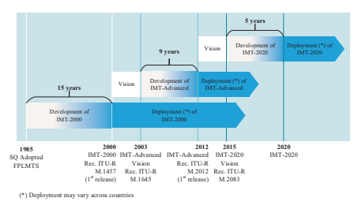 

 网络。 这已成为将世界各地区域欲望融合的重要步骤。 观察到一个ITU- R研究期（3-4岁）
 通常用于此目的。 之后，如果其他无线电服务已经使用了新的IMT频谱，则使用另外1-2个研究期（甚至更多）的研究期来发展技术方面并进行兼容性研究。

 时间计划可能取决于实现愿景的技术的技术复杂性，以及它可能利用的新范围来达到所需的功能。

 对于5G开发，远见研究是从2012年到2015年。在此期间，建立了5G区域促进小组和研究论坛，以收集和汇聚5G愿景的区域兴趣，并且区域性观点有助于ITU- 通过代表行政成员和部门成员。

 从2015年开始，ITU- r开始了5G的技术开发，旨在防止IMT- 2020年（5G）到2020年11月，全球规范。技术开发阶段通常包含最低技术要求和评估指南的排除以及IMT- 2020年提交和评估程序。 最低技术要求保证候选提案可以实现愿景，并可以有效利用频谱（包括潜在的新IMT频谱）。 提交和评估程序DEFNES授予IMT接受标准- 2020提案，邀请外部组织提交IMT的程序- 2020年提案和邀请独立评估小组评估该提案以及ITU- R批准该提案的程序。 遵循ITU- R程序，像3GPP这样的外部组织从2015年开始启动了5G的技术开发，该组织将在Sect中进行审查。 1.2.3。 有关5G时间轴的更详细讨论以及提交和评估程序可以在各节中找到。 1.4。 同时ITU- R还开始了5G部署的潜在新频谱的兼容性研究。 这样的研究由三个部分组成。 第1部分是针对2015年世界广播通信会议（WRC）中分配的新IMT频谱。例如，频率范围为3.3-3.8 GHz和4.5-4.8 GHz
 （通常称为C- 在全球或区域上将频带）识别为IMT光谱。 第2部分用于WRC中潜在的新IMT频谱- 19.例如，24.25–27.5 GHz的频率范围（通常称为毫米波），
 37–43.5 GHz和66-71 GHz等在全球或区域上被鉴定为IMT光谱。 伊图- R继续研究WP 5D中这些频段的兼容性研究的其余问题。 第3部分用于潜在的新IMT频谱，例如6425–7125 MHz，将在WRC上进行讨论- 23. ITU- R已通过要求对可行技术的技术开发来确保这些潜在的新频段的效率使用以及兼容性研究，以确保它们可以与其他无线电服务有效共存，从而开始评估新频谱的工作。

 5G频谱将在各节中更详细地讨论。 3.2.1.1。

##  1.2.2 5G的区域发展/促进

 在ITU之后- R在2012年开始了5G视觉研究，几个区域促进小组和研究论坛在中国，欧洲，韩国，日本和美国成立。 这些区域活动包括对5G要求，用例和部署场景的研究，以及探索关键技术和5G频谱的性质。

 这些活动在本节中进行了简短讨论。

##  1.2.2.1 ** NGMN** 

 下一个- Generation Mobile Networks（NGMN）是与全球领先的运营商和供应商的联盟，旨在扩大通信体验，这将为最终用户带来负担得起的移动宽带服务。 它特别关注5G，同时加速LTE的发展- 高级及其生态系统。

 NGMN出版了 "5G white paper"  [2] 2015年2月，提供了从操作员的角度到5G网络的要求列表。 这些要求表明，对城市地区到农村地区的统一用户体验数据率的需求以及统一的用户体验数据速率。 它还表明，5G网络应该能够提供各种服务，包括传感器网络等大量物品，极端真实- 触觉互联网等时间通信和E超沟通等E- 医疗服务，仅举几例。 这些服务应在各种情况下提供，包括高- 速度列车，移动的热点，飞机等。iTu的ITU设想的5G用例中所述的多样性fts。 1.3。

##  1.2.2.2 ** IMT- 2020（5G）晋升组** 

 2013年2月，IMT- 2020年（5G）晋升集团是由三个部委在中国成立的：工业和信息技术部（MIIT），国家发展与改革委员会以及科学技术部。 它是促进中国5G研发的主要平台。 促销小组由中国领先的运营商，网络设备供应商，研究机构和大学组成。

 IMT- 2020年（5G）促销小组于2014年5月发布了其5G视觉白皮书[3]。白皮书指出了两个重要的5G使用类别：移动宽带和物联网。 移动宽带用例将继续通过5G网络来解决，该网络提供1 Gbps用户- 在许多部署方案中都经历了数据速率。 另一方面，物联网用例是5G网络部署的另一个主要驱动力，它需要一个功能强大的5G网络来提供巨大的连接，非常低的延迟和高可靠性。 这构成了5G用例的FR概述，后来被开发为ITU标识的三个5G使用方案- R.

##  1.2.2.3 ** 欧洲：5G IA** 

 5G基础设施公共私人伙伴关系（5G PPP）是欧洲委员会与欧洲ICT行业之间的共同计划，用于欧洲的5G研究。 这是一项巨大的协作研究计划，其一生为2014年至2020年，正在解决5G的所有主要构件。 然后，其名称被5G取代
 基础设施协会（5GIA）。

 在5G PPP倡议的第一个阶段之前，2012年11月成立了一个重要的5G项目，称为二十一（2020）信息协会（METIS）的移动和无线通信促进器。 2013年4月，梅蒂斯（Metis）发表了有关5G用例，需求和方案的研究（请参阅[4]）。 在这项研究中，梅蒂斯提到了许多新的工业和机器- 除移动宽带应用程序外，还针对5G键入通信。 2015年4月，METIS根据ITU将这些用例汇总为[5]的三类- R开发5G用例。 这三种用例是极端移动宽带（XMBB），大量的机械通信（MMTC）和超元机器- 类型通信
 （UMTC），融合到ITU- r对5G需求和用例的愿景将在各节中讨论。 1.3.1。 第二- 阶段项目始于2017年6月/7月； 这些组织中的许多组织正在积极参与国际标准化和ITU- r进口IMT的过程- 2020。

##  1.2.2.4 ** 韩国：5G论坛** 

 5G论坛由2013年5月由科学，ICT和未来的计划和移动行业创建。5G论坛的成员由移动电信运营商，制造商和学术专业人员组成。 5G论坛的目标是协助制定标准并为其全球化做出贡献。

 5G论坛预见了包括社交网络服务在内的五个核心5G服务； 移动3D成像； 人工智力； 高的- 速度服务； 超高- 排定分辨率功能； 和全息技术。 5G网络将启用此类新服务，并具有强大的功能，可提供超高容量和数据速率。

 TTA 5G技术评估特别项目组（TTA SPG33）在TTA的5G特别技术委员会（5G STC）下，负责评估拟议的候选人IMT- 2020 RIT（S）/SRIT。

##  1.2.2.5 ** 日本：5GMF** 

 第五代移动通信促销论坛（5GMF）于2014年9月在日本成立。 5GMF进行了与5G相关的研发，包括标准化，与相关组织的协调以及其他晋升活动。

 5GMF出版了白皮书 "5G Mobile Communications Systems for 2020 and beyond"  [6] 2016年7月，强调了高数据速率服务的5G用例，自我- 驾驶，位置- 基于基于的服务等。预见，5G网络需要极高的可爱才能达到这些不同要求的要求。

##  1.2.2.6 ** 北美和南美：5G美洲** 

 5G Americas是一个由领先的电信服务提供商和制造商组成的行业贸易组织。 它于2015年继续从以前已知的实体：4G美洲。 该组织旨在在整个生态系统的网络，服务，应用和美洲的无线连接设备中倡导并促进LTE无线技术及其超过5G的进化的进步和全面功能。 5G美洲投资用于发展一个连接的无线社区，同时领导着美洲5G开发。

 5G Americas于2017年11月发布了有关5G服务和用例[7]的白皮书。它提供了一份有关5G技术的有见地的报告，该报告涉及在广泛的用例和商业模型中解决新趋势的新趋势，具有技术要求和映射到5G功能。 这是对5G用例的持续研究，以供将来用途。

##  1.2.2.7 ** 全球5G事件** 

 5G区域发展要求全球协调形成全球适用的独立5G标准。 包括IMT在内的区域5G开发人员- 2020年（5G）PG，5G IA，5G论坛，5GMF，5G Americas和5G巴西，通过建立全球5G活动来分享每个地区的观点和发展状况，以回答此呼吁。 这些事件将有助于与世界5G促销组织在5G上建立全球共识。 这一系列活动一直在努力促进对不同垂直行业和5G生态系统的5G使用，并邀请关键行业参与者，管理和监管机构参与讨论。

 FRST全球5G活动由IMT主持- 2016年5月在北京的2020年PG，该活动每年轮换两次。 最近的活动于7月2日举行- 3，2020在上海上海上海国际会议中心。

##  1.2.3标准开发

 和itu一起- 自2014年以来，标准化组织和标准化组织也将注意力集中在5G上。全球合作伙伴项目3GPP已成为5G开发的关键标准组织。 自3G网络开发以来，它已成为移动细胞标准的全球倡议。 当前的4G LTE移动宽带标准是最成功的移动标准之一，它在全球范围内使用。

 3GPP是一个团结全球电信标准发展组织（SDO）的组织。 这些SDO在3GPP中被称为组织合作伙伴（OPS），目前有七个OPS：来自日本的Arib和TTC，来自美国的ATIS，来自中国的CCSA，来自欧洲的ETSI，来自印度的TSDSI，来自韩国的TTA。 七个操作为成员提供了开发3GPP技术的稳定环境。 OP成员包括主要行业参与者，领先的运营商，供应商，用户终端制造商和芯片组开发人员。

 还包括具有区域影响，学术组织和大学的研究机构。 就移动蜂窝标准而言，它几乎涵盖了几乎所有关键方。 OPS的成员大量参与了技术标准开发，这确保了3GPP技术能够解决不同各方和不同地区的问题和问题。 根据不同OPS的成员的共识，由OPS对3GPP定义的技术规范转移到其区域规范中。 通过这种方式，制定了全球移动标准。 可以说，这是3GPP标准开发成功的重要关键。

 LTE是此共识下的早期例子- 基于发展的精神。 全球和广泛- 范围参与为LTE开发，标准化和实施成功奠定了基础。 由于LTE取得了巨大的成功，3GPP已成为5G的基本标准发展机构。 2014年底，3GPP启动了5G研究和发展，以及5G视觉的逐渐成熟。

 在2015年末至2017年初，当时3GPP处于第14个发行时间范围
 （称为释放- 14），对技术要求和部署方案进行了5G研究。 这些研究旨在实现ITU规定的5G愿景- r在2015年6月。在需求研究之后启动了新无线电（NR）界面的研究。 为NR确定了关键的技术组件
 开发，构成了下一个版本中指定工作的基础（即发布- 15）从2017年初到2018年6月。- 功能3GPP 5G技术，包括NR和LTE，在发行中开发了- 16在2018年初至2020年9月的时间范围内。特别是2020年9月- 召开会议同意，希望支持发布的UE或网络供应商- 16必须使用TS 38.331/ts 36.331 [8]的16.2.0版本或更晚于- 向后兼容的变化。 通过这种分阶段的方法，3GPP将其5G解决方案带到ITU- r作为IMT- 2020年2020年。
 批准了最初版本的IMT- 2020年2月。

##  1.3 ** 用例扩展和要求** 

 蜂窝通信系统是其第一代的重点是连接人类。 1G和2G通信系统提供了人之间无处不在的语音服务，这使我们能够在家，OFFCE或移动时与朋友自由交谈。 从3G到4G，支持多媒体和其他移动宽带应用程序，我们能够做更多的事情，例如浏览网络，与我们的朋友分享漂亮的图片，在短片上聊天等。 但是，对于5G，对用例的研究揭示了一些新需求，这些需求超出了移动宽带（MBB），主要旨在连接人类和机器。 本节对5G用例，要求和关键功能进行了审查。

##  1.3.1 5G使用案例和服务要求

 设想5G沟通可以使2020年及以后的完整联系世界。 这种完整的连通性不仅用于人民的交流，而且还可以使机器的交流以及可以为提高社会运营效率带来更多价值的事物的交流，并促进我们的日常生活。 根据这个构想，5G用例从移动宽带扩展
 （MBB）到物联网（IoT）。

##  1.3.1.1 ** 扩展用法方案：从EMBB到IoT（MMTC**  和urllc）

 伊图- r通过建议ITU于2015年建立5G愿景- R M.2083 [1]，表明5G将其使用情况从增强的移动宽带（EMBB）扩展到大型机器- 类型通信（MMTC）和超元素和低- 延迟通信（URLLC）。 MMTC和URLLC服务是物联网（IoT）服务的子集。 它们被认为是5G网络进入以关键服务要求为特征的广泛物联网服务的第一步。 因此，5G将是一个frst- 针对将无线连接扩展到人类以外的无线连接的一代- 到- 人际关系。

 5G从EMBB扩展到MMTC和URLLC来自用户和应用程序趋势的观察和需求。 一方面，高数据速率视频流到人们（例如，视频流下载）和云服务器（例如，用户与朋友共享他们的录像），并且是瞬时而低的- 延迟连接对于包括增强现实（AR）和虚拟现实（VR）的用户体验非常重要。 需求量如此之高的用户密度也会增加，尤其是在城市地区，而在农村和/或高- 机动案例，令人满意的结局- 用户也需要用户体验。 因此，具有挑战性的人- 用户高数据速率请求与高用户密度相结合，用户移动性成为5G开发的驱动力，该力量可以明显增强移动宽带服务的功能。

 另一方面，将来，连接连接的任何对象都将被部分或主要的无线技术连接。 这种趋势对在广泛的应用中连接对象/机器/事物的连接需求构成了很大的连接需求。 例如，无人驾驶汽车，增强的移动云服务，真实- 时间贩运控制优化，紧急和灾难响应，智能电网，E- 预计将通过无线技术/连接来启用或改进健康或效率工业通信，仅命名几个[1]。 通过对这些应用程序进行更深入的观察，一个服务的两个主要特征可以：一个是所需的连接数，另一个是给定延迟预算内的请求的可靠性。 这两个显着特征提供了MMTC和URLLC的性质。

 因此，5G将自己放在目标上，以支持包括EMBB，MMTC和URLLC在内的各种用法方案和应用程序。 以下是从三种用法方案所指示的内容，来自[1]：- *增强的移动宽带*：移动宽带解决人类- 以访问多媒体内容，服务和数据访问的中心用例。 对移动宽带的需求将继续增加，从而增加移动宽带。 增强的移动宽带使用情况方案除现有的移动宽带应用程序外，还将带有新的应用领域和要求，以提高性能和越来越无缝的用户体验。 这种使用情况涵盖了一系列情况，包括具有不同要求的广泛覆盖范围和热点。 对于热点案例，即，对于用户密度高的区域，需要很高的运输能力，而对移动性的需求较低，用户数据速率高于较大面积覆盖率。 对于广泛的覆盖范围，需要提供无缝的覆盖范围和中等至高的移动性，与现有数据速率相比，用户数据速率得到了巨大提高。 但是，与热点相比，数据速率要求可能会放松。

-  *超级和低延迟通信*：此用例对诸如吞吐量，延迟和可用性等功能有严格的要求。 一些示例包括对工业制造或生产过程的无线控制，远程医疗手术，智能电网中的分配自动化，运输安全等等。

-  *大型机器- 类型通信*：此用例的特征是大量连接的设备通常会传输相对较低的非数量- 延迟- 敏感数据。 设备必须低成本，并且电池寿命应该很长。 预计还会出现其他用例，目前尚未预见。

 对于将来的IMT，适应具有广泛要求的新用例，将是必要的。

 在下文中，我们将对设想为5G用例的各种服务进行调查，然后调查服务要求。 然后，通过将类似的服务要求分组到一个特征的技术要求来提取技术性能要求。 技术要求的重要性将根据规格使用方案下的服务组映射到不同的使用方案。

##  1.3.1.2 ** 在5G使用方案中对各种服务的调查**  以及各种要求

 预计2020年及以后的新兴服务将出现在5G研究的范围下。 通常，根据上一节中阐明的三种用法方案，将这些5G服务分为三组。

##  EMBB服务

 移动宽带服务，例如Web浏览，具有文本消息传递的社交应用程序，传递共享和音乐下载，已经非常受欢迎，并且受到4G通信系统的支持。 将来，预计较高的数据速率服务等超高- 排泄物（UHD）视频，3D视频以及增强现实和虚拟现实将主导人类- 到- 人类沟通要求。 除了上述下行链路高数据速率服务外，上行链路高数据速率服务的需求还会出现，例如，用户的高清视频共享。 这些服务需求Defne New Horizo​​n限制了EMBB开发以及随时随地的体验要求。

##  UHD/3D视频流

 4 K/8 K UHD视频流最多需要300 mbit/s经验丰富的数据速率。 表从3GPP中进行的增强移动宽带的技术推动器[9]中，表1.1列出了所需的4 K和8 K UHD视频的数据速率。

##  视频共享

 随着社交应用程序的普及，从用户到云的视频共享变得流行。 可以假定完整的高清（1080p）视频，并且在2020年及以后期望可以预期4 K/8 K UHD视频共享。 所需的4 K和8 K UHD视频的数据速率与表1.1中列出的数据相同。 表1.2中给出了1080p和720p视频所需的数据速率[10]。

##  AR/VR交付给用户

 增强现实（AR）和虚拟现实是为EMBB用户带来新的新体验的应用程序。 增强现实为用户提供了真实的互动体验- 世界环境与 "augmented"  计算机图形生成的视图。 虚拟现实（VR）提供了另一种交互式体验，该体验是由计算机图形创建的沉浸式环境，与物理现实相比，这可能是梦幻般的或戏剧性的。 AR和VR都需要非常高的数据速率和低延迟才能传递计算机- 最终用户生成的图形和多媒体内容具有保证和流畅的体验。

| 表1.1| UHD视频所需的数据速率|||||
|-------------|-----------------------------------|-------------------|----------|----------------|--------------|
| 视频| 视频| 帧速率（框架| 编码| 质量| 必需的|
| 类型| 解决| 每秒，fps）| 方案| 要求| 数据速率|
| 4 k| 3840×2160| 50| HEVC| 中等质量| 20–30 mbit/s|
| UHD 4 K| 3840×2160| 50| HEVC| 高质量| 〜75 mbit/s|
| UHD 4 K| 3840×2160| 50| AVC| 高质量| 〜150 mbit/s|
| UHD 8 K| 7680×4320| 50| HEVC| 高质量| 〜300 mbit/s|
| UHD||||||

| 视频类型| 视频分辨率| 帧速率（FPS）| 编码方案| 所需的数据速率|
|--------------|--------------------|--------------------|-------------------|----------------------|
| 720p| 1280×720| 60| H.264| 3.8 mbit/s|
| 1080p| 1920×1080| 40| H.264| 4.5 mbit/s|
| 1080p| 1920×1080| 60| H.264| 6.8 mbit/s|

 所需的数据速率和圆- 表1.3列出了VR应用程序的跳闸延迟（请参阅[11]）。

 通常，从上面的示例中可以看出，与当今的要求相比，将来的EMBB服务将需要非常高的数据速率。 此外，对于AR/VR，延迟需求变得越来越重要。 因此，高数据速率和低潜伏期将成为5G EMBB服务的主导地位。

##  MMTC服务

 庞大的机器- 类型通信（MMTC）是指通常使用大量传感器向云或中央数据中心报告传感器数据的一组新兴服务，以做出明智的决策和/或减少人为收集这些数据的人类工作量。

 在研究3GPP进行大规模物联网的技术推动者的研究中（见[12]），研究了各种服务。 在这里，我们只是提到其中一些。

 例如，电动公司为公寓大楼内的每个公寓部署了大量的智能电表，而智能电表会定期向公司报告用电。

 另一个例子是沿街道或街角安装的录像机数量。 摄像头记录了连续的视频，并将内容存储一段时间。 该设备定期将状态更新发送给流量警察，以指示运输方式如何移动。 当事故发生在交叉路口时，设备开始发送高度发送- 质量视频给贩运警察事故并随之而来的贩运人交通拥堵。

| 圆形的| 行程延迟| 30 ms（2d）20 ms（3d）完整视图：75 Mbps（2d）120 Mbps（3D）| 10毫秒| 20毫秒满| 查看：630 Mbps|
|-----------------------------------------------------------------------------------|-----------------------------------------------------------------------------------|-------------------------------------------------------------------------------------|----------------------|---------------------|-------------------|
| FOV：340 Mbps| 10毫秒满| 查看：4.4 Gbpps||||
| FOV：2.34 Gbps||||||
| 5 ms| 5 ms|||||
| 需要瞬时数据| 速度|||||
| 颜色深度| 120 Mbps（2d）200 Mbps（3D）| 3.36 Gbps||||
| 现场| 查看（FOV）：40 Mbps（2d）63 Mbps（3D）| 1.4 Gbps||||
| 10| 12|||||
| 8||||||
| 编码方案||||||
| 框架| 比率（FPS）单- 眼睛分辨率| H.265| H.265| H.266||
| 120| 120 7680×7680 [| 视角120°]| 200|||
| 30 1920×1920 [| 110o的视角| 90| 60 3840×3840 [| 视角120°]||
| 满的- 查看8 K 2D/3D视频（完整- 框架分辨率7680×3840）弱相互作用| 满的- 查看12 K 3D视频（完整- 框架分辨率11,520×5760）弱互动| 满的- 查看24 K 3D视频（完整- 框架分辨率23,040×11,520）弱互动||||
| 视频分辨率||||||
| 表1.3所需的VR数据速率| VR级别| 强烈的相互作用| 强烈的相互作用| 强烈的相互作用||
| 入口- 级别VR| 高级VR| 终极VR||||

 农用机械越来越自动化。 农用机械可以报告各种传感器数据，例如土壤状况和作物生长，因此农民可以远程监测农场状况和控制机械。

 还有其他示例与上述应用具有非常相似的范例。 共同的服务要求可以总结如下：
-  这些服务通常需要大量的传感器。 如果我们进一步考虑网络需要提供与多种类型的传感器或传感器应用程序的连接，那么该金额将很快变得非常大。 从这个意义上讲，可以想象2020年及以后的每平方米可能有1个传感器。 例如，如果一间公寓的大小为80平方米，在一个公寓楼中，我们有十个泡沫，那么如果一个公寓有八个传感器（例如，用于用水，用水，室内空气质量监控的各种智能电表， 温度监测等），我们将在公寓楼有80个传感器。 它表示每平方米1个传感器。

-  这些服务有一系列数据率请求； 但是，最近的应用可能会因小型数据包大小而占主导地位。 例如，智能计量报告通常少量数据。2农场机械还一次报告少量数据。 在视频记录器应用程序中，尽管发生事故时需要传输视频，但在每日情况下，小数据占主导地位。

-  设备电池寿命对于这些应用的经济成功至关重要。

 否则，将需要经常重新安装传感器。 考虑到大量的传感器部署，这种恢复可能非常昂贵。 在[13]中，需要设备电池寿命超过10年。

-  在此用例中，覆盖范围非常重要。 需要将连接服务提供给在深层覆盖环境中部署的传感器，例如地下室。 因此，重要的是要确保网络可以到达此类传感器。 总之，在指定服务质量（例如，数据速率），电池寿命和传感器的覆盖范围能力下，MMTC应用程序的服务要求主要依赖于连接密度（每个统一区域的设备数）。 上述要求可能有不同的指定值。 然而，预计将视为MMTC的主要服务要求，高连接密度，较长的电池寿命和深层覆盖能力。

##  URLLC服务

 超级且低- 延迟通信（URLLC）是对延迟和数据包丢失非常敏感的新兴服务组。 在[1]中，给出了一些示例，其中包括对工业制造或生产过程的无线控制，远程医疗手术，智能电网中的分配自动化，运输安全等。 3GPP（见[14]），提到了类似的示例，对服务应用程序进行了更详细的描述，并设想了应用程序方案。

 在[14]中，总结了此类应用程序的服务要求。 如其名称所示 "URLLC,"  主要要求是低潜伏期和超元性。 他们需要同时实现。 也就是说，对于传输数据包，应在给定的持续时间内确保高可靠性（非常低的数据丢失）。

##  1.3.1.3 ** 支持要求和运营要求**  启用5G服务部署

 服务需求是从单个用户或设备的角度来看，它与部署环境无关。 但是，从系统设计的角度来看，网络如何尽可能保证需要支持的服务，尤其是在成本上- 有效的方式。 因此，除了从服务的角度提出的服务要求外，还需要确定相关的支持和操作要求，以确保从系统设计和操作的角度来保证一定水平的服务支持。

##  卷

 对于EMBB服务，需要在多大程度上支持高数据速率。 从系统的角度来看，在给定环境中有多个用户。 如果假定这些用户同时发生了指定服务类型的数据传输，那么考虑区域贩运量的要求以及Defne a是很简单的 "cell edge"  用户- 经验丰富的数据速率要求使大多数用户可以实现此服务所需的数据速率。

 为此，地区贩运能力和边缘用户- 经验丰富的数据速率要求是针对的。

##  边缘用户- 经验丰富的数据速率

 边缘用户（例如，ffth百分位数）- 对经验丰富的数据率进行了建议，以确保大多数用户（例如，至少95％的用户）可以超过指定用户数据速率。 在NGMN白皮书[2]中，边缘用户- 表1.4给出了经验丰富的数据速率要求。 通过回顾EMBB中不同的服务要求，可以看到，有了这样的要求，预计UHD视频将在密集的城市环境中得到很好的支持，并且 "ultimate"  预计AR/VR将在室内得到很好的支持。 对于拥挤的环境以及农村和高处- 速度车辆环境，1080p和720p视频预计将得到很好的支持。

| 表1.4| 边缘用户- NGMN白皮书用户中经验丰富的数据率要求- 有经验的|||
|-------------------------|------------------------------------------------------------------------------------|--------------|------------------|
| 环境| 用例类别| 数据速率| 机动性|
| 茂密的城市| 密集的宽带访问| DL：300 Mbps| 一经请求，|
| 区域| UL：50 Mbps| 0–100 km/h||
| 室内的| 室内超高| DL：1 Gbps| 行人|
| 宽带访问| UL：500 Mbps|||
| 拥挤的环境| 宽带访问| DL：25 Mbps| 行人|
| （例如，体育场）| 人群| UL：50 Mbps||
| 乡村的| 到处都是50多Mbps| DL：50 Mbps| 0–120 km/h|
| UL：25 Mbps||||
| 高的- 快速车辆| 移动宽带| DL：50 Mbps| 按需|
| 车辆（汽车，火车）| UL：25 Mbps| 500 km/h||

 还指出，迁移率是为支持指定用户的支持- 经验丰富的数据速率要求。 这是从动机中，在旅途中也需要得到很好的支持。

##  面积贩运能力

 面积贩运的容量是给定区域中总流量的数量。 流量的总量与具有指定服务要求的同时用户数量有关。 它提供了具有保证的平均用户数据速率的支持用户数量的功能要求。

 例如，对于室内环境，如果我们假设每1000 m2的20用户同时传输数据所需的数据速率为500 Mbps，则面积运输容量的要求为20×500 Mbps/1000 m2 = 10 Mbps/m2。

 另一个观点是从贩运量增加的数量预测。 据预测，与2010年代相比，在2020年及以后的一年中，总流量额将增加100倍，达到1000倍。 在这种情况下，通过调查2010年代的运输量，并应用时间预测的增加，可以在5G时间范围内得出面积的运输能力需求。 除了从系统的角度支持成功部署EMBB服务的要求外，还为提高资源利用率以降低成本的运营要求还有其他建议。

##  光谱效率

 与有线通信不同，无线电频谱是一种稀缺的资源。 因此，自3G时代以来，光谱效率对于EMBB服务至关重要。

 对于5G，预计要求的数据速率显着提高。 预计面积的贩运容量将至少增加100倍。 这意味着在给定的区域中，数据率的总量将至少提高100倍。 数据速率的总量由平均频谱效率（每个基站BPS/Hz）乘以可用的系统带宽（Hz）和该区域的基站数量。 如果我们假设给定区域内的基站部署可以增加三倍，并且可用的带宽可以增加十倍，那么平均频谱效率应提高至少三倍。

 除了平均光谱效率外，行业还渴望提高边缘用户光谱效率。 在这里，我们注意到这是一个 * desideratum *，并留下了在Chap中讨论的定量要求。 10。

##  能源效率

 能源效率是通过认识到能够提供100倍网络面积容量而增加能源消耗的100倍的能力来动机。 实际上，网络消耗的增加应非常有限，例如，请参见[15]中的分析。

 据特定据说，目前无线电访问网络基础架构消耗了全球能源消耗的0.5％[16]，这已经是相当大的一部分。 为了避免5G网络成为全球能源生产的主要消费者，有理由限制5G无线电访问网络的能源消耗的增加，因此与今天相比，其能耗比率低于或至少在同一水平 。 也就是说，无线电访问的能源消耗需要遵循全球能源消耗的速度增加，甚至较慢。

 基于图1.​​3中[17]的[17]的数据，人们可以看到，在1990年至2013年之间，全球能源消耗的复合年增长率约为1.91％，表明十年来增加了1.2倍。 因此，可以预测，与2010年相比，在2020年，与2010年相比，全球能源消耗的功耗将不超过20％。与2010年的4G网络相比，2020年5G网络的功耗应不超过1.2倍。

 这意味着，如果面积运输的容量增加了100倍，并且假设能够有限或没有能源消耗，则网络能量效率为每焦点（或每瓦特的位/s）衡量，需要提高大约100倍 。

  

 能源效率对于MMTC和URLLC作为操作要求也很重要。 但是，就此要求而言，欧洲可能会成为一项紧迫的紧迫性。

##  MMTC

 对于MMTC，面积运输能力也可以用作系统设计的要求之一。 但是，如果当前的重点放在小型数据包传输上，则需求将非常宽松。 但是，对于具有较大设备数据速率要求的服务（例如，视频记录器应用程序），除了服务要求之外，区域贩运容量将变得很重要。

##  URLLC的可用性

 为了确保该区域内不同区域的用户达到服务要求（低延迟和超高可靠性），在[2]中对可用性进行了建议，如下所示：网络可用于在95％的网络中的目标通信 部署和100％的时间。 在95％的位置中，在1 ms延迟中达到了URLLC服务要求。 这是用于URLLC应用程序系统设计的非常严格的目标。

##  一般的

 除上述要求外，网络的覆盖能力是网络运营成本的关键。

##  覆盖范围

 覆盖范围被认为是无线电接入点的最大地理范围，以提供一定的服务质量（QoS）。 对于不同的QoS级别，网络的覆盖范围将有所不同。 例如，与100 kbps相比，上行链路覆盖范围的数据速率为1 Mbps将更具挑战性。 覆盖范围也与位点密度高度相关。 如果某个QoS的覆盖范围很小，则操作员需要部署大量密集的网络来提供所需的QoS。 例如，在EMBB中，如果提供10 Mbps的UL数据速率的覆盖范围为50 m，则- 位点距离（ISD）几乎不大于100 m。 在这种情况下，所需的站点数量将是巨大的，导致不可接受的成本。 从这个意义上讲，覆盖能力对于EMBB，URLLC和MMTC使用方案至关重要。

##  1.3.2 5G关键功能和技术性能要求

 5G服务构成了5G密钥功能和相关技术要求的排除的坚实基础。 在ITU中- R，为5G的关键功能与5G设想的用法方案一起进行了定义。 技术性能要求是根据5G视觉和关键功能进行定义的。

##  1.3.2.1 ** 5G的关键功能** 

 5G的关键功能（也称为IMT- 2020年在ITU中- R上下文）如图1.4所示（请参见[1]）。 图1.4（a）证明了5G密钥功能的目标以及相比4G（也称为IMT）- 先进的）。

 图1.4（b）在三种用法方案中给出了每个密钥功能的重要性。 在下文中，讨论了每种用法方案的关键功能。

##  卷

 在ITU中- R，用户- 经验丰富的数据率和面积运输能力被确定为

  

 与EMBB最相关的关键功能的一部分。 如前一节所述，这两个功能保证了Sectifc Embb服务的系统支持，可以成功地传递给大多数用户，并在系统中使用给定数量的用户。

##  用户- 经验丰富的数据速率

 用户- 经验丰富的数据速率被认为是可实现的数据速率，该数据速率可在整个覆盖区域中普遍存在移动用户/设备（以Mbps为单位）。 期限 "ubiquitous"  与所考虑的目标覆盖范围有关，无意与整个地区或国家 /地区相关[1]。 可以看出十次用户- 与4G相比，经验丰富的数据速率。 还可以看出，在密集的城市区域中指示了100 Mbps Edge userexperience的数据速率（图1.4）。

 尽管目标功能比NGMN的要求低一些，但它仍然可以保证大多数用户都会体验出良好的UHD视频，并且具有部分AR/VR功能。 毫无疑问，这种功能远远超出了1080p和720p视频的服务需求。

##  面积贩运能力

 区域贩运的容量被认为[1]是每个地理区域的总流量吞吐量（以Mbps/m2为单位）。

 在高用户密度方案中，例如室内，面积贩运容量预计为10 Mbps/m2。 这意味着，如果我们假设每1000 m2同时传输数据，则可以支持500 Mbps的服务率。

 与4G相比，该能力显示出100倍的提高。 这是用户十次的结果- 经验丰富的数据率提高以及连接密度能力的十倍。

##  机动性

 移动性是一个重要的功能，可以支持高数据速率传输高。- 快速车辆。

 它被认为是可以实现可能属于不同层和/或无线电访问技术（多层/ -  rat）的无线电节点之间的DEF QoS和无缝传递的最大速度（以km/h）[1]。

 高达500 km/h的能力应得到支持。 该移动性类是4G的1.4次（其中最多为350 km/h的移动性类别）。

##  峰值数据速率

 峰值数据速率被认为是在每个用户/设备（在GBPS中）的理想条件下的最大可实现数据速率[1]。 它表明设备数据速率的最大功能。 可以看出，预计有10-20 Gbps。 这意味着在理想条件下的设备可以支持AR/VR应用。 除上述功能外，有助于降低运营成本的效率功能被确定为5G的关键功能。 能源效率网络能量效率被认为是使经济学能够5G的关键能力之一。

 能量效率有两个方面[1]：- 在网络方面，能量效率是指从用户传输到/接收到的信息位，无线电访问网络（ran）的每单位（以位折/joule）
-  在设备侧，能量效率是指通信模块的每单位能量消耗的信息数量（位于位/joule）
 对于网络能源效率，要求能源消耗不应大于今天部署的无线电访问网络，同时提供增强的功能。 因此，如果面积运输的容量增加了100倍，则应通过类似的因素提高网络能量效率。

##  光谱效率

 光谱效率包括两个方面。 平均频谱效率被认为是单位频谱资源的平均数据吞吐量和每个发射点（BPS/HZ/TRXP）。 边缘用户光谱效率被认为是每单位频谱资源（BPS/Hz）的FFTH百分位用户数据吞吐量。

 如教派中所讨论的。 1.3.1.3，平均频谱效率提高的要求与所需的面积贩运能力增加有关。 伊图- R Defnes的100倍提高面积运输能力。 在这种情况下，数据率的总量将至少提高100倍。 数据速率总量由平均频谱效率（BPS/Hz/TRXP）乘以可用的系统带宽（Hz）和发射的数量- 在该区域接收点（TRXP）。 如果我们假设给定区域内的TRXP部署可以增加三倍，并且可用的带宽可以增加十倍，那么平均频谱效率应提高至少三倍。

 对于边缘用户光谱效率，改进的要求与受支持的边缘用户有关- 经验丰富的数据速率，一个TRXP以下的用户数量以及可用的带宽。 如果我们假设该区域内的连接密度增加了十倍（请参见下文 "connection density"  功能）虽然该区域内的TRXP数量可以增加三倍，但一个TRXP中的用户数量将增加三倍。 另一方面，可以假设一个TRXP中的可用带宽增加了十倍。

 这意味着对于单个用户，可用的带宽增加了10/3 = 3.3次。 在这种情况下，要考虑十倍边缘用户的支持- 经验丰富的数据速率（请参见上文 "user-experienced data rate"  功能），边缘用户光谱效率应提高3次。

##  MMTC

 对于MMTC使用方案，连接密度和能量效率被认为是两个最相关的关键功能。 除了关键功能外，MMTC的5G网络还可以将操作寿命视为所需的功能。 这些功能现在将在Ordinem中进行 *。 * *

##  连接密度

 连接密度是每个单位区域的连接和/或可访问设备的总数（每个km2）[1]。 对于MMTC使用方案，由于需要在2020年及以后连接大量设备的需求，预计连接密度将达到1000,000个设备。 与4G相比，这是十倍改善（IMT）- 先进的）。

##  网络能源效率

 网络能源效率也被确定为MMTC的重要关键功能之一。 这是因为为MMTC设备提供的大量覆盖范围不应以明显增加能源消耗为代价。

##  运营寿命

 运营寿命是指每个存储能源容量的操作时间。 这对于机器尤其重要- 由于身体或经济原因，需要很长的电池寿命（例如，超过10年）的类型设备（例如，超过10年）很难进行[1]。

##  urllc

 如前几节所述，延迟，移动性和可靠性被确定为URLLC的两个最相关的关键功能。

##  潜伏

 在[1]中，突出显示了用户平面延迟。 它被定义为无线电网络的贡献，即从源将数据包发送到目标接收到的时间（在MS中）的时间。

 需要1 ms延迟。 在技​​术绩效要求中进一步确定了可靠性，将在以下各节中进行讨论。

 移动性移动性与URLLC使用方案有关，因为运输安全应用程序等通常在高度- 快速移动性。

 除上述关键功能外，还可以将可靠性和弹性确定为5G网络的所需功能。

##  可靠性

 可靠性与提供具有很高可用性的给定服务的能力有关[1]。

##  弹力

 弹性是网络在自然或人之后继续正确运行的能力- 引起干扰，例如电源的损失[1]。 其他功能在[1]中还为5G的其他功能进行了建议。 频谱和带宽的柔韧性频谱和带宽功能性是指系统设计的功能，以处理不同的场景，尤其是在不同频率范围内运行的能力，包括较高的频率和较大的通道带宽。

##  安全和隐私

 安全性和隐私是指几个领域，例如对用户数据和信号的加密和完整性保护以及结束- 用户隐私防止未经授权的用户跟踪，并保护网络免受黑客攻击，欺诈，拒绝服务，人- 在- 这- 中间攻击等

 上述功能表明，将进一步增强5G频谱和带宽功能以及安全性和隐私性。

##  1.3.2.2 ** 5G的技术性能要求** 

 基于关键功能和IMT- [1]中提出的2020愿景，报告中提出了技术绩效要求ITU- R M.2410（见[18]）。

 表1.5、1.6和1.7总结了技术性能要求。 技术绩效要求的详细排列可以在[18]中找到。

 达到ITU规定的5G视觉- R，3GP​​P进一步研究了部署方案以及与3GPP TR 38.913中记录的三种用法方案相关的相关要求（见[13]）。 这些要求通常高于ITU的技术性能要求，表明3GPP提供比ITU更高的功能的野心。 3GPP的详细描述
 要求超出了本书的范围。 鼓励感兴趣的读者咨询[13]。

##  1.3.3关于5G要求的摘要

 从前面部分的分析中可以看出，5G有不同的要求。 为了浏览用法方案，边缘用户- 经验丰富的数据率应该

| 表1.5| EMBB技术绩效要求| 与IMT进行比较- 高级要求||
|--------------------------------------------------------------------------------------------------|-------------------------------------------|--------------------------------------------|------------------------------------------|
| 峰值数据速率| 20 gbit/s| 10 Gbit/s| 〜6×LTE- a（释放- 10）|
| 峰光谱效率| 30位/s/hz| 15位/s/hz| 2×IMT- 先进的|
| 用户- 经验丰富的数据率（FFTH％用户数据率）技术性能要求| DL| Ul||
| 100 mbit/s| 50 mbit/s|-||
| 第五百分点用户光谱| 〜3x| 〜3x| 〜3×IMT- 先进的|
| 效率| IMT- 先进的| IMT- 先进的||
| 平均光谱效率| 〜3x| 〜3x| 〜3×IMT- 先进的|
| IMT- 先进的| IMT- 先进的|||
| 面积贩运能力| 10 mbit/s/m2|-|-|
| 能源效率| 高睡眠比和长时间的睡眠|-||
| 低负荷下的持续时间||||
| 带有贩运渠道链接数据速率的移动性类别-| 高达500 km/h，| 1.4×移动性课程||
| 使用0.45位/s/hz| 1.8×移动链接数据速率|||
| 用户平面延迟| 4 ms| 4 ms| 与IMT相比，> 2×减少- 先进的|
| 控制平面潜伏期| 20毫秒| 20毫秒| 与IMT相比，> 5倍降低- 先进的|
| 移动性中断时间| 0| 0| 减少了很多|

 增强以交付高- 最终用户的任何地方和任何时间都有优质的视频，

| 表1.6| URLLC技术绩效要求|||
|----------------------------|--------------------------------------------|----------------|------------------------------------------|
| 技术性能| 与IMT进行比较- 先进的|||
| 要求| DL| Ul| 要求|
| 用户平面延迟| 1 ms| 1 ms| 与IMT相比，> 10倍降低- 先进的|
| 控制平面潜伏期| 20毫秒| 20毫秒| 与IMT相比，> 5倍降低- 先进的|
| 移动性中断时间| 0| 0| 减少了很多|
| 可靠性| 99.999％| 99.999％|-|
| 1 ms| 1 ms|||

 表1.7 MMTC技术性能要求

| 技术性能| 与IMT进行比较- 先进的|||
|-------------------------|------------------------------|--------------------|-------------|
| 要求| DL| Ul| 要求|
| 连接密度|-| 1,000,000个设备/|-|
| KM2||||

 在高移动性类别下，还应进行高数据速率传输。 需要将面积的容量提高100次或更多，以使更多的用户能够享受高数据速率服务。 还发现延迟对EMBB的重要性越来越重要：例如，在AR/VR应用中。 上述性能要求需要以实惠的方式提供，这又需要至少提高三倍的光谱效率，并且能量效率显着提高。 请注意，并非所有这些要求都是EMBB服务所独有的； 例如，对于提供MMTC和URLLC服务的网络也需要能源效率。

 对于MMTC使用方案，应支持每千千万个设备的连接密度为1,000,000个设备，以启用具有可变数据速率的大量传感器的MMTC服务。 需要长时间的电池寿命和深层覆盖范围。

 对于URLLC使用方案，需要低潜伏期和高可靠性。

 高可用性也应从长时间的目标- 术语观点进一步确保网络覆盖范围内的大多数位置都能够达到URLLC服务要求。

 在提供款项，URLLC和MMTC服务时，覆盖范围是一项基本要求，因为否则该站点部署将变得非常密集。 在密度和网络成本之间需要达到平衡，以使系统设计在经济上可行。

 还需要其他要求，包括隐私和安全性增强，这使得5G成为更安全的网络。 这一点至关重要，特别是考虑到5G目标可以连接一切。

##  1.4 ** 标准组织和5G活动** 

 5G开发是一个巨大的过程，需要从行业，SDO和管理部门获得广泛的支持。 从教派中可以看出。 1.2，不同地区显示了他们对5G开发和应用的看法。 因此，对于效率5G的发展，需要全球努力来从技术的角度和频谱角度来协调区域概念，以开发适用于5G潜在频段的独立的5G技术。

 为了实现这一目标，以下组织在5G标准化和发展中起着至关重要的作用。 伊图- R，作为识别资格5G技术的领先组织（称为IMT）- 2020年在ITU中- r上下文）用于效率频谱使用，为IMT制定严格的程序- 2020年提交和评估。 这些程序向所有技术标准开发组织开放，它们保证所提出的技术可以满足适用于5G部署的一组要求，并能够达到2020年及以后的设想网络系统的愿景。 另一方面，3GPP作为一个非常活跃的技术伙伴关系项目，成为SDOS 5G开发的基本标准发展组织。 本节讨论IMT的ITU程序- 2020年提交和3GPP开发ITU- r提交。

##  1.4.1 ITU- r IMT的过程/过程- 2020年提交

 伊图- R是IMT的领先组织- 2020年开发。 伊图- R的角色是确定IMT- 2020年（5G）的愿景将作为2020年及以后5G开发的总体目标，并邀请技术标准开发组织提交能够实现IMT的候选技术- 2020 Vision。 允许将资格的技术提案部署在获得运营商许可的IMT乐队上。

 伊图- R工作组5D（WP 5D），这是ITU的负责工作团- R用于IMT系统开发，制定了图1.5中上述过程的总体时间计划。

 通常，有三个阶段可以开发IMT- 2020年：

##  阶段1：IMT- 2020 Vision Development（2012–2015）。

 从2012年7月到2015年6月，ITU- R WP 5D开发了IMT- 2020 Vision
 （建议伊图- R M.2083）DEFNE IMT框架- 2020年。与此同时，对高于6 GHz的技术趋势和IMT可行性进行了研究，以准备5G开发。

 阶段2：IMT- 2020技术绩效和评估标准开发
 （2015- 2017年）。

 IMT之后- 开发了2020 Vision，WP 5D开始了IMT的排列- 2020年的要求。要求包括三个方面：技术绩效要求，服务要求和频谱要求。 这些要求用于评估候选建议是否是有资格的技术建议，有可能将其包括在内- 2020年全球部署标准。 同时，ITU开发了评估标准和方法- r评估候选提案是否达到了指定要求。 也开发了提交模板，以便可以在支持者之间使用独立的提交格式，这有助于简化ITU的工作- 评估收到的候选技术时，R和独立评估组。 在2017年，ITU- r发表了三个与上述方面有关的报告：- 报告ITU- R M.2411： * IMT开发的要求，评估标准和提交 *模板- 2020年，为IMT提供了- 2020年要求，评估标准和提交模板。 在报告中详细介绍了技术绩效要求- R M.2410。 报告中详细介绍了评估标准和方法- R M.2412。

-  报告ITU- R M.2410： *与IMT技术性能有关的最低要求- 2020 Radio界面*，Defnes IMT的13个技术性能要求- 2020年开发。

-  报告ITU- R M.2412： *评估无线电接口技术的指南- 2020年，*为技术性能要求提供了测试环境，评估方法和详细评估参数。 关于如何进行这些测试环境，方法和参数的评估标准，以及如何确定满足要求，以足够的细节进行了定义。

-  除上述三个重要报告外，还记录IMT- 2020/02（修订1）[19]
 进一步提出接受进入IMT的建议的标准- 2020评估-

 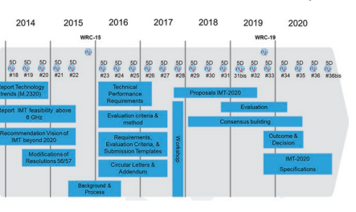 

  

 ATION程序和接受要批准为IMT的建议的标准- 2020年。目前要求拟议的无线电接口技术应符合至少两个EMBB测试环境的要求，而一个URLLC或一个MMTC测试环境被认为是接受接受IMT的要求- 2020评估过程（见下文）。 此外，要求应满足EMBB，urllc，ulllc中的所有测试环境的要求
 和MMTC被认为被批准为IMT- 2020.通过这种方式，开发人员有机会进入IMT- 2020年IMT开始时的开发过程- 2020年提交阶段，并进一步发展以实现IMT的完整愿景- 2020年批准。

##  阶段3：IMT- 2020年提交，评估和规范开发（2016- 2020年）。

 2016年2月，ITU- r发出了邀请IMT提交的通函- 2020年ITU成员和外部组织中的技术。 这封信不断宣布评估和提交程序是初始化的。 该过程包括从2017年到2020年的几个步骤。如图1.5所示，通常有三个阶段：- "Submission phase"  （看 "Proposals IMT-2020"  在图1.5）中：在此阶段，支持者可以提出IMT- 2020年候选技术。 自己- 支持者将需要提供评估，以证明其提议的技术可以通过ITU要求的最低要求集- R.

-  "Evaluation phase"  ：在此阶段，邀请独立评估组评估资格候选技术。 评估组的评估报告将由WP 5D进行审查，以确定哪些候选者根据预定标准通过了所需的最低要求集。 这些技术将进入指定阶段。

-  "Specifcation phase"  ：在此阶段，将在ITU的建议中指定和捕获资格技术- 全球IMT的R- 2020标准。 IMT捕获的技术- 2020年的标准将能够部署在获得运营商许可的IMT频段上。

-  在整个程序中都带来了共识建设，以实现统一的IMT- 2020技术。

 详细过程在文档IMT中给出- 2020/02（Rev. 2）[19]。

 基于ITU的指导- IMT的R程序- 2020年提交，技术标准开发组织可以将其候选技术提交给ITU- r和itu- R将邀请独立评估小组对所有能够召开IMT的收到的候选人进行独立评估- 2020年要求。 3GPP作为技术标准合作伙伴项目之一，已为IMT做出了这样的努力- 2020年提交。

##  1.4.2 3GPP向ITU开发- r提交

 3GPP是一个在3G开发时代成立的合作伙伴项目，其目标是为无线蜂窝系统开发全球协调的技术规范。 它团结了来自全球不同地区的七个电信标准发展组织。 这七个组织，也称为 "Organizational Partners"  （OPS）3GPP，如本节所述。 1.2.3。 为其成员提供稳定的环境，以生成Defne 3GPP技术的报告和规范。

 应该观察到，七个OPS在全球无线电信开发方面具有良好的代表性和全球范围的覆盖范围。 通过七个操作，成员公司，大学和研究机构可以加入3GPP的技术讨论，并为技术开发做出贡献。 这是一个非常重要的基础，3GPP可以在行业，学院和其他利益相关者进行无线系统开发方面获得广泛的支持。

 因此，3GPP仍然是5G的基本技术标准伙伴关系项目。

 在2015年，ITU之后- r发表了IMT- 2020 Vision（建议ITU- R M.2083），3GPP在发行中开始了新的无线电（NR）研究- 14个时间范围（图1.6），目标是履行IMT- 2020年要求。 这项研究项目（SI）包括新的命理和框架结构设计，编码方案开发，可爱的双工研究以及多个访问研究。 在第一阶段，NR研究重点介绍IMT中规定的EMBB和URLLC使用方案- 2020 Vision。 NR MMTC可能会在较晚的阶段开发，因为预计将由NB支持早期MMTC应用程序- 物联网或EMTC
 在LTE之前开发。

 2017年，3GPP在发行中开始了规范性工作- NR的15个时间范围。 设置了NR工作项目（WI），以指定对5G开发的技术确定的发行技术- 14 nr si。 指定了NR命理，框架结构，双工和多个访问。 NR MIMO进行了讨论和开发。 指定考虑IMT- 2020年需求和5G的潜在光谱部署，包括高数据速率和高光谱效率

 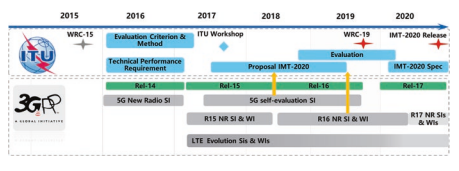 

 需求，低潜伏期需求和高可靠性要求等以及广泛的覆盖范围。 特定于C- 乐队特征在5G开发中起着关键作用。 为了同时解决较高的数据速率和低延迟目标与大覆盖范围问题，3GPP开发了几个关键的技术组件。

 这些关键组成部分包括适合大型带宽的大型MIMO技术的命理和框架结构，适合C- 频段部署和下行链路上行链路解耦合，适合于实现高数据速率
 （特别是对于UL）在C上- 带有现有国际的乐队- 站点距离。

 在版本中- 16时间范围，3GPP将继续增强其NR能力，以解决较高的EMBB光谱效率，并在多源场景中增强URLLC。 3GPP还针对将NR使用扩展到更多垂直方案，包括车辆通信。

 5G自我- 评估研究是在2017年进行的，以进行自我- 评估在发行中开发的3GPP技术- 15并释放- 16对于IMT- 2020年提交。 初步自我- 评估已提交ITU- R在2018年10月，并于2019年6月提交了FNAL评估结果。

##  1.4.3独立评估组以协助ITU- r认可IMT- 2020年

 协助ITU- 评估候选技术是否可以履行IMT- 2020年要求，ITU- R邀请独立评估小组对收到的候选人进行评估，并向WP 5D报告其结论。 截至2020年2月，有14个注册的独立评估小组：- 5G基础设施协会- ATIS WTSC IMT- 2020评估组- 陈中国评估小组。- 加拿大评估小组- 无线世界研究论坛- 印度电信卓越中心。- 日本第五代移动通信促销论坛- TTA 5G技术评估特别项目组（TTA SPG33）。- 反式- PACIFC评估组- ETSI评估组- 5G印度论坛- 非洲评估小组。- 北京国家信息科学技术研究中心
 （BNRIST EG）（申请表 - 限制访问）。

-  中国工业和电信研究联盟（CIRAT）。

##  1.4.4 ITU中的状态

 从撰写本文的撰写期间，独立评估实体都完成了评估，并将其结果提交给ITU。 在2020年11月23日，ITU会议- R SG 5批准WP5D的建议草案[20]，
 IMT 2020.Specs是Frst Off Cial 5G跑步标准。 IMT 2020。

 规格已于2021年2月获得ITU的193个成员国的批准。 "Detailed specifcations of the radio interfaces of IMT-2020"  （ITU- R M. [IMT- 2020.specs]），现在可以在ITU网站[21]上找到。

##  1.5 ** 概括** 

 在本节中，研究了5G开发的动力和驱动力，并引入了5G用例和技术要求。 蜂窝通信系统是其第一代的重点是连接人类。 但是，从5G开始，用例扩展了MBB，以将人类连接到MMTC和URLLC以连接不同的机器。 因此，5G将是一代人致力于连接人和机器的第一代。

 因此，服务要求和技术绩效要求从EMBB扩展到新的用例（或使用情况）。 对于EMBB，它需要显着提高数据速率，以适应新兴的HighDefnition Video和AR/VR传输，以负担得起的能源消耗和频谱职业为代价。 这意味着能量效率和光谱效率都应大大提高。 此外，细胞边缘数据速率应显着提高到每秒几个或数十个兆位，并且对现有网络部署的覆盖范围相似，这对EMBB 5G设计构成了巨大挑战。 对于URLLC，需要非常低的延迟，同时应保证高可靠性。 另一方面，应在包括移动性在内的各种条件下提供此类功能。 对于MMTC，需要较大的连接密度以效率的方式提供巨大的连接。

 此外，在这两种用例中，都需要覆盖范围来实现负担得起的网络部署。 最后，从成本效率的角度来看，应通过独立的空气接口框架来实现上述要求。 总之，5G要求是多种多样的，但与此同时，能源，频谱和部署的成本应限于负担得起的水平。 所有这些问题都对系统设计构成了明显的挑战。

 与前几代人一样，5G开发基于行业协作，在此过程中，ITU和3GPP在此过程中起着核心作用。 伊图- r def五克
 从频谱和其他资源（例如能源，现场和部署）的角度来解决候选5G技术的视觉，技术绩效要求和评估标准，以解决5G用例的各种要求。 伊图- r有一个井- IMT的既定程序- 2020年开发，保证只有通过上述要求的技术才能被批准为IMT- 2020（ITU中的5G名称- r），
 而且只有此类技术才能使用IMT频谱。 通过这种方式，在使用稀缺的频谱和其他资源时，能够在IMT频谱上部署的技术将具有高性能和高效。 另一方面，3GPP是5G技术开发的主要组织，该组织将全球电信标准发展组织（SDOS）团结在一起。 在七个SDO（也称为组织合作伙伴，OPS）的支持下：来自日本的ARIB和TTC，来自美国的ATIS，来自中国的CCSA，来自欧洲的ETSI，来自印度的TSDSI，来自韩国的TTA，3GPP为成员提供稳定的成员 5G技术开发环境。 OP成员几乎涵盖了所有关键方，这确保了3GPP
 技术解决了来自不同各方和不同地区的问题和问题。 在ITU的指导下- R和井- 3GPP，5G技术和5G标准化的统一技术发展良好。 这是5G成功的关键。

 现在，我们已经了解了5G的要求及其开发过程，下一章将开始我们对5G无线系统的推动者的研究。 讨论将从LTE的技术概述开始。 这自然会导致我们通过比较和对比LTE设计来理解5G空气界面。

##  参考

1.  伊图- r， "Recommendation ITU-R M.2083,"  2015年9月。[在线]。 可用：https：//
 www.itu.int/rec/r- rec- M.2083。

2.  NGMN， "NGMN 5G White Paper,"  2015年2月。[在线]。 可用：https：//www.ngmn。

 org/5g- 白色的- 纸/5G- 白色的- Paper.html。

3.  IMT- 2020（5G）pg， "5G vision and requirement white paper,"  2014年5月。[在线]。 可用的：
 http：//www.imt- 2020.cn/zh/documents/download/1。

4.  梅蒂斯， "D1.1 Scenarios, requirements and KPIs for 5G mobile and wireless system,"  2013年4月。 [在线的]。

5.  梅蒂斯， "D6.6 Final report on the METIS 5G system concept and technology roadmap,"  2015年4月。 [在线的]。

6.  5GMF， "5G Mobile Communications Systems for 2020 and beyond,"  2016年7月。 [在线的]。

 可用：http：//5gmf.jp/en/whitepaper/5GMF- 白色的- 纸- 1- 01/。

7.  5G美洲， "5G services and use cases"  ，，，，" 2017 November. [Online]. Available: http://
www.5gamericas.org/fles/9615/1217/2471/5G_Service_and_Use_Cases__FINAL.pdf.

8. 3GPP TSG-RAN Secretariat, " 3GPP RAN RP- 202124：电子会议报告草案RAN \# 89E举行14.09。- 18.09.2020，“ 2020年12月。[在线]。

9.  3GPP，"3GPP TR22.863: Feasibility Study on New Services and Markets Technology Enablers - 
Enhanced Mobile Broadband," 2016年9月。[在线]。 可用：https：//portal.3gpp.org/ desktopmodules/specifcations/specifcationDetails.aspx？spemifcationId = 3015。

10. 维基百科， "Bit Rate,"  [在线的]。 可用：https：//en.wikipedia.org/wiki/bit_rate。 [2019年5月23日访问]。

11. 华为伊拉布， "Cloud VR Bearer Networks,"  2017. [在线]。 可用：https：//wwwfle.huawei.com/- /媒体/corporate/pdf/ilab/cloud_vr_oriented_bearer_network_white_
 Paper_en_v2.pdf？source = corp_comm。

12. 3GPP， "3GPP TR22.861: Feasibility Study on New Services and Markets Technology Enablers for Massive Internet of Things"  ，2016年9月。[在线]。 可用：https：//portal.3gpp.org/ desktopmodules/specifcations/specifcationDetails.aspx？spemifcationID = 3013。

13. 3GPP， "3GPP TR 38.913: STudy on scenarios and requirements for next generation access technologies v15.0.0,"  2018年6月。[在线]。 可用：https：//portal.3gpp.org/desktopmodules/specifcations/specifcationdetails.aspx?specifcationId = 2996。

14. 3GPP， "3GPP TR22.862: Feasibility Study on New Services and Markets Technology Enablers for Critical Communications,"  2018年9月。 [在线的]。 可用：https：//portal.3gpp.org/ desktopmodules/specifcations/specifcationDetails.aspx？spemifcationId = 3014。

15. 中国（人民共和国）， "ITU Document 5D/757: Discussion on energy effciency and the requirement for future IMT,"  2014年9月。[在线]。 可用：https：//www.itu.int/md/ meetingdoc.asp？lang = en＆parent = r12- WP5D- C＆Pagelb = 300。

16. 气候群体， "Smart 2020: Enabling the low carbon economy in the information age," 
200 8. [在线]。 可用：https：//www.theclimategroup.org/sites/default/fles/archive/archive/fles/smart2020report.pdf。

17. Enerdata， "Global energy statistical yearbook 2014,"  2014年。[在线]。 可用：http：//yearbook.enerdata.net/。

18. 伊图- r， "ITU-R Report M.2410: Minimum requirements related to technical performance for IMT-2020 radio interface(s)"  ，2017年11月。[在线]。 可用：https：//www.itu.int/ pub/r- 代表- M.2410- 2017。

19. 文档IMT- 2020/02（Rev. 2）， "Submission, evaluation process and consensus building for IMT-2020,"  2019年7月。[在线]。 可用：https：//www.itu.int/md/r15- IMT.2020- C- 0002。

20. 伊特， "ITU completes evaluation for global affrmation of IMT-2020 technologies,"  2020年11月26日。[在线]。 可用：https：//www.itu.int/en/mediacentre/pages/pr26- 2020评估- 全球的- 侮辱- IMT- 2020- 5G.ASPX。 [2020年12月1日访问]。

21. 伊特， "ITU-R Report M.2150: Detailed specifcation of the terrestrial radio interfaces of International Mobile Telecommunications-2020 (IMT-2020)"  ，2021年2月。[在线]。 可用：https：//www.itu.int/rec/r- rec- M.2150/en。

#  第2章

   4G Lte Fundamental Air Interface Design

 在开始对NR的调查之前，我们将对LTE进行详细的审查。 重点将放在NR建立的LTE的基本方面。 这将是我们了解5G NR空气界面的坚实基础。 那些在LTE中是专业人士的读者可以选择跳过本章并直接移至NR Air界面。

##  2.1 ** LTE空气界面概述** 

 随着NR空气界面从LTE借用一些设计，一种直接的方法可以理解NR，对于那些至少熟悉LTE的人就是查看LTE和NR之间的差异。 本章回顾了LTE的明显部分，这些部分对于对NR的理解至关重要。 感兴趣的读者有关LTE的详细信息，请参考一些文献，例如[1，2]。

 LTE标准化从发行开始- 8分在3GPP中，然后在以下版本中标准化了许多功能- 8要释放- 14.标准从发行中的演变- 15 NR仍在继续支持行业利益的不同新功能。 设计的LTE网络可以支持各种服务，包括EMBB，语音，多媒体广播多播服务（MBMS），D2D，IoT，车辆等。这些服务可以以Unicast传输的形式传输，或- 细胞点- 到- 多点传输（SC- PTM）或MBSFN（MBMS单- 频率网络）传输。 该变速箱主要在许可频谱中运行，但也可以在未许可的频谱中传输EMBB。 为了简化描述，以下各节中LTE空气界面的概述将重点介绍许可频谱中下行链路和上行链路的单播传输。

##  2.2 ** LTE框架结构** 

 框架结构取决于光谱中应用的双链方案。 支持两个双链方案FDD和TDD。 FDD在配对频谱中运行（请参见第3.2.1节），其中下行链路和上行链路传输以不同的载波频率进行。 对于FDD，是否可以同时进行下行链路和上行链路传输取决于UE功能。 一半- 双工FDD适用于UE无法同时传输和接收的情况，而没有这样的限制- 双工FDD。 TDD在未配对的频谱中运行； 见教派。 3.2.1，下行链路和上行链路传输发生在相同载体频率的不同时间实例中。 对于TDD，需要切换时间来确保从下行链路转换为上行链路传输。

 支持两个不同的框架结构，称为1型和类型2，分别适用于在许可频谱中运行的FDD和TDD。

 对于框架结构类型1，一个无线电框架由十个子组成- 帧和每个子- 框架为1 ms，由两个插槽组成。 有十个子- 可用于下行链路传输和十个子框架- 如图2.1所示，可在每个10毫秒间隔内进行上行链路传输帧。

 对于2型框架结构，一个无线电框架的长度为10毫秒，每个无线电框架由十个子组成- 每个帧每个1毫秒。 每个子- 框架由两个长度为0.5 ms的插槽组成。 潜艇- 一个无线电框架中的帧保留用于下行链路传输，分别从下行链路转换为上行链路传输和上行链路传输。 潜艇- 保留用于切换传输方向的框架称为特殊子- 框架。 特殊潜艇中有三个长石- 框架是DWPT，GP和UPPT，其中DWPT和UPPT用于下行链路和上行链路传输，如图2.2所示。 GP是没有下行链路和上行链路传输的时间持续时间，这主要避免重叠

  

  

 基站侧的上行链路接收和下行链路传输。 GP的长度与圆形确定的细胞大小有关- 传播的旅行时间。 由于实际网络中有不同的部署方案，因此[3]中支持了几种GP糖果。 支持的下行链路- 到- 上行链路切换周期时间为5 ms和10 ms。

 上行链路- 下行链路子- 一个无线电框架中的框架拼写取决于UL/DL流量的比率。 通常，DL/UL DREPT不对称，DL的运输量比UL统计学更多[4]，因此DL Sub Sub更多- 一个无线电框架需要帧。 有七个不同的上行链路- 下行链路子- [3]中针对不同的DL/UL贩运模式匹配的框架浓汤，在表2.1 [3]中提供。 在世界上现有的TDD商业网络中，UplinkDownlink Confguration 2是典型的浓汤。

 由于下行链路和上行链路传输以TDD的相同载体频率运行，因此- 无网络同步可能会发生链接干扰； 例如，上行链路传输受到相邻单元的下行链路传输，如图2.3所示。 换句话说，相同的上行链路- 在同一操作员的不同单元格之间或不同操作员之间，需要将下行链路浓汤融合在一起。 由于需要如此严格的融合，上行链路- 下行链路浓汤是半半的- 静态，无法动态更改； 否则会导致严重的十字架- 链接干扰。

##  2.3 ** 物理层通道** 

 本节中描述了物理层通道的属性- 访问方案。

| 表2.1| 上行链路- 下行链路融合| 子- 帧号||||||||||
|---------------------------------------------------------------------------------------------------|---------------------------------|--------------------|----|----|----|----|----|----|----|----|----|
| 上行链路- 下行链路| 下行链路- 到- 上行链路开关- 观点|||||||||||
| 浓汤| 周期性| 0| 1| 2| 3| 4| 5| 6| 7| 8| 9|
| 0| 5 ms| d| s| 你| 你| 你| d| s| 你| 你| 你|
| 1| 5 ms| d| s| 你| 你| d| d| s| 你| 你| d|
| 2| 5 ms| d| s| 你| d| d| d| s| 你| d| d|
| 3| 10毫秒| d| s| 你| 你| 你| d| d| d| d| d|
| 4| 10毫秒| d| s| 你| 你| d| d| d| d| d| d|
| 5| 10毫秒| d| s| 你| d| d| d| d| d| d| d|
| 6| 5 ms| d| s| 你| 你| 你| d| s| 你| 你| d|
| 笔记： "D,"  "S,"  和 "U"  代表子- 框架保留用于下行链路，下行链路- 到- 上行链路||||||||||||

 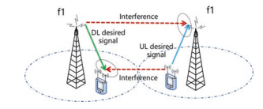 

##  2.3.1倍数- 访问计划

 正交频率- 分层多路复用（OFDM）- 基于LTE下行链路和上行链路传输的基本传输方案。 OFDM的基本原理可以在某些教科书[1，5，6]中找到。 OFDM是一个多人- 载体技术会产生许多带有小带宽的正交子载波。 每个具有小带宽面的子载波在传播中相对较弱的面孔，这可以有效地消除频率的影响- 选择性褪色并简化接收器的均衡器，尤其是对于宽带传输。 可以通过图2.4中说明的IFFT实现OFDM，并且DFT用于OFDM接收。

 导致下行链路传输选择OFDM的一些主要方面包括通过使用环状PERFX的宽度（20 MHz）带宽，固有和简单的多径保护的低成本和复杂性实现，以及一个自然可扩展的实现 可以支持系统带宽。

 由于多- 载体传输，瞬时OFDM信号具有较大的变化，并导致高峰- 到- 平均功率比（PAPR）。 对于LTE上行链路，PAPR是一个热门的讨论，很快将被更准确而不是- 作为- 直截了当- 到- 计算立方公制（CM）[7]。 功率放大器必须具有较大的线性动态范围，这将导致较高的成本和低功率放大器的效率。 或者，设备的非线性导致

  

 信号的失真变化很大，电源后退- 需要关闭，以减少细胞覆盖率。 因此，在上行链路传输中，OFDM不是UE的好选择。 选择一个- 载波波形允许上行链路的CM大大降低，从而促进了较低的成本较低的功耗UE。 SC- 使用的FDMA波形是 "DFT" - 传播DM（DFT- SOFDM），使用额外的DFT块，制成净信号单载波，如图2.5所示。 sc- FDMA与DFT形式的Cyclic Prefx形式- s- OFDM
 用于实现上行链路间- 用户正交性，并在接收方启用效率频域均衡。 这允许与下行链路OFDM方案相对较高的共同点，并且可以重复使用相同的参数，例如时钟频率[8]。

 基于上述的下行链路和上行链路传输方案，UE
 下行链路和上行链路传输中的多路复用是由OFDMA和SC运行的- FDMA作为倍数- 访问方案分别。 作为DFT- s- OFDM基于OFDM，下行链路中的不同UE或上行链路传输可以在特定时间间隔内以几个OFDM符号在不同的子载波上多路复用。 图2.6说明了示例性的下行链路和上行链路多路复用。

 下行链路以局部或分布式方式支持向UE的传输。 对于本地化传输，将分配一组连续的资源以实现调度增益。 在这种情况下，这意味着基站知道宽带通道的一部分对于特定UE质量良好，然后安排将数据传输到UE的相应零件。 分布式传输是，一组为特定UE分配的资源，其中资源分布在频域中以实现频率多样性的增益。 通常，由于较高的移动性或较差的通道状况，UE无法准确跟踪或及时将通道状态信息报告到基站。 在这种情况下，由于无法实现调度增益，因此最好安排频率多样性增益。 可以看出，渠道信息的知识是做出良好计划决策的关键，因此，UE必须向基础站报告渠道状态信息。

 在上行链路中，为了使单个载体属性保持低CM，UE
 多路复用与下行链路不同。 分配给一个UE的所有子载体都必须进行本地化。

 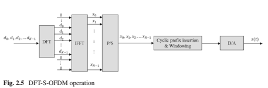 

 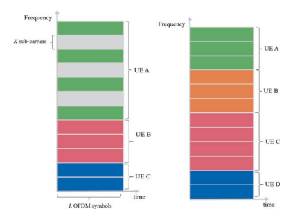 

##  2.3.2系统带宽

 LTE目标以低于6 GHz和大多数现有LTE商业网络的目标部署在Sub中- 3GHz许可频谱。 由于频谱具有在子中存在的多个通道带宽- 3 GHz，LTE旨在支持可扩展的通道带宽，以促进部署。 受支持的通道带宽如表2.2 [9]。

 如果使用所有与某个通道带宽相对应的子载波，则存在- 的- 频段排放是因为OFDM符号的添加窗口无法完全删除频域中的侧叶。 出去- 的- 频段排放将干扰相邻的通道。 避免严重的影响- 的- 频段排放，在通道带宽边缘的许多子载波需要用作防护带，而无需数据传输。 在

| 频道带宽（MHz）| 1.4| 3| 5| 10| 15| 20|
|-----------------------------------------|-------|-----|-----|------|------|------|
| 传输带宽浓汤NRB| 6| 15| 25| 50| 75| 100|

 LTE，警卫乐队需要至少10％的频道带宽。 传输带宽是可用于数据传输的实际带宽，该带宽比通道带宽小。 见图2.7 [9]。 传输带宽以资源块数量（RB）的数量表示，一个资源块的带宽为180 kHz。 频谱利用率被认为是传输带宽与通道带宽的比率。 可以观察到有90％
 除1.4 MHz带宽外，LTE的频谱利用率。

 表2.2频道带宽和传输带宽融合

##  2.3.3命理学

 对于下行链路和上行单播的传输，选择了LTE中OFDM的子载波间距为15 kHz。 值得注意的是，LTE还支持专用MBMS网络的7.5 kHz子载波间距和3.75 kHz子载波间距NB- 物联网上行链路。 子载波间距的选择考虑了多普勒差异的影响，这与LTE网络的候选载体频率以及高达350 km/h的支持速度有关[10]。 如果有15 kHz的子载波间距，则可以确定通道带宽的子载波数量。 循环PREFX用于减轻延迟扩散以开销为代价的影响。 支持两个环状PERFX长度，包括正常的环状PERFX和扩展的环状PERFX。 扩展的环状PERFX用于非常大的细胞，例如
 通过同时使用大量细胞传输100 km细胞半径和MBSFN。 循环PREFX的选择是开销和减轻延迟扩散影响的平衡。

 在正常的环状PERFX的情况下，一个插槽中有7个OFDM符号，具有0.5毫秒（图2.8）。 对于扩展的环状PERFX，每个插槽的OFDM符号的数量为6。资源块（RB）被认为是时域中具有正常环状PERFX的连续7个OFDM符号，在频域中有12个连续的子载流子。 资源元素（RE）被认为是一个ofdm符号上的一个子载波，这是最小的资源单元。 在正常环状PERFX的情况下，在一个资源块中有84（7*12）RES，而在扩展环状PERFX的情况下有72个RES。 RB大小的选择是一项交易- 在资源分配尺寸和小数据包的填充之间关闭。

 资源网格由许多NRB，T RBs组成，其中6≤nRB，T≤110。指定[3]中指定的功能支持下行链路链路和上行链路传输从6到110 RBS； 但是，表2.2中规定的传输带宽限制了所使用的RB的实际数量。

  

 图2.8正常循环前缀的资源网格

  

  

 时间域中的调度单元是一个子- 框架。 物理资源块（PRB）对被认为是一个子中的两个物理资源块- 具有相同频率位置的框架。 对于下行链路和上行链接局部变速箱，资源分配单元是物理资源块对； 也就是说，一个子中两个插槽中的相同资源块- 框架分配。 但是，对于下行链路分布式传输或上行链路传输- 子帧频率跳跃，一个在一个子的两个插槽中的特定UE的分配资源块- 框架不同。

##  2.3.4物理渠道排泄

 将下行链路物理通道定为一组资源元素，该资源元素载有来自较高层的信息[3]。 对以下下行链路物理渠道进行了建议：
-  物理下行链路共享频道，PDSCH- 物理广播频道，PBCH- 物理多播通道，PMCH- 物理控制格式指示灯频道，PCFICH- 物理下行链路控制通道，PDCCH- 物理混合ARQ指标通道，Phich
 来自较高层的信息在较高层的通道上携带，包括逻辑通道和下行链路传输通道。 图2.9 [11]中给出了从高层通道到物理通道的映射。

 对以下上行链路物理通道进行了建议[3，11]（图2.10）：
-  物理上行链路共享频道，Pusch

   - Physical Uplink Control Channel, PUCCH - Physical Random Access Channel, PRACH

  

##  2.4 ** 参考信号** 

 参考信号是指SO- 称为试点信号，用于接收器的通道估计。 特定于LTE中，参考信号是一个预先定义的信号，该信号在资源网格中的一组预定资源元素上传输。 估计通道的具体目的取决于相应参考信号的排列。 从接收器的角度来看，使用参考信号来获取传达资源网格通道的估计值，因此可以从派生的通道中推断出在同一资源网格上传达的符号通道。 每个参考信号与一个天线端口相关。

##  2.4.1下行链路参考信号

 下行链路参考信号用于下行链路传输的下行链路通道测量和/或相干解调。 以下参考信号在下行链路[3]中进行了建议：

-  细胞- 指定参考信号（CRS）- UE- 指定参考信号（DM- 卢比）- CSI参考信号（CSI- 卢比）- 发现参考信号（DRS）- MBSFN参考信号- 定位参考信号

##  2.4.1.1 ** 细胞- 指定参考信号** 

 CRS是发行版中规定的基本信号- 8，由UES访问LTE网络使用。 PBCH，PDCCH/PCFICH/PHICH和PDSCH在传输模式（TM）1-6 [12]中的解调使用基于CRS的通道估计。 当多个CR中，将预编码用于PDSCH传输时，在下行链路控制信息中，使用的PDSCH的已使用的预编码矩阵发出信号
 （DCI）。 UE利用CRS的估计通道和信号的预编码矩阵来生成等效通道，以相干解调PDSCH。 CRS还用于以CQI/RI/PMI的形式得出通道状态信息（CSI），用于TM 1-8中的PDSCH调度。 此外，CRS可用于通过PSS/SSS初始同步和RRM测量进行细胞选择后的同步跟踪。

 CRS均在所有下行链路子中传输- 框架结构类型1的帧和所有下行链路子- 框架结构类型2的框架和DWPTS。- 框架。 futhermore，CRS仅在MBSFN Sub的FRST两个OFDM符号中传输- 框架并仅针对15 kHz子载波间距进行定义。 一个单元格中的CR数量可以是一个，两个和四个，对应于一个，两个和四个天线端口。 CRS天线端口称为天线端口0、1、2和3。在一个正常环状PERFX的情况下，在一个资源块对中CRS的结构如图2.11 [3]所示。 CRS横跨整个系统带宽，以其位于OFDM符号。 值得注意的是，图2.11中不同CRS的频率位置是相对的。

 对于每个CRS端口，一个OFDM符号中两个相邻参考信号之间的距离为6个RES，CRS的起始位置具有6个频移。

 频移是单元格指定，它是通过执行 * ncell ID * mod 6获得的。ncell ID是从[0，503]中选择的单元格ID索引，其中有504个单元格ID。 频移是使相邻的细胞避免CRS间间干扰。 天线端口0/1的CR位于frst和ffth ofdm

  

  

  

  

  

 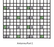 

  

  

 一个插槽的象征以交错的方式； 但是，天线端口2/3的CR仅位于每个插槽的第二个OFDM符号中，以减少参考信号的开销。 在两个天线端口的情况下，CRS开销为16/168 = 9.52％，如果假设对天线端口2和3的密度相同，则在4个天线端口中，它将为19.05％。 天线端口的较低密度2/3可能会以非常高的速度降低通道估计性能。

 天线端口0和1的参考信号通过FDM分离。 当这些资源元素与天线端口1的参考信号的位置相对应时，天线端口0上的资源元素不用于传输1. 相同的OFDM符号可以改善频道估计性能。 这也适用于天线端口2和3。

 除了使用CRS进行CSI测量和物理通道的相干解调外，CRS还用于测量细胞选择/重新选择和细胞移交。 CRS端口0用于确定参考信号接收功率（RSRP），并且可以选择使用CRS端口1，具体取决于UE是否可以可靠地检测到CRS端口1是否可用。 RSRP被认为是在所考虑的测量频率带宽中携带CellSpecifc参考信号的资源元素的功率贡献（in [w]）的线性平均值
 [13]。 该网络根据报告的RSRP和另一个参数（参考信号接收质量（RSRQ））做出决定是执行单元格选择/重新选择还是细胞移交[13]。

##  2.4.1.2 ** UE- 指定参考信号** 

 UE- 在TM 7-10中，使用SPECIFC参考信号1用于解调PDSCH [12]。

 UE- PESIFC参考信号仅存在于PDSCH传输的计划资源块中。 对于UE- 指定参考信号- 基于PDSCH的传输，PDSCH的使用的预编码矩阵对UE是透明的，因此，不需要DCI中的信号传导。 由于UE没有有关如何在不同资源块上使用预编码矩阵的信息，因此它无法在不同的计划资源块之间执行频道插值。 为了平衡预编码的增益和通道估计性能损失，在TM9中支持PRB捆绑，并假定在预编码的资源块组（PRG）中应用相同的预编码矩阵。 PRG尺寸取决于系统带宽； 参见表2.3 [12]。

 UE- 指定参考信号- 在发行版中引入了基于PDSCH的传输TM7- 8，仅支持单- 层波束成形。 定义的UE- 指定参考信号对应于图2.12 [12]中所示的天线端口5。

 表2.3 PRG尺寸

| 系统带宽（PRB的数量）| PRG尺寸（PRB数）|
|-------------------------------------|-----------------------------|
| ≤10| 1|
| 11–26| 2|
| 27–63| 3|
| 64–110| 2|

 图2.12天线端口5具有正常环状Prefx的结构

  

 在发行中- 9，引入TM8以支持双重- 对图2.13中的天线7和8进行了对应于天线7和8的两个新参考信号。 由于支持向后兼容性，引入了UE- 指定参考信号应避免与细胞发生碰撞- 指定参考信号，PDCCH和PBCH/PSS/SSS。 该位置位于一个子中每个插槽的最后两个OFDM符号- 框架。 每个UE都有12个RES- 一个资源块对中的指定参考信号。 两个UE- 指定参考信号占据相同的资源元素，但通过代码除法（CDM）隔开。 在时间域中跨越天线7和8的两个代码[+1 +1 +1 +1]和[+1 –1 +1 –1]分别使用。 设计的UE- TM8中的指定参考信号支持SU之间的动态切换- Mimo和Mu- MIMO。 MU- MIMO
 传输对UE是透明的； 也就是说，苏- 从UE的角度来看，MIMO操作始终是假设的。 TM8中的参考信号有两个候选预性序列，两个序列是准- 正交。 对于每个预性序列，生成的UE- 对应于天线端口7和8的指定参考信号彼此正交； 但是，UE- 从两个预定序列生成的指定参考信号是准- 正交。

 哪个序列用于UE- DCI指示某个UE的指定参考信号。 因此，它最多可以为MU支持4个UE- MIMO在TM8中。

 在发行中- 10，引入TM9最多支持八个- 基于UE的层传输- 指定参考信号，因此最多八个UE- 需要针对指定参考信号。 UE- 通过将正交覆盖码（OCC）的数量从2扩展到4，并且资源元素的数量从12到24。相应的天线端口是7、8、9、10， 11、12、13和14.对于每组12个资源元素，有4个天线端口由4个代码分开。 表2.4显示了天线端口和OCC代码之间的映射。 UE的映射- 天线端口7,8、9和10的指定参考信号在正常环状PERFX的情况下如图2.14所示。

##  2.4.1.3 ** CSI参考信号** 

 CSI参考信号用于测量通道状态信息，该信息是在LTE释放中引入的- 10，适用于TM9和TM10。 为了提高峰值数据速率，八个- 层传输支持是释放的要求- 10发展。 扩展了8天线端口的CRS天线端口的方法0/2/4设计是不效率且复杂的。 首先，8个CRS端口的资源开销是不可接受的。 如各节所述。 2.4.1.1，4个CRS天线端口的开销已经为14.28％，8个天线端口的开销可能约为30％。 此外，在实用网络中，运行大于等级4传输的UE数量很少。 其次，由于需要向后兼容，在LTE版本中运行的遗产UE- 8需要在LTE工作
 发布- 10，必须在释放中呈现传统的CRS天线端口- 10网络。 对于新辩护的8个天线端口和传统的CRS天线端口而言，这将是复杂的。 这些考虑需要采用与CRS设计不同的参考信号设计的新方法。 参考信号的功能包括通道测量和解调，由CSI参考信号和UE执行- 分别指定参考信号。 UE- Sect中描述了指定参考信号。 2.4.1.2。

  

 表2.4天线端口与OCC代码之间的映射

 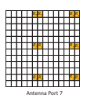 

 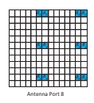 

 R7R7 * R7R7 * R8 R8 R8 R8

| 天线端口| OCC代码|||
|----------------|---------------|------|----|
| 7| [+1 + 1 + 1| + 1]||
| 8| [| 这是给出的||
| +| -| +||
| 1| 1| 1 -1||
| 9| [| 这是给出的||
| +| +| +||
| 1| 1| 1| +1|
| 10| [| 这是给出的||
| +| -| +||
| 1| 1| 1 -1||
| 11| [| 这是给出的||
| +| +|||
| 1| 1-| -||
| 1| 1|||
| 12| [| 这是给出的||
| -| -| +||
| 1| 1| 1+1||
| 13| [| 这是给出的||
| +| -| -||
| 1| 1| 1+1||
| 14| [| 这是给出的||
| -| +| +||
| 1| 1| 1 -1||

 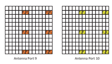 

 天线端口7天线端口8天线端口9天线端口10
 尽管由于支撑八层传输而引入了CSI参考信号，但在释放中也为1、2和4个天线端口定义了CSI参考信号- 10. CSI参考信号在一个，两个，四个或八个天线端口上传输，相应的天线端口为15、15/16、15/16/17/18和15/16/17/19/19 /20/21/22。 由于CSI参考信号仅用于通道测量，因此- 需要密度CSI参考信号以减少开销。 优化交易- CSI参考信号开销和通道测量性能之间的关闭，每个CSI参考信号的传输是宽带，一个资源块对中每个端口的平均每个端口的平均数为频域中为1。 时间域中的周期性与5、10、20、40和80 sub的值相处- 帧。

 一个资源块对中的CSI参考信号由CDM或Hybrid FDM和TDM多路复用。 每个CSI参考信号跨越时域的两个连续RES上跨越，并且两个连续的RES可以传达两个由CDM多路复用的CSI参考信号。 两个OCC代码分别为[+1 +1]和[+1 –1]。 CSI参考信号的位置应避免与CRS相撞，
 UE- 指定参考信号，定位参考信号，PDCCH，PBCH和PSS/SSS。 对于框架结构类型1和类型2的一个资源块对中的CSI参考信号保留了40个RES，对应于20、10和5 CSI参考信号企业，CSI参考信号的数量为1或2 和8分。 图2.15中说明了适用于帧结构类型1和类型2的不同数量的CSI参考信号的CSI参考信号浓度 浓汤和数字代表CSI参考信号浓度的索引； 用灰色标记的资源元素和 "x"  表示CRS或UE的位置- 指定参考信号。 此外，还有其他12、6和3 CSI参考信号凝结，对应于框架结构类型2的1或2、4和8 CSI参考信号[3]。

 CSI参考信号的数量和相应的CSI参考信号浓度由UE中的较高层融合- 指定方式。 CSI参考信号中的CSI参考信号由CDM多重
 和FDM，其中四对天线端口15/16、17/18、19/20和21/22由FDM多路复用，每对的两个天线端口是代码多路复用的。 图2.16以CSI参考信号浓度0为例，以说明不同天线端口的CSI参考信号。

 由于CSI参考信号是宽带传输，因此它可能与计划发布的资源块相撞- 8旧式UES。 在这种情况下，执行数据刺穿以释放- 8旧式UES。 由于基站知道CSI参考信号浓汤并释放- 8 Legacy UES的调度，可以通过调度和链接适应来减轻数据刺穿对传统UES的影响。 为版本- 10及更高版本的UES，在CSI周围进行速率匹配

   

  

 参考信号。 由于UE- 指定CSI参考信号融合，UE
 不知道其他UES的CSI参考信号，因此无法在CSI参考信号周围速率匹配。 为了启用速率匹配，零- Power CSI参考信号浓汤发出信号为UE，UE假定为零- 这些资源元素中的电力传输。 零CSI参考信号融合重复了四个CSI参考信号的CSI参考信号相结合。 UE应在子中假设零传输功率的CSI参考信号浓度- 框架由16给出- 位图。 每位设置为16中的一个- 位图，UE应为对应于CSI参考信号浓汤的资源元素假设零传输功率。

 天线端口的数量延长至12、16、20、24、28和32- 13和- 14在支持完整的背景下- dimension mimo（FD- MIMO）[14，15]。 12、16、20、24、28和32个天线端口的指标标记为p = 15，…，26，p = 15，…，30，p = 15，…，34，p = 15，…，…， 38，p = 15，…，44，p = 15，…，38和p = 15，…，46。 如果天线端口的数量大于8，则通过将NRES csi> 1 CSI> 1 CSI参考信号在一个子中生成相应的CSI参考信号。- 框架。 天线端口的数量 * ncSires *每个CSI参考信号浓度为4或8。虽然每个CSI参考信号凝聚是2个天线端口是聚集的最可爱的浓度，但它将导致明显的互助数量，以增加信号覆盖和糖果的覆盖面和果酱。 复杂。 总CSI的支持的共同点- RS融合如表2.5所示。

 一个资源块对中的资源元素与4或8个天线端口相对应的每个汇总的CSI参考信号融合，与图2.15中所示。 在使用OCC = 2的CDM的情况下，每个参考信号跨越两个资源元素，两个参考信号在两个相同的资源元素上多路复用，由[+1 +1]和[+1 –1]分开 如图2.16所示。 当应用CDM OCC = 4时，每个参考信号跨越一个资源块对中的四个资源元素，并由
 [+1 +1 +1 +1]，[+1 –1 +1 –1]，[+1 +1 –1 -1 -1]和[+1 –1 –1 –1 +1]。 CSI的一个例子
 在CDM OCC = 4的情况下，参考信号浓度为4和8天线端口。 分别为2.17和2.18。

 表2.6和2.7中提供了一个CSI参考信号凝固的天线端口与OCC = 4的代码之间的映射。

| 天线总数| 每个CSI的天线端口数- 卢比| CSI数量- 卢比||
|---------------------------|--------------------------------------|--------------------|-----|
| CSI| 端口| 端口| CSI|
| 端口n| n|||
| res| 融合ncsires| 融合NRES||
| CSires||||
| 12| 4| 3||
| 16| 8| 2||
| 20| 4| 5||
| 24| 8| 3||
| 28| 4| 7||
| 32| 8| 4||

 图2.17 CSI参考信号浓度与4个天线端口0（CDM OCC = 4，正常环状PERFX）
 R22 R22 R22 R22 R21 R21 R21 R21 R21 R20 R20 R20 R20 R20 R20 R19 R19 R19 R19 R19 R19图2.18 CSI参考信号浓度0带8个天线端口（CDM OCC = 4，正常循环Prefx）

| 表2.6| 一个CSI参考信号与4个天线端口的OCC代码分配||||
|-----------------|--------------------------------------------------------------------------------------|----|----|----|
| res| [W（0）W（1）W（2）W（3）]||||
| 天线端口15| +1| +1| +1| +1|
| 16| +1| -1| +1| -1|
| 17| +1| +1| -1| -1|
| 18| +1| -1| -1| +1|

 表2.7一个CSI参考信号与8个天线端口的OCC代码分配

| res| [W（0）W（1）W（2）W（3）]| [W（0）W（1）W（2）W（3）]|||
|-------|-------------------------|-------------------------|----|----|
| AP 15| +1| +1| +1| +1|
| 16| +1| -1| +1| -1|
| 17| +1| +1| +1| +1|
| 18| +1| -1| +1| -1|
| 19| +1| +1| -1| -1|
| 20| +1| -1| -1| +1|
| 21| +1| +1| -1| -1|
| 22| +1| -1| -1| +1|

 当应用CDM OCC = 8时，每个参考信号在一个资源块对中的八个资源元素上跨越，并由长度等于8的代码隔开。 端口。 对于CDM OCC = 8和等于32的天线端口的数量，汇总的4个CSI参考信号与8个天线端口限制在{0、1、2、3}或{0、2 ，3，4}或{1，2，3，4}; 对于等于24的天线端口的数量，汇总的3个CSI参考信号与8个天线端口的浓度仅限于{1、2、3}。 聚集的CSI
 参考信号浓汤可在图2.15中找到。 在表2.8和2.9中分别说明了不同天线端口的OCC代码分配。

 对于大于8的天线端口的数量，天线端口的总数等于标记为p nres n csi* csires* csires*端口=…15，，16 15 + -1的NRES N CSICSIRES端口。 每个CSI参考信号浓度的天线端口数为 * ncsires *端口，并且天线端口被索引为p n'=… +  -  * csires *端口 *端口15，16 15 1. p和p'IS [ 3]，，
 如果CDM OCC = 2：

 $$ p = \ left \ {\ begin {array} {ccc} p^{\ prime}+\ dfrac {n _ {\ mathit {\ mathit {csi \，res}}}^{\ mathit {\ mathit {pous}}}}}}} ，i＆p^{\ prime} \ in \ left \ {15,16，\ ldots，15+\ dfrac {n _ {\ mathit {csi \，res}}}- 1 \ right \} \\ p^{\ prime}+\ dfrac {n _ {\ Mathit {csi \，res}}}^{\ m at {\ mathit {pous}}}}} {2} {2} {2} {2} \ left（i+n _ {i+n _ { res}}}^{\ mathit {csi}}}- 1 \ right） n _ {\ Mathit {CSI \，res}}}^{\ Mathit {pous}}- 1 \ right \} \\ i \ in \ left \ {0,1，\ ldots n _ {\ mathit {res}}}^{\ mathit {csi}}- 1 \ right \} \ end {array} \ right。$$

| 第一汇总的CSI参考信号融合|
|---------------------------------------------------------------------------------|
| 聚集的CSI参考信号浓度中每个天线端口的RES|

 15 17 19 21 +1 +1 +1 +1 +1 +1 +1 +1 +1

 16 18 20 22 +1 -1 +1 -1 +1 -1 +1 -1 -1

 23 25 27 29 +1 +1 -1 -1 +1 +1 -1 -1 -1

 24 26 28 30 +1 -1 -1 +1 +1 -1 -1 +1 31 33 35 37 +1 +1 +1 +1 +1 +1 -1 -1 -1 -1 -1 -1 -1 -1 -1 -1 -1

 32 34 36 38 +1 -1 +1 -1 -1 +1 -1 +1

 39 41 43 45 +1 +1 -1 -1 -1 -1 +1 +1 +1 40 42 44 46 +1 -1 -1 -1 +1 -1 -1 +1 +1 +1 +1 -1 -1-1-1

| 第二个汇总的CSI参考信号融合|
|-------------------------------------------------------|

| 第四次聚集的CSI参考信号融合|
|-------------------------------------------------------|

| 第三汇总的CSI参考信号融合|
|-------------------------------------------------------|

| 聚集的CSI参考信号浓度中每个天线端口的RES| [W（0）W（1）W（2）W（3）W（4）W（5）W（6）W（7）]||||||||||
|----------------------------------------------------------------------------------|---------------------------------------------|-----------|-----------|-----------|-----------|-----------|-----------|-----------|----|----|
| CSI- 卢比| CSI- 卢比| CSI- 卢比| CSI- 卢比| CSI- 卢比| CSI- 卢比| CSI- 卢比| CSI- 卢比| CSI- 卢比|||
| config。 1| config。 2| config。 3| config。 1| config。 2| config。 3| config。 1| config。 2| config。 3|||
| 15| 31| 25| +1| +1| +1| +1| +1| +1| +1| +1|
| 16| 32| 26| +1| -1| +1| -1| +1| -1| +1| -1|
| 19| 35| 29| +1| +1| -1| -1| +1| +1| -1| -1|
| 20| 36| 30| +1| -1| -1| +1| +1| -1| -1| +1|
| 23| 17| 33| +1| +1| +1| +1| -1| -1| -1| -1|
| 24| 18| 34| +1| -1| +1| -1| -1| +1| -1| +1|
| 27| 21| 37| +1| +1| -1| -1| -1| -1| +1| +1|
| 28| 22| 38| +1| -1| -1| +1| -1| +1| +1| -1|

 别的

 $ p = p = p = p^{\ prime}+n _ {\ text {cstress}}}^{\ text {ports}} i \ quad p^{\ prime} \ in \ in \ in \ left \ left \ left \ {15,16，...，15 +n _ {\ text {cstress}}}^{\ text {ports}}- 1 \ right \} $ $$ i \ in \ left \ {0,1，... n _ {\ text {res}}}^{\ text {csi}}- 1 \ right \} $$
 结尾。

 对于使用CDM OCC = 2的每种CSI参考信号融合

 ### 54老师的Sigma $ P'= 15,16，\ ldots，15 $。
 天线端口p'=… +  -
 $ n _ {\ text {c}}}^{\ text {parts}}}- 1 $和$ p^{\ prime} = 15+\ frac {n _ {\ text {c}}}^{\ text {parts}}}} {2} {2}，...，15+n _ {\ text {c text {c} }^{\ text {parts}} $
 15 16 152，，，1和p'= +… +  -  nn csires端口152，15 1代表与两个不同极化的天线端口- 偏振天线浓稠。 因此，P和P'之间的映射可以实现整体天线端口：

 将整体天线PMS发射。 $ p = 15,16，\ ldots，15+\ frac {n _ {\ text {cnt}}}^{\ text {pwn}} n _ {\ text {rc}}} }- 1 $和$ p = 15+\ frac {n _ {\ text {cnt}}}^{\ text {pwn}} n _ {\ text {rc}}} ，15+n _ {\ text {cis}}^{\ text {pwn}} n _ {\ text {rc}}}^{\ text {\ text {csi}}}- 1 $代表两个不同的极化。

##  2.4.1.4 ** 发现信号** 

 发现信号是在发行中引入的- 12对于小单元部署方案。 为了减轻小细胞之间的干扰并节省能量，对自适应细胞的自适应细胞与流量负载进行了自适应[16]。 发现信号用于促进小细胞的快速和效率发现，这可以减少过渡时间。

 发现信号在下行链路子中传输- 框架或DWPTS
 特殊子地区- 框架。 发现信号由一级同步信号（PSS）/二级同步信号（SSS），CRS端口0和CSI组成- 卢比。 细胞的发现信号场合的时期可以融合在一起。 该期间可以连续1-5个子- 框架结构类型1和2–5连续子框架框架- 框架结构类型2的框架。发现信号场合的周期性由较高的层参数融合在一起。

 在发现信号的时期，PSS位于Frst Sub中- 框架结构类型1或第二个子的周期框架- 框架结构2的框架2，SSS位于FRST SUB中- 该时期的框架，CRS端口0均在所有下行链路中- 框架和所有特殊子的dwpts- 该时期的帧和CSI- RS在某些子中融合在一起- 如果有的话，则在此期间内。

##  2.4.1.5 ** 其他下行链路参考信号** 

 除了上述参考信号外，LTE中还有其他一些下行链路参考信号，包括仅适用于PMCH传输的MBSFN参考信号，定位信号的定位参考信号，与EPDCCH相关的解调参考信号等。 ，这些参考信号将不会在此处讨论，并且可以在[3]中找到详细信息。

##  2.4.2上行链路参考信号

 与下行链路参考信号类似，上行链路参考信号用于相干解调和上行链路通道测量。 在下行链路中，所有UE的参考信号都可以以广播方式为常见，例如CRS； 但是，对于上行链路，参考信号为UE指定。 支持两种类型的上行链路参考信号：- 上行链路解调参考信号（DM- 卢比）- 发声参考信号（SRS）

##  2.4.2.1 ** 上行链路解调参考信号** 

 上行链路DM- RS用于基站进行通道估计，以执行Pusch和Pucch的相干解调。 DM有两种类型- 卢比； 一种类型与Pusch相关，另一种与Pucch传输相关。 对于DM- RS，只有单身- 释放中的Pusch和Pucch传输支持天线端口- 8.发行- 10，它扩展到支持2和4个天线端口，用于Pusch传输和2个天线端口用于Pucch透射。 DM的最大数量- Pusch或Pucch传输的RS端口被UE中的较高层融合在一起- 指定方式。 DM- 表2.10 [3]总结了Pusch和Pucch传播的RS天线端口标记。

 DM- RS从单一开始描述- 天线端口传输为简单起见，然后扩展到案例，多个- 天线端口传输。 因为需要在上行链路中具有低立方公制的传输DM- RS和数据是在一个插槽中的分配资源块中多路复用的时间，以保留单个载体属性。 DM- RS跨越与频域中数据相同的带宽，以估计数据传输的通道。 对于Pusch，DM- RS在一个插槽内的计划资源块的第四个OFDM符号中传输，其余6个OFDM符号用于数据。 PUCCH传输限制为一个资源块。 Pucch DM的多路复用- 资源块中的RS和数据取决于Pucch格式； 例如，对于Pucch格式1/1a/1b，一个资源块中的第三，第四和ffth Ofdm符号用于DM- RS传输。 DM的多路复用- RS和数据如图2.19所示。

 与下行链路参考信号不同，上行链路DM- RS序列应在频率和时域具有恒定的幅度。 DM的恒定幅度- 频域中的RS序列用于在不同的子载波上获得均匀估计的通道性能。 时间域中的恒定幅度是保持低立方指标。 但是，由于ifft操作的过采样，时间域的幅度会有所变化，但仍具有低立方体度量。 另外，也希望DM- RS序列具有零自相关，以优化通道估计和低横交- 相关属性减轻间- 细胞干扰。

| 最大天线端口浓厚的1 2 4||||
|---------------------------------------------------|-----|-----|----|
| pusch| 10| 20| 40|
|-| 21| 41||
|-|-| 42||
|-|-| 43||
| pucch| 100| 200|-|
| 201|-|||

 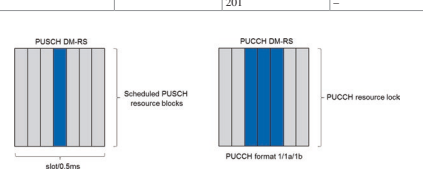 

 Zadoff- 因此，CHU（ZC）序列被选为上行链路DM- 卢比
 序列由于其良好的汽车- 和交叉- 相关特性[17]。 ZC序列由

 $$ x_ {q} \ left（m \ right）= e^{- j {\ frac {\ pi q m \ left（m+1 \ right）} {n_ {2c}^{e s}}}}}} \ quad0 \ quad0 \ leq m \ leq m \ leq n_ {2c}- 1 $$

 那里的NZC
 RS是ZC序列的长度，Q代表QTH根ZC序列。

 对于一定的ZC序列长度NZC
 RS，可用的根序列的数量等于整数的数量与NZC相对素数
 卢比。 也就是说，如果ZC序列长度为质量数字，则根序列的数量是最大化的。 一定长度的更多根序列意味着可以将不同的根序列分配给更多不同的细胞以减轻间- 细胞干扰。 因此，选择ZC序列长度为LTE中的质量数。

 DM- RS序列跨越与Pusch相同的带宽。 Pusch的带宽取决于分配的连续资源块的数量，即
 MSC = 12 * NRB，其中NRB是计划的资源块的数量。 DM的长度- RS序列等于MSC。 由于ZC序列长度是素数，因此可以扩展或截断具有接近MSC的长度的ZC序列以生成DM- RS序列。 由于具有更好的立方度量特性，因此采用了ZC序列循环扩展的方法[18]。 长度NZC
 ZC序列的RS确定为最大的质数小于MSC。 然后扩展ZC序列以生成DM- RS碱基序列等于MSC

 $$ 1 \ leq m_ {s c}- 1 $$

##  ru V n xq z n n n c n m rs，mo sc（）=（）d，01≤≤--

 有多个基本序列与每个可能的计划带宽相对应。 将基本序列分为30组，u∈{0，1，…，29}
 表示组号。 组u与QTH根序列之间的关系可以在[3]中找到。 在每个组中，它由基本序列组成，其长度不同，与不同的计划带宽NRB相对应。 一个组中每个长度的基本序列数取决于计划的带宽NRB。 当1≤nrb≤2时，由于ZC根序列的长度小于30，长度msc = 12 ∗ nrb的可用基本序列的数量小于30。因此，每个组都无法具有一个基本序列 这样的长度。 取而代之的是，计算机搜索方法用于生成30组长度的基本序列msc = 12 ∗ nrb，1≤nrb≤2，形式为ru（n）=ejφ（n）π/4，0≤n≤msc −1，其中[3]中建议φ（n）。 由于Pucch传输受到一个资源块的约束，DM- PUCCH的RS序列将使用计算机搜索序列。 长度NZC
 当3≤nRB时，ZC序列的RS大于30，它允许为MSC的每个长度生成30多个基本序列。 在这种情况下，每个组都包含一个基本序列
 每个长度的（V = 0）MSC = 12 ∗ NRB，3≤nRb≤5和每个长度的两个基本序列（v = 0，1），MSC = 12 ∗ nrb，6≤nrb。

 DM- RS位于不同细胞之间的同一位置，这可能会导致严重的间- 细胞干扰如果DM- RS碱基序列不能很好地分配。 基本序列分组以减轻间- 细胞干扰。 每个长度的基本序列分配给不同的组，一个组由具有不同长度的基本序列组成。 每个单元格与一组相关。 在这种情况下，DM- 由于低十字- ZC序列的相关特性。 由于只有30个基本序列组，因此只能使30个细胞与不同的基本序列组相关联。 如果有504个具有不同单元格ID的细胞，则每个碱基序列组将由17个细胞重复使用。 显然，两个与同一碱基序列组相关的细胞将导致非常严重的干扰。 这种情况是通过细胞计划解决的； 也就是说，相邻细胞计划与不同的基本序列组相关联。 该方法可以使用相同的基础序列组避免相邻单元格，但是它是可知且复杂的，因为一旦网络中添加了新的单元格，就需要更新所有单元格。 另一种方法是在不同的时间实例上引入基础序列组。 也就是说，一个单元格的基本序列组在不同的插槽中变化以随机化- 细胞干扰。

 有17种不同的跳跃模式和30种不同的序列移位模式。

 基本序列组u由

##  u f n f =（）gh（）s s + s mod30

 序列组跳跃可以由单元格启用或禁用- 指定高层参数。 序列组跳模式是由伪和序列生成的
 30
 。 每个序列组跳模式将有30个单元格。

 然后，将30个与30个单元相关的序列移位模式用于生成不同的基本序列组数。 序列移动模式FSS的防御连接在Pusch和Pucch之间有所不同。 PUSCH和PUCCH的序列移位模式由FSS =（NCELL ID +ΔS）MOD 30提供，其中 *δs∈{0，1，…，…，29}和FSS = NCELL ID MOD 30。 这里不假定TM10 UPLink Comp； 否则，物理单元ID * ncell ID *可以用更高的浓缩虚拟单元格代替。 细节可以在[3]中找到。

 在一个单元格中，当UES安排在Pusch的不同资源块中
 传输，相应的DM- 来自同一组的RS碱基序列在FDM中传输，彼此之间是正交的。 但是，当应用上行链路Multiuser Mimo或虚拟MIMO时，将在同一资源块上安排多个用户同时发送。 对于PUCCH，在一个资源块中将多个用户由CDM多路复用。 在这种情况下，DM- 不同UE的RS序列需要正交。 自DM以来- RS碱基序列具有零自相关属性，可以将时间域中基本序列的循环移动分配给不同的UE。 循环移位的长度应大于延迟扩散以区分不同的UE。 当选择的循环PERFX长度大于延迟扩散大，因此可以确定循环长度大于循环prefx。 基于此类考虑，它最多可以支持12个环状移位。 时间域中的循环移位等于频域中的相移。 基本序列的相移由

 $ r_ {u，v}^{\ alpha} \ left（n \ right）= e^{j \ alpha n} r_ {u，v} \ left（n \ right），0 \ leq n \ leq n \ leq m_ {S C}- 1 $$
 e of $ n _ {\ mathrm {c}} $是
 其中$ \ alpha = \ frac {2 \ pi n _ {\ alpha}}} {12}，n _ {\ alpha} \ in \ {0,1，... 11 \} $。 这
 0 1 11 n n n cscs ，，，。 NC的值由DCI发出信号
 和较高的层为Pucch。 信号的细节可以在[19]中找到。

 在发行中- 10，上行链路多个- 引入天线传输以支撑多达四个- 层Pusch传输。 需要Defne最多4 dm- RS和每个DM- RS与一层相关联。 与上行链路虚拟MIMO相似，基本序列的循环移位可用于不同的层。 此外，时间域中的正交封面代码（OCC）也用于生成两个- 尺寸DM- 卢比。 DM使用OCC代码[+1 + 1]和[-1-1]- 一个子的两个插槽中的rs- 框架如图2.20所示。 由于有12个周期性偏移和2个OCC代码，因此原则上有24 dm- RS可用。 循环移位对频率选择性敏感，OCC代码对迁移率敏感。 为了实现DM的更好的正交性- 对应于不同层的RS，有八个循环移位组合，并且最多为四层为OCC代码定义了[3]。

##  2.4.2.2 ** 上行链路发声参考信号（SRS）** 

 上行链路发声参考信号与Pusch传输无关； 那

   is, there is no need to transmit SRS and PUSCH or PUCCH together. The SRS is used by base station for uplink channel measurement. The channel measurement is for uplink adaptation, uplink scheduling, power control, etc. In addition, the SRS can also be used for downlink beamforming due to channel reciprocity with TDD system.

 对于SRS，单身- 天线端口传输在释放中得到支持- 8，然后在释放中引入多达4个SRS天线端口变速器- 10. SRS天线端口的数量被较高的层融合在一起，可以将其浓缩为1、2和4。SRS天线端口数和浓厚的SRS天线天线端口的数量在表2.11中给出。

##  SRS在时域传输

 潜艇- 用于SRS传输的框架被单元格混合- 指定较高层参数，该参数使单元格中的所有UE都知道SRS的位置。 有16个SRS子- 框架结构类型1和2 [3]均针对框架结构进行了定义。 极端情况是所有上行链路子- 在单元格中高负载的背景下，可以将框架用于SRS传输。 对于所有的潜艇- 除特殊子之外的框架- SRS的框架框架，SRS是在Sub的最后一个符号中传输的- 框架。 在特殊的子中- 帧，它在发布前最多支持SRS传输的两个符号- 13，然后扩展以支持多达6个SRS的符号- 13由于SRS容量的要求增加。

 对于每个UE，子的子集- 浓厚的单元格中的框架- SRS SRS子框架以其自己的SRS传输而融为一体。 起始子- 每个UE的SRS传输的框架和周期性都被UE融合在一起- 指定参数。 SRS在时域中的位置如图2.21所示。 在潜艇中- 用于SRS传输，Pusch和Pucch的框架不会在最后一个符号中传输，以避免碰撞。

##  频域中的SRS传输

 有一个单元格- 指定SRS带宽由单元- 指定参数，该参数对于单元格中的所有UE都是常见的。 有八个单元- 针对不同系统带宽的指定SRS带宽相关。 对于每个UE，都有一个UE- 指定SRS带宽融合。 UE- SRS带宽在四个资源块的倍数中。 有两种传输SR的方法

| 表2.11| SRS天线端口号| 浓厚的SRS天线端口1 2 4||
|-------------------------|---------------------------|-----------------------------------------------|----|
| SRS天线端口号| 10| 20| 40|
|-| 21| 41||
|-|-| 42||
|-|-| 43||

  

 宽带传输和频率跳跃（图2.22）。 宽带变速箱是UE传输了整个UE的SRS- 指定SRS带宽一次。 它可以获得整体- 通道测量结果有一个子- 框架。 但是，功率谱密度较低，这将降低通道估计性能，尤其- 有限的UE。 因此，宽带SRS变速箱在良好的通道状态的情况下很有用，并且UE功率不受限制。 在UE力量中- 有限的方案，可以使用SRS频率跳跃； 也就是说，ue一枪以SRS带宽子集传输SRS，并跨越多个时间实例以获取整体- 通道测量结果。 它可以改善每次镜头中的频道估计性能，但是有潜伏期可以获得整体- 渠道信息。

  

 SRS以梳子传输的形式在SRS传输带宽内的每个第二个子载波中传输。 两个梳子上的SRS由FDM多路复用，并且同一梳子上的SRS由CDM多路复用，如图2.23所示。

 如果SRS带宽为 * MSR *资源块，则SRS序列的长度为MSC = * MSRS * * ∗ 12/2。 SRS序列由

 $$ r_ {s r s}^{p} \ left（n \ right）= e^{j \ alpha_ {p} n} r_ {u，v} \ left（n \ right），0 \ leq n \ leq n \ leq m_ {s c}- 1 $$

 其中u是基本序列组编号，而V是序列编号。 U的确定过程与DM相同- RS，但区别在于序列移位模式为FSS = NCELL ID mod 30. SRS的环状移动

 $$ \ alpha _ {_ {p}} = 2 \ pi \，\ frac {n _ {_ {_ {c s}}}}^{p}} {8} {8}，n _ {_ {_ {c s}}}}}}}}} \ {0,1，\ ldots7 \ right \} $$ $ $ n _ {_ {_ {c s}}}}^{p} = \ left（n _ {_ {_ {s s s}}}}}^{c s} {\ mathrm {ap}}}} \ right）\ mathrm {mod} 8 $$ $$ p \ in \ left \ left \ {0,1，\ ldots，n _ {\ mathrm {ap {ap}}}- 1 \ right \} $$

 其中午睡是浓厚的SRS天线端口的数量，而 *nsrs *
 cs∈{} 0 1，234 ，，， 5 6,7是由高层参数信号的环状移位。 对于昏迷的传输，信号是对时域的重复，可减少可用的循环偏移的数量。

##  Aperiodic Srs

 除了定期SRS传输外，发行中还引入了Aperiodic SRS传输- 10.由于上行链路MIMO在发行中得到支持- 10，更多SRS
 需要资源。 鉴于现有的SRS容量，需要增加SRS的周期性才能支持多个天线。 在这种情况下，由于SRS周期性较长，尤其是对于高迁移率，通道测量将无法及时跟踪通道变化。 为了获得准确的通道信息，支持了Aperiodic SRS。 与周期性的SRS传输不同，上行链路授予率触发了Aperiodic SRS，而不是具有更高的层参数。 Aperiodic SRS传输的浓厚率仍然更高，例如梳子，SRS
 带宽和循环移位。 一旦触发了它，就会在浓厚的SRS Sub中传输大道SRS- PDCCH UL Grant之后立即框架。 有了适当的上的触发器，可以正确跟踪通道的变化。

##  2.5 ** 下行链路传输** 

 既然已经了解了参考信号的作用，那么引入的不同物理通道对于掌握了SECT的LTE运行至关重要。 2.3可以详细描述。 在本节中，引入了物理下行链路广播通道，控制渠道和数据渠道的传输。 还有一些其他物理通道，包括PMCH，EPDCCH，MPDCCH等，在此不讨论以简单性讨论。

##  2.5.1 PBCH

 在UE设置与单元格的连接之前，UE FRST基于主同步信号（PSS）和二级同步信号（SSS），以获取单元格同步（包括时间/频率/帧同步和单元格ID）。 然后，UE需要确定系统信息，例如系统带宽和天线端口的数量。 系统信息分为主信息块（MIB）和许多 *系统信息块 *（SIB）[11]。 MIB在PBCH上传输，其中包括有限数量的最重要，最常见的传输参数，这些参数是从单元中获取其他信息所需的。

 MIB中的信息包括[11]：
-  下行链路带宽：根据{6、15、25、50、75、100}的资源块数量，指示系统（对于下行链路和上行链路）带宽，3位。

-  PHICH融合：指示用于得出控制通道和数据渠道资源的Phich资源，3位。

-  系统框架号（SFN）：MIB中包含八个SFN的最明显位，这表明使用PBCH传输的起始框架数。

-  备件：保留10个备件。

 由于UE在PBCH检测前不知道系统信息，因此PBCH以预定位置传输，因此UE可以在细胞同步后检测到它。 PBCH位于载体的中央72个子载波（即中央6个资源块），与PSS/SSS相同，Sub中的插槽1连续四个连续的OFDM符号- 每个无线电框架的框架0。 PBCH的传输时间间隔（TTI）为40 ms（连续4个无线电帧）。

 因此，它在每个无线电框架上传输符合NF mod 4 = 0。从CRS的描述中召回，PBCH中的某些OFDM符号用于CRS的传输，因此在执行CRS时需要在CRS周围匹配速率 PBCH的资源映射。 但是，在PBCH检测之前，CRS天线端口的数量尚不清楚。 为了简化UE接收器的设计，假定无论CRS天线端口的实际数量如何，总有4个CRS天线端口用于PBCH资源映射。 然后，一个TTI中PBCH的可用资源元素数量为240*4 =960。PBCH的资源映射如图2.24所示。

 系统设计人员将需要确保PBCH传输的性能使电池中的所有UE都可以检测到PBCH。 由于PBCH的有效载荷尺寸很小，只有40位（24个信息位+16个CRC位），因此卷积编码和QPSK调制由于其性能更好。

 速率匹配是通过使用1/3的母亲编码速率重复进行的，以获得PBCH的编码率（40/1920 = 〜0.02），这使一个TTI中每个无线电框架中的PBCH可以解码。 此外，传输多样性方案空间- 频率块编码（SFBC）和SFBC+频率转移传输多样性（FSTD）分别在2和4 CRS天线端口中使用。 有关CRS天线端口数量的信息嵌入了PBCH的CRC面膜中； 也就是说，有三种不同的CRC面具对应于1、2和4 CrS天线端口[19]。 UE盲目检测到CRS天线端口的数量。

  

##  2.5.2控制通道

 如图2.25所示，下行链路物理控制通道和数据通道是多重时间的。 通常，在一个子中- 框架，控制区域位于FRST * n = 1/2/3 * ofdm符号或 * n = 2/3/4 *的带宽小于10 rbs中。

 控制区域中DM符号的最大数量取决于子- 框架类型[3]。 控制区域中DM符号的数量正在动态变化。 具有数据区域的控制区域的时间分级多路复用（TDM）具有UE的低延迟和功率储蓄的好处。 例如，使用TDM，UE完成了PDCCH检测，它可以立即开始解码计划的数据并减少等待时间。 此外，如果UE检测到没有PDCCH的传输，则可以进行微型睡眠以节省。 在控制区域，将传输三个下行链路物理控制通道PCFICH，PDCCH和PHICH。 以下各节中描述了每个下行链路物理控制通道的功能和处理。

##  2.5.2.1 ** PCFICH** 

 PCFICH的函数是将指示器传输到用于传输PDCCH在Sub中的OFDM符号数量的UE- 框架。 此外，PDSCH的起始位置可以隐式从PCFICH传输中得出。 由于用于PDCCH的OFDM符号的数量是动态的图2.25

 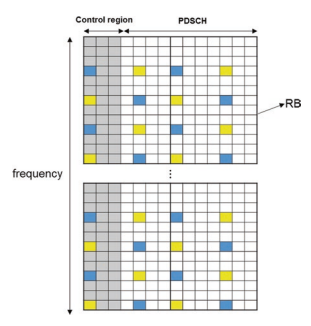 

 控制区域和PDSCH（例如3 OFDM符号）
 更改，PCFICH始终以每个Sub的最高符号传输- 框架使UE知道在哪里检测到它。

 为了确保PCFICH检测的可靠性，使用32位长度的三个代码单词表示表示1、2或3（或2、3或4）OFDM符号[19]。 将32位调制为16个QPSK符号，分为4组。 每个具有4个QPSK符号的组都映射到一个资源元素组（reg）上
 这是控制通道到资源元素映射的资源单元[3]。 在FRST OFDM符号中，一个Reg中有6个连续的资源元素，其中两个资源元素保留给CRS。 这四个Reg几乎均匀地分布在整个带宽上，以实现图2.26所示的频率多样性。 另外，PCFICH在与PBCH的同一天线端口上传输。 如果有2或4个CRS天线端口，则应用SFBC或SFBC+FSTD来实现透射多样性的增益。

 由于PCFICH是每个子的frst ofdm符号- 所有细胞的框架可能会导致不同相邻细胞的PCFICH之间的干扰。 为了使干扰随机，细胞- 指定争夺序列和单元格- 使用PCFICH的FRST REG的指定起始位置。

##  2.5.2.2 ** PDCCH** 

 PDCCH将下行链路控制信息（DCI）传输，包括下行链路调度分配，上行链路调度分配（即UL Grant）和功率控制信息。 对许多DCI格式进行了建议，例如格式0/1/1A/1B/1C/1C/1D/2/2/2A/2B/2C/3/3A/4，取决于下链路或上链接计划分配，携带控制信息（例如， ，电源控制，MCC更改），传输方案和有效载荷尺寸。 为简单起见，发行中的DCI格式- 表2.12总结了10。 应该注意的是，发行后引入了一些新的DCI格式- 10.这些新的DCI格式和每种DCI格式中信息的细节可在[19]中找到。

 PDCCH在一个或几个连续的控制通道元件（CCE）的聚合上传输，其中一个CCE对应于9个REG，每个REG有4个可用的RES。 受支持的CCE聚合水平是1、2、4和8。一个PDCCH分配的CCE数量取决于通道质量和PDCCH的有效载荷大小。 通道质量基于计划的UE报告的CQI，有效载荷大小取决于DCI格式。

  

| 表2.12| DCI格式||
|--------------|---------------------|-----------------------------------------------------------------|
| DCI格式| 控制信息| 使用DCI|
| 0| 上行链路赠款| 带有一个天线端口的Pusch调度|
| 1| 下行链路| 使用一个代码单词的PDSCH调度|
| 任务|||
| 1a| 下行链路| 一个PDSCH代码单词的紧凑计划|
| 任务|||
| 1B| 下行链路| CRS- 基于等级1预编码的PDSCH|
| 任务|||
| 1C| 下行链路| 一个PDSCH代码字的非常紧凑的调度|
| 任务|||
| 1d| 下行链路| CRS- 基于MU- MIMO|
| 任务|||
| 2| 下行链路| 关闭- 使用CRS的循环空间多路复用|
| 任务|||
| 2a| 下行链路| 打开- 使用CRS的循环空间多路复用|
| 任务|||
| 2b| 下行链路| 双重的- 用DM进行层横梁形成- 卢比|
| 任务|||
| 2C| 下行链路| 最多八- 使用DM层传输- 卢比|
| 任务|||
| 3| 功率控制| TPC命令Pucch/Pusch 2- 位功率调整|
| 3a| 功率控制| TPC命令用于Pucch/Pusch，- 位功率调整|
| 4| 上行链路赠款| 上行链路空间多路复用|

 系统中可用的CCE的数量为NCCE =⌊*nreg*/9⌋，它们从0到*ncce* -  1列举，其中*nreg*是未分配给PCFICH和PHICH的REG的数量； 见教派。 2.5.2.1。 在分配PDCCH的CCE时，由N连续CCE组成的PDCCH只能在CCE满足 * I mod n * = 0的情况下启动，其中i是CCE号。 原则上，具有聚合级别n的PDCCH系统中的候选位置的数量为ln =⌊*ncce*/n⌋。 因此，对于聚集级，UE必须盲目检测LN候选PDCCH位置。 为了降低PDCCH盲目检测的复杂性，具有聚合水平n的PDCCH的候选位置数量限制为很小的值，并且所有候选位置的CCE都必须是连续的。 例如，聚合级别1、2、4和8的候选位置的数量分别为6、6、2和2。 如何将PDCCH放置在CCE上以最大程度地减少PDCCH盲目检测的数量是系统设计师搜索空间设计的一部分[12]。

 鉴于要在子中传输的PDCCHS- 框架被放置在CCE上，如上所述，每个PDCCH上的信息位块是多路复用的。 如果某些CCE上没有PDCCH，则在多路复用期间插入<nil>元素，以使PDCCH能够在所需的CCE位置开始。 多路复用碎片的块用一个单元格扰了- 指定拼凑序列，然后调制为qpsk符号。 QPSK符号分为一系列符号四序，其中每个符号四符号由4个连续的qpsk组成
 符号。 然后，使用子块交换器[19]来交错符号四分之一的序列。 从交叉裂料中输出的符号四元块是循环移动的，其中循环移位尺寸由物理单元格确定。 交织可以使一个PDCCH的CCE能够分布在频域中，以利用频率多样性增益。 细胞- 指定争夺序列和单元格- 向系统设计器提供了指定移位尺寸，以随机将- 细胞干扰PDCCH。

 REG的说明如图2.27所示。 周期性移动的符号四元素被顺序映射到未分配给PCFICH的注册
 或Phich。 映射是时间frst，然后转到频域。 REG的大小取决于控制区域中哪个OFDM符号和CRS天线端口的数量。 在FRST OFDM符号中，一个Reg由一个资源块中的六个连续RES组成，每个资源块有两个Reg，每个RES中有两个RES用于CRS，而不论一个或两个CRS天线端口。 在四个CRS天线端口的情况下，控制区域内的第二个OFDM符号中的Reg排泄与DM OFDM符号相同。 使用两个CRS天线端口，第二个OFDM符号中的每个REG由一个在一个资源块中连续的RES组成，每个资源块有三个REG。 对于DM符号的第三个符号，将REG定义为具有两个CRS天线端口的第二个OFDM符号。

 与PBCH相同的天线端口用于PDCCH传输。

 如果有两个或四个CR天线端口，则应用SFBC或SFBC+FSTD来实现传输多样性增益。 PDCCH的处理如图2.28所示。

##  2.5.2.3 ** Phich** 

 Phich带有混合动力- ARQ（HARQ）ACK/NACK响应上行链路

  

 Pusch传输。 对于适当的上行链路HARQ系统操作，应以非常低的错误概率来保持Phich性能以减少数字

 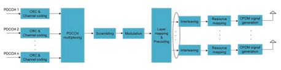 

 重新启动并避免MAC层中运输块失败。2目标性能取决于系统设计师，但名义上确认，由于NACK为10-2，ACK的可能性错误地检测到了ACK的概率，并且错误 检测到ACK的NACK速率至少应低于10-3。

 对于带有一个或两个传输块的Pusch传输，有相应的一个或两个位HARQ ACK/NACK。 多个PHICH被映射到相同的一组资源元素和代码通过使用不同的正交序列 *NPHICH *的代码多路复用。
 Seq，被称为Phich群 *nphich *
 团体 。 A
 Phich资源由索引对N n *phich *标识
 菲奇团体
 seq
 （，）。

 系统中支持的PHICH组的数量是可浓的，并在PBCH的MIB中传输到UE。 在PBCH中，Phich的浓厚包括1- 位菲奇持续时间和2- 位Phich资源。 Phich持续时间表明Phich跨越控制区域中的1或3 OFDM符号。 如果Phich仅位于控制区域的Frst OFDM符号，则促进Phich的功率的空间将受到限制，因为如果也存在于Frst Ofdm符号中，则可以使用PCFICH和PDCCH的功率来传输PCFICH和PDCCH，从而覆盖了覆盖范围。 PCFICH将受到限制。 因此，LTE提供了PHICH资源，以指示PHICH组的数量在资源块上表示为下行链路系统带宽的一部分，以便系统设计师可以将Phich扩散到多个OFDM符号上。 对于框架结构类型1，Phich组的数量在所有子中都是恒定的- 根据PBCH的结合，框架。 但是，对于2型框架结构，PHICH组的数量可能会在下行链路sub之间有所不同- 帧，因为每个下行链路子- 帧可以与不同数量的上行链路子相关联- 帧。 例如，在上行链路中- 下行链路浓汤0，副本- 帧0与两个上行链路子的Puschs相关联- 帧[12]; 对于其他情况，一个下行链路中的Phichs- 框架与一个上行链路子的PUSCH相关联- 框架。

 在Phich组中，在正常环状PERFX和四个正交序列的情况下，在扩展的环状PERFX的情况下，有多达八个正交序列。 表2.13显示了一个Phich组中使用的正交序列。

 对于一个UE，每个Harq Ack- nack位在一个子中传播的一个phich- 框架用三个重复编码，导致一块编码位。 使用BPSK调制编码位的块以生成一个调制块

| 表2.13| Phich的正交序列|||||
|----------------|------------------------------------------|-----------------------|----|----|----|
| 序列索引| 正交序列正常循环prefx| 扩展的环状Prefx||||
| 0| [| 这是给出的||||
| +| +| +| +|||
| 1| 1| 1| 1| [| 这是给出的|
| +| +|||||
| 1| 1|||||
| 1| [| 这是给出的||||
| +| -| +| -|||
| 1| 1| 1| 1| [| 这是给出的|
| +| -|||||
| 1| 1|||||
| 2| [| 这是给出的||||
| +| +| -| -|||
| 1| 1| 1| 1| [| 这是给出的|
| +| +|||||
| j| j|||||
| 3| [| 这是给出的||||
| +| -| -| +|||
| 1| 1| 1| 1| [| 这是给出的|
| +| -|||||
| j| j|||||
| 4| [| 这是给出的||||
| +| +| +| +|||
| j| j| j| j|-||
| 5| [| 这是给出的||||
| +| -|||||
| j| j| +| -|||
| j| j|-||||
| 6| [| 这是给出的||||
| +| +| -||||
| j| j| j| j|||
| -|-|||||
| 7| [| 这是给出的||||
| + j| j| j||||
| -| -| + j|-|||

 符号。 有三个对应于一个harq ack/的调制符号
 NACK位和每个调制符号都通过分配的正交序列扩展。 来自不同UE的扩展调制符号被多路复用并映射到REG上，如图2.29所示。 在频域中，一个Phich组的两个相邻级别的距离几乎为1/3系统带宽，以实现频率多样性增益。

 在两个CR天线端口的情况下，SFBC用于Phich传播。

 但是，如果有四个CRS天线端口，则不能直接使用SFBC+FSTD。 为了将Phich序列的正交性保持在一个Reg中，必须在同一天线端口上传输四个调制符号。 因此，它仅在两个天线端口上执行SFBC，以在Phich的一个Reg中进行调制符号，这会导致不同天线端口之间的功率不平衡。 为了实现更多传输多样性增益并启用了不同天线端口的功率平衡，SFBC在（端口0， *端口 * 2）或（端口1， *端口 * 3）上的操作已在FRST，第二和第三个注册处切换 一个Phich组。

##  2.5.3 PDSCH

 PDSCH带有以下传输方案[12]的数据传输的数据：

## - ** 单身的- 天线端口方案：** 

-  PDSCH变速箱位于一个天线端口上，该天线端口可以在端口0（传输模式（TM）1），端口5（TM7），端口7或端口8（TM8）。

-  ** 传输多样性计划：** 
-  这是一个开放的- 循环等级1基于CRS天线端口的传输方案。 在两个和四个CR天线端口的情况下，传输多样性方案分别为SFBC和SFBC+FSTD。 TM 2中支持传输多样性方案。这也是TM3-10中的后备传输方案。

  

-  ** 大的- 延迟CDD方案：** 
-  这是基于CRS的开放- 循环空间多路复用，秩= 2/3/4传输，在TM3中支持。

-  ** 关闭- 循环空间多路复用方案：** 
-  CRS- 基于封闭- 循环空间多路复用最多四层，在TM4/6中支持。

-  ** Multiuser Mimo计划：** 
-  多达两个用户为MU进行多重多路复用- MIMO，是CRS- 基于TM5中的发射方案并支持。

-  ** 双重的- 层方案：** 
-  它是在发行中引入的- 9用于双重- 层波束成形。 PDSCH在TM8中的天线端口7和8上使用两个传输层进行。

-  ** 最多八- 层传输方案：** 
-  它在发行中引入- 10和DM- 卢比- 基于传输方案。 PDSCH
 将在天线端口7–14上使用多达8个传输层执行。 它在TM 9和10中得到了支持。- 通过高层信号传导静态混合以接收PDSCH
  根据十种传输模式之一，通过PDCCH发出信号的数据传输，称为TM 1-10。 PDSCH处理的一般结构如图2.30所示。

 一个TTI支持多达两个传输块的传输。 在每个传输块形成后，进行CRC和通道编码。 此时，有一个- 到- 传输块和代码单词之间的一个映射。 代码单词的数量（即传输块）由等级的值确定。 如果初始传输中的排名等于1，则只有一个代码单词。 否则支持两个代码单词。 对于代码单词以层映射，当等级大于2时，可以将一个代码单词映射到多个层上。最多选择两个代码单词传输是一种交易- 效果和信号开销。

 如果每个代码单词都映射到一层，则可以使UE执行SIC操作以改进性能； 但是，所需的DL/UL的开销

 图2.30 PDSCH处理的一般结构

  

 2 4G LTE基本空气界面设计
 信令，例如MCS/CQI，将与代码单词的数量成正比。 代码单词对层的详细映射非常复杂，并且超出了本文的范围。 有兴趣的读者应咨询标准[3]。

 在上述传输方案中，预编码操作不同。 对于TM 1-6中的透射方案，图2.30中的预编码后的天线端口是指CRS天线端口，该端口可将其融合为1/2/4。 在这种情况下，预编码矩阵由DCI预先定义或向UE发出信号。 也就是说，UE知道在ENB侧使用了哪些预编码矩阵。 在[3]中对预编码矩阵进行了建议。 但是，对于TM 7-10中的传输方案，天线端口为DM- RS端口和DM的数量- RS端口等于图层的数量。 预编码对UE是透明的，并且不再需要预编码矩阵的信号传导。 预编码信息嵌入了DM中- 卢比。 用于PDSCH的预编码矩阵已达到ENB实现，这为ENB操作提供了自由。 由于使用通道互惠，并且不需要预编码矩阵指示器（PMI）反馈，因此这种操作对TDD友好。 对于FDD，仅针对CSI报告为预编码矩阵进行了建议。 UE根据CSI执行通道测量- RS并将所选的预码矩阵报告给ENB以供参考。 关于如何使用报告的预码矩阵，这留下了ENB实现。

 所有传输方案的资源映射都是相同的。 将预编码的数据映射到每个天线端口的资源元素上。 资源映射是从频率FRST执行的，然后在分配的PDSCH资源块中进行时间。 该映射跳过了不同种类的参考信号所占据的资源元素，例如CRS，DM- RS和CSI- 卢比。

##  2.5.4调制编码方案（MCS）

 基于报告的渠道状态信息（CSI）的调度
 （CQI），是LTE系统的重要特征。 CQI反映了通道质量，并通过调制方案和编码率进行了报告。 15个CQI
 值是定义的，而SINR的步长约为2 dB。 当UE根据通道测量报告CQI索引时，存在以下假设 "a single PDSCH transport block with a combination of modulation scheme and transport block size corresponding to the reported CQI index, and occupying a group of downlink physical resource blocks termed the CQI reference resource, could be received with a transport block error probability not exceeding 0.1"  [12]。 然后，ENB根据报告的CSI执行PDSCH调度。

 为了使UE接收PDSCH传输，它需要确定调制顺序，传输块大小（TBS）和分配的资源块。 调制顺序和TBS指数的组合由5表示- DCI中的Bit MCS Feld。 根据资源分配类型，在DCI中也发出了分配的资源块。 5- 位MCS表包括29个调制和TBS指数的组合以及用于隐式调制顺序和TBS信号的三个状态。 与CQI值相比，29个MC对应于29个具有FNER粒度的光谱效率，在CQI值中，QPSK和16QAM之间的光谱效率在16QAM和16QAM和64QAM之间具有重叠。 总共有27个不同的光谱效果，因为5的某些值- 位MCS表具有相同的光谱效率。 尽管两个调制方案的光谱效率相同，但不同的调制顺序在不同的褪色通道中显示出更好的性能。 根据系统设计人员，根据褪色通道选择相同的光谱效率，选择调制顺序。

 有一个基本的TBS表格，其尺寸为27×110。 从DCI中的信号MC中，可以确定调制顺序和TBS索引。 PDSCH的TBS是通过根据TBS索引和分配的资源块的数量查找基本TBS表来确定的。 如果将传输块映射到多个层，则从基本TBS表中确​​定的TBS然后转换为与映射到传输块的层数相对应的FNAL TBS。 5个条目在5个条目- BIT MCS表表示，假定TBS是从最新PDCCH中运输的同一传输块中运输的DCI确定的。

 原则上，可以根据MC和可用资源元素的数量直接计算TBS，从而导致任意TBS。 任意的TBS与Turbo QPP Interleaver的大小（需要填充或拔钉）不匹配，并且MAC有效载荷大小通常使用字节[20，21]计算出来。 此外，由于可用资源元素的数量可能不同，例如，控制区域已更改，因此TBS可能会有所不同。 因此，希望与不同数量的资源块相对应的TBS在不同的sub上是恒定的- 框架和TBS
 应与QPP尺寸对齐，以消除填充/脱垫的需求。

 计算MCS的TBS需要一个资源假设：控制区域的三个OFDM符号，两个CRS天线端口，无PSS/SSS/PBCH和正常CP
 [20]。 生成的TBS表可以在[12]中找到。 注意到，实际资源分配可能与生成TBS表的资源假设不同，例如，控制区域中的OFDM符号的数量不是3，并且存在CSI- RS或DM- 卢比。 所得的编码率可能不是MC的确切编码率，而是接近MC。

##  2.6 ** 上行链路传输**  2.6.1 Pucch

 上行链路控制信息（UCI），包括调度请求（SR），HARQ- 当在同一子中没有pusch传播时- 框架。 在Pucch和Pusch的同时传播的情况下，如果Pucch和Pusch的同时传播不混合，则在Pusch上可以将UCI在Pusch上行走。 PUCCH位于一个插槽内传输带宽边缘的资源块，在一个子中的两个插槽中跳过频率- 帧如图2.31所示。

 Pucch在边缘的放置是促进Pusch的连续资源块分配并实现频率多样性增益。 分配给PUCCH的资源块由调度程序定义，并通过高层信号传输。

 根据Pucch上的UCI，对几种Pucch格式进行了针对的。 随着释放的发展，一些PUCCH格式（例如，格式3）被扩展以适应新的UCI。 对于本会，仅引入了这种Pucch格式的原始功能，以简单起见。 扩展功能可以在[12]中找到。 表2.14总结了不同PUCCH格式的UCI。

##  2.6.1.1 ** Pucch格式1/1A/1B** 

 对于Pucch格式1，调度请求（SR）由存在或不存在

   of transmission of PUCCH from the UE.  The periodic resource for SR is UE-specifcally confgured by higher layer signaling. If there is the scheduling request in the SR time instance, UE transmits the bit  "1"  in the form of BPSK on 

| 表2.14| 以Pucch格式传达UCI||
|--------------|---------------------------------|-------------------------------|
| Pucch格式| 运送UCI| 最初是引入发布|
| 1| Sr| 发布- 8|
| 1A/1B| 哈克- ACK| 发布- 8|
| 2| 周期性CSI| 发布- 8|
| 2a/2b| CSI + HARQ- ACK| 发布- 8|
| 3| 哈克- ACK| 发布- 10|
| 4| 哈克- ACK或周期性CSI| 发布- 13|
| 5| 哈克- ACK或周期性CSI| 发布- 13|

 pucch; 否则，UE不会传输任何内容。 Pucch格式1A/1B携带1- 位和2- 位- ACK和相应的调制方案分别为BPSK和QPSK。

 调制符号乘以循环移动的序列，长度为12，其中序列与上行链路DM相同- 一个资源块为RS序列定义。 乘以序列是块- 在一个插槽内，明智的是用长度为4或3的正交序列，其长度为4或3。 然后两个- 尺寸扩展符号映射到一个资源块上。 资源块中间的三个OFDM符号保留给PUCCH DM- 相干检测的RS，其余的OFDM符号用于PUCCH数据，如图2.32所示。 Pucch DM- RS也是两个- 尺寸序列，这是一个序列的循环移位（cs），该序列长度为12- 明智的以长度3的正交序列扩散。

 来自不同UE的PUCCH格式1/1a/1b通过使用不同的两个- 维序列。 PUCCH资源通过CS索引和覆盖（OCC）索引的正交代码的组合表示。

 频域中的序列是一个序列的CS。 可用CS的数量取决于CS距离的三个值1、2或3，这是由较高层融合并取决于延迟扩展的。 浓缩的CS距离用于PUCCH数据和Pucch DM- 卢比。 CS随一个单元格中的符号号和插槽号而变化- 指定方式将间系干扰的方式随机化。 考虑到额外的4个OCC，在时域中，可用两个的最大数量- Pucch数据的维序列原则上为48、24、16。 Pucch DM的OCC长度- RS为3，因此可用DM的最大数量- RS分别为36、18、12。 由于需要相干检测和PUCCH DM数量的限制- Rs，PUCCH数据只需要三个ACC。 表2.15总结了OCC = 4和3的序列。 对于Pucch数据，在一个子中的两个插槽中都应用了OCC = 4- 帧或OCC = 4用于FRST插槽，如果最后一个OFDM符号保留给SRS，则将OCC = 3应用于第二个插槽。

  

 图2.32 Pucch格式1/1a/1b

  

 表2.15与PUCCH格式1/1A/1B的OCC的正交序列

##  2.6.1.2 ** Pucch格式2/2A/2B** 

 PUCCH格式2是为了传达包括RI，PMI和CQI在内的定期CSI。 REED  -  Muller（RM）代码用于编码最多11位的周期性CSI，编码的输出为20位[19]。 执行QPSK调制以生成十个QPSK符号。 每个调制符号都乘以循环移动的序列，长度为12，并将其映射到一个资源块中的一个符号上。 对于正常CP，有两个用于DM的符号- 如图2.33所示，RS和PUCCH数据的其余FVE符号在一个资源块中。 在扩展CP的情况下，DM只有一个符号- RS位于资源块的第四个符号。

 总共十个QPSK符号被映射到一个从一个子中的两个不同插槽的两个资源块上- 框架。 与Pucch格式1/1a/1b相似，一个基本序列的CS被分配给不同的UE，用于多路复用，可用CS的数量取决于CSS的CS距离。 通常，它最多可以支持6个UES多路复用。 Pucch格式2的资源是半- 通过较高的层信号传导静态浓厚。

  

 图2.33 PUCCH格式2/2A/2B的传输结构在正常CP的情况下
 当周期性的CSI和ACK/NACK反馈来自某个UE时，使用PUCCH格式2A/2B。- 框架，仅适用于正常CP的情况。 ACK/NACK调制符号乘以第二个DM- 一个资源块中的RS序列； 也就是说，ACK/NACK信息由两个DM之间的相对相传达- RS符号。 Pucch格式2A/2B对应于1- 位或2- 位分别为ACK/NACK。 在延长CP的情况下，定期CSI和1- 或2- 位ack/nack被串联，然后用RM编码编码。

##  2.6.1.3 ** Pucch格式3** 

 在发行中- 10，支持最多FVE组件载体的载体聚合。 由于每个载体有一个独立的HARQ实体，因此报告的ACK/NACK位数量增加。 例如，最多有十个- fdd的位ack/nack，更重要的是TDD，具体取决于DL- UL子- 框架浓汤。 Pucch 1a/1b/2无法传达如此多的ACK/NACK位。 引入了Pucch格式3，以支持多达11位的FDD，最多为10位- 位ack/ nack和1- 位阳性/负SR，最多21位的TDD对应于20位- 位ack/nack和1- 位积极/负SR。

 Pucch格式3使用RM（ ** 32，o**  ）作为通道编码方案[19]，其中O
 最大值的ACK/NACK位数量是11。当ACK/NACK/SR位的数量小于或等于11位时，编码的输出为32位，然后执行循环重复以获得循环重复 48位对应于24个QPSK符号。 每个调制符号通过长度为5的序列传播到时域中- 一个资源块中的载体索引。 24个调制符号的映射跨越了一个子中两个插槽的两个资源块- 框架。 DM- RS位置与Pucch格式2/2A/2B相同。 由于O的最大尺寸为11，如果ACK/NACK/SR位的数量大于11位，则ACK/NACK/SR位均匀分为两个块，每个块的大小不超过11​​个块 位。 使用RM的相同渠道编码方案（ ** 32，o**  ）分别为每个块，即双重执行- RM代码[22]，输出仅为与12个QPSK符号相对应的24位。 为了达到频率多样性增益，这两个块中的调制符号交替映射到频域中的RES上。 这使得每个块的总共12个QPSK符号可以在两个PUCCH资源块上分布。 Pucch的传输结构
 格式3如图2.34所示。

##  2.6.1.4 ** Pucch格式4/格式5** 

 在发行中- 13，最多32个组件载体的大量载体聚集是

 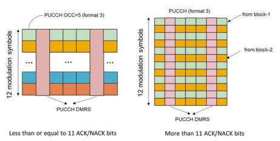  introduced. Normally, it is not possible for one operator to have so many licensed component carriers for aggregation. However, there is larger unlicensed spectrum bandwidth available for use below 6 GHz. Due to the larger number of carriers, the payload size of periodic CSI and/or ACK/NACK is further signifcantly increased, and therefore PUCCH format 4/5 was introduced as the container.

 Pucch格式4的传输与Pusch相似。 Pucch格式4最多可以将多达八个资源块融合在一起，然后在一个子的两个插槽上跳跃- 框架用于收获频率多样性增益。 仅支持QPSK调制，用于强大的PUCCH传播。 类似于Pusch，DFT- 基于调制的符号将基于转换的预编码应用。 DM- RS传输也与Pusch的传输相同。 对正常的PUCCH格式和缩短的Pucch格式进行了反对，与第二个插槽的最后一个符号相对应。 对于普通的PUCCH格式，PUCCH数据传输有12个（正常CP）和10（扩展CP）符号。 对于缩短的PUCCH格式，有11个（正常的CP）和9（扩展的CP）符号用于PUCCH数据。 Pucch格式4的编码位数为NRB N Pucch*符号* 4 4* Pucch* ∗ ∗ 12 ∗ 2，其中Nrb
 Pucch 4是浓缩资源块的数量，而nsymbol pucch 4是符号的数量。 带有CRC的尾咬卷积代码（TBCC）用作PUCCH格式4的通道代码。

 PUCCH格式5传输仅限于一个资源块，并且在一个子中的两个插槽中频率跳跃- 框架。 通道编码，调制和DFT的操作- 基于的转换预编码与Pucch格式4相似。区别在于有一个块- 明智的传播操作在DFT之前- 基于转换的预码。 使用[+1+1]或[+1-1]传播六个调制符号的块以获得12个调制符号，然后由DFT操作12个调制符号- 基于转换的预码。 Pucch格式5的编码位数为6 2 5 * * * * nsymbol * pucch，其中nrb
 PUCCH5是符号的数量，具体取决于正常或缩短的Pucch格式。 PUCCH格式5适用于中号有效载荷尺寸。 由于使用了两个扩展序列，因此最多可以支持两个UES多路复用。

##  2.6.2 Pusch

 Pusch的两个传输方案是：

## - ** 单身的- 天线端口方案：** 

-  它是上行链路TM1中的传输方案，而TM2中的后备传输方案。

-  ** 关闭- 循环空间多路复用：** 
-  最多四个- 支持层传输，这是TM2中的传输方案。

 Pusch加工的一般结构如图2.35所示。 对于Singleantenna港口计划，只有一个运输区。 如果关闭- 循环空间多路复用，类似于下行链路，最多支持两个传输块。 用于PUSCH传输的图层数（即等级）和预编码矩阵的数量由ENB确定，然后通过UL Grant向UE发出信号。 支持的最大层是4。代码单词- 到- 层映射与PDSCH的映射相同。 为了保留每个天线端口上Pusch变速箱的单个载体特性，引入了立方度量保存（CMP）代码簿。 预编码矩阵的每一行中只有一个非零元素，该矩阵避免了同一天线端口上两个信号的混合。 另外，针对2和4个天线端口的天线选择预编码矩阵是

  

 图2.35 Pusch处理的一般结构2 4G LTE基本空气界面设计
 支持的。 可能会发生由于手动抓取手机的手动，这部分发射天线被阻塞，这会导致无线电信号中的明显损失。 在这种情况下，天线选择用于节省传输功率。 CMP代码手册的不同等级的详细信息超出了本文的范围，可以在[3]中找到。

 Pusch传输基于DM- RS端口和DM的数量- RS端口等于UL赠款中标志的等级。 与下行链路不同的是，Pusch透射的预编码不是透明的。 在上行链路中，预编码矩阵和对计划UE的相应MCS由ENB确定。 UE是在标准中授权的，并通过RAN 4指定的测试进行测试以使用信号的预编码矩阵。 亩- Pusch传播还支持MIMO。 也就是说，由于具有多个接收天线能力，因此可以同时将多个UES传输Pusch数据，并且频率资源可以通过ENB分离。 上行链路MU- Mimo也被称为虚拟MIMO
 因为多个传输天线来自不同的UES。 从UE的角度来看，它不知道是否还有其他UE在一起。 也就是说- MIMO对UE是透明的。 要将Pusch与不同的UE分开，请上行DM- 通过使用一个DM的不同循环移位，将RS分配给不同的UE- RS序列。 由于有八次环状偏移，它原则上可以为MU提供多达八个UES- MIMO原则上。 不同UE的环状偏移的分配适用于MU之间对齐资源分配的情况- Mimo Ues。 在发行中- 上行链路DM的10，OCC随时间域- 引入了RS（请参见第2.4.2节），该第2.4.2节支持两个UE的MU，并分配了不一致的资源- MIMO。 在实用系统中，尤其是对于TDD系统中，例如8或16，有大量的接收天线，并且上行链路资源有限； 因此，人们渴望通过为MU提供不一致的资源分配支持更多的UE- MIMO。 在发行中- 14，上行链路DM- 引入了梳子形式的RS形式，以支持多达四个UE，并具有不一致的资源分配。

##  2.6.3调制

 为了使ENB接收Pusch传输，需要确定调制顺序和传输块大小（TBS）。 确定PUSCH的MC和TBS的过程与PDSCH相同。 调制顺序和TBS指数的组合也由5表示- Bit MCS Feld在上行链路拨款中。 5- PUSCH的BIC MCS表源自PDSCH的BIC表，并进行了一些更改。 更改是，对于与64QAM相对应的FRST四个MC索引，调制方案被视为16QAM。 原因是许多UE类别不支持64QAM或ENB不支持Pusch的64QAM传输。 在这种情况下，对应于16QAM的最高MC为2.41位/符号，限制了峰值数据速率，因此进行了相关更改，并且MC可以达到3.01位/符号[23]。

##  2.7 ** HARQ时机** 

 哈q使用停止- 和- 等待传输协议。 传输块变速箱后，发射器停止等待，直到接收器接收到对抗。 接收器根据传输块检测结果向发射机报告指标（即ACK或NACK）。 如果收到ACK，则发射器将传输新的运输块； 否则，将错误检测到的传输块重新转载。 每个站点- 和- 等待协议传输形成一个HARQ过程。 下行链路HARQ操作如图2.36所示。

 支持多个平行的HARQ流程以提高整体系统性能。 HARQ过程的最大数量取决于该回合- 行程时间（RTT）如图2.36所示，其中RTT受ENB和UE处理时间的限制[1]。 在LTE中，假定ENB处理时间为3 ms，并且UE
 对于PDSCH的1 ms TTI，处理时间为3 −TA [24]。 基于该假设，FDD DL/UL的HARQ过程的最大值设置为8。TDD的最大HARQ过程数量取决于DL/UL浓度和ENB/UE处理能力[12，25] 总结在表2.16中。

 有两种类型的HARQ机制被认为是同步HARQ和异步HARQ [8]：- 同步HARQ：某个HARQ过程的（RE）传输仅限于已知时间。

-  异步HARQ：某个HARQ过程的（RE）传输可能随时发生，但是传输和重新传输之间的持续时间大于RTT。 对于同步HARQ，预定了（重新）传输的（重新）传输的时间，因此可以直接从时间立即派生HARQ过程编号。3在这种情况下，重新启动可以重复使用与相同的传输格式 初始传输包括资源分配和MC，没有控制信号，称为非自适应HARQ。 这具有控制信号开销降低和简单的好处

  

  

 0 4 7 1 7 4 2 10 2 3 9 6 4 12 3 5 15 2 6 6 1
 调度。 相反，异步HARQ需要对HARQ过程编号的明确信号传导，但具有安排重新启动性的优势。 这适用于下行链路变速- 框架或子- 带有分页或系统信息的框架。 在LTE中，同步HARQ用于上行链路，异步HARQ用于下行链路。

 HARQ重传的软梳子方案包括追逐和增量冗余（IR）。 Chase组合意味着重新启动位与最初传输的信息位完全相同。 但是，对于IR而言，重新启动位必须与初始传输的部分相同。 取而代之的是，与上一个变速箱中传输的编码位（初始或重传）相比，下次重传中有增量的编码位。 在这两种情况下，在重新传输后软组合将导致较低的代码速率增加检测概率。 重传中的增量编码位称为冗余版本（RV），是

  

 DCI中的MCS指数暗示。 在LTE中，HARQ基于IR。 注意到CC是IR的特殊情况。 4无论同步或异步HARQ，LTE中的HARQ时机都是预定义的； 也就是说，在检测到子的运输块时- 框架n，相应的ack/nack在子中传输- 框架N + T HARQ如图2.36所示。 对于FDD而言，DL和UL的HARQ TIMing Tharq均为4，如图2.37所示。 对于TDD，HARQ定时取决于DL/UL配置和PDSCH/PUSCH的位置。 可以看出，harq ack/
 NACK对应于几个下行链路子中传输的PDSCH- 帧在一个上行链路子中传输- 框架，但要求tharq≥4，例如，harq
 图2.37中的DL/UL配置2的计时。

  

##  2.8 ** 载体聚集（CA）和带组合** 

 用于LTE释放- 8，单个载体的最大通道带宽为20 MHz，假设64QAM和四层峰值数据速率可以达到约300 Mbps [9]。

 为了满足对1 Gbps的峰值数据速率的要求[26]，在发行中引入了CA- 10要支撑FVE组件载体聚集，每个组件载波的最大通道带宽为20 MHz。 在发行中- 12，加强CA以支持FDD和TDD载体的聚合，这是一种FDD和TDD收敛，因为FDD和TDD的优点都可以共同利用。 在发行中- 13，CA进一步增强以支撑多达32个组件载体聚集，原则上可以支撑高达32×20 = 640MHz。 但是，一个操作员在实用系统中具有640 MHz许可的光谱是很困难的，并且聚合的组件载体也可以在未经许可的频谱上。 基于聚合的组件载体是否在同一频带内- 乐队CA和Inter- 乐队CA被定义。 [9]中对LTE频段和不同的CA频段进行了建议。 CA是LTE的一个非常重要的功能，世界上已经有241个商业网络[27]。

 如前所述，CA的一个重要目标是提高峰值数据速率。

 但是，CA的其他重要优势是调度增益和负载平衡。 对应于组件载体，层和调制顺序数量的不同组合，有许多UE类别。 表2.17列出了具有典型峰值数据速率的UE类别[9]。

##  2.9 ** 初始访问和流动性程序** 

 在UE可以在LTE载体上操作之前，UE需要从FRST执行初始访问过程以访问网络并建立无线电资源控制（RRC）连接。 初始访问过程包括单元格搜索，随机访问和RRC连接建立。

| DL/UL| UE类别| 峰值数据速率| 组件载体数量| 层数| 调制|
|---------|---------------|------------------|-----------------------------|-----------------|--------------|
| DL| 4| 150 Mbps| 1| 2| 64Qam|
| DL| 5| 300 Mbps| 1| 4| 64Qam|
| DL| 8| 3 Gbps| 5| 8| 64Qam|
| DL| 14| 3.9 Gbps| 5| 8| 256Qam|
| DL| 17| 25 Gbps| 32| 8| 256Qam|
| Ul| 5| 75 Mbps| 1| 1| 64Qam|
| Ul| 13| 1.5 Gbps| 5| 4| 64Qam|
| Ul| 19| 13.56 Gbps| 32| 4| 256Qam|

 单元搜索是UE获取时间的过程（符号/插槽/帧）
 和频率与细胞以及物理层单元格（单元格ID）同步。 支持504个物理层单元格ID，许多第1层传输参数（例如参考信号序列生成和争夺序列）取决于物理层单元格ID。 504物理层单元格分为168个独特的物理层单元格组，每个组包含三个ID。 对主要和次级同步信号（PSS和SSS）进行了建议，以促进细胞搜索。 由于在UE执行单元格搜索之前没有任何先验知识，因此同步信号总是在系统带宽的中心六个资源块中传输，因此UE始终知道它在哪里。 PSS以框架结构1类型1和10的插槽0和10的DM符号传输，插槽2和12中的第三个OFDM符号用于框架结构类型2。SSS在插槽0和10的第二个最后一个OFDM符号中传输 对于框架结构类型1和插槽1和11中的最后一个OFDM符号，用于框架结构类型2。

 在一个无线电框架的两个插槽中传输的PSS是相同的。 该传输用于获取符号同步和单元ID信息的一部分。 有三种不同的ZC根序列，其中PSS代表一个物理层单元ID组中的三个唯一ID。 由于存在直流电流（DC）子载波，因此将序列的中间元素刺穿到中心六个资源块上。 映射导致时间域中PSS的对称特性，这可以降低UE处的计算复杂性[28]。 一旦获得PSS，UE就可以根据PSS和SSS之间的时间关系检测SSS。 由于PSS和SSS之间的时间关系对于框架结构类型1和2有所不同，因此SSS的检测还可以获取框架结构和环状PERFX的信息。 由于PSS和SSS符号之间的近距离，PSS可用于连贯检测SSS，这取决于UE实现。 SSS由两个短序列表示，长31，两个短序列的168个唯一组合代表物理层单元格ID组。 对于两个短序列的所有组合，第一个短序列的索引始终小于第二个短序列的索引，这可以减少细胞组ID检测的歧义[29]。 SSS的两个短序列的位置在一个无线电框架的两个插槽上切换，可用于获取子- 框架同步。

 完成单元搜索后，UE需要获取PBCH和SIBS传达的系统广播信息。 检测到PBCH以获得系统带宽，CRS天线端口的数量，SFN和PHICH持续时间。 2.5.1。 SIBS在物理层中映射到PDSCH，并用System Information Notegry Notegrant Network临时标识符加扰的CRC的相应PDCCH（SI）- RNTI）在所有UE检测的公共搜索空间中传输。 PDCCH指示SIBS的计划资源，MCS等。 具有不同周期性的SIB的传播周期性。 SIB1使用80 ms的FXED周期性，在80毫秒内有四次重复。 SIB1的FRST传输安排在子中- SFN mod 8 = 0的无线电框架框架5，并在Sub中安排了重复- SFN mod 2 = 0 [11]的所有其他无线电帧的帧5。 SIB1包含信息，以确定是否允许UE访问此单元格并进行其他系统信息（SI）的调度。 SI消息用于传达以外的一个或多个SIB1。 一个SI消息中包含的所有SIB都以相同的周期性传输，并且只能将一个SIB映射到一个SI消息。 SIB2始终映射到SIB1中的Frst Si。 SIB2包含无线电资源融合信息，例如所有UES，例如MBSFN副帧结合和PRACH CONTGURATION信息。 每个SIB的详细信息可以在[11]中找到。

 UE需要执行随机访问以实现PUSCH传输的上行链路同步，并在获得与随机访问有关的系统信息（包括Prach浓度，频率位置，根序列，循环移动，循环偏移，设置类型（限制或无限制）和 很快。 Prach的传播在一个子中占据了六个资源块- 框架或更多连续子- 帧，可扩展到不同的系统带宽。 在初始访问阶段，使用了竞争基础随机访问程序，因为UE处于空闲状态，该状态具有四个步骤，如图2.38 [30]所示。 步骤1：随机访问序言传输：UE FRST从浓厚的序言序列集中选择一个序列序列，并以所需的功率将其传输到浓厚的频率资源中。

 步骤2：随机访问响应（RAR）：在成功检测到的前序序列后，ENB将传输RAR
 在响应这些传输序列序列的下行链路中。 RAR在计划的PDSCH中传输，该PDSCH用随机标记的PDCCH表示- 访问rnti（ra- rnti）。 RAR至少传达了检测到的随机的身份- 访问序言，定时对准信息和随机访问响应赠款（RARG）[12]和临时单元RNTI的分配（临时C- rnti）。 如果有多个随机- 同时检测到的访问前置放大器，RAR中的预期信息可以包含在一个PDSCH中。

 步骤3：PARG- 基于UL的传输：
 接收RAR后，使用信号的时序比对信息将UE在上行链路中同步。 但是，UE尚未建立与单元格的连接。 RARG计划的PUSCH从高层传达了一些请求信息，例如RRC连接请求和NAS UE标识符[30]。 Pusch被临时C扰乱- rnti。

 步骤4：下行链路上的争论解决方案：
 可能会发生多个UES传递相同的随机- 同时访问前序，然后接收相同的RAR，这导致使用相同临时C的不同UE碰撞- rnti。 为了解决碰撞，ENB
 通过图2.38标记的PDCCH计划传输一条下行链路消息

  

 程序临时C- 步骤2中的RNTI。UES将检查下行链路消息中的UE标识是否与步骤3中传达的身份相同- RNTI将晋升为C- ue rnti; 否则，UE需要从步骤1重新启动随机访问过程。

 除了争论- 基于随机访问程序，也有非征信- 仅适用于移交和DL的基于的随机访问程序
 需要随机访问过程[30]的rrc_connected期间的数据到达。

 UE为RRC_IDLE和RRC_提供了两种状态
 连接（图2.39）[30]。 在RRC_idle状态中，没有RRC上下文和指定单元格附件。 在此状态下的UE没有接收/传输的数据，并且可以处于节省电源的睡眠模式。 触发它建立RRC连接后，执行了上述的随机访问过程，并建立了RRC上下文以移至RRC_Connected状态。 如果是rrc_connected状态，则可以在UE和ENB已知的RRC上下文中执行UE和ENB之间的正常通信。 如果没有数据要传输，则可以释放RRC连接到RRC_IDLE状态。

##  2.10 ** 概括** 

 最初设计LTE时，与最近情况相比，系统的考虑方面更为简单，更专注。 与FDD相对较低的频带是主要的考虑因素，而TDD在很大程度上是一个添加- 通过增强FDD框架结构的特征。 即使在那个时间点，系统带宽也相对狭窄，即使20 MHz载体带宽被认为宽（就实施复杂性和所需数据速率而言）。 部署方案用于宏基站的均质网络拓扑。 虽然提高数据速率是LTE的优先事项，但网络的覆盖范围和鲁棒性无疑是基本因素。 从一开始就将MIMO作为提高光谱效率和峰值数据速率的高级功能引入。

 但是，基站的天线数量最多可达4，只有SU- MIMO在FRST版本中得到了支持。 下行链路和DFT的Ofdma- 选择用于上行链路的SOFDM用于通道的可乘多路复用，并更轻松地支持MIMO收发器方案。 结果，最初的LTE设计是一个简单而僵化的框架。 简而言之，基本空气- LTE的界面设计可以描述为单个命理学和刚性框架结构的单个载体（具有较小的候选值），始终具有FXED- 在所有传输方案，可知的控制区域和初始访问通道上的CRS上。

 虽然非常- 出色地- 设计的系统是，在需要满足新用例和要求时，LTE的简单且令人垂涎的LTE框架很快就会出现问题。 对于MBB贩运，更高的系统容量需求推动了更广泛的系统带宽（这将网络推向了更高的频带，在此，TDD而不是FDD频段更为突出），宏基基站的密集部署以及小单元格（架空架空和干扰） 永远- 在CRS传输上，这是针对新功能引入的性能和兼容问题的显着限制因素），并引入了MU- MIMO和大型MIMO（要求DM- 卢比- 和CSI- 卢比- 用于传输和CSI反馈的式设计。 除MBB外，还支持新应用程序（例如机器）- 类型通信，D2D/V2X和LTE中的URLLC需要大量努力才能在其框架结构下工作。 运营商等功能

  

 聚合，fd- MIMO，SIDELINK/V2X，NB- 在以后的LTE版本中引入了IoT/EMTC，小单元开/关和HRLLC，以解决这些问题。

 所有这些都像经验教训或对新领域的探索，这表明是时候设计新的空气界面时需要的元素。 即使没有改变基本波形和与基本框架结构的相似性，NR也
 采用了多个/可伸缩命理的框架截然不同的框架，可爱的框架结构，DM- 卢比- 和CSI- 卢比- 中心参考信号设计无总是- 在信号上，以及确保前进兼容性的机制。 下一章将开始我们对5G NR空气界面的调查。

##  参考

1.  E. Dahlman，S。Parkvall和J. Skold，4G：LTE/LTE- 荷兰阿姆斯特丹移动宽带的高级：Elsevier出版社，2011年。

2.  S. Sesia，I。Toufk和M. Baker（eds），LTE：UMTS长期进化，纽约州纽约州：John Wiley and Sons Publishing，2011年。

3.  3GPP， "TS 36.211: Evolved Universal Terrestrial Radio Access (E-UTRA); Physical channels and modulation,"  2018年6月。[在线]。 可用：https：//portal.3gpp.org/desktopmodules/
 specifcations/specifcationDetails.aspx？spemifcationID = 2425。

4.  伊图- r， "Report M.2370: IMT Traffc estimates for the years 2020 to 2030,"  2015年7月。

 [在线的]。 可用：https：//www.itu.int/pub/r- 代表- M.2370。

5.  R. V. Nee和R. Prasad，Maschusetts波士顿的DM无线多媒体通信：
 Artech House Publisher，2000年。

6.  C. C. Yin，T。Luo和G. X. Yue，Multi- 航母宽带无线通信技术，中国北京：北京邮政与电信大学出版社，2004年。

7.  摩托罗拉， "R1-060385: Cubic metric in 3GPP-LTE,"  3GPP TSG- 运行WG1会议\# 44，美国丹佛，美国，2006年2月。[在线]。 可用：https：//www.3gpp.org/ftp/tsg_ran/ wg1_rl1/tsgr1_44/docs。

8.  3GPP，"TR 25.814, Physical layer aspects for evolved Universal Terrestrial Radio Access 
(UTRA) (Release 7)," 2006年9月。[在线]。 可用：https：//portal.3gpp.org/desktopmodules/specifcations/specifcationdetails.aspx?specifcationId = 1247。

9.  3GPP，"TS 36.104: Evolved Universal Terrestrial Radio Access (E-UTRA); Base Station (BS) 
radio transmission and reception," 2010年3月。[在线]。 可用：https：//portal.3gpp.org/ desktopmodules/specifcations/specifcationDetails.aspx？spemifcationID = 2412。

10. 3GPP，"TR 25.913: Requirements for Evolved UTRA (E-UTRA) and Evolved UTRAN 
(E-UTRAN) (Release 8)," 2008年12月。[在线]。 可用：https：//portal.3gpp.org/desktopmodules/specifcations/specifcationdetails.aspx?specifcationId = 1342。

11. 3GPP， "TS 36.331: Radio Resource Control (RRC) Protocol Specifcation (Release 8)," 
 2009年9月。[在线]。 可用：https：//portal.3gpp.org/desktopmodules/specifcations/pecifcationdetails.aspx？spegifcationID = 2440。

12. 3GPP， "TS 36.213: Evolved Universal Terrestrial Radio Access (E-UTRA); Physical Layer Procedures (Release 15),"  2008年6月。[在线]。 可用：https：//portal.3gpp.org/desktopmodules/specifcations/specifcationdetails.aspx?specifcationId = 2427。

13. 3GPP， "TS 36.214: Evolved Universal Terrestrial Radio Access (E-UTRA); Physical layer; Measurements (Release 15),"  2018年6月。[在线]。 可用：https：//portal.3gpp.org/desktopmodules/specifcations/specifcationdetails.aspx?specifcationId = 2428。

14. 三星和诺基亚网络， "RP-141644: New SID Proposal: Study on Elevation Beamforming/Full-Dimension (FD) MIMO for LTE,"  3GPP TSG- 运行\# 65，英国爱丁堡，2014年9月。[在线]。 可用：https：//www.3gpp.org/ftp/tsg_ran/tsg_ran/ tsgr_65/docs/。

15. 三星，"RP-160623: New WID Proposal: Enhancements on Full-Dimension (FD) MIMO 
for LTE," 3GPP TSG开会\# 71，瑞典Göteborg，2016年3月。[在线]。 可用：https：//www.3gpp.org/ftp/tsg_ran/tsg_ran/tsgr_71/docs/。

16. 3GPP， "TR 36.872: Small cell enhancements for E-UTRA and E-UTRAN, Physical layer aspects (Release 12),"  2013年12月。[在线]。 可用：https：//portal.3gpp.org/desktopmodules/specifcations/specifcationdetails.aspx?specifcationId = 2573。

17. D. C. Chu， "Polyphase Codes with Good Periodic Correlation Properties,"  IEEE Trans。 信息理论，第1卷。 18，不。 4，第531–532页，1972年。

18. 松下和NTT DOCOMO，"R1-073626: Reference signal generation method for E-TTRA 
uplink," 3GPP TSG- 运行WG1会议\# 50，雅典，希腊，2007年8月。[在线]。 可用：https：//www.3gpp.org/ftp/tsg_ran/wg1_rl1/tsgr1_50/docs/。

19. 3GPP， "TS 36.212: Evolved Universal Terrestrial Radio Access (E-UTRA); Multiplexing and channel coding (Release 15),"  2018年6月。[在线]。 可用：https：//portal.3gpp.org/desktopmodules/specifcations/specifcationdetails.aspx?specifcationID = 2426。

20. 摩托罗拉， "R1-080072: TBS and MCS Table Generation and Signaling for E-UTRA,"  3GPP
 TSG RAN1会议\# 51Bis，塞维利亚，西班牙，2008年1月。[在线]。 可用：https：// www.3gpp.org/ftp/tsg_ran/wg1_rl1/tsgr1_51b/docs/。

21. 爱立信， "R1-080556: Outcome of ad hoc discussions on TB size signaling,"  3GPP TSG
 RAN1会议\# 51Bis，塞维利亚，西班牙，2008年1月。[在线]。 可用：https：//www.3gpp。

 org/ftp/tsg_ran/wg1_rl1/tsgr1_51b/docs/。

22. 华为和Hisilicon， "R1-105247: A/N coding schemes for large payload using DFT-SOFDM,"  3GPP TSG RAN1 \# 62BIS，西安，中国，2010年10月。[在线]。 可用：https：//
 www.3gpp.org/ftp/tsg_ran/wg1_rl1/tsgr1_62b/docs。

23. 爱立信，松下和摩托罗拉， "R1-082091: MCS and TBS Tables for PUSCH,"  3GPP
 tsg ran1 \# 53，美国密苏里州堪萨斯城，2008年5月。[在线]。 可用：https：//www.3gpp。 org/ftp/tsg_ran/wg1_rl1/tsgr1_55/docs。

24. 爱立信等人， "R1-073871: Maximum number of hybrid ARQ processes,"  3GPP TSG RAN1
 \ \# 50，雅典，希腊，2007年8月。[在线]。 可用：https：//www.3gpp.org/ftp/tsg_ran/ wg1_rl1/tsgr1_50/docs。

25. 华为等， "R1-081124, Way forward for TDD HARQ process,"  3GPP TSG RAN1
 \ \# 52，意大利索伦托，2008年2月。[在线]。 可用：https：//www.3gpp.org/ftp/tsg_ran/ wg1_rl1/tsgr1_52/docs。

26. 3GPP， "TR 36.913: Requirements for further advancements for Evolved Universal Terrestrial Radio Access (E-UTRA) (LTE-Advanced) (Release 8),"  2009年3月。[在线]。 可用：https：//portal.3gpp.org/desktopmodules/specifcations/specifcationdetails.aspx?specifcati onid = 2585。

27. GSA， "Evolution from LTE to 5G,"  2018年4月。[在线]。 可用：https：//gsacom.com/
 纸/进化- LTE- 5G/。

28. 华为， "R1-072321: P-SCH sequences,"  3GPP TSG RAN1 \# 49，日本科比，2007年5月。

 [在线的]。 可用：https：//www.3gpp.org/ftp/tsg_ran/wg1_rl1/tsgr1_49/docs。

29. Texas Instruments等， "R1-074143: Way Forward for Secondary SCH Mapping and Scrambling,"  3GPP TSG RAN1 \# 50，中国上海，2007年10月。[在线]。 可用：https：//www.3gpp.org/ftp/tsg_ran/wg1_rl1/tsgr1_50/docs。

30. 3GPP，“ TS 36.300：进化的通用陆地无线电访问（E- UTRA）和进化的通用地面无线电访问网络（E- utran）; 总体描述； 阶段2
 （版本15），“ 2007年6月。[在线]。可用：https：//portal.3gpp.org/desktopmodules/
 specifcations/specifcationDetails.aspx？spemifcationID = 2430。

31. S. Wicker，数字通信和存储的错误控制系统，Englewood Cliffs：
 Prentice Hall，1995年。

#  第3章

   5G Fundamental Air Interface Design

 既然我们在LTE设计的基础上有了良好的基础，现在很自然地通过比较和对比两个系统之间的设计来理解新的5G空气界面。 我们将从NR开始论述- 针对载体，框架结构，物理通道和参考信号的指定设计。 然后是5G的全球候选频谱- 引入了NR，该NR展示了具有更大频率范围和带宽影响NR设计的新特征。 关于C- 频段是NR部署的典型频谱，确定了覆盖范围问题，并且主要引入了UL/DL解耦方案（即LTE/NR Spectrum共享）的机制来解决覆盖范围问题。 之后，描述了NR物理层技术，包括波形，极性/LDPC代码，MIMO和MMTC，在所有情况下，都显而易见NR的增强。

##  3.1 ** 5G- 载体和频道的NR设计**  3.1.1载体命理学

 与LTE相比，NR跨越了较大的频率范围，而LTE目前将两个频率范围（FR）（fr1和fr2）达到。 FR1和FR2的相应频率范围分别为450–6000 MHz和24,250–52,600 MHz，为FR1和FR2建议了一组操作带[1]。 对于超过3 GHz的频谱，可用的频谱带宽更大。 见教派。 3.2.1，可以用来满足IMT的高数据速率要求- 2020 [2]。 对于每个操作带，UE或基站可以支持许多载体，这些载波取决于载体的带宽和UE功能。 载波带宽与基站和UE处理能力有关。 表3.1总结了FR1和FR2的支持的载体带宽。 但是，从UE角度来看

 表3.1载波带宽

 在NR频率范围内支撑

 载体带宽

 （MHz）

 FR1 5、10、15、20、25，

 30、40、50、60、70、80、90、100

 FR2 50、100、200、400

 Acarrier带宽取决于子载波间距和操作带[1]

 由于UE功能的限制，支持的传输带宽（即UE通道带宽）可能小于载波带宽。 在这种情况下，网络可以将连续频谱的一部分融合等于或小于UE通道带宽的UE载体带宽，UE也称为带宽部分（BWP）。 在下行链路和上行链路中，UE最多可以与多达四个BWP混合在一起，但是在给定时间只有一个BWP活跃。 预计UE不会在主动BWP之外接收或传输，这对UE很受益
 节省功率是因为它不必在整个系统带宽上传输或接收。

 自CP以来- OFDM- 基于下行链路和上行链路传输都应用了基于的波形，请参见Sect。 3.4.1; 载体的命理学设计类似于包括子载波间距（SCS）和CP的LTE。 确定SCS的关键因素是多普勒偏移的影响，这与载体频率和迁移率有关。 LTE操作带的频率范围在NR之内。 15 kHz SCS
 设计在实际网络中得到了很好的验证。 因此，NR也支持15 kHz SCS。 考虑到支持高达500 km/h的迁移率要求，并且仅具有15 kHz SCS的频率范围不够，并且引入了2μ×15 kHz的多个较大的SC值，其中引入了μ= 0、1、2、3、4 。 较大的SC会导致OFDM符号的持续时间较短，这对短TTI传输很有帮助，尤其是对延迟- 敏感服务，例如遥控器。 SCS的这种设计还具有降低实施复杂性的好处，从某个载体带宽的子载波数量方面。 SC的使用取决于频率范围。 当然，没有必要支持每个频率范围的所有SCS值。

 确定CP长度可以很好地减轻延迟扩散的影响并具有合理的开销。 在LTE的15 kHz SCS的情况下，对于OFDM符号的持续时间，CP长度的比例为144/2048 = 7.03％，除了每个插槽中的FRST符号以外，OFDM符号的比率为7.03％。 每个插槽中的FRST OFDM符号的CP长度稍长于160/2048 = 7.81％，由于限制为0.5 ms插槽，并有助于自动增益调整的结算。 CP长度已被证明是一项良好的交易- 在减轻延迟扩散和CP开销之间的关闭，因此，在15 kHz SCS和正常CP的情况下，将其重复使用NR。 由于一个OFDM符号的持续时间等于SC的倒数
 其他SC的CP长度将按比例减少2μ，μ= 0、1、2、3、4，该cp的比例保持与15 kHz相同的比例。 这还可以使一个插槽内不同SC的OFDM符号对齐，这对具有不同SC的载体的共存是有益的，尤其是对于TDD网络，由于需要同步。 值得注意的是，在一个子中，第1和7 ∗2μ的CP长度- 框架稍长，框架结构的细节可以在Sect中找到。 3.1.2。 扩展的CP仅支持60 kHz SC，并且扩展的CP的长度与LTE的长度缩放。 由于较短的TTI，因此设想60 kHz SCS适用于URLLC服务。 当使用60 kHz SCS的URLLC服务部署在Sub中- 3 GHz，正常CP可能无法减轻- 符号干扰highdelay- 在这种情况下，传播方案和扩展的CP很有用。

 由于较大的SC的CP比例减少，很明显，CP对于延迟扩散较大的场景不合适。 因此，较大的SC通常用于高频的延迟扩散[3]。 如表3.2所示，不同SC的频率范围限制。 一个BWP的SC和CP可以分别从较高的层参数 *subclierspacing *和 *cyclicprefx *获得。 在一个载体中，可以将多个命理性混合在一起。

 给定特定的SC，将资源块定为频域中的12个连续子载波。 它与在一个资源块中始终具有7或6个OFDM符号的LTE不同。 这里没有限制一个资源块中符号的数量，可以促进每个SC的多个短TTI传输。 资源块中的最小资源单元称为资源元素（RE），由（k，l）指示，其中k是频域中的子载波索引，L表示相对于时间域中的启动位置的OFDM符号索引。

 对两种资源块进行了建议：公共资源块（CRB）和物理资源块（PRB）。 CRB是从系统的角度进行定义的，其中CRB从0及以上的频域中编号，用于子载波间距confulationμ，即N K CRB
 / 12，其中k是载体的频率启动位置（即参考点）的子载波指数

| 表3.2| 支持的传输命理||||||||
|------------------------------------------------|---------------------------------------|----------------------------|---------------------|------------|----|----|----|----|
| SCS| 循环prefx| 适用的频率范围|||||||
| ∆f =2μ。 15 [kHz]类型| CP的长度- 框架| FR1子- 1| 1–3| 3–6|||||
| L = 0或7。2| FR2||||||||
| μ（正常CP）| 其他的| GHz| GHz| GHz|||||
| 0| 15| 普通的| 144 * ∆ + 16 * ∆| 144 * ∆| √| √| √|-|
| 1| 30| 普通的| 144 * ∆/2 + 16 * ∆| 144 * ∆/2| √| √| √|-|
| 2| 60| 普通的| 144 * ∆/4 + 16 * ∆| 144 * ∆/4|-| √| √| √|
| 2| 60| 扩展| 512 * ∆|-| √| √|-||
| 3| 120| 普通的| 144 * ∆/8 + 16 * ∆| 144 * ∆/8|-|-|-| √|
| 4| 240| 普通的| 144 * ∆/16 + 16 * ∆| 144 * ∆/16|-|-|-|-|
| 注意：∆是超过2048μ的过采样因子|||||||||

 所有SCS常见。 PRB是在一个BWP中定义的，这是一组连续的公共资源块。 CRB和RRB之间的关系是N n Crb Prb * nbwp I * start，n i Start BWP是BWP I，i = 0、1、2、3的起始位置，由CRB表示。

 每个载波的实际资源块数量取决于载体带宽，SCS和频段[1]。

##  3.1.2框架结构

 一个持续10毫秒的无线电框架由10个子组成- 帧和每个子- 框架为1 ms的持续时间。 每个无线电框架分为两个同等大小的一半- FVE子的框架- 框架，一半- 框架0由子组成- 框架0–4和HULFRAME 1由子组成- 帧5–9。 一个子中的插槽数- 框架为2μ，μ= 0、1、2、3、4，取决于SC。 在一个插槽中，无论与正常CP的SC相结合如何，总有14个OFDM符号。 OFDM符号，插槽，sub的数量之间的关系- 框架和无线电框架如图3.1所示。

 与LTE相比，NR的框架结构非常可爱，LTE只有两个帧结构，分别用于FDD和TDD。 一个无线电框架中的插槽可能会粘在一起，以进行下行链路或上行链路传输。 一个插槽中的14个OFDM符号可以分类为 "downlink,"  "fexible,"  或者 "uplink."  插槽格式包括下行链路符号，上行链路符号和可爱的符号。 下行链路和上行链路符号只能分别用于下行链路和上行链路传输。 但是，可爱的符号可用于下行链路传输，上行链路传输，GP或保留资源。 可以将插槽分类为FVE

  

  

  

  

  

##  图3.2插槽类型

   3.1.2.1  **Cell-Specifc Higher Layer Confguration** 

 不同的类型：仅作为下行链路，仅上行链路，下行链路主导，上行链路主导且完全可爱（图3.2）。 对于3型或类型4，下行链路PDSCH调度和相应的ACK/NACK或UL Grant和Pusch传输包含在一个插槽中，可以将其视为一种自我- 包含传输以减少延迟。 5型插槽中的所有OFDM符号都是可爱的，可以保留以供将来实现前向兼容性。

 可爱的框架结构是有益的，可以使服务运输量调整下行链路和上行链路，这可以在Sect中找到。 3.2.1。 UE需要插槽格式的信号传导才能获得包括单元格的框架结构- 指定较高的层浓汤，UE- 指定较高的层浓汤，UE- DCI组和UE- 指定DCI如下：单元格- 指定较高层参数 *tdd- Ul- DL- UE使用ConfgurationCommon*将每个插槽的插槽格式设置在参数指示的许多插槽上。 高层参数包括[4]：
 {
-  参考SC- 模式1
-  DL/UL传输周期（P1）- 下行链路插槽的数量（x1）：每个DL开头连续的完整DL插槽数量- UL模式

-  下行链接OFDM符号的数量（x1）：在最后一个完整的DL插槽之后，插槽开头的连续DL符号数量
-  上行链路插槽数（Y1）：每个DL末尾的连续完整插槽数量- UL模式
-  上行链路OFDM符号（Y1）：在FRIST完整UL插槽之前的插槽末端连续UL符号的数量
 }
  此外，第二个模式，即模式2，可以在 *tdd中融合- uldl- ConfgurationCommon*，有不同的浓汤； 例如，第二种模式具有更多的上行链路插槽相关，用于上行链路容量和覆盖范围。

 在这种情况下，它被称为双重- 周期性插槽浓汤（图3.3）。 第二种模式的融合是可选的。 注意到 *tdd未解决的其余插槽和符号- Ul- DL- DL/UL传输期间的ConfgurationCommon*默认为 "fexible"  并且可以通过其他信号传导进一步混淆。

##  3.1.2.2 ** UE- 指定较高层** 

 UE- 指定较高层参数 *tdd- Ul- DL- 可以将浓度的 *与 * tdd提供的可爱符号覆盖，以覆盖- Ul- dlConfgurationCommon*。 *TDD- Ul- DL- 浓度*提供了一组插槽

  

 浓汤，每个插槽鸡冠都包括插槽索引和指示插槽的符号浓厚。 指示的插槽中的符号可以与插槽中的所有下行链路，所有上行链路或许多下行链路FRST符号以及插槽中的许多上行链路最后符号[5]中的所有下行链路FRST符号融为一体[5]。

##  3.1.2.3 ** 集体普通PDCCH** 

 如果在一组连续插槽中的符号在时间域中表示为UE，则可以通过较高层参数 *tdd。- Ul- DL- ConfgurationCommon *和 * TDDUL- DL- 浓度*，第1层信号DCI格式2_0可用于为连续插槽集提供插槽格式。 规范[5]中规定的总数为56个插槽格式。

 DCI格式2_0是一个共同的PDCCH，可以由一组UE检测到。 网络是否需要检测UE是否需要检测DCI格式2_0。 当UE与较高层信号传导与参数slotformatIndicator混合在一起时，将提供插槽格式指示器（SFI）- RNTI）和DCI格式2_0的有效载荷大小。 另外，SFI的位置- 提供了DCI格式2_0的单元格的索引长石。 SFI- 索引代表插槽格式组合。 插槽格式组合列表与相应的SFI之间的映射- 索引与参数 *插槽辅助器。 *插槽格式组合是指时间域连续插槽中发生的一种或多个插槽格式。

##  3.1.2.4 ** DL/UL动态调度** 

 如果是SFI- DCI格式2_0中的索引费尔德值表示插槽的符号集为可x的符号，可以动态地安排符号集以进行下行链路或上行链路传输，这取决于接收到的DCI格式。 当UE收到DCI格式（例如DCI格式1_0、1_1、0_1 [6]）以安排下行链路传输PDSCH或CSI- RS在插槽的符号集中，符号集将用于下行链路传输。 如果UE接收DCI格式（例如，DCI格式0_0，0_1 [6]）用于在一组符号中调度PUSCH，PUCCH或SRS传输，则将用于上行链路传输。 如果没有有关符号集的任何计划信息，则UE不会在这些资源中传输或接收。

 总而言之，有四个级别的信号传导可以使框架结构融合在一起，这些信号提供了很多可爱的性能，如图3.4所示。 但是，考虑到潜在的复杂性和交叉成本- 在实用系统中链接干扰缓解，仅使用少数框架结构就足够了。 关于信号，UE并非必须接收所有四个级别的信号传导。 UE可以接收其中一个或多个这些信号以获得框架结构。

1.  细胞- 特定的高层配置

  

  

  

 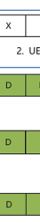 

  

##  3.1.3物理层通道

 在初始访问过程（请参阅第4.1.1节）之后，GNB开始与UE执行正常的通信。 要在下行链路和上行链路中传输的信息都在不同的物理渠道上传达。 物理渠道对应于一组载有来自较高层的信息的资源元素。 根据物理通道的传输方向和携带信息的特征，定义了一组下行链路和上行链路物理通道[7]。 在本节中，引入了DL和UL传输中不同物理通道的功能。 物理随机- 访问通道不会从较高层传达信息，并将序言传输到构建RRC连接，上行链路同步等的信息，该信息在各节中进行了讨论。 4.1.1。

##  3.1.3.1物理广播频道（PBCH）

 UE检测到PBCH，用于在IAM部分中描述的初始访问期间获取基本系统信息。 来自较高层的系统信息分为MIB（主信息块）和许多SIB（系统信息块）。 MIB总是以80 ms的周期性携带在PBCH上，并在80毫秒内重复。 MIB包括以下信息[4]：
 系统帧号（SFN）：10个最重要的位（MSB）- 位SFN
 SIB1的子载波间距，MSG.2/4用于初始访问和广播SI消息
-  SSB子载波偏移：SSB和整体资源块网格之间的频域偏移
-  FRST DM的时间位置- RS下行链路或上行链路- SIB1检测的资源融合，例如，一个共同的控制资源集，一个常见的搜索空间以及SIB1的必要PDCCH参数
-  该单元是否被禁止
-  内部- 允许频率重新选定或不加上PBCH中传输的MIB的信息外，还有8位物理层的信息，为4个最小明显位（LSB），为10- sfn，1位一半- 框架指示，如果有64个候选SS/PBCH块，则为SS/PBCH块索引的3 msb（否则有一个位为PRB偏移的MSB和两个保留位）。 PBCH的总有效载荷大小为56位- BIT CRC，编码为864位，编码速率非常低，以确保PBCH检测的可靠性。

 PBCH将PSS和SSS一起传输为SS/PBCH块
 （SSB）。 适用于PS，SSS和PBCH的同一子载波间距和环状PERFX。 SSB由时间域中的4个连续OFDM符号组成，在频域中形成20个SSB资源块的240个连续的子载波（图3.5）。 对于每个SSB，PSS和SSS分别位于FRST和DM符号，PSS和SSS序列的长度为127个符号，映射到每个位置RB的中心资源元素上； PBCH和相关的DM- RS在DM符号的第二个和第四个OFDM符号和部分符号上映射到DM符号。 有一个DM- RS资源元素，每四个资源元素都会提供PBCH DM- RS密度为1/4。 对于一个SSB，PBCH和相关的DM中的第三个OFDM符号- RS映射到双方的48个资源元素上。

 在NR中，横梁- 采用了基于基于的访问机制进行细胞覆盖范围。 覆盖不同光束方向的多个SSB用于扫除光束。 高中需要更多的SSB- 频率方案。 半帧内的最大候选SSB数为4/8/64，对应于Sub- 分别为3 GHz，3-6 GHz及以上6 GHz场景。 候选SSB的传输时间实例（即SSB模式）在一半的框架之内被预性，这取决于子载波间距和适用的频率范围[5]。 由于SSB用于确定子- 相关的Prach资源等的框架时机需要识别候选SSB。 半帧中的候选SSB从0到l -1，其中l = 4、8、64。- L = 4和8时的RS序列。如果有64 dm，则L = 64- 与SSB指数相关的RS序列，它将显着增加SSB盲检检测复杂性。 为了帮助盲目检测，通过从PBCH获得三个MSB的候选SSB索引，并从PBCH DM获得三个LSB- RS序列。 一旦UE成功检测到一个SSB，UE将从PBCH获得基本系统信息，根据SFN的框架计时以及检测到的SSB索引。 最初- 访问UE，UE可以假设半帧中SSB的周期性为20 ms。

 3

  

 NR中的通道栅格和同步栅格被解耦，以具有稀疏的同步光栅以降低搜索复杂性。 在这种情况下，SB资源块可能与公共资源块不符，并且它们之间存在子载波偏移。 子载波偏移量来自公共资源块中的子载波0，MIB向SSB的子载波0提供了子载波间距，在此，此公共资源块与SSB的第一个资源块的子载波0重叠，如图3.6所示。 由于系统带宽未在PBCH中像LTE一样发出信号，因此UE无法根据系统带宽获得公共资源块的频率位置。 因此，在UE的PBCH中向子载波偏移发出信号，以确定公共参考点A的频率位置和公共资源块排列。 这与PSS/SSS/PBCH始终位于系统带宽的中心的LTE不同，在该系统中，通道和同步具有相同的光栅。

##  3.1.3.2 ** 物理共享数据渠道（PDSCH）** 

 PDSCH变速箱只有一个定义的传输方案，该方案基于DM- RS类似于LTE中的TM9。 从UE的角度来看，支持高达八层的传输。 没有开放- LOOP传输多样性方案作为用于PDSCH传输的LTE DEF中使用的SFBC，这意味着在某些环境（例如高速）中，NR可能会较低。 因此，NR中的链接适应在网络选择传输参数（例如空间预码器，空间预码器的频域粒度和时间）中起着至关重要的作用- 空间预码器的域粒度。

 PDSCH传输的每个UE的最大代码单词数为2，并且有一个- 到- 传输块和代码单词之间的一个映射。 与LTE相似，有相应的MC，HARQ- ACK和每个代码单词的CQI。 但是，要层映射的代码单词与Sect中讨论的LTE略有不同。 3.4.3.1.1。 如果传输层的数量小于或等于4，则有一个代码词； 否则，代码单词的数量为2。这样的代码单词层映射的好处是减少MC的信号传导开销，
 HARQ和CQI当等级不超过4个，但是如果单个代码单词传输，则不能在UE侧使用连续的干扰取消。 代码单词和图层的数量之间的关系是交易- 效果和信号开销。 NR PDSCH的一般传输结构如图3.7所示。 由于NR仅支持DM- 卢比- 基于

 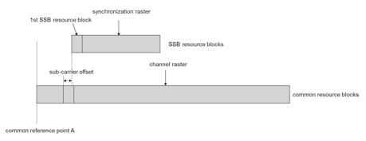 

  

 传输方案，预编码操作是透明的，并且每一层的数据直接映射到DM上- RS端口。

 用于PDSCH传输的通道编码方案是LDPC； 见教派。

 3.4.2.1。 争夺和调制操作类似于LTE，PDSCH的调制方案是QPSK，16QAM，64QAM和256QAM。

 在NR中，由于低潜伏期是非常重要的要求[2，8]，因此较短的TTI是支持满足要求的关键功能。 为了启用较短的tti，PDSCH的资源分配更加可爱，尤其是在时域。 分配给PDSCH的DM符号的数量可以为{3，4，…，14}或{2,4,7}，取决于PDSCH映射类型。 PDSCH映射A类型A用于启动在fr的三个符号中，插槽的三个符号，持续时间为三个符号或更多符号，直到插槽结束为止。 PDSCH映射类型B用于启动插槽中任何地方的PDSCH，持续时间为2、4或7 OFDM符号。 此外，支持PDSCH传输的时域中的插槽聚集，以改善覆盖范围。 在这种情况下，在许多连续的插槽中使用相同的符号分配。 聚合插槽的数量可以为2、4或8，这是由较高的信号传导融合在一起的，但是插槽聚集只有一个下行链路控制通道可以减少信号传导开销。 频域资源分配支持两种类型，并且相对于带宽部分。 类型0使用资源块组（RBG）的位图分配资源，其中每个RBG是一组连续的虚拟资源块。 类型1将资源分配为一组连续的非- 交错或交错的虚拟资源块。 该网络还可以向UE指示多少物理资源块（PRB）与相同的预编码器捆绑在一起，该预编码构成了预编码的资源块组（PRG）（请参阅第3.4.3.1.2节）。

 在下行链路上，UE通过PDCCH接收DL DCI（请参阅第3.1.3.3节）。

 DCI格式1_1提供了最规程的效率，而DCI格式1_0更强大，可用于后备。 DCI调度PDSCH还可以指示率- 匹配模式可以保留PDSCH的资源元素
 和DM- RS无法映射。 这样的资源预订信号允许构成围绕整个OFDM符号或PRB的速率匹配，或者围绕LTE公共参考信号（CRS）匹配的速率，或围绕ZP CSI匹配的速率匹配- RS资源。 该信号还允许在RES中的PDSCH的动态映射（半度）- 当网络决定不在某个插槽中为PDCCH使用这些资源时，静态分配给PDCCH。

##  3.1.3.3 ** 物理下行链路控制通道（PDCCH）** 

 PDCCH带有用于PDSCH调度，PUSCH调度或某些组控制信息的下行链路控制信息（DCI），例如PUSCH/PUCCH/SRS和SLOT格式浓度的功率控制信息。 DCI格式的DEF集合示于表3.3 [6]。

 与LTE相似，为了最大程度地减少PDSCH解码延迟，PDCCH通常位于时间域中插槽的1/2/3 OFDM符号开始。

| 表3.3| DCI格式|
|-------------|----------------------------------------------------------------------------------------------------------------------------|
| DCI格式| 用法|
| 0_0| 在一个单元格中的Pusch安排|
| 0_1| 在一个单元格中的Pusch安排|
| 1_0| 在一个单元格中的PDSCH计划|
| 1_1| 在一个单元格中的PDSCH计划|
| 2_0| 通知一组插槽格式的UE|
| 2_1| 通知PRB（S）和OFDM符号的UE组，其中UE可能会假定无需用于UE的传输|
| 2_2| PUCCH和PUSCH的TPC命令的传输|
| 2_3| 通过一个或多个UES传输一组用于SRS传输的TPC命令|

 但是，PDCCH不会像LTE中那样跨越频域中的整个载波带宽。 理由是，UE通道带宽可能小于载波带宽，以及跨越整个载体带宽的PDCCH的资源粒度很粗糙，这可能会导致将资源开销增加，尤其是对于较大的带宽，例如100 MHz。 因此，频域中的许多资源块被PDCCH的较高层融合在一起。 一个插槽中PDCCH和PDSCH的多路复用是TDM- 喜欢但不是纯TDM。 在NR中，当PDSCH与Confergured Control资源集重叠时，PDSCH资源映射围绕控制资源集匹配。

 PDCCH分配的资源单元被称为控制资源集
 （核心）。 控制资源集由NRB组成
 频域和nsymb核心符号中的核心资源块，其中资源块由位图融合在一起。 这两个参数由高层参数 * ControlResourceset * IE [4]融合在一起。 分配的资源块的形式是许多资源块组（RBG）的形式，该组由六个连续的资源块组成。 最多可以将三个控制资源集用于一个UE，以减少PDCCH阻塞概率。

 鉴于浓厚的PDCCH资源，PDCCH被映射到这些资源上并传输。 PDCCH是通过聚集许多控制通道元素（CCE）来形成的，该元素取决于该特定PDCCH的聚集水平。 聚合级别可能是1、2、4、8或16。一个CCE由六个资源元素组（REG）组成，其中reg等于在一个OFDM符号期间等于一个资源块。 PDCCH DM有一个资源元素- RS一个REG中的每4个资源元素，因此一个CCE的可用资源元素数量为48。控制资源集中的REG在一段时间内按顺序越来越多- 最终的态度，以0的for for for for for ofdm符号和最低- 控制资源集中的编号资源块，如图3.8所示。

  

  

 PDCCH传输也基于DM- RS为PDSCH，并且可以应用透明的预编码循环以实现发射多样性的增益。 从多样性的角度来看，一个PDCCH的更多预码器对性能有益，但是它会影响渠道估计的性能，因为无法使用不同的预码器在整个资源上执行渠道插值。 为了平衡预编码的增益和渠道估计性能，引入了REG捆绑的概念。 REG捆绑包由L连续的Regs组成，并且在Reg束中使用相同的预编码。 一个CCE由6/L型包组成。 在一个控制资源集中进行reg映射的CCE的两种模式是非- 交织和交织。 非- 相互交织的映射使一个CCE的重捆是连续的，并将其放在一起。 对于中断模式，一个CCE的登录捆绑包进行交织和分布，以实现频率多样性增益并随机使间- 细胞干扰[7]。 REG捆绑包大小取决于CCE到REG映射模式，该模式总结在表3.4中。 捆绑尺寸使具有相同的资源块索引跨越不同的OFDM符号的REG可以属于一个Reg Bundle，如图3.9所示。 在交织模式的情况下，捆绑尺寸是可以浓的。

 在接收器侧，UE盲目检测到PDCCH。 为了降低盲目检测的复杂性，在降低PDCCH阻断概率的同时，限制了用于盲目检测的候选PDCCH数量。 将一组用于UE监视的PDCCH候选者被认为是PDCCH搜索空间集。 搜索空间集可以是常见的搜索空间集或UE- 指定搜索空间集。 常见的搜索空间通常会传达许多UES的一些共同控制信息，例如SIB，PAGING，RACH响应，插槽格式征服和TPC命令。

  

| REG捆绑包大小|||
|-------------------------------------|------------------|--------------|
| 核心中的OFDM符号数量| 非- 交错| 交错|
| 1| 6| 2，6|
| 2| 6| 2，6|
| 3| 6| 3，6|

  

 因此，公共搜索空间中受支持的聚合水平高达16年4月8日，以确保性能。 DCI格式0_0、1_0、2_0、2_1、2_2和2_3可以在公共搜索空间中发出信号。 DCI格式0_1和1_1用于UE- 指定调度信息在UE中发出信号- 指定搜索空间。 UE的聚合水平- 指定搜索空间为1/2/4/8/16。

 PDCCH盲目检测过程类似于LTE，但差异是某些相关的盲目检测参数被网络融合在一起以提高功能。 UE监视的搜索空间集数量与较高的层信号传导在一起，并且每个搜索空间集都与一个控制资源集相关联。 此外，还标志着与每个浓厚的搜索空间集有关的信息，例如Common或UE- 指定搜索空间集和PDCCH的数量
 每个聚合级别的候选者[9]。

##  3.1.3.4 ** 物理上行链路共享数据通道（PUSCH）** 

 对于Pusch，都DFT- s- OFDM- 和CP- OFDM- 支持基于的传输（请参阅第3.4.1节）。 Pusch支持两个传输方案：代码簿- 基于传输和非- 代码本- 基于传输。 这两个方案的差异是预编码操作是否透明。

 代码本- UE基于基于传输方案，将一个或多个SRS资源用于SRS传输。 对于PUCCH传达上行链路控制信息（UCI），包括调度请求（SR），HARQ，多个SRS资源更好- ACK和周期性CSI。 基于PUCCH的控制内容和有效载荷大小，支持多种PUCCH格式，如表3.5所示。

 Pucch有一个短- 持续时间传输1或2个OFDM符号和一个长- 持续时间传输在一个插槽内具有4–14 OFDM符号。 在一个插槽内，内部- 如果OFDM符号的数量大于1，则可以将插槽频率跳跃来利用频率多样性的增益。 。 持续时间少于4个符号的支撑是用于低度的传播。 根据潜伏期和覆盖范围的要求，PUCCH的符号数量被更高的层信号传导融合在一起。 通常在DL显性插槽中应用具有一个或两个符号的Pucch格式，该插槽在一个插槽的最后一个或两个符号中传输。 其他PUCCH格式可用于UL显性插槽中。

 3 5G基本空气界面设计更高的频率方案，因为光束管理更容易。 基于发送的SRS，网络选择与首选SRS资源相对应的首选SRS资源，传输等级和预编码器。 然后，网络在上行链路授予DCI格式0_1中向其发出信号。 UE使用信号的信息用于PUSCH预编码。 用于DFT的密码手册- s- OFDM和CP- OFDM
 在[7]中进行了定义。 如果是DFT- s- OFDM，仅对两个和四个天线端口进行了排名1代码书。 原因是DFT- s- OFDM通常用于覆盖范围- 由于低立方指标而导致的情况有限。 在这种情况下，等级1传输是典型的情况。 对于非- 代码本- UE FRST基于基于传输方案，根据CSI的测量来确定许多先编码器- RS下行链路。 然后，许多SRS由这些先编码器进行了预编码，并由UE传输。 网络选择首选的预编码SR。 选择之后，网络向UE的首选预编码SR的索引信号。 UE使用对应于PUSCH传输的信号预编码的SRS的预编码器，但是预编码是透明的。 非- 代码本- 基于通道互惠的TDD操作更适用于基于的传输方案。

 Pusch传输基于DM- 卢比和最多四个- 支持一个UE的层传输。 传输层的数量由网络确定，无论代码簿如何- 或非- 代码本- 基于传输方案。 使用与下行链路相同的代码单词，因此，Pusch只有一个代码单词。 但是，从网络的角度来看，它最多可以支持12- MU形式的层传输- MIMO由于DM- RS容量。 在NR中，下行链路和上行链路使用相同的DM- RS结构为了保持下行链路和上行链路参考信号的正交性，这可以减轻可熟练双工的交联缓解。

##  3.1.3.5 ** 物理上行链路控制通道（PUCCH）** 

| 表3.5| pucch格式的长度OFDM符号l| 位数| UCI类型|
|----------------|-------------------------------------------|------------------|----------------------------------------------|
| 0| 1–2| 1或2| 哈克- ACK，SR，HARQ- ACK/SR|
| Pucch格式1| 4–14| 1或2| 哈克- ACK，SR，HARQ- ACK/SR|
| 2| 1–2| > 2| 哈克- Ack，Harq- ACK/SR，CSI，HARQ- ACK/SR/CSI|
| 3| 4–14| > 2| 哈克- Ack，Harq- ACK/SR，CSI，HARQ- ACK/SR/CSI|
| 4| 4–14| > 2| CSI，HARQ- ACK/SR，HARQ- ACK/ SR/ CSI|

##  3.1.3.5.1 pucch格式0

 PUCCH格式0的传输限制为频域中的一个资源块。 1- 或2- PUCCH格式0的位信息通过执行序列选择传输。 所使用的序列是一个低PAPR碱基序列的循环移位[7]。 根据1的一组或4个循环移动选择一个环状移位- 或2- 要传输的位信息。 选定的循环移位用于生成Pucch序列，然后传输。 对于SR，正SR使用预定的循环移位，并且对应于预定循环移位的序列是传输的，而对于负SR，则没有任何传输。 万一同时传播哈克- ACK和正sr，使用不同的2或4个环状移位值进行选择。 应该注意的是，对于Pucch格式0，没有DM- 连贯检测的RS序列。 网络可以检测接收到的序列以获取信息。

##  3.1.3.5.2 Pucch格式1

 一个或两个信息位分别被调制为一个BPSK或QPSK符号。 调制符号通过长度为12的序列传播，然后是块- 明智的范围覆盖（OCC）的正交代码传播。 二- 使用尺寸扩展，类似于LTE中的Pucch格式1A/1B。 PUCCH数据和DM的多路复用- RS在时域交错。 PUCCH数据的长度取决于Pucch格式1的OFDM符号的数量，该格式等于⌊L/2⌋。 其余的l -⌊L/2⌋符号用于DM- 卢比。 多路复用能力取决于可用的循环移位和OCC的数量。 图3.10说明了带有14个OFDM符号的Pucch格式1的传输结构。

  

 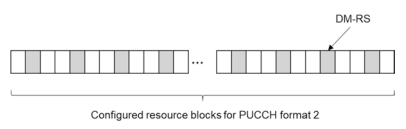 

##  3.1.3.5.3 Pucch格式2

 PUCCH格式2用于中等有效载荷大小UCI传输，这是由于OFDM符号数量的限制。 作为pucch的典型情况
 格式2带有1或2个OFDM符号的格式不是覆盖范围- 有限的情况，Pucch格式2传输与OFDM相似- 基于Pusch。 通道编码后的编码信息位被扰乱并调制QPSK。 然后，将调制符号映射到pucch格式的物理资源块的资源元素上。- RS和PUCCH UCI信息是FDM- 基于多路复用，DM有一个资源元素- RS每三个资源元素如图3.11所示。 PUCCH格式2的资源块和符号的数量由较高的层信号传导融合在一起。

##  3.1.3.5.4 Pucch格式3和4

 PUCCH格式3用于UCI的较大有效载荷尺寸。 Pucch格式3和4传输均基于DFT- s- OFDM的PAPR低以增强覆盖率，分别类似于LTE Pucch格式4和5。 区别在于，符号数量从4到14不等。 分配给PUCCH格式3的子载波数量应满足2 35α2αα35的要求。

| 表3.6| DM- Pucch格式3和4 DM的RS位置- RS位置L在Pucch内无额外的DM- 卢比| 其他DM- 卢比|||
|--------------|----------------------------------------------------------------------------------------------------|--------------------|---------|------|
| 没有跳| 跃迁| 没有跳| 跃迁||
| 4| 1| 0，2| 1| 0，2|
| 5| 0，3| 0，3|||
| 6| 1，4| 1，4|||
| 7| 1，4| 1，4|||
| 8| 1，5| 1，5|||
| 9| 1，6| 1，6|||
| 10| 2，7| 1、3、6、8|||
| 11| 2，7| 1、3、6、9|||
| 12| 2，8| 1、4、7、10|||
| 13| 2，9| 1、4、7、11|||
| 14| 3，10| 1、5、8、12|||
| Pucch长度|||||

 作为pusch降低实施复杂性。 但是，PUCCH格式4在一个资源块中受到约束，并且块- 明智地使用一个资源块中的频域传播。 块的长度- 明智的扩展为2或4。可以通过使用不同的正交序列将不同UE的PUCCH格式4多路复用。 正交序列由较高的层信号传导融合在一起。 为了保留单个载体属性，PUCCH数据和DM的多路复用- RS为TDM，如表3.6 [7]中。

##  3.1.4物理层（PHY）参考信号

 对于无线通信系统，参考信号（又称试点信号）是系统设计的关键要素之一。 一般而言，参考信号具有多种基本功能，以确保正确且高效的PHY层性能。 这样的功能包括发射机和接收器之间的时间，频率和相位的同步，传达传输特性（长期和短期）以在发射机侧的传输属性确定以及接收器侧的通道估计以及反馈； 访问链接标识； 和质量测量。 尽管设计单个参考（用于下行链路）以实现所有这些功能是可能的
 它将在很大程度上限制系统的性能和精神。 因此，制造一组少数参考信号共同履行这些功能是一个更好的选择。 虽然表面上的NR可能在参考信号设计与LTE的参考信号设计方面相似，但从LTE的优势和缺点中学习，NR参考信号从一开始就采用了新的设计框架，并考虑了其他设计要求 对于5G网络而言，这是独一无二的。 在下文中，NR参考信号设计框架和考虑因素是从详细阐述的，然后是每种参考信号的设计详细信息，包括解调参考信号（DM）- RS），通道状态信息参考信号（CSI- RS），响应参考信号（SRS）和相跟踪参考信号（PT- RS）。 准- 公司- 然后将位置（QCL）和传输拼写指标（TCI）描述为不同参考信号之间的链接。

##  3.1.4.1 ** 参考信号设计框架和考虑因素** 

 在设计框架上，NR的基本变化之一是消除单元常见参考信号（CRS），如LTE系统[10]。 在LTE中，CRS具有几个重要功能，包括细胞识别，时间和频率同步，RRM测量，数据和控制通道解调以及CSI测量。 它是（几乎）LTE释放中下行链路的单个参考信号- 8，将在每个下行链路子中传输- 框架具有一定的时间和频率密度，以满足最严格功能的最低要求。 CRS传输始终是在数据传输的存在和不存在的情况下，除了带有单元格和许可证的情况外- 辅助访问
 （LAA）在后来的版本中引入。 永远- 信号上的信号也会施加持续的干扰和间接费用，即使没有数据运输，并且在网络部署密集的情况下显着降低系统性能[11]。 除了干扰和间接问题外，始终- 在CR上，还在很大程度上限制了系统设计和正向兼容性的生效性，这对于LTE来说是一个显而易见的问题。- 12.因此，总是消除- 在CRS上被用作NR的基本设计假设。

 因此，CRS携带的功能应分布在其他参考信号或新设计的NR参考信号之间。 图3.12显示了LTE功能和相应参考信号的概述。 如图3.12所示，在LTE中，UE通过检测PSS/SSS（SS）获得了粗糙的时间/频率同步和细胞鉴定。 细胞鉴定也通过CRS作为PBCH解调参考信号进行了部分进行。 CRS还具有数字AGC，FNE时间/频率同步和RRM测量的功能。 CRS为传输模式1-6提供数据解调参考信号，并为所有传输模式（EPDCCH解调除外）的控制解调参考信号。 在CSI测量中，CRS用于推导传输模式1-8的信号零件，以及1-9传输模式的干扰零件。 CSI- RS在传输模式9和10中用于测量信号质量。 DM- RS是传输模式7-10和EPDCCH控制通道解调参考信号的数据解调参考信号。 DRS由SS，窗户CR和CSI组成- 卢比
 并具有细胞发现和RRM测量的功能。

 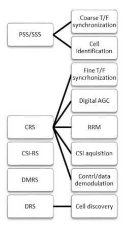 

 图3.12 LTE参考信号集和LTE中的功能，QCL是针对延迟扩散，多普勒扩散，多普勒偏移，平均增益和平均延迟而定义的。 LTE DEFNES之间的几个QCL假设：参考信号：- CRS端口被认为是准- 公司- 位于延迟差，多普勒差，多普勒偏移，平均增益和平均延迟方面。

-  CSI- RS，DM- RS端口及其绑定的CRS端口被认为是准端口- 与多普勒差，多普勒的偏移，延迟扩散和平均延迟相结合。

-  SS和CRS端口被认为是准端口- 公司- 相对于多普勒偏移和平均增益。

 长- 当可以假定为quasi时- 公司- 位于。

 随着CRS的去除，所有功能（包括细胞识别）
 （部分），FNE时间/频率跟踪，RRM测量，数字AGC，CSI采集（部分），控制通道解调）和长- IT携带的QCL假设的术语通道属性估计应分配给其他参考信号或新设计的NR参考信号。

 此外，NR设计应支持高达100 GHz的频率。 在这些高处以明显更高的路径损失对抗- 频带，混合体（模拟/
 数字）将波束形成为一项良好的交易- 需要支持复杂性和绩效之间的关闭。 除了低的RS功能- 频带NR设计应考虑额外的RS设计，以促进模拟光束采集，跟踪和反馈。 高载体频带中通信系统的另一个问题是相位噪声。 与低- 频带，相位噪声在高度较大- 频带。 通过在某种程度上增加子载波间距可以减轻相位噪声引起的性能降解。 但是，较大的子载波间距意味着较短的符号长度和较大的CP长度。 因此，有了可能的最大子载波间距的限制，可以引入实现此目的的指定RS。

 总体参考信号设计框架总结如下
 （图3.13）：- SSB增强了T/F同步
-  CSI- RS对多种功能（例如FNE T/F同步）和主要QCL假设源（AS TRS），RRM（与SSB联合），CSI等多种功能的RS融合
 获取，发现和光束管理
-  DM- pdsch/pusch和PDCCH的解调的RS- pt- 引入RS以进行相噪声补偿- 上行链路SRS
 值得一提的一个关键方面是，上述所有参考信号都是特异性的，因此有效地在NR中不存在COLL COMIN参照信号。

##  3.1.4.2 ** 解调参考信号** 

 作为一个基于DM的传输方案- RS是NR中的RS，其设计需要考虑不同的方案，以及各种需要的要求，包括：
-  良好的通道估计性能：作为解调的参考信号，

  

 良好的频道估计性能是DM的最重要标准- RS设计。 这需要时间和频率足以匹配带下划线的无线电通道特征和浓厚的命理学。

-  DM- RS时间和频率模式设计需要支持从低于1 GHz到100 GHz的大量载体频率以及最高500 km/h的各种速度，同时也考虑了命理学通常可以随载体频率扩展。

-  正交DM的总数- RS端口及其多路复用方案具​​有相对较小的DM- RS开销，同时确保良好的解调性能支持大量SU/MU的数据层- MIMO
 传输。

-  除MBB贩运外，NR还需要支持URLLC类型的服务。

 DM- 然后，RS设计还应在接收器处启用非常小的通道估计和解调处理时间。

-  灵活和浓郁的命理和框架结构是NR设计的关键特性。 DM- RS设计需要融入这些可能的大量可能性。 可爱的框架结构的一种实现是实现可扎实的下行链路和上行链路传输的双链式插曲，这可能会引入严重的十字架- 链接干扰。 为了减轻这种干扰对渠道估计性能的影响，常见的下行链路和上行链路DM- RS设计允许正交下行链路和上行链路DM的融合- RS传输是可取的。

 在下面，NR DMR的总体设计随后是1型和2型DM的详细信息- RS浓汤。

##  3.1.4.2.1 NR DM的总体设计- 卢比

 对于DM- RS时间和频率模式，在NR中引入了两种类型（类型1和类型2）。 1型DM- RS支持多达4个正交DM- RS端口当1个符号用于DM时- RS传输和多达8个正交DM- 当2个符号混合时，RS端口。 2型DM- RS支持高达6个正交DM- RS端口当1个符号用于DM时- RS传输和多达12个正交DM- 当2个符号混合时，RS端口。 这些正交DM- RS端口通过OCC在时域和频域中多路复用。 两种类型的DM- 对于下行链路和上行链路，RS浓厚率是可以进行的，并且可以将其混合在一起，以使DM- 下行链路和上行链路的RSS彼此正交。

 两个16- 有点浓的DM- 支持RS扰流ID。 浓汤是由RRC组成的，此外，DCI动态选择并指示了争夺ID。 在RRC抚摸16之前- 位DM- RS争夺ID，单元ID
 用于DM- RS争夺。

 当映射到插槽内PDSCH/PUSCH变速器的符号位置时，- 加载的DM- 仅RS符号或前面- 加载的DM- RS加上额外的DM- RS符号可以混合在一起。 额外的DM- RS在场时应该是前面的确切副本- 加载的DM- PDSCH/PUSCH传输的RS，即相同数量的符号，天线端口和序列。

 与前面- 加载- 只有DM- RS，通道估计只能依靠这1或2

 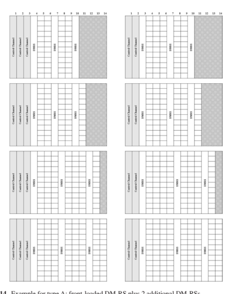 

 在数据传输持续时间的早期部分的符号，以加快解调并减少总体延迟。 但是，没有其他DM- RS符号为了启用时间域的解释/flter，通道估计及其整体性能将使仅中等移动性的方案降低。

 对于PDSCH/PUSCH映射A类型，前面- 加载的DM- RS从每个插槽的第三或第四个符号开始（或者如果支持频率跳跃，则每个跳跃）。 对于PDSCH/PUSCH映射B类型，前面- 加载的DM- RS从传输持续时间的最初符号开始。 额外DM的数量- RS可以为每个网络鸡冠1、2或3。 每个额外DM的位置- RS取决于PDSCH/PUSCH传输的持续时间（即DM符号的数量），并遵循一组通用规则以获得更好的通道估计性能。 这些规则包括上次DM之后的PDSCH/PUSCH的2个OFDM符号- Rs，相邻DM之间的2至4个符号- RSS和DM- RSS几乎均匀地分布。 图3.14和3.15显示了一些示例。

 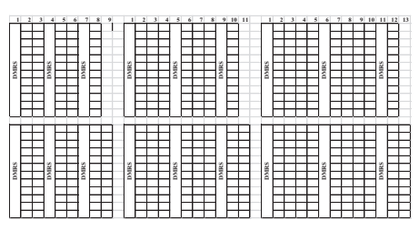 

 两个增强功能以​​减少DM- RS PAPR在发行中引入- 16.对于CP- OFDM PDSCH和PUSCH，代码除法（CDM）组- 依赖序列生成用于DM- RS解决观察到的高papr问题的RS- 15设计，其中相同序列用于不同的CDM组。 另外，对于Pusch/Pucch DM- PI/2调制的RS，新的DM- RS序列在发行中指定- 16将PAPR降低到与数据符号相同的水平。 在这些情况下，计算机- 生成的序列用于长度6、12、18和24。对于长度12、18和24，采用BPSK序列。 长度为6，8psk
 选择序列。 对于长度30或更大的序列，基于金序列，生成π/2 BPSK调制的DMR，然后是π/2 bpsk
 调制，然后转换预编码。

##  3.1.4.2.2 dm- RS类型1浓汤

 对于DM- RS 1型浓料，如图3.16所示，频率其他每种音调的梳子和频率的循环移动分配给DM- RS天线端口。 有2个梳子和2个环状移位，4个正交DM- 当1 OFDM符号融合在一起时，支持RS端口。 当DM的2个OFDM符号融合到DM时- 卢比
 1型浓汤，尺寸2的时域OCC进一步用于生成正交DM- RS端口总共提供8个正交端口。

 DM- RS类型1可以用于CP- OFDM PDSCH和PUSCH。 对于DFT- OFDM Pusch，仅1型DM- 使用RS。 1型DM- 在RRC之前，还使用了带有指定浓度的RS作为默认DM- RS模式。

  

 对于DM- RS 2型浓汤，如图3.17所示，相邻2 RES和FDM上尺寸2的频域OCC用于支持6正交DM- 当1 OFDM符号混合在一起时，RS端口。 当DM的2个OFDM符号融合到DM时- RS类型2浓汤，尺寸2的时间域OCC进一步用于生成正交DM- RS端口总共提供12个正交端口。 使用更多的正交端口，2型浓画可能会为大量MU的大量数据流提供高系统吞吐量- 需要mimo。 DM- RS类型2仅适用于CP- ofdm pdsch和pusch通过RRC浓汤。

##  3.1.4.3 ** CSI- 卢比** 

 CSI参考信号（CSI- rs）对于NR通常采用LTE CSI- RS作为起点，但除了CSI采集，梁管理，时间和频率跟踪以及RRM测量之外，还需要进一步支撑支持。 为了支持自然具有不同性能目标和设计要求的各种功能，NR CSI- RS总体设计需要在天线端口的数量，时间和频率资源模式，频率的密度，时间周期性等方面具有更高的可爱性和易匹配性。- rs之后是CSI的规格- 每个功能的RS。

  

##  3.1.4.3.1 CSI的一般设计- 卢比

 总体而言，NR CSI- RS旨在支持从单个端口到32个正交端口的各种天线端口，每个PRB的不同频域密度为{1/2、1、3} RES，以及{4，5，8 ，10、16、20、32、40、64、80、160、320、640}插槽以及aperiodic（即基于触发器）的传输。

 请注意，此处的周期性在插槽单位中，因此取决于载体/BWP的命理学。

 CSI的数量- 支持的RS天线端口为{1、2、4、8、12、16、24和32}。 已经考虑了这些天线端口的时间和频率资源映射和CDM多路复用，如表3.7 [7]所示。 通常，CSI- RS资源模式与2汇总- 或4- 或8- 港口CSI- 支持2、4或8的RS模式和多密度{1/2、1、3}和CDM。 更特殊：

| 表3.7| CSI- 插槽内的RS位置（时间和频率模式）||||||||
|------------------------------|----------------------------------------------------------------|-----------|------------|-------------------------------------------------------------------------------------------------------------------------------------------------------------------------------------------|------------|-------|------|----|
| 数字| 时间和频率| CDM组|||||||
| 排| 港口| 密度| CDM- 类型| 位置（k l，| ）| 指数| k'| l'|
| 1| 1| 3| 没有CDM| （K0，L0），（K0 + 4，L0），| 0、0、0| 0| 0||
| （K0 + 8，L0）|||||||||
| 2| 1| 1，0.5| 没有CDM| （K0，L0）| 0| 0| 0||
| 3| 2| 1，0.5| fd- CDM2| （K0，L0）| 0| 0，1| 0||
| 4| 4| 1| fd- CDM2| （K0，L0），（K0 + 2，L0）| 0，1| 0，1| 0||
| 5| 4| 1| fd- CDM2| （K0，L0），（K0，L0 + 1）| 0，1| 0，1| 0||
| 6| 8| 1| fd- CDM2| （K0，L0），（K1，L0），（K2，L0），0，1，2，3| 0，1| 0|||
| （K3，L0）|||||||||
| 7| 8| 1| fd- CDM2| （K0，L0），（K1，L0），（K0，| 0、1、2、3| 0，1| 0||
| L0 + 1），（K1，L0 + 1）|||||||||
| 8| 8| 1| CDM4（FD2，| （K0，L0），（K1，L0）| 0，1| 0，1| 0，1||
| TD2）|||||||||
| 9| 12| 1| fd- CDM2| （K0，L0），（K1，L0），（K2，L0），0，1，2，3，4，5| 0，1| 0|||
| （k3，l0），（k4，l0），（k5，l0）|||||||||
| 10| 12| 1| CDM4（FD2，| （K0，L0），（K1，L0），（K2，L0）| 0、1、2| 0，1| 0，1||
| TD2）|||||||||
| 11| 16| 1，0.5| fd- CDM2| （k0，l0），（k1，l0），（k2，l0），（k3，l0），（k0，l0 + 1），（k1，l0 + 1），（k2，l0 + 1），（k3 ，l0 + 1）0、1、2、3、4、5，| 0，1| 0|||
| 6，7|||||||||
| 12| 16| 1，0.5| CDM4（FD2，| （K0，L0），（K1，L0），（K2，L0），0，1，2，3| 0，1| 0，1|||
| TD2）| （K3，L0）||||||||
| 13| 24| 1，0.5| fd- CDM2| （k0，l0），（k1，l0），（k2，l0），（k0，l0 + 1），（k1，l0 + 1），（k2，l0 + 1），（k0，l1），（k1 ，L1），（K2，L1），（K0，L1 + 1），（K1，L1 + 1），（K2，L1 + 1）0，1，2，2，3，4，4，5，5，6，7，8 ，9、10、11| 0，1| 0|||
| （继续）|||||||||

| 表3.7| （继续）||||||||
|-------------|---------------------------------------------------------------------|-----------|------------|--------------------------------------------------------------------------------------------------------------------------------------------------------------------------------------------------------------------------------------------------------------|---------|-------|-------|----|
| 数字| 时间和频率| CDM组|||||||
| 排| 港口| 密度| CDM- 类型| 位置（k l，| ）| 指数| k'| l'|
| 14| 24| 1，0.5| CDM4（FD2，| （K0，L0），（K1，L0），（K2，L0），0，1，2，3，4，5| 0，1| 0，1|||
| TD2）| （K0，L1），（K1，L1），（K2，L1）||||||||
| 15| 24| 1，0.5| CDM8（FD2，| （K0，L0），（K1，L0），（K2，L0）| 0、1、2| 0，1| 0，1，||
| TD4）| 2，3||||||||
| 16| 32| 1，0.5| fd- CDM2| （k0，l0），（k1，l0），（k2，l0），（k3，l0），（k0，l0 + 1），（k1，l0 + 1），（k2，l0 + 1），（k3 ，L0 + 1），（K0，L1），（K1，L1），（K2，L1），（K3，L1），（K0，L1 + 1），（K1，L1 + 1），（K2，L1，L1 + 1），（k3，l1 + 1）0、1、2、3、4、5、6、7、8、9、10、11、12、13、13、14、15| 0，1| 0|||
| 17| 32| 1，0.5| CDM4（FD2，| （k0，l0），（k1，l0），（k2，l0），|||||
| TD2）| （k3，l0），（k0，l1），（k1，l1），（k2，l1），（k3，l1）0、1、2、3、4、5，| 0，1| 0，1||||||
| 6，7|||||||||
| 18| 32| 1，0.5| CDM8（FD2，| （K0，L0），（K1，L0），（K2，L0），0，1，2，3| 0，1| 0，1，|||
| TD4）| （K3，L0）| 2，3|||||||

-  1- 港口CSI- RS，使用没有CDM的频域中的漫画资源映射。 对于3 res/prB的密度（ρ），梳子- 使用4，密度为1或0.5 RES/PRB，梳子- 12在PRB中使用，而其他所有PRB的密度为0.5 RES/PRB。 请参阅表的第1行和第2行。

-  2- 港口CSI- RS，频域CDM 2（FD- CDM2）使用了2个连续的RES。 对于0.5 RES/PRB的密度，映射其他所有PRB。 请参阅表的第3行。

-  4- 港口CSI- Rs，FDM超过2对2连续2个与FD连续2个- CDM2（第4行中给出）和TDM在2个连续的OFDM符号上，每个符号均具有FD- 支持相同位置的2个RES的CDM2（如第5行中给出）。

-  为8- 港口CSI- Rs，FDM超过4对连续2个与FD连续RES- CDM2（第6行中给出）或在2对FD的同一位置上的连续2个OFDM符号超过2对FD的tdm- 2 res的CDM2（第7行中给出）或FDM在2组4个RES上的CDM2或FDM中，每项在术语中使用FD2（超过2个连续RES）和TD2（超过2个连续的OFDM符号）的CDM4（如DM符号）（如图所示） 第8行）得到了支持。

-  为12- 港口CSI- Rs，FDM超过6对连续2个与FD连续RES- CDM2（第9行中给出）或FDM超过3组为4个RES的CDM2（在术语中使用CDM4）中FD2（超过2个连续RES）和TD2（超过2个连续的OFDM符号）（如第10行所示） 得到支持。

-  16- 港口CSI- RS，TDM超过2个连续的OFDM符号，每个符号在同一位置，FDM超过4对FD- 2 Res的CDM2（如第11行中给出）或4组超过4组RES的FDM，其中每项在术语中使用FD2（超过2个连续RES）和TD2（超过2个连续的OFDM符号）的CDM4（如DM符号）（如图所示） 第12行）得到了支持。

-  为24- 港口CSI- RS，TDM超过2组，由2个连续的OFDM符号（即，
 总共4个OFDM符号）每个位置在同一位置，FDM超过3对FD- CDM2的2个RES（如第13行中给出）或2集的12个端口的TDM，其中每组在3组上使用FDM在4个4 res的3组中使用，每套术语中使用FD2（超过2个连续RES）和TD2的CDM4使用CDM4 （超过2个连续的OFDM符号）和这两组12个端口在频率位置（如第14行中给出），或在3组超过3组的fdm中对齐，每件8 res每术中使用cdm8从FD2的组合使用（超过2个） 连续RES）和TD4（连续4个OFDM符号）（如第15行所示）得到了支持。

-  32- 港口CSI- RS，TDM超过2组，由2个连续的OFDM符号（即，
 总共4个OFDM符号）每个位置在相同的位置，FDM超过4对FD- CDM2的2个RES（如第16行中给出）或2集的16个端口的TDM，其中每组使用4组超过4组RES的FDM，每组在术语中使用FD2组合（超过2个连续RES）和TD2使用CDM4 （超过2个连续的OFDM符号）和这两组16个端口在频率位置（如第17行中给出），或在4组超过8个RES的FDM中对齐，每组中的每个术语中的术语中使用CDM8 FD2的组合（超过2个） 支持连续的RES）和TD4（连续4个OFDM符号）（如第18行所示）。 在上述时间和频率模式以及多路复用浓度中，可以将其中一个子集用于不同的功能。

##  3.1.4.3.2 CSI- CSI收购的RS

 CSI的明显用法- rs（如其名称所示）是为了预先进行CSI报告的测量。 CSI- 卢比- CSI的相关资源融合
 报告如下所述。 非常- 高的- 级别描述在此处给出。 通常，UE需要对一些NZP（非零功率）CSI进行报告的通道测量- RS资源。 在某些情况下，UE还需要对其他资源进行干扰测量，以得出正确的CSI报告，并且这些其他资源可以是CSI- IM（频道状态信息- 干扰测量）资源，或者也可以是NZP CSI- RS资源或两者的组合。

 CSI报告的资源（称为CSI资源设置）是通过更高层信号传导融合在一起的。 每个CSI资源设置 *CSI- ResourceConfg *包含CSI资源集列表的浓厚（由较高层参数 * CSI给出- rsresourcesetList*），其中列表由NZP的任何一个或两个参考
 CSI- RS资源集和SS/PBCH块集或该列表由CSI参考组成- IM资源集。 每个NZP CSI- RS资源集由许多NZP CSI组成- RS资源。 UE可以与一个或多个CSI混合- 我是
 资源集拼写（S）如较高层参数 *CSI所示- Imresourceset*。 每个CSI- IM资源集由许多CSI组成- IM资源。

 一个CSI- IM资源融合基本上是一组RE资源，其时间和频率模式为（2，2）或（4，1）。 UE将测量CSI的干扰水平- IM资源，但没有任何指定信号。 另一方面，NZP CSI- 卢比
 用于干扰测量的资源是浓厚的，UE是测量与在此处传输的指定信号相关的干扰水平。

 值得在这里澄清什么是ZP（零功率）CSI- NR中的RS资源。 UE
 可以与一个或多个ZP CSI混合- RS资源集合，每个ZP CSI- RS资源集由许多ZP CSI组成- RS资源。 ZP
 CSI- RS资源拼写由CSI的一组RE资源和时间和频率模式组成- RS资源以及通过网络的相应浓厚和指示，UE将假设与ZP CSI相关的RE资源- RS资源未用于PDSCH传输。

##  3.1.4.3.3 CSI- 光束管理的RS

 对于下行链路管理和上行链路管理，当ee csi支持光束对应时- 将RS资源集与UE结合在一起，以选择首选的下行链路传输光束（即，空间域传输flter）通过L1 RSRP报告。

 GNB可以实现下行链路接收光束扫地，该链接使CSI混合并传输CSI- RS资源设置具有较高层参数 *重复 *设置为 "on,"  UE可以假定CSI- 集合中的RS资源使用相同的下行链路传输梁传输，因此尝试不同的接收光束。 GNB可以实现下行链路变速箱扫描，该GNB融合并传输CSI- RS资源设置具有较高层参数重复设置为 "off,"  UE不得假设CSI- 集合中的RS资源使用相同的下行链路传输光束传输。 UE可以使用相同的接收光束接收和测量这些CSI- RS资源，然后报告最好的CSI- RS资源对应于GNB侧最好的传输梁。 与多个CSI的组合- RS资源设置具有更高层参数 *重复 *设置为 "on"  或者 "off"  以及对UE报告的适当融合，可以实施不同的光束管理程序。 请注意，对于CSI- 用于光束管理目的的RS资源集，所有CSI的端口的数量（1或2）应仅具有相同的数字（1或2）- 集合中的RS资源。

##  3.1.4.3.4 CSI- 时间和频率跟踪的RS

 NR系统中的跟踪功能（如LTE）包括粗糙的时间/频率跟踪，FNE时间/频率跟踪以及延迟/多普勒差跟踪。 除了不存在CR，NR还支持各种系统带宽，子载波间距和载波频率。 除了满足跟踪性能要求之外，还应考虑信号开销，浓厚性能和鲁棒性。 为了满足跟踪性能，基于对各种适用场景的评估，参考信号应符合某些最小设计标准，例如时间和频率密度和间距，周期性和带宽。

 基于上述注意事项，而不是引入用于跟踪目的的单独的参考信号，而是NR Defnes一组CSI- 带有高层参数TRS标记的跟踪资源的RS资源- 信息作为跟踪参考信号。 保证UE基带性能，尽管CSI- 用于跟踪的RS是UE特定的，可以在RRC连接模式下使用UE接收至少一种类型的CSI的较高层的浓汤- RS资源集。 CSI- 何时凝聚时跟踪的RS应满足以下限制：- 2或4个CSI- CSI中1个天线端口的RS资源- RS资源集：对于FR1和FR2，4 CSI- RS资源可以在2个连续的插槽中与2个CSI混在一起- RS资源每个插槽。 此外，对于FR2，2个CSI- RS资源可以在1个插槽内混在一起。

-  时间- 两个CSI的域位置- 插槽中的RS资源由4个OFDM符号间隔。

-  每个CSI- RS资源是一个单个端口，频率密度为3，即映射到每个第四音调。

-  CSI的带宽- 用于跟踪的RS是可融合的，但至少应在52个PRB或等于相关BWP的资源块数量中。

-  周期性CSI的周期性- 用于跟踪的RS将其混合为{10、20、40或80} ms。 周期性CSI- 在连接模式下，应始终为UE进行跟踪的RS。 此外，Aperiodic CSI- 与周期性CSI相关的RS也支持用于跟踪的RS- 浓密的RS跟踪。 由于其设计目的和财产，定期CSI- UE使用用于跟踪的RS来估计长时间- 其观察到的通道的术语特性，包括时机，载体频率，多普勒等。- 术语属性，以得出通道估计器，以接收后续的控制和数据通道。 因此，定期CSI- 用于跟踪的RS为UE处的QCL假设提供了主要的源参考信号。

##  3.1.4.3.5 CSI- 卢比的行动度测量

 CSI- 当RS与较高层参数 *CSI混合时，RS也用于迁移率测量- 卢比- 资源- 移动性*与较高层参数指示的相关SSB独立或共同共同*，其中UE获得了CSI的时机- RS资源来自相应的服务单元的时间。 而且只有CSI- 带有一个天线端口的RS资源可以用于迁移率测量。

##  3.1.4.4 ** 发声参考信号** 

 在上行链路上从UE传输的NR传输中，支持参考信号（SRS）。 与LTE相比，NR中考虑了一些新方面以增强SRS设计。

 上行链路SRS最突出的用例是在TDD系统中获取下行链路CSI信息，并通过使用频道互惠来实现出色的下行链路MIMO性能。 由于上行链路SRS是UE- 指定信号，细胞中可能有大量的活动UE以及这些UE的迁移率，SRS容量可能会成为瓶颈。 此外，UE传输功率通常远低于GNB的功率，SRS可以受到限制，并以相对较低的SINR水平接收，从而导致CSI估计质量较差。 因此，提高SRS容量以及覆盖效果是要解决的关键问题。

 另一个问题是下行链路接收与上行链路传输的UE功能不平衡。 通常，大多数UE都可以在许多下行链路聚合的载体中接收更多的天线，但只能以较小数量的上行链路载体（S）的同时以这些天线的一部分传输，同时却阻碍了GNB的能力 获取有关下行链路通道的全面知识。 为了解决这些问题而不会大大增加UE的复杂性和成本，在NR中指定了SRS从天线转换为天线，从载体到载体。

 SRS当然也可以用于获得上行链路CSI并启用上行链路MIMO
 方案。 除了代码本- 基于LTE中的基于上行链路MIMO，NR也引入了非- 代码本- 基于上行链路的基于MIMO方案，其中潜在的上行链路预编码选择（S）（由UE决定）通过预编码的SRS传达。 此外，要用横梁形成，至少需要使用SRS的上行链路束管理，至少对于UE需要上行链路管理。

 在下文中，描述了一般SRS设计，其后是针对不同用例的SRS Spemifcs。

##  3.1.4.4.1 SRS的一般设计

 在NR中，支持具有1、2或4个天线端口的SRS资源，可以将其映射到连续的1、2或4个OFDM符号。 支持频域中每2或4个RES的梳理传输。 此外，当尺寸4（或2）的梳子梳子时，循环移位受到最大循环移位数量等于12（或8）的支持。
 用来。 SRS序列ID由高层参数融合。 最多6 OFDM
 插槽末端的符号可用于SRS传输，这与LTE相比明显增加。 SRS资源可能会在周期性的半月- 持续的，Aperiodic SRS传输。 在频域中，SRS分配与4个PRB网格对齐。 与LTE一样，支持频率跳跃。 通过相同的设计方法，NR SRS带宽和跳跃浓料的设计旨在覆盖与LTE相比的更大值。

 对于给定的SRS资源，UE与重复因子1、2或4的混合层通过更高的层参数，以提高覆盖范围。 当每个插槽中的SRS资源中的频率跳跃不融合时，即重复的数量等于SRS符号的数量时，每个插槽中SRS资源的每个天线端口都映射在所有SRS符号中 同一组中的同一子载波。 当每个插槽中的SRS资源中的频率跳跃而不重复时，每个插槽中SRS资源的每个天线端口都映射到每个OFDM符号中的不同集合载体集，其中假定相同的传输梳子值用于不同的集合。 子载体。 当每个插槽中的SRS资源中的频率跳跃和重复都融合在一起，即带有4个SRS符号和2个重复时，每个插槽中SRS资源的每个天线端口都映射到每个对中的同一组子载波中， 两个相邻的OFDM符号和频率跳跃在两对之间。

 UE可能会与单个符号周期性或半符号混合- 持续的SRS
 带有Inter的资源- 插槽跳跃，SRS资源在每个插槽中占据相同的符号位置。 一个UE可能与2混合- 或4- 符号周期性或半情感srs资源- 插槽和inter- 插槽跳跃，n- 符号SRS资源在每个插槽中占据相同的符号位置。 对于4个符号的情况，当频率跳跃与重复2时，Intra- 插槽和inter- 在每个插槽中的两个相邻的OFDM符号相邻的两个相邻的OFDM符号中，SRS资源的每个天线端口都支持插槽跳跃。 SRS资源的每个天线端口都映射到每个插槽中资源的2个相邻ofdm符号中的每对相同的子载波。 对于SRS符号数量等于重复因子的情况，当频率跳跃时，- SRS资源的每个天线端口都支持插槽频率跳跃，这些天线端口映射到每个插槽中资源的相邻符号中相同的子载波。

 UE可以与一个或多个SRS资源集混合在一起。 对于每个SRS
 资源集，UE可能与许多SRS资源混合在一起。 用例
 （例如梁管理，代码本- 基于上行链路MIMO和非- 基于CodeBookB的上行链路MIMO和天线切换实际上是用于SRS资源集的一般下行链路CSI采集）。

##  3.1.4.4.2.DL CSI收购的SRS

 对于CSI的下行链路获取，SRS资源集的使用被认为是
 "antenna switching"  为了覆盖SRS传输天线开关的情况，还涵盖了发射和接收天线数量相同并且没有天线转换的情况。 如上所述，如果UE支持比下行链路载波少的上行链路载体，则在NR中也支持组件载体之间的SRS切换。

##  3.1.4.4.2.1 SRS天线切换

 对于SRS天线切换，支持以下情况：1（或2）TX（传输）至2（或4）Rx（接收）天线切换为表示为 "1T2R,"  "2T4R,"  "1T4R,"  和 "1T4R/2T4R"  UE支持两者的位置 "1T4R"  和 "2T4R"  交换。 此外， "T=R"  也支持传输和接收数量相等的地方。

 为了支持天线切换，SRS资源集与两个（用于
 "1T2R"  或者 "2T4R"  ）或四个（对于 "1T4R"  ）SRS资源以不同的符号传输。 每个SRS资源由一个组成（用于 "1T2R"  或者 "1T4R"  ）或两个（对于 "2T4R"  ）天线端口和每个SRS资源的SRS端口与不同的UE天线端口相关联。 此外，对于 "1T4R,"  可以将两个Aperiodic SRS资源集，共有四个SRS资源，以两个不同插槽的不同符号传输。 给定两组中每个SRS资源的SRS端口与不同的UE天线端口相关联。 这两组都与两个SRS资源混合在一起，或者一组与一个SRS资源混合在一起，另一组与三个SRS资源融合在一起。

 由于硬件的限制，UE与用于天线切换的集合的SRS资源之间的许多符号的后卫期。 在这些符号期间，如果集合的SRS资源在同一插槽中传输，则UE不会传输任何其他信号。 符号的数量取决于子载波间距。

##  3.1.4.4.2.2 SRS载体切换

 对于具有与上行链路载体相比，在TDD系统中具有更多支持下行链路载波的UE，在PUCCH/PUCCH变速箱中，可能不会将具有插槽格式的载体组成。 在这种情况下，通常没有预期的上行链路传输包括SRS。 为了获得下行链路CSI并通过SRS获得TDD相互作用的优势，可以将UE与该载体中的SRS资源融为一体。 由于UE可能没有RF能力可以在没有Pusch/Pucch的载体上传输SRS，同时又可以在与Pusch/Pucch混合的载体上传输，因此UE需要从载体中借用一些RF的能力 与Pusch/Pucch
 （表示为开关- 从载体），然后切换相关的RF链以将SRS传输到该载体上（称为开关- 到载体）。 开关- 根据UE报告的功能，网络从运营商处融为一体。 在SRS传输期间开关时- 到运营商，包括上行链路和下行链路UE rf的任何中断，如UE报道，UE暂时暂停开关上的上行链路传输- 来自载体。

 如果SRS传输之间发生碰撞（包括上行链路和下行链路RF的任何中断）在开关上- 转到开关上的载体和上行链路或下行链路传输- 从运营商中，为碰撞处理定义了优先规则。

 两个周期/半- 开关上支持持久性和上的SRS- 到载体。 除了DL和UL DCI外，还要触发Aperiodic SRS传输- 还引入了基于DCI的格式。

##  3.1.4.4.3- 和非- 代码本- 基于上行链路MIMO

 在NR上行链路中，UE可以被网络融合以获取CodeBook- 基于传输或非- 代码本- 基于传输。

 代码本- 基于上行链路PUSCH传输，可以为UE提供一个或两个SRS资源。 当多个SRS资源融合在一起时，使用uplink DCI中的SRS资源指示指标用来指示所选的SRS资源，其天线端口被网络用于推导上行链路传输的预编码。

 对于非- 代码本- 基于上行链路PUSCH变速器，多个（多达4）SRS
 可以为UE提供资源。 UE可以根据相关的NZP的测量来计算用于传输预编码SRS的预编码器
 CSI- RS资源。 该网络根据从UE接受这些预编码的SRS传输来确定PUSCH传输的首选预码器
 并通过DCI中的宽带SRS资源指标向UE指示，以进行动态调度，或在RRC中进行浓缩赠款。

##  3.1.4.4.4 SRS用于UL光束管理

 如果UE不支持光束对应关系，则UE将无法根据下行链路管理结果确定其传输光束以进行上行链路。 具有较高层参数使用的SR设置为 "BeamManagement"  然后将用于上行链路管理。 为了启用横梁，当SRS的较高层参数 *用法 * "BeamManagement,"  在给定时间瞬间可以传输多个SRS集中每个SRS中的SRS资源。 可以同时传输不同SRS资源集中的SRS资源。 SRS资源指示器用于指示网络中所选的光束。

##  3.1.4.5 ** 相跟踪参考信号** 

 相跟踪参考信号（PT- rs）在NR中引入高高- 频带（FR2）以补偿下行链路和上行链路数据传输（PDSCH/PUSCH）的相位噪声。 当Pt- RS是浓厚的，并动态指示
 （隐式通过DCI）通过网络，UE应假定PT- RS仅存在于用于PDSCH/PUSCH的资源块中，其时间/频率密度和位置由相关数据传输格式的几个因素确定。 Pt的指定- RS设计与PDSCH不同，PUSCH和CP- OFDM，Pusch带有DFT- s- OFDM。

##  3.1.4.5.1 pt- PDSCH的RS

 PT的存在- RS是由网络结合的。 另外，PT的时间和频率密度- RS取决于其相关PDSCH传输的预定MC和带宽- 从PT出发- RS开销和PDSCH解调性能如表3.8所示。

 表中的阈值被较高的层信号传导融合在一起。 为了使网络得出这些阈值的值以确定PT的密度和位置- RS在PDSCH传输资源块中，A UE在给定的载波频率下根据UE功能报告了其首选的MC和带宽阈值，适用于该载体频率以数据通道的每个子载波间距，假设具有最大调制顺序的MCS表为数据通道的最大调制顺序为 据报道支持。

 DL DM- 与PT关联的RS端口- RS端口被认为是准端口- 共凝结。 对于单个代码单词的PDSCH传输，PT- RS天线端口与最低索引DM有关- PDSCH的RS天线端口。

 对于两个代码单词的PDSCH传输，PT- RS天线端口与最低索引DM有关- RS天线端口为代码单词分配了较高的MC。 如果两个代码单词的MCS索引相同，则PT- RS天线端口与最低索引DM有关- 为代码单词0分配的RS天线端口。

##  3.1.4.5.2 pt- CP Pusch的RS- OFDM

 pt- CP Pusch的RS- OFDM通常与PDSCH相似，当然使用相同的CP- OFDM波形具有以下描述的差异。

 对于上行链路MIMO传输，根据实施体系结构，UE的天线和RF链在支持这些天线和RF链的相干传输方面可能有所不同。 如果UE报告了支持完整的能力- 连贯的UL传输，UE应期望UL的数量

| 表3.8| Pt的浓度- 卢比|
|--------------------------------|-----------------------------|
| 预定的MC| 时间密度（l_ptrs）|
| IMCS <ptrSTHMCS1| pt- RS不存在|
| ptrsthmcs1≤imcs<ptrsthmcs2| 在每个第四个符号上存在|
| ptrsthmcs2≤imcs<ptrsthmcs3| 每2个符号都存在|
| PTRSTHMCS3≤IMCS| 存在每个符号|
| 预定带宽| 频率密度（k_ptrs）|
| NRB <ptrsTHRB0| pt- RS不存在|
| ptrsThrb0≤nrb<ptrsThrb1| 每2 rb出现|
| ptrsThrb1≤nrb| 每4 rb出现|

 pt- RS端口将被融合为一个- PTR是浓厚的。 部分- 连贯和非- 连贯的代码簿- 基于UL的传输，实际的UL PT数量- RS端口是基于DCI中TPMI和/或TRI确定的。 最大浓厚的PT数量- RS端口由较高的层参数给出，UE预计不会与大量的UL PT融为一体- RS端口的报告已被报告。

 代码本- 或非- 代码本- 基于UL PT之间的关联- RS端口和DM- RS端口在需要时由DCI发出信号。 对于非编码书- 基于UL的传输，实际的UL PT数量- 基于SRI（S）确定传输的RS端口。 UE可能与PT混合- 每个浓厚的SRS资源的RS端口索引由较高的层参数。

##  3.1.4.5.3 pt- DFT Pusch的RS- s- OFDM

 对于DFT的Pusch- s- OFDM波形，启用了DFT变换预码。

 当Pt- RS融合了DFT的Pusch传播- s- Ofdm，pt- 如图3.18所示，在DFT变换之前将RS样品插入数据传输中。

 pt- DFT变换之前的RS分为多个（2、4或8）PT- RS组和每个PT- RS组由许多（2或4）个样本组成。 在PT中应用相同大小的正交序列- RS组。

 PT的组模式- 根据表3.9 [12]，RS取决于计划的带宽，并且阈值由网络融合。

 根据计划的调制顺序[12]应用缩放系数。
 （表3.10）。

 请注意，由于DFT的Pusch- s- OFDM仅支持1- 层传输，其相关的PT- RS也只有1个端口，映射很简单。

  

| 预定带宽NRB| Pt的数量- RS组| 每分的样品数量- RS组|
|---------------------------|--------------------------|-------------------------------------|

##  3.1.4.6 ** 准- 公司- 位置和传输浓汤指示器** 

| 表3.10| pt- 卢比| 计划调制| pt- RS缩放系数|
|----------------|----------|------------------------|------------------------|
| 缩放系数| π/2- bpsk| 1||
| qpsk| 1|||
| 16Qam| 3 5|||
| 64Qam| 7 21|||
| 256Qam| 15 85|||

 如教派中所讨论的。 3.1.4.1，没有共同- 在CRS上- NR中的类型参考信号和必要的功能分布在一组下行链路参考信号中。 因此，这些分布式功能需要在接收器上正确集成，以促进数据的良好性能和控制通道解调，测量等。准- 公司- 天线端口之间的位置用作这种整合的场所。

 天线端口和准的定义- 公司- 位置在[7]中给出如下："An antenna port is defned such that the channel over which a symbol on the antenna port is conveyed can be inferred from the channel over which another symbol on the same antenna port is conveyed.

Two antenna ports are said to be quasi co-located if the large-scale properties of the channel over which a symbol on one antenna port is conveyed can be inferred from the channel over which a symbol on the other antenna port is conveyed. The large-scale properties include one or more of delay spread, Doppler spread, Doppler shift, average gain, average delay, and spatial Rx parameters."
 通过准- 公司- 源参考信号的天线端口与目标参考信号之间的位置关系相对于一组大型- 比例通道属性，UE接收器可以利用从源参考信号估计/派生的通道属性，以实现在目标参考信号上执行的通道估计和测量。

 准- 公司- 参考信号之间的位置关系是通过TCI（传输浓汤指示器）状态融合并发出信号的。 UE不得假设两个天线端口是准端口- 公司- 除非另有说明，否则就与任何QCL类型相对。 TCI状态包含用于变元的信息- 位置关系包括一个或两个下行链路参考信号作为源参考信号和与一两个源参考信号关联的QCL类型。 QCL类型在以下内容中被定为QCL参数的子集：- "QCL-TypeA"  ：{多普勒偏移，多普勒差，平均延迟，延迟差异}- "QCL-TypeB"  ：{多普勒偏移，多普勒酱}- "QCL-TypeC"  ：{多普勒班次，平均延迟}- "QCL-TypeD"  ：{空间RX参数}
 由于针对不同目的设计和优化了不同的参考信号，
 单一类型的参考信号是不可行的，可以以足够的精度得出TRP和UE之间的通道的所有QCL参数。 例如，CSI- 针对跟踪的RS是针对某些空间（或波束形成）方向的通道的FNE时间和频率同步和多普勒估计的特定设计的，应用于在QCL中得出参数。- 在大多数情况下打字。 但是，CSI- 跟踪RS可能不是通过横梁获得空间RX参数的好选择，这可能会导致大开销和延迟延迟。 另一方面，CSI- 光束管理的RS（即CSI- RS资源与高层参数 *重复 *）通常用于得出QCL- 输入FR2。 因此，它需要两个CSI- RS跟踪和CSI- 用于获得UE的光束管理的RS，以获得一套准- 公司- 位置参数。 对于两个源DL RSS的情况，不管参考为相同的DL RS还是不同的DL RSS，QCL类型不应相同。

 准的可能的融合- 公司- 表3.11给出了通过TCI状态的位置关系。 请注意QCL- 键入可能并不总是适用。

 在没有CSI的情况下- RS浓汤，例如在RRC浓汤之前，UE可以假设PDSCH/PDCCH DM- RS和SS/PBCH块为quasi- 与多普勒偏移，多普勒差，平均延迟，延迟扩散以及适用时的空间Rx参数相结合。

##  3.2 ** 5G- NR频谱和频带排除**  3.2.1 5G光谱和双工3.2.1.1 ** IMT- 2020年候选频谱** 

 在ITU的世界放射性通信会议（WRC）2015和2019（分别低于6 GHz及以上24 GHz）中，IMT光谱适用于5G部署。 5G的3GPP Defnes频带- nr

| 源参考信号和QCL|||
|--------------------------------------|-------------------------------------------------------------------------------------------------------------------------------------------------------------------|-----------------------------------|
| 目标参考信号| 类型| 笔记|
| 周期性CSI- RS| SS/PBCH块| QCL- 键入和||
| 追踪| QCL- 打字SS/PBCH块| QCL- Typec CSI- RS为BM| QCL- 打字||
| Aperiodic CSI- RS| 周期性CSI- RS跟踪|||
| 追踪| QCL- 打字和QCL- 打字||
| CSI- CSI的RS| CSI- RS跟踪| QCL- 打字||
| 获得| 和QCL- 打字的CSI- RS跟踪| QCL- 打字SS/PBCH块| QCL- 打字的CSI- RS跟踪| QCL- 打字CSI- RS为BM| QCL- 打字的CSI- RS跟踪| QCL- typeb| 当QCL时- 键入不适用|
| CSI- RS为BM| CSI- RS跟踪| QCL- 打字和QCL- 打字的CSI- RS跟踪| QCL- 打字CSI- RS为BM| QCL- 打字SS/PBCH块| QCL- Typec和QCL- 打字||
| DM- PDCCH的RS| CSI- RS跟踪| QCL- 打字和QCL- 打字的CSI- RS跟踪| QCL- 打字CSI- RS为BM| QCL- 打字的CSI- CSI收购的RS|| 当QCL时- 键入不是|
| QCL- 打字| 适用的||
| DM- PDSCH的RS| CSI- RS跟踪| QCL- 打字和QCL- 打字的CSI- RS跟踪| QCL- 打字CSI- RS为BM| QCL- 打字的CSI- CSI收购的RS| QCL- 打字和QCL- 打字||
| 表3.11| 准化合物- 公司- 通过TCI状态的位置关系||

 根据ITU和区域监管机构的指导，根据操作员的商业5G计划进行了优先级别。 根据[13]，针对EMBB和IoT应用程序的5G部署均标识了三个频率范围，包括3-5 GHz和24-40 GHz的新频率范围，以及低于3 GHz的现有LTE频段。

 如图3.19所示，通常是三倍- 层概念可以根据不同的服务要求应用于光谱资源。 一个 "over-sailing layer"  预计低于2 GHz将仍然是将5G移动宽带覆盖范围扩展到广泛区域和深层室内环境的必要层。 这对于MMTC和URLLC应用程序尤为重要。 另一方面， "coverage and capacity layer"  跨越2到6 GHz可用于打击

  

 容量和覆盖范围之间的妥协。 但是，与低于2 GHz的范围相比，这些频段遭受了较高的渗透损失和繁殖衰减。 这 "super data layer"  对于需要极高的数据速率但放宽覆盖率的用例，可以调用以上6 GHz的用例。 考虑到这三倍- 可以在适当的层中适应需要不同覆盖范围和费率功能的层概念，EMBB，MMTC和URLLC服务。 但是，服务- 基于单- 层操作将使5G部署复杂化，并且在提供服务同时需要良好覆盖范围和高数据速率和低延迟的服务方面效率低下。 为了适应这些多样化的服务，联合多光谱层的使用成为 "must"  用于有功的5G网络。

##  3.2.1.1.1 c- 乐队（3300–4200 MHz和4400–5000 MHz）

 IMT在3300–4200和4400–5000 MHz范围内的频谱可用性在全球增加（图3.20）。 3400–3600 MHz频带分配给CO上的移动服务- 几乎所有国家的主要基础。 管理部门将在不同时间在3300–4200和4400–5000 MHz范围内提供不同部分，并逐步构建大型连续块。

 3GPP 5G- NR指定使用TDD访问方案从一开始就支持3300–3800 MHz。 与来自许多国家的发布计划一致，随着时间的推移，3300–3800 MHz频段将是具有最大全球协调潜力的主要5G频段：建议将该频段分配给每个5G的至少100 MHz连续的带宽 网络。 为了利用统一的技术规范 -  3GPP 5G- 3300–3800 MHz频段的NR指定 - 建议调节器采用频率布置，并至少在同一地区的国家 /地区，具有可用光谱和协调的技术调节条件的较低块边缘。 5G- nr
 预计3300–3800 MHz的生态系统预计将在2018年在所有三个地区进行商业准备[14]。

  

  

##  3.2.1.1.2毫米- 波带

 2015年世界放射性通信会议（WRC- 15）通过在24.25–86 GHz范围内识别几个用于研究的频率（图3.21），以铺平了IMT在高频频段上的未来发展（图3.21），以在WRC的议程项目1.13下进行IMT的可能识别。- 19. 24.25–27.5和37–43.5 GHz乐队在正在进行的ITU中优先考虑- R为WRC做准备- 19; 建议所有地区和国家 /地区支持WRC期间IMT的这两个频段的识别- 19，应旨在协调在5G中使用这些频率的技术条件。 27.5–29.5 GHz的频带，尽管未包含在WRC中- 在美国，韩国和日本，考虑5G的19号议程项目1.13。

 24.25–29.5和37–43.5 GHz范围是早期部署5G毫米波系统的最有希望的频率，并且几个领先的市场正在考虑这两个范围的早期部署（图3.22），而两个范围是 也在3GPP版本中指定- 15基于TDD访问计划。 建议从这些范围分配每个网络的至少400 MHz连续频谱，以提早部署5G。

  

##  3.2.1.1.3子- 5G的6 GHz频带

 子- 图3.23给出了3 GHz候选频带。

 s- 乐队（2496–2690 MHz）是另一个5G候选乐队，可能会早期进行商业部署。 目前，该乐队中的LTE TDD网络部分在中国和美国都部署，而欧盟则将LTE FDD部署在该乐队的两个边缘。 这些区域很有可能在该频段的左光谱上以TDD双工模式部署5G，并且最大化生态系统共享。

 L- 乐队（1427–1518 MHz）是一个5G候选乐队，有可能在世界上大多数国家 /地区分配移动。 CEPT和CITEL地区采用了该频段的SDL（补充下行）方案。 站立要求- 在其他一些地区，单独的在乐队中（UL和DL传输）也出现了。 如果是立场- TDD访问方案单独使用5G系统，是一种可能适当的选择，可以在UL/DL方向上容纳贩运的不对称性，具有良好的规模经济。 相同的5克- NR设备可以为TDD和SDL市场提供服务。 另外，SDL频带可以与单个SUL条带配对（如第3.2.2节所述）
 同样，遵循传统的FDD操作方式。

 在大多数国家 /地区，该700 MHz乐队已经为移动设备进行了协调。

 欧洲计划将该乐队用于5G。 从长远来看，UHF频段（470–694/698 MHz）的其他频率也可以用于移动设备，而美国已经开始将乐队从广播转移到移动服务的过程。

##  3.2.1.2 ** 5G复式机制**  3.2.1.2.1 5G候选带类型和双工模式

 双工是影响网络操作的另一个关键因素。 IMT系统有两种典型的频谱类型，即配对频谱和未配对的频谱。 目前，FDD和TDD是两个主要的双链模式，分别用于配对频谱和未配对频谱，如下所述：
-  ** 配对频谱上的FDD：**  FDD在2G/3G/4G电信系统中更成熟，其光谱主要位于低于3 GHz以下的低频范围。 由于低频范围内的频率资源有限，通常FDD频段的带宽非常有限。 此外，为了方便生态系统共享，需要为FDD带的常见RF flter设计。 因此，为每个FDD频段定义了DL和UL光谱之间的FXED双链距离，这也是扩展FDD频段带宽的障碍。

-  ** TDD在未配对的频谱上：**  随着电信运输量的增加，TDD由于中和高频范围内的宽带未配对频谱而引起了更多的关注。 LTE TDD成功运行范围- 2.6 GHz（频段41）和3.5 GHz（频段42）的EMBB服务的覆盖范围公共网络。 此外，TDD系统中的DL和UL频道互惠可以很好地容纳优化的多种- 带有效率的声音设计的天线操作，而不是通道状态信息的冗余反馈，这带来了显着的吞吐量增益- 用户MIMO机制。 频道声明信息反馈间接费用- 天线机制是联合国- 对于具有非常大的DL传输带宽的频谱可忽略； 因此，具有UL响应的TDD操作对于多款是必须的- C中的天线溶液- 乐队和MM- 波带。 这也是

  

 当前5G新频谱C中的主要原因- 乐队和MM- Wave选择TDD模式。

-  ** SDL在未配对的频谱上：**  LTE还获得补充DL（SDL）
 带类型，也可以fts到未配对的频谱上。 但是，SDL频段类型只能与普通的FDD或TDD频段共同运行，该频段具有用于反馈的UL传输资源。 在正常的访问，调度和HARQ过程之后，将SDL载波聚合到正常的FDD或TDD主载体，这与正常的FDD DL载波一致。

 除传统乐队类型外，5G还引入了新的补充UL
 （SUL）类型。

-  ** 在未配对的频谱上使用：**  SUL带与正常的5G TDD结合
 （或SDL和FDD）频段，以提供UL控制信号和反馈传输以及UL数据传输。 SUL带类型的原始引入是为了补偿C中5G TDD光谱的UL覆盖率短缺- 乐队和MM- 波带，其中SUL波段通常与现有LTE FDD频段的UL频谱区域重叠，这为操作员提供了可能在LTE网络中重用其较低的UL频率资源的5G的可能性- 细胞的NR UL传输- 边缘用户。 SECT引入了SUL带组合的详细概念，规格和收益。 3.3。

##  3.2.1.2.2柔性双工：FDD和TDD的收敛性

 将来，越来越多的运营商将拥有多个频谱频段，并且很可能同时拥有FDD和TDD频段。 因此，目前，有许多在FDD和TDD频段运行的LTE网络共同为最终用户提供EMBB和IoT服务。 可以预见的是，TDD和FDD的融合将是移动通信系统的发展趋势。

##  3.2.1.2.2.1 FDD和TDD的联合操作

 3GPP中有几种FDD/TDD联合操作机制，如下：
-  具有多数的通用网络- 老鼠 ** FDD和TDD：**  一个公共蜂窝网络在FDD频段中包含两个无线电访问层，并通过共同的核心网络单独地进行身份验证，访问和移动性控制。 用户选择哪个无线电访问层取决于两层的覆盖范围和可用无线电资源单位。 在FDD和TDD层之间切换通常由Inter触发- 大鼠基于UE参考信号接收能力（RSRP）的测量分别对FDD细胞和TDD单元格进行了移交。 在这样的联合FDD/TDD中- 大鼠操作，FDD或TDD无线电访问层提供独立的调度和传输过程。

-  ** FDD/TDD载体聚合：**  LTE- 高级系统引入了FDD/TDD
 自释放以来的载体聚集机制- 12，这可以实现单个UE的FDD和TDD载波中并行数据传输的物理层调度，这需要CO- 站点FDD/TDD Enodeb（ENB）或FDD和TDD ENB之间的理想回程。 FDD载体或TDD载体可以是提供基本的移动率函数（例如移交和细胞重新选择）的锚固载体，而它可以激活并停用一个或多个（DL最多四个，在DL中，在UL中有两个）二级组件载体用于 并行数据传输。 在LTE- 高级系统，每个组件载体都有其自己的调度控制信号和HARQ过程，而SCC的HARQ反馈只能在PCC的UL载体上传输。 因此，3GPP Defnes详细介绍了如何处理HARQ反馈时机以及针对不同TDD DL/UL融合的潜在批评案例。 5G- NR通过PCC DL控制信号启用SCC调度而进一步发展。 但是，3GPP发布- 15仅指定十字架- 具有相同命理学的组件载体的载体调度，而5G- MM中的NR TDD载体- 波带和C- 频段通常具有不同的命理。- 频率FDD频段。

-  ** FDD/TDD双连通性（DC）**  ：FDD/TDD DC提供了通过FDD和TDD传输多个流的功能- 在较高层上静态浓厚。 较高的层（RLC/PDCH或向上）并联传输使其适用于那些部署方案，而没有理想的零- 延迟回程，例如国际- 单个UE的站点FDD/TDD流聚合。

##  3.2.1.2.2.2 TDD频段的同步

 网络同步是TDD蜂窝系统的基本要求。 它需要多个单元格与TDD框架结构（包括DL和UL开关点以及DL/UL浓汤）同步。

 有多种类型的同步要求如下：
-  内部- 频率间- 细胞同步
-  图3.24描述了间- 细胞干扰，而（a）是具有（b）的给定网络拓扑，对于两个相邻的单元，它们与两个不同的TDD DL/UL浓度融合在一起，并且（C）适用于场景，带有两个相邻单元格 在DL/UL切换点中。 可以看出，带有单元1的周期时间表DL传输时，当单元2同时调度UL传输时，并且从单元1基站（BS）的高发射功率结束至电池1接收器的强大干扰。 BS，因此可能在此期间阻止细胞1 BS接收。

-  为了避免这种间- 细胞BS- 到- BS干扰，建议操作员部署具有帧同步的TDD网络。 后卫时期

 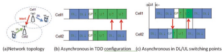 

 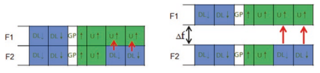 

 在DL和UL传输之间通常选择与干扰相对应- 从聚合器BS到受害者BS的保护距离。

-  内部- 乐队Inter- 频率间- 细胞同步
-  当一个操作员在同一频段中的两个或多个载体上部署TDD系统时，也需要网络同步。 图3.25描述了间- 频率BS- 到- BS干扰，对于相邻载体和两个具有一定频率距离的载体。 自BS以来- 到- BS干扰来自同一网络和同一BS，Intra- 频段传输信号将落入相同接收器flter范围的RF flter中，从而完全阻止BS接收器。

-  内部- 乐队Inter- 操作员与区域调节协调的同步
-  对于在同一频段中的频谱上部署TDD系统的不同操作员，相似的Inter- 频率BS- 到- BS干扰遭受了受害者TDD网络的影响，而UL时间寡妇与侵略者TDD网络与DL传输重叠。 有一个建议在同一频段中的两个相邻的TDD网络之间引入一个后卫乐队。 但是，对于具有宏BSS的蜂窝网络，除了间外，还需要一个很大的防护带- 操作员特殊隔离，以避免BS接收器阻止和受害者TDD网络的基本接收性能。 根据中国MIIT [15]和EU ECC [16]的法规评估，对于两个2.6 GHz LTE TDD系统，需要一个5-10 MHz的后卫频带，单独操作带宽为20 MHz，并且超过25 MHz 两个3.5 GHz NR TDD需要后卫乐队
 如图3.26所示，单独操作带宽为100 MHz的系统。 如此大的后卫乐队浪费了珍贵的光谱资源，因此对于任何区域监管机构和运营商来说都是不可接受的。

 到达内部- 乐队Inter- 操作员TDD同步，区域调节器通常根据来自多个操作员的DL/ UL量负载比统计数据指定常见的TDD DL/ UL框架结构。 如果必须在同一乐队中部署TDD网络，很少有国家还要求运营商进行协调。

-  ** 中国：**  对于全球的FRST 2.6 GHz TDD网络，中国运营商为协调该网络做出了许多努力。 最后，根据中国MIIT（工业和信息技术部）的指南，基于相同的框架结构TDD结构2和相同的DL/UL/UL/UL
 贩运比率为4：1。 中国MIIT正在积极组织MNO和相关的利益相关者，以协商3.5 GHz频段中5G网络同步的单个框架结构。

-  ** 日本：**  2014年1月23日，麦克风（内政与通信部）举行了对日本潜在运营商的公开公开听证会。 理想情况下，包括DL/UL浓汤在内的同步，以便无法获得频谱资源的效率使用。 所有操作员都通过指代下行链路方面的重型数据流量来对DL重型框架的浓厚融合具有相同的看法。 日本内政与通信部（MIC）
 发布了2014年9月介绍4G评论的指南，其中包括应为3480-3600 MHz分配33家运营商（每个操作员40 MHz）用于TDD使用，并且被许可人有义务提前同意。 TDD同步操作的事项，其中还选择了框架结构炒作2。

 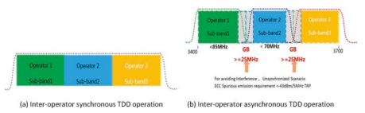 

  

 图3.27 UK 3.4 GHz频段计划基于Fnal拍卖结果

  

 图3.28 DL/UL比为4：1的TDD框架结构。 （a）LTE- 浓汤的TDD框架结构2，5 ms单DL/UL切换期。 （b）5g- NR框架结构为2.5毫秒单DL/UL

  

 切换期
-  2018年4月6日，MIC将剩余的3.5 GHz频谱分配给了2家运营商，这两个许可证将同步现有的3.5 GHz TDD网络。

-  英国：2017年7月11日，英国OFCOM发布了拍卖法规[17]，以授予2.3和3.4 GHz频谱频段，并在法规附带更新了信息备忘录[18]。 更新的信息备忘录列出了将分别为2.3和3.4 GHz频段颁发的许可条件。 许可证是技术中性的，并且基于时间分级双工（TDD）模式。 被许可人将被要求同步他们的网络以避免彼此干扰，因此，贩运的一致性和 "Preferred Frame Structure confguration 2"  如图3.28（a）
 对于具有允许传输掩模限制的传输，要求实施同步。 时间插槽的持续时间必须为1毫秒。 TD- LTE框架拼写2（DL/UL比4：1）与此框架结构兼容。 首选框架结构的其他详细信息可以在信息备忘录中的第12段中找到。

-  2019年初，OFCOM进行了拍卖，基于Fnal Auction Result的3.4 GHz频段计划如图3.27所示。

-  如上所述，全球几乎所有商业LTE TDD系统都采用TDD Confguration 2，即5 ms期间 "DSUDD"  图案和DL/UL比值约为4：1，如图3.28（a）所示。 对于只有5克的TDD频段- NR部署，也可以选择相同的DL/UL比率为4：1，但有2.5毫秒的期限为 "DDDSU"  图案由于较宽的子载波间距和较短的插槽长度，如图3.28（b）所示。 如各节所述。 3.1.2，3GPP指定了5G的非常可爱的框架结构- nr; 因此，还可以根据运营商之间的区域法规协调来采用其他TDD DL/UL融合，而运输统计和实施复杂性都应考虑到。

-  ** 内部- Band LTE/NR同步** 
 对于2.6 GHz乐队41和3.5 GHz乐队42，例如中国和日本都计划部署LTE TDD和5G- 同一频段内的NR系统。 与内部- 乐队Inter- 操作员TDD同步，调节器要求相同的DL/UL切换期和切换点。 LTE和5G- NR通常具有不同的命理性，即LTE的15 kHz子载波间距和NR的30 kHz子载波间距。 对于LTE TDD，框架拼写2是最广泛使用的框架结构，即3：1 dl/ul比率为5 ms dl/ul切换周期。 然后，5G- 建议NR以5 ms的TDD DL/UL切换周期进行操作，其模式 "DDDDDDDSUU"  和DL/UL
  与LTE同步的比率为8：2。 此外，NR中的插槽格式相结合非常可爱，可以匹配LTE中特殊副车架的所有鸡冠。 唯一的修改是调整帧的起点，如图3.29所示。

 值得注意的是，网络同步不是时间分级双工（TDD）模式运行的通信系统的独家功能，而如果预期性能增益，则可以应用于频司令（FDD）模式下的通信系统 通过利用干扰取消（IC）等技术。 差异在于同步精度精度的要求。 GSM，UMTS，WCDMA和LTE- FDD移动技术仅需要在无线电界面的每十亿（PPB）50（PPB）中精确频率同步。 CDMA2000，TD- SCDMA和LTE- TDD服务具有与其他早期2G/3G网络相同的频率要求，但也指定了对阶段和时间的要求。 与频率同步通常足够的FDD系统不同，TDD系统中的时间和相位参考必须可以追溯到协调的通用时间（UTC），这一点至关重要。

  

| [16]中描述的技术| 同步要求||
|--------------------------------------|--------------------------------|----------------------------------|
| 无线电访问技术| 频率准确性| 阶段准确性|
| GSM，UMTS，WCDMA，LTE- FDD| 50 ppb| na|
| CDMA2000| 50 ppb| ±3μs至±10μs|
| TD- SCDMA| 50 ppb| ±3μs|
| LTE- TDD| 50 ppb| ±1.5μs（用于细胞半径≤3km）|
| 50 ppb| ±5μs（对于细胞半径> 3 km）||
| 5G- nr| 50 ppb| ±1.5μs|

 没有常见的UTC时间参考单元站点，就无法按预期运行。 在LTE中- TDD系统，指定两个相精度粒度，1.5μs和5μs，对应于两个细胞半径尺寸，分别为3 km。 表3.12列出了不同移动网络模式的同步要求的摘要。

 保证TDD网络同步的机制由于3G TD而成熟- SCDMA系统，并且已经在全球LTE TDD系统中广泛使用。 目前，主要解决方案包括：
-  ** 类型1：基于GNSS系统的分布式同步方案。**  GNSS
 信号接收器直接部署在终端和BSS上； 每个BS都会直接获得卫星时间信号（GPS，Beidou，Glaness等），以实现不同BSS之间的时间同步，并确保任何两个基站的最大偏差不超过3我们。 通常，宏BSS位于开放区域，这可以轻松安装具有良好卫星信号接收性能的GPS天线。 但是，对于那些BSS部署了室内或室外的BS，但被容易阻止GPS信号的高个子包围，正确接收GPS信号将很难。

-  ** 类型2：基于IEEE1588V2的集中同步方案**  由蜂窝网络回程维护的系统。 IEEE 1588V2指定准确的时间传输协议，可以实现sub- 微秒精度时间同步如当前的GPS。 主要时间源的时钟同步信息通过传输网络上的1588V2协议数据包发送。 BSS可以通过1588V2接口从传输网络获取时间信息，以实现NS级别的同步精度。 它要求承载网络的所有节点支持PTP，此外，时钟同步质量受网络QoS的影响。 以上两种同步解决方案相互补充。 它们俩都已经在商业LTE网络中广泛使用。 每个操作员都可以选择自己的网络同步解决方案。

##  3.2.1.2.2.3动态TDD和灵活的双工

 传统的TDD网络具有静态的TDD DL/UL融合，通常由特定国家或地区的多个运营商之间的统计UL/DL贩运负载比决定。 但是，在实用的电信网络中，DL贩运构成了整个电视的很大一部分- 如图3.30（a）所示，在实用网络量统计中所示的流量。 随着视频流的普及，如图3.30（b）[19]所示，DL含量的比例将在将来进一步增长。 因此，应该将更多资源分配给DL是很自然的。 因此，较小的资源将留给UL，这将进一步影响UL覆盖范围的性能。

 电信行业永远不会放弃提高总频谱利用率的效率[20]。 如果网络可以根据实际的DL/UL DULPC比率在地理上及时将DL/UL无线电资源比率融合在一起，则假设它可以解决严重的DL- 到- UL干扰宽- 区域TDD
 网络，频谱利用率可以得到很多改进。 双面发展路线图中有两个步骤，如下所示。 此外，有学术论文提出了完全双工[21，22]作为FNAL双链进化步骤，但是由于许多实施挑战，这是不成熟的。

##  动态TDD

 LTE- 高级系统介绍了TDD DL/UL比率的动态融合

   (Fig. 3.31) from 3GPP Release-12 and onwards, called as enhanced interference management traffc adaption (eIMTA) [23]. In the theoretical analyses and simulation [24], eIMTA can be applied to an isolated area such as indoor hotspot scenario like football game with a very special DL/UL traffc statistics. One drawback of eIMTA is that the newly introduced interference between DL and UL signals will 

 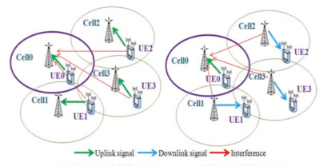 

 减少信号- 到- 干扰加噪声比（SINR）- 存在细胞干扰，从而导致传统TDD系统的通信质量降解。 如以下FGURE所解释的那样，Cell 0基站接收器所遭受的干扰增加了，因为来自邻居基站的DL信号的发射功率高于UL信号会导致强烈干扰。

 商业LTE TDD网络主要宽- 覆盖蜂窝网络； 因此，由于其严重的载体和内部，EIMTA尚未部署在实际系统中- 宏观ENB中正常收发器实施的载体干扰。

##  灵活的双工

-  灵活的融合 ** dl/ul比**  ：5G标准化考虑了从第1天开始的FDD/TDD收敛的未来趋势，该趋势 * Defnes *是一种非常可爱的物理层设计以及对称的DL/UL空气界面。 5G- nr
 继承LTE EIMTA的动态TDD DL/UL比率，而两个静态单元格则更进一步- 指定DL/UL浓汤和DL/UL切换期，以及其他潜在的半半- 静态或动态UE- 指定DL/UL浓汤。 如图3.32，3GPP释放- 15最多指定为DL，UL或未知方向的每个OFDM符号，而未知- 可以针对每个UE接收器特异性地将方向符号特定地融合在一起。 在这62个老虎机鸡蛋中，有4种典型的鸡蛋作为DL- 只有插槽，DL- 主插槽，UL- 只有插槽和UL- 主要插槽[5]。 在一个5g之内- NR无线电框架，每个插槽都可以在总共62名候选人中拥有自己的DL/UL融合。 理论上，5G- NR可以为从UE侧看到的框架结构支持大量候选DL/UL浓汤，同时保持基本单元格- 在那些基本的DL或UL符号上同步的级别TDD同步不一定占据框架的整个时间。

 图3.32 5G- 3GPP版本中的NR插槽dl/ul融合- 15

  

 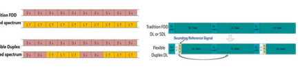 

  

-  ** 可爱双工的其他应用程序方案**  ：从理论上讲，这种可爱的插槽方向也可以与配对频谱融合在一起。 由于DL和UL贩运负载之间的不平衡越来越严重，当FDD频段的对称DL/UL带宽终止，当FDD DL资源完全占据了EMBB贩运的完全占据时，越来越多的UL无线电资源。 因此，有一种潜在的解决方案可以利用较低的不幸的UL- PICO电池的功率DL传输，如图3.33（a）所示。 如图3.33（b）所示，可充实的双链模式也可以应用于一些新的FDD DL Spectrum和SDL频段，在图3.33（b）中，有可能在DL载体中引入SRS以启用基于DL/UL通道的EFFCIENT MULTIANTENNA机构 。 对于FDD DL或UL频谱或SDL频段中的可X型双链体应用，主要极限将是区域频谱调节限制。 灵活的双工也适用于访问- 集成的无线回程，D2D，
 等，如图3.34所示。 实际上，运营商广泛部署高速和低速是非常昂贵的- 延迟的回程（例如，FBER）考虑了合适的站点的成本和差异，而传统的无线进行回程或继电器需要额外的频谱，以避免访问和访问链接的干扰[25，26]，这是非常低的EFFCIENT。 使用可爱的双工，可以将相同的资源分配给回程链接和访问链接，并使用MU分配- MIMO类型的高级接收器来减轻间接- 链接干扰。 类似的机制是用于- 频段D2D系统。

  

 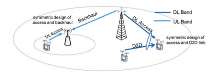 

  

-  ** 灵活的双工干扰缓解机制：**  对于具有可爱的双工浓汤的蜂窝网络，主要问题仍然是DL- 到- 细胞之间的UL干扰。 到达良好的中间- 细胞间- 方向干扰缓解性能，具有可接受的高级接收器实现复杂性，5G- NR空气界面设计为具有对称的DL/UL传输格式，多数- 访问以及类似的参考信号，以供通道估计和解调。 A.多人- 访问方面
-  在LTE，DFT- s- Ofdma被用作倍数- 由于低峰值而导致UL的访问计划- 到- 平均功率比（PAPR）以获得更好的覆盖范围，而DL则采用了OFDMA的效率更高的宽带频率- 域选择性调度。 因此，DL的子载波映射方案不同
 和UL信号，导致一半- 子载波在两种信号之间偏移，如图3.35所示。 这种设计在常规系统中效果很好，但不能支持5G中的新应用程序。 为了支持可爱的双链体，提出了对称设计- 采用DL和UL信号的访问方案。 子载波映射方案也应彼此对齐，以避免- DL和UL信号之间的载体干扰。 基于此类对称性，可以将接收两个DL（UL）信号的当前过程同时接收DL和UL信号。

##  B.参考信号方面

 在LTE中，对DL的参考信号（RS）模式的设计截然不同
 和ul。 为了很好地支持DL和UL信号同时接收，首选避免数据和DM RSS之间的干扰，并确保DL和UL DM RSS彼此之间是正交的，以便接收器可以估计DL和UL褪色通道 这两个信号都准确地确保以后解码。 在5G中，DL/UL对称空气界面可以在参考信号之间或参考信号和不同传输方向的数据传输之间提供正交资源。 通过这样的设计，- 从高级接收器中可以看出方向干扰是实际计划信号的多源MIMO中的正交流。 虚拟MIMO高级接收器已经在LTE网络中实现了很好，这可以是5G Fexible Duplex Advanced接收器的基础。

##  3.2.2 3GPP 5G- NR频段排泄3.2.2.1 ** 3GPP Rel.15 5G- NR频段缺乏** 

 5G- 3GPP版本中指定的NR候选频谱- 15分为两个频率范围。 FR1代表子- 6 GHz光谱，从450 MHz到6 GHz不等，而FR2用于毫米波，从24.25 GHz到52.6 GHz。

 FR1由传统的LTE乐队以及IMT标识的新乐队组成- 2020年WRC'15，在表3.13 [27]中列出。 除了双载模式FDD，TDD和SDL外，还有六个SUL频段，并在版本中规定了新的双工模式- 15.在FR1频段中，NR频段N7，N38，N41，N77，N78和N79授权UE能够支持四个接收天线端口，以最大程度地提高MIMO UE经验[27，28]。

 3GPP释放- 15只指定四个- 毫米- 如表3.14所示，FR2中的波带[29]。 所有发布- 15 FR2频段采用TDD模式，以方便地利用DL/UL频道互惠进行多数- 天线传输。

##  3.2.2.2 ** 3GPP 5G- NR带组合** 

 由于路径损失和中间的穿透损失很大- 和高- 频率5G新频段，C- 乐队（N77，N78，N79）和毫米- 波带（N257，N258，N260，N261）的覆盖率非常有限，因此限制了细胞- 访问操作的NR基站的UE的边缘用户体验吞吐量。 因此，典型

| 表3.13| FR1中的NR操作带| 下行链路（DL）操作频段BS发送/UE接收FDL_LOW- fdl_high| 双工模式|
|-----------------------------------------------------------------------------------------------------------------------------------------------------------------------------------------|-----------------------------|--------------------------------------------------------------------------|---------------|
| N1| 1920–1980 MHz| 2110–2170 MHz| FDD|
| N2| 1850–1910 MHz| 1930–1990 MHz| FDD|
| N3| 1710–1785 MHz| 1805–1880 MHz| FDD|
| N5| 824–849 MHz| 869–894 MHz| FDD|
| N7| 2500–2570 MHz| 2620–2690 MHz| FDD|
| N8| 880–915 MHz| 925–960 MHz| FDD|
| N12| 699–716 MHz| 729–746 MHz| FDD|
| N20| 832–862 MHz| 791–821 MHz| FDD|
| N25| 1850–1915 MHz| 1930–1995 MHz| FDD|
| N28| 703–748 MHz| 758–803 MHz| FDD|
| N34| 2010–2025 MHz| 2010–2025 MHz| TDD|
| N38| 2570–2620 MHz| 2570–2620 MHz| TDD|
| N39| 1880- 1920 MHz| 1880- 1920 MHz| TDD|
| N40| 2300–2400 MHz| 2300–2400 MHz| TDD|
| N41| 2496–2690 MHz| 2496–2690 MHz| TDD|
| N50| 1432–1517 MHz| 1432–1517 MHz| TDD1|
| N51| 1427–1432 MHz| 1427–1432 MHz| TDD|
| N66| 1710–1780 MHz| 2110–2200 MHz| FDD|
| N70| 1695–1710 MHz| 1995–2020 MHz| FDD|
| N71| 663–698 MHz| 617–652 MHz| FDD|
| N74| 1427–1470 MHz| 1475–1518 MHz| FDD|
| N75| N/A。| 1432–1517 MHz| SDL|
| N76| N/A。| 1427–1432 MHz| SDL|
| N77| 3300–4200 MHz| 3300–4200 MHz| TDD|
| N78| 3300–3800 MHz| 3300–3800 MHz| TDD|
| N79| 4400–5000 MHz| 4400–5000 MHz| TDD|
| N80| 1710–1785 MHz| N/A。| sul|
| N81| 880–915 MHz| N/A。| sul|
| N82| 832–862 MHz| N/A。| sul|
| N83| 703–748 MHz| N/A。| sul|
| N84| 1920–1980 MHz| N/A。| sul|
| N86| 1710–1780 MHz| N/A。| sul|
| 注1：符合NR频段N50最低要求的UE，应在此指定中NR操作频段上行链路上行链路（UL）操作带BS接收/UE Transmit ful_low- ful_high||||

 网络操作将结合新的宽带中间- 或高- 频率5G
 low- 频带，而后一个频带将用作锚固载体，以提供连续的覆盖范围和无缝的迁移率。 不同的操作员可以根据自己的频谱为其5G网络部署选择不同的频段组合。

 操作带

 上行链路（UL）操作带下行链路（DL）操作带双工

 ful_low- ful_high fdl_low- FDL_HIGH模式

 N257 26,500 MHz – 29,500 MHz 26,500 MHz – 29,500 MHz TDD N258 24,250 MHz – 27,500 MHz 24,250 MHz – 27,500 MHz – 27,500 MHz 8,350 MHz 27,500 MHz -28,350 MHz TDD

##  3.2.2.2.1 5g- NR带组合机制

 3GPP指定LTE的两个带组合机制- 高级：载体聚合（CA）自发布以来- 10和双连通性（DC）自发布以来- 12. 5克- NR，3GP​​P Defnes另外两种频带组合机制，它们是LTE/NR DC，通常为NR- 站立- 单独操作和NR带有SUL带的正常TDD（或FDD/SDL）频带的NR频带组合。 总共有三种潜在的频带组合机制用于5G- NR立场- 单独部署和5G的两个潜在带组合机制- nr non- 站立- 单独部署，如下所述：
 5克- NR立场- 单独部署，可以采用以下三种频段组合机制。 但是，只有NR- NR DL CA和SUL指定在释放中完成- 15，而NR- NR DC仅指定少量mm- 波和c- 频段组合部分。- nr- NR CA：操作的网络聚合多个NR组件载体
 （CC）为单个UE提供服务，以增加潜在的计划带宽并增加体验吞吐量（图3.36）。 次级CC（SCC）中的数据传输可以通过主要CC（PCC）的控制信号来安排，并且SCC的HARQ反馈也可以在PCC上传输。 NR有三种类型- NR CA，即内部- 带有连续CC的频带CA- 带有非连续CA的频带CA和Inter- 带CA，如图3.36（a），（b）和（c）所示。

-  nr- NR DC：类似于NR- NR CA，可以同时在多个CC上传输单个UE的数据流以达到更高的比特率。 但是，nr- NR DC强迫自我- 在CC内包含数据调度，传输和HARQ程序，并且需要更长的激活和停用CC。

-  SUL的NR带组合[30]：该带组合结合了NR
 SUL CC具有正常的NR CC（s），其中包含DL，它可以是一个或多个TDD CC（S），FDD CC（S）或SDL CC（S）。 SUL的典型操作组合是与TDD CC结合。 与NR不同- NR CA，合并的正常NR CC和SUL CC形成一个单个单元，所有UL时间- 正常CC和SUL CC中的频率资源形成一个单个池- 细胞调度以及共享相同的HARQ过程。 这种机制具有支持同时载体交换和DL容量和UL覆盖率之间的良好平衡的好处，如各节所述。 3.3。

 CC1 CC2…CCN CC1 CC2…CCN

  

 （a）内部- 带连续- CC CA（B）内部- 乐队非- 连续- CC CA

 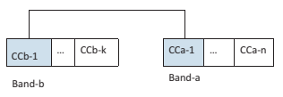 

 图3.36 NR- NR CA。 （a）内部- 带连续- CC CA。 （b）内部- 频段无连续- CC
 大约 （c）间- 乐队CA

| LTE乐队| NR乐队|
|-----------------------------------------------------------------------|----------------|
| 乐队25、26、41| 2.496–2.69 GHz|
| 乐队1、3、8、11、18、20、21、26、26、28、40、41、42| 3.3–4.2 GHz|
| 乐队1、2、3、5、7、8、11、18、20、21、21、26、28、38、39、41、42、66| 3.3–3.8 GHz|
| 乐队1、3、8、11、18、19、21、26、26、28、39、41、42| 4.4–5.0 GHz|
| 乐队1、3、5、7、8、11、18、19、21、26、26、28、41、42、66| 26.5–29.5 GHz|
| 乐队3、7、8、20、28、39、41| 24.25–27.5 GHz|
| 乐队2、5、12、30、66| 37–40 GHz|
| 乐队5，66| 27.5–28.35 GHz|

 5克- nr non- 站立- 单独部署，以下两个频带组合机制在发行版中指定- 15。- LTE/NR DC：一个网络可以允许单个- UE数据传输多个流在LTE和NR上并行。 典型的操作模式称为en- DC，即非- 站立- 单独使用LTE作为锚网网络的NR部署，以提供基本的覆盖范围和移动性层，并访问EPC。

-  LTE- FDD和NR SUL带组合：LTE/NR DC的一种特殊情况
 操作模式是将NR细胞作为NR带与SUL融合在一起，而Sul载体可以是LTE UL载体的正交或与LTE UL载体共享的正交。 更多的详细信息将在Sect中引入。 3.3。

##  3.2.2.2.2 5G带组合缺陷

 3GPP释放- 15仅完成​​了某些优先级的5G频带组合的LTE/NR DC和NR频带组合的规格，NR- NR CA和NR- NR DC，如表3.15、3.16、3.17和3.18所示。

  

| 表3.16| SUL的NR带组合（来自[27，31，32]的数据）||||
|------------------|---------------------------------------------------------|------------------------------------------------------|-----------------------------------|--------------------------------------------------------------------------------------------------------------------------------------------------------------------|
| NR立场- 独自的| nr non- 站立- 单独LTE/NR SUL||||
| SUL组合| SUL带（UL）| NR频段（UL/DL）| 组合||
| 发布- 15| SUL_N78- N80| 1710–1785 MHz| 3.3–3.8 GHz| DC_1- SUL_N78- N80 DC_3_SUL_N78- N80 DC_7_SUL_N78- N80 DC_8_SUL_N78- N80 DC_20_SUL_N78- N80 DC_1- 3- SUL_N78- N80 DC_3- 7- SUL_N78- N80 DC_3- 8- SUL_N78- N80 DC_3- 20- SUL_N78- N80|
| SUL_N78- N81| 880–915 MHz| DC_3- SUL_N78- N81 DC_8_SUL_N78- N81|||
| SUL_N78- N82| 832–862 MHz| DC_3- SUL_N78- N82 DC_20_SUL_N78- N82|||
| SUL_N78- N83| 703–748 MHz| DC_8- SUL_N78- N83 DC_20_SUL_N78- N83 DC_28_SUL_N78- N83|||
| SUL_N78- N84| 1920–1980 MHz| DC_20- SUL_N78- 84 DC_1_SUL_N78- N84 DC_3_SUL_N78- N84|||
| SUL_N78- N86| 1710–1780 MHz| DC_8- SUL_N78- N86 DC_66_SUL_N78- N86|||
| SUL_N79- N80| 1710–1785 MHz| 4.4–5.0 GHz| DC_8- SUL_N79- N80 DC_3_SUL_N79- N80||
| SUL_N79- N81| 1710–1780 MHz| DC_8- SUL_N79- N81|||
| SUL_N79- N84| 1920–1980 MHz| DC_1- SUL_N79- N84|||
| SUL_N75- N81| 880–915 MHz| 1432–1517 MHz| DC_8- SUL_N75- N81||
| （SDL）|||||
| SUL_N75- N82| 832–862 MHz| DC_20- SUL_N75- N82|||
| SUL_N76- N81| 880–915 MHz| 1427–1432 MHz| DC_8- SUL_N76- N81||
| SUL_N76- N82| 832–862 MHz| DC_20- SUL_N76- N82|||
| （SDL）|||||
| SUL_N41- N80| 1710–1785 MHz| 2496–2690 MHz| DC_3- SUL_N41- N80||
| SUL_N41- N81| 880–915 MHz| DC_8- SUL_N41- N81|||
| SUL_N77_N80| 1710–1785 MHz| 3.3–4.2 GHz| DC_1- SUL_N77- N80 DC_3_SUL_N77- N80||
| SUL_N77_N84| 1920–1980 MHz| DC_1_SUL_N77- N84 DC_3_SUL_N77- N84|||
| 发布- 16| DL_N78（2A）_| 1710–1780 MHz| 3.3–3.8 GHz| dc_66_sul_|
| UL_N78- N86| N78（2a）- N86||||

 对于上述频带组合机制，多个频段的共存可能会因虚假排放而导致严重的接收器脱敏，因此严格的RF要求以及每个的相应解决方案

| 表3.17| nr- NR CA [55]|||||
|-----------------------|-----------------------------------------------------------|-----------------------|-------------------------------------------------------|------------|---------|
| 内部- 带连续| 内部- 带连续的ca|||||
| CA在FR1中| 在FR1中| FR1/FR2 Inter- 乐队CA||||
| NR CA| NR CA|||||
| 乐队| NR乐队| 乐队| NR乐队| NR CA乐队| NR乐队|
| CA_N77| 3300–| CA_N3AN77A| FDD：|||
| 4200 MHz| 1805– 1880 MHz和1710– 1785 MHz TDD：3300– 4200 MHz| CA_N8- N258| FDD：880–915 MHz和925–960 MHz TDD：24.25–27.5 GHz|||
| CA_N78| 3300–| CA_N3AN78A| FDD：|||
| 3800 MHz| 1805– 1880 MHz和1710– 1785 MHz TDD：3300– 3800 MHz| CA_N71- N257| FDD：663–698 MHz和617–652 MHz TDD：26.5–29.5 GHz|||
| CA_N79| 4400–| CA_N3AN79A| FDD：|||
| 5000 MHz| 1805– 1880 MHz和1710– 1785 MHz TDD：4400–5000 MHz| CA_N77- N257| TDD：3.3–4.2 GHz TDD：26。5–29.5 GHz|||
| CA_N8AN75A| FDD：880–915 MHz和925–960 MHz SDL：1432–1517 MHz| CA_N78- N257| TDD：3.3–3.8 GHz TDD：26.5–29.5 GHz|||
| CA| FDD：|||||
| N8- N78A| 880–915 MHz和925–960 MHz TDD：3300– 3800 MHz| CA_N79- N257| TDD：4.4–5.0 GHz TDD：26.5–29.5 GHz（续）|||

| 表3.17| （继续）|||||
|-------------------------------------------------------------------------------------------------------------|-----------------------------------------------------------|-----------------------|---------|------------|---------|
| 内部- 带连续| 内部- 带连续的ca|||||
| CA在FR1中| 在FR1中| FR1/FR2 Inter- 乐队CA||||
| NR CA| NR CA|||||
| 乐队| NR乐队| 乐队| NR乐队| NR CA乐队| NR乐队|
| CA_N8AN79A| FDD：880–915 MHz和925–960 MHz TDD：4400–5000 MHz|||||
| CA_ N28A_ N78A| FDD：703–748 MHz和758–803 MHz TDD：3300– 3800 MHz|||||
| CA_ N41AN78AA| TDD：2496–2690 MHz TDD：3300– 3800 MHz|||||
| CA_ N75AN78AA| SDL：1432–1517 MHz TDD：3300– 3800 MHz|||||
| CA_ N77AN79A| TDD：3300–4200 MHz TDD：4400–5000 MHz|||||
| CA_ N78AN79A| TDD：3300–3800 MHz TDD：4400–5000 MHz|||||
| 适用于UE支持Inter- 带有强制性同时RX/TX功能的带载体聚合||||||

 频段组合必须单独进行定义。 虚假排放是由不必要的发射器效应（例如谐波排放和交换产物）引起的排放。 接收器脱敏是根据UE指定中的最大灵敏度扣除（MSD）指定的[31]。

| 表3.18| NR的频带组合- DC（两个乐队）|
|--------------|------------------------------------------|
| nr- DC乐队| NR乐队|
| DC_N77- N257| TDD：3.3–4.2 GHz TDD：26.5–29.5 GHz|
| DC_N78- N257| TDD：3.3–3.8 GHz TDD：26.5–29.5 GHz|
| DC_N79- N257| TDD：4.4- 5.0 GHz TDD：26.5–29.5 GHz|

 调节是FDD频段的下行链路传输带宽内的不需要发射，由双重产生- 通过UE侧的非线性收发器在不同频率下的上行链路传输。 低的- 阶介质导致对LTE/NR DC，CA和LTE/NR SUL的某些带组合的严重干扰。 对于那些频段组合，建议在UE侧进行单个UL传输，以避免由于调制而导致的FDD DL性能降解。

 谐波发射是由在指定频率范围内的较低频带中的主动上行链路产生的，该频率范围内的频率频段的发射器谐波来自UE侧的发射器谐波落在UE接收器较高带中的下行链路传输带宽内。 谐波可以通过较低频段处的谐波排斥flter来减轻谐波，或通过限制低频频段中UL传输的频谱资源而避免，并与DL计划的资源分配的协调- 频带。

 与通常与UE自我有关的通常的谐波问题不同- 低敏化问题时- 频带UL谐波落在高处- 频带DL载体，某些带的组合可能会持续低- 高敏化时带脱敏- 带UL载波位于低点的第三或第五个谐波- 由于已知的谐波混合问题，Band DL载波。

##  3.2.2.2.2.1

 进行调制是由于图3.37所示，通过在不同频率到达发射机的两个或多个信号引起的非线性元件中产生了信号。 对于与某些频带组合融合的UE，可能会发生交流发射，而不论带有LTE/NR DC，LTE/NR/NR UL共享和间- LTE或NR系统中的频带CA或DC。 低的- 订单交换可能是如此严重，以至于可能对低点造成严重损害- 频带DL接收。 例如，对于频段3（FDD：DL/1805–1880 MHz，UL/1710–1785 MHz）和Band 42（TDD：DL和UL/3400–3600 MHz）LTE- CA [33]，由于第二个，LTE DL灵敏度将降低29.8 dB- 订单间调节干扰。 3GPP行业已经认可了如此严重的交流问题和对UE实施的挑战，并在发行期间进行了热烈讨论- 15 5g- NR标准化期。

  

 以NR Core Band N78（3.3-3.8 GHz）为例- 相关频带组合，表3.19给出了交流分析，其中IMDN代表nth- 订单交换。 该分析也可以扩展到3.3-4.2 GHz。 从桌子上可以看出，在所有涉及C的频段组合中- 频段，与B1和B3的结合将受到第二个IMD干扰非常强烈

| 表3.19| NR频段N78的LTE NR频段组合的IMD|||
|--------------|----------------------------------------------------|-------------------------------------------------------------------------|----------------------------------------------------------------------|
| LTE乐队| NR乐队|||
| fx| FY| IMD的来源| 注意受害者乐队|
| B1| N78（3.3–3.8 GHz）| IMD2，IMD4，IMD5| IMD2：band1，fy -fx imd4：band1，3*fx -fy imd5：band1，2*fy -3*fx|
| B3| IMD2，IMD4，IMD5| IMD2：频段3，fy -fx imd4：频段3，3*fx -fy imd5：band 3，2*fy -3*fx||
| B5| IMD4| 乐队5，fy -3*fx||
| B7| IMD4| 乐队Z，3*fx -fy||
| B8| IMD4| 乐队8，fy -3*fx||
| B20| IMD4| 乐队20，fy -3*fx||
| B28| IMD5| 乐队28，fy -4*fx||
| B39| N/A。|||
| B41| N/A。|||
| B42| N/A。|||

  

 订单，而B5，B7，B8和B20将遭受IMD的第四顺序，而B28遭受IMD的第五顺序。 在第二阶和第三阶的交流将在相应的发射频率范围内在数十位DB水平下导致不可接受的性能降解，甚至第四- 订单和第五- 订单IMD影响也很明显。

 由于严重的降解向低- 频率FDD DL性能，3GPP为那些带有交换问题的频带组合指定了单个UL解决方案：限制单个频段中的UL传输。 也就是说，UE在一对低点之间仅在一个载体上运行- 频率和高频载体。

 对于所有乐队组合机制，该频段要为UL选择
 一次传输取决于RSRP测量。 通常，在细胞中心选择高频UL载体，而低频率- 频率UL
 选择在细胞边缘的UES载体（图3.38）。 3.2.2.2.2.2谐波避免交叉避免- 频段调度协调与来自不同频率的传输产生的间调节不同，谐波发射是由一个较低频段中的单个主动上行链路产生的，在较低的频段中，其发射器的谐波来自UE端的发射器谐波，在下行链路传输频段内，在较高的频段中分配给了较高的频段，该链接属于较高的链路传输带宽。 UE接收器。

 以示例为例，再次以Band N78为例，表3.20提供了这些频带组合的谐波分析。 它表明对于C- 乐队N78- 涉及的频带组合，与B2，B3和B66的组合遭受第二名- 订单谐波问题，而与B8，B20和B26的组合遭受第4个- 订购谐波问题，与B28的组合遭受了第五次- 订单谐波问题。

 除了利用下部频段的谐波拒绝flter来减轻MSD
 问题，可以通过将UL传输的频谱资源限制在低点来避免谐波- 频带，以及与DL计划的资源分配的协调- 频带。 自从高- 频带具有非常宽的带宽，例如在C处，100 MHz载体- 频段，而谐波问题仅在频率范围较窄的范围要比整个载体带宽范围较窄得多。- 频带，因此，直接安排UE的DL传输以避免频率范围，以避免频率范围，这可能会遭受谐波问题的同时ul传输。- 频率FDD频段。

| 表3.20| LTE NR带和3.5 GHz频段的谐波混合||
|--------------|------------------------------------------------------------------|--------------------------|
| LTE乐队，FX| NR乐队，FY| 谐波混合顺序|
| B2| 3.3–3.8 GHz（频段N78）| 第二|
| B3| 第二||
| B8| 第四||
| B20| 第四||
| B26| 第四||
| B28| 第五||
| B66| 第二||
| B1| 3.3–4.2 GHz（频段N77）| 第二|
| B3| 第二||
| B8| 第四||
| B18| 第四，第五||
| B19| 第五||
| B20| 第四||
| B26| 第四||
| B28| 第五||

##  3.3 ** 4G/5G频谱共享（又称LTE/NR共存）** 

 支架的3GPP标准化- 独自一人- 站立- 一个人5g- NR分别于2018年6月和2017年12月冻结。 c- 频段（3300–4200和4400–5000 MHz）成为到2020年引入5G的主要频带，每5G的可用性至少100 MHz通道带宽
 网络。 这对于5G至关重要- NR商业部署以在覆盖范围和能力之间提供最佳平衡，并且优先使用5G- NR BSS Co- 现有LTE BSS的站点以成本为代价- 效率实现。 5G- NR采用大量MIMO将以负担得起的复杂性在细胞中心和细胞边缘增强DL吞吐量。 波束形成可用于达到与部署在1.8 GHz频段的LTE网络相似的覆盖范围。 但是，由于终端和有限的UL传输插槽的发射功率有限，因此很难进行5G- NR仅根据C提高其UL覆盖范围- 乐队TDD载体。 因此，提议4G/5G频谱共享（也称为LTE/NR共存），以重复使用已许可移动使用许可的较低频率的UL备用资源（例如700、800、900、1800和2100 MHz） 5G的覆盖赔偿金- NR网络，计划与3300–3800 MHz结合使用。 4G/5G共享允许运营商从更快的速度和成本中受益- c的效率部署- 频段（可以扩展到SDL和MM- 将来挥手），因此在不产生网络致密成本的情况下提供增强的容量。

##  3.3.1动机和好处

 5G- NR是为支持多种服务而开发的，例如增强的移动宽带（EMBB），庞大的机器- 类型通信（MMTC）和可超低的低- 延迟通信（URLLC）。 新的频谱发布了5G
 不幸的是，部署主要高于3 GHz，其路径损失相对较高，这限制了覆盖范围，尤其是对于上行链路（UL）。 高传播损失，TDD框架中的UL插槽数量有限，并且用户功率有限地严重限制了UL覆盖范围，但是可用的频谱带宽非常丰富。

 此外，5G不同应用的严格要求导致了许多5G挑战，例如确保无缝覆盖范围，高频谱效率和低潜伏期。 本节借助统一的频谱共享机制解决了其中一些挑战，并通过基于4G/5G频率共享的UL/DL解耦解决方案，该解决方案已经在3GPP中指定了
 发布- 15.关键概念是将LTE FDD频带中的UL资源作为补充UL载波，除了在3 GHz上方的TDD频段中进行NR操作外。 频谱共享的性能已与费尔德试验相遇（请参阅第10.4.6节）。

##  3.3.1.1 ** 新频谱上的NR覆盖范围** 

 覆盖范围是无线通信系统的非常重要的性能标准，受到许多因素的影响，包括传输功率，传播损失和接收器敏感性。 由于传播损失随频率而变化，因此覆盖范围在不同的频段中大不相同。 因此，在所有频带中提供良好的性能仍然是5G部署的关键挑战。 此外，由于UL传输功率有限，NR的路径损失比LTE中的损失更高，因此UL覆盖范围通常是5G部署的瓶颈。

##  3.3.1.1.1链接预算

 在图3.39中，与此相比，3.5 GHz TDD频段的覆盖范围性能

   of the 1.8 GHz FDD band is portrayed. Partial list of the parameters assumed for this comparison is shown in the fgure, while the rest are given in Table 3.21. In the link budget, the UL coverage is calculated when the UL data rate is set to 1 Mbps for supporting typical uplink video traffc. By contrast, the DL coverage is usually limited by the physical downlink control channel (PDCCH) quantifed in terms of the block error rate of the primary PDCCH. It can be observed that the UL coverage and DL coverage are balanced over the 1.8 GHz FDD band with the aid of 4 transmit and 4 receive antennas. For the 3.5 GHz TDD band using the same transmit and receive antennas as that of 1.8 GHz scenario, an excess of 10 dB coverage gap is observed. This is mainly due to the large propagation loss, the penetration loss, and the limited number of UL transmission slots in a frame of the 3.5 GHz TDD band. 

| 表3.21| 链接预算中假定的参数1.8 GHz使用4T4R 3.5 GHz使用4T4R| 3.5 GHz，64T64R|||||
|------------------------------------------------|------------------------------------------------------------------------------|-----------------------|---------|---------|---------|---------|
| 参数| PDCCH| pusch| PDCCH| pusch| PDCCH| pusch|
| 17| 0| 17| 0| 10| 0||
| TX天线增益Gant TX（DBI）| 2| 0| 0| 0| 2| 0|
| TX电缆损失LCL TX（DB）| 0| 18| 0| 18| 0| 10|
| Rx|||||||
| Rx天线增益gant（DBI）| 0| 2| 0| 0| 0| 2|
| Rx电缆损失LCL RX（DB）渗透损失LPE| 21| 21| 26| 26| 26| 26|
| （DB）接收器灵敏度γ| -129.44| -134.3| -129.44| -134.3| -141.02| -141.23|
| （DBM）阴影损失LSF| 9| 9| 9| 9| 9| 9|
| （DB）繁殖损失应得| 0| 0| 5.78| 5.78| 5.78| 5.78|
| 到频率LF（DB）干扰边缘IM| 14| 3| 14| 3| 7| 2|
| （DB）每 /热噪声| -132.24| -132.24| -129.23| -129.23| -129.23| -129.23|
| 子载波NRE（DBM）噪声FGURE NF（DB）| 7| 2.3| 7| 3.5| 7| 3.5|

 相比之下，对于3.5 GHz TDD带，使用64个传输和64个接收天线，由于大量模仿和DL干扰边缘差异提供了波束成形的增益，因此可以达到与1.8 GHz相似的DL覆盖性能。 明确地，由于大量的模仿也减少了- 细胞干扰，它们减少了DL干扰边缘。 但是，即使使用大量模仿，与DL的DL相比，UL覆盖范围较差，因为3.5 GHz TDD频段的UL功率频谱密度低于相同最大设备传输的1.8 GHz FDD频段的功率频谱密度 力量。 这部分是由于与FDD框架中的TDD框架中的UL插槽更少，这意味着应为1 Mbps的给定UL吞吐量分配每个插槽的频率更多。 因此，如何改善UL覆盖范围确实是5G部署的重要问题。

##  3.3.1.1.2 UL/DL分配对NR覆盖范围的影响

 如各节所述。 3.2.1.2，TDD系统中的UL/DL运输比率通常是DL对EMBB DL/ul ulc负载统计的主要适应性，即几乎所有商业LTE TDD系统的4：1，最有可能是所选的操作 5G的点- NR TDD也是如此。 因此，较小的资源将留给UL，这将进一步影响UL覆盖范围的性能。

 相反，UL覆盖范围非常适合低点- 频率FDD频带，由于低路径损耗和穿透损耗以及连续可用的UL插槽，始终用于电池边缘的终端传输。

 此外，对于LTE FDD频段，将同一带宽分配给两个UL
 和DL，这意味着UL频谱资源未充分利用。 但是，在实用网络中，几位运营商在图3.40中提供了LTE FDD系统中相应的UL和DL资源利用率。 根据2016年第四季度四个运营商的统计数据，平均下行链路资源利用率为40％至60％，而平均上行链路资源利用率约为10％。 这种情况有可能利用FDD UL免疫光谱资源来5G- 细胞的NR UL传输- 边缘用户，以补偿其在高处的传输- 频率TDD频段。

##  3.3.1.1.3 5g- 由于承保范围，NR部署挑战

 在下文中，我们将讨论一些具有挑战性的问题，这些问题必须在5G部署中考虑，尤其是在TDD模式和较高频段中。- ** 5G频段选择：宽带光谱可用性与覆盖范围。** 
 3 GHz以下的乐队的可用性仍然有限5G- NR在不久的将来，由于带宽有限，较低的频段无法支持高数据速率。 另一方面，更宽的NR频段以上3 GHz的经历增加了传播损失，从而导致覆盖范围有限。 因此，在3 GHz下方和以上的频谱的独立使用无法进行引人注目的交易- 在高数据速率和较大的覆盖范围之间关闭。

-  ** TDD DL/UL比率：频谱利用率效率与DL/UL覆盖范围vs. Multi- 服务操作** 
 如所讨论的那样，由于重型DL贩运负载，在框架中，NR TDD操作通常会在有限数量的UL传输插槽（例如DL：UL = 4：1）上进行混合，即使应该分配更多的插槽 用于改善UL覆盖范围。 当带宽可以-

  

 由于最大的传输功率约束，不能进一步增加。 由于DL光谱效率通常高于UL的效率，因此具有更多的UL插槽将进一步降低光谱利用率。

 因此，有一个明确的交易- UL覆盖范围和光谱利用率之间的关闭。

 此外，需要5G系统来提供包括EMBB在内的各种服务，
 MMTC和URLLC。 如在教派中分析的。 3.2，一个很难- 网络TDD企业contguration to ft to to to bo nbb和abb of IoT类型的服务。 effcient Embb
 传输需要高的DL资源比例- 面积场景（LPWA）高度依赖UL覆盖范围，因此需要连续的UL传输，最好是尽可能低的路径损失。 因此，需要使用独立的TDD浓度来支持各种服务。

-  ** TDD DL/UL切换期：传输效率与延迟。** 
 对于TDD操作，需要频繁的DL/UL切换才能提供非常快速的DL/UL计划，并且几乎立即使用ACK/
  NACK反馈。 但是，每个DL/ul也需要一定的防护时间
  切换点（例如，TD中使用130μs- LTE网络）避免由于其他细胞发出强大的DL干扰而严重阻断UL接收器。 频繁的DL/UL切换会导致较高的空闲时间（1 ms 1 ms和5 ms开关期为14.3％，而2.8％的时间为2.8％）。 单个TDD频段网络操作中如此短的DL/UL切换周期将导致EMBB传输的频谱效率的不可接受的降解，通常利用较大的DL/UL切换周期，例如2.5 ms或5 ms。

-  ** 现场计划：无缝覆盖范围与部署投资和流动性。** 
 适用于5G早期- NR部署公司- 现有LTE网络的站点安装将具有成本效益和方便。 但是，由于较高的繁殖损失高于3 GHz，因此必须引入密集的细胞和新位点。 否则，5G- NR无法获得与LTE相同的无缝覆盖范围。 在下文中，我们将讨论一些必须在5G中考虑的具有挑战性的问题
  部署，特别是对于TDD模式和更高频段。

 总而言之，以快速而成本- 有效的5G网络部署，以适应多种- EMBB和IoT应用程序的服务有效地，以平衡频谱效率，覆盖范围以及低延迟，5G网络必须在两个高中运行- 频率宽带TDD频带，用于高容量和较低频带，覆盖范围良好。

##  3.3.1.2 ** UL/DL通过4G/5G UL Spectrum共享启用了UL/DL解耦** 

 为了避免上面讨论的挑战，3GPP接受了一个新的UL/DL解耦概念，该概念将在下面进行详细说明。

 UL/DL解耦的概念是利用现有LTE频带中的备用资源为5G- NR操作作为新的5G宽带光谱的补充。 例如，如图3.41所示，C- 频带（3-5 GHz的频率范围）TDD载波可以与与LTE重叠（例如1.8 GHz）的FDD频段的UL部分配对。 换句话说，较低频率FDD频段内的UL载波与NR用户的较高频段中的TDD载波相结合。 然后，NR用户在同一使用单元中有两个UL载体和一个DL载体。 相比之下，只有一个DL载体和一个UL载体用于传统的单元。 随着这个概念的出现，细胞- Edge NR用户可以使用较低的FDD频段载体（UL零件）或较高频率TDD频段载波来传输其上行链路数据。 在这种情况下，由于较低频段的UL传播损失远低于较高频率TDD频段的传播损失，因此可以大大扩展NR用户的覆盖范围性能，并且即使此用户相对较高，也可以保证高UL数据速率 远离BS。 此外，单元中心用户可以依靠更高的频率TDD频段来利用其更高的带宽。

 通常，不必分配低- DL的频率FDD频段
 NR的DL覆盖范围以来- 乐队很好。 然后低- 频率FDD频段仅用于NR。 在3GPP中，UL- 从NR的角度来看，仅载波频率被称为补充上行链路（SUL）频率。

##  3.3.1.3 ** 4G/5G上行链接频谱共享的好处**  3.3.1.3.1较高的频谱利用率

 ul/dl脱钩有助于引人入胜的贸易- 在高频谱开发效率和更广泛的DL/UL覆盖范围之间关闭。 对于高- 频率TDD载波，DL/UL时插槽（TS）比率只需要进来

  

  

 帐户很长- DL/UL TREPLC术语用于保证DL频谱开发效率（通常为4：1）。 细胞- Edge用户和IoT设备可能会选择用于UL传输的Sul Carrier哲学。 在这种情况下，TDD载体上的高DL/ UL时插槽（TS）比不会对物联网服务施加任何有害影响。 另外，下频带的较低传播损失有助于提高光谱效率。 结果，鉴于一定的数据包大小，与较高的频段相比，在较低的频段上施加的需求或UE的发射功率会降低。

 现在，让我们观察3.5 GHz频段，连接3.5 GHz和0.8 GHz频段以及关节3.5 GHz和1.8 GHz频段中各种UL通道分配的UL用户吞吐量。 UE在所有频段中的最大总传输功率为23 dbm，而3.5 GHz TDD的DL/UL TS比率为
 系统是4：1。 3.5 GHz，0.8 GHz和1.8 GHz方案的通道带宽分别为100 MHz，10 MHz和20 MHz。 可以看出UL
 细胞的吞吐量- 与无SUL的UE相比，依赖于SUL的边缘UES显着改善，这是SUL中较低传播损失和连续UL资源的额外带宽的联合有益。 此外，在0.8 GHz处依赖于SUL的UE的UL吞吐量优于在较低吞吐量下为1.8 GHz的UE的UES的UES，但它低于较高吞吐量的sul的UES。 这种趋势的原因是，当UL吞吐量较低时，UES通常是限制功率，并且在低频下传播损失较低。 因此，在0.8 GHz处SUL的吞吐量优于1.8 GHz。 相比之下，当吞吐量高时，上行链路传输功率不是问题，而带宽成为瓶颈。 因此，在20 MHz带宽内，SUL在1.8 GHz处的吞吐量优于0.8 GHz，其带宽为0.8 GHz。 因此，随着UL/DL解耦概念的出现，频谱剥削效率和DL/UL覆盖范围可以得到利益平衡。

##  3.3.1.3.2反馈延迟和效率

 从以前的讨论中可以明显看出，低潜伏期是URLLC服务的关键要求。 在5g- NR设计，自我- 提出了包含的TDD框架结构[34]，其中每个子中- 框架/插槽，可以包括DL和UL。 如前所述，频繁的DL/UL切换可能有助于减少UL潜伏期，但也引入了非- 可以忽略不计的开销，这对于独立系统中的EMBB和URLLC服务效率低下。

 在UL/DL解耦概念下，可以将URLLC设备安排在Sularier上，以获取UL数据或控制消息，这意味着每当UL消息到达时，UL资源始终存在。 因此，也可以避免由于TDD载体不连续的UL资源而产生的延迟，同时也可以避免由频繁的DL/UL开关引起的较高频率TDD频段引起的开销。

 图3.43显示了各种TDD的延迟和高架比较
 框架结构。 为了 "TDD carrier-only"  与5 ms切换期相关的系统，该回合- 由于较长的反馈延迟，URLLC服务无法容忍旅行时间（RTT）。 如果是自我- 包含的TDD帧在 "TDD carrier-only"  具有1 ms开关周期的系统，尽管RTT减少了，但由于频繁的DL/UL开关，开销却大大增加。 为了

 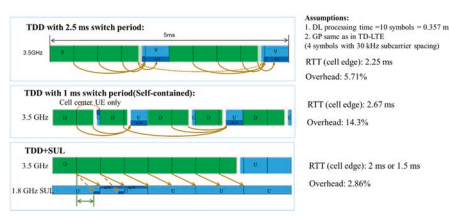 

 拟议的UL/DL解耦概念，SUL可以提供及时的UL反馈而无需频繁的DL/UL开关，因此，这可以在没有任何额外开销的情况下降低RTT。 因此，传输效率和延迟变得良好。

 此外，有了这个概念，5G- NR系统可以通过合并的5G运行- 新频带中TDD载体的NR单元格（例如，C- 带或毫米- 波带）和现有LTE光谱中的硫磺载体（低于3 GHz）。 5G- NR DL TraffC仅计划在TDD载波上，并以显性DL插槽的形式尽可能多地利用新频带的较大带宽，并具有增强的DL Spectrum EFFCITION以及基于大量MIMO和多种光束扫描的控制通道覆盖范围。

##  3.3.1.3.3无缝覆盖范围，部署投资和流动性

 对于5G而言，无缝覆盖范围非常可取- NR为了提供统一的用户体验。 适用于5G早期- NR部署公司- 现有LTE网络的站点安装将具有成本效益和方便。 同样，这是5G的难度- NR以实现CO的无缝覆盖范围- 仅使用3 GHz以上的频段与LTE部署站点。 由于较高的传播损失高于3 GHz，因此必须引入密集的细胞和新站点，这需要更高的投资。

 随着UL/DL脱钩的出现，5G- NR UL变得能够利用操作员用于LTE的较低频段中的宝贵有限频谱资源。 因此，NR UL覆盖范围可以提高到与LTE相似的水平。 这意味着可以在CO中支持无缝的NR覆盖范围- 网站NR/LTE部署。

 这样，流动性- 相关的用户体验也得到了改善。 如CO中所示- 图3.44（a）的现场部署示例，由于UL覆盖率有限，半径为5g c- 带细胞比LTE 1.8 GHz细胞小得多。

 当UE在细胞内漫游时，- 无线电访问技术（大鼠）移交将发生。 请注意，每个中间- 大鼠切换将施加超过100毫秒的中断，这远高于内部- 老鼠移交。 随着LTE/NR频谱共享概念的出现，硫磺载体受益地扩展了5G细胞的覆盖范围。 如图3.44（b）所示，借助SUL，5G细胞和LTE细胞的覆盖范围变得相似。 然后间- 仅当UE超出仅包含5G细胞的区域和仅包含LTE细胞的区域之间的边界时，大鼠切换才会遇到。 因此，间- 大鼠切换可降低。 因此，LTE/NR频谱共享概念可以提供无缝覆盖范围。

##  3.3.1.3.4各种流量类型的Unifed网络融合

 5G的开发是为了支持各种运输类型，例如EMBB，URLLC和IoT服务。 如果仅在TDD频谱的新频谱上部署5G，则不同的运输类型可能需要不同的网络部署。 对于EMBB服务，它比上行链路资源需要更多的下行链路资源，而更少- DL切换点的较高频谱效率。 虽然URLLC服务需要在时间域中连续上行链接和下行链路资源才能在到达时立即传输数据包，但这可能需要一个自我- 包含插槽结构，每个插槽中都有可用的下行链路和上行链路符号。 对于IoT服务，由于从设备收集数据的上行链路贩运要比下行链路控制消息更多，因此可能需要更多的上行链路资源。 仅使用新的TDD
 频谱无法平衡各种流量类型的各种要求。

 通过使用UL/DL解耦，一个统一的网络结合可以满足上述所有要求。 在UL/DL解耦概念中，在一个单元格中，具有宽通道带宽的新TDD频谱与一个连续的uplink（SUL）资源配对较低的频率。 对于下行链路EMBB贩运，它可以安排在TDD载体上，其频道带宽和较大部分的下行链路插槽可提供高下行链路吞吐量。 对于Cell Center UE的上行链路EMBB贩运，它可以安排在TDD载体上，以较高的通道带宽以进行更高的吞吐量。 但是，对于细胞的上行链路解决- Edge UE，由于发射功率有限和SUL上的连续上行链路运输，它可以安排在SUL上以进行更高的吞吐量。 这也与URLLC Trackc相似，在TDD载体上安排了下行链路运输，并计划在SUL上上行链路。 由于SUL上的连续上行链路资源和TDD载体上的连续下行链路资源在时域中的连续上行链路资源，将实现延迟性能。 对于物联网服务，Sul flls覆盖范围要求的差距。

 现在应该清楚的是，一个网络融合允许5G为具有各种运输类型的所有类型的设备提供服务，包括EMBB，URLLC，
 和通过UL/DL解耦部署的物联网服务。

##  3.3.1.4 ** LTE/NR频谱共享方案的摘要** 

 总而言之，对于两个立场的NR- 单独部署和非部署- 站立- 单独部署，NR Sul Carrier和LTE UL载体之间的UL共享得到了3GPP释放的完全支持- 15.这种机制提供了富有的效率和昂贵的

  

 在DL容量和UL覆盖范围之间保持良好平衡的网络部署，并带来覆盖，延迟，吞吐量等的好处。它还可以改善LTE UL的光谱利用率。

##  3.3.2 LTE/NR频谱共享：网络部署方案

 在UL中，当NR部署在LTE频段中时，NR和LTE可以在LTE频段中共享资源。 LTE/NR UL共享重点是NR SUL（补充上行链路）载体和LTE FDD的UL部分之间的共享。

 通常，UL资源可以以TDM或FDM方式共享。

-  对于TDM共享，NR和LTE都以不同的时间插槽（或符号）共享整个UL载体，而每个载体都可以在UL载体的整个带宽中安排UL数据和控制信号传输。

-  对于FDM共享，NR和LTE以不同的频率资源占据UL资源，它们彼此正交。

 从网络耦合的角度来看，可以静态地进行UL资源共享- 如图3.45（a），（b）和（c），静态或动态上
 分别。

-  静态LTE/NR UL共享通常采用FDM方式。 如图3.45（a）所示，频率F0处的NR TDD载体与频率F3处的硫载体组合，该载体在频率F2时独立于LTE UL载体。 F3处的NR Sul载体和F2处的LTE UL载体属于同一FDD频段； 也就是说，NR SUL传输和LTE UL传输共享相同的UL
 乐队。 随着静态共享，NR Sul载体和LTE UL载体具有独立的调度，其中NR SUL传输由NR TDD安排
  载体DL控制信号传导和LTE UL载体与同一FDD频段的频率F1处的LTE DL载体相关。

-  对于大多数国家 /地区，一个运营商拥有对称DL的FDD频谱
 和UL带宽。 因此，当将总UL频谱分为两个部分时，NR SUL SUL谱和LTE UL载体时，正常的静态共享将导致LTE UL Spectrum Spectrum带宽比LTE DL Spectrum spectrum带宽更窄。 图3.45（a）说明了两个网络操作的选项：
-  左FGURE的选件1在LTE UL载体的双带宽上界定了LTE DL载体。 但是，尽管3GPP LTE TS36系列指定了不等性DL和UL带宽的物理层信号传导，但尚未指定RAN4测试用例，因此尚无遗产LTE终端可以支持。 为了避免在传统LTE系统中，在实际网络部署中，选项1不可行。

 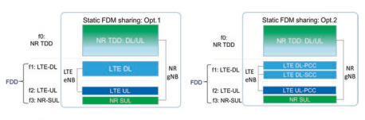 

  

  

 （b）半- FDM或TDM的静态LTE/NR UL共享

  

 右图中的选项2使用LTE DL和UL的相等带宽
 载体，虽然它引入了使用DL运行的第二个组件载体
 CA充分利用FDD DL频谱资源。 在传统LTE中
 终端，到2017年底，大约20–40％- 在不同地区的商业市场中有能力的终点站。 这个百分比只会在未来增加。

 总之，静态LTE/NR UL FDM共享的仅选项2在实际网络部署中是可行的。

 半- 可以以FDM和TDM方式进行静态LTE/NR UL共享。

 与静态共享选项不同，所有半段- 静态共享解决方案可以
 。

 支持重叠的LTE UL载体和NR硫磺载体，它们具有相同的带宽，同时还可以保持UL带宽与LTE DL载体的平等性。- 半- 静态FDM共享解决方案显示在图3.45（b）的左侧。

 考虑到LTE系统提供UE- 指定频率的浓汤- 领域- 对称PUCCH资源，网络可以通过使LTE UL控制通道Pucch的频率边界与传统LTE LTE终端假定的一定距离的频率边界来轻松执行FDM共享，该距离与LTE UL载体边界相处，该边界基于带宽信号的带宽 UE来自网络。

-  此外，网络可以在安排NR SUL时安排运营商中频率资源中间的所有LTE UL数据传输
 载体频率资源边缘部分的数据和控制信号传输。 通过这样的半月- 静态共享，LTE系统和NR系统可以独立执行自己的计划，而LTE UL和NR SUL频率资源的参与之间唯一的缓慢甚至FXED协调。

-  半- 静态TDM共享解决方案显示在图3.45（b）的右侧。

 为了允许在LTE UL和NR SUL传输之间进行干净的TDM分区，限制旧的UE以按标准化MBSFN模式传输Pucch信号传导和反馈很重要。 这是因为传统LTE终端会假设那些UL子- 与DL子相关的帧- MBSFN模式中的帧未使用，并自动跳过。 基于LTE和NR网络之间协商的MBSFN模式- 从静态上讲，LTE和NR网络可以独立执行自己的时间表。

-  半- 静态解决方案基于网络向终端的RRC信号传导。 它提供了基于LTE和NR系统的及时运输统计数据，在LTE UL和NR SUL资源之间进行了可爱的资源分裂的可能性。

-  动态LTE/NR UL共享以TFDM方式完成（图3.45C）。 如果NR和LTE紧密耦合，则可以使用动态共享（没有明确的两个系统的UL资源分配）。 NR和LTE可以将其UES安排在与Legacy LTE Pucch的保留区域（在载体频率的两个边缘部分）和周期性LTE的任何UL资源中
 SRS信号（在几个浓厚的Sub的最后一个OFDM符号中- 帧）。 避免干扰和解决方案完全留给系统设计师。

 从网络的角度来看，NR：SA有两种部署
 （站立- 一个人）和NSA（非- 站立- 单独），如教派所示。 3.3。 以下小节引入了与这两个部署相对应的UL资源共享的差异。

##  3.3.2.1 ** LTE/NR UL共享NR摊位- 单独部署** 

 在NR站- 单独部署方案，NR核心网络和空气界面是站立的- 单独部署。 NR UE不必访问LTE RAN（无线电资源网络）或EPC（进化的数据包核心），而仅访问NR RAN和NGC（下一个- 生成核心）。 在这样的立场- 单独的方案，LTE/NR UL共享是从网络角度始终完成的，即从每个NR中看到的- ue; 即使SUL部署在LTE频段中，NR UE也不必知道LTE系统是否部署在同一频段中。 LTE占用的资源（如果有）安排到其他LTE UE，这些LTE UE与NR UE透明。

 NR摊位中UL共享的一个例子- 独自与SUL部署
 带组合案例如图3.46所示。 NR UE不会在NR UL和SUL中同时传输主要以简化UE侧的实现复杂性，并允许UE的浓度在单个UL载体中传输功率，以最大程度地提高每个UL Sub的UL吞吐量和覆盖率- 框架。

##  3.3.2.2 ** LTE/NR UL共享非- 站立- 单独部署，**  从网络和UE的角度来看

 在nr non- 站立- 单独部署方案，NR UE有望具有EN- DC
 能力。2在NSA NR EN中- DC模式，NR- UE应该访问frst，然后在NR基站的良好覆盖范围内访问NR电池。 因此，MCG（主电池组）使用LTE，而SCG（辅助细胞组）使用NR。 在这种情况下，如果NR将UE与SUL带组合结合在一起，则NR Sul载体和LTE UL载体将共享相同的频带。 可以将这种共享分别分别分别为UE透视解决方案和网络透视解决方案。

  

  

 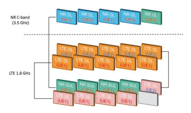 

-  从UE角度来看，LTE/NR UL共享提供了共享资源的最高有效性。 由NR电池安排的Sul载体上的传输和在LTE FDD的UL载体上进行的传输可以在重叠频带中。 如图3.47所示，LTE计划的UL传输
 NR是共享承运人中的TDM。 UE必须能够在LTE UL载体和NR硫磺携带者之间立即变速。 值得注意的是，NR UE通常不支持NR UL载体和NR Sularer的同时传输。 存在一个案例，即UL传输- NR UL载波上的框架仅包含SRS信号，并在相应的子中进行调度- 允许共享载体上的框架。

-  从网络角度来看，LTE/NR UL共享通过放松的UE实现复杂性执行资源共享，如图3.48所示。 在这种情况下，每个UE在特定时间安排在LTE UL传输或NR UL传输中； 也就是说，NR UE不支持NR UL或NR SUL中的并发传输。 当它与NR SUL传输模式一起使用时，其他资源在同一子中- 框架可以分配给可能与LTE UL传输模式一起使用的其他UE，反之亦然。 遵循该解决方案，不会浪费网络中的时间和频域资源。 请注意，LTE UE（fgure中的UE2）不需要成为一个- DC UE。 多个UE之间重叠的UL载体资源的LTE/NR共享可以以TDM方式或FDM方式完成。

##  3.3.2.3 ** TDD乐队中的LTE/NR共享** 

 上述UL共享场景都在LTE FDD频段中，并且在TDD频段中也可以选择LTE/NR UL共享。 NR的DL/UL融合必须与LTE相同，以促进LTE和NR之间以TDM方式共享。 如图3.49所示，NR和LTE可以占据不同的UL子- 从网络或UE角度来看，可以充分使用所有可用的UL资源。 还应注意的是，由于LEGACY LTE HARQ时机的限制，NR和LTE DL也可以以TDM方式多路复用。

##  3.3.3 LTE/NR频谱共享：高效共享的要求

 本节介绍了发行时高效LTE/NR UL共享的标准化机制- 15，包括开销- 避免机制，例如LTE/ NR子载体对准和PRB对准，通道栅格比对，以确保NR SUL共享载体的有效性，LTE UL和NR Sulariers之间的同步TDM资源配位以及相应的时间预先机制。

##  3.3.3.1 ** LTE/NR频谱共享的子载波对齐** 

 需要共享载体上的LTE/NR子载波对齐，以避免在共享频谱中LTE UL传输和NR SUL传输之间的每个边界处的护罩带的额外开销。

 自从4G标准化时期以来，在OFDM命理设计中众所周知，子载波未对准将导致严重的性能降解，因为图3.49 TDD频段中LTE和NR之间的UL共享的例证

  

 间- 子载波干扰。 抑制Inter造成的负面影响- 子载波干扰，任何子载波之间的数百个KHz守卫乐队- 应保留未对准的传输。 已经评估了至少需要180 kHz（等于一个LTE PRB）作为低调制顺序的防护带，即qpsk。 但是，对于包括16QAM和64QAM在内的较高调制订单，需要支出360 kHz（即2 lte PRB）才能满足Outof- 频带排放要求[35]。 后卫乐队将导致LTE/NR共享承运人的效率非常低。 因此，LTE和NR之间的子载波对齐是LTE/NR UL共享方案的基本要求。

 为了达到LTE UL和NR Sul载体之间的子载波一致性，有两个方面需要考虑：- 共享载体子载波间距的命理学对齐：

  

 如上一节所述，与TDM相比，以FDM方式共享的UL共享具有明显的好处。 对于NR与LTE大于15 kHz大于15 kHz的subcarrier间距- LTE和NR之间的子载波干扰。 而对于NR中使用15 kHz子载波间距的情况- 如果LTE和NR之间存在子载波对齐，则可以避免子载波干扰，然后不再需要防护带。

-  ** 共享承运人的子载波偏移和直流位置的一致性：** 
 在LTE中，将不同的子载波映射规则应用于下行链路和上行链路，其中一半- 与下行链路相比，在上行链路上采用了音调移位，如图3.50所示。 更具体地说，对于LTE下行链路，中间子载波正在映射载体频率，并且由于用于向上的直流电流引起的严重失真，该子载波被无效- 转换。 但是，对于LTE上行链路，优先维护中间子载波，以确保单个载体属性以来- s- OFDM波形用于获得低papr。 因此，对于LTE上行链路，一半- 音调移位可以避免信号失真对中间载波的影响，并且可以在相邻的多个子载波上分布失真。

 在NR讨论的早期阶段，对于下行链路和上行链路，首选一个共同的子载波映射规则，其中采用了与LTE下行链路中相同的子载波映射规则，但没有删除中间子载波。 这样常见的子载波映射规则是有益的，可以促进交叉- 通过DL和UL（和/或Backhaul Link和D2D链接）共享同一载体的DL和UL（和/或Backhaul Link和D2D链接）的链接干扰缓解措施。 特别是，基带中的高级接收器是可行的，可以取消十字架- 将干扰与此设计联系起来。 当涉及LTE和NR之间的UL共享方案时，即使LTE系统使用15 kHz子载波间距，NR UL子载波也会与LTE UL子载波未对准，从而导致Inter- 子载波干扰。 这样的间- 当频率分裂相互多样化时，子载波干扰将高度降低LTE和NR的性能。

 因此，NR在两种类型的子载波映射规则之间引入了可爱的融合，网络将指示UE是否将7.5 kHz的偏移用于UL传输，这与LTE不同。 目的是，仅对LTE和NR上行链路之间可以共享的频带支持7.5 kHz的UL子载波偏移。 但是，对于包括所有TDD频段在内的其他频带，下行链路和上行链路都采用了不带7.5 kHz偏移的常见子载波映射规则。

 从理论上讲，UE侧有多个实施解决方案来执行一半- 音调子载波间距。 最常用的是基带和RF移位，如图3.51所示。

-  在基带轮班中，一半- 在基带信号生成期间，实现了LTE上行链路的音调变化。 该解决方案可以直接实现，以实现NR，以实现7.5 kHz的偏移，其复杂性非常低。

-  对于RF偏移，7.5 kHz的偏移是通过UP在射频（RF）下完成的- 通过增加7.5 kHz偏移，将基带信号转换为载体频率。
 基带溶液比后者更合适，特别是对于LTE/NR
  双重的- 连接性（en- DC）UE。 这是因为en- DC UE已经有一个浮球循环（PLL），可锁定LTE UL的载体频率。 当在基带上施加7.5 kHz移位时，EN- DC UE可以共享同一PLL的LTE UL
  不调整锁定频率。 但是，对于RF解决方案，UE必须维持两个不同的载波频率，并在切换LTE和NR UL之间的传输时调整锁定频率。 或者可能需要为共享上行链路运营商实施两个PLL。 尽管基带解决方案与RF解决方案相比已显示出优势，但考虑到UE设计器的实现问题，这两个选项均已在指定中捕获。

  

##  3.3.3.2 ** LTE/NR频谱共享的PRB对齐** 

 LTE/NR PRB对准对于达到非- 在共享承运人中，螺距安排的LTE UL和NR SUL变速器之间的资源参与。

 然而，纯粹的LTE和NR之间的子载波只能避免这两只大鼠之间的干扰。 仍然需要调度约束，因为频率的粒度- NR和LTE的域资源分配均处于物理资源块（PRB）级别，每个级别由12个子载波组成。 如果NR和LTE的PRB网格未对齐，则将导致所有静态，半载载体中的某些未使用的PRB- 静态和动态共享机制。 此外，由于LTE UL和NR SUL传输之间的界限更多，因此需要更多的后卫带，如图3.52所示。 如此大量的后卫乐队将高度降低频谱效率。 因此，在UL共享中支持LTE和NR之间的PRB对齐。

 LTE/NR PRB对齐有明显的好处：
-  LTE/NR UL共享传输可能非常有效，因为不需要LTE和NR之间的额外开销。

-  LTE和NR系统中的UL调度和网络管理非常容易，通过LTE UL载体和NR Sul载体之间的完美PRB对齐。 它消除了在调度单元和保留频域资源上协调的必要性。 要达到LTE/NR PRB对准，带宽部分的NR调度单元和多个- 命理机制在3GPP版本中指定- 15：- ** 带宽部分的NR PRB调度单元：** 
 在NR中，基本调度单元称为带宽部分[7]。 带宽部分是连续的公共资源块的子集。 带宽零件可用于使UE的带宽小于系统带宽。 在[5]第12条中描述了带宽部分的浓度。 一个UE
  DL和UL中最多可与多达四个不同的带宽零件混合在一起，并在给定时间有一个下行链路带宽零件。 预计UE不会接收PDSCH，PDCCH或CSI- RS（RRM除外）在活动带宽部分外。 如果UE与补充上行链路融合在一起，则UE
  此外，还可以在补充上行链路中与多达四个带宽零件以及在给定时间处于活动状态的单个补充上行链路带宽部分。 UE不会在活动带宽部分外传输Pusch或Pucch。 对于活动单元格，UE不会在活动带宽部分外传输SRS。

-  多个命理 ** 对于带有TDD载体和硫磺的NR电池** 
 如前所述，希望将相同的子载波间距用于LTE UL载体和共享的NR硫磺载体。 因此，发行中支持多个OFDM命理。- 15。

 对于数据通道，15 kHz，30 kHz和60 kHz的子载波间距适用于低于6 GHz的频率范围，而子载波间距为60 kHz和120 kHz的频率适用于6 GHz以上的频率范围（表3.22）。 从该表中，每个操作员都可以在部署所选的SUL带组合中选择其首选命理符和NR Sul载体。

 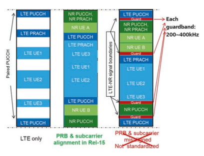 

| 表3.22| 每个NR频段的通道带宽[27]|||||||||||||
|----------------------------------|--------------------------------------------|-------|-----|-----|-----|-----|-----|-----|-----|-------------|-----|-----|-----|
| NR频段/SCS/UE频道带宽||||||||||||||
| nr| SCS 5| 101,2| 152| 202| 252| 30| 40| 50| 60| 80| 90| 100||
| 乐队| 千赫| MHz| MHz| MHz| MHz| MHz| MHz| MHz| MHz| MHz| MHz| MHz| MHz|
| N1| 15| 是的| 是的| 是的| 是的|||||||||
| 30| 是的| 是的| 是的|||||||||||
| 60| 是的| 是的| 是的|||||||||||
| N2| 15| 是的| 是的| 是的| 是的|||||||||
| 30| 是的| 是的| 是的|||||||||||
| 60| 是的| 是的| 是的|||||||||||
| N3| 15| 是的| 是的| 是的| 是的| 是的| 是的|||||||
| 30| 是的| 是的| 是的| 是的| 是的|||||||||
| 60| 是的| 是的| 是的| 是的| 是的|||||||||
| N5| 15| 是的| 是的| 是的| 是的|||||||||
| 30| 是的| 是的| 是的|||||||||||
| 60||||||||||||||
| N7| 15| 是的| 是的| 是的| 是的|||||||||
| 30| 是的| 是的| 是的|||||||||||
| 60| 是的| 是的| 是的|||||||||||
| N8| 15| 是的| 是的| 是的| 是的|||||||||
| 30| 是的| 是的| 是的|||||||||||
| 60||||||||||||||
| N12| 15| 是的| 是的| 是的||||||||||
| 30| 是的| 是的||||||||||||
| 60||||||||||||||
| N20| 15| 是的| 是的| 是的| 是的|||||||||
| 30| 是的| 是的| 是的|||||||||||
| 60||||||||||||||
| N25| 15| 是的| 是的| 是的| 是的|||||||||
| 30| 是的| 是的| 是的|||||||||||
| 60| 是的| 是的| 是的|||||||||||
| N28| 15| 是的| 是的| 是的| 是的|||||||||
| 30| 是的| 是的| 是的|||||||||||
| 60||||||||||||||
| N34| 15| 是的| 是的| 是的||||||||||
| 30| 是的| 是的||||||||||||
| 60| 是的| 是的||||||||||||
| N38| 15| 是的| 是的| 是的| 是的|||||||||
| 30| 是的| 是的| 是的|||||||||||
| 60| 是的| 是的| 是的|||||||||||
| N39| 15| 是的| 是的| 是的| 是的| 是的| 是的| 是的||||||
| 30| 是的| 是的| 是的| 是的| 是的| 是的||||||||
| 60| 是的| 是的| 是的| 是的| 是的| 是的||||||||
| N40| 15| 是的| 是的| 是的| 是的| 是的| 是的| 是的| 是的|||||
| 30| 是的| 是的| 是的| 是的| 是的| 是的| 是的| 是的| 是的|||||
| 60| 是的| 是的| 是的| 是的| 是的| 是的| 是的| 是的| 是的| （继续）||||

| 表3.22| （继续）|||||||||||||
|----------------------------------|---------------|-------|------|------|------|------|-----|-----|-----|-----|-----|-----|-----|
| NR频段/SCS/UE频道带宽||||||||||||||
| nr| SCS 5| 101,2| 152| 202| 252| 30| 40| 50| 60| 80| 90| 100||
| 乐队| 千赫| MHz| MHz| MHz| MHz| MHz| MHz| MHz| MHz| MHz| MHz| MHz| MHz|
| N41| 15| 是的| 是的| 是的| 是的| 是的||||||||
| 30| 是的| 是的| 是的| 是的| 是的| 是的| 是的| 是的| 是的|||||
| 60| 是的| 是的| 是的| 是的| 是的| 是的| 是的| 是的| 是的|||||
| N51| 15| 是的||||||||||||
| 30 60||||||||||||||
| N66| 15| 是的| 是的| 是的| 是的| 是的||||||||
| 30| 是的| 是的| 是的| 是的||||||||||
| 60| 是的| 是的| 是的| 是的||||||||||
| N70| 15| 是的| 是的| 是的| 是的3| 是的3||||||||
| 30| 是的| 是的| 是的3| 是的3||||||||||
| 60| 是的| 是的| 是的3| 是的3||||||||||
| N71| 15| 是的| 是的| 是的| 是的|||||||||
| 30| 是的| 是的| 是的|||||||||||
| 60||||||||||||||
| N75| 15| 是的| 是的| 是的| 是的|||||||||
| 30| 是的| 是的| 是的|||||||||||
| 60| 是的| 是的| 是的|||||||||||
| N76| 15| 是的||||||||||||
| 30 60||||||||||||||
| N77| 15| 是的| 是的| 是的| 是的| 是的||||||||
| 30| 是的| 是的| 是的| 是的| 是的| 是的| 是的| 是的| 是的|||||
| 60| 是的| 是的| 是的| 是的| 是的| 是的| 是的| 是的| 是的|||||
| N78| 15| 是的| 是的| 是的| 是的| 是的||||||||
| 30| 是的| 是的| 是的| 是的| 是的| 是的| 是的| 是的| 是的|||||
| 60| 是的| 是的| 是的| 是的| 是的| 是的| 是的| 是的| 是的|||||
| N79| 15| 是的| 是的|||||||||||
| 30| 是的| 是的| 是的| 是的| 是的|||||||||
| 60| 是的| 是的| 是的| 是的| 是的|||||||||
| N80| 15| 是的| 是的| 是的| 是的| 是的| 是的|||||||
| 30| 是的| 是的| 是的| 是的| 是的|||||||||
| 60| 是的| 是的| 是的| 是的| 是的|||||||||
| N81| 15| 是的| 是的| 是的| 是的|||||||||
| 30| 是的| 是的| 是的|||||||||||
| 60||||||||||||||
| N82| 15| 是的| 是的| 是的| 是的|||||||||
| 30| 是的| 是的| 是的|||||||||||
| 60||||||||||||||
| N83| 15| 是的| 是的| 是的| 是的|||||||||
| 30| 是的| 是的| 是的|||||||||||
| 60| （继续）|||||||||||||

| NR频段/SCS/UE通道带宽SCS 5 101,2 152 202 252| 30| 40| 50| 60| 80| 90| 100||||||
|---------------------------------------------------------------------|------|------|------|------|------|------|-------|-----|-----|-----|-----|-----|
| 千赫| MHz| MHz| MHz| MHz| MHz| MHz| MHz| MHz| MHz| MHz| MHz| MHz|
| N84| 15| 是的| 是的| 是的| 是的||||||||
| 30| 是的| 是的| 是的||||||||||
| 60| 是的| 是的| 是的||||||||||
| N86| 15| 是的| 是的| 是的| 是的| 是的|||||||
| 30| 是的| 是的| 是的| 是的|||||||||
| 60| 是的| 是的| 是的| 是的|||||||||
| 注1：对于30 kHz SCS可能无法实现90％的频谱利用率|||||||||||||

##  3.3.3.3 ** NR SUL带的通道栅格** 

 PRB对齐还需要对准载波频率（也指NR中的RF参考频率），该频率应该放在通道栅格上。 在LTE中，通道栅格在n*100 kHz的频率上，其中n是整数。 对于NR，尤其是对于可以与LTE共存的操作频带，还针对N*100 kHz的频率进行了反对的通道栅格。 因此，操作员有可能在相同的载体频率上部署LTE和NR，以确保LTE和NR之间的PRB对齐。 如图3.53所示，当NR PRB与LTE PRB不符时，LTE PRB和NR PRB之间的频域间隙不可避免，这也导致NR可用的PRB较少，而与Guard相比，PRB对齐的情况也更少。 给定带宽的带要求。

 通道栅格Defnes一组RF参考频率，用于识别载体的位置。 换句话说，只有通道栅格规定的频率对于部署载体有效，其中相应的载体频率必须在通道栅格上。 在LTE中，通道栅格位于n*100 kHz的频率上，其中n是一个正整数。 但是，在讨论NR的频道栅格时，公司认为LTE中针对的频道栅格相当稀少，这可能会导致操作员部署网络的严格限制，尤其是对于少量频谱的运营商而言。 因此，有人提议将通道栅格的最高设计应用于所有频率范围的n*15 kHz的频率，因此运算符可以更加自我地部署网络。

 但是，从LTE和NR之间的UL共享的角度来看，NR的这种通道栅格设计很少实现LTE和NR之间的子载波对齐，尽管对NR UL进行了7.5 kHz的偏移。 更具体地说，仅对于LTE Uplink的载体频率为300 kHz的载体频率才能获得子载波比对。 那就是只说一个- LTE频道栅格中的第三个频率可用于部署UL共享，这是对UL共享使用的巨大限制。 此外，考虑到已经以某些频率部署了LTE网络，当NR与LTE共享上行链路频率时，它不会影响当前LTE网络。 否则，操作员可能必须重新部署电流LTE网络，其载波频率不在300 kHz的倍数上。

 显然，实现LTE和NR之间的子载波对齐方式的直接方法是，NR网络与LTE网络相同的频率部署； 也就是说，NR SUL带的通道栅格也在N*100 kHz的频率上。 因此，操作员有可能在与传统LTE网络相同的载体频率上部署NR，以确保LTE和NR之间的子载波对齐。 有必要强调，仅对于有机会在上行链路中有机会共享LTE和NR之间的频段的要求。 至于其他频段，由于它更可爱，因此优选15 kHz通道栅格。 由于上述原因，NR在NR中支持100和15 kHz频道的光栅，但针对不同的操作带。 特别是，对于低于3 GHz的大多数操作带，支持100 kHz通道的栅格。

##  3.3.3.4 ** LTE/NR UL共享的同步和时间安排** 

 同步对于NR SUL带组合和LTE/NR频谱共享至关重要。 对于LTE/NR TDM和FDM Semi- 在LTE和NR系统中，BS接收器的BS接收器需要静态和动态共享，符号同步，以避免- 子载波干扰，因此避免了分配给LTE UL传输的资源和NR SUL传输之间的潜在防护乐队，它们与网络观点共享或UE观点共享无关。 另外，子- 框架/插槽- 级别同步也需要在PE上共享协调- 子- LTE电池中的UL载体与NR电池中共享的硫磺载体之间的框架资源分配。 因此，释放- 15指定了NR SUL带组合的相应时间提前机理，以及LTE HARQ时正式浓度的增强，以确保与共享载体相关的EFFCIENT LTE DL传输。

 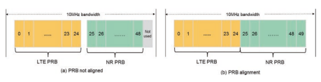 

 对于NR TDD网络，应维持不同GNB之间的同步，以避免CO- 通道干扰。 细胞- TDD的级别同步精度被认为是框架启动时间的最大绝对偏差，以相同的频率与具有重叠覆盖率区域的相同频率之间的时间进行定时。 细胞- 在BS天线连接器上测得的水平同步精度需要优于3μs，这是3GPP中规定的最小要求
 指定。

 至于LTE和NR UL共享的方案，在网络侧需要同步的LTE UL电池和NR UL电池，这些细胞和NR UL电池至少具有SUL传输的至少一个NR UE，以保持较高的光谱效率并降低GNB侧的实现复杂性 。 同步要求有两个级别：
-  ** 象征- 级别同步**  两个FDM都需要- 基于和基于TDMB的LTE/NR频谱共享：服用FDM- 基于资源共享作为一个说明性的例子，GNB只需要执行一个接收。 例如，当LTE UL和NR UL是时间和频率同步时，需要进行一个FFT操作以获得基带信号。 否则，GNB将需要对LTE和NR进行单独的信号接收。 而对于TDM- 相邻LTE和NR Sub之间的符号，如果LTE UL和NR UL不同步，则基于基于的资源共享- 框架将彼此重叠，从而导致两只大鼠之间的隔膜间干扰。 可以保留刺穿相应符号的后卫期间以抑制间- 符号干扰，导致时间- 域资源降低。 因此，LTE和NR必须在共享UL频率中以符号级别相互同步。

-  ** 子- 框架/插槽- 级别同步**  被要求用于TD- 基于LTE/NR频谱共享，这也对FDM有益- 基于LTE/NR频谱共享，因为它简化了调度和接收器的实现。 如上一节所述，LTE/NR TDM共享时间表不同- 向不同用户的框架/插槽，还可以使NR UE从插槽到插槽之间切换LTE UL传输模式和NR SUL传输模式。 如果LTE UL
 细胞和NR SUL细胞在子中异步- 框架/插槽边界，而两者都是特定UE的服务单元格，但很难安排该子- 在任一系统中，框架/插槽在任一系统中以用于UE的UL传输。 对sub的调度的这种限制- 边界处的框架/插槽将导致明显的开销损失。 要解决此问题，请发布- 15 Defnes的明确指导- 框架/插槽- 级别同步要求以对齐子的边界- LTE UL载体和NR SUL的框架
  LTE电池和NR电池的载体，通常在共同的基站共享相同的UL频谱时提供。

 由于LTE UL和NR SUL之间的时间同步，并且在网络侧都可以实现两个ULS之间的NR，因此也需要在UE侧的LTE UL和NR的两个ULS同步。 特别是对于NR的两个UL，可以通过使用单个定时调整命令并为TA偏移量相同的值来获得时间同步，如[5，36]中所述。 至于LTE UL和NR UL在共享频率上的时间同步，可以通过网络实现来实现。

 如图3.54所示，单个NR UE的NR TDD UL载体和NR Sularier的同一时间用于同一时间，其在UE侧的发送时间为Taue，NRTDD时间是NRTDD的时间，距离NR基础站点的插槽边界提前 。 同时，LTE/NR共享要求LTE UL Sub的边界- TDM共享的帧和NR UL插槽已同步。 为了实现这一目标，UE在en- 直流模式将在栅格时传输LTE FDD UL信号，这是其NR SUL信号传输的毫秒倍数的倍数。 LTE系统具有单独的时间提前命令taue，LTE- FDD适用于在en上工作的同一UE- DC模式。 通常用于CO- 位于LTE和NR EN的部署- DC，
 Taue，Nr- TDD和Taue，LTE- FDD很可能彼此相似。 因此LTE FDD
 DL细胞和NR TDD DL细胞共同工作以服务同一组UES- CO的框架/插槽级别- 站点LTE/NR部署基站。

 有必要注意，不需要不同单元格或LTE FDD系统中的位点的时间同步，因此不同的LTE位点在共享UL频率上可能具有不同的时间。 由于需要将LTE UL和NR UL在共享ul频率上同步，因此任何异步都会导致NR ULS之间在不同位点的共享频率上，即时间药物不匹配（即，非计时型）（即，非）uls（即，非计时）- 信号和间之间的同步- 细胞干扰。 发布- 15专注于LTE UL细胞和共享NR SUL单元的情况，其中单个时间前进命令足以容纳

  

 nr ue。 发布- 16将增强LTE/NR共享以支持非- 分别为NR TDD UL Carrier和NR Sul Carrier提供多个时间预先命令来解决方案。 请注意，对于NR基站接收器的两个UL信号不同步的情况，GNB也需要对TDD频率的UL进行单独接收，并在共享频率上进行UL。

 但是，同步案例只需要一次接收。 现在很明显，在TDD频率上的UL和NR共享频率上的UL之间的同步是有益的，可以简化GNB实现。

##  3.3.3.4.3 NSA LTE/NR UL共享TDM HARQ时机

 特别是从UE的角度部署NSA的部署，UE可以访问在E中起作用的LTE和NR网络- Utra和nr dual- 连接（ENDC）模式。 专注于共享UL频率上的资源利用，这两个FDM都- 基于和TDM- 可以使用基于基于的方案。 对于FDM- UE基于资源共享，可以假设LTE UL和NR UL都可以完全占据共享UL频率内的所有UL资源，并且网络可以避免通过调度来重叠资源。 至于TDM- UE将使用不同的无线电访问技术（LTE或NR）在不同的UL UL中传输UE
 子- 帧。 鉴于LTE中的HARQ时间不如NR那样可爱，Semi- 静态TDM- 基于资源共享解决方案比动态方法好得多。 而且，纯粹采用了- LTE和NR之间的框架分离将进一步降低UE侧的DL数据速率，因为DL Sub的夫妻- 由于关联的UL子量，帧不能用于DL数据传输- 用于HARQ传输的帧已被分配用于NR传输。 为了避免这种性能降解，案例1 HARQ定时已引入EN- DC UE促进所有DL子的使用- 如图3.55所示，在LTE侧的框架以用于DL数据传输。

 总而言之，为了在LTE/NR共享方案中实现较高的频谱效率，共享LTE UL载体和NR Sularer所需的以下机制是：- 在频域上，子载波和PRB都应在

  

 LTE和NR，使所有频率- 可以充分利用载体内的域资源，而无需其他干扰。 此外，NR Sul Carrier的频道栅格应该能够与目前在不同国家 /地区部署的商业网络中的LTE UL载体相匹配。

-  在时间域中，需要支持LTE UL载体和NR SUL之间的符号级别和子帧/插槽级别的网络同步，需要支持无线电资源的TDM共享。 从网络的角度和UE的角度来看，LTE/NR共享需要上述要求。

##  3.3.4 NR SUL带组合：上行链路载体选择和切换3.3.4.1 ** 单身的- 细胞概念** 

 5G- NR引入了一种新的SUL带类型，同时还相应地引入了一个新的单元结构。 单元格是移动网络的基本元素。 UL/DL解耦的基本逻辑元素是一个与两个上行链路和一个下行链路相处的单元格。 如图3.56所示，SUL带组合的典型部署是，每个单元都有一个与两个共处无线电UL载体相关的无线电DL载体，一个在正常的TDD或FDD频段中，另一个在SUL波段中。

 单人- 细胞结构可容纳动态调度和载体在SUL和正常UL之间切换，而无需任何中断时间。 它促进了SUL
 与载体聚集非常兼容，并最大程度地重用单细胞的L2/L3设计。 UE与两个Uls融合了一个同一单元的一个DL，并且网络对这两个ULS的上行链路传输进行控制，以避免及时重叠Pusch/Pucch Transmissions，以获得最佳上行链路链接功率

 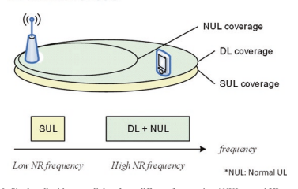 

 专注。 通过调度来避免在Pusch上重叠的传输，而通过浓汤避免了对Pucch上的重叠传播； 也就是说，只有在细胞的两个UL中，Pucch才能融合在一起[4，37]。

##  3.3.4.2 ** UL载体选择和开关** 

 如教派中所讨论的。 3.3.1，UL/DL通过引入额外的较低上行链路频率来减轻覆盖范围的瓶颈，从而扩大了细胞覆盖率。

 考虑到较低频率的上行链路带宽通常小于较高频率的上行链路带宽，例如，在1.8 GHz时为20 MHz，而在3.5 GHz时为100 MHz； 可以通过更高的上行链路频率来提供更好的上行链路吞吐量- 高尺度传播损失- 频率上行链路。 因此，ul/dl解耦应启用可爱的网络操作，UES可以在较低频率f1上访问上行链路上的网络，而当它们在较高频率f2上时，它们在较高的频率f2上，用于上行链路，以便它们在单元格中心，如图所示， 图3.57。 UES将在闲置模式和连接模式下基于下行链路测量来选择单元格的最佳上行链路。

 另外，即使对于单元- 在较低频率F1上具有数据上行链路传输的边缘UE，有必要偶尔在较高频率F2上传输发声参考信号（SRS），以使DL大量MIMO具有相互的通道信息。 这也需要上行链路选择和切换。 本节讨论了UE上行链路选择和上行链路切换的机制。

  

 为了确保覆盖范围的初始访问，UE可能会与Prach混合
 SUL和NUL的资源（正常上行链路）。 在连接模式下，基站可以指示DCI所选上行链路对UE进行Prach传输。

 但是，在空闲模式下，必须由UE选择PRACH的上行链路，因为UE尚未附加到网络上。 有关两个上行链路之间的Prach选择程序的更多详细信息如下。

## - ** UE方面的Prach UL载体选择：** 

 如图3.58 [38]所示，当随机访问程序在带有硫载体的服务单元上启动时，UE将比较同一NR电池的DL载体的RSRP测量值与电池广播阈值RSRPTHRPTHRESHOLDSSB- sul。 如果RSRP测量值低于阈值，则表示UE位于NR单元的细胞边缘，UE应该在其中选择硫磺载体以进行随机访问。 否则，它假设UE位于NR单元的细胞中心，因此将通过正常的UL载体触发随机访问程序。

## - ** 网络方面的Prach UL载体选择：** 

 在[6]中，3GPP版本- 15还在RACH过程中指定了PDCCH命令。 如果DCI格式1_0的CRC被C扰乱- rnti和
 "Frequency domain resource assignment"  费尔德是所有的，DCI格式1_0是由PDCCH订单启动的随机访问过程。

 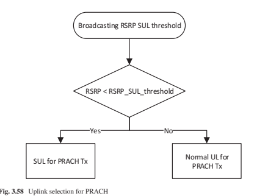 

  

 。

 当随机访问序言索引（根据RA的6位- [38]的第5.1.2条第5.1.2中的preambleIndex并非全部为零，如果在单元格中配置了UE，则以下指标有效：
 UL/SUL指示器（1位）指示细胞中哪个UL载体是为了传输Prach。

 SS/PBCH索引（6位）指示SS/PBCH应用于确定Prach传播的RACH场合。

 prach面膜指数（4位）表示与S/PBCH相关的RACH场合 "SS/PBCH index"  根据[38]，对于Prach传播。

##  3.3.4.2.2连接模式UL选择：PUSCH/PUCCH调度

 图3.59显示，UE可以由SUL提供- 具有两个上行链路配置的功能单元。

 如果在单元格中配置了正常的上行链路和SUL，则在DCI [6]中通过UL/SUL指示确定其传输的上行链路[6]，任何一个后备DCI 0- 0或非- 后备DCI 0- 1.后备DCI的设计与两个SUL都兼容- 功能强大的UES和SUL- 无能力的UES使Sul- 功能强大的细胞可以使用SUL- 可能从其他国家或其他运营商网络漫游的无能力UE。

 迁移率功能，包括测量，细胞选择，重新选择和SUL的移交- 有能力的细胞与正常细胞的细胞相同。 主要区别仅仅是在完成单元选择过程完成后进行上行链路选择。

  

 图3.60 UL/SUL指示与两个上行链路融合的细胞

## - ** UL数据传输：Pusch调度机制** 

 对于UL数据传输，动态PUSCH选择基于DCI 0_0和DCI 0_1，而SUL和非SUL之间的切换时间- SUL 0或140 US，如表5.2C所示- [27]和表5.2b.4.2的1- [31]中的1。 上行链路传输面临着挑战的许多方面，例如上行链路电源控制，时机提前，HARQ反馈和资源多路复用，如下所述。

-  在上行链路中，GNB可以通过C向UES动态分配资源- rnti
 在PDCCH上。 UE总是监视PDCCH（S），以便在启用下行链路接收时获得可能的上行链路传输的可能赠款（在混合混合时由DRX控制）。 当CA浓密时，相同的C- RNTI适用于所有服务细胞。

-  ** 动态UL/SUL选择：**  DCI格式0_0用于基于UL/SUL指示器的一个单元格中PUSCH的动态调度（表3.23），
 在哪里 "0"  是指正常UL载体和 "1"  是指选择硫磺的选择。

-  ** 半- 静态UL/SUL选择：**  如果是 "UL/SUL indicator"  不存在，即填充之前的DCI格式1_0的位数不大于填充前DCI格式0_0的位数，高- RRC层
 在高高的情况下，对PUSCH传播的UL/SUL选择的浓缩进行了- 层参数 *pucch- Confg。*
  此外，借助浓厚的赠款，GNB可以为UES的初始HARQ传输分配上行链路资源。 有两种类型的浓厚的上行链路赠款：
-  使用类型1，RRC直接提供了浓厚的上行链路赠款（包括周期性）。

-  使用2型，RRC Defnes是Constred Uplink Grant的周期性，而PDCCH致电CS- RNTI可以发出信号并激活浓厚的上行链路赠款或停用它。 也就是说，PDCCH致电给CS- RNTI指出，可以根据RRC的定期性隐式重复使用上行赠款，直到停用为止。

 当浓厚的上行链路赠款处于活动状态时，如果UE无法fnd- rnti/
 CS- 可以在PDCCH上进行的RNTI，根据浓厚的上行链路赠款进行上行链路传输。 否则，如果ue fnds的c- rnti/
 CS- PDCCH（S）上的RNTI，PDCCH分配覆盖了浓厚的上行链路赠款。 除重复以外的重新启动次数是通过PDCCH明确分配的。

 表3.23 UL/SUL指示器

| UL/SUL指示器的值| 上行链路|
|-----------------------------|------------------------------|
| 0| 非- 补充上行链路|
| 1| 补充上行链路|

## - ** UL控制信息传输机制**  [9，39]

 EN的单个上行链路操作- DC由NR释放支持- 15 UE能够进行多个上行链路，但一次只能进行一次上行链路传输。 避免自我调制很有用- 干扰[4，31]，并在UE无法动态功率共享时获得LTE上行链路或NR上行链路的最大传输功率。 但是，LTE Pucch子的数量减少- 由于缺乏同步HARQ下行链路调度的HARQ反馈场合，因此帧导致较小的下行链接吞吐量。 因此，引入了LTE HARQ案例1。

-  ** UCI多路复用** 
-  在发行中- 15，UE必须支持UCI多路复用到Pusch [5]。

-  如果一个UE在Pucch变速器中多重UCI与Pusch变速器重叠，并且Pusch和Pucch Transmissions满足了UCI多路复用的第9.2.5款条件，则UE多路复用UE，UE多路复用Pusch传输中的UCI 。

-  如果ue在pusch中多路复用Aperiodic CSI，并且UE将在与Pusch重叠的Pucch中多路复用UCI，则UE将在Pusch中多路复用UCI。

-  如果UE在相应的单元上传输了一个插槽中的多个puschs，其中包括frst puschs，这些puschs响应于DCI格式的UE检测（S）0_0或DCI格式（S）0_1和第二个PUSCHS和第二个PUSCHS，以及相应的高层参数 * ConfguretGrantConfg*，UE将在一个多个Puschs中的一个中多路复用UCI，并且多个Puschs为UCI多路复用第9.2.5款中的条件，UE UE从FRST PUSCHS中多发性UCI在PUSCH中多路复用。

-  如果ue在响应dCI格式的UE检测（s）0_0或DCI格式的UE检测到相应的单元格上的UE检测时，在各个使用单元格中传输了多个puschs，并且UE将在多个puschs中的UE多路复用UCI，并且UE ue do 在多个pusch中，UE并非多重多重Aperiodic CSI，UE在服务单元的pusch中多路复用UCI，最小的 * ServcellIndex *受subs subs subs of 9.2.5中的条件的情况下，UCI多路复用。 如果UE在使用最小的 * servcellindex *的服务单元格上的插槽中传输了多个pusch，则可以在UCI多路复用下以9.2.5中的9.2.5中的条件进行条件，则UE将UE多路复用pusch中的uci，ue ue the ue throt the ue thermits frst frst frst frst frst frst frst frst 。

##  3.3.4.3 ** SRS切换** 

 已经观察到，TDD Uplink上的SRS在很大程度上可以通过启用准确的相互通道信息来增强其相应的下行链接大量MIMO性能。 对于现有的UE类别，典型的CA- 功能强大的UES仅支持一个或两个上行链路载体。 增加支持的上行链路运营商的数量增加意味着UE成本更高，尺寸更大和更多的功耗。 因此，经济实用的解决方案是SRS切换，其中相同的UE上行链路硬件由不同的多个上行链路运营商共享。

## - ** SRS在SUL和正常上行链路之间切换：** 

 由于不同的上行链路传输之间的硬件共享，因此切换时间可能不是零，这是根据情况确定的。 对于与SUL浓厚的单一食品细胞，UE能够为零与上行链路载体切换时间用于SRS在SUL和NUL之间切换的时间，如表5.2C所示- [27]中的1个。 如果与SUL的食用细胞与EN混合- DC以及SUL和LTE上行链路载流子频率均相同，UE也能够在SUL和NUL之间的切换时间为零。 如果是en- SUL和LTE上行链路之间具有不同载波频率的DC，使用140对切换时间以允许RF重新调整，如表5.2b.4.2- [31]中的1。 对于那些切换时间为零的情况，预计不会损失绩效。 但是，对于非零切换时间的情况，基站的调度程序必须考虑到它，并且可能不可避免地会考虑一些上行链路吞吐量损失。 为了触发SRS在SUL和NUL之间的切换，DCI下行链路Grant和DCI上行链路的SRS请求费尔德中包含UL/SUL指示。

##  格兰特[6]。- ** SRS在LTE上行链路和SUL之间切换**  切换时间〜0和<20μs：[31]的S6.3B.1.1。 SRS载体切换的载体聚合

 在移动网络中，有很多下行链路较重的运输量，这会导致总链路组件载体（CC）的数量比（聚合）上行链路CC的数量。 UE通常具有比UL中汇总数量更大的DL载体的能力。 结果，某些带有UE的DL传输的TDD载体将不具有包括SRS在内的UL传输，并且这些载体不能用于通道互惠。

 允许快速载体切换到TDD UL载体之间，成为允许在这些TDD载体上传输SRS的解决方案。

 可以将UE与载体C1上的SRS资源混合在一起，其插槽格式由DL和UL符号组成，并且不适合Pusch/Pucch传输。 对于载体C1，UE与较高的层参数 *SRSSWitchFromServCellIndex *和 *SRS- SwitchFromCarrier*，从载体C2切换，该载波C2融合了Pusch/Pucch传输。 在载体C1上的SRS传输期间（包括由上行链路或下行链路rf重新调整时间[36]的任何中断[36]。- retuningtimeul *和 * rf- retuningtimedl*），UE暂时暂停载体C2上的上行链路传输[12]。

##  3.3.4.4 ** 功率控制** 

 理想情况下，应该没有- 细胞或间- 用户干扰蜂窝移动网络。 但是，在实际网络中。 例如，一个UE在一个细胞中露营的上行链路信号干扰了相邻细胞中其他UES的上行链路接收。 上行链路信号的较高传输功率通常意味着更好的接收质量，但也可能使接收器饱和，并导致较高的间- 细胞干扰。 为了应对这一挑战，电源控制机制通过测量接收SINR并发出UE来适应动力传输对UE环境- 适当的传输功率。

## - ** PC用于EN- DC** 

 如果使用E使用e，则使用E- UTRA无线电访问和SCG
 使用NR无线电访问，UE与最大功率PLTE混合在MCG上的最大功率PLTE通过更高层参数 *P- Maxeutra*和最大功率PNR用于SCG在SCG上的较高层参数P- nr。 UE如[5]中所述确定MCG的传输功率
 使用PLTEAS最大传输功率。 UE决定使用PNR作为PCMAX≤PNR的最大传输功率，确定[5]亚第7.1至7.5中所述的SCG的传输功率。

-  如果UE与 * plte * ˆplte pˆtoutal en dc混合在一起，其中PLTE是PLTE的线性值，PNR是PNR的线性值，而P t ˆ touttal en -dc是汇总的最大传输功率的线性最大传输功率的线性值 en- DC操作如[31]在频率范围1中所示，UE确定SCG上的传输功率如下。- 如果UE与Eutra的参考TDD结合在一起（通过高层参数 *TDM- 模式confg- R15*在[5]中）。

-  如果UE不表示Eutra和NR之间的动态功率共享能力，则当相应的子量- MCG上的框架是UL- 参考TDD浓汤中的框架； 同时，预计UE将与Eutra的参考TDD结合在一起（通过高层参数TDM- 模式confg- R15在[9]中）。

-  如果UE表示在Eutra之间具有动态功率共享的能力
 和nr，如果UE不在MCG上缩短TTI和处理时间[9]，以及UE传输（s）- MCG的帧I1与SCG的插槽i2中的UE传输及时重叠，
  如果p i ˆp i pˆ mcg scg *总 * en dc 1 2在scg的任何部分slot i2中，则UE会在SCG的任何部分中降低传输功率 SCG总DC 1 2在插槽i2的任何部分中，其中P I ˆMCG 1和P I ˆSCG 2是MCG子帧I1和SCG插槽I2中总UE传输功率的线性值。

## - ** PC用于物理上行链路共享频道**  [5]

 如果A UE使用索引J和Pusch功率控制调节状态使用参数contemation contex contex，则使用索引l传输了c c的载体f的pusch，ue ue ue确定pusch传输功率ppusch，b，f，f，c（i ，J，QD，L）在Pusch传输场合我

 pusch o pusch b f c，，，，，，，，，，，，，，，，，，，，，，，，。 ，，，
 [DBM]

## - ** PC用于物理上行链路控制频道** 

 如果使用PUCCH功率控制调节状态使用INDEX l在主电池C中的活性UL BWP B上传输pucch，则UE确定Pucch传输功率PPUSCH，B，F，F，C（I，J，QD，i，j，Qd， l）在Pucch传输场合我

 $$ p _ {\ text {pusgrlb，\，f，f，c}}} \ left（i，j，q_，q_ {d}，l \ right）= \ min \ min \ begin \ begin {cases} p _ {\ text {gmax {gmax，\，\，\，\，f， ，c}}} \ left（i \ right），\\ p _ {\ text {o \ _pusgrlb，\，\，f，c}}} \ left（j \ right）+10 \ log_ {10}}} \ left（2^{2^{ n} \ cdot m _ {\ text {rxb，\，\，f，c}}}^{\ text {pusgrh}}} \ left（i \ right）\ right）+\ alpha_ { （j \ right），\\ pl_ {b，\，f，f，c} \ left（q_ {d} \ right）+\ delta _ {\ text {tf text {tf，\，\，b，b，\，f，f，f，c}} \ left左 （i \ right）+f_ {b，\，f，f，c} \ left（i，l \ right）\ end {cases} $$

 [DBM]
-  ** SRS的TPC** 
 SRS的TPC由三种DCI，DCI UL Grant和DCI格式2_2和格式2_3 [5，6]表示。

##  3.3.5 4G/5G DL频谱共享设计

 NR和LTE不仅可以在UL中，而且可以在DL中共享光谱资源。 FDM和TDM均可使用。 最重要的问题之一是ICI（Inter- 载体干扰）避免两个系统之间。

 请注意，具有LTE DL的同一波形，即CP- OFDM，在NR中应用
 DL。 如果部署在LTE频段中，NR可以使用相同的SC（sub- 带有LTE的载体空间）和CP（环状PERFX）。 另外，NR和LTE具有相同的子- 框架长度（1 ms）和sub中相同数量的OFDM符号（14）- 框架。 这些允许在NR和LTE之间避免ICI，因为可以对齐两个系统的子载波和符号边界。

 此外，NR和LTE之间的下行链路资源共享可以从下面的机制中受益。

##  3.3.5.1 ** 围绕CRS的比率匹配** 

 NR支持LTE CRS周围匹配的速率（单元格）- 指定参考信号）。 在LTE中，CRS将在每个有效的DL子中发送- 有效带宽内的框架和DWPT。 这样的 "always-on"  参考信号将用于CRS的LTE UES- 因此，对于NR，基于数据解调，通道估计等。当与DL频谱中的LTE并存时，有必要支持不要在Res（资源元素）中映射携带LTE CRS的DL数据，即围绕CRS的速率匹配。

 以下IE（信息元素）将通知NR UE，以确定CRS的位置：
 （a）LTE载体的中心频率
 （b）LTE载体的DL带宽
 （c）LTE CRS端口的数量
 （d）V- LTE CRS的移位参数
 （e）MBSFN子- LTE（可选）的框架融合
 NR UE与这些IES在一起，意识到携带CRS的Res，这是由LTE发送的。 然后，NR UE将不会从该RES接收DL数据。 一个示例如图3.61所示。

 请注意，仅支持NR PDSCH围绕LTE CRS的速率匹配。 对于其他通道，例如PDCCH和SSB（同步信号块），不支持CRS周围的速率匹配。

##  3.3.5.2 ** MBSFN- 类型共享** 

 MBSFN（多媒体广播多播服务单频率网络）- LTE中的相关机制可以应用于DL共享方案。 在LTE中，如果- 框架作为MBSFN子融合在一起- 框架，子- 框架分为两个区域：非- MBSFN区域和MBSFN区域。 MBSFN区域跨越MBSFN子中的一个或两个OFDM符号- 框架。 预计LTE UE不会在MBSFN地区接收PDSCH或PDCCH。

 最初，MBSFN子中的MBSFN区域- 帧用于PMCH传输。 当NR和LTE共存时，可以将MBSFN机制和浓汤重新用于资源共享。 可以将MBSFN区域用于NR DL传输，在该透射中，将不会传输LTE PDCCH，LTE PDSCH和LTE CRS，如图3.62所示。

 请注意，LTE中的MBSFN浓汤可以透明与NR UES透明。 NR基站可以避免在非计划中安排NR UE- MBSFN地区完全符合实施。 在LTE CRS周围匹配速率的情况下，情况不一样。

  

##  3.3.5.3 ** 3.3.5.3 mini- 插槽调度** 

 在NR中，非- 投币口- 在DL和UL中都支持基于基础的调度，其中将安排一个插槽内的几个OFDM符号，而不是整个插槽。 这也称为迷你- 插槽调度。 表3.24中给出了有效的起始符号和符号长度[12]。

 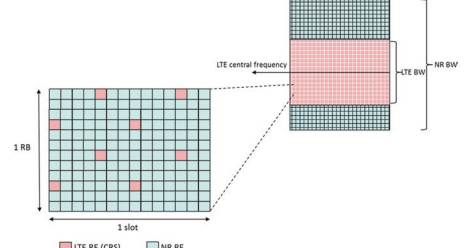 

| 正常的环状prefx| 扩展的环状Prefx||||||
|---------------------------------------------------------------|-------------------------|----------|----------|-----------|----------|----------|
| PDSCH映射类型| s| l| s + l| s| l| s + l|
| 类型A。| {0,1,2,3}| {3，…，14}| {3，…，14}| {0,1,2,3}| {3，…，12}| {3，…，12}|
| （注1）| （注1）||||||
| 类型b| {0，…，12}| {2,4,7}| {2，…，14}| {0，…，10}| {2,4,6}| {2，…，12}|
| 注意1：S = 3仅适用于DM- 卢比- 打字- posiition = 3|||||||

 在上表中，S表示启动符号的索引，l表示符号的计划长度。 小型的- 插槽调度可以在LTE/NR共存方案中使用。 例如，可以在不与LTE CRS重叠的OFDM符号中安排NR UE。 另一个示例，可以从LTE的角度将NR UE安排在MBSFN区域内的OFDM符号中。

##  3.3.5.4 ** 共存乐队的SS SCS除决** 

 在NR中，SSB包括PSS，SSS和PBCH。 一个SSB在时域连续4个OFDM符号，在频域中占据了20个RB。 NR UE可以从SSB获取关键系统信息，例如PCID（物理单元格ID）和SFN（系统帧号）。

 SSB对于初始访问和DL通道测量至关重要。 避免从LTE到NR SSB的干扰很重要。 在LTE中，PSS，SSS和PBCH在系统带宽的中央6 RB中传输。 在NR中，SSB的频率位置更为可爱，并且不需要位于中央带宽。 与DL中的LTE并存时，NR SSB可以避免通过FDM方式干扰LTE PSS，SSS和PBCH。 唯一应该考虑的是LTE CRS的干扰，因为CRS始终在非- MBSFN地区。

 与DL中的LTE共存（低于3g Hz）时，NR可能使用30 kHz SCS的SSB。 当SCS = 30 kHz，即情况B和情况C时，NR支持两种不同的SSB候选模式（图3.63）。 在b中，候选人SS/
 PBCH块的索引{4、8、16、20} + 28*n在半名望之内，其中n = 0对于小于或等于3 GHz（主要的LTE/NR共存频段）的载波频率。 如果C，候选SS/PBCH块的最高符号具有索引
 {2，8} + 14*n在半帧内，其中n = 0，1，对于小于或等于3 GHz的载波频率。 以下FGURE显示了这两种情况的SSB候选物，其中还说明了LTE CRS（4个端口）以进行比较。

 从上面的FGURE可以看出，即使在最坏的情况下（4个CRS端口，无MBSFN浓汤），CASE B仍然有一个SSB候选者（第一个）（第一个），这些候选者并未与任何包含CRS的OFDM符号重叠。 这可以确保至少可以在不干扰LTE CRS的情况下交付一个SSB。 另一方面，如果MBSFN与LTE融为一体，则所有SSB候选者都可以在不干扰LTE CRS的情况下传输B。 这提供了SSB传输的最大性能。

 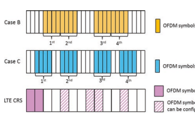 

 图3.63 scs = 30 kHz的SSB候选者

##  3.4 ** 5G- NR新的物理层技术**  3.4.1波形和多个访问

 OFDM在LTE中已成为成功的成功，但是花了几年的时间才被认为足够成熟才能被选中。 ETSI概念小组中的OFDM在1998年6月为UMTS输给了WCDMA。 但是，对OFDM的兴趣并没有减少，如在各种长石测试（例如[40]）中所见，并从2002年到2004年进行了3GPP的进一步研究[41]。 WCDMA后3GPP的主要轨道为HSPA，并于2000年3月批准了研究[42，43]，在IEEEEEEEEEE802.16D/e（WIMAX）中离开了DM。

 对于Eutra，LTE研究已批准# 26 2004年12月主要关注但不仅关注OFDM，直到运行才# 30 2005年12月，决定做出决定，决定将OFDM Downlink和SC伪装成ofdm- FDMA上行链路上链接MC- CDMA和其他替代方案[44]。

 导致下行链路选择OFDM的一些主要方面包括较低的成本和宽（20 MHz）带宽的实现，固有的和简单的多径通过使用环状PERFX，以及自然可扩展的实现 可以支持系统带宽。 将子手机组合在一起，组成12组，形成一个PRB。 选择12人的数量被选为交易- 在资源分配尺寸和小数据包的填充之间关闭[45]。 0.5 ms的插槽可以容纳7或6 OFDM符号，从而允许多个CP选择。 （1 ms子- 具有两个0.5 ms插槽的框架是关于在0.5和2 ms之间（或确实适应）的建议的简化妥协。 预期部署。 15 kHz提供4.67和16.67μsCP。 占用的目标约为90％，再次用于实施目的。

 对于LTE上行链路而言，主要问题是效率20 MHz实施。

 20 MHz的上行链路与当时的商业商业使用的差异很大，而且很担心PA和其他组件会推动成本太高，无法广泛采用。 关于是否可以支持较小的最小UE带宽，例如10 MHz [46]； 最终，由于与同步信号和系统带宽没有FXED关系的初始访问的最初访问ue带宽的初始访问，因此最终被丢弃了。 （十多年后NR
 重复讨论，鉴于载体带宽范围很大，因此决定最小UE带宽比最大载波带宽小得多，请参见SECT。 3.1.1，以及在UE带宽或系统带宽内未fx的同步信号的位置。）- 到- 平均功率比（PAPR）是一个热门讨论，很快将被更准确但不那么简单的计算立方度量（CM）取代[48]。 选择一个- 载波波形允许上行链路的CM大大降低，从而促进了较低的成本较低的功耗UE。 SC- 使用的FDMA波形是 "DFT" - 传播DM（DFT- s- OFDM），带有额外的DFT块，使净信号单载波。 贸易- 该波形的折扣包括一个未在同一SC中混合数据和参考符号的设计- FDMA符号以及对DFT实施的限制仅具有2、3和5的因素。 多簇UL传输（具有较高CM）或同时的Pusch和Pucch
 在发布之前没有指定- 10。

 对于NR，又有许多建议，但是与LTE相比，波形选择的时间大大减少。 NR研究项目始于2016年4月，最高为52.6 GHz的基本波形（WRC识别的一系列频段的上限- 19）被选为循环的PERFX（CP）OFDM频谱上的波形。 研究了几种不同变体的频谱浓缩波形，包括 "windowed"  和 "fltered"  OFDM。 最后，人们同意可以分配更大的（例如，在20 MHz中使用106个PRB，而不是LTE中的100个PRB；请参阅[49]sect。5.3.2）载体带宽中的资源数量， 高于LTE的〜90％[50，51]。 但是，满足这些要求所需的临时操作未被指定，并剩下要实施。 与LTE一样，在RAN1中开发的指定仍然允许基站使用频谱利用率（y％）高于RAN4（x％）[51，52] \ ran4（x％）的最低要求# PRB [53]（图3.64）。

 CP- OFDM波形被选择为下行链路和上行链路的基本波形。 DFT- s- OFDM未被选为上行链路链路的基本波形，作为上行链路波形初始决策的一部分。 部分原因是NR在未配对的频谱上的重点增加，以及包括DM在内的设计对称性- RS被认为具有吸引力，特别是在考虑十字架时- 链接干扰测量。 DFT- s- 由于其PAPR优势，OFDM也被选择为互补波形。 所有NR UE都必须为这两个CP提供强制性支持- OFDM和DFT- s- OFDM [54，55]。 DFT- s- OFDM仅用于单个- 层传输，针对有限的覆盖场景。 UL波形由RACH过程的MSG 3表示，然后

 图3.64系统使用的频率以及特定UES的示例性示例

  

 3 5G基本空气界面设计
 由UE- 非指定rrc for non- 后备DCI（后备DCI使用与MSG 3相同的波形）。

 NR中支持的调制与LTE中的调制非常相似。 支持QPSK至256 QAM，在FR1中必须使用256个QAM QAM，并为UL和FR2提供可选的功能信号。 释放不支持较高的星座，例如1024 QAM- 15 nr，尽管它是针对高的LTE DL支持的- 容量固定终端。 发布- 16 NR研究了1024 QAM作为集成访问和回程研究项目的一部分的使用，在发行版中指定了1024 QAM的DL QAM- 17 NR作为RAN4的一部分- LED工作项目。

 NR和LTE之间的一个区别是NR将支持DFT的π/2 BPSK- OFDM [56，57]，图3.65中带有频域光谱成型（FDSS）提供较低的CM操作。 FDSS flter取决于UE实现（即，TX FDSS Flter对RX透明）[58，59]。

 处理 "DC subcarrier"  LTE和NR不同。 对于LTE，DC
 保留子载波，并且不用于DL上的数据传输，并且在上行链路上引入了7.5 kHz的偏移，以避免DC与单个子载波完全排列。 对于NR，DL和UL是对称的，没有明确的DC子载波。 发射DC子载波进行调制（在GNB或UE上），
 并且不匹配或刺穿。 接收器可能知道是否存在发送直流子载波在接收器BW中，以及是否存在位置。 在接收器侧，RAN1中没有指定DC子载波（S）的特殊处理。 发射机处理差异的原因之一- 和接收器- NR的侧DC比从LTE中的侧面DC是，不同的UE可能有不同的最小带宽，而UE接收器带宽不一定在GNB载体带宽的中心对齐。

 NR的一个重要问题是与LTE共存。 见教派。 3.3。 如果nr
 和LTE都部署在同一频段中，希望将上行链路子载波对齐以最小化- 子载波干扰。 因此，NR引入了将上行链路栅格移动7.5 kHz的可能性。 在这种情况下，上行链路LTE和NR子载波将对齐（图3.66和3.67）。

##  3.4.2通道编码

 峰值数据速率的频道编码是每个新一代的硬件挑战； 5G- NR没什么不同。 顶级LTE UE类别非常高（UE CAT 26，〜3.5 Gbps），理论上LTE甚至可以满足超过20 Gbps的ITU要求（以256 QAM/1024 QAM QAM，32 20 MHz载体）。 5G- NR将支持20 Gbps或更多用于EMBB，其最初与LTE相似或更大的吞吐量，并且随着时间的流逝而高得多。 在长期大小和高数据速率下，挑战是保持良好（接近香农限制）的绩效，并具有合理的复杂性和延迟。 在

  

  

 图3.65上行链路传输和接收π/2 BPSK和FDSS
 图3.66在DC上什么都不做

 #### 图3.67上行链路栅格$ \; $ with 7.5 kHz班次

  

 小块长度（少于几百位）有一个改进的机会（1-2 dB）（尾巴）- 咬合卷积代码）。 此外，NR必须维持LTE中提供的出色的效率和HARQ支持。 这对于 "real-world"  调度和自适应调制和编码（AMC）。

 除了长长的长度外，重点是与LTE相比，NR的一个差异是NR的一个差。 长块可能占主导地位 "worst-case"  在考虑系统的峰值数据速率性能时，可以看到实现复杂性和延迟。 但是，短块可能主导整体系统性能。 在TR36.822中显示了背景流量，即时消息，游戏传递，游戏等200个字节的数据包的显着百分比（约50–90％），这是不同数据应用的增强功能。 系统信息，RRC信号和L1 DL/UL控制通常均小于200个字节。 小数据包和控制信息的性能可能会限制系统链接预算和系统覆盖范围。 当数据被束缚并且自然的覆盖范围比对照​​更大时，控制覆盖范围尤其重要。

 与LTE一样，NR的频道编码讨论分为两个阶段：代码向下- 选择和代码设计。

-  ** LTE下降- 选择**  ：2005年4月至2006年8月，WCDMA Turbo（Legacy）与争论- 免费的涡轮增压与LDPC
-  ** LTE设计**  ：2006年11月至2008年2月，争论- 免费涡轮设计（对控制频道编码的关注不多，卷积代码设计被选为TBCC 2007年3月）
-  ** nr下来- 选择**  ：2016年4月至2016年10月/11月，争夺- 免费涡轮（遗产）
 vs. LDPC与Polar（控制通道也考虑TBCC）
-  ** NR设计**  ：2016年11月/2017年1月至2017年12月。LDPC和极地代码。

 NR代码的讨论主要集中于涡轮代码（如LTE中使用），LDPC代码（如LTE所讨论，用于WI- fi）和极地代码（标准新的）。 在LTE下降时- 选择，LDPC代码[60]，尽管与涡轮代码相比，较旧的概念被认为是简便的，与涡轮代码相比，实现不那么成熟。 因此，选择了涡轮代码的LTE，可以从HSPA中使用的版本[61]适当地改进。 从那以后的十年中，在802.11n和802.11ac [62]中，更好地理解了LDPC代码并商业开发。 极地代码几乎没有（如果有）已发布的实施，那么 "less well-established"  候选人。 但是，他们被认为有望很低- 复杂性以最高数据速率以及小块尺寸的性能进行简单解码[63]。 涡轮代码是众所周知的，但是在NR上应用了以下内容： "For turbo codes, there are concerns that implementation with attractive area and energy effciency is challenging when targeting the higher throughput requirements of NR"  [55]。 表3.25突出显示了编码选项的选择阶段摘要。

| 表3.25| 考虑到NR的代码的属性|||
|--------------------------------|----------------------------------------------------------|--------------------------|-------------------------------|
| 因素| LTE（涡轮）| LDPC| 极性|
| 到期| 建立（广泛实施）| 建立（广泛| 建立不佳的人（否|
| 实施的）| NR研究项目时的商业实施）|||
| 表现| 可以大| 可以大| 好的，很小的小|
| 复杂| 吞吐量和面积效率不足| 最佳吞吐量和区域| 可实现较小|
| NR的效率| （L = 8）列表和块大小|||
| 平行的延迟，但| 最好（高度平行）| 可以接受||
| 数据速率| 足够的？|||
| 灵活性| 可以接受| 可以接受| 可以接受|
| 其他| 大通和IR| 大通和IR| 大通和IR|

##  3.4.2.1 ** LDPC** 

 LDPC代码用于DL和UL的NR数据传输。 有两个基本图设计，针对大小的块尺寸。

 LDPC代码获取K信息位，并使用
 （n -k）×n位均等检查矩阵。 代码由基本图表示，该条目被sub代替- Z。NR大小的矩阵具有两个基本图BG1和BG2。 最初的基本图= 46×68，而z是51个值之一
 {2,3,4，…，320,352,384}。 k = 22*z的信息块大小是直接支持的，z = 384的最大k = 8448。有第二个碱图靶向较小的块尺寸，碱基图= 42*52，相同的z选择，最大k选择，最大k。 = 3840 = 10 * z，n = 50/10 * k，其他小差异。 潜艇- 矩阵均为零，身份或循环移位矩阵。

 下行链路的框图如图3.68所示。 与LTE相似，对速率匹配和分割/串联进行了建议。 较大的信息块分为多个代码块，每块CRC，如LTE所示。 费率匹配支持其他信息尺寸，代码率和红外线- 哈克。 FRST 2 * Z位未包含在圆形缓冲区中，因此BG1的母体代码速率为22/66 = 1/3，n = 66/22 *K。四个冗余版本（RVS），如LTE， 被定义。 有限的缓冲速率匹配（LBRM）可能会被混合在一起。 在速率匹配后，将应用一些交织器，以将位分配到高阶调制符号中，以获得少量增益。

 所选的LDPC代码具有良好的实现属性（例如，Quasirow Orthoconal（QRO），双对角线；图3.69）。

 相同的基本图用于初始传输和同一代码块的重新启动。 图3.70说明了BG1和BG2关于代码速率的使用（最高0.95）和信息位数量（最高8448位）。 当有效的代码速率> 0.95时，UE可以跳过解码（某些CB尺寸可能无法在代码速率高于0.92的代码速率上解码）。

 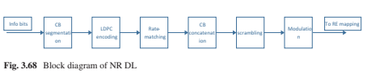 

 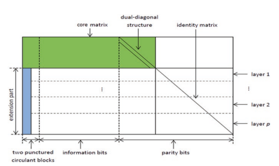 

 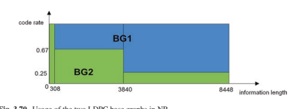 

##  3.4.2.2 ** 极性代码** 

 极地代码用于控制下行链路（DCI）和上行链路（UCI）以及PBCH的控制信息，每种情况的代码构建和设计略有差异。 因此，NR中极地代码的信息块大小小于数据通道中的信息块，DCI的k最高为140，而UCI（分割之前）为1706。 对UCI和DCI，分割进行速率匹配，并且仅针对UCI进行交织。 与LTE一样，最小的UCI信息块大小使用不同的编码，重复，单纯码和RM代码[6]。

 极地编码涉及以一种方式编码代码单词中的位置可以根据可靠性订购。 最可靠的位置用于重要
 "assistant"  可用于辅助解码的位（例如CRC位或其他位），然后是其他输入信息位，然后 "frozen"  位置最低的位置。 在解码器上，这些最低的可靠性位置将设置为解码器中的已知值（零）。

 极性编码FOW如图3.71所示。 通过将输入信息位与助手位一起放置在一起来生成编码向量。 然后，使用具有2个功率的极性序列生成编码矢量，大于输入和助手大小，以可靠性的上升顺序排序。 Arikan编码后，执行速率匹配以产生输出代码单词。

 对于DCI代码构建，助理位为24- 位CRC。 CRC Shift寄存器的初始化是所有的。 164号尺寸的交织器在编码矢量中分布CRC位，以帮助在解码器提供早期终止收益。

 极性序列的长度为512。速率匹配（sub- 块交织，位收集）。 DCI不使用分割和位交织。 DCI的CRC长度大于16- 考虑到LTE中使用的BIT CRC，考虑到NR每单位时间可以执行更多的盲解，而CRC位也用于极性编码。 目标错误警报率大致等于21- 位CRC。

 对于UCI代码构建，助理位是11- BIT CRC，用于20个或更多输入信息位，或6个- 位CRC和3个奇偶校验检查（PC）位，以更少的输入信息位。 CRC移位寄存器的初始化是所有零。 CRC位是附加的，而不是由对手分配的。 个人电脑- 位位置是为信息位保留的最高可靠位集之一，并根据信息位计算出来。 位置和计算是解码器已知的。 UCI
 费尔德顺序为CRI→RI→填充位（如果存在）→PMI→CQI。 极性序列的长度为1024。速率匹配还包括位交织。

  

| 表3.26| NR控制通道的通道编码方案|||||||
|---------------------------------------------|--------------------------------------------------|---------|-------------------------------------------------|----------|-----------|------------|------------|
| 有效载荷类型| UCI| BCH| DCI 11 <k（用于达到k = 12）|||||
| 编码和| 重复| 单纯形| 块代码极性| 极性| 极性| 极性||
| 元素| 5.3.3.1| 5.3.3.2| 5.3.3.3| 5.3.1.2| 5.3.1.2| 5.3.1.2| 5.3.1.2|
| nmax| N/A。| N/A。| N/A。| 10| 10| 9| 9|
| CRC| N/A。| N/A。| N/A。| GCRC6（D）| GCRC11（D）| GCRC24C（D）| GCRC24C（D）|
| 多项式有效载荷尺寸（不包括CRC，如果| 11 <k|||||||
| 适用的）| k = 1| k = 2| 2 <k≤11| ≤19| 19 <k| k = 32||
| 初始CRC| N/A。| N/A。| N/A。| 0x00| 0x000| 0x000000| 0xffffff|
| 剩余的最大段数| N/A。| N/A。| N/A。| 1| 2| 1| 1|
| 有效载荷交织（IIL）| N/A。| N/A。| N/A。| 否（0）| 否（0）| 是（1）| 是（1）|
| 奇偶校验总数（NPC）N/A| N/A。| N/A。| 3| N/A。| N/A。| N/A。||
| 最小重量位置的均等位数WM NPC N/A| N/A。| N/A。| 0或1| N/A。| N/A。| N/A。||
| 编码- 有点交织（ibil）| N/A。| N/A。| N/A。| 是（1）| 是（1）| 否（0）| 否（0）|

 当K≥360和M≥1088时，使用分割和代码块串联
 （其中m是UCI的编码位），两个相等- 大小的块根据该细分市场用CRC块。

 NR的极地编码- PBCH与DCI：具有分布式CRC的极性代码相同（32个信息位加24- 位d- CRC，NMAX = 512）。 PBCH的编码步骤包括有效载荷生成，争夺，CRC添加，通道编码和速率匹配。 有效载荷生成是PBCH的独特之处，因为PBCH的FELD可能具有已知的位值（例如，SS块时间索引，切换情况下的SFN位）
 放置在指定顺序中，以启用改进的PBCH解码器性能/延迟。

 表3.26 [64]总结了控制通道的通道编码方案。

##  3.4.3 MIMO设计

 NR中的MIMO操作非常紧密地基于发行中的开发- 14 LTE，
 下面列出了一些主要差异，并在以下各节中进行了详细讨论，并在表3.27中给出了总体摘要。

 如教派中所讨论的。 3.1.4参考信号，单元格- NR标准中不再存在LTE中的常见参考信号，并且参考信号设计的整个框架变化。 结果，NR中的MIMO传输仅基于DM- 借助TRS的时间和频率跟踪和PT的TRS解调rs- RS用于FR2中的相位跟踪。 请注意，没有上行链路或下行链路

| 表3.27| 5G中MIMO特征的总体摘要|
|-----------------------------------------|----------------------------------------------------------------------------------------------------------------------------------------------------------------------------------------------------------------------------------------------------------------------------------------------------------------------|
| 方面| 描述|
| 参考信号| 删除了LTE- 像CRS一样，引入了PT- 相位噪声的RS|
| 框架| 补偿，并使用各种CSI- 用于多种功能（例如FNE T/F同步）和QCL假设，RRM，CSI采集和光束管理等多种功能的RS浓度|
| DMR| 比LTE更长，更可爱。 引入的类型1和2型浓汤占据了可浓厚的1或2个符号。 用2型和两个符号浓汤支持多达12个正交层。 支持前线- 仅加载（低延迟）和前面- 加载加上额外的DMR位置用于移动性|
| CSI- 卢比| 从LTE扩大使用，具有更多T/F模式和密度的选项。 除了CSI获取，BM，Tracking（TRS），NZP IM探测，RRM（可选的）和RLM之外，还引入了不同的浓汤以支持CSI获得，BM，TRES（TRS），NZP IM|
| SRS| 与释放类似- 15 LTE，增强，可支撑多达4个端口，天线和载波切换，以及非- 代码本- 基于UL MIMO|
| 可浓缩/初始化| 可用于UL和DL数据，PUCCH，UL和DL RS。 基于单元格ID可能是默认的，但可以实现UE的可能性- 中心操作|
| 梁管理| NR的新功能（> 6 GHz）可用于6 GHz以下。 "Beam"  用于RRC，以及 "Transmission Confguration Indication"  （TCI）与D型QCL一起使用，以指示梁|
| 梁故障| NR的新事物。 UE测量下行链路信号（CSI- rs/ssb）检测|
| 恢复| 梁故障和进行新的候选梁，发送Prach进行报告，然后在相应的核心上查看GNB响应|
| DL MIMO| I型代码本与LTE版本非常相似- 14. II型代码手册以更高的精度引入。 CSI报告框架范围扩大了，并支持梁管理和干扰测量值。 非透明的MU- mimo和更简单的代码单词以层映射|
| Ul Mimo| 与LTE类似：基于代码书。 框架是NR的LTE（已更新的代码书）：non：non- 基于密码。 分辨率比代码簿更好。 需要额外的信号并改进使用TDD互惠- 基于操作|

 但是，传输多样性，这意味着在某些环境（例如高速）中，NR可能会降低。

 在NR网络中设想了许多天线，而手机上的天线数量相对较少。 因此，Multiuser（MU）MIMO对于真正利用多数的空间维度至关重要- 高光谱效率的天线系统。 实现良好的贸易- 在MU之间关闭- MIMO
 与UES潜在的大量层相关的性能和间接费用，DM的明确指示- 支持用于多个UE的RS天线端口，这不是LTE的情况。 代码字- 到- 现在，NR中的层映射和重新映射也有所不同。

 CSI报告框架在NR中进行了扩展和修改，以适应Beam Management，New NonZero Power（NZP）CSI等功能- RS干扰测量资源等。反馈代码簿设计还扩展到涵盖多个面板，并且在较大的开销中具有更高的精度。

 对于Ul Mimo，除了代码本- 基于MIMO方案，非- 引入了基于CodeBookB的MIMO方案。 为了以较高的频率支持FR2，引入了光束管理程序，以扫除光束/选择，梁故障恢复等。

 NR没有像LTE这样的传输模式的事实并不意味着NR比LTE更简单。 实际上，这个 "single mode"  非常令人兴奋，包括新的光束管理功能，RS和其他增强功能。 NR具有大约50多个相关的UE功能和约200个RRC参数，在LTE释放中看到的〜15和〜50的明显增加- 13/14 MIMO。 可能需要明显的努力，以确保GNB和设备可以超越最基本的功能和默认功能，以达到NR MIMO的全部潜力。

##  3.4.3.1 ** DM- 卢比- 基于MIMO传输** 

 在NR中，上行链路和下行链路数据传输（PUSCH和PDSCH）均基于DM- rs解调。 对于DM- RS设计，请参阅Sect。 3.1.4.2。 对于su- MIMO，NR最多支持八个正交DL DM- RS端口和最多四个正交UL DM- RS端口在相关UE功能上调节。 为了mu- MIMO，NR最多支持12个正交DM- 下行链路和上行链路的RS端口。 对于DFT- s- OFDM波形，仅支持单层（即等级1）。 对于CP- OFDM波形，每个UE实际受支持的最大端口取决于DM的融合- 如表3.28所示，RS类型和占用的OFDM符号的数量。

 在以下内容中，为代码字提供了更多详细信息- 到- MIMO层映射，PRB捆绑进行预编码和DM的DCI指示- RS端口。

| MU中的最大端口- MIMO（CP- OFDM）|||||
|-------------------------------------------|----|----|----|----|
| DL| Ul| DL| Ul||
| 类型1带1个符号| 4| 4| 2| 2|
| 带有2个符号的类型1| 8| 4| 4| 4|
| 类型2带1个符号| 6| 4| 4| 4|
| 2型带2个符号| 8| 4| 4| 4|
| su中的最大端口- MIMO（CP- OFDM）|||||
| DM- RS浓汤|||||

##  3.4.3.1.1代码字- 到- 图层映射

 与LTE相比，一旦PDSCH/PUSCH传输有多个层，通常将两个代码字映射到一个以上，在NR中，多达四层被映射到一个代码字，而FVE或更多层映射到两个代码字。 此设计背后的基本原理包括信号开销，链路适应的鲁棒性，解调/解码延迟等。由于为多个MIMO层的代码单词分配了单个MCS级别，其频道质量可能会大不相同，因此可能存在潜在的性能降级时 确切的损失量取决于许多因素。

 对于FVE或更多层，FRST⌊L/2⌋层映射到FRST代码字
 （CW0）和第二个代码单词（CW1）的其余层。

 当映射编码的调制符号时，该顺序为层frst，然后是频率（根据子载波）和上次（以OFDM符号而言）。

##  3.4.3.1.2 PRB捆绑

 DM预编码的频域粒度- RS交易更精确的预编码与更好的频道估计性能。 与LTE相似，该频域粒度是通过PRB捆绑来定义的，其中UE可以假定将相同的预编码应用于一组连续（和捆绑）的PRB。 NR中的PRB捆绑尺寸是浓缩的。 候选大小包括2、4或宽带。 在宽带PRB捆绑的情况下，预计UE不会与非连续PRB进行安排，并且UE可以假定将相同的预编码应用于分配的资源。 对于PRB捆绑的大小为2或4，相应的带宽部分（BWP）被划分为预编码的资源块组（PRGS）
 尺寸2或4的边界，以促进多个- 用户配对。 PRB捆绑尺寸为UE- 特定的混合。 它可以作为静态和1个值将其混合在一起。

 它也可以通过1的动态指示融合- DCI和PDSCH资源分配中的位长石以共同确定大小。 默认尺寸2在rrc confguration之前使用，用于使用DCI格式1_0的PDSCH。 确定PRB大小的过程如图3.72所示。

 请注意，NR还支持DM- 当为PDSCH传输分配连续的插槽时，RS跨时域捆绑在插槽中。

##  3.4.3.1.3 DCI的MU- MIMO

 为了达到高频谱效率，MU- MIMO传播和接收必须动态适应通道条件，UE分布，数据运输等。这意味着MIMO层的数量和被占用的DM的数量- 配对UE的RS端口随时间（从传输到传输）和频率（从RBG到RBG）而变化。 更多的传输层可能以DM为代价提供更高的吞吐量- RS开销。 在NR中，除了DM- 用于数据传输（PDSCH或PUSCH）的RS端口，DCI还表示DM的数量- RS CDM组无数据映射到其相应的RES。

  

 这些DM- RS CDM组当然包括UE DM的CDM组- RS端口，此外，它可以包括可能适用于其他UES DM的CDM组- RS端口。 因此，该信号可用于指示MU- MIMO传输并动态调整相关的开销。 对于下行链路（从某种意义上说上行链路），这属于透明的MU之间- mimo在UE不了解配对UE的DM方面- RS端口和非透明的MU- mimo ue确切知道哪个DM- RS端口用于其他UE。

##  3.4.3.2 ** CSI收购** 

 为了促进下行链路MIMO传输，尤其是对于FDD系统，通道状态信息（CSI）由UE备份，以确定UES的配对，预编码，图层，MCS级别，MCS级别等。

##  3.4.3.2.1 CSI获取的浓汤和信号的框架

 对于CSI获取，UE测量渠道和干扰浓厚的资源，生成预期的CSI报告，并在适当的时间（通过凝结和/或通过触发）通过浓厚的上行链路通道发送报告。 。 在NR中，针对CSI采集指定了一个融合和信号框架。 该框架主要涵盖三个方面：资源设置，报告设置和报告触发器的列表（图3.73）。

 资源设置包括许多CSI资源集，每个CSI
 资源集由许多非零功率（NZP）CSI组成- RS资源，许多SS/PBCH块资源或许多CSI- IM（干扰测量）资源。 NZP CSI的数量- RS资源集索引到NZP CSI的资源集库- RS为CC/BWP的UE融合在一起，其中每个NZP CSI- RS资源集给出了资源集识别。 SS/PBCH块资源和CSI的资源集- 我以相同的方式被融合在一起。 对于CC/BWP的UE，可能会融合许多资源设置。

 CC/BWP的UE可能会遇到许多报告设置。 A
 报告设置为UE提供信息，以衡量和报告某些渠道状态信息（图3.74）。 这些信息包括测量资源
 （作为资源设置（S））在执行通道测量以及执行干扰测量的情况下进行的浓缩- 在Pucch或Pusch或Aperiodic上持续报道质量，报告频率浓度（宽带与子- 频段），通道或干扰测量的时间限制（打开或关闭），代码书浓汤，组- 基于光束报告，CQI表，子- 带尺寸，非- PMI端口指示等等。

 可以将CSI请求的DCI FELD触发的Aperiodic CSI报告和触发状态的触发状态列表和触发状态的另一个列表混合在一起。- 持续的CSI报告了Pusch。 对于Aperiodic CSI报告，CSI请求的DCI FELD的每个代码点都与一个触发状态相关联。 每个触发状态都包含如上所述的关联报告设置的列表。 如果链接到报告设置的资源设置具有多个Aperiodic资源集，则只有一个Aperiodic CSI之一- 来自资源设置的RS资源集与触发状态相关联，UE是每个触发状态每个资源设置的较高层，以选择一个CSI- IM/NZP CSI- 从资源设置设置RS资源。 在接受与触发状态相关的值后，UE将进行测量并相应地报告。

##  3.4.3.2.2 CSI获取的测量

 如前所述，UE测量渠道和CSI报告的干扰的资源在报告设置中是一个或多个资源设置。

 资源设置的数量可以是一个，两个或三个。 当一个资源设置融合在一起时，资源设置是用于L1的频道测量- RSRP
 计算。 当两个资源设置融合在一起时，FRST资源设置是用于通道测量的，第二个是用于在CSI上执行的干扰测量- 我或在NZP CSI上- 卢比。 当三个资源设置融合在一起时，

 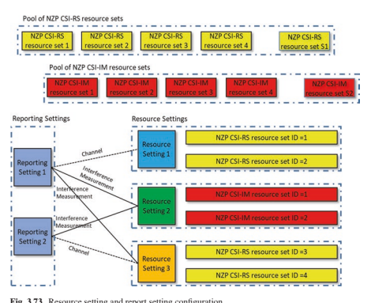 

 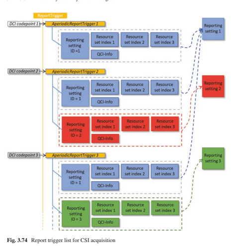 

 第一个资源设置是用于通道测量，第二个是用于CSI- 我是- 基于干扰测量，第三个是针对NZP CSI的- 卢比- 基于干扰测量。

 NZP CSI的资源设置- RS或SS/PBCH块资源可用于通道测量。 对于干扰测量，CSI的资源设置- IM或NZP CSI- RS可用于干扰测量。 如果是CSI- IM进行干扰测量，UE测量了干扰，假设没有在CSI的RES上传输特定信号- IM资源。

 对于NZP CSI- 卢比- 基于干扰测量，UE假设：
 每个NZP CSI- 为干扰测量配置的RS端口对应于干扰传输层。 NZP CSI上的所有干扰传输层- 用于干扰测量的RS端口考虑了相关的EPRE比率。

-  NZP CSI RES的其他干扰信号- RS用于通道测量的RS资源，NZP CSI- 用于干扰测量的RS资源或CSI- IM用于干扰测量的资源。 UE积累了通过这些资源来得出CSI的干扰
 报告。 此处规定的UE测量行为与适当的网络实现相结合可以实现更准确的链接适应性，从而改善了系统性能。 例如，预编码为CSI- RS可以通过NZP CSI发送- RS资源用于干扰测量- MIMO传输。 UE测量这些NZP CSI- 用于干扰（和渠道）的RS资源，以使报告的CQI反映了实际的MU- MIMO干扰条件具有更高的精度。 同样，结合CSI- 我是- 基于NZP CSI- 卢比- 基于干扰测量值，网络可以发送适当的CSI- RS信号探测间- 细胞和内部- 细胞干扰条件并以高精度获得CQI，从而更好地链接适应性性能。

##  3.4.3.2.3反馈报告和计算

 根据NR CSI采集程序支持参数列表。 除了MIMO传播- 相关报告，例如CQI（通道质量指示器），PMI（预编码矩阵指示器）和RI（等级指标），梁管理- 相关报告，例如CRI（CSI）- RS资源指标），SSBRI（SSB资源指标）和L1- 还支持RSRP。 这些参数中的每个参数的简要说明如下：
-  CRI（CSI- RS资源指标）指示选定的CSI- 来自多个CSI的RS资源- NZP CSI的RS资源- RS资源集为CSI报告。 高层参数 "repetition"  应该设置为 "off"  对于NZP CSI- RS资源集可能应用于这些CSI上的不同传输梁- RS资源以促进UE的梁选择和报告。

-  ** SSBRI**  （SSB资源指标），类似于CRI，指示所选的SSB
 来自多个SSB资源的资源，以促进SSB- UE的基于梁的选择和报告。

-  ** L1- RSRP**  （第1层参考信号接收的功率）是在报告的SSBRI指示的SSB资源或CSI上测量的- RS资源由报告的CRI指示。

-  RI（等级指标）报告了UE选择的PDSCH传输的等级。

-  PMI（预编码矩阵指示器）报告了从代码手册中选择的预编码矩阵。 代码本和PMI的详细信息在下一节中给出。

-  LI（层指示器）指示所报告PMI的预编码器矩阵的哪一列对应于对应于报告最大的宽带CQI的代码字的最强层。 如果报告了两个宽带CQI并具有相等的值，则LI对应于FRST代码单词的最强层。

-  CQI（通道质量指示器）报告了最高的CQI指数，以使一个具有调制方案，目标代码速率和运输块大小的单个PDSCH传输块与CQI指数相对应，并占据了一组下行的物理资源块，称 CSI参考资源可以以不超过目标BLER值的传输块错误概率接收。 请注意，在NR中，有两个不同的目标BLER值，0.1（通用运输量）和0.00001（对于URLLC贩运）。 在这里，对于CSI报告，CSI参考资源在频域中被认为是与派生的CSI相对应的下行链路物理资源块的组
 根据报告时间，下行链路和上行命理学，测量CSI资源，UE，与时域和时域作为单个下行链路插槽衍生而成
  功能等。此外，还可以计算和报告CQI（以及PMI和RI（如果浓厚）），UE假定PDSCH传输的一组常见假设，包括用于控制通道的OFDM符号的数量，DM- RS和PDSCH，其他频道的开销数量，通道编码的冗余版本，PRB捆绑尺寸，PDSCH天线端口等。

 请注意，不同的CSI参数之间存在依赖性。 更特殊地，应根据报告的CRI计算RI； PMI以RI和CRI的报道为条件； CQI以报道的PMI，RI和CRI为条件； LI以CQI，PMI，RI和CRI为条件。

 在报告设置中，可能与报告混淆的CSI参数的可能组合列表为 "none,"  "cri-RI-PMI-CQI,"  "cri-RI-i1,"  "cri-RI-i1- CQI,"  "cri-RI-CQI,"  "cri-RSRP,"  "ssb-Index-RSRP,"  或者 "cri-RI-LI-PMI-CQI." 
 当报告数量设置为 "none,"  UE不会为相应的报告设置报告任何数量。 当报告数量设置为 "cri-RI-i1,"  UE期望与I型单人混在一起- 面板代码手册并报告一个由整个CSI报告频段的宽带指示组成的PMI。 当报告数量设置为 "cri-RI-i1-CQI,"  预计UE将与I型混合
 单身的- 面板代码手册并报告由单个宽带指示组成的PMI（即 "i1"  ）整个CSI报告频段。 计算CQI根据报告的宽带指示条件，假设PDSCH传输具有许多预编码器（对应于相同的i1，但I2不同），在该指示下，UE假设从PDSCH上每个PRG的一组预编码器中随机选择了一个预码器。 当报告数量设置为 "cri-RI-CQI,"  UE使用指示的端口（通过更高层的浓汤）为所选CSI计算报告等级的CQI- RS资源。

 CSI报告有效地计算和内存很重，因为它涉及渠道和干扰估计和测量，代码书选择，反馈报告渠道编码和调制等。但是，量化不同类型的不同类型的资源量并不是一件容易的事 CSI报告并允许在不同报告事件中的手机中重复使用计算和内存资源。 在NR指定中，UE报告了支持同时计算的支持的CSI处理单元（CPU）的数量，用于处理所有粘性单元的CSI报告。 CSI报告的处理将占据数字

| 表3.29| CSI报告和上行链路通道周期性CSI| 半- 持续的CSI| Aperiodic CSI||
|-------------------|------------------------------------------------|-----------------------|-------------------------------------------------------------------------------------------|---------------------------------------------------------|
| 代码手册和| 类型I CSI||||
| 报告渠道||-| 短斑||
||-| 长岩| 类型I CSI- 短/长的pucch- Pusch II型CSI- 长pucch（仅第1部分）- pusch| 类型I CSI- 短斑- Pusch II型CSI- pusch|

 CPU在一段时间内（就OFDM符号的数量而言），其中不同报告数量和报告情况的确切数量和时间各不相同。 当CSI报告所需的CPU比UE支持更多时，UE不需要根据这些CSI报告开始占据CPU及其优先级的时间来更新某些请求CSI报告。

 CSI报告的优先级由其报告类型按Aperiodic CSI的顺序给出- 持续对Pusch>半决赛- 在Pucch上持续存在Pucch>，然后携带L1的CSI报告- RSRP>其他，然后通过服务单元格索引，然后通过报告设置ID。 此优先级还用于确定携带CSI报告的物理通道在至少一个OFDM符号中重叠并在同一载波上传输的物理通道时是否要删除CSI报告。

 如表3.29所示，可以在Pusch和/或Pucch上进行CSI报告。

##  3.4.3.2.4 PMI报告

 RI和PMI报告的NR代码手册包括I型和II型代码手册。

 I型代码簿与以后发行的LTE非常相似，并进行了一些中等的扩展和修改。 在发行中- 13和- 14，将Beam Selection Codebook引入了LTE，称为A类代码簿。 相同的设计原理用于设计具有略有不同结构和参数的I型I型代码簿。 I型代码本针对单个天线面板壳和多个（2或4）个面板案例进行了定义。 如果是单身- 面板码本，光束选择是通过FRST选择FRST层的光束完成的，然后为其他层与LTE类A Codebook不同的相邻正交梁选择相邻的正交梁。 多- 面板代码簿是单个的扩展- 通过添加Inter- 面板宽带或子- 乐队- 相位参数。

 II型中使用了多个光束的组合，而不是梁选择
 代码书设计以提高CSI反馈的准确性，而费用更高。 II型代码手册包括单个- 面板代码簿和端口选择代码簿。 仅对II型单单级排名第1和2号码。- 面板代码本发行- 15.除了子- 频段报告，宽带或子带的幅度报告，并为子分配不均- 频段将较小的量化位用于幅度较小的系数。 端口选择类型II代码簿是II型单曲的扩展名- 面板代码手册以基于波束形成的CSI结合多个端口- 卢比。

 虽然释放- 15类型II代码簿提供高- 分辨率CSI到GNB，
 它在上行链路上导致很高的反馈开销。 为了解决此问题，除了空间域压缩外，发行中还引入了增强- 16 II型
 代码簿在频域中具有其他压缩。 就像在空间域基矩阵上执行的线性组合一样，频域DFT基矩阵的线性组合用于删除每次下报告系数的必要性- 乐队，从而减少开销。

##  3.4.3.3 ** 上行链路MIMO** 

 对于NR上行链路，除了代码簿外- 基于类似于LTE的MIMO方案，非- 代码本- 引入了基于上行链路MIMO方案。

##  3.4.3.3.1代码本- 基于上行链路MIMO

 代码本- 基于上行链路MIMO方案，两个DFT的传输代码簿- OFDM和CP- 设计了OFDM波形。 DFT的代码手册- s- OFDM基于LTE版本- 支持10个设计，仅支持1（即单层）传输。 对于CP- OFDM，DFT- 采用了基于的代码簿设计。

 UE报告了UE传输天线的连贯能力，UE表明所有UE天线是否相干（表示为 "fullyAndPartialAndNonCoherent"  ），或者有两组UE天线，其中一组内的天线是连贯的，不同组内的天线是非- 连贯（表示为 "partialAndNonCoherent"  ），或所有UE天线都是非- 连贯（表示为 "nonCoherent"  ）。 然后，设计了代码书的子集以匹配UE天线相干功能。

 2- 传输天线代码本，有两个子集。 一 "fullyAndNonCoherent"  子集包含每个层中有1个非零端口的代码词，而代码单词则具有每个层的2个非零端口，并且可以用完整的天线相干能力来指示UE通过UE进行传输。 其他 "nonCoherent"  子集包含每个层中有1个非零端口的代码词- 连贯的能力。

 4- 传输天线代码本（图3.75），有三个子集。 一 "fullyAndNonCoherent"  子集包含每个层中有1个非零端口的代码单词，每层2个非零端口，每层4个非零端口，可以用UE表示具有完整天线相干功能的UE传输。 一 "partialAndNonCoherent"  子集包含每个层中有1个非零端口的代码词，每层2个非零端口，可以通过局部相干能力来通过UE进行传输。 一个 "nonCoherent"  子集包含每个层中有1个非零端口的代码词- 连贯的能力。 请注意，每个代码单词都对端口分组对齐。

  

 传输PMI是基于GNB处的SRS测量结果确定的，并通过DCI通过包括SRI（SRS资源指标），TRI（Transmit Rank指示器）和TPMI（Transmit PMI）在内向UE指示。

##  3.4.3.3.2非- 代码本- 基于上行链路MIMO

 在非- 代码本- 基于上行链路传输，在UE通过UE通过上行链路SRS传输的帮助，在GNB上确定了在UE侧的预编码器，并且GNB不需要明确的传输PMI。

 如图3.76所示，UE可以与许多SRS混合
 资源基于其功能。 UE根据下行链路CSI确定每个SRS资源的预编码器- RS测量。 GNB测量这些SRS传输以选择与SRS资源子集关联的适当的预编码器，然后通过SRI（SRS Resource指示器）指示所选的SRI（SRS Resource指示器）

 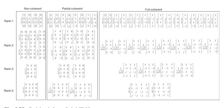 

 PUSCH传输的预编码器（S）（和传输等级）。 SRS资源集和关联的CSI- RS资源可以由DCI中的SRS请求费尔德共同触发。

##  3.4.3.3.3上行链路已满- 电力传输

 对于非- 代码本- 基于UL的传输，完整- 释放支持电力传输- 15.但是，对于代码簿- 基于功率缩放的基于UL的传输（即，具有非零PUSCH传输功率的天线端口数与UE支持的最大SRS端口数的比率
 资源），仅支持非部分电力传输- 连贯和部分- 连贯的tpmis。

 在发行中- 16，三种上行链路完整模式- 电力传输被指定。 当 *ul- FullPowerTransmissermiss*设置为*FullPower*，任何TPMI都可以用于UL- 电力传输。 该模式仅适用于UE功能1的PA体系结构，如图3.77所示，所有PA都均为全功率。

 当 *ul- fullPowerTransmission*设置为*fullPowerMode1*，UE可以与一个或多个SRS资源混合在一起，其中具有相同数量的SRS端口的SRS资源设置，并将其设置为使用 "codebook,"  GNB可以将UE融合在一起使用TPMI的子集，该子集将端口组合在一层中以产生完整- 非通电- 连贯或部分- 连贯的UES。 此模式适用于UE功能1、2和3的PA架构。

 当 *ul- FullPowerTransermiss*设置为*fullPowerMode2*，UE可以与一个SRS资源或多个SRS资源混淆，其中具有不同数量的SRS端口的SRS资源设置，其使用情况设置为 "codebook."  UE以相同的方式传输SRS和PUSCH，无论是否使用天线虚拟化。

 UE报告哪种TPMI可用于完整- 电力传输。 然后根据指示的SRI和/或TMPI实现上行链路全力传输
 由GNB表示。

  

##  3.4.4 5g- NR Unifed Air界面设计，用于EMBB和URLLC

 LTE空气界面为包括MBB，VoIP和MBM在内的大量服务提供了可爱的支持。 在后来的版本中，为垂直行业（例如V2X和MTC [nb）开发了可选的增强功能- 物联网（狭窄的乐队- 物联网）/EMTC（增强机器- 类型通信）]。 MTC增强功能广泛使用重复以达到覆盖范围增强目标。

 对于LTE，在发行中引入了一些针对低潜伏期和高可靠性的其他功能- 15 [65，66]。 尽管这些URLLC的增强能力是在LTE生命的后期进行的，但实际上它们是在LTE开发的早期阶段考虑的。 人们认为，根据诸如延迟和可靠性等特征，可以将用户从一个到四个插槽[67]，但最终稳定系统设计一个sub- 框架在两个插槽处被FX [45]。 第7章详细信息在NR中进行了增强，以支持URLLC垂直行业。 对于其他垂直领域，正在进行研究，以进一步扩大运输行业，工厂自动化/IIOT，Power/Smart Grid和AR/VR [68-71]的支持服务，同时考虑了这些服务的要求（C.F.表7.1 来自3GPP SA1 TS22.104）。 与发布的关键区别- 15是考虑到单个用户的支持更多，这导致了标准的开始开发，以帮助增加可以满足延迟和可靠性要求的支持用户数量所需的增强功能。

##  3.4.5 MMTC

 机器- 类型通信（MTC）是一类广泛的通信，蜂窝网络连接机器的设备或应用程序。 正如我们在上一节中看到的那样，工厂自动化/IIOT实际上是一种MTC，尽管它可能对延迟和可靠性有非常严格的要求，因此将其视为urllc。 大型MTC（MMTC）最常与LPWA相关（低- 电源广泛的沟通，一种3GPP花费多年以NB形式发展的MTC- 物联网和EMTC。 LPWA的标志包括：- 功耗非常低（> 10  -  15年，简单电池）
-  宽面积（有时在覆盖范围内- 有限的位置）
-  低成本- 即使对于MMTC，也没有均匀的用例，但是应用程序确实包括传感器，监视器和仪表，以及可移动设备甚至移动设备。 这些设计是针对较小，更频繁的传输进行了优化的。 如预期的那样，支持的数据速率随着成本，覆盖范围，功耗和连接性的改善而下降[72]。

##  3.4.5.1 ** NB- 物联网** 

 NB- 自发布以来，根据行业报告[73]，物联网已在世界范围内广泛部署或推出- 13 NB- 物联网标准在2016年6月进行了案例。在NB之前- 物联网要释放- 13标准化，在3GPP中支持物联网的基于细胞的技术进行了广泛的讨论。 2014年5月，一个学习项目
 细胞系统的（Si）- 基于M2M的技术支持低- 吞吐量和低- 复杂性MTC在3GPP GERAN中得到了批准[74]。 在Geran中这样做的原因之一是，当时的许多M2M企业都依赖于Legacy GPRS的使用，并且在覆盖，复杂性，成本，功率，连接性，连接性，连接性，连接性，连接性，连接性，连接性，连接性，连接性，连接性，连接性，连接性，连接性，连接性，连接性，连接性，功能都很高的动机是有动力的。 与传统GPR相比。 两者都向后兼容GPRS
 和清洁的板岩解决方案正在研究。

 在研究期间，一个干净的板岩提案窄带M2M（NB- M2M）
 [75]和与GSM提案的向后兼容GSM的覆盖范围
 （EC- GSM）[76] frst讨论了，后来有另一个干净的板岩溶液窄带（NB）- OFDM）[77]提出。 2015年5月，NB的空气界面技术- M2M和NB- 将OFDM合并为在下行链路中使用DMA，并在上行链路中使用FDMA，并且名称更改为窄带蜂窝物联网（NB- CIOT）[78]。 在2015年8月SI的最后一次会议上，另一项提案狭窄的乐队LTE（NB- LTE）[79]提交。 在geran \# 67会议，SI完成了，结果是NB- Ciot and Ec- GSM结束并表现出遵守所有目标[78]，但尚无协议- LTE在SI中是干净的板岩。

 根据3GPP PCG \的决定# 34 [80]，规范性工作
 "clean slate"  该研究产生的计划将在TSG中进行
 跑。 然后在运行\# 69，NB上的工作项目- 在对NB提交的提案进行了广泛讨论后，IoT [81]得到了批准- Ciot和NB- LTE，其目标是在2016年6月在发行期间进行案例化- 13满足了时间上市的要求。

 考虑到部署性能，一个NB的系统带宽- 物联网
 载体的设计为180 kHz，这有助于逐渐重新装饰GSM载体，每个载体每个载体200 kHz。 它还使系统在某些情况下可以轻松部署该系统，其中至少有180 kHz连续的频谱。 在这些情况下，NB- 物联网
 部署在看台上- 一个人的举止。 此外，NB的180 kHz载体带宽- 物联网与LTE中的一个资源块兼容，NB- 物联网也支持- 乐队和后卫- LTE的频段部署。 一个NB- 物联网承运人占据了一个资源块的LTE运营商- 乐队部署。 多个NB- 物联网运营商可以在LTE载体的不同资源块上部署。 在这种情况下，一个NB- 物联网载波是传达基本系统信息的锚固载体，例如同步信号和主要广播通道。 其余的载体是非- 没有这些系统信息传输的锚固载体，这些载体仅用于较低开销的随机访问，分页和数据传输。 守卫- 乐队部署，NB- 物联网部署在位于LTE载体后卫乐队的未利用资源块中。 NB的三个部署- 物联网如图3.78所示。

 对于NB- 物联网，下行链路基于OFDMA，其15 kHz子载波间距与LTE命理兼容。 用于数据传输的下行链路资源分配粒度为180 kHz。 上行链路支持单个- 音调和多音调（包括3/6/12音调）传输如图3.79所示。 在单个单一的情况下，两个子载波间距值支持为15 kHz和3.75 kHz- 音调传递。 由于大多数物联网服务来自上行链路，即设备将消息发送给基站（如传感器结果报告），因此上行链路传输应有效满足巨大的连接要求。 对于NB- 物联网，上行单曲- 音调狭窄- 带传动导致高- 功率谱密度（PSD），有效地改善连接数量，尤其是在覆盖范围内- 有限的方案。 NB的优势- 在连接密度方面的物联网可以在Sect的系统模拟中看到。 10.4.4。 用于多- 音调传输，仅支持15 kHz子载波间距和SC- 在这种情况下，使用FDMA。

 NB需要深层覆盖- 物联网，有20 dB的要求
 与144 dB最大耦合损失（MCL）的GPR相比，覆盖范围增强。 通常，由于UE传输功率的限制，上行链路是覆盖范围的瓶颈。 对于NB- 物联网，狭窄- 带传输（例如3.75 kHz）
 使用PSD Boost有助于覆盖范围。 由于LPWA的服务通常很小，而不是延迟敏感，因此重复是改善覆盖范围的有效方法，最多可重复128个NB- 支持IOT上行链路传输。 另外，其他方法，例如新调制方案为π/2- bpsk和π/4- qpsk，仅支持单个- 较低的PAPR的音调传输。

  

 关于NB的低成本- 物联网从硬件复杂性降低的角度来看，技术组件包括180 kHz系统的带宽，降低了RF和基本频段成本，这是由于有限的带宽，单个接收器RF链RF链，20 dBM和14 dbm低的传输级别，一半- 双面操作等。此外，还执行了一些进一步的步骤，例如，仅支持1或2个HARQ过程，以减少软缓冲尺寸，低订单调制等[82]。

 考虑NB的特征- 物联网服务，例如，包到达的长期周期性，固定的NB- 物联网设备，DRX的长时间占空比近3小时，节能模式（PSM）时间长达400天，并且无需切换的单元重新选择，有助于节省电源并延长电池寿命。 对功耗的进一步增强，包括唤醒- 在发行版中引入了在空闲模式下随机访问期间的UP信号（WUS）和早期数据传输（EDT）- 15。

 在NB的效果之后- 物联网发行- 13，到目前为止，该标准一直在不断发展，以优化机制并解决NB经验中的一些实际请求- 物联网实际部署。 在发行中- 14，支持多播和定位的功能，NB2类别具有较高的峰值数据速率
 （> 100 kbps）引入[83]。 在发行中- 15，如上所述，wus，edt，tdd for nb- 物联网等得到支持[84]。 在发行中- 16，提议NB- 连接到NG核心和NB共存的物联网- NR的物联网受支持[85]。

##  3.4.5.2 ** EMTC** 

 EMTC是一项源自LTE的功能- 类型通信，这是在发行中引入的- 13.发布前- 13，FRST基于LTE的LOWCOST MTC UES上有一个研究项目- 12 [86]，旨在研究基于LTEBC的MTC解决方案，其成本低，覆盖范围良好。 称为低- 费用MTC。 研究了一组降低成本和改善覆盖范围的建议
 [87]。 在发行中- 12，只有低- 指定成本零件，并且由于标准进度，在后期删除了15 dB的覆盖范围。 发行中引入了一个低成本的新UE类别（即Cat.0）- 12.与UE CAT相比，通过使用峰值数据速率降低（单播的最大运输块尺寸限于1000位），单个接收器RF链，而一半则将成本降低到一定程度。- 双工[87]。 在发行中- 13，目标是进一步降低成本和支持15 dB的覆盖范围，并且名称更改为EMTC，现在通常在标准和行业费尔德中使用。 引入了另一个UE类别（即Cat。M1）[88]。 EMTC的标准化于2016年6月完成。目前，EMTC的部署和启动正在进行世界范围内[73]。

 由于EMTC基于LTE，因此仅支持- 释放前带传输- 16，即EMTC嵌入在LTE网络中。 它与NB不同- 物联网是一项干净的板岩提案，并为这些信号和频道提供全新的设计； EMTC重用LTE的信号和物理通道，以便初始访问，包括PSS/SSS/PBCH/PRACH。 因此，EMTC UE的最小系统带宽不能小于六个资源块，该块大于180 kHz NB- 物联网。 为了降低EMTC UE的成本，下行链路和上行链路的带宽限制为1.4 MHz。 此外，还应用了最大UE发射功率，UE处理放松（例如，HARQ过程的数量，放松的TX/RX EVM要求）等。

 EMTC在下行链路和上行链路数据传输中的调度粒度是一个资源块（即180 kHz），最多可以分配六个资源块，适用于中等数据速率IoT服务。 如教派中所述。 3.4.5.1，狭窄- 乐队传输更有效，尤其是在覆盖范围中- 有限的方案。 由于较宽的上行链路传输，EMTC的连接密度小于NB- 物联网（请参阅第10.4.4节）。 为了进一步提高EMTC的连接密度，增强了支持2/3/6音调的上行链路传输- 15。

 EMTC作为CE模式A有两种覆盖范围增强模式
 和B分别对应于0-5 dB和5–15 dB覆盖率增强。 时域重复是覆盖范围增强的关键方法，并且支持数据频道的2048个重复。 重复用于公共通道，控制通道和数据通道以改善覆盖范围。 与常规PDCCH相比，EMTC（即MPDCCH）的物理下行控制通道的变化很大，以满足覆盖范围的要求。

 mpdcch跨越整个子- 框架并在频域中用PDSCH多路复用。 此外，支持频率跳跃以实现频率多样性增益。

 类似于NB- 物联网，EMTC继续进化以优化性能并扩展发行后功能- 13.发行- 14，定位和单个单元的功能- 观点- 到- 多点传输（SC- PTM）- 支持基于多播。 多播是EMTC UES软件升级的有效方法。 对于正常的UE和VoLTE，将扩展覆盖范围增强技术。 在发行中- 15，以区分NB- 物联网和EMTC并避免市场上的混乱，同意[89]：
-  EMTC- 有能力的- 在UL和DL中，只有最大支持的通道带宽的UE类别不少于6个PRB。- NB- 物联网- 有能力的- 在UL和DL中，只有最大支持的通道带宽的UE类别不超过1个PRB。

 根据此指南，资源要素- 升级上行链路调度（即2/3/6音调）
 支持连接密度改善。 在发行中- 16，建议考虑连接到NG核心的EMTC以及EMTC与[85]的共存。

##  3.4.5.3 ** NR MMTC** 

 3GPP LPWA解决方案已在全球范围内迅速部署。 考虑到开发NB的明显努力- 物联网/EMTC，这些解决方案对LPWA的效率以及已部署的设备的寿命很长，因此不急于在NR上复制LPWA功能。 NB可以轻松地满足MMTC的5G ITU要求- 物联网和EMTC。 （将结果中的结果与表10.3中的要求进行比较。- 15对于NR而言，它具有机制设计，以允许与LTE共存良好，包括NB- 物联网和EMTC。 特别是，NR支持PDSCH RE- 映射模式，表明RES声明为PDSCH，其中可能包括RB和符号- 级别位图[90]。 也可以确定bwps避免遗产NB使用的资源- 物联网/EMTC。

 将来可能会有LPWA的MMTC应用程序- 这样的LTE解决方案不能很好地服务。 一个例子很高- 截断视频监视[91]。 如前几节所示，提高NB覆盖范围的技术- 物联网/EMTC与上述或以上所述的urllc可靠性相似，即对控制和数据通道的重复。 为该方案构建的设备没有任何或少量的覆盖范围增强，可能仅涉及少量重复的释放中的重复- 15 nr。 尽管最低的成本可能不是NR MMTC的重点，但NR在发行中- 15个支持5 MHz带宽设备，可以使用单个PRB传输和低PAPR调制。 这样的 "narrowband"  与典型的NR设备相比，设备可能需要更长的时间来传输数据包，但是这些设备的复杂性，成本和操作能力较低。 较窄的频段传输也可以具有更高的PSD，这可以帮助覆盖和连接效率。 评估表明，5 MHz NR MMTC可以满足连通性的5G ITU MMTC要求[92]。

 发行有些研究正在进行- 16可用于提高可靠性（URLLC SI）的16，从闲置的传输速度更快（NR- u si），节省电源
 （Power Savings SI），通过允许1T2R UE（V2X RAN4 SI）降低成本，或通过超载资源（NOMA SI）提高连接性，即使没有共同努力来创建NR- 物联网LPWA设备。 表3.30总结了LTE和NR相对于LPWA特性。

| 表3.30| LPWA服务的LTE和NR属性||
|----------------------|-----------------------------------------------------------------------------------|----------------------------------------------------------------|
| MMTC特征| LTE（NB- 物联网和EMTC）| nr|
| 连接密度| 满足ITU要求| 满足ITU要求（使用5 MHz BW，不如NB那样好- 物联网）|
| 电池寿命| 高度优化的设计，| 小BWP/UE BW|
| EDRX，PSM，WUS| 授予免费发布- 16 SI：WUS，1T2R||
| 宽面积（覆盖范围，| 高度优化的设计||
| 可靠性）| （正常/大小）覆盖范围延伸）| 重复（最多8）16 CCE|
| 低成本| 高度优化的设计（包括低- 结束软件DSP NB- 物联网实施）| 小bwp/ uebwπ/ 2 bpsk ul释放- 16 SI：1T2R|

##  3.5 ** nr- 基于无许可的访问** 

 发布- 16在NR中引入了无执照的光谱操作的支持，也称为NR- NR的U. Band N46被除外，覆盖了5150–5925 MHz的范围。 涵盖6 GHz频谱部分的频段将针对允许使用与5 GHz频段相同的设计的区域（例如在美国）进行定义。

 引入的增强功能是为了支持无执照的操作，主要包括指定频道访问机制，例如听- 前- 讨论共享频谱访问，以及对物理层和MAC的其他修改
 遵守法规所必需的层，并确保与在Wi等无载频谱（例如Wi）中运行的其他设备的公平共存- fi。 与LTE LAA（许可辅助访问）相反，该访问需要持牌乐队与无牌乐队之间的载体聚合，NR- u另外支持独立操作，在未经许可的频段中也执行初始访问。 NR- U工作项目描述[RP- [192926]详细介绍了3GPP研究后指定的增强功能[TR 38.889]，并列出了释放支持的各种部署方案- 16：- 方案A：许可频段NR（PCELL）和NR之间的载体聚合- 你
 （雪地）。- nr- u scell可能具有DL和UL，或仅具有DL。- 在这种情况下，NR PCELL连接到5G- CN。

-  方案B：许可频段LTE（PCELL）和NR之间的双重连通性- 你
 （PSCELL）- 在这种情况下，LTE PCELL连接到EPC的优先级高于连接到5G的PCEL- CN。

-  方案C：站立- 一个人nr- 你
-  在这种情况下，NR- u连接到5g- CN。

-  方案D：摊位- 单独的NR单元在未许可的频段中，并在许可频带中使用UL
 （单身的- 单元结构）。- 在这种情况下，NR- u连接到5g- CN。

-  方案e：许可频段NR和NR之间的双重连通性- U

-  在这种情况下，PCELL连接到5G- CN。

 指定的通道访问机制类似于LTE- LAA
 并且与在5 GHz中的iS/rlAN中规定的符合规定的要求非常吻合[EN 301 893]。 基本机制依赖于LBT，截断了指数的背部- 基于能量检测（ED），也称为3GPP中的LBT类别4（CAT4 LBT）。 通道访问机制还允许设备恢复通道占用（CO）或继续由另一个设备启动的通道占用率。 在某些条件下，可能允许短LBT或不允许通道感应，例如，连续传输之间的差距为25μs或16μs或更小时。 通道占用时间（COT）是使用基于初始LBT的多个传输和间隙之一占用通道的时间。 最大COT持续时间被指定为初始LBT类型和访问优先级的函数，该函数取决于旨在由传输携带的运输类型。 与LTE相比，NR支持的各种LBT类型以及NR的UE处理时间大大减少- 包含婴儿床
 DL和UL可以在同一婴儿床内发生的操作，包括调度分配，数据传输和接收以及HARQ确认的传输。

 有两种基本类型的频道访问机制：动态和半明上型，分别与负载规则相对应- 基于设备（LBE）
 和框架- [EN 301 893]中的基于设备（FBE）。 半- 静态通道访问机制依赖于FXED帧周期，在这种情况下，只能在周期性的情况下尝试通过GNB访问通道。 这种类型的访问可能非常适合在没有其他网络或无执照设备的受控环境中的某些工业物联网应用。 对于EMBB服务，最好使用动态渠道访问机制，尤其是与Wi共存- FI设备。

 DL和UL支持的LBT类型是1型（CAT4 LBT）和2A型（具有25μs间隙的CAT2 LBT），其中25μs传感间隔启动和结束，并以9μs的感应插槽和两个插槽进行闲置。 ，型2b型（CAT2 lbt具有16μs间隙），其中传感插槽在最后9μs内发生，并且通道如果感觉到闲置至少为至少5μs，至少有4μs的感应发生在最后一次，则在最后一次中发生了至少4μs 传感插槽，型2C（CAT1或否LBT），缝隙最高为16μs，但在其上，传输持续时间限制为584μs。 多通道（或多载波）访问机制的定义与LTE相同- LAA A型和B型多通道访问机制，其差异是确定LBT CAT4的争夺窗口大小（CWS），任何PDSCH或PUSCH
 考虑到完全或部分与感知通道重叠的传输。

 1型通道访问机制用于DL传输，包括PDSCH/PDCCH/EPDCCH，传输，包括带有用户平面数据的Unicast PDSCH，以及仅具有发现爆发的传输，或者发现爆发或与非发现爆发多发性地多连接- 单播信息，其中持续时间大于1 ms或发现爆发效率超过1/20。 1型通道访问机制用于由ENB/ GNB安排或结合的UL PUSCH/ SRS变速器，GNB计划或融合的PUCCH传输以及传输（S）
 与随机访问程序有关。

 2A型通道访问机制用于DL传输，仅发现爆发或发现爆发与非非- 单播信息，其中传输持续时间最多为1 ms，并且发现爆发效率最多为1/20，而在UE传输后，则用于传输。
 间隙为25μs之后。 2A型通道访问机构用于UL PUSCH
 按计划UL赠款，PUCCH变速箱的变速器，按计划DL赠款，与随机访问程序相关的传输以及与1类型的UL传输相关的传输指示- 在检测SFI中的COT持续时间信息后，启动了COT。

 2B和2C频道访问机制用于DL传输
 在16μs或最多16μs的间隙后通过UE传输后。

 2B和2C通道访问机制用于UL传输
 在16μs或最多16μs的间隙后，GNB传输后，正如安排UL或DL Grant所示的那样。

 引入了用户平面机制，用于报告一致的LBT故障机制，并从UE的上行链路传输中从这种一致的LBT失败中恢复。 每个BWP每个使用细胞都检测到UL LBT失败。 UE
 将报告PSCELL和SCELLS上一致的UL LBT失败的发生，这将触发BWP切换恢复或无线电链路故障（RLF）。

 为了通过上行链路上的UE传输Pusch或Pucch，网络访问机制的类型由网络发出信号或混合，作为通道访问类型，环状PERFX扩展（CPE）和通道访问优先类（CAPC）的组合 。 CP扩展可用于调节两个连续的传输之间的差距，并确保它ft fts的条件。

 如在许可乐队中，与LTE不同- LAA，NR支持在未经许可的光谱中大于20 MHz的通道带宽。 但是，通道访问程序在20 MHz的块上运行。 因此，如果NR载体为NX20 MHz，则传输设备应在N连续LBT带宽上执行能量检测。 LBT带宽或LBT子- 频带通常对应于20 MHz带宽。 LBT可能没有通过，一个或超过一个LBT带宽，成功的LBT带宽可能不会连续频率连续。 * RB集 * Defnes一系列可用的PRB，通常对应于LBT带宽。 只能分配连续的RB集。 内部- 载体护罩乐队是将RB组分开的PRB。 防护带尺寸是可浓的，可能与国际- NR载波聚合中RF排放的载体后卫乐队。 不使用内部- 载体后卫乐队得到了指定的支持，可以得到指定实现的支持。 RB集用于信号资源分配。

 用于DL的宽带操作- 带宽大于20 MHz（高达80或100 MHz）的载体中的单元操作，可以激活多个BWP，单个BWP，GNB可能会在零件上或整个单个活动中传输PDSCH BWP，其中CCA（清除通道评估）在GNB上成功，如图3.80所示。

 对于在载流子带宽大于LBT带宽的服务单元中的UL传输，对于UE在UL传输之前执行CCA的情况下，仅当CCA在所有LBT带宽与资源分配的所有LBT带宽中都成功时，UE在UL上进行了传输。 UL传输。 而浓厚的内部- 由于处理延迟，CCA成功后，通常不会安排载体护罩带PRB，因此GNB可能会安排在Intra上的接收- 在调整其发射flter后，使用PDCCH告知UES后，载体护罩带PRB。 在UE一侧，可能也可能是

 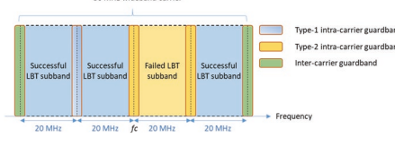 

 UE适应其接收器flter所需的接收- 承运人警卫PRB。 在插槽的顺序上，这样的延迟可能很小。 因为网络在CCA之前无法提前知道，它将能够在PDCCH中发送下行链路控制信息的哪个载体PRB，因此NRU允许GNB混淆UE可以在多个LBT带宽（RB集）上监视PDCCH（RB集） ，，，，
 同时每个食用细胞都与最多三个核心在一起。 每个插槽和每个使用单元的受监视PDCCH候选者的最大数量，非最大数量- 每个插槽和每个使用单元的重叠CCE，从释放中没有变化- 15. NR支持的宽带操作模式- u发行- 下面总结了15个。

 下行链路：
-  模式1：LBT在所有LBT中都成功时单宽带运营
 子- 乐队
-  模式2：LBT在LBT子的子集中成功的单个宽带载体操作- 连续的乐队
-  模式3：LBT在LBT子的子集中成功时单宽带载体操作- 频段是无连续的上行链路：
-  仅当CCA在计划的Pusch的所有LBT带宽中取得成功时，UE才会传输Pusch，其中所有LBT sub- 计划的UL传输中的频段是连续的。 对用于初始访问的信号和渠道的传输的某些修改以及用于处理设备无法定期传输此类信号的情况是必要的 CCA期间的能量检测阈值（EDT）。 在SS/中引入了发现爆发
 PBCH块可以在周期性窗口中在几个候选时间传输。 由于SSB的传输符号不再相对于帧周期进行了FX，因此SSB的QCL关系也必须重新定义，以及使用SSB插槽中的PDSCH映射的规则。

 对于NR- U，SS/PBCH块支持15 kHz（scell和spcell）或30 kHz SCS（PCELL和SCELL），并且必须在初始BWP中使用相同的子载波间距。 为了增加传输SS/PBCH块及其相关的RMSI PDCCH/PDSCH，SS/PBCH块和核心多路复用模式的机会，可以在同一插槽中传输它们（即基于公共通道感应）。 假设60 kHz SCS，同步栅格在一个20 MHz通道栅格中是独一无二的，并且位于20 MHz通道栅格的边缘附近，则可以使RES更可用于传输RMSI PDSCH，假设资源分配类型1。

 对于初始访问期间的上行链路，两个新的Zadoff- 与释放相比- 15 Prach。 新的Prach序列的长度为1151，其长度为15 kHz SC，长度为571，其长度为30 kHz SC。 序列映射在频率上是连续的，即没有交织。 SIB1信号指示尝试初始访问的UE应使用哪个prach前序长度。 其他prach序列参数如发行中所示- 15.占用很大比例的通道带宽是在无执照频谱中运行的设备的要求，以便其他设备正确检测其能量。 这称为占用的通道带宽（OCB）要求。 随机访问响应（RAR）接收窗口的扩展最多为40毫秒，这为RAR传输提供了更多机会，因为某些尝试可能由于LBT而失败。 他们俩- 发行中规定的步骤RACH程序- 16对于NR也可以在无载频谱中使用，而四个- 对于无执照的频谱操作，还支持步骤RACH过程。 为了应对初始访问期间的CCA失败，如果由于LBT故障而没有传输前序，则序列传输计数器不会增加。 如果由于LBT故障而未传输序言，则功率升级计数器不会增加。 CCA成功的消息1的实际传输用于启动RAR窗口。

 出于同样的原因，在满足最大功率频谱密度要求的同时确保最小占用的频道带宽，在发行中引入了Pusch和Pucch的新映射- 16，新的映射跟随PRB交叉点。 这样可以确保这些通道在20 MHz通道带宽上几乎均匀地传输，而无需占用所有子载波，从而最大化信号在被占用的子载体上的功率。 对于具有1 kHz SC的PUSCH，每个第十个PRB都有十个车间。 对于30 kHz SC，使用每个FFTH PRB都有FVE中的空间。 对于60 kHz SCS，对于20 MHz的频道带宽，不需要为任何交叉路口进行防御。

 在20 MHz带宽中，交叉路口中的PRB数为10或11（例如，106个具有15 kHz SCS的PRB）。 非- 上行链路上的交错传输仍然可以为UE融为一体，在这种情况下，资源分配需要确保满足OCB要求。 如果UE与宽带载体混合在一起，即带宽为20 MHz，则Pusch资源分配可能跨度超过20 MHz。 PUSCH资源分配的PRB是从分配的交通道，分配的RB集的PRB和Intra中的PRB的交叉点获得的- 载体护罩带（在与连续LBT带宽相对应的RB之间）。 对于15 kHz SCS，通过资源指标值（RIV）分配了交通点。 对于30 kHz SCS，通过位图分配了交叉点。 连续和不连续的交叉口都可以分配给Pusch。

 对于带PRB的Pucch- 交错资源分配，PUCCH资源不超过对应于20 MHz载体（LBT带宽）的带宽。

 一个或两个完整的交界处用于一个PUCCH，具体取决于最大的最大代码率和UCI有效载荷尺寸。 PUCCH的DMR映射到分配的交叉点的PRB（S）。 由于PRB交织的开销较大，因此为某些PUCCH格式定义了UE多路复用的增加。 对于增强的Pucch格式0和Pucch格式1，释放- 在间隔的每个PRB中重复15个Pucch序列，每个交叉点为10或11个PRB。 PRB- 为了减少重复序列映射的立方度量，添加了指定循环术语。 对于增强的PUCCH格式2，可以将一个或两个交通设置混合在一起，并且在使用一个交叉口时可以使用UE多路复用。 每个交叉路口的PRB数量为10或11。UE多路复用是通过传播因子2和4的频域中正交盖码（OCC）实现的。PRB- 指定OCCS用于减少从OCC扩展的重复调制符号的立方度量。 对于增强的PUCCH格式3，可以将一个或两个交通设置混在一起，并且在使用一个交叉口时可以使用UE多路复用。 每个交叉路口的PRB数为10或20。- DFT预编码器OCC与扩散因子2和4一起用于用一个交叉座进行多重多路复用。 OCCS是DFT序列，并导致UES的FDM（例如，梳子，- 2或梳子- 4在交通中）。

 与发行版的许可操作相比- 15，引入了增强功能，以更好地应对由于LBT而导致的传输。 特别是，DCI格式2_0中COT的信号有助于UE确定预计在DL上存在哪些信号，例如CSI- 用于下行链路通道测量的RS。 对COT持续时间的了解也用于防止一种机制，以更改UE改变其用于监视DL控制（PDCCH）的周期性，并在GNB中进行更频繁的监视- 为了实现UE功率节省，启动COT和较不频繁的监视。 这是通过搜索空间集组切换来实现的，其中UE在两个鸡冠之间进行切换（两组搜索空间），其中两个浓度与不同的PDCCH监视周期相关联。 GNB可以以DCI格式2_0明确发出搜索空间集之间的切换，也可以根据计时器的到期或DCI检测（除DCI格式2_0除外）被UE隐式派生。

 与发布相比，SRS可用的OFDM符号的数量增加了- 15，SRS OFDM符号启动位置在0、1，...，13之间是可以固定的。对于上行链路上的传输，也有可能引入多个连续连续的Pusch Transmissions使用单个PDCCH进行单个UL的可能性 DCI。 这避免了必须传输多个PDCCH，这反过来避免了必须多次执行LBT。 LTE指定了类似的功能- LAA发行- 14.对于Pusch浓厚的赠款，类似的机制允许在每个插槽内连续的多个pusch粘合而没有间隙。 为了增加无执照频谱上上行链路传输的机会，这些规格还引入了将UCI携带在CG上的可能性- pusch。 为了避免有效浓汤的分配插槽之间的差距，可以使用多个活跃的浓汤。

 在发行中引入了网络对上行链路接收的确认- 16用于无载的NR（与LTE一样- LAA），网络传输CG- DFI（下行链路反馈信息）以DCI格式为0_1的UE，CRC由CS炒- rnti。 仅当UE与CG类型1和激活的CG类型2混合时，此DFI才存在。
 DCI格式的内容。 A 16- 位图允许报告所有UL HARQ过程，包括浓厚的赠款和动态赠款。 DFI中还包括一个TPC命令，以及载体指示器（CIF）。 有效的HARQ信息仅适用于网络在先前的插槽中收到的PUSCH传输，该网络能够处理PUSCH。 只有结核病- DFI报告了基于HARQ。

 上行链路控制信息（UCI）也可以在CG Pusch上传输。 UCI有效载荷映射到Frst non- DM- 优先级最高的RS符号（在HARQ之前- ACK钻头（如果有）。 UCI可以包含COT共享信息，以允许在同一COT中进行CG Pusch Transmissions之后的下行链路传输，在同一COT中，网络在DL传输之前只需要执行2型LBT。 为此，UE使用UCI通知网络有关潜在DL传输的开始时间，以及UE在CO中剩余的时间。 如果网络未向UE提供其上行链路传输的能量检测阈值，则下行链路传输将不包括使用用户平面数据的任何单次传输，其持续时间应小于2、4或8个符号15，15， 分别为30和60 kHz子载波间距。 如果网络为UE提供了能量检测阈值，则UE提供了组合
 {offset，持续时间，capc}在uci中，用于GNB的gnb假设，即通道访问优先类（CAPC）和从插槽末端的启动插槽偏移量- 检测到UCI，对于GNB下行链路传输，在该插槽上允许使用用户平面数据，该插槽不超过指示的持续时间。

 共享频谱中的操作还意味着，如果UE无法访问由于LBT故障而安排的资源上的频道，则无法按照GNB计划获得成功或失败的下行链路传输块的承认。 引入了对HARQ反馈的增强，以允许网络请求UE再次报告HARQ- ACK
 由于UE处的LBT失败或GNB的检测失败，未收到的反馈未收到。 引入了另一个增强功能，以允许延迟HARQ反馈的调度。 在网络为一个或多个用户安排多个下行链路PDSCH接收的典型情况下，该网络可能会尽力在同一COT中安排Pucch Resources，以获取HARQ反馈（例如，在COT的最后一个插槽中） 可以通过共享GNB收购的COT来报告HARQ。 这可以最大程度地减少上行链路传输的LBT失败的可能性，因为如果网络仅确保下行链路和上行链路分配之间的较小差距，则只需短LBT。 但是，安排在COT末端附近的PDSCH并没有留出足够的时间让UE在COT结束之前处理HARQ信息。 对于此类PDSCH，UE没有提供报告HARQ的时间
 信息。 取而代之的是，可以为UE提供一个索引（PDSCH组号），稍后可以由网络使用该索引，以要求对所有具有相同组索引的PDSCH请求HARQ反馈，包括UE为FRST报告HARQ的PDSCH 可以要求UE再次报告HARQ反馈的时间。 网络请求HARQ的可能性
 还为UE融合了UE的所有HARQ流程的反馈也被引入了NR操作，以无执照的频谱进行NR操作，其中UE在单个变速箱中提供了所有HARQ bort for harq typer 3通过构建3类型的HARQ位端 哈克- ACK Codebook。 如果网络方面的UE缺少大量的HARQ确认，这可能会很有用。

##  3.6 ** 在NR中定位** 

 发布- 16除了针对发行版中指定的定位的基本支持外，还基于NR空气界面引入了对NR定位的支持- 15.发行- 15，大鼠- 独立和e- Utra Rat- 依赖定位方案由5G之间的LPP消息传输支持- CN和UE通过GNB，并通过LPPA运输- 在5G之间输入消息- CN和NG- 跑步e- UTRA（ENB），以及对位置的测量差距和空闲周期的支持- 相关间- 大鼠测量。 唯一的NR- 在发行中支持的基于基于的定位技术- 15是通过网络- 基于NR CID和细胞部分定位，包括对5G的消息的排列和运输- CN和NG- 运行托管NR（GNB）。 因此，发行时不支持许多常规定位方案。- 15.定位依赖于一个或多个传输点（TRP）传递或接收的信号的测量值，其中TRP由许多共处的天线组成。 然后，这些测量值用于计算数量，例如到达时间差（TDOA），圆形- 行程时间（RTT），到达角度（AOA）或出发角度（AOD），它们被馈入算法中，这些算法根据位置服务器中TRP的位置的知识计算设备的绝对位置。 在3GPP中指定技术，以确保网络中位置数据的隐私。

 在发行中- 16，将增强功能带到空气界面，以支持常规定位技术（E- CID，DL- TDOA，UL- TDOA），以及新的，更高级的NR- 指定定位技术（DL- AOD，UL- AOA，多- 细胞RTT）。 角度- 基于定位（DL- AOD，UL- AOA）和多- RTT是网络同步定时误差的强大技术，并且不受LTE定位的支持。 这些技术在技术报告中进行了研究和记录[93]。

 对定位的支持不仅是出于监管目的，而且是针对诸如工业环境中定位之类的垂直应用的。 3GPP DEF改进了用于评估工厂定位技术的通道模型。 服务- 定位的水平要求在
 [TS 22.261]。 尽管并非所有这些目标都符合释放- 16，设定某些目标释放- 16：
 表3.31总结了水平和垂直定位服务水平的性能要求。 对于监管用例，以下要求被视为NR定位的最低性能目标：
-  80％UES的水平定位误差≤50m
-  80％UES的垂直定位误差<5 m- 结尾- 到- 结束潜伏期和TTFF <30 s作为商业用例的起点，以下要求被视为鼠的性能目标- 依赖解决方案：- 在室内部署方案中，80％UE的水平定位误差<3 m- 在室内部署方案中，垂直定位误差<3 m，用于80％的UE- 室外部署方案中的80％UE的水平定位误差<10 m
-  在室外部署方案中，垂直定位误差<3 m，用于80％的UE- 结尾- 到- NR中的最终潜伏期<1 s的定位支持与4G中的结构没有不同。 该网络根据位置服务器的请求启用定位功能，然后UE进行各种测量结果，并将测量结果报告给其服务基站，该测量基站将这些测量值转发到定位服务器。 它是计算UE位置并将位置发送到应用程序层的定位服务器。

 表3.32提供了各种定位方法和测量的映射。 为支持各种定位技术的支持进行了许多基本测量，某些测量值与一种或多种技术相关。 下行链路定位参考信号（DL PRS）需要在时间和频率上足够致密，尽管不一定是通过网络传输的，可用于测量DL RSTD（sub- 两个TRP之间的框架正时差），PR- RSRP，UE RX- TX时间差（sub- 框架正时差异和TX计时之间的框架时间差，其中Rx时间基于DL- PRS和TX时间基于SRS定位）和GNB RX- TX时间差（sub- RX时序和TX时序之间的框架正时差，其中Rx时间基于SRS用于定位，而TX时间基于DL PR，然后可以与DL一起使用- TDOA，DL- AOD，多- RTT定位技术。 定位SR可用于测量UE RX- TX时差，GNB
 Rx- TX时差，UL RTOA（接收到参考时间的到达时间），UL SRS- RSRP和UL AOA，然后可以与UL TDOA一起使用，

| 表3.31| 释放5G的性能要求- 16定位服务[94]定位服务延迟|||||
|-------------------------------|-----------------------------------------------------------------------------------------------------|----------|--------------|-------|-------|
| 1| A| 10 m| 3 m| 95％| 1 s|
| 2| A| 3 m| 3 m| 99％| 1 s|
| 3| A| 1 m| 2 m| 99％| 1 s|
| 4| A| 1 m| 2 m| 99.9％| 15 ms|
| 5| A| 0.3 m| 2 m| 99％| 1 s|
| 6| A| 0.3 m| 2 m| 99.9％| 10毫秒|
| 7| r| 0.2 m| 0.2 m| 99％| 1 s|
| 绝对（a）或相对（r）| 水平的| 垂直的||||
| 定位| 准确性| 准确性| 可用性|||
| 定位服务水平||||||

| 表3.32| 各种定位方法所需的测量||||
|------------------|---------------------------------------------------------|-------------------|----------|-------------|
| 定位| 测量| 测量| 地点||
| 方法| 信号| 测量类型| 实体| 计算|
| DL- AOD| DL PR| DL PR- RSRP| UE| LMF，UE|
| DL- TDOA| DL PR| DL RSTD，PRS- RSPP| UE| LMF，UE|
| Ul- TDOA| SRS| UL RTOA| trp| LMF|
| Ul- aoa| SRS| Ul aoa| trp| LMF|
| 多- RTT| PR，定位SRS| UE- rxtxtimediff，| ue，trp| LMF|
| GNB- rxtxtimediff|||||

 Ul- AOA，多- RTT和E- CID定位技术。 发布- 15 SR也可以用于其中一些测量值，但不允许达到足够的精度来测量UE RX- TX时差和GNB RX- 与新引入的定位SR相比，TX时差- 16.基于SSB或CSI的RSRP和RSRQ的其他测量- RS也可以通过E进行定位。- CID。

 DL PRS资源对应于光束，并为单个PRS天线端口进行Defnes。 DL PRS资源可融合以下参数：插槽中的FRST符号，符号数，FRST符号的梳子偏移，相对于DL PRS资源集的FRST插槽的插槽偏移和QCL源。 这些浓厚的融合了不同的时间- 提供各种交易的频率惊人的模式- 在PRS密度和开销之间折叠。 梳子值（2、4、6或12个子载波）DEVNES频域中两个PRS符号之间的间距。 DL PRS资源集是来自单个TRP的光束集合。 可以将单个PRS资源融合在一起，以在其周期性中重复自我，而在重复的符号之间有或没有差距。 DL PRS静音是由两种类型的混合物来定义的。 1型在PRS场合组（类似于LTE）的水平上的Defnes静音，而2型Depnes在重复水平上进行静音。 两种类型的静态都不是混合的。 如果UE不与测量差距融合在一起，则PRS仅在半度性中收到- 用于服务单元的静态浓厚的下行链路或可爱的符号。 争夺PRS符号的序列基于金序列，并且与CSI兼容- RS序列。 该网络为UE提供了与参考TRP相关的PRS测量值的接收时间参考。 还为同一单元的SSB或另一个DL PR提供了QCL拼写。

 SRS用于定位资源的SR被RRC每BWP融合在一起。 序列设计类似于ZC- 基于释放- 15平方米除外16- 位序列ID。 间- 插槽或内部- 不支持插槽频率跳跃。 定位的SR可以是周期性的，半度性的- 持久或上膜。 值2、4和8的传输梳子分别支持8、12和8的最大循环偏移。- 端口资源得到支持，每个设置最多16个资源，每BWP总计64个资源。 每个资源都有1、2、4、8和12个符号，只要SRS资源包含在一个插槽中，插槽中的启动符号即可。 指定了多个交错的资源映射组合，提供了各种交易- 在开销，密度和延迟之间折叠。 SRS开放- 指定向相邻TRP的循环功率控制，并具有与非ssb相关的路径损失参考- 将单元格或来自相邻TRP的PR提供。 同样，可以根据非非非sb的帮助信息设置用于SRS向相邻TRP的发射光束- 提供单元格或来自相邻TRP的PR。

 位置管理功能（LMF）根据UE和NG收集的位置测量值计算FNAL位置估计信息- 运行，还管理定位资源的协调和计划。 5G核心访问和移动性管理功能（AMF）管理所有类型的位置请求的目标UE定位。 NRPPA协议提供以下功能。 e- CID位置信息传输功能允许NG- 为E的目的提供节点以与LMF交换位置信息- CID定位。 OTDOA信息传输功能允许NG- 跑
 为了Otdoa定位目的，与LMF交换信息的节点。 一般错误情况功能的报告允许报告一般错误情况，哪个函数- 指定错误消息尚未对。 定位信息传输功能允许NG- 运行节点以与LMF交换定位信息以进行定位。 测量信息传输功能允许LMF与NG交换测量信息- 为定位目的运行节点。 TRP
 信息传输功能允许LMF获得TRP- 来自NG的相关信息- ran节点。

##  3.7 ** 节省动力** 

 发布- 16除了BWP适应和DRX机制外，还引入了减少NR的UE功耗的机制- 15.指定了连接模式的电源节省和空闲模式节省机制。 PDCCH- 基于WUS和休眠适应的指示，十字架- 插槽调度- 节省电力，并且- 为连接模式UE引入了BWP浓厚的最大MIMO层适应。 引入了RRM放松，以放宽闲置模式UES的RRM测量，以节省动力。

##  3.7.1 PDCCH- 基于唤醒的迹象- 向上信号和休眠适应

 连接- 模式UES，观察到，在没有DCI的插槽中盲目检测到PDCCH监控，可以消耗大部分UE功率
 通过受监视的PDCCH传输UE（PDCCH- 只有插槽）。

 发布- 16个节能引入的机制，以指示UE跳过PDCCH中PDCCH的监视- 只有插槽，因此可以减少UE功耗。

 唤醒- 向上指示位引入了动态指示UE，以跳过相关C的PDCCH的监视- DRX周期； 见图3.81。 唤醒- 向上指示位可以通过DCI格式携带，该格式在c的开始之前进行了监视- DRX循环如果浓厚的话。 如果值，则不得触发DRX周期的持续时间计时器 "0"  唤醒- 收到了指示位。 在这种情况下，UE不得在DRX期间监视DCI
 根据MAC规范循环。 如果值 "1"  唤醒- 收到了指示位，持续计时器应按照释放开始- 15 c- drx。

 网络可以利用唤醒- 提示指示UE在没有需要为UE安排的数据时跳过整个DRX周期。 比较释放的UE行为- 15 c- DRX机制和释放- 16唤醒- 提高指示机制，可以观察到，如果不需要为DRX周期安排数据，则可以跳过某些PDCCH监视。 这可以为Bursty贩运带来有吸引力的动力收益，并在C时增加节省的收益- DRX循环长度减小。

 为了唤醒- 向上指示位，新的DCI格式，DCI格式2_6，图3.82，作为组通用DCI引入，这是一个块- 明智的- 基于一个或多个UES的DCI。 DCI格式2_6中的每个块通过使用更高的层参数， *- 6，PS- 位置DCI2- 6和* scell- 组- 为了- 休眠- 外部- 积极的- 时间。 对于给定的UE，在UE融合的块中为以下feld进行了建议：- 1位唤醒- 向上指示位是由较高层参数 *ps确定的位位置- 位置DCI2- 6*。

-  0、1、2、3、4或5- 位弯曲的休眠指示表在唤醒后跟随- 提示一点。

 DCI格式2_6在DRX周期的持续时间之前根据浓度进行监测。 如图3.83所示，监视窗口是

 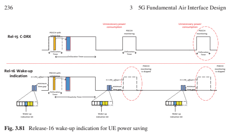 

  

 根据较高层参数 * ps_offset *和 "the minimum time gap"  由UE报告。 UE应在监视窗口内的第一个完整持续时间内在浓厚的搜索空间集上监视DCI格式2_6。

 当未在打开持续时间之前检测到DCI格式2_6时，UE可以粘合到唤醒- 向上或不唤醒- 根据较高层参数PS_WAKEUP。 如果在监视窗口内没有DCI格式2_6的可用PDCCH监视场合，则UE默认情况下应唤醒- 15 nr。

 除了唤醒- 提示，可以选择在DCI格式2_6中为UE提供休眠指示位。 休眠指示位用于

  

 同时指示休眠BWP和非肿块BWP之间的一组混合雪橇开关。 在休眠的BWP上，不需要UE监视雪橇或雪橇上的PDCCH，并且CSI测量/报告不得在休眠的BWP上受到影响。 如果许多雪橇切换到休眠的BWP，则UE可以节省电源。 例如，如果要在DRX周期上安排的数据量很大，则网络可以指示UE唤醒，并将史螺旋的主动BWPS设置为非固定BWPS。 但是，如果计划的数据很少，网络只能指示UE醒来c上- DRX循环，但分别将雪橇的活性BWP设置为雪橇上的相应休眠BWP。 通过这样做，可以根据网络指示在频域中进一步适应UE功耗。

##  3.7.2交叉- 插槽调度- 节省电力

 在发行中- 15 nr，可以将调度的时间域资源分配（TDRA）表与相同- 插槽调度； 也就是说，相应的K0在TDRA条目中为0。 在PDCCH候选者解码和解码的DCI解析之前，通过调度DCI进行的信息未知。 因此，如果存在TDRA条目- 插槽调度，UE需要始终在Active BWP中始终缓冲许多DL OFDM符号之后，在核心的最后一个符号之后； 见图3.84。 OFDM符号的缓冲导致UE功率的浪费，以防UE实际上没有安排在同一插槽中的PDSCH。

 因此，如果UE提前知道所有有效的可计划DL
 TDRA条目的K0值大于0，UE只能接收与PDCCH监视场合和核心相对应的OFDM符号。 在这种情况下，无需在活动BWP中具有潜在的宽带宽来缓冲其他DL OFDM符号。 此外，如果UL可计划DTRA条目只有十字架- 插槽调度，UE可以进一步放松PDCCH的处理时间轴以节省电源。

 考虑到上述节能的动机，在发行中引入了调度限制- 16应用时进行下行链路调度和上行链路调度。 下行链路调度偏移限制K0min被认为是下行链路调度的一个门槛。 当应用K0min时，UE不应期望具有小于施加的K0min的K0值的下行链路调度。 同样，上行链路调度偏移限制K2min也是应用上行链路调度的一个门槛。 UE不会期望获得小于应用K2min的K2值的上行链路调度。 应用的K0min和K2min可以将其设置为零，这意味着没有计划偏移限制。 DCI格式1_0或DCI格式1_1可以动态指示应用的K0min和K2min。 这可以使同一动态适应- 插槽调度和交叉- 插槽调度，允许网络使用相同- 数据调度调度的插槽调度并使用计划偏移限制在没有数据安排时节省UE功率。 对于下行链路BWP或上行链路BWP，可以通过较高层参数的最小参数或 * MiuminmenschedulingOffSetK2 *混合一两个候选值。 如果 *为活动的DL BWP融合了 * MiuminimumSchedulingOffSetK0 *，则为1- 位指示 "Minimum applicable scheduling offset indicator"  FELD由DCI格式1_1携带。 同样，如果 *最低限度schedulingoffsetk2 *是为活动ul bwp融合在一起的，则为1- 位指示 "Minimum applicable scheduling offset indicator"  FELD由DCI格式0_1携带。 UE
 适用最低计划偏移限制K0min "Minimum applicable scheduling offset indicator"  DCI格式1_1或DCI格式0_1如果有相同的长颈杆。 UE应用最小计划偏移限制K2min "Minimum applicable scheduling offset indicator" 

 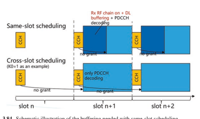 

| 表3.33| 最低适用的调度的联合指示偏移K0/k2最低适用于主动UL BWP的最低k2，如果将最低限度的ul bwp固定为ul bwp||
|----------------------------|----------------------------------------------------------------------------------------------------------------------------------------------------------------------------------------|--------------------------------------------------------------------------------------------------------------------------------|
| 0| 如果DL BWP为Active DL BWP，则由最小DL BWP的最小DL BWP最低k0的最低dl bwp的最小值K0的最低限度的FR值，如果DL BWP为DL BWP进行最小值dl bwp。||
| 位映射到索引| Active UL BWP的最小施加ulingoffsetk2浓厚的最高价值||
| 1| 如果第二个值融合在一起，则第二个值由最小值schedulingoffsetk0与活动dl bwp融为一体； 0否则| 如果第二个值融合在一起，则第二个值由Active UL BWP的最小值schedulingoffsetk2融合； 0否则|

 DCI格式0_1或DCI格式1_1如果有相同的长颈杆。 表3.33列出了指示值和所应用最小调度偏移之间的映射。

##  3.7.3 BWP- 基于MIMO适应

 在发行中- 15，在给定的UE上，每个单元格在每个单元格中最大的MIMO层数。 即使UE切换到具有较小带宽以节省功率的活动BWP，也不会更改MIMO层的最大数量，并且UE仍然需要使用相同数量的RF链进行接收。 发布- 16 NR节省的每BWP浓厚的MIMO层数量最大数量。 这允许网络与UE的BWP相结合以节省功率。 可以指示UE切换到BWP以节省电力，UE可以使用较小数量的RF链，该链等于BWP的较小数量的最大MIMO层。 考虑到在这种情况下可以关闭某些RF链，可以降低UE功率。

 当UE的数据到达时，网络可以使用BWP开关机制将UE切换到与大量最大MIMO层相处的BWP。 通过这样做，发布- 16支持低点之间的UE的动态适应- 力量- 消费bwp具有较少数量的RF链和具有高性能的BWP，以使用较大的RF链。

##  3.7.4 RRM放松

 当UE扎营在闲置/in- 主动模式，会消耗大量UE功率。 发布- 16省电引入了邻居细胞测量的RRM放松- 移动性UES和UES在细胞中心。 当UE满足指定标准时，可以增加测量周期以节省功率。 网络可以通过广播来融合RRM测量放松，并且可以独立地将以下触发标准（即UE位置或低移动性或两者兼而有之）：

-  基于电池中的UE位置（例如，细胞中心或细胞边缘）：服务单元格RSRP和/或RSRQ（网络结合）高于阈值。

-  基于低迁移率：在一个时期内，服务细胞RSRP测量的变化不超过相对阈值。

##  3.7.5 RRC发布请求和UE协助

 发布- 16引入了UE辅助信息，以允许UE推荐使用UE节能的首选浓汤。 "Power saving preference"  和"RRC 
Release Request" 可以包含在UE援助信息中。 节能偏好包括与UE功耗有关的以下信息：- 首选c- DRX浓汤- 较长的DRX周期，短DRX周期，DRX无效计时器，短DRX周期计时器
 （当前值范围内的任何值）
-  持续时间和DRX开始偏移没有DRX- 首选的最大嵌合雪橇数- 首选最大汇总带宽- 首选的最大MIMO层数- 可以在UE辅助信息中报告K0/K2值RRC发布请求，以发布以下信息发布RRC连接：

-  UE更喜欢没有状态偏好（即，IE *Outofconnected *）发布- UE更喜欢以明确的状态偏好（即，IE *idle *或IE *in Activive *）发布- UE更喜欢恢复较早的指示，以使RRC_Connected（即
 连接），西北可结合的
  在UE辅助信息中报告发布请求的触发条件应取决于UE实施，即UE期望在不久的将来不会发送或接收更多数据。 是否应使用旧式释放机制，是否应通过以及哪个声明UE过渡到网络。

##  3.8 ** 概括** 

 5G的基本空气界面设计- 本章中描述的NR给出了对NR物理层的框架理解。 对于NR而言，它需要满足教派规定的不同要求。 1.3。 此外，部署频谱的频率范围比LTE（6 GHz低于6 GHz）的频率范围要大得多，因此需要一些新的NR设计。 NR在命理，框架结构，物理通道，参考信号，波形，通道编码和MIMO方面的设计。 此外，因为C- 乐队将成为世界各地NR部署的典型范围，因此可以确定覆盖范围是NR要解决的关键问题。 为了解决此问题，简要介绍了DL/UL解耦方案（即LTE/NR Spectrum共享）。

 对于LTE，最初的设计是传输方案基于CRS
 总是在每个潜艇中- 框架，可以简化系统操作。 在LTE的演变过程中，由于需要向后兼容，总是- 在CRS上限制了系统设计的生效以及与新功能的兼容性。 当LTE根据DM进化为TM9- RS，CRS和CSI的共存- RS/DM- RS会影响由于开销而导致的系统性能。 从LTE上课，对于NR， *正向兼容性 *是需要的，这与LTE相比是一个很大的变化。 为了实现前进的兼容性，总是- 在CR上消除了。 但是，CRS的功能仍然必须实现，这些功能是通过一组NR参考信号（例如CSI）实现的- RS，DM- RS和PT- 卢比。

 从部署频谱的角度来看，NR跨越了较大的频率范围，其中包括对应于450-6000 MHz和24,500–52,600 MHz的FR1和FR2，并且支持了更宽的载流宽 *。 由于可用的较宽频谱，例如C- 乐队和MM- 波带，最大载体带宽扩展到FR1的100 MHz和FR2的400 MHz，这对于达到5G的峰值数据速率非常有帮助。 此外，支持子载波间距和环状PERFX的多个命理，以适应不同的频段和服务要求。 对一组NR频带进行了建议，并为每个频段给出了相应的子载波间距。

 尽管可用的频谱带宽对较高的频段含量丰富，但由于用户功率有限，尤其是对于UL而言，较高的传播损失限制了覆盖范围。 针对5G部署发布的新频谱主要高于3 GHz，因此NR的覆盖范围是一个严重的问题。 否则，成本将随着更多的基站而增加，以确保对运营商不希望的体验。 此外，由于基于基站站点越来越困难，因此有动机使用C使用C- 频段和LTE共裂，即它们具有相同的覆盖范围。 基于 * lte/nr频谱共享 *的UL/DL解耦可以实现目标，这是在LTE FDD频带中以UL资源作为补充UL载体，除了上面的TDD频段中的NR操作外 3 GHz。

 对于双工，FDD和TDD是两种常规的主要双链模式，分别用于配对频谱和未配对光谱，不能狂热地适应运输载荷的变化。 由于DL和UL贩运载荷之间的不平衡越来越严重，FDD中的对称DL/UL带宽导致UL频谱的利用无效。 尽管TDD可以与不同的DL/UL Sub混合- 框架，由于需要同步，浓汤是半的- 静态且相对较慢。 为了解决这个问题，NR中还引入了FDD和TDD外， *可爱的双工 *，它使频谱利用能够适应运输量。 由于双链的双链体，NR有一个非常可爱的框架结构，并且一个插槽中的每个符号原则上都可以作为下行链路或上行链路传输，从而将一个插槽中的每个符号原则上的框架结合在一起。

 关于NR新的物理层技术，CP- OFDM波形被选择为下行链路和上行链路的基本波形。 DFT- 为了覆盖范围，OFDM也支持上行链路，这仅适用于等级- 1传输。 给定CP- OFDM- 基于波形，频谱利用率改善为更大或等于90％，这取决于频带和载波带宽。 NR的通道编码与LTE完全不同。 也就是说，LDPC和极地代码分别被选为数据通道和控制通道的编码方案。 DL和UL数据渠道的LDPC选择是由于解码潜伏期，复杂性和性能的优势，尤其是对于高数据速率。 极地代码显示用于控制通道的性能优势。 大量MIMO是NR的重要技术组成部分，可通过有效利用MU来提高频谱效率- MIMO。 DM- RS，干扰测量和代码手册是新设计的，以显示性能优势。 此外，支持梁管理的高度- 频率方案。 最后，NR被设计为具有一个独立的空气界面来容纳EMBB，URLLC和MMTC，这使一个载体能够支持具有不同要求的不同类型的服务。 对于MMTC，LPWA仍然基于NB- 物联网/EMTC，它在NR版本中没有触摸- 15和- 16.作为NB的行业- 物联网已经成熟，已经有很大的NB- 物联网/EMTC商业部署全球，行业趋势是通过不断发展的NB来保护现有投资- LPWA的IoT/EMTC，在NR中进行新的LPWA并不是迫切的。 对于NR，它可以解决一些与LPWA互补的新的MTC服务，例如视频监视和工业传感器。

 MIMO支持在发行时得到了增强- 16. II型代码簿的频域压缩用于进一步减少提供高的开销- 决议CSI。 上行链路的三种模式已满- 指定了基于密码的UL传输的电力传输：（a） *全能 *可以将任何TPMI用于ul full- 电力传输; （b） * fullPowerMode1 * gnb可以将UE融合在一起使用tpmis的子集，该子集将端口组合在一层中以产生完整- 电力传输; （c） * fullPowerMode2 * ue报告哪些TPMI可用于完整- GNB指示的功率传输。

 nr- 在发行版中添加了基于无牌的访问，定位和节能- 16增强5G的能力。 NR无执照的访问增加了通过主要指定频道访问机制（例如听），NR可以通过NR使用NR使用的频谱- 前- 与在物理层和MAC层上进行共享频谱访问和其他修改，这是符合法规和公平性所必需的，与其他无执照的频谱运行的设备。 定位增强现在可以支持常规定位技术（E- CID，DL- TDOA，UL- TDOA），以及新的，更高级的NR- 指定定位技术（DL- AOD，UL- AOA，多- 细胞RTT）。 角度- 基于定位（DL- AOD，UL- AOA）和多- RTT是网络同步定时误差的强大技术，并且不受LTE定位的支持。 两者都连接- 模式节省和闲置- 指定了模式节省机制，以增强BWP的适应和DRX节能机制- 15。

 现在应该清楚的是，5G中有显着的物理层变化，因此它可以满足我们在Chap中讨论的各种要求。 1.由于本章中讨论的新引入的物理层技术，物理层过程和RAN协议具有一些更改，接下来将在某些详细信息中进行描述。

##  参考

1.  3GPP， "TS 38.104, Base Station (BS) radio transmission and reception (Release 15)," 
 2018年12月。[在线]。 可用：https：//portal.3gpp.org/desktopmodules/specifcations/pecifcationdetails.aspx？pecifcationID = 3202。

2.  IMT- 2020（5G）pg， "5G vision and requirement white paper,"  2014年5月。[在线]。 可用的：
 在http：//www.imt上- 2020.cn/zh/documents/download/1。

3.  3GPP， "TR 38.901: Study on channel model for frequencies from 0.5 to 100 GHz (Release 15),"  2018年6月。[在线]。 可用：https：//portal.3gpp.org/desktopmodules/specifcations/pecifcationdetails.aspx？spegifcationID = 3173。

4.  3GPP， "TS 38.331: NR, Radio Resource Control (RRC) protocol specifcation (Release 15)," 
 2018年9月。[在线]。 可用：https：//portal.3gpp.org/desktopmodules/specifcations/pecifcationdetails.aspx？pecifcationID = 3197。

5.  3GPP， "TS 38.213: NR, Physical Layer Procedures for Control (Release 15),"  2018年9月。[在线]。 可用：https：//portal.3gpp.org/desktopmodules/specifcations/pecifcationdetails.aspx？spegifcationID = 3215。

6.  3GPP， "TS 38.212: NR, Multiplexing and Channel Coding (Release 15),"  2018年9月。[在线]。 可用：https：//portal.3gpp.org/desktopmodules/specifcations/pecifcationdetails.aspx？pecifcationID = 3214。

7.  3GPP， "TS 38.211: NR, Physical Channels and Modulation (Release 15),"  2018年9月。[在线]。 可用：https：//portal.3gpp.org/desktopmodules/specifcations/pecifcationdetails.aspx？pecifcationID = 3213。

8.  3GPP， "TR 38.913 Study on scenarios and requirements for next generation access technologies,"  2017年6月。[在线]。 可用：https：//portal.3gpp.org/desktopmodules/specifcations/
 specifcationDetails.aspx？spemifcationID = 2996。

9.  3GPP， "TS 36.213: Evolved Universal Terrestrial Radio Access (E-UTRA); Physical Layer Procedures (Release 15),"  2008年6月。[在线]。 可用：https：//portal.3gpp.org/desktopmodules/specifcations/specifcationdetails.aspx?specifcationId = 2427。

10. 华为和Hisilicon，“ R1- 167224：参考信号设计原理和QCL
 NR的假设，" 3GPP TSG RAN WG1 Meeting \#86, August, 2016. [Online]. Available: https://www.3gpp.org/ftp/TSG_RAN/WG1_RL1/TSGR1_86/Docs.

11. J.  Liu, W.  Xiao and A.  C. K.  Soong,  " 小细胞的密集网络，"  in *(A.  Anpalagan,* 
M.  Bennis and R.  Vannithamby eds.), Design and Deployment of Small Cell Networks, Cambridge, Cambridge University Press, 2016, pp. 96-121.

12. 3GPP, " TS 38.214：NR，数据的物理层过程（版本15），“ 2018年9月。[在线]。

13. ntt docomo， "R4-1706982, WF on band specifc UE channel bandwidth,"  3GPP TSG- 跑
 WG4- NR会议\# 2，2017年6月，中国青岛。[在线]。 可用：https：//www.3gpp。 org/ftp/tsg_ran/wg4_radio/tsgr4_ahs/tsgr4_nr_jun2017/docs/。

14. GSA， "The future development of IMT in 3300-4200  MHz band,"  2017年6月。[在线]。

 可用：https：//gsacom.com/paper/future- IMT- 3300- 4200- MHz- 频率- 范围/。

15. TD行业联盟， "TD-LTE Industry White Paper,"  2013年1月。

16. 欧洲通讯局， "ECC Report 281: Analysis of the suitability of the regulatory technical conditions for 5G MFCN operation in the 3400–3800 MHz band,"  2018年7月。

 [在线的]。 可用：https：//www.ecodocdb.dk/document/3360。

17. ofcom， "Award of the 2.3 and 3.4GHz spectrum bands, Competition issues and auction regulations,"  2017年7月11日。[在线]。 可用：https：//www.ofcom.org.uk/__data/assets/pdf_
 FLE/0022/103819/声明- 奖- 的- 这- 2.3- 和- 3.4- GHz- 光谱- 乐队- 竞争- 和- 拍卖- 法规。

18. ofcom， "Award of the 2.3 and 3.4GHz spectrum bands, Information Memorandum,"  2017年7月11日。[在线]。 可用：https：//www.ofcom.org.uk/spectrum/spectrum- 管理/频谱- 奖项/奖项- 存档/2- 3- 和- 3- 4- GHz- 拍卖。

19. 伊图- r， "Report M.2370: IMT Traffc estimates for the years 2020 to 2030,"  2015年7月。

 [在线的]。 可用：https：//www.itu.int/pub/r- 代表- M.2370。

20. L. Wan，M。Zhou和R. Wen， "Evolving LTE with Flexible Duplex,"  在2013年12月，在 * IEEE Globecom *研讨会（GC WKSHP），美国佐治亚州亚特兰大。

21. E. Everett，M。Duarte和C. Dick等人， "Empowering Full-Duplex Wireless Communication by Exploiting Directional Diversity,"  在2011年，美国加利福尼亚州戴维斯市的ASILOMAR信号，系统和计算机（ASILOMAR）会议，2011年11月，美国加利福尼亚州。

22. J. Choi，M。Jain，K。Srinivasan，P。Levis和S. Katti， "Achieving single channel, full duplex wireless communication,"  在 *第16届年度国际会议上，美国伊利诺伊州芝加哥市的Mobile Computing *和网络（ACM Mobicom），2011年。

23. 卡特， "RP-121772: Further Enhancements to LTE TDD for DL-UL Interference Management and Traffc Adaptation,"  3GPP TSG运行\# 2012年12月58日。[在线]。 可用：https：// www.3gpp.org/ftp/tsg_ran/tsg_ran/tsgr_58/docs。

24. 3GPP， "TR 36.828: Further Enhancements to LTE Time Division Duplex(TDD) for Downlink-Uplink (DL-UL) Interference Management and Traffc Adaptation (Release 11),"  2012年6月。[在线]。 可用：https：//portal.3gpp.org/desktopmodules/specifcations/pecifcationdetails.aspx？spegifcationID = 2507。

25. K. Doppler，M。Rinne，C。Wijting和等。 "Device-to-device communication as an underlay to LTE-advanced networks,"  * IEEE Communications杂志，*卷。 47，不。 12，第42页- 49，2009年12月。

26. O. Sahin，O。Simeone和E. Erkip， "Interference channel with an out-of-band relay,"  IEEE
 信息理论交易，第1卷。 57，不。 5，第2746页- 2764，2011年5月。

27. 3GPP， "TS 38.101-1: NR, User Equipment radio transmission and reception; Part 1: Range 1 Standalone (Release 15),"  2018年6月。[在线]。 可用：https：//portal.3gpp.org/desktopmodules/specifcations/specifcationdetails.aspx?specifcationId = 3283。

28. 沃达丰， "RP-172788, Mandatory 4Rx antenna performance for NR UE,"  3GPP TSG
 运行\# 78，里斯本葡萄牙，2017年12月。[在线]。 可用：https：//www.3gpp.org/ftp/
 tsg_ran/tsg_ran/tsgr_78/docs。

29. 3GPP， "TS 38.101-2: NR, User Equipment radio transmission and reception; Part 2: Range 2 Standalone (Release 15),"  2018年6月。[在线]。 可用：https：//portal.3gpp.org/desktopmodules/specifcations/specifcationdetails.aspx?specifcationId = 3284。

30. 3GPP， "TR 36.872: Small cell enhancements for E-UTRA and E-UTRAN, Physical layer aspects (Release 12),"  2013年12月。[在线]。 可用：https：//portal.3gpp.org/desktopmodules/specifcations/specifcationdetails.aspx?specifcationId = 2573。

31. 3GPP， "TS 38.101-3: NR, User Equipment radio transmission and reception; Part 3: Range 1 and Range 2 Interworking operation with other ratios (Release 15),"  2018年6月。[在线]。 可用：https：//portal.3gpp.org/desktopmodules/specifcations/specifcationdetails.aspx？s pecifcationId = 3285。

32. 华为和Hisilicon，"RP-190714: Revised WID on Band combinations for SA NR 
Supplementary uplink (SUL), NSA NR SUL, NSA NR SUL with UL sharing from the UE perspective (ULSUP)," 3GPP TSG- 开会\# 83，2019年3月。[在线]。 可用：https：//
 www.3gpp.org/ftp/tsg_ran/tsg_ran/tsgr_83/docs。

33. 3GPP，"TS 36.101: Evolved Universal Terrestrial Radio Access (E-UTRA); User Equipment 
(UE) radio transmission and reception (Release 15)," 2018年9月。[在线]。 可用：https：//portal.3gpp.org/desktopmodules/specifcations/specifcationdetails.aspx?specifcati onid = 2411。

34. Q. Wang，Z。Zhao，Y。Guo，X。Gong，M。Schubert，M。Schellmann和W. Xu， "Enhancing OFDM by Pulse Shaping for Self-Contained TDD Transmission in 5G,"  在 * IEEE 83rd *车辆技术会议（VTC Spring），中国南京，2016年。

35. 华为和Hisilicon， "R1-1709980: Subcarrier mapping for LTE-NR coexistence,"  3GPP
 TSG RAN WG1 NR AH会议，2017年6月。[在线]。 可用：https：//www.3gpp.org/ftp/ tsg_ran/wg1_rl1/tsgr1_ah/nr_ah_1706/docs/。

36. 3GPP， "TS 38.133: NR, Requirements for support of radio resource management (Release 15)," 
 2018年9月。[在线]。 可用：https：//portal.3gpp.org/desktopmodules/specifcations/
 specifcationDetails.aspx？spemifcationID = 3204。

37. 3GPP， "TS 36.300: Evolved Universal Terrestrial Radio Access (E-UTRA) and Evolved Universal Terrestrial Radio Access Network (E-UTRAN); Overall description; Stage 2 (Release 15),"  2007年6月。[在线]。 可用：https：//portal.3gpp.org/desktopmodules/ specifcations/pecifcationdetails.aspx？pecifcationId = 2430。

38. 3GPP， "TS 38.321: NR, Medium Access Control (MAC) protocol specifcation (Release 15)," 
 2018年12月。[在线]。 可用：https：//portal.3gpp.org/desktopmodules/specifcations/pecifcationdetails.aspx？pecifcationID = 3194。

39. 3GPP， "TS 36.331: Radio Resource Control (RRC) Protocol Specifcation (Release 8)," 
 2009年9月。[在线]。 可用：https：//portal.3gpp.org/desktopmodules/specifcations/pecifcationdetails.aspx？spegifcationID = 2440。

40. M. D. Balariere，J。F。Kepler，T。P。Krauss和等。 "An Experimental OFDM System for Broadband Mobile Communications,"  在 *IEEE第54届车辆技术会议上 *，
 2001年10月，美国新泽西州大西洋城。

41. 3GPP，"TR 25.892: Feasibility Study for Orthogonal Frequency Division Multiplexing (OFDM) 
for UTRAN Enhancement (Release 6)," 2004年6月。[在线]。 可用：https：//portal.3gpp。 org/desktopModules/specifcations/specifcationDetails.aspx？spemifcationID = 1325。

42. 摩托罗拉， "RP-000032: Work item description sheet for High Speed Downlink Packet," 
 3GPP TSG开会\# 2000年3月7日。[在线]。 可用：https：//www.3gpp.org/ftp/ tsg_ran/tsg_ran/tsgr_07/docs/zips。

43. 摩托罗拉， "RP-0000126: Details of high speed downlink packet access,"  3GPP TSG运行
 会议 \# 2000年3月7日。[在线]。 可用：https：//www.3gpp.org/ftp/tsg_ran/ tsg_ran/tsgr_07/docs/zips。

44. 3GPP，"TR 25.814, Physical layer aspects for evolved Universal Terrestrial Radio Access 
(UTRA) (Release 7)," 2006年9月。[在线]。 可用：https：//portal.3gpp.org/desktopmodules/specifcations/specifcationdetails.aspx?specifcationId = 1247。

45. 3GPP MCC， "R1-063013: Approved minutes of 3GPP TSG RAN WG1 \#46 Tallinn (Tallinn, Estonia, 28th August - 1st September, 2006),"  3GPP TSG运行WG1 \# 46BIS，2006年10月。[在线]。 可用：https：//www.3gpp.org/ftp/tsg_ran/wg1_rl1/tsgr1_46bis/docs。

46. 3GPP MCC， "R1-061099: Approved Report of 3GPP TSG RAN WG1 \#44 meeting (Denver, Colorado, USA, 13th to 17th February, 2006),"  3GPP TSG运行WG1 \# 44Bis，2006年3月。[在线]。 可用：https：//www.3gpp.org/ftp/tsg_ran/wg1_rl1/tsgr1_44bis/docs。

47. 3GPP MCC， "R1-070633: Approved Report of 3GPP TSG RAN WG1 \#47(Riga, Latvia, 06-10 November, 2006),"  3GPP TSG运行WG1 \# 47Bis，2006年1月。[在线]。 可用：https：//www.3gpp.org/ftp/tsg_ran/wg1_rl1/tsgr1_47bis/docs。

48. 摩托罗拉， "R1-060385: Cubic metric in 3GPP-LTE,"  3GPP TSG- 运行WG1会议\# 44，美国丹佛，美国，2006年2月。[在线]。 可用：https：//www.3gpp.org/ftp/tsg_ran/ wg1_rl1/tsgr1_44/docs。

49. 3GPP，"TS 38.101-4: NR; User Equipment (UE) radio transmission and reception; Part 4: 
Performance requirements V15.7.0," 2020年10月。[在线]。 可用：https：//portal.3gpp。 org/desktopModules/specifcations/specifcationDetails.aspx？specifcationID = 3366。

50. 华为，Hisilicon等人， "R1-167963: Way forward on waveform,"  3GPP TSG运行WG1
 \ \# 86，2016年8月。[在线]。 可用：https：//www.3gpp.org/ftp/tsg_ran/wg1_rl1/ tsgr1_86/docs。

51. 3GPP MCC， "R1-1608562: Final Report of 3GPP TSG RAN WG1\#86 (Gothenburg, Sweden, 22nd-26th August 2016),"  3GPP TSG运行WG1 \# 86BIS，2016年9月。[在线]。 可用：https：//www.3gpp.org/ftp/tsg_ran/wg1_rl1/tsgr1_86b/docs。

52. 3GPP TSG- 运行WG1， "R1-1715184: LS response on spectrum utilization,"  3GPP TSG
 运行WG1 \# 90，2017年8月。[在线]。 可用：https：//www.3gpp.org/ftp/tsg_ran/ wg1_rl1/tsgr1_90/docs。

53. 三星等人 "R4-1709075: Way forward on spectrum utilization,"  3GPP TSG运行WG4
 \ \# 84，2017年8月。[在线]。 可用：https：//www.3gpp.org/ftp/tsg_ran/wg4_radio/
 tsgr4_84/docs。

54. 高通等人， "R1-1610485: WF on Waveform for NR Uplink,"  3GPP TSG运行WG1
 \ \# 86BIS，2016年10月。[在线]。 可用：https：//www.3gpp.org/ftp/tsg_ran/wg1_rl1/ tsgr1_86b/docs。

55. 3GPP MCC， "R1-1611081: Final Report of 3GPP TSG RAN WG1\#86bis (Lisbon, Portugal, 10th-14th October 2016),"  3GPP TSG运行WG1 \# 87，2016年11月。[在线]。 可用：https：//www.3gpp.org/ftp/tsg_ran/wg1_rl1/tsgr1_87/docs。

56. Iith等人， "R1-1701482: WF on pi/2 BPSK Modulation with frequency domain shaping,"  3GPP TSG RAN WG1 AH_NR会议，2017年1月。[在线]。 可用：https：//
 www.3gpp.org/ftp/tsg_ran/wg1_rl1/tsgr1_ah/nr_ah_1701/docs。

57. 3GPP MCC，“ R1- 1701553：3GPP TSG RAN WG1 \的最终报告# AH1_NR（美国斯波坎，
 16日- 2017年1月10日），" 3GPP TSG RAN WG1 \#88, February, 2017. [Online]. Available: https://www.3gpp.org/ftp/TSG_RAN/WG1_RL1/TSGR1_88/Docs.

58. 3GPP TSG-RAN WG1,  " R1- 1715312：ls在pi/2 bpsk上的进一步考虑，频谱形状，"  3GPP TSG RAN WG1 \#90, August, 2017. [Online]. Available: https:// www.3gpp.org/ftp/TSG_RAN/WG1_RL1/TSGR1_90/Docs.

59. 3GPP MCC, " R1- 1716941：3GPP TSG RAN WG1 \的最终报告# 90（布拉格，捷克共和国，21日- 2017年8月25日），“ 3GPP TSG RAN WG1 \# 90BIS，2017年9月。[在线]。 可用：https：//www.3gpp.org/ftp/tsg_ran/wg1_rl1/tsgr1_90b/docs。

60. R. G. Gallager， "Low-Density Parity-Check Codes,"  博士 1960年9月，马萨诸塞州理工学院论文。

61. S. Sesia，I。Toufk和M. Baker（eds），LTE：UMTS长期进化，纽约州纽约州：John Wiley and Sons Publishing，2011年。

62. H. Park和S. Lee， "The hardware design of LDPC decoder in IEEE 802.11n/ac,"  在2014年第六届电子，计算机和人工智能国际会议上，罗马尼亚布加勒斯特，2014年10月。

63. E. Arikan， "Channel Polarization: A Method for Constructing Capacity-Achieving Codes for Symmetric Binary-Input Memoryless Channels,"  *信息理论的IEEE交易，*卷。 55，不。 7，第3051页- 3073，2009年7月。

64. 高通， "R1-1801271: Polar Coding,"  3GPP TSG RAN WG1会议\# AH1801，2018年1月。[在线]。 可用：https：//www.3gpp.org/ftp/tsg_ran/wg1_rl1/tsgr1_ah/ nr_ah_1801/docs。

65. 爱立信， "RP-181870: Summary for WI Shortened TTI and processing time for LTE,"  3GPP
 TSG开会\# 81，2018年9月。[在线]。 可用：https：//www.3gpp.org/ftp/ tsg_ran/tsg_ran/tsgr_81/docs。

66. 爱立信， "RP-181869: Summary for WI Ultra Reliable Low Latency Communication for LTE,"  3GPP TSG开会\# 81，2018年9月。[在线]。 可用：https：//www.3gpp。 org/ftp/tsg_ran/tsg_ran/tsgr_81/docs。

67. 摩托罗拉， "R1-050246: Downlink Multiple Access for EUTRA,"  3GPP TSG RAN1 \# 40Bis，2005年4月。[在线]。 可用：https：//www.3gpp.org/ftp/tsg_ran/wg1_rl1/ tsgr1_40bis/docs。

68. 3GPP， "TR 22.804: Study on Communication for Automation in Vertical Domains (Release 16),"  2018年12月。[在线]。 可用：https：//portal.3gpp.org/desktopmodules/ specifcations/pecifcationdetails.aspx？spegifcationId = 3187。

69. 3GPP， "TS 22.186: Service requirements for enhanced V2X scenarios (Release 16)," 
 2018年12月。[在线]。 可用：https：//portal.3gpp.org/desktopmodules/specifcations/pecifcationdetails.aspx？pecifcationID = 3180。

70. 3GPP， "TR 38.824: Study on physical layer enhancements for NR ultra-reliable and low latency case (URLLC) (Release 16),"  2018年11月。[在线]。 可用：https：//portal.3gpp.org/ desktopmodules/specifcations/specifcationDetails.aspx？spemifcationId = 3498。

71. 3GPP， "TR 38.825: Study on NR Industrial Internet of Things (IoT) (Release 16)," 
 2018年11月。[在线]。 可用：https：//portal.3gpp.org/desktopmodules/specifcations/
 specifcationDetails.aspx？spemifcationID = 3492。

72. GSMA， "3GPP LOW POWER WIDE AREA TECHNOLOGIES White Paper,"  2016年10月7日。[在线]。 可用：https：//www.gsma.com/iot/ Resources/3GPP- 低的- 力量- 宽的- 区域- 技术- 白色的- 纸/。

73. GSA， "NB-IoT and LTE-M: Global Market Status,"  2018年8月。[在线]。 可用：https：//
 gsacom.com/paper/nb- 物联网- LTE- m- 全球的- 市场- 地位/。

74. Vodafone Group plc。， "GP-140421: New Study Item on Cellular System Support for Ultra Low Complexity and Low Throughput Internet of Things,"  3GPP TSG GERAN会议\# 62，2014年5月。[在线]。 可用：https：//www.3gpp.org/ftp/tsg_geran/tsg_geran/ geran_62_valencia/docs/。

75. 华为和Hisilicon， "GP-140322: Discussion on MTC Evolution for Cellular IoT,"  3GPP
 TSG Geran会议\# 2014年5月62日。[在线]。 可用：https：//www.3gpp.org/ftp/ tsg_geran/tsg_geran/geran_62_valencia/docs/。

76. 爱立信， "GP-140297: GSM/EDGE optimization for Internet of Things,"  3GPP TSG
 Geran会议\# 62，2014年5月。[在线]。 可用：https：//www.3gpp.org/ftp/tsg_geran/ tsg_geran/geran_62_valencia/docs/。

77. 高通公司， "GP-140839: Narrow band OFDMA based proposal for GERAN Cellular IoT,"  3GPP TSG GERAN会议\# 64，2014年11月。[在线]。 可用：https：// www.3gpp.org/ftp/tsg_geran/tsg_geran/geran_64_san_san_francisco/docs。

78. 3GPP， "TR 45.820: Cellular system support for ultra-low complexity and low throughput Internet of Things (CIoT) (Release 13),"  2015年11月。[在线]。 可用：https：//
 portal.3gpp.org/desktopmodules/specifications/specificationdetails.aspx?specificati onid = 2719。

79. 爱立信等人， "GP-150863: Narrowband LTE-Concept description,"  3GPP TSG GERAN
 会议 \# 67，2015年8月。[在线]。 可用：https：//www.3gpp.org/ftp/tsg_geran/
 tsg_geran/geran_67_yinchuan/docs/。

80. 3GPP PCG秘书，“修订了摘要草案，分钟草案，3GPP的决定和行动
 PCG会议\# 34，2015年4月28日在法国索菲亚·安蒂波利（Sophia Antipolis）举行" 2015. [Online]. Available: https://www.3gpp.org/ftp/PCG/PCG_34/report.

81. Qualcomm,  " RP- 151621：新工作项目：窄带物联网（NB）- iot），"  3GPP TSG RAN 
Meeting \#69, September, 2015. [Online]. Available: https://www.3gpp.org/ftp/tsg_ran/ TSG_RAN/TSGR_69/Docs.

82. Huawei, " RWS- 180023：3GPP的低- 电源宽- 区域IoT解决方案：NB- 物联网和EMTC，”
 3GPP跑- 3GPP提交IMT的研讨会- 2018年10月2020年。[在线]。 可用：https：//portal.3gpp.org/ngppapp/createtdoc.aspx?mode=view＆contributionud = rws- 180023。

83. 沃达丰，华为等， "RP-161324: New work item proposal; Enhancements of NB-IoT," 
 3GPP TSG开会\# 72，2016年6月。[在线]。 可用：https：//www.3gpp.org/ftp/ tsg_ran/tsg_ran/tsgr_72/docs。

84. 华为，Hisilicon和Neul， "RP-170852: New WID on Further NB-IoT enhancements," 
 3GPP TSG开会\# 2017年3月75日。[在线]。 可用：https：//www.3gpp.org/ftp/ tsg_ran/tsg_ran/tsgr_75/docs。

85. 爱立信， "RP-180581: Interim conclusions on IoT for Rel-16,"  3GPP TSG开会
 \ \# 79，2018年3月。[在线]。 可用：https：//www.3gpp.org/ftp/tsg_ran/tsg_ran/ tsgr_79/docs。

86. 沃达丰， "RP-121283: Updated SID on: Provision of low-cost MTC UEs based on LTE," 
 3GPP TSG开会\# 57，2012年9月。[在线]。 可用：https：//www.3gpp.org/ ftp/tsg_ran/tsg_ran/tsgr_57/docs。

87. 3GPP，"TR 36.888: Study on provision of low-cost Machine-Type Communications (MTC) 
User Equipments (UEs) based on LTE (Release 12)," 2013年6月。[在线]。 可用：https：//portal.3gpp.org/desktopmodules/specifcations/specifcationdetails.aspx?specifcati onid = 2578。

88. 爱立信和诺基亚网络， "RP-141660: New WI proposal: Further LTE Physical Layer Enhancements for MTC,"  3GPP TSG开会\# 65，2014年9月。[在线]。 可用：https：//www.3gpp.org/ftp/tsg_ran/tsg_ran/tsgr_65/docs。

89. Deutsche Telekom等人，"RP-171467: Way forward on NB-IoT and eMTC evolution and UE 
capability," 3GPP TSG开会\# 76，2017年6月。[在线]。 可用：https：//www.3gpp。 org/ftp/tsg_ran/tsg_ran/tsgr_76/docs。

90. NTT DOCOMO和AT＆T， "3GPP RAN1 NR UE features,"  3GPP TSG- 运行wg \# 94BIS，2018年10月。[在线]。 可用：https：//www.3gpp.org/ftp/tsg_ran/wg1_rl1/ tsgr1_94b/docs。

91. 华为和Hisilicon， "RP-180888: Motivation for WI proposal on NR uplink enhancements for broadband MTC,"  3GPP TSG开会\# 80，2018年6月。[在线]。 可用：https：// www.3gpp.org/ftp/tsg_ran/tsg_ran/tsgr_80/docs。

92. 华为和Hisilicon， "R1-1808080: Considerations and evaluation results for IMT-2020 for mMTC connection density,"  3GPP TSG- 运行WG1 \# 94，2018年8月。[在线]。 可用：https：//www.3gpp.org/ftp/tsg_ran/wg1_rl1/tsgr1_94/docs。

93. 3GPP， "3GPP TR 38.855: Study on NR positioning support V16.0.0,"  2019年3月。[在线]。

 可用：https：//portal.3gpp.org/desktopmodules/specifcations/specifcationdetails.aspx？s pecifcationId = 3501。

94. 3GPP， "TS 22.261: Service requirements for the 5G system v16.13.0,"  2020年10月。[在线]。

 可用：https：//portal.3gpp.org/desktopmodules/specifcations/specifcationdetails.aspx？s pecifcationId = 3107。

#  第4章

   5G Procedure, Ran Architecture, And Protocol

 在本章中，通过考虑到NR设计的特征，描述了5G NR中新介绍的程序（IAM/Beam Management/Power Control/HARQ）。 这个概念 "beam"  用于NR和光束- 基于基于下行链路和上行链路的初始访问和梁管理等过程都应用了基于操作。 HARQ使得达到低潜伏期的要求更加可爱。 然后介绍了RAN架构，考虑了包括NR支架在内的不同的5G部署选项- 一个人和LTE- NR双重连接性和RAN功能拆分。 最后，与较高层相关的协议，包括UE状态过渡，分页，移动性等。- 描述了单独的NR。

##  4.1 ** 5G- NR新程序**  4.1.1初始访问和移动性（IAM）

 在能够在NR载体上操作之前，UE需要访问网络并与网络建立RRC连接。 有两种方法可以根据NR在非非NR运行的方式访问系统- 站立- 一个人或站立- 单独的模式。

 在非- 站立- 单独操作模式，可以在支持NR双重连接的LTE载体上执行5G网络。 在这种情况下，适用正常的LTE初始访问程序（请参阅第2.9节），一旦网络了解到UE支持NR，则可以将UE与NR载体频率上的二级单元组相结合。 在这种情况下，UE将不需要在NR载波上执行初始访问，尽管UE仍必须通过接收SS/ SS/ SS/ SS/
 PBCH块，如果在NR载体上进行横梁扫射，则UE将必须执行梁管理程序，以获取用于在NR载体上操作的发射/接收光束对。 在非- 站立- 单独使用NR的操作模式，NR RRC信息通过其LTE PCELL传递到UE。

 在看台- UE单独部署，UE将直接在NR载波上执行初始访问。 UE扫描了SS/PBCH块的NR频率，并将使用与网络中最有利的广播光束相对应的SS/PBCH块，尝试通过最有利的载体访问网络。 UE决定用于初始访问的SS/PBCH块提供了UE将用于将PRACH的FRST上行链路传输到网络的资源。 PRACH资源对应于UE检测到的SS/PBCH块索引，该指数可确保网络使用用于检测最有利的下行链路广播光束的UE相同的发送/接收光束对接收PRACH。

 为了进行FND NR细胞，UE扫描其已知的NR频带。 大量大- NR支持6 GHz和24 GHz至52.6 GHz的带宽频段，确保可以在能量中执行UE电池搜索很重要- 效率方式。 这导致了NR的同步NR同步栅格的设计。 同步栅格指示UE可用于系统采集的SS块的频率位置。 对于高于3 GHz的频带，与LTE 100 kHz通道栅格[1]相比，同步光栅中SS块的两个频率位置之间的差距被扩大到1.44 MHz [1]，以减少UE必须必须的频率位置数量 搜索。 对于低于3 GHz的频段，同步栅格在频率位置之间的间隙为1.2 MHz。 然后，UE将测试几个假设，用于从系统中传输SS块，包括扫描带中的频率栅格位置，SS块子载波间距和用于SS块传输的SS块模式（每个频段一个或两个假设作为 由全局频率栅格和适用的SS的全局同步通道号（GSCN）参数定义
 [2]中指定的每个操作频段的栅格条目，而NR物理细胞身份数量为1008（LTE的两倍），其中NR物理单元的数量为1008。 对于0–3 GHz/3–6 GHz/6-52.6 GHz，SS爆发集中的SS/PBCH块的最大数量分别为L = 4/8/64。

 UE获得了SS/PBCH块后，它将读取图4.1中MIB（主信息块）中传输的系统信息。 MIB的周期性为80 ms，重复在80毫秒内进行。 MIB
 告知UE基本物理层参数（框架时序参考，SSB和整体资源块网格之间的频域抵消）UE
 需要知道以接收下行链路控制（PDCCH包含调度RNTI，即SI- rnti，以RMSI核心发送的），该核心安排剩余的系统信息（SIB1）。 UE可以重定向到另一个SS/PBCH
 如果检测到的SS/PBCH块不是单元- DEFING SS/PBCH块。 这在PBCH中通过GSCN偏移/范围表示，该范围允许UE搜索单元格- DEFING SS/PBCH块。

  

 系统信息块1（SIB1）为UE提供了允许UE确定是否允许其访问该单元格，公共土地移动网络（PLMN）身份的信息和单元格- 该单元格上所有UES共有的Specifc参数拼写和其他无线电资源拼写（RRC）信息。 特别是，SIB1向UE讲述了下行链路融合，一个或两个正常的上行链路（NUL）和补充上行链路（SUL）浓度之一，初始下行链路BWP BWP Common Common Concomhation，TDD DL/UL浓度以及保留的物理资源保留用于并存。 SIB1/RMSI中的下行链路拼写包括参考资源块的绝对频率位置，1个子载波间距值以及该载体所属的至少一个频带。 请注意，对于NR，UE不能仅仅从SS/PBCH块的检测中得出频域中的载波位置，因为与LTE相反，NR SS/PBCH块不一定在载波的中心。 在上行链路融合中提供了类似的信息，sul的频移7.5 kHz的频率偏移可选。

 此外，SIB1还包括有关可用性和调度的信息
 （例如，SIBS映射到SI消息，周期性，SI- 其他SIB的窗口大小，表明仅根据需要提供一个或多个SIB。 在开启的情况下- SIB1的要求要求某些SIBS的要求，可以在RRC_IDLE/RRC_INACTIVE状态下按要求要求SIBS，通过消息1（MSG 1）或RACH过程中的消息3（MSG 1）或MSG 3（MSG 3），OSI将 在SI窗口内通过PDSCH广播。 何时打开- SIB1对某些SIBS的要求并不融合需求请求，这些SIB在SI窗口中的PDSCH中广播。 对于RRC_Connect的UE，网络可以通过专用的RRC信号提供系统信息（例如SIB6/7/8）。

 在这一点上，UE已获取了共同的RRC信息，并能够确定下行链路接收和上行链路传输的资源，但是UE仍未连接到单元格。 UE必须通过通过UE确定的PRACH资源传输消息1（MSG1）来执行初始访问过程
 在sib1中提供的上行链路凝结信息2中，rach
 资源与SS/PBCH块相关联。 如果在SIB1中指示SUL的情况下，UE必须从正常UL或SUL上启动其Prach传播，以比较其测得的下行链路RSRP，以启动其Prach传播。
 带有SIB1中提供的阈值。 一旦UE确定了用于PRACH传输的上行链路和资源，UE将向网络发送消息1。 随机的禽类- 网络和UE端的访问资源确定如图4.2所示。 四个- 步骤争论- 基于RACH的程序与LTE的程序相同（请参阅第2.9节）。

 图4.2流

  

 随机的- 访问资源确定

##  4.1.2光束管理

 支持高- FR2中的频带是NR的主要功能。 FR2利用率的主要促进技术包括梁管理以克服更大的路径损失和阻塞概率和相跟踪参考信号
 （pt- rs）为补偿相位噪声，这在PT的部分中进行了讨论- 卢比。

##  4.1.2.1 ** 下行链路管理** 

 图4.3显示了NR中指定的下行链路束管理的主要步骤。 首先，一组光束的下行链路信号（CSI- 将RS和/或SS/PBCH块）粘合并传输到UE，以便可以选择适当的光束以进行PDSCH和PDCCH的传输。 波束形成的CSI的融合和传播- 在CSI的部分中讨论了RS和SS/PBCH块以促进下行链路管理- RS和SS/PBCH设计。 然后，UE测量一组下行链路光束形成的信号以选择光束，并通过CRI报告（CSI）- RS资源指示器），SSBRI（SS/PBCH块指示器），并接收到相应光束（S）/信号的功率为L1- RSRP作为CSI收购的一部分，在各节中讨论。 3.4.3.2。 在发行中- 16，以支持干扰- 意识到光束选择，L1- SINR作为UE测量和梁管理报告。

 根据UE报告，网络确定随后下行链路传输的传输光束（PDSCH，PDCCH和CSI）- CSI采集等）并指示向UE的传输梁，以便应用适当的接收器梁。 传输光束的指示是通过空间QCL完成的（也称为类型- D QCL）与每个TCI状态（传输浓汤指标）相关的信息，该信息由RRC融合并在DCI中动态指示，如SECT中所述。 3.1.4.6。 由于活动性和阻塞，TRP和UE之间的当前光束可能会丢失，并且对梁故障恢复机构进行了建议，可以快速通过新梁重新建立连接。 下一部分讨论了梁故障恢复的细节。

 请注意，在初始访问阶段，最佳光束（SS/PBCH块的最佳光束）由UE使用的相关PRACH资源暗示，UE用于发送PRACH信号以进行初始访问。

 在第16版中，引入了一些小功能以增强光束管理程序。 主要目标是由于每CC的周期性光束扫描参考信号以及每CC的浓汤的较高层信号，并减少延迟，例如从RRC降低延迟
 重新配合。

  

 图4.3为专用Pucch引入了下行链路管理默认空间关系和Pathloss参考信号的过程，由DCI格式为0_0安排的PUCCH和SRS。 这可能通过绕过空间关系参考信号和路径参考信号的显式相关信号，并使用specifc下行链路参考信号（例如，下行链路CSI）来降低潜伏期和开销。- RS与最低ID的核心相关。

 不必单独更新TCI状态以进行下行链路或空间关系以进行每个CC上的上行链路，而是同时更新PDSCH/PDCCH TCI状态，并可以通过Mac内部多个CC进行SRS/PUSCH空间关系的同时更新SRS/PUSCH空间关系。- CE在第16版中。RRC分别用于下行链路和上行链路，最多可以将最多两个CC列表列出。 这种明显的可以减少开销和延迟。

 同样，支持每个PUCCH资源组的Pucch空间关系激活/停用。 每个BWP的RRC和一个Mac可以混淆多达四个PUCCH资源组- CE可以激活/停用一组PUCCH资源的常见空间关系参考信号。

 另一个功能是使用基于MAC CE的空间关系指示和半度性- 持续的SRS。 与RRC仅在第15版中仅具有较大信号开销和较长延迟的浓度相比，如果SRS资源的数量很大，Mac CE可以更新SRS资源集的多个SRS资源的空间关系。

 还支持Mac CE更新Aperiodic或Semi的Pathloss参考信号- 持续的SRS和Pusch。 在版本15中，只能将多达4个路径参考信号融为一体，当由于迁移率而发生光束开关时，需要频繁的RRC重新配合。 在第16版中，最多可以将多达64个Pathloss参考信号融为一体，并且Mac CE可激活其中四个用于使用。

##  4.1.2.2 ** 梁故障恢复** 

 如图4.4所示，梁故障恢复过程包括四个步骤。 UE监视周期性CSI- RS/SSB与PDCCH的UE核心相关的RS/SSB（作为空间QCL源参考信号），以检测是否满足了光束故障触发条件，也就是说，其假设的PDCCH BLER是否超过了许多连续的阈值 实例。 UE还监视了Constred SSB，CSI- RS或SSB和CSI的组合- rs用L1识别新的候选梁- RSRP高于某些阈值。 在UE检测到光束故障并识别新的候选梁之后，它通过争夺而通知GNB有关新候选梁的信息- 免费或争论- 基于RACH的传输。 在发现梁故障恢复的请求后，GNB在PDCCH上做出了响应。 在争论的情况下- Free Rach用于梁故障恢复请求，UE监视PDCCH核心（S）用于梁故障恢复和C- RNTI将DCI争夺为GNB响应。 在争论的情况下- 使用基于RACH，该过程类似于初始访问。 如果在特定时间窗口中未检测到响应，则UE会重新启动光束故障恢复请求。 如果梁故障恢复在尝试的数字（网络混合）之后失败，则会通知较高的层实体。 在发行中- 16，还引入了光束故障恢复，以使SCEL使用与PCELL的过程非常相似，以提高雪橇的可靠性。

  

  

##  4.1.2.3 ** 上行链路管理** 

 可以以两种不同的方法进行上行链路管理。 图4.5中给出的FRST方法与下行链路束管理程序的方法相似。 基于网络相关性，UE传输了一组SRS资源（用法设置为 "beam management"  ）带有不同的传输光束。 然后，GNB测量了SRS资源的集合，并相应地选择传输（和接收）梁，并通过PUSCH和PUCCH的SRI（SRS Resource指示器）向UE指示所选的传输光束。

 对于第二种方法，支持光束对应的UE接收光束和传输光束之间的对应关系具有基于DL测量值的U​​L传输的能力，而无需依赖网络- 辅助UL光束管理。 基本上，用于接收SSB/CSI的光束- RS可用于传输相应的信号/通道和SSB/CSI- RS包含在Pusch和Pucch传播的空间关系指示中。

 根据最小峰值EIRP和球形覆盖范围的要求，对FR2进行了光束对应关系的要求，以确保UE接收和传输光束之间的差异很小。

##  4.1.3电源控制

 电源控制是蜂窝通信的关键技术，可提高通道质量，减少干扰并节省能源。 一方面，增加的传输功率可以促进更高的传输数据速率和更低的错误率。 另一方面，高传输功率可能会导致系统对同一载体和相邻载体上的通道的严重干扰。 特别是对于上行链路，没有适当的电源控制的传输可以大大降低手机电池寿命。 因此，需要仔细设计传输功率控制。

 在NR中，功率控制适用于上行链路和下行链路，并且与LTE非常相似。 上行链路电源控制仍然基于分数功率控制方法，而下行链路部分仅具有非常有限的规范影响，并且主要依赖于网络实现。

 通过考虑总体设计和新引入的功能，将分数功率控制（FPC）的原理扩展在NR上行链路控制中。

##  4.1.3.1 ** 分数功率控制设计** 

 提出了分数功率控制以管理对LTE系统的上行链路干扰[3，4]。 为了优化频谱效率，所有相邻的单元均占据上行链路传输的同一时间和频率资源。 如果UES全力传输，则感知到的Inter- 基站的细胞干扰变得非常严重，导致UES在细胞边缘的性能非常差。 另一方面，传统功率控制完全补偿了路径损失（和快速褪色），因此上行链路干扰水平得到了很好的控制，但是上行链路数据速率和频谱效率非常低。

 通过对UE路径损失的部分补偿，UE更靠近基站，其路径损失传输较小，功率相对较小，以减少其对邻居干扰的贡献，但仍具有相对较高的功率以支持更高的数据速率。 细胞边缘的UE将以较高（甚至是全）功率传输，以确保良好的细胞边缘性能，而不会不必要地增加整体干扰水平。 一项良好的交易- 可以在频谱效率和细胞边缘性能之间实现OFF。

 图4.6 [3]显示了不同功率控制方案下的用户吞吐量。

 当路径损失补偿因子（α）设置为零时，UE以全功率传输，导致非常高的干扰水平和非常差的细胞边缘性能。 当α= 1时，所有UE都以相同的功率水平（通过全路损耗补偿）接收到，系统性能较低。 通过分数补偿，例如α= 1/2，可以同时实现良好的细胞边缘用户吞吐量和系统性能。 通过选择路径损失补偿因子α的值并打开- 循环目标接收的电源，网络可以采用不同的电源控制政策来调整上行链路干扰水平和交易- 边缘和平均性能。

 除了慢速开放- 循环分数路径损失补偿，在LTE中引入了两个快速补偿因子。 一个是封闭的- 基站在DCI中发送发射功率控制（TPC）命令的循环补偿因子

 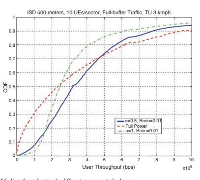 

 快速调整路径损失补偿之上的上行链路传输功率。 这为系统提供了控制UE传输功率以基于上行链路贩运负载，干扰水平等提高UE传输功率的另一种机制。另一个快速补偿因子是基于上行链路传输MCS级别和分配带宽的偏移。 这使系统可以通过资源分配和链接适应共同控制UE传输功率。

##  4.1.3.2 ** NR上行链路控制设计要求和框架** 

 在NR中，扩展了LTE分数功率控制以支持NR的新设计方面和功能。 与LTE相比，一个主要的变化是去除细胞公共参考信号（CRS），以提高较高的效率，并消除网络中恒定的干扰来源，从而提高频谱效率。 没有CR，需要基于其他参考信号的电源控制损失测量，并且自然选择是CSI- RS和SS/PBCH。

 NR的另一个独特功能是支持高- 通过引入梁管理程序来克服其覆盖范围问题，频带（FR2）。 光束形成的引入使路径损耗估计值的估计复杂化，因为有效路径损耗取决于GNB和UE处的传输和接收光束成型的增益，UE可能会使用不同的插槽和通道上的不同对传输和接收光束与GNB进行通信。 因此，对于不同的光束，UE需要通过不同的下行链路参考信号来测量路径损失。

 此外，NR支持可浓缩命理学，框架结构，均为CP- OFDM和DFT- s- OFDM上行链路波形和各种服务（例如，EMBB和URLLC）。 这种精神性要求上行链路电源控制应在各种情况和要求时非常可爱。 但是，对于每种情况，组合的潜在组合数量非常高，独立的浓厚群体可能会导致UE和网络的复杂性很高。

 根据以下公式计算上行链路传输功率：

 $$ p = \ min \ bigl {[} p _ {\ text {cmax}}，\ bigl {\ {} \ text {open loop} pc \ bigr {\}}}+\ \ \ \ \ bigl {\ bigl {\ {} loop} \ text {state} \ bigr {\}}+\ bigl {\ {} \ text {offsets} \ bigr {\}} \ bigr {]} $ bigr {] $ $ $ $ $ $ $ $ $ = \ min \ min \ min \ bigl {} p_ {\ text {cmax}}，\ bigl {\ {} p_ {0} \ left（j \ right）+\ alpha \ bigl {（} k \ bigr {）} \ cdot pl \ cdot pl \ bigl \ bigl { {）} \ bigr {\}}+\ bigl {\ {} f \ bigl {（} l \ bigr {）} \ bigr {\ bigr {\}}+\ bigl {\ bigl {\ {} 10} 10} M+\ delta \ bigr {\}} \ bigr {]} $$

 在上行链路电源控制的关键组件中，很明显，路径损失测量和封闭- 循环状态对UE的复杂性有更大的影响- 循环参数相对简单。 NR上行链路电源控制的浓汤框架被认为可以保持UE的相对较低的复杂性
 对于网络实施，具有足够的功效。 UE可以与少量（最多4）的下行链路信号（CSI）混合在一起（CSI）- RS或SS/PBCH
 块）用于可能不同的TRP和/或传输和接收光束对的路径损失测量，少量（最多2）封闭- 带有相应TPC监视的循环功率控制状态，以及相对较大的开放式态度（最多32）- 循环参数（PO和α）。 网络同意（半决赛- 通过RRC静态），并向UE指示（通过DCI动态）以应用适当的路径损失的组合，打开- 循环参数并关闭- 循环状态计算上行链路传输功率。

##  4.1.4 HARQ

 NR中的HARQ是自适应和异步的下行链路和上行链路的异步。 在下行链路上，UE最多支持16个HARQ过程，但可以与更少的过程相处。 与LTE相反，PDSCH接收到HARQ的报告之间的时间差距- ACK反馈被fxed至4 ms，NR旨在确保网络和UE的大量效率在报告HARQ时- ACK反馈。 DCI中的FELD告诉UE，在PDSCH接收到末端和Harqack反馈通过Pucch以及相应的PUCCH资源之间的插槽数和符号的数量，或者如果同一时间在上行链路上传输数据，则在PUCCH上或Pusch上。 这种功能允许网络请求非常快速的HARQ- ACK反馈，例如低- 延迟服务或延迟HARQ- 在此期间，ACK反馈，例如，以适应其他一些下行链路或上行链路变速箱。

 HARQ的时机- 网络的ACK反馈取决于UE处理能力。 在发行中- 15，NR支持快速的UE PDSCH处理能力。 这是由pdsch的最后一个符号和带有harq的pucch的最小链接OFDM符号（N1）指定的- ACK反馈。 UE处理PDSCH，计算HARQ结果并准备PUCCH或PUSCH传输所需的最短时间以DM符号的数量表示，具体取决于在下行链路上和上行链路上粘合的子载波间距，PDSCH映射类型，以及 DM的数量- RS符号以及其他条件，例如单元组中的组件载体数量以及组件载体之间的时间差，携带调度PDCCH的核心符号的数量，并取决于多路复用HARQ- ACK在Pucch或Pusch中与其他UCI的反馈。

 由于插槽由14个OFDM符号组成，因此可以从表4.1推断出某些UE可以支持传输HARQ- ACK反馈在接收PDSCH的相同插槽中。 这允许非常- 低的- 延迟服务。

 UE可能会为结核- 基于CBG的HARQ反馈- 基于HARQ
 反馈。 代码块组（CBG）HARQ允许将一个传输块（TB）分为代码块组，其中每个代码块组都用自己的CRC检查传输。 这允许UE报告仅成功收到了一些CBG，并且允许网络仅重新启动UE的CBG
 未能收到。 这不仅可以节省下行链路资源，而且还允许GNB对一个UE进行持续的变速器，而另一个UE的较短传输，以防其他UE接收到具有较低延迟QoS的服务，而不会损坏FRST UE的整个TB 。 哈克- CBG的ACK反馈是以较高的反馈开销为代价。 UE与每个运输块的CBG数量最大数量，并根据计划的TB中的代码块数量确定CBG的确切数量。 CBG传输信息（CBGTI）在安排PDSCH的下行链路DCI中向UE发出信号。 发送的DCI以最初使用CBG传输的PDSCH重新传递，指示正在重新传输哪些CBG，还可以指示是否实际上传输了先前传输的CBG。 这使UE可以为相应的CBG填充其缓冲液，而不是假设当UE实际上仅收到噪声和干扰时，以前已收到此CBG的某些有效传输。 CBG只能通过与结核病初始传输相同的代码块重新启动。

| 表4.1| 最小UE PDSCH处理时间N1（OFDM符号）| 快速处理||
|------------------------------------|------------------------------------------------------|------------------------|---------------------|
| 最低处理（功能# 1）| （能力# 2）ue浓厚的DM只处理前载的DM- 卢比|||
| 15 kHz| 8个符号[571μs]| 13个符号[929μs]| 3个符号[214μs]|
| SCS| UE只能处理| ue浓厚要处理||
| 正面- 加载的DM- 卢比| 其他DM- 卢比|||
| 30 kHz| 10个符号[357μs]| 13个符号[464μs]| 4.5符号[161μs]|
| SCS 60 kHz| 17个符号[304μs]| 20个符号[357μs]| 9个符号[161μs]|
| SCS| （对于频率范围1）|||
| 120 kHz| 20个符号[179μs]| 24个符号[214μs]||
| SCS||||

 与LTE一样，NR支持UE报告HARQ- 在同一上行链路传输中，ACK的多个HARQ过程的ACK反馈，HARQ多路复用和HARQ捆绑。 HARQ多路复用支持半决赛- DCI中的DAI（下行链路协会索引）的静态HARQ代码本和动态HARQ代码手册。 Harqack捆绑可以根据UCI有效载荷以动态方式进行调整。

 在上行链路上，HARQ已经在LTE中是非常受人话而设计的。 NR在NR中具有与下行链路相似的功能增强。 尽管LTE支持从下行链路物理指示渠道的网络中的HARQ ACK或NACK指示UL TB，但所有HARQ- 网络的ACK指示只能在NR的DCI中携带。 这意味着UE只有在UE收到另一个UL DCI授予UE的UE重新传播TB上，UE是否知道其上行链路传输是否成功。 由于NR中Pusch的UL赠款时间非常可爱，因此UE的两个同一TB传输之间的时机也是如此。 NR的上行链路也支持结核病- 基于CBG- 基于HARQ。

##  4.1.5多- TRP传输

 在发行中- 15，仅支持来自单个TRP的传输，而动态功率选择可以使用PDSCH和相关的参考信号从单元格ID解耦，并通过可耐受且动态的QCL指示进行。 发行中引入了多个TRP的传输- 16通过利用空间多样性来提高细胞边缘性能和传输可靠性。 两个单一DCI- 和多个DCI- 基于多- 支持TRP传输。

 用于多- DCI- 基于多- TRP传输，两个TRP与每个核心中的RRC参数 * CoresetPoolIndex *与两个核心组相关联，并且每个TRP都有其自己的DCI，CQI，MCS和DMRS端口。 UE可能期望检测两个PDCCH，同时安排两次PDSCH传输。 这两个PDSCH可能完全，部分或非- 与时间和频域重叠，每个PDSCH可能具有多达四个传输层。 对于完全或部分重叠的PDSCH，UE不会具有DM- 两个DCI中两个TCI状态指示的CDM组中的RS端口。 Harq的联合反馈和单独的反馈- ACK针对1型和2型HARQ指定- ACK Codebook。

 在两个pucchs上的单独HARQ用于非理想的回程和一个Pucch上的关节HARQ，以进行理想的回程。

 单一- DCI- 基于多- TRP传输，两个TRP与一个PDCCH和一个PDSCH相关联，其中不同的传输层（以及相关的DM- RS端口）对应于不同的TRP。 每个TCI代码点可以与一个或两个TCI状态混合在一起。 当与两个TCI状态结合在一起时，FRST TCI状态对应于FRST DM- RS CDM组和第二个DM的第二个TCI状态- RS CDM组。 两个端口pt- 在TCI代码点中，有两个TCI状态支持RS。

 通过利用来自多个TRP/面板的空间多样性来提高下行链路传输的可靠性，除了SDM方案不同

  

  

 层来自两个不同的trp，其他四个多人- 带有单个DCI的TRP传输方案如图4.7所示。

 对于FDM方案A，在DCI中指示了两个TCI状态，UE应接收TB的单个PDSCH传输场合，每个TCI状态与非非态相关- 重叠的频域资源分配。 该方案仅支持单个RV和一个CW。 对于FDM方案B，在DCI中指示了两个TCI状态，UE应接收两个与PDSCH传输场合相关的相同TB的PDSCH传输场合，该场合与其他PDSCH传输场合相关 场合。 该方案支持两个RV和两个CW。 用于内部- 插槽TDM方案，在DCI中指示了两个TCI状态，UE应接收两个PDSCH传输场合相同TB的情况，每个TCI状态与PDSCH传输场合相关联，该场态与其他PDSCH变速箱相对于其他PDSCH传输场合分配了非重叠的时间域资源 并且两个PDSCH传输场合应在给定的插槽内接收。 用于国际- 插槽TDM方案，UE被高级参数 *repetitionNumber融合在一起- DCI中指示R16*和两个TCI状态，UE可能会收到多个插槽- 与 *repetitionNumber相关的两个TCI状态的同一结核病的级别PDSCH传输场合- R16*连续插槽（最多16）。 每个PDSCH传输场合都有相同的SLIV。 对于给定的TCI状态映射模式，可以将UE与循环绘制或 *顺序映射 *混合在一起。

  

##  4.2 ** 运行体系结构演变和协议**  4.2.1整体体系结构

 5G系统提供了增强的结尾- 到- 结束架构以支持多个部署选项。 以下选项已包含在版本中- 15支持网络部署对不同市场的要求：- option2：站立- 一个人nr- 选项3：e- 乌特兰- NR双重连接- 选项4：nr- e- UTRA双重连接- 选项5：e- 连接到5GC的UTRA- 选项7：ng- 运行e- 乌特兰- nr- nr- NR双重连通性此外，Cu- 已提供了du架构，分为不同的功能实体。 以下各节中介绍了上述架构的主要设计。

##  4.2.1.1 ** 运行建筑概述** 

 在5G中，RAN网络节点称为NG- RAN，其中包括GNB和NGENB。 GNB提供NR控制平面和用户平面功能以及NG- ENB提供EUTRA控制平面和用户平面功能[15]。

 NG接口是连接NG- 驶向5GC（5G核心网络）。 对于控制平面NG- RAN通过NG连接到访问和移动性管理功能（AMF）- C接口和用户平面NG- RAN通过NG连接到用户平面功能（UPF）- U接口。 GNB和NG- ENB通过XN接口相互连接。 总体体系结构如图4.8所示。

 在功能方面，NG- RAN提供了无线电资源管理，IP标头压缩，数据保护和完整性保护的功能- Utra，等等

 AMF/UPF/会话管理功能（SMF）提供了核心网络的功能。 AMF主要提供控制平面功能，包括访问身份验证和访问授权，移动性管理，SMF选择等。UPF提供包括数据包路由和转发，QoS处理等功能。SMF主要提供会话管理- 相关功能。

 上面的功能拆分总结在图4.9中，其中灰色框描绘了逻辑节点和蓝色框描绘了主要功能，并且细节也可以在Sect中看到。 [5]的4.2。

  

  

##  4.2.1.2 RN体系结构选项

 发行中有多种选项- 15支持在不同市场上的网络部署灵活性（图4.10）。

 部署选项可以分为两种类型：
 站立- 单独部署一只老鼠，即NR立场- 单独部署和/或
-
 e- Utra站- 单独部署每个ran node non ran nod non and- 站立- 单独部署是先生- DC，即多- 大鼠双连接-
-
 e之间的气味- Utra和Nr

 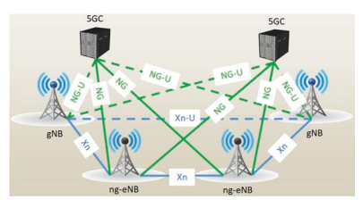 

 MR的一种选择- DC是En- DC（e- Utra- NR双连接性），允许在没有5GC的情况下部署NR- UTRA作为主节点，而NR作为辅助节点。

 在en- DC案例图4.10，主ENB（MENB）通过S1接口（CP和UP）连接到EPC，辅助GNB（SGNB）通过S1连接到EPC- U接口（仅在上）。 MenB连接到EN- GNB通过X2接口（CP和UP）和EN- GNB连接到EN- GNB通过X2- U接口（仅在上）。

 除了en- DC，还有其他多重- 与5GC：NG连接的RAT部署选项- 运行e- Utra- NR双重连通性（NGEN- DC）（图4.11）和NR- e- UTRA双重连接（NE）- DC）（图4.12）。

 如果是立场- 单独提到的NR部署，也可以支持NR- DC，即NR- NR双重连接性，其中大师GNB连接到5GC，也可以与次级GNB连接，以便为该公司提供其他资源

 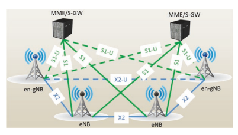 

  

 相同的用户。 此选项很有用，尤其是在操作员想要一起利用FR1和FR2频谱资源的情况下。 在3GPP中，ngen- DC，NE- DC和NR- DC被分组在一起，被称为多重- 无线电双重连接。

##  4.2.1.3 ** 铜- du拆分** 

 在NG中- ran节点，有两个功能实体：GNB- CU（GNB中央单元）和GNB- DU（GNB分布式单元）如图4.13所示。 GNB由GNB组成- Cu和一个或多个GNB- DU（S）和GNB之间的接口- Cu和GNB- DU称为F1接口。

 CU提供了RRC/PDCP/SDAP层的功能，DU为PHY，MAC和RLC层提供了功能。 一个Cu可以连接到多个DU，而一个DU只能连接到一个Cu。 F1接口仅在一个GNB中可见； 在GNB之外，不同CUS之间的接口使用XN接口。 NG接口还重复用于CU和5GC之间的连接。

 对于单个CU，其控制平面（CP）之间有进一步的函数
 和用户平面（向上）（图4.14）。 E1接口是连接Cu- CP和CU- 向上。 铜- CP通过F1连接到DU- C接口和Cu- 向上通过F1连接到DU- U接口。

##  4.2.1.4 ** 集成访问和回程** 

 rel。 16引入了集成访问和回程（IAB），这是一个系统- 启用NG中无线继电器的水平解决方案- 跑。 IAB可以看作是扩展了与Cu引入的GNB分类的概念- du拆分，使得Cu和DU之间的F1接口可以通过无线回程传输。 IAB架构允许跨一个或多个回程链接中继图4.14 CP及向上

  

 Cu的分离
 连接继电器节点，称为IAB节点。 支持一个或多个IAB节点的GNB称为IAB供体。

 IAB节点包括GNB- DU功能，该功能将F1协议终止于GNB- CU在上游方向上的功能并终止NR
 访问UES和NEXT接口- 在下游方向上跳iab节点。 要与上游IAB节点接口，IAB节点支持称为IAB的UE功能的子集- MT（IAB移动终止）。 IAB- MT基本上支持UE的RAN功能并支持控制平面网络界面（RRC使用GNB- cu和nas与NGC）。

 如果是en- DC部署，IAB节点也可以通过E连接- Utra
 到一个menb。 在这种情况下，IAB供体终止X2- C为SGNB。 图4.15说明了使用EN具有NGC和IAB节点的IAB节点SA模式的IAB架构- DC。

  

  

##  4.2.1.5 ** 运行协议和堆栈**  4.2.1.5.1 NR站立- 单独的网络协议体系结构

 在看台- 单独的nr，无线电接口协议也被分为控制平面和用户平面，如e- UTRA和详细的设计将在以下各节中引入。

##  4.2.1.5.1.1控制平面

 对于控制平面，图4.16所示的所有层提供了与E中的函数相似的功能- Utra [5]。

 NR RRC层提供功能，包括系统信息，分页，RRC连接管理，安全性，信号无线电载体（SRB）和数据无线电持有人（DRB）机构/修改，不同RRC状态的UES的移动性管理，QoS管理功能，UE测量 管理，无线电链路故障检测和恢复等。如果支持载波聚合或双重连接，RRC层还提供了这些功能的加法，修改和发布的支持。

 图4.16控制平面的框图

 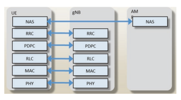 

 4 5G程序，ran架构和协议
 与e相比- UTRA，RRM测量已得到增强以支持光束- 基于测量和报告。 此外，新的RRC状态RRC_
 引入了非活动，以节省功率并减少信号开销和后续数据传输的延迟。 RRC层还支持在物理层中引入的新概念（如带宽部分，补充UL和光束管理）中引入的新概念。 进一步增强了系统信息机制，以降低广播能力消耗，例如- 对NR引入了需求SI采集[6]。

 对于IAB，IAB节点需要支持两个控制平面协议堆栈：F1- c在IAB节点的DU实体（图4.17）和rrc/nas堆栈中终止在IAB上终止相应的SRB的c堆栈（图4.17）- MT（图4.18）。

##  4.2.1.5.1.2用户平面

 对于用户平面（图4.19），中等访问控制（MAC）/无线电链接控制（RLC）/数据包收敛协议（PDCP）层提供了与E中的功能相似的功能- Utra [5]。 此外，NR引入了一个新协议：服务数据适应协议（SDAP）。

 对于IAB F1- U界面是在供体的Cu之间运输的- U和DU
 IAB节点的实体，通过无线回程链接（图4.20）。 请注意，引入了其他协议层，即回程适应层（BAP），以支持两个F1的中继- U和F1- C在无线回程上堆叠。

 IAB捐赠者du Maps/de- 映射封装在GTP中的用户平面数据包- U/UDP/IP传输堆栈，到适当的回程RLC通道，用于通过无线回程进行运输。 此映射功能使UE的无线电承载者（由GTP标识- u标题）将映射到浓厚的Backhaul RLC通道，以支持适当的QoS。 此外，iab in rel。 16引入功能使多个UE无线电承载者能够映射到同一Backhaul RLC通道。 这允许通过无线回程网络对RLC渠道进行更效率的管理，并且特别有用，以最大程度地努力

 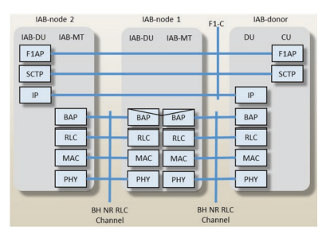 

  

 交通流量。 但是，在某些情况下，可能希望在多个UE无线电载体之间共享一个回程RLC频道（一个- 到- 一个载体映射），例如，提供关键的QoS处理- 优先广播载体。

##  MC层

 MAC层提供了功能，包括逻辑通道和传输通道之间的映射，（DE）MAC SDU的多路复用，HARQ进程，Power Headroom报告，调度和优先处理多个UES，等等。

 与e相比- UTRA，MAC层增强以支持多个

  

 函数，带宽零件，梁- 相关功能（例如，梁故障恢复）和补充UL处理。 在NR的初始版本中，仅定义了基本功能，并且将来可能会支持其他一些功能，例如广播/多播服务。

 RC控制MAC配置。 UE中不同MAC实体的函数，计时器和参数通常是独立操作或配置的。 每个细胞组都有一个MAC实体。 也就是说，当UE配置为SCG时，将两个MAC实体配置为UE：一个用于MCG，一个用于SCG。 图4.21显示了MAC实体的结构。

 图4.22显示了配置MCG和SCG时MAC实体的结构。

  

  

 类似于e- UTRA，NR DEFNES的运输通道和逻辑通道如表4.2和4.3所示。 MAC实体负责将逻辑通道映射到运输通道上，该通道适用于上行链路和下行链路，如图2和图2所示。 4.21和4.22。

 DL和UL的MAC PDU格式如图2和图2所示。 4.23和4.24。 MAC PDU由多个MAC子PDU组成。 对于DL MAC PDU，将Mac CE放置在任何MAC数据传输和带有填充物的Mac SubPDU之前。 对于UL MAC PDU，将MAC数据传输放置在任何Mac CE之前，然后将带有填充的传输放置在末端。 对于NR，MAC子标签和MAC CE/MAC SDU交错。 一般而言，MAC副标题具有四个标头FELD R/F/LCID/L，并且 "F"  费尔德表示长度的大小（ "L"  ）费尔德，值0表示8位 "L"  费尔德，值1表示16

| 传输频道名称| 缩写| 关联|
|--------------------------|-----------|----------|
| 广播频道| BCH| 下行链路|
| 下行链路共享频道| DL- sch| 下行链路|
| 分页渠道| PCH| 下行链路|
| 上行链路共享频道| Ul- sch| 上行链路|
| 随机访问频道| 拉赫| 上行链路|

| 逻辑频道名称| 缩写| 频道类型|
|---------------------------|-----------|-----------------|
| 广播控制频道| BCCH| 控制通道|
| 分页控制通道| PCCH| 控制通道|
| 公共控制通道| CCCH| 控制通道|
| 专用控制渠道| DCCH| 控制通道|
| 专用贩运频道| DTCH| 贩运频道|

  

  

 一点点 "L"  费尔德。 LCID是逻辑通道标识符，以识别相应的MAC SDU的逻辑通道实例或具有6位的相应Mac CE的类型。

 NR的MAC层旨在支持新功能，包括带宽零件，补充上行链路，梁恢复和多个函数。 另外，NR MAC与E中的MAC不同- UTRA如下：表4.2 Mac使用的传输通道的表数
 表4.3 Mac提供的逻辑通道表
 逻辑通道被扩展，仅支持异步HARQ，并进一步增强了调度机制。 现在将按顺序讨论其中的每一个。

 在e- UTRA，十个LCID保留用于逻辑通道：LCID 1和LCID 2用于SRB1和SRB2，并且可以完全支持八个DRB。 在NR中，由于引入了SRB3，分别为三个SRB保留LCID 1-3，因此可以在MAC实体中支持多达29次DRB。

 在NR中，仅支持UL和DL的异步HARQ。 为了提高数据传输插槽聚集的可靠性，并由RRC融合了重复的数量。 还提高了重新传播CBG的效率- 在物理层上支持基于基于的重传，该物理层与MAC层是透明的。

 动态调度和半度- NR支持静态调度。 此外，与E相比，调度请求（SR）机制和缓冲状态报告（BSR）已进一步改善- Utra。

 NR明显增强了SR机制。 现在，每个SR浓汤都可以与多个带宽部分或服务细胞之间的多个Pucch鸡肉相关联。 此外，对于一个单个MAC实体，支持多个SR融合。

 当特定LCG（逻辑通道组）的UL数据到达较高优先级时，可以用上行链路数据到达触发BSR，或者以前没有LCG中的逻辑通道都不包含任何上行链路数据。 当周期性BSR计时器到期或剩下填充位时，也可以触发它。

 报告了相应的常规BSR，周期性BSR或填充BSR。 长BSR已得到改进，以使用可变大小来支持更多的效率报告。 已经引入了长期截断的BSR格式，以便可以报告多个LCG的缓冲数据。

 NR和E之间的差异讨论- Utra Mac本质上一直是粗略的。 感兴趣的读者可以在[7]中提供更多细节。

##  RLC层

 与e一样- UTRA RLC，NR RLC还具有三种模式：AM（确认模式），UM（未经封闭模式）和TM（透明模式），如图4.25所示。

 RLC AM实体包括一个传输侧和一个接收侧支持重传。 将RLC UM实体视为传输实体或接收实体。 RLC TM实体是传输实体或接收实体。 系统信息和分页使用RLC TM模式。

 与E相比，NR RLC中最明显的变化- UTRA RLC是删除了RLC串联，并且在NR RLC中未进行重新排序。 前一种功能是促进NR中的预处理，以便满足NR对延迟的高需求。 后一个功能是因为重新排序功能已移至PDCP层。 在这种情况下，无需复制RLC层中的重新排序功能，当收到完整的数据包时，它会立即将其转发到PDCP层。 可以在[8]中看到更多细节。

 图4.25

  

##  PDCP层

  

 PDCP Sublayer提供标头（DE）压缩，（DE）密码，完整性保护和验证，以及用于各种承载类型的用户平面和控制平面的数据传输。 PDCP SDU和PDCP控制PDU的最大支持大小为9000字节。

 与E不同- Utra，出去- 的- NR PDCP支持订单交付，以允许仅在上层进行订购。 此外，还支持数据包重复，以通过在不同链接上传输的双重连接性和载波聚集来提高可靠性。 NR PDCP中的数据承载者还新引入了完整性保护。

 图4.26显示了PDCP层的功能概述。 在为每个PDCP SDU的传输操作时，PDCP Entity FRST启动丢弃计时器，分配与PDCP SDU关联的计数，并执行标头压缩，然后进行完整性保护和密码，这在DRB级别上是可结合的。 如果分裂承载者陷入困境，则可以根据条件将PDCP PDU传递到RLC主路径或辅助路径上，该条件是数据量的总量是否等于或以上是所配置的阈值。

 在接收操作时，PDCP实体确定接收到的PDCP PDU的计数值，并对数据包执行解密和完整性验证。 然后进行重复检测和去除。 如果是DRB，- 未配置订单交付，还执行重新排序。 然后，在标题减压后，数据包准备将其传递到上层。 可以在[9]中看到更多细节。

##  SDAP层

 用户平面的另一个主要区别是，引入了一个名为Service Data Autaptation协议（SDAP）的新层。 该层提供QoS流量管理。

 图4.27显示了SDAP层结构[10]。 有两个用于将数据包映射到数据持有人的层：
 在NAS级别，UE和5GC Associate UL和DL Pack中的数据包过滤器-

  

 带有QoS流的ET
-  在AS级别，UE和NG中的映射功能- RAN与DRBS SDAP的关联UL和DL QoS Fows允许使用NAS指示的QOS FOW标识符传输数据包，并通过Refective映射或显式拼写管理QoS Fows将QoS Fows映射到DRB。

 总之，图4.28说明了整个用户平面数据处理。 当UE已与网络建立RRC连接并希望发送数据时，它会根据数据包的QoS FOW选择数据承载者。 随后，它基于网络拼写应用标头压缩和安全性。 PDCP层处理后，UE将形成RLC，然后将MAC数据包提供给物理层。

##  4.2.1.5.2 MR DC协议体系结构

 本节将对MR进行粗略的讨论- DC协议体系结构。 感兴趣的读者可以在[11]中提供更多详细信息。

 控制平面如图4.29所示。 UE具有基于主节点（MN）RRC的单个RRC状态，并且只有一个C- 平面连接到CN。 MN和次级节点（SN）GNB/ENB都有自己的RRC实体。

 对于en- DC，ngen- DC和NR- DC，SRB3可以直接在UE和NR SN之间建立- MN机动性。

  

  

 对于用户平面，协议体系结构在图4.30中从UE设计
 en- DC和MR- DC分别具有5GC。 从UE的角度来看，基于不同的同意，承载类型包括MCG承载者，SCG携带者和MCG/SCG分裂承载者。 拆分载体主要用于将运输量放在不同的腿上或支持直流复制以提高可靠性。 MCG和SCG承载者也可用于CA重复。

 图4.31和4.32从网络的角度显示了协议体系结构。

 由于允许在一只大鼠中具有RLC/MAC层，而另一只大鼠的PDCP层则可以如下汇总ENB/GNB中可见的承载类型：- MN终止MCG承载者- MN终止SCG承载者- MN终止分裂载体- SN终止MCG承载者- SN终止SCG承载者- SN终止分裂载体，例如E- UTRA，NR使用RAN- 级别键指定UE- RAN节点连接，从中为SRB和每个DRB得出了可启动和完整性保护密钥。 为了先生- DC，此键仅用于MN终止承载者和SRB1/2，并且UE用辅助键分配，该键用于用于SN终止的载体和SRB3的辅助和完整性保护键。

 除了这方面，终止点对UE是透明的，因为这仅影响ENB/GNB之间的协调。

  

  

  

##  4.2.2 NR立场的基本程序- 单独的4.2.2.1 UE国家过渡

 在NR中，rrc_connected和rrc_idle之间的状态过渡与E相同- Utra。 通常，UE营地在单元格上，读取系统信息，并以空闲模式定期倾听分页。 当UE想要启动数据传输或响应分页时，UE会启动随机访问过程，以输入RRC_Connected状态。 随后的部分按这样的顺序组织，以引入每个步骤的基本程序。 RRC程序的更多详细信息可以在[6]中找到。

 与e不同- UTRA，新的UE状态作为NR RRC_Inactive引入。 如果UE在RRC_Connected中，并且网络以悬挂指示向UE发送RRCRELEASE消息，则UE将保持原始上下文并输入RRC_无活动状态（图4.33）。 下次UE具有数据或信号（例如，
 要执行RNA）以传输，它将RRCRESUMEREQUEST消息发送到网络，并且可以恢复RRC连接。 这样，rrc_中的ue
 与从RRC_IDLE移动的UE相比，非活动可以传输和接收具有降低的信号传导和延迟的数据，因为RRC_IDLE中的UE每次都必须在有数据传输数据时执行RRC连接建立过程。 另一方面，rrc_inactive状态的UE也可以从UE中实现功耗- 与rrc_connected状态中的情况相比，基于基于的移动性和空闲模式DRX。 状态过渡如图4.33所示。

##  4.2.2.2 ** 系统信息获取** 

 类似于e- UTRA，系统信息分为MIB（主信息块）和SIB（系统信息块）。 MIB在BCH上以80毫秒的周期性传输，并在80毫秒内进行重复。

 将SIB进一步分为SIB1和其他在DL上传播的SIBS- sch。 MIB和SIB1中提供了最小系统信息（即UE执行初始访问的系统信息，例如访问控制信息和公共通道群体，例如访问控制信息和公共通道群体），并且始终是广播。 SIB1的周期性为160毫秒。 SIB1的默认传输重复周期性为20毫秒，可变传输重复周期性应取决于网络融合。 SIB1还包括其他SIBS的调度信息。

 图4.33 RRC状态

  

 过渡图其他系统信息包含的系统信息对于初始访问而不是必需的系统信息，并且可以选择由广播提供，也可以按需提供。 在NR的初始版本中，SIB2- SIB9已被引入：
-  SIB2包含细胞重新选择信息，主要与服务细胞有关。- SIB3包含有关服务频率和内部的信息- 与细胞重新选择相关的频率相邻细胞。

-  SIB4包含有关其他NR频率和间- 与细胞重新选择相关的频率相邻细胞。

-  SIB5包含有关E的信息- UTRA频率和E- UTRA相邻的细胞与细胞重新选择有关。

-  SIB6包含ETW的主要通知。- SIB7包含ETW次要通知。- SIB8包含CMAS警告通知。- SIB9包含GPS时间和协调的通用时间（UTC），UE可以通过该时间获得UTC，GPS和本地时间。 除SIB1以外，具有相同周期性的SIB可以使用其自身的时域窗口包含在同一SI消息中。 这样的SI Windows不会与不同的SI消息重叠。

 与Eutra相比，SI采集程序还在- 需求SI（图4.34），以减少广播控制渠道的开销。 网络可以在UE（或UES）请求中，在某些广播期间静音一些SI消息。 在- 需求系统信息请求可以根据RACH过程中的MSG 1或MSG 3发送。 如果是msg1- 基于解决方案，用于SI请求的特定RACH资源映射到一组SI消息，而对于基于MSG3的解决方案，RACH过程的MSG3中的Bitmap表示了系统信息的请求。

 与E相比另一个区别- UTRA是NR介绍了基于区域的SI的概念。 系统信息（MIB中的最小系统信息除外
 在其他单元格中，UE在单元中获得的SIB1）也可能有效。 如果在获得SIB1之后，UE验证了在新单元格上提供的SIB是否在图4.34概述中

   on-demand SI acquisition the same System Information Area and the value tag is also the same, the UE would consider that the stored SIB is valid and may use the stored SIB without reading the SI again. In this way the UE can reduce the unnecessary reading of the SI which is helpful to reduce UE power consumption, as well as broadcast overhead.3 This is illustrated with Fig. 4.35. When the UE moves from cell1 to cell2 or from cell4 to cell5, acquisition of all of the SI is not needed since they are in the same SI area and have the same SI.

##  4.2.2.3 ** 分页和drx** 

 编码用于网络将分页信息传输到rrc_idle或rrc_inactive中的UE，并在rrc_idle，rrc_ intactive中通知UES，并在系统信息变化和地震或紧急警告消息中通知rrc_contection and rrc_contect。- 对于rrc_idle中的ues，分页从5GC发送到GNB

  

 在该跟踪区域内，然后这些GNB将这些分页消息发送给UE。

-  对于rrc_inactive中的ues- 基于通知区域融合在一起。 GNB已经知道UE正在露营的哪个通知区域，并且仅发送该区域的分页以减少分页上消耗的无线电资源。

 两个人的分页邮件相同- 开始分页和分页。

-  指示系统信息修改和ETW/ ETW的通知
 CMAS指示NR引入了简短消息，该消息由PDCCH在物理层中由DCI传输。
  如果在RRC_Inactive中为UES进行分页，则引入RAN区域更新过程，以允许GNB知道UE是否更改RAN- 基于通知区域（RNA）。 这种RNA更新（RNAU）定期由UE发送，并且当UE选择不属于浓缩RNA的单元格时也会发送。 见图4.36。

 NR支持了闲置模式和连接模式的不连续接收（DRX）。 前者适用于RRC_IDLE和RRC_INACTIVE状态中的UE，以减少功耗。 PF和PO的除决在NR中重复使用。 一个分页框架（PF）是一个无线电框架，可能包含一个或多个分页场合（PO）或PO的起点。 PO是一组PDCCH监视场合，可以由多个时间插槽（例如副帧或OFDM符号）组成，可以发送分页DCI [12]。 UE监视一个分页场合
 （PO）每个DRX周期。

 多- 梁操作，一个PO的长度是横梁的一个时期，UE可以假设在所有扫描模式的所有光束中都重复相同的分页消息，因此可以选择光束以接受分页消息 取决于UE实施。

  

##  4.2.2.4 ** 访问控制** 

 运行支持各种超载和访问控制功能，例如Rach Back- 关闭，RRC连接拒绝，RRC连接发布和UE- 基于访问。

 在NR中，引入了Unifed访问控制（UAC）功能，因此可以使用OperatorDefned访问类别来启用不同切片的差异化处理。 ng- RAN可能会广播禁止控制控制信息（即，与操作员相关的禁止参数的列表- 除非访问类别）最大程度地减少了拥塞切片的影响。

 一个独立的访问控制框架适用于所有UE状态（rrc_idle，
 rrc_inactive和rrc_connected）for nr。 ng- 播放广播禁止与访问类别和访问身份相关的控制信息（如果网络共享，则可以为每个PLMN单独设置禁止控制信息）。 UE根据所选PLMN的禁止信息广播以及所选访问类别和访问身份（IES）确定访问尝试是否已授权：用于访问尝试：- 对于Nas- 触发请求，NAS确定访问类别和访问身份（IES）。

-  对于作为- 触发请求，RRC确定访问类别
 确定访问身份（IES）。 表4.4显示了访问类别和访问类型之间的映射[13]。 GNB处理建立原因的访问尝试 "emergency,"  "mps-PriorityAccess,"  和 "mcs-PriorityAccess"  （即，紧急电话，国会议员，MCS订户）具有很高的优先级，并以RRC响应了这些访问尝试，仅在极端网络负载条件下可能威胁到GNB稳定性。

##  4.2.2.5 ** 随机访问程序** 

 通常，当UE有数据传输并传递访问控件时，UE
 可以启动随机访问程序。 要更具说明，有各种条件可以触发随机访问过程如下：
-  RRC_IDLE的初始访问- RRC连接重建程序
-  切换（HO）
-  rrc_connected期间的DL/UL数据到达，但UL是非- 同步
-  没有pucch时rrc_connected期间的UL数据到达
 SR的资源可用
-  SR失败- RRC的请求对同步重新配置

| 表4.4| 访问类别||
|-------------------------|--------------------------------------------------------------------------------------------------------------------------------------------------------------|--------------------------------------------------------------|
| 访问类别号| 与UE相关的条件| 访问尝试类型|
| 0| 全部| 移动发起（MO）由分页产生的信号传导|
| 1| UE陷入困境- 容忍服务，并受到访问类别1的访问控制，这是UE的HPLMN和所选PLMN的函数| 除紧急情况或MO例外数据外|
| 2| 全部| 紧急情况|
| 3| 除了访问类别1中的条件外| 除分页以外的其他NAS水平上的MO信号传导|
| 4| 除了访问类别1中的条件外| mmtel声音|
| 5| 除了访问类别1中的条件外| mmtel视频|
| 6| 除了访问类别1中的条件外| 短信|
| 7| 除了访问类别1中的条件外| 不属于任何其他访问类别的MO数据|
| 8| 除了访问类别1中的条件外| 除了分页以外|
| 9| 除了访问类别1中的条件外| MO IMS注册相关信号传导|
| 10| 全部| MO异常数据|
| 11–31| 保留标准化访问类别||
| 32–63| 全部| 基于操作员分类|

-  在scell添加中建立时间对齐- 从rrc_inactive过渡- 请求其他SI- 梁故障恢复可以通过两种方式进行随机访问：争夺- 基于访问和争议- 免费访问如图4.37所示。 争夺- UE基于随机访问，随机选择一个访问序言，因此有与其他UES遇到纠缠的风险。 在这种情况下，必须执行争议解决程序。 争夺- 由于网络将序言分配给指定性UE，因此可以避免使用此类风险，并且不需要解决争议解决方案。

 一般而言，网络将映射到每个SSB的序言以及与SSB/CSI相关的prach场合- 系统信息中的RS。 当UE想要启动随机访问时，它选择一个SSB/CSI- 在RA资源选择之前的rs。 如果有SSB/CSI- 上面的RS信号带有候选列表中的浓缩阈值，UE选择此SSB/CSI- 卢比； 否则UE

  

 选择由UE实现的任何SSB。 力量推动机构和返回- OFF计时器还适用于NR随机访问。

 与E相比，NR中支持随机访问的其他功能- UTRA：UL选择和梁故障恢复。 对于UL选择，当一个单元与两个UL（即正常的NR UL和补充UL）混合在一起时，UE将根据浓缩阈值在UL上随机访问。 如果下行链路的测得的RSRP低于阈值，则UE将选择SUL。 为了恢复光束故障，它被引入光束- 级别移动性部分。

##  4.2.2.6 ** 支持RRC_InActive状态的RRC程序** 

 RRC连接管理等RRC建立，重建和释放的基本程序与E中的基本程序相似- Utra [6]。 引入了主要的新程序以支持RRC_INACTIVE状态。

 如果UE已经设置了RRC连接，则网络可以使用RRC
 连接释放程序悬挂RRC连接，其中包括已建立的无线电载体的悬架。 UE和网络侧存储UE上下文，UE进入RRC_Inactive状态。

 当UE想要启动数据传输时，它需要从RRC_运行
 无效到rrc_connected状态。 图4.38显示了恢复RRC连接的过程。 通过这样做，UE可以保存信号开销以重复建立新的RRC连接。

 这种过渡的触发因素可能不仅来自UE侧。 如果需要分页，则网络侧也可以触发简历过程，这需要UE的响应。 图4.39显示了网络的原理- 触发过渡。

  

  

##  4.2.3移动性控制4.2.3.1细胞选择

 对于细胞选择，原理与E的通用细胞选择程序相同- Utra [14]。 UE NAS层选择并指示所选的PLMN和等效PLMN与RRC层，并且单元格选择基于现有原理。 用于多个细胞选择- 梁操作，电池的测量量取决于UE实现。 如果找不到合适的单元，则UE将识别一个可接受的单元以扎营。

##  4.2.3.2 ** 细胞重新选择** 

 NR内的细胞重新选择也基于E的现有原理- 带有额外光束的UTRA- 水平测量[14]。 用于在多个中的细胞重新选择- 梁操作，该电池的测量量是在基于SS/PBCH块对应于同一单元相对应的光束之间得出的，要么通过使用最高梁测量量值得出单元格的数量，要么通过得出细胞测量量作为线性线性。 高于浓缩阈值以上的最大浓缩最高梁测量量值的平均功率值的平均值。 内部- 频率细胞的重新选择基于细胞的排名和间- 频率单元重新选择基于优先级- 基于细胞的重新选择。

 用于国际- 大鼠细胞重新选择，目前仅在E之间重新选择细胞- Utra
 NR得到了支持和优先级- 基于中间- 大鼠细胞重新选择机制被重复使用。

 与e相比- UTRA，主要区别在于，可以将单元的排名融合在一起- 横梁方面并考虑到SUL。 对于阈值或更好质量梁的细胞有一些补偿，因此可以优先考虑这些细胞。 对于SUL方面，由于并非所有UES都支持此功能，因此SUL会有不同的补偿参数- 有能力的UES，以便UES可以根据自己的能力及时重新选择其他单元。

##  4.2.3.3 ** RRC_Connected中的测量** 

 当UE处于RRC_Connected中时，网络可以通过RRC提供测量与UE报告各种测量报告。 测量炒作包括测量对象，报告浓厚融合，测量身份，数量结合和测量差距。

 在NR中，内部/间- NR和Inter的频率测量- 大鼠测量向E- 支持UTRA，可以定期报告或触发事件。 事件- 触发互换- 大鼠测量报告，事件B1（Inter- 鼠
 邻居变得比阈值更好）和B2（PCELL变得比Threshold1和Inter- 支持大鼠邻居比阈值更好。 用于内部- NR中的大鼠测量报告，以下事件- 支持触发的测量：
-  事件A1（服务变得比阈值更好）- 事件A2（服务变得比阈值还差）- 事件A3（邻居变得比SPCELL更好）- 事件A4（邻居变得比阈值更好）

-  事件A5（SPCELL变得比Threshold1差，并且邻居变得比Threshold2更好）
-  事件A6（邻居变得比雪橇更好）
 在NR中，可以根据SSB或CSI进行测量- 卢比。 SMTC（SS/
  引入了PBCH块测量正时拼写）是为了进行融合测量正时浓度，即UE测量SSB的时序场合。 测量差距也需要与间- 频率或间- 基于UE功能的RAT案例：如果UE仅支持- UE间隙，UE无法在所有服务单元中接收或传输数据； 如果UE支持PerfR Gap，则在测量FR1细胞时，UE可以继续在FR2中的服务细胞中接收或传输数据。

 上述测量主要用于双重连接模式移动性和SCG管理的目的- 连接案例。 此外，还支持出于ANR（自动邻居关系）的CGI报告。 一旦网络融为一体，UE就可以向网络报告某个单元格的网络身份，以帮助网络自动维护邻居单元格列表。

 另一个重要的测量称为SFTD（SFN和框架时序差）。 该测量方法用于指示两个单元之间的时间差，这有助于网络对UES进行更准确的测量浓度，尤其是考虑到邻居细胞不与服务细胞同步的情况。

 更明确地在MR中- 直流案例，测量值可以由MN和SN独立混合。 SN只能融合Intra- 大鼠测量和通过间- MN和SN之间的节点信号传导用于确保这两个节点之间的一致测量相结合，而无需超过UE测量功能。 当SRB3融合在一起时，SN融合的测量报告将在SRB3上发送。

##  4.2.3.4 ** 间- 系统/INTER- 在连接模式下的大鼠移动性** 

 在发行中- 15 NR迁移率程序在很大程度上重复使用LTE移交程序，并具有额外的光束管理。 移动性包括单元- 水平移动性
 （切换）和横梁- 水平移动性（内部- 细胞梁开关）。 细胞- 级别的迁移率基于L3单元- 梁时的水平测量- 水平迁移率基于对单个光束的L1测量。

##  4.2.3.4.1梁- 水平移动性

 对于梁迁移率管理，图4.40显示了相应的过程。 网络FRST融合了多达64个光束，其中包括SSB/CSR的列表- 卢比
 融合和光束故障检测的条件以及光束故障恢复的浓度。 从

  

 网络，UE继续测量光束质量。 如果在物理层检测到梁故障，PHY层将通知MAC层。 计时器实例的计时器实现了标准和最大梁故障实例的阈值，UE可以使用RACH程序请求恢复。 在这种情况下，网络决定将UE与更新的光束鸡式重新配置。

##  4.2.3.4.2移交

 内部/间- 频率移交如图4.41所示。 移交请求消息包括与SSB和CSI相关的光束测量信息- 报告的细胞Rs。 流动- 基于QoS被考虑
 程序。

 移交命令结合了与SSB或CSI相关的专用RACH资源- RS，UE可以执行争议- 免费的RACH程序到目标单元。 由于常见的RACH资源只能与SSB相关联- RS资源与其他RACH场合在一起。

  

 图4.41通用切换过程
-  内部- 系统内部- 老鼠移交：
-  两者都内部- NR移交和内部- 支持没有CN变更的Eutra移交。

-  内部- 系统间- Eutra和NR之间的老鼠交换：
-  这仅适用于将两只大鼠连接到5GC的情况。 两个xn- 基于NG- 在这种情况下，支持基于的移交。

-  间- 系统内部- 老鼠移交：
-  该病例指的是Eutra细胞分别连接到EPC和5GC的情况。 当UE在这两个细胞之间移动时- 支持系统切换。

-  间- 系统间- 老鼠移交：
-  该病例指的是Eutra细胞连接到EPC的情况，UE在这种Eutra细胞和NR细胞之间移动。 在这种情况下，只有基于CNB的移交。- 不支持序列和无损交换。

##  4.2.4垂直支撑

 支持切片的5G基本密钥功能的RAN程序和体系结构将在此处讨论。 其他5G程序和运行架构功能将在CHAPS中讨论垂直行业的支持，例如URLLC，V2X和工业互联网。 分别讨论了支持这些垂直方面的5G特征的7、8和9。

##  4.2.4.1 ** 切片** 

 5G引入切片，这是一个结局- 到- 最终功能，以根据不同的客户需求，服务允许更多可爱的资源利用和差异化处理- 级别协议（SLA）和订阅。 这是一个关键功能，可允许超级功能- 系统的自定义支持垂直服务。4网络切片始终由运行部分和CN零件组成。 从跑
 观点，不同切片的贩运由不同的PDU会话来处理。 该网络可以通过调度以及提供不同的L1/L2浓汤来实现不同的网络切片。 ng- RAN支持对切片的认识和对不同网络切片的差异化处理- 浓厚的。 不同切片之间的详细资源管理取决于网络实现。

 ng- RAN还通过UE或5GC提供的协助信息支持选择网络切片的一部分。

 通过指示与PDU会话相对应的切片标识符，在PDU会话级别引入了SLICE的RAN意识。 ng- RAN与OAM一起为不同的网络切片的一组不同的鸡肉融为一体，以便能够将TraffC的分化处理用于具有不同SLA的网络切片。 另外，切片- RAN支持意识移动性，这是为了启用切片- 通过在流动性程序中转移切片标识符来了解入院和拥塞控制。 引入了雪橇的光束故障恢复以提高其可靠性。

 为了帮助FND合适的CN切片，UE可以提供由5GC在MSG5和NG中分配的标识符- RAN将使用此标识符将消息路由到合适的AMF。

##  4.3 ** 概括** 

 通过考虑到NR设计的特征，在这里讨论了5G中新引入的程序。 新程序包括初始访问，光束管理，电源控制和HARQ。 此外，跑步建筑，立场的基本程序- 讨论了单独的NR和移动性控制以提供基本框架。

 这个概念 "beam"  用于NR和光束- 基于的操作应用于不同的过程。 在LTE中，公共通道基于宽光束，该光束可以使位于电池不同位置的UE接收。 因为LTE的典型部署频谱很低- 频带较小的路径损失，宽光束可以覆盖整个单元。 但是，对于NR进入高频，路径损耗显着增加，并且如果由于有限的光束成形增益，公共通道仍基于宽光束，则细胞覆盖率将缩小。 由于通常在NR中使用多个天线，因此可以使用光束形成来补偿路径损失。 具有远光增益的光束狭窄，因此需要多个光束进行扫描以保证细胞覆盖率。 在这种情况下，公共信号/通道，即SS/
 PBCH（SSB）在多个光束上传达，UE在多个SSB中获取最佳的SSB以获取细胞知识。 然后，UE可以获得与检测到的SSB相关的RACH资源，RMSI的核心资源。 UE获得这些信息后，它将进入正常的通信过程。

 梁管理程序是要克服更大的路径损失和阻塞概率。 基于一组浓厚的光束下行链路信号（CSI）- 卢比
 和/或SSB），UE报告了向网络的下行链路信号的检测质量，并且网络选择了适当的光束以进行PDSCH和PDCCH的传输。 一旦根据检测结果失败了相关光束的链接，就会触发光束故障恢复过程，以寻找用于PDSCH/PDCCH传输的新的合适光束。 对于上行链路，UE传输多个光束的SRS资源，并且网络可以为Pucch/Pusch传输选择合适的上行链路梁。 另一种方法是，它的接收光束和传输光束之间存在光束对应关系。 UE在不依赖网络的情况下选择基于DL测量的相应光束进行UL传输- 辅助UL光束管理。

 为了减少梁管理信号开销和延迟，请释放- 16具有以下功能的增强梁管理：默认空间关系和专用pucch的路径损失参考信号，DCI格式为0_0的PUSCH和SRS； 跨多个CCS同时进行TCI/空间关系更新； PUCCH空间关系激活/每个Pucch资源组失活； Mac CE- 基于上的空间关系指示- 持续的srs; 和Mac CE- 基于上的路径损失参考信号更新- 持续的SRS和Pusch。

 在NR中，功率控制适用于上行链路和下行链路，并且与LTE非常相似。 上行链路电源控制仍然基于分数功率控制方法，而下行链路部分仅具有非常有限的规范影响，并且主要依赖于网络实现。

 在NR中，适用于下行链路和上行链路的自适应和异步HARQ。 与数据接收和HARQ之间的LTE FXED相比，HARQ时机非常可爱- ACK反馈，并且在DCI中发出了HARQ时序。 DCI中的一个长石告诉UE PDSCH接收末端和HARQ的传播之间的插槽数和符号数量- ACK反馈。 HARQ时正式的融合取决于UE处理能力。

 通过利用空间多样性来提高细胞边缘性能和传输可靠性- 16，都是单人DCI- 和多个DCI- 基于多- trp
 支持传输。

 5G系统支持多个部署选项，包括NR支架- 一个人和LTE- nr dual- 连接性。 RAN进一步分为CU和DU等不同功能实体。 在此部分中介绍了RAN架构的设计。 另外，支架的协议- 讨论了一个单独的NR，包括UE状态过渡，分页，随机访问程序等，这给出了展位的细节- 单独使用NR操作。

 到目前为止，我们5G旅程中的讨论集中在物理层以及相关的运行过程和架构上。 5G系统的多个部署选项取决于RAN和连接的核心网络之间的关系，这将是我们下一个论文的主题。

##  参考

1.  3GPP TS 36.104，基站（BS）无线电传输和接收（版本15），2018年6月。2。3GPP TS 38.104，基站（BS）无线电传输和接收（版本15），
 2018年9月。

3.  摩托罗拉，R1- 060401 "Interference Mitigation via Power Control and FDM Resource Allocation and UE Alignment for E-UTRA Uplink and TP"  ，3GPP TSG RAN1 \# 44，美国丹佛，2006年2月。

4.  W. Xiao，R。Ratasuk，Ghosh，R。Love，Y。Sun和R. Nory， "Uplink power control, interference coordination and resource allocation for 3GPP E-UTRA,"  在Proc。中，IEEE VEH。 技术联盟，2006年9月，第1页- 5。

5.  3GPP TS 38.300，NR; nr和ng- 总体描述； 阶段2（发行15），
 2018年12月。

6.  3GPP TS 38.331，NR; 无线电资源控制（RRC）协议指定（版本15），
 2018年12月。

7.  3GPP TS 38.321，NR; 中等访问控制（MAC）协议形成（版本15），
 2018年12月。

8.  3GPP TS 38.322，NR，无线电链路控制（RLC）协议指定（版本15），，，，
 2019年3月。

9.  3GPP TS 38.323，NR，数据包数据收敛协议（PDCP）指定（版本15），
 2019年3月。

10. 3GPP TS 37.324，E- Utra和nr; 服务数据适应协议（SDAP）指定
 （发行15），2018年12月。

11. 3GPP TS 37.340，进化的通用陆地无线电访问（E- utra）和nr; 多连通性； 第2阶段（发行15），2018年12月。

12. 3GPP TS 38.213，NR，《控制的物理层程序》（第15版），2018年9月。13。3GPP，TS 22.261 5G系统的服务要求； 阶段1（发行16）v16.14.0。
 2021年3月，网址：https：//portal.3gpp.org/desktopmodules/specifcations/pecifcationdetails.aspx？pecifcation = 3107。

14. 3GPP，TS 38.304用户设备（UE）步骤以空闲模式和RRC不活动状态
 （版本15），v15.4.0，2019年6月，[在线]，https：//portal.3gpp.org/desktopmodules/ pecifcations/pecifcationdetails.aspx？specifcations？- RAN建筑描述（发行15），v15.9.0，2020年10月。

 [在线]，https://portal.3gpp.org/desktopmodules/specifcations/specifcationdetails.aspx？ specifcationID = 3219

#  第5章

   5G System Architecture

 本章提供了5G系统3GPP标准的简洁描述
 （5GS）并突出显示4G的主要增强功能。 网络切片，虚拟化和边缘计算具有增强的连接性，会话/移动性管理是一些关键增强功能。 他们满足了一套多种服务的要求，这些服务需要低潜伏期，高可靠性或在同一网络上短时间间歇性期间进行大量连接。

 它开始了结尾的概述- 到- 结束5GS。 然后它描述了服务- 基于核心网络功能将核心网络函数组织到一组服务的功能和对虚拟化的固有支持中。 描述了用于支持同一网络上广泛服务的网络切片。 提供了连接和会话管理的概述，包括新服务和会话连续性模式。 然后它概述了5GC互动如何与4G
 进化的数据包核心（EPC）。 然后给出5GC中控制平面（CP）和用户平面（UP）协议的详细说明。 然后阐明对虚拟化部署和边缘计算的支持，然后对政策进行讨论，并为漫游和非- 漫游案件。 除5G外，还有许多其他无线技术供用户访问Internet。 因此，我们接下来讨论访问贩运转向，切换和分裂功能，这使得多次- 访问PDU连接服务。 这些功能允许建立一个PDU会话，并使用两个同时访问连接，其中一个使用3GPP访问网络，而另一个使用非访问连接- 3GPP访问网络。 然后探索了5G网络中的人工智能的支持。 之后，5G支持非3GPP
 通过不信任的非信任访问技术- 3GPP访问网络，可信赖的非- 3GPP
 然后讨论访问网络和有线访问网络。 本章的最后一部分是关于CIOT，位置服务和IMS的5GC支持的论述。

##  5.1 ** 5G系统体系结构** 

 与4G（LTE/EPC）和前几代一样，3GPP 5G系统DEFNES DEFNES架构用户设备（UE）和终点（例如数据网络（DN）中的应用程序服务器（AS）） 或另一个UE。 UE和数据网络之间的相互作用是通过3GPP标准定义的访问网络和核心网络。 图5.1描绘了末端的简单表示- 到- 最终建筑。 在本章中，我们着重描述5G
 核心为PLMN的3GPP 5G标准[1-3]。 3GPP中的访问网络称为无线电访问网络（RAN）。

 在很高的级别上，核心和运行由几个与控制平面和用户平面功能相关联的网络函数。 实际数据（也将其称为用户数据）通常是通过用户平面中的路径运输的，而控制平面则用于在用户平面中建立路径。 简短消息服务（SMS）是通过控制平面传达数据（短消息）的例外。 5G系统体系结构（5GS）在3GPP标准中以两种方式表示，一个是服务- 控制平面网络功能访问彼此的服务的基于的表示，另一个是参考点表示，其中网络函数之间的相互作用与点显示- 顶点参考点。 在本章中，我们使用该服务- 基于5G体系结构被认为是服务- 基于建筑。 3GPP 5GS基于服务的非- 图5.2所示的漫游参考架构。 在当前的指定中，服务- 仅在控制平面内对基于基于的接口进行定义。 在3GPP术语中， "a network function can be implemented either as a network element on a dedicated hardware, as a software instance running on a dedicated hardware, or as a virtualized function instantiated on an appropriate platform, e.g. on a cloud infrastructure."  版本16指定增加了网络功能和网络功能服务之间直接通信和间接通信的能力。 间接通信是通过服务通信代理（SCP）。 SCP不用于直接通信。

 EPC发行- 通过可选功能增强了14，该功能允许将控制平面和用户平面分开。 在此功能中，服务网关（SGW）
 和数据包网关（PGW）分为不同的控制平面和用户平面功能（例如SGW- C和SGW- U）。 此可选功能为网络部署提供了更高的精神和效率，请参见[4]有关详细信息。 在5G体系结构中，控制平面和用户平面的分离是固有的功能。 会话管理功能（SMF）处理设置的控制平面功能和

  

  

  

 会话管理，而实际用户数据是通过用户平面功能（UPF）路由的。 UPF选择（或重新- 选择）由SMF处理。 部署选项允许位于中心位于UPF和/或分布式UPF，位于访问网络附近或位于访问网络中。

 在EPC中，移动性管理功能和会话管理功能由移动性管理实体（MME）处理。 在5GC中，这些功能由单独的实体处理。 访问和移动性管理功能（AMF）处理移动性管理和程序。 AMF是控制平面连接（无线电）访问网络（（R）AN）和UE的终止点。 UE和AMF之间的连接（通过RAN穿越）被称为非- 访问层（NAS）。 会话管理功能（SMF）
 处理会话管理程序。 移动性和会话管理功能的分离允许一个AMF支持不同的访问网络（3GPP和NON- 3GPP），而SMF可以针对指定访问进行量身定制。

 图5.3显示了在访问的PLMN（VPLMN）的本地突破的漫游体系结构。 在这种情况下- SPECIFC身份验证和授权功能（NSSAAF），支持网络切片- 指定身份验证和授权位于家庭PLMN中
 （HPLMN）。 有安全边缘保护代理（SEPP）保护房屋和访问的PLMN之间的通信。 UE通过VPLMN中的用户平面功能（UPF）通信到数据网络（DN）。 处理UE的移动性和会话管理的AMF和会话管理功能（SMF）也位于VPLMN中。

##  5.2 ** 5G核心（5GC）服务- 基于建筑** 

 与EPC相比，5G核心（5GC）体系结构的重大变化是介绍该服务- 基于建筑。 在EPC体系结构中，控制平面通过带有标准化消息集的直接接口（或参考点）相互通信。 在基于服务的体系结构中，使用通用框架的网络功能（NF）公开其服务供其他网络功能使用。 在5GC体系结构模型中，网络函数之间的接口称为基于服务的接口（SBI）。 服务框架Defnes使用生产者 - 消费者模型在SBI上通过SBI之间的相互作用。 因此，NF（生产者）提供的服务可以由有权使用该服务的另一名NF（消费者）使用。 这些服务通常称为 "NF Service"  在3GPP指定中。

 NFS之间的相互作用可能是 "Request-response"  或a "SubscribeNotify"  机制。 在里面 "Request-response"  模型，NF（消费者）请求另一个NF（生产者）提供服务和/或执行一项操作（见图5.4）。 在 "Subscribe-Notify"  NF（消费者）模型订阅了另一个NF（生产者）提供的服务，该服务通知了结果的订阅者（图5.5）。 NF服务消费者与NF服务生产商之间的沟通可能是直接或间接的。 间接沟通是通过服务

| 图5.4|"Request   |
|-------------------------------------------------------------------------------------------------|---|
| response" NF服务插图。 使用间接通信的请求响应的示例。||

  

 通信代理（SCP）。 SCP不用于直接通信。 NF服务生产者/消费者可以在响应/​​请求中包含绑定指示，NF服务消费者可以使用该指示选择NF服务生产者实例作为后续请求，或者由NF服务生产者使用以发现合适的通知端点。 对于间接通信，SCP使用绑定指示来发现合适的NF服务生产者实例或适当的通知目标（有关详细信息，请参见[1]。

 如图5.3所示，在5G系统体系结构中，每个网络功能都有关联的服务- 基于界面名称。 例如， "Namf"  指定访问和移动管理功能所展示的服务
 （AMF）。 3GPP指定DEFNE一组由每个网络功能提供/支持的服务。 例如，表5.1显示了为AMF指定的NF服务。 服务描述的详细信息在[2]中描述。

 与3GPP中规定的服务框架相关的三个主要程序 - 请参阅[1，5]有关详细信息：
 NF服务注册和DE- 注册：使网络存储库功能（NRF）了解可用的NF实例和支持的服务。

 NF服务发现：使NF（消费者）能够发现NF实例
 （生产者）提供预期的NF服务。 NF通常使用NRF进行NF和NF服务发现的服务发现过程。

 NF服务授权：确保NF服务消费者被授权访问NF服务提供商（生产者）提供的NF服务。

 图5.5 "SubscribeNotify"  NF服务

  

  

 插图

| 服务名称| 描述|
|-----------------------|-------------------------------------------------------------------------------------------------------------------------------------------------------------------------------------------------|
| namf_| 此服务使NF能够通过N1 NAS与UE通信|
| 沟通| 消息或an。 使NF消费者能够与UE和/或通过AMF进行​​通信。 此服务使SMF能够请求EBI分配以支持与EPS的互动|
| namf_| 使其他NF消费者能够订阅或通知移动性事件，统计信息或其他事件ID|
| 事件曝光NAMF_MT| 使NF消费者能够确保可以达到UE，以将MT信号或数据发送到目标UE|
| NAMF_Location| 使NF消费者能够为目标UE请求位置信息|

##  NF服务注册的示例

 在此示例中（图5.6）AMF作为NF服务消费者将HTTP的请求发送给NRF，并使用代表NF实例的资源URI发送。 该请求包含nnrf_nfmanagement_nfregister请求消息（NF服务消费者的nf profle）向NRF通知NRF的NF profle。 NF的NF分配
 服务消费者包括NF类型，FQDN或NF的IP地址等信息，
 支持服务等的名称等。NRF授权请求并在成功商店上存储NF服务消费者的NF资料，并标记NF服务消费者可用的。 NRF通过返回包含NNRF_NFManagement_NF寄存器响应（包括NF Profle）的HTTP 201创建响应来确认AMF注册的成功。 感兴趣的读者可以在3GPP TS 23.501 [1]和3GPP TS 29.510 [5]中提供更多细节。

##  NF服务发现的示例

  

 在此示例中（图5.7），AMF作为NF服务消费者打算在网络中发现针对目标NF类型的NF实例或服务。 AMF通过调用NNRF_ NFDISCOVERY_REQUEST，将HTTP的http获取请求发送给NRF。 此请求包含预期的NF服务名称，预期NF实例的NF类型，NF消费者的NF类型，还可能包括其他信息/参数，例如订阅永久标识符（SUPI），AMF区域ID等。NRF授权 请求，如果允许，则NRF确定发现的NF实例或NF服务实例，并在HTTP 200 OK中为NF服务消费者（例如AMF）提供搜索结果。 感兴趣的读者可以在3GPP TS 23.501 [1]和3GPP TS 29.510 [5]中提供更多细节。

  

##  5.3 ** 网络切片** 

 从3GPP的角度来看，5G网络切片被视为一个逻辑网络，具有专门用于特定用例，服务类型，贩运类型或其他商定的服务的函数/元素- 级别协议（SLA）。 重要的是要注意，3GPP仅适用于3GPP
 签署的系统体系结构，并且不解决组件的传输网络切片或资源切片。

 行业中最常见的切片类型是增强的移动宽带（EMBB），Ultra- 可靠的低潜伏期通信（URLLC）和大量物联网（Miot）。 但是，可能还有更多的网络切片。 在4G系统（EPS）中，有一个可选的功能，称为Edecor，以支持专用核心网络（DCN），以允许根据UE的订阅和使用类型选择核心网络。 5GS中的网络切片是更完整的解决方案，可提供构成多个专用端的功能- 到- 结束网络作为切片。

 结束- 到- 最终网络切片包括核心网络控制平面和用户平面网络功能以及访问网络（AN）。 访问网络可以是3GPP TS中描述的下一代（NG）无线电访问网络
 38.300 [6]或非- 3GPP访问网络与非- 3GPP互助功能（N3IWF）或受信任的非- 3GPP网关函数TNGF或可信赖的WLAN互助功能（TWIF）到受信任的WLAN（如果与有线访问网络进行互操作，则将是Wireline Access Gateway函数
 （w- AGF））。 为了强调网络切片可能有多个实例，3GPP 5GS指定术语“网络slice实例”为网络函数实例和资源集（例如，计算，存储和网络资源），形成网络切片。

 在5GS中，网络选择帮助信息（NSSAI）是网络切片的标识集合。 网络切片由称为单个的术语标识- NSSAI（s- NSSAI）。 s- UE向网络发出信号的NSSAI有助于网络选择特定的网络切片实例。 s- NSSAI由切片/服务类型（SST）和可选的切片区分（SD）组成，可用于区分相同的切片/服务类型的多个网络切片。

 s- NSSAI可以具有标准值或非- 标准值。 s- NSSAI
 具有标准值意味着它由具有标准化SST值的SST组成。 s- NSSAI，非- 标准值确定与之关联的PLMN中的单个网络切片。

 3GPP已在TS 23.501 [1]中对一些标准化的SST值（表5.2）。

 这些SST值是对最常用的切片/服务类型进行反映，并将有助于切片的全局互操作性。 PLMN中不需要所有标准化的SST值的支持。

 正如3GPP标准中的DEF一样，网络可以通过5G同时使用一个或多个网络切片实例提供单个UE- 一个。 图5.8显示了5GS中三个网络切片的示例。 对于Slice 1和Slice 2，服务于UE1和UE2的访问和移动性管理功能（AMF）实例是常见（或逻辑上属于）的所有网络SLICE实例。 切片3中的UE由另一个AMF提供。 其他网络功能，例如会话管理功能（SMF）或用户计划功能（UPF），可以指定到每个网络切片。

 FRST AMF通常将UE的网络切片实例选择作为注册过程的一部分触发，从UE接收注册请求。 AMF检索用户订阅允许的切片，并可以与网络切片选择功能（NSSF）进行交互以选择适当的网络切片实例（例如，基于允许的S- NSSAI，PLMN ID等）。

 NSSF包含用于切片选择的操作员政策。 另外，Shice选择策略可能会在AMF中混在一起。 作为URSP（UE路线选择策略）规则的一部分，Home PLMN也可以使用网络切片选择策略（NSSP）提供UE。

 UE和数据网络（DN）之间的数据连接称为5GS中的PDU会话。 在3GPP标准中，PDU会话与S相关- NSSAI

| 切片/服务| SST||
|-----------------|-------|-------------------------------------------------------------------------------|
| 类型| 价值| 特征|
| 卷| 1| 切片适合处理5G增强的移动宽带|
| urllc| 2| 切片适用于处理- 可靠的低潜伏期通信|
| 莫特| 3| 切片适合处理大型物联网|
| V2X| 4| 切片适合处理V2X服务|

  

 和DNN（数据网络名称）。 当AMF从UE接收会话管理消息时，触发了PDU会话的建立。 AMF使用多个参数发现候选会话管理功能（SMF）
 （包括S- NSSAI在UE请求中提供），并选择适当的SMF。 用户平面函数（UPF）的选择由SMF执行。 网络存储库函数（NRF）用于使用所选网络切片实例发现所需的网络函数 - 详细的过程在3GPP TS 23.502 [2]中指定。 在网络切片中建立了PDU会话后，可以进行数据传输。 s- 与PDU会话相关的NSSAI向（R）AN以及政策和充电实体提供了SLICE- 指定政策。

 对于漫游场景，- 适用于访问的PLMN的NSSAI值
 （vplmn）取决于UE是否仅使用标准S- NSSAI值与否。 如果UE使用标准S- NSSAI值，然后是HOME PLMN（HPLMN）S- NSSAI值将用于访问的PLMN（VPLMN）。 如果访问和家庭网络之间有SLA，以支持非- 标准s- NSSAI值，然后在VPLMN中的NSSF映射订阅的S- NSSAIS值- VPLMN中要使用的NSSAI值。 访问的操作员也有可能设定AMF中的政策和融合，在这种情况下，AMF可以决定S- NSSAI值将在VPLMN中使用，并将映射到订阅的S- NSSAI。

##  5.4 ** 注册，连接和会话管理** 

 本节概述了高- 5GS中注册，连接管理和会话管理的级别功能。

##  5.4.1注册管理

 如果移动性或更新其功能，用户（UE）会定期使用网络注册以保持到达。 在初始注册期间，UE经过身份验证，并根据UDM中的订阅资料进行访问授权信息
 （独立数据管理）在AMF上融合在一起，并且服务AMF的标识符存储在UDM中。 此注册过程完成后，UE的状态为5GMM- 注册（在UE和AMF）。 在5GMM中- 注册状态，UE可以执行定期注册更新以通知其处于活动状态，并且如果服务单元不在注册过程中提供的TAI（跟踪区域标识符）列表中，则移动性注册更新。 UE/AMF状态机将过渡到5GMM- 当计时器到期（以及UE尚未执行周期性注册）或UE或网络明确指示时，请进行解析。 当UE由3GPP和非- 3GPP访问同一plmn，AMF协会多个访问- 具有相同5G的指定注册上下文- Guti（全球唯一的临时标识符）。

##  5.4.2连接管理

 对于UE和AMF之间的信号，NAS（非- 访问层）使用连接管理程序。 当UE为5GMM时- 注册状态，并且没有与UE建立的NAS连接（即5GMM- 闲置状态），UE将通过执行服务请求过程并输入5GMMConnect的模式来响应分页（除非在MICO（仅移动连接）模式）。 UE也将执行服务请求程序，并输入5GMM- 连接模式如果它具有发信号或用户数据要发送。 AMF进入5GMM- 当N2连接（在访问网络和AMF之间）建立N2连接时，UE的连接模式。 图5.9显示了5GMM之间的过渡- 空闲和5GMM- 连接为UE和AMF。

 UE可以从5GMM转运- 连接到5GMM- 当访问网络（AN）信号连接在不活动（RRC空闲状态）上发布时，空闲。 AMF进入5GMM- 当NGAP信号连接（N2上下文）和N3用户平面连接发布时，UE的空闲。 当UE处于RRC不活跃状态和5GMM时- 连接，UE的可及性和分页由RAN管理。 AMF通过使UE融为一体提供帮助- 指定DRX
 （不连续的接收）值，注册区域，周期性注册更新图5.9连接管理状态过渡

  

 计时器值和MICO模式指示。 用5G s进行分页的UE监视器- TMSI（临时移动订户身份）和标识符。

 注意：TS 23.501 [1]使用状态RM- 注册和RM- 放松，
 而TS 24.501 [7]使用5GMM- 注册和5GMM- 对同一套状态进行了检查。 同样，23.501 [1]使用CM- 闲置和CM- 连接，而TS 24.501 [7]使用5GMM- 闲置和5GMM连接以指代相同的状态。

##  5.4.3注册电话流

 图5.10提供了注册管理程序呼叫fow的概述。 最初，UE和网络状态是RRC- 空闲，5GMM- 闲置，5GMMDEREDERED。 UE和GNB之间需要一个RRC（无线电资源连接）层来交换消息。 在无线电链路建立之后，UE和GNB（1）之间建立了RRC连接（GNB是下一代NodeB的短期）。

 设置了RRC连接后，UE就可以开始在网络上注册自己。 注册请求（2）包括注册类型（初始，移动性注册或定期注册，紧急注册），UE用户和

  

 网络标识符（SUCI/SUPI/5G- guti），安全参数，请求NSSAI
 （请参阅第5.3节中的详细信息），UE功能和PDU会话信息（状态，将要恢复会话- 激活，跟随- 应要求和MICO模式偏好）。 如果UE
 支持RACS（无线电功能信号）并具有UE无线电功能ID（s），然后UE还应指示UE无线电功能ID，如TS 23.501中的规定[1]。

 如果UE是访问5GS的IAB节点（集成访问和回程），则应包括IAB指示。

 此处的后续步骤是用于初始注册。 GNB使用supi
 （订阅永久标识符）和NSSAI选择AMF并将注册请求转发给选定的AMF（2）。

 AMF选择AUSF（身份验证服务器功能），并根据SUPI或订阅隐藏标识符（SUCI）启动身份验证。 如果是紧急注册，则会跳过身份验证。 AMF启动NAS安全功能并完成后，AMF启动了NGAP过程（对于5G访问节点和AMF之间的逻辑，按UE关联）。 遵循安全过程，对UE进行身份验证，GNB/Access节点存储安全上下文，并使用它来保护与UE交换的消息（详细信息在TS 33.501中进行了描述）。

 AMF选择了基于SUPI的UDM（UNIFED数据管理）和UDR（UNFED数据存储库）实例，然后检索访问和移动性订阅数据，SMF选择订阅数据。 然后，AMF创建一个毫米
 基于获得的订阅数据的上下文。 然后，AMF选择一个PCF（策略控制功能）并请求非- 会话策略（与访问和移动性有关，在第5.10节中进一步描述）。

 AMF以5G向UE发送注册- GUTI，注册区域，移动性限制，允许NSSAI，定期注册更新计时器，MICO模式信息和其他会话信息。 如果5G- Guti是新的，UE通过注册完成了答复。 UE和网络中此UE的状态为5GMM- 挂号的。 在定期注册更新计时器到期之前，UE可以发送注册请求（类型：定期更新）以保留在5GMM中- 注册状态（UE/网络输入5GMM时，计时器也已重置- 连接状态）。

 UE可以在常规期间要求使用MICO（仅移动连接）模式（非- 紧急）注册3GPP访问（GNB）。 在MICO模式下，所有NAS计时器都将停止（除了定期注册更新计时器，其他一些计时器除外），并且UE无法分配。

##  5.4.4 PDU会话建立呼叫流

 图5.11中的FOW说明提供了有关如何在UE注册后如何建立PDU会话的概述。

 UE启动会议设立是通过发送给AMF的PDU会话建立请求（1）- NSSAI，请求类型（初始请求，现有请求

  

 PDU，紧急请求），如果存在一个旧的PDU会话ID，以及N1 SM容器（PDU会话设置请求）。

 当AMF在（1）中收到此请求时，它确定请求类型（在这种情况下为初始请求），并根据S选择SMF- NSSAI，本地突破（LBO）漫游的订阅权限，选定的数据网络名称
 （DNN）和PER DNN本地突破/S- UE使用的NSSAI权限和本地运营商策略，负载和访问技术。 由于这是一个初始请求，因此AMF使用新选择的SMF启动创建会话上下文消息请求和响应序列（2）。 AMF转发SM容器（PDU会话建立请求）和参数以及关岛（全球唯一的AMF标识符）。 对于初始请求，UDM的订阅参数包括授权的PDU类型，授权的SSC模式（在5GC中的会话和服务连续性部分进行了介绍），默认5QI（5G QOS标识符），ARP（分配和保留优先级）以及订阅的会话 AMBR（最大比特率）。 如果UE请求符合订阅策略，则SMF会响应AMF（2，响应）。

 然后，如果未部署动态PCC（策略控制和充电），则SMF选择用于动态策略的PCF或可能应用本地策略。 会话管理策略控制包括门控，充电控制，QoS和每个应用程序策略（在第5.10节中进一步描述）。

 安装动态策略后，SMF选择一个或多个UPF（用户平面功能）。 UPF选择包括部署注意事项（例如中央锚和中间UPF接近访问节点），漫游考虑，来自OA＆M（例如容量，位置，支持功能）和动态条件（例如UPF负载）的浓汤信息。 SMF使用数据包检测，执行和报告规则，CN隧道信息和用户平面无活动计时器进行停用的upf（或UPFS）启动N4会话建立请求/响应序列（3）。 SMF还分配IPv4/IPv6地址并安装转发规则。 对于非结构化的PDU会话，SMF均未分配Mac和IP地址。

 在UPF会话建立之后，SMF在GNB和UE上融合了会话信息（消息4中的序列4）。 SMF发送N2 SM信息（PDU会话ID，QFI，QFI，QoS Profle，CN Tunnel Info，S- NSSAI，AMBR，PDU会话类型）和N1 SM容器（PDU Session Stencement in N1N2Transfer Message to AMF中的QoS，slice和Session参数接受）。 AMF发送针对UE的NAS消息PDU会话机构，并将N2 SM消息发送给GNB。 UE和GNB对AMF的响应包含被拒绝的QFI的列表，并建立了隧道信息。

 AMF将nsmf_pdusession_updatesmcontext请求（5）发送到SMF
 拒绝QFI和隧道信息。 SMF执行N4会话修改序列（5）以更新隧道和QoS信息。 此时，PDU会话设置已完成。

 IPv6地址路由器广告（6）由SMF启动，并由UPF转发用于动态IP地址（静态IP地址可以在较早的信号中发送）。 前面发送的接口标识符用于得出完整的IPv6地址。

 IP数据贩运目前可以发送。

##  5.4.5服务请求

 服务请求过程允许UE从5GMM过渡- 闲置至5GMM- 连接状态。 例如，当UE为5GMM时- 闲置状态
 （而不是在MICO模式下），网络可能会在UE页上页面以表明其具有下游数据（在UPF处暂时缓冲）。 执行服务请求过程后，UE和网络过渡到5GMM- 建立了该UE和控制和数据平面路径的连接状态。 在上面的情况下，可以将UPF缓冲的下游数据传递到UE。

 可以触发服务请求或触发网络。 在UE触发的服务请求中，UE为5GMM- 闲置状态要求建立与AMF的安全连接。 UE触发服务请求可能是由于从网络接收分页请求的结果，或者何时UE想要发送上行链路信号消息或数据。 收到服务请求后，该网络启动过程以设置控制平面和用户平面。 服务请求过程可以支持现有PDU会话的UP连接的独立激活。

 网络- 当网络需要发出信号（N1信号）或将移动终止用户数据传递到UE（例如SMS）时，使用触发的服务请求过程。

 网络- 触发的服务请求可以在5GMM中调用- 空闲或5GMM连接状态。

##  5.4.6其他程序

 5GS提供了许多支持各种会话管理功能的过程。 对于会话管理，除了PDU会话建立（上述）外，它们还包括PDU会话修改和会话发布。

 UE连接，注册和移动性程序包括所有注册，服务请求程序，UE融合，发布和N2信号程序。 SMF和UPF过程用于在UPF中设置和管理PDU会话状态（设置，修改，删除，报告，充电）。 用户提供管理程序用于通知订户数据更新，会话管理订阅通知以及AMF中订户数据的清除。

 这些程序和其他程序的详细信息可以在3GPP TS 23.502中找到。 5.4
 （系统程序）[2]。

##  5.5 ** 5GC中的会话和服务连续性** 

 5G对从物联网到关键通信的一系列服务的支持介绍了有关数据包数据和用户平面的各种要求，包括移动性程度和会话连续性的连接程度，延迟，带宽和可靠性不同。 因此，连接服务（PDU会话）模式（如4G系统中的中心锚）支持经典会话连续性，或者可以保留PDU会话的较新表单，直到建立另一个PDU会话到同一数据网络（DN）或位置 在该DN的新PDU会话机构之前，发布了PDU会话。 在讨论如何处理会话和服务连续性时，请考虑这些PDU会话，子网以及IP网络和网关的布局的IP地址处理。 下面讨论了如何支持5G控制平面和用户平面实体支持会话模式和服务连续性模式的概述。

 在5GC中，PDU会话和识别它的IP地址锚定在UPF
 PSA（PDU会话锚）。 5G系统支持三个会话连续性模式，以满足不同应用程序的连续性要求：SSC模式1，模式2和模式3。使用SSC模式1建立的PDU会话1在会话长度上保持相同的会话锚。 因此，使用SSC模式1，网络将选择一个位于中央的UPF PSA，以便即使UE跨无线电访问位置移动，它也能够服务PDU会话。 如图5.12所示。

 图5.12还显示了在SSC模式下移交的轮廓1. UE最初具有以UPF2为ULCL（UPF2（UPLink Classifer）和UPF 1作为PSA的DN（外部数据网络）的PDU会话（外部数据网络）。 随着UE转移到新的无线网络并基于AMF的位置信息，SMF决定将ULCL从UPF2转移到UPF3。 由于它是SSC模式1，因此PDU会话继续锚定在UPF1。

 使用SSC模式2和3，可以选择重新安置PDU会话锚，因为可以发布PDU会话，并且建立了一个新的以继续连接。 在SSC模式2的情况下，释放了UPF锚（PSA），并通过SMF选择和编程新的锚。 在SSC模式3的情况下，仅在对新锚进行编程后才发布UPF锚（PSA）。 需要连接路径的需要连续可用性的应用程序可以选择SSC模式3，而在新路径可以选择SSC模式2之前，可以忍受连接中断的应用程序。

 除了PDU会话管理外，5GC还需要管理IP
 地址。 当SMF为PDU会话选择新的锚点UPF时，IP
 分配给该PDU会话的地址也需要重新- 分配给拓扑正确的一个。 例如，使用SSC使用TCP传输的应用程序
 模式2 PDU连接可以通过TCP连接流传输数据

  

 由于新的IP地址/PDU连接建立，建立了新的TCP连接。 该应用程序将有手段通过cookie或其他状态信息将两个TCP连接关联。 SSC模式3和使用MPTCP的应用程序（Multi- 路径TCP）和多个连接路径在另一方面可以并行使用不同的IP地址和连接路径。 在交换过程中，MPTCP可以处理来自源UPF PSA的连接路径段和目标UPF PSA的连接路径段。 IP地址管理也可能与与UPF PSA/IP地址锚定位有关的隐私（位置无意间泄漏）有关系。 分配给PDU会话的IP地址可以在外部进行跟踪，因为它们揭示了有关UPF PSA所在位置的拓扑信息。 许多应用程序对FNE的隐私和无意泄漏敏感- 可以通过集中分配IP地址来避免通过IP地址进行粒度位置信息。 尽管这会解决隐私问题，但需要低潜伏期的会话不能很好地服务，因为通往中心锚的路径可能很长（相对于靠近的锚定）。 在图5.13中，显示了如何与低延迟路径一起维护IP地址/位置隐私的一个示例。

 图5.13显示了在本地数据网络（本地数据中心）附近使用PDU会话锚固的移交示例，而IP地址锚可能更中心（UPFA）。 最初，SMF在UPFA和UPFB安装PDU转发信息。 因此，UE具有通往AS1的短延迟路径，而UPFA的IP地址网关不会将准确的位置信息泄漏到外部实体。 当UE移动到另一个无线电访问时，SMF重新- 为UPFC编写转发信息

  

 （添加转发信息）和UPFB（删除转发信息）。 SMF还为AF提供事件（如果AF无法直接从SMF订阅UE信息）。 AF可以使用UE会话搬迁中接收到的事件进行配置或将应用程序会话从AS1迁移到AS2。

 对于5GC中的会话连续性，随着UE的移动，SMF重新编程了PDU会话的UPF转发状态，如本节所述。 除了转发路径的变化外，损失最小的数据包的运输- 需要订购。 UPFS缓冲数据包并使用端- 标记以避免重新- 从一个UPF过渡到另一个UPF期间的订购。 结尾- 到- TCP和QUIC中的结束充血和FOW控制机制也被设法防止交换过程中的拥塞崩溃 - 尤其是往返时间短，而潜伏期较低。

##  5.6 ** 与EPC互动** 

 网络部署可能包括5GC和EPC，以及

   UEs supporting 5G and 4G within the same network (i.e., within one PLMN). The UEs that supports 5G may also be supporting EPC NAS (Non-Access Stratum) 
 在向这些网络漫游时，可以在Legacy 4G网络中提供服务的程序。 3GPP标准已针对从EPC到5GC的互动和迁移进行裁定的体系结构选项。 图5.14显示了非- EPC和5GC之间互动的漫游体系结构。 对于迁移方案，通常假定订户数据库在5GC和EPC之间很常见。 那就是5GC中的UDM，EPC中的HSS是一个常见的数据库。 可选的是，可以进一步假定EPC和PCF中的PCRF（策略和收费规则功能），PGW控制平面功能（PGW）- c）在4G和SMF中以5G为单位，
 PGW用户平面功能（PGW- u）在4G和UPF中分别将与EPC和5GC之间的互相互化。 这些称为HSS + UDM，PCF + PCRF，SMF + PGW- C和UPF + PGW- U.用于用户平面管理和与EPC互操作时，SMF + PGW- C向UPF + PGW提供N4上的信息- U与S5上的贩运的处理有关- U

 通过互连MME和AMF，将可选的接口N26定义为在EPC和5GC之间提供核心网络接口。 由于N26是可选的，因此网络也可以在没有N26接口的情况下提供互动。 N26与N26的互通程序在Inter上提供IP地址连续性- 系统向支持单个注册模式以及5GC NAS和EPC NAS的系统移动性（当使用N26接口进行互操作时，UE以单个运行- 注册模式）。 支持没有N26的互助过程的网络在Inter上提供IP地址连续性- 系统向UES的系统移动性在两个单身- 和双重- 注册模式。 N26接口可以在源和目标网络之间交换移动性和会话管理状态（MM和SM）。 在这些互动方案中，UE的MM状态保存在AMF或MME中，并且AMF或MME在HSS + UDM中注册。 TS 23.501在4.3和5.17中列出了EPC和5GC之间互通的详细信息。

##  5.7 ** CP和5G核心的UP协议** 

 5G核心（5GC）协议用于注册UE，管理其访问和连接，运输用户数据包以及5G网络功能之间的信令，以管理和控制用户的各个方面。 最明显的变化是引入SBA（服务- 基于虚拟化和分类的基于架构）以及信号协议的结果变化。

##  5.7.1 CP协议堆栈

 控制平面（CP）协议堆栈包括5GAN和5G核心（N2接口）之间的CP堆栈，UE和5GC之间的CP堆栈，5GC中的网络功能之间的CP堆栈，而CP堆栈之间的CP堆栈是未经信任的不信任的CP堆栈- 3GPP访问。 图5.15显示了从UE到网络的CP堆栈。

 跨UE -5GAN上N1接口上的一组协议取决于访问网络。 如果是ng- 运行，UE和NG之间的无线电协议- RAN（ENB，GNB）在TS 36.300和TS 38.300 [6]中指定。 对于非- 3GPP访问，EAP- 5G/iKeV2和IP用于非- 3GPP无线电（WLAN）用于建立IPSEC SA（安全协会），并且NAS通过已建立的IPSEC连接发送。

 5G之间的N2接口- AN和AMF具有NG的SCTP/IP传输连接- AP协议运行。 5G之间的控制平面接口- AN和5GC支持具有相同协议的不同种类（3GPP RAN，N3IWF）的连接。 N2 SM（会话管理）消息通过AMF使用NG的AN – SMF协议- AP在5G之间- AN和AMF。 另外，UE侧的NAS协议也通过NG继电器- AP。

 UE和AMF之间的NAS MM层用于注册管理
 （RM）和连接管理（CM）以及中继会话管理（SM）消息。 NAS- SM层在UE和SMF之间带有会话管理消息。 5G NAS方案在TS 24.501中进行了建议[7]。 AMF和SMF之间的NSMF接口和协议基于基于服务的体系结构（SBA），使用TCP的传输层上的HTTPS协议。 预计随着Quic传输在IETF中的标准化和稳定，3GPP将其作为SBA信号传输层。 核心网络中的功能在SBA体系结构中相互交互，使用HTTPS上的1：N（许多）总线。 SBA中的服务发现是通过NRF（NNSF接口），该NRF（NNSF接口）基于许多请求标准解决目标服务功能。 但是，SMF和UPF之间的控制平面信号传导使用N4接口和扩展对TS 29.244中规定的PFCP（数据包流控制协议）[8]。

##  5.7.2用户平面协议堆栈

 用户平面（UP）协议堆栈由PDU会话的协议堆栈和未经信任的非信任的用户平面组成- 3GPP访问（图5.16）。

 用户平面协议堆栈主要是将PDU会话从UE转到UPF（PDU会话锚）。 PDU层可以是IPv4，IPv6或IPv4V6。

  

  

 对于IPv4和IPv6，SMF负责分配和管理IP地址。 当PDU会话类型非结构化时，使用以太网。 对于以太网，SMF不会分配MAC或IP地址。 由于3GPP访问是NBMA（非- 广播多个访问）- 类型网络，隧道用于将数据包运送到PDU会话锚。 GTP- U（GPRS隧道协议 - 用户平面）多路复用用户数据在5G之间的N3上- An和InterMediate UPF（例如，执行上行链路分类的UPF），而N9朝向PDU session Anchor UPF。 与4G的GTP不同- U隧道对应于一个载体（并且UE可能有多个载体），在N3或N9接口上的所有UE数据包都通过单个GTP运输- U连接。 在此方面，明确表示与QoS Fow相关的QFI/ FOW标记，以指示IP传输层中的QoS级别。

##  5.8 ** 支持虚拟化部署** 

 5GS包含网络函数虚拟化（NFV）和云层的架构设计。 5GS支持不同的虚拟化部署方案，例如- 网络功能实例可以作为完全分布，完全冗余，无状态和完全可扩展的NF实例部署，该实例可从多个位置提供服务以及每个位置的多个执行实例。

-  还可以部署网络功能实例，以使NF集中存在的几个网络函数实例完全分布，完全冗余，无状态和可扩展为NF实例。

 虚拟化还启用了由5GS支持的网络切片功能。 可以在虚拟化环境中创建，实例化和隔离网络函数实例，以提供不同的网络切片，以服务不同的服务。

 为了管理虚拟化5GS功能及其实例的生命周期以及网络切片的虚拟资源，5G OAM提供了与虚拟化网络功能管理和编排能力集成的手段，并提供标准化的生命周期管理接口与标准化的生命周期管理接口 其他标准（例如ETSI ISG NFV）和其他开源项目（例如ONAP）为其他标准定义的其他虚拟化功能管理和编排系统。

 图5.17说明了5G OAM系统与ETSI NFV管理和编排（Mano）系统的集成[9]。 在此图中，5G管理系统提供了5G服务和功能管理，例如NM扮演OSS/BSS的角色之一，并为包括虚拟化网络功能的移动网络管理提供了功能； EM/DM负责VNF在应用程序级别和域和元素级别上的物理NE上的FCAPS管理功能。 ETSI ISG NFV MANO为那些虚拟化的5G功能以及这些功能组成的网络服务和网络服务提供了虚拟化资源和生命周期管理。

##  5.9 ** 支持边缘计算** 

 边缘计算被认为是操作员或第三方托管的应用程序服务器的效率路由的关键技术，以实现低潜伏期以及运输网络的效率使用。

 在3GPP的上下文中，边缘计算是指需要托管服务附近的方案

  

 跑了）。 如前所述，在5GS中，数据（或用户）流量的路由是通过UPF接口到数据网络进行的。 5G核心网络支持选择一个UPF的功能，该功能允许将frackc路由到靠近UE访问网络的本地数据网络。 这包括用于漫游UE的本地突破场景以及非- 漫游场景。

 UPF选择（或重新选择）本地路由的决定可以基于边缘计算应用程序功能（AF）和/或其他标准（例如订阅，位置和策略）的信息。 根据操作员的政策和与第三方的安排，AF可以通过网络曝光功能（NEF）直接或间接访问5G核心。 例如，边缘数据中心的外部AF可以通过与策略控制功能（PCF）的互动来更改SMF路由决策，从而为TrackC的路由提供。

 3GPP TS 23.501第5.13条[1] Defnes几个支持边缘计算的启用器，包括用户平面选择，本地路由和转向，会话和服务连续性，QoS，AF侵入路由，网络能力暴露，网络能力暴露以及对局部数据网络的支持（LADN（LADN）（LADN） ）。 本节描述了边缘计算的这些功能。 边缘计算可以使用多个PDU会话连接模型部署。 在4G支持的传统模式下，PDU会话锚（PSA）
 UPF位于中心位置，并在会话期间（SSC模式1）进行FXED。 其他模式包括PDU会话锚定在靠近UE/Radio访问网络的情况下，或与UPF UPF UPLink分类器（ULCL）和Local UPF Anchor进行会话突破的连接模型。 在这些连接模型中，支持可能重新定位的UPF会话锚点的SSC模式（2，3）。

 在每个连接模型中，应该可以选择最接近的服务器并将应用程序数据包路由到它。 服务器选择通常涉及URL（统一资源定位器）的FQDN（完全限定域名）的DNS分辨率。 遵循DNS分辨率后，应用程序数据包应最佳路由到托管应用程序服务器的边缘计算站点。 3GPP网络中的路由侧重于转发到PDU会话的最接近的服务器，并且在会话突破（ULCL -Local PSA）的情况下，将ULCL中的信息路由以将应用程序数据数据包引导到本地PSA。 下面的FGURE显示了PDU会话的中心和局部路由（图5.18）。

 上面的FGURE显示了UE可以到达边缘计算服务的本地和中央数据网络（DN）。 在此示例中，每个UES（UE1-3）要求SMF使用中央和本地锚来建立PDU会话。 SMF建立UPF锚（PSA- 0）作为每个PDU会话的中心锚，但是它们每个都有不同的UPF PSA进行会话突破，因为其目的是突破与Edge Application Server（EAS）接近的本地N6网络。

 PDU会话建立后，该网络准备将UE的应用程序发送到 "closest"  服务器。 例如，UE1可以请求DNS解决应用程序URL。 SMF已与Central建立了PDU会议（PSA- 0）和会议突破（ULCL1，PSA- 1）分支，但尚未在ULCL1安装任何路线。 因此，DNS解决请求已转发

  

 upf psa- 0.在随后的N6网络中，使用IP路由将请求转发到MNO操作或第三方解析器。 MNO可以在PDU会话机构期间提供DNS解析器地址，以识别最接近的DNS解析器。 许多第三- Party DNS解析器使用任何cast地址，因为可以选择最接近的实例，并且与DDOS和其他攻击非常强大。 权威DNS服务器响应基于DNS的位置选择最佳服务器
 解析器或其他客户网络识别请求中的标识。

 与分布式UPF PSA的PDU会话中的转发（FGURE中未显示）相对于如何处理边缘计算的应用程序运输方式相似。 但是，没有ULCL/会话突破UPF，因此应用程序数据包被发送到UPF PSA。 N6 IP网络中的路由与对UE1的描述相同，只是使用高度分布的UPF PSA，N6 IP网络靠近RAN/UE。

 当SMF在PDU会话设置期间在ULCL UPF设置路线flter时，在会话突破案例中转发。 SMF安装的UE3就是这种情况 "IP-route"  在PDU会话设置中。 IP路线的flters可能由ULCL（ULCL3）转发到本地UPF PSA（PSA3）的一组IP地址组成。 如果路线flter中没有匹配，则数据包将转发到中央UPF PSA（PSA 0）。 例如，SMF可能为IP提供- A，IP- B和IP- X ULCL3目的地。 UE3启动了一个应用程序，并发送带有目标地址的DNS请求IP- X由ULCL3转到PSA3。 从PSA3中，标准IP路由用于到达目的地。 DNS的响应可能具有应用程序服务器地址IP- A。 在这种情况下，应用程序包到服务器IP- A也被转向DNS数据包。 但是，如果DNS分辨率提供了另一个IP地址（例如IP- s），没有路由flter，因此ULCL3将其转发到Central UPF PSA。

 结束- 到- 结束QoS和其他服务保证（可靠性，保护等），
 PDU会话段和应用程序服务器的N6段对于管理很重要。 3GPP- 用URLLC指定的QoS考虑了PDU会话段。 对于N6段，IP路由和运输网络带有SD- WAN，MPLS，TSN或其他提供可靠服务保证的方式是必要的。 如果PDU会话细分市场和N6段是由不同的提供商（例如MNO，IP运输提供商，应用程序服务提供商）运营的，则需要协调以支持END END- 到- 结束保证。 在TS 23.501中，可以找到边缘计算的其他其他细节。 5.13。

 上面的段落描述了不同的PDU会话连接模型和通过会话突破的本地路由。 5G标准中介绍的另一个概念，以支持UE请求的原点/位置支持应用程序数据网络（DN）的路由。 如图5.19所示。

 UE与LADN（局部数据网络）的信息融合了3GPP访问的每个PLMN。 LADN服务区域适用于PLMN的一组跟踪区域（TA），并且在AMF中融合在一起，并且只能在这些指定位置访问UE。 LADN DNN（数据网络名称）对应于UE在注册过程中与UE相处的LADN服务。 在LADN方面的3GPP指定可以在TS 23.501中找到。 5.6.5。

 地点- LADN促进了应用数据包的基于应用数据包的选择和方向。 例如，在上面的fgure中，有三个LADN（XL1，XL2，XL3）组成一组TA（其中一些可能重叠）。 一个注册并使用这些服务集的UE（S1，S2，S3）。 这些集合中的每一个都可以包含只能从DNAi（数据网络访问标识符）访问的应用程序。 DNAi确定了位置应用程序的数据网络（DN）。 例如，允许使用LADN XL1的UES通过DNAi = XYZ访问S1中的一组服务。 ULCL中的路线FLTTER执行访问fltering，以限制仅访问授权会议。

 还需要管理本地N6接口直接访问应用程序。 这里可以采用两种广泛的方法。 一种选择是定位本地PSA（例如PSA- 3对于应用程序服务器旁边的DNAi XYZ）。 这解决了仅限制仅订阅UES的访问的问题； 但是，还有其他问题需要考虑。 其中关键是本地UPF PSA和应用程序服务器的安全域（例如，

  

 S1中的应用通常不是相同的。 当应用程序服务器由应用程序提供商托管时，MNO可以提供UPF PSA。 要考虑的另一个方面是，要管理弹性的应用程序服务，应在必要时重新安置该服务。 在此模型中，这意味着还应将PDU会话与应用程序服务器实例一起重新定位。 3GPP TS
 23.501，教派。 5.6.7指定了AF的路由，但这需要在每个会话基础上跨两个域进行明显的协调以促进转移。

 另一种方法是使用3GPP机制使LADN将数据包在PDU会话上转发到本地PSA，并使用针对DNAi的本地N6中的IP路线广告，该广告可访问该服务。 在示例之后，在LADN XL1注册期间具有订阅和访问权限的UE，其PDU会话数据包被定向到本地PSA DNAi（PSA）- 3）。 服务集S1中应用程序的IP路由在DNAi = XYZ上做广告。 因此，当数据包到达PSA时- 3具有S1中应用程序的目标地址，有一条可以转发数据包的路线。 如果另一个LADN中的UE试图访问此服务，则该路由没有编程，因此，根据UE和订阅的位置，访问受到限制。 可以注意的是，DNAi和IP路线广告可以终止在DNAi的路由器上，而不一定在UPF上。

 Edge Computing还考虑了在UE移动或服务器重新定位时，边缘的应用程序如何最佳提供。 由于UE移动性，拥堵，中断和DNAi更改，Edge Application Server搬迁的一些关键方面在此处考虑。 状态应用程序将客户端信息存储在服务器或持久性层上，而无状态应用程序则没有。 因此，由于数据报服务可以在UE和任何EAS实例之间，因此无状态应用程序不会直接受UE或Edge Application Server（EAS）的影响。

 当UE移动时，PDU会话和DNAi会更改，因此UE将获得该会话的新IP地址。 当前的应用程序会话（例如，HTTPS会话）能够通过使用上下文数据来验证HTTPS连接的完整性并识别与IP地址无关的客户端/用户（对于状态会话），可以识别它是相同的UE。 因此，当UE移动到新位置/DNAi时， "context data"  识别独立于IP地址的用户。

 图5.20和5.21以及下面的描述在情况下介绍了状态应用程序如何具有移动性的功能。

 对于状态应用程序和UE移动性（新的IP访问/DNAI），它会选择新的LDN（本地数据网络）。 UE继续由存储数据的旧LDN位置提供。 在FGURE中，设置了PDU会话后（步骤0），UE由EAS提供- 1在本地数据网络中（步骤1）。 移交后（步骤2），UE继续由EAS提供- 1（步骤3）。 理由是，并非所有UE移动性都需要应用程序服务器重新定位。 当前的应用程序服务器可能足够接近，或者可能会超载更近的应用程序服务器。 应用程序域编排器根据UE移动性确定应用程序服务器的适当更改，还可以管理拥塞，现场停机，减轻DDOS攻击以及其他管理政策。

 由于各种原因，该应用程序域也可以决定移动服务应用程序服务器。 触发器可能是，在移交后，UE更好地服务

  

 通过更近的服务器，可以启动应用程序服务器的更改以平衡应用程序负载，处理服务器故障或符合运输成本的域策略。

 图5.21显示了实现应用程序服务器重新定位的可能步骤的概述。 3GPP过程还描述了使用AF Infuended路由的应用程序服务器搬迁。 在这种情况下，AF协调PDU会话和应用程序服务器重新定位。

 当应用程序域编排器（FGURE中的AF）确定应根据IP地址更改或其他条件重新定位服务器（步骤4）时，它选择了新服务器（EAS2）。 在此过渡期间，旧服务器（EAS1）和新服务器（EAS2）复制UE的状态（步骤5）。 然后，旧服务器（EAS1）将应用程序层重定向请求，例如HTTPS重定向（步骤6）到新服务器（EAS2）。 UE已翻译UR并启动应用程序消息到EAS2（步骤7），并且在EAS1/EAS2上的状态复制停止。 因此，PDU会话重定位和应用程序搬迁都可以通过最小的协调来完成。 设计的回程和IP运输以及诸如Quic之类的新协议启用了良好的结局- 到- 通过使用零RTT应用程序会话的建立能力结束QoS。

 3GPP释放- 17正在继续研究和Refne功能，以解决Fnegred的服务器发现以启用最接近的服务器以及QoS的选择
 结尾- 到- 结束，即PDU会话和N6段。 具有私人和企业网络和安全方面的连接模型（例如- 核心和访问组件的位置）和物理安全性是正在增强的其他方面。

##  5.10 ** 5G系统中的政策和充电控制** 

 政策和充电控制功能（PCF）负责FOW- 基于OFFINE和在线充电控制，授权，移动性，QoS，会话管理和UE访问以及PDU会话选择的政策。 5G对URLLC和数百万IoT连接的支持除了移动宽带，还需要广泛的政策和收费功能。 5GS中的政策和充电控制系统支持管理会话QoS和充电，访问管理的能力
 （非- 会话），网络和订阅策略实时。 该系统还支持基于网络分析和负载信息的边缘网络和策略应用程序应用程序的服务功能。 根据操作员和应用程序的要求，可以支持在线和Offine充电。 以上政策控制可以广泛归类为会话管理策略和非- 会话管理政策。 这是进一步详细描述的，然后是非- 漫游和漫游在当地突破或家庭路由会议上。 非- 会话管理相关的策略控制包括访问和移动管理策略，访问和PDU选择策略。 当UE最初用AMF注册时，PCF安装了访问和移动性策略。 AMF向PCF提供SUPI（订阅永久标识符），
 用户位置信息，时区，UE的无线电访问以及从UDM收到的参数，包括服务区域限制，RSFP（RAT
 频率选择优先级）索引和GPSI（通用公共用户标识符）。 PCF做出策略决策，并提供UE访问网络发现和选择策略，URSS（UE路线选择策略）以及修订的访问和移动性策略（RFSP和服务区域限制）。 这些策略可以因更改而修改，并由PCF通知或重新进行。- 评估是否由AMF触发。

 会话管理- 相关策略控制包括门控控制（丢弃与任何策略不匹配的数据包），PDU会话的收费控制和QoS以及SDF（服务数据流）和每个应用程序策略（服务数据FOW和应用程序策略仅设置为 需要）。 QoS控制策略可以使用，订阅- 可以在PDU上应用的基于或预定的政策
 会话级别或每个SDF。 SDF Flter包括FOW，优先级，提供商标识符，充电密钥，充电方法（在线，Offine）和测量方法（卷，时间，事件或这些组合）。 门控策略允许对SDF，5QI，Refective QoS，GBR（保证的比特率）和AMBR（总比特率）参数打开/关闭门。

 会话- 基于的政策还包括使用监视控制，应用程序检测，服务能力暴露和贩运转向。 用法监视策略可以应用于PDU会话，服务数据FOW或具有不包括指定数据FOWS的PDU会话监视的规则。

 PCF可以订阅网络数据分析功能（NWDAF），或启动负载的请求 - 反应序列- 级别的网络切片实例信息以做出策略决策。

 图5.22显示了服务- 基于政策的代表和非非- 漫游场景。 PCF和AMF通过NPCF/NAMF接口进行交互，以创建AM策略关联和规定非- 访问和移动管理的会话策略。 PCF和SMF通过NPCF/NSMF接口进行交互，以创建SM策略关联和为会话和充电控制的提供策略。 在OCS（N28接口）处理在线充电时，SMF和CHF之间的相互作用启用了Offine充电。

 PCF可以访问策略控制- UDR的相关订阅信息
 （NPCF/NUDR接口）。 UDR可以在订阅更改时通知PCF。 PCF还可以订阅UDR，以针对DNN和S的AF请求- NSSAI或一组由内部组标识符识别的UE。

 PCF和AF与运输应用相互作用- 级别的会话信息到AF，包括用于策略控制或差异化充电的IP flter信息（或以太网数据包flter信息），用于QoS控制的媒体带宽以及赞助的数据连接。 NPCF和NAF使AF可以订阅PDU会话事件的通知。 PCF和AF也可以通过RX（直径）相互作用
 IMS的接口- 基于和任务关键推动谈话（MCPTT）服务。 对于AF属于第三方的部署，可能不允许向PCF和SMF直接互动的AF请求。 在这种情况下，这些请求和通知由NEF处理。

  

 图5.23显示了一个家庭路由LBO（本地突破）漫游体系结构。

 在LBO漫游建筑中，H- PCF和UDR在家庭PLMN中，而其他功能则在访问的PLMN中。 在这种情况下V- PCF（访问式PLMN中的PCF）根据漫游协议使用本地配置的策略。 v- PCF从H中获取UE访问选择和PDU会话选择信息- PCF使用NPCF或N24接口。 在这种情况下，没有离线充电支持。 可以注意的是，SEPP（安全边缘保护代理）可用于过滤和警务信息-
 PLMN控制平面界面。

 在家庭路由漫游体系结构中，访问管理功能在访问式的PLMN中，而会议和策略管理则在家庭PLMN中
 （图5.24）。

  

  

##  5.11 ** 访问贩运转向，切换，分裂（ATSSS）** 

 5G是将用户连接到Internet的主要无线连接技术之一，但它不是将用户链接到Internet的唯一无线技术，并且有许多不同的非非无线技术- 市场上的3GPP无线技术，例如WI- FI和蓝牙，几乎所有智能手机都有WI- FI功能。 在许多情况下，UE可能会使用不同的无线访问技术在不同条件下连接到不同的应用程序服务器，也为了达到更高的可靠性，UE可以利用所有可用的连接来提供一些可提供一些高可靠的运输量。 3GPP标准Defnes ATSS（访问贩运转向，切换和拆分）功能以启用多个- 访问PDU连接服务，它允许使用一个同时使用3GPP访问网络的同时访问连接建立一个PDU会话- 3GPP访问网络和PDU会话可以在PSA和RAN/AN之间具有两个独立的N3/N9隧道。 借助这两个访问连接，UE可以在该PDU会话中转向，切换和拆分贩运，以转向不同的访问路径。 为了活跃ATSS，具有ATSSS功能的UE可以请求与网络建立MultiaCcess PDU会话，然后网络将应用QoS和ATSSS
 统治已建立的多人- 访问PDU会话和UE。 UE和网络将使用规定的ATSS规则来转向和切换贩运。 以下说明了ATSS架构。

  

-  高的- 层转向功能，在IP层上方运行。 目前，3GPP DEF IETF MPTCP- 基于高- 层转向功能，只能支持TCP运输，并且需要UE支持MPTCP，而UPF则需要支持MPTCP代理。

-  低的- 层转向功能，在IP层下方运行，并由3GPP定义。 该转向功能可以应用于转向，切换和拆分所有类型的运输，包括TCP Trakc，UDP Trakc和Ethernet Trakc。 ATSS- LL功能对于以太网的Ma PDU会议是必不可少的- 类型贩运 这两个功能可以共存，并且都可以在一个中激活

  

 UE。 例如，在UE中的同一MA PDU会话中，可以使用MPTCP功能来指导MPTCP FOWS，同时使用ATSSS来指导所有其他FOWS- LL功能。 但是对于同一数据包FOW，仅使用一个转向功能。 UE中的所有转向功能都使用相同的规则进行转向，切换和拆分，以避免纠缠。

 UE
 5G UE中ATSS功能的图示例
 当前，有四种类型的转向模式在3GPP中进行了指定和支持，
 UE和网络使用ATSSS规则，在该规则中，该模式被定义为指导贩运：- 积极的- 备用：在此模式下，在活动模式下只有一个访问权限，并且数据将通过该访问传达，而另一个访问则处于待机模式，并且仅在主动访问变得不可用时才被航行。

-  最小的延迟：此模式允许网络和UE选择最小的回合访问- 旅行时间（RTT）。 这需要UE和UPF使用3GPP获得测量值- 除指的机制并确定3GPP访问的RTT和非非访问权限- 3GPP访问。 此外，如果一个访问权限不可用，则如果策略允许，所有运输量将切换到其他可用访问权限。

-  加载- 平衡：此模式是允许如果两个访问可用，则允许将数据fow分为两个访问，以减少一个访问的负载。

 它允许该规则将贩运的百分比定为每个访问权限。 在最新的3GPP标准中，此负载- 平衡仅适用于非- GBR QoS
 fow。 像其他转向模式一样，如果一个访问权限不可用，则如果策略允许，则100％的运输量将切换到其他可用访问权限。

-  优先事项- 基于：此模式用于将所有数据FOW的所有运输转移到高价访问中，直到确定该访问被拥挤为止。 当发生拥堵时，可以分开数据FOW，并且某些贩运将被寄出低点- 优先访问。 UE和UPF的方式确定访问何时发生拥堵是实施的。

##  5.12 ** 网络数据分析服务** 

 网络数据分析信息中有几种有益的服务，并且有许多用例设想。 3GPP规范已解决了一些用例，作为5G网络自动化的工作的一部分。 以下列出了可能会从网络数据分析中受益的用例的一些示例（请注意当前（发布）- 16）标准尚未为所有用例提供解决方案）：
-  与第三方应用程序功能交换分析数据/信息的框架，以更好地解决服务要求。

-  提供分析和网络信息，可以帮助改善网络资源利用率和用户QoS体验。

-  提供分析和运行/网络信息以协助贩运（例如，
 协助UPF选择）。

-  UE机动性- 相关的分析报告（例如，历史流动性- 相关数据）可以帮助自定义或优化UE的移动性管理。

-  在指定区域（例如，贩运量，拥塞级，负载状态）提供分析和网络信息，可以帮助创建/更新策略
 （例如，协助PCF制定/更新策略，将策略公开向第三方公开）或调整QoS参数。

-  提供可预测的网络性能信息（例如，延迟，可靠性），可以在即将到来的5G中使用自主驾驶模式帮助使用V2X应用程序服务器- 跑。

-  提供可以帮助保证切片的分析和网络信息- Level SLA（例如，向OAM提供信息，可以帮助保证SLICE SLA，确定UES每个切片的服务经验的分布，网络资源调整的调整等）
-  提供分析和其他网络信息（例如，在某些位置加载信息，UE的移动性信息），这些信息可以帮助5G中的边缘计算。

 5GS指定了一个框架，用于收集分析信息的数据和向消费者的反馈（即网络功能和OAM（操作，，

  

 管理和维护））。 5G体系结构包括一个名为网络数据分析功能（NWDAF）的逻辑函数，该功能支持NFS，AFS和OAM的数据收集，以及向消费者提供分析的需求提供。 分析信息可以是过去事件的统计信息，也可以是预测信息。 应当指出的是，3GPP不会为数据分析的算法提供算法。

 AF可能是外部实体，例如操作员网络之外的第三方实体。 这将使外部方获得5GS生成的分析信息。 如前所述，这种分析信息通常通过网络暴露函数（NEF）接触。

 NWDAF提供了两种主要的服务类别：NNWDAF Events订阅服务（NNWDAF_EVENTSSUBSCRIPTION）和NNWDAF分析信息服务（NNWDAF_ANALYTICSINFO）。 请注意，3GPP TS 29.520中的NNWDAF_ EventsSubscription Service对应于3GPP TS 23.288中规定的NNWDAF_ AnalyticsSubscription服务。 此外，针对将网络数据分析暴露于消费者的两种模式。 一个是订阅模型，允许连续数据分析暴露，第二个是请求- 一个人的响应模型- NWDAF的时间数据分析暴露响应。

 截至发布- 3GPP指定的16，NNWDAF_EVENTSSUBSCRIPTION和NNWDAF_ANALYTICSINFO服务的已知消费者可以是：策略控制功能（PCF），网络SLICE选择功能（NSSF），访问和移动性管理功能（AMF），会话管理功能（SMF），SMF），，SMF），，SMF），，，访问和移动性功能（SMF），SMF），，访问和移动性功能（SMF），，访问和移动性。 网络曝光功能（NEF），独立数据管理（UDM），应用程序功能（AF）或操作，管理和维护（OAM）。

 有关网络数据分析服务的详细信息，请参见TS 23.288 [X]和TS 29.520
 [y]。 舞台- 2 TS 23.288中的规格Defne A Analytics ID信息元素，以确定NWDAF可以生成的支持分析的类型。 舞台- TS 29.520中的3个指定DEFNE事件属性，与TS 23.288中规定的分析ID相对应。 与OAM互动（收集OAM全局NF数据）时，NWDAF应在TS 28.532 [n]中使用的通用管理服务中使用相关的OAM服务之一，这是TS 28.550 [M]，ts fef的性能管理服务 或TS 28.545 [K]中规定的故障监督服务。

 表5.3显示了NWDAF服务提供的分析信息，如TS 23.288：

##  5.12.1观察到的服务经验的示例- 相关网络数据分析

 图5.25显示了有关NWDAF如何为服务消费者提供特定应用的观察到的服务经验分析（统计或预测）的程序的示例。 例如，这可以平均观察到的服务MOS（例如音频）- 视觉流或其他服务，例如V2X和Web浏览服务。 消费者请求指示分析ID "Service Experience,"  包括要求服务体验的应用ID，并指出分析报告的目标是 "any UE." 
 此过程允许消费者请求分析ID "Service Experience"  用于特定应用程序。 消费者既包含请求服务经验的应用ID，并表明分析报告的目标是 "any UE."  同时，对于应用ID，每个服务体验窗口的一组初始QoS参数组合（例如，一个用于3 <service mos <4，另一个用于4 <service mos <5），在PCF中进行了规定（例如， ，通过运营策略的浓师）可以根据NWDAF报告的服务经验进行更新。 1.消费者nf发送nnwdaf_analyticsinfo_request或nnwdaf_
 AnalyticsSubscription_subscribe（分析ID =服务经验，分析的目标报告=任何UE，分析过滤器信息=（应用程序ID，分析目标周期S- NSSAI，DNN，感兴趣的领域）至NWDAF。

2.  NWDAF订阅了表6.4.2中AF的服务数据- TS 23.288中的1通过调用NNEF_EVENTEXPOUSE_SUBSCRIBE或NAF_EVENTEXPOUSE _SUBSCRIBE服务（事件ID =服务经验信息，应用程序ID，事件过滤器信息，事件报告的目标=任何UE），如TS 23.502中的规定[2] [2]。

3.  NWDAF在表6.4.2中从5GC NF（S）订阅了网络数据- TS的2
 23.288通过调用nnf_event Expuse_subscribe服务操作。

4.  使用这些数据，NWDAF估计了应用程序的服务体验。

| 表5.3| 23.288：NWDAF提供的分析信息||
|-------------------------------------------|---------------------------------------------------------------------------------------------------------------------------------------------------------------------------------------------------------------------------------------------------------------------------|--------------------------------------------------------------------------------------------------------------------|
| 分析信息| 请求说明| 响应描述|
| 切片负载水平| 分析ID：加载| 报告网络切片实例的负载级别|
| 信息| 级别信息| 要么作为通知给定阈值的交叉或定期通知（如果没有提供阈值）。|
| 观察到的服务经验信息| 分析ID：| 观察到的服务经验统计或预测|
| 服务经验| 可以为网络切片或应用程序提供。 它们可能源自单个UE，一组UE或任何UE。 对于切片服务的体验，它们可以源自一个应用程序，一组应用程序或网络切片上的所有应用程序。||
| NF负载| 分析ID：NF| 加载统计或预测信息|
| 信息| 加载信息| NF（S）。|
| 网络性能信息| 感兴趣领域中负载的统计或预测； 此外，关于该领域中UES数量的统计或预测。||
| UE机动性| 分析ID：UE| UE移动性的统计或预测。|
| 信息| 移动分析ID：网络性能||
| UE通信信息| 分析ID：UE| UE通信的统计或预测。|
| 沟通|||
| 预期的UE行为参数| 分析ID：UE移动性和/或UE通信| 关于UE移动性和/或UE通信的分析。|
| UE异常行为信息| 分析ID：| 观察到的例外或预期例外列表|
| 异常行为| 异常ID，异常级别和其他信息，具体取决于观察到的异常或预期异常。||
| 用户数据拥塞信息| 分析ID：用户| 用户数据拥塞的统计或预测|
| 数据充血| 要在用户平面上转移，以在控制平面上或两者转移。||
| QoS的可持续性| 分析ID：QoS| 有关统计信息，有关位置和|
| 可持续性| QoS变化的时间和交叉的阈值； 或者，为了预测，可能会发生潜在QoS变化的位置和时间的信息以及可以越过什么阈值。||

5.  NWDAF通过nnwdaf_analyticsinfo_request响应或nnwdaf_提供了观察到的服务经验。
 AnalyticsSubscription_notify，取决于步骤1中使用的服务，指示使用的QoS参数满足MNO与最终用户之间或MNO和MNO和外部应用程序服务提供商之间的服务MOS的满足程度。

  

 例如，如果消费者NF是PCF，并且接收到的分析表明不满足应用程序SLA，则可以根据观察到的服务经验和所需的服务经验来确定服务的新QoS参数。

##  5.13 ** 支持非- 3GPP访问** 

 发布- 3GPP指定中的16个通过不受信任的非信任为UE的连通性提供了支持- 3GPP访问网络，可信赖的非- 3GPP访问网络和有线访问网络。 支持非的架构和程序- 3GPP访问网络在TS 23.501 [1]和TS 23.502 [2]中进行了建议，并在TS 23.316 [10]中提供了其他指定，以支持Willine Access网络。

 值得信赖的非- 3GPP网关功能（TNGF）用于连接受信任的非- 3GPP访问网络到5GC网络。 非- 3GPP互助功能（N3IWF）用于连接不信任的非信任- 3GPP访问网络到5GC网络。 在受信任的方案中的TNGF和不受信任的方案中的N3IWF通过N2接口连接到5GC控制平面，并通过N3接口连接到5GC用户计划。 在这些情况下，UE通过N1接口支持5GC控制平面的NAS信号。

 UE可以通过3GPP访问连接到5G核心网络- 3GPP
 访问，在这种情况下，每个连接的N1接口应有多个实例。 如果UE同时连接到PLMN的相同5G核心网络（即，在3GPP上和非- 3GPP访问），然后将UE由该5G核心网络中的单个AMF提供。 UE也可能选择一个PLMN用于3GPP访问，而另一个PLMN则可能为非plmn- 3GPP访问，在这种情况下，它将以不同的AMF进行​​注册。 UE需要使用N3IWF或TNGF建立IPSEC隧道，以便通过非非核心网络注册- 3GPP访问。

 有线访问网关功能（w- AGF）用于连接有线5G访问网络（W- 5GAN）到5GC网络。 W- AGF通过N2接口连接到5GC控制平面，并通过N3接口连接到5GC用户计划。 UE通过N1接口使用5GC控制平面支持NAS信号。

 5G住宅门户（5G- RG）可以通过3GPP访问和有线访问连接到5G核心网络（W- 5gan），在这种情况下，每个连接应有多个N1接口的实例。 如果5G- RG同时连接到PLMN的同一5G核心网络（即，在3GPP和W上- 5gan），然后在该5G核心网络中由单个AMF提供UE。

 对于固定网络住宅网关的情况（FN- RG），不是5G能力的，用于连接W- 5GAN至5G核心网络，W- AGF代表FN为AMF提供N1接口- RG。 有关详细信息，请参见上述3GPP标准。

 不受信任和可信赖的非信任的架构参考模型的示例- 3GPP访问非- 漫游场景如图5.26和5.27所示。 非- 电线访问网络的漫游体系结构参考模型如图5.28所示。 有关详细信息，请参见上述3GPP标准。

  

  

  

##  5GSG支持的其他功能的示例5.14 5.14.1支持细胞IoT

 3GPP中的较早规格为机器类型通信（MTC）提供了支持。 在最近的发行版中，包括5G，MTC支持在蜂窝互联网上涵盖- 的- 事物（Ciot）。 由于5G工作项目
 （5G系统的细胞IoT支持和进化），在5G指定中指定该功能以启用MTC和NB- 物联网（窄带IoT）连接到5G核心。 在[1-3]中指定了支持细胞IoT的详细信息。 ciot
 功能在家庭中得到支持并访问了网络，并适用于非漫游和漫游方案。 [1]中指定的CIOT支持的特征示例如下：
-  ** 控制平面Ciot 5GS优化**  用于在UE和SMF之间将用户数据作为NAS消息的有效载荷在上行链路和下行链路方向上作为有效载荷，从而避免了PDU会话的用户平面连接的建立。

-  ** 非- IP数据传递（NIDD）**  -  NIDD的功能可用于处理非结构化数据的移动原始（MO）和移动终止（MT）通信（也称为非- IP）。 这种向AF的交付是通过以下两种机制之一来完成的：使用NIDD API交付；
 通过一个点运用UPF- 到- 点（PTP）N6隧道。

-  这 ** 可靠的数据服务（RDS）**  使用PDU类型的PDU会话时，可以在UE和NEF或UPF之间使用 "Unstructured."  该服务为NEF或UPF提供了一种机制，以确定数据是否成功地传递到UE和UE，以确定数据是否已成功传递到NEF或UPF。 如果未收到请求的确认，可靠的数据服务将重新发送数据包。

-  ** 节能增强**  - 添加的功能以启用UE功率节省并增强MT可及性：CMIDLE和CM的不连续接收（DRX）- 与RRC连接- 非活动 具有延长连接时间的MICO模式； 具有主动时间的MICO模式； MICO模式和周期性注册计时器控制。

-  ** 高延迟通信**  可用于处理移动终止（MT）
 在使用节能功能时，与UES的通信是无法实现的。 高潜伏期通信由UE使用电源时在UPF，SMF或NEF中的下行链路数据扩展缓冲支持。- 在CM中保存功能- 闲置状态和UE无法达到。

-  ** 用户飞机Ciot 5GS优化**  启用从CM传输用户平面数据- 无需使用服务请求过程来建立访问层（AS）上下文- 跑和ue。

##  5.14.2支持位置服务

 3GPP TS 23.273 [11]中对5GC架构，参考点和支持位置服务的程序进行了建议。 Ng- TS 38.305 [12]中对支持位置服务的支持的RAN架构和信号传导程序进行了建议。

 位置服务功能适用于监管服务和商业服务。 TS 22.261 [13]和TS 22.071 [14]中规定的服务要求。

##  5.14.3对IP多媒体核心网络子系统（IMS）的支持

 IMS包括提供多媒体服务的所有核心网络元素。 [15]中对IMS支持的IMS支持的架构和程序进行了建议。 5G系统体系结构支持PCF和代理之间的N5接口- 致电会话控制功能（P- CSCF）并支持PCF和P之间的Rx接口- CSCF，启用IMS服务。

##  5.15 ** 概括** 

 DEFNE 5G系统（5GS）体系结构的3GPP标准提供了增强的连接，会话和移动性管理服务，从4G到支持网络切片，虚拟化和边缘计算。 这些功能旨在为需要低潜伏期，高可靠性，高带宽或在同一网络上大量连通性提供支持。

 如本节所述，3GPP标准Defne Defne 5GS体系结构由网络函数和它们之间的接口组成。 在基于5GS服务的体系结构中，该服务- 在控制平面中对基于基于的接口（SBI）进行了建议，以允许网络功能使用通用框架访问彼此的服务。 服务框架Defnes使用生产者 - 消费者模型在SBI上通过SBI之间的相互作用。 5GS为其体系结构设计提供网络功能虚拟化和云施加。 5GS支持不同的虚拟化部署方案，例如，可以将NF实例作为完全分布，完全冗余，无状态和完全可扩展的NF实例部署。

 5GS的主要功能是网络切片。 在3GPP视图中，网络切片是一个逻辑网络，具有专门用于特定用例，服务类型，贩运类型或其他业务安排的指定函数/元素。 行业中最常见的切片类型是增强的移动宽带（EMBB），可超元的低潜伏期通信（URLLC）和大型物联网（Miot）。 在本章中，我们提供了3GPP 5G核心标准中D​​EF的网络切片概述。

 设计了5GS体系结构考虑了边缘计算要求。 在3GPP的上下文中，Edge计算是指需要托管的方案靠近UE的访问网络。 5G核心网络支持选择一个用户平面功能（UPF）的功能，该功能允许将frackc路由到靠近UE访问网络的本地数据网络。

 5G体系结构，网络功能和新功能的概述（例如，
 网络切片）和高- 本章提供了用于注册，连接管理和会话管理的级别功能。 与4G/EPS相比，5G系统Defnes的移动性和会话连续性的功能具有更多的能力，该连接的延迟，带宽和可靠性不同。 因此，在5GS中，连接服务（PDU会话）模式与4G系统中的中心锚一起支持经典的会话连续性，或者可以保留PDU会话的较新表格，直到在建立另一个PDU会话为同一数据网络（DN），，即 或在该DN的新PDU会话机构之前发布PDU会话的地方。

 关于5G系统方面的讨论在下一部分中继续使用安全性。 鉴于5G在我们的通信系统中所代表的基本转变，3GPP努力设计，从头开始，状态- 的- 这- 艺术安全为5G。

##  参考

1.  3GPP， "3GPP TS 23.501: Technical Specifcation Group Services and System Aspects; System Architecture for the 5G System; Stage 2,"  2019年6月。[在线]。 可用：https：//www.3gpp。 org/ftp/specs/Archive/23_Series/23.501/。

2.  3GPP， "3GPP TS 23.502: Technical Specifcation Group Services and System Aspects; Procedures for the 5G System; Stage 2,"  2019年6月。[在线]。 可用：https：//www.3gpp。 org/ftp/specs/Archive/23_Series/23.502/。

3.  3GPP， "3GPP TS 23.503: Technical Specifcation Group Services and System Aspects; Policy and Charging Control Framework for the 5G System; Stage 2,"  2019年6月。[在线]。 可用：https：//www.3gpp.org/ftp/specs/archive/23_series/23.503/。

4.  3GPP， "3GPP TS 23.214: Technical Specifcation Group Services and System Aspects; Architecture enhancements for control and user plane separation of EPC nodes; Stage 2,"  2019年6月。[在线]。 可用：https：//www.3gpp.org/ftp/specs/archive/23_series/23.214/。

5.  3GPP，"3GPP TS 29.510: Technical Specifcation Group Core Network and Terminals; 5G 
System; Network Function Repository Services; Stage 3," 2019年6月。[在线]。 可用：https：//www.3gpp.org/ftp/specs/archive/29_series/29.510/。

6.  3GPP， "3GPP TS 38.300: Technical Specifcation Group Radio Access Network; NR; NR and NG-RAN Overall Description; Stage 2,"  2019年6月。[在线]。 可用：https：//www.3gpp。 org/ftp/specs/Archive/38_Series/38.300/。

7.  3GPP， "3GPP TS 24.501: Technical Specifcation Group Core Network and Terminals; Non-Access-Stratum (NAS) protocol for 5G System (5GS); Stage 3,"  2019年6月。[在线]。 可用：https：//www.3gpp.org/ftp/specs/archive/24_series/24.501/。

8.  3GPP， "3GPP TS 29.244: Technical Specifcation Group Core Network and Terminals; Interface between the Control Plane and the User Plan Nodes; Stage 3,"  2019年6月。[在线]。 可用：https：//www.3gpp.org/ftp/specs/archive/29_series/29.244/。

9.  3GPP， "3GPP TS 28.500: Technical Specifcation Group Services and System Aspects; Telecommunication management; Management concept, architecture and requirements for mobile networks that include virtualized network functions,"  2019年6月。[在线]。 可用：https：//www.3gpp.org/ftp/specs/archive/28_series/28.500/
10. 3GPP， "3GPP TS 23.316: Technical Specifcation Group Services and System Aspects; Wireless and wireline convergence access support for the 5G System (5GS),"  2020年12月。[在线]。 可用：https：//portal.3gpp.org/desktopmodules/specifcations/specifcationdetails。 aspx？specifcationID = 3576。

11. 3GPP， "3GPP TS 23.273: 5G System (5GS) Location Services (LCS); Stage 2 V16.4.0," 
 2020年7月。[在线]。 可用：https：//portal.3gpp.org/desktopmodules/specifcations/pecifcationdetails.aspx？pecifcationID = 3577 12. 3GPP， "3GPP TS 38.305: NG Radio Access Network (NG-RAN); Stage 2 functional specifcation of User Equipment (UE) positioning in NG-RAN V16.2.0,"  2020年10月。[在线]。

 可用：https：//portal.3gpp.org/desktopmodules/specifcations/specifcationdetails。 aspx？specifcationID = 3310 13. 3GPP， "3GPP TS 22.261: Service requirements for the 5G system v17.4.0,"  2020年10月。[在线]。 可用：https：//portal.3gpp.org/desktopmodules/specifcations/pecifcationdetails.aspx？spegifcationID = 3107 14. 3GPP， "3GPP TS 22.071: Location Services (LCS); Service description; Stage 1 V16.0.0," 
 2020年7月。[在线]。 可用：https：//portal.3gpp.org/desktopmodules/specifcations/pecifcationdetails.aspx？pecifcationId = 584。

15. 3GPP， "3GPP TS 23.228: IP Multimedia Subsystem (IMS); Stage 2 V16.5.0,"  2020年9月。[在线]。 可用：https：//portal.3gpp.org/desktopmodules/specifcations/pecifcationdetails.aspx？pecifcationID = 821。

#  第6章

   5G Security System Design For All Ages

 自2017年12月以来，5G规格已经准备就绪。
 从4G LTE允许各种部署模型，包括非标准酮体系结构的变化（NSA或通常称为 "option 3"  ）和独立的体系结构（SA），以便对5G的过渡对于操作员来说可能是无缝的。 为了完整保护5G，每个建筑部署模型都具有自己的安全架构，功能和功能。 本章介绍了5G安全功能，注意事项，服务和功能。 逐步访问上一代无线系统中如何提供安全性，可以帮助读者更好地了解5G中的安全性，包括一些系统设计约束，指导安全原则，决策以及如何与确保不同建筑部署的关系 楷模。

##  6.1 ** 无线安全性通过镜头** 

 即使是最原始的无线通信系统，它早于2000多年的现代5G移动通信系统也内在内置。
 [1]在长距离上传达入侵者的传入：信号（仅由一个信息组成，即 "0"  或者 "1"  用现代术语）可以通过以下事实来验证以下事实：只有执政政府批准的当局（即士兵）才能在墙上启动这样的频率，而其他任何其他未经授权的政党也可以做同样的事（或者在某些情况下甚至点亮 火炬）将受到严厉的惩罚，很可能是死亡（图6.1）。

  

 快进2000年，无线通信系统的安全取得了长足的进步- 称为2G数字系统的模拟系统，为3G，4G和现在的5G。 安全始终是整体系统核心设计的重要组成部分，尽管有时似乎是作为事后想法添加了安全性。 像所有无线通信系统之前的1G一样，导致FNAL系统设计的决策和原则基于许多限制：当时的技术可用性，预期的威胁和威胁能力，其中最大的是成本。 较早的系统衡量了安全的成功，这一事实是，只要由于系统漏洞或攻击造成的财务损失不会超过针对损失的对策（例如，将额外的投资投入安全），系统安全就会被认为是足够的 。 安全性的固有性不再是足够的手段。 多年来，尤其是3GPP的标准制定组织在对UMTS中的GSM以及LTE上的UMTS方面采取了进化步骤，以解决以前版本的缺点。 此外，加密算法设计，安全协议设计，网络设备功能，终端设备功能以及在一定程度上，对手的能力在一定程度上，安全改进也得到了安全改进。

##  6.2 ** 5G安全目标** 

 与任何其他网络部署一样，安全的目标始终相同：使系统在整体系统设计的同时尽可能安全。 鉴于5G并没有设想为4G超过4G的革命性飞跃，所以目标变得非常清楚：它必须像4G一样安全，但是有了逐步的改进，以解决沿途发现的一些脆弱性（和感知的脆弱性） 5G网络一直是最安全的网络。 像4G一样安全的束缚受到5G初始部署模型依赖于4G核心的事实。 幸运的是，在开发LTE标准时，从一开始就将一些最复杂的安全协议，功能和功能进行了设计。 4G安全性在10多年中具有良好的往绩记录，网络一直在网络上没有已知攻击的地方运行。 但是，3GPP社区确实承认，安全研究人员在此过程中发现了漏洞。 因此，5G安全性的第二个目标是解决这些漏洞并改进已经非常安全的系统。 某些直接需求如下。

 为了帮助理解为什么需要改进，对攻击的一些描述将在各个教派中详细探讨。 6.4。

##  6.3 ** 部署模型** 

 为了利用运营商已经在4G中进行的巨大投资，并减轻了从GET中突然过渡到5G的痛苦- 去，已经设计了几种部署模型[2]。 许多因素，例如手机，无线电设备或核心设备的可用性，很可能会为操作员部署5G。 例如，用户可以选择将手机保留长时间，然后升级到5G- 有能力的设备，从而迫使操作员将其较旧的网络设备（即LTE）保持更长的时间。 毕竟，使用新设备升级网络要比维护现有网络基础架构更昂贵，尤其是当许多用户仍然使用网络而没有任何问题时。 本质上，可以将部署模型和选项大致分为两类（图6.2）：
-  重用现有的4G核心：使用5G RAN连接的4G核心和/或4G
 利用双重- 4G中开发的连接技术是大多数已经经营成功4G网络的运营商的初步部署。

-  部署新的5G核心：使用由5G RAN连接的5G核心和/或4G运行
 在将来的部署中。 从部署选项中，很明显，随着4G的新部署在世界范围内继续进行，4G和5G都将在很长一段时间内共存，即使在今天，在今天的一些不太发达的地区，还有2G和3G等较早的系统仍在运行 世界。 4G网络已经存在了十多年，并且被证明是安全的，并且没有困扰早期系统的许多漏洞。 但是，它并不完美，仍然有改进的空间，尤其是考虑到新一代攻击者的威胁和攻击能力的提高。 由于安全设计仍然属于整个系统设计的某种限制性同盟，因此某些风险被认为是可以接受的，尤其是考虑到某些潜在攻击的成本和好处。 研究人员发现的一些潜在攻击可能在新闻媒体的头条新闻中听起来很轰动，但是很明显，只有在攻击者克服了许多几乎不可能的障碍之后，才有可能在受控环境中进行攻击，这些障碍有许多检查和平衡。 防御。 最近发现的其他漏洞（和感知到的漏洞）虽然尚未导致对系统的严重攻击，但仍需要解决。

##  6.4 ** 分析已知系统漏洞**  6.4.1 IMSI捕捉器

 所以- 称为IMSI Catcher Attacker会利用以下事实：在LTE中，当UE不知道网络时，UE必须在清晰中发送其真实身份（即IMSI），以便服务网络可以从UE的家中检索信息 网络以注册，身份验证并为UE提供服务（图6.3）。 就像UE进入UE之前从未访问过的新服务网络或用户打开新购买的电话一样，例如，当用户从飞机上下飞机和 UE是在该服务区域首次开放的。 一个被动攻击者（一遍都在听- 这- 空气通信）与IMSI Catcher，这是一种侦听设备，旨在调整UE和ENB之间使用的所有（或一组）已知的无线电频率，用于传输和接收消息交换，聆听UE和ENB之间的消息交换 并分析消息以提取UE发送的IMSI

  

  

 在清晰。 最初，当IMSI被清除时，攻击者可以通过在交易所聆听来轻松恢复它。 然后，IMSI由攻击者恢复了- 强迫攻击，并可能执行其他更严重的攻击。 一旦将UE身份验证到服务网络，尽管IMSI在UE呆在服务网络中不再使用或发送清除中，但要付出一些努力，攻击者仍然有可能将伪造物关联起来- UE较早使用并保持UE的跟踪的IMSI的身份。 至少，UE位置的隐私受到损害，最糟糕的是，当攻击者付出额外的努力时，UE的通信也可能会受到损害。

 一个例子 "IMSI catchers"  攻击者使用的是此类设备进入美国白宫附近地区的报告[3]，以追踪甚至拦截白宫及其周围的外界交流。

##  6.4.2重定向和DOS攻击

 某些漏洞是由于能力不平等的网络共存的结果，尤其是在安全方面。 由于4G在许多情况下与3G和2G共存，因此有时候当前的4G网络覆盖范围完全不可用，即将在覆盖范围中丢失UE，或者无法为特定的UE服务。 当发生这种情况时，4G网络可能会要求使用UE到另一个移动网络以维持服务的连续性，愿它是一个早期的网络，例如2G或3G，甚至是其他4G网络。 由于携带系统命令从核心网络携带系统命令的信号传导消息指示UE进入另一个网络不受加密或身份验证的保护，因此攻击者可以通过将UE引导到最有可能是假货的网络来修改消息。 这是由攻击者设置的（图6.4）。 在这种情况下，攻击者需要在UE附近建立一个假基站。 当UE通过假基站连接到网络时，攻击者还可能尝试关闭UE的任何安全性（例如，密码），以进一步利用UE，从而导致对用户的隐私入侵和财务损失。

 缺乏安全性，特定于缺乏完整性保护，在某些信号消息上也可能导致其他攻击。 信号消息没有保护的一个示例是缺乏对NAS的保护（非访问- 地层）
 拒绝消息。 由于它不受保护，因此试图连接到网络的UE可能会被愚弄从假基础站接收这样的拒绝消息。 UE按照网络的要求（在这种情况下为假基站）消失，有时在ReatTempt再次连接之前。 拒绝消息可以一次又一次地重播UE，导致UE连续拒绝访问网络，因此名称拒绝- 的- 服务攻击（图6.5）。

##  6.4.3其他攻击

 另一个利用LTE用户平面上缺乏完整性保护的攻击是SO- 称为DNS（域名系统）更改攻击[4]
 （图6.6）。 完整性保护是通过附加消息身份验证代码（一种说出加密校验和的方式）来提供通信交换的认证的手段，以防止消息的内容被攻击者修改。 但是，将消息身份验证代码包含在每个消息中，都会在消息中增加开销。 为了结束- 这- FXED大小的空气消息可以明显，尤其是如果该消息带有用户飞机贩运，而贩运的数量显着（例如，按多个MBITS/s用于视频流服务的顺序）。 这就是为什么该功能仅应用于控制平面进行信号交换而不应用于用户图6.4的示例

   redirect attack

  

 用于LTE中用户数据交换的平面。 通过更换UE要求的原始DNS IP（DNS请求作为用户平面数据包）通过操纵的DNS IP在Internet上发送到核心网络的核心网络，理论上的攻击者可以指导 用户到恶意DNS服务器，因此是恶意网站，以进一步利用用户。 即使消息或请求本身可能会进行加密，并且在替换整个加密消息的同时非常难以理解，但使用一些已知的攻击和密文掩码操纵技术，即主动攻击者充当男人的主动攻击者- 在- 这- 中间可以替换某些合法内容（例如，所请求的DNS IP服务器地址或请求的Web服务器IP地址），而无需用户的知识或授权，而无需从用户检测到。

##  6.4.4 2G和3G安全

 要了解导致4G和5G安全性的道路，重要的是要注意，3GPP在对UMTS和LTE中GSM的安全性改进方面采取了进化方法，以解决以前版本的缺点。 随着网络和网络改进的每一次迭代，保持较旧网络和较新网络之间的向后兼容性也很重要。 这很有意义，因为较旧的网络和较新的网络都将长时间共存。 有时是多生成网络。 例如，即使4G LTE已经运行了大约10年，而GSM将近30年，但世界上仍然有许多地区，2G GSM仍然占据着主要的移动通信网络，用于提供基本和关键的通信 e- 向用户提供商业服务。 加密算法设计，安全协议设计，设备能力以及对手的能力在一定程度上的进步也得到了安全改进。

 2G系统不仅是最初的数字蜂窝系统，而且还牢记了（当时）状态的FRST系统。- 的- 这- 用于身份验证和数据保护的艺术加密技术。 与FRST的安全性相比- GSM的生成模拟细胞系统和其他更原始的无线通信系统确实是革命性的。 使用64加密信号数据- 位在使用加密的时候仅考虑高于高的加密算法- 价值安全需求以及与出口核武器相同的顺序处理，其关键大小的加密技术的出口以超过40位的关键处理。 多年的运营GSM网络暴露了一些关键的安全缺点。 GSM旨在仅提供访问安全性- 这- 空气界面虽然不受保护。 假定回程是通过物理手段充分保护的，并且将移动运营商链接在一起的网络对于外部人员无法访问。 在基站模拟场景的情况下，GSM并未解决主动攻击，因为基站笨重，复杂，昂贵且攻击者无法使用。 与基站一样，由于身份验证旨在对UE而非网络进行身份验证，因此网络本身被认为不可宽恕。 由于移动和SIM卡上计算能力的限制，只有64- 当使用40的局部算法时，使用了位键- 位钥匙是许多国家用于出口控制目的的最大允许的。 64- 位算法用于身份验证和密码。 随着攻击者变得越来越复杂，漏洞开始出现，操作员和网络设计师都意识到GSM安全性不够，需要成为系统下一次迭代的安全设计的一部分。 输入3G：在UMTS安全体系结构中，这些关键的短篇小说得到了充分解决的问题，其重大改进使3G更强，但保持了3GPP社区选择的进化途径：
-  UE和基站之间的相互认证通过新协议和新的算法集（身份验证和密钥协议或AKA）。

-  对UE的消息完整性保护，以验证基站信号消息的来源和真实性，以防止某些错误的基站攻击（例如，基础站的模拟）。

-  添加移动应用程序部件安全性的回程安全性
 （MAPSEC）和网络域安全性（使用IPSEC）。

-  通过在靠近核心网络的无线网络控制器中实现许多基站安全功能来分解基站的功能设计并增加安全范围。

-  能够根据新威胁和服务的要求扩展安全功能（例如
 IMS，MBM，GBA等）
-  支持较大的128位的密钥大小为64- 事实证明，在增加计算能力和攻击者功能的新时代，BIT安全性是严重不足的。

-  通过剧烈的评估和分析，包括雪3G [5]和高级加密标准1（AES）[6]，包括雪3G [5]和更强的加密算法。

-  使用公共可用的安全算法而不是封闭或私人的安全算法。- 新的（用户）订户身份模块（（U）SIM），在合作伙伴运营商的移动网络之间提供更好的安全性和易用性。 所有这些改进使UMTS的安全性变得更好，更强大。

##  6.4.5 4G（和NSA）安全

 当LTE处于起步阶段时，设计师采取了另一种系统的方法来进一步提高已成为UMTS的安全性。 新的LTE安全体系结构Defnes FVE单独的安全功能组或域（图6.7），即：- 网络访问安全性（i）：一组安全功能，可为用户提供安全访问服务并防止（无线电）访问链接的攻击。

-  网络域安全性（II）：使节点能够安全地交换信号数据，用户数据（访问网络和服务网络以及访问网络中）的安全功能集，并防止对有线网络的攻击。

-  用户域安全性（III）：安全访问移动站的安全功能集。

-  应用程序域安全性（IV）：启用用户和提供商域中应用程序的安全功能集以安全交换消息。

-  安全性的可见性和易匹配性（V）：使用户能够通知安全功能是否正在运行的功能集，以及服务的使用和提供是否应取决于安全功能。 请注意，该组未在图6.7中表示，但后来描述了更多。

 这些改进使LTE安全性要比UMT更好。 使用LTE的胖架构方法， "stratum"  引入了安全性和访问中的安全程序- 地层（UE和ENB之间）
 和非访问- 分别对层（UE和MME之间）进行了反对，这进一步提高了安全性。 这种方法进一步隔离了访问和核心。

 本质上，LTE扩展了UMTS身份验证和关键协议，以便更大
 （高达256位）可以支持密钥大小，这可以证明新一代SIM卡的新生成能力，提供了更好的互动安全性和网络互连安全性。 除了现有的雪3G和AES 128- LTE在UMTS中支持的位安全算法还支持一种新的区域加密算法（即ZUC）[7] [7]，稍后发行版显而易见，不同区域具有不同的监管要求。 当LTE在全国范围内为国内用户以及来自国外的入站漫游用户部署时，ZUC算法被用作国内中国市场的强制加密。 增加算法的数量也使切换到另一种算法的情况下，如果一种算法被妥协，这是从GSM天汲取的一种教训，当时由于算法的漏洞漏洞，必须弃用较弱的算法，即算法（即破碎）。 要说删除较弱的算法的任务确实是一个挑战性的，这确实是一个伪装的错误，事实证明，它非常困难，因为在某些情况下花了大约10年的时间才能完全从网络端和UE端完全删除损坏的GSM算法 。

 其他值得注意的安全功能包括：
-  访问分开- 地层和非访问- 地层。

 这种重要的体系结构变化允许在核心网络中保护和终止更深入的沟通- 这- 空气安全

  

 继续使用。 这种层的分离还使用于保护不同层的密钥的分离，并将另一层添加到系统中的钥匙层次结构中。 非访问的安全性- 现在，层终止在MME的核心网络方面，而安全访问安全性- 地层（即- 这- 空气界面）继续在ENB中终止。 为了跟上密钥的加密分离，地层的分离还恢复了建立新的键以用作长期键的新键。

-  钥匙- 改变- 在- 这- FY。

 使用内部- 为移动性事件而不是完整的（重新）身份验证过程，此功能允许会话键和中间- 长期密钥将被网络更新或更改时，当加密同步计数即将包裹或安全上下文发生变化时。

 这是为了避免键流重用并减少为攻击者提供用相同键流掩盖的多个密文的可能性。

-  安全可见性和易匹配性。

 此功能是网络通知用户某些可选安全功能的能力，可以使用户同时保护通信，同时享受网络为用户提供的LTE服务。 在支持此功能的手机上，每当保护通信时，手机都会迅速显示指示器2（图6.8）。 此功能增加了用户对他与网络之间的沟通在空中受到保护的同意。 此外，该功能独立于用户是否享受其他应用程序层安全性，例如，当用户的通信受到保护时- 到- 结束该终止在移动运营商网络墙壁之外的应用程序服务器中终止。

-  支持双重的安全- 连接性（DC）。

 此功能允许UE同时连接到两个ENB，以实现数据卸载和增加吞吐量（图6.9）。 这为一个图6.8的舞台设置了

  

 安全可见性图标

  

 最重要的5G途径：重复使用4G核心部署选项。 在双重- 连接方案，主（或主）ENB为UE提供控制和用户平面安全性，而坐标/同步了辅助ENB的用户平面安全性。 UE上的用户平面将ENB和UE掌握到辅助ENB的安全性是基于使用UE和ENB（即KENB）之间建立的密钥，这是由于网络对UE进行初始身份验证的结果。

-  支持继电器节点（RN）的安全性。

 继电器节点允许一个小单元格（例如，安装在移动的总线或火车上的单元格）保持与宏观ENB的连接，同时向UES提供服务作为ENB（图6.10）。 因此，此功能允许支持ENB功能和UE功能的设备扩展网络覆盖范围。 继电器节点的ENB功能允许它连接到UE，否则该UE是ENB的正常网络覆盖范围，而继电器节点的UE功能允许其无线连接到ENB。 RN依赖于可以支持多个USIM资源的新一代SIM卡（称为UICC）的能力。

 在这种情况下，usim- Ini和Usim- 使用RN，一个用于确定IP连接时的一个认证- 基于的安全性用于将RN与ENB结合，而另一个则将其连接到ENB。 当供应商认证时，RN需要在Internet以及认证注册案例中达到认证的验证或验证服务器需要IP连接性。

   node use case in the eNBs are replaced with operator certifcates after initial deployment. UE functionality aspect of the RN also allows the interface between RN and eNB to be secured using existing UE-eNB security procedures with the additional requirement that the user plane can also be optionally integrity-protected.

 上述功能是提供5G NSA安全性的基础
 （即选项3）作为提供安全功能的核心网络功能，仍然是4G。 在运行LTE网络已有10多年的运行之后，它证明了LTE网络的安全性从根本上是合理的，没有困扰其他早期一代网络的攻击和事件，并且设计4G系统的原则是如此安全 可能的工作无聊。 由于LTE安全性在许多初始部署中都延伸至5G，并且LTE系统将与5G共存长时间，因此可以解释说从一开始就可以确保5G。 但是，这并不意味着无法提高5G安全性。 从一开始，对5G的安全性改进是5G系统初始设计的一部分。

##  6.5 ** 5G安全性** 

 部署模型规定，5G安全性的最新迭代继承了4G核心的许多安全功能和功能。 对运营商的5G部署计划的一项调查表明，许多运营商直到2025年直到2025年才希望部署或升级到5G核心。尽管前面所描述的漏洞并未转化为实际攻击，但系统设计人员仍然非常将漏洞摄取。 严重的是，尤其是因为5G现在比以前大得多，并且攻击者通过攻击系统有更多的收益。 移动通信网络是公共网络，未观看和未认真解决的已知漏洞将减少用户依靠这些网络进行交流，在市场中造成恐慌的用户的同意，并最终驱逐将依靠这些网络的用户 以一天为周期。 在5G开发过程中，系统设计师解决了这些漏洞- 经过- 一个与LTE安全性相比的增量更改等等。

##  6.5.1安全框架

 除了在4G中奠定了坚实而久经考验的安全基金会外，5G安全性还带来了这些显着的改进。

##  6.5.1.1 ** 信任模型** 

 信任总是从物理篡改开始- 抗性通用集成电路或UICC（通常称为SIM卡），该电路在UE或手机侧[8]（图6.11）上托有USIM（s）。 在网络侧，等效物以UDM和ARPF的形式深处。 随着网络远离核心的向外辐射，信任级别下降，因此需要提高安全性。

 在5G的年龄中，信任模型考虑了用户与服务之间的服务合同，服务与网络之间的服务合同和SLA，身份和凭据的分布和设备的凭据以及网络之间的相互认证 和设备（图6.12）。

##  6.5.1.2 ** IMSI保护** 

 在初始网络访问阶段缺乏对IMSI的保护是

  

 成为上一代网络中最突出的漏洞之一，导致跟踪和追踪订户的位置以及UE隐私的暴露。 SUPI，5G中使用的订户永久标识符等同于前几代移动网络中的IMSI。 这不仅是图6.12信任互动

   among stakeholders identifer (i.e., SUPI) never sent over the air in the clear (i.e., unprotected) 
 （图6.13），它也从未在核心网络或网络之间发送，而没有适当使用网络域安全性[9]。 每当需要将订户的真实身份发送到空中时，它就会被隐藏（或密封）
 通过使用订户的家庭公钥，在发送空中之前。 每个订户（在订户的UICC或用户的移动设备中）是- 用订户的家庭网络运营商的公钥提供，以及包含同步SUPI所需的参数的资料，以便家庭网络可以DE- 隐藏从UE发送到网络的受保护的SUPI。

##  6.5.1.3 ** 独立身份验证和身份验证增强** 

 自3G以来，又名或身份验证和关键协议基于PRE- 在UE和网络中提供的共享秘密仍然是提供UE和网络之间相互认证的主要协议。 5G在更大的家庭网络控制中，5G将AKA协议从4G提高到5G，并具有明确的成功组合和密钥受服务网络的约束，因此即使UE移至另一个服务网络，也无法重复使用它们。 身份验证矢量（AV），每个人都有自己的序列编号是唯一的，不再以多个AV的批量发送到服务网络，以减少MIS的潜力- 当假定UE会话持续时间长且重新验证较低的频率时，将序列同步为身份验证被认为是罕见事件。 当然，该网络仍然可以根据网络运营商的安全策略随时要求对UE进行重新验证，但是寿命更长- 具有适当的加密分离产生的永久键使此事件成为罕见的事件，实际上可能是不必要的。

##  6.5.1.4 ** 次要身份验证** 

 作为主要身份验证（即5G aka或EAP- aka'）对于网络和UE之间的相互认证始终是访问的强制性前奏，对于访问3GPP网络以外的数据网络的UE也可以进行辅助身份验证。 由于对5G的可扩展身份验证协议（EAP）框架的支持是必须的- 基于认证或PRE的基于认证方法- 共享键，例如EAP- TLS [10]。 此外，次级身份验证和对EAP框架的支持还允许切片- 使用NSSAAF（网络切片）的指定身份验证- 指定身份验证和授权功能），非- 公共网络访问身份验证或其他需要其他身份验证的垂直服务。

##  6.5.1.5 ** 安全体系结构和关键层次结构** 

 使用5G，新服务- 设想基于基于的架构（图6.14），以更好地利用虚拟化，核心网络中的所有节点成为网络函数
 （NF）。 所有NFS都可以将其功能功能揭示为其他NFS的服务，以便NFS可以从一个人到另一个NF，以作为在NFS之间建立通信的一种方式。 安全- 明智的是，此体系结构（图6.15）以安全性锚点功能（SEAF），安全边缘保护代理（SEPP），身份验证功能（AUSF），身份验证凭证存储库和处理库（ARPF）的形式支持（附加）安全功能（Secured Edge Protection Protection（SEPP），ARPF）， 网络切片- 指定

  

  

  

 身份验证和授权功能（NSSAAF）和订阅标识符DE- 隐藏功能（SIDF）（图6.16）。 由于功能分裂和其他性能- 与LTE相关的增强功能，其他一些安全功能已被拆分并放置在其他NF中，例如访问和移动性管理功能（AMF），会话管理功能（SMF）等，但是整体安全架构仍然非常相似 在LTE中具有新的安全域以适应服务的人- 基于建筑。

 安全功能SEAF在家庭网络和服务网络之间创建了一个额外的保护和安全性分离层，在UE远离其家庭网络时，有效地将自己定位为UE的锚点。 SEAF拥有半决赛- 永久的长期钥匙（与永久性相反

  

 图6.16 5G密钥层次结构

##  6.5.1.6 ** 用户平面完整性保护** 

 诚信保护的重要性和好处得到了广泛认可。 它可以通过将密码计算出的消息代码（称为MAC或消息身份验证代码）附加到每包通信的情况下，在防止通信内容的修改时提供对通信的起源的身份验证。 由于完整性保护伴随着- 这- 空气开销实在太大了，无法忽略和处理开销，这可能会限制早期的UES，这就是为什么仅在信号平面上少量使用此保护，以便过去在过去与网络之间传达最关键的控制消息的原因。 但是，由于增加脆弱性，例如DNS的潜力- 随着攻击的改变，越来越明显的是，完整性保护的好处也应作为可选功能扩展到用户平面，以便最关键的用户平面运输量也可以享受相同的信号平面数据保护的好处。 请注意，对于高吞吐量用户平面通信，将Mac添加到每个数据包中可能会显着增加通信的开销，但仍在井的预期功能中很好- 设计的UE。 因此，一些供应商反对对此功能强制支持，因为它们无法提供UES所需的硬件- 在5G的初始阶段中对用户平面的完整性保护进行评分。

##  6.5.1.7 ** 在- 要求用户平面安全策略** 

 随着5G越来越复杂，并且随着针对5G引入的新功能（例如，用户平面完整性保护），单个用户平面安全策略不再可行，可以支持大量的新服务。 一件事，128- 预计位安全性将增加到256- 位安全性在不久的将来，在5G过渡到下一个G之前（例如6G）。 都128- 位安全性和256- 位安全性将很长一段时间共存。 还可以预见的是，AES的现有密码算法，雪3G和ZUC可能会出来- 过日子- 他们原始设计的期望。 将这些算法从128扩展- 位至256- 点可能会延长生命- 这些算法的期望值，但不能保证这些算法是坚不可摧的，尤其是考虑到量子计算的预期进步。 A
 因此，讨厌的谈判和交流用户平面安全策略的方式构成了ON的基础- 需求用户安全策略功能在5G中。 根据服务的类型，用户设备的安全能力（支持不同的安全算法）以及网络操作员策略，可以按照额定方式提供用户平面保护，完整性- 受保护，或其组合。

 例如，下载完整的用户- 长度高- 高质量的电影（在数百个兆字节中）可能不需要用户平面的完整性保护。 另一方面，带有DNS请求或类似控制贩运的用户平面流应为用户平面的完整性- 受保护。

##  6.5.1.8 ** 最初的NAS消息保护** 

 建立NAS安全是建立用户和网络之间整体安全性的最重要步骤。 如果以前已在网络中注册了UE并通过网络建立了先前的安全性上下文，则可以通过在密封容器中保护整个NAS消息来简单地重复使用安全上下文。

 但是，当此类步骤涉及UE试图通过网络没有事先安全上下文发送初始NAS消息来与网络联系的UE时，UE没有安全上下文来保护消息，但需要正确地将消息正确 路由到家庭网络。 因此，5G指定UE包含一组未被视为隐私的非常有限的参数集- 在初始NAS消息中敏感（图6.17）。 这些参数的唯一目的是使网络能够将初始NAS请求路由到家庭网络，并且可以建立UE身份。 这还触发网络要求对UE进行身份验证，或从上次对UE进行身份验证的情况下检索UE的安全性上下文。 完成此操作后，可以将整个NAS消息包含在NAS容器中，该NAS容器在NAS安全模式命令过程中受到保护，以便可以启用NAS安全性，以在UE和网络之间进行后续的NAS信号交换。

  

##  6.5.1.9 ** 安全算法** 

 安全算法包括密码算法，完整性算法和哈希算法。 在3GPP的最初5G安全研究阶段，观察到大型的到来- 用于破坏密码的量子计算机将具有渲染不对称算法（例如RSA和DH过时）的功能。 声称增加了对称密码算法（例如AES）中的密钥尺寸可能会扩展对量子的阻力- 基于攻击没有具体的证明。 根据专家和NIST的建议，将更大尺寸的密钥扩展到现有的对称算法，不对称算法和哈希算法，同时渗透了较弱的算法，例如SHA- 1，莎- 256和4096- 位不对称算法已经是现实。 预计在5G的一生中，256- 位对称算法，例如AES- 256，雪3g- 256和ZUC- 256将很快标准化，这是由于需要提供更好，更强大的保护的驱动。 此外，增加关键长度（有效增加安全算法的熵）可能不会阻止量子的必然性- 将来基于攻击。

 其他量子- 电阻或量子- 安全的算法，例如BB84 [12]，例如算法，最终可能会以5G为5G。 5G体系结构的生效已经为支持较大的密钥尺寸提供了基础，例如UICC支持两者128- 和256- 位键，钥匙推导功能和钥匙传输机制也支持衍生和运输更大（即256- 位）网络实体之间的密钥大小。 不对称算法（或公共- 关键算法），曾经仅限于用于钥匙交换的算法找到了执行密码职责的方式，因为它用于保护SUPI。 使用强制性支持的椭圆曲线集成加密方案（ECIE）进行SUPI，该加密曲线基于[13，14]中SECG文档所指定的椭圆曲线不对称的密钥算法。

##  6.5.1.10 ** 回程安全/互连安全性** 

 网络运营商之间的互连依赖于SS7网络互连或通常称为公共通道信号系统7，这是一种自1970年代中期以来一直存在的协议。 SS7允许在一个网络（例如始发网络）和另一个网络（例如终止网络）之间连接订户呼叫所需的网络运营商之间的信息和数据之间的交换，并促进充电和计费以建立订户之间的连接。 SS7的问题在于，由于协议的不安全设计，它很容易受到欺骗，伪造和欺诈的攻击。 为了攻击SS7网络的前提下设计的协议是必要的[15]。 但是，IP和Internet的日子使该假设过时了，并曝光了一些井- 已知的漏洞可以改善回程，并互连安全性是5G安全性的最关键方面之一。 使用完全服务的5G体系结构- 与其他网络接壤的最外向网络实体是安全边缘保护代理（图6.18）。

 SEPP（VSEPP和HSEPP）通过使用传输层安全（TLS）协议在PLMN之间建立安全的通信，当时没有其他IP数据包交换服务提供商（IPX）在PLMNS之间使用或使用应用程序层安全性JOSE [16 ]当IPX服务提供商位于PLMN之间时。 既定的安全通信路径大大提高了国际的安全性- PLMN和INTER- 操作员控制平面以防止SS7- 就像困扰电信网络一段时间的攻击一样。

 此外，服务- 所有网络功能基于建筑的增强功能完全支持TLS和TLS，用于运输层安全保护服务- 基于PLMN缺乏其他方式提供网络安全性的界面。 这是对先前指定的网络域安全性[17，18]的补充。

##  6.5.1.11 ** 增强访问节点安全性** 

 5G支持无线电台访问网络节点的可爱部署方案

  

   be realized in a split access network architecture where gNB is internally split into gNB-DU(s) (i.e, gNB Distributed Unit) and gNB-CU (i.e., gNB Central Unit) connected via F1 interface(s) (Fig.  6.19). This RAN split optimization allows more critical and computationally intensive tasks to be performed in the gNB-CU that is closer to the core network where additional processing and computational capabilities are located where as gNB-DUs potentially require less computing capabilities. 

 当GNB内的控制平面和用户平面处理进一步拆分时（即，

  

 图6.19拆分RAN RAN架构控制用户平面分离5，LTE已支持的功能- Cu，连接两个逻辑实体的逻辑接口是E1接口（下）。 F1接口进一步分类为F1- C和F1- U接口GNG之间的连接- DU和GNB- CU用于控制平面和用户平面（图6.20）。 接口E1和F1虽然位于GNB内，但仍需要安全保护，例如IPSEC，Datagram Transport Layer Security（DTLS），网络域安全性（NDS）/IP或通过物理手段作为部署的一部分。

##  6.5.2解决漏洞

 重要的是要注意，研究人员发现的漏洞并未导致对实时网络的任何已知攻击。 尽管如此，这些漏洞正在认真解决- 经过- 一：

##  6.5.2.1 ** IMSI接球手** 

 IMSI捕获器的原因在于，要使网络对用户进行身份验证，网络必须知道用户是谁。 3GPP已经有使用伪的悠久历史- 身份或临时身份一旦用户被认证。 这里的问题是，为了在合法用户的化名和合法用户的真实身份之间进行关联或映射，用户必须将其身份发送到网络上- 这- 空气链接。 但是，如果没有用户和网络之间建立安全性，则不能在空中保护身份。 但是，如果用户确实在没有建立安全性的情况下揭示了空气上的身份，他就会冒着IMSI捕手的风险，直接从空中嗅出。 5G设计了一种解决方案，以利用公众中的事实- 钥匙- 私人的- 密钥方案，加密和解密使用不同的键（因此，公钥和私钥对）。 使用公共密钥的好处（可以在不失去安全款项的情况下可以揭示的密钥）来加密信息，只有持有私钥的一方（私有私有且未向任何其他方揭示）才能解密。 在5G中，使用家庭网络的公共密钥对网络和用户一无所知的彼此不了解时，非常顺利的IMSI（或SUPI）在空中发送。 由于家庭网络是唯一可以解密用户SUPI的政党，因此可以保护用户在清晰的空气中将其SUPI发送到空中，从而使IMSI Catcher毫无用处。 这种公众的使用- 关键方案只要求预先预设家庭网络的公钥- 避免了公共密钥基础架构（PKI）的复杂性，在UE中提供。

##  6.5.2.2 ** 重定向和DOS** 

 即使UE和网络之间的信号自2G GSM早期以来一直在保护密封件，而正文保护自3G以来是必须的

  

 没有申请。 如果在网络和UE成功设置安全性之前，则必须由UE接受消息，而无需完整性保护。 如果该消息将UE重定向到较旧的无线电访问技术网络（例如，从LTE到3G），则将UE重定向的信号消息
 受到保护，以确保UE确实来自网络，而不是来自网络模仿者。

##  6.5.2.3 ** DNS改变** 

 当用户平面完整性保护成为5G支持的强制性保护时，也很明显，在打开功能时可以保护UE和应用程序服务器之间的服务请求。 将检测到在用户平面上携带的服务请求的任何修改（在本例中为DNS请求）。 由于用户平面完整性保护仅在5G中可用，因此正在进行研究以查看是否可以扩展到上一代网络，尤其是当上一代网络更容易受到DNS的影响时- 改变攻击。

##  6.6 ** 5G服务的安全** 

 增强的移动宽带（EMBB），庞大的机器- 类型通信（EMTC）和Ultra- 可靠的低潜伏期通信（URLLC）Defne在ITU上最广泛的含义是什么。 除了能够支持各种服务类型和服务行业（例如垂直行业，例如智能工厂，汽车等）外，5G还与支持更多访问类型有关。 这些服务和访问的安全性是5G安全性的重要方面。

##  6.6.1 URLLC

 URLLC本身有时不被视为单独的服务，但它为提供其他类型的服务提供了基础，例如在线游戏，增强现实，虚拟现实和远程医疗服务。 而超级- URLLC服务的可靠性和低延迟方面不是当前部分的主题（在第7章中进行了讨论），而是支持和启用URLLC服务的安全方面。 使用用户平面上的冗余传输路径（即两个冗余PDU会话）（图6.21）来支持URLLC，安全镜像保护双重安全性- 连接案例。 两个冗余PDU会话中的主节点与辅助节点的安全能力的知识进行了预先共鸣，例如4G- 未升级为支持5G安全性的基于的节点很可能不支持任何用户平面完整性算法，因此即使网络运营商的安全策略表示它更喜欢打开用户平面的完整性，也无法提供用户平面的完整性保护。 在这种情况下，主节点决定同时应用于主节点和辅助节点，以确保同一用户平面安全策略均匀应用。 例如，如果辅助节点无法支持用户平面的完整性保护，而主节点可以在URLLC会话的持续时间内使用主节点和二次节点。 当网络操作员要求使用URLLC服务的用户平面完整性以及主节点或辅助节点无法支持此功能时，无法提供URLLC服务，并且在UE和网络之间未设置冗余传输路径 因此。

 N3/N9（图6.22）接口上的冗余变速箱的使用也可以用于提供URLLC服务。 在这种情况下，UE端没有其他安全要求，并且通过使用网络域安全性[17，18]提供了N3/N9接口的安全性，这已经是自3G天以来的强制性指定的。

##  6.6.2 Ciot

 物联网，缩写物联网是通过截然不同的，是设备网络的网络，无论它们是嵌入传感器，设备还是可以使其他事物或设备进行通信的汽车中。 这些设备或UE被设计为低成本，低功率和低吞吐能设备，同时使用以太网或无线连接等通信功能，使用WLAN，蓝牙，3G，4G或5G技术。 这些设备的性质构成了许多安全挑战[19]（图6.23）：- 物理限制，低功率，低成本和缺乏身体安全性。- 盗窃和身体篡改。- DOS/DDOS攻击网络。- 不安全的凭据（硬编码，默认等），无抵押界面（Web界面，开放端口），无抵押的浓汤。

-  未保护的数据路径。- 协议弱点。

  

  

  

-  SW实现错误。- 难以更新FRMware，OS或安全补丁。
 蜂窝互联网（CIOT）用例中的数据交换通常被表征为发送和接收少量数据时，UE很少收到数据
  在大多数情况下仍然闲置或不活跃，以便UE节省资源
  （例如，力量）。 5G R16中的此功能是对4G中已经支持的功能的增强- IP数据传递
  （NIDD）用于传递数据的接口。 CIOT安全的目的是为要传输的数据提供同意和完整性保护，同时不影响系统的整体健康，特别是最大程度地减少了UE的功耗。

 在控制平面Ciot优化中，UE通过访问从触发中重新建立了NAS安全性- 层（a- s）层，因为只有a- S层意识到UE经历了无线电链路故障。 基于NAS信号算法，NAS Integrity密钥和无线电链路故障发生之前使用的下一个NAS计数，UE能够生成一个唯一的令牌，该令牌用于保护重建请求。 重建请求中包含的是截断的临时移动用户身份（TMSI），是一种暗中向网络发信号的方式，表明这种重建是用于发送CIOT数据的。 为了最大程度地减少现有NAS的影响
 发出信号并居住在现有的NAS消息标头的同时，完整32- BIT TMSI不能被使用，并且必须在能够将其ft进入现有标头结构之前被截断。 由于这仅需要最少的控制平面信令才能再次建立连接和NAS安全性，因此UE可以在再次回到空闲之前发送或接收相关数据。

 用户平面CIOT优化涉及网络（即NG- ENB，一个增强的ENB以支持5G- 有能力的UES）暂停RRC连接并将UE放置在空闲模式下，希望可以在以后恢复RRC连接，以便在用户平面上发送或接收CIOT数据。 在暂停和简历期间，- 保留安全环境以及简历标识符，以识别哪个- S安全环境将在UE和网络之间重复使用，并在简历发生后重新激活。 由于暂停可以在一个服务中发生- ENB虽然简历可以在相同或不同的服务中发生- ENB。 如果新服务的安全功能- ENB可能与旧服务NG不同- ENB，简历过程考虑了本地操作员策略决定了安全算法的选择（密码算法和完整性算法），并生成了一组新的键（密钥和完整性键），用于保护RRC层上用户平面 。

 数据交换涉及NIDD的非结构化数据的通信
 接口，网络曝光功能曝光NIDD API，使用标准TLS的使用用于保护NIDD接口。

##  6.6.3服务- 基于建筑

 使用新服务- 基于5G的建筑，这是一套新的服务- 在内部和外部引入了基于基于的接口（SBI）。 SBI不仅简化了架构，还简化了针对5G核心的网络函数之间的交互作用。 一个网络功能与另一个网络功能之间的交互已减少为消费者与生产者之间的交互。 消费者向生产者要求某种服务的请求，作为回报，生产商为消费者提供了服务。 在消费者网络功能可以向生产者网络功能提出请求之前，消费者必须通过使用具有网络拓扑的网络存储库功能（NRF）来发现生产者网络功能（如图6.14所示） 。 在两个网络函数之间建立两次交流，包括潜在的消费者网络功能与NRF建立通信以发现潜在的生产者网络函数，必须相互认证和授权它们（通过访问方式） 提供服务之前授予的令牌）以请求或提供服务。 由于所有网络函数都必须支持TL和两个服务器- 侧面和客户- 侧面认证，TLS用于网络或传输层上的网络功能之间的保护。 或者，当两个不同运算符网络的SEPP之间的通信之间，也可以使用应用程序层安全性（图6.24）。 链接网络之间两个SEPP的接口被视为N32接口。 即使在使用应用程序层安全性来保护N32接口的情况下，用于建立两个SEPP之间连接的TLS仍被用于协商安全性融合和功能（例如，会话密钥协议，安全参数交换，修改策略， ， 数据- 类型加密策略，完整性保护策略，用于加密的密码套件等）来设置应用程序层安全交换。

 由于两个SEPP之间的连接可能跨越一个互连网络
 （例如，SS7网络）由多个互连服务提供商提供的服务，SEPP使用JavaScript对象符号（JSON）- 基于N32接口的安全性提供了两个目的：1。在出站方面，SEPP完全解析了HTTP消息，并对消息的每个部分应用保护。

2.  在入站方面，SEPP验证接收到的消息并丢弃畸形的消息。

 JSON- 基于JSON Web加密[20]的基于协议

  

 N32接口和JSON Web签名[21]上的消息，用于签署其调解服务所需的修改。

 一些基于操作员要求的部署需要网络功能及其网络功能服务，才能通过服务通信代理（SECOP）与其他NF及其网络功能服务进行交互，这是5G系统体系结构的另一个网络实体。 在这种情况下，与其相互作用的SECOP和每个NFS都必须在NFS之间的相互作用之前通过SECOP进行相互认证和授权。 此外，SECOP还需要与NRF进行互动以执行服务注册/
 代表另一个NF进行解读和服务发现。 NFS之间的互动和随后的任何交流将是同意- 受保护，完整性- 受保护，重播- 受到保护，就像通过直接或间接通信之间任何两个NF之间的任何其他通信路径一样。 在网络中有多个SECOP的一些稀有部署中，SECOPS之间的任何通信的安全处理与任何两个NF之间的安全处理都没有什么不同。

##  6.6.4网络切片

 与前几代网络相比，5G的主要优点之一是能够创建网络实例作为切片。 网络切片代表一个完整的网络，该网络由逻辑网络函数集合组成，该逻辑网络函数支持为该组提供服务以适合其特定用例所需的通信服务要求。 这些通过管理服务的定制服务基于网络切片作为服务（NSAAS）模型，其中提供的服务的特征是网络SLICE的属性，例如无线电访问技术，带宽，延迟，可靠性，保证/非- 保证QoS和安全需求等。网络切片基本上屏蔽了其他网络功能以及其他网络链接，这些网络对用户（以及潜在的攻击者）不需要的其他网络切片，并且能够增加效率，可爱性和敏捷性 通过量身定制一个用户组的服务来寻址用户需求。

 由于网络切片代表那些访问SLICE的用户的完整网络视图，因此必须通过FRST选择并授权用户选择他们希望连接到的切片，以便在允许访问SLICE之前与之连接。 每个网络切片都是由称为网络选择帮助信息或NSSAI的切片标识符唯一标识的。 可以访问切片的身份验证和授权是必须的，除了任何次要或切片外- 需要定义身份验证（如图6.25所示）
 从切片获得订阅的服务之前； 特别是如果该切片是由操作员托管的- 派对。

 次级或切片身份验证类似于5G FRST的用户需要通过主要身份验证FRST进入网络，然后再通过另一个（可能可选的）次级身份验证通过外部数据网络进行服务。 网络切片模型需要适应运算符和运营商网络中托管的网络切片之间的各种信任关系（图6.26），第三个- 操作切片的政党可以信任

  

 方案

  

 完全依靠操作员在没有任何其他身份验证或授权的情况下对用户进行身份验证和授权，它也可以依靠操作员执行身份验证，但选择执行其他切片- 特定的身份验证和/或授权。 由于切片身份验证不被视为主要身份验证，因此仅使用EAP框架，并且Slice中使用的身份验证凭证- 特定的身份验证和用户身份与PLMN访问的主要身份验证中使用的身份和凭据不同。 与用户主要3GPP凭据的配置一样，切片的配置- 指定身份验证身份和凭据未标准化。 网络切片体系结构非常可爱，可以适应操作员与切片操作员之间的许多其他关系。

 像IMSI或SUPI一样，NSSAI包括其中的每一个变化（例如S- NSSAI或选定的NSSAI）也是隐私- 敏感并需要受到保护。 例如，如果分配敏感的切片以服务于一家响应者，例如警察或frefghters，则将NSSAI泄露为攻击者- 的- 服务攻击或其他攻击，并有可能使该切片的用户受到伤害。 NSSAIS以及与NSSAI相关的其他标识符都不应在清晰的情况下发送，绝对不要在操作员网络之外发送； 这不仅是为了保护网络切片的隐私，还包括访问这些切片的用户的隐私。

##  6.6.5 5WWC

 能够允许非- 3GPP通过WI访问- FI大大扩展了LTE覆盖范围。 5G无线和有线收敛（5WWC）系统将将5G提升到另一个级别，并通过传统的有线网络或FXED网络（例如有线网络）提供前所未有的5G服务。 然后，这有效地使5G用户群在4G或更早的情况下增加了一倍。 5WWC的目标是允许从设备无缝访问5G核心网络（均为5G- 有能力且预先- 5G设备）通过几种举止之一在有线网络中提供：1。通过5G住宅门户访问5G核心（5G- RG）具有5G UE和住宅门户的作用。 5G- RG可以通过5G访问节点或有线5G访问节点连接到5G核心，并充当有线网络中能够5G的设备的继电器。

2.  通过固定网络住宅网关访问5G核心（FN- RG）通过有线接入节点。 FN背后的设备- 假定RG较少5G- 有能力的。

 5G- RG被认为能够成为5G UE，因此支持完整的5G安全功能，包括独立身份验证框架的安全功能。 身份验证可以重复使用5G aka或EAP- 又称5G相互认证的规定。 当5g- RG通过有线5G访问网络连接到5G核心（W- 5gan），W- 在这种情况下，5GAN类似于不信任的非信任功能- 3GPP访问，因此重用不信任的非信任的程序- TS 33.501 [9]中的3GPP访问，包括使用EAP- 又称身份验证和NAS安全机构程序。

 如果是fn- RG通过W连接到5G核心- 5gan，W- 5gan（特定于W中的固定访问网关功能- 5gan）身份验证FN- RG代表AMF。 由于AMF与W之间的信任关系- 5gan通过NDS/IP或DTL启用了网络域安全性（在核心网络实体之间有强制性），AUSF不需要对FN进行身份验证- RG与正常情况一样，AUSF必须对UE进行身份验证。 自FN以来- RG无法直接连接到GNB（由于缺乏N1功能而设计），连接到W- 5GAN是有线网络中不支持5G功能的唯一方法（例如，笔记本电脑，平板电脑，E- 读者等）可以访问5G核心。

 截至当前版本（例如，发布- 16），仍在进行许多工作，将其他5WWC功能，功能和功能带入5G。

##  6.6.6对垂直行业的支持

 将其他垂直行业带入5G领域的动力在使用过程中获得了很多吸引力- 案例研究阶段将4G演变成5G。 5G不仅是电信行业的技术，而且已经发展成为几乎所有行业的事实上的标准技术。 所以- 称为垂直行业包括制造业，运输行业，医疗行业，仅举几例。

 从智能工厂到孤立的企业网络到车辆- 到- 一切。 极限是无限的。

 支持垂直行业的一种方法是通过非- 公共网络（NPN）。 NPN是为非部署的5G网络- 公共用途，可以是站立- 独自一人- 公共网络（SNPN），公共网络集成了非- 公共网络（PNINPN）- 独自一人- 公共网络（SNPN）甚至是公共网络中的网络切片，但致力于支持特定的垂直行业。 这是因为网络切片也被认为是 "separate"  在访问该切片专门提供服务的用户眼中的网络。

 当NPN是支架时- 仅5G网络，重要的是要注意，部署供公共使用的5G网络的所有安全原则，要求，功能和功能仍然完好无损，存在几种区别差异：- 订阅凭证可能不限于3GPP的指定
 为了允许支持其他各种凭据，适合NPN规定的用例的需求。 非- 3GPP凭据可能是公开的- 钥匙- 在这种情况下基于认证。

-  身份验证方法可能不限于又名- 基于身份验证（例如，
 5G- 又名和EAP- 又名'），以容纳NPN的其他支持凭证。 根据NPN操作员选择的身份验证方法，可以另外部署其他网络实体，例如AAA服务器。 在许多情况下，由于EAP框架在5G中受强制性支持，并且有许多EAP，因此这已经得到支持。- 基于基于的身份验证方法，例如EAP- TLS [10]，EAP- TTL等。 5G指定基于3GPP凭据和AKA使用的密钥层次结构，但是NPN可以根据所选的凭据和身份验证方法支持不同的密钥层次结构（图6.27）。

-  NPN中使用的标识符（例如，网络- 指定标识符或NSI）可能与公共网络中使用的标识符可能不一样。 但是，标识符，如果不是IMSI格式或网络访问标识符（NAI）格式，则仍然需要将其转换为合适的格式以适当隐藏，因为在这种情况下，UE标识符的隐私仍然适用。

-  即使同一操作员同时管理公共网络和NPN，也可能不支持5G公共网络和NPN之间的漫游。 当NPN是一个公共网络时- 公共网络，还有一些其他差异：- 访问NPINPN的UE身份验证是访问公共网络所需的主要身份验证的补充（请参见第6.6.4节）也称为次要身份验证或切片- 指定身份验证。

-  访问PNINPN网络切片的UE可能无法访问或有限的访问公共网络或属于公共网络的其他切片，具体取决于UE的订阅。

-  NPINPN或NPINPN的网络切片可能会选择实现封闭的访问组（CAG），以允许被授权访问与CAG相关的单元格的UE，并允许单元格服务的切片，同时预防其他UES，同时预防其他UES，同时预防其他UES。 不是CAG的一部分，可以访问相同的单元格。 CAG识别一个或多个单元格，与封闭的概念相似

  

 订阅者组（CSG）用于允许回家（e）NBS（H（e）nb）允许某些UES访问本地基站。

 为了支持某些时间敏感的通信（TSC），例如在具有严格时机要求的机器人设备的操作中，IEEE 802.1q [22]所规定的时间敏感网络（TSN）可能是透明地集成的。 作为IEEE TSN的桥梁。 为了保护应用程序所需的通信以达到定时精度的级别，与TSN网络相互作用的接口是企业- ， 正直- ，重播- 在5G网络中使用许多可用工具的大量应用程序保护，例如基于应用程序层的安全性，TLS和NDS/IP。

 在某些情况下，支持垂直行业并不一定意味着5G
 网络必须提供终点- 到- 即使结束，每个应用程序都会结束安全解决方案- 到- 在某些情况下提供了最终安全性。 但是，5G安全旨在提供HOP- 经过- 在大多数情况下，即在UE和无线电访问网络之间以及核心网络中的节点之间进行跳跃安全性。 在支撑车的情况下- 到- 所有内容（V2X）应用程序，安全性是作为基础架构的一部分应用的，这些基础架构依靠汽车行业和其他标准发展组织的多年专业知识和开发以及5G网络的安全性和鲁棒性。 从3GPP的角度来看，IEEE 802.11p [23]和IEEE 1609 [24]标准家族在应用程序层提供的安全层提供了补充PC5接口（两个车辆UES之间的界面）和OFF的5G和LTE的安全性。 UU接口（车辆UE和网络访问节点之间的接口，例如ENB或GNB）。 应用层安全决定了公共的使用- 密钥认证- 基于保护从车辆UES发送的通信和普遍可用的公共密钥基础架构的基于的安全解决方案，这些问题负责向公众分发- 关键认证，在不再使用时调用认证，并在使用时验证认证的真实性。 人们承认，普遍可用的公共密钥基础架构的目标是所有安全性最具挑战性的目标之一。 由于大多数通信都是广播类型，而且时间- 敏感性比内容更为关键，例如，宣布车辆UE的位置，携带这些通信​​的消息是使用数字签名保护的- 基于提供广播安全性很好的基础方案。 LTE和5G网络提供了基本运输，用于最初向车辆UES分发大量认证，以及当车辆UES中的认证库存较低且需要补充时。 此外，3GPP网络还提供了用于更新和随机化3GPP中使用的身份或应用程序层中标识符更改时的机制。 这种机制可防止主动攻击者锁定汽车UE使用的身份，以追踪UE的位置和移动。 当没有网络连接时（例如3GPP网络或WI）- FI网络），例如在偏远地区，车辆UES之间的通信通过PC5接口进行通信。 任何V2X系统的缺点之一是需要通用PKI系统，它适用于所有车辆UES，无论车辆制造商和移动网络运营商如何提供基本的5G（和4G）服务，供蜂窝V2X系统提供。 对这种通用PKI系统的需求也是认证的原因之一- 基于3GPP中常用的凭证不仅是在管理使用的认证方面的巨大采取措施，而且还需要在整个国家，地区，甚至全球范围内工作，这也是一个监管机构。

##  6.6.7集成访问回程

 集成访问回程（请参阅第4章）或IAB通过链接IAB扩展网络覆盖范围- 功能的GNB类似于自版本10 [25]以来得到支持的继电器功能。 这使无线- 乐队和出去- 的- 通过NR UU回程链路对NR UU访问贩运的频段继电器。 从UE的角度来看，访问5G核心网络是透明的，UE不知道服务GNB和核心网络之间的链接中的IAB节点数量。 保护IAB链接所需的安全性也与UE透明。 由于IAB节点与5G核心网络和另一个GNB接口- HOP IAB）（图6.28），必须固定接口。 每个IAB节点都由UE函数和DU函数组成。 对于连接到5G核心网络，IAB节点仅充当正常UE，并应用现有的注册，安全机制和协议来建立NAS安全性，同时建立一个- 同时使用另一个IAB节点的安全性。 严格限制了IAB节点的UE方面，因为它未获得任何其他服务的授权，即不允许访问IAB订阅的UICC卡，即使将其删除并将其重新插入正常的5G UE。 还设置了F1接口安全性，作为建立安全IAB的整体安全程序的一部分。 当IAB中涉及多个啤酒花时，每个跳跃都以相同的方式牢固地设置。 与继电器节点特征在LTE时代支持的电源节点特征不同，在LTE时代，两个继电器节点之间的接口由PDCP层安全性确定，IAB中的接口在第2层上确保了。

##  6.6.8单电台语音通话连续性从5G到3G

 需要支持从5G到3G的单个无线电语音呼叫连续性（SRVCC）的需求是允许仍然主要依靠3G网络的运营商向其客户提供语音服务，以继续利用3G覆盖率的现有基础架构，例如3G覆盖范围，例如 在发展中国家。 这是与上一代网络互动的唯一例外，因为5G仅设计用于与4G LTE的互动。 保持5G至3G建立的语音通话的连续性要求将呼叫移交给3G。 但是由于5G只能通过设计与4G互动，因此AMF之间没有直接接口

  

 在3G网络中的5G网络和MSC服务器中，需要4G中的中间节点，即MME，使此交换本质上是两个。- 跳闸外，除了UE不会与ENB建立连接，而是由于交换而直接从GNB跳到NB。 安全上下文是派生出来的，用于将其交给MME，然后MME基于从5G映射到呼叫何时将呼叫移交给3G的映射。 语音调用连续性从5G到3G仅是单向的，一旦将呼叫发送到3G，UE返回5G的唯一方法是通过另一个完整的（RE）身份验证到5G 用于交出3G无用。 这个- 语音通话连续性的方式可以防止3G中使用的本质上较弱的安全性可能会将任何相关漏洞带到5G网络中。

##  6.6.9 5G增强位置服务的安全性

 5G中的位置服务（LCS）和增强的位置服务（ELC）允许操作员对UE具有更准确的了解- 根据位置或为了在紧急情况下定位UE的目的向UE添加服务。 但是，UE的位置始终是一个敏感的问题，需要经过极大的谨慎处理，尤其是因为如果信息被滥用，则可以跟踪或追踪UE的位置，从而导致用户隐私的丢失（请参阅Sect Sect 6.4.1）。 在此问题上，用户在许多情况下都有选择和偏好，即他们是否想与操作员分享自己的位置，甚至是第三- 政党申请也可以消耗位置信息以提供位置- 基于服务的产品。 LCS订户位置PROFE（例如，位置隐私设置，首选项等）与其他UE订阅信息和凭据一起牢固存储在UDM [26]中。 获得UE的准确位置也需要收集位置信息。 这可以基于多种技术来完成，例如UES自我- 报告位置信息（即基于WLAN接入点或蓝牙信标的测量值，除了基于GNB覆盖的测​​量值外）[27]。 使用WLAN接入点或蓝牙信标的位置收集还要求操作员注意确保WLAN接入点可以进行物理上保护并篡改- 抗性和任何欺骗的基本服务集识别符（BSSID）或服务集标识符（SSID）从UES中检测到并排除在外，以免损坏位置数据。 还需要类似的护理来保护蓝牙信标并检测和排除欺骗的蓝牙公共地址和蓝牙设备- 从UE收到的名称。

##  6.6.10基于3GPP凭据的申请的身份验证和密钥管理6

 利用3GPP凭据支持各种应用程序是一个有力的工具，它在5G中带来了明显的益处。 此功能允许需要身份验证和后续安全保护的应用程序依靠UE和网络运营商之间已预先建立的5G网络访问的安全凭据和用户身份。 供应是开始向UES提供服务所需的更多参与操作之一，可以跳过 应用程序和操作员的网络以保护对这些应用程序的访问。 通过引入称为AKMA锚函数（AANF）的新功能（图6.29），可以增强5G体系结构以支持应用程序（AKMA）的身份验证和密钥管理。

  

 图6.29 AKMA体系结构AKMA使用相同的UE订阅和凭据进行5G访问。 在5G访问的强制性初始主要身份验证之后，为AKMA访问提供了附加键。 当UE尝试访问AKMA应用程序时，使用AKMA密钥来生成应用程序- UE侧的指定键。 Akma应用程序向AANF提出请求以获取应用程序- 基于UE身份的指定密钥。 通过向AKMA应用程序提供应用程序密钥，如果需要，AANF也可以请求AUSF提供初始的Akma密钥，如果UE暂时向Akma服务请求，请隐含地授权并验证UE对UE的访问权限 应用。 现在，UE和AKMA应用程序之间常用的应用程序密钥可用于保护通信。 尽管此功能与较早版本中引入的GBA和通用身份验证体系结构（GAA）[28]和GBA PUSH [29]非常相似，但它不需要在5G Core中等同于Boottrapping功能和Home Sisscriber Server（HSS）。 即使将这两个功能的等效物引入5G，也需要增强安全性以使其达到5G安全级别，并需要支持服务- 基于的接口将使任务太困难。

 由于AANF是一个逻辑函数，因此可以轻松地与现有网络功能（例如AUSF以及AANF和需要与其接口的网络实体之间的任何接口）一起将其共归入，也需要安全保护（例如NDS/IP），， 就像5G体系结构中的任何其他DEF界面一样。

##  6.6.11间用户飞机网关功能- PLMN安全性

 在漫游方案中，UPF之间的接口可以跨越PLMN边界。 保护中间- PLMN用户平面连接，5G核心网络已得到增强，以包括用户平面网关功能（UPGF）（图6.30）。 UPGF充当通用数据包无线电系统（GPRS）隧道协议用户平面（GTP）- u）贩运在中间- HOME PLMN（HPLMN）和访问的PLMN（VPLMN）之间的PLMN接口。 UPGF的目的也类似于操作员网络边缘上的SEPP或安全网关的目的。

 由于UPGF的主要目的是为了实现UPFTREPT保护和Inbound upf traplc flter的目的，因此为了方便部署，即使在功能上，UPF和UPGF也可以进行，即使在功能上，UPGF也被视为单独的功能实体。 对UPFGS之间的接口的保护使用了针对其他类似内部和外部接口的NDS/ IP安全性。

##  6.7 ** 5G的安全保证** 

 3GPP安全保证并不是5G的新事物，但它将是5G中最重要的安全功能之一，因为该行业正在开发为5G部署的所有网络产品开发安全保证规范。 该过程的存在是出于多种原因而存在的。 该过程可在一定程度上使用一定程度的局限性用于网络产品。 这些发展中最值得注意的是基于三个标准的组合的常见标准（CC7）和常见标准识别安排（CCRA）[30]：信息技术安全评估标准（ITSEC），加拿大信任的计算机产品评估标准 （CTCPEC）和值得信赖的计算机安全评估标准（TCSEC），分别由欧洲国家，加拿大和美国政府开发。 由于认证特定产品或系统的成本，该过程已用于高度安全的系统和网络，例如政府网络和军事系统。

 许多因素导致电信系统和网络中的网络安全攻击：在初始设计中缺乏全面的威胁和安全分析，

  

 较差的实施，匆忙的测试，粗心的部署等，导致攻击者利用弱点和漏洞。 所有这些因素指向休息- 过去曾经没有起作用的Andfx哲学。 缺乏打击网络安全威胁和攻击的完整和系统的方法，要求将基本范式转移到安全保证过程中，尤其是因为5G是事实上的事实
 "G"  这将取代所有以前的 "G"  S并将成为每个人都为所有通信需求而依赖的无处不在的网络。 用最简单的话来说，安全保证是一种解决网络安全负责人的方式- 以国际上可识别的标准化方式来评估有效的测试实验室的网络设备安全性，并通过定义和标准化的安全测试。

##  6.7.1安全保证的需求

 自电子网络初期（例如电话网络）以来，各种形式的网络安全攻击就已经存在。 那时，许多攻击都是简单，粗糙但有效的。 最早的攻击起源于电话系统。 攻击者会爬上电话杆，将电线物理拼接在一起，并打电话给操作员进行呼叫，就像当时操作员必须打电话给所有电话一样。 由于电话仅适用于少数人，因此无法对呼叫者进行认证，因为操作员会认为该电话是由在其前提中安装电话的人来源于该电话，然后根据要求将电话连接起来。 随着电话技术的高级，电话系统开关变得自动化，并且使用操作员的使用已被用户通过电动脉冲或拨号拨打呼叫时可以检测到电话组中的电脉冲数量的开关所取代。 不久之后，触摸音替换了旋转拨盘：而不是使用在指定频率上生成的电脉冲，特殊音调或声音的数量来表示正在拨打的数字。 中央OFFCE中的开关将通过频率来解释声音，并相应地调用呼叫。 同样，硬币- 在公共电话亭中操作的电话还使用声音检测技术，不仅是为了拨打的数字，而且还用于存放的硬币，因为这些硬币作为不同的面额的硬币，因此可以按重量来实现独特的声音。 当将沉积的硬币的声音传输到中央关闭时，该开关随后授权根据所存放的硬币数量放置呼叫。 在过去，公共电话缺少手机，使人们可以轻松地进行连接，但这也使黑​​客的生活也更加轻松。 公共电话系统上的一些更有效的黑客需要制作声音发电设备（例如，红色框），它们模仿了每枚硬币的声音- 操作的公共电话。 这些攻击者不仅受到了免费呼叫的好处，而且更重要的是，在进行其他非法活动时无法追踪的电话受益。

 快速轨道30年来，互联网繁荣和蜂窝技术实际上已经取代了我们当时所知的大多数电话系统。 技术进步以及安全意识的这种转变，尽管挫败了对某些较旧且过时的技术（例如公共电话系统）的攻击，但带来了新的网络安全攻击，这些攻击的规模大得多，造成了比以前更大的损害。 赌注要高得多，因为网络安全攻击的财务动机也更高。 最近，2016年孟加拉国银行抢劫案[31]的袭击者以历史上最大的网络安全攻击之一赚了大约1.01亿美元（尽管已收回了约3800万美元）。 其他攻击更加困难，可以进行量化的量化，就像最近的攻击中看到了黑客式摄像机和录像机被用来启动几次大规模的互联网攻击，这些互联网攻击降低或减慢了许多流行的网站，例如Amazon，Netfix®等。 潜在收入的损失条款，许多依赖于贩运收入的网站是由广告的点击次数，销售的产品数量，其他形式的重定向数量以及未来商机潜力的潜力而造成的。 与恢复，声誉，潜在的产品更新和/或召回相关的成本（由于脆弱性，不符合性或设计缺陷等）对整个生态系统具有更大的连锁反应，而量化更加困难。

 对于报告的每一个网络安全漏洞，还有更多未报告的内容。 毕竟，承认这种攻击不提供保证，这是FXED的又是进一步攻击的另一个邀请。 此外，一些受害者采取了这样的方法，即如果损失的成本低于FX； 他们将损失视为业务的一部分。 众多无线操作员是从事这种情况的情况- 他们将网络安全攻击作为业务的一部分而造成的欺诈的生成移动网络。

 多年来，沟通和网络行业，然后是互联网的电话网络，所有这些都被击败了- 网络操作员与网络攻击者之间的鼠标游戏仍在继续。

 产品和网络将被建造和部署，并同时提供的服务加强了他们的游戏，以寻求漏洞，并发起更新，更复杂，更强大的攻击。 反过来，产品供应商，网络运营商，安全专家甚至Nationstates聚集在一起，通过堵塞漏洞并增加了其他安全措施来阻止攻击。 在财务收益，臭名昭著的识别和其他未公开的原因（例如复仇）的诱惑驱动下，攻击者还付出了额外的努力，发现了新的漏洞来利用并发起了新的攻击。 破裂- 和- fxing作为善与恶之间的规范导致了一个恶性循环，在这款无尽的游戏中呼吁新的范式转变。 但是，当某些漏洞和攻击是状态时- 赞助了这是一款新的球游戏：斯诺登对大规模滥用权力，特权，国家演员的信任的启示，流氓说，“进入其他合法的政府和商业”网络和系统，计算机化命令的易位，以及对公用事业公司的控制权， 美国和世界各地进一步说明了重新评估该行业以对抗这些网络安全攻击的方法。 休息- 和- FX范式表明，整个网络安全生态系统已经关注多年了，这根本无效。

 此外，随着越来越多的国家正在寻找通过法律和/或法规对运行可靠且稳健的移动网络负责的国家法规，获得安全保证的方法，他们依赖于其其提供的网络设备的安全性 网络设备供应商以及网络产品的部署不会在运营商的网络中引入漏洞，其中许多甚至被认为是该国关键国家基础设施的一部分。 不必获得与获得需要进行广泛分析，大力测试等所需的部署保证相关的资源，专业知识和成本 选择。 由于这些原因，安全保证已成为完美的风暴。

##  6.7.2 3GPP和GSMA之间的联合努力

 3GPP的安全保证始于2012年，是3GPP和GSMA之间的共同努力，其投入来自许多其他组织和标准（即IETF，ITU，ITU，NIST，ISO，ISO，ETSI，GISFI等）。 安全保证（称为网络设备安全保证方案或NESA [32]由安全保证方法（SECAM）[33]评估过程组成，该过程由GSMA和安全保证规范（SCASS）控制，该过程受到3GPP的控制 （图6.31）。

 SECAM DEVNES认证评估实验室（包括与SECAM认证机构，角色，供应商评估实验室和第三- 政党评估实验室）和供应商和运营商之间的争议，旨在测试网络产品的要求和测试案例，并在安全保证规范（SCASS）中指定的测试案例，以提供预期的安全保证。 基于威胁分析和要保护的资产的具体安全要求将成为每个网络的障碍的一部分

  

 产品类（例如，MME，ENB，AMF等）除了用于验证网络产品的测试用例还可以满足和验证安全要求。 由于安全保证过程并非孤立地创建，因此已纳入了许多所学到的经验教训，包括常见实践，信息安全保证原则以及一系列相关标准（例如ISO 27001，ISO 15408等）。 总而言之，这是3GPP中采用的方法和过程来开发安全保证规范：1。建立和方法进行3GPP安全保证。 2.确定要保护的资产和威胁。 3.创建可测试的要求和测试用例。

4.  开发针对特定3GPP网络产品的安全保证的指定（例如MME，P，P- GW，ENB以4G开始）。

5.  测试和FNE- 调整过程。 6.扩展5G中所有3GPP网络产品的过程。

##  6.7.2.1 ** GSMA在NESA/SCAS中的作用** 

 甚至在GSMA面对网络设备安全保证开发的一部分挑战之前，该小组就已经有了监督UICC卡的安全认证方案（SAS）（也称为SIM卡）的经验。 在此过程中，GSMA与SIM卡供应商和安全审计公司合作开发了SAS的审计标准，要求和方法。 当考虑到NESA在起步阶段时，GSMA自然而然地扮演了类似的角色。

 GSMA在NESA中的作用（图6.32）包括以下：

  

-  NESAS认证委员会，- 安全测试实验室认证要求和过程，- 供应商开发和产品生命周期评估方法，- 供应商开发和产品生命周期安全管理，- NESAS决议争议过程和NESAS解决争议委员会。

##  6.7.2.2 ** 3GPP在NESA/SCAS中的作用** 

 在3GPP方面，一组两项技术报告提供了概述3GPP网络产品的保证方法（TR 33.916 [33]）的基本参考，并用于识别关键资产和关联的威胁（基于ITU X.800和Stride Witch 模型（图6.33）将受到每个网络产品中的保护（TR 33.926 [34]），以及所有3GPP网络产品类别（TS 33.117 [35]）常见的一般安全保证要求和测试用例的通用目录。 因此，对于每个网络产品，全部捕获了其他安全要求和测试用例。

 3GPP具有以下职责（图6.34）：
-  描述和建模网络产品。- 防止安全威胁和问题。- 确定安全要求和测试用例。

 与CC和CCRA不同，NESA不评估和证明经过测试的产品

  

 特定的安全级别也没有等效的安全级别（例如，评估保证第3级或EAL 3）。 相反，整个安全要求，操作环境假设和攻击者模型被认为可以达到一个级别

  

 3GPP认为与网络产品相关，导致所谓的安全基线。 目的是每个网络产品都有自己的安全基线。

##  6.7.2.3 ** NESAS PILOT RUN** 

 对于4G LTE，为以下网络元素生成了三组安全保证规范：

-  ENB（3GPP TS 33.216）。- MME（3GPP TS 33.116）。- PGW（3GPP TS 33.250）。
 缓慢准备的NESA流程，测试实验室的可用性以及供应商提供网络产品（例如MME）的意愿，在GSMA的监督下成功地进行了飞行员运行。 试点运行的结果和反馈为GSMA提供了有价值的意见，以正式启动NESAS计划于2019年10月。还将反馈交流回3GPP，以改进相关的安全保证规范和测试案例。 此外，其他计划的网络产品测试和FNE- 调整将使过程变得更好。

##  6.7.3 5G安全保证

 由于5G网络体系结构和5G的后续版本的fnalitization，所有5G网络元素都已纳入了3GPP安全保证指定家庭的一部分（图6.35）。 在2019年9月底，已经发布了涵盖所有组成5G网络的所有网络实体的3GPP安全保证规范。 这些规范涵盖以下网络元素：- GNB（3GPP TS 33.511）。- AMF（3GPP TS 33.512）。

  

  

-  UPF（3GPP TS 33.513）。- UDM（3GPP TS 33.514）。- SMF（3GPP TS 33.515）。- AUSF（3GPP TS 33.516）。- SEPP（3GPP TS 33.517）。- NRF（3GPP TS 33.518）。- NEF（3GPP TS 33.519）。- N3IWF（3GPP TS 33.520）*。- NWDAF（3GPP TS 33.521）*。- SECOP（3GPP TS 33.522）*。- IPUP（3GPP TS 33.5xx）*。- MEC（3GPP TS 33.5Y）** 。 *表示2021年预期的R17出版物。

** 表示2022年或2023年预期的R18出版物。

##  6.7.4最新

 自从NESAS开发以及随后的GSMA在飞行员运行之后发布一套标准之后，NESAS已在许多运营商和国家中获得了关注- 渴望部署5G的州。

 德国的德国德国国际联盟（BundesamtFürSicherheit 根据欧盟的《网络安全法》 [36]，最终将需要欧盟- 网络产品和供应商的广泛网络安全认证。

 中国通信标准协会（CCSA）已开始努力正式采用SCAS/NESAS流程作为国家和区域标准。 同时，主要运营商正在将SCA/NESA用作其供应商选择过程中提案的要求中的标准。

 印度电信部（DOT）是负责制定5G政策并在印度挑战安全要求的监管机构，已积极参与NESAS/SCAS流程，并选择采用该过程作为基准。 欧洲委员会的目标是在国家一级对适当的风险分析和管理措施制定指导，以制定协调的欧洲风险评估，并建立一个制定最佳风险管理措施工具箱的过程。

 正在进行的工作将在安全保证指定伞下带来更多3GPP网络元素，包括属于IP多媒体子系统（IMS）的一部分。

##  6.8 ** 概括** 

 依靠政府批准的威胁（例如，FNES和SAIR TIME）作为为无线通信系统提供固有安全性的一种方式。 安全设计是基于更有条理的方法，具有适当的威胁分析，攻击面，设计的安全性和深入的防御。 事实证明，4G是安全的，并为更好，更安全的5G奠定了基础。 由于5G将长期存在，因此，始终在研究人员，系统设计师以及整个5G生态系统及其利益相关者的心中，不断改进，使5G越来越安全。

 虽然本章只能使读者对5G的一般感觉
 安全需要，许多细节被遗漏了。 鼓励有兴趣的读者通过完整的3GPP 5G安全规范仔细阅读，以获得更完整的理解。 由于5G不断改善，因此5G安全性也是如此。 由于预计将添加到5G的未来发行版中，因此预计将添加其他功能（例如增强的广播多播服务，移动边缘计算，增强的接近服务等），因此确保添加的任何其他功能都必须如此安全，则需要添加其他安全性 作为支持他们的基础网络。

 此外，作为研究人员，开发人员，供应商，运营商和用户的3GPP社区将不断尝试在未来几年提高5G的安全性。 进入5G安全的旅程才刚刚开始。 敬请关注。

 然后，这是对5G系统方面的讨论。 接下来的几节将开始讨论用于支持垂直行业的5G功能。 阐明将从URLLC功能开始。

##  参考

1.  M. Wong，femtocells：安全的通信和网络，河流出版商，2014年。2。GSMA， "5G Implementation Guideline,"  2019年7月。[在线]。 可用：https：//www.gsma。

 com/futurenetworks/wp- 内容/上载/2019/03/5G- 执行- 指南- v2.0- 七月- 2019.pdf。

3.  政治， "Israel Accused of Planting Mysterious Spy Devices near the White House,"  2019年。[在线]。 可用：https // www.politico.com/story/2019/09/12/以色列- 白色的- 房子- 间谍- 设备- 1491351。

4.  K. H. P. Rupprecht，2019年5月。[在线]。 可用：https：// Alter- Attack.net/media/breaking_
 lte_on_layer_two.pdf。

5.  3GPP， "3GPP TS 35.216: Specifcation of the 3GPP confdentiality and integrity Algorithms UEA2 & UIA2; Document 2: SNOW 3G specifcation: v16.0.0,"  2020年7月。[在线]。 可用：https：//portal.3gpp.org/desktopmodules/specifcations/specifcationdetails.aspx？s pecifcationId = 2396。

6.  J. Daemen and V. Rijmen，《柏林Rijndael的设计》：Springer- Verlag，2002年。

7.  3GPP， "3GPP TS 35.222,"  2018年6月。[在线]。 可用：https：//portal.3gpp.org/desktopmodules/specifcations/specifcationdetails.aspx?specifcationId = 2400。

8.  3GPP， "5G Trust Model,"  2014年5月。[在线]。 可用：http：//www.3gpp.org/
 消息- 事件/3GPP- 新闻/1975- sec_5g。

9.  3GPP， "3GPP TS 33.501,"  2020年7月。[在线]。 可用：https：//portal.3gpp.org/desktopmodules/specifcations/specifcationdetails.aspx?specifcationId = 3169。

10. ietf， "IETF RFC 5216 The EAP-TLS Authentication Protocol,"  2008年3月。[在线]。

 可用：https：//tools.ietf.org/html/rfc5216。

11. 3GPP， "3GPP TS 33.402,"  2020年7月。[在线]。 可用：https：//portal.3gpp.org/desktopmodules/specifcations/specifcationdetails.aspx?specifcationId = 2297。

12. H。- K. Lo，H。Chau和M. Ardehali， "Effcient Quantum Key Distribution Scheme and a Proof of Its Unconditional Security,"  *密码学杂志，*卷。 18，第133页- 165，2005。

13. secg， "Recommended Elliptic Curve Cryptography,"  2009年5月。[在线]。 可用：https：//
 www.secg.org/sec1- v2.pdf。

14. secg， "Recommended Elliptic Curve Domain Parameters,"  2010年1月。[在线]。 可用的：
 https://www.secg.org/sec2- v2.pdf。

15. P.安全， "SS7, telecoms' largest security hole,"  2019年4月。[在线]。 可用：https：//
 portal.3gpp.org/desktopmodules/specification/specificationdetails.aspx?specificati onid = 3169。

16. ietf， "IETF RFC 7165 Use Cases and Requirements for JSON Object Signing and Encryption,"  2015年5月。[在线]。 可用：https：//tools.ietf.org/html/rfc7565。

17. 3GPP， "3GPP TS 33.210,"  2020年7月。[在线]。 可用：https：//portal.3gpp.org/desktopmodules/specifcations/specifcationdetails.aspx?specifcationID = 2279。

18. 3GPP， "3GPP TS 33.310,"  2020年7月。[在线]。 19. M. Wong， "Standards University: IoT Security Considerations in 5G," 
 2018年10月。[在线]。 可用：https：//www.standardunverity.org/e-- 杂志/十月- 2018- 体积- 9- 问题- 3- 隐私- 自由- 人类- 权利/物联网- 安全- 考虑因素- 在- 5G/。

20. ietf， "IETF RFC 7516 JSON Web Encryption (JWE),"  2015年5月。[在线]。 可用的：
 https://tools.ietf.org/html/rfc7516。

21. ietf， "IETF RFC 7515 JSON Web Signature (JWS),"  2015年5月。[在线]。 可用：https：//
 tools.ietf.org/html/rfc7515。

22. IEEE， "IEEE P802.1Q Standards for Local and metropolitan area networks - - Bridges and Bridged Networks,"  2020. [在线]。 可用：https：//standards.ieee.org/project/802_1q.html。

23. IEEE，"IEEE 802.11p-2010 Part 11: Wireless LAN Medium Access Control (MAC) 
and Physical Layer (PHY) Specifcations Amendment 6: Wireless Access in Vehicular Environments," 2010。[在线]。 可用：https：//standards.iee.org/standard/802_11p2010.html。

24. IEEE，"IEEE Std 1609: Family of Standards for Wireless Access in Vehicular Environments 
(WAVE)," [在线的]。 可用：https：//standards.ieee.org/standard/1609_2- 2016.html。

25. 3GPP， "3GPP TS 33.401,"  2020年7月。[在线]。 可用：https：//portal.3gpp.org/desktopmodules/specifcations/specifcationdetails.aspx?specifcationID = 2296。 26. 3GPP， "3GPP TS 23.273,"  2020年7月。[在线]。 可用：https：//portal.3gpp.org/desktopmodules/specifcations/specifcationdetails.aspx?specifcationID = 3577。 27. 3GPP， "3GPP TS 38.305,"  2020年7月。[在线]。 可用：https：//portal.3gpp.org/desktopmodules/specifcations/specifcationdetails.aspx?specifcationId = 3310。 28. 3GPP， "3GPP TS 33.220,"  2020年7月。[在线]。 可用：https：//portal.3gpp.org/desktopmodules/specifcations/specifcationdetails.aspx?specifcationId = 2280。 29. 3GPP， "3GPP TS 33.223,"  2020年7月。[在线]。 可用：https：//portal.3gpp.org/desktopmodules/specifcations/specifcationdetails.aspx?specifcationId = 2283。 30. C.标准， "Common Criteria CCRA Introdution,"  [在线的]。 可用：http：//www.commoncriteriaportal.org/ccra。

31. M. Gopalakrishnan， "Reuters: Bangladesh Heist,"  2016年5月。[在线]。 可用：https：//
 www.reuters.com/article/us- 网络- 抢劫- 菲律宾/孟加拉国- 银行- 偏见- 电脑- 洗净- 到- 携带- 出去- 81- 百万- 抢劫- 外交官- iduskcn0ya0ch。

32. GSMA， "GSMA NESAS Overview,"  2019年10月。[在线]。 可用：https：//www.gsma。

 com/security/wp- 内容/上传/2019/11/fs.13- nesas- 概述- v1.0.pdf。

33. 3GPP， "3GPP TR 33.916,"  2020年7月。[在线]。 可用：https：//portal.3gpp.org/desktopmodules/specifcations/specifcationdetails.aspx?specifcationId = 2345。

34. 3GPP， "3GPP TR 33.926,"  2020年3月。[在线]。 可用：https：//portal.3gpp.org/desktopmodules/specifcations/specifcationdetails.aspx?specifcationId = 3002。 35. 3GPP， "3GPP TS 33.117,"  2020年7月。[在线]。 可用：https：//portal.3gpp.org/desktopmodules/specifcations/specifcationdetails.aspx?specifcationId = 2928。

36. E. U. A. F。 C.安全性， "ENISA Cyber Security Act,"  2019年4月。[在线]。 可用：https：//
 欧元- lex.europa.eu/legal- content/en/txt/pdf/？uri = celex：32019r0881＆for = en。

37. A. S. Cacciapuoti，M。Caleff，A。C。K. Soong和L. Hanzo，“量子通信-
 摩尔定律以外的一眼，“在2020年12月，台湾台北的IEEE Globecom 2020教程 *中。

  

  

 最后几章讨论了基本的5G功能。 他们证明，EMBB仍然是5G的基础服务，并且花了很多精力用于优化该服务的系统。 然而，还开发了5G，以将商业无线服务扩展到EMBB服务和支持垂直行业之外。 人类的这种融合- 到- 人类与人类的交流- 到- 机器和机器- 到- 机器通信将是第四工业革命的关键推动力。 在接下来的几章中，将介绍该行业计划如何通过全球统一的5G标准和不同垂直领域的生态系统进行前进。 本章将阐明FRST主要5G功能以支持垂直扩展：URLLC。 跟随- 章节将详细介绍车辆的5G功能（V2X）和工业互联网。

 NR旨在从一开始就可以适应一系列URLLC服务，从而提高了广泛的服务的延迟和可靠性，包括诸如AR/VR等数据速率的服务。 这与LTE相反，
 如果仅在标准的后期发行中添加了一些可靠性和潜伏期增强（请参见第3.4.4节）。 ITU URLLC目标[1]将一般支持发布的URLLC服务- 15.这些要求是 "5 nines" 
 （99.999％）单个32Byte第2层PDU的单个UE的可靠性和1毫秒延迟。 表7.1总结了LTE和NR之间的一些关键差异，以支持URLLC服务。

 LTE释放的主要延迟降低- 15是安排插槽或子- 插槽传输。 NR具有相似的功效，并且能够简短地安排2个符号下行链路/一个符号上行链路传输。 在可能的子载波间距较大的情况下，可以大大减少潜伏期。 NR的URLLC性能将在很大程度上取决于是否使用FDD或TDD，并且

| 表7.1| LTE和NR URLLC服务详细信息||
|----------------------------|-----------------------------------------------------------------------------|----------------------------------------------------------------------------------|
| 支持URLLC的功能| LTE| nr|
| 网络切片| 不| 是（请参阅[3]）|
| 带宽零件| 不| 是的|
| SCS| 15 kHz| FR1 60中的15、30、60 kHz，FR2中的120 kHz|
| 时间- 领域| 子帧（1 ms，14个符号）| 14个符号插槽|
| 调度| 发布- 15：2/3或7个符号| 2/4/7符号DL mini- 插槽（rel中的2–13个符号DL- 16）1–14符号UL MINI- 投币口|
| PDCCH监视| 子帧/插槽/sub- 投币口| 插槽每个插槽跨度- 基于（rel- 16）|
| FDD/TDD| FDD/TDD（副车架- 等级| FDD/TDD（LTE- 就像，自我- 包含|
| （浓汤）| 半- 静态浓汤）| 插槽，动态每个符号）|
| sul| N/A。| 是（用于延迟和可靠性）|
| 处理时间| 正常（n + 4）释放- 15：缩短（n + 3个子帧，n + 4个插槽/sub- 投币口）| 正常（设置# 1）缩短（设置# 2）|
| 间- UE多路复用| 不| DL抢占UL取消和UL功率增强（发布- 16）|
| PDCCH聚合| 最多8个| 最多16|
| 水平紧凑型DCI| 不| 是的（发布- 16）|
| 重复（较低| Pucch（最多6）||
| 层）| 发布- 15：UL SPS，PDSCH（最多6），PDCCH（无组合）| 长pucch最多8个，最多16个数据|
| 重复（更高| PDCP重复| PDCP重复|
| 层）PDCCH- 较少的| sps| SP，Grant- 免费（多个|
| 传播| 发行的浓汤- 16）||
| MCS表| 带有一些VoIP条目的MBB| Embb，urllc|
| CQI表| MBB| Embb，urllc|
| 多重优先级| 不| 两个级别，哈克- ACK|
| 在Phy处理| 对应于PDSCH，PUSCH，SR（释放- 16）||

 TDD，子载波间距，监视能力和支持的处理时间的浓度。 自我的nr tdd- 包含的插槽（即，一个插槽包含用于下行链路传输的符号和用于上行链路传输的符号，包括上行链路控制信息）可以提供延迟的延迟，而LTE中支持的传统TDD浓度则具有较低的延迟，而FDD和SUL的延迟则最低。 （请参阅第3.3.1.3.2节）。 为了监视功能，还有PDCCH监视能力支持PDCCH搜索空间监视场合，原则上是插槽中的任何符号。 根据UE功能，可以在一个插槽期间安排多达七个PDSCH/ PUSCH。 其中许多是至少在最初[2]中所有设备中可能不支持的可选功能。

 为了可靠性，LTE发行- 15支持DL和UL的重复
 （SPS）数据以及SPDCCH的多个解码场合。 NR还建造了- 在DL和UL数据的重复能力以及其他增强功能中，例如较高的聚合水平PDCCH， "grant-free"  操作（Confging UL Grant类型1，完全RRC浓厚的浓汤）和MCS/CQI表，以高可靠性为目标。 URLLC运输也可以针对具有较高覆盖范围/可靠性的SUL（请参见3.3.1.3.4节）。 NR还认为，为了为URLLC贩运服务，包括 "group common"  PDCCH是有助于避免破坏其HARQ缓冲区的预先抢先指标。 LTE和NR都可以利用更高的小数据包复制，这对于下行链路载波聚合案例可能可用，并且有用。 此外，NR中的基本渠道编码操作为小数据包提供了更好的性能（请参阅第3.4.2节）和代码块组的选择性重传。

 用于释放- 16，进行了研究，以进一步扩大运输行业的支持服务，工厂自动化/IIOT，电源分销/智能电网和AR/VR [4-7]，同意这些服务的要求（C.F.表7.1从3GPP SA1获取 TS22.104）。 与发布的关键区别- 15是考虑到支持单个用户更多的支持。 发布- 16指数支持包括PDCCH增强功能（紧凑型DCI和PDCCH增加
 监视能力），UCI增强功能（子- 投币口- 基于HARQ- ACK反馈和两个同时构建HARQ- ACK代码书），Pusch
 增强功能（Pusch重复B型，动态指示PUSCH重复A类型A），Intra- 和Inter- UE多路复用，增强的浓缩赠款和其他IIT改进，以改进时间敏感网络。 MIMO下的工作也指定多个- TRP操作以提高可靠性和鲁棒性。

 基于发行版中建立的URLLC框架- 15，NR发布- 16提供与空气界面相关的增强功能，以进一步提高延迟和可靠性，包括：- 物理的增强- 图层控制和数据通道；- UL Grant的增强- 自由和DL SPS传输；- 内部- ue和ul inter- UE EMBB和URLLC多路复用。

#  7.1 ** 物理的增强- 层控制**  和数据渠道

##  7.1.1 PDCCH监控和DCI增强PDCCH监控增强功能

 NR释放- 15支持插槽内的多个PDCCH监视场合，这允许延迟较低[8，9]。 但是，每个插槽中最大的非重叠CCE数量和最大盲解码数（即，TS 38.213中DEF的最大PDCCH候选者数量）相当有限，从而导致较低的调度可用于副载流器间隔15 kHz和30 kHz和30 kHz的载盘。 例如，不可能在一个插槽中支持非常频繁的监视场合（例如7），何时应在每种情况下都应监视大量非重叠的CCE。 在某些情况下，每种情况都可能需要大量的非重叠CCE，以确保对PDCCH的可靠检测。 NR释放中克服了这些限制- 16，在每个插槽的非重叠CCE和盲解码的总数增加[10]。 为了以合理的UE复杂性来促进这一点，额外的跨度- 引入了基于的PDCCH监视能力。 跨度是一组连续的符号，其中UE浓厚地监视PDCCH候选者。 在每个跨越中，允许最大数量的非重叠CCE和盲解码，然后处理差距，直到给出下一个跨度的开始，在该跨度开始，UE可以执行所需的计算以解码PDCCH（S）。 在发行中- 16，3种不同的跨度组合（x，
 y）= {（2，2），（4，3），（7，3）}，其中x描述了两个连续跨越两个跨度和y之间的ofdm符号的最小差距，而y是给定的最大持续时间 跨度。 非重叠的CCE和PDCCH候选者的最大数量用于发布- 15并释放- 表7.2总结了16个。 可以观察到，对于15 kHz和30 kHz子载波间距，每个插槽的非重叠CCES和PDCCH候选人的数量大约翻了一番- 与释放相比16- 15。

| 发布- 15，非重叠CCE和PDCCH候选人的插槽限制| 发布- 16，不重叠的CCE和PDCCH候选者的跨度限制| 发布- 16，未重叠的CCE和PDCCH候选者的插槽限制||||||
|-------------------------------------------------------------------------------------------------------------------------------------------------------------------------------------------------|-------------------------------------------------------------------------|-----------------------------------------------------------------------------------|-------|-------|--------|--------|--------|
| 子载波间距| （2,2）| （4,3）| （7,3）| （2,2）| （4,3）| （7,3）||
| 15 kHz| 56/44| 18/14| 36/28| 56/44| 126/98| 108/84| 112/88|
| 30 kHz| 56/36| 18/12| 36/24| 56/36| 126/84| 108/72| 112/72|
| 应该强调的是，在发行中也支持了PDCCH监视的相同跨度模式- 15，但发行- 15 CCE/PDCCH候选限制适用于每个插槽，可以自由||||||||

  

 发布- 16增强功能特别适合URLLC应用，在整个插槽中进行频繁的PDCCH监视，需要高检测可靠性。 例如，使用组合（2，2），- 16 UE可以在1*AL16 + 1*Al2每秒符号上监视，而释放- 15仅允许1 AL8。

 如前所述，插槽- 在发行中对基于PDCCH的监视进行了建议- 15释放时- 16个添加跨度- 从最大重叠的CCE和PDCCH候选人的角度来看，基于PDCCH监视。 如果是UE
 报告相关- 16 PDCCH监视能力，然后是Rel- 15 PDCCH监视能力或REL- 16 PDCCH监测能力可以通过基站[10，11]对某个服务单元的混合。 应该注意的是混合的pdcch
 对载体聚合的情况支持监测。 每个浓厚的单元都可以通过释放来通过任何一个PDCCH监视来设置不同的设置- 15或根据Rel- 16.例如，当UE同时支持不同单元格上的EMBB和URLLC服务时，这可以是有优势的。 对于前者，发行- 15 PDCCH监视可能很有用，因为低潜伏期需求并不是那么重要，并且通常只需要在插槽开始时传输控制通道即可。 而对于后者，低延迟至关重要，并且在一个插槽中应该有多个PDCCH传输机会。 然后，释放- 16 PDCCH监控是可取的。

 从图7.1可以看出，（x，y）的不同组合的跨度
 与不同数量的非重叠的CCE和PDCCH候选物相关联。 对此的解释是相当直观的，因为处理差距越大，在两个连续的跨越之间，可以处理候选者越多。 例如，对于（2，2），可以将两个连续的跨度放回- toback几乎没有时间让UE进行处理，而对于（7，3）
 两个跨度之间至少有四个空符号，并且可以允许每个跨度更高的限制。

 GNB和UE需要对哪种组合有相同的了解
 （x，y）应应用，以便在两侧都假定相同的处理极限。

 395

  

 跨度模式并未被GNB明确地融合在一起，而是从浓厚的监视场合和报告的UE功能中隐式得出[9，10]。 假设以下示例进行插图：UE报告说，它能够支持组合（2，2），（4，3）和（7，3），并且网络具有持续时间1OS，2OS和3OS的混合核心 到图7.2中的插图。 两个连续跨度的开始之间的最小距离为4OS x = 4。

 对于载体聚集- 15并释放- 16 PDCCH监测[12]。 只要UE与给定的PDCCH监控模式不再与更多的服务单元格在一起，表72中给出的CCE和PDCCH候选号码就会使用此监视模式适用于每个服务单元。

 但是，UE也可以在其报告的功能上浓缩。 在这种情况下，每个服务单元格需要监视UE的最大CCE和PDCCH候选数量- 根据3GPP指定[10]中的预定规则缩放。

##  DCI增强

 NR释放- 16介绍了新的DCI格式0_2（用于PUSCH调度）和1_2（用于PDSCH调度），并带有可浓厚的装束，以实现可实现的DCI有效负载尺寸的范围，并优化DCI Felds，以获得效率支持URLLC服务的需求。 例如，如果在给定情况下适用时，可以将DCI有效载荷减少到最低限度，从而导致 "compact DCI"  2促进可靠检测。 由于URLLC的传输通常频率较宽，但持续时间短，对于1型频域资源分配，因此可以在可浓缩资源块组（RBG）粒度的帮助下降低所需的位长子尺寸。 同样对于时间域资源分配，开销可以进一步

  

 由可浓缩的TDRA表减少。 此外，时间域资源分配的参考可以与PDCCH监视场合的起始符号相处，其中DCI格式1_2被检测到以进一步降低DCI大小，因为它可以提供更多的可能性，以使小型TDRA表混淆。

##  7.1.2 UCI增强功能

 NR释放- 15仅支持一个带有harq的Pucch- 插槽中的ACK传输将增加URLLC的延迟。 在NR版本中- 16，sub- 投币口- 基于HARQ- 引入了ACK反馈，以支持一个以上的PUCCH在一个插槽内进行HARQACK传输，以达到低潜伏期，如图7.3所示。 UL插槽由许多子组成- 老虎机。 携带harq的pucch不超过一个- Acks从子开始- 投币口。 UE可以指示受支持的子- {7- 符号*2，2- 符号*7和7- 符号*2}
 对于普通CP或{6- 符号*2，2- 符号*6和6- 符号*2}用于扩展CP。 为了节省RRC信号开销，每个子中的Pucch浓汤- 插槽是相同的，一个Pucch不能跨越子- 插槽边界。 子- 投币口- 仅支持2型HARQ的Harqack Codebook- ACK Codebook（即动态HARQ- ACK Codebook），不支持1型HARQ- ACK Codebook（即半码- 静态HARQ- ACK Codebook）在NR版本中- 16。

 NR释放- 16进一步支持两个HARQ- ACK代码手册具有不同的优先级要同时构建，这主要是提高优先级服务的可靠性。 NR版本中支持两个优先事项- 16，例如，较高的优先级可以与URLLC相对应，而较低的优先级可以对应于EMBB。 两个harq中的每一个- ACK代码手册可以是基于HARQ的- ACK Codebook或sub- 投币口- 基于HARQ- ACK Codebook。 因此，可以单独将针对不同服务优先级的PUCCH共识，包括Pucch Resource Set的浓汤，PUCCH格式信息，时间表集和电源控制参数[13，14]。 如何识别服务优先级。 7.3.1在内部- UE多路复用。

  

##  7.1.3 Pusch增强功能

 NR释放- 15个支持插槽- 基于高可靠性的基于PUSCH的重复，重复级别N被更高的层融合在一起。 为了满足可x的起始位置和高可靠性，mini- 投币口- NR引入了基于Pusch的重复
 发布- 16对于动态和浓厚的调度，通过指示名义上的Pusch和重复级别的UE，称为B Pusch型重复。 单独指示标称PUSCH的起始符号和长度，并通过隐式链接到时域资源分配（TDRA）费尔德（Feld）来告知值k。 类型B重复捆绑包可以交叉- 插槽边界。 如图7.4所示，当标称Pusch越过槽边界时，应将标称的Pusch分为两个实际的Pusch。 类型B重复支持- 插槽或间- 名义上的Pusch频率跳跃。 此外，NR释放- 16还支持基于动态槽的Pusch重复，称为A型Pusch重复[15]。 A型或类型B
 Pusch的重复可以由较高的层混合在一起。

##  7.2 ** 加强授予- 免费和DL SPS传输** 

 在NR中，没有动态赠款的传输/接收是可以增强的，以进一步减少动态资源调度带来的延迟。 对于DL接收，SPS（半- 持续的调度）类似于E- Utra。

 UL Grant- NR版本中引入了免费的免费，也称为UL浓缩赠款（CG）- 15在一个带宽部分（BWP）支持一个带宽部分的激活CG浓料中。 NR释放- 16支持一个BWP的多个UL CG主动浓厚融合和多个DL SPS浓厚率，其关键动机是支持具有不同延迟要求的不同服务。 已经引入了两种新型的资源赠款：浓缩授予1型和浓缩赠款类型2。对于类型1，RRC提供并激活了上行链路赠款，并将其存储为浓厚的赠款。 对于类型2，浓汤由RRC提供，并且

  

 通过L1信号传导激活/停用，这与E非常相似- Utra ul sps。 对于相同的使用单元，可以将1型或类型2型混合在一起。

 与浓缩赠款2类型相比，Confged Grant Type 1将信号传递用于激活/停用，因为它被RRC混合在一起，这可以进一步降低潜伏期。 两种类型的浓缩赠款还可以支持重复以提高可靠性，以使传输块的传输捆绑周期，重复时间的数量和每个重复的RV序列。

 多个DL SPS或UL 2型CG浓汤应分别激活，但可以单独或共同释放。 叉- DL SPS和UL 2型CG也支持载体释放。 DL SPS的最小周期性减小为一个插槽。

 最初，SPS HARQ- 考虑到DL SPS的最低周期性为10 ms，NR释放中的ACK仅对应于一个SPS PDSCH- 15.但是，给定的反馈场合可能包含SPS HARQ- 对应于多个SPS PDSCH的ACK，考虑到多个DL SPS浓度和/或DL SPS的最小周期性是一个插槽。 对于SPS HARQ- 仅ACK的情况，Pucch资源由SPS HARQ的数量确定- ACK位和映射顺序是单元ID FRST，然后是SPS ID，然后是时间。 NR版本- 15多路复用规则在很大程度上被重复用于SPS HARQ- ACK和动态HARQ- ACK案。

##  7.3 ** 内部- UE和Inter- UE EMBB和URLLC多路复用** 

 虽然可以为某些URLLC服务分配专用的频率资源，但在许多情况下，URLLC将与传统的EMBB共存。 3GPP
 因此，已经为NR设计了机制，以允许在同一频段中具有不同要求的服务的效率支持。 在发行中- 15，DL抢先指示和CBG- 已经指定了基于基于DL- UE用不同服务的UE多路复用，并发行- 16 UL内部- UE和Inter- UE多路复用已添加到NR支持的功能中。

##  7.3.1 UL内部- UE EMBB和URLLC多路复用

 对于UL内部- UE多路复用，两个- NR版本中引入了级别的物理优先指标- 16.指示器的值控制UE应发送的通道或发出信号，如果将它们安排在碰撞资源上，则要取消。 对于感经和URLLC服务的多路复用，通常URLLC将与高优先级相关联，并且优先级较低[16]。

 可以在DL分配中携带优先指标或用于动态调度的UL赠款，并且可以通过较高的层与非层混合- 动态调度，例如SPS或SR。 Aperiodic CSI和Aperiodic SRS遵循触发DCI中的优先指标。 其他UL通道或信号（包括Prach，定期SR，周期性和SPS CSI）被视为优先级。 如果优先级指标没有混淆，则相应的通道或信号也被视为低优先级。

 使用优先级指标确保在同一UE中同时支持并优先考虑具有不同重要性（例如URLLC和EMBB）的服务。 例如，GNB可以安排更高的优先级URLLC traffc，即使正在进行启动上行链路传输。

 基于物理优先指标，NR释放- 16遵循一个简单的规则- UE优先级，其中所述的具有较高优先级的通道或信号会传输，并且每当重叠时具有较低优先级的通道或信号。 在重叠资源的情况下，NR指定了时间表，这些时间表需要实现高优先级通道/信号的传输，如图7.5的两个示例所示。 TPROC，1表示UE处理时间能力以传输HARQ- 对应于PDSCH接收和TPROC的ACK 2是UE
 处理时间功能以准备Pusch传输。 参数D1和D2可以设置为0、1或2 OFDM符号，并以UE功能为单独报告。 应该注意的是，UE有望最新从FRST重叠符号取消低优先级传输，具体取决于UE实现，它可能会采用较早的取消[17]。

 Tproc1在38.214中指定为PDSCH末端与最早的携带HARQ的最早开始的时间- ACK，它主要由参数N1定义，该参数取决于UE处理时间能力（正常能力\# 1或更具侵略性的能力\# 2）和浓厚的子载波间距。 对于PDSCH中没有其他DMR的情况，该数字在表7.3中总结了。

  

| 表7.3| [18]  -  PDSCH解码时间N1的功能# 1和能力# 2何时||
|------------------------------------------------------------------------------|------------------------------------------------------------------------|---------------------------------|
| DMR- 附加位置= POS0子载波PDSCH解码时间N1功能| PDSCH解码时间N1功能||
| 间距| 1（符号）| 2（符号）|
| 15 kHz| 8| 3|
| 30 kHz| 10| 4.5|
| 60 kHz| 17| FR1的9|
| 120 kHz| 20| N.A.|
| 表7.4| Pusch准备时间N2的能力# 1和能力# 2||
| 子载波| Pusch准备时间N2| Pusch准备时间N2|
| 间距| 能力1（符号）| 能力2（符号）|
| 15 kHz| 10| 5|
| 30 kHz| 12| 5.5|
| 60 kHz| 23| FR1的11（未针对FR2进行定义）|
| 120 kHz| 36| N.A.|

 TproC2在38.214中指定为PDCCH结束与相应计划的PUSCH最早的开始之间的时间，它主要由参数N2定义，该参数依赖于UE处理时间能力（正常能力\# 1或更具侵略性的能力\# 2）和浓厚的子载波间距。 数字总结在表7.4中。

 在版本16中，内部- 仅针对UL指定优先级，并且仅针对控制与数据或控制和控制信息之间的动态计划传输，即HP Pusch可以取消LP PUCCH和HP PUCCH可以取消LP Pusch。 LP和HP Pusch Transmissions的重叠仅允许迄今为止的浓厚赠款。 因此，进一步优化了诸如OUT之类的内部多路复用- 的- 可以预期在将来的版本中订购HARQ或安排PDSCH对碰撞资源。

##  7.3.2 UL Inter- UE EMBB和URLLC多路复用上行链路取消指示的基本概念（ULCI）

 NR释放- 15只支持DL Inter- UE EMBB和URLLC多路复用。 基站可能会取消全部或一部分EMBB传输，并用紧急的URLLC传输替换为另一个UE，之后，它可能会使用DL抢先指示器来告知预先抢先部件的UE 在指示资源中收到的软解码信息。 尽管这有助于确保EMBB性能，但下行链路中的DL优先指标对于实现共享资源具有不同优先级的服务的多重服务不是必不可少的。 在下行链路方向上，GNB可以完全控制其将发送到指定UE的数据。 它始终可以中止正在进行的PDSCH传输到一个UE并安排另一个UE，例如URLLC，传输到另一个UE。 发布- 15还指定CBG- 基于重新启动，允许取消资源的效率重传。 在CBG的支持下，只有先前取消或错误接收的代码块组才需要（RE）- 发送而不是整个运输块。

 在NR版本中- 16，UL Inter- 为动态计划的PUSCH和SRS引入了UE EMBB和URLLC多路复用。 与下行链路相比，上行链路的适当支持更为复杂，因为GNB已不再完全控制，并且已经指定了叠加传输的两种机制，UL取消指示（CI）和UL功率控制增强。

 从一开始，UL CI似乎与DL PI相当相似，DL PI已释放- 15.但是，它们根本不同。 DL PI是一种可能有助于Embb UE确保其性能的工具，它是在DL PI中所携带的信息中受益的同一UE上实现的。 另一方面，使用UL CI可以使已经计划的括号取消其传输，并且GNB可以将这些资源授予另一个URLLC UE。 至关重要的是，在URLLC传输开始之前可以接收UL CI，以便它有时间做出反应并确保GNB可以接收URLLC传输而不会受到干扰。 UL Inter的基本概念- UE优先级
 CI如图7.6所示。 UE删除取消其上行链路传输从ul CI指示的FRS符号。

 在表7.5中，总结了DL PI之间的主要差异。 UL CI携带在一个将资源参考区域分为时间的集团公共DCI中- 频率块，然后指示一组UE应取消其传输的块，如图7.7 [19]所示。 参考区域的开始是由携带ul ci的最后一个符号计算出的差距。 间隙持续时间由Pusch加工能力2和浓厚的参数确定。 参考区域应排除同步信号块（SSB）和半度- 静态TDD DL符号。

 在3GPP中，已经讨论了是否应在UL CI指示的资源或更粗糙的资源中取消其传输

  

| 表7.5| DL PI和UL CI DL PI之间的差异| UL CI|
|--------------------------------------|----------------------------------------------------------------------------------------------------------------------------------------------------|------------------------------------------------------------------------------------------------------------------------------------------|
| 受影响的UE/| 监视DL PI由||
| 受益于UE| 删除哪些PDSCH传输被取消。 受益的UE是相同的努力。 它可能能够修复损坏的EMBB运输块| 监视UL CI由UE实现了PDSCH变速箱的取消。 受益的UE是另一个UE|
| 时间实例| DL PI被取消后发送| 必须在|
| 传输| 传播| 传输被取消|
| 接待所需的可靠性| 比相同甚至更轻松的| 至少与|
| Bler的EMBB服务目标| 对受益人UE所需的URLLC可靠性，该可靠性比该UE监控的其他PDCCH高得多||
| 结果如果| 不严重。 信息不能是||
| 没收到| 用于EMBB PDSCH解码和获得正确结果的概率被降低。| 致命的。 EMB UE不会停止其传输，而GNB将接收urllc传输，并受到干扰|

 图7.7资源

  

 ul ci的指示
 应采用取消。 最终，后者，UE应该从FRST取消的符号开始取消其整个传输，因此决定简化UE实现。 这意味着一个 "stop-and-resume"  如图7.8的示例所示，不支持机制[16]。

##  取消的浓缩优先级

 如有关内部内部的部分所讨论的- UE多路复用，在PHY层上对两个优先级级别进行了建议。 对于Ul Inter- UE多路复用，RRC参数确定UL CI是否应仅适用于低优先级传输还是在传输上，无论其优先级如何。

 如果将RRC参数设置为仅适用于低优先级传输，那么自我的潜在问题- 避免取消

  

 支持具有不同优先级的URLLC和EMBB，（ii）它正在监视UL CI，并且（iii）它正在取消任何优先级的UL传输。 如果这个UE
 将需要发送URLLC传输，然后GNB将指示ul CI集团普通DCI中授予的资源。 该组中的所有障碍，包括双服务EMB/URLLC UE，都将监视UL CI并采取相应的行动。 这意味着还可以浏览/urllc UE也将阻止UL传输的指示资源，并且无法发送其URLLC数据。 如果仅取消优先级传输，则可以避免这种情况。 但是，这种浓厚融合是为了防止自我- 取消，只要在单元格中支持两个以上的优先级级别时，才能始终允许LP传输被取消。 请注意[20]在PHY层上只有两个优先级，但在单元格级别上，优先级级别比支持级别要多得多。 例如，在这种情况下，UE1多重多重服务具有不同的优先级，但UE2将提供具有更高优先级的服务，例如，一个非常重要的安全应用程序，那么仅取消PHY优先级较低的变速箱才有风险 因为UE2传输可能会被UE1干扰。 在这种情况下，以UL CI适用于两个PHY优先级级别的方式，将UE1混为一谈。

##  在叠加资源上为URLLC增强功率

 另一个版本- 16促进UL Inter的方法- UE多路复用是提高功率。 该方法可以用作UL CI的替代方法或与之一起。 与UL CI相反，在URLLC UE上实施了增强功率，这意味着在受益的同一设备上。 在大多数设备都是烦恼并且只有极少数urllc ues的部署中，在稀有的URLLC设备上实现了ulllc/embb多路复用的工具似乎很有吸引力 。 同样，PDCCH接收的可靠性方面对UL CI起着至关重要的作用，这与增强功率无关，因为增强功率命令包含在同一DCI中，该DCI也安排了ULLLLC传输。 GNB可以在另一个UE进行的持续EMBB变速箱上安排紧急的URLLC变速箱。 为了从URLLC UE启用可靠的接待，两组开放- 循环功率控制参数已预处理。 然后，GNB可以动态指示其中一个，具体取决于传输是否与另一个UE重叠[11]。 这种方法的缺点是，如果URLC UE将在不可能增加传输功率的情况下运行。

 所述方法仅适用于动态计划的传输。

 对于UL CG URLLC，GNB不可能预测UL CG UE的UL数据包到来，并且在将来的发行版中可以预期进一步增强。

##  7.4 ** 结尾- 到- 结束5G系统支持URLLC** 

 从应用程序的角度来看，总体5G系统可以视为黑匣子，将总的可靠性和低延迟要求应用于5G系统，这是5G系统的责任提供那些严格的URLLC服务。 因此，5G支持URLLC不仅依赖于开发高级RAN技术，而且5G核心也从总体5G系统的角度来看，在此URLLC服务中发挥了重要作用，例如提供和分配QoS要求 5G核心和NG- 跑步，确保5GS内无损数据连接和移动性- 高可靠性并为那些URLLC贩运者提供QoS监控，依此类推。 本书出版后，由3GPP标准为支持URLLC进行了针对以下系统级别的功能。

##  7.4.1 5G系统中的冗余变速箱

 为了防止任何数据包损失高- 5G内的可靠性通信
 在某些不预测和不受控制的情况下的系统，例如无线电干扰，网络功能中断，冗余用户平面和控制平面。 有几种冗余传输选项，例如使用不同的UE发送/接收重复的数据，或者一个UE创建具有相同或不同5G网络节点的冗余用户平面，但使用不同的传输路径（例如，NG，- 跑
 或UPF）。 由于前一种情况不需要标准更改，因此3GPP标准专注于后一种情况。 在第16版中，一个UE可以使用主用户平面创建额外的用户飞机（例如PDU会话），并将其发送/接收到这两个用户飞机。 冗余用户平面可以使用相同或不同的5G网络节点，但需要具有不同的传输层路径。

 对于允许UE使用不同5G网络节点的部署选项
 （例如，不同的NG_RAN和UPF）要具有不同的冗余传输路径，UE可以启动使用具有不同NG的同一应用程序服务器设置两个独立的PDU会话- 跑和UPF（图7.9）。 为了允许5G系统将这两个独立的PDU会话相关联，SMF使用PCF提供的策略用于PDU会话，S s的组合- NSSAI
 以及UE在PDU会话建立或用户订阅和本地策略企业中提供的DNN，以确定需要将需要处理的PDU会话是彼此的冗余路径。 然后SMF表示PDU会话的冗余用户平面要求- 如果UE也支持此功能，则可以相应处理的跑步，例如，建立冗余变速箱的双重连接性。 对于此双PDU会话，用于冗余，是应用程序级别的责任，将通过这两个不同的PDU会话进行重复的数据包关联。 对于每个PDU会话，对于这两个PDU会话，不同的UE路由选择策略（URSP）或UE本地浓度用于冗余。

 对于通过单个UPF和单个RAN节点进行冗余数据传输的部署选项，但使用不同的传输层路径图7.10，仅在UPF和NR之间考虑冗余传输- 用两个独立的运输隧道N3在NG之间运行- 跑和UPF。 对于此部署选项，UE只会启动一个PDU会话，但是SMF将基于UE的订阅和本地政策，以确定和协调NG- RAN和UPF为这次PDU会议建立了两个独立的N3隧道。 为了防止这两个隧道共享相同的传输层路径以提高可靠性，SMF将在提供给NG的隧道信息中提供不同的路由信息​​（例如，不同的IP地址或不同的网络实例）- 跑和UPF。 在URLLC传输期间，UPF或NG- RAN将复制数据包，分配相同的GTP- U序列号向它们进行冗余传输，然后通过这两个N3隧道分别传输它们。 接收器（UPF或NG- ran）将使用GTP- U序列以从这两个隧道组织接收数据，并根据GTP消除重复的数据包- U序列编号相应。

 对于控制平面，3GPP也可以使用基于服务的体系结构（SBA）来支持冗余。 SBA控制平面冗余是独立的，与用户平面冗余解决方案不同，例如使用

  

  

 虚拟化技术部署分布式，冗余和负载- 平衡控制功能。 另一个控制平面冗余部署选项是，可以将某些等效的控制平面网络函数实例分组到用于共享的网络函数集中，例如，将几个SMF实例分组为SMF集。 该函数集中的5G网络功能实例是可以互换的，并且具有相同的功能并共享相同的上下文。 控制功能可以部署在不同的位置，例如不同的数据中心或边缘，并且每个控制网络功能都可以通过不同的冗余机制（例如热或冷备用）部署。

##  7.4.1.1空气界面中的数据包重复

 先前的讨论阐明了核心网络中如何支持多余的传输。 在发行中- 15从空气界面的较高层支持两种类型的重复：一种是CA重复（图7.11），另一种是双连通性（DC）重复（图7.12）。 复制可以适用于SRB和DRB。

 更具体地说，PDCP层为每个数据包生成两个副本，然后将它们交付到两个RLC实体。 在CA重复的情况下，主要路径和次要路径必须在两个不同的载体上，以确保传输多样性，并且最多可以同时将多达8个DRB和2个SRB与重复。 在DC重复的情况下，主要路径和次要路径分别在MCG和SCG上，网络指示了RRC浓缩中重复的主要路径和次要路径。

##  7.4.2 URLLC的QoS监视

 因为网络是否可以传递Ultra- 可靠的低潜伏期贩运要求可以显着影响服务的运行，对于5G网络和服务运营商来说，能够监视QoS很重要

  

 这些URLLC流量的性能和状态。 监视的关键QoS特征之一是UE和5G边缘之间的5G系统内的UL/DL数据包延迟测量（例如，PSA UPF）。 该数据包延迟测量是延迟两个段的组合：UE和NG之间的段- 运行和NG之间的段- 跑和PSA
 UPF。 本书发行后，5G系统可以支持每个UE和Per GTP- U路径级别数据包延迟测量。

 在PDU会话建立和修改阶段中，可以通过SMF激活QoS监视功能，该功能将激活请求发送到NG- 根据运营商策略或与URLLC贩运相关的应用程序/服务的请求运行和UPF。 UPF的责任是通过NG的报告计算FNAL DL/UL数据包延迟- 跑
 关于UU接口的延迟和NG之间的DL数据包延迟- RAN和UPF作为输入，然后将结果发送给SMF，随后将这些信息提供给与本urllc frack相关的网络管理系统或应用程序。

 有两种方法可以从NG上计算出5G芯上的DL/UL数据包延迟，- 根据NG是否跑到PSA UPF- 运行和PSA UPF是时间同步的。 如果是ng- RAN和PSA UPF是时间同步（例如，在TSN集成部署中），NG- 运行，PSA UPF可以使用接收到的GTP中的时间戳记之间的时差- U标题和当地时间计算DL（由NG接收到- RAN）和UL（PSA UPF接收）NG之间的数据包延迟- 运行和PSA UPF。 如果是ng- 运行和PSA UPF没有时间同步，PSA UPF创建并发送了一些特殊的监视数据包- 跑。 这些测量数据包的GTP- U标头包括一些用于测量的信息，例如序列号和QoS监视指标。 PSA UPF记录了发送数据包时本地时间T1。 Ng- RAN将通过发送具有相同序列编号的响应监视数据包（UE和GN之间的圆形延迟测量）来响应PSA UPF。- 运行，以及两个本地时间戳记：从UPF PSA（T1）收到此监视数据包时，以及发送响应（T5）时。 有了这些时间信息，PSA UPF可以计算往返延迟。 有一个假设，即后一种方法的DL和UL数据包延迟相同。

 5G系统还可以监视整体GTP- U PSA UPF和NG之间的传输层路径延迟- 通过使用回声请求和响应消息并测量它们之间的时间流逝。

##  7.5 ** 概括** 

 与LTE相反，NR旨在容纳不仅仅是烦恼
 从一开始，就可以提高各种服务的延迟和可靠性，包括诸如AR/VR等数据速率的服务。 从发行- 15，NR具有降低延迟和可靠性的物理层特征，也具有结束- 到- 用户平面冗余的最终可靠性功能，空气接口中的数据包重复和QoS监视。 从发行- 16，还可以使用其他增强功能来进一步扩展URLLC的可用性，包括用户数量以及如何有效地将URLLC和非urllc混合在一起- 可以在网络中提供URLLC服务。

 NR Rel的主要延迟减少- 15是安排迷你的能力- 投币口
 （简短为2个符号下行链路/一个符号上行链路）除了插槽传输外，传输。 对于TDD，甚至有可能同时将DL和UL在一个 "selfcontained"  投币口。 选择较大的子载波间距或使用两个可用处理时间表的较短，也可以减少延迟。 使用UL浓厚的赠款可以减少某些上行链路流量的延迟。 抢先技术还可以帮助中断DL "group common"  PDCCH为了更快地交付下行链路。 在版本中- 16，可以通过跨越跨度进一步降低延迟- 基于监视，其中更多的监视场合转化为能够以更少的延迟传输URLLC。 此外，还引入了技术，可以提高与URLLC贩运的UES在本身的EMBB贩运面前（超过一个HARQ CODEBOK，多个优先处理）或其他其他技术（UL取消和促进功率，类似于DL，都可以提高潜伏期或可靠性。 抢占）。 SPS或浓缩赠款的多种浓汤的支持增加，可以进一步优化不同的运输方式。

 为了可靠性，NR已建立- 在DL和UL数据的重复能力中，以及诸如较高的聚合级别PDCCH，MCS/CQI表的较高增强功能，其针对高可靠性。 URLLC运输也可以针对具有出色覆盖范围/可靠性的SUL。 上面提到的延迟的某些功能也有助于可靠性，例如 "grant-free"  不需要PDCCH的操作
 要正确接收（类型1，完全RRC凝结）或DL抢先指标，该指标有助于避免损坏其HARQ缓冲区。 此外，NR中的基本频道编码操作为小数据包提供了更好的性能和代码块组的选择性重传。 结束- 到- 最终可靠性功能还提高了可靠性。 用于释放- 16，紧凑型DCI可以降低PDCCH有效载荷并提高可靠性，尤其是在存在多个UE并可以减少阻塞的情况下。 最后，使用可X型迷你的Pusch可靠性可提高- 插槽重复。

 最后，由生态系统为许多用户和足够的UE提供足够的频谱，以支持（通常是可选的）URLLC UE功能。 但是，工具在那里 -  NR发布- 15和16规格完全允许网络提供广泛的URLLC服务以及URLLC和EMBB服务的混合。

##  参考

4.  3GPP， "TR 22.804: Study on Communication for Automation in Vertical Domains (Release 16),"  2018年12月。[在线]。 可用：https：//portal.3gpp.org/desktopmodules/ specifcations/pecifcationdetails.aspx？spegifcationId = 3187。

5.  3GPP， "TS 22.186: Service requirements for enhanced V2X scenarios (Release 16)," 
 2018年12月。[在线]。 可用：https：//portal.3gpp.org/desktopmodules/specifcations/pecifcationdetails.aspx？pecifcationID = 3180。

6.  3GPP， "TR 38.824: Study on physical layer enhancements for NR ultra-reliable and low latency case(URLLC) (Release 16),"  2018年11月。[在线]。 可用：https：//portal.3gpp.org/ desktopmodules/specifcations/specifcationDetails.aspx？spemifcationId = 3498。

7.  3GPP， "TR 38.825: Study on NR Industrial Internet of Things (IoT) (Release 16)," 
 2018年11月。[在线]。 可用：https：//portal.3gpp.org/desktopmodules/specifcations/pecifcationdetails.aspx？spegifcationID = 3492。

8.  3GPP， "3GPP TS 38.213, NR; Physical layer procedures for control (Release 15),"  2020年9月。[在线]。 可用：https：//www.3gpp.org/ftp/specs/2020- 09/rel- 15/38_Series/38213FB0.zip。

9.  3GPP， "3GPP TR 38.822, NR; User Equipment (UE) feature list (Release 15),"  2019年7月。

 [在线的]。 可用：ttps：//www.3gpp.org/ftp/specs/2020- 09/rel- 15/38_Series/38822- f01.zip。

10. 3GPP， "3GPP TS 38.213, NR; Physical layer procedures for control (Release 16),"  2020年9月。[在线]。 可用：https：//www.3gpp.org/ftp/specs/2020- 09/rel- 16/38_Series/38213G30.zip。

11. 3GPP RAN1秘书处， "3GPP R1-2000151, Final Report of 3GPP TSG RAN WG1 \#99 v.1.0.0 (Reno, USA, 18th  - 22nd November 2019),"  2020年2月。[在线]。 可用：https：//www.3gpp.org/ftp/tsg_ran/wg1_rl1/tsgr1_99/report/final_minutes_report_ ran1％2399_v100.zip。

12. 3GPP RAN 1秘书处，“ 3GPP R1- 2003251：3GPP TSG RAN WG1的最终报告
 \ \# 100bis- E V1.0.0，" May 2020. [Online]. Available: https://www.3gpp.org/ftp/tsg_ran/ WG1_RL1/TSGR1_101-e/Docs.

13. OPPO,  " 3GPP R1- 1907777，摘要\# 2关于UCI的增强功能，URLLC，"  May 2019. 

[Online]. Available: https://www.3gpp.org/ftp/TSG_RAN/WG1_RL1/TSGR1_97/Docs/ R1-1907777.zip.

14. 3GPP RAN1 Secretariat,  " 3GPP R1- 1907973：3GPP TSG RAN WG1 \的最终报告# 97 V1.0.0，"  June 2020. [Online]. Available: https://www.3gpp.org/ftp/tsg_ran/WG1_RL1/ TSGR1_98/Docs.

15. Nokia, " 3GPP R1- 1907861，星期四的摘要关于NR Eurllc（AI 7.2.6.3）的Pusch增强功能的讨论，“ 2019年5月。[在线]。
 ftp/tsg_ran/wg1_rl1/tsgr1_97/docs/r1- 1907861.zip。

16. 3GPP RAN1秘书处， "3GPP R1-1913275, Final Report of 3GPP TSG RAN WG1 \#98 v.2.0.0 (Prague, Czech Rep, 26th - 30th August 2019),"  2019年11月。[在线]。 可用：https：//www.3gpp.org/ftp/tsg_ran/wg1_rl1/tsgr1_99/docs。

17. 高通， "3GPP R1-2005071, Summary \#3 of email discussion [101-e-NR-L1enhURLLC-HARQ&Scheduling-01],"  2020年5月。[在线]。 可用：https：//www.3gpp.org/ftp/
 tsg_ran/wg1_rl1/tsgr1_101- E/Docs/r1- 2005071.zip。

18. 3GPP， "3GPP TS 38.214, NR; Physical layer procedures for data (Release 16),"  2020年9月。[在线]。 可用：https：//www.3gpp.org/ftp/specs/2020- 09/rel- 16/38_Series/38314G10.zip。

19. 3GPP， "3GPP TS 28.212, NR; Multiplexing and channel coding (Release 16),"  2020年9月。[在线]。 可用：https：//www.3gpp.org/ftp/specs/2020- 09/rel- 16/38_Series/38212G30.zip。

20. Vivo， "3GPP R1-20202738, Summary \#2 of UL inter UE Tx prioritization for URLLC,"  2020年4月。[在线]。 可用：https：//www.3gpp.org/ftp/tsg_ran/wg1_rl1/tsgr1_100b_e/ docs/r1- 2002738.zip。

#  第8章

   Nr V2X Sidelink Design

 得益于汽车行业过去十年的革命性变化，车辆已准备好认真考虑自动驾驶。

 通过消除降低移动性和渲染汽车撞车的限制，实现完全自主驾驶可以从根本上改变社会。

 车辆之间的无线通信是自动驾驶的关键组成部分。 间- 车辆无线通信可以补充传感器，以使无缝的车道合并，繁殖量甚至排驾驶（减少）- 车辆距离）。 所有这些好处都意味着，通过改善贩运的家禽并减少贩运拥堵，无线沟通可以极大地改善生活质量。

 启用车辆的努力- 到- 车辆（V2V）通信开始于2000年，IEEE 802.11p。 大约在2017年3GPP，发行- 14 LTE- V已标准化。

 这些努力主要集中在基本安全上，简单的通信协议主要依赖于广播。 随着NR的出现，这是一辆雄心勃勃的车辆- 到- 一切（V2X）的努力开始了，其目标是支持自动驾驶所需的高级服务。 NR Sidelink V2X的标准化是在释放中启动的- 16。

 在本章中，我们将讨论NR Sidelink V2X。 我们从其他标准中解释了V2X的努力，这导致了V2X通信的必要构建块，例如用于V2X通信的ETSI消息。 NR Sidelink V2X应视为3GPP标准家族中5G V2X的一个组成部分。 它是使用LTE原理建造的- V，以及与LTE互补的目标- V.因此，在第二部分中，我们详细讨论了LTE- V.最后，本章的后半部分致力于详细描述NR
 Sidelink V2X。

##  8.1 ** V2X生态系统** 

 在V2X标准化从3GPP认真开始之前，在5G汽车协会（5GAA）就要求进行了早期工作（请参阅第8.1.1节）。 在较高的层，对V2X消息进行了建议。 在IEEE中，DSRC/802.11p的标准化导致了FRST V2X系统。 为了充分了解V2X沟通，熟悉这些早期努力很重要。

##  8.1.1 5GAA在5G开发的连接汽车开发方面工作

 为了使汽车行业更好地接受5G技术，5G汽车协会（5GAA）成立于2016年9月，目前拥有来自汽车和ICT行业的80多家成员公司，其中包括8个创始成员：奥迪AG，BMW Group，Daimler，Daimler，Daimler，Daimler，Daimler AG，爱立信，华为，英特尔，诺基亚和高通公司。 这是一个全球的十字架- 汽车，技术和电信行业（ICT）的公司行业组织，共同发展终结- 到- 使用5G技术来实现未来流动性和运输服务的解决方案。

 5G AA中有5个工作组，用于涵盖开发未来连接的汽车及其应用的各个方面（图8.1）：- WG1：这是 "Use Cases and Technical Requirements"  小组，德文

  

 结尾- 到- 最终视图在用例上查看，并得出了连接移动解决方案的认证（例如，通信体系结构，无线电协议，无线电参数，频谱和载体聚合组合）的技术要求和性能指标。 它确保V2X的互操作性
 和其他受影响的技术。

-  WG2：这是 "System Architecture and Solution Development"  Defnes，开发和推荐系统体系结构和可互操作的小组- 到- 结束解决用例和感兴趣服务的解决方案。 该工作组还审查了当前在技术领域的可用解决方案，例如无线空气接口技术，无线网络部署模型，无线电访问网络和网络云，连接性和设备管理或安全性，隐私和身份验证。

-  WG3：这是 "Evaluation, Testbeds, and Pilots"  组，评估和验证结束- 到- 通过测试床结束解决方案。 通过飞行员和大型促进商业化和标准化- 通过与GO结合选择用例来进行比例试验- 到- 市场策略。 这包括多人- 相/多- 一年计划，并确定适用于汽车应用程序的优先级。

-  WG4：这是 "Standards and Spectrum"  团体，起作用 "Industry Specifcation Group,"  为ETSI，3GPP和其他标准开发组织提供建议，贡献和职位。 它在其，MBB和未经许可的频段中提出了V2X的频谱要求。 它也代表了关联- A- 有关其他行业组织。

-  WG5：这是 "Business Models and Go-To-Market Strategies"  小组，确定涉及的组织和公司，并优先考虑。 它起草了典范- 到- 市场计划作为稻草人的功能，用于正在测试和业务模型的商定用例中。 它还提供了指南，以最好地实现目标连接的移动解决方案认证的全球方法。 作为3GPP MRP的成员，5GAA正在与3GPP密切合作。 5GAA在SA1中工作是开发V2X [1]的3GPP服务要求的关键来源。 其他3GPP工作组将根据这些要求开发FNAL V2X技术解决方案。 V2X功能包括四种类型的通信：车辆- 到- 车辆（V2V），车辆- 到- 基础设施（V2I），车辆- 到- 网络（V2N）和车辆- 到- 行人（V2P）。 该功能具有两个互补的通信链接：网络和Sidelink。 网络链接是传统的蜂窝链路，它提供了很长的- 范围能力。 Sidelink是不同车辆之间的直接链接，它的延迟通常比网络链接较低，并且范围更短。 Sidelink是在LTE中实现的，作为PC5链接，NR中V2X支持的第一方面已在第16版中完成。

 5GAA还针对两个主要的利用案例进行了对蜂窝V2X架构解决方案进行了广泛的分析：相交运动辅助和脆弱的用户发现[2]。 他们的结论表明释放- 15可以充分支持两个用例。

##  8.1.2较高的努力

 为了拥有一个功能齐全的V2X系统，有必要将架构和常见消息定义。 当UE发送消息时，接收UE必须能够理解它。 为了实现这一目标，必须对消息格式和词典进行辩护。 这项工作是在3GPP领域之外完成的。 全世界开始了几项努力。 在欧洲，ETSI智能运输系统
 （它的）技术委员会是 "*responsible for standardization to support the development and implementation of ITS service provision across the network, for transport networks, vehicles and transport users, including interface aspects, multiple* modes of transport and interoperability between systems."  1在北美，这些信息是由 "Society of Automotive Engineers"  （SAE）由J2945标准的V2X通信指导委员会由V2X通信指导委员会。 世界各地都进行了其他努力，但在很大程度上重复了ETSI和SAE的工作。

 在本节中，我们介绍了用于V2X的消息的基本结构。 这里的目标绝不是提供对较高层V2X消息的广泛描述。 但是，这些消息的结构对协议和物理层的设计具有显着影响。 因此，有必要概述消息设计。 我们主要关注ETSI的工作，但也很快就可以浏览SAE消息传递。 本节中的许多描述基于[3]。

##  8.1.2.1 ** ETSI的消息传递** 

 ETSI消息传​​递在ETSI TS 102 637 [4-6]中进行了建议。 ETSI为两种类型的消息：
-  ** 合作意识消息**  （CAM）[4]，它是由车辆动力学不断触发的，以反映车辆状态。

-  ** 分散的环境通知消息**  （denM）[5]，仅在车辆时才触发- 发生相关的安全事件。

##  8.1.2.1.1凸轮消息

 CAM消息在[5，7]中描述。 CAM消息带有每辆车的位置，因此对于基本安全性很有用，因为它们可用于更新周围车辆的位置。 每个凸轮消息包含表8.1的元素：
 从表8.1可以看出，消息大小是可变的：它取决于消息类型（特殊车辆容器），也取决于发送的时间：例如，如果发送到每500次发送多次消息 MS，LF容器可能不会一直存在。 但是，大小是确定性的，可以在时间上预测。 此方面用于在物理层上传输。

 对于基本安全消息，凸轮连续触发1-10 Hz的频率，这取决于 ** 速度，加速度**  ， 和 ** 标题**  车辆。 车辆检查 ** 每100毫秒一次**  对于表8.2的三个条件。

| 表8.1| CAM消息内容| 典型尺寸（字节）| 描述|
|-----------------|-------------------------------------------------------------------|-------------------------------------------------------------------------------------------------------------------------------------------------------------------------------------------------------------------------------------------------------|----------------------------------------------------------------------------|
| 标题| 强制的| 8| 协议版本，消息类型，发件人地址和时间戳|
| 基本容器| 强制的| 18| 车站类型（例如轻型卡车，骑自行车的人，行人等）和位置|
| 高的- 频率| 强制的| 23| 一切都很快- 改变状态信息的信息|
| （HF）容器| 车辆，即标题，速度，加速等。|||
| 低的- 频率| 强制的| 60| 静态或缓慢- 更改车辆数据|
| （LF）容器| （每500毫秒）| 主要由路径历史组成。 路径历史由几个路径历史点组成。 根据[6]，根据广泛的测试，有7个路径历史点足以覆盖90％以上的病例。 每个点大约为8个字节[4]||
| 特殊车辆| 选修的| 2–11| 指定车辆在公路运输中的角色（例如，|
| 容器| 公共交通，意识到救援行动的车辆等）|||
| 数据元素| 类型|||

| 触发条件| 计算以前的凸轮的差异|
|---------------------------------------------------------------------------------------------------------------------------------------------------------------------------------------------------------------------------------------------------------------------------------------------------------------------------------------------------------|----------------------------------------|
| 速度：上一个凸轮中包含的当前位置和位置超过4 m加速度：前面凸轮中包含的当前速度和速度之间的绝对差超过0.5 m/s的标题：车辆的当前方向（向北）和方向之间的绝对差异 包括以前的凸轮超过4度||

 忽略加速度和标题，车速为触发CAM消息的速度提供了一个下限，如表8.3所示。 在高速公路速度下，每100毫秒每100毫秒生成一次凸轮，而在城市，低- 速度环境，频率可以每秒低。

 根据凸轮的生成，在每100毫秒每100毫秒触发一次凸轮的高速下，凸轮数据包看起来如图8.2所示，而在低速下，它看起来与图8.3相似。

 虽然为安全服务进行了建议，但CAM消息（或类似消息）可用于更高级的服务（例如，排成），但需要以较高的频率（例如20毫秒）发送。 但是，设计原理是相同的。 他们提供

| 速度范围| 触发了CAM周期性||
|---------------|-----------------------------|----------------------|
| 1| > 144 km/h| 100毫秒（下边界）|
| 2| 72–144 km/h| 200毫秒|
| 3| 48–72 km/h| 300毫秒|
| 4| 36–48 km/h| 400毫秒|
| 5| 28.8–36 km/h| 500毫秒|
| 6| 24–28.8 km/h| 600毫秒|
| 7| 20.6–24 km/h| 700毫秒|
| 8| 18–20.6 km/h| 800毫秒|
| 9| 16–18 km/h| 900毫秒|
| 10| <16 km/h| 1 s（上限）|

 表8.3车辆速度与凸轮触发之间的依赖关系

  

  

 具有可变有效载荷的一种定期贩运。 CAM消息的特征大量用于设计两个LTE- V和NR V2X资源分配过程。

##  8.1.2.1.2 DENM消息

 DENM消息在[6]和[8]中描述。 他们是事件- 驱动的触发。 他们可以提供非常多样化的信息。 为了基本的安全，表8.4列出了导致DENM消息触发的事件的示例。

 DENM消息的表征比CAM更为困难：它们是在非cam生成的- 可预测的时间，可能是周期性的，也可能不是周期性的，可能有

| 表8.4| DENM的用例[6]| 子原因代码| 子原因||
|--------------------------------------|------------------------------|-----------------------------------------------|------------------------|-----------------------------|
| 紧急电子| 101| 危险的| 1| 硬制动车辆|
| 刹车灯| 驾驶||||
| 直接的|||||
| 用例| 原因代码| 直接原因|||
| 错误的驾驶方式| *| 错误的方法| 0||
| 警告| 驾驶||||
| 违反信号| 102| 路口| 1| 停止违反标志|
| 警告| 违反| 2| 贩运侵犯||
| 3| 违反法规||||
| 固定| *| 事故| 0||
| 车辆 - 事故固定车辆 -| 103| 车辆问题| 1| 分解车辆|
| 车辆问题| 2| 随着安全灯打开，车速降低。|||
| 慢速车辆警告| *| 慢速车辆| 0||
| 贩运条件| *| 贩运果酱| 0||
| 警告道路工程警告| *| 道路施工| 0||
| 碰撞风险警告| 104| 路口| 1| 左转碰撞风险|
| 碰撞| 2| 右转碰撞风险|||
| 3| 穿越碰撞风险||||
| 4| 合并碰撞风险||||
| 危险的位置| 105| 危险| 1| 危险曲线|
| 地点| 2| 道路上的障碍|||
| 沉淀| *| 沉淀| *| 倾盆大雨|
| *| 暴雪||||
| 风| *| 极端天气| 0||
| 状况|||||
| 道路粘附| *| 湿滑路面| *| 低道路粘附|
| *| 黑冰||||
| 能见度| *| 能见度| *| 由于霜冻而引起的知名度不佳|
| 减少| *| 由于风暴而引起的知名度不佳|||
| 紧急车辆| *| 营救| *| 紧急车辆|
| 接近| 方式||||

 变量，非- 可预测的大小。 因此，这些消息通常被认为是随机的，并且类似于事件- 驱动的贩运在细胞链路上。 用于LTE的设计- V，尽管他们的运输特征在很大程度上被忽略了，尽管它们仍然可以以相对效率的方式传输。 基本原理是大多数基本的安全贩运将是CAM，而DENM主要是例外。 但是，对于NR
 v2x，denm的比例- 像消息更高，资源分配过程是通过事件设计的- 考虑到驱动的贩运。

##  8.1.2.2 ** SAE消息传递** 

 在美国，SAE负责V2X消息的标准化。 SAE J2735中建议了15种类型的V2X消息[9]。 这些消息中最重要的是每辆车必须传输的基本安全消息（BSM）。 BSM消息在SAE J2945.1 [10]中进行了建议。 BSM在功能上等效于CAM。 BSM含量在表8.5中给出。 每个BSM每100毫秒一次发送一次。

 可以看出，BSM就像一个凸轮，具有确定性消息大小。

 与CAM不同，它们以FXED间隔（100 ms）触发，而CAM的产生为100毫秒。 但是，两种运输类型都是周期性的。 为LTE规定的资源分配程序- V和NR V2X可以以高效的速度容纳CAM和BSM。

 SAE为SAE定义的非BSM消息也像DenM。

##  8.1.3 IEEE努力

 IEEE启动了最早的V2X标准化努力，其中所谓的IEEE802.11p，分布式短范围通信（DSRC）或波浪。 这项工作开始于1999年在美国的监管机构（FCC）分配了车辆应用的频谱 用于V2X服务。

 在本节中，我们简要概述了IEEE努力，以及与3GPP策略的比较。 目的不是提供DSRC的教程，也不是对技术的广泛比较，而只是显示每个标准的位置以及它们可以扮演的角色。 有很多可用的论文提供了DSRC（例如[11]）或性能比较（例如[12]）的描述。

| 表8.5| BSM消息内容典型的大小||||
|-------------------------|------------------------------------|-----------|---------------------------------------------------------------------------------------------------------------------------------------------------------------------------------------------------------------------------------------------------------------------------|---------------------------------------------|
| 数据元素| 类型| （字节）| 描述||
| 第一部分| 强制的| 39| 快速地- 更改车辆动态和消息ID||
| 部分| 事件fags| 强制的| 2| 安全- 相关事件指示（例如，硬|
| ii| 制动，控制损失等）||||
| 小路| 强制的| 3| 估计驾驶员预期的未来路径||
| 预测路径历史| 强制的| 56| 静态或缓慢- 更改车辆数据主要是路径历史记录。 路径历史由几个路径历史点组成。 根据[6]，根据广泛的测试，有7个路径历史点足以覆盖90％以上的病例。 每个点大约为8个字节。||

##  8.1.3.1 ** IEEE802.11p的一般概述** 

 IEEE 802.11p是通过基本上以现有的IEEE 802.11a标准来开发的，并通过将其缩放为2。因此，可以得出许多参数，并考虑到此因子2：例如IEEE 802.11 P通道带宽为10 MHz，而对于IEEE 802.11a为20 MHz。 IEEE
 802.11p子载波间距是IEEE 802.11a之一，两个系统的子载波数量相同。 IEEE 802.11p的主要物理层特性在表8.6中给出。

 IEEE 802.11A和IEEE 802.11p之间的扩展为2倍，可能是IEEE 802.11p的主要优势：IEEE 802.11p芯片组可以与广泛可用的IEEE 802.11A芯片组重复使用相同的架构，从而给予了很大的成本优势。 对于IEEE 802.11p。 该技术还进行了广泛的模拟和测试，并表明它可以相对可靠地提供基本的安全信息。

##  8.1.3.2 ** 802.11p和LTE的比较- v** 

 同时LTE- V将在本章的后面部分进行详细描述，在高级别上比较两个系统的性能是有用的。 LTE之间的主要区别- V和802.11p如下：
-  ** LTE时使用全带宽用于DSRC- v启用频率多路复用：**  DSRC的设计方式，UE始终必须使用10 MHz带宽传输。 另一方面，使用LTE- V，可以在较小的带宽上进行传输。 这为LTE提供了优势- v在链路预算方面，由于对于相同的调制/编码率，狭窄的带宽传输范围比大带宽变速箱长。

-  ** DSRC使用卷积编码，而LTE- V使用涡轮代码。**  这导致LTE的链接budge具有2〜4 dB的优势- V，从而增加范围。

| 范围| 价值|
|--------------------|----------------------------------------------------------------------------|
| 信道带宽| 10 MHz（其他值，例如7 MHz是可能的，但在实践中不使用）|
| 子载波间距| 156 kHz|
| 符号持续时间| 8us|
| 后卫时间| 1.6us|
| 比特率| 取决于调制/编码率，从3Mbps到27Mbps|
| 调制| bpsk，qpsk，16- Qam，64- qam|
| 编码| 卷积，1/2、2/3、3/4|
| 多次访问| TDMA，以OFDM作为调制|

-  ** LTE的编码率较低- V比DSRC**  ，以及使用重新传播的时间多样性。
 总体而言，这给了LTE- v链接预算的10 dB性能优势超过了DSRC/IEEE 802.11p。 例如，图8.4（来自[13]的数据）说明了LTE的性能有益- v在DSRC上。

 其他研究是在非- 预算- 有限的环境，干扰是限制因素。 在这些研究中，还表明LTE- V优于明显边缘的DSRC。 图8.5 [14]中的结果表明，在高速公路方案中，在300 m（感兴趣的距离）时，DSRC的数据包接收率为20％，但在75–90％的LTE范围内。- V.其他部署方案，例如在城市环境中，显示出类似的趋势。

##  8.1.3.3 ** 802.11p的演变** 

 DSRC是为了安全而设计的- 仅应用程序。 对于更高级的服务（排量，传感器共享等），更普遍地，随着自动驾驶解决方案的开发，很明显，需要刷新。 为此，2018年5月成立了一个研究小组，并于2018年11月转化为标准化工作：IEEE 802.11BD。 预计完成日期将是2021年底。该项目的范围被定义为如下[15]：
 该修正案Defnes至少一种模式至少达到吞吐量至少2倍

  

 （在Mac数据服务访问点测量），而不是IEEE STD 802.11™- 2016年以最大强制性数据速率运行，如5.9 GHz频段（在10 MHz通道中的12 Mb/s），在高移动通道环境中以高达250 km/h的速度运行（最高500 km/h） ; 该修正案还至少达到了至少达到3DB较低灵敏度级别（范围更长）的一种模式，而IEEE STD 802.11™的最低数据速率的模式（范围更长）。- 2016年在5.9 GHz频段中运行（10 MB/s在10 MHz频道中）； 以及与V2X通信结合使用的至少一种形式定位形式的修正案程序。

 图8.4数据包错误率与LTE的路径损失- V和DSRC [13]
 8 NR V2X Sidelink设计

  

 标准化工作正在进行中，并且尚无规格。 但是，目前有一些设计方向：

-  与DSRC的向后兼容性。- 扩展到20 MHz通道带宽。- 使用重复来增加系统范围。- 使用LDPC代码。- 高阶调制（256- qam）。- 空间技术（MIMO，STBC）。- 更好的参考信号跟踪多普勒（MIDAMBLE序列）。
 陪审团仍在IEEE 802.11BD的外观上。 标准草稿远非被委托。 但是，在此阶段，IEEE 802.11BD似乎是进化而不是一场革命。 另一方面，NR V2X规格已经可用。 与NR V2X相比，IEEE 802.11BD的票价将有待观察，更重要的是，IEEE 802.11BD将如何处理先进的车辆服务仍必须进行评估。

##  8.1.3.4 ** 结论** 

 在本节中，我们讨论了IEEE进行V2X通信的努力，即DSRC和IEEE 802.11BD。 DSRC是可用于V2X通信的FRST技术，尽管采用了很长时间，但观看了一个时刻，好像它将占领世界。 但是，一旦LTE- V开发了，势头停止了。 DSRC部署在日本。 在欧洲和美国，在最初的决定有利于DSRC之后，LTE- V现在处于平等的基础上，即使不是前面。 中国将去LTE- V方式。 汽车- 制造商对支持哪种标准（例如，丰田是DSRC的坚强支持者）的分歧，例如，福特是LTE的强大支持者- V.

 在此阶段，DSRC似乎可以支持基本的安全服务。 但是，LTE的性能- V显然更好，正如应有的：DSRC依赖于IEEE 802.11a，这是1999年写的标准，而LTE- V是15年后设计的。 查看DSRC和LTE的演变时- V，显然看起来像NR
 V2X目前在IEEE 802.11BD上具有优势（尽管有IEEE 802.11BD修订后，这将需要面对）。 但是，也许3GPP技术比IEEE技术的最强优势是与蜂窝服务的集成：用于LTE- v/nr v2x，构建了此集成- 在：V2X支持只能通过网络，Sidelink上的网络，但在网络的协助下，也可以在没有网络的Sidelink上进行。 IEEE标准与细胞操作无关。 虽然可以使用5G蜂窝蜂窝来完成DSRC/NGV的整合，但这将需要写作，标准化和开发一个额外的层以进行互操作性。

##  8.2 ** 3GPP生态系统** 

 3GPP中的V2X标准化非常复杂，并依靠早期的SIDELINK标准化努力。 它还具有两个组件：LTE组件和NR。 在本节中，我们为Sidelink提供了标准化工作的时间表，并解释了NR/LTE组件如何相互作用。

##  8.2.1 Sidelink标准化时间轴

 迄今为止，3GPP内的V2X标准化一直是FVE发布的漫长努力。 它始于Rel- 12设备标准化- 到- 设备通信，并且已经存在于现在的每个版本中，包括发布- 17。

 每个版本的内容如图8.6所示。

##  8.2.1.1 ** 发布- 12** 

 发布- 12是该设备的第一版- 到- 设备已标准化。 它始于2012年12月的学习项目（SI）[16]，然后是工作项目（WI）
 2014年3月通过[17]。 这是最初的发布，包括 "sidelink"  ：就像上行链路是从UE到基站的链接，并将链接从基站到UE的链接下链接一样，Sidelink被视为从UE到另一个UE的链接。 上行链路，下行链路和Sidelink的概念如图8.7所示。

 研究了两个主要的D2D概念，然后标准化：
-  ** 发现**  ，UE试图自己发现相邻的UE，要么独自

  

 或由ENB指导。 这个概念主要是为了发现UE，并且没有建立UE之间的通信联系。 在以后的发行版中并没有真正进一步推动这一方面，并​​且在此阶段没有用于V2X通信，尽管将来可能有必要引入它。

-  ** 沟通**  ，其中一个UE直接与另一个UE通信，而无需通过ENB传输的数据。 它主要是考虑到公共安全的。 在发行中- 12，在物理层上只能进行广播通信。 正式地，D2D链接是两个图8.7的直接通信

  

 Sidelink Concept Ues，没有无线电载体来通过ENB传播的通信。 这种通信模式是LTE的基础- v链接，并间接用于NR V2X。

 LTE使用的大多数基本概念- V和NR V2X在释放中开发- 12.两个网络- 辅助操作和自主操作已标准化。 通过自动操作，UE完全独自运行，而无需网络监督。 与网络- 辅助操作，数据直接在UES之间交换，但是某些控制信息通过网络传输，如图8.8所示。 请注意，在这两种操作模式之间，有多种灰色阴影，例如UES之间自动通信，但是同步是通过ENB发送的信号获得的。

 释放的重要性- 12对于V2X通信不能被夸大。

 而d2D通信如发行中的规定- 12从来没有得到太多主流牵引力，列出了V2X交流的所有基本概念。 正如本章稍后将描述的那样，诸如资源库之类的概念，- 覆盖范围/外- 在此版本中，覆盖了覆盖的通信以及Sidelink通道（PSBCH，PSSCH，PSCCH）。 在较高的层，释放中规定的体系结构和协议- 12还为车辆通信奠定了基础。

##  8.2.1.2 ** 发布- 13** 

 对于Sidelink，释放- 13是一个小型发行，2015年3月通过了WI [18]。 该版本的主要功能是引入UE继电器。 尽管在工作组中对此主题进行了很多讨论，但该技术尚未在V2X中实施[19]。

##  8.2.1.3 ** 发布- 14** 

 在发行期间- 14，有一系列的活动导致了V2X服务的第3GPP指定。 该活动始于SI [20]，其次是WI仅针对V2V [21]，该WI变成了覆盖V2X服务的WI [22]。 V2X比V2V更一般，并且包括以下内容：
 图8.8

  

 网络- 辅助操作

## - ** V2V：车辆之间的通信。** 

-  ** V2P（行人的车辆）：车辆与行人之间的通信**  。 请注意，在发行中- 14，只有 "P2V"  被授权，行人UE
 发送消息和车辆UE会收到它们。

-  ** V2i（车辆- 到- 基础架构）：车辆与** 
 路边单位（RSU）。 RSU是一块基础设施，通常被认为是固定的，它与车辆UES通信。 例如，它可以安装在交叉路口，在贩运的光线下，并向车辆UES提供贩运光信息。 其他示例包括策略性地位于道路侧面的传感器。 在发行期间- 14 LTE- v，指定以下方面：
-  ** Sidelink物理层结构**  。 这种结构是根据版本大大的- 12 d2d结构。

-  ** Sidelink资源分配过程**  。 这些过程可以是网络- 辅助或UE- 自主性。 他们重复使用- 12 D2D资源分配原则在很大程度上，但结束- 结果过程与D2D程序明显不同。

-  Sidelink同步 ** 程序**  ：同样，有用时使用D2D过程。 但是，通常使用GPS等全球导航卫星系统（GNSS）。

-  ** 使用蜂窝链路而不是用于V2V通信的指定** 
 Sidelink。

-  ** 在所有用例中支持V2X通信的必要协议**  （超过侧链接，蜂窝链路，网络- 辅助，完全自主操作）。

-  ** 在各种频段中部署的必要指定**  ，最重要的是智能运输系统（ITS）乐队，该乐队保留用于车辆服务。

-  支持V2P ** 服务。** 
 发布- 14 LTE- V最初是3GPP对DSRC的响应，是用于基本安全消息的方法。 但是，它的总体影响比释放标准所采用的解决方案更重要- 14在很大程度上移植到NR Sidelink释放- 16，是无线系统的构建块，可以实现高级车辆服务，例如自动驾驶。

##  8.2.1.4 ** 发布- 15** 

 发布后- 开发了14，有关车辆服务的工作继续发行- 15在LTE方面，WI称为 "V2X Phase 2"  [23]。 这是WI，虽然小于发行版- 14一个，包含多个明显的增强功能，例如：- 载体聚合。- 延迟减少。- 使用64- qam。

 这些改进的漏洞可以将DSRC视为比LTE更高的性能- v（例如，64- Qam，DSRC只有LTE的东西- v
 没有释放- 14）。 首先，提到了工作的动力，提到了高级服务（排量，扩展传感器，高级驾驶，远程驾驶）。 这将发布- 15 LTE- v从最高安全性扩展并开始包括其他驾驶服务，尽管以有限的方式进行了扩展。

 除了LTE工作外，NR标准化还开始了。
 指定NR Sidelink V2X的评估方法[24]。 SI中的工作可以看作是NR实际指定工作的准备工作
 Sidelink V2X和DEF进行了要使用的评估方法。 最重要的方面是：
-  评估方案的排除。- 用于高级V2X服务的贩运模型。- V2X通道模型。

##  8.2.1.5 ** 发布- 16** 

 在发行中- 16，NR Sidelink V2X认真标准化。 工作始于SI [25]，其次是WI [26]。 这项工作于2019年12月不断完成，但规格可以自2020年7月以来被视为功能齐全的功能，并带有ASN.1释放代码- 16被冻结。

 发布- 16 nr- V2X是迄今为止最全面，最先进的车辆通信标准。 它完全能够解决所有先进的车辆用例，并且可以提供高数据速率，非常低的延迟以及高级驾驶所需的高可靠性。 该系统将在本章后面详细描述。 发布- 16 NR V2X为LTE开发的重用概念- v，但提供了显着改进，特别是：
-  提供真正的单媒体服务的能力，并具有从接收器UE到传输UE的反馈渠道。

-  支持Hybrid ARQ（HARQ）和对自适应调制的全面支持/
 编码（AMC）。

-  使用多种天线技术多样性或多种技术- 流传输。- 支持URLLC的服务- 喜欢要求。- 与LTE无缝集成- V侧重于两个系统的互补性。

 像LTE- V，NR Sidelink V2X的设计具有与网络一起使用的能力，并且具有完全UE- 自主模式以及网络库模式。

 NR Sidelink V2X提供的性能确实令人惊讶，并将使高级车辆系统的部署。 标准的模块化结构应确保系统将与数十年相关并使用。

##  8.2.1.6 ** 发布- 17** 

 NR Sidelink上的工作将继续发布- 17由RAN采用的WI [27]。 发行的工作- 17旨在解决以外的其他用例以外的其他用例，例如公共安全，以及解决V2X以外的V2X服务：- 16，并将在发行中标准化- 17借助减少功耗的资源分配技术。

 此外，RAN还已经开始使用SIELINK定位的SI来实现NR Sidelink V2X的未来增强[28]。 Sidelink定位被视为由无线和汽车行业都被视为自动驾驶的重要组成部分[29]。

##  8.2.2 LTE之间的相互作用- V和NR Sidelink V2X

 乍一看，在3GPP家族中拥有两个V2X系统似乎似乎是多余的，并且一个人可以认为一个单个系统（例如NR V2X Sidelink）就足够了。 但是，这两个系统旨在完全互补，并共同努力满足车辆行业的要求。 基本的安全消息（例如，凸轮）旨在在版本中发送- 14 LTE组件，已被优化以发送此类消息，而高级服务是在NR V2X组件或版本上发送的- 15 LTE分量，如图8.9所示。

 此外，当NR Sidelink V2X在第16版中进行标准化时，以下方面进行了标准化：
-  NR系统的能力安排在LTE Sidelink上的贩运。- LTE系统能够安排贩运在NR Sidelink上的能力。- 解决方案- LTE和NR之间的设备共存（不占用同一载体时）。

| 图8.9| 互动和|
|--------------------------------------------------|-------------------|
| LTE之间的依赖关系- V和NR Sidelink V2X||

  

 这些技术将稍后详细介绍，但请确保LTE- V和NR
 Sidelink V2X共同努力，提供最佳的系统性能，并确保使用只有LTE的旧车可操作性- 实现的V组件。

##  8.3 ** LTE- v** 

 自LTE以来- V和NR- V2X是如此交织在一起，并且由于很多NR- V2X概念基于LTE，本节描述了LTE- V.为了了解NR Sidelink V2X，有必要熟悉LTE- V.

##  8.3.1安全要求

 该标准在3GPP的V2X中起作用，从SA WG1开始，通常称为SA1。 SA1是Dewnes服务要求的3GPP工作组，因此，通常是3GPP的第一个器官开始在给定主题上进行工作。 SA1始于2015年的SI，该SI产生了最初的技术报告[30]，其次是2016年的工作项目，导致技术规范[1]。 这些研究和要求是通过考虑无线行业和汽车行业的投入来产生的。

##  8.3.1.1 ** 研究项目输出** 

 研究项目的目的如下[30]：
 该TR的目的是确定使用其他SDOS（例如GSMA Connected Living，ETSI）（US SAE）或相关的其他SDO中指定的V2X服务和参数的LTE支持的潜在潜在要求或相关的参数。 政府机构（例如C- 它在韩国土地，基础设施和运输部的项目。 要研究LTE V2X（V2V，V2I和V2P）的基本用例和确定的要求如下；

-  V2V：覆盖LTE- 车辆之间的基于沟通。

-  V2P：覆盖LTE- 车辆与个人携带的设备之间的基于基于通信（例如，行人，骑自行车者，驾驶员或乘客携带的手持式终端）。

-  V2I：覆盖LTE- 车辆和路边单元之间的基于沟通。
 研究项目在此目标中为27种不同的用例提供了规定，例如向前碰撞警告，V2V紧急停止和脆弱的道路用户安全。

 也解决了其他注意事项，但[1]中最重要的输出可能是表8.7所示的表格列表和相关要求。

| 表8.7| [30]。 V2X服务要求的示例| 在有效距离处|||||
|------------------------------------------------------------|--------------------------------------------------|---------------------------------------------------------------------------------------------------------------------------------------------|----------|-----------|-----|-----|
| 支持V2X服务的2 UE之间的相对速度|||||||
| UE支持V2X服务的绝对速度| 累积传输可靠性示例||||||
|# 1（郊区/主要道路）| 最大可容忍的延迟||||||
| 有效距离200 m| 50 km/h| 100 km/h| 100毫秒| 90％| 99％||
|# 2（高速公路/| 320 m| 160 km/h| 280 km/h| 100毫秒| 80％| 96％|
| 高速公路）# 3| 320 m| 280 km/h| 280 km/h| 100毫秒| 80％| 96％|
| （Autobahn）# 4（NLOS/| 150 m| 50 km/h| 100 km/h| 100毫秒| 90％| 99％|
| 城市的）# 5（城市| 50公尺| 50 km/h| 100 km/h| 100毫秒| 95％|-|
| 路口）# 6（校园/购物区）| 50公尺| 30 km/h| 30 km/h| 100毫秒| 90％| 99％|
|# 7（即将崩溃）| 20 m| 80 km/h| 160 km/h| 20毫秒 **** | 95％|-|

 从表8.7中看到的重要方面如下：
-  速度要求完全不同，具体取决于用例。 在物理层水平上，这翻译为支持500 km/h的车辆之间的最大相对速度。 这可以将其视为Autobahn箱，两辆车辆以250 km/h的绝对速度朝相反的方向行驶。

-  除了立即使用20毫秒的立即碰撞警告外，大多数服务的延迟是100毫秒。 这些值最初用于系统设计，但后来被选为更严格的（所有服务中的20毫秒）- 14，10毫秒发行- 15）为了与DSRC竞争。

-  物理层的接收可靠性相对较低：除城市交叉点用例和即将发生的崩溃指示外，所有情况下的接收性可靠性相对较低。

-  相关服务的距离相对较低：高速公路320 m或更低- 类型环境，城市环境中的50-150 m，即将发生的碰撞指示为20 m。

##  8.3.1.2 ** SA1要求** 

 在SI完成工作后，SA1能够为V2X服务提供33条要求[1]，这是在此处列出的最重要的：
1.  ** 能够进出的能力- 的- 覆盖范围。** 
 这些要求意味着V2X通信必须能够在以下条件下工作：
 （A） ** 在- 覆盖范围操作**  ，两个UE都在ENB的覆盖范围内
 如图8.10（a）所示。

 （b） ** 部分覆盖范围操作**  ，一个UE在ENB的覆盖范围内，
 如图8.10（b）所示，UE不在ENB的覆盖范围内。

 （C） ** 出去- 的- 覆盖范围操作**  ，如图8.10（c）所示，两个UE都不在ENB的覆盖范围内。

##  2。 ** 支持RSU。** 

 RSU被视为V2X通信的重要组成部分。 例如，它们可以是在交叉路口部署的FXED实体，例如在贩运光线上，如图8.11所示。 尽管支持对于实际部署方案极为重要，但对系统设计的含义相对简单：如果RSU使用Sidelink与车辆进行通信，则可以将其视为固定的车辆UE（有时称为UE（有时称为UE）- 键入RSU）。 如果RSU使用蜂窝链路进行通信，则可以将其视为简化的基站（有时称为ENB- 键入RSU）。

3.  V2X通信的能力发生在另一个网络上的两个UE之间。 该要求对物理层设计没有任何有意义的影响，而是需要对其进行一些更高的信号机制（信号和协议）来支持它。

4.  ** 支持高密度的UE。** 
 该要求非常重要，因为它可以确保系统扩展，并且可以在道路上的所有车辆使用。

5.  ** 最大延迟可达100毫秒，除了PRE- 现金感知最大延迟为20毫秒的位置。** 
 这是用于LTE设计的第一通道- v发行- 14.但是，后来，发行中所有服务的最大延迟降低到20毫秒- 14和10毫秒发行- 15。

6.  ** 支持高可靠性。** 
 SA1并未针对此处的高可靠性指定。 通常将其解释为在物理层的90％，部分基于表8.7。

7.  有效载荷大小为50-300字节，在Sidelink上传输周期性消息，事件- 驱动的消息高达1200个字节。 这些要求对可以支持的调制/编码方案（MC）和资源分配过程施加了约束。

  

  

  

  

 图8.11 RSU的示例
8.  ** 传输频率高达10 Hz。** 
 此要求也稍后也过时了。 但是，在规范中，使用10 Hz/100 ms仍然很明显。

9.  ** V2V通信的500 km/h相对速度的支持。** 
 虽然很高，但对于德国自动人口来说，这种价值是必需的。 它对参考信号的设计和通道估计构成了明显的约束。

##  8.3.1.3 ** 需求对系统设计和评估的影响** 

 SA1完成了要求的工作后，RAN设计就可以开始。 RAN中的Frst阶段是一个研究项目，其中评估方法被认为[31]。 根据SI中完成的工作，决定使用数据包接收比（PRR）作为评估V2X系统性能的主要指标。 PRR被认为是成功接收的数据包与传输数据包总数的比率。 通常在给定距离的粒度为20 m的给定距离进行评估。 对两个环境进行了建议：一个城市部署和一个高速公路部署。 对于城市部署，曼哈顿- 类型网格​​用于评估，如图8.12所示。 出于链接预算和PRR的目的，关注距离设置为150 m。

 对于高速公路部署，六个- 巷道是建模的，每个方向都有三条车道。 RSU/ENB位于间- 位置距离为1732 m，如图8.13所示。 为了链接预算和PRR目的，关注距离设置为320 m。

 对于城市部署，两种考虑的感兴趣速度为15 km/h和60 km/h。 对于高速公路部署，速度为70 km/h和140 km/h。 每个车道都被完全占据，车辆分开2.5 s。

 应该注意的是，评估条件非常剧烈：高速公路上的2.5 s被广泛视为无线的最具挑战性的环境

  

  

 沟通，无论是干扰还是链接预算。 此外，选择的车辆密度很高：2.5 s被广泛视为两辆车之间的典型间距。 在所有车道上，将汽车置于2.5 s之外，从本质上导致了被考虑的速度的饱和度。 此外，对单个10 MHz通道进行了评估，而分配给车辆服务的光谱量通常由更多的通道组成（例如3）。 设计和评估V2X
 在这种具有挑战性的方法中，系统可以确保该系统能够表现良好，即使系统被推到了限制。

##  8.3.2部署约束和设计理念

 既然要求很明确，我们可以深入研究系统设计。 但是，在描述系统的细节之前，有必要了解LTE的原则- V是设计的。 采用了几种原则。

##  8.3.2.1 ** 尽可能重复使用LTE调制解调器设计** 

 LTE- V在发行中标准化- 14，这是第七LTE版本。 当时，LTE中已经有了大量的技术基础，因此该决定早些时候是为了尽可能重复使用LTE架构和构建块。 实际上，在标准化期间有一个默契规则，如果不必重新设计，就不会重新设计它。 这有时会导致略有优化的设计选择，例如使用SC- FDMA用于传输，如本章稍后所述。 它还可能导致设计有些降低了系统的功效。 总体而言，尽可能多地重复使用LTE会导致积极的结果：大多数现有的调制解调器块可以重复使用，只有相对较小的变化。 因此，LTE的成本- V由于所需的开发工作有限，因此性能毫不奇怪，因为大多数基本块已经在使用，LTE- V可以快速部署到市场。 这三个特征是关键的，因为LTE- V正在与DSRC竞争，DSRC是在LTE之前已经完全设计，测试和评估的系统- V标准化过程开始。

 特别是在发行- 12，设备- 到- 设备（D2D）通信已被标准化为公共安全。 因此，已经有一个可用于LTE的Sidelink传输模式。 LTE期间的最初决定之一- v标准化（即使不是FRST），是依靠现有版本- LTE尽可能多12 d2d标准- V.这个决定虽然常识在加速LTE方面非常有用- V标准化过程，并真正开始了努力。 但是请注意，即使有了现有基础，完成LTE的工作量- V是显着的，最后是LTE- V指定与版本有很大不同- 12 d2d规格。

##  8.3.2.2 ** 设计一个可以使用的系统- 覆盖范围或外出- 的- 覆盖范围** 

 如前所述，SA1要求之一是该系统能够在- 覆盖范围- 的- 覆盖范围。 结果，LTE- V需要在存在或不存在网络的情况下工作。 发布- 12 D2D也能够在存在或不存在网络的情况下运行，并且D2D概念被重复使用：
-  （PRE）传输参数的浓度：在其V2V操作之前，已通过网络预先找到了UE或获得了必要的信息。

-  在获得（Pre）结识后，Sidelink载体上的UE能够在Sidelink上完全接收，而无需任何其他信息。 这意味着Sidelink载体必须包含所有控制信息，以获取和处理数据，以及参考信号的所有参数，以便能够解码信号。 此外，所有的同步过程和定时信息都必须是自我- 包含在Sidelink载体上。

-  两个不同的资源分配过程：一个网络- 协助，在ENB通过常规下行链路控制信息（DCI）消息提供Sidelink赠款，并在UE独立选择资源的情况下完全自治，主要依赖于感应过程。

##  8.3.2.3 ** 设计一个可以在专用或共享的系统**  细胞- Sidelink载体

 考虑了两个用于LTE的Sidelink的部署- V：
-  ** 专用载体**  ：在这种情况下，侧链接和细胞载体占据了不同的频率。 在存在Sidelink的载体上，没有网络基础架构（ENB）。 请注意，这并不意味着网络控制方面的任何内容：可以将网络调度资源在专用运营商上进行。 这是当前正在考虑的LTE部署类型- V：例如，在欧洲和美国，一些频谱分为10 MHz载体，用于在5.9 GHz频段中为V2X服务保留，该频段没有部署基础架构。 此类部署的示例如图8.14（a）所示。

 图8.14专用

  

  

   carrier and shared carrier deployments. (a) Dedicated carrier. (b) Shared carrier
-  ** 共享承运人**  ：在这种情况下，侧链接和细胞载体占据了相同的载体。 Sidelink和细胞之间的分裂是以时间划分方式进行的。 请注意，在这种情况下，Sidelink被部署在蜂窝系统的上行链路资源中，以限制对蜂窝系统的干扰。 这种部署的示例如图8.14（b）所示。

##  8.3.2.4 ** 设计一个可以与GNS一起使用的系统** 

 辩论的一个方面是同步是否可以基于GPS，GLONASS等的GNSS系统，还是需要更多的同步系统。 论点是，由于UE需要广播其位置，因此GNSS对于V2X通信是必需的，因此，如果没有可用位置，则没有意义。

 但是，有人指出，有时候GNSS很长一段时间都无法使用（例如，隧道），即使没有GNSS，UE仍然可以通过使用陀螺仪，加速度计，轨迹跟踪，轨迹跟踪，轨迹跟踪，ue仍然知道其位置。 ETC。，
 因此仍然可以发送其位置。 另一方面，为了使用V2X服务，UE需要同步，因此必须能够在没有GNSS的情况下获得它。 然后决定，V2X系统必须能够从以下来源获得同步：GNSS，ENB和UE（对于GNSS和蜂窝服务均未提供的情况），如图8.15所示。

##  8.3.2.5 ** 设计适合贩运类型的系统** 

 如前所述，V2X贩运可以是周期性的（例如，CAM），或者

   event-driven (e.g., DENM), with most of the traffc being CAM-like for basic safety. The resource allocation for LTE-V was designed in a way that it can handle both periodic and non-periodic traffc but was specifcally optimized for CAM traffc. Resource allocation based on sensing and reservation for traffc with a periodicity of 100 ms or a multiple of 100 ms was designed and can be viewed as a way to accommodate the CAM traffc. The end result is a system that provides highly optimized performance for V2X traffc. Note that the same approach was used later for NR sidelink V2X and can also provide high performance for advanced vehicular services.

##  8.3.3物理结构8.3.3.1 ** 框架结构** 

 在物理层，LTE- V使用LTE的大多数参数。 特别是，子载波间距为15 kHz。 资源元素（RE）和物理资源块（PRB）的概念被重复使用。 但是，子框架和时机存在一些差异。 此外，引入了LTE的亚通道概念- V.在本节中，我们解释了这些要素。

##  8.3.3.2 ** LTE- v子帧** 

 就像蜂窝LTE一样- V使用无线电的概念- 帧分为10个子框架。 LTE的子框架- V与细胞LTE之一非常相似，如图8.16所示。

 就像Cellular LTE一样，该子帧包含14个符号。 但是，符号\# 0和\# 13不同：
-  象征 \# 0是为了自动增益（AGC） ** 控制LTE- v**  ：一般而言，接收器必须处理几个幅度的功率变化。

 另一方面，模拟- 到- 数字转换器（ADC）的分辨率有限（例如12位）。 因此，在将模拟信号转换为数字之前，接收器确保信号的缩放方式覆盖ADC的完整动态范围。 这是由AGC执行的。 AGC收敛是一个迭代过程，可以采用符号的明显部分进行收敛。

   

 功率差异越大，AGC收敛的时间就越长。 当UE听到ENB时，从副帧到子帧的功率变化受到限制，因为UE从同一源接收。 但是，对于Sidelink通信，UE可以从关闭中接收信号- 通过UE在一个子帧上，并在下一个子帧中从一个UE上，功率变化为几十dB，从而具有较大的收敛时间。 为了给AGC汇聚足够的时间，LTE的最初符号- V子帧保留用于AGC收敛。 请注意，这没有指定影响：在AGC符号上发生常规传输。 但是，由于预计UE不会接收它，因此对选定的MCS进行了相应的调整。

-  ** 象征\# 13是一个没有传输的后卫时间符号**  ：定时将在下一部分中更详细地说明，但对于蜂窝下行链路传输，所有信号均来自ENB，并使用相同的时序相互同步。 对于V2X通信，时间可能来自多个UE，UE必须调整每个传输的时机：从关闭的接收信号的时序将有所不同- 用UE多于远- 离开UE。 该问题类似于上行链路传输。 在上行链路上，通过为每个UE提供定时提前（TA）来解决此问题，以便在基站接收时所有信号都同步。 在Sidelink上，这种方法是不可能的，为了避免子框架重叠，最后一个符号将无人居住。 此外，此正时差使UE可以从/从/接收到传输。

##  8.3.3.3 ** LTE- v时间** 

 一个区域中的UE都同步到相同的时机。 但是，仍然有时间安排

   issues: assume a scenario like the one in Fig. 8.17.

 在图8.17 UE 1中描绘的方案中，在同一子帧中接收两个信号频率以频率多样化：一个来自UE 2的信号，一个来自UE 3的信号。为了使用单个接收器，UE 1需要接受UE 2和UE 3 在环状Prefx（CP）长度内。 让我们称D UE之间的传播时间之间的区别
 3和UE 1以及UE 2和UE 1之间的传播距离，R1，UE 1和UE 2之间的通道的延迟扩散，R2在UE 3和UE 2之间频道的延迟扩散。 这两个链接，我们需要具有D> R1 + R2。

 对于LTE，CP长度为4.7μm。 这对应于4.7×10-6×3×108 = 1,400米的距离。 考虑到V2X通信的关注距离为高速公路部署的320 m，城市部署的150 m，很明显，CP的长度足够大，可以补偿两个渠道的传播延迟以及多路径的差异。 因此，重用与LTE相同的CP长度就足够了。

 请注意，LTE还支持具有扩展CP的传输模式，其中CP约为总符号持续时间的25％。 鉴于正常的CP长度足以容纳V2X感兴趣的用例，因此决定不支持LTE的扩展CP- V.

##  8.3.3.4 ** 子通道** 

 除PRB外，还为LTE定义了频域中的新物理概念- V：子通道。 一个亚通道由给定子帧中的一组RB组成，如图8.18所示。

 亚渠道的尺寸是浓厚的，最小的亚渠道尺寸为4个PRB。 允许的亚渠道尺寸（PRB数量）为4、5、6、8、9、10、12、15、16、18、20、25、30，尽管最小的亚渠道尺寸是最有可能使用的。 亚通道是LTE的原子资源分配单元- V，就像RB是资源分配类型2的单元一样，或RBG的RBG蜂窝LTE的资源分配类型1的单元。 子通道用于传输控制和数据信息，这将在稍后将要解释。

  

##  8.3.3.5资源池

 资源池概念是在发行中引入的- 12用于D2D通信。

 从本质上讲，这是一种定义UE可以在Sidelink上进行通信并将其与实际物理资源分离的资源的方法。 一旦定义了资源池，所有资源分配索引都是通过在资源库上进行逻辑索引完成的，独立于实际资源的物理位置。 它也是在同一载体上多路复用细胞和侧链接的强大方法。

 ASN.1代码定义LTE的资源池- V在图8.19中给出。

 定义资源池的主要元素如下：
 。

 。

 一个子框架位图，以指示资源库中包含哪些子帧
 （SL- 子帧- R14）。 这使得时间可以在共享载体上的侧链接和蜂窝系统之间进行多样化。

 sect中解释的亚通道大小。 8.3.3.4。 亚渠道的数量。

 第一个子通道的起点，由其载体中的索引所指。

 由于资源池定义为如下，有两个薄弱的约束：
 。

 运营商共享只能在子框架上完成- 等级。 但是，如框架结构描述中所述，在侧链接传输的末尾需要一个防护符号。 在子框架上分享- 级别，此防护符号已经代表了7％的开销，一个非- 无论如何，开销可以忽略不计。

  

   n30,
 比子帧低的粒度共享（例如，插槽级别）也会导致- 高高的头顶。

-  ** 子通道需要相邻**  。 虽然这有些降低了调度的可爱性，如稍后所述，LTE- V使用单载波调制。 为了从单载体调制（低papr）的优势中受益，
 被占领的子载波需要相邻，因此，拥有与相邻子通道的资源库确实没有缺点。 考虑到这一点，图8.20显示了载体上资源池的样子。

##  8.3.3.6 ** 调制** 

 用于LTE D2D通信，SC- FDMA被用作选择的调节。 这主要是为了峰- 到- 平均功率比（PAPR）：SC- 因此，FDMA的PAPR低于OFDM，需要具有相同平均传输功率的功能较低的放大器，并且导致功耗略低。 虽然这对于用电池进行公共安全传输是一个优势- 电力手持单元，可以说是车辆没有必要的- 安装的UE。 但是，为了最大程度地使用D2D为D2D规定的物理层的重复使用，决定重复使用SC- FDMA用于Sidelink上的V2X传输。 这有几个后果：- 相邻的子通道需要分配给给定链接：否则，PAPR
 SC的优势- FDMA消失了。

-  SC的所有res- FDMA符号必须由相同的传输占据。 这意味着当UE传输参考信号时，它必须占据符号的所有RES，与OFDM不同，不可能在同一符号中多路复用数据和参考信号。 尽管这两个约束非常明显，但仍然可以设计一个效率的侧链接系统，如以下各节所述。

 图8.20示例

  

 资源池

##  8.3.3.7 ** 解调参考信号** 

 解调参考信号（DMR）在LTE期间产生了很多讨论- V标准化过程。 心中的问题是车辆可以经历的高多普勒条件。 蜂窝LTE的设计为固定链的一端（ENB）。 因此，具有间隔为0.5 ms的两个DMR符号在蜂窝链路上提供了足够好的性能。 对于LTE- v但是问题不同：- 相对速度是细胞的两倍：280 km/h的相对速度是LTE的初始目标- V设计，后来增加到500 km/h。

-  电压控制的振荡器（VCO）在UE侧的准确性不如ENB侧。

-  考虑到LTE的实际部署- v，例如，在欧洲的乐队中，频率相对较高（5.9 GHz）。 在500 km/k时，最大多普勒频率为2.8 kHz。 最重要的是，必须添加载波频率偏移（CFO）。 对于LTE- V，考虑了高达600 Hz的漂移（接收和传输UE的300 Hz漂移）。 这有两个影响：- 使用如此大的多普勒，在许多通道条件下，通道相干时间将低于0.5 ms，这两个DMR符号之间的间距。

-  传输UE和接收UE之间的频率漂移可高达3.4 kHz。 鉴于一个子载波为15 kHz，这是一个非常明显的变化。 图8.21显示了各种速度的2个DMRS符号的链接级别性能。 可以看出，以280 km/h的相对速度有一个错误的速度，因此表明没有足够的飞行员符号可以可靠地传输此链接。

 因此，需要增加DMRS密度。 考虑了图8.22的四个选项。 此外，考虑了CFO的两种不同案例：
-  案例1：最坏- 案例场景。 使用+0.1 ppm。 对于传输UE和-0.1 ppm接收UE。

-  情况2：传输和接收UE的频率误差在[-0.1，0.1] ppm内均匀分布。

 此外，假定传输和接收UES使用的源的频率参考误差为0 Hz（案例A）或传输UE的 + 0.05 ppm，接收UE的频率为-0.05 ppm（case B）。

 图8.23显示了这4个QPSK传输的性能，编码速率为0.7，速度为280 km/h。 可以看出，具有4个DMRS符号，可以使用选项1接受链接性能。

 后来，很高- 引入了速度方案，相对速度高达500 km/h。 在这种情况下，增加DMR密度不是

  

  

 选择，因为开销会太大。 为了满足性能要求，需要进行几个改进：
-  使用更多接收天线。- 使用通道估计算法，其中频率偏移量是从估计的，然后得到补偿。 频率偏移的接收器估计，然后补偿如图8.24所示。

 每个DMRS符号估计频率偏移量，并在多个DMRS符号中平均。 估计算法的详细说明如下。

  

  

  

  

  

  

 使用此接收器，该性能如图8.25所示，用于传输300- 字节数据包，都考虑了多普勒和CFO。 可以看出，即使在极高的- 接收器的2或4个天线的速度方案。 使用4个天线可以使用更高的代码速率。

 考虑到这些结果，3GPP决定将DMRS符号的数量从2增加到4个数据/控制渠道，而对于同步通道，则将DMR符号数量从2增加到4。 这是LTE D2D和LTE之间最明显的物理侧链接结构差异- V.差异如图8.26所示。 而LTE的DMR结构- V使系统能够满足其设计的所有性能要求，以高高的开销为代价，因为12个可用符号中的4个符号用于解调目的。 非常高- 速度案例，它还限制了可以使用的最大MC。 虽然对LTE并不重要- v，这是高级车辆服务的限制。 对于NR Sidelink V2X，必须完全重新设计DMR，并且在整个物理侧链接结构中都有明显的后果。

##  8.3.3.8 ** 数据传输渠道** 

 在LTE D2D的Sidelink上为几个通道定义了几个通道，并重复使用LTEV。 它们包括以下内容：- 物理Sidelink共享通道（PSSCH）：这是传输数据的通道。- 物理侧链接控制通道（PSCCH）：这是传输赠款的通道。- 物理Sidelink广播通道（PSBCH），用于同步目的。 在本节中，我们描述了PSSCH，PSCCH及其如何将它们一起多路复用。 PSBCH将在 "Synchronization"  部分。

##  8.3.3.8.1 PSSCH

 PSSCH在功能上等效于PDSCH或PUSCH。 在pssch上，
 MAC数据包数据单元（PDU）已发送。 此通道用于数据传输以及MAC和RRC信号。 总体而言，这是一个简单的通道，与Pusch的传播相比，几乎没有差异。

 PSSCH用与LTE细胞相同的涡轮代码编码。 它可以使用qpsk，16- QAM和64- QAM（发布- 仅15）。 sc- 使用FDMA。 对于LTE- V，PSSCH仅用于广播传输。 因此，使用的争夺是非- UE- 指定以使每个UE都可以解码。

 PSSCH粒度是频率和子帧的子渠道。

##  8.3.3.8.2 PSCCH

 PSSCH传输了Sidelink赠款。 Sidelink赠款称为Sidelink控制信息（SCI）。 PSSCH始终占据了子渠道的最低两个PRB，并占据了子帧的所有符号。 PSCCH用尾巴传输- 使用QPSK和SC咬卷积代码- FDMA。

 UE获得了如下的PSCCH：UE盲目地尝试在每个亚渠道的最低两个PRB上解码PSSCH（最多50个盲解码）。 请注意，这种盲解码过程与PDCCH盲解码有很大不同：编码率（聚合水平）没有假设检验。

##  8.3.3.8.3 PSSCH/PSCCH多路复用

 图8.28总结了系统如何被PSSCH和PSCCH占据。 UES是分配的资源- 子帧基础和按- 频率下的亚通道基。 最低的亚通道指数包含最低两个PRB索引上的PSCCH。 如果UE占据了一个以上的亚渠道，则具有较高指数的亚渠道将完全分配给PSSCH。 这种强大的结构在时间和频率上都提供了效率的多路复用。

  

  

##  8.3.4同步程序

 同步是进行交流的必要区块。 甚至在建立链接之前，两个UES都必须能够在相同的时间安排下操作。

##  8.3.4.1 ** 可能的同步源** 

 LTE- V同步具有两个重要特征：
-  ** GNSS可用**  ：传输CAM/BSM时，UE需要发送其位置。 因此，通常承认UE可以访问卫星定位系统（GPS，Glonass，Galileo等）。 鉴于GNSS依赖于精确的时序测量值，因此可以使用高精度来获得位置。 但是，GNSS并不总是可用（例如，在隧道中），也不总是准确（例如，在茂密的城市环境中）。 因此，UE不能总是依靠GNSS。

-  ** 必须进行同步- 的- 覆盖范围**  。 因此，它不能仅依赖ENB同步。

 为了在所有情况下提供同步，可以使用三个可能的同步源：如果没有蜂窝链路或GNSS覆盖范围，则可以使用ENB，GNSS甚至UE。

 UE可能处于可能存在多个同步源的情况下。 因此，有必要防止同步源层次结构。 层次结构被认为如下：
-  ** 第1层：GNSS或ENB**  。 这是由网络融合在一起的。 虽然在可用时使用具有最高优先级的GNS似乎很自然，因为它是绝对时间参考，但在很多情况下，网络不是时间- 与GNSS对齐。 鉴于这是在共享的Sidelink上- 蜂窝载体，侧链接和细胞链路需要在子帧处对齐- 级别，在这种情况下，将ENB优先于GNSS进行同步是合乎逻辑的。

-  2级： ** GNSS**  。 如果ENB是最高的优先级来源，则GNSS是第二个优先级来源。

-  第3层： ** 在- 覆盖UE或UE与GNSS同步**  。 如果GNSS和ENB都不可用，则UE必须同步到另一个UE。 特权是有意义的- 覆盖范围- 的- 如果ENB是最高的优先级源，则覆盖范围UES可能会同步到ENB。 因此，当UE进入- ENB的覆盖范围已经与ENB同步。 如果多个- 覆盖范围UE可用，UE选择具有最高信号强度的UE。

-  ** 第4层：出去- 的- 覆盖范围**  。 当没有- 覆盖范围UE可用，UE
 必须依靠- 的- 覆盖范围。 但是请注意，这不一定是一个不良的同步来源：很少有人- 的- 覆盖范围UE可以使用GNSS同步，因此可以是极好的同步源。

 同步源选择过程如图8.29所示。 请注意，如果UE无法找到同步源，则可以成为同步源本身。

##  8.3.5 OUT的同步程序- 的- 覆盖UES

 当UE同步到ENB时，它使用细胞过程。 当UE时
 与GNSS同步，UE根据绝对时间确定框架和符号正时。 但是，当UE同步到另一个UE时，它需要使用一些参考信号。 一个同步程序，其中UE可以为LTE定义了可以传输同步信号- V.定义了两个同步信号：主要的侧链链接同步信号（PSSS）和次级Sidelink同步信号（SSS）。 PSS和SSS每个占据了两个SC- FDMA符号在频率上和六个中央RBS。 同步信号的位置如图8.30所示。

 此外，定义了包含访问系统所需的初始信息的通道：物理侧链接广播频道（PSBCH）。 PSBCH在功能上等效于细胞PBCH。 PSBCH与Sidelink同步信号的六个中央RB上的Sidelink同步信号传输

  

  

 表8.8 LTE

 PSBCH内容

 位数侧链链接系统带宽

 3

| 场地| 位数|
|----------------------------------|------------------|
| Sidelink系统| 3|
| 带宽TDD UL- DL| 3|
| 融合直接框架编号| 10|
| 直接副帧号| 4|
| 在- 覆盖指示器| 1|
| 保留位| 19|

 FVE符号不被参考信号占据。 PSBCH用QPSK传输，并用尾巴编码- 咬合卷积代码。

 同步过程与细胞LTE ONE非常相似。 首先，UE试图通过FNED PSSS来获得粗糙的同步。 PSSS是已知的SC- FDMA序列。 有两个PSS序列。

 获取PSSS后，UE尝试通过寻找SSSS来获得FNE同步。 有336个可能的序列由索引NID定义
 SL。

 一旦获得FNE同步，UE就会解码PSBCH并获取必要的信息以访问系统。

 表8.8给出了PSBCH的内容。 需要Sidelink系统带宽长石，以便UE知道它可以在何处传输。 还包括时间安排的信息：它提供了子帧同步信息。 此外，为共享的载体案例提供了TDD融合，因此对于Sidelink，UE仅传输并在上行链路资源中倾听。 in- 覆盖范围指示器，与NID结合
 SL，用于确定UE是否在- 覆盖范围/
 出去- 的- 覆盖范围，如果不在- 的- 覆盖范围，如果它与AN同步- 覆盖范围UE。

##  8.3.6资源分配8.3.6.1 ** SCI概念** 

 如教派中所述。 8.3.3.8，在PSCCH上的PSSCH和物理层信息（传输/接收赠款）上传输了数据/较高层信号。 PSCCH上发送的消息是Sidelink控制信息（SCI）

| 表8.9| SCI格式1内容||||
|------------------------------------------------------------|-------------------------------------------------------|--------------|----|----|
| 场地| 长度||||
| 优先事项| 3位||||
| 资源保留| 4位||||
| 频率资源位置| 日志| /|||
| 2| n| n| 1| 2|
| 子通道| SL||||
| （（| ）||||
| （（| ）||||
| +| ，nsubchannel的地方||||
| SL| SL| 是总|||
| FRST变速箱| 子通道||||
| 资源池中的亚渠道数量|||||
| 初始传输和重新传输之间的时间差距| 4位||||
| 调制和编码| 5位||||
| 方案重传索引| 1位||||
| 传输格式| 指示使用速率匹配还是使用||||
| 保留位| 填充到32位||||

 信息。 对于LTE- V，SCI格式1在[35]中进行了建议。 SCI格式1的内容在表8.9中给出。 另外，16- 使用位CRC。

 使用这种格式，可以使用Sidelink带宽高达20 MHz。 包括这些长石的原因将在后面讨论，但在下面进行简短说明：
-  ** 优先费尔德指示数据包优先级**  。 与LTE不同，优先处理是在物理层进行的。 当UE自动选择资源以及服务质量（QoS）目的时，使用优先费用。

-  ** 资源保留用于指示是否仅占用资源** 
 一次（由 "0000"  ）或保留供将来使用。 如果保留，则该长石表示预订期。

-  ** FRST传输的频率资源位置表示频率资源分配**  （以频道数量表示）。 请注意，由于SCI是在PSCCH上传输的，因此PSSCH传输的子框架和资源块集是根据包含[49]条款14.1.1.4c的PSCCH传输的资源计算的。

-  时间差距用于发出初始传输和重新传输之间的时间差距。

 2由于给定的数据包可以通过单个传输或两个传输来传输，因此数据包被传输两次，一个4- 位长石用于指示分隔两个传输的子框架的数量。 当数据包发送一次时，该长颈设置为 "0000." 
-  ** 重传索引指示这是FRST还是第二个传输**  。

 与重传索引相关的更有趣的功能之一是，如果UE错过了与FRST变速器相关的SCI，则可以将其输出，并且假设它已经缓冲了先前的子帧，则可以向后移动并解码FRST变速箱。

-  ** 传输格式**  在发行中引入- 15指示如何处理DMR：刺穿或速率匹配。

-  ** 添加预留位以将有效载荷添加到32位**  （CRC 48位）。

 除了使用单个SCI格式简化系统外，这些位还可以用于进一步的发行。 这些位之一用于释放- 15表示传输格式。 每个数据包传输都会传输SCI。 在每个子帧中，在其相关的PSCCH上没有SCI的情况下，不可能具有PSSCH传输。

##  8.3.6.2 ** LTE- V资源分配模式** 

 两种资源分配模式被定为：
-  ** 模式- 3个资源分配**  （又名enb- 计划模式）：使用模式- 3，UE
 在Sidelink上传输从ENB获得Sidelink的传输赠款。

-  ** 模式- 4资源分配**  （又名自主资源选择模式）：使用模式- 4，UE在感知介质后自行选择资源。

 ENB和UE完成的拥塞控制仅由UE完成
 8 NR V2X Sidelink设计两种模式都有其好处和缺点。 自模式以来- 3是ENB，一个更中央的控制器，安排了，它对环境具有更好的了解，并且可以分配时间和频率正交的资源。 因此，与模式相比，可以实现更好的干扰控制和更高的系统吞吐量- 4。

 但是，此模式需要部署网络基础架构。 此外，接收的sidelink ue可以在- 覆盖范围或外出- 的- 覆盖范围，传输UE必须在网络覆盖范围内。 模式- 另一方面，4不需要基础架构，显然都适用于- 覆盖范围- 的- 覆盖场景。 请注意，两种资源分配都可以用于专用的Sidelink载体（例如，在其频段中）或共享的Sidelink- 细胞。 两种模式的特征在表8.10中给出。

| 拥塞控制| 由enb和ue完成| 仅由UE完成|
|----------------------|--------------------------------------------------------------------------|-------------------------------------------|
| 同步| ENB或GNSS| ENB或GNSS|
| 模式- 3| 模式- 4||
| 调度| 由ENB完成| 由UE完成（传感）|
| 光谱| 共享或专用| 共享或专用|
| 干扰控制| 干扰被最小化（以集中式控制器为代价）| 避免（通过传感）避免干扰|

##  8.3.6.3 ** 模式- 3个资源分配** 

 使用模式- 3，ENB负责资源分配。 UE要求使用下行链路控制信息（DCI）格式5A授予ENB的资源。 DCI格式5A仅设计并仅用于V2X资源分配。 模式- 3资源分配过程如图8.31所示，对于ITS带中的专用载体上的Sidelink。

 DCI格式5A的内容在表8.11中给出。 DCI格式有两种类型的5a：
-  ** 一种用于动态调度的格式：**  在这种情况下，仅计划进行一个或两次传输。

-  一种格式 ** 半- 持续计划（SPS）：**  对于SPS，分配由RRC调度提供，并提供定期资源。 最多四个SPS
 可以对过程进行定义。 DCI格式5A仅提供给定SPS浓汤指数的激活/停用。

 两种类型的DCI通过用不同

  

 无线电临时网络标识符（RNTI）用于动态调度和SP。 SP的UE没有RRC浓度仅使用动态RNTI，而图8.31模式的插图- 3个资源分配

| 表8.11| DCI格式5内容||
|--------------------------------------------------------------------|---------------------------------------------------------------|----------------------|
| 场地| 长度||
| 载体指示器| 3位||
| 亚通道分配的最低索引| log2| nsubchannel sl（）S|
| 初始传输的频率资源位置| 参见表8.9||
| 在初始传输和| 参见表8.9||
| Sci 1 SL索引的重新命令| 2位。 可选，仅适用于TDD||
| SL SPS浓汤指数| 2位。 可选，只有CRC用SL炒- sps- v- rnti||
| 激活/释放指示| 1位。 可选，只有CRC用SL炒- sps- v- rnti||

 为SPS提供了两个假设检验的UE：一个用于动态RNTI，一个用于SPS RNTI。

 对于动态调度和SP，DCI 5A的长石包括以下内容：
-  ** 载体指示器**  ：指出计划适用哪个载体。 UE
 是RRC与一组可以发射的载体混合在一起。 每个载体用索引引用。 该索引是DCI中发送的内容。

-  ** 亚渠道的最低索引**  ：对于SCI，由于PSCCH在PSSCH分配的亚渠道上传输，因此该值是UE隐式知道的。 DCI无法使用这种机制，因此需要发出信号。

-  ** 资源分配**  需要在SCI中发送。- ** SL索引**  ：在TDD的情况下，如果使用浓汤0-6，则有两个位。

 模式- 3是用于LTE蜂窝的调度机制的直接扩展，并且很容易实现。

##  8.3.6.4 ** 模式- 4资源分配** 

 UE- 自主资源分配模式是技术解决方案与LTE D2D非常不同的罕见功能之一。 对于D2D通信，假设系统中的UE数量相对有限，并且每个UE都有较低- 数据贩运需求（主要是语音）。 因此，UE- D2D的自主资源分配依赖于随机资源分配和干扰平均。

 对于V2X而言，运输量截然不同：运营商上有很多UE，尽管每个人的运输需求相对较低，但它们的需求是公共安全语音贩运的几倍。 此外，尽管公共安全UE可能相对较少传输，但车辆UE连续发送消息以1-10 Hz的频率发送消息。 因此，UE- 自主资源分配过程已完全重新设计，并依赖两个主要概念：
-  ** 感应**  ：在传输之前，系统会倾听以查看哪些资源是免费的。

 传感过程与IEEE 802.11传感非常不同，并且使用副帧粒度完成。 传感基于SCI解码和能量测量。

-  ** 预订**  ：当UE发送时，它在SCI中指示其消息周期性，以使接收者期望下一个消息并排除选择资源进行选择。

 模式的一般说明- 4资源分配过程如图8.32所示。

 两个窗口被定为：
-  ** 感应窗口**  ：这个窗口长1 s。 在选择资源之前，UE会监视媒体。

  

-  ** 资源选择窗口**  ：这是UE选择其传输资源的窗口。

##  8.3.6.4.1感应过程

 在传感过程中，UE执行两个过程：- 它监视科学。- 它衡量能量水平（Sidelink参考信号接收的功率
 （s- 每个子通道的RSRP））。 监视SCI时，UE将获得资源分配（子渠道数），是否保留资源以及数据包的优先级。 使用预订费尔德，假设包数据包将在给定的指定预订期间重复。 因此，UE可以确定子通道图的图，以便将来使用每个子通道的RSRP。 它还假设将来的传输将具有与解码SCI指示的优先级相同的优先级。 此外，如果UE无法对某些资源进行测量（例如，因为它正在传输，因此无法聆听），则假定资源被占用，并且将来会被占用。

##  8.3.6.4.2资源选择

 获得S后- RSRP映射，UE使用映射确定在资源选择窗口中哪些资源是免费的。 为此，它比较了预期的S- RSRP具有阈值。 阈值取决于包数据包的优先级，UE必须传输和要在被认为占用的资源上传输的数据包的优先级。 在此步骤之后，它具有可用的资源图。 如果“资源选择”窗口中可用的资源代表总资源总量的20％或更多，则UE可以选择资源。 如果少于20％，则UE将所有RSRP阈值增加3 dB，然后再次比较。 此过程重复，直到至少有20％的资源被视为可用。

 一旦UE可以选择资源（超过20％的可用资源），UE就会随机选择资源以在前20％的资源中传输。

  

 UE不一定选择绝对最佳资源的原因是引入一些随机化以避免两个关闭- 通过UES同时选择资源并选择相同的资源。

 此过程效果很好，但是一如既往- 基于资源选择程序，无法确保碰撞- 免费过程。 为了减轻此问题，所有UES都会随机重新选择资源。 请注意，为了避免UE变得毫无意义的感知结果，资源重新选择不得太频繁。

 总结，模式的感应和资源选择的总体过程- 图4如图8.33所示。

 模式- 4资源分配相对简单，但非常强大：在周期性和优先级方面，它考虑了贩运的特殊性，以选择资源。 模式- 4不提供与模式一样好的系统性能- 3，它仍然是很高的效率，不需要基础架构，并且在基本安全消息类型的贩运方面轻松优于DSRC。

##  8.3.7物理层程序

 现在，我们已经描述了LTE物理层的基本元素，现在该解释可以平稳操作的过程了。 我们在本节中讨论的过程是铸件类型， "HARQ"  操作，电源控制程序和优先规则。 正如很快的显而易见的是LTE的物理层程序- V很简单。 这与NR Sidelink V2X相反，鉴于传输更为复杂，因此进行了明显的工作以具有健壮的物理层程序。

##  8.3.7.1 ** 广播操作** 

 LTE- V建立在LTE D2D上。 对于D2D，仅在物理层支持广播操作。 鉴于为LTE- v，主要的贩运是基本的安全性，它也只需要广播，除了在物理层水平上支持广播外，没有其他操作。 这对系统设计产生了一些影响：- 不能使用接收UE加扰代码。 但是，仍然需要争先恐后地白色干扰。 在适当的情况下，必须将使用的争夺序列链接到资源分配。

-  没有UE- 可以使用指定参考信号。- 从理论上讲，支持高阶调制和/或高度编码率，但实际上，通信的广播方面使使用这些高MCSS挑战性，并且只能在特定的情况/场景中使用。 总体而言，标准化广播的决定- 只有明智。 它使3GPP相对较快地具有功能齐全的V2X系统。 正如将在教派中解释的那样。 8.4.5，NR Sidelink V2X支持单播。 支持单媒体所需的工作意义重大，并且是NR Sidelink V2X的主要工作领域之一。

##  8.3.7.2 **"Harq" 手术** 

 作为广播系统，LTE没有真正的HARQ操作- v.3但是，可以最多重复一次物理层数据包。 这为数据包提供了额外的可靠性。 请注意，目标不是真正获得联合收益，而是两次传输数据包，以便如果由于碰撞而错过了一个数据包，则可以希望收到第二个数据包。 但是，在某些情况下，组合增益可以在某种程度上有所帮助，例如在某些密集的城市环境中，建筑物可以显着阻止链接。

##  8.3.7.3 ** 电力控制程序** 

 LTE- V支持一些有限的电源控制程序。 功率控制算法的目的不是改善侧链链接，而只是保护ENB免受UE的影响，使其免受Sidelink上的UE传输。 因此，RSRP- 支持基于的OpenLoop电源控制。 此功率控制仅适用于共享的Sidelink- 细胞载体。 在专用的Sidelink载体上，没有电源控制。

##  8.3.7.4 ** 优先规则** 

 如教派中所述。 8.3.6.1，与细胞传输不同，优先处理至少部分在物理层进行。 如前所述，SCI包含与之相关的传输的优先指标。 此优先级用于两个主要目的：
-  ** 先发制人**  ：用于模式- 4传输，当UE感觉到介质时，确定子渠道是否自由的阈值取决于计划的运输的优先级，以及测量了RSRP的数据包（如果有一个）。 可以做到这一点是为了启用先驱：例如，对于最高优先级的小包，可以将阈值设置为减去insus fornity，从而使任何资源从发射机的角度看不到。

-  ** 优先事项**  ：将在各节中描述。 8.3.8，QoS在物理层部分处理。 当QoS控制机制启动时，要删除的FRS数据包是最低的。

##  8.3.8 QoS和拥塞控制机制

 QoS和拥塞控制机制对于任何通信系统都很重要。 但是，当存在网络时，它们可以通过较高的层来处理，并且对UE是透明的：当系统交通拥堵时，网络不会给UE提供传输赠款。 但是，对于Sidelink的传输，至少要部分分散的决定，因此需要涉及UE：例如，如果在专用的载体上，没有应用拥堵控制，则成功接收数据包的可能性会大大降低。 如果贩运负载太高。

 为了避免这种情况，LTE的拥塞控制机制是标准化的- V.当测量的运输负载太高时，UE开始限制其传输。

 用于确定拥塞水平的主要测量值是[36]中所述的通道繁忙比率（CBR）。 它被认为是PSSCH作为资源库中的子通道的一部分，其侧链接接收了信号强度指示器（s- 由UE测量的RSSI超过（前）浓缩阈值。

  

 可以通过UE或ENB进行拥堵控制。 当由ENB完成时，ENB要求UE报告拥塞级别。 然后，UE可以调整传输参数，如图8.34所示。

 根据测量的CBR级别，UE自我- 限制（或受到限制）它可以占用培养基的时间。 第二个指标，频道占用比（CR）被认为如下[36]： "Channel occupancy ratio (CR) evaluated at subframe n is defned as the total number of subchannels used for its transmissions in subframes [n − a, n − 1] and granted in subframes [n, n + b] divided by the total number of confgured subchannels in the transmission pool over [n − a, n + b]," 
 其中a和b是两个参数，主要保留在实现中。

 使用资源分配模式时- 4，UE确定CR每个优先级。 对于每个优先级k，阈值 * crlimit（k） *。 一个UE只能传输优先级k的数据包k或较低的k频道占用级别i低于 *crlimit（k） *。 鉴于CR排定，在将变速箱悬挂在几个子帧中后，UE将能够再次传输。

 请注意，CR概念考虑了优先级，因为阈值是根据优先级级别的。 通过仔细选择阈值，可以确保最低的优先级数据包被删除FRST。 在极端情况下，对于最高优先级的数据包，可以通过选择1个阈值有效地禁用拥塞控制。

##  8.3.9非V2V贩运的特殊性

 到目前为止，所有传输通常适用于V2X流量。 对于V2P贩运，对不同的资源分配模式进行了建议。

 资源分配模式- 4虽然是一个有效的资源分配程序，但并不是效率：本质上，UE必须不断地感知媒体。 这种方法对于车辆来说是可行的，但不一定对于行人UE。 通常将行人UE视为常规UE，当行人处于危险之中时，可以在路上，在踏上路上时可以在侧链路上传播。

 在这种情况下，对两种资源分配机制进行了建议：
-  ** 随机资源分配**  ：在这种情况下，UE不会执行任何传感，而只是随机选择传输资源库中的资源。 尽管干扰的可能性相对较高，但有些车辆UE和在传输行人UE附近附近的车辆UE将能够收到消息，并能够采取纠正措施。

-  ** 部分感测**  ：通过部分传感，UE仅在一小部分时间内感应载体（10％）。 选择资源（通常为每秒1个传输）时，UE将能够避免检测到的干扰。 事实证明，部分感知可以很好地警告行人的车辆。 但是，它确实会对V2V的性能产生影响，尤其是当行人的密度很高时。

##  8.3.10 LTE V2X通信的2/3层增强功能

 V2X服务可以由PC5接口在Sidelink上和/或UU接口提供。 LTE向每个接口引入了上层增强功能，以支持V2X服务。 在以下各节中，我们简要概述了这些增强功能中最重要的。

##  8.3.10.1 ** SPS资源分配的增强功能** 

 V2X贩运的主要特征之一是V2X应用- 相关消息通常本质上是周期性的（请参阅第8.1.2.1.1节）。 此外，触发这些消息的周期性可能取决于车辆的速度。 考虑到这一点，与设备相比，V2X的一个键增强- 到- 设备Sidelink通信用于公共安全是半决赛的支持- 持续的Sidelink资源分配。

 对于V2X，对于UU和Sidelink接口，具有不同参数的最大SPS浓度数量增加到8。 所有8个SPS浓汤都可以同时活跃。 SPS浓汤的激活/停用通过ENB通过PDCCH发出信号。 但是，作为ENB
 通常不知道V2X UE需要传输哪些消息，以及应用程序层触发这些消息的周期性，LTE为V2X UE提供了一种机制，可以通过UE指示/更新其周期性资源需求 协助信息消息。 V2X通信的UE辅助信息可以包括几个参数，UE可以根据观察到的贩运模式得出这些参数。 这些参数包括一组首选的SPS间隔，相对于SFN 0的副车架0和最大结核大小。 此外，对于SPS Sidelink Communications，UE辅助信息包括每个数据包优先级（PPPP），散文- 数据包可靠性（PPPR）和目标层- 相关贩运流的2个ID。

 V2X UE本身决定何时向ENB发送新的UE帮助信息消息。 这使V2X UE可以报告估计的周期性和/或正时偏移的变化（例如，由于车速或其他条件的变化，）。

##  8.3.10.2 ** 增强支持V2X Sidelink通信的支持** 

 通常，V2X通信建立在对直接设备的早期支持基础上- Todevice（D2D）Sidelink通信。 D2D通信主要是为了支持LTE中的公共安全应用附近服务（散文）。 这意味着V2X Sidelink Communications继承了为D2D通信引入的协议堆栈和早期版本中引入的过程。 但是，除此之外，还针对V2X的支持进行了特定的一些增强功能。

 将V2X与其他D2D用例区分开的一个问题是，参与V2X Sidelink通信的UES（车辆）可能非常大。 A
 V2X的关键问题是无线电资源可用性的可伸缩性，这在UE的情况下尤其具有挑战性- 自动资源选择。 为此，支持在V2X UES中实现资源地理重用的机制特别有用。 为了协助ENB提供Sidelink资源，RRC_Connected中的V2X UE可以向ENB报告地理位置信息。 此外，v2x UE可以由ENB与地理区域混合在一起，该区域会在纬度/经度上定期重复。 V2X UE使用其位置的知识（例如，来自GNSS）和（PRE）浓厚的区域防御参数来确定其区域身份。 可以使用区域参数的预共配置- 覆盖了LTE网络。 区域和V2X Sidelink传输资源库之间的映射与V2X UE使用RRC信号（或预先共享for OUT）- 的- 覆盖范围V2X UES）。 然后，V2X UE从与当前位置的区域相对应的资源池中选择传输Sidelink资源。 这种方法可以保证自主V2X资源库的某种物理重复使用距离。 如果这些资源池的尺寸适当尺寸，以适用于特定地理区域中预期的最大车辆贩运，则与V2X拥塞控制机制（6.4.8）一起使用时，可以在很大程度上避免从不同V2X UES传输之间的碰撞。

 V2X UE可以使用载波聚合（CA）进行V2X Sidelink通信。

 但是，Sidelink CA提出了某些挑战，尤其是对于自动资源选择。 Sidelink通信资源池与单个载体关联。 因此，取决于（Pre）浓厚的V2X Sidelink载体的CBR和要传输的V2X消息的PPPP，在MAC层进行了FRST选择。 当给定的Sidelink过程触发资源重新选择时，可以执行载波重新选择。 但是，为避免频繁在不同的载体上进行切换，对载体的选择很有用 "sticky."  因此，如果当前载体上测得的CBR低于（前）浓缩阈值，则保留此载体选择。 此外，所有选定的载体应具有相同的同步参考或相同的同步优先级浓度。

 为了提高V2X通信的可靠性，尤其是对于安全关键消息，Sidelink数据包重复和重复检测得到了v2x Sidelink PDCP层的支持- 15.重复的PDCP
 PDU提交给两个不同的RLC实体，与两个不同的Sidelink逻辑通道相关联，并在不同的Sidelink载体上传输。 MAC中对机制进行了定义，以允许根据数据包PPPR值和ENB的浓度控制数据包重复。

##  8.3.11体系结构

 如上一节所述，LTE中提出了两种V2X通信模式：- UU和PC5参考点。4LTE的通信- UU可以是单媒体和/或MBMS贩运。 此外，UE可以独立地使用这两种模式进行传输和接收。 本节将讨论这些V2X通信模式的体系结构模型和概念。

##  8.3.11.1 ** 参考模型** 

 参考非- V2X通信的两种模式的漫游体系结构如图8.35所示。 其他用于漫游和国际的参考体系结构- PLMN
 相似，可以在[37]中找到。 该体系结构假定V2X应用程序服务器可以相互通信。 区域合法拦截要求适用于V2X服务。 路边单元不是架构实体，而是一种实现选项，可以通过将V2X应用程序逻辑/服务器与3GPP系统的其他一些实体相处来实现。

 为了促进V2X服务，为新定义的V2X控制功能提供了建议。 用于释放- 16，假定每个支持V2X服务的PLMN中只有一个逻辑V2X控制函数。 它用于为UE提供在不提供UE时需要的参数- 乌特兰。 对于通过V2参考点接收MBMS BASE V2X TRENSC的UE，UE还使用V2X控制功能来获得V2X用户服务描述（USD/s）。 V2X通信参数可以通过PC5参考点或通过V2参考点从V2X应用程序获得V2X函数。

  

 支持V2X的UE支持控制信息通过V3参考点，PC5上的V2X通信或LTE的V2X控制函数交换- UU参考点。 可以在UE中预处理V2X浓汤参数，也可以通过在V3参考点上发出信号来提供，如果在- 覆盖范围，来自HPLMN中的V2X控制函数。 V2X服务器可以从UE接收单播上行链路数据，通过UNICAST或MBM将数据传递到UE，并托管V2X服务的许多控制功能。 在V2X的情况下，MME还必须获得与V2X相关的订阅信息，并提供了E的指示。- 关于使用V2X的UE授权状态的UTRAN。

 LTE的MBM- uu- 基于的V2X参考体系结构如图8.36所示。

 除了V2X的情况下，除了它的常规功能外，广播多播服务中心（BM- SC）在V2X应用程序和MBMS网关（MBMS）之间接收并发送本地MBMS（L。MBMS）信息- GW）。 它可以使用（a）MB2或（b）XMB接口来做到这一点。 MBM- GW，如果V2X从BM接收L.MBMS信息，则会跳过IP多播发行的分配过程- sc。

##  8.3.11.2 ** 对EPC程序的影响** 

 在系统中添加V2X功能已对EPC程序进行了许多明显的更改[37]。 本节将讨论几个更明显的内容，即依恋，服务请求和切换。 有兴趣的读者被转介给[37-39]，以全面讨论功能描述和信息。

 UE附件和服务请求过程已修改为包括以下内容：V2X功能指示是 "UE Network Capability"  在UE发送的附件请求消息中。 它可以用来指示UE是否能够在PC5参考点上支持V2X通信。 如果MME收到UE能够进行V2X通信，并且UE被授权这样做，则MME将包括一个 "V2X services authorized"  S1中的指示- AP初始上下文设置请求，以指示UE被授权通过PC5作为车辆UE，行人UE或两者兼而有之。 为了帮助EnodeB在网络计划模式下有效地管理PC5传输的无线电资源，可以将EnoBEB告知EnoBeb使用PEER设备可以预期的最大比特率。 这是由MME发送给enobeb的UE来完成的- PC5- 作为订阅数据的一部分，它是从HSS获得的AMBR（汇总的最大比特率），并将其包括在S1中- AP初始上下文设置请求。

 S1切换过程已修改为V2X服务，以下内容：用于Intra- e- Utran S1- 基于或间- 大鼠到e- UTRAN移交，如果UE有能力并授权PC5 V2X通信，则目标MME将发送到目标Enodeb "V2X services authorized"  指示和UE- PC5- 安布 这"V2X 
services authorized " 指示器表示UE是否被授权使用PC5 V2X通信作为车辆UE，行人UE或两者兼而有之。 对于MME内移交，指示和UE- PC5- AMBR包括在S1中- AP移交请求消息。 更改" V2X service authorized " 或UE- PC5- AMBR或两者都将切换过程发送到S1中的目标eNODEB- AP UE上下文修改请求消息发送到目标Enodeb。 对于MME间移交或间- 老鼠移交给E- Utran，S1- 移交过程包括" V2X service authorized" 指示器和UE- PC5- 安布

  

 对于X2切换过程，源eNodeB发送了 "V2X services authorized"  指示和UE- PC5- X2中的Ambr- 如果是v2x- 启用和 "V2X services authorized"  指示包含在UE上下文中。 MME发送 "V2X services authorized"  指示和UE- PC5- AMBR到“路径开关请求”中的目标eNodeB确认消息是否既有V2X能力又可以通过PC5进行V2X通信授权。 与S1移交情况一样，更改 "V2X service authorized"  或UE- PC5- AMBR或两者都将切换过程发送到S1中的目标eNODEB- AP UE上下文修改请求消息发送到目标Enodeb。

##  8.4 nr

 LTE- V已完成- 15，这是NR的第一版。 当时，很明显，对于高级车辆服务，要么是LTE的发展- V或需要使用NR。 3GPP决定开发V2X生态系统的NR组件。 如前所述。 8.2.2，LTE- V和NR Sidelink V2X组件是互补的，应被视为5G伞下的一个系统。 因此，它们具有很多共同点，并且大多数NR Sidelink V2X设计都是基于LTE- v并且主要适用于NR。

##  8.4.1要求8.4.1.1 ** 在SA1中工作** 

 像往常一样，3GPP的高级服务的工作是在SA中开始的，SA1的特定于SA1的工作组是Defnes High的工作组- 水平要求。 关于要求的工作早在2016年就开始了- 15，发出技术报告[40]，然后是工作项目，也在释放中- 15，具有技术规范[41]。 从预期的（例如，避免合作碰撞）到不太明显的应用程序（例如，通过车辆绑扎），研究了许多可能的高级车辆服务应用程序。 最后，对四类操作进行了定义：
-  排。

-  高级驾驶。- 扩展传感器。- 远程驾驶。

 它们在[41]中被认为如下：
 车辆排的车辆 *使车辆能够一起动态形成一个小组旅行 *。 排中的所有车辆都会从领先的车辆接收定期数据，以进行排操作。 这些信息使车辆之间的距离变得极小，即，转换为时间的间隙距离可能非常低（秒）。 排应用可能允许以下车辆自动驱动。

 高级驾驶可实现半小径或完全自动化的驾驶。 假定较长的相互距离。 每辆车辆和/或RSU共享从其本地传感器获得的数据，具有靠近的车辆，从而使车辆可以协调其轨迹或操作。 此外，每辆车都与靠近的车辆共享其驾驶意图。 该用例组的好处是更安全的旅行，避免碰撞和提高的运输效率。

 扩展传感器 *启用通过 *本地传感器或实时视频数据收集的原始数据或处理的数据，RSUS，RSU，行人设备和V2X应用程序服务器之间的交换。 这些车辆可以增强对环境的感知，超出自己的传感器可以检测到的情况，并对当地情况有更全面的看法。

 远程驾驶使远程驾驶员或V2X应用程序可以为那些无法驾驶自己或位于危险环境中的远程车辆的乘客操作远程车辆。 对于变化有限且途径是可预测的情况，例如公共交通，可以使用基于云计算的驾驶。 此外，访问云- 基于背部- 可以考虑此用例组的End Service平台。

 SA1还为每个服务的要求提供了四个表格。

 [41]的表在表8.12–8.15中复制。

 可以从这些表中得出几种观察：
-  有效载荷尺寸非常多样化：从50个字节到12,000个字节。- 消息率大大不同：从每秒2到每秒100。- 所需的可靠性从相对较低（90％）到极高
 （99.999％）。

-  数据速率可以低至250 kb/s或高达1 Gbps。- 感兴趣的范围在50 m至1000 m之间变化。

 这些参数的可变性比LTE大得多。

##  8.4.1.2 ** 对物理层的影响** 

 需要服务的场景的巨大变化是与LTE的关键区别。 这种可变性必须以某种方式适应，并导致以下特征和设计目标：
-  ** 支持广播，单播和集体广播**  ：在教派中列出的服务。

 8.4.1.1显然需要不同类型的演员阵：排在其本质上是一个集体广播应用程序。 高级驾驶需要一些应用程序

| 注2：此值适用于触发和定期传输数据包注3：在此V2X方案中所考虑的数据包括合作操作和合作感知数据，这些数据可以在同一时间内使用两个单独的消息进行交换 （例如，必需的延迟20毫秒）注4：此值不包括安全性- 相关消息组件注释5：即使在此表中没有值的单元格6：考虑到UE速度为130 km/h，也应提供足够的可靠性。 排中的所有车辆都在同一方向行驶||||||
|----------------------------------------------------------------------------------------------------------------------------------------------------------------------------------------------------------------------------------------------------------------------------------------------------------------------------------------------------------------------------------------------------------------------------------------------------------------------------------------------------------------------------------------------------------------------------------------------------------------------------------------------|---------------------------------------------------------|----------------------------------------------------------------|------------------------------------------------------------------------------------------------------------------------------------|-------------------------------------------------------------------------------------|----|
| 最小需要沟通| 范围（M）（注6）数据速率（Mbps）|||||
| 可靠性（％）（注5）最大结束- 到- 结束延迟（MS）TX Rate（消息/S）有效载荷（字节）REQ#| 350| 180 65（注3）| 350| 180 50（注3）||
| 80 99.99||||||
| 90| 500|||||
| 25| 20| 10| 20| 20| 20|
| 30 300–400（注2）[R.5.2– 004]最低自动化程度| 50 6500（注3）[R.5.2– 005]自动化程度低| 30 50–1200（注4）[R.5.2– 006]最高的自动化程度| 50 6000（注3）[R.5.2– 009]自动化程度较低|||
| 50–1200 2 [R.5.2– 008]||||||
| [R.5.2– 007]高度自动化| [R.5.2– 0010]自动化程度更高|||||
| 表8.12排行的性能要求| 通信方案描述| 程度| 在支持V2X应用程序以及支持V2X应用程序和RSU的UE之间需要排成所需的N/A报告。| 在支持V2X应用程序和RSU之间进行排量的信息共享。||
| 在支持V2X应用程序的UES组之间，用于车辆排成信息交换的合作驾驶。||||||
| 设想||||||

| 注1：这包括合作操作和合作感知数据，这些数据可以在同一时期内使用两个单独的消息（例如，所需的延迟100毫秒）进行交换：注2：此值指的是200 UE的最大数量。 50 Mbps DL的值适用于广播，或者是单次注释3的所有UE的最大汇总比特率：即使在此表中没有值的单元格，也应提供足够的可靠性：考虑到UE速度为130 km /H。 车辆可能以不同的方向移动注5：这些值仅基于合作操作的计算|||||||
|--------------------------------------------------------------------------------------------------------------------------------------------------------------------------------------------------------------------------------------------------------------------------------------------------------------------------------------------------------------------------------------------------------------------------------------------------------------------------------------------------------------------------------------------------------------------------------------------------------------------------------------------------------------------------|-------------------------------------------------------------------------------------------|------------------------------------------------------------------------------------|---------------------------------------------------------------------------------------------------------------------------------------------------------------------|-----------------|-----|----------------------------|
| 最小要求的通信范围（米）（注4）数据率（Mbps）可靠性（％）（注3）最大结束- 到- 结束延迟（MS）TX Rate（消息/S）有效载荷（字节）REQ#| 700| 360 53（注1）| 700| 360 50（注1）| 500| UL：0。25DL：50（注2）|
| 10（注1）| UL：10||||||
| 30 99.999|||||||
| 99.99| 99.99||||||
| 90|||||||
| 100| 100| 100| 100||||
| 100（注5）10 2000（注5）[R.5.3– 001]| 25| 10|||||
| 3| UL：450 UL：50 [R.5.3– 007]||||||
| 10 6500（注1）[R.5.3– 002]较低的自动化程度| 10 6000（注1）[R.5.3– 004]自动化程度较低| 2000（注5）[R.5.3– 006]| 300–400 [R.5.3– 008]支持V2X应用的UES之间的自动化合作车道变化较低。 12,000 [R.5.3– 009]自动化程度更高||||
| [R.5.3– 003]自动化程度更高| [R.5.3– 005]自动化程度更高| [R.5.3–010]|||||
| 表8.13高级驾驶的性能要求| 通信方案描述| 支持V2X应用的RSU和UES之间的交叉安全性信息|||||
| 支持V2X应用的UES之间的合作碰撞避免。| 支持V2X应用的UES之间的紧急轨迹对齐||||||
| 程度| 支持V2X应用程序和V2X应用程序服务器的UE共享视频共享。||||||
| 在支持V2X应用程序的UES之间进行自动驾驶的信息共享。| 在UE支持V2X应用程序和RSU之间进行自动驾驶的信息共享||||||
| 设想|||||||

| 最小要求通信范围（米）数据速率（Mbps）| 1000| 200| 500| 1000| 100| 200| 400|
|-----------------------------------------------------------------|-----------------------------------------------------------------------------------|--------------------------------------------------------------------------------|------------------------------|--------------|--------------|--------------|-------|
| 50||||||||
| 25（注1）| 1000| 700||||||
| 50| 25| 10| 10| 90||||
| 可靠性（％）||||||||
| 最大限度| 结尾- 到- 结束延迟（MS）TX Rate（消息/S）有效载荷（字节）REQ#| 99.999| 99.99| 99.99| 99.99| 99.99||
| 99| 95| 99| 90|||||
| 100| 10| 10| 50| 10| 50| 10| 10|
| 3||||||||
| 10 1600 [R.5.4– 001]| [R.5.4– 006]（注2）|||||||
| [R.5.4– 002]| [R.5.4– 003]| [R.5.4– 004]| [R.5.4– 005]| [R.5.4– 007]| [R.5.4– 008]| [R.5.4– 009]||
| 表8.14传感器共享的性能要求| 通信方案描述| 更高的自动化程度| 更高的自动化程度|||||
| 较低的自动化程度| 支持V2X应用程序的UES之间的自动化视频共享程度较低| 注1：这是峰值数据速率注2：这是针对即将发生的碰撞场景||||||
| 程度| 支持V2X应用程序的UES之间的传感器信息共享|||||||
| 设想||||||||

| 最大结束- 延迟潜伏期| 数据速率||||
|----------------------------------------------------------------------------------------------------------------------------------|-------------------|--------|--------|--------------|
| （多发性硬化症）| 可靠性（％）| （Mbps）|||
| 支持V2X应用程序的UE和V2X应用程序服务器通信方案之间的信息交换| req# [R.5.5–002]| 5| 99.999| UL：25 DL：1|

 （例如，合作车道更改），群体广播以在车辆之间进行信息共享，并通过RSU广播以进行信息共享。 传感器共享还需要三种类型的铸造。

-  支持HARQ和快速链接 ** 适应性调制/编码（AMC）**  5：
 广泛的数据速率和极高的可靠性需要机制提供最佳的链接性能。 HARQ和AMC是经过证实的技术，可以在确保非常高的可靠性的同时挤压尽可能多的链接效率。

-  ** 支持Sidelink上的电力控制**  ：LTE- v仅将电源控制用于共享的Sidelink- 细胞载体，仅是为了保护细胞链路免受侧链链接干扰。 对于考虑到NR的情况，Sidelink必须具有较高的光谱效率，因此需要引入功率控制。

-  ** 支持两个- 层通信**  ：这也是为了支持提供高级服务所需的高数据速率。 因此，考虑并引入了MIMO技术，尽管以相对简单的形式发行- 16。

-  ** CSI测量**  ：由于NR Sidelink V2X的链接适应需要比LTE更先进- v，必须引入机制以测量干扰等。 为此目的，Sidelink CSI- RS信号和相关的测量报告必须进行反对。

-  支持 ** 毫米- 波浪交流**  ：NR Sidelink V2X可以在6 GHz（FR1）和毫米以下运行- 波（FR2）频谱范围，尽管该操作未针对FR2进行优化。

-  ** 多元化贩运**  ：而LTE- V主要是针对两种类型的贩运设计的：
 CAM或BSM，NR Sidelink V2X的用例涵盖了各种场景。 因此，资源分配需要显着更改。

-  ** 支持URLLC- 像贩运**  ：在考虑V2X环境（高移动性）时，某些具有3毫秒的延迟要求的方案，可靠性要求为99.999％和高数据速率。 这些技术中的大多数不是标准化的LTE- V.因此，LTE中不存在明显的特征数量- V必须针对NR Sidelink V2X进行标准化。

##  8.4.1.3 ** 设计理念** 

 除了考虑到NR Sidelink V2X的后果外，还需要考虑设计限制：
-  ** 该系统必须能够处理高达500 km/h的相对速度。** - ** 该系统必须能够在共享的Sidelink上工作- 细胞载体。**  请注意，这可能包括LTE不存在的情况- v，例如带有Sidelink nr的细胞LTE载体。

-  ** 该系统必须能够在- 覆盖范围- 的- 覆盖范围**  。

 但是请注意，这比LTE更复杂- v因为一个UE可能会出现- NR的覆盖范围，但- LTE的覆盖范围。

-  ** 没有大量重新设计调制解调器：**  为了降低成本，重要的是要尽可能多地重复使用现有解决方案，无论是LTE Sidelink还是现有的NR调制解调器。

-  ** 与LTE联合操作- v**  ：这里的重要性是将现有的BSM和CAM在LTE上以及NR Sidelink上的高级车辆服务。 这样可以确保向后兼容，因为所有UE都可以收到所有安全消息，而不论NR如何- 能力。 基于此，NR Sidelink V2X的设计具有以下原则：
 尽可能多地重复使用现有的NR指定和LTE- v
  解决方案。 这样做是为了限制标准化工作，并通过限制调制解调器重新设计来降低成本。 该原则对确保释放的标准化工作非常有帮助- 16但有时会导致痛苦的决定，有两种解决方案：一个来自LTE- v，一个来自NR细胞。 但是，这是保持工作负载易于管理的必要步骤，并将注意力集中在3GPP中尚无解决方案的差距上。

##  8.4.2物理结构8.4.2.1 ** 框架结构** 

 对于Sidelink，插槽的概念被重复使用。 一个插槽由14个符号组成。 但是，LTE的某些方面- V也被采用：- FRST插槽保留用于AGC设置。 尽管该插槽上发生传输，但除了AGC设置以外，UE不会将其用于其他目的。

-  最后一个符号用于守卫时间，以避免插槽重叠的插槽。 8.3.3.1。
 NR Sidelink插槽结构如图8.37所示。

 就像蜂窝链路一样，支持不同的命理。 支持的子载波间距为15/30/60/120 kHz。 120 kHz仅支持FR2。 与细胞链路不同，此版本不支持240 kHz。 同样，就像细胞NR一样，扩展的CP也受支持60 kHz。 表8.16给出了每个子载波间距的参数。

 尽管所采用的命理与NR细胞相同，但背后有明显的讨论和思考。 采用15 kHz与LTE保持一致
 而且，可能在将来的发行版中，与LTE共存在同一载体中，尽管目前尚未得到支持，也没有任何计划在将来支持它。 对于Sidelink，具有较大的子载波间距有明显的优势。 60 kHz具有超过30 kHz的可观优势：
-  ** 潜伏：**  60 kHz SCS提供的插槽时间比Sub的30 kHz短。- 6GHz乐队。 这确保了较低的延迟，因为时间轴本质上的速度要快两倍。 此外，对于给定的延迟，包装包可以重新进行60 kHz的重新传输，而不是30 kHz。 请注意，对于细胞NR，这种好处也存在。

-  ** 参考信号开销：**  除了多普勒偏移之外- 速度条件需要更高的飞行员密度。 在30 kHz时，DMRS的密度需要是同一通道相干时间的60 kHz的两倍。 类似于ICI
 问题是，它对于蜂窝和侧链路通信都存在，但对于Sidelink通信而言更为明显。

  

| 命理学（μ）| 0| 1| 2| 3|
|--------------------------|-------|-------|-------|------|
| 子载波间距（KHz）| 15| 30| 60| 120|
| OFDM符号长度（μs）| 66.67| 33.33| 16.67| 8.33|
| 正常CP长度（μs）| 4.69| 2.34| 1.17| 0.59|
| 延长CP长度（μs）|-|-| 4.17|-|

-  ** 间- 载体干扰：**  如教派中所述。 8.3.3.7，多普勒移位是高速的明显问题。 在500 km/h和6GHz时，多普勒偏移约为2.8 kHz。 这大约是30 kHz的SCS的9.3％，但60 kHz仅为4.7％。 因此，ICI减少了。 尽管整体链路性能得到了改善，但它也有助于在Sidelink上使用高阶调制。 请注意，虽然蜂窝nr存在此问题，但它已将其放大，因为链接的两端都是移动的，并且由于高- 速度条件对于V2X通信很常见。

-  ** 在- 乐队发射：**  在- 当另一个UE在相邻通道上的传输在相邻载体上产生明显的干扰时，会发生发射。 如图8.38所示。 UE 1比UE 3更接近UE 2，因此从UE 2处收到比UE 3要高得多的信号。功率差可以是数十bs。 因此，相邻载体上UE 2的功率可以 "drown"  UE 3的功率在感兴趣的RB上，或者至少引起明显的干扰。 当使用较大的子载波间距时，每个PRB都占据较大的频率，因此对于相同的载波带宽，频率的UE频率较小，而SC的频率较小。 如[42]所示，具有60 kHz的吞吐量可能大于30 kHz- 带发射。

 此问题仅在Sidelink上发生。 但是，在Sidelink上，系统已完全分散，而两个UES

  

 可以彼此同步，时间是链接- 指定，在完全分布的系统中，所有UE之间的时机不能普遍对齐。 CP可以减轻某些传播延迟。 表8.17显示了距离和CP长度之间的对应关系，假设视线（LOS）传播。 这

| 子载波间距（KHz）| 15| 30| 60|
|----------------------------|------|------|------|
| 正常CP长度（μs）| 4.69| 2.34| 1.17|
| 最大距离（M）| 1407| 702| 351|
| 延长CP长度（μs）|-|-| 4.17|
| 相应距离（M）|-|-| 1251|

 范围为60 kHz，正常CP的上限为351 m，这对于某些车辆应用还不够。 对于30 kHz，上距离为702 m，对于大多数人来说足够，但并非全部车辆应用，因为某些应用需要高达1000 m。 对于那些漫长的- 距离病例，可以使用15 kHz SCS，也可以使用延长的CP使用60 kHz。 但是，随着CP的扩展，CP开销约为20％，这是一个大型开销，会导致明显的吞吐量降解。

 从此分析中，没有一个CP持续时间/SCS组合可以最佳地涵盖所有案例。 但是，借助NR提供的浓厚性，可以根据部署方案始终具有最佳的浓度。

 LTE没有这种专心，必须做出绩效妥协。 使用NR，没有这样的妥协，因为可以选择不同的浓汤。

##  8.4.2.2 ** BWP和资源池** 

 在NR版本15中引入了带宽部分（BWP）的概念。一个UE最多可以支持四个BWP，一个DL可以支持一个DL- BWP和一个UL- 在给定时间，给定UE的BWP活动。 所有UE的传输和接收分别发生在其发射和接收的BWP内。 NR BWP设计使UE具有不同的RF功能，可以在一个载体中共存并辅助UE省电。 例如，UE可以根据需要占据更大或更大的BWP。

 NR Sidelink V2X讨论早期出现的一个问题是是否引入了Sidelink BWP：对于LTE- v，使用了资源池的概念，并且存在疑问，Sidelink BWP和资源池是否冗余。 最后，由于以下原因，决定保留资源池的概念：
-  ** 时间资源部分**  ：BWP仅是频域中的概念，而资源池也包括时域和频域概念。 由于并非所有插槽都用于Sidelink传输，因此为了简化发送/接收过程，它对资源库上的Defne和Index插槽有利。

-  ** 多个资源池的必要性**  ：对于NR，引入了BWP概念，以了解BWP的数量相对有限。 但是，对于NR Sidelink通信，拥有许多资源池有潜在的好处：例如，可以将不同的资源池分配给不同的服务或QoS要求，不同的资源分配技术等。因此，资源池的数量可以是 大的。

 最后，它还决定保留BWP的SL概念，因为它具有很多好处，如[43]中所述：
-  ** 命理学**  ：在NR版本中- 15，包括子载波间距和环状PERFX在内的命理学是每个BWP的混合物，并且支持BWP激活/停用机制以确定在给定时间的UE时确定传输/接收命理学。 具有SL BWP表示释放的信号- 15对于UL或DL- BWP可以原样重复使用。

-  ** 易于标准化**  ：for NR发布- 15，许多参数与BWP相关。 如果对SL BWP进行了建议，则可以重复使用这些参数。 如果将它们连接到资源池，则需要将它们添加到资源库拼写信号中。 虽然这似乎并不困难，但请回想一下资源池涵盖了时间和频率资源。 不必处理为这些参数进行辩护的时间方面更简单。

-  ** 正向兼容性**  ：虽然从技术上讲可能不需要在发行中具有SL BWP的概念- 16，这也是标准化Sidelink的FRS版本，很可能会有更多的发行版，而NR的Sidelink进行了改进。 拥有SL BWP的概念将在将来明显有所帮助。 例如，将来可能会引入可效率的UE带宽功能。 GNB和其他UE如何获得其他UE的RF带宽将需要指定。 对于NR细胞，通过Active BWP对传输/接收带宽和位置进行了定义。 这可以像SL BWP一样使用。 由于这些原因，决定支持一个SL BWP（以便发布- 可以重复使用与BWP相关的15个信号传递），并在SL BWP上为资源池进行防止。 BWP中资源池的布置如图8.39所示。

##  8.4.2.3 ** 调制**  8.4.2.3.1波形

 LTE- V使用SC- FDM。 NR蜂窝均使用OFDM和SC- FDM。 花费了明显的精力来决定用于NR Sidelink V2X的哪种波形。

 sc- FDM具有较低的功率- 到- 平均峰值比（PAPR）比OFDM。 这具有优势：功率放大器不必与SC那样线性- FDM与OFDM一样。 较低的PAPR还意味着，对于相同的功率预算，所有其他方面都相等，SC- FDM链接范围比OFDM更长。 另一方面，OFDM的链接性能比SC更好- FDM，如图2和图2所示。 8.40和8.41：16的链接性能- QAM的编码速率为0.5和64- 以[44]的链路级别假设显示为0.6的编码速率的QAM。 可以看出，16的降解〜1 dB- QAM，〜2 dB的64- sc时qam- 使用FDM代替OFDM。

 图8.39资源池

  

   in a BWP

  

  

  

 最后，大多数V2X应用程序很短- 范围（<1000 m）。 此外，对于车辆UE，传递使用ofdm而不是SC的电力/功率消耗的罚款- FDM并不重要。 因此，确实没有动力使用SC- FDM超过OFDM。 但是，将fnal指甲放在SC的Coffn中- FDM是OFDM：SC的额外功能- FDM需要链接以使用相邻的PRB，否则SC的单个载体属性- FDM丢失了。 另外，如Sect中所述。 8.3.3.7，具有飞行员的符号必须被飞行员完全占用。 对于LTE- v，这导致了4个完整的符号开销（在12中）进行频道估计。 另一方面，OFDM不需要此类限制：PRB不必相邻，而飞行员符号不需要占据符号的所有RES。 因此，决定仅将DM用作NR Sidelink V2X的波形。

##  8.4.2.3.2调制

 NR Sidelink最多支持256- qam。 所有UES都必须能够接收256- qam，
 但是256的支持- QAM传输是可选的，64- QAM是强制性的。6这使NR Sidelink具有极高的比特率。 鉴于从理论上讲，可以在Sidelink上使用的14个符号中有12个符号，因此Sidelink上的比特率为12/14（85％）的细胞链接。

 此外，如前所述，在Sidelink上支持V2X的应用程序范围非常多样化。 某些应用程序的要求相对放松（例如基本安全），而另一些应用程序与URLLC应用程序相似。 因此，RRC信令最多可以融合三个不同的MC表，以适应所有服务要求。 这需要在SCI中使用长石，根据浓厚的MCS表的数量，可以将浓厚的固定为0、1或2位。

##  8.4.2.4 ** 参考信号** 

 参考信号是不包含数据的序列。 它们用于协助数据传输。 NR Sidelink V2X使用了三种类型的参考信号：
-  这 ** 解调参考信号（DMR）**  ：这些是用于执行连贯解调的试点信号。

-  ** 通道状态信息参考信号：（CSI- 卢比）**  。 在Sidelink上，这些信号用于执行测量。

-  ** 相跟踪参考信号（PT- RS）：**  这些信号用于补偿相噪声。 在本节中，我们查看每个参考信号。

 对三种类型的DMR进行了定义：- DMR解调PSSCH。- DMR解调PSCCH。

-  DMR解调PSBCH。

 在本节中，我们描述了PSSCH和PSCCH的DMR。 PSBCH的DMR与同步过程链接，将在相应的部分中进行描述。

##  8.4.2.4.1.1 dmrs用于PSSCH解调

 用于PSSCH REUSE的DMR在很大程度上用于PDSCH。 NR的DMR的主要特征之一是其时间的适应性。 对于LTE V2X，DMR只有一个FXED浓汤。 这种浓汤旨在覆盖最坏情况（相对速度为500 km/h），并且时间密集，从而导致头顶较大的RS。 对于NR，使用适应性的时间密度可以改善这一点。 这承认了RS密度必须与频道相干时间链接的事实。 因此，对于给定的通道相干，时间，DMRS密度必须根据SCS用途而不同，如图8.42所示。 在显示的示例中，15 kHz的每个插槽1 dMR的密度与每个插槽2 dmrs相同，为30 kHz或每插槽4 dmrs，为60 kHz。

 更重要的是，DMRS密度需求根据速度而有所不同。 这在图8.43中说明了。 在此示例中，使用高MC（64- QAM的编码速率为0.6），速度高（相对速度为500 km/h，对应于两个UES以250 km/h的两个相反的方向驱动）。 结果表明，在60 kHz处的一个DMRS符号中，存在错误，并且不可能进行通信。

 但是，将密度从一个符号增加到两个符号提供了可接受的性能。 对于30 kHz，一个或两个DMR无法进行通信
 符号。 虽然未在fgure中显示，但有4个DMR符号可能。

 这可以用如下（例如60 kHz的A SC：在低/中速度下，每个插槽只能使用一个DMRS符号。 但是，在高速下，每个插槽的两个DMR符号将被融合在一起。 这样，根据无线电条件，DMRS开销就足够了。 对于NR Sidelink V2X，这方面已标准化。 对于每个资源池，及时的几个DMR模式都融为一体。 当UE发送时，它在其SCI中指示使用DMRS模式，以便接收UE可以适当地解码信号。

 PSSCH解调的DMR的其他方面与PDCCH相似或相同。 OFDM符号编号L的序列RL（M）是

 $$ r_ {i}（m）= \ frac {1} {\ sqrt {2}}} \ big {（} 1- 2C \ big {（} 2M \ big {）} \ big {）}+j \ frac {1} {\ sqrt {2}}} \ big big {（} 1- 2C \ big {（} 2m+1 \ big {）} \ big {）} $$

 6KHz 0 AGC
 我的数据

#  30khz我

 □DMR
 ❏间隙15kHz图8.42 [45]。 DMRS密度如何不同的说明每个SC必须不同

  

  

 C是与PDCCH生成相同的序列。 序列C的初始化基于相关PSCCH的CRC。

 在频率中，使用DMRS 1型映射，如图8.44所示。 DMRS符号的时间位置取决于PDCCH的长度，PDCCH符号的数量，DMRS符号的数量，但是DMRS符号的位置以某种方式均匀间隔。

 一个和两个- 支持端口DMR。 DMR端口称为天线端口1000和天线端口1001。

 图8.44 DMRS类型1

  

 8.4.2.4.1.2 PSCCH解调的DMRS PSCCH的DMR基于PDCCH的DMR。 梳子- 4结构，每四个RE都有一个DMR重复使用。 当PSCCH占据多个符号时，DMRS RES处于相同的频率位置。 PSCCH的DMR如图8.45所示。

 使用与PDCCH DMR相同的序列RL（M）：

 $$ r_ {i} \ left（m \ right）= \ frac {1} {\ sqrt {2}}} \ left（1- 2c \ left（2m \ right）\ right）+j \ frac {1} {\ sqrt {2}}}} \ left（1- 2C \ left（2m+1 \右）\右）$$

 除了使用与资源池链接的ID初始化伪随机序列。

##  8.4.2.4.2 CSI- 卢比

 对于LTE- V2X，基站和V2X发射器都不了解链路质量。 因此，尽管MC可以很浓厚，但没有真正的链接适应。 为了提高链路效率，必须依靠测量的链接适应性。 为此，对于NR Sidelink V2X，CSI- 引入了RS信号，以便UES可以进行链路适应的必要测量。

 CSI- Sidelink的RS与一个关键差的蜂窝链路相同：CSI- RS只能与数据一起发送，并且不能独立发送，以避免与其他UES的传输发生冲突。 发行的资源映射模式- 15 CSI- 使用只有1或2个天线端口的Rs，仅使用密度1。 非零功率CSI- RS没有为Sidelink定义。 CSI的不存在/存在- RS在PSCCH中指示。 序列的生成是相同的，只是伪随机序列C基于相关PSCCH的CRS。

##  8.4.2.4.3分- 卢比

 在高频，尤其是在毫米中- 波浪结构域，一个插槽上的频率漂移可能很明显，并且可能引起ICI之类的问题。 为了解决此问题，一个附加的参考信号，相位跟踪参考信号（PT- rs）在NR中引入，用于跟踪和补偿相位噪声。

 NR Sidelink V2X在理论上可以在FR1和FR2中起作用，但实际上大多考虑FR1。 就是说，一个PT- RS是为Sidelink引入的。 没有工作来优化PT- 进行了RS，PT进行了- RS Sidelink重用PT- RS用于细胞链接。

##  8.4.2.5 ** Sidelink通道** 

 对于NR Sidelink V2X，为四个频道进行了建议：- PSSCH。- PSCCH。

-  PSFCH。

-  PSBCH。

 PSFCH是一个不存在LTE的渠道- V.它是物理侧链接反馈通道。 它用于发送HARQ反馈，这将在Sect中详细说明。 8.4.5。 HARQ的使用是LTE之间的主要区别之一- V和NR Sidelink V2X，以及显着的思想。

 另外，虽然从技术上讲不是通道，但控制信息被分为两个部分：FRST阶段SCI和第二阶段的SCI。 每个SCI阶段中包含的内容的详细信息将在各节中描述。 8.4.4.3。 目前，我们仅描述通道的物理结构。 第二阶段的SCI未在PSCCH上发送。 第二阶段的SCI与PSSCH一起发送，并用PSSCH DMR解码。

 在本节中，我们描述了所有渠道，除了将在各节中描述的PSBCH。 8.4.3。

##  8.4.2.5.1 PSSCH

 PSCCH是一个相对简单的通道。 分配是根据子渠道数量进行的，就像LTE一样- V.用相关PSCCH的CRC初始化扰动序列。

 PSSCH传输可以是一层或两层。 调制可以是qpsk，16- Qam，64- QAM，或256- qam。 PSSCH可以是FDM- 与PSCCH一起。 第二阶段SCI沿PSSCH传输，并使用相同的传输参数。

##  8.4.2.5.2 PSCCH

 PSCCH用于传输FRST Stage Sci。 它最多占据一个频道。 通过（pre）与资源池相关的浓汤，它可以占据一个，两个或三个符号。 争夺序列的种子也与资源库相关联，并且是（预先）浓厚的。 PSCCH传输是一层，并使用QPSK。

 PSSCH和PSCCH的排列如图8.46所示（注意：未显示第二阶段SCI）。

##  8.4.2.5.3 PSFCH

 PSFCH是Sidelink为Sidelink定义的新频道。 这是将HARQ反馈从接收器发送到发射器的频道。

 在包含PSFCH的插槽中，当PSSCH结束以避免使用不同的时序避免任何PSSCH/PSFCH重叠时，有一个防护符号。 此外，UE可能会传输PSSCH，然后切换为PSFCH的接收。 因此，符号对于从传输转换为接收是必要的。 另外，需要为PSFCH接收（如果需要）设置AGC，以便将PSFCH在两个连续的符号上传输，而FRST符号是第二个符号的重复。 包含PSFCH的插槽的格式如图8.47所示。

 可以看出，PSFCH消耗了一个插槽的明显部分，并产生了3个符号的开销（包括额外的后卫时间）。 鉴于夫妇

  

  

 投币口

  

 插槽的符号用于AGC设置，只有9个有用的符号用于插槽中的PSCCH/ PSSCH变速箱。 在某些情况下，当延迟要求严格时，必须在每个插槽中进行PSFCH传输。 但是，只要可能，最好仅将PSFCH放在插槽的子集上才能减少开销。 因此，PSFCH的周期性可以被较高的层混合在一起。 考虑到PSFCH周期性的典型价值为4。

  

 PSFCH PSFCH

  

 当每个插槽不存在PSFCH（如图8.48所示）时，UE可能必须确认同一PSFCH上的多个数据包，或更糟糕的是，可能必须同时接收和传输PSFCH，这是 这是不可行的，这需要将在本节中解释的优先规则。 8.4.5.1。 PSFCH在两个PRB上传输。 传输数据包的赠款并在副框架索引上提供了PSSCH子渠道索引的组合，并给出了需要传输PSFCH的PRB索引。

 用于释放- 16，仅支持PSFCH格式0。 PSFCH格式0类似于Pucch格式0，其中ACK与FRST序列相关，而将第二个序列与FRST不同。 在一种模式下，如Sect中所述。 8.4.5，只能传输nack，并且没有ACK的序列。

##  8.4.3同步程序

 NR Sidelink同步程序在很大程度上从LTE得出- V同步程序。 另一方面，同步信号源自NR同步信号。 总体而言，该过程非常简单。

##  8.4.3.1 ** 可能的同步源** 

 LTE- V使用了Sect中所述的层次结构，使用了使用层次结构的GNSS，ENB和其他UES。 8.4.3。 以类似的方式，NR Sidelink V2X使用GNSS，GNB和其他UES作为可能的同步源。 但是，鉴于LTE系统也可能存在，因此在存在时它也包括ENB。

 对两个程序进行了两个程序：当系统主要与GNS同步时
 当系统主要与网络同步时。

##  8.4.3.1.1与GNSS同步

 当使用GNSS时，如图8.49所示，对4个不同的GNSS来源进行了建议。

 同步顺序如下：

  

  

-  ** 最高优先级**  ：gnss。 如果UE可以访问GNSS，则是同步源。

-  ** 下一个优先级**  ：UE直接同步与GNSS。- ** 下一个优先级**  ：UE间接地与GNSS同步（即在UE范围内
 这与GNSS同步）。

-  ** 最后的优先级**  ：另一个UE。

 此优先顺序背后的想法是，ue越远离GNSS，同步的精度越准确，因此来源的层次结构。 还要注意，当使用GNSS时，没有使用与网络相关的同步源。 此外，当UE可以收到一个以上的S时- SSB，它选择基于与PSBCH相关的DMR上测量的RSRP选择哪个。

##  8.4.3.1.2与网络同步

 当涉及网络时，优先顺序如图8.50所示。

 UE FRST通过网络来源。 当它无法实现的情况下，它试图与GNSS源同步。 因此，订单如下：
-  ** 最高优先级**  ：Network（GNB/ENB）。- ** 下一个优先级**  ：UE直接同步到网络。- ** 下一个优先级**  ：UE间接同步到网络。- ** 下一个优先级**  ：gnss。- ** 下一个优先级**  ：UE直接同步与GNSS。- ** 下一个优先级**  ：UE间接地与GNSS同步（即在UE范围内
 这与GNSS同步）。

-  ** 最后的优先级**  ：另一个UE。

##  8.4.3.2 ** 同步插槽** 

 如教派中所述。 8.4.3.1通常，UE与另一个UE同步。 因此，对Sidelink同步信号以及PSBCH进行了建议。

##  8.4.3.2.1同步信号

 两个同步信号被推荐：S- PSS和s- SSS。 它们基于NR同步信号。 Sidelink同步信号块（S- SSB）是针对的。 与NR不同，S- SSB使用与数据传输通道（PSSCH/PSCCH）相同的SC和CP。 s- SSB带宽为11个PRB。 每个主要和次级同步信号中的每个符号都使用2个符号。 长度- 127 m- 序列用于S- PSS和长度- 127金序列用于S- SSB。 S的两个符号都使用了相同的序列- PSS和s- SSS。

 对于s- PSS生成，两个可能的序列被定义，具体取决于值NID
 SL
 ，2，并且对以下内容进行了定义：

 $$ d _ {\ mathrm {s.pss}}}（n）= 1- 2x（m），$$
 $ m = \ left（n+22+43n _ {\ rm ID，2}^{\ rm sl} \ right）$ mod 127，$ 0 \ leq n <127 $，
 其中$ x（i+7）=（x（i+4）+x（i））$ mod2。

  

 和[] x x（）6 5（）x x（）4 3（）x x（）2 1（）x（）0 = [] 111 0 1 1 0。

 对于s- SSS生成，672个可能的序列，具体取决于NID的值
 SL
 ，1和NID
 SL
 ，2，并且对以下内容进行了定义：

 $$ d _ {\ rm s，sss}（n）= \ left [1- 2x_ {0} \ left（\ left（n+m_ {0} \ right）\ mathrm {mod} \，127 \ right）\ right] \ left [1- 2x_ {1} \ left（\ left（n+m_ {1} \ right）\ mathrm {modrm {mod} \，127 \ right）\ right] \ right]，$ $ $ $ $ $ m_ {0} = 15 \ frac {n _ {n _ {\ {\ {\ rm ID，1}^{\ rm sl}}} {112}+5n _ {\ rm ID，2}^{\ rm sl}，$ $ $ $ $ $ m_ {1} = n _ {\ rm ID，1}，1}^{ \ rm sl} \，\ mathrm {mod} \，112，$$
 $$ 0 \ leq n <127，$$

 在哪里

 美元 美元
 和

 美元 x_ {0}（0）] = [0 \ 0 \ 0 \ 0 \ 0 \ 0 \ 0 \ 0 \ 0 \ 0 \ 1] $，
 美元 x_ {1}（0）] = [0 \ 0 \ 0 \ 0 \ 0 \ 0 \ 0 \ 0 \ 0 \ 1] $。
 s- SSB的周期性为160毫秒，无论SCS如何。 S的频率位置- SSB是（预处理），因此接收UE不必执行假设检验（与NR细胞的差异）。 S的数量- SSB传输设置为FR1的1，对于FR2来说是浓厚的。

 s- SSB结构如图8.51所示。 FRST符号用于PSBCH，但实际上是用于AGC设置的。 接下来的两个符号是S- PSS，然后是S- SSS。 该块的剩余是用于PSBCH传输的，除了最后一个守卫时间的符号，就像常规插槽一样。

##  8.4.3.2.2 PSBCH

 对于PSBCH解调，使用DMRS序列。 DMR被NID炒
 SL，n n id n滑行
 SL
 ID
 SL = +，1 2 336。 nid
 SL是一个重要参数，也用于确定UE是否同步到IN- 覆盖范围或外出- 的- 覆盖范围UE。 DMRS序列每四个重复映射。

 PSBCH的有效载荷为56位，有32位信息位和24位- 位CRC。

 图8.51 s- SSB块

  

 PSBCH包含Sidelink UE能够正确操作所需的信息。 PSBCH携带的信息如下：
-  ** DFN（D2D帧号）**  ：7位。- ** 使用的TDD浓汤**  ：12位。 这对于共享载体很重要，以避免使sidelink UE通过传输（例如在下行链路子帧中）创建干扰。 对于编码，一位（称为x）表示是否使用了一个或两个TDD模式，4位（称为y）表示模式的周期性，而7位（称为Z）表示 上行链路插槽。

-  ** 在- 覆盖范围指标：**  1位指示UE是输入还是输出- 的- 覆盖范围。- ** 保留位：**  如果需要，可以在将来发行中使用2位。

 总体而言，NR Sidelink V2X的同步程序重复了验证的LTE- V同步过程，除了S- SSB，基于NR蜂窝现有的SSB。 系统设计人员可以设置储备位的价值，以便较旧的UES在使用预留位的未来系统中运行。 特别是- 覆盖范围UE/s，除非被设置为 *syncinforever的值 *syncinforeververved *是浓汤 *SL的条目，否则储备位设置为零- Syncconfglist*对应于接收到的Sidelink系统信息（*SIB12*）的相关频率
 [46]。 出去- 的- 覆盖范围UE，储备位设置为SidelinkPreconfgnr中的预共同互动参数中包含的相应费尔德的值。

##  8.4.4资源分配

 NR Sidelink V2X有两种资源分配模式：
-  ** 模式- 1个资源分配**  ，类似于LTE模式- 3资源分配：GNB执行Sidelink的调度。 NR模式- 1资源分配比LTE模式更复杂- 3由于使用HARQ引起的资源分配。

-  ** 模式- 2资源分配**  ，类似于LTE模式- 4资源分配：感知载体后，UE自主选择Sidelink上的资源。 NR模式- 2资源分配也比LTE模式更复杂- 4资源分配，因为NR的V2X要求更为严格，并且偶数的患病率增加- 驱动的贩运。 在以下两个部分中，我们详细描述每个模式。

##  8.4.4.1 ** 模式- 1个资源分配** 

 GNB可以通过三种不同的方式为NR分配资源：
-  通过 ** 动态分配：**  在这种情况下，UE发送DCI以安排单个数据包的传输。 请注意，即使单个数据包已发送，也可以一次安排三个HARQ传输。

-  使用类型- 1 ** 浓缩赠款（CG）：**  在这种情况下，GNB通过RRC信令将资源分配给UE提供。 UE可以使用已分配的任何资源。

-  用一个 ** 类型- 2 cg**  ： 一种- 2浓缩赠款类似于LTE中的SPS信号传导。 GNB通过RRC向UE发出资源分配提供。 但是，与类型不同- 1 CG，DCI用于激活/停用RRC赠款。 分配模式的资源- 1可以与细胞NR或其他专用的Sidelink载体在同一载体上。

 HARQ支持模式- 1.这是GNB维持QoS的重要反馈。 Sidelink Harq的反馈是通过将UE传输到GNB的。 虽然将传输UE报告HARQ反馈而不是接收UE似乎很奇怪，但是在某些情况下，接收UE已熄灭- 的- 覆盖范围，如图8.52所示。 另一方面，除非链接断开，否则传输UE始终在覆盖范围内。 因此，自然而然地将UE传输向GNB报告了HARQ的反馈。 请注意，这会稍微增加延迟，因为传输UE FRST必须在Sidelink上收到HARQ反馈，然后将其传递给GNB。

 模式的安排- 1用于动态传输是通过DCI完成的
 称为DCI格式3_0。 此DCI格式3_0也用于激活/停用

  

 UE的浓缩授予2型赠款2.是否知道DCI格式3_0是用于动态授予的，还是基于用于扰乱CRC的RNTI的CG 2的激活/停用。

 对于动态资源分配，DCI格式3_0分配了PSCCH和PSSCH的资源，就像LTE一样- V和DCI格式5A。 它还为HARQ反馈报告分配了PUCCH的资源。

 DCI格式3_0的长石在表8.18中给出。 费尔德的含义如下：
-  ** 资源池索引**  ：每个（PRE）浓厚的资源池都有一个索引。 该索引在DCI中发出信号，因为频率资源分配费尔德是基于资源池的逻辑PRB完成的。 因此，如果两个资源池在频率上重叠，则可能存在歧义：如图8.53所示，对于两个资源池，对于给定的PRB分配，对于FRST和第二个资源池，频率资源分配费尔德将有所不同 。 为了避免任何歧义，资源池指数在DCI中发出了信号。

-  ** 时间空隙**  ：在UE接收DCI之后，它必须将其转换为SCI并在Sidelink上传输PSSCH及其相关的PSCCH。 时间差距表示UE接收DCI的插槽之间的插槽数，以及UE传输SCI及其相关数据时。

-  ** HARQ过程编号**  ：指示DCI适用的HARQ过程。- ** 新数据指标**  ：在UE必须传输新数据时切换。- ** 频率资源分配**  ：该长石将在各节中描述。 8.4.4.3。 它由UE从DCI复制到SCI，并指示用于传输的PRB。

-  ** 时间资源分配**  ：该长石类似于频率资源分配，将在各节中进行描述。 8.4.4.3。

| 表8.18| DCI格式3_0的字段|
|-----------------------------------------|----------------------------------------------------------------------------------------|
| 场地| 位数|
| 资源池索引| ⌈log2i⌉位，其中我是（预）浓厚的资源池的数量|
| 时间空隙| 3位|
| HARQ过程编号| ⌈log2nProcess⌉|
| 新数据指标| 1位|
| 频率资源分配| 如SCI格式1- A|
| 时间资源分配| 如SCI格式1- A|
| psfch- 到- HARQ反馈时正时指标| ⌈LOG2NFB_TIMEING⌉|
| PUCCH资源指标| 3位|
| 浓缩指数| 0/3位|
| 计数器Sidelink分配索引| 2位|
| 填充位| 如所须|

  

  

-  ** psfch- 到- HARQ反馈时正时指标**  ：该长时间指示UE接收PSFCH时插槽之间的插槽数，以及必须在PSFCH上收到的HARQ反馈传输PUCCH时。

-  ** PUCCH资源指标**  ：该长石在DCI格式中类似于同名费尔德，并指示要使用哪些Pucch资源。

-  ** 浓缩指数**  ：该长石适用于CG类型2，并指示哪个CG
 2型使用要使用。

-  ** 计数器Sidelink分配索引**  ：该长石用于确定在PUCCH上使用的代码手册。 它的解释与下行链路DCI的解释相同。

-  ** 填充位**  ：如果DCI大小预算耗尽，可以将DCI格式3_0填充到其他蜂窝DCI格式，以减少盲目解码的数量，或者可以将其填充到与DCI格式3_1相同的大小（在Sect中进行描述。

 8.4.8.1）。 总体而言，模式- NR Sidelink V2X的1个资源分配过程与LTE非常相似- v一个。 主要区别是适应Harq在Sidelink上的使用。

##  8.4.4.2 ** 模式- 2资源分配** 

 模式- 2资源分配与LTE非常相似- V程序。 它依赖于感应和预订，并重复使用与LTE相同的步骤- V.但是，需要细微但重要的差异来适应增加事件的数量- 驱动贩运，以减少延迟并提高整体可靠性。 为了理解模式- 2 NR Sidelink V2X的资源分配，必须充分了解模式的过程- 4 LTE- v在教派中。 8.3.6.4。

 为了支持事件- 驱动的贩运，就像LTE一样- v，可以在有或没有预订的情况下发送。

 在高级别，资源（RE）选择过程包括两个步骤
-  ** 步骤1**  ：在资源选择窗口中识别候选资源。- ** 第2步**  ：从确定的候选资源中选择（RE）传输的资源。 在以下两个部分中，我们介绍了每个步骤的细节。

##  8.4.4.2.1步骤1：在资源选择窗口中识别候选资源

 此过程依赖于感应。 为了感知，粒度的时间是插槽。 频率粒度是亚通道。 UE试图确定候选资源进行传输。 资源传输是一组连续的子通道。 都为感应窗口和资源选择都进行了定义。 传感窗口的持续时间在100毫秒至1 s之间。 选择窗口的持续时间取决于贩运优先级。

 在传感过程中，UE解码了每个插槽中传输的SCI。

 然后测量S- RSRP关于SCI指示的资源。 s- 可以根据PSSCH或PSCCH的DMR（基于资源池浓汤）来测量RSRP。 s- RSRP阈值是要传输数据包的优先级的函数，并将与接收到的SCI相关的数据包与S进行比较- RSRP确定资源是免费的还是为了资源选择目的而被视为免费或占用。 虽然此过程类似于LTE- V，请注意LTE- V仅在PSSCH上使用RSSI，而不是PSCCH或PSSCH上的RSRP。

 一旦UE确定了资源是免费或占用的，它就会着眼于资源预订费尔德。 然后，它可以在资源选择窗口中确定哪些子渠道是免费/占用的，从而确定其传输的潜在候选资源。

 类似于LTE- v，已经制定了一个程序，以确保有足够的候选资源。 与LTE不同- v，其中识别资源与资源总数的比率为20％，该值对于NR Sidelink V2X是可浓的。 如果没有足够的候选人，则SL RSRP阈值增加了3 dB。 重复该过程，直到有足够的候选资源可用。

 可以看出，识别候选资源的总体过程与LTE非常相似- V.主要区别是：- 使用SL RSRP代替SL RSSI。- 总体上具有更高的功能性，具有预共同值而不是FXED值。

##  8.4.4.3 ** SCI设计**  8.4.4.3.1一般概念

 资源选择比LTE更先进- V.仍然支持候选资源中的一个资源随机选择，但是有很多重新选择的机会。 时间值（有时称为 "T3"  引入）。 UE可以在传输时间之前将资源重新选择为T3。 这是LTE的关键区别- V.本质上，NR Sidelink V2X使用的理念是，在传输之前，UE检查以确保其计划使用的资源仍然合适。 如果不是，例如，由于较高的优先型贩运的传播，它可能会触发重新选择。 请注意，资源重新选择适用于先前保留的（并以此为代表）或未保留的传输。 重新选择时，必须注意确保仍然可以满足延迟预算，并且HARQ时间轴不会被打破。

 为了支持NR V2X Sidelink，与LTE相比，整体控制结构进行了重大修饰- V.有两个限制要考虑：
-  ** 一方面，支持单媒体服务**  。 这意味着在良好的无线电条件下，可以以相对较高的编码速率发送控制信息，从而占据更少的RES和减少开销。 这可以大大减少控制通道的开销。

-  另一方面，传感过程基于从其他UES获得资源分配以进行空置资源。 这意味着所有UE都需要解码某些控制信息。 为了满足这两个矛盾的要求，两个- 采用了SCI阶段结构。 Frst Stage Sci包含以下内容：- 传感所需的信息（资源分配）。- 解码第二阶段Sci所需的信息。

 第二阶段的SCI包含链接- 指定信息，例如HARQ
 信息。 他们俩- SCI阶段概念如图8.54所示。

 Frst Stage Sci发送在PSCCH上。 第二阶段的SCI使用PSSCH发送，使用PSSCH DMR使用极地编码来解码。 第二阶段的SCI没有盲目检测。 在盲目解码PSCCH上的FR阶段之后，UE具有所有信息来解码第二阶段，而无需进行任何假设检验。 一个frst Stage Sci（Sci 1- A）和两个第二阶段格式（Sci 2- A和Sci 2- b）定义。

  

 图8.54两个- 阶段Sci概念

##  8.4.4.3.2第一阶段科学

 SCI格式1- A在表8.19中给出。

 FRST 4 FELD是感测UES所必需的。 其他费尔德对于第二阶段SCI的解码是必需的，但也用于解码相关的PSSCH。 费尔德如下：
-  ** 优先事项**  ：与LTE类似- v，如教派所述。 8.3.6.4.2，在感应后选择资源的决定是基于数据包的优先级和传感资源上的数据包的优先级。 因此，优先信息是在FRST阶段Sci发送的。 对八个优先级级别进行了定义。

-  ** 频率资源分配**  。 频率资源分配用于指示资源池中的连续子通道。 一个有趣的方面是，一个，两个或三个transmissions7可以同时由SCI指示。 可以安排的最大传输数量由较高的层融为一体，并导致SCI中的不同数量，因为在一种情况下，UE最多可以指示两个频率分配，另一种情况下最多可以指示三个。 分配多个传输的能力是减少延迟。 还要注意，即使SCI安排了多次传输，也总是有与任何个人传输相关的SCI传输。

-  ** 时间资源分配**  ：当安排多次传输时，该费尔德指示第二和第三个变速箱（如果适用）的位置。

-  ** 资源预订期**  ：指出保留资源在哪里。 假定未来传输的频率资源分配与当前解码的SCI中的频率分配相同。 如果SCI安排了多次传输，则假定将使用相同的时间资源用于保留资源。

-  ** DMRS模式**  ：正如教派中解释的那样。 8.4.2.4.1，支持PSSCH的自适应DMRS模式。 该长石表示要使用哪种DMRS模式。 它必须在第一阶段发送，以便UE知道第二阶段Sci的RE。

 表8.19 Sci格式1- 说明

 位数

  

  

 优先级3频率资源分配

| SL|||||
|--------------------------------|-----------------------------------------------|------------|----|----|
| | （（| ）|||
| +|||||
| n| n||||
| 子通道| 1||||
| log2| 子通道2| |||
| |||||
| | ||||
| | ||||
| SL|||||
| | （（| ）|||
| +| （（| ）|||
| +|||||
| n| n||||
| 子通道| n||||
| SL| 子通道SL| 1| 2| 1|
| 或者| log2| 子通道|||
| 6| ||||
| |||||
| | ||||
| 时间资源分配| 5或9||||
| 资源预订期| ⌈log2nrsv_ofere⌉||||
| DMRS模式| ⌈log2npattern⌉||||
| 第二阶段的SCI格式| 2||||
| Beta偏移指示器| 2||||
| DMRS端口的数量| 1||||
| 调制和编码方案| 5||||
| 其他MCS表指标| 1或2||||
| PSFCH的高架指示| 0或1||||
| 保留位| 可变，由较高的层信号融合在一起||||

-  ** 第二阶段的SCI格式**  ：提供两个位，但发行- 16只有两种第二阶段的SCI格式。 这提供了前瞻性的兼容性，并将允许将来的版本UE在泳池中运行，并发行- 16 UE与发行版- 只要UES仍然使用SCI格式1，16 UE仍然能够感知载体- A。

-  ** Beta偏移指示器**  ：这是根据FRST阶段使用的格式解码第二阶段SCI所需的参数。

-  ** DMRS端口的数量**  ：指示一个或两个- 使用层传输。 UE有必要解码第二阶段SCI，因为用于第二阶段的DMR是PSSCH DMR。

-  ** 调制和编码方案**  ：用于PSSCH传输和第二阶段的科幻。

-  ** 其他MCS表指标**  ：就像蜂窝NR一样，可以将多个MCS表被混合在一起。 为了能够解释MCS FELD，UE被告知[36]的表5.1.3.1-1中的MCS表，或者是高层提供的表格，以与此指标一起使用。

-  ** PSFCH的高架指示**  ：PSFCH可能并不存在于所有子帧中。

 该位指示PSFCH是否存在/不存在，并且在FRST阶段发送，UE可以得出PSSCH上发送的传输块大小。

-  ** 保留位**  ：如前所述，SCI格式1- A的设计方式可以提供前瞻性兼容性，同时确保所有版本的UES保持感知载体的能力。 预留位使未来版本可以在SCI格式1中传达略有不同的信息- a不会扰动释放的感知- 16 UES。

| 表8.20| SCI格式2的字段2- A|
|--------------------------------|----------------------------|
| 场地| 位数|
| HARQ过程编号| ⌈log2nProcess⌉|
| 新数据指标| 1|
| 冗余版本| 2|
| 源ID| 8|
| 目标ID| 16|
| HARQ反馈启用/禁用| 1|
| 铸型类型| 2|
| CSI请求| 1|

##  8.4.4.3.3第二阶段科幻

 对两种第二阶段的科幻格式进行了建议。 正如将在教派中解释的那样。 8.4.5.1.3，HARQ反馈有两个选择：- 发送ACK和NACK的一个选项，具体取决于数据包解码的状态。

-  另一个仅发送nack的选项。

 对于最初的选项，SCI格式2- A被使用。 对于第二个选项，SCI格式2- b被使用。 科学2的长石- A在表8.20中给出。

 费尔德如下：
-  ** HARQ过程编号**  ：因此，可以并行管理多个HARQ过程。

-  ** 新数据指标（NDI）**  ：如果发送新数据包，请切换。- ** 冗余版本（RV）**  ：就像NR一样，指出发送了哪些位，以便UE知道如何结合位。

-  ** HARQ反馈启用/禁用**  ：对于NR Sidelink V2X，可以激活/停用harq- 数据包基础。 该长石指示是否启用了HARQ。

-  ** 铸型类型**  ：指示数据包是单播，集体广播还是广播。- ** CSI请求**  ：指示UE是否需要报告CSI。

 SCI格式2的长石- b在表8.21中给出。 SCI格式2的长石- b在大多数情况下与SCI格式2相同- 答：两个长石不同：区域ID和通信范围要求。 这两个费尔德用于确定UE发送NACK反馈的位置，正如Sect中所述。 8.4.5.1.4。

| 表8.21| SCI格式2的字段2- b|
|---------------------------------|----------------------------|
| 场地| 位数|
| HARQ过程编号| ⌈log2nProcess⌉|
| 新数据指标| 1|
| 冗余版本| 2|
| 源ID| 8|
| 目标ID| 16|
| HARQ反馈启用/禁用| 1|
| 区域ID| 12|
| 沟通范围要求| 4|

##  8.4.5物理层程序

 物理层过程是LTE的点- V和NR Sidelink V2X显然有所不同。 LTE- V是一个相对简单的系统，仅支持广播通信。 NR Sidelink V2X支持Unicast，Groupcast和Broadcast。 此外，它还支持HARQ，SIDELINK上的电源控制和CSI报告。 在本节中，我们将讨论这些元素中的每一个。

##  8.4.5.1 ** HARQ程序**  8.4.5.1.1一般原则

 NR Sidelink V2X支持HARQ和非- HARQ程序。 两种程序都可以用于提高可靠性。 传输的数量可能很高（最高32）。 没有HARQ的反馈，可以分配数据包的多次传输而不会产生高潜伏期，因为每个重新译本都可以比HARQ提前安排，因为无需发送HARQ
 反馈，处理它并安排下一次重传。 这种类型的传输效率低下，因为可能会有许多不必要的重传。 但是，这是一种以低潜伏期以高可靠性传输的方法。 哈克，
 另一方面，可以更有效，更有效地链接，因为从本质上讲，仅发送必要的信息。 但是，由于需要发送的必要时间并处理HARQ反馈，因此延迟更高。

 除了这两种解决方案外，NR Sidelink V2X支持 "hybrid"  程序，可以同时安排数据包进行最多三个传输，而无需HARQ反馈。 在三个传输之后，可以发送HARQ反馈。 这些程序在链接效率和低潜伏期之间可以很好地妥协，同时提供非常高的可靠性。

 HARQ的另一个有趣的方面是，它是按Per完成的- 数据包基础。 每个SCI表示该数据包的传输是否应使用HARQ。 从概念上讲，在一个会话中，可以使用HARQ传输一些数据包，而没有HARQ反馈。

 总体而言，HARQ程序的设计具有极高的精神。

 他们可以根据服务要求，系统条件等提供一系列延迟，可靠性和链接效率。 NR Sidelink V2X是侧链路上有HARQ的FRST系统。 标准化的机制非常强大，应满足未来多年5G V2X的需求。

##  8.4.5.1.2自动重传

 对于自动重新启动，UE通过SCI表示a）此变速箱不使用HARQ和B）时间和频率传输的资源。 单个SCI可以安排多个变速箱（同时最多3个）。 在频率上，资源得出如下：

-  FRST的传输由PSCCH占据的亚通道确定。- 所有传输均占据相同数量的亚渠道。- 第二个（如果适用的（如果适用））的起点是一起编码的。
 在时域中，资源由5位用于两次传输的5位，三个用于三个传输的位，并指示在32个插槽内的第二个（和第三个（如果适用））的位置。

 如果需要进行两次或三次以上的传输，则UE可以发送其他SCIS安排其他传输。

##  8.4.5.1.3 Harq

 对于HARQ，可以两个选择：
-  ** HARQ选项1**  ：在这种情况下，UE仅在未正确收到数据包时报告NACK。 此外，HARQ选项1最好在距离范围内使用。 如果接收在距离范围内，则在适当时报告NACK。 如果不在距离范围内，则UE无报告。

-  ** HARQ选项2**  ：在这种情况下，无论距离如何，如果正确接收到数据包，则接收UE报告ACK，如果未正确收到数据包，则NACK。 选项2是 "classical"  HARQ选项通常在通信系统中使用。 它比选项1更强大，因为当UE使用选项1没有报告任何内容时，这可能意味着该数据包已正确接收，或者可能意味着UE尚未收到PSCCH，因此甚至不知道 数据包已传输。 但是，选项1使HARQ反馈更加容易

  

 GroupCast：组中的所有UE都具有相同的PSFCH资源。 接收HARQ反馈的UE只需要在PSFCH资源上进行能量检测。 如果它检测到能量，则意味着至少一个UE无法正确接收数据包。 另一方面，选项2需要为组的每个成员提供单独的PSFCH资源，并且接收PSFCH反馈的UE需要检查每个单独的PSFCH资源，以确定该组是否正确地收到了数据包。

 总体而言，对于单播，选项2是最有意义的，因为有一个PSFCH
 无论如何资源。 对于GroupCast，根据服务的不同，这两个选项都是有意义的。 一个示例在图8.55中显示了选项1有意义的示例：有一个交叉点，发射器位于交叉点的中心（例如，作为RSU
 安装在贩运灯上）。 UES报告HARQ反馈仅接近交叉点（因此选项2中的范围）。 该组由交叉点接近的UE组成。 发送NACK仅避免分配组的每个PSFCH资源。

##  8.4.5.1.4 HARQ在PSFCH上报告

 HARQ反馈发送在PSFCH上。 UE可以在PSFCH上发送一个位（ACK或NACK）。 每个位都与给定的循环移位相关联。 UE必须能够将PSFCH资源与实际传输相关联。 最初的问题是确定UE及时报告哪个PSFCH。 使用了最佳的PSFCH。 请注意，最小延迟（在PSSCH传输和PSFCH之间）可以在Per上融为一体- 资源池基础，如图8.56所示，延迟了3个插槽。

 对于每个PSFCH报告期，PSFCH资源都会为此提供。 每个子通道都与几个PSFCH资源相关联。 在频率上，PSFCH资源由两个相邻的PRB组成。 PSFCH周期的插槽0的亚通道0与PSFCH的PRB 0，1，插槽0的子通道1与PRB 2、3等相关。

 对于每个PSSCH变速箱，可以分配一组PSFCH资源。 有两个选择：
-  ** 选项1**  ：该集合由用于该PSSC的启动子通道和插槽确定。

-  ** 选项2：**  该集合由用于该PSSCH的子通道和插槽确定。 使用哪种选项是（预先）浓厚的- 资源池。 另外，对于给定的PSFCH频率资源，可以通过较高层（从1到6）预处理不同数量的循环对。 如果循环对的数量为6，则可以在相同的频率资源上多路复用6个链接。 因此，对于每个子通道，可以使用多种可能的PSFCH资源。

 由于有多种PSFCH资源可用，因此UE报告HARQ反馈必须具有一个程序才能选择要使用的程序。 对于Unicast和GroupCast选项1，资源基于SCI中传输的源ID。 对于GroupCast选项2，资源基于源ID和A "Member ID,"  这是与组中每个UE关联的索引。

  

 子帧中并不总是存在PSFCH。 这意味着UE可能需要以相同符号发送和接收PSFCH，如图8.57所示。 在这种情况下，在同一PSFCH期间，UE已传输了PSSCH，因此预计会收到PSFCH。 它还收到了PSSCH，因此有望传输PSFCH。

 同时传输和接收非常困难。 因此，UE必须决定是传输PSFCH还是接收PSFCH。 幸运的是，SCI包含优先信息。 是基于优先级传输或接收PSFCH的决定，该操作链接到要执行较高优先级数据包的情况下。

 请注意，如[47]中所述，有不同的情况可能会发生PSFCH上的困惑。 这些情况的解决方案基于优先级比较。 如果具有相同优先级的传输，通常将其保留到UE
 执行。

##  8.4.6电源控制程序

 电源控制在Sidelink上支持。 电源控制有两个不同的目的：
-  ** 在共享承运人的情况下，保护GNB免受侧链接的干扰**  。 该电源控制算法已经用于LTE- V.

-  ** 减少对场地的干扰**  。

 为了实现这两个目标，开放- 支持循环功率控制。 对于同步信号和PSFCH，使用GNB和UE之间的路径损失。 对于PSSCH，使用GNB和UE和Sidelink路径损耗之间的路径损失。 UE确定了两个功率水平：一种使用GNB使用路径损耗，另一个使用Sidelink路径损耗，并使用这两个值的较低。

  

##  8.4.6.1 ** CSI报告** 

 CSI报告是NR Sidelink V2X的功能，该功能不支持LTEV。 CSI报告可用于测量，例如进行链接适应。 发行范围- 16非常有限。 例如，发行中没有针对CSI的标准化干扰测量- 16.支持CSI测量值以获取频道质量信息（CQI）和等级指示
 （RI）目的。 SL CQI/RI测量和推导基于针对细胞NR的现有物理层程序。

 CSI报告程序基于在SL上执行的测量
 CSI- 卢比。 SL- CSI- RS只能与PSSCH一起发送。 这是与细胞NR的主要区别，其中CSI- RS可以发送，无论PDSCH的存在/不存在。 SL CSI- RS占据PSSCH传输的带宽。 SL CSI- RS由PC5 RRC信号融合。 对于报告，使用Mac CE。

##  8.4.7 QoS和拥塞控制机制

 如教派中所述。 8.3.8，拥塞控制是一种至关重要的技术，是平滑侧链接操作所需的。 因此，NR Sidelink V2X也使用拥塞控制。 拥塞控制与LTE非常相似- V只有较小的改编。 例如，计算CBR以上超过100个插槽以适应多个命理，而它的LTE计算超过100毫秒- v由于只有一个命理学为1 ms的副帧持续时间进行了定义。 否则，CBR的除法与LTE相似- v排定。 通道占用比也使用了类似的方法。 CBR/CR测量是按A进行的- 资源池基础。

 类似于LTE- V，基于CBR，对CR的限制由拥塞控制确定。 限制基于数据包优先级（与SCI中指示的相同）。 此外，就像LTE一样，拥堵控制可以控制以下传输参数：- MCS系列。- 亚渠道数量。- 传输次数的限制。

 这些参数也可以受到UE绝对速度独立于拥塞控制的限制。

##  8.4.8交叉- 大鼠操作8.4.8.1 ** 叉- 大鼠调度** 

 在发行中- 16，NR蜂窝链路可能会安排LTE Sidelink。

 这是一个重要的5G功能，可以启用LTE- V和NR Sidelink V2X作为单个系统，具有基本的安全消息和其他相对较低的可靠性消息将发送在LTE上，而越来越苛刻的服务是在NR Sidelink上发送的。

 NR可以管理这两种模式的LTE Sidelink操作- 3和模式- 4操作。

 用于模式- 4操作，NR SIB提供所有LTE- v参数。 用于模式- 3操作，仅允许SPS传输。 SPS传输是由RRC信号融合在一起的，并通过NR DCI格式3_1激活。 DCI 3_1的长石在表8.22中给出。

 从本质上讲，DCI 3_1的大多数费尔德与LTE DCI格式3_1相同。

 只有以下费尔德是新的：
-  ** 时机偏移**  ：这支长石是指授予何时适用的时间。

 不同的时序值可以通过RRC信号传导融合，并且跨度为0到20 ms。

-  ** 向初始传输的亚通道分配的最低索引**  ：对于LTE细胞调度LTE Sidelink，该值是暗示信号的，并源自PSCCH位置。 该过程不能用于NR调度LTE Sidelink，因此需要指示该值。 DCI格式3_1如有必要，与DCI格式3_0相同。 rnti值特定为十字架- 使用大鼠调度。

| 表8.22| DCI格式3_1的字段|
|------------------------------------------------------------------------|-----------------------------|
| 场地| 位数|
| 时机偏移| 3位|
| 载体指示器| 3位（与LTE DCI 5A相同）|
| 向初始传输的亚通道分配的最低索引| log2 nsubchannel sl|
| 初始资源位置| 与LTE DCI 5A相同|
| 最初传输之间的传输和重新传输时间差距| 与LTE DCI 5A相同|
| 和重新启动SL索引| 2（与LTE DCI 5A相同）|
| SL SPS浓汤指数| 3（与LTE DCI 5A相同）|
| 激活/释放指示| 1（与LTE DCI 5A相同）|

##  8.4.8.2 ** 在- LTE和NR Sidelinks之间的设备共存** 

 发布- 16也解决了- 设备共存，以确保LTE和NR Sidelinks之间的平滑互操作性。 共存不是同一载体，而是相邻的载体，其中一个载体会对另一个载体产生明显的干扰。 可能是三种技术：
-  ** 长的- 术语共存**  ，其中LTE Sidelink和NR Sidelink资源库是不重叠的。 该解决方案可以在没有标准影响的情况下部署，并消除干扰和先发制人。 它的缺点是它不适用于低潜伏期。

-  ** 短的- 术语共存**  。 它是可选的。 如果对于重叠的数据包，则在传输或接收方面，UE都知道LTE和NR数据包的优先级，它将根据各自的数据包优先级选择要处理的数据包（发送或接收）。 如果它没有此信息，则将要处理的数据包留给UE实现。

-  FDD：当然，如果LTE和NR Sidelink载体的间隔足够足够，以免它们互相干扰，则可以共同使用两个载体。

##  8.4.9 NR V2X通信的2/3层增强功能

 如教派中所讨论的。 8.2.1，发行中引入了Sidelink通信- 12并释放- 13解决公共安全应用的D2D发现和通信。 公共安全以及LTE的重点- v发行中的通信- 14和15在AS的广播和集体广播进行。 但是，随着NR V2X的引入- 16，现在支持了UE对之间的True Sidelink Unicast通信。 对于第2层，这意味着在NR Sidelink上引入了RLC确认模式（AM），而仅在LTE Sidelink上支持了未经认可的模式（UM）和透明模式（UM）和透明模式（TM）RLC。

 由于LTE Sidelink仅限于AS广播/Unicast通信
 避免了通信设备之间的Sidelink无线电界面的可耐用性。 但是，随着AM RLC在NR中的Sidelink引入，有必要支持对等设备之间的Sidelink无线电拼写和UE功能的交换。 由于RRC传统上是用于向UE提供此类无线电浓汤的控制平面，因此支持单个PC5- 在发行中引入了同伴UES之间的RRC连接- 16，以及检测该PC的无线电链路故障的机制- 5 RRC连接。 此外，还在MAC层中引入了Sidelink CSI的报告，以支持Sidelink通道状态信息的反馈到对等设备。

 请注意，NR Sidelink尚未支持CA- 16。

##  8.4.10体系结构

 对于NR，对V2X通信的两种模式进行了建议：在LTE上- UU和PC5参考点。 此外，UE可以独立地使用这两种模式进行传输和接收。 本节将讨论这些V2X通信模式的体系结构模型和概念。

##  8.4.10.1 ** 参考模型** 

 参考非- V2X通信的两种模式的漫游体系结构

   are shown in Fig. 8.58. Other reference architectures for Roaming and inter-PLMN 
 相似，可以在[48]中找到。 参考模型假设PC5参考点上的V2X通信得到了LTE和/或NR的支持，EU参考点上的V2X通信由E支持。- UTRA和/或NR
 连接到5G核心网络（5GC），并且与LTE V2X一样，RSU不是建筑实体。 在第16版中，仅在UU上支持Unicast V2X通信。

 支持V2X的UE报告了V2X的V2X功能和PC5功能
 到N1参考点上的5G。 V2X浓汤参数可以在UE中预先共享或由网络提供。 这些标准为UE提供了许多用于服务授权和供应的方法。 AMF可以从HPLMN中的PCF获取参数，并在N1参考点上获得UE的信号，如果在- 覆盖范围，或从V2X应用程序服务器上进行的V1。8PCF可以触发配置和服务授权，或UE可以在UE策略容器中使用V2X策略提供请求触发V2X Policy Procisioning。 它也可以通过应用程序功能（AF）启动图8.59。 如图所示，V2X应用程序服务器被视为AF，并通过网络曝光提供了带有V2X服务参数的5GC

  

 功能（nef）。 服务参数由NEF存储在UDR中。 一旦AF提供了UE的配置，就可以如前所述完成5GC。

 对于V2X服务，PCF具有以下其他功能。 它可以根据已收到的UE的V2X功能确定V2X策略/
 为UE提供的指定PC5大鼠的参数； 它决定提供V2X
 通过PC5参考点和/或uu参考点上的V2X通信的UE进行ue的浓度； NG规定的规定- 使用PC5 QoS参数运行AMF； 从独立数据存储库（UDR）获得V2X参数。

 V2X服务器可以接收单播上行链路，并向UE发送单次下行链路数据。 它还可以分别在PC5和UU或PC5和/或UU参考点上使用V2X浓汤参数提供5GC和UE。 还应注意的是，尽管V2X应用程序服务器在图8.58中显示为一个实体，但可以以分类的方式实现，因此V2X服务处理和V2X服务参数配置可以是相同或不同的V2X
 应用服务器。

 在支持V2X时，访问和移动性管理功能（AMF）
 服务，具有以下其他功能：作为UE上下文数据的一部分获取和存储。从Unifed数据管理（UDM）功能中V2X订阅信息。 选择支持PCF的V2X，并将V2X的PC5功能报告为所选的PCF。 从PCF获取与V2X相关的PC5 QoS信息，并将其作为UE上下文的一部分存储。 最后，提供NG- 跑
 用于V2X通信。 UDM还通过PC5执行V2X通信的订阅管理。 独立数据存储库（UDR）
 另外，商店是V2X服务参数。 另外，网络存储库函数（NRF）通过考虑V2X功能执行PCF发现。

 5GC V2X和EPS V2X旨在将5GC V2X体系结构与EPS V2X体系结构之间的任何新接口互在一起。图8.60。 该图显示了本地突破漫游参考模型，其他模型相似。 显示了5GC和EPC V2X配置路径。 不管UE是否在5GC还是EPS中，UE都使用PCF在5GC中提供的有效的V2X策略和参数，或通过EPC中的V2X Communication在EPC中提供的V2X Control功能。 为EPS的V2X相关参数提供的配置可以由PCF或V2X控制函数提供，而涉及5GC的参数仅由PCF提供。

##  8.4.10.2 ** 功能说明** 

 本文的范围超出了所有详细的功能描述和信息的范围。 相反，我们将重点介绍一些服务授权的关键过程- 在PC5参考点上进行V2X通信运行：即注册，服务请求和切换。 这样做允许

  

 读者比较和将EPC程序形成对比。 8.3.11.2。 感兴趣的读者被转介给[48]及其中的参考。

 UE注册允许UE在网络上是否支持LTE通知网络
 仅PC5，仅NR PC5或LTE和NR PC5。 此信息作为PC5功能作为一部分 "5GMM capability"  在注册请求消息中。 AMF存储此信息并在UE注册过程中使用NUDM_SDM服务以及PCF的QoS参数在UE注册过程中从UDM中获取V2X订阅数据，如果没有可用的参数。 基于可用信息，AMF确定UE是否被授权在PC5上使用V2X通信。 如果UE具有PC5功能并授权用于V2X通信，则AMF包括一个 "V2X services authorized,"  UE- PC5- 每PC5大鼠Ambr和交叉- 大鼠PC5控制授权（如果适用），以及发送到NG的NGAP消息中的PC5 QoS参数- 跑。 这 "V2X services authorized"  指示UE是否被授权使用PC5参考点上的V2X通信作为车辆UE，
 行人UE，或两者兼而有之。 此外，在注册程序完成后，AMF不会启动信号连接的释放。 NAS信号的发布现在是NG的权限- 跑。

 如果网络支持V2X功能，则基于N2的移交或Inter- 鼠
 到Ng- UE的运行切换程序如下扩展。 目标AMF发送 "V2X services authorized"  指示，UE- PC5- 安布，十字架- 大鼠PC5控制授权和目标NG的PC5 QoS参数- 如果UE有能力并有权通过PC5使用V2X，则运行。 对于Intra AMF移交，NGAP移交请求消息包含 "V2X services authorized"  指示，UE- PC5- 安布，十字架- 大鼠PC5控制授权和PC5 QoS参数。 用于间AMF交换或间- 老鼠移交给NG- 运行，NGAP移交请求消息，包含 "V2X services authorized"  指示，UE- PC5- 安布，十字架- 大鼠PC5控制授权和PC5 QoS参数已发送到目标NG- 跑。

 对于xn- V2X的基于基于的切换程序得到了以下操作。 如果是
 "V2X services authorized"  指示是UE上下文的一部分，然后是源NG- RAN将发送到目标NG- 运行XNAP移交请求消息，其中包含 "V2X services authorized"  指示，UE- PC5- 安布，十字架- 大鼠PC5控制授权和PC5 QoS参数。 如果UE能够通过PC5获得V2X的能力并授权，则AMF将发送到目标NG- 运行路径开关请求确认包含的消息 "V2X services authorized"  指示，UE- PC5- 安布，十字架- 大鼠PC5控制授权和PC5 QoS参数。

##  8.5 ** 概括** 

 在本章中，我们介绍了NR Sidelink V2X，并解释了其设计和操作是如何与LTE链接的- V. NR Sidelink V2X是有史以来最先进的Sidelink通信系统。 在发行中- 16，它主要仅限于V2V和V2I通信。 在发行中- 17，令人兴奋的新发展正在带来：
-  ** 增强侧链接范围**  ：虽然Sidelink Communications有多个应用程序，但公共安全是不可或缺的。 借助公共安全，在干预措施中，不一定是中央控制器，只能在侧链接上进行沟通。 释放中标准化的技术- 为了公共安全，将延长16个。

-  ** 降低功率**  ：发行中并未真正考虑功耗- 16。

 但是，模式的传感过程- 2资源分配会消耗大量功率，这对于行人UES和公共安全手持单元来说是有问题的。 幸运的是，预计降低功率技术将在发行中标准化- 17。

 此外，虽然NR Sidelink V2X可以在微波和毫米中起作用- 波动，未对毫米进行优化- 海浪。 为了使系统在高频上运行良好，需要进行一些重大的工作。 人们普遍期望这在随后的版本中解决。

 NR Sidelink V2X将是迈向高级驾驶服务和自动驾驶的巨大一步。 此外，Sidelink通信协议还将启用新服务，从而大大改善无线通信体验。 下一节将阐明5G中的功能以支持运营技术行业（OT）：SO- 称为IIOT功能。

##  参考

1.  3GPP， "3GPP TS 22.185: 3rd Generation Partnership Project; Technical Specifcation Group Services and System Aspects; Service requirements for V2X services; Stage 1,"  2020年7月。[在线]。 可用：https：//portal.3gpp.org/desktopmodules/specifcations/pecifcationdetails.aspx？pecifcationID = 2989。

2.  5gaa， "Cellular V2X Conclusions based on Evaluation of Available Architectural Options," 
 2019年2月。[在线]。 可用：http：//5gaa.org/wp- 内容/uploads/2019/02/5gaa_ white_paper_on_c- v2x_conclusions_based_on_evaluation_of_available_architectural_ options.pdf。

3.  Huawei，Hisilicon， "3GPP R1-153803: V2V Traffc Model and Performance Metrics,"  2015年8月。[在线]。 可用：https：//www.3gpp.org/ftp/tsg_ran/wg1_rl1/tsgr1_82/docs/。

4.  ETSI， "ETSI TS 102 637-1: Intelligent Transport Systems (ITS); Vehicular Communications; Basic Set of Applications; Part 1: Functional Requirements,"  2010年9月。[在线]。 可用：https：//www.etsi.org/deliver/etsi_ts/102600_102699/10263701/01.01.01.01_60/ TS_10263701V010101111P.PDF。

5.  ETSI， "ETSI TS 102 637-2: Intelligent Transport Systems (ITS); Vehicular Communications; Basic Set of Applications; Part 2: Specifcation of Cooperative Awareness Basic Service,"  2011年3月。[在线]。 可用：https：//www.etsi.org/deliver/etsi_ts/102600_10269 9/10263702/01.02.01_60/TS_10263702V010201202202012P.PDF。

6.  ETSI， "ETSI TS 102 637-3: Intelligent Transport Systems (ITS); Vehicular Communications; Basic Set of Applications; Part 3: Specifcations of Decentralized Environmental Notifcation Basic Service,"  2010年9月。[在线]。 可用：https：//www.etsi.org/deliver/etsi_ ts/102600_102699/10263703/01.01.01.01_60/ts_10263703v0101011011p.pdf。

7.  ETSI， "ETSI EN 302 637-2: Intelligent Transport Systems (ITS); Vehicular Communications; Basic Set of Applications; Part 2: Specifcation of Cooperative Awareness Basic Service,"  2019年4月。[在线]。 可用：https：//www.etsi.org/deliver/etsi_en/302600_302699/30263702/0 1.04.01_60/en_30263702v010401p.pdf。

8.  ETSI， "ETSI EN 302 637-3: Intelligent Transport Systems (ITS); Vehicular Communications; Basic Set of Applications; Part 3: Specifcations of Decentralized Environmental Notifcation Basic Service,"  2019年4月。[在线]。 可用：https：//www.etsi.org/deliver/etsi_en/30260 0_302699/30263703/01.03.033.01_60/en_30263703v0103030301301p.pdf。

9.  Sae， "SAE J2735: Dedicated Short Range Communications (DSRC) Message Set Dictionary," 
 2020年7月。[在线]。 可用：https：//www.sae.org/standards/content/j2735_200911/。

10. Sae， "SAE J2945.1: On-Board System Requirements for V2V Safety Communications," 
 2020年4月。[在线]。 可用：https：//www.sae.org/standards/content/j2945/1_201603/。

11. J. B.肯尼， "Dedicated Short-Range Communications (DSRC) Standards in the United States,"  * IEEE的会议记录，*卷。 99，不。 7，第1162页- 1182，2011年7月。

12. J.L. Hu，S.Z。 Chen和L. Zhao等人，"Link level performance comparison between LTE V2X 
and DSRC," *通信与信息网络杂志，*卷。 2，不。 2，第101页- 112，2017。

13. 5gaa， "5GAA P-190033: V2X Functional and Performance Test Report; Test Procedures and Results,"  2019年4月。[在线]。 可用：https：//5gaa.org/wp- 内容/上传/2018/11/5GAA_P- 190033_v2x- 功能- 和- 表现- 测试- report_ fnal- 1.pdf。

14. Qualcomm Incorporated， "R1-166257: Details of sensing using autonomous resource selection for V2V,"  2016年8月。[在线]。 可用：https：//www.3gpp.org/dynareport/tdocex mtg％2D％2DR1- 86％2D％2D31663.HTM。

15. IEEE 802.11- 18/0861R9， "802.11 NGV Proposed PAR,"  2018年11月12日。16。Qualcomm Incorporated， "RP-122009: Study on LTE Device to Device Proximity Service,"  2012年12月。[在线]。 可用：https：//www.3gpp.org/ftp/tsg_ran/tsg_ran/ tsgr_58/docs。

17. Qualcomm Incorporated， "RP-140518: Work item proposal on LTE Device to Device Proximity Services,"  2014年3月。[在线]。 可用：https：//www.3gpp.org/ftp/tsg_ran/ tsg_ran/tsgr_63/docs。

18. Qualcomm Incorporated， "RP-150441: Revised WI: Enhanced LTE Device to Device Proximity Services,"  2015年3月。[在线]。 可用：https：//www.3gpp.org/ftp/tsg_ran/ tsg_ran/tsgr_67/docs。

19. AT＆T， "R1-1806986: Autonomous topology management,"  2018年5月。[在线]。 可用的：
 https://www.3gpp.org/ftp/tsg_ran/wg1_rl1/tsgr1_93。

20. LG电子，卡特，沃达丰，华为， "RP-151109: New SI proposal: Feasibility Study on LTE-based V2X Services,"  2015年6月。[在线]。 可用：https：//www.3gpp.org/ftp/ tsg_ran/tsg_ran/tsgr_68/docs。

21. LG电子，华为，Hisilicon，Catt，Catr， "RP-152293: New WI proposal: Support for V2V services based on LTE sidelink,"  2015年12月。[在线]。 可用：https：//
 www.3gpp.org/ftp/tsg_ran/tsg_ran/tsgr_70。

22. LGE， "RP-162519: Revised WI proposal: LTE-based V2X Services,"  2016年12月。

 [在线的]。 可用：https：//www.3gpp.org/ftp/tsg_ran/tsg_ran/tsgr_74/docs。

23. 华为，Catt，LG电子，Hisilicon，中国Unicom，"RP-171069: Revision of WI: V2X 
phase 2 based on LTE," 2017年6月。[在线]。 可用：https：//www.3gpp.org/ftp/tsg_ran/ tsg_ran/tsgr_76/docs。

24. LG电子， "RP-170837: New SI proposal: Study on evaluation methodology of new V2X use cases for LTE and NR,"  2017年3月。[在线]。 可用：https：//www.3gpp.org/ftp/ tsg_ran/tsg_ran/tsgr_75/docs。

25. 沃达丰， "RP-181429: New SID: Study on NR V2X,"  2018年6月。[在线]。 可用：https：//
 www.3gpp.org/ftp/tsg_ran/tsg_ran/tsgr_80/docs。

26. LG电子，华为， "RP-190766: New WID on 5G V2X with NR sidelink,"  2019年3月。

 [在线的]。 可用：https：//www.3gpp.org/ftp/tsg_ran/tsg_ran/tsgr_83/docs。

27. LG电子， "RP-201385: WID revision: NR sidelink enhancement,"  2020年6月。[在线]。

 可用：https：//www.3gpp.org/ftp/tsg_ran/tsg_ran/tsgr_88e/docs。

28. LG电子，FirstNet， "RP-201384: New SID: Study on scenarios and requirements of incoverage, partial coverage, and out-of-coverage positioning use cases,"  2020年6月。[在线]。

 可用：https：//www.3gpp.org/ftp/tsg_ran/tsg_ran/tsgr_88e/docs。

29. 5GAA工作组4， "RP-192376: LS on 3GPP Rel-17 and Sidelink enhancements,"  2019年12月。 [在线的]。 可用：https：//www.3gpp.org/ftp/tsg_ran/tsg_ran/tsgr_86/docs。

30. 3GPP， "3GPP TR 22.885: 3rd Generation Partnership Project; Technical Specifcation Group Services and System Aspects; Study on LTE support for Vehicle to Everything (V2X) services,"  2014年12月。[在线]。 可用：https：//portal.3gpp.org/desktopmodules/specifcations/pecifcationdetails.aspx？pecifcationID = 2898。

31. 3GPP， "3GPP TR36.885: 3rd Generation Partnership Project; Technical Specifcation Group Radio Access Network; Study on LTE-based V2X Services,"  2016年7月。[在线]。 可用的：
 https://portal.3gpp.org/desktopmodules/specifcations/specifcationdetails.aspx?specifcati onid = 2934。

32. Huawei，Hisilicon， "R1-153801: DMRS enhancement for V2V,"  2015年8月。[在线]。

 可用：https：//www.3gpp.org/ftp/tsg_ran/wg1_rl1/tsgr1_82/docs。

33. Huawei，Hisilicon， "R1-160284: DMRS enhancement of V2V,"  2016年2月。[在线]。

 可用：https：//www.3gpp.org/ftp/tsg_ran/wg1_rl1/tsgr1_84/docs。

34. Huawei，Hisilicon， "R1-162118: DMRS enhancement of V2V,"  2016年4月。[在线]。

 可用：https：//www.3gpp.org/ftp/tsg_ran/wg1_rl1/tsgr1_84b/docs。

35. 3GPP， "3GPP TS 36.212: 3rd Generation Partnership Project; Technical Specifcation Group Radio Access Network; Evolved Universal Terrestrial Radio Access (E-UTRA); Multiplexing and channel coding,"  2020年7月。[在线]。 可用：https：//portal.3gpp.org/desktopmodules/ specifcations/pecifcationdetails.aspx？pecifcationId = 2426。

36. 3GPP， "3GPP TS 36.214: 3rd Generation Partnership Project; Technical Specifcation Group Radio Access Network; Evolved Universal Terrestrial Radio Access (E-UTRA); Physical layer Measurements (Release 16),"  2020年7月。[在线]。 可用：https：//portal.3gpp.org/desktopmodules/specifcations/specifcationdetails.aspx?specifcationId = 2428。

37. 3GPP， "3GPP TS 23.285: 3rd Generation Partnership Project; Technical Specifcation Group Services and System Aspects; Architecture enhancements for V2X services (Release 16) v16.4.0,"  2020年9月。[在线]。 可用：https：//portal.3gpp.org/desktopmodules/ specifcations/pecifcationdetails.aspx？pecifcationID = 3078。

38. 3GPP， "3GPP TS 23.303: 3rd Generation Partnership Project; Technical Specifcation Group Services and System Aspects; Proximity-based services (ProSe); Stage 2 (Release 16) V16.0.0,"  2020年9月。[在线]。 可用：https：//portal.3gpp.org/desktopmodules/ specifcations/pecifcationdetails.aspx？pecifcationID = 840。

39. 3GPP，“ 3GPP TS 23.401：第三代合作伙伴关系项目；技术规范组服务和系统方面；一般数据包无线电服务（GPRS）增强功能，用于进化的通用地面无线电访问网络（E- utran）访问（版本16）;
 v16.8.0，" September 2020. [Online]. Available: https://portal.3gpp.org/desktopmodules/
Specifcations/SpecifcationDetails.aspx?specifcationId=849.

40. 3GPP,  " 3GPP TR22.886：第三代伙伴关系项目技术规范组服务和系统方面，研究增强3GPP对5G V2X服务的支持，"  December 2018. [Online]. Available: https://portal.3gpp.org/desktopmodules/Specifcations/ SpecifcationDetails.aspx?specifcationId=3108.

41. 3GPP, " 3GPP TS 22.186：第三代伙伴关系项目技术指定组服务和系统方面，增强3GPP对V2X方案的支持，第1阶段，“ 2019年6月。[在线]。 / specifcationDetails.aspx？spemifcationID = 3180。

42. Huawei，Hisilicon， "R1-1810138: Sidelink PHY structure and procedure for NR V2X,"  2018年10月。[在线]。 可用：https：//www.3gpp.org/ftp/tsg_ran/wg1_rl1/tsgr1_94b/docs。

43. Huawei，Hisilicon， "R1-1813555: Bandwidth Parts and Resource Pools for V2X sidelink,"  2018年11月。[在线]。 可用：https：//www.3gpp.org/ftp/tsg_ran/wg1_rl1/
 tsgr1_95/docs。

44. 3GPP，"3GPP TR37.885: Study on evaluation methodology of new Vehicle-to-Everything 
(V2X) use cases for LTE and NR," 2019年6月。[在线]。 可用：https：//portal.3gpp.org/ desktopmodules/specifcations/specifcationDetails.aspx？spemifcationId = 3209。

45. Huawei，Hisilicon， "R1-1810710: Discussion on Reference Signal for Sidelink Control and Data Channel Design,"  2018年10月。[在线]。 可用：https：//www.3gpp.org/ftp/tsg_ran/ wg1_rl1/tsgr1_94b/docs。

46. 3GPP， "3GPP TS 38.331: NR; Radio Resource Control (RRC); Protocol specifcation v16.3.1," 
 2021年1月。[在线]。 可用：https：//portal.3gpp.org/desktopmodules/specifcations/pecifcationdetails.aspx？pecifcationID = 3197。

47. 未来， "R1-1910700: Physical procedures for sidelink,"  2019年10月。[在线]。 可用的：
 https://www.3gpp.org/ftp/tsg_ran/wg1_rl1/tsgr1_98b/docs。

48. 3GPP， "3GPP TS 23.287: 3rd Generation Partnership Project; Technical Specifcation Group Services and System Aspects; Architecture enhancements for 5G System (5GS) to support Vehicle-to-Everything (V2X) services (Release 16) v16.4.0,"  2020年9月。[在线]。 可用：https：//portal.3gpp.org/desktopmodules/specifcations/specifcationdetails.aspx？s pecifcationId = 3578。

49. 3GPP， "3GPP TS 36.213: Evolved Universal Terrestrial Radio Access (E-UTRA); Physical layer procedures,"  2020年7月[在线}。 可用：https：//portal.3gpp.org/desktopmodules/ specifcations/pecifcationdetails.aspx？pecifcationId = 2427。

 8 NR V2X Sidelink设计

#  第9章

   5G Industrial Iot

 Industrie 4.0是一项倡议，于2011年发起，旨在通过增加数字化以及产品，价值链和商业模式的互连来推动制造业的前进。 它带来了网络的统一- 物理系统的物理系统。 加上对人工智能和大数据的理解的改进，这些技术可以更好地理解和控制制造业的各个方面，并提高工厂的效率和生产化定制。 * Industrie 4.0 *的基础是5G提供的不受限制的通信。

 未来的智能工厂将成为利用前所未有的可靠性，Ultra- 低潜伏期，庞大的连接率以及5G的可爱和创新架构。 本章将讨论为支持操作技术（OT）行业提供的5G增强功能。 它将首先讨论生态系统，全球独立标准的重要性以及频谱问题，然后再进行关键技术增强的讨论。

##  9.1 ** 5G- 用于制造5G开发的ACIA**  和加工行业

 为了确保电信行业（尤其是3GPP）对制造和加工行业的指定需求和要求充分理解和考虑，所有相关参与者都需要密切合作，因此需要5G的功能，因此可以完全实现和利用。 制造业和加工行业。 在相关参与者中的这种强烈愿望下，连接行业和自动化的5G联盟（5G）- ACIA）于2018年4月成立，是针对工业领域5G的中央和全球论坛，讨论和评估相关的技术，监管和业务方面。 它反映了整个生态系统，涵盖了OT（操作技术）的所有相关利益相关者群体
 行业，ICT（信息和通信技术）行业和学术界，如图9.1所示。

 在撰写本书的同时，有66家成员公司，其中包括ICT和OT行业中的一些关键参与者，例如西门子，博世，沃达丰，T- Mobile，Orange，Verizon，中国移动，爱立信，华为，诺基亚，高通，英特尔等。

 5G的活动- ACIA目前是在FVE不同工作组（WGS）中结构的（图9.2）。- WG1负责收集和制定制造和加工行业的5G要求和用例，并将其作为3GPP SA1的投入。 它还将教育OT参与者的现有3GPP要求和相关工作，不仅使双方保持一致，而且还有助于确定满足这些OT合作伙伴需求的5G差距。 例如，3GPP SA1网络物理控制应用程序用途和要求的主要输入（例如3GPP TR22.804和TS22.104）来自5G的联合工作- ACIA成员。 此外，两组之间的工作分布很好，因为该5G的许多活跃成员- ACIA WG1也是3GPP的活跃成员。

-  WG2是工作组，旨在识别和阐明工业5G网络的规格频谱需求，并探索新的操作模型，例如用于私人或中性主机在工厂或工厂内的私人或中性主机5G网络，以及协调5G- ACIA参与相关的监管活动，例如Spectrum。

-  WG3是塑造和评估未来5G的整体体系结构的主要技术工作组- 启用了工业连通性基础架构。 这

  

  

  

 小组还将一些关键的制造和加工行业概念与5G进行评估和整合，例如工业以太网和时间敏感网络
 （TSN）。 工作组将基于3GPP标准技术以及其他相关标准组织（例如IEC和IEEE）的工作。 在撰写本论文时，WG3完成了对工厂环境的无线电传播分析和评估，这导致了3GPP中的新作品，用于研究工厂环境的渠道模型。 WG3还在研究专用网络部署，5G网络接口接口到OT/IT应用程序，在5G体系结构中的工业以太网技术的无缝集成以及如何将5G架构结盟和集成到参考架构模型Industrie 4.0（ Rami 4.0），其结果将是3GPP 5G工作的潜在输入。

-  WG4通过建立联络活动并启动适当的促销措施来照顾与其他计划和组织的互动。

-  WG 5涉及用于工业应用的5G验证，其中包括互操作性测试的启动，较大的试验以及潜在的专用认证程序。

 由于3GPP标准5G技术及其5G标准化工作是5G的关键支柱之一- ACIA，3GPP和5G- ACIA正在建立两组之间的密切合作。 不仅在工作组中完成的工作与3GPP 5G作品密切相关（一些协作示例如图9.3所示，3GPP版本发布- 16工作），5G- ACIA还被3GPP批准为3GPP MPR（市场代表合作伙伴），以使所需的密切合作以适用于工厂申请的Unifed 5G。

 5G- 阿西亚一直在研究未来智能工厂的5G使用[1]
 并与3GPP合作，在[2]中提出了工业应用的要求。 它表明，到目前为止确定的所有用例都可以大致分为FVE的主要特征：工厂自动化，过程自动化，HMI（人类）- 机器接口）和生产，并监视和维护。 工厂自动化涉及工厂流程和工作外的自动控制，监视和优化。 过程自动化是生产设施中物质的控制和处理，例如食物，化学物质，液体等的自动化。 HMIS和生产它可以处理人类- 生产设备的机器接口，例如机器上的面板，IT设备，例如计算机，笔记本电脑，打印机等，以及IT- 基于制造的制造应用，例如制造执行系统（MES）和企业资源计划（ERP）系统。 物流和仓库与工业制造业中的材料和产品的存储和原料有关。 监视和维护涵盖工业制造中材料和产品的存储和禽类。 除了通常的5G性能要求外，这些用例通常还包含操作和功能要求。 总体而言，尽管需要增强5G以涵盖所有用例识别，但目前发布5G的功能足以支持约90％的用例。1

##  9.2 ** IIT频谱** 

 5G工业互联网（IIOT）的成功将与该服务的频谱的可用性联系在一起。 提供四个主要频谱选项。 最初的选择是使用公共移动运营商拥有的许可光谱。 这是经典许可频谱模型的延续。 此处的选项范围从直接从操作员获得服务的OT公司到与运营商租赁或共享频谱。 由于OT实体不仅可以仅仅控制频谱，因此OT行业对此选项提出了可靠性，隐私和安全性问题。

 第二种选择是让OT行业获得本地许可证在其场所有限领域的专用范围。 鉴于两个频谱

  

  

 网络由OT实体拥有，它们对服务的可靠性和安全性完全负责。 截至2020年9月，图9.4详细介绍了主要OT国家可能使用OT的频谱。 可以看出，频谱频段没有在全球对齐。 但是，鉴于部署方案是本地非- 公共网络以及并非所有频段都适合各种工业应用，这并不是主要问题。

 第三个选项是在未经许可的频谱中，具有动态通道访问共享。 这是与现有共存规则的经典无牌频谱的延续。 那就是IIT服务必须使用听- 前- Talk（LBT）共享该服务部署的无执照频段中的协议。全局5 GHz无牌频段是主带。 其他乐队正在前进。 例如，美国在欧洲目前正在考虑的时候开设了6 GHz乐队。

 第四个选项是使用半频谱- 静态通道访问共享。 这种情况已经进行了一段时间，可能是新的频段分配的访问共享方法。 这里的关键技术是，它需要在乐队的不同用户之间进行共同的同步参考，并需要监管机构的新法规。 目前正在研究许多不同的共享协议（例如，参见[3，4]中的频谱共享模型）。 最有前途的之一是由美国FCC研究的协议，该协议是由频谱访问系统管理和执行的，该协议在实时提供动态和安全的频谱分配- 时间。 可以使用的第一乐队在美国的6GHz频段中。 使用新型频谱共享技术可预见的无牌较高频段可用性是3GPP将NR扩展到52 GHz以上（请参阅第11章）的驱动力之一（请参阅第11章）- 17。

 现在已经了解了IIOT的生态系统和频谱方面
 下一节将对5G支持IIT的功能的描述。

##  9.3 ** IIT增强** 

 工业物联网（IIOT）是一个版本- 16在3GPP中的工作项，其中指定功能以支持苛刻的应用程序，例如机械控制和NR网络的智能电网自动化控制。 通常，这些应用程序基于TSN，因为涉及的网络节点被紧密地同步。 申请性能要求包括99.9999％–99.999999％的高度可靠性和一个低潜伏期- 路结束- 到- 最终传输小至0.5 ms。 更具体地说，来自SO的同步误差- 将主时钟称为客户时钟，应在1μs之内[5]。 为了满足这些性能要求，基于发布的进一步增强- 15 URLLC（Ultra- RAN1（参见第7章）和RAN2开发了可靠的低延迟通信）。- 16个功能，包括准确的参考定时供应，调度增强功能，以太网标头压缩，内部- UE优先级/
 多路复用和PDCP重复。 3GPP TSG SA还添加了非公共网络（NPN）的功能和支持时间敏感通信以增强其IIT支持的系统方面。

##  9.3.1准确的参考定时供应

 对于TSN应用程序，提供了明确的时间信息（时间戳），以便客户可以在预定的时间方式中处理应用程序数据。 当运行充当TSN桥时 "transparent"  采用解决方案以保持RAN与TSN的其他节点同步。 上述时间信息从UE到上行链路上的UPF以及使用用户平面数据的下行链路上的UE [6]。 二 "translator"  实体，ds- 与5G系统（5GS）时间和TSN时间同步的TT和NWTT，当用户平面数据进入并离开5G时，将记录入口和出口时间 "residence time"  从入口和出口时间中写下 "residence time"  进入用户平面数据的时间戳。

 在5GS中，通过在空气接口上精确的参考时间配置实现GNB时钟和UE时钟的同步（图9.5）。 根据UE援助信息，GNB将意识到，一个UE更喜欢提供准确的时间信息。 GNB可以提供发布- 通过广播或单播消息向UES提供16个准确的时间信息。 这些

  

 消息与系统框架有预先的关系。 UE可以根据携带时间信息以及关联的系统框架的广播或单播消息将其时钟与GNB时钟同步。 GNB可以与UPF同步，并通过GPTP协议[IEEE 1588 REF]与其他TSN节点同步，从而使GNB可以从TSN主时钟获得准确的时间。 GNB也可以从ON获得时间信息- 网站GNSS接收器。

 为了支持TSN时钟同步，整个5G系统被视为IEEE 802.1AS符合IEEE的桥梁（请参见第9.3.1.1.1节） "time-aware system."  这座5G桥可以是TSN大师（GM）时钟，就像边界时钟一样，以提供所有端口的时间信息到其他时间- 意识到节点。 5GS具有其自己的内部同步过程，该过程在3GPP标准TS38.331之后提供5G ran同步的参考时钟，这不应被视为相同的TSN时钟同步过程。 5G系统中的TSN时钟同步是另一个独立且并行的过程，可为TSN网络提供同步服务。 这两个过程是独立的，但也可以连接以提供TSN时间同步的支持。

 例如，UE，GNB，UPF，NW- TT和DS- 5GS中的TT与5G GM（即5G内部系统时钟）同步使用5GS同步过程，以保持这些网络元素同步，而同步NW同步- TT在UPF侧和DS- UE侧的TT是支持IEEEE802.1AS TSN同步函数的函数，因此可以测量并计算为TSN同步的输入的那些同步5G节点之间的数据包传输延迟。 该机制如下所示，并在图9.5中进行了说明。

 为了支持TSN同步，5GS计算并将TSN转换器之间的测得的停留时间添加到通过5G系统输送TSN工作域的同步数据包的校正场（CF）中。 停留时间是通过网络入口点之间的时间戳差来衡量的- 侧TSN翻译器（NW- TT）和设备的出口点- 侧TSN翻译器（DS- TT）。 当通用的精确时间协议（GPTP）消息输入UPF的5GS时，- TT实体基于5GS内部时钟生成入口时间戳（TSI），并将时间戳嵌入GPTP消息中。 然后是具有NW的UPF- TT转发GPTP
 通过已建立的用户平面给5G UE的消息。 UE收到GPTP消息并将其提供给DS- TT为下一个TSN时间为GPTP消息创建出口时间戳（TSE）- 有意识的系统，例如TSN端站。 为了促进停留时间的计算，此出口时间戳也基于5GS内部时钟。 TSI和TSE之间的差异被认为是该GPTP消息在5GS中花费的计算停留时间。 DS- TT根据计算出的5GS停留时间修改从GPTP消息收到的TSN时正时信息，并将其发送给下次- 意识系统。

 在发行中- 16，3GPP仅Defnes the tsn TSN时间同步，假设TSN Grand Master Clock始终在网络上- 边。 在发行中- 17，5G将能够支持TSN上行链路时间同步，这意味着可以将TSN时钟引用发送给5GS，作为上行链路贩运。

##  9.3.1.1 ** 时间敏感通信的系统方面** 

 5G被认为是Industrie 4.0的最重要的推动者和助推器之一，尽管同时，也开发并部署了IEEE802.1为IEEE802.1辩护的一组标准的TSN，并作为未来的有线性有线性低潜伏期工业交流。 智能工厂和加工厂。 因此，将5G与TSN进行互合作被视为使5G适合未来工业物联网的主要目标。 3GPP释放- 16开始支持IEEE P802.1QCC中规定的时间敏感交流，作为5G和TSN集成工作的一部分，而发行的新工作- 17自2020年以来一直启动TSN的集成，其中包括支持TSN上行链路时间同步，而TSN Grand Master在设备中，完全分布式TSN Confguration模型等等。

 最新的3GPP 5G- 5G核心中的TSN集成标准工作重点是3个关键方面：1。5G- TSN体系结构集成。 2.通过5G系统支持高度准确的TSN时间同步。 3.支持具有严格QoS要求的TSN确定性贩运。

 为了将TSN平滑地集成到5G网络中，对TSN标准和现有部署有最小的影响，将5G系统部署为 "logical"  TSN网络的TSN桥提供了TSN的连接性（图9.5）。 如教派中所讨论的。 9.3.1以5G作为TSN桥实现，5G系统是其他外部TSN系统，它是一个黑匣子桥，它不仅隐藏了5G系统的内部程序，而且还降低 5G。 之前讨论了跑步方面，现在将讨论系统方面。

 用作TSN桥并保持5G网络透明度到TSN网络的其余部分，3GPP DEF与其他TSN系统的边缘在5G系统边缘进行了2 TSN转换器功能，用于TSN：DS的控制和用户平面的互操作- TT和NW- TT。 这些翻译器功能一方面位于TSN用户平面上，代表了5G系统，以支持TSN桥接功能向TSN网络的其余部分，例如TSN的时间同步连接和数据连接性浓度，而另一方面， 还与其他5G函数进行协调，以实现5G系统中的TSN桥梁功能。

 为了帮助外部TSN系统与TSN的5G系统进行交互
 在5GS控制平面中，TSN自适应函数（TSN AF）作为虚拟代理，以代表与5G系统的控制平面功能相互作用的虚拟代理。 它的功能可以包括TSN网络参数与5GS的新确定性QoS profe之间的映射，协商运输治疗和相关的QoS策略。

 发布- 16仅支持完全集中式的TSN综合模型，其中TSN AF与5G PCF和TSN集中式网络拼写（CNC）进行桥梁管理相互作用。 预计将来的发行版将完成完全干扰或混合模型的支持。 5G- TSN集成体系结构如图9.6所示，每个5GS桥由三个部分组成：一个带有NW的UPF上的TSN端口- TT，UE和UPF之间的用户平面隧道（例如PDU会话），以及UE上的TSN端口与DS或与DS相互作用- TT（图9.7）。 因此，5GS TSN桥的粒度为perf，因此每个5G TSN桥ID都与提供TSN连接性的UPF的标识符相关联。 所有连接到指定UPF的PDU会话均分组，属于单个虚拟TSN 5GS桥。 5G系统可能具有多个UPF，因此具有多个UPF的5G系统可以建模为多个5GS桥。 每一个

  

 DS- TT端口与5GS中的指定PDU会话相关联，而NW- TT端口与UPF的物理端口关联。 UE/DS上端口之间的关联信息- TT或UPF/NW- 5GS中的TT和PDU会话
 被给予并存储在TSN AF中，然后将桥梁信息注册并更新为TSN网络。

 IEEEE802.1QCC对TSN连接式融合模型有三种类型：完全集中的模型，完全分布式模型和集中的网络/分布式用户模型（AKA Hybrid模型）。 目前，3GPP仅支持集中式TSN综合模型，其中5GS TSN桥信息通过5GS，TSN AF和TSN CNC之间的相互作用交换和分布。 还可以使用预共同信息来建立5GS TSN桥。 5GS TSN桥启动后，5GS系统可以在PDU会话建立期间通过TSN AF向TSN网络报告5GS桥的桥梁和端口管理信息。 然后，TSN AF将接收到的桥梁信息构建为5GS桥信息，并将其报告给TSN控制器（即CNC）进行桥梁注册和未来修改。 当CNC
 想要将5GS TSN桥融为一体，TSN AF将这些5GS TSN桥融合映射到相应的PDU会话中的5GS QoS，并将其提供给QoS和桥融合的5GS。

##  9.3.2调度增强功能

 调度增强功能是基于TSN服务的特征而设计的，TSN服务通常具有FXED模式。 增强功能尤其是在上行链路和半链路的浓缩赠款（CG）上- 下行链路的持续调度（SPS）。

 CG和SP的周期性扩展到包括一个最大数字以下的一个插槽的任何整数倍数，从发行- 15 CG/SPS周期性。 为了容纳多个TSN服务源，并进一步最大程度地减少了CG/SPS资源的周期性差异和TSN的周期性

  

 一个BWP允许贩运，多个CGS/SPS的浓汤。 UE可能会与多达12个主动上行链路CGS和多达8个活跃的下行链路SPS分配，以备给定的单元格。

##  9.3.3以太网标头压缩

 以太网标头压缩（EHC）旨在提高TSN数据传输在空气界面上的效率和可靠性。 对于以太网数据包，以太网标头长石，例如目标地址，源地址，802.1q标签和长度/类型，因此通常可以用预定的上下文ID代替（图9.8）。 尽管与强大的标头压缩非常相似，但考虑到TSN，EHC机制以简单的方式指定
 环境稳定。 EHC不包括以太网格式的多个授权，压缩机/解压缩器的状态转变以及压缩误差校正。

 EHC可以从压缩机发送完整标头（FH）数据包和一个上下文ID开始。 上下文ID代表FH费尔德值的独特组合。 解压缩器建立/存储上下文ID与费尔德值组合之间的映射关系后，解压缩器将使用已建立的上下文ID反馈给压缩机。 收到此对抗之后，压缩机将开始发送上下文ID，而不是在以下压缩标头（CH）数据包中的费尔德值组合。 当收到一个已建立的上下文ID时，解压缩器将还原 "compressed"  费尔德值并将FH数据包运送到上层。

 可以选择将EHC用于一个专用的无线电载体（DRB）。 压缩机可以使用 "all-zeros"  上下文ID。 当压缩机以已建立的上下文ID发送FH数据包时，解压缩器将使用FH数据包中的以太网标头FELD值更新/覆盖已建立的上下文。

  

##  9.3.4内部- UE优先级/多路复用

 内部- UE优先级/多路复用是在一个UE的重叠资源之间处理优先级。 当与动态分配的上行链路传输或另一个在同一服务单元格中的浓厚的上行链路赠款传输与另一个浓厚的上行链路传输的及时及时重叠时，UE将确定与传输相关的优先级。 一个传输的优先级是根据具有在重叠资源上传输的数据的最高优先级确定的。

 当调度请求（SR）参与优先级比较时，SR的优先级由触发调度请求的逻辑渠道的优先级确定。

 在某些情况下，UE已经生成了一个Mac PDU，但是无法将其传递给PHY进行传输。 这是如此- UE将保留称为剥夺的传输，以供以后重新进行。 GNB可以安排剥夺的MAC PDU的重新传播。 当GNB未明确安排重新启动时，可以将此Mac PDU传输 "autonomously"  使用UE作为新的传输，使用同一CG浓汤的后续资源。

##  9.3.5 PDCP重复

 为了满足IIOT服务的更高可靠性要求，PDCP重复- 与释放相比，使用更多无线电链路控制（RLC）实体进一步增强（图9.9）- 15 PDCP重复。 PDCP复制增强功能适用于CA，DC（仅NR）和DC+CA（仅NR）。 每个RB（SRB0除外）与一个PDCP实体相关联，该实体与不同数量的RLC实体有关，具体取决于RB特征或RLC模式。 对于未经确认的模式（UM）RLC实体，每个PDCP实体都与一个方向或两个方向的2、3或4 RLC实体相关联，每个方向的每个方向都将其关联。 对于确认模式（AM）RLC实体，每个PDCP实体都与一个方向相关联2、3或4 RLC实体。

| 每个PDCP实体最多与4个RLC实体相关联|
|--------------------------------------------------------------|

  

 RRC将使每个DRB与二级RLC实体的数量相结合，并将每个次级RLC实体的初始状态融合在一起，以被激活或停用。 然后，网络将使用MAC控制元素（CE）更改每个二级RLC实体的状态，以便从不同的无线电链路条件中获得最佳的多样性增益，同时保持PDCP重复操作中使用的无线电资源的最佳成本。

##  9.3.6 5G非- 公共网络

 由于考虑到安全性，隐私，可靠性，性能和生育能力的考虑，越来越多的垂直参与者，例如制造业，业务所有者，工业加工厂，多媒体生产，发行等人，都表现出能够能够表现出能够能够表现出的愿望 部署自己的私人5G网络。 该专用网络可以与其他网络进行物理隔离，并由其自身管理，或者可以将该网络部署为几乎是私人网络，这意味着该网络可以与其他公共用户共享某些物理组件和其他资源 隔离水平，例如使用网络切片。 一般来说，专用网络不是5G中的新概念 预计垂直行业将成为垂直行业的主要5G网络部署之一。

 为了支持对5G的专用网络部署需求，并区分了3GPP中的旧私人网络排列，这是指完全孤立的网络部署，该网络部署与公共网络不相互作用，在5GS中引入了NPN术语以替换私有 网络术语为了适应可爱的专用网络部署。 根据与公共土地移动网络（PLMN）的关系，有两种主要类型的5G NPN部署：- 立场- 独自一人- 公共网络（SNPN）是指由NPN运营商拥有和控制的专用网络，而不是依赖公共网络运营商提供的网络功能。

-  公共网络集成的NPN（PNI- NPN），它是指在公共网络运营商的支持下部署的专用网络，并与公共网络（PLMN）共享某些网络资源。 在5GS中，SNPN基于与Sect中描述的PLMN相同的架构。 5.1。 但是，NPN和PLMN之间存在一些差异，这些差异需要一些5G增强以满足NPN的规格需求。 例如，NPN区域中的覆盖范围比PLMN的覆盖区域要小得多，因此指定地理区域内的NPN数量可能比该位置中的PLMN数量大得多。 因此，NPN可以使用与3GPP使用和定义的不同安全机制和凭据不同，并且对NPN的通信监管要求可能比PLMN较少或不同，例如紧急服务，合法拦截等。 在发行中- 16，仅针对3GPP访问指定直接访问SNPN，并且不支持与增强的数据包核心（EPS）进行互操作的SNPN。 SA2工作组正在努力支持5G NPN的其他增强功能- 17，例如紧急服务，使用SNPN订阅，NPN设备入职和配置的UES的SNPN选择增强。

##  9.3.6.1 ** 支持标准- 独自一人- 公共网络** 

 对于这种部署方案，NPN将被部署为独立网络

   with its own complete and dedicated resources and network functions to only serve the users and services of this NPN. Furthermore, this NPN network can also communicate with the public network through certain security gateway (e.g., N3IWF). 

 对于这种部署，SNPN和PLMN可以共享相同的NG- 运行设备和位置，但具有不同的专用频谱。 该体系结构如图9.10所示。

 由于SNPN与PLMN是一种不同的网络部署，并且从业务和监管角度被认为是一种新型的网络，因此SNPN需要使用PLMN ID以外的新标识方案。 发布- 16因此引入了NPN网络标识符（NID）。 NPN可以分配此NPN NID
 在部署时间或全球组织中的所有者使其在全球范围内与众不同。 根据本文的撰写，尚无法人实体来分配此NID。

 从UE操作的角度来看，可能还有其他SNPN或PLMN
 部署在同一区域，并具有SNPN订阅的UE也可以或将允许在同一位置将PLMN订阅。 因此，将PLMN ID和NID的组合定义为UE识别所需SNPN的网络识别方案。 选择该方案是为了使SNPN的UES可以识别并选择合适的SNPN，而对现有UE的PLMN ID的影响较小- 基于网络选择实现。 现在应该注意的是，NPN NID不需要唯一，因为NPN不是PLMN，并且与需要在全球范围内且独特地识别的任何PLMN没有关系。 对于此SNPN识别方案，用于非专用网络使用的PLMN ID用于非- 公共网络，例如，基于ITU指定的移动国家代码（MCC）999。 为了促进设备识别和选择正确的SNPN，NG- SNPN的运行将播放SNPN的新标识符（PLMN + NID）。 从附近NG收到这些广播的标识符之后- ran，在SNPN访问模式下的UE（UE仅选择SNPN网络的操作模式）将使用此信息来选择UE具有订阅的正确SNPN。 在发行中- 16，如果有多个UE有资格连接到某个区域，则根据UE的实现来选择最佳合适的SNPN。

 UE和SNPN网络可以使用非- 3GPP凭证和授权机制，因为这是一个立场- 单独使用NPN和UE不需要使用相同的凭证和订阅来访问其他PLMN。

 对于UE可能对PLMN具有独立订阅的情况
 和一个SNPN，但只有一个无线电发射器和接收器，UE仍然可以通过现有的访问两个网络服务访问两个网络服务- 这- 3GPP为不信任的非信任的最高隧道机制- 3GPP访问。 这种机制允许UE使用其无线电发射器和接收器连接到一个网络，并将其用作底层网络，同时使用非非IPSEC隧道连接到另一个网络- 3GPP互助功能（N3IWF）作为另一个网络中的网关。 例如，图9.11说明了UE正在通过其连接到PLMN网络

  

 ng- 运行，它想要访问SNPN及其MB（多播- 广播服务）服务，UE具有订阅并被授权访问。 要访问NPN MBS服务器而无需与PLMN断开服务的连接，UE可以通过SNPN（使用该SNPN的凭证）通过SNPN中的N3IWF通过PLMN的用户平面执行另一个注册。 随心所欲- 这- 顶部注册，IPSEC隧道是在N3IWF和UE之间建立的，以允许UE通过PLMN的用户平面访问SNPN服务，而无需UE即可连接到SNPN的NG_RAN。 回想一下，N3IWF最初是为了支持UE的IPSEC隧道建立而创建的- 3GPP访问，例如Wif，因此在这种情况下，PLMN扮演 "Untrusted non3GPP access"  从该SNPN的角度来看，为了使用N3IWF函数。

 反之亦然，UE可以通过支架访问PLMN服务- 独自一人- 通过使用相同的原理和程序进行公共网络。 为了支持SNPN和PLMN之间的不同实现，假定SNPN和PLMN之间的QoS映射规则由PLMN和SNPN之间的SLA支配。

##  9.3.6.2 ** 支持公共网络集成非- 公共网络**  （pni- NPN）

 公共网络集成的NPN是通过PLMN提供的NPN，

   e.g., the NPN is one network slice of the PLMN, or the NPN share the same network function and resources of the PLMN, like control plane, but it has its own dedicated user plane from NG-RAN to PDU session Anchor (PSA) user plane function (UPF), etc. This deployment brings close collaboration between PLMN operators and NPN 
 拥有者。 图9.12显示了PNI的示例- NPN部署为PLMN网络切片，并与PLMN共享同一NG_RAN，但具有自己的专用5GC网络功能实例。

 当PNI时- NPN可通过PLMN（PNI的UE）提供- PNP必须使用PLMN订阅才能访问PNI- 该PLMN中的NPN。 UE FRST获得访问PLMN的授权，然后UE可以使用3GPP凭据或非凭证访问NPN- 3GPP凭借PNI的二级身份验证- PNP。 由于这种类型的NPN被视为PLMN的一部分，因此不在SNPN访问模式中的UE使用与现有PLMN选择相同的网络选择和访问机制，以选择托有NPN FRST的PLMN。

 NPN部署的关键要求之一是防止未经授权的UE尝试访问NPN，以便没有订阅PNI的PLMN UE- 此PLMN中的NPN不应尝试访问PNI- NPN
 在其位置，即使UE也有对PLMN的订阅。 为了防止未经授权的plmn ues意外尝试选择和访问授权的PNI- 在UES位置的同一PLMN内的NPN，封闭的访问组标识符（CAG ID）是PNI访问控制机制的关键组件- NPN。 封闭的访问组识别一组订户可以访问一个或多个与该CAG相关的CAG单元，这些CAG可以属于PNINPN。 提供CAG并广播CAG ID的PLMN单元格被称为CAG单元。 可以将UE与允许CAG列表进行预联合，即PNI的CAG ID列表- UE可以通过CAG单元访问的NPN。 与允许CAG ID不融合的UE不应访问UE不属于的CAG ID的CAG单元格。 此CAG ID在PLMN的范围内是唯一的，并且由NG播放- 跑。

##  9.4 ** 概括** 

 5G沟通能力被OT行业认可为 *Industrie 4.0 *中的Envision的未来智能工厂的关键推动者之一。 生态系统大约在5G大约- ACIA是针对5G领域的全球论坛，以解决，讨论和评估相关的技术，监管和业务方面。 它可以看作是3GPP的上游论坛。 它为整个生态系统制定了一组独立的要求，以便在5G开发期间，3GPP完全考虑了OT行业所需的功能。 此外，它还开发了概念的工业证明，以测试开发的标准，并向3GPP反馈任何所需的信息，以进一步发展标准。 两个 * fora *之间的这种共生关系提供了必要的统一全球标准，该标准将为将智能工厂带入现实所需的规模经济。

 智能工厂需要5G中的许多关键功能。 许多人在用于支撑EMBB，URLLC和V2X服务的标准部分中进行了标准化。 本章讨论了主要由IIT用例辩护的功能。 frst是如何获得智能工厂准确的时机。 特别是，整个5G系统被认为是IEEE 802.1AS的桥梁 "time-aware system."  这座桥作为1. 5g- 阿西亚， "5G for Connected Industries and Automation, Second Edition"  ，“ 2019年2月28日。[在线]。可用：https：//www.5g- acia.org/index.php?id=5125。

2.  3GPP，"TR 22-804 v16.2.0 Study on Communication for Automation in Vertical Domains 
(CAV)," 2018年12月。[在线]。 可用：https：//portal.3gpp.org/desktopmodules/ specifcations/pecifcationdetails.aspx？spegifcationId = 3187。

3.  美国科学技术顾问委员会， "Realizing the Full Potential of Government-Held Spectrum to Spur Economic Growth,"  2012年7月。[在线]。 可用：https：//obamawhitehouse.archives.gov/sites/default/files/microsites/ostp/pcast_spectrum_ report_fnal_july_july_2012.pdf。

4.  动态频谱联盟， "Enhancing Connectivity Through Spectrum Sharing,"  2019年9月。[在线]。 可用：http：//dynamicspectrumalliance.org/wp- 内容/上传/2019/10/增强- 连接性- 通过- 光谱- 共享。pdf。

5.  3GPP，"TR 22.804: Study on Communication for Automation in Vertical domains (CAV) 
V16.3.0," 2020年7月。[在线]。 可用：https：//portal.3gpp.org/desktopmodules/ specifcations/pecifcationdetails.aspx？spegifcationId = 3187。

6.  3GPP，“ TS 24.519：5G系统（5GS）；时间- 敏感网络（TSN）应用程序功能
 （AF）到设备- 侧TSN翻译器（DS- TT）和网络- 侧TSN翻译器（NW- TT）
 协议方面； 第3阶段，“ 2020年9月。[在线]。

7.  R. Vannithamby和A. C. Soong，5G垂直行业：定制应用程序，技术和部署技术，纽约：John Wiley＆Sons Limited，2020年。

 9 5G工业物联网
 主时钟以在其他时间提供所有端口的时间信息- 意识到节点。 对于外部TSN系统，5GS只是一个黑匣子桥。 从架构上讲，将新定义的TSN自适应功能（TSN AF）作为虚拟代理引入，以帮助外部TSN系统与5GS控制平面进行交互。 截至发布- 16，仅支持完全集中的TSN融合。 预计将来的发行版将支持其他融合。 对CG和SPS进行调度增强，以适应多个TSN服务FOWS。

 为了提高TSN FOW的效率和可靠性，开发了EHC。 要处理UE中重叠资源之间的优先级，Intra- UE优先级/多路复用已标准化。 IIOT服务要求的可靠性更高，需要使用更多RLC实体增强PDCP重复。

 但是也许开发的最重要的IIOT功能是5G支持非- 公共网络。 非- 5GS中引入了公共网络（NPN）术语，以替换专用网络术语，以适应可爱的专用网络部署。 释放中支持两种类型的5G NPN- 16：SNPN和PNI- NPN。 出乎意料的是，SNPN基于与PLMN相同的架构，并具有增强功能，使其更适合NPN。 pni- NPN允许与PLMN共享某些网络资源。

 这是关于支持垂直行业的5G功能的讨论。

 从话语中可以明显看出，5G支持需要在同一网络上使用较低的延迟，高可靠性，高带宽或大量连接性（即URLLC，EMBB和MMTC）的服务。 因此，必须仔细设计和评估性能功能。 下一节将对性能评估方法，指标和系统提供全面的看法- 水平模拟。

##  参考

#  第10章

   5G Capability: Itu-R Submission And Performance Evaluation

 在本章中，使用报告ITU中规定的评估方法对5G的能力进行了针对EMBB，URLLC和MMTC性能要求的评估- R M.2412，详细的评估方法是在各节中引入的。 5.3和费尔德试验。 性能评估是对关键5G技术组件进行的，包括5G宽带框架结构和物理通道结构，物理层密钥特征，包括NR大量MIMO，多重访问和波形以及LTE/NR共存（UL/DL解耦合）。

 毫无疑问，3GPP的5G技术在实现所有IMT方面表现出强大的能力- ITU规定的2020年要求- R.这种能力是进一步进一步发展3GPP 5G到更多行业应用程序的基础，并弥合了未来服务要求和现实理由的差距。

##  10.1 ** 5G要求概述** 

 如教派中所讨论的。 1.3，5G从增强的移动宽带（EMBB）扩展到大型机器类型通信（MMTC）和超可靠和低延迟通信（URLLC）。 在ITU中- R，候选5G4技术将根据技术性能要求进行评估，以测试上述三种用法方案的支持。

 ITU技术性能要求在表10.1- –表中总结了
 10.3以及报告中规定的相关测试环境ITU- R M.2412也在此处讨论。 可以看出，测试环境涵盖了每个用法方案的主要应用程序方案（EMBB，URLLC和MMTC）。 对于EMBB，室内，茂密的城市和农村场景被视为测试环境，而对于URLLC和MMTC，Urban Macro被视为测试环境。

| 表10.1| EMBB技术绩效要求||||
|---------------------------------------------------------------|-----------------------------------------------------|---------------------------------|--------------|-----------------|
| 峰值数据速率| 所有EMBB测试| 20 gbit/s| 10 Gbit/s| 〜6×LTE- A|
| 环境| （发布- 10）||||
| 峰光谱| 所有EMBB测试| 30位/s/hz| 15位/s/hz| 2×IMT- 先进的|
| 效率| 环境||||
| 用户经历了数据率（第五百分点用户数据率）| 稠密| 100 mbit/s| 50 mbit/s|-|
| 城市的- 卷|||||
| 第五百分点用户| 室内，密集| 〜3×| 〜3×| 〜3×|
| 光谱效率| 城市乡村| IMT- 先进的| IMT- 先进的| IMT- 先进的|
| 平均光谱| 室内，密集| 〜3×| 〜3×| 〜3×|
| 效率| 城市乡村| IMT- 先进的| IMT- 先进的| IMT- 先进的|
| 面积贩运能力| 室内的| 10 mbit/s/m2|-|-|
| 能源效率| 所有EMBB测试| 高睡眠比和长时间的睡眠|-||
| 环境| 低负荷下的持续时间||||
| 带有贩运渠道链接数据速率的移动性类别| 1.4×移动性类； 1.8×移动链接数据速率||||
| 用户平面延迟| 所有EMBB测试| 4 ms| 4 ms| > 2×还原|
| 环境| 与IMT相比- 先进的||||
| 控制平面潜伏期| 所有EMBB测试| 20毫秒| 20毫秒| > 5×还原|
| 环境| 与IMT相比- 先进的||||
| 流动性中断| 所有EMBB测试| 0| 0| 减少了很多|
| 时间| 室内环境密集|-| 取决于||
| 城市乡村| 500 km/h，为0.45位/s/hz||||

| 表10.2| URLLC技术绩效要求||||
|-------------------|--------------------------------------------|---------------------------|---------|----------------|
| 用户平面| 所有URLLC测试| 1 ms| 1 ms| >减少> 10×|
| 潜伏| 环境| 与IMT相比- 先进的|||
| 控制平面| 所有URLLC测试| 20毫秒| 20毫秒| > 5×还原|
| 潜伏| 环境| 与IMT相比- 先进的|||
| 机动性| 所有URLLC测试| 0| 0| 减少了很多|
| 中断时间| 环境||||
| 可靠性| 城市的| 99.999％| 99.999％|-|
| 宏- urllc| 在1毫秒内| 在1毫秒内|||

 表10.3 MMTC技术性能要求

| 技术性能| 测试| 与ImTADVANCAND要求的比较|||
|-------------------------|-------------|----|--------------------|----|
| 要求| 环境| DL| Ul||
| 连接密度| 城市的|-| 1,000,000个设备/|-|
| 宏- MMTC| KM2||||

 达到ITU规定的5G视觉- R，3GP​​P进一步研究了部署方案以及与3GPP TR 38.913 [1]中记录的三种用法方案相关的相关要求。 这些要求通常高于ITU的技术性能要求，表明3GPP提供比ITU所需功能更高的功能的野心。

 在以下小节中，阐明了EMBB，URLLC和MMTC技术性能要求的评估指标的详细排列以及3GPP 5G技术的相关计算方法。

##  10.2 ** 评估方法概述** 

 评估方法对教派规定的技术绩效要求。 10.1在报告ITU中有很好的规定- R M.2410 [2]。

 通常，采用模拟，分析和检查。 表10.4列出了[2]中针对每个技术性能要求的评估方法。

| 表10.4| 技术绩效要求的评估方法||
|-------------------------------------|------------------------------------------------------------|-----------------------------------------------------------------------------------------------------------------|
| 卷| 峰值数据速率| 分析|
| 峰光谱效率| 分析||
| 用户经验丰富的数据| 分析或系统- 级别仿真（用于多- 层）||
| 评分第五百分点用户| 系统- 水平模拟||
| 光谱效率平均光谱| 系统- 水平模拟||
| 效率区贩运容量| 分析||
| 能源效率| 检查||
| 机动性| 系统- 级别模拟加上链接- 水平模拟||
| 卷| 用户平面延迟| 分析|
| urllc| 控制平面潜伏期| 分析|
| 流动性中断| 分析||
| 时间|||
| urllc| 可靠性| 系统- 级别模拟加上链接- 水平模拟|
| MMTC| 连接密度| 系统- 级别模拟加上链接- 级别模拟或完整系统- 级别模拟加上链接- 水平模拟|
| 一般的| 带宽和| 检查|
| 可伸缩性|||

##  10.2.1系统- 用于EMBB技术性能要求的水平模拟

 系统- IMT期间已建立了级别的模拟- 评估商业蜂窝系统的晚期。 报告ITU- R M.2412 Defnes系统的以下原理和程序- 用于EMBB要求的级别模拟：
-  用户在整个系统的网络布局的预定区域上独立下降，并且在整个系统的预定区域上进行了一定的分布；
-  根据适用的频道模型，UES（用户设备）是随机分配的LOS和NLOS通道条件；
-  对UE的细胞分配基于支持者的细胞选择方案；
-  数据包采用适当的数据包调度程序安排，或分别适用于完整的缓冲区和其他贩运模型时使用非限制机制。 频道质量反馈延迟，反馈错误，PDU（协议数据单元）
 误差和实际通道估计效应包括通道估计误差的误差，并根据需要重新传输数据包；
-  高架通道（即，由于反馈和控制通道引起的开销）
 应该在现实地建模；
-  对于给定的下降，运行仿真，然后在新的随机位置下掉落的UES重复该过程。 模拟了足够数量的液滴数量，以确保UE和系统性能指标中的收敛性。

-  系统中的所有单元均应使用动态通道属性进行模拟，并考虑到包裹- 围绕网络布局中的浓汤，并指出该包裹- 在室内案件中不考虑周围。

 系统- 水平模拟用于确定第5个百分位的用户光谱效率和平均光谱效率。 系统- 上述EMBB技术性能要求（评估指标）的级别模拟假设用户终端已经处于连接模式，并且在报告ITU中- R M.2412，全面缓冲贩运用于系统- 上述EMBB指标的级别仿真，即，该用户终端的数据包始终存在于模拟中。 该案例与重载的网络非常匹配，通常用于光谱效率评估，该测试旨在确定网络在提供高数据速率时使用频谱资源的最大潜在能力。

 然而，在许多3GPP评估中，爆发缓冲量也在系统中也起着重要作用- 水平模拟。 爆发缓冲区可以证明低负载到中间负载网络中候选技术的绩效评估。

 对于Burst Buffer TrackC，用户感知到的吞吐量（例如，[3]）通常用于指定数据包。 在这种情况下，在吞吐量评估中还考虑了数据包时间表的等待时间，这更准确地说是用户在下载fle时的数据速率。 但是，丰满的贩运模拟并不是对网络能力下的测试 "extreme"  情况。

 因此，全缓冲区和爆发缓冲量都在系统评估中很有用- 水平模拟。

 10 5G功能：ITU- r提交和绩效评估。- 层或多- 对用户的频段评估经验丰富的数据速率，系统- 还应使用级别模拟，而不是使用分析方法。 对于单层单条带评估。 对于单层单个频带情况，一旦得出光谱效率，可以通过将光谱效率乘以系统带宽来分析得出用户数据速率。 但是，对于多种- 层或多- 频段评估，用户的单元关联将影响用户数量的用户数量，以指定单元格的指定频段。 它反过来会影响用户数据速率，并且数据速率不能直接从单个频段单层模拟中得出。 因此，一个新系统- 需要级别仿真来测试多层或多层- 乐队盒。

##  10.2.2完整系统- 级别仿真和系统加上链接- 连接密度评估的水平模拟

 模拟方法用于MMTC使用方案的连接密度评估。 完整的系统- 水平模拟和系统- 级别模拟加上链接- 水平模拟是连接密度评估的两个替代方法。

##  10.2.2.1 ** 完整系统的概述- 水平模拟** 

 完整的系统- 水平模拟与系统相似- 用于EMBB评估指标的级别模拟。 原则和程序被重复使用。

 对于连接密度评估，但是完整的系统- Level Simulation假设在数据包到达之前，用户终端处于空闲模式。 这是因为数据包到达率很小（例如，每2小时最多一个数据包）。 在这种情况下，用户终端将在其数据传输后返回到空闲模式。 这与系统不同- 用于EMBB的光谱效率评估的级别模拟，其中假定用于用户终端的连接模式。 因此，从空闲模式到连接模式的用户访问过程需要在系统中特定建模- 水平模拟。

 在评估中，考虑了空闲模式同步和系统信息采集性能和延迟（请参阅第10.2节和[4]中提供的详细访问过程）。 选择的系统访问过程，上行链路数据传输和连接释放过程进行了建模。

 此外，爆发缓冲贩运可用于完整系统- 水平模拟。 这是因为根据某些系统负载对连接密度进行了适当的QoS要求。 在报告ITU中- r m.2412，假定每个用户每2 h每2小时都有一个数据包，并且应在10 s内正确接收数据包。 如果假定完全缓冲量，数据包的到达率太密集了，并且在如此繁重的系统负载下保证10 s的数据包延迟将是非常困难的。 因此，在评估中假设爆发缓冲量。

 应该注意的是，如果人们对连接过程的每个步骤的全部详细信息进行建模，它将在明显的范围内超载评估工作。

 因此，链接- 水平抽象的 "SINR-to-delay"  在用户终端启动数据传输之前，提出了用于同步，Prach传输等的模型。 但是，资源分配和可能的资源碰撞（例如，
 Prach碰撞，PDSCH碰撞等）仍通过像常规系统中的资源分配建模来模拟- 级别模拟器。 这种建模可确保可接受的准确性和复杂性。

##  10.2.2.2 ** 系统概述- 级别加上链接- 水平模拟** 

 另一种选择是使用系统- 级别模拟然后是链接- 水平模拟。 这是一种简化的方法，它允许评估得出候选技术连接密度能力的FRS阶评估。

 这种评估方法采用完整的- 缓冲系统- 在FR的一步中，级别模拟是为了得出候选技术的上行链路SINR分布。 在第二步中，链接- 进行水平模拟以确定上行链路光谱效率和数据速率作为SINR的功能。 通过结合这三个功能，预期的很长- 学期- 计算每个SINR所需的频率资源以支持指定的运输模型。

 最后，连接密度在概念上由系统带宽衍生，该系统带宽为候选技术，除以平均所需频率资源。

 此评估方法旨在根据上行链路数据传输的吞吐量评估连接密度。 容量计算基于多个数据包和用户之间理想资源分配的假设（例如，资源分配没有碰撞）。 数据包延迟计算不考虑连接访问过程引入的延迟。

##  10.2.3系统- 级别加上链接- 流动性和可靠性的级别模拟

 用于移动性评估和可靠性评估，系统- 级别加上链接- 采用级别模拟来简化评估过程。

 在第一个步骤中，完整的缓冲系统- 采用级别模拟来得出候选技术的SINR（上行链路或下行链路分布）。 对于流动性评估，50％- 瓷砖sinr用于链接- 级别模拟以得出用户标准化的数据速率。 为了可靠性评估，5％- 瓷砖sinr用于链接- 级别仿真以在给定延迟中得出块错误率（BLER）。

 这样的评估不考虑资源分配对数据速率和可靠性的影响。 但是，它确实考虑了用户分布和sinr
 给定分布下的条件。 因此，这是评估复杂性和准确性之间的妥协。

##  10.2.4分析方法

 分析方法用于峰值数据速率，峰值光谱效率，面积运输能力，用户平面潜伏期，控制平面潜伏期和移动性中断时间。

 分析方法意味着在不进行仿真的情况下应用计算或数学分析。 分析方法捕获了技术性能要求的最重要影响。 例如，对于延迟评估，框架结构的影响（包括时间插槽长度和下行链路/
 上行链路比率等）是通过分析方法捕获的。 但是，它不会捕获系统- 水平影响。 此外，以用户平面延迟为例，该分析方式无法捕获调度延迟。 为了改进调度延迟，系统- 需要级别模拟。

##  10.2.5检查方法

 检查用于能量效率和带宽。 检查是通过审查候选技术的功能和参数化来完成的。

##  10.3 ** 评估指标的详细排列**  和评估方法

 为了确定上述技术绩效要求的绩效评估（通常称为评估指标），详细描述了每个评估指标的详细的除决和评估方法。

 基础是根据ITU中规定的内容- R，适用于任何候选技术。 但是，提供了互补的细节来评估3GPP 5G技术。

##  10.3.1评估指标用于EMBB要求

 以下评估指标用于评估用法方案的技术性能。

##  10.3.1.1 ** 峰光谱效率** 

 如报告ITU中的DEF- R M.2410，峰值光谱效率是通过通道带宽归一化的理想条件下的最大数据速率（位于位/s/hz），其中最大数据速率是假设误差的接收数据位- 使用可分配给单个移动站的自由条件时，使用了相应的链接方向的所有可分配的无线电资源（即，不包括用于物理层同步，参考信号或飞行员，后卫频段和后卫时间的无线电资源）。

 值得注意的是，如果多个不连续 "carriers"  （一个载体是指连续的光谱块），应计算每个载体的峰光谱效率。 这是因为对于不同频率范围的载体，光谱效率可能明显不同。

 FDD和TDD的峰值光谱效率的通用公式（例如 *jth cc *）由

 SE层J M
 BW p

  

 J J =
 $ \ left（10.1 \右）$
 在哪里
-  rmax *= 948/1024是5G数据通道支持的最大编码率。
-  *对于JTH CC，*
-  *是层的最大数量*- *是最大调制顺序*- 是与3GPP TS38.211中规定的子载波间距有关的命理学，即子载波间距由15×2μkHz给出； 例如，如果子载波间距为15 kHz，则= 0，如果子载波间距为30 kHz，60 kHz，…
-  *是命理子帧中的ofdm符号持续时间，即*
 请注意，假定正常的环状PERFX。

-  *是带有命理学带宽的最大RB分配，如* 3GPP TR 38.817中给出- 01教派。 *4.5.1，在给定带或频带组合中，UE支持的最大带宽在其中。**
-  是由L1/L2控制，同步信号，PBCH，参考信号和后卫期（用于TDD）等的RES占用的RES数量的平均比率（用于TDD）等的平均比率。 时间产品由αJj j µ bw ts给出
 （）（）（）（话说14×）。

 考虑到下行链路/上行链路比率，α（J）是标准化标量； 对于FDDα（J）= 1，对于DL和UL； 对于TDD和其他双链α（j） *的DL * *
 UL是根据DL/UL浓料计算的。 对于后卫期（GP），GP符号中有50％被视为下行链路开销，而GP符号的50％被认为是上行链路开销。

 可以观察到，可以通过降低整个带宽的开销来提高峰光谱效率。 例如，在3GPP 5G NR设计中，可以在较大的带宽上减少控制信号开销和参考信号开销。 这意味着NR较大的带宽应提供较高的峰光谱效率。

##  10.3.1.2 ** 峰值数据速率** 

 如[2]中的DEF，峰值数据速率是理想条件下（以/s）的最大可实现数据速率，这是假​​设错误的数据位- 当使用所有可分配的链接方向的无线电资源时，可以分配给单个移动电台（即，不包括用于物理层同步，参考信号或飞行员，后卫乐队和后卫时间的无线电资源）。

 Q组件载体上FDD和TDD的DL/UL峰值数据速率可以如下计算

 $ r = \ sum _ {\ varrho}^{J = 1} ^{（j）} \ cdot bw^{（j）} \ bigr {）} \ times se _ {\ rho_ {j}}} \ tag {10.2} $ $

 其中WJ和SEPI（J = 1，…，Q）分别是组件载体J上的有效带宽和光谱效率，α（j）是组件载体J上的归一化标量，考虑到该组件载体上的下行链路/上行链路链接比； 对于FDD
 DL和UL的α（J）= 1; 对于DL和UL的TDD和其他双链α（J），根据框架结构计算，BW（J）是组件j的载体带宽。

##  10.3.1.3 ** 第五百分点用户光谱效率和平均**  光谱效率

 如[2]中的DEF，第5个百分位的用户光谱效率是标准化用户吞吐量CDF的5％点。 归一化的用户吞吐量被认为是正确接收的位数，即，在一定时间段内，SDU中包含的位数数量除以频道带宽，并以位/s/hz进行测量。 。

 频道带宽被认为是频率重复使用因子的有效带宽倍，其中有效带宽是考虑到上行链路/下行链路比率适当地归一化的操作带宽。

 使用RI（Ti）表示用户i的正确接收到的位数，ti用户i和w频道带宽的活动时间，根据用户i，ri的（归一化）用户吞吐量，根据。

 $$ r_ {i} = {\ frac {r_ {i} \ left（t_ {i} \ right）}} {t_ {i} \ cdot \ cdot \ mathrm {w}}} $$
 $$（10.3）$$
 （10.3）
 另一方面，平均光谱效率是所有用户的总吞吐量（正确接收到的位数；即，在一定时间段内，SDU中包含的SDU中包含的位数）除以通道带宽 指定频带除以TRXP的数量，并以位/s/hz/trxp进行测量。

 让RI（t）表示用户i（downlink）或来自用户i（上行链路）的正确接收到的位数，该系统包含N用户和M TRXPS的用户群体。 此外，让W表示通道带宽和收到数据位的时间。 然后根据平均光谱效率为SEAVG。

 $ \ mathbf {s} \ mathbf {e} _ {\ mathrm {{avg}}}} = {\ frac {\ frac {\ sum \ limits_ {n}^{i = 1} 左（t \右）}} {t \ cdot \ mathbf {w} \ cdot \ mathbf {m}}}} $$
 $$（10.4）$$

 按报告ITU的要求- R M.2412，使用相同的模拟共同评估第5个百分位用户光谱效率。

 光谱效率与许多设计因素有关。 与峰光谱效率相似，包括控制开销和参考信号开销（包括控制信号）的开销降低将有助于提高光谱效率。 因此，5G NR在大带宽上减少开销的能力可以使光谱效率提高。

 另一方面，大量的MIMO将为实现ITU规定的三倍的光谱效率提高目标做出很大贡献- R. 5g NR设计上的大型MIMO将对这一方面有益。

 最后，创新的通道状态信息（CSI）反馈机制以及大量的MIMO将确保多个天线的性能达到最大值。 CSI反馈上的5G NR设计将有所帮助。

##  10.3.1.4 ** 用户经验丰富的数据速率** 

 如[2]中的DEF，用户经历的数据速率是用户吞吐量的累积分配功能（CDF）的5％点。 用户吞吐量（在活动时间期间）被认为是正确接收到的位数，即服务数据单元（SDU）中包含的位数（SDU）在一定时间间隔内传递到第3层。

 用户体验数据速率与边缘用户数据吞吐量有关。 对于上行链路用户经验丰富的数据速率，挑战是如何在最大传输功率的限制下实现高优势用户数据速率。 这是因为高数据速率通常需要大的用户带宽（用户占用的带宽）。 但是，对于上行链路传输，传输功率是有限的，因此对于边缘用户而言，如果Edge用户的传播损失较大，则传输功率不得与占用的带宽成比例地增加 超过最大发射功率。 在这种情况下，随着带宽的增加，发射功率密度将降低。 因此，在这种情况下，较大的带宽无助于提高数据速率，因为随着发射功率密度的降低，光谱效率将降低。

 对于5G NR，这将面临这一挑战，因为早期可用的5G频谱很可能在3.5 GHz范围内。 在这种情况下，dl/ul解耦在各节中描述。 3.3.1.2和10.4.3将有所帮助。

##  10.3.1.5 ** 面积贩运能力** 

 如[2]中的DEF，面积的运输能力是每个地理区域（以MBIT/S/M2）服务的总流量吞吐量。 吞吐量是正确接收到的位的数量，即，在一定时间段内，SDU中包含的位置的数量。

 可以根据可实现的平均光谱效率，网络部署（例如TRXP（site）密度）和带宽[2 [2 ]。

 令W表示通道带宽，并表示TRXP密度（TRXP/M2）。 CAREA面积的容量与平均光谱效率SEAVG有关[2]：

 $ \ mathbf {c} _ {\ mathrm {{{aind}}} = \ rho \ times \ times \ times \ mathbf {w} \ times \ times \ times \ times \ mathbf {s} \ mathbf {e} _ {e} _ { $
 $ \ left（10.5 \ right）^{2} $

 carea =×ρws×eav（10.5）
 如果带宽在多个频段之间汇总，则该地区的贩运容量将在频段上概括。

 可以从除决中可以看出，较大的带宽，较高的光谱效率，较低的开销（控制信号或参考信号开销）以及更高的网络节点密度可以提供较大的面积运输能力。 5G NR将在上述方面表现出强大的能力，即达到10倍至100倍，甚至与释放相比，面积贩运的能力更高- 10 LTE- 先进的。

##  10.3.1.6 ** 用户平面延迟** 

 如[2]中的DEF，用户平面延迟是无线电网络到源将数据包发送到目标接收到的时间（在MS中）的时间的贡献。 它被认为是一个- 从无线电协议层2/3 SDU插入点上的应用程序层数据包/消息到无线电协议层2/3 sdu sdu插入点2/3 sdu插入点2/3 sdu sdu interface to act of Radio conterfe 假设移动站处于活动状态，则在卸载条件下进行服务。

 3GPP 5G NR用户平面潜伏期的评估基于图10.1所示的过程。 它考虑了重新启动的情况。 如果假设初始传输的延迟为T0，则是初始传输的延迟，一个- 时间重传为T1，初始传输加N的延迟- 时间重传为TN，预期的用户平面延迟由

 $$ t（l）= p_ {0} t_ {0}+p_ {1} t_ {1}+\ cdots+p_ {n} t_ {n} $$
 $$（10.6）^{\ frac {1} {3}} $$
 T（）L P = + 0 0 T P1 1 T P + + N N T（10.6）

  

 图10.1评估用户平面过程，其中PN是N的概率- 时间重传（n = 0仅表示初始传输），而P0+P1+⋯+pn = 1。重新传播的概率与SINR，编码方案，调制顺序等有关。为简单起见，通常假定P2 =…Pn = 0（n> 2）。

 本文指出，t（l）的确切值取决于l，当数据包到达时，它是一个插槽中OFDM符号的索引。 对于TDD频段，这显然是正确的，因为如果DL数据包到达UL插槽中，那么与到达DL插槽的情况相比，它当然需要更多的等待时间来获得下一个DL插槽。 对于NR，此依赖关系对于FDD也有效。 这是因为NR允许- 插槽处理，如果数据包到达插槽的后期，则可能需要等到下一个插槽的开始才能进一步继续； 如果数据包到达插槽的早期部分，则可能会在插槽内进行。 为了删除依赖关系，用户平面延迟的平均值很有帮助。 如下所示，

 $$ t _ {_ {u p}} = \ frac {1} {14 \ times n} \ sum \ limits_ {14 \ times n}^{l- 1} t（l）$$
 $$（10.7）$$

 其中n是构成一个dl/ul模式的插槽数，而14个插槽是一个插槽中的ofdm符号的数量。 例如，对于FDD，n = 1，对于TDD模式 "DDDSU,"  n =5。TUP用于评估。

 为了进行下行链路评估，表10.5中提取了下行链路过程，其中表示每个步骤组件的符号。 每个步骤中的5G NR的价值计算方法以及总延迟的介绍。 应该注意的是，假定数据包可以在一个插槽中的任何OFDM符号的任何时间到达。 因此，延迟是案例的平均值。 如本文所示，这将用于绩效评估。 10.3。

 在表10.5中，步骤1.2和2.2中提到了框架对齐时间TFA和等待时间TWAIT。 框架对齐时间是由于上一步的结束可能在插槽中间结束的事实而发生的。 在这种情况下，该过程应等到可用的ofdm符号。 下一个可用的OFDM符号与资源映射类型和数据传输所需的OFDM符号的长度有关。 如果s是ofdm符号的索引，而l是ofdm符号的计划长度

| 表10.5| NR的DL用户平面过程|||
|----------------|----------------------------------------------------------------------------------------------------------------------------------------------------------------------------------------------------------------------------------------------------------------------------------------------|-------------------------------------------------------------------------------------------------------------------------------------------------------------------------------------------------------------------|----------------------------------------------------------------------------------------------------------------------------------------------|
| 步| 成分| 符号| 值|
| 1| DL数据传输| T1 =（TBS，TX + TFA，DL） + TDL_Duration + TUE，RX||
| 1.1| BS处理| TBS，TX||
| 延迟| 数据之间的时间间隔到达并生成数据包。| tproc，2/2，d2,1 = d2,2 = d2,3 = 0。 （TPROC，2在3GPP TS38.214的第6.4节中提出）A ,, b||
| 1.2| DL框架对齐（传输对齐）| TFA + TWAIT，TFA是当前DL插槽内的框架对齐时间； 如果当前插槽不是DL插槽，则TWAIT是等待下一个可用DL插槽的时间。||
| 1.3| DL数据包传输的TTI| TFA，DL它包括框架对齐时间和下一个可用DL插槽TDL_Duration的等待时间| 一个插槽的长度（14 OFDM符号长度）或非- 插槽（2/4/7 OFDM符号长度），具体取决于插槽或非插槽- 评估中选择的插槽。|
| 1.4| UE处理| TUE，RX||
| 延迟| 收到PDSCH和数据解码之间的时间间隔； TPROC，1/2（TPROC，1在3GPP TS38.214的第5.3节中提出），d1,1 = 0; D1,2应根据资源映射类型和UE功能选择。 N1 =带有 "No  additional PDSCH DM-RS  confgured"  光盘|||
| 2| 哈克| tharq = t1 + t2||
| 重新传播| T2 =（TUE，TX + TFA，UL） + TUL_Duration + TBS，RX（对于步骤2.1-2.4）|||
| 2.1| UE处理| 德克萨斯州图||
| 延迟| 数据之间的时间间隔是解码的，并且生成了ACK/ NACK数据包。| TPROC，1/2（TPROC，1在3GPP TS38.214的第5.3节中提出），d1,1 = 0; D1,2应根据资源映射类型和UE功能选择。 N1 =带有 "No  additional PDSCH DM-RS  confgured"  c，e||
| 2.2| UL框架对齐（传输对齐）| TFA + TWAIT，TFA是当前UL插槽内的框架对齐时间； 如果当前插槽不是UL插槽，则TWAIT是等待下一个可用UL插槽的时间||
| 2.3| 用于ACK/ NACK传输的TTI| TFA，UL它包括框架对齐时间和下一个可用的UL插槽TUL_Duration的等待时间| 1 OFDM符号|
| 2.4| BS处理| TBS，RX||
| 延迟| 接收ACK和ACK之间的时间间隔。| TPROC，2/2，D2,1 = D2,2 = D2,3 = 0a，F（续）||

 545

| 步| 成分| 符号| 值|
|--------|-------------------------------------------|---------------------------------------------------------------------------------------------------------------------------------------------------------------------------------------------------------------------------------------------------------------------------|----------|
| 2.5| 从1.1-1.4重复DL数据传输| t1 tn = t1 + n×tharq + 0.5ts，其中n是重新载体的数量（n≥0），ts是符号长度，添加0.5ts作为 "average symbol alignment time"  由于数据包在任何OFDM符号的任何时间到达，因此在过程的开头。||
|-| DL的用户平面延迟总数|||

 tn = t1 + n×tharq + 0.5T，其中n是重新载体的数量（n≥0），ts是符号长度，添加0.5ts，添加0.5ts "average symbol alignment time"  由于数据包在任何OFDM符号的任何时间到达，因此在过程的开头。

 Ahere Tproc的价值，2用于评估目的。 TPROC的价值为2在Sect中。

 6.4在3GPP TS 38.214中用于UE PUSCH传输准备时间。 假定GNB PDSCH的准备时间与UE的Pusch制备时间相同。 但是，GNB处理延迟会因实施而有所不同。 进一步指出，GNB PDSCH准备时间TPROC，2包含两个部分的重新启动：一个是ACK/NACK准备的处理时间，另一个是准备数据包的处理时间。 步骤1.1是第二部分。 假设第二部分将消耗0.5吨，而第2部分（以步骤2.4表示）消耗了其他0.5吨，2在TDD频段（30 kHz SCS）的情况下，用SUL带（15 kHz） SCS），此步骤的值为TPROC，初始传输为2（μ= 30 kHz）/2，而TPROC为2（μ= 15 kHz）/2用于重新传递，tproc的值为tproc的值，在sect中为1条建议。 5.3在TS 38.214中，对于上述情况，UE PDSCH接收处理时间d，UE正在使用30 kHz SCS处理TDD频段的PDSCH接收，并且假定该步骤的值是TPROC，1（μ= 30 kHz）/ = 30 kHz）// 2 efor上述情况，此步骤的值是Tproc，1（μ= 15 kHz）- TPROC，1（μ= 30 kHz）/2 f对于上述情况，此步骤的值为Tproc，2（μ= 15kHz）/2

  

 图10.2评估用户平面过程
 传输，然后选择s的选择应保证s+l≤14。也就是说，选定的ofdm符号应确保数据传输不超过一个插槽的边界。

 等待时间是TDD频段的，其中下一个插槽可能无法用于所需的传输方向。 例如，如果该过程现在在表10.5中的步骤1.2中，则意味着需要DL传输。 但是，如果下一个插槽是UL插槽，则等待时间将发生在DL插槽到达之前。

 框架对齐时间TFA和等待时间TWAIT的插图如图10.2所示。 在此图中，假定下一个可用的OFDM符号是在下一个插槽的开头。

 对于上行链路评估，采用了免费机制。 在这种情况下，UL
 一旦数据到达UE端，就可以传输数据，因此由于UE不需要等待UL数据传输的赠款，因此延迟会降低。 此过程在表10.6中抽象。 每个步骤中的5G NR的价值计算方法以及总延迟的介绍。 如本文所示，这将用于绩效评估。 10.3。

 在表10.6中，在步骤1.2和步骤2.2中提到了框架对齐时间TFA和等待时间TWAIT。 排列和计算与DL用户平面潜伏期评估中相同，并且在图10.2中找到了一个插图。

 可以从上面的过程中可以看出，对于TDD系统，有一些帧对齐时间用于等待所需链接方向的可用时间资源（时间插槽），例如，DL或UL过程的步骤1.2和2.2 。 这将导致DL和UL用户平面数据传输的延迟。 特别是，如果使用下行链路主导框架结构，上行链路用户平面延迟将很差。 在这种情况下，DL/UL解耦机制将有所帮助。

##  10.3.1.7 ** 控制平面潜伏期** 

 如[2]中的DEF，控制平面延迟是指大多数的过渡时间 "battery effcient"  状态（例如，闲置状态）到连续数据传输的开始（例如，活动状态）。

 对于3GPP 5G NR，可以从RRC_Inactive评估控制平面潜伏期
 状态至rrc_connected状态。 图10.3提供了评估中使用的控制平面FOW。

 表10.7中提供了每个步骤的详细假设。 评估是用于UL数据传输的。

 应当指出，应在步骤2、4、6和8中计算出可用的下行链路或上行链路时间资源的等待时间。这取决于详细的DL/UL融合。 同样，如果在TDD频段上使用了下行链路主导框架结构，则控制平面潜伏期可能很大。 在这种情况下，DL/UL解耦机制将有所帮助。

##  10.3.1.8 ** 能源效率** 

 如[2]中的DEF，网络能量效率是网络与提供的运输能力相关的无线电访问网络能源消耗的能力。

 网络的能量效率可以在低负载，中值负载和重载下进行评估。 目前ITU- R报告，低负载（或零负载）是能量效率评估的重点方面。 在这种情况下，应保证低能消耗。

 低能消耗可以通过睡眠比和睡眠持续时间来估计。

 睡眠比是在一段时间内（用于网络）或睡眠时间（对于网络）的比例（对于网络），与控制信号的周期（对于网络）或不连续接收的周期相对应（用于 设备）当不进行用户数据传输时。 睡眠持续时间是没有传输（用于网络和设备）和接收（用于设备）的连续时间。

| 表10.6| NR的UL用户平面程序|||
|----------------|----------------------------------------------------------------------------------------------------------------------------------------------------------|---------------------------------------------------------------------------------------------------------------------------------------------------------------------------------------------------------------------------------------------------------------------------------------------------------|-----------------------------------------------------------------------------------------------------------------------------------------------|
| 步| 成分| 符号| 价值|
| 1| UL数据传输| T1 =（TUE，TX + TFA，UL） + TUL_Duration + TBS，Rx||
| 1.1| UE处理| 德克萨斯州图||
| 延迟| 数据之间的时间间隔到达并生成数据包；| TPROC，2/2（TPROC，2在3GPP TS38.214的第6.4节中为D2,1 = d2,2 = d2,3 = 0||
| 1.2| UL框架对齐（传输对齐）| TFA + TWAIT，TFA是当前UL插槽内的框架对齐时间，如果当前插槽不是UL插槽，则TWAIT是下一个可用UL插槽的等待时间。||
| 1.3| UL数据包传输的TTI| TFA，UL它包括框架对齐时间和下一个可用ul slot tul_duration的等待时间| 一个插槽的长度（14 OFDM符号长度）或非- 插槽（2/4/7 OFDM符号长度），具体取决于插槽或非插槽- 在评估中选择的插槽。|
| 1.4| BS处理| TBS，RX||
| 延迟| 接收到Pusch之间的时间间隔，数据被解码；| TPROC，1/2（TPROC，1在3GPP TS38.214的第5.3节中提出），d1,1 = 0; D1,2应根据资源映射类型和UE功能选择。 N1 =带有 "No additional PDSCH DM-RS  confgured"  ; 假定BS处理延迟等于UE处理延迟，如PDSCHB||
| 2| 哈克| tharq = t2 + t1||
| 重新传播| T2 =（TBS，TX + TFA，DL） + TDL_Duration + TUE，RX（对于步骤2.1至2.4）|||
| 2.1| BS处理| TBS，TX||
| 延迟| 数据之间的时间间隔是解码的，PDCCH准备| TPROC，1/2（TPROC，1在3GPP TS38.214的第5.3节中提出），d1,1 = 0; D1,2应根据资源映射类型和UE功能选择。 N1 =带有 "No additional PDSCH DM-RS  confgured." ||
| 2.2| DL框架对齐（传输对齐）| TFA + TWAIT，TFA是当前DL插槽内的框架对齐时间； 如果当前插槽不是DL插槽，则TWAIT是下一个可用DL插槽的等待时间；||
| 2.3| TTI用于PDCCH| tdl_duration| PDCCH的1个OFDM符号|
| 传播| 安排重传。|||
| 2.4| UE处理| TUE，RX||
| 延迟| 接收和解码PDCCH之间的时间间隔。 TFA，DL它包括框架对齐时间和下一个可用DL插槽的等待时间| TPROC，2/2（TPROC，2在3GPP TS38.214的第6.4节中为D2,1 = d2,2 = d2,3 = 0||
| 2.5| 重复UL数据从1.1转移到1.4| T1| （继续）|

| 步| 成分| 符号| 价值|
|-------------------------------------------|--------------------------------------------------------------------------------------------------------------------------------------------------------------------------------------------------------------------------------------------------------------------------|-------------|---------|
| UL的总用户平面延迟| tn = t1 + n×tharq + 0.5T，其中n是重新载体的数量（n≥0），ts是符号长度，添加0.5ts，添加0.5ts "average symbol alignment time"  由于数据包在任何OFDM符号的任何时间到达，因此在过程的开头。|||

 tn = t1 + n×tharq + 0.5T，其中n是重新载体的数量（n≥0），ts是符号长度，添加0.5ts，添加0.5ts "average symbol alignment time"  由于数据包在任何OFDM符号的任何时间到达，因此在过程的开头。

 A假定没有赠款传输使用以下启动符号，根据3GPP
 指定：1。对于2- 符号PUSCH，开始符号可以是PUSCH资源映射B 2的符号{0,2,4,6,8,10,12}。- 符号pusch，开始符号可以是：i。 对于PUSCH资源映射类型B：符号{0,7} II。 对于Pusch资源映射类型A：符号0; 3.对于7- 符号pusch，开始符号可以是：i。 对于Pusch资源映射B：符号{0，7} II。 对于Pusch资源映射类型A：符号0; 4.对于14- 符号pusch，启动符号可以在符号\# 0对于Pusch资源映射A类和B类。

 bhere tproc的价值，1用于评估目的。 TPROC的价值为1中。

 5.3在3GPP TS 38.214中用于UE PDSCH接收处理时间。 假定GNB Pusch接收处理时间与UE的PDSCH接收时间相同。 但是，GNB处理延迟会因实施而有所不同。 进一步指出，GNB PUSCH接收时间TPROC，1包含两个部分的重新传播：一个是Pusch的处理时间
 接收，另一种是PDCCH的准备。 步骤1.4是最初的部分。 假定第一部分将消耗0.5吨，1，而第二部分（按步骤2.1表示）消耗了另一个0.5吨，1可以预期，允许稀疏同步信号传输和广播传输的框架结构将是 有助于提高低负载网络中的能源效率。

##  10.3.1.9 ** 机动性** 

 如[2]中的DEF，移动性是可以在km/h中实现DEF QoS的最大移动站速度。 将QoS视为归一化运输渠道链接数据速率。

 对以下移动性进行了反对：- 固定：0 km/h- 行人：0 km/h – 10 km/h
-  车辆：10 km/h – 12 km/h
-  高速车辆：120 km/h – 500 km/h。 为评估移动性要求[2]：步骤1：运行上行链路系统，为评估了以下步骤- 级别模拟，其中假定用户速度为预定价值（例如，室内热点为10 km/h，茂密的城市为30 km/h，120 km/h或500 km/h使用链接，- 水平模拟和链接- 适用于这些速度值的TOSYSTEM接口，并收集上行链路 * SINR *值的总体统计信息，并为测试环境构造CDF。

  

 步骤2：使用上行链路SINR CDF节省第50个百分位 * sinr *值。 步骤3：运行新的上行链接链接- 使用关联的速度作为输入参数，对NLOS或LOS通道条件进行的级别模拟，以获得链接数据速率和剩余数据包误差率作为 *SINR *的函数。 链接- 级别的模拟应考虑到重传，通道估计和相位噪声影响。

 步骤4：使用从 *步骤2 *获得的相关 *sinr *值获得的上行链路光谱效率值（按通道带宽归一化的链接数据速率）与相应的阈值（要求）。

 步骤5：如果频谱效率值大于或等于相应的阈值值，则该提案满足了移动性要求，并且剩余解码数据包误差比小于1％。

 对于大量的MIMO浓汤，物理元素的数量通常很大（例如，最多可以使用256个元素）。 但是通常，射频（RF）链的数量有限（例如，256个元件天线使用16个RF链）。 在这种情况下，建议在系统中使用256个元素天线- 具有16个RF链的水平模拟，以得出上行链路SINR分布。 在链接级仿真中，以简化链接- 级别模拟器计算负载，16 RF
 链（或16 "element"  假定天线）。

| 表10.7| c的假设- NR的平面程序||
|---------------------------|------------------------------------------------------------------------------------------------------------------------------------|-----------------------------------------------------------------------------------------------------------------------------------------------------------------------------|
| 步| 描述| 价值|
| 1| 由于RACH调度期延迟| 0|
| （1TTI）|||
| 2| 拉赫序言的传播| 根据prach格式的序言的长度，如各节所示。 3GPP TS 38.211中的6个|
| 3| GNB中的序列检测和处理| TPROC，2（TPROC，2在3GPP TS38.214的第6.4节中），假设D2,1 = 0|
| 4| RA响应的传播| TS（1个插槽/非长度- 插槽）注意：1个插槽的长度或1个非- 插槽包括PDCCH和PDSCH（PDSCH的frst Ofdm符号是频率与PDCCH的频率）|
| 5| UE处理延迟（对调度赠款，定时对齐和C的解码- RNTI分配 + L1编码RRC简历请求）| nt，1+nt，2+0.5 ms|
| 6| RRC简历请求的传输| TS（1个插槽/非长度- 插槽）注意：1个插槽的长度或1个非- 插槽等于Pusch分配长度|
| 7| GNB的处理延迟（L2和RRC）| 3|
| 8| RRC简历的传播| TS（1个插槽/非长度- 投币口）|
| 9| RRC简历UE的处理延迟| 7|
| 包括赠款接收|||
| 10| RRC简历的传输完成| 0|
| 和向上数据|||

 可以观察到，通过假设高用户速度进行移动性评估。 因此，具有较大子载波间距的框架结构有助于高移动性评估，因为它可以提供良好的性能来与多普勒扩散作用。 此外，MIMO可以在高迁移率下增强SINR，这也有益于保持良好的标准化数据速率，如果使用的MIMO计划可以很好地处理在高移动性方案下的CSI反馈。

##  10.3.1.10 ** 移动性中断时间** 

 如[2]中的DEF，移动性中断时间是系统支持的最短持续时间，在此期间，用户终端在移动性过渡期间无法将用户飞机数据包与任何基站交换。

 移动性中断时间包括适用于候选技术的任何无线电访问网络过程，无线电资源控制信号协议或移动站和无线电访问网络之间的其他消息交换所需的时间。

 检查用于评估。

##  10.3.2 MMTC要求的评估指标10.3.2.1 ** 连接密度** 

 如[2]所指定的，连接密度是系统容量指标，因为设备的总数满足了每个单位区域的指定服务质量（QOS）
 （每千千万）服务等级99％（GOS）。

 有两种评估连接密度的替代评估方法： - 完整系统- 使用BUSS BUFER TRAFC的级别仿真； - 完整- BUFER系统- 级别模拟然后进行链接- 水平模拟。 以下步骤用于评估基于完整系统的连接密度- 水平模拟[2]。 爆发缓冲型运输量被使用，例如，每个用户终端一次每2小时一个数据包，并且数据包到达遵循Poisson到达过程。

 步骤1：将每个TRXP设置为N。 步骤3：运行非- 完整的缓冲系统- 级别模拟以获取数据包的停战率。 中断率被认为是在 *步骤2 *中生成的数据包的传输延迟延迟延迟至10 s的传输延迟延迟内未交付给目标接收器的数据包数量的比率。

 步骤4：更改n的值，然后重复 *步骤2-3 *以获取每个TRXP N'的系统用户编号，以满足1％的数据包中断率。

 步骤5：按等式C = *n'/a *计算连接密度，其中trxp
 区域A计算为A = ISD2×SQRT（3）/6，ISD是IN- 站点距离。

 以下步骤用于评估基于全按钮系统的连接密度- 级别模拟然后进行链接- 水平模拟。 完整的缓冲贩运用于系统- 水平模拟部分。 并且用于计算连接密度的运输量是爆发量，例如每个用户终端每2小时一个数据包。

 步骤1：执行完整- 缓冲系统- 使用城市宏的评估参数的水平模拟- MMTC测试环境，确定每个百分位数i = 1…99的上行链路 *sinr *i，并记录平均分配的用户带宽Wuser。

 步骤2：执行链接- 级别仿真并确定重新编码 * sinri *和Wuser值的可实现的用户数据速率RI。

 步骤3：计算用户的数据包传输延迟为di = s/ri，其中s
 是数据包大小。

 步骤4：计算每个用户生成的贩运- 到达，tintrarrival是间- 数据包到达时间。

 步骤5：计算长- 根据 * sinri *要求的术语频率资源为bi
 = t/（ri/wuser）。

 步骤6：计算每个TRXP的支持连接的数量，n = W/
 平均（BI）。 W是模拟带宽。 BI的平均值可以占据最佳的99％的 * sinri *条件。

 步骤7：计算连接密度为C = N/A，其中TRXP区域A计算为A = ISD2×SQRT（3）/6，ISD是INSEN- 站点距离。

 该技术应确保每个用户DI延迟的第99个百分点小于或等于10 s。

 10 5G功能：ITU- r提交和绩效评估可以观察到，连接密度的关键问题是从用户终端到基站的短延迟数据包（通常很小）的能力，尤其是当用户终端在单元格处时 边缘。 在这种情况下，狭窄- 频段传输将是有益的，因为可以将功率集中到上行链路上，因此可以保证上行链路数据包传输的合理延迟。 狭窄的- 频段（NB）物联网能够提供此功能。

##  10.3.3 URLLC要求的评估指标10.3.3.1 ** 用户平面延迟** 

 用户平面延迟被认为是在各节中。 10.3.1.6。 类似的评估方法可以用于URLLC。 但是，一个区别是，对于URLLC，通常需要99.999％的成功传输率。 如果空气界面设计保证了初始变速器达到99.999％的成功比率，那么可以假设没有重新启动。 在这种情况下，可以通过初始传输的延迟来近似平均延迟。

##  10.3.3.2 ** 控制平面潜伏期** 

 控制平面潜伏期如各个条款所示。 10.3.1.7。 可以对URLLC应用相同的评估方法。

##  10.3.3.3 ** 可靠性** 

 如[2]中的DEF，可靠性是在所需的最大时间内传输2/3数据包的成功概率，这是从无线电协议层2/3 SDU Ingress输送小型数据包所需的时间 无线电协议层以特定通道质量为单位的无线电接口的SDU出口点。

 采用以下步骤来评估使用系统的可靠性要求- 级别模拟然后进行链接- 水平模拟[2]：
 步骤1：下行链路或上行链路已满- 缓冲系统- 候选技术的级别模拟，并收集下行链路或上行链路 * sinr *值的总体统计数据，并在这些值上构造CDF。

 步骤2：使用SINR CDF节省第5个百分位的下行链路或上行链路sinr值。

 步骤3：运行相应的链接- NLOS或LOS通道条件的级别模拟以获得成功概率，该概率等于（1- PE），其中PE是在最大延迟时间内与SINR的最大延迟时间内的剩余数据包误差率，同时考虑了ReTransifirs。

 步骤4：该技术应确保在第5个百分位下行链路或上行链路 * sinr *的值 *步骤2 *的值，并且在所需的延迟中， *步骤3 *中得出的成功概率大于或等于所需的成功概率。

##  10.3.3.4 ** 移动性中断时间** 

 移动性中断时间被认为是在宗派中。 10.3.1.10。 可以对URLLC应用相同的评估方法。

##  10.4 ** 5G绩效评估** 

 使用上述评估方法，根据EMBB，MMTC和URLLC性能要求评估3GPP 5G NR的能力。

 考虑了关键的技术组件：载体和渠道的5G NR设计如Sect中所述。 3.1，包括宽带框架结构和物理通道结构，参考信号设计等。LTE/NR共存设计，如Sect中所述。 3.3; 新的物理层设计，如宗派中的介绍。 3.4，包括NR大量MIMO，多重访问和波形等。评估上述技术组成部分对满足要求或绩效提高的贡献。

##  10.4.1 5G宽带框架结构和物理通道结构

 5G NR支持宽带框架结构和宽带物理通道结构（请参阅第3.1节）。 宽带框架结构的特征是多个子的支持- 载波间距，非洛特的OFDM符号的组织，并减少了后卫乐队。 NR宽带物理通道结构由PDCCH设计，PDSCH和PUSCH资源映射以及参考信号结构提供。

 宽带框架和物理通道结构被指定为有效地利用宽带通道，从而减少开销。 使用此功能，光谱效率得到提高。 多个子的支持- 载体间距使有可能使用更宽的子- 当观察到较短的潜伏期和高多普勒扩散时，载体间距。 使用较少数量的OFDM符号形成非- 插槽数据调度可以减少少量数据传输的延迟。 PDCCH和PDSCH共享可以减少宽带案例的PDCCH开销。 NR中规定的资源映射类型B可以在一个插槽内立即进行传输。 这些功能可用于低潜伏期和高移动性场景。 可靠性也可能有益，因为减少了- 时间传输延迟可以在给定的延迟预算内引入更多的重传。

 这些对本小节将进行评估。

##  10.4.1.1 ** 对降低间接降低和光谱效率的贡献/**  数据速率提高

 5G NR框架结构和物理通道结构支持降低的开销和防护带比，从而提高了光谱效率和细胞数据速率。 回想一下，光谱效率和单元数据速率都与用户吞吐量RI（t）/t有关（请参阅第10.3.1.3和10.3.1.5节），并且发送的用户位ri（t）与后卫频段比率η有关。 和头顶哦

 $$ r_ {i} \ left（t \ right）= \ left [\ begin {array} {c} n_ {re}^{bw} {bw} \ times \ left（1- \ edline {\ eta} \ right）\ times \ left（1- oh \ right）\ end {array} \ right] \ times m \ times cr \ times n _ {\ mbox {\ tiny {\ tiny {\ it layer layer}}}} \ tag {10.8} $$

 nre n n n bwrb
 BW =×12×OS是整个系统带宽上的资源元素（RES）的数量
 BW是整个系统带宽上资源块（RB）的数量，12是Sub的数量- 一个RB中的载体，NOS是OFDM的数量
 时间持续时间t，ηη=  - （）1的符号是频谱利用率，nre
 是可用带宽的RES数（不包括警卫乐队），

 $$ n _ {_ {r e}} = n _ {_ {_ {r e}}}^{_ {b w}}} \ times \ left（1- \ edline {{{{\ eta}}}}} \，\ right）= n _ {_ {_ {r e}}}^{_ {b w}} \ times \ eta $
 $$（10.9）$$

 $ \ mathbf {a} \ vdash \ mathrm {\ acute {o} d} \ mathrm {\ acute {o} f} \ mathrm {\ atrm {\ acute {e}}} \ mathrm {g} $？
 bw =×（）1 -ηη=×（10.9）
 哦，是由OH = NRE给出的开销
 数据/NRE和NRE
 数据是可以通过数据传输占用的RES数，M是调制顺序，CR是编码率，而Nlayer是该用户的层数。 M，Cr和Nlayer的值与帖子有关- 可以通过先进的多人加工方案来增强的处理SINR。 考虑到警卫乐队和控制/参考信号开销的总体开销，将其视为

 $$ \ gamma = 1- \左（1- \ bar {\ eta} \ right）\ times \ left（1- o H \ right）$$
 $$（10.10）$$

 γ= -1 1（）-η× - （）1 OH（10.10）
 图10.4说明了后卫乐队Res，架空res and Data Res，以及NRE的价值如何
 BW，NRE和NRE
 数据可以计算。

 因此，可以观察到，通过降低防护带比η和开销OH，可以提高光谱效率和数据速率。 如果两种技术提供了同一篇文章- 处理SINR（即支持相同的调制顺序，相同的编码率和每个用户的相同层数），一个具有较小的防护率和开销的层将胜过另一个。

 在下文中，给出了NR和LTE的防护带比（或频谱利用率）和开销的简要分析。

 NR防护带比的降低是通过在频率或时域flter上进行适当处理来实现的。 防护频带比率可以简单地通过

  

 给定的子- 载体间距（SCS），SCS，子数量- 载体，NSC，在系统带宽BW中允许

 $$ \ bar {\ eta} = 1- \ eta = 1- \ frac {s c s \ times n_ {s c}} {b w} $$
 $$（10.11）$$

 注意到子的数量- 运营商与资源块的数量有关
 （RB），NRB，在系统带宽BW中允许，

 $$ n _ {\ mathrm {sc}} = n _ {\ mathrm {rb}}} \ times12，$$
 $$（10.12）$$
 NSC =×NRB 12，（10.12）
 其中12是子的数量- 一个RB中的载体。

 根据3GPP TS38.104，支持不同SC的RB数量
 表10.8中给出了系统带宽，考虑到频率或时域flter的适当处理。 基于给定值，计算频谱利用率并显示在同一表中。 可以观察到，与LTE相比，NR框架结构提供了更好的频谱利用率，因为防护带的减少了。 对于10 MHz或20 MHz系统带宽，LTE的光谱利用率为90％（见表10.9）。

 另一方面，NR宽带框架结构和物理通道结构有助于减少控制和参考信号开销。 为了节省控制信号的高架，它可以直观地理解，因为随着带宽的增加，控制信号不会线性增加。 如果与较小的带宽相比，控制信号的尺寸以较大的带宽保持相似的水平，则开销将减小。 特定于NR系统（例如NR系统1）
 使用BW1的带宽，以及带有BW2带宽的另一个NR系统（例如NR系统2），如果两个系统中服务用户的数量相同，并且SINR的更改并没有太大变化（例如，干扰水平相似 尽管带宽差异，这两个系统），那么PDCCH在两个系统中占据的OFDM符号的数量大致相关

 $$ n _ {_ {p d c c h，1}} b w_ {1} = n _ {_ {p d c h，2}} b w_ {2} $$
 npdcch，1 1 bw = n b * pdcch * 2 2 w（10.13）
 $$ \ mathrm {o} _ {\ gamma_ {3}} $$
 $$（10.13）$$
 $$ n _ {_ {p d c c h，2}} = n _ {_ {_ {p d c c h，1}}} {\ frac {b w_ {1}}} {b w_ {2}}} $$
 $$（10.14）$$

 其中npdcch，1和npdcch，2是nr的pdcch的ofdm符号的数量
 系统1和NR系统2。

 当FDD的带宽大于10 MHz时，该模型将用于NR高架评估，而TDD的带宽为20 MHz。 在这种情况下，对于FDD而言，BW1 = 10 MHz，而BW1 = 20 MHz的TDD，称为参考带宽。

 对于参考信号开销，NR删除了共同的参考信号（CRS）
 总是存在于非- LTE中的MBSFN子帧。 这有助于减少参考信号开销。 另外，NR DM- 当使用大量层时，RS设计可以帮助减少开销。 NR可以融合同步信号块（SSB）的传输周期。 因此，即使使用光束- 基于这种常见信号的传输，开销可以很好地控制到低水平。 表10.10总结了下行链路NR和LTE的控制和参考信号开销。

 NR和LTE的下行链路开销可以计算为

 $$ o h = {\ frac {n_ {r e}^{d o t a}}} {n_ {r e}}}} = {\ frac {n_ {n_ {r e}- n_ {r e}^{o h}} {n_ {r e}}} = 1- {\ frac {n_ {r e}^{o h}}} {n_ {r e}}} $$
 $$（10.15）$$

 在哪里
-  NRE = NRB×12×NOS是时间内的RES数- 频率资源块（TDL，η×BW），

| 表10.8 NR光谱利用率| SCS（KHz）5 MHz 10 MHz 15 MHz 20 MHz 25 MHz 30 MHz 40 MHz 40 MHz 50 MHz 60 MHz 70 MHz 70 MHz 80 MHz 90 MHz 100 MHz 100 MHz| （a）频率范围1（6 GHz以下）15 NRB 25| η79.2％86.4％91.2％91.8％93.6％93.6％95.4％95.8％97.2％97.2％97.7.7％98.0％98.0％98.3％| ηN/A 79.2％86.4％86.4％89.3％91.2％91.8％93.6％94.8％95.7％96.3％96.8％97.2％||
|--------------------------------------------|---------------------------------------------------------------------------------------------------------|-------------------------------------------------|-----------------------------------------------------------------------------------|---------------------------------------------------------------------------------|-------|
| N/A。| N/A。| 273| 135|||
| N/A。| N/A。| 245| 121|||
| N/A。| N/A。| 217| 107|||
| N/A。| N/A。| 189| 93|||
| N/A。| η90.0％93.6％94.8％95.4％95.8％96.0％97.2％97.2％N/A 162| 79||||
| 270| 133| 65| 400 MHz| 95.0％||
| N/A。| N/A。| 264||||
| 216| 106| 51||||
| 160| 200 MHz|||||
| 78| 38| 95.0％| 95.0％|||
| 264| 132|||||
| 133| 65| 31| 100 MHz|||
| 106| 95.0％| 95.0％||||
| 51| 24| 132| 66|||
| （b）频率范围2（高于24 GHz）60||||||
| 79| 38| 18| 50 MHz| 95.0％| 92.2％|
| 66| 32|||||
| 52| 24| 60 NRB N/A 11| NRB| NRB||
| 30 NRB 11| η| η||||
| SCS [KHz]| 120|||||

| 频道带宽bwchannel [MHz]| 1.4| 3| 5| 10| 15| 20|
|-------------------------------------|-------|-------|-------|-------|-------|-------|
| NRB| 6| 15| 25| 50| 75| 100|
| η| 77.1％| 90.0％| 90.0％| 90.0％| 90.0％| 90.0％|

| 表10.10| NR和LTE NR的下行链路高架摘要| LTE||
|---------------|------------------------------------------------------------------------------------------------|------------------------------------------------------------------------------------------------------------------|----------------------|
| 常见的| SSB| 用于同步信号|-|
| 信号| tr| 用于跟踪参考信号|-|
| PSS/|-| 对于初级和次要||
| SSS| 同步信号|||
| PBCH|-| 用于广播信号||
| 控制| PDCCH| 用于下行链路控制信号。 这||
| 信号| 信号传导适用于频率范围1（低于6 GHz）的最多100 MHz带宽| 用于下行链路控制信号。 该信号适用于每个组件载体（CC）最多20 MHz带宽||
| 参考| DM- 卢比| 解调的参考信号| 参考信号|
| 信号| 解调|||
| CSI- 卢比| 用于渠道状态估计| 用于渠道状态估计||
| CSI- 我是| 用于干扰测量| 用于干扰测量||
| CRS|-| 对于常见的参考信号||
| 警卫| GP| TDD的警卫期开销||
| 时期| 框架结构； 如果GP占据了NOFDM符号，则下行链路GP高架插槽为N/2 OFDM符号| TDD的后卫期||

 表10.9 LTE频谱利用率（SCS = 15 kHz）
-  TDL代表给定DL/UL模式的一个周期中的下行链路传输的NOS OFDM符号的长度，例如，每10个插槽（用于NR）或10个TTIS（对于LTE），
-  η是频谱利用率，而BW是系统带宽，- NRB是带宽η×bw中的RB数，而12是Sub的数量- 一个RB中的载体，
-  请注意，（η×bw）是排除防护带的带宽，而GP符号的一半被认为是下行链路资源，以便在计算NOS时应考虑在NOS时考虑它们（请参见图10.5）；
-  NRE
 数据是可以在同一时间用于下行链路数据传输的数据传输RES的数量- 频率资源（TDL，η×bw）和
-  NRE
 哦，是用于控制信号，公共信号和参考信号的高架RES数量- 频率资源（TDL，
  η×bw）。

##  nre n n re数据re oh = + +

 时间的例证- 频率资源块（TDL，η×BW）如图10.5所示。 在此示例中，假定DL/UL模式为 "DDDSU,"  那是，

  

 三个完整的下行链路插槽，一个特殊的插槽和一个上行链路插槽，每个插槽由14个OFDM符号组成。 一个特殊的插槽由10个下行链路OFDM符号，两个GP符号和两个上行链路OFDM符号组成。 一个GP符号被视为下行链路资源，另一个GP符号被视为上行链路资源。 因此，TDL由一个DDDSU中的3×14+11 = 53 OFDM符号组成
 时期（5个插槽）。 Res，NRE，NRE的数量
 数据和NRE
 OH将在53 OFDM符号中计算。 如果一个人使用10个插槽作为DL/UL期间，则TDL将包括106个OFDM符号。

 根据表10.10，用于下行链路传输的NR高架RES包括由SSB，TRS，PDCCH，DM占用的RES- RS，CSI- RS，CSI- IM和GP； 虽然LTE高架res由PS/SSS占用的RES组成，PBCH，
 PDCCH，DM- RS，CSI- RS，CSI- IM，CRS和GP。 NRE的价值
 OH是上述信号或物理通道的RES数量的总和。

 一旦导出了防护带比η和开销OH，可以通过γ= -1 1（）-η× - （）1 OH来计算总开销γ。 如果有人假设该职位- 处理SINR是两种候选技术之间的相同

 $$ g _ {\ alpha \！h} = \ frac {1- \ gamma_ {1}} {1- \ gamma_ {0}}- 1 \ tag {10.16} $$

 其中γ0是参考技术的整体开销，而γ1是比较技术的总体开销。

 使用上述分析方法，分别在表10.11和10.12中介绍了典型FDD和TDD浓度的NR和LTE的下行链路开销。 在这两个分析中，都假定全缓冲区传输，也就是说，在每个插槽或TTI中都需要数据传输。 据观察，NR FDD宽带拼写的整体开销可以降低到FDD 40 MHz的18％，而LTE 10 MHz则可以降低到33.7％，而对于NR TDD 100 MHz，可以将开销降至28％，而与40”相比。 LTE 20 MHz的％。 通过这些高间接费用，NR宽带框架结构本身可以带来20％以上的宽带浓汤增益。

##  10.4.1.2 ** 对潜伏期的贡献** 

 NR宽带框架和物理通道结构支持大型子- 载体间距减小了OFDM符号长度，少于14 OFDM符号（OSS）可以组织为一个非- 插槽以传输少量数据。 以上两个功能都可以有益于减少用户平面延迟和控制平面延迟。 表10.13列出了一个OFDM符号的平均长度，长度为2/4/7 OS非OS- 插槽，以及一个带14 os的插槽的长度。 这里 "average"  意味着假定14个OFDM符号的长度相等。 尽管在5G NR框架结构中并非如此（在NR中，FRST OFDM符号比其他OFDM符号（如LTE中的其他OFDM符号）更长，但这种近似的假设不会导致评估中的准确性很大。

 根据5G NR的框架结构，30 kHz SCS将使符号长度降低50％，而60 kHz SC可以将长度降低75％。 这将有助于减少用户平面延迟和控制平面潜伏期与空气接口传输相关的步骤的延迟。

 此外，5G NR物理通道设计支持PDSCH和PUSCH传输的两种资源映射类型：映射A型和映射类型B。这是在宗派中详细介绍的。 3.1.3.2和3.1.2.4。 对于资源映射A类型，PDSCH变速器可以在插槽的FRST 3 OFDM符号中启动，该插槽的持续时间为3个符号或更多符号，直到插槽结束为止。 对于B型资源映射，可以在插槽中的任何地方启动PDSCH传输（除了最后一个OFDM符号），鉴于数据传输的限制不超过插槽边界的限制，其持续时间为2、4或7 OFDM符号 见面。 表10.14显示了PDSCH和PUSCH资源映射类型的可用启动DM符号索引。 在表中，S是DM符号的有效启动启动，L是PDSCH或PUSCH的数据传输的长度。 鉴于S+L≤14的值应为正常cylic Prefx的S+L≤14，而扩展环状PERFX的S+L≤12。

 因此，使用资源映射B类型，与资源映射A类型A相比，帧对齐时间可能会减少（图10.6）。 PDSCH传输用作此图中的一个示例。 左边- 手情况和右边- 手情况在非- 插槽长度。 左边- 手案假定4个OS- 插槽（例如，数据量很小）； 正确的- 手案假定7个OS- 投币口。 在这两种情况下，假定上一步的结束时间在符号的末尾\# 8（符号索引号来自0）。 对于资源映射A类型A，因为它仅允许从符号\ pdsch传输# 0〜2，因此尽管没有- 插槽长度，传输应等到下一个插槽的开始，以使框架对齐时间为5 oss。 但是，对于B型B型映射，鉴于传输不超过插槽的边界，因此可以在插槽内的任何OFDM符号中传输PDSCH。

 因此，对于4个os- 插槽，框架对齐时间为0，因为传输可以立即发生。 在这种情况下，框架对齐时间会减少。

| 表10.11| FDD NR和LTE的下行链路开销分析，具有8TX LTE NR NR NR 8 TX，MU层= 8，SCS = 30 KHz 40 MHz 40 MHz BW||||||
|----------------------------------------------------------------|----------------------------------------------------------------------------------------------------------------------|---------|----------|----------|------------------------------------|--------------------------------------------------------------------|
| 系统带宽| 10| 10| 40| 40|||
| [MHz]| 8 TX，MU层= 8，SCS = 15 KHz 10 MHz BW 8 TX，MU层= 8，SCS = 15 KHz 40 MHz BW BW||||||
| 8 TX，MU层= 4-8，具有6 mbsfn子帧| 关于高架评估中假设的评论||||||
| 项目SCS [KHz]| 15| 15| 15| 30|||
| 整个系统带宽上的RB总数，NRB BW| 55.6| 55.6| 222.2| 111.1|||
| 在10个插槽/ TTI中的DL插槽/ TTI的总数| 10| 10| 10| 10|||
| TDL长度为nos的DL OFDM符号的数量| 140| 140| 140| 140|||
| 整个系统带宽上的DL RES总数，NRE BW| 93333.3| 93333.3| 373333.3| 186666.7|||
| RB的总数不包括警卫乐队NRB| 50| 52| 216| 106|||
| DL RES的总数不包括Guard Band，NRE| 84000| 87360| 362880| 178080|||
| 常见信号SSB的SSB插槽数（在10个插槽中）|-| 0.5| 0.5| 0.25| 假定每20 ms周期1 SSB||
| SSB Res|-| 480| 480| 240|||
| 在10个插槽SSB哦|-| 0.51％| 0.13％| 0.13％|||
| tr| TRS插槽数（在10个插槽中）|-| 0.5| 0.5| 0.25| 假定20 ms期间，2个BUSRT插槽和2 x（3x2）res/prb。|
| trs res|-| 312| 312| 156|||
| 在10个插槽中TRS哦|-| 0.33％| 0.08％| 0.08％| （继续）||

| 表10.11| （续）LTE| nr| nr| NR 8 TX，MU层= 8，SCS = 30 kHz 40 MHz BW|||
|----------------------------------------------------------------------|-------------------------------------------------|-----------------------------------------------------------------------------------------------|-------|-----------------------------------------------------|-----------------------------------------------------------------------------------------------------------------------------------------------------------------------------------------------|-------------------|
| PSS/SSS| pss/sss res一tti| 8 TX，MU层= 8，SCS = 15 KHz 10 MHz BW 8 TX，MU层= 8，SCS = 15 KHz 40 MHz BW BW|||||
| 8 TX，MU层= 4-8，具有6 mbsfn子帧| 关于高架评估中假设的评论||||||
| 物品| 144|-|-|-| 假定PSS/SSS周期为5 ms||
| PSS/SSS的TTI（在10个TTI中）| 2|-|-|-|||
| PSS/SSS res 10 ttis| 288|-|-|-|||
| PSS/SSS| 0.31％|-|-|-|||
| 哦|||||||
| PBCH| PBCH| 240|-|-|-| PBCH期为10|
| PBCH res| 多发性硬化症||||||
| 240|-|-|-||||
| 在10 ttis pbch哦| 0.26％|-|-|-|||
| 每个插槽的控制频道PDCCH的ofdm符号数量| 2| 2| 0.5| 0.5| 假定每个插槽的2个OFDM符号。 对于具有较大带宽（BW2）的NR，BW1 = 10 MHz，假定OFDM符号的数量为2 x（bw1/ bw2）= 2 x（10/ bw2）（bw2> 10，单位：MHz）||
| pdcch res 10个插槽| 12000| 12480| 12960| 6360|||
| PDCCH| 12.86％| 13.37％| 3.47％| 3.41％|||
| 哦|||||||
| 参考信号| （继续）||||||

| 表10.11| （续）LTE| nr| nr| NR 8 TX，MU层= 8，SCS = 30 kHz 40 MHz BW|||
|--------------------------------------------------|--------------------------------------------------------|-----------------------------------------------------------------------------------------------|-------|-----------------------------------------------------|-------------------------------------------|--------------------------------------------------------|
| DM- 卢比| 传输DM的插槽数量- RS（在10个插槽中）| 8 TX，MU层= 8，SCS = 15 KHz 10 MHz BW 8 TX，MU层= 8，SCS = 15 KHz 40 MHz BW BW|||||
| 8 TX，MU层= 4-8，具有6 mbsfn子帧| 关于高架评估中假设的评论||||||
| 物品| 10| 10| 10| 10| II型DM- 假定RS模式用于NR||
| 数量| 8| 8| 8| 8|||
| MU层DM数- RS RES每RB| 12| 16| 16| 16|||
| DM- RS Res 10个插槽| 6000| 8320| 34560| 16960|||
| DM- 卢比| 6.43％| 8.91％| 9.26％| 9.09％|||
| 哦|||||||
| CSI- 卢比| 传输CSI的插槽数量- RS（在10个插槽中）| 2| 2| 2| 2| CSI- RS期间被认为是每5个插槽或TTI|
| CSI数量- RS RES每RB| 8| 8| 8| 8| 细胞- 指定CSI- 假定RS（例如，非桥梁形式||
| CSI- 卢比| CSI- 卢比）||||||
| 在10个插槽中res| 800| 832| 3456| 1696年|||
| CSI- 卢比| 0.86％| 0.89％| 0.93％| 0.91％|||
| 哦| （继续）||||||

| 表10.11| （续）LTE| nr| nr| NR 8 TX，MU层= 8，SCS = 30 kHz 40 MHz BW||
|---------------------------------------------------------------------------|-------------------------------------------------|-----------------------------------------------------------------------------------------------|---------|-----------------------------------------------------|----|
| CSI- 我是| CSI数量- IM插槽（在10个插槽中）| 8 TX，MU层= 8，SCS = 15 KHz 10 MHz BW 8 TX，MU层= 8，SCS = 15 KHz 40 MHz BW BW||||
| 8 TX，MU层= 4-8，具有6 mbsfn子帧| 关于高架评估中假设的评论|||||
| 物品| 2| 2| 2| 2||
| CSI数量- 我是每个RB| 4| 4| 4| 4||
| CSI- 我在10个插槽中| 400| 416| 1728年| 848||
| CSI- 我是| 0.43％| 0.45％| 0.46％| 0.45％||
| 哦||||||
| CRS| 10 ttis中的MBSFN副帧（TTI）数量| 6|-|-|-|
| CRS端口| 2|-|-|-||
| 每个PRB的CRS res数量| 12|-|-|-||
| 传输CRS的TTI（在10个TTI中）| 4|-|-|-||
| CRS Res| 2400|-|-|-||
| 在10个插槽中CR哦| 2.57％|-|-|-||
| OH RES的总数10个插槽，不包括后卫乐队| 22128| 22840| 53496| 26260|-|
| OH RES的总数10个插槽（包括Guard Band Res）| 31461.3| 28813.3| 63949.3| 34846.7||
| 总开销，哦| 26.3％| 26.1％| 14.7％| 14.7％||
| 后卫乐队比率，η| 10.00％| 6.40％| 2.80％| 4.60％||
| 总体开销，| 33.71％| 30.87％| 17.13％| 18.67％||
| γ= 1-（1- 通过减少整体开销来引入（1 -η）收益| 基线| 4.3％| 25.0％| 22.7％||

| "DDDSU"  ）| LTE| nr| nr| NR 32 TX，MU层= 12，SCS = 30 KHz 100 MHz BW|||
|----------------------------------------------------------------|-------------------------------------------------------------------------------------------------|---------|----------|--------------------------------------------------------|------------------------------------------------------------------------|--------------------------------------------------------------------|
| 系统带宽| 20| 20| 40| 100|||
| [MHz]| 32 TX，MU层= 8，SCS = 30 KHz 20 MHz BW 32 TX，MU层= 8，SCS = 30 KHz 40 MHz 40 MHz BW||||||
| 32 TX，MU层= 4〜8，带有4 mbsfn子帧| 关于高架评估中假设的评论||||||
| 项目SCS [KHz]| 15| 30| 30| 30|||
| 整个系统带宽上的RB总数，NRB BW| 111.1| 55.6| 111.1| 277.8|||
| 在10个插槽/ TTI中的DL插槽/ TTI的总数| 8| 8| 8| 8| 对于LTE：dsudd for nr：dddsu s插槽式的dl：gp：ul = 10：2：2||
| TSLOT长度为nos的DL OFDM符号的数量| 106| 106| 106| 106|||
| 整个系统带宽上的DL RES总数，NRE BW| 141333.3| 70666.7| 141333.3| 353333.3|||
| RB的总数不包括警卫乐队NRB| 100| 51| 106| 273|||
| 整个系统带宽上的DL RES总数，NRE| 127200| 64872| 134832| 347256|||
| 常见信号SSB的SSB插槽数（在10个插槽中）|-| 0.25| 0.25| 0.25| 假定每20 ms周期1 SSB||
| SSB Res|-| 240| 240| 240|||
| 在10个插槽SSB哦|-| 0.34％| 0.17％| 0.07％|||
| tr| TRS插槽数（在10个插槽中）|-| 0.25| 0.25| 0.25| 假定20 ms期间，2个BUSRT插槽和2 x（3x2）res/prb。|
| trs res|-| 153| 156| 156|||
| 在10个插槽中TRS哦|-| 0.22％| 0.11％| 0.04％| （继续）||

| 表10.12| （续）LTE| nr| nr| NR 32 TX，MU层= 12，SCS = 30 KHz 100 MHz BW|||
|----------------------------------------------------------------------|-------------------------------------------------|-------------------------------------------------------------------------------------------------|-------|--------------------------------------------------------|-----------------------------------------------------------------------------------------------------------------------------------------------------------------------------------------------|-------------------|
| PSS/SSS| pss/sss res一tti| 32 TX，MU层= 8，SCS = 30 KHz 20 MHz BW 32 TX，MU层= 8，SCS = 30 KHz 40 MHz 40 MHz BW|||||
| 32 TX，MU层= 4〜8，带有4 mbsfn子帧| 关于高架评估中假设的评论||||||
| 物品| 144|-|-|-| 假定PSS/SSS周期为5 ms||
| PSS/SSS的TTI（在10个TTI中）| 2|-|-|-|||
| PSS/SSS res 10 ttis| 288|-|-|-|||
| PSS/SSS| 0.2％|-|-|-|||
| 哦|||||||
| PBCH| PBCH| 240|-|-|-| PBCH期为10|
| PBCH Res| 多发性硬化症||||||
| 240|-|-|-||||
| 在10 ttis pbch哦| 0.17％|-|-|-|||
| 每个插槽的控制频道PDCCH的ofdm符号数量| 2| 2| 1| 0.4| 假定每个插槽的2个OFDM符号。 对于具有较大带宽（BW2）的NR（BW2），BW1 = 20 MHz，假定OFDM符号的数量为2 x（bw1/ bw2）= 2 x（20/ bw2）（bw2> 20，单位：MHz）||
| pdcch res 10个插槽| 19200年| 9792| 10176| 10483.2|||
| PDCCH| 13.58％| 13.86％| 7.20％| 2.97％|||
| 哦|||||||
| 参考信号| （继续）||||||

| 表10.12| （续）LTE| nr| nr| NR 32 TX，MU层= 12，SCS = 30 KHz 100 MHz BW|||
|---------------------------------------------------|--------------------------------------------------------|-------------------------------------------------------------------------------------------------|-------|--------------------------------------------------------|-------------------------------------------|--------------------------------------------------------|
| DM- 卢比| 传输DM的插槽数量- RS（在10个插槽中）| 32 TX，MU层= 8，SCS = 30 KHz 20 MHz BW 32 TX，MU层= 8，SCS = 30 KHz 40 MHz 40 MHz BW|||||
| 32 TX，MU层= 4〜8，带有4 mbsfn子帧| 关于高架评估中假设的评论||||||
| 物品| 8| 8| 8| 8| II型DM- 假定RS模式用于NR||
| 数量| 8| 8| 8| 12|||
| MU层DM数- RS RES每RB| 12| 16| 16| 24|||
| DM- RS Res 10个插槽| 9600| 6528| 13568| 52416|||
| DM- 卢比| 6.79％| 9.24％| 9.60％| 14.83％|||
| 哦|||||||
| CSI- 卢比| 传输CSI的插槽数量- RS（在10个插槽中）| 2| 2| 2| 2| CSI- RS期间被认为是每5个插槽或TTI|
| CSI数量- RS RES每RB| 32| 32| 32| 32| 细胞- 指定CSI- 假定RS（例如，非桥梁形式||
| CSI- 卢比| CSI- 卢比）||||||
| 在10个插槽中res| 6400| 3264| 6784| 17472|||
| CSI- 卢比| 4.53％| 4.62％| 4.80％| 4.94％|||
| 哦| （继续）||||||

| 表10.12| （续）LTE| nr| nr| NR 32 TX，MU层= 12，SCS = 30 KHz 100 MHz BW||
|---------------------------------------------------------------|-------------------------------------------------|-------------------------------------------------------------------------------------------------|-------|--------------------------------------------------------|--------------------------------------------------|
| CSI- 我是| CSI数量- IM插槽（在10个插槽中）| 32 TX，MU层= 8，SCS = 30 KHz 20 MHz BW 32 TX，MU层= 8，SCS = 30 KHz 40 MHz 40 MHz BW||||
| 32 TX，MU层= 4〜8，带有4 mbsfn子帧| 关于高架评估中假设的评论|||||
| 物品| 2| 2| 2| 2||
| CSI数量- 我是每个RB| 4| 4| 4| 4||
| CSI- 我在10个插槽中| 800| 408| 848| 2184||
| CSI- 我是| 0.57％| 0.58％| 0.60％| 0.62％||
| 哦||||||
| CRS| 10 ttis 4中的MBSFN子帧（TTI）数量|-|-|-| 在S子帧中，只有8个CRS端口的RES/PRB。|
| CRS端口| 2|-|-|-||
| 每个PRB的CRS res数量| 12|-|-|-||
| 传输CRS的TTI（在10个TTI中）4|-|-|-|||
| CRS Res| 4000.000|-|-|-||
| 在10个插槽中CR哦| 2.83％|-|-|-||
| GP| 10个插槽中的GP符号数量| 2| 2| 2| 2|
| GP res| 2400| 1224| 2544| 6552||
| 10个老虎机GP哦| 1.70％| 1.73％| 1.80％| 1.85％||
| OH RES的总数10个插槽，不包括后卫乐队| 42928| 21609| 34316| 89503| （继续）|

| 表10.12| （续）LTE| nr| nr| NR 32 TX，MU层= 12，SCS = 30 KHz 100 MHz BW||
|------------------------------------------------------------------|-------------------------------------------------------------------------------------------------|---------|---------|--------------------------------------------------------|----|
| OH RES的总数10个插槽（包括Guard Band Res）| 32 TX，MU层= 8，SCS = 30 KHz 20 MHz BW 32 TX，MU层= 8，SCS = 30 KHz 40 MHz 40 MHz BW|||||
| 32 TX，MU层= 4〜8，带有4 mbsfn子帧| 关于高架评估中假设的评论|||||
| 物品| 31461.3| 28813.3| 63949.3| 34846.7|-|
| 总开销，哦| 33.7％| 33.3％| 25.5％| 25.8％||
| 后卫乐队比率，η| 10.00％| 8.20％| 4.60％| 1.72％||
| 总体开销，γ= 1-（1-）（1  - η）| 40.37％| 38.78％| 28.88％| 27.05％||
| 通过减少整体开销引入的收益| 基线| 2.7％| 19.3％| 22.3％||

| SCS|||||
|--------------------------|--------|--------|--------|---------|
| OSS数量| 15 kHz| 30 kHz| 60 kHz| 120 kHz|
| M = 1 OS| 0.0714| 0.0357| 0.0179| 0.0089|
| M = 2 OS（2 OS非OS- 投币口）| 0.1429| 0.0714| 0.0357| 0.0179|
| M = 4 OS（4 OS非OS- 投币口）| 0.2857| 0.1429| 0.0714| 0.0357|
| M = 7 OS（7 OS非OS- 投币口）| 0.5| 0.25| 0.125| 0.0625|
| M = 14 OS（14个OS插槽）| 1| 0.5| 0.25| 0.125|

 但是，对于7个os- 插槽，由于变速箱将超过插槽的边界，因此变速箱应等到下一个插槽的开始。 在这种情况下，帧对齐时间与资源映射类型A中的相同。

 基于上述分析，可以看出，通过使用较大的子使用- 载体间距，非- 插槽传输和资源映射B类型，可以大大减少用户平面延迟。

 NR FDD的DL用户平面延迟评估结果如表10.15所示（另请参见3GPP TR37.910）。 这些值是按照各节中所述的评估方法得出的。 10.3.1.6。 p的值表示一个概率- 时间重传： "p = 0"  表明没有重新开始， "p = 0.1"  表明一个- 时间重新传输的可能性为10％。 另外，请注意，评估了3GPP中规定的两个UE功能。

 对于NR FDD，DL和UL资源始终存在于配对频谱的DL和UL部分上，因此不存在由于DL/UL模式引起的等待时间。 因此，它证明了NR对延迟性能的最大能力。 另一方面，由于FDD不受DL/UL的选择影响

| 表10.14| NR资源映射的有效S和L组合正常循环prefx扩展循环prefx||||||
|------------------------------------------------------------------------------------------------------------------------------------------|------------------------------------------------------------------------------------------------|-----------|----------|----------|----------|----------|
| PDSCH映射类型| s| l| s + l| s| l| s + l|
| （a）用于PDSCH资源映射类型A {0,1,2,3} {3，…，14}| {3，…，14}| {0,1,2,3}| {3，…，12}| {3，…，12}|||
| （注1）| （注1）||||||
| 类型b| {0，…，12}| {2，…，13}| {2，…，14}| {0，…，10}| {2,4,6}| {2，…，12}|
| 注意1：S = 3仅适用于DM- 卢比- 打字- POSIITION = 3正常循环Prefx扩展循环Prefx Pusch Pusch映射类型S l S + L S L| s + l||||||
| （b）对于Pusch资源映射类型A 0 {4，…，14}| {4，…，14}| 0| {4，…，12}| {4，…，12}|||
| 类型b| {0，…，13}| {1，…，14}| {1，…，14}| {0，…，11}| {1，…，12}| {1，…，12}|

  

 图10.6资源映射A类和B的比较
 因此，它还提供了有关框架结构和物理通道结构对延迟减少的贡献的有见地评估。

 根据表10.15，可以看出15 kHz SCS可以实现0.49 ms的用户平面延迟，并使用2个os non- 插槽和资源映射类型B型和30 kHz SCS可以低至0.29毫秒，比15 kHz SCS案件降低了41％； 而60 kHz SCS可以将潜伏期进一步降低20％至0.23 ms。

 另一方面，对于15 kHz SCS，使用7个OS的延迟- 在资源映射B类型的B = 0.1的B中，插槽为1.49 ms; 通过使用4个OS非OS，延迟降低13％至1.30 ms- 插槽，对于2个os- 插槽，还原为22％至1.16毫秒。

| 表10.15| NR FDD（MS）UE功能1的DL用户平面延迟1| UE能力2||||||||
|----------------------------------------------------------------------------------|---------------------------------------------------------|-------------------|---------|--------|--------|--------|------|------|------|
| SCS| SCS|||||||||
| 15 kHz| 30 kHz| 60 kHz| 120 kHz| 15 kHz| 30 kHz| 60 kHz||||
| 资源映射类型A DL用户平面延迟-NR FDD M = 4（4OS non- 插槽）p| 1.37| 0.76| 0.54| 0.34| 1.00| 0.55| 0.36|||
| = 0 p =| 1.58| 0.87| 0.64| 0.40| 1.12| 0.65| 0.41|||
| 0.1||||||||||
| m = 7（7OS非- 投币口）| p| 1.49| 0.82| 0.57| 0.36| 1.12| 0.61| 0.39||
| = 0 p =| 1.70| 0.93| 0.67| 0.42| 1.25| 0.71| 0.44|||
| 0.1||||||||||
| M = 14（14OS插槽）| p| 2.13| 1.14| 0.72| 0.44| 1.80| 0.94| 0.56||
| = 0 p =| 2.43| 1.29| 0.82| 0.51| 2.00| 1.04| 0.63|||
| 0.1||||||||||
| 资源映射类型B| m = 2（2OS非- 投币口）| p| 0.98| 0.56| 0.44| 0.29| 0.49| 0.29| 0.23|
| = 0 p =| 1.16| 0.67| 0.52| 0.35| 0.60| 0.35| 0.28|||
| 0.1||||||||||
| m = 4（4OS非- 投币口）| p| 1.11| 0.63| 0.47| 0.31| 0.66| 0.37| 0.27||
| = 0 p =| 1.30| 0.74| 0.56| 0.36| 0.78| 0.45| 0.32|||
| 0.1||||||||||
| m = 7（7OS非- 投币口）| p| 1.30| 0.72| 0.52| 0.33| 0.93| 0.51| 0.34||
| = 0 p =| 1.49| 0.83| 0.61| 0.39| 1.08| 0.59| 0.40|||
| 0.1||||||||||

 最后，在比较资源映射A和B类型时，可以从总体上可以通过资源映射B类型来得出约10％的延迟降低。

 还注意到，在所有鸡冠中都达到了4ms的固定潜伏期需求，并且在DL较大的子载波间距下实现了URLLC潜伏期（1 ms）。

 对于UL用户平面延迟，表10.16列出了NR FDD的评估结果（另请参见3GPP TR37.910）。 观察到类似的趋势。 同样，在所有浓汤中都达到了4 ms的固定潜伏期需求，并且在较大的UL子载波间距下达到了URLLC潜伏期（1 ms）。

##  10.4.1.3 ** 对可靠性的贡献** 

 如前几节中所述，较大的子- 载体间距，例如30 kHz或60 kHz SCS，可以引入减少的OFDM符号延迟，进而降低了一个- 时间传输延迟。 根据教派。 10.3.3.3，可靠性被认为是在给定延迟预算内的总体传输成功概率，例如1 ms。 因此，如果一个- 可以减少时间传输延迟，可能会有机会在延迟预算内进行更多重复，从而提高可靠性。

 对于5G NR，插槽聚合是重复的一种方法。 在用户平面延迟评估的方式之后，可以估计不同插槽聚集水平的延迟。 以下行链路插槽聚合为例。 通过使用表10.5中的符号（另请参见表10.17中），插槽聚集的延迟大约由T n t n t t t t t s s bs tx fa dl dl dl dl dl dl dl ue rx（）= + _ _ _ _ _ t +×_ _ +
 其中n是插槽聚集中的插槽数。

 不同子的计算结果- 表10.18显示了载波间距：可以看出，如果可靠性在2毫秒的延迟预算中为15 kHz SCS进行了建议，则只能支持一个插槽传输，而30 kHz SCS可以支持2- 插槽聚合和60 kHz SC可以支持超过4- 插槽聚集。

 如果一个插槽传输可以达到99％的可靠性（即1％错误概率），则
 然后2- 插槽聚集可以达到1  - （1％）4 = 99.999999％的可靠性，8- 插槽聚集可以实现近100％的可靠性。 成本是增加的带宽请求，较大的子要求- 相同数据包大小URLLC的载体间距
 数据包。 因此，一个适当的子- 需要选择运营商间距以进行交易- 在潜伏期和带宽之间关闭。

##  10.4.2 NR MIMO，多个访问和波形

 如教派中所引入的。 3.4，NR支持新的物理层设计，包括NR Massive Mimo，UL CP- OFDM波形和ul ofdma。 这些新功能可以分别为DL和UL带来频谱效率改善的好处，从而提高了地区贩运的能力和用户的数据速率。

##  10.4.2.1 ** 对光谱效率提高的贡献** 

 NR大型MIMO设计的特征是高级代码书设计，参考信号设计和快速CSI信息采集设计。

##  下行链路评估

 对于下行链路FDD，使用II型代码簿。 如教派中所引入的。 3.4.3，NR II型代码簿是多个光束的组合，是为了提高CSI反馈的准确性，费用更高的反馈开销。 II型代码手册包括

| 表10.16| NR FDD的UL用户平面延迟，带有免费传输（MS）UE功能1 UE功能2 SCS SCS 15 kHz 30 kHz 60 kHz 60 kHz 120 kHz 15 kHz 15 kHz 30 kHz| 60 kHz|||||||
|-----------------------------------------------------------------------------------------------|---------------------------------------------------------------------------------------------------------------------------------------------------------|----------|------|------|------|------|------|------|
| 资源映射类型A UL用户平面延迟（免费授予）-NR FDD M = 4（4OS NON- 插槽）p| 1.57| 0.86| 0.59| 0.37| 1.20| 0.65| 0.41||
| = 0 p =| 1.78| 1.01| 0.69| 0.43| 1.39| 0.75| 0.47||
| 0.1|||||||||
| m = 7（7OS非- 投币口）| p| 1.68| 0.91| 0.61| 0.38| 1.30| 0.70| 0.43|
| = 0 p =| 1.89| 1.06| 0.71| 0.44| 1.50| 0.80| 0.49||
| 0.1|||||||||
| M = 14（14OS插槽）| p| 2.15| 1.15| 0.73| 0.44| 1.80| 0.94| 0.56|
| = 0 p =| 2.45| 1.30| 0.84| 0.51| 2.00| 1.06| 0.63||
| 0.1|||||||||
| 资源映射类型B M = 2（2OS非- 投币口）| p| 0.96| 0.55| 0.44| 0.28| 0.52| 0.30| 0.24|
| = 0 p =| 1.14| 0.65| 0.52| 0.34| 0.62| 0.36| 0.28||
| 0.1|||||||||
| m = 4（4OS非- 投币口）| p| 1.31| 0.72| 0.52| 0.33| 0.79| 0.43| 0.30|
| = 0 p =| 1.50| 0.84| 0.61| 0.39| 0.96| 0.55| 0.37||
| 0.1|||||||||
| m = 7（7OS非- 投币口）| p| 1.40| 0.77| 0.55| 0.34| 1.02| 0.55| 0.36|
| = 0 p =| 1.60| 0.89| 0.63| 0.40| 1.19| 0.64| 0.42||
| 0.1|||||||||
| M = 14（14OS插槽）| p| 2.14| 1.14| 0.74| 0.44| 1.81| 0.93| 0.56|
| = 0 p =| 2.44| 1.30| 0.84| 0.51| 2.01| 1.03| 0.63||
| 0.1|||||||||

 表10.17插槽聚合延迟分析的符号

| 符号| 评论| 值|
|--------------|---------------------------------------------------------------------------------------------------------------------------------|-----------------------------------------------|
| TBS，TX| BS处理延迟：数据之间的时间间隔，并生成数据包。| 与表10.5相同的计算方法|
| TFA，DL| DL帧对齐（变速箱对齐）：它包括框架对齐时间，以及下一个可用DL插槽的等待时间||
| tdl_duration| DL数据包传输的TTI||
| TUE，RX| UE处理延迟：接收PDSCH和数据之间的时间间隔；||

| 表10.18| NR FDD（MS）UE功能2 SCS 15 kHz 30 kHz的下行链路插槽聚合潜伏期| 60 kHz||||
|---------------------------------------|---------------------------------------------------------------------------------------|----------|------|------|------|
| 资源映射类型A| M = 14（14OS插槽）| n = 1| 1.8| 0.94| 0.56|
| n = 2| 2.8| 1.44| 0.81|||
| n = 4| 4.8| 2.44| 1.31|||
| n = 8| 8.8| 4.44| 2.31|||
| DL插槽聚合的延迟-NR FDD||||||

 单面板代码簿和端口选择代码簿。 NR类型II代码书支持FNER量化粒度，包括子带相报告，位分配不均的子带振幅报告等。通过这种方式，与NR相比，NR类型II类型代码BOOD BOOD获得的预编码器通常更精确
 类型I代码手册以及LTE- 高级代码手册（这与NR II型代码簿相似），尤其是在Multi的情况下- 路径传播方案。

 有了FNER粒度和更精确的预编码器信息，MU- MIMO
 在配对用户的数量相对较高时，尤其是在提高性能。

 另一个方面是DM的设计- rs中的nr mimo应用程序中介绍的rs。 3.1.4.2。 DM的OFDM符号的数量- RS可能会发疯。 对于较低的移动性（例如，对于行人和室内用户），足以使DM融为一体- RS在一个或两个OFDM符号上。 这可以减少DM- RS在可能的情况下开销。 此外，DM- RS类型- 2最多可以支持12个正交端口。 这意味着可以很好地支持多达12个多源层。 这对于密集的用户方案很有帮助。 另一方面，如果多层层的数量小于12，例如，配对八层，则类型的开销- 2与类型相比，可以进一步减少浓汤- 1浓汤，以可能降低的通道估计精度为代价。 但是，如果通道频率选择性不是那么严重，那么这种准确性损失将非常有限。

 NR还支持来自高功能用户终端的快速CSI反馈，并且处理延迟非常低。 对于NR，可以在接收参考信号时立即在插槽之后进行CSI反馈。 当频道在时域迅速变化时，这可能会带来一些好处。

 对于下行链路TDD，NR可以依靠上行链路发声参考信号（SRS）来通过通道互惠获得DL预码器信息，如LTE中。 此外，NR可以使用更多的资源在UL插槽中传输SRS，以便可以在较短的持续时间内扫描整个带宽。 如此快速的扫描可以为下行链路TDD传输带来更准确的预编码信息。

 为了评估上述机制带来的好处，系统- 提出了水平模拟以确定光谱效率。 报告中规定的密集城市场景ITU- R M.2412用于评估，并且表10.19示出了系统浓汤参数。 这种情况的特征是密集部署，每个传输接收点10个用户（TRXP），其中80％的用户位于室内较低的室内（3 km/h），而20％的用户则位于户外活动的室外中位数（30个）（30个） km/h）。 室内用户位于

| 表10.19| 密集城市场景的系统融合假设|
|--------------------------------------------|--------------------------------------------------------------------------------------------------------------------|
| 系统综合参数| 价值|
| 载体频率| 1层（宏）与4 GHz|
| 评估BS天线高度| 25 m|
| 每TRXP的总发射功率| 44 dbm，适用于20 MHz带宽41 dbm，用于10 MHz带宽|
| UE Power类| 23 dbm|
| 高损失的百分比和| 20％高损失，80％低损失|
| 低损失建筑类型- 站点距离| 200 m|
| 设备部署| 80％室内，20％的户外（在- 汽车）随机和均匀分布在宏观层下方的区域|
| UE密度| 每个TRXP随机和均匀分布在宏观层下的区域上的10个UE|
| UE天线高度| 室外UES：1.5 m室内UTS：3（NF）- 1） + 1.5; NF〜均匀（1，nf）其中NF〜均匀（4,8）|
| UE兴趣速度| 室内用户：3 km/h户外用户（在- 汽车）：30 km/h|
| BS噪声FGURE| 5 dB|
| UE噪声FGURE| 7 dB|
| BS天线元件增益| 8 dbi|
| UE天线元件增益| 0 DBI|
| 热噪声水平| –174 dbm/hz|
| UE移动性模型| 固定速度相同| v| 在同一移动性类别的所有UE中，随机和均匀分布的方向|
| 机械师倾斜| 在GC中90°（指向水平方向）|
| 电子倾斜| 105°|
| 切换余量（DB）| 1|
| UT附件| 基于RSRP（请参阅公式（8.1）- 1）在3GPP TR36.873中）来自端口0|
| 包裹方法| 地理距离- 基于包装|
| 贩运| 完整的缓冲区|

 不同的敌人，这意味着需要3D MIMO。 在这种情况下，大量的MIMO可以提高光谱效率和用户数据速率。 捕获是需要精确的预编码器信息来最大程度地提高巨大的MIMO能力。 因此，预计II型代码簿和SRS快速扫描可以有助于预编码器信息估计。 另一方面，快速的CSI反馈将对室外中位数移动性用户有所帮助。

 表10.20中提供了NR的技术融合参数。 对于基准测试，评估了LTE。 与NR相比，使用以下LTE参数：用于PDSCH编码方案的Turbo代码，用于FDD 10 MHz和TDD 20 MHz，使用15 kHz SCS，使用了10％的防护频带比率，LTE，LTE- 高级代码本用于FDD，在CodeWord中使用了两个代码字- Tolayer映射，LTE DM- 使用4个正交端口的RS浓度，对于SRS，两个OFDM符号在SRS传输的特殊副帧中融合在一起。

 其他参数与NR相同。

 评估结果如表10.21所示。 可以看出，凭借相同的天线浓汤和带宽浓厚，NR可以引入额外的18-25％的平均光谱效率增益，这是由具有适当参考信号设计，代码书设计和CSI侵权设计的大量MIMO机制带来的。 除此之外，NR还显示出宽带通道上的明显增益，这是由于宽带框架结构和物理通道结构所分析的。 10.3.1。 同样，可以观察到NR光谱的效率是IMT的三倍以上- 高级要求（请参阅报告ITU- R M.2134），它在光谱效率能力上实现了5G视觉。

##  上行链路评估

 对于上行链路，NR MIMO设计以及多个访问增强的功能可以提高光谱效率。 对于NR，除SC之外，还支持OFDMA- FDMA。 使用OFDMA，UL调度可能更可爱，上行链路DM- RS可以共享与下行链路DM相同的设计- RS（带有Ofdma）。 对于少量发射天线，Ofdma- 基于DM- 与SC相比，RS模式可以减少开销- FDMA- 基于DM- RS模式，其中后一种情况，必须保留DM的专用OFDM符号- RS传输是因为需要保留单个载体特性。 此外，SRS快速扫描将有助于NR FDD和TDD及时获得UL CSI。 使用这些功能，与LTE相比，NR可以带来性能提高。

 UL光谱效率通过系统评估- 如表10.19所示，使用密集的城市场景参数进行级别仿真。 NR上行链路的技术参数如表10.22所示。 对于LTE，与NR：DFT相比，使用以下参数- s- OFDM用于UL波形和SC- FDMA用于多次访问，涡轮代码用于PUSCH编码方案，使用15 kHz SCS用于FDD 10 MHz和TDD 20 MHz，使用10％的防护频带比率，在CodeWord中使用了两个密码字- 到- 图层映射，对于FDD，
 一个OFDM符号是针对SRS和TDD的浓厚的，两个OFDM符号在SRS传输的特殊副帧中融合在一起。 其他参数与NR相同。 对于NR和LTE，都考虑了电源退缩模型。 对于NR，由于在上行链路中使用了Ofdma，因此关闭功率将大于LTE。 但是，据指出，对于密集的城市，这种返回的电力损失受到inter案的限制- 现场距离为200m。

 评估结果如表10.23所示。 可以看出，使用相同的天线浓汤和带宽浓厚，NR可以引入其他

| 表10.20| NR下行MIMO的光谱效率评估的技术参数||
|------------------------------------|-------------------------------------------------------------------------------------|--------------------------------------------------------------------------------------------------------------------------------------------|
| 技术融合参数| NR FDD| NR TDD|
| 多次访问| Ofdma| Ofdma|
| 双工| FDD| TDD|
| 网络| 同步| 同步|
| 同步调制| 最多256 qam| 最多256 qam|
| 在PDSCH上进行编码| LDPC最大代码- 块尺寸= 8448位，BP解码| LDPC最大代码- 块尺寸= BP解码的8448位|
| 命理学| 15 kHz SCS，| 30 kHz SCS，|
| 14 OFDM符号插槽| 14 OFDM符号插槽||
| 后卫乐队比率| FDD：6.4％（10 MHz）| TDD：8.2％（30 kHz的51 rb|
| 模拟带宽| SC和20 MHz带宽）||
| 模拟带宽| 10 MHz| 20 MHz|
| 框架结构| 完整的下行链路| DDDSU|
| 传输方案| 封闭的su/mu- MIMO| 封闭的su/mu- MIMO适应|
| 适应|||
| DL CSI测量| 非- 预编码的CSI- 卢比- 基于| 对于32T：非- 预编码的CSI- 卢比- 基于|
| DL代码簿| II型代码簿； 4梁，WB+SB振幅量化，8 psk相量化| 用于DL CSI测量：II型代码本； 4梁，WB+SB振幅量化，PDSCH的8 psk相量化：SRS- 基于预编码器|
| PRB捆绑| 4个PRB| 4个PRB|
| MU维度| 最多12层| 最多12层|
| SU维度| 对于4RX：最多4层| 对于4RX：最多4层|
| 代码字（CW）- tolayer映射| 对于1〜4层，CW1;| 对于1〜4层，CW1;|
| 对于5层或更多层，两个CWS| 对于5层或更多层，两个CWS||
| SRS传输| N/A。| 对于UE 4 TX端口：非- 预编码的SRS，4个SRS端口（具有4个SRS资源），30kHz SC的每5个插槽4个符号； 每OFDM符号8库|
| DM- RS浓汤| 类型- 2浓汤| 类型- 2浓汤|
| CSI反馈| PMI，CQI：每5个插槽； RI：每5个插槽； 子带- 基于| CQI：每5个插槽； RI：每5个插槽，CRI：每5个插槽子带- 基于|
| 干涉| 苏- CQI; CSI- 我是为inter- 细胞| 苏- CQI; CSI- 我是为inter- 细胞|
| 测量| 干扰测量| 干扰测量|
| 最大CBG编号| 1| 1|
| ACK/NACK延迟| 下一个可用的UL插槽| 下一个可用的UL插槽（续）|

| 表10.20| （继续）||
|--------------------------------------------------------------------------------------|-----------------------------------------|---------------------------------------------------------------------|
| 技术融合参数| NR FDD| NR TDD|
| 重新延迟| 下一个可用的DL插槽之后| 下一个可用的DL插槽之后|
| 接收nack| 接收nack||
| 天线浓汤| 32t ：（ m，n，p，mg，ng; mp，np）=||
| 在TRXP| （8,8,2,1,1; 2,8）（DH，DV）=（0.5，0.8）λ| 32t ：（ m，n，p，mg，ng; mp，np）=（8,8,2,1,1; 2,8）（DH，DV）=（0.5，0.8）λ;|
| 天线浓汤| 4R ：（ m，n，p，mg，ng; mp，np）=||
| 在UE| （1,2,2,1,1; 1,2）（DH，DV）=（0.5，n/a）λ| 4R ：（ m，n，p，mg，ng; mp，np）=（1,2,2,1,1; 1,2）（dh，dv）=（0.5，n/a）λ|
| 调度| pf| pf|
| 接收者| MMSE- IRC| MMSE- IRC|
| 通道估计| 非理想| 非理想|
| 在天线浓汤中，符号（m，n，p，mg，ng; mp，np）表示以下内容：|||

 4R ：（ m，n，p，mg，ng; mp，np）=（1,2,2,1,1; 1,2）

 （DH，DV）=（0.5，N/A）λ

 安排PF PF接收器MMSE- IRC MMSE- IRC通道估计非理想的非理想

 在天线浓汤中，符号（m，n，p，mg，ng; mp，np）表示以下内容：- M：面板内的垂直天线元件的数量，一个极化- N：一个极化，面板内的水平天线元件数量- P：极化数量- MG：垂直面板数量- NG：水平面板数量- MP：面板内的垂直Txrus数量，一个极化- NP：面板内的水平txrus数量，一个极化

 15–21％的平均光谱效率通过快速的SR扫描和UL MIMO，并使用OFDMA多重访问方案和OFDMA- 基于DM- RS设计。

##  10.4.2.2 ** 对地区贩运容量的贡献** 

 根据教派。 10.2.1.5，面积运输的容量与平均光谱效率和总带宽有关。 由于5G NR可以通过使用大量MIMO和适当的多个访问方案和波形来提高平均光谱效率超过三倍以上，因此可以相应地提高面积的运输能力。 另一方面，5G NR支持明显更大的聚合带宽。 根据表10.24，可以看出，对于频率范围1（即6 GHz以下）的最大汇总带宽范围从800 MHz到1.6 GHz。 这是LTE释放功能的8-16倍- 10，这是IMT的最初版本- 高级开发于2010年。对于下行链路，可以假定数据速率被汇总带宽按比例增加。 因此，可以预见的是，即使没有引入密集的网络部署，通过使用大量的MIMO和大型汇总带宽，该地区运输的容量已经增加了24-48倍。

  

  

 NR（30 kHz SCS，DDDSU）
 9.138（基线）11.45（+25％）12.94（+42％）
 13.83（+51％）
 10.64（基线）13.04（+22％）15.17（+43％）
 16.65（+56％）

  

 平均光谱效率（位/s/s/hz/trxp）

| 表10.22| NR上行链路MIMO的光谱效率评估的技术参数||
|------------------------------------|-----------------------------------------------------------------------------------------------------------------------------------|-----------------------------------------------------------------------------------------------------------------------------------|
| 技术融合参数| NR FDD| NR TDD|
| 多次访问| Ofdma| Ofdma|
| 双工| FDD| TDD|
| 网络| 同步| 同步|
| 同步调制| 最多256QAM| 最多256QAM|
| 在Pusch上进行编码| LDPC最大代码- 块尺寸= 8448bit [带BP解码]| LDPC最大代码- 块尺寸= 8448bit [带BP解码]|
| 命理学| 15 kHz SCS，14 OFDM符号| 30 kHz SCS，14 OFDM符号|
| 投币口| 投币口||
| 后卫乐队比率| FDD：6.4％（10 MHz）| TDD：8.2％（30 kHz的51 rb 20|
| 模拟带宽| MHz）||
| 仿真频段| 10 MHz| 20 MHz|
| 框架结构| 完整的上行链路| DDDSU|
| 传输方案| UL SU- 米莫等级| UL SU- 米莫等级|
| 适应| 适应||
| UL代码本| 对于2TX：NR 2TX代码簿| 对于2TX：NR 2TX代码簿|
| SU维度| 最多2层| 最多2层|
| 代码字（CW）- tolayer映射| 对于1-4层CW1； 用于5层| 对于1-4层CW1； 用于5层|
| 或更多，两个CW| 或更多，两个CW||
| SRS传输| 对于UE 2 TX端口：非- 预编码的SRS，2个SRS端口（具有2个SRS资源）； 每5个插槽中SRS的2个符号，每个符号8个PRB| 对于UE 2 TX端口：非- 预编码的SRS，2个SRS端口（具有2个SRS资源）； 每5个插槽中SRS的2个符号，每个符号8个PRB|
| 天线浓汤| 32r ：（ m，n，p，mg，ng; mp，np）=||
| 在TRXP| （8,8,2,1,1; 2,8）（DH，DV）=（0.5，0.8）λ;| 32r ：（ m，n，p，mg，ng; mp，np）=（8,8,2,1,1; 2,8）（DH，DV）=（0.5，0.8）λ;|
| 天线浓汤| 2t ：（ m，n，p，mg，ng; mp，np）=||
| 在UE| （1,1,2,1,1; 1,1）; （DH，DV）=（n/a，n/a）λ| 2t ：（ m，n，p，mg，ng; mp，np）=（1,1,2,1,1; 1,1）; （DH，DV）=（n/a，n/a）λ|
| 最大CBG编号| 1| 1|
| UL重新传播| 下一个可用的UL插槽之后| 下一个可用的UL插槽之后|
| 延迟| 重新进行重新启动指示| 重新进行重新启动指示|
| 调度| pf| pf|
| 接收者| MMSE- IRC| MMSE- IRC|
| 通道估计| 非理想| 非理想|
| 功率控制| p0 = -86，alpha = 0.9| p0 = -86，alpha = 0.9|
| 范围| 连续RB分配：FR1遵循TS 38.101； 不连续的RB分配：额外的2 dB降低||
| （M，N，P，MG，NG; MP，NP）| （继续）||
| 电源退回模型| 连续RB分配：FR1遵循TS 38.101； 不连续的RB分配：额外的2 dB降低||

 表10.22（续）
-  M：面板内的垂直天线元件的数量，一个极化- N：一个极化，面板内的水平天线元件数量- P：极化数量- MG：面板数量- NG：默认值：1
-  MP：面板内的垂直Txrus数量，一个极化
-  NP：面板内的水平txrus数量，一个极化

| FDD| TDD LTE释放- 15（15 kHz SCS，| NR（30 kHz|||
|-----------------------------------------------------|------------------------------------|--------------|------------------|----------------|
| dsudd）| SCS，DDDSU）||||
| 带宽| 10 MHz| 10 MHz| 20 MHz| 20 MHz|
| 平均光谱效率（位/s/s/hz/trxp）| NR（15 kHz SCS）||||
| LTE释放- 15|||||
| 2T32R UL SU- MIMO| （15 kHz SCS）6.738（基线）| 8.12| 5.318（基线）| 6.136（+15.4％）|
| （+21％）|||||
| 第五百分点用户光谱效率（位/s/hz）| 0.238（基线）| 0.388| 0.244（基线）| 0.276（13.1％）|
| （63.0％）|||||

 表10.23 NR上行链路MIMO（2T32R）的评估结果

| 最大汇总带宽（MHz）|||||
|----------------------------------------|-----------------------------------------------------|----------------------------------------------------------------|------|------|
| FR1（低于6 GHz）| 一个组件载体（MHz）的最大带宽| 载体聚合的最大组件载体数量|||
| SCS [KHz] 15| 50| 16| 800||
| 30| 100| 16| 1600||
| 60| 100| 16| 1600||
| FR2（24 GHz以上）| 60| 200| 16| 3200|
| 120| 400| 16| 6400||

##  10.4.3 LTE/NR共存（DL/UL解耦）

 如教派中所引入的。 3.3，NR支持LTE/NR共存，以启用5G早期部署，例如C，C- 乐队。 通过DL和UL频段的解耦，可以在较高的频带上进行NR下行链路传输（例如，C，C。- 频带甚至更高的频带）通常将其作为具有较大带宽的TDD带（例如，超过100 MHz带宽），但遭受较大的传播损失。 NR上行链路传输可以在较低的频带（例如1.8 GHz或900 MHz）上进行，该频段通常是FDD频段的上行链路部分，具有中等带宽（例如10 MHz带宽），但明显较小的传播损失。 DL/UL解耦中使用的FDD频段的上行链路部分通常称为补充上行链路（SUL）频段。

 通过这种方式，较高的频率TDD频段可以集中在下行链路传输上，以便可以使用下行链路显性dl/ul模式（例如，例如，
 dddsu），较低的频带可用于改善UL覆盖范围，以使UL单元格- 边缘用户数据速率可以提高。 此外，Sul
 对于下行链路显性dl/ul模式，频带还可以减少UL CSI和ACK反馈延迟。

 否则，如果仅使用较高的TDD频段来传达DL和UL传输，则DL主导框架结构将引入较大的UL延迟，并且UL传输将非常有限，因为较高的频带将受到相对较大的传播。 损失。 大型UL延迟会降低DL用户数据速率，因为CSI信息无法及时报告，并且大量ACK反馈将增加RTT时间，以使重新传播会遇到更大的时间延迟。 UL潜伏期也是一个问题。 功率有限的UL传输将降低UL用户数据速率。

 因此，使用DL/UL解耦可以提高下行链路和上行链路的用户经验丰富的数据速率，并有助于减少UL用户平面延迟，而DDDSU用于TDD频段。 在本节中评估了这些好处。

##  10.4.3.1 ** 对DL用户的贡献经历了数据率** 

 为了评估下行链路用户的数据速率，进行了突发缓冲系统级别模拟。 在这种情况下，使用用户感知到的吞吐量（UPT）来评估用户体验数据速率。 为简单起见，根据数据包评估UPT。 它被计算为

 $$ upt_ {i} = \ frac {s_ {i}} {t_ {i}}} \ ailt \ frac {s_ {i}} {t_ {0}+n \ big { rec- tx} \ big {）}} \ tag {10.17} $$

 如果Si是ITH数据包的数据包大小（通常在模拟中假定相同的数据包），则Ti是ITH数据包到达与ITH数据包正确接收之间的时间消耗，T0是时间消耗 ITH数据包的最新传输是与框架结构有关的ACK反馈延迟- TX是重传的时间消耗，n是重传的数量。 正确的- 等式的手侧。 （10.17）是一个近似- 时间资源，并且具有相同的调度延迟。 通过上述缺陷，评估了DL/UL解耦对用户经验丰富的数据速率的贡献。

 为了确保高下链路用户的数据速率，TDD频段需要将其与DL主导框架结构结合在一起。 这是因为通常比上行链路流量相比，通常会预期的下行链路流量要多得多，例如，[5]，可以预测，与UL Dultc相比，DL TraffC将发生六倍以上。 另一方面，应为DL主导框架结构保留低UL延迟。

 如上所述，DL/UL解耦是一种有前途的技术，它可以在TDD频段上进行DL主导框架结构浓度，同时通过使用SUL频段来保持低UL延迟。 为了适应[5]所示的DL/UL TruplC模式，DL占主导地位 "DDDSU"  通常使用30 kHz SCS，其中三个带有一个特殊插槽和一个上行链路插槽的下行链路插槽。 对于特殊插槽，下行链路，后卫周期和上行链路的OFDM符号的数量为10：2：2。 通过这种浓厚，下行链路资源大约是上行链路资源的四倍。

 30 kHz SCS的使用是为一个组件载体支持100 MHz带宽（请参见表10.8）。

 当将NR部署到LTE TDD频段的相邻频段上时，应保持NR框架结构相同，以避免相邻的频带干扰。 大多数LTE TDD操作员采用 "DSUDD"  由于DL/UL贩运模式，他们的网络中。 考虑到LTE仅支持15 kHz SCS，而NR可能使用30 kHz SCS，即框架结构 "DDDDDDDSUU"  使用30 kHz SCS可以用来保持与 "DDDSU"  在LTE中使用15 kHz SC，带有DL的特殊插槽符号：GP：ul = 6：4：4。

 如果仅使用TDD频段，则有建议 "compromise"  框架结构，例如 "DSDU"  与30 kHz SCS。 动机是减少UL延迟。 To evaluate the beneft of DL dominant frame structure, the three frame structures are employed: DDDSU, DSDU, and DDDDDDDSUU (all with 30 kHz SCS).

 评估仅应用于TDD频段。 但是，注意到三帧结构的一个DL/UL模式的周期分别为2.5 ms，2 ms和5 ms。 这意味着与DDDDDDDDDDDDDDDDDDDDDDDDDDDDDDDDDDDDDDDDDDDDDDDDDDDDDDDDDDDDDDDDDDDDDDDDDDDDDDDDDDDE相比，与DDDSU和DSDU相比是两倍以上。 Therefore, it can be expected that without the DL/UL decoupling, the user perceived throughput will be poor for DDDDDDDSUU, especially for the retransmission packet (see the calculation equation of UPT). 与大型UL引入的潜在损失作战
 延迟，将TDD+SUL另外应用于DDDDDDDDDDDDDSUU。

 总之，将在本小节中评估四个案例：
-  仅TDD频段：它适用于DDDDSU，DSDU和DDDDDDDDDDDDDDDDDDDDDDDDDDDDDDDDDDDDDDDDDDDDDDDDDDDDDDDDDDDDDDDDDDDDDDDDDDDDDDDDDSU，这是为了证明DL显性框架结构DDDDSU比DSDU对DSDU的好处，以供DSDU降低DSDU，以供Downlink用户对下链路用户的感知到问题。 for DDDDDDDSUU without an SUL band.

 三帧结构在图10.7中绘制。

-  TDD + SUL band: this is applied to DDDDDDSUU to demonstrate that with SUL band, the UL delay is reduced such that the DL dominant frame structure DDDDDDDSUU can work well to provide high downlink user perceived throughput.

  

 在评估中，使用爆发缓冲量，并采用了城市宏观场景。 表10.25示出了与城市宏相关的系统浓汤参数。 与表10.19所示的密集城市参数相比，城市宏观场景的特征是较大- 现场距离为500m，而茂密的城市距离为200m。 但是，室内和室外用户的分布保持不变：80％的室内用户和20％的室外用户与密集的城市用户相同。

 因此，这种情况的挑战是要求更大的覆盖范围（允许Inter- 现场距离为500m，占室内用户的80％）。

 在显示评估结果之前，研究了不同框架结构对性能的影响因素。 发现以下方面很重要：

## - ** 警卫期（GP）开销**  ：

-  GP是在下行链路/上行链路开关点引入的。 频繁的DL/UL
 切换将引入较大的GP开销，这将导致系统容量降低。

-  ** 由于UL插槽的可用性，UL延迟**  ：
-  UL插槽可用性会影响通道状态信息（CSI）反馈和ACK/NACK反馈延迟。 更多可用的UL子帧将减少CSI和ACK/NACK反馈延迟。

-  ** DL和UL比**  ：
-  与特定框架结构相关的DL和UL比率应与DL和UL贩运模式很好地对齐。 否则，DL或UL系统容量将降低。

| 表10.25| 城市宏观场景的系统浓汤参数|
|--------------------------------|--------------------------------------------------------------------------------------------|
| 系统综合参数| 值|
| 测试环境| 宏城市|
| 载频| TDD频段：3.5GHz（1个宏层）SUL频段：1.8GHz|
| BS天线高度| 20m|
| 每TRXP的总发射功率| 46 dbm|
| UE Power类| 23 dbm|
| 间- 站点距离| 500 m|
| 用户分配| 室内：80％，户外：20％|
| UE兴趣速度| 室内用户：3 km/houtdoor用户：30 km/h|
| 贩运模型| 爆发缓冲：飞行尺寸0.5 mbytes，到达率0.5/1/2/3|
| UE密度| 每个TRXP 10 UE|
| UE天线高度| 室外UES：1.5 m室内UTS：3（NF）- 1） + 1.5; NF〜均匀（1，nf）其中NF〜均匀（4,8）|
| 机械师倾斜| 在GC中90°（指向水平方向）|
| 电子倾斜| 100°|

 对于上述方面，观察到DSDU框架结构可能会从快速的CSI测量和反馈中受益。 但是，在此框架结构中频繁的下行链路和上行链路切换将带来额外的开销。

 On the other hand, the DDDSU and DDDDDDDSUU frame structure may suffer from a relatively slower CSI feedback, yet they can beneft from the reduced GP
 高架。

 考虑到取决于设备移动速度分布的频道变化性质（在Urban宏观方案中，有80％的室内用户，3公里/小时和20％的户外用户具有更高的移动性），交易- 评估了不同候选框架结构的CSI/ACK反馈和DL/UL开关点引入的高架。

 可以按照本节中指定的类似方式对开销进行分析计算。 10.3.1.1。 根据表10.26中列出的评估假设，同一表中提供了不同帧结构的总开销。 可以观察到，在三个框架结构中，DSDU由于CSI的增加而具有最高的开销- RS和GP开销，用于快速CSI测量和DL/UL开关。 DDDSU框架结构为开销和CSI获取提供了良好的平衡。 DDDDDDDDDDDDSUU的开销最低。 However, if the system only operates on the TDD band, the UL feedback (both for CSI and ACK) for DDDDDDDSUU will be very much delayed, and hence the UPT performance of DDDDDDDSUU may be degraded. 在这种情况下，DL/UL解耦将很有帮助，因为SUL频段将减少CSI和ACK反馈延迟。

 由系统评估开销和CSI/ACK反馈延迟的总体影响- 水平模拟。 表10.27显示了DL用户经验丰富的数据速率（或DL UPT）评估的技术相关参数。 注意到

| 表10.26| DL中不同框架结构的间接空间假设|||
|---------------|----------------------------------------------------------------|-----------------------------------------------------------------------------------------------------------------|--------------------------------------------------------------|
| 高架| DDDD|||
| 假设| DDDSU| ddsuu| dsdu|
| PDCCH| 2个完整符号在下行链路中占主导地位| 2个完整的符号在下行链路中占主导地位； 上行链路主导插槽中的1个完整符号||
| DM- 卢比| 类型- 2浓汤| 类型- 2浓汤| 类型- 2浓汤|
| CSI- 卢比| 每个UE的4个端口，有5个插槽期； 10个用户40个RES/PRB| 每个UE的下行链路占主导地位4端口中的2个完整符号，有10个插槽周期； 10 UES的40 Res/PRB| 每个UE的4个端口，有4个插槽期； 10 UES的40 Res/PRB|
| SSB| 每20毫秒8 SSB| 每20毫秒8 SSB| 每20毫秒8 SSB|
| tr| 每20毫秒的2连续插槽，带宽51个PRB| 每20毫秒的2连续插槽，带宽51个PRB| 每20毫秒的2连续插槽，带宽51个PRB|
| GP| 2个符号| 4个符号| 2个符号|
| 全部的| 0.38| 0.35| 0.46|
| 高架||||

| 表10.27| DL用户的技术融合参数经验丰富的数据速率评估|
|------------------------------------|-----------------------------------------------------------------------------------------------------------------------------------------------------------------|
| 技术融合参数| 值|
| 多次访问| Ofdma|
| 命理学| 对于TDD频段：SUL频段30 kHz SCS：15 kHz SCS|
| 模拟带宽| 20 MHz（51个PRB）|
| 框架结构| DDDDDDDDDDDDDDDDDDDDDDDDDDDDDU，DSDU在TDD频段（3.5 GHz）sul Band上的完整上行链路（1.8 GHz）|
| 传输方案| 封闭的su/mu- MIMO适应|
| MU维度| 最多12层|
| SU维度| 最多4层|
| SRS传输| 非- 预编码的SRS，4 TX端口，每个符号8个PRB，每个10个符号DDDDDDDDDDDDDDDDDDDDDDDDDDDDDDDDDDDDDDDDDDDDDDDDDDDDDDDDDDDDDDDDDDDDDSU，DDDDSU的2个符号，DSDU的每个4个符号，每4个符号|
| CSI反馈| CQI/RI feedback every 10 slots for DDDDDDDSUU, CQI/RI feedback every 5 slots for DDDSU, CQI/RI feedback every 4 slots for DSDU, Non- PMI反馈，子带- 基于|
| 干扰测量| 苏- CQI|
| 最大CBG编号| 1|
| ACK/NACK延迟| n + 1|
| 重新延迟| 接收nack后的下一个可用DL插槽|
| 天线浓汤在| 32t，（m，n，p，mg，ng; mp，np）=（8,8,2,1,1; 2,8），（DH，DV）=（0.5，0.5，|
| trxp| 0.8）λ，垂直1-4|
| UE的天线浓汤| 4r，（m，n，p，mg，ng; mp，np）=（1,2,2,1,1; 1,2），（dh，dv）=（0.5，n/a）λ|
| 调度| pf|
| 接收者| MMSE- IRC|
| 通道估计| 非理想|

 该评估中的UPT是根据数据包进行了定义的。 因此，UPT性能统计量是根据数据数据包进行的，该数据包提供了数据包吞吐量分布的评估。

 在图2中。 10.8和10.9，说明了评估结果平均UPT和第5个百分位数UPT的到达率不同。

 据观察，DDDSU以良好的平衡和反馈延迟平衡
 在大多数情况下，具有最佳性能，与DSDU相比，性能增长可能会超过10％。

 For DDDDDDDSUU however since the UL delay is large, the performance is degraded. 尽管GP开销较低，但仍观察到这一点。 特异性地，当重传占主导地位时，例如，对于数据包的最差第5个百分点时，性能退化是显着的。 这就解释了为什么DDDDDDDDDDDDDDDDDDDDDU的第5个百分位数比DSDU差，即使是DDDDDDDDDDDDDDDDDDDDDDDDDU的开销也小于DSDU。

  

 In the above case, the DL/UL decoupling helped DDDDDDDSUU recover its performance with the usage of SUL. CSI和ACK的反馈可以及时报告SUL带，因此UPT增加到相似的DDDSU水平。

 Based on the above evaluation, it demonstrates that the frame structures of DDDSU and DDDDDDDSUU can introduce high DL user perceived throughput, and with the usage of SUL together, DDDDDDDSUU could boost the 5th percentile user perceived throughput.

##  10.4.3.2 ** 对UL用户的贡献经历了数据率** 

 DL/UL解耦的使用也可以提高上行链路用户经验丰富的数据速率。 这是因为DL/UL解耦使用通常在较低频带（例如1.8GHz）上进行UL传输的SUL带。 与仅使用TDD的情况相比，TDD频带通常在较高的频带（例如3.5 GHz）上，SUL带的传播损失显着降低。 这可以使UL的传输从3.5 GHz上的Power Limite Case进行启用- 电源有限案例

  

 1.8 GHz。 功率有限的情况表明UE达到其最大传输功率，因此随着带宽的增加，发射功率密度将按比例降低。 这意味着，无论将带宽分配给UE多大，数据速率都无法提高。 通过使用SUL，低传播损失消除了功率限制。

 另一方面，SUL带中的UL资源在时域是连续的。

 相反，在DDDSU情况下，UL资源是有限的。 这意味着SUL可以提供更多的UL传输机会，因此可以提高UL数据速率。

 总而言之，较低的频率SUL频段有助于从两个方面提高UL数据速率：一个是通过与较高频率TDD频段相比，通过较低传播损失的性质去除功率限制，而另一个是提供更多可用的UL插槽 通过UL传输需要。

 在本小节中，系统- 进行级别模拟以评估UL
 平均吞吐量和第5个百分位用户吞吐量（单元格- 边缘用户吞吐量）在以下​​情况下：仅用于三个帧结构DSDU，DDDSU，DDDDDDDDDDDDSUU和TDD BAND PLUS SUL BANS CASE的TDD频段。 假定高负载网络运输量，并且采用了表10.25所示的城市宏观情况。

 对于频带F1和F2，分别使用载体频率3.5 GHz（TDD频段）和1.8 GHz（SUL带）。 通过适当选择RSRP阈值，可以观察到30％的用户（3.5 GHz的RSRP低）选择SUL频段，而其他70％的用户选择TDD频段。 表10.28列出了用于UL评估的其他技术参数。

 评估结果在图1和图2中提供。 10.10和10.11。 据观察，对于细胞平均吞吐量，SUL带可引入约40％的增益。 这是因为，对于TDD频段的70％的用户，可以在30％的用户被关闭到SUL频段后分配更多的频谱资源。 另一方面，从较低的传播损失和足够的带宽中受益，细胞的增益- SUL乐队上的边缘用户可以达到约5次。

##  10.4.3.3 ** 对上行链路用户平面延迟的贡献** 

 DL/UL解耦在减少上行链路用户平面延迟上的好处是显而易见的：在DL主导框架结构中，UL插槽受到限制。 使用SUL频带后，UL资源始终存在。 因此，可以减少UL潜伏期。

 对于UL用户平面延迟评估，该方法中提到的方法。

 使用10.2.1.6和10.3.1.2。 假定授予免费传输。 评估结果可以在表10.29中找到。 请注意，在此评估中，假定对于具有15 kHz SCS的30 kHz SCS和SUL带的TDD频段，根据15 kHz SCS计算了UE和BS处理延迟。 也就是说，对于UE和BS处理能力，假定最坏的情况。 如果使用较高的功能BS，则可以进一步降低TDD+SUL的潜伏期。

 据观察，随着SUL带的引入，UL潜伏期可以减少15％以上。 在某些情况下，减少可实现60％。

| 表10.28| UL用户的技术融合参数经验丰富的数据速率评估|
|------------------------------------|------------------------------------------------------------------------------------------------------------------------------------------------------------------------------------------------------------|
| 技术融合参数| 值|
| 多次访问| Ofdma|
| 命理学| TDD乐队：30kHz SCS； SUL乐队：15Hz SCS|
| 模拟带宽| TDD频段：100 MHz SUL乐队：20MHz|
| 框架结构| DDDDDDDDDDDDDDDDDDDDDDDDDDDDDU，DSDU在TDD频段（3.5 GHz）sul Band上的完整上行链路（1.8 GHz）|
| 传输方案| SU适应|
| UL CSI测量| 非- 预编码的SR和宽带PMI|
| UL代码本| 代码本- 基于|
| SU维度| 最多2层|
| SRS传输| 非- precoded SRS, 2 Tx ports, 8 PRBs per symbol, For TDD band: 2 symbols per 10 slots for DDDDDDDSUU, 2 symbols per 5 slots for DDDSU, 2 symbols per 4 slots for DSDU, for SUL band: 2 symbols per 5 slots|
| 最大CBG编号| 1|
| 天线浓汤在| 32r，（m，n，p，mg，ng; mp，np）=（8,8,2,1,1; 2,8），（DH，DV）=（0.5，0.5，|
| trxp| 0.8）λ，垂直1-4|
| UE的天线浓汤| 2t，（m，n，p，mg，ng; mp，np）=（1,1,2,1,1; 1,2），（dh，dv）=（0.5，n/a）λ|
| 电源控制参数| p0 = -60 dbm，alpha = 0.6|
| 电力退缩| 连续PRB分配模型：遵循3GPP TS 38.101； 非连续PRB分配：额外的2 dB降低|
| 调度| pf|
| 接收者| MMSE- IRC|
| 通道估计| 非理想|

 图10.10 UL平均

   throughput of different frame structures with and without DL/UL decoupling (High load) Fig. 10.11 UL cell-edge 

   user throughput of different frame structures with and without DL/UL decoupling(High load)

 30 kHz（TDD） + 30 kHz（SUL）

 资源映射类型A

| TDD载波的结构：DDDSU）资源映射类型A| 30 kHz（TDD） + 15 kHz（SUL）|
|---------------------------------------------------------------|----------------------------------|
| 仅30 kHz TDD||
| UL用户平面潜伏期-NR TDD（DDDSU）+SUL M = 4（4OS nonslot）p = 0 p = 0.1 m = 7（7OS nonslot）p = 0 p = 0 p = 0.1 m = 14（14OS插槽）p = 0 p = 0 0.1资源映射B M = 2（2OS nonslot）p = 0 p = 0.1 m = 4（4OS nonslot）p = 0 p = 0 p = 0.1 m = 7（7OS nonslot）p = 0 p = 0 p = 0.1||

 UE功能1 UE功能2 SCS SCS

| 30 kHz（TDD） + 30 kHz（SUL）||
|----------------------------------|--------------------------------|
| 30 kHz（TDD） + 30 kHz（SUL）| 30 kHz（TDD） + 15 kHz（SUL）|
| 仅30 kHz TDD||

  

 p = 0

 1.86 1.57 0.86 1.65 1.18 0.65

 p = 0.1

 2.11 1.79 1.01 1.90 1.38 0.76

 p = 0

 1.91 1.68 0.91 1.71 1.29 0.71

 p = 0.1

 2.16 1. 90 1.06 1.96 1.49 0.82

 p = 0

 2.16 2.18 1.16 1.96 1.79 0.96

 p =

 0.1

 2.41 2.48 1.32 2.21 2.01 1.12

 p = 0

 1.36 1.04 0.59 1.10 0.54 0.33

 p = 0.1

 1.60 1.22 0.70 1.35 0.63 0.39

 p

 = 0

 1.63 1.32 0.73 1.39 0.86 0.49

 p = 0.1

 1.88 1.52 0.85 1.64 0.97 0.56

 p = 0

 1.69 1.43 0.79 1.48 1.04 0.58

 p = 0.1

 1.93 1.63 0.91 1.73 1.17 0.66

##  10.4.4 nb- 物联网

 NB- 物联网能够提供IMT要求的较大连接密度- 2020 Vision。

 在[4]中，NB的连接密度- 使用系统评估物联网- 水平模拟。

 根据伊图报道- R M.2412，据说连接密度为c（每km2设备的数量），如果在设备的数量下 * n = c *×a（a是km2的仿真区域），则 数据包的停电率小于或等于1％，其中包装中断率被认为是该数据包的比率- 在 *变速箱延迟 *之内未交付给目的地接收器的数据包数量小于或等于10 s

-  时间t之内（n = c×a）设备生成的数据包总数。
 数据包的 *传输延迟 *被认为是从上行链路数据包到达设备到在目的地（BS）接收器正确接收到数据包的时间的延迟。

 对于NB- 物联网，传输延迟与访问过程中每个步骤的延迟有关。 在[4]中，采用了早期数据传输程序。 此过程中有六个步骤：步骤1：同步 + MIB从基站到设备的传输； 步骤2：Prach消息1从设备到基站的传输； 步骤3：NPDCCH + RAR（包括UL赠款）从基站到设备的传输； 步骤4：UL数据传输从设备到基站； 步骤5：从基站到设备的rrcearlydataComplete传输； 步骤6：HARQ ACK从设备到基站。

 在常规系统中- 级别的模拟，假定设备处于活动模式。 在这种情况下，系统- 级别仿真侧重于步骤4。对于连接密度评估，所有6个步骤都需要在动态系统中建模- 级别模拟器。 简化的Sinr- 到- 在[5]中提出了延迟模型，以使步骤1到步骤4的延迟评估以及第6步。基于此模型，评估结果如表10.30所示。 据观察，可以通过使用NB使用2股来满足每千km2的连接密度要求- 物联网。

 此外，表10.30提供了连接效率评估，其中连接效率由

##  CE C A M W =赎·（）设备H / / Z TRXP的数量

 其中c是连接密度（每km2设备的数量），a是km2的仿真区域，m是模拟区域中的trxp数量，w是

| 表10.30| NB- 连接密度的物联网评估结果| ISD = 1732m，频道模式B，如报告ITU中的规定- R M.2412||
|--------------------------------------------------------------------|----------------------------------------------------------------|------------------------------------------------------------------|---------|
| NB- 物联网| 支持的设备| 599,000| 601,940|
| KM2 PER 180 kHz| ISD = 1732m，频道模式A如报告ITU中的规定- R M.2412|||
| 需要带宽以支持1,000,000个设备| 360 kHz| 360 kHz||
| 连接效率| 2.88| 2.896||
| （（# 设备/Hz/trxp）||||
| EMTC| 支持的设备| 369,000| 380,000|
| KM2每180 kHz要求带宽支持1,000,000个设备| 540 kHz| 540 kHz||
| 连接效率| 1777年| 1828年||
| （（# 设备/Hz/trxp）||||

 UL带宽（用于FDD）。 可以看出NB- 物联网证明了连接效率的良好功能，这意味着在连接大量设备时，频谱资源将有效地使用。

##  10.4.5 ITU评估情况

 候选5G技术（IES）将在ITU中进行评估。 ITU- 邀请R会员，标准组织和其他组织进行评估。 要求独立评估小组向ITU提交评估报告- R.在IMT下- 2020年流程计划，独立评估小组对候选5G技术（IES）的评估已于2020年2月完成。

 基于表10.31所总结的收到的评估报告，ITU- r
 已经满足IMT的要求已经满足3GPP 5G- 2020（5G）[6]。- 服务的最低要求。- 频谱的最低要求。- 技术性能的最低要求。

-  室内热点的最低要求- EMBB测试环境。- 密集的城市的最低要求- EMBB测试环境。- 农村的最低要求- EMBB测试环境。- 城市宏的最低要求- MMTC测试环境。- 城市宏的最低要求- URLLC测试环境。

| 表10.31| 3GPP候选5G技术的评估摘要相关评估报告的相关IEG评估报告的结论||
|-------------------------------------------------|------------------------------------------------------------------------------------------------------------------------------------------------------------------------|------------------------------------------------------------------------------------------------------------------------------------------------------------------------------------------------|
| 3GPP 5G RIT：| 10| 相关收到的评估报告与|
| nr| 候选3GPP RIT建议满足了FVE测试环境的最低要求，包括三种用法方案||
| 3GPP 5G SRIT：LTE+NR候选5G技术| 7| 相关收到的评估报告与候选人3GPP SRIT建议满足了FVE测试环境的最低要求，包括三种用法方案|

##  10.4.6 LTE/NR频谱共享的现场测试

 放弃讨论主要用于IMT的结果- 2020评估。 下一组结果来自用于测试LTE/NR频谱共享功能的费尔德步道。 在IMT组织的5G技术测试活动中，进行了LTE/NR频谱共享（又称UL/DL解耦）的FELD测试- 2020促销小组。 UL/DL解耦在非半数（NSA）和独立的（SA）部署方案中都进行了测试，以验证上行链路覆盖范围的优势，这些优势分别证明了大约2〜5 x和2〜6x的性能增长到3.5GHz的上行链路上的增长。 室外测试结果还显示了UL/DL脱钩的显着性能提高，尤其是在覆盖范围有限的情况下。

##  10.4.6.1 ** NSA部署中的室内测试** 

 NSA部署中UL/DL解耦的FELD测试方案如图10.12所示，其中基站和测试UES之间的距离约为340米。 测试UES放置在建筑物内，可以观察到基站和建筑物之间没有障碍。 测试UE的位置如图10.13所示。

 NSA情况下的测试结果总结在表10.32中，其中选择了次级细胞组（SCG）的上行链路吞吐量，即NR细胞组，以评估NR细胞组。 对于没有UL/DL解耦的情况，仅使用3.5 GHz上行链路载波用于上行链路传输。 在使用UL/DL脱钩的情况下，还可以使用另外的2.1 GHz补充上行链路（SUL）载体。 可以观察到，当使用UL/DL解耦相比，使用UL/DL解耦时，上行链路吞吐量显着增加。 特别是，UL/DL解耦提供的上行链路性能增益大于100％以上，当接收到的相应DL参考信号功率（RSRP）较低时，最高可达430％。 如此高- 性能增益是由于2.1 GHz硫磺载体的传播损失较低。

  

  

##  10.4.6.2 SA部署的室内测试

 现场测试方案如图2和图2所示。 10.14和10.15，其中用于测试的UE被放置在建筑物内，基站和建筑物之间的距离约为300米。 对于没有UL/DL解耦的情况，仅使用3.5 GHz上行链路载波用于上行链路传输。 在UL/DL脱钩的情况下，可以使用另外的2.1 GHz硫磺载体。

| 表10.32| 在NSA部署UL吞吐量（MBPS）的情况下，UL/DL解耦的测试结果|||||
|---------------|--------------------------------------------------------------------------------------|-----------|---------------|------------|------|
| 测试UE| 测试|||||
| 地点| 团体| RSRP（DBM）| 没有UL/DL| 使用UL/DL||
| 脱钩| 脱钩| 获得||||
|# 1| 1| -102| 16.8| 38.7| 130％|
|# 2| 2| -113| 2.7| 7.1| 160％|
| 3| -114| 2.85| 10.76| 270％||
|# 3| 4| -118| 1.3| 6.97| 430％|
|# 4| 5| -116| 2.6| 6.8| 160％|
| 6| -115| 2.5| 7.74| 210％||

  

  

 表10.32在图10.14中，在NSA部署的情况下，UL/DL解耦的测试结果，用于单个UE测试，UE的位置位于P1到P7的点。 表10.33总结了单个UE测试的情况下的测试结果，其中所有七个测试点的RSRP均为-117 dbm至-106 dBm。 对于RSRP小于-109 dBM的测试点，通过UL/DL解耦获得的相应UL吞吐量增益高于100％，甚至在UE的RSRP为-117 dBM的情况下甚至可以达到600％。 至于具有较高RSRP的测试点，即-106 dBM，吞吐量增益可能大于50％。

| 测试位置|
|------------------|

| CSI RSRP（DBM）|
|--------------------|

| 没有UL/DL脱钩| 使用UL/DL解耦||||||
|----------------------------|-------------------------|-------------|-------------|-------|----|-----|
| UL吞吐量UE传输| UL吞吐量| UE传输| 获得||||
| （Mbps）| 电源（DBM）| （Mbps）| 电源（DBM）| （％）|||
| P1| -106| 9.75| 23| 14.75| 20| 51|
| P2| -109| 6.62| 23| 16.73| 20| 153|
| P3| -111| 4.02| 23| 16.05| 20| 299|
| P4| -112| 3.13| 23| 12.08| 20| 286|
| P5| -114| 2.16| 23| 10.32| 20| 378|
| P6| -115| 1.42| 23| 8.36| 20| 489|
| P7| -117| 0.57| 23| 3.98| 20| 602|

| 表10.34| 多数结果- 在不使用UL/DL与UL/DL脱钩UE传输电源（DBM）的无UL/DL解耦的情况下，对UL/DL解耦的终端测试（DBM）|||||||
|------------------------|----------------------------------------------------------------------------------------------------------------------------------------------------|------|-------|------|-------|-----|-----|
| 情况1| UE1| -84| 34.78| 20| 84.77| 20| 144|
| P2| -114| 1.55| 23| 4.89| 20| 216||
| UE3| -110| 2.08| 23| 6.48| 20| 211||
| 案例2| UE1| -108| 3.15| 23| 7.04| 20| 123|
| P2| -112| 1.74| 23| 6.12| 20| 251||
| UE3| -110| 2.33| 23| 6.41| 20| 175||
| UL吞吐量| UE传输| 获得||||||
| （Mbps）| 电源（DBM）| （％）||||||
| UL吞吐量（Mbps）||||||||
| 测试| RSRP|||||||
| UES| （DBM）|||||||

 多个UES测试如图10.15所示。 特别是，安排了三个UE，以同时进行上行链路传输。 考虑了两种情况：
-  ** 情况1**  ：一个UE具有高RSRP，被视为单元- 中心UE，另外两个具有低RSRP的UE被视为细胞- 边缘UES。

-  ** 案例2**  ：所有三个UE均为低RSRP。

 表10.34总结了多个UE测试的测试结果。

 当启用UL/DL解耦时，RSRP低的UE将从3.5 GHz上行链路链路转换为2.1 GHz SUL，以进行上行链路传输。 由于2.1 GHz SUL的传播损失较低，与3.5 GHz上行链路相比，较低RSRP的UE的上行链路吞吐量可以显着增加，并且性能增长可能高于200％。 值得注意的是，在情况1中，可以在ue 1中获得UE的UE，在UE中可以获得超过100％的上行链路增益，尽管启用了UL/DL解耦后的3.5 GHz UL载体。 原因是UE 1可以在其他两个UES切换为2.1 GHz SUL之后垄断3.5 GHz上行链路的所有上行链路资源。 因此，证明当应用UL/DL解耦时，均具有高RSRP和低RSRP的UE都可以在上行链路中获得明显的性能增益。

##  10.4.6.3 ** 户外测试** 

 图10.16显示了UL/DL脱钩的室外测试的方案。 测试UE放在抗运动的汽车上- 顺时针方向以20〜30 km/h的速度进行三轮。

-  第一 ** 圆形的**  ：UL/DL解耦被禁用，3.5 GHz TDD载波用于上行链路传输。

-  第二 ** 圆形的**  ：启用UL/DL解耦。 3.5 GHz TDD载体和1.8 GHz硫磺载体均可用于上行链路传输。 UL/DL解耦的RSRP阈值设置为-105 dBm。

-  第三 ** 圆形的**  ：启用UL/DL解耦。 3.5 GHz TDD载体和1.8 GHz硫磺载体均可用于上行链路传输。 UL/DL解耦的RSRP阈值设置为-50 dBm。

 表10.35列出了包括带宽，天线浓度和发射功率在内的浓料参数。

 图10.16

   outdoor testing for UL/DL decoupling Table 10.35 Parameters of outdoor experiment testing

| NR TDD| NR Sul| LTE 1.8 GHz（与||
|--------------------------------------------|----------|---------------------|-------|
| 范围| 3.5 GHz| 1.8 GHz| SUL）|
| 带宽| 100MHz| 10m| 15MHz|
| RB的数量| 273RB| 52rb| 23rb|
| 基站天线| 64T64R| 4r| 4T4R|
| 结合末端天线| 1T4R| 1t| 1T2R|
| 传输基站| 200W| \ \| 60W|

 CSI测量的DL RSRP- 在整个往返过程中，不同位置的RS在图10.17中的所有三个回合中都列出了用于UL传输的UL载体的频率。 显然，在第一轮比赛中只能将3.5 GHz TDD载波用于UL。 在第二轮中，UE可以

  

 第三轮的频率根据其测得的RSRP选择3.5 GHz TDD载体或1.8 GHz SUL进行动态传输。 在第三轮比赛中，UE将始终选择SUL，因为RSRP阈值设置为极高，在图10.18中证明了三轮期间的UL吞吐量。 可以观察到，对于RSRP小于- 105 dBM，没有UL/DL去耦的平均UL吞吐量约为1.4 Mbps，而使用UL/DL脱钩的平均UL吞吐量可以达到10.2 Mbps和10.8 Mbps- 105和- 分别为50 dBM RSRP阈值。 UL/ DL解耦提供的性能增益超过600％。

##  10.5 ** 概括** 

 在本节中，使用报告ITU中规定的评估方法对5G的能力进行了针对EMBB，URLLC和MMTC性能要求的评估。- R M.2412和详细的评估方法。 10.2以及费尔德试验。 性能评估是针对关键5G技术组件进行的，包括5G宽带框架结构和物理通道结构，物理层密钥特征，包括NR大量MIMO，多重访问和波形以及LTE/NR共存（DL/UL解剖）。

 证明与4G相比，5G宽带框架结构和物理通道结构可以引入大量降低的开销，因此可以提高光谱效率和单元/用户数据速率。 宽带框架结构还有益于用户平面的潜伏期和可靠性，以便5G网络可以

  

 保证延迟远低于1ms，进而在1毫秒的延迟预算之内，5G可以提供足够的可靠性。

 与LTE释放相比，在相同的天线浓度和带宽浓度下，具有高级代码书设计，参考信号设计和CSI获取设计的5G NR大型MIMO可以在光谱效率下引入相当大的增益（约18％–25％）- 15.特定于上行链路，通过使用CP- OFDM波形和OFDMA多访问方案，UL MIMO可以在LTE释放中引入约20％的增益- 15。

 LTE/NR共存（DL/UL解耦）可以使下行链路和上行链路用户获得数据速率，并且 "TDD only"  除了较高的频率TDD频段外，还采用了较低的SUL波段时部署。 通过这种方式，可以将DL主导框架结构保存在更高的频率TDD频段上，而SUL频段则提供了完整的上行链路资源。 据观察，DL用户经验丰富的数据速率可以提高10％以上 "compromise"  框架结构和UL用户经验丰富的数据速率仅比TDD的浓度提高了几倍。 UL用户平面潜伏期可以减少15％以上，至60％。

 在本节中，不是报告ITU中规定的所有技术要求- r
 评估M.2412。 例如，未提供峰光谱效率，峰值数据速率，能量效率，活动性，活动性中断时间等的评估。 5G关键技术组件也将有助于这些功能。 对评估这些技术绩效要求的评估感兴趣的读者被称为3GPP的自我- 评估报告TR37.910详细结果。

 但是，毫无疑问，3GPP的5G技术在实现所有IMT方面表现出强大的能力- ITU规定的2020年要求- R.这样的能力是将3GPP 5G进一步发展到更多行业应用的基础，并弥合了未来服务要求和现实理由的空白。 下一章将讨论5G无线系统的市场情况。 它将争辩说，该行业正在从一个或多或少的均质市场过渡，并将其驱逐到一个非均质市场的市场，该市场将服务扩展到许多垂直行业的服务。

##  参考书目

4.  华为， "R1-1808080: Considerations and evaluation results for IMT-2020 for mMTC connection density,"  在 *3GPP TSG中- 运行WG1 \# 94*，哥德堡，瑞典，2018年8月。

5.  伊图- r， "Report M.2370: IMT Traffc estimates for the years 2020 to 2030,"  2015年7月。

 [在线的]。 可用：https：//www.itu.int/pub/r- 代表- M.2370。

6.  伊图- R WP 5D， "Document 5D/TEMP/169-E: IMT-2020 Outcome (Draft),"  2020年7月。
#  第11章

   The Future Of 5G

 本章将讨论当前的5G部署情况，以及随着未来的发展，5G将如何发展。 现在很明显，尽管EMBB服务仍然是商业无线市场的显着部分，但5G的功能使其能够超越EMBB服务和支持垂直行业，这将是该行业增长的引擎。 人类的这种融合- 到- 人类与人类的交流- 到- 机器和机器- 到- 机器通信将是第四次工业革命的关键推动力。 成功的关键将是全球统一的5G标准和生态系统，以支持不同垂直行业的需求。 将阐明具有不同垂直行业的早期费尔德试验。 本章和本书将以期待5G的发展结束。

##  11.1 ** 5G市场** 

 无处不在的商业无线通信的可用性永远改变了人类的相互作用。 4G革命主要是关于Humanto的- 人类互动； 所以- 被称为社交媒体革命。 基本的技术范式转移是手机从电话设备到智能手机的开发。 智能手机中的应用不仅是信息的预兆，而且还以独特而个性化的方式与他人进行社交。 我们如何与他人社交可以根据我们的个人公平和愿望量身定制。

 随着我们现在进入5G时代，人类不仅将与另一个人交流，而且我们的交流将融合在一起，物理，数字和生物学世界，并引入了第四次工业革命[1]。 它提供了一个前所未有的机会，可以打破经济增长与环境可持续性之间的当前联系[2]。 Industrie 4.0设想的创新增强了生产周期，并将制造商与供应链和消费者联系起来，以使封闭的反馈循环能够改善产品，生产过程和缩短时间- 到- 市场，它将使我们同时推动利润和可持续性。 由于消费者的压力现在已经使可持续性和绿色校长不仅仅是一个仅仅是营销工具，因此这不可能在更合适的时刻出现。 当经济增长以环境可持续性为代价时，消费者和监管机构不再满足。 可以说是来自5G的主要社会好处，是节省的时间和成本，以及效率提高。- 定制服务和应用程序，同时增强可持续性。

 在这种转变中，人类- 到- 人类交流将仅仅构成这场革命的支柱之一。 另一个支柱将是宽面积的无处不在- 定制的，用于不同垂直行业的通信。 然而，很明显，最初部署是增强的移动宽带服务（EMBB）。

##  11.1.1 5G用于增强移动宽带服务

 人类- 到- 人类交流，SO- 被称为移动宽带服务（MBB）是4G时代的蜂窝通信行业的经济基岩。 本质上，该服务随时为用户提供了Internet连接。 在十多年来，这项服务已经从有趣的好奇心发展成为人类日常生活的重要组成部分。 几乎无法在我们不检查E的地方走一个小时- 邮件！ 仅通过打开Internet浏览器应用程序并使用诸如Google之类的互联网搜索引擎寻找答案，几乎可以回答我们现在想到的问题。 它改变了我们在视频会议上合作的方式，以及我们如何与Facebook，YouTube，Twitter等进行社交互动。无论如何，这项服务都改变了人类的体验，现在已经从51亿个唯一订阅者中升至全球90亿个移动连接 [3]。

 5G的第一阶段是通过EMBB服务对MBB服务进行大量改进。 网络的容量，覆盖范围和延迟将有明显的改善。 结束- 用户将在更多的地方更快地融合他的互联网体验。 但是，也许最明显的改进也许是减少潜伏期，这允许将互联网扩展到另一个人类的感觉系统。 互联网不仅是视觉和听觉体验，5G还允许将互联网扩展到触觉感官[4]。 这些新功能现在将迎来增强和虚拟现实的时代。 从社会经济上讲，该行业非常感兴趣，可以看看第四次工业革命以及5G是否可以改变互联网时代生产率下降的轨迹[5]。

##  11.1.2 5G用于垂直应用

 目前的移动连接数量（超过100亿）超过了居住地球的人数[6]。 因此，EMBB服务中移动运营商的收入增加将很困难。 因此，5G的成功将不会仅取决于EMBB服务。 该行业将需要扩大5G足迹。

 幸运的是，超快速数据速率为10Gbps，Ultra- 对于不同部署选项的低潜伏期至1毫秒和可爱的网络体系结构，5G不仅吸引了需要通信功能的各种垂直应用程序和行业，而且还可以激发新的技术，应用和业务模型创新。 也就是说，将来是连接事物的数量（SO- 称为物联网（IoT））将远远超过地球上人类的数量。 最近的一份研究报告[7]得出结论，到2020年，连接设备的数量将达到200亿。 预计这种增长将是指数且无限的。 5G将成为将移动技术成为通用技术的驱动力，并使全球经济产量达到12.3万亿美元[8]。 到2030年，[9]给出了类似的14万亿美元预测。

 与3G和4G部署相比，这些部署主要用于消费者移动宽带应用程序，垂直应用程序和行业将贡献5G产生的商业收入的明显部分； 多达1.2万亿[10]。 可能的新垂直用例如图11.2所示。 目前，首先可能采用5G的垂直行业是智能制造和连接的汽车。 但是，在潜在的收入方面，主要收入是能源公用事业和制造业，分别是20％和19％的总收入份额[10]。

 但是，要实现细胞行业的垂直工业增长路径并不是一件直接的。 与MBB和EMBB不同，这些服务是相对整体的服务。 11.1和11.2表明有许多垂直行业； 每个都有自己的服务要求。 这是熟悉的长尾服务，具有代表头部服务的EMBB服务和代表尾巴的垂直服务[12]。 这也被称为经典销售少于更多的策略。 长尾巴中的每种垂直服务都不会产生明显的收入，但是由于尾巴很长，因此不同的垂直服务的数量很大，因此总收入很明显； 通常比头部服务更多。

##  11.2 ** 全球Unifed 5G标准和生态系统** 

 5G是代表巨大潜在商机的大型市场和生态系统的技术推动力，这是少数公司或组织无法创造的。 相反，它要求许多利益相关者团结起来，与自己对5G的专业知识和要求合作，以开发具有独立的5G标准的健康生态系统。 在本节中，我们将概述一些关键标准组织或行业财团，这些组织将为各种垂直行业提供5G技术。

  

##  11.2.1 3GPP

 由于5G比传统的ICT行业成为更广泛的生态系统的通用技术，因此一种全球统一的5G标准可以满足各种垂直行业和应用的不同需求，对于5G的成功至关重要。 尽管垂直行业已经使用了3GPP开发的3G，4G技术来满足某些交流需求，但这些技术以ICT为中心，依靠某些部署模型（例如，对公共运营商的公共网络的严重依赖）以及这些技术以及这些技术以及这些技术的需求。 通信服务性能可能足以容纳某些MBB服务，但不足以满足垂直行业的严格要求。 因此，3GPP作为开发5G通信技术组织的核心标准一直处于该十字架的中心- 行业统一的努力，并且不断发展以变得更加开放和灵活：
1.  除了传统的ICT参与者，例如移动运营商，ICT供应商以及不断参与5G标准化工作的玩家外，越来越多的垂直行业参与者也加入了3GPP，并在带来垂直专业知识和知识方面发挥重要作用，以帮助3GPP创建3GPP创建一个 5G技术适合其垂直部门的部署。 目前，诸如汽车行业，智能制造和工业自动化，铁路，计划制造和特殊活动（PMSE）行业以及无人机行业等垂直行业正在积极参与3GPP。

  

2.  3GPP也与其他垂直方向紧密合作- 以5G AA，5G ACIA，LIPS等的方式直接引入这些垂直需求，并驱动相应的3GPP可以满足他们的要求。

 在3GPP开始开发任何技术解决方案之前，重要的是要了解不同垂直工业的服务要求。 收集这些服务要求的工作是SA1（服务架构工作组1）的责任。 该论文出版后，SA1与垂直合作伙伴合作，完成了以下行业/应用程序的一些初始服务用例和需求除法：- 网络- 物理控制应用（TS 22.104）。- 铁路通信（TS22.289）。- V2X（TS 22.186）。- 医疗应用（TR 22.826）。- 资产跟踪（TR 22.836）。- 程序制定和特殊事件（PMSE）（TR 22.827）。- 蜂窝连接的无人机及其应用和运输管理（UTM）
 （TS22.125，TR 22.829，TR22.829）。

-  新的消费者交互式服务（例如AR/VR游戏，机器人等，以支持用户之间的数据共享和数据交换）（TR22.842）。

 完成发布后- 17服务需求工作，3GPP已开始研究潜在的新5G服务用例和新创新5G的要求
 启用服务，例如5G个人IoT网络，5G触觉互联网，5G范围服务，5G智能电网和新的5G网络- 作为- 垂直部署的服务，依此类推。

 与正常的MBB贩运相比，一些垂直行业需要一些规格或更严格的要求才能满足他们的需求。 例如，智能工厂是 *工业4.0 *的关键组成部分，对5G具有非常严格的URLLC（超元素和低潜伏期通信）要求，如3GPP SA1 TS22.104中的表11.1 DEF所示[13]：
 除了对QoS关键绩效指标（KPI）的服务要求，3GPP
 SA1还正在为垂直行业的其他服务要求，例如专用网络，网络切片，QoS监视，安全性，公共网络和专用网络之间的服务连续性等。 尽管SA1正在为垂直应用程序开发服务要求和用例，但其他3GPP的下游工作组也在开发5G技术以满足这些要求，例如：- 运行WGS（无线电访问网络工作组），该工作组是无线电访问网络的工作组，设备和5G基站之间的空气接口正在开发无线电技术，以满足垂直行业的要求，例如1 ms延迟和高可靠性 （99,999％）垂直行业的数据包提供率。

-  SA2 WG（系统体系结构WG 2）是一个正在识别网络的主要功能和实体，如何互相链接的工作组以及他们交流的信息，并根据SA WG1详细说明的服务要求。 SA2 WG正在网络体系结构增强和网络实体之间的信息交换，以更好地为垂直行业提供服务，例如垂直领域的隔离专用网络部署，私人网络和公共网络之间的服务连续性，TSN（时间敏感网络）支持，Edge Computing，例如 以及其他垂直指定需求，例如支持V2X和UTM。

-  SA3 WG（系统体系结构WG 3）是负责3GPP系统安全性和隐私的工作组，确定安全性和隐私要求，并指定安全体系结构和协议。 他们将研究5G安全功能，以支持垂直应用程序，例如垂直的专用网络。 3GPP已花费了大约3年（从2016年6月到2019年6月）成功完成发布- 15 3GPP指定，这是支持支架的FRST 5G版本- 单独使用5G新无线电部署而不依赖4G LTE

| 无线100 mbit/s链接| 替代品| （继续）||||||
|------------------------------------------------------|----------------------------------------------------------|-------------------------------------------------------------------------------------------------|----------------------------------------|--------------------------------------|---------------------------------|---------------------------------|---------------------------------|
| 50 m×10 m×10 m运动控制| 50 m×10 m×10 m运动控制| ≤75km/h≤10050 m×10 m×10 m运动控制| 控制| 运动控制||||
| 电分布 - 分布| 自动化| 转换隔离和| 服务| 恢复; e| 100 m×30 m×10 m对照- 到|||
| 生存| timem ue speedn# UES Service AreaC评论|||||||
| 转移间隔：| 目标估值|||||||
| 消息大小[字节] m||||||||
| 服务位| 费率：用户| 经验丰富的数据率||||||
| 结尾- 到- 结束延迟：Maximumb，M| 100 m×30 m x 10 m有线- 2-|||||||
| 30 km×20 km| 5–10|||||||
| ≤75km/h≤20| ≤75km/h≤50| 静止2-5||||||
| 固定20| 10毫秒-| 3 *转移间隔||||||
| 500μs| 1 ms| 2 ms| tbd <60 s（稳态）≥1ms（故障| 案件）| ≤10ms| ≤1ms||
| 500μs| 1 ms| 2 ms||||||
| 输入数量| <1500 1 kbit/s（稳态）1.5 mbit/s（故障情况）|||||||
| 50| 40| 20| 1 k| 50 mbit/s <传输间隔值||||
| 表11.1智能制造的要求[13]| 特征参数|- <转移间隔值|- <转移间隔值|- <转移间隔值| <转移间隔值|||
| <5 ms||||||||
| 沟通| 服务| 可靠性：失败之间的平均时间通信服务可用性：目标价值| 〜十年| 〜10岁99,9999％ -  99,999,999％| 〜10岁99,9999％ -  99,999,999％| 〜10岁99,9999％ -  99,999,999％| 〜10岁99,9999％ -  99,999,999％|
| 99,9999％-||||||||
| 99,999％ -  99,99,999％||||||||

| 移动操作面板：紧急停止（连接可用性）|||||||
|---------------------------------------------------------------------------|----------------------------------------------------------|-------------------------------------------------------------------------------------------------|----------------------------------|-------------------------------------------------------------------------|---------------------|--------------------------------|
| 控制- 到| 控制| 运动控制; i| 50 m×10 m×4 m移动控制| 面板 - 将组装机器人，铣床的杂物控制； i|||
| ≤1km2移动机器人|||||||
| 无线1 GBIT/S链接| 替代品||||||
| 生存| timem ue speedn# UES Service AreaC评论||||||
| 转移间隔：| 目标估值||||||
| 消息大小[字节] m|||||||
| 服务位| 费率：用户| 经验丰富的数据率|||||
| 结尾- 到- 结束延迟：Maximumb，M| 100 m×30 m×10 m有线- 2-| 1000 m×30 m×10 m| 2个或更多30 m×30 m的准| 静止的; 最多10 km/h|||
| 5–10| ≤50km/h≤10040–250 1–50毫秒，g传输间隔值| TBD <8 km/h（线性| 移动）||||
| 40–250 4–8 msg传输间隔值|||||||
| 静止2-5| 50 ms-||||||
| 3 *转移间隔| 16 ms||||||
| ≤1ms| ≤50毫秒||||||
| 输入数量| <8 MSO 250 kbit/s 40–250 8 ms||||||
| 1 k|||||||
| 250 mbit/s <传输间隔值|- <转移间隔值|- <转移间隔值|||||
| <转移间隔值|||||||
| 沟通| 服务| 可靠性：失败之间的平均时间通信服务可用性：目标价值| 〜10岁99,9999％ -  99,999,999％| 〜10岁99,9999％ -  99,999,999％| > 99,9999％〜10年| 〜1个月99,9999％ -  99,999,999％|
| 表11.1（续）| 特征参数| 99,999,999％1天|||||

| 移动的| 操作面板：安全数据流| 固定2或更多100–2000 m2移动操作面板：控制| 固定2或更多100平方米移动操作面板：触觉反馈数据流| 过程| 自动化-| 闭环控制| （继续）|
|--------------------------------------------------------------|---------------------------------------------------|-------------------------------------------------------------------------|--------------------------------------------------------------------------------------|-----------|---------------|------------------------|---------------|
| 移动控制| 面板- 远程控制，例如移动起重机，| 移动泵，FXED门户起重机;​​ i||||||
| 固定2或更多100平方米移动操作面板：运动||||||||
| 可视化| 控制（A.2.4.1a）| 通常≤100m×100 m| ×50 m|||||
| 通常10–20通常是固定的||||||||
| 通常40 m×60 m；| 最多200 m×300 m|||||||
| 2个或更多30 mm×30 m的准| 静止的; 最多10 km/h| TBD <8 km/h（线性| 移动）|||||
| 10–100 MSO 10 kbit/s 10–100 10–100 ms传输间隔||||||||
| 10 ms〜10 ms| 10–100 1 ms〜1 ms| 2 ms〜2 ms| <12 msg 12 ms| ≥10msh 0||||
| 40–250||||||||
| <10 MSO <1 mbit/s <1024| 50| 20||||||
| <2 MSO 16 kbit/s（ul）2 mbit/s（dl）||||||||
| <1 MSO 12–16 mbit/s|-|- <转移间隔值||||||
| <转移间隔| ≥1年99,9999％ -  99,999,999％|||||||
| 〜1年99,9999％ -  99,999,999％||||||||
| 1天| 99,999,999％1天| 99,999,999％1天| 99,999,999％1天|||||
| 99,99,999％||||||||

 结尾- 到- 结束延迟：Maximumb，M

 服务比特率：用户经验丰富的数据率

 消息大小[字节] m

 转移间隔：目标价值

 生存时间ue speedn# UES Service AreaC评论

 输入数量

 通信服务可用性：目标价值

 通信服务可靠性：失败之间的平均时间

 特征参数

| 分布式电压控制| 机器人 - 视频| 操作的遥控器| 合作携带 - 脆弱的工作碎片； （散文交流）10 m×10 m×5 m; 50 m×5 m×5 mk|||
|-----------------------------------------------------------------------------------------------------------------|------------------------------------------------------------------------------------------------------------------------|-------------------------------------------------------------------------------------------------|------------------------------------------------------------------------------------------------------------|----------------------|-----------|
| <100 m2机器人辅助| <400 kml机器人辅助固定固定2每1000 km2传输间隔值| <50 kml机器人辅助诊断每100 km2转移间隔值20||||
| ≤1km2移动机器人| 植物资产| 管理||||
| 初级频率控制； i||||||
| 生存| timem ue speedn# UES Service AreaC评论|||||
| 转移间隔：| 目标估值|||||
| 消息大小[字节] m||||||
| 服务位| 费率：用户| 经验丰富的数据率||||
| 结尾- 到- 结束延迟：Maximumb，M| ≤1km2移动| 外科手术| 外科手术|||
| ≤10km×10 km×50 m≤10,000– 100,000通常是固定的20–255 100 ms – 60sg≥3×传递间隔值||||||
| 固定≤100,000多达100,000 km2| 固定≤100,000多达100,000 km2| ≤50km/h≤10015 k – 250 K 10–100 msg传递间隔值| ≤50km/h≤10040–250 40–500 msg传输间隔值| 2–8≤6 km/h（线性| 移动）|
| 固定1传输间隔值| 0传输间隔2 *传输间隔> 5 ms> 2.5 ms> 1.7 MSJ 2.5 mbit/s 250 500带有本地化信息|||||
| TBD| tbd tbd〜100 ms- 〜100〜200 ms|||||
| tbd〜50毫秒- 〜100〜50 ms||||||
| 输入数量| 2–16 mbit/s 250–2000 1 ms| 2–16 mbit/s 250–2000 1 ms| 1 ms 2–16 mbit/s 80|||
|- <转移间隔值|- <转移间隔值|- <转移间隔值| <0.5 *转移间隔|||
| <20 ms| <20 ms|||||
| <2 ms||||||
| 沟通| 服务| 可靠性：失败之间的平均时间通信服务可用性：目标价值| >> 1个月（<1年）|||
| ≥1周| > 99.999,999％> 10年| 〜10年99.9999％ -  99.999,999％||||
| > 99,9999％〜1年| > 99,9999％〜1年| > 1年||||
| 表11.1（续）| 特征参数| > 99.9999％| > 99.999％|||
| 99,999％| 99,999％| 99,99％||||

| 合作携带 - 弹性工作| 件; （散文交流）|
|------------------------------------------------------------------------------------------------------------------------------------------------------------------------------------|----------------------------------------------------------------------------------------------------------------------------------------------------------------------------------------------------------------------------------------------------------------------------------------------------------------------------------------------------------------------------------------------------------------------------------------------------------------------------------------------------------------------------------------------------------------------------------------------------------------------------------------------------------------------------------------------------------------------------------------------------------------------------------------------------------------------------------------------------------------------------------------------------------------------------------------------------------------------------------------------------------------------------------------------------------------------------------------------------------------------------------------------------------------------------------------------------------------------------------------------------------------------------------------------------------------------------------------------------------------------------------------------------------------------------------------------------------|
| 10 m×10 m×5 m; 50 m×5 m×5 mk| 为了满足通信服务可用性要求，可能会进行网络层数据包的或更多或更多的网络层数据包，其他通信包括一个无线链接（UE到UE到网络节点或网络节点到UE），而不是两个无线链接（UE到UE到UE到UE到UE ）clength×宽度（×高）d（void）ecommunication包括两个无线链接（UE到UE）fthis覆盖不同的传输间隔，用于不同类似的用例，目标值为1 ms，1-10 ms和10–50 ms g 传输间隔围绕其目标值偏离<±25％h，转移间隔围绕其目标值偏离<±5％的ICommontication可能包括两个无线链接（UE到UE）j frst值是应用程序的要求，其他值是需求 通过多次传输相同的信息（分别为两次或三次）KService区域，用于在UES之间进行直接通信。 具有直接通信的UE组可能会在整个工厂站点（多达几个km2）中移动。- UES MIT之间的线距离适用于UL和DL，除非另有规定的NIT适用于线性运动和旋转，除非另有说明的移动操作面板无线连接到5G系统。 如果移动机器人/生产线也无线连接到5G系统，则通信包括两个无线链接|
| 2–8≤12 km/h（线性| 移动）|
| 0传输间隔2 *传输间隔> 5 ms> 2.5 ms> 1.7 MSJ 2.5 mbit/s 250 500带有本地化信息<0.5 *转移间隔〜10年99.9999％ -  99.999,999％||

 结尾- 到- 结束延迟：Maximumb，M

 服务比特率：用户经验丰富的数据率

 消息大小[字节] m

 转移间隔：目标价值

 生存时间ue speedn# UES Service AreaC评论

 输入数量

 通信服务可用性：目标价值

 通信服务可靠性：失败之间的平均时间

 特征参数

 技术。 这可以将其视为许多垂直玩家的5G标准的真正开始，因为这允许垂直行业能够测试5G的全部好处，而无需担心与4G技术互动。 发布后- 15，3GPP没有太多时间来庆祝，但立即开始发行- 16个标准。 完成后，它将进一步增强5G的能力，以获得更好的商业部署，尤其是开始专注于解决EMBB应用程序以外的垂直领域的基本要求，例如V2X和工业自动化的应用程序。 释放- 15是最初独立的5G NR标准，提供5G的基本功能，因此更多
 应用- 中心，发行- 许多垂直玩家认为16是FRST 5G垂直的- 预先发布的标准版本，用于初始商业部署。 发布- 16左右由3GPP完成- 17服务要求已提高并发布- 在3GPP SA1中已经开始了18个工作。 在发行中- 17，进一步增强了对先前涵盖的垂直应用的5G增强功能，以及新的垂直行业，例如无人机，关键医疗应用（远程手术，无线操作室等），PMSE（程序制作和特殊活动），资产 预计跟踪等。

 幸运的是，从发布开始- 16，越来越多的垂直参与者正在积极参与，并为3GPP 5G标准化工作做出了贡献。

##  11.3 ** 5G部署** 

 由于NSA和SA的5G NR标准化分别于2017年12月和2018年6月冻结，因此5G行业在网络，芯片组，设备等方面都在成熟。目前，它正处于商业部署的阶段。

 一些国家已经启动了5G商业网络，并开始提供5G服务。 截至2020年11月，全球移动供应商协会（GSA）已经在129个国家/地区（见图11.3）中确定了407家运营商，这些运营商正在积极投资5G（即网络部署和发布，试验，签订许可证）。 在49个国家/地区的总共122家运营商启动了一个或多个3GPP- 合规5G服务[14]。

 以下将在以下讨论中讨论2019年至2020年目前在中国，欧洲，日本，韩国和美国的5G商业发布。- 在中国，在过去的两年中，5G商业部署的增长非常快，已经向客户提供了5G服务。 直到2020年10月，部署的5G基站的总数超过60万，并且有超过1.5亿5G连接用户[15]。 中国移动设备已部署了300,000多个5G基站，该站点在中国的340个城市分布，预计到2020年底将达到350,000个基站[16]。 中国电信和中国Unicom共同构建其5G网络，其5G频谱（中国电信：3.4–3.5GHz，中国Unicom：3.5-3.6GHz）共享-

  

  

 工作。 中国广播网络于2020年10月成立于第四台移动运营商，将与中国移动设备合作提供5G服务，目前的频谱持有量为0.7和4.9GHz。 部署的5G基站的数量已经达到330,000 [17]。 关于5G订阅，中国手机的5G订阅数量已经超过1亿[18]，
 截至2020年10月，中国电信[19]约为6400万。

-  在欧洲，自2019年初以来，实时5G网络的数量显着增加。在2020年9月底，在18日部署了5G商业服务（欧盟- 27加上英国）国家：奥地利，比利时，保加利亚，捷克共和国，丹麦，芬兰，德国，匈牙利，爱尔兰，意大利，拉脱维亚，荷兰，波兰，波兰，罗马尼亚，斯洛文尼亚，西班牙，瑞典，瑞典和英国[20]。

 沃达丰运营商在17个欧洲国家提供5G服务，并将继续扩展该产品，并在其11个市场的100多个城市中推出了5G [21]。 2020年7月，德意志电信宣布其5G网络覆盖了4000万德国人，占人口的一半。 在另外18,000天的天线升级为5G并集成到实时网络之后，在3000多个城镇提供服务[20]。 为了简化，可以在[20]中找到5G其他欧洲运营商的商业进展的细节。 奥兰治（Orange）宣布，他们将于2020年12月3日在法国15个市政当局启动其国内5G服务[22]。 它计划在2020年底之前向160个市政当局解释。BouyguesTelecom计划于2020年12月1日启动其法国服务，但截至撰写本文时，它尚未提供其推出的详细信息。

-  在日本，运营商还开始部署5G商业网络。 NTT
 DOCOMO于2020年3月推出了日本的5G智能手机服务。该网络现场直播日本的150个地区，覆盖了美国47个县中的29个。

 KDDI在2020年3月的日本47个县中的15个部门中推出了5G移动服务。软银在2020年3月也打开了其5G网络。5G覆盖范围可在日本七个县的选定地区获得5G的覆盖范围。 Rakuten于2020年9月下旬在该国六个州的某些地区推出了商业5G服务[20]。

-  在韩国，三家运营商SK电信，LG Uplus和KT宣布于2019年4月推出5G服务。政府宣布运营商已经在全国范围内部署了总共115,000个5G基站。 截至2020年4月，有超过600万的5G网络订户。SKTelecom的5G客户占5G订户的45％，其次是KT，占30％，LG Uplus占25％，根据科学部的宣布。 和ICT [20]。 在美国，所有专业的运营商都推出了5G服务。 Verizon于2019年4月推出了其5G NR。截至2020年9月，5G移动网络可在约35个城市提供。MMWaveService（5G Ultra Wide Band）于2019年12月使用5G高级乐队（29和39 GHz Spectrum启动 乐队）和今天覆盖57个城市[23]。 2020年4月，AT＆T在850 MHz频段中推出了其5G网络，并在2020年7月下旬宣布，其5G网络使用850 MHz频段可向美国395个市场的2.05亿消费者使用。 AT＆T的更快的高级乐队服务品牌 "5G+"  于2020年3月推出了用于消费者的访问，并在35个城市的部分地区提供了覆盖范围。 截至2020年11月，5G+覆盖了大约37个城市[24]。 t- 移动设备于2019年12月使用600 MHz频带打开其5G网络。部署声称是该国全国范围内的5G网络，覆盖了全国超过2亿人，超过5000个城市和城镇。 2020年9月下旬，T- Mobile US使用其2.5 GHz乐队（前Sprint Spectrum [20]）覆盖了210个城镇和城市。 t- 移动专注于扩大他们的中间- 频段（1 GHz -6 GHz频谱频段）5G服务，但它们确实在2020年11月，在六个城市[24]中提供了高频段5G服务。

##  11.4 ** 垂直行业的5G试验** 

 正如在第一章开始时所讨论的那样。 7，垂直行业是5G应用的重要组成部分。 GSMA对2000多名成员高管的调查表明，5G的成功将取决于其与垂直行业的全面整合。 对于移动运营商，全球可寻址5G的总价值- 预测，启用市场将在2030年为7000亿美元。移动行业利用这种巨大潜力的关键将取决于其更好地服务于5G的垂直行业，并创造超出连接性的新价值和创新服务[25]。 但是，垂直应用的5G并不像具有成熟和成功的操作和业务模型的努力。 因此，需要进行许多努力来探索如何整合5G和垂直行业，这需要跨不同的费尔德（例如电信，行业制造，汽车等）进行合作，以促进垂直增长，相关参与者之间有一个需要了解的参与者 其他。 例如，电信区域需要更好地了解来自不同垂直行业的服务请求，然后可以确定如何使用5G技术来提供服务。 另一方面，垂直行业还需要了解5G网络的能力，并考虑如何利用5G来促进其数字化转换。 在本书的撰写本文中，正在进行对垂直行业5G应用程序的探索。

 在中国，自2019年推出5G商业系统以来，移动运营商，垂直和网络基础设施供应商一直在密切努力探索垂直行业的5G用例，例如工业制造，运输，媒体，媒体和物流，并启用该案例 数字转换。 对于不同的垂直用例，有许多试验。 GSMA和中国信息与通信技术学院（CAICT）共同发布了一份报告 "5G Use Cases for Verticals China 2020"  2020年3月[25]。 该报告由15个5G示例组成- 从工业制造，运输，电力，医疗保健，教育到内容创建以及缩放的实用场景，技术功能和开发机会的垂直应用程序的授权。 对于15种优秀用例中的每一个，都对行业的服务请求和技术挑战进行了深入分析。 提供了运营商，网络供应商和垂直行业公司开发的解决方案。 此外，还分析了解决方案的价值，并且关于下一步的经验和工作计划还有一个摘要。 这种探索是5G应用于垂直行业的重要经验和示例。

 此外，在2018年，2019年和2020年，CAICT和IMT- 2020（5G）促销小组共同举行了三个成功 "blooming cup"  5G针对企业和个人创新5G应用程序的应用程序竞争，以探索人才，促进工业转型以及探索和培养有价值的5G应用程序。 竞赛得到了利益相关者的认可，并在2019年获得了3731个条目。 它激发了整个行业中的5G创新浪潮，这些创新带来了许多新产品和商业模式[25]。

 在欧洲，对5G进行了验证（即，该设计的适当性以满足垂直行业的要求得到了验证），并对某些设计的某些特征（例如，计算了关键绩效指标的某些特征的定量信息）进行了评估），以用于工业应用程序。 在28个成员国进行了180多次试验。 在汽车行业中，试验正在以11个十字路口进行PAN欧洲范围进行- 边界走廊。 垂直试验是通过5G公共合作项目（5G PPP）进行的，该项目由700 m欧元的欧盟研究资助赠款资助，并在2014  -  2020年期限内由3,5B欧元的私人资金匹配[16]。 在3GPP中，该行业已经讨论了对实现这种未来网络迈出一步的进一步增强。 该行业已经运用了我们从以前讨论的部署和试验中学到的知识，以提高5G。 生态系统正在形成，3GPP正在前进。 在续集中，将瞥见下一个5G的发行版。

 11 5G的未来
 根据报告[16]，为不同的垂直部门开发了11种技术解决方案，包括汽车，运输，媒体，智慧城市，医疗保健，未来工厂，能源，公共安全，机场，旅游业和农民库。 这些试验也与中国垂直行业的试验具有一定程度的相似性。 这些解决方案中的几种已通过大型实施，测试和验证- 比例试验和飞行员，而其他试验仍处于实施阶段。 这些解决方案介绍了如何使用5G网络来提供有用的服务，这些服务将改变我们的生活方式，为欧洲开放新的商机以及在所有垂直部门创造新的就业机会。 从5G的背景下进行的试验中学到的一个关键教训
 PPP项目是5G网络不仅涉及更快，更可靠的网络。 5G在部署新服务方面具有多种特征，4G网络将无法支持的新服务。 这使研究人员能够创建相当新颖的服务，甚至可以在不同的网络切片上实施部分服务。 所有这些作品都在进行中，需要继续进行垂直行业的进一步探索。

 在美国，运营商还在探索5G如何影响制造业。

 Verizon及其创新合作伙伴一直在努力创造未来工厂。 结果表明，高带宽，Ultra- 快速和超速- 低潜伏期5G有可能提高工厂自动化，提高质量保证并实现供应链跟踪- 时间[17]。 AT＆T正在做类似的事情，即研究使用5G制造的可能性。 5G有望开始帮助改变制造业的运作方式。 5G可以使制造商通过大型物联网（IoT）的大型扩展以及收集更多数据，并更快地计算更多信息以做出更好的业务决策[18]。

 总而言之，在世界不同地区，针对不同垂直行业的5G试验仍在进行中，并且仍处于探索阶段。 随着5G应用程序垂直行业的累积经验增加了，业务模型很明显，因此用于不同垂直行业的5G将有一个非常好的未来。

##  11.5 ** 期待**  11.5.1发行- 17

 在撰写本文的撰写本文中，3GPP在防御发行的路上已经很好- 17目标完成日期为2022年6月。对关键特征的快速调查，例如进一步增强的MIMO支持，对减少容量NR的支持
 设备，NR对超过52 GHz的支持，NR定位服务以及多播和广播服务，Sidelink的增强功能以​​及URLLC增强功能将在此处阐明。 3GPP还在研究扩展现实（XR），次级单元格（scell）
 激活和失活增强以释放- 17，但是这些增强功能尚未取得足够的进步，以至于该论文提供了任何有用的见解。 此外，尽管我们一直在努力描述更稳定的方面，但读者应注意，包括完成日期在内的技术发展目前非常富裕。

##  11.5.1.1 ** 进一步增强的MIMO支持** 

 在第一章中。 3，释放中的5G MIMO支持- 15并释放- 讨论了16个。 阐明了释放- 15引入了FR1和FR2的大量天线元件的支持。 发布- 16使用DFT增强了II型代码手册的MIMO支持- 基于频域的压缩，对多ITRP传输的支持，增强多数- 梁操作，雪橇束故障恢复（BFR）和第1层SNR（L1- SINR）以及低PAPR参考信号的引入和功能使上行链路满- 电力传输。 在各节中讨论的部署。 11.1已确定需要进一步增强的服务方面。 特别是，延迟和开销的更具积极性减少，增加了移动性，完成了释放的工作- 面板16- 特异性UL光束选择将在FR2中受益[19]。 此外，对于FR1和FR2，PDSCH以外的其他频道都可以从Multi中受益- TRP传输，至少可以从SRS实现容量和覆盖范围
 增强，CSI专为多种- 非TRP/非面板- 连贯的关节传输（NC- JT）用例和对渠道信息采集的部分互惠的利用。

 批准的工作项目在[19]中详细介绍，关键目标将在下面复制：
-  增强多种- 梁操作：
 °尽管适用于FR1，但该目标主要针对FR2。
  °识别并指定功能，以促进更效率（较低的潜伏期和开销）DL/UL束管理；
  °识别并指定功能，以促进配备多个面板的UE的UL光束选择；
  °支持L1/L2- 中心间的活动。

-  增强对多重的支持- FR1和FR2的TRP部署：
 °识别并指定功能，以提高PDSCH（即PDCCH，PUSCH和PUCCH）以外的其他通道的可靠性和鲁棒性。- 面板，带有释放- 16个可靠性功能作为基线。

 °识别和指定准托管（QCL）/传输拼写指标（TCI）- 相关增强功能以​​启用Intercell Multi- TRP操作，假设多- 基于下行链路控制信息（DCI）基于多ch的接收。

 °评估并在需要时指定光束- 管理- 同时多的相关增强- TRP传输与多- 面板接收。

 °增强功能以​​支持高速训练单频率网络（HSTSFN）部署方案。

-  FR1和FR2的SRS增强功能：
 °识别并指定了对触发的Aperiodic SRS上的增强功能，以促进更可爱的触发和/或DCI开销/用法减少。

 °指定SRS切换多达8个天线。 °评估并在需要时指定以下机制，以增强SRS容量和/或覆盖范围：SRS时间捆绑，增加SRS重复以及跨频率的部分发声。

-  增强渠道状态信息（CSI）测量和报告：
 °评估并在需要时指定DL Multi的CSI报告- TRP和/或多- 面板传输以实现NC的更多动态通道/干扰假设- JT，针对FR1和FR2。

 °评估并在需要时指定II型端口选择代码簿增强（基于发行版- 15/16 II型端口选择）其中，通过使用角度和延迟的DL/UL互惠性，根据SRS在GNB处估算了与角度和延迟相关的信息，其余DL CSI由UE报告 ，主要针对FDD FR1实现更好的贸易- 在UE复杂性，性能和报告间接费用之间。

 3GPP从2020年8月开始从事此工作项目，并在该功能方面取得了良好的进步。 以下解释了此功能更稳定的方面。 当前在3GPP中进行了辩论，超出了以下所述的详细设计。

##  11.5.1.1.1多- 梁操作

 支持关节或单独的DL/UL光束指示释放- 17独立的TCI框架，DCI将用作梁指示信号介质。 接头DL/ UL束指示的关节TCI状态和两个单独的DL/ UL光束指示的TCI状态； 一个用于DL，一个用于UL。 一组Conci and Contrier（CCS）的常见TCI状态更新/梁指示- 将支持带载体聚合（CA）。 连接DL/UL TCI状态的池用于连接DL/UL TCI状态更新（光束指示）。 第1层/第2层- 中心间- 细胞移动性将得到支持。

##  11.5.1.1.2多人- PDCCH，PUCCH和PUSCH的TRP

 对于PDCCH，基于一个具有两个活性TCI状态的单个核心的SFN，即核心中的每个PDCCH候选者可能同时与两个TCI状态相关联。 对于非- SFN，每个TRP都与控制资源集（CoreSet）/搜索空间（SS）设置/TCI状态相关联，并重复。 对于Pucch，单独的功率控制，空间关系信息和梁模式与单独的TRP相关联。 对于Pusch，单独的电源控制，空间关系信息，链接的SRS/CSI- RS资源和光束模式与单独的TRP相关联。

##  11.5.1.1.3多人的光束管理- trp

 发布- 17将包括测量/报告增强，以促进间- TRP梁配对。 目前正在开发报告的确切机制。 在梁故障检测中，每个- 在多人的情况下，将支持TRP BFD- TRP梁故障检测，独立BFD- RS浓汤- TRP，每个TRP与BFD关联- RS集将使用。

##  11.5.1.1.4 SRS灵活性，覆盖范围和容量

 用于释放- 17，将支持SRS部分频率发声。 SRS的偏移触发至少与DCI 0_1和0_2一起使用，以触发无数据且无CSI触发Aperiodic SRS。 天线切换支持高达8RX。

##  MTRP和FR1 FDD互惠的11.5.1.1.5 CSI增强功能

 用于释放- 17，支持使用DL/UL互惠的角度和/或延迟的端口选择代码簿增强功能。 详细的代码簿设计正在进行中。 CSI测量和报告DL Multi- TRP和/或多- 面板传输应增强以支持并实现NC的更多动态通道和干扰假设- JT。 对于与报告设置CSirePortConfg相关的CSI测量- JT，NZP CSI- 用于渠道测量的RS资源与资源级别的不同TRP和TCI状态有关。 至少有望报告两个等级指标，两个PMI，两个层指标和一个CODOEWORD，用于单个CQI- 基于DCI的NC- 当最大传输层小于或等于4时JT。

##  11.5.1.2 ** 支持降低容量（REDCAP）NR设备** 

 从11.2的讨论和第一章开始的讨论可以清楚地看出。 7，垂直行业的支持将是商业蜂窝行业增长的关键之一。 因此，与高成本相比- 末端
 和URLLC设备，以支持无线工业传感器，无线视频监视和可穿戴设备。 目的是确定潜在的UE复杂性降低功能，节能和电池寿命增强功能，功能，这将使这种复杂性降低的性能降低得以减轻，以及如何防止和限制这种降低的功能和功能，从而允许 网络明确标识的RedCap设备。

 3GPP研究了以下降低的复杂性技术1：

-  UE接收器分支的数量减少和最大MIMO层数；- UE带宽还原；- 一半- 双工FDD操作；- 放松UE处理时间；- 放松的最大调制顺序；- 减少PDCCH监视（以节省功率）。
 Redcap UE的要求以及结果当前可以在TR38.875草案中找到[26]。 成本（复杂性）降低估计值基于参考NR UE以及RF和基带组件。

##  11.5.1.2.1减少UE接收器分支数量和最大MIMO层数

 该研究的结果表明，通过减少UE RX分支和MIMO层的数量来实现的平均估计成本降低如下：

-  FR1 FDD（2RX→1RX）：〜37％;- FR1 TDD（4RX→2RX）：〜40％;- FR1 TDD（4RX→1RX）：〜60％;- FR2 TDD（2RX→1RX）：〜40％。
 但是，在大多数情况下，除了细胞边缘外，减少UE接收器分支的数量对潜伏期的影响有限。 然而，对于延迟和可靠性，Redcap UE的要求仍然可以满足。 如果PDCCH资源的数量没有增加，则降低成本的价格在于覆盖范围，网络容量，光谱效率以及PDCCH阻止率的上涨。 损失的幅度取决于Redcap UE的比例，运输特征以及RX分支的数量。 就峰值数据速率而言，从4RX降低到1RX会导致75％的降低，而PDSCH性能的相关性降低了10 dB。 对网络容量的影响非常取决于贩运和加载。 通常，加载量更大或未知的运输会导致绩效显着降低。 考虑到从4RX到1 Rx的性能显着降低，3GPP可能只支持将释放时减少至2Rx- 17。

##  11.5.1.2.2 UE带宽减少

 研究中考虑的主要UE带宽选项是：

## - 对于FR1：20 MHz。- 对于FR2：50 MHz或100 MHz。

 结果表明，通过将UE带宽从100 MHz降低到20 MHz来实现的平均估计成本降低约为FR1 FDD的32％，而FR1 TDD的平均估计带宽约为32％。 而对于FR2，将200 MHz减少到100 MHz和50 MHz分别约为16％和约23％。 预计带宽不会对FR1的容量和光谱效率降低产生明显影响。 但是在FR2中，如果使用模拟光束成形，它可能与容量和光谱效率更明显的损失有关。 损失至少与一阶阶，似乎与减少带宽的数量成正比。 由于性能的影响和其他规范影响，建议FR2使用100 MHz而不是50 MHz。 就峰值数据速率而言，降低带宽将直接影响性能。 但是，应该注意的是，对于FR1和FR2，所研究的带宽降低的峰值数据速率，延迟和可靠性都足以满足REDCAP用例的需求。

##  11.5.1.2.3一半- 双工FDD操作

 一半- 研究结果表明，成本降低了7％至10％。 成本降低的主要贡献者是双工/开关块。 根据实施，取消双链体可能还会减少RX和TX链中的插入损失。 这允许降低PA功率和LNA灵敏度要求的放松。 因此，降低成本全都在RF成本中，并且没有相关的基带成本节省。 不出所料，这里节省的成本对覆盖范围，网络容量和光谱效率的影响相对较小。 一半- 与FD相比，双工操作减少了用户吞吐量- FDD操作。 因此，同时满足下行链路和上行链路的峰值数据速率要求可能具有挑战性。 预计延迟将随着一半的一半而增加- 双工操作但至少一个方向（DL或UL）通信，REDCAP用例的要求都可以满足。 是否有一半的节能- 双工操作是高度实现的。 IS是因为PA功率要求的减少是由UE在更长的时间内活跃而平衡的，然后才能恢复到较低的功率睡眠或深度睡眠状态。 鉴于成本降低的幅度较小（少于10％），3GPP可能仅将其视为释放开发的第二个优先事项- 17。

##  11.5.1.2.4放松的UE处理时间

 放松的处理时间主要通过允许更长的时间来处理PDCCH和PDSCH并准备Pusch和Pucch来降低UE的复杂性。 研究表明，FR1 FDD，FR1 TDD和FR2 TDD的平均估计成本降低约为6％。 但是，这些节省的成本不会在受支持的乐队中积累。 在绩效影响方面，很明显，节省这些成本对覆盖范围没有影响。 根据GNB调度程序的实施，它可能不会对网络容量和光谱效率产生较小的影响。 在哪里这种费用- 储蓄具有显着影响的影响，在延迟中，它影响了HARQ的速度- 在接受PDSCH之后，可以发送ACK反馈，以及与UL赠款相对于UL赠款的安排速度。 对放松UE处理时间的功耗的影响将取决于实施和运输特征，因为它可能允许以较低的时钟频率和较低的电压进行处理。 由于降低成本的增益很小（约为6％），因此3GPP很有可能仅将其视为释放开发的第二个优先事项- 17。

##  11.5.1.2.5轻松的最大调制顺序

 3GPP研究了以下选项，以放宽数据通道的最大强制调制顺序：- UL：
 °FR1：16QAM而不是64QAM。 °FR2：16QAM而不是64QAM。

-  DL：

##  °FR1：64QAM而不是256QAM。 °FR2：16QAM而不是64QAM。

 分析表明，通过将最大上行链路调制顺序从64QAM到16QAM放松大约为2％，FR1 FDD，FR1 TDD和FR2通过放松最大上行链路调制顺序来实现的平均估计成本降低。 FR1 FDD和TDD频段的下行最大调制顺序的降低最大调制订单的减少为256QAM降至64QAM约为6％，而FR2的成本降低为64QAM，从64QAM到16QAM约为6％。 这种降低的成本对覆盖范围没有影响。 但是，它确实会影响网络容量和光谱效率。 下降链路中的峰值数据速率分别从256QAM降低到64QAM和64QAM至16QAM，将峰值数据速率降低约25％和33％。 然而，最终的峰值数据速率可以满足REDCAP用例的必要要求。 随着这类成本降低，延迟略有增加，但是对于所有REDCAP用例，仍然可以满足延迟和可靠性要求。 对于RF和基带模块，可以略降低功耗。

##  11.5.1.2.6减少PDCCH监测

 经过3GPP的广泛评估，结果是，这类技术的节省收益是有限的。 例如，在即时消息流量模型的情况下，将PDCCH盲解码降低25％和50％，导致节省收益的范围约为[0.32-5.7％]，[0.59–11.4％]和[0.59–11.4％]，和[0.59-11.4％]，
 分别。 如果报告的结果最大，最小的结果，则平均功率值- 通过将最大PDCCH盲解码减少25％和50％的节省增益分别为2.81％和5.82％。 这种收益的成本取决于使用的PDCCH检测算法。 减少每个聚合水平的盲解码的数量显着增加阻塞概率，同时减少盲目解码大小以监测的概率对阻止概率没有影响。 鉴于这类技术的标准化工作受到限制，因此3GPP可能会进一步努力开发降低的PDCCH监视解决方案，从而限制了阻塞概率的增加。

##  11.5.1.3 ** 支持超过52.6 GHz** 

 在发行中- 15并释放- 16，NR指定Defnes操作，用于52.6 GHz的频率。 随着地区考虑越来越多的NR频率频段
 对于一系列现有服务和未来的服务，3GPP目前正在研究从52.6 GHz到114.25 GHz的支撑频率，这是为了优化52​​.6 GHz以上操作的NR的初步努力。 这些频率的潜在用例是HighData率障碍，移动数据卸载，短暂- 范围高- 数据速率D2D通信，宽带分销网络，集成访问回程，工厂自动化，工业物联网，无线显示传输，增强现实/虚拟现实可穿戴设备，智能运输系统和V2X，数据中心- 机架连接，智能电网自动化，专用网络以及对高定位精度的支持。 研究中考虑的部署方案包括但不限于室内热点，茂密的城市，城市微型，城市宏观，农村，因子厅和室内D2D场景。 特别感兴趣的频率是52.6 GHz和71 GHz之间的间隔，因为它具有未经许可和许可（57 GHz -71 GHz）频谱的迫在眉睫的商业机会。

 在[27]中同意工作项目的目标，并在下面复制：
-  在52.6 GHz和71 GHz之间进行操作的新命理或命理学；
-  时间表相关的方面适合每个新的币目；- 在52.6 GHz和71 GHz之间的间隔中，最多可支持64张SSB梁来实用和无执照的操作；
-  通道访问机制以及协议方面，以指定52.6GHz和71GHz之间的频率的通道访问机制；
-  在52.6GHz至71GHz的频率范围内的新操作带的排定。 频带的排列应包括UL/DL操作，并在此频率范围内排除其光谱；
-  指定针对Def频段的GNB和UE RF核心要求；- 指定RRM/RLM核心要求。

 接下来的几节将讨论3GPP超过52 GHz工作的NR支持的当前状态。 特别是，重点将放在频道访问上。

##  11.5.1.3.1 60 GHz的频道访问

 对于未经许可的60 GHz频段中的频道访问，请发布- 17可能会通过聆听来支持两个频道访问- 前- 谈话（LBT）机制和无LBT的通道访问机制，用于GNB和UE启动通道占用。 对于最大的通道占用时间（MCOT），至少在使用LBT运行时，持续时间为5毫秒，包括通道占用时间（COT）内的所有差距。 不同梁的空间结构域多路复用和在同一cot中不同梁中DL/UL传输的时域多路复用在LBT模式下以操作支持。 3GPP中仍在讨论有关LBT的支持方式的详细信息。

 以下接收器- 正在考虑辅助渠道访问和干扰管理方案：1。接收器仅在和2中提供辅助信息（信号）。接收器提供帮助信息
 （信号）向其他NR节点，包括非- 服务节点2。 当前正在开发每个类的确切细节，目前尚不清楚一个或两个类是否在发行中得到支持- 17。

 对于不需要LBT的操作，最简单的方案是落回许可的访问计划，并离开GNB实施任何其他条件/机制，何时否- 用于使用的LBT和退缩到LBT的方案
 模式。 3GPP目前正在辩论是否应在发行中支持其他方案- 17。

##  11.5.1.3.2命理学

 NR支持的波形从52.6 GHz到71 GHz将是循环前频率的频率- 分层多路复用。 潜艇- 当前要支持的载体间距（SCS）在[28]中的绩效评估目前处于严格的辩论之下。
 表明所研究的SCS可以或多或少地以接收器的复杂性为代价提供相同的性能。 因此，至少将支持120 kHz的SC，因为它具有NR设计中不需要更改的优势。

##  11.5.1.3.3其他增强功能

 DM的增强- Rs，pt- RS，CSI- 研究了RS，SRS和PDCCH监测在52.6 GHz和71 GHz之间的频段操作中，而仿真结果仅显示边缘或没有增益[28]。 因此，3GPP目前正在讨论是否应在发行中剥夺这些增强功能- 17，然后释放- 18。

##  11.5.1.4 ** 定位** 

 5G释放- 16引入的定位服务可以实现室内场景的精度<3 m（80％），在某些服务方案下，室外场景的准确性<10 m（80％）（请参阅第3.6节）。 已经确定了需要更高精度的自主操作的新兴应用程序，例如智能因素内的工具头位置。 此外，除了高精度外，这些应用还需要高完整性和可靠性。 在这种情况下，完整性是可以将导航系统提供的信息的正确性放置在信任度的衡量标准。 它还包括系统的能力，在失败的情况下，向用户提供及时警告。

 因此，3GPP一直在研究指定增强功能和解决方案，以满足以下示例性能目标：- 对于一般的商业用例，例如[29]中：
-  子- 仪表级位置精度（<1 m）。

-  对于IIT用例，例如[30]中的用例：
-  位置精度<0.2 m。 研究的主要目标在[31]中详细介绍，并在下面复制：
-  研究增强和解决方案，以支持高精度（水平和垂直），低延迟，网络效率（可伸缩性，RS开销等）以及对商业用例的设备效率（功耗，复杂性等）的要求：
-  DEFNE基于[32]的其他方案（例如（i）IoT），以评估用例（例如（i）IoT）的性能；
-  评估可实现的定位准确性和延迟- 16在（i）IoT方案中定位解决方案并确定任何性能差距；
-  识别和评估定位技术，DL/UL定位参考信号，信号传导和程序，以提高准确性，降低延迟，网络效率和设备效率。

-  支持辅助数据和位置信息的完整性和可靠性所必需的研究解决方案：- 确定位置完整性KPI和相关用例；- 确定错误源，威胁模型，发生率以及需要定位完整性验证和报告的故障模式；
-  网络研究方法- 协助和UE- 辅助完整性。 这项研究刚刚完成[33]。 GNB时间同步误差和GNB/UE TX/RX时序误差的结果未建模，并且在[32]中使用低基站高度通道，IIT服务水平的准确性很少 可以通过释放来实现较少杂物的室内工厂的水平准确性- 16水平和垂直定位精度为90％的定位
 时间3。 对于室内开放式场景，没有对同步建模和GNB/UE TX/RX时正误差，大多数提交的模拟结果表明，可以通过释放来达到1 m的水平准确度90％的时间水平。- 16定位。 对于城市宏单元（UMA），无需建模同步和GNB/UE TX/RX时序误差，可以通过释放来达到90％的时间水平准确性，水平准确度达到90％的时间。- 16定位。 使用GNB/UE TX/RX时正式错误进行评估表明，另一方面，这些误差可能对定位准确性产生明显影响。 非- 线- 的- 众所周知，视力（NLOS）多完全降低定位精度。 结果表明，可以利用线定位来减轻降解- 的- 基于三角形不平等算法（例如[34，35]。）。

 基于这些结果，研究建议3GPP释放- 17应该支持- 在RRC_INACTIVE状态下为UES定位的NR定位，包括。

-  DL，UL和DL + UL定位方法。- UE- 基于ue- 辅助定位解决方案。

-  在RRC_Inactive状态下对UE的UE定位测量的支持。

-  可以考虑的选项包括DL- PRS或DL- PRS和SSB。- 在RRC_Inactive状态下对UES的GNB定位测量的支持。

-  在- DL的需求传播和接收- PRS，至少包括on- 需求DL- PRS传输。

-  LMF（网络）- 发起的请求- 需求DL- PRS传输。

-  对于DL和DL + UL定位方法，建议使用以上增强功能- 基于ue- 辅助定位解决方案。

-  在存在UE RX/TX时序延迟的情况下，方法，测量，信号和程序，以提高定位精度，以及/或GNB RX/
 TX时机延迟，包括。- DL，UL和DL + UL定位方法。- UE- 基于ue- 辅助定位解决方案。

-  提高过程，测量，报告和信号的增强，以提高其准确性。- UL AOA用于网络- 基于定位解决方案。

-  DL- ue的aod- 基于网络- 基于UE- 辅助）定位解决方案。

##  11.5.1.5 ** 多播和广播服务** 

 自发布以来- 15并释放- 不支持为单媒体服务，多播和广播服务（MBS）优化16 NR。 但是，市场上有明显的二手案例，例如公共安全和任务关键应用程序，V2X应用程序，透明的IPv4/ipv6多播交货，IPTV，无线交付软件，团体通信和物联网应用程序，可以从5G MB中受益 。 因此，3GPP在[36]中批准了MBS上的工作项目。 它旨在支持5G超过5G的一般MB，并支持线性电视，现场直播，智能电视以及托管和OTT内容，无线电服务将用于稍后的NR版本。 [36]中详细介绍的功能的目标在下面复制：- 指定RRC_中UES广播/多播的RAN基本功能
 连接状态：- 指定广播/多播服务的组调度机制；- 指定所需的必要增强功能，以同时进行单播接收；
-  指定对给定UE的多播（PTM）和Unicast（PTP）（PTM）之间广播/多播服务交付的动态更改的支持；
-  用服务连续性指定对基本移动性的支持；- 假设必要的协调函数位于GNB中，则指定RAN体系结构和接口的所需更改- Cu;
-  指定所需的更改以提高广播/多播服务的可靠性；

-  研究一个GNB内广播/多播变速箱区域的动态控制的支持- DU并指定启用它所需的内容（如果有的话）。

-  在RRC_IDLE和RRC_INACTIVE状态中指定为UES广播/多播的RAN基本功能：- 指定所需的更改，以便在RRC_IDLE/RRC_INACTIVE状态中接收到点对多点传输，目的是保持RRC_Connected状态和RRC_IDLE/RRC_INARCATRIVE状态之间的最大共同点，以使PTM接收的混淆。
 为了实现这些目标，3GPP正在扩大减少功耗的显着努力。 WGS正在调查通过电力实现节能的方法- 有意识的资源分配技术。 特别是，在侧链接和部分传感上的随机资源选择正在标准化。 这两种资源分配技术长期标准化- 术语演变- 车辆（LTE- v）。 通过随机选择，UE可以在不执行感应的情况下选择资源。 通过部分感应，UE只能在一小部分时间内感知（例如，在10％的资源上）。 虽然支持随机资源选择相对简单，但部分感知更具挑战性：
  11 5G的未来
  此功能的支持仍然很富裕，但以下内容变得稳定。 用于安排，小组- 常见的安排和UE- 将在RRC_IDLE和RRC_INACTIVE状态的RRC_ACTIVE中支持指定计划。 如果初始传输是组- 普通计划的PDSCH，重新启动至少将支持同一组- 常见计划。 对于RRC_ IDLE和RRC_INACTIVE状态中的MBS，如果不同意公共频率资源，则初始BWP将是公共频率资源。 为了提供传输的必要可靠性，HARQ- 将支持用于小组调度的ACK。 ack/nack和nack- 仅支持插槽级重复的方法。 上述细节- 讨论的机制仍在3GPP中决定。

 NR MBS的体系结构将使用现有的NG- 运行建筑。 那将不会有多个- RAN体系结构中的单元/多播协调实体（MCE）。 GNB将决定通过无线电使用PTP或PTM。 在撰写本文时，正在对建筑的其他方面进行辩论。

##  11.5.1.6 ** NR Sidelink增强** 

 在发行中- 17，NR Sidelink增强功能有两个主要推力：- 扩展V2X用例以包括车辆- 到- 行人交流。- 将Sidelink的使用扩展到其他用例（例如公共安全）。

-  与LTEV相比，使用NR的支持周期性的支撑周期更高。 这使得定制沿这些周期性的部分感知算法更具挑战性。

-  NR贩运的很大一部分是事件- 被驱动，可能不是周期性的。

 此外，对于部分感测和随机选择UE的一个常见问题是共存的- 感知UES。 RAN1正在调查此问题。 看来，这个问题可能并不明确：与完整相比，低功率UES的性能降解- 感知UES。 当然，这是预期的，因为这些UE的信息少于完整的信息- 感知UES选择资源。 但是，满- 在存在部分传感/没有传感的情况下，感知UE似乎只有轻微的降解。 直觉上，这是有道理的：一个完整​​的UE应该能够检测到通过部分感测/没有传感ues在其传感过程中占据的资源的存在，因此不会选择这些资源。 此外，即使发生了部分感应/没有传感的UE资源的碰撞，也很容易减轻影响。

 正在调查以节省功率的另一个方面是一种连接形式的支持- 模式不连续接收（C- drx）在Sidelink上。 预计某种形式的不连续接收（DRX）将在侧链接上进行标准化。 请注意，支持C- Sidelink上的DRX比UU链接上的drx更为困难：C- 如果链接两端的插槽级别有时间协调，则DRX运行良好。 这很简单，因为GNB，在UU链接上实现
 管理链接。 在没有中央控制器的分布式通信系统中，它可以实现更加困难。

 节能技术对行人UES和在另一种情况下都是公共安全UES都是有益的。 为了更好地支持公共安全UES，RAN也在研究模式- 2沟通改进，例如支持某种简单的UE协调形式。 请注意，尽管动机是公共安全通信，但此类改进也将对V2X通信有利。 在撰写本文时，此功能仅是一个学习项目，并且尚未就是否标准化UE协调做出任何决定。 目前正在研究的方面包括可行性和UE协调的收益。 为了可行性，正在研究如何交换有关资源的信息，是否应优先/排除这些资源，UE行为等。 对于收益，一些系统- 正在进行级别模拟，而该决定也将基于用户案例。

##  11.5.1.7 ** URLLC增强功能** 

 释放的支持- 第1章中描述了15和16 URLLC。 7.尽管如此，对URLLC的增强仍然是支持各种垂直领域的必要条件，例如[12，37，38]中描述的用例。 此外，发行中引入了未许可的访问（请参见第3.5节）- 16，OT行业还希望，尤其是在FR1上，可以通过支持IIOT的必要功能来增强此功能
 服务。 感兴趣的用例是在隔离的4个受控环境中，该环境由设施所有者安装了在未经许可带上的设备。 其他垂直行业（例如电力公司）也希望利用5G同步方法（请参阅第9.3.1节），而没有完整的TSN支持负担。 因此，3GPP同意在发行中增强IIOT和URLLC支持- 17 [39]，具有以下目标：
-  研究，识别和指定在需要时，满足URLLC要求所需的物理层反馈增强功能：

-  HARQ的UE反馈增强- ack;- 非- 基于DRM的CSI反馈增强功能，以允许更准确的MC选择；
-  在未经许可的受控环境中，URLLC的上行链路增强功能：
-  指定对UE的支持- 以最低规格的工作为FBE启动COT。- 协调UL浓厚- NR的赠款增强- u和urllc在rel中引入- 16适用于无执照的光谱。

-  内部- 根据发行中所做的工作，ue多路复用和优先级的优先级优先级- 16：- 指定HARQ之间的多路复用行为- ACK/SR/CSI和PUSCH用于具有不同优先级的流量，包括Pucch上的UCI和Pusch上的UCI案件；
-  指定重叠的动态授予Pusch的PHY优先级和浓厚- 在服务单元的BWP上具有不同PHY优先级的Grant Pusch，包括较低PHY优先级的Pusch的相关取消行为- 16作为基线；
-  支持时间同步的增强：
-  传播延迟补偿增强；

-  根据新的QoS进行增强- 相关参数（例如，生存时间，爆发传播，在SA2中决定）。
 从本文撰写本文时，3GPP中的讨论仍处于早期阶段。 用于HARQ的UE反馈增强- ACK，正在讨论以下内容：一个动态触发器- 射击重传并推迟哈克- ACK
  直到下一个可用的Pucch正在考虑解决SPS问题
  哈克- TDD系统的ACK掉落。 仅考虑用于HARQ的PUCCH载体切换的活性单元的一部分的单元格- ACK。 任何一个 "NACK"  跳过或跳过的SPS PDCH的动态指示将用于克服SPS HARQ跳过。 对于SPS HARQ有效载荷尺寸降低，仍在讨论许多方法。 有关支持UE反馈增强的许多细节仍在讨论中。

 在CSI反馈增强的情况下，正在讨论以下内容。

 相对于发布的CSI处理时间不会改变- 16.正在考虑基于PDSCH解码的新报告类型，以提高OLLA性能提高初始和重传PDSCH。 已经确定了基于CQI/SINR统计数据的新报告数量，以解决CSI新报告的快速干扰变化。 细节仍在3GPP中进行辩论。

 用于在未经许可的频道上操作，无论采用的聆听之前如何- 谈话（LBT）机制，DL和UL中的所有传输均由GNB控制与许可通道相似。 因此，潜在的碰撞或阻塞由GNB控制/缓解。 在半决赛中- 静态通道访问模式，UE将能够根据共享的GNB通道占用时间（COT）或UE确定计划的UL变速器是否应进行传输- 发起的婴儿床。 关于无执照的频段操作的其他细节仍在讨论中。

 对于PDCCH中不同优先级的多重上行链路控制信息，请发布- 17支持在未列入子中的不同资源之间多路复用- 如果Pucch与多个Pucch重叠，则插槽和多路复用。 当多路复用高度时，GNB将启用并禁用多路复用- 优先（HP）HARQ- ACK和低点- 优先（LP）HARQ- ack进入泥石。 在释放中的服务单元的BWP上- 17重叠的优先级- 优先动态赠款Pusch和低- 优先级- 格兰特·普施将得到支持。 确切的细节仍在讨论中。

 对于传播延迟补偿和时间同步增强的情况，讨论是其婴儿阶段，而3GPP正在为评估特征评估的参数而进行。

##  11.6 ** 结论** 

 到目前为止，我们已经阐明的系统可以视为5G的第一阶段部署。 如果我们可以从1G到4G的商业蜂窝体系的过去经验中学到任何东西，那就是：1。通信位于我们人类技术发展的核心。 我们处于我们的核心社交动物状态，沟通使我们能够以人类而不是个人的身份前进。

2.  随着我们显着增强我们的交流能力，我们的技术文化的根本转变很少是可以预见的。 以4G为例，他会看到智能手机的发展及其对我们日常生活的影响。

 尽管最后几个部分试图描述5G的未来用例，但我们甚至没有遇到用例1. K. Schwab，第四工业革命，日内瓦：世界经济论坛：K。Schwab， 2016年。2。世界经济论坛，“第四次工业革命中制造业的新时代：
 密歇根州发现了70亿美元的可能性" April 2019. [Online]. Available: https://www. weforum.org/whitepapers/a-new-era-of-manufacturing-in-the-fourth-industrial-revolution-7billion-of-possibilities-uncovered-in-michigan.

3.  " 全球数据，"  GSMA Intelligence, [Online]. Available: https://www.gsmaintelligence.com/. 

[Accessed 20 August 2018].

4. M. Simsek, A. Aijaz, M. Dohler, J. Sachs and G. Fettweis, " 5G- 启用了触觉互联网，”
 IEEE杂志在Communications的选定区域，第1卷。 34，不。 3，第460页- 473，2016。

5.  C. Syverson， "Challenges to mismeasurement explanations for the US productivity slowdown,"  国家经济研究局，剑桥，2016年。

 11 5G的未来
 将再次完全改变我们的日常生活。 尽管如此，我们可能希望这些重要的用例将在范式转变揭示出来之前先生。 但是，我们可以从这里提出的用例中推测，尽管5G系统的性能的信封远大于4G系统的信封，但并非每个服务都需要所有其所有功能。 这导致我们达到了未来5G系统的标志之一：过度施工。 将来，随着我们继续在第一个阶段开发5G，该网络将提供将网络自定义为应用程序的能力。 与4G网络为一个大小fts全部不同，未来的5G网络将允许应用程序指定针对该特定应用程序优化的网络。 还应注意，网络自定义的概念一直延伸至物理层。 空气界面。 例如，在未来的5G版本中，5G IoT空气界面可能与EMBB空气界面的空气界面不同。

 此外，随着服务的变化，超级- 自定义意味着未来5G将是一个非常可爱的部署，可以自定义以与用户见面- 不断变化的需求。 广泛讨论的一种这样的技术正在切片。 它不仅允许自定义，而且允许单个系统中自定义服务的共存。

 这将我们带到了未来5G部署的第二个标志：可伸缩性。

 自定义和可伸缩性齐头并进。 由于网络的一部分是为您的服务定制的，因此网络还需要扩展以适应服务的动态。 网络不仅应该轻松地适应用户不断变化的要求，而且还应该能够自我修复。 由于资源失败，例如由于自然灾害，网络可以轻松招募其他资源来接管失败的资源。

 正如早期部署中已经显示的5G将真正迎来移动通信的新时代。 它有望使社会更加紧密地团结在一起。 我们相互互动的方式发生了深刻的变化。 这将为我们所有人带来更多的经济机会。 但是，沟通可以做的最大的事情是让我们更好地了解彼此。

##  参考

6.  GSMA， "GSMA real-time intelligence data,"  2020年11月30日。[在线]。 可用：https：//
 www.gsmaintelligence.com/data/。 [2020年11月30日访问]。

7.  M. Hung， "Leading the IoT,"  Gartner Research，2017年。

8.  K. Campbell，J。Diffey，B。Flanagan，B。Morelli，B。O'Neil和F. Sideco， "The 5G economy: How 5G Technology will contribute to the global economy,"  IHS经济学和IHS技术，2017年1月。[在线]。 可用：https：//cdn.ihs.com/www/pdf/ihstechnology- 5G- 经济的- 影响- study.pdf。

9.  词经济论坛， "Digital Transformation Initiative: Telecommunication,"  2017年1月。[在线]。 可用：http：//reports.weforum.org/digital- 转换/WP- content/blogs.dir/94/mp/fles/pages/fles/dti- 电信- 行业- 白色的- Paper.pdf。

10. 爱立信， "The 5G Business Potential,"  2017. [在线]。 可用：http：//www.5gamericas.org/
 FLES/7114/9971/4226/ERICSSON_THE_5G_BUSINCES_POTENTION.PDF。

11. 华为， "5G unlocks a world of opportunities,"  2017. [在线]。 可用的：
 https://www.huawei.com/us/industry- 见解/Outlook/Mobile- 宽带/见解- 报告/5G- 解锁- A- 世界- 的- 机会。

12. R. Vannithamby和A. C. Soong，5G垂直行业：定制应用程序，技术和部署技术，纽约：John Wiley＆Sons Limited，印刷中。

13. 3GPP， "TS 22.104: Service requirements for cyber-physical control applications in vertical domains,"  [在线的]。 可用：https：//portal.3gpp.org/desktopmodules/specifcations/
 specifcationDetails.aspx？spemifcationID = 3528。

14. 全球移动供应商协会， "5G Market Snapshot November 2020 - Global update," 
 2020年11月11日。[在线]。 可用：https：//gsacom.com/technology/5g/。

15. GTI， "Sub-6GHz 5G Pre-Commercial Trial White Paper V1.2,"  2019年10月22日。[在线]。

 可用：http：//ydgtix.dev.ftbj.net/zx_images/lichunyu/gti%20sub- 6GHz％205G％20- 商业％20white％20Paper_v1.2.pdf。

16. 5G PPP技术委员会和5GIA垂直工作组， "Empowering Vertical Industries through 5G Networks - Current Status and Future Trends, Version 1.0,"  2020年8月20日。[在线]。 可用：https：// 5g- ppp.eu/wp- 内容/上传/2020/09/5GPPP- Verticalswhite Paper- 2020- final.pdf。

17. Verizon， "5G and the Impact on Manufacturing,"  2020年7月13日。[在线]。 可用：https：//
 www.verizon.com/about/news/impact- 在- 制造业。 [2020年11月25日访问]。

18. AT＆T业务社论团队， "5G and Manufacturing,"  [在线的]。 可用：https：//
 www.business.att.com/learn/tech- 建议/5G- 和- Manufacturing.html。 [2020年11月25日访问]。

19. 三星， "3GPP RAN RP-193133: New WID: Further Enhancements on MIMO for NR,"  2019年12月。[在线]。 可用：https：//www.3gpp.org/ftp/tsg_ran/tsg_ran/ tsgr_86/docs。

20. 欧洲5G天文台， "Announcements of commercial launches,"  [在线的]。 可用的：
 https://5gobservatory.eu/market- 发展/5G- 服务/。 [2020年11月25日访问]。

21. 沃达丰集团PLC， "Vodafone Group Plc Annual Report 2020,"  2020年5月28日。[在线]。

 可用：https：//www.vodafone.com/content/dam/vodcom/fles/vdf_fles_2020/pdfs/ vodafone- 年度的- 报告- 2020.pdf。

22. K. Majithia， "France joins Orange 5G party,"  移动世界直播，2020年11月26日。

 [在线的]。 可用：https：//www.mobileworldlive.com/featured- 内容/家- 横幅/法国joins- 橙子- 5G- 派对。 [2020年11月26日访问]。

23. K. Schulz和S. van Dinter， "Verizon 5G Ultra Wideband service available in more cities," 
 Verizon，2020年11月20日。[在线]。 可用：https：//www.verizon.com/about/news/ verizon- 5G- 极端主义者- 宽带- 服务- 可用的- 更多的- 城市。 [2020年11月27日访问]。

24. M. Rutnik， "Here are all the Us Cities with 5g coverage,"  Android Authority，2020年11月11日。[在线]。 可用：https：//www.androidauthority.com/5g- 城市- 我们- 1105898/。 [2020年11月27日访问]。

25. gsma和cact， "5G Use Cases for Verticals China 2020,"  2020年3月18日。[在线]。

 可用：https：//www.gsma.com/greater- 中国/资源/5G- 使用- 案例- 为了- 垂直的china- 2020- 3/。

26. 3GPP TSG运行WG1， "R1-2009816: Draft TR38.875 Study on support of reduced capability NR devices v0.1.0,"  2020年11月。[在线]。 可用：https：//portal.3gpp.org/ngppapp/
 createtdoc.aspx？mode = view＆runtionuid = r1- 2009850。

27. 高通， "3GPP RAN RP-193229: New WID on Extending current NR operation to 71 GHz,"  2019年12月。[在线]。 可用：https：//www.3gpp.org/ftp/tsg_ran/tsg_ran/ tsgr_86/docs。

28. 3GPP TSG运行WG1， "R1-2009849: Draft TR 38.808: Study on supporting NR from 52.6 GHz to 71 GHz v0.2.0,"  2020年11月24日。[在线]。 可用：https：//portal.3gpp.org/ desktopmodules/specifcations/specifcationDetails.aspx？spemifcationId = 3735。

29. 3GPP， "TS 22.261: Service requirements for the 5G system v17.4.0,"  2020年10月。[在线]。

 可用：https：//portal.3gpp.org/desktopmodules/specifcations/specifcationdetails.aspx？s pecifcationId = 3107。

30. 3GPP，"TS 22.804: Study on Communication for Automation in Vertical domains 
(CAV) v16.3.0," 2020年7月。[在线]。 可用：https：//portal.3gpp.org/desktopmodules/ specifcations/pecifcationdetails.aspx？spegifcationId = 3187。

31. 高通， "3GPP RAN RP-193237: New SID on NR Positioning Enhancements,"  2019年12月。[在线]。 可用：https：//www.3gpp.org/ftp/tsg_ran/tsg_ran/tsgr_86/docs。

32. 3GPP， "TR 38.901: Study on channel model for frequencies from 0.5 to 100 GHz v16.1.0," 
 2020年1月。[在线]。 可用：https：//portal.3gpp.org/desktopmodules/specifcations/
 specifcationDetails.aspx？spemifcationID = 3173。

33. 3GPP TSG运行WG1， "R1-2009743: Draft TR 38.857: Study on NR Positioning Enhancement v0.3,"  2020年11月。[在线]。 可用：https：//www.3gpp.org/ftp/tsg_ran/wg1_rl1/ tsgr1_103- E/文档。

34. Futurewei Inc.， "3GPP RAN1 R1-2007910: Polarization-based LOS Detection,"  2020年10月。[在线]。 可用：https：//www.3gpp.org/ftp/tsg_ran/wg1_rl1/tsgr1_103- E/文档。

35. LG电子， "3GPP RAN1 R1-2008417: Discussion on potential enhancements for NR positioning,"  2020年10月。[在线]。 可用：https：//www.3gpp.org/ftp/tsg_ran/ wg1_rl1/tsgr1_103- E/文档。

36. 华为， "3GPP RAN RP-193248: New Work Item on NR Multicast and Broadcast Services," 
 2019年12月。[在线]。 可用：https：//www.3gpp.org/ftp/tsg_ran/tsg_ran/tsgr_86。

37. 3GPP，"TR 22-804 v16.2.0 Study on Communication for Automation in Vertical Domains 
(CAV)," 2018年12月。[在线]。 可用：https：//portal.3gpp.org/desktopmodules/ specifcations/pecifcationdetails.aspx？spegifcationId = 3187。

38. 5G- 阿西亚， "5G for Connected Industries and Automation, Second Edition"  ，，，，" 28 February 2019. [Online]. Available: https://www.5g-acia.org/index.php?id=5125.

39. Nokia and Nokia Shanghai Bell, " 3GPP RAN RP- 201310：修订版WID：增强工业互联网（IoT）和Ultra- 对NR的可靠和低潜伏通信（URLLC）的支持，“ 2020年6月。[在线]。
 TSGR_88E/DOCS。

#  指数

 访问和移动性管理功能
 （AMF），299、301、304、509访问控制，285访问网络（AN），303访问节点安全，362访问- 层（a- S），367访问贩运转向，切换，分裂（ATSS）
 MPTCP功能，328多个- 访问PDU会话，327转向模式，328，329 3GPP标准，327 5G UE，328 ACK/NACK调制符号，77确认模式（AM），506 Active- 备用，329自适应调制/编码（AMC），
 200，472额外的DMR，400个额外的MCS表指标，497高级驾驶，468，470高级加密标准（AES），349，350，359，359，361 AF输入的路由，322空气界面设计，240 Akma Anchor功能（AANF），AANF），，（AANF），（AANF），，），， 378，379 AMF/UPF/会话管理功能
 （SMF），262模拟- 到- 数字转换器（ADC），439分析方法，539分析ID "Service Experience"  ，331到达角（AOA），231个出发角（AOD），231角- 基于定位，231，243天线端口，128

| 访问和移动性管理功能（AMF），299、301、304、509访问贩运转向，切换，拆分（ATSSS）MPTCP功能，328 Multii- 访问PDU会话，327转向模式，328，329 ACK/NACK调制符号，77确认模式（AM），506自适应调制/编码/编码（AMC），200，472附加MCS表指示灯，497 Advanced Encadept Standard（AES），349，349，349 ，350，359，361 Akma锚函数（AANF），378，379 AMF/UPF/会话管理功能（SMF），262模拟- 到- 数字转换器（ADC），439 Analytics ID "Service Experience"  ，331角- 基于定位，231，243| 天线切换，123，124 Aperiodic CSI报告，209个Aperiodic SRS，62个应用域安全性，349应用程序层安全性，369，375 Application Server（AS），298 Area Draffc容量，17，21，21，21，26，26，543，579 A a- S安全环境，368 ASN.1代码，442不对称算法，361异步HARQ，81-83增强现实（AR），12增强Sidelink Scope，511身份验证和密钥协议（AKA），348，348，355 （AKMA），378，379身份验证方法，373身份验证服务器功能（AUSF），299，308身份验证向量（AV），355自动增益控制（AGC），439自动重新启动，500平均光谱效率，500 B Backhaul Security，541 B Backhaul Security，349 回程安全/互连安全性，361、362带宽部分（BWP），92、207、398、476基础序列，57、58基本安全消息（BSM），420个基本服务集合符（BSSID）（BSSID），378 Beam Faility Recovery（BFR）（BFR恢复（BFR） ），619梁故障恢复程序，254|
|---------------------------------------------------------------------------------------------------------------------------------------------------------------------------------------------------------------------------------------------------------------------------------------------------------------------------------------------------------------------------------------------------------------------------------------------------------------------------------------------------------------------------------------------------------------------------------------------------------------------|--------------------------------------------------------------------------------------------------------------------------------------------------------------------------------------------------------------------------------------------------------------------------------------------------------------------------------------------------------------------------------------------------------------------------------------------------------------------------------------------------------------------------------------------------------------------------------------------------------------------------------------------------------------------------------------------------------------------------------------------------------------------------------------------------------------------------------------------------------------------------------------------------------------------------------------------------------------------------------------------------------------------|

 ©Springer Nature Switzerland AG 2021 637 W. Lei等， *5G系统设计 *，无线网络，https://doi.org/10.1007/978- 3- 030- 73703- 0

| 光束管理束故障恢复步骤，254下行链路管理，253上行链路束管理，255梁移动性管理，290，291 beta偏移指示器，497超过52.6 GHz支撑频道访问访问，626部署方案，625 NR，625 NR，625数字，627个目标，627目标，627个目标， 625个潜在用例，625 Bler值，213广播多播服务中心（BM- SC），465广播操作，459 BSM消息内容，420 BS- 到- BS干扰，137缓冲状态报告（BSR），273缓冲系统- 级别模拟，建造538- 重复能力，410个丰满的贩运模拟，536 BWP- 基于MIMO改编，239| 功能，336高潜伏期通信，336 MTC支持，335 NIDD，336 RDS，336 UP CIOT 5GS优化，336|
|---------------------------------------------------------------------------------------------------------------------------------------------------------------------------------------------------------------------------------------------------------------------------------------------------------------------------------------------------------------------------------------------------------------------------------------------------------------------------------------------------------------------------------------------------------------------------------------------------------------------------------------------------------------------------------------------------------------------------------------------------------------------------------------------------------------------------------------------------------------------------------------------------------------------------------------------------------------------------------------------------------------------------------------------------------------------------------------------------------------------------------------------------------------------------------------------------------------------------------------------------------------------------------------------------------------------------|------------------------------------------------------------------------------------------------------------------------|
| 蜂窝V2X体系结构解决方案，415 Central PDU锚，312集中同步方案，141通道访问机制，224、225、242通道访问优先类（CAPC），226、230频道带宽，541通道繁忙比率（CBR），460频道编码 复杂性和潜伏期，199个实施复杂性，200 LDPC代码，200，201 LTE UE类别，199个阶段，200个极性代码，202-204个方案，204 Turbo代码，200频道占用率（CR），461通道占用时间（COT） ，225，633频道质量指示（CQI），72，73，76，76，212，212，213，504频道栅格，100载波频率，179域间隙，179 Networks部署，179 NR SUL频段，180个操作带，180运算符，180运营商，180 RF参考频率，179个子载波对齐，179 UL共享，179频道状态信息（CSI），209，542频道状态信息- 干扰测量（CSI- IM），119通道状态信息参考信号（CSI- RS），479，483充电控制，324，325充电控制体系结构，326 Chase Combining，82中国信息与通信技术学院（CAICT），617中国通信标准标准协会（CCSA），388 Ciot Security，367 Classical Harq选项，367 Classical Harq Option，，，367 500封闭访问组（CAG），374封闭访问组标识符（CAG ID），531||
| C CA重复，407个CAM消息特性，418条条件，416，417内容，416，417安全服务，417尺寸，416触发，417，418取消指示（CI），402载体汇总（CA），84，148，463，463 ，620载波频率偏移（CFO），444载波指示器，456载波指示器（CIF），230载波开关，124，125 CBG传输信息（CBGTI），259 CBG- 基于399，402 C- DRX循环，235个细胞共同参考信号（CRS），257个细胞边缘，16个细胞鉴定，110个细胞重新选择，289个细胞搜索，85个细胞选择，288细胞- 指定参考信号（CRS），44-46蜂窝通信系统，9，32物联网（CIOT），366–368 CP CP CIOT 5GS优化，336||

 关闭- 循环空间多路复用方案，71，79代码块组（CBG）HARQ，259代码除法（CDM），47，115 Codebook- 基于MIMO计划，206代码簿- 基于传输方案，105代码簿- 基于UL的传输，242代码本- 基于上行链路MIMO方案DFT- s- OFDM，215非- 连贯，215 SRS测量，216变速器，215 UE发射天线，215代码本- 基于上行链路Pusch
 变速箱，125本密码书，106代码字- 到- MIMO层映射，207编码部多访问
 （CDMA），1个商业蜂窝系统，633个商业LTE TDD网络，143通道信号系统7，361常见标准（CC），380常见标准识别安排
 （CCRA），380个常见参考信号（CRS），102公共资源块（CRB），93个常见的TCI状态更新/光束指示，620通信，425紧凑型DCI，393，396，410互补通信链接，415饱和的优先级别，415 取消，403，404浓汤指数，493个浓缩组件携带者（CCS），148，190，620 Confgured Grant（CG），491个浓缩赠款1，399浓缩赠款2，399固定的子卡机间隔，401 Gunderected Mode ul Selection ul Selection UL Selection UL Selection UL Selection ul Selection UL ，187移动功能，187 UL控制信息传输，189 UL数据传输，188 UL/SUL指示，187连接- 模式不连续的接收
 （C- DRX），631连接密度，23，552连接管理AMF，306 AN，306 5GMM- 连接模式，306个状态转换，306 UE，306个消费者移动宽带应用程序，605个消费者网络功能，368竞争基础随机访问程序，86，87控制通道元素（CCES），103控制平面（CP），267，298控制平面 364控制平面Ciot优化，367控制平面潜伏期，547，553控制资源集（CoreSet），103 ControlResourceset IE，103个常规的主导双工模式，241常规定位方案，231常规定位技术，231，243共同启用 通用时间（UTC），140个核心多路复用模式，228 CO- 站点NR/LTE部署，165 COT共享信息，230 Counter Sidelink分配指数，493覆盖范围，19、26、158覆盖范围和容量层，130 CP CP CIOT 5GS优化，336 CP协议堆栈AN – SMF，316 IPSEC SA，316 IPSEC SA，316 N2 N2，316 N2 N2 接口，316 NAS MM层，316 NSMF接口，316 SBA信号，316 SMF和UPF，316 UE，315 UE – 5G，315 C- 飞机程序，551 CP- OFDM- 基于传输，105 CP- OFDM- 基于波形，92、126、197、242 CQI指数，213 Cross- 运营商释放，399 Cross- 链接干扰，38个交叉- RAT PC5控制授权，511 Cross- 老鼠安排，505交叉- 插槽调度- 基于基于的电力DCI，237 DTRA，238 OFDM符号，237调度偏移限制，238，239 TDRA，237 UL和DL计划，238 CRS端口0，46 CRS传输，110

| CSI含水综合和信号框架，209，210反馈报告和计算，212-214测量，210–212 CSI计算，213 CSI反馈增强功能，632，633，633 CSI测量，472，621 CSI参数，213 CSI参数（CSI CSI）信号（CSI CRIGNS CSI参考）（CSI CRIGNS CREIND CSI参考（CSI CRIGNS CREIND CSI）（CSI CRIGNS CREIND CSI参考）（CSI CRIGNS CREIGN CSI参考（CSI CRIGNS CSI）参考（CSI CRIGNS CSI参考（CSI）- RS），51、55、72、73聚合，51个天线端口，50–52 CDM/Hybrid FDM，49频道状态信息，48浓度，50 LTE释放- 10，49 LTE发行- 8，48 OCC代码分配，52版本- 8个传统UES，50宽带变速箱，50零- Power，51 CSI收购，119，120下行链路管理，120通用设计，117–119 LTE，116迁移率测量，121总体设计，116时间/频率跟踪，120，121 CSI报告，119，213，213，214，214，504 CSI- IM资源融合，120 CSI- IM/NZP CSI- RS资源集，210 CSI- RS资源，213 CSI- RS资源指标（CRI），212 CSI- RS资源集，120，121 CSI- 卢比- 相关资源浓汤，119立方公制（CM），197立方公制（CMP）Codebook，79，80 Cyber​​scurity，380–382 Cyclic Prefx（CP），92，93，93，97，197，197，441 Cyclic Prefx Extension（CPE），226 Cyclition（CPE），226 Cyclit prefx- 正交频率- 分层多路复用，627| DC Subcarrier，198 DCI代码构建，203 DCI增强功能，396 DCI格式2_0，97 DCI格式2_6，235 DCI格式5内容，455 DCI格式5A内容，455 DCI格式，455 DCI格式，66，66，66，67，67，67，67，67，67，103 DCI Speculing，102 DEDATS CERER NECTERS，102 DEDATES CORE NECTERS，102 （DCNS），303个专用无线电承载者（DRB），525个专用/共享蜂窝- Sidelink载体，437个深层覆盖范围，220个解调参考信号（DMRS）CFO，444个数据/控制渠道，447密度，444频率偏移，445频率参考误差，444链接性能，445 LTE，445 LTE- V标准化，444总设计，113–115性能，444、446、447飞行员信号，479个问题，444 PSCCH，480–482要求，112、113结构，447符号，444 444同步程序，480时域，446时透射率，446传输计划 ，112类型1浓汤，115类型2浓汤，116拒绝- 的- 服务攻击，346，347 DENM消息表征，418事件- 驱动的触发，418个资源分配过程，419个用例，419个部署型号，343，344，353剥夺变速器，526个设备电池寿命，15个设备- 侧TSN翻译器（DS- TT），521设备- 到- 设备（D2D），463 DFT- s- OFDM，108，242 DFT- s- OFDM波形，197，198 DFT- s- OFDM- 基于传输，105 dft- 传播DM（DFT- s- OFDM），197直接通信，301不连续接收（DRX），284，631发现参考信号（DRS），44 Discovery Signal，54，55|
|----------------------------------------------------------------------------------------------------------------------------------------------------------------------------------------------------------------------------------------------------------------------------------------------------------------------------------------------------------------------------------------------------------------------------------------------------------------------------------------------------------------------------------------------------------------------------------------------------------------------------------------------------------------------------------------------------------------------------------------------------------------------------------------------------------------------------------------------------------------------------------------------------------------------------------------------------------------------------------------------------------------------------------------------------------------------------------------------------------------------------------------------------------------------------------|---------------------------------------------------------------------------------------------------------------------------------------------------------------------------------------------------------------------------------------------------------------------------------------------------------------------------------------------------------------------------------------------------------------------------------------------------------------------------------------------------------------------------------------------------------------------------------------------------------------------------------------------------------------------------------------------------------------------------------------------------------------------------------------------------------------------------------------------------------------------------------------------------------------------------------------------------------------------------------------------------------------------------------------------------------------------------------------------------------------------------------------------------------------------------------------------------------------------------------------------------------------------------------------------------------------------------------------------------------------------------------------------------------------|
| D D2D通信，436 D2D概念，425 D2D帧号（DFN），490 D2D Sidelink通信，463数据网络（DN），298，299数据网络名称（DNN），309 DC重复，407||

| 分布式短范围通信（DSRC），420个分布式同步方案，141个不同的数据应用，200 dl- UE多路复用，399 DL PI与UL CI，402，403 DL PRS静音，233 DL PRS资源，233 DL Sub- 框架，169，183 DL流量，142 DL传输，144 DL/UL解耦，583，584，588，589 DL/UL解耦方案LTE/NR Spectrum Spectrum Spectrum共享，241 DL/UL动力学调度，97 DL/UL数据包延迟， 409 DL/UL比率，139，140，142 DL/UL开关，143，161，164 DL/UL对称空气界面，146 DL/UL时插槽（TS）（TS），162 DL/UL DLELD/UL DLELK负载统计，159 DL- 到- UL干扰，145 DMRS模式，496 DM- 卢比加2个额外的DM- RSS，114 DMRS端口号，497 DM- RS位置，109 DMRS序列，99，107，489 DM- RS符号，113 DM- RS时间和频率模式设计，113 DM- RS类型1浓汤，115，116 DM- RS类型2浓汤，116 DM- 卢比- 基于MIMO传输代码字- 到- MIMO层映射，207 CP- OFDM波形，206，207数据传输，206 DCI，208，209 PRB捆绑，207，208 UE能力，206 DNS- 改变攻击，346、347、359、365域名系统（DNS），346、347多普勒频率，444休眠指示，236下行链路束管理，120、253下行链路控制信息（DCI），45、66、437、437、455 downlink linkinlink link linkinlink link linkinlink 评估，544下行链路PDSCH调度，95个下行链路物理通道，43个下行链路物理控制通道，65个下行链路定位参考信号（DL PRS），232| 下行链接参考信号天线端口和OCC代码，49 CRS，44-46 CSI参考信号（请参阅CSI参考信号）发现信号，54，55下行链路通道测量，44 MBSFN，55 PRG大小，47 UE- 指定参考信号，46-49个下行链路传输，LTE控制通道，65 MCS，72，73 PBCH，63，64 PCFICH，65–70 PDSCH，65，70-72 DRX机制，234 DRX Power Save Save Mechanism，243 DSRC VS. LTE- V性能，422，423双连通性（DC），148，351，407双重连接性- 层方案，71个动态分配，491动态通道访问机制，225动态LTE/NR UL共享，169动态调度，125，184动态TDD DL/UL信号，143 EIMTA，142 LTE- 高级系统，142 SINR，143动态UL/SUL选择，188 E EAP- 基于身份验证方法，356 EAP- 基于切片- 指定身份验证，371早期数据传输（EDT），221易于标准化，477 E- CID位置信息传输功能，234 Edge Application Server（EAS），319 Edge Computing AF，319 Application Server，321–323分布式UPF PSAS，320 DN应用程序，321 DNAI，322 DNS Server，320 EAS，320 EAS，319 END- 到- End QoS，320 FQDN DNS分辨率，319 HTTPS Integrity，322 IP地址更改，323|
|----------------------------------------------------------------------------------------------------------------------------------------------------------------------------------------------------------------------------------------------------------------------------------------------------------------------------------------------------------------------------------------------------------------------------------------------------------------------------------------------------------------------------------------------------------------------------------------------------------------------------------------------------------------------------------------------------------------------------------------------------------------------------------------------------------------------------------------------------------------------------------------------------------------------------------------------------------------------------------------------------------------------------------------------------------------------------------------------------------------------------------------------------------------------------------------------------------------------------------------------------------------------------------------------------------------------------------------------------------------------------------------------------------------------------------------------------------------------------------|--------------------------------------------------------------------------------------------------------------------------------------------------------------------------------------------------------------------------------------------------------------------------------------------------------------------------------------------------------------------------------------------------------------------------------------------------------------------------------------------------------------------------------------------------------------------------------------------------------------------------------------------------------------------------------------------------------------------------------------------------------------------------------------------------------------------------------------------------------------------------------------------------------------------------------------------------------------------------------------------------------------------------------------------------------------------------------------------------------------------------------------------------------------------------------------------------------------------|

| 边缘计算（续）IP路线广告，322密钥技术，318 LADN，321 LBO漫游体系结构，326负载信息，324位置- 基于选择，321 MNO，320 N6接口，321 N6段，321 NEF，319 PCF，324，325 PDU会话，319 PLMN，326策略控制，324 PSA- 3，322路由信息，319服务- 基于325会议的代表- 基于325 UDM，324 UE，319，322 UF选择，319 ULCL UPF，320 UPF，319 UPF PSA，320 UPF Sessive Anchor，319 Edge用户光谱效率，22 Elliptic Curve cluge cluve Antegrated Contryptight Segnation Stone（ECIES），361 Embb Service，361 Embb Service Service，361 Embb Service ，391 EMBB变速器，161个启动上行链路变速器，400 Embb/urllc UE，404 ENB- 基于拥塞控制，461加密信号数据，348加密，346，348，350，364，369结束- 到- END 5G系统ATSS支持，327结束- 到- END 5G系统支持，URLLC高级RAN技术，405 QoS监视，405，407–409冗余变速箱，405–407 END- 到- 终端建筑，298结束- 到- 结束网络切片，303端- 到- 最终可靠性功能，410结束- 到- End Security，375能量检测（ED），224能量检测阈值（EDT），227能量效率，18、19、22工程后长，323增强干扰管理贩运（EIMTA），142增强位置服务（ELCS），378| 增强机器- 类型通信（EMTC），218连接密度，222覆盖范围增强，221 LTE，221 MPDCCH，222释放- 12，221发行- 13、221、222版本- 16，222调度粒度，222标准化，221 UE，222 VOLTE，222增强的移动宽带（EMBB），10，11，157，303，337，337，533，533，604 AR/VR，12，13 Arech FrankC容量，17，17，17，21 21 细胞边缘，16个覆盖范围，26个数据速率UHD视频，13个视频共享，13个虚拟现实，14个边缘用户- 经验丰富的数据速率，16，17能量效率，18，19，22延迟，26流动性，21峰值数据速率，21光谱效率，17，22技术性能要求，25用户- 经验丰富的数据率，21个视频共享，12个eNODEB（ENB），136企业资源计划（ERP），518 Eobile宽带（MBB），10个EPC程序，466，467 EPS V2X Architection，509等效控制平面网络，407 Ethernet Header，407 压缩（EHC），525个以太网标头FELD，525 ETSI概念，196 ETSI智能运输系统（ITS），416 ETSI，其消息传递凸轮，416–418 Denm消息，418，419 SAE MESSICing，420类型，420 E，416 E，416 E，416 E- Utra ul sps，399 E- Utran，464评估方法，535|
|--------------------------------------------------------------------------------------------------------------------------------------------------------------------------------------------------------------------------------------------------------------------------------------------------------------------------------------------------------------------------------------------------------------------------------------------------------------------------------------------------------------------------------------------------------------------------------------------------------------------------------------------------------------------------------------------------------------------------------------------------------------------------------------------------------------------------------------------------------------------------------------------------------------------------------------------------------------------------------------------------------------------------------------------------------------------------------------------------------------------------------------------------------------------------------------------------------------------------------------------------------------------------------------------------------------------------|--------------------------------------------------------------------------------------------------------------------------------------------------------------------------------------------------------------------------------------------------------------------------------------------------------------------------------------------------------------------------------------------------------------------------------------------------------------------------------------------------------------------------------------------------------------------------------------------------------------------------------------------------------------------------------------------------------------------------------------------------------------------------------------------------------------------------------------------------------------------------------------------------------------------------------------------------------------------------------------------------------------------------------------------------------------------------------------------------------------------------------------------------------------------------------|

 评估指标面积运输能力，543平均光谱效率，541连接密度，552控制平面潜伏期，547 FDD和TDD，540 Mobility，549，551网络能量效率，547 OFDM符号，544峰值数据率，541峰值光谱，541峰光谱，541峰值光谱率 ，540报告ITU- R M.2410，539光谱效率，542 urllc
 控制平面潜伏期，553移动性中断时间，554可靠性，553用户平面延迟，553用户经验丰富的数据率，542用户平面延迟，543等待时间，546体验- 相关网络数据分析，331–333扩展不连续的接收
 （DRX），336个扩展传感器，468，471扩展身份验证协议
 （EAP），356

| （EAP），356| 5G能力EMBB技术性能，534 EMBB，室内，533评估指标，535 IMT- 2020年要求，533报告ITU- R M.2412，533 5G商业网络，614 5G核心（5GC），315 5G核心访问，234 5G部署选项，344 5G部署AT＆T，616 Commercial Punch，国家 /地区，614-616 GSA，614 614 HALLMARK，634 NR标准化，634 NR标准化，614 614个操作员，616 T- 手机，616 5G开发能力要求，3 ITU- R，3-5标准，8，9 3GPP，3用例，3|
|--------------------------------------------------------------------------------------------------------------------------------------------------------------------------------------------------------------------------------------------------------------------------------------------------------------------------------------------------------------------------------------------------------------------------------------------------------------------------------------------------------------------------------------------------------------------------------------------------------------------------------------------------------------------------------|--------------------------------------------------------------------------------------------------------------------------------------------------------------------------------------------------------------------------------------------------------------------------------------------------------------------------------------------------------------------------------------------------------------------------------------------------------------------------------|
| F F1接口安全性，376工厂自动化，517农用机械，15 FDD和TDD收敛带同步，136-141动态TDD Fexible双重双层，142-146，Evolution，135联合操作机制（请参阅FDD/ TDD关节机制） Spectrum，134 FDD/TDD载波聚集，136 FDD/TDD双连接性（DC），136 FDD/TDD联合操作机构载体聚合，136具有多个多数的通用网络- 大鼠，135 FDD/TDD DC，136 FDM- 基于LTE/NR频谱共享，181 FDM- 基于资源共享，181，183反馈延迟和效率，164，165现场测试方案，595 5G AF- 基于服务参数，508 5G空气界面，91||

 5G联网行业和自动化联盟（5G- 阿西亚）
 中央和全球论坛，516生态系统，516，531工厂自动化，517 HMIS和生产IT，517监测和维护，518 Process Automation，517 Smart Factory，517技术工作组结构，516，517 3GPP，517 3GPP，517 3GPP功能，518 3GPP功能，518 5G美洲，8 5G汽车协会（5GAA）
 汽车和ICT行业，414广泛的分析，415 IEEE，414 3GPP，415工作组，414 5G频带选择，160 5G候选候选频带类型和双层模式FDD FDD超过配对频谱，134 SDL，134 SDL，超过未配的频谱，135 SUL，135 SUL，超过135 Sul of 135 Sul TDD超过未配对的光谱，134，135 5G功能EMBB技术性能，534 EMBB，室内，533评估指标，535 IMT- 2020年要求，533报告ITU- R M.2412，533技术性能要求，535 5G商业网络，614 5G核心（5GC），315 5G核心访问，234 5G部署选项，344 5G 5G部署AT＆T＆T，616商业发布，国家 /地区，国家 /地区，614-616 GSA，614 GSA，614 HALLMARK MALKMARK ，634 NR标准化，614个操作员，616 T- 手机，616 5G开发能力要求，3 ITU- R，3-5标准，8，9 3GPP，3用例，3

| 5G基础设施公共私人合作伙伴关系（5G PPP），7 5G IoT空气界面，634 5G密钥功能驱动，20，22增强，20 mmtc，23 MMTC，23安全性和隐私性，24 Spectrum and Bandwidth Fexibility，24 URLLC，24 URLLC，23，23，24 24使用情况。 20 5G管理系统，318 5G市场，604 5G移动通信系统，341 5G网络功能，407 5G新无线电部署，608 5G非- 公共网络PNI- NPN，530–532私人网络，527 SNPN，527–530，532 3GPP，527类型，527，532 5G促销组织，8 5G公共私人合伙企业项目（5G PPP），617 5G住宅门户（5G居住门户（5G）- RG), 334, 372 5G security access node security, 362, 363 AKMA, 3GPP credentials, 378, 379 algorithms, 361 authentication enhancement, 355 Backhaul security/interconnect security,  361, 362 deployment models, 353 eLCS, 378 5WWC, 372, 373 IAB，376，377 IMSI保护，354–356初始NAS消息保护，360密钥层次结构，357，358移动通信网络，353网络切片，370，372 on- 需求用户安全策略，359二级身份验证，356安全体系结构，356，357服务- 基于356、357、368、370服务的建筑- 基于357 SRVCC，5G至3G，376，377 Trust Model，354，355| 垂直行业（请参阅垂直行业）漏洞（请参阅漏洞）|
|---------------------------------------------------------------------------------------------------------------------------------------------------------------------------------------------------------------------------------------------------------------------------------------------------------------------------------------------------------------------------------------------------------------------------------------------------------------------------------------------------------------------------------------------------------------------------------------------------------------------------------------------------------------------------------------------------------------------------------------------------------------------------------------------------------------------------------------------------------------------------------------------------------------------------------------------------------------------------------------------------------------------------------------------------------------------------------------------------------------------------------------------------------------------------------------------------------------------------------------------------------|---------------------------------------------------------------------------------------|
| 5G同步方法，632 5G系统（5GS），520，522，531 5G系统体系结构，337 AMF，299 CORE和RAN，298 END- 到- End，298增强连接，337 EPC，298 MME，299网络功能，298漫游，299 SCP，298服务- 基于非- 漫游参考，298 SMF，298 3GPP标准，298，337 5G试验，618 5G 5G用例和需求EMBB服务增强现实，12，13数据速率，13 UHD/3D视频，12，13 VIDEO共享，12个Virtal Reality，12虚拟现实，12个虚拟现实，12 –14 MMTC服务，10，11，13，15 1G和2G通信系统，9 URLLC服务，10，11，15 5G垂直试验竞赛，617 5G应用，616 5G评估，617 5G用例，617实施阶段，618 创新合作伙伴，618个网络切片，618个操作和业务模型，617个技术解决方案，618电信区域，617 5G垂直用例，607 5G宽带框架结构分析方法，560控制信号，557框架结构和物理通道结构，555自由传输传输， ，572后卫带比，555延迟分析，574 NR和LTE，559 NR防护带比降低，555||

 NR宽带框架，561 OFDM符号，555，560，570 PDSCH/PUSCH，561 PDSCH变速箱，561和物理通道结构，554资源映射类型，571，572插槽聚集，573，573，575 收敛
 （5WWC），372，373 5GC协议，315 5GC服务- 基于建筑AMF，301通信，300 NF，300 SBI，300 5G- 授权申请，617 5G- 启用市场，616 5GMM功能，510 5GMM- 注册，306 5G- NR带组合机制c- 乐队，148 LTE/NR DC，149 LTE- 高级，148 LTE- FDD，149 nr- NR CA，148 NR- NR DC，148架- 单独部署，148 SUL，148 5G- NR商业部署，157 5G- NR部署挑战5G乐队选择，160个现场计划，161 TDD DL/UL比率，160，161 TDD DL/UL切换期，161 5G- NR设计载体（*请参阅*载波带宽）通道（*请参阅* NR物理层通道）框架结构，94-98参考信号（*请参阅* PHY参考信号）
 5G- NR生态系统，131 5G- NR新的物理层技术通道编码，199-205 LTE空气界面，218 MIMO设计（*请参阅* MIMO操作）
 MMTC，218–224波形和多次访问，196-199 5G- nr non- 站立- 单独部署，148，149 5g- NR程序光束管理（*请参阅*梁管理）
 HARQ，258–260初始访问和移动性，249–251多人- TRP传输，260，261电源控制（*请参阅*电源控制）
 5G- NR插槽DL/UL浓汤，144 5G- NR光谱和双工IMT- 2020年候选频谱，129-133机制（*请参阅* 5G双工机制）
 5G- NR立场- 单独部署，148 5G- NR TDD载体，136 5G- NR TDD浓汤，160 5G- NR Unifed Air界面设计，218 5GS支持功能CIOT，335–336 IMS，337位置服务，336 5GS支持的虚拟化部署5G OAM系统集成，318功能管理，318生命周期管理，318网络切片，317 SEAMINE，317 SCEARAIO 5GS系统体系结构连接服务，338边缘计算要求，337 NF，337第五代移动通信促销论坛（5GMF），7 First- 一代（1G）移动网络，1个固定网络住宅网关（FN- RG），，
 334，372灵活的双工访问- 集成无线回程，144个应用方案，144 DL/UL比率，143 FDD和TDD，242 IN- Band D2D系统，144个干扰机制，145-146流量控制机制，314正向兼容性，241，477 4G（和NSA）安全访问- 地层和非访问- 层间隔，350，351 DC安全性，351密钥- 改变- 在- 这- FY，351 LTE，349，350 LTE网络，353 LTE安全体系结构，349，350 RN Security，352，353 UE Dual- 连通性，352可见性和易味道，351 ZUC算法，350 4G（LTE/EPC），298 4G革命，603

| 4G安全性，343 4G/5G DL频谱共享设计CP- OFDM波形，192 mbsfn- 类型共享，193 Mini- 类型调度，194，195在CRS周围匹配，193 Spectrum Resources，192 SS SCS防御，195 4G/5G频谱共享优势，162-167波束形成，157 C- 乐队，157 Design，192–195 LTE/NR UL，167–169 NR覆盖范围，158–159 NR SUL带组合，184-192 Performance，157 Services，157 UL，157 UL/DL脱钩，157，157，161，161，162 Fourththth 工业革命，603，604第四- 一代（4G）移动网络，2个分数控制（FPC），256帧- 基于设备（FBE），225高速公路部署，434，435频率和相位同步要求，141频划分多重访问（FDMA），1个频域，60，62频域DFT，215频域资源分配，186频域光谱构图 （FDSS），198个频率范围（FR），91频率资源分配，492，496频率同步，140个完整标头（FH）数据包，525完整系统- 水平模拟连接密度评估，537密度评估，537模式同步和系统信息，537功能V2X系统，415进一步增强的MIMO支持光束管理，621 CSI增强功能，621个关键目标，619，619，620 Multi Multi Multi Multi- 光束操作，620多人- TRP，621 SRS，621| OFDM符号，123个重复因素，123个资源集，123个资源，123个序列ID，122个插槽，123个符号，123|
|-----------------------------------------------------------------------------------------------------------------------------------------------------------------------------------------------------------------------------------------------------------------------------------------------------------------------------------------------------------------------------------------------------------------------------------------------------------------------------------------------------------------------------------------------------------------------------------------------------------------------------------------------------------------------------------------------------------------------------------------------------------------------------------------------------------------------------------------------------------------------------------------------------------------------------------------------------------------------------------------------------------------------------------------------------------------------------------------------------------------------------------------------------------------------------------------------------------------------------------------------------------------------------------------------------------------------------------------------|------------------------------------------------------------------------------------------------------------------------|
| 通用精确时间协议（GPTP）消息，521–522通用身份验证体系结构（GAA），379通用公共用户标识符（GPSI），324 Global 5G Event，8 Global Mobile Supplors Association（GSA），614全球导航卫星系统（GNSSS）614 ，427全球频谱协调，2个全球统一5G标准，605，606全球唯一AMF标识符（GUAMI），309 GNB，520 GNB载波带宽，198 GNB RX/TX时机延迟，629 GNB/UE TX/UE TX/RX时间误差，628 GNSS消息来源，486个GNSS系统，438 Gold Sequence，488 Grant Free Transement，549 Grant- 免费操作，393，410 Group Common PDCCH，97 Groupcast，468，506 GSM网络，348 GSM安全性，348 GSMA NESAS/SCAS/SCAS/SCAS，384，385角色，384 GTP- U序列编号，406 h半- 双工FDD操作，623，624移交，291，292谐波分析，156发射，153，156混合，156拒绝flter，156统一的技术指定，131 HARQ确认，231 HARQ BUFFER，410 HARQ CODE，410 HARQ CODE，410 HARQ FEFECT BOOC 148、230、231、499、502 HARQ操作，459 HARQ选项1，501||
| G通用技术，605，606常规SRS设计天线端口，122频域，122||

| HARQ程序，NR自动重新启动，500个常规程序，499，500选项，500，501优先规则，503 PSFCH，502 HARQ过程编号，492，498 HARQ TIMENG，183 ACK，81异步，81-83 Downink Harq操作，82 FDD和TDD，最大数字83，81，82 RTT，81软梳子方案，82停止- 和- 等待协议，81同步，81，83 HARQ- ACK，107 HARQ- ACK Codebooks，397 HARQ- ACK反馈，230层V2X消息，416较高的光谱利用率，162-164高- 层转向功能，328高- 优先级（HP），高633- 可靠性通信，405历史记录，蜂窝通信，2个家庭PLMN（HPLMN），299，380家用路由漫游体系结构，326家用订户服务器（HSS），379 HOP- 经过- Hop Security，375 HTTP 201创建的响应，302人- 机器接口（HMIS），517人- 到- 人类交流，391，604混合ARQ（HARQ），428混合程序，499 Hyper- 定制，634| IEEE802.16D/E（WIMAX），196 IMD干扰，154 IMSI Catcher，344，345，364 IMSI Protection，354–356 IMT 2020时间轴，4 IMT- 2020，3 IMT- 2020（5G）促销小组，6 IMT- 2020候选频谱C- 带，131 FR，130个关节多光谱层，131毫米- 波带，132个子- 3GHz频带，133三倍- 图层概念，130，131 WRC，129 IMT- 2020年评估程序评估标准，28，29评估阶段，29 IMT- 2020 Vision Development（2012–2015），27个规范阶段，29个提交阶段，29个技术绩效要求，27–28 WP 5D，27- 乐队排放，475英寸- 覆盖范围指标，490英寸- 设备共存，506印度电信系（DOT），388间接通信，300工业5G网络，516工业自动化，614工业以太网，517工业Internet of Internet Internet（IIOT）EHC，525 INTRA INTRA INTRA INTRA INTRA INTRA- UE优先级/多路复用，526 NPN（请参阅5G非- 公共网络）PDCP重复，526，527参考时间，520–524调度增强功能，524 Spectrum，518-520 3GPP，520 5G- 公共网络（请参阅5G非- 公共网络）工业革命，391 Industrie 4.0，522，531，604，608初始访问和移动性，249–251牢房搜索，85竞争基础随机访问程序，86，87 Compention解决方案，下行，86，87 PARG- 基于UL变速器，86 PBCH，85个物理层单元ID，85 PSS，85随机访问前序传输，86|
|------------------------------------------------------------------------------------------------------------------------------------------------------------------------------------------------------------------------------------------------------------------------------------------------------------------------------------------------------------------------------------------------------------------------------------------------------------------------------------------------------------------------------------------------------------------------------------------------------------------------------------------------------------------------------------------------------------------------------------------------------------------------------------------------------------------------------------------------------------------------------------------------------------------------------------------------------------------|--------------------------------------------------------------------------------------------------------------------------------------------------------------------------------------------------------------------------------------------------------------------------------------------------------------------------------------------------------------------------------------------------------------------------------------------------------------------------------------------------------------------------------------------------------------------------------------------------------------------------------------------------------------------------------------------------------------------------------------------------------------------------------------------------------------------------------------------------------------------------------------------------------------------------------------------------------------------------------------------------------------------------------------------------------------------------------------------------------------------------------------------------------------------------------------------------------------------------------------------------------------------------------------------------------------------------------------------------------------------------------------------------------------------------------------------------------|
| I闲置模式UL选择基站，186 Prach，186，187 Prach选择程序，186 IEEE 802.11BD，423 IEEE 802.11p，421 IEEE努力比较，420 DSRC与LTE- V，424 802.11p Evolution，422，423 802.11p与LTE- V，421，422 IEEE 802.11p，421 Sidelink，424指定，420 V2X通信，424 V2X标准化，420||

 初始访问和移动性（*续*）
 RAR，86 RRC，84 RRC_IDLE和RRC_
 连接，87，88 SI消息，86个SIBS，85 SSS，85初始访问程序，98，195，295，221，224，228 Innovative 5G启用服务，608检查方法，539 Integrated Access and Backhaul（IAB），265，266，265，266，， 376，377诚信保护，346，359智能运输系统，625智能运输系统（ITS），427 Inter- 载体干扰，475间- 细胞干扰，104、136、143、159、182、191干扰管理方案，626 Inter- 频率干扰，137间调节，153分析，154发射，153绩效降解，155信号生成，153国际移动技术（IMT），4国际移动技术- 2000
 （IMT- 2000年），2国际电信联盟
 （ITU），2，32 Internet体验，604个物联网（IoT），6，10，366，367，605，618 Internet搜索引擎，604 Inter- 名义Pusch频率，398间- PLMN控制平面界面，326间- 无线电访问技术（RAT），165国际- 子载波干扰，174，198- 符号干扰，93，181 Inter- TRP梁配对，621与EPC互动
 EPC NAS，314 MME，315 N26接口，315非- 漫游建筑，314–315注册模式，315 UP管理层，315 UPF，315 Intra- 和Inter- UE多路复用，393 Intra- 乐队Inter- 操作员同步，137- Band LTE/NR同步，140，141 Intra- UE多路复用，397，632 Intra- UE优先级/多路复用，526 IP多媒体子系统（IMS），388 IPv6地址路由器广告，310 ITU radiocommunication Sector（ITU）- R），2、3、5、27 ITU- R开发，5G/IMT- 2020部署，4 5G部署，5个历史记录，4 IMT，4移动网络，4个无线电频谱资源，4技术开发阶段，5 WP 5D，4 ITU- R会员资格，593 ITU- R过程，7 ITU- r提交，27 ITU- R工作组5D（WP 5D），27 J JavaScript对象符号（JSON），369联合FDD/TDD Multi- 老鼠操作，135 JSON- 基于369 K密钥层次结构，358，374关键绩效指标（KPIS），608韩国5G论坛，7 L LADN DNN，321大型- 延迟CDD方案，71延迟，23、26、32、474层1收到电源
 （L1- RSRP），212第1层SNR（L1- SINR），619第2/3层增强功能，LTE- v
 SPS资源分配，462，463 V2X Sidelink通信，463，464层指标（LI），212 L- 乐队（1427–1518 MHz），133 LBO漫游政策，326 lbt带宽，226 lbt类别4（CAT4 LBT），224 LDPC代码，200，201，201最不明智的位（LSB），99个许可证，99个许可证，- 辅助访问（LAA），110，224有限的缓冲率匹配（LBRM），201线（LOS），475链接预算，158，159 Index听- 前- 谈话（LBT），224，242，519，626，633负载- 平衡，329负载- 基于设备（LBE），225本地和中央数据网络，319个局部数据网络（LADN），319，323本地突破（LBO），309本地MBMS（L. MBMS），465位置- 基于选择，321位置管理功能（LMF），234位置服务（LCS），336，378长期进化（LTE），2，9- 术语共存，长506- 术语演变- 车辆（LTE- v），630个体系结构，464–467部署约束，436–439第2/3层增强功能，462–464非V2V frackc特定于461、462 NR- V2X概念，430个物理层程序，459–460物理扭转（*请参阅* LTE- v物理构成）
 QoS和拥塞控制，460–461资源分配，452–458安全要求，430–436 Sidelink V2X，430同步，450–452低能源消耗，547低潜伏期，102，131，131，131，157，157，164，164，164，218 Low- 频率FDD DL性能，155低- 层转向功能，328低- 订单交换，153低- 电源宽- 区域场景（LPWA），
 161，218低- 优先级（LP），633 LP传输，404 LTE空气界面载体聚合（CA），84部署方案，88个下行链路通道映射，43个下行链路物理通道，43个下行链路变速箱（*请参阅**下链路传输，LTE，LTE，LTE）
 FDD框架结构，88框架结构，89 HARQ时机，81-83 Intibaible框架，88初始访问和移动性过程，84-87 LTE框架结构，36，37 Mimo，88 NR空气界面，35峰值数据速率，84物理层 频道通道带宽/变速箱带宽浓度，41，42多重- 访问方案，38，39命理学，41，43系统带宽，40参考信号（*请参阅*参考信号，LTE）
 发布- 15、35单载波和FXED带宽，88个系统带宽，88 UE类别，84个上行链路频道映射，44个上行链路传输（*请参阅** uplink Transmine，LTE）
 LTE D2D通信，443 LTE DL灵敏度，153 LTE EIMTA，143 LTE FDD频段，172 LTE FDD系统，182 LTE框架结构交叉结构- 链接干扰，38个下行链路和上行链路传输，37双面方案，36 FDD，36 NR AIR接口，36 TDD，36 Type 1，3 36 Type 2，36，36，37上行链路- 下行链路融合，37，38 LTE HARQ时机，172，180 LTE多重- 访问方案，38，39 LTE命理学，41，43，220 LTE定位，243 LTE PSBCH内容，452 LTE PUCCH，169 LTE参考信号集，111 LTE释放- 15，391，393 LTE安全性，349，350，353 LTE Sidelink，506 LTE UL载体，149 LTE UL数据传输，169 LTE UPLINK，196 LTE/NR共存，582，另请参见4G/5G Spectrum lte/nR共享/NR共存的情况 ，195 LTE/NR DC，149 LTE/NR Dual- 连接性（en- DC），174 LTE/NR EN- DC频段组合，149 LTE/NR PRB比对优点，175频率- 域资源分配，175多个命理，176非- 架空预定的资源参与，175 NR PRB计划，175，176 NR SUL Transmissions，175

| LTE/NR Spectrum共享，165 DL载体，167 FDD Spectrum，167 Network和UE Perspective，170-172网络部署，168，169 NR Stand- 单独部署，170 NR SUL乐队，179-180 PRB对准，175–176版本- 15，172静态，167个子载波对齐，172–174同步，180 TDD频段，172 TDM资源协调，172 UL载体，168 UL资源，167 LTE/NR Subcarrier Subcarrier Interigner Inter Inter Inter Inter Inter Inter Inter Inter Inter Inter Inter Inter Inter- 子载波干扰，172要求，173 SCS命理学，173个共享载体，172个子载波移位/DC位置，173–174 Transmissions，173 LTE/NR同步HARQ HARQ TURMING CONTRGURATION，180- 子载波干扰，180 NR SUL带组合，180 NSA LTE/NR UL共享，183，184要求，181 Sub Sub- 框架/插槽- 级别，180，181符号- 水平同步，181个计时提前机制，182，183 LTE- FDD，149 LTE- uu- 基于V2X参考体系结构，465，466 LTE- V架构EPC程序，465–467参考模型，464，465 V2X通信，464 LTE- V数据传输通道PSSCH/PSCCH多路复用，448，449 Sidelink，448 LTE- V设计原理GNSS系统，438 IN- 覆盖范围/外- 的- 覆盖范围，437 LTE调制解调器设计，436共享蜂窝- Sidelink载体，437 V2X贩运，438，439 LTE- v物理层程序广播操作，459个元素，459 HARQ操作，459| 优先规则，460|
|---------------------------------------------------------------------------------------------------------------------------------------------------------------------------------------------------------------------------------------------------------------------------------------------------------------------------------------------------------------------------------------------------------------------------------------------------------------------------------------------------------------------------------------------------------------------------------------------------------------------------------------------------------------------------------------------------------------------------------------------------------------------------------------------------------------------------------------------------------------------------------------------------------------------------------------------------------------------------------------------------------------------------------------------------------------------------------------------------------------------------------------------------------------------------------------------------------------------------------------------------------------------------------------------------------------------------------------------|-----------------------|
| LTE- v物理结构通道（请参阅LTE- v数据传输通道）DRM，444–448调制，443个资源池，442，443子通道，441个子帧，439，440正时问题，440，441 lte- V资源分配模式- 3、455、456模式- 4，456模式，454 SCI，452–454 LTE- V安全要求输入，430 SA1，432，434服务，430 SI输出，430，431系统设计和评估，434，436 LTE- V标准化过程，436 LTE- V子帧，440 LTE- V同步特征，450- 的- Coverage UES，451，452来源层次结构，450来源选择程序，451个来源，450 LTE- v时，440，441 m机器类型通信（MTC），269–272，335曼哈顿- 类型网格​​，434制造执行系统（MES），518映射编码的调制符号，207市场代表合作伙伴（MPR），517 Massive IoT（Miot），303，337大型机器- 类型通信（MMTC），10、11、13、15、19、157连接密度，23、32覆盖范围，26网络能量效率，23操作寿命，23个技术绩效要求，26个大型MIMO，159，242 Massive MTC（MMTC（MMTC） ）应用，218 EMTC，221–222 LPWA，218||

 LTE/NR共享方案，183 LTE/NR Spectrum共享，165 DL载体，167 FDD Spectrum，167 Network和UE Perspective，170-172网络部署，168，168 NR Stand- 单独部署，170 NR SUL乐队，179-180 PRB对准，175–176版本- 15，172静态，167个子载波对齐，172–174同步，180 TDD频段，172 TDM资源协调，172 UL载体，168 UL资源，167 LTE/NR Subcarrier Subcarrier Interigner Inter Inter Inter Inter Inter Inter Inter Inter Inter Inter Inter Inter Inter- 子载波干扰，172要求，173 SCS命理学，173个共享载体，172个子载波移位/DC位置，173–174 Transmissions，173 LTE/NR同步HARQ HARQ TURMING CONTRGURATION，180- 子载波干扰，180 NR SUL带组合，180 NSA LTE/NR UL共享，183，184要求，181 Sub Sub- 框架/插槽- 级别，180，181符号- 水平同步，181个计时提前机制，182，183 LTE- FDD，149 LTE- uu- 基于V2X参考体系结构，465，466 LTE- V架构EPC程序，465–467参考模型，464，465 V2X通信，464 LTE- V数据传输通道PSSCH/PSCCH多路复用，448，449 Sidelink，448 LTE- V设计原理GNSS系统，438 IN- 覆盖范围/外- 的- 覆盖范围，437 LTE调制解调器设计，436共享蜂窝- Sidelink载体，437 V2X贩运，438，439 LTE- v物理层程序广播操作，459个元素，459 HARQ操作，459 NB- 物联网（*请参阅*窄带物联网（nb- iot））NR MMTC，222-224主信息块（MIB），63，98最大通道占用时间
 （MCOT），626最大耦合损失（MCL），220最大灵敏度扣除额（MSD），152 MBSFN浓度，193 MBSFN参考信号，55 MBSFN区域，195 mbsfn sub sub sub- 框架，193，194 mbsfn- 类型共享，193个测量信息传输功能，234消息身份验证代码（MAC），346，359消息完整性保护，348 MICO模式指示，307毫米- 波浪通信，472 MIMO BWP改编，234，243 MIMO层改编，235 MIMO操作束管理，206 Cell- 常见参考信号，205 CSI育种（*请参阅* CSI育种）CSI报告框架，206 DM- 卢比- 基于传输，206-209功能，205 MU，206版本- 14 LTE，205传输多样性，206 Uplink，215–217 Mimo技术，472 MIMO UE经验，146 Mini- 投币口- 基于Pusch的重复，398工业和信息技术部（MIIT），6 Mini- 类型调度，194，195 Mission Critical to Talk To Talk（MCPTT），325 MMTC技术性能要求，534毫米- 波浪带，132个移动宽带服务（MBB），604个移动宽带用例，6个移动蜂窝网络，1个移动通信，634个移动通信网络，353移动启动连接（MICO），
 306，308移动起源（MO），336移动电话服务，2个移动终止（MT），336移动性，21，24，549移动性中断时间，554

| 移动管理实体（MME），299移动性管理功能，299移动性- 相关用户体验，165模式- 1资源分配DCI格式3_0，492动态变速箱，491 Felds，492，493 GNB，490，491 HARQ操作，491模式- 2资源分配候选资源标识，494事件- 驱动的贩运，494保留和恢复，493资源选择，495选择程序，494模式- 3资源分配，454–456模式- 4资源分配，454 CR，461 D2D通信，456高- 级别概述，456，457资源选择，457，458感应程序，457 V2X贩运，456 Windows，456模式- 4资源选择过程，458调制，80，443调制和编码方案（MCS），72，73，432，497监视和维护，518个单片服务，605个最明显的位（MSB）（MSB），98 MTC增强，218 Multi Multie Multii- 访问方面，145，146多人- 乐队评估，537多播和广播服务（MBS），530，629，630多通道访问机制，225多次多通道- 群集UL传输，197多媒体广播多播服务单频率网络（MBSFN），193多人- 命理机制，175，176多人- 面板代码手册，214多个解码，393个多数数字，241多个OFDM数字，176多个资源池的必要性，476多个SSB，99个多重交错资源映射组合，234多个多个同步源，450多个系统带宽，196个多UES测试，597多UES测试，597倍增源 上行链路控制信息，633|
|----------------------------------------------------------------------------------------------------------------------------------------------------------------------------------------------------------------------------------------------------------------------------------------------------------------------------------------------------------------------------------------------------------------------------------------------------------------------------------------------------------------------------------------------------------------------------------------------------------------------------------------------------------------------------------------------------------------------------------------------------------------------------------------------------------------------------------------------------------------------------------------------------------------------------------------------------------------------------------------------------------------------------------------------------------------------------------------------------------------------------------------------------------------------------------------------------------------------------------------------------------------------------------------------------------------------------------------------------------------------------------------------------------------------------------------------------------------------------------------------------------------------------------------------------------|

| 多- 音调传输，220多个- TRP，621多人- TRP梁故障检测，621多个- TRP操作，393多人- TRP传输，619 Multiuser（MU），206 Multiuser Mimo方案，71 MU- MIMO表演，206 MU- MIMO传输，47、80、88、106、208、212、242| 支持分析，331支持数据收集，330|
|--------------------------------------------------------------------------------------------------------------------------------------------------------------------------------------------------------------------------------------------------------------------------------------------------------------------------------------------------------------------------------------------------------------------------------------------------------------------------------------------------------------------------------------------------------------------------------------------------------------------------------------------------------------------------------------------------------------------------------------------------------------------------------------------------------------------------------------------------------------------------------------------------------------------------------------------------------------------------------------------------------------------------------------------------------------------------------------------------------------------------------------------------------------------------------------------------------------------------------------------------------------------------------------------------------------------------------------------------------|----------------------------------------------------------|
| 网络数据分析服务，331个案例，329个数据和反馈，330 5GS，330网络信息，329 NWDAF，330绩效信息，330 slice- Level SLA，330 3GPP指定，329，330 Network域安全性，349网络能量效率，22，23，547 Network Equipment设备安全保证方案（NESAS），384–387网络暴露功能（NEF），330，508-509网络功能 （NF），317，356网络存储库功能（NRF），301，305，368，509网络切片，372体系结构，372 EAP Framework，371逻辑网络功能，370 NSAAS模型，370 NSSSAI，370 NSSAI，370，372运营商和网络SLITES SLITES和网络SLITES SLITES和网络SLITES ，370个方案，371个次级/切片身份验证，370个用户的主要3GPP凭据，372个用户，370个网络切片作为服务（NSAAS）型号（NSAAS）型号，370个网络切片选择帮助信息（NSSAI），304，370网络选择功能（NSSF）（NSSF）（NSSF） ，304网络选择策略（NSSP），304网络切片- SPECIFC身份验证和授权功能（NSSAAF），299，356网络切片数据连接，304结束- 到- END，303 EPS，303逻辑网络，303 NSSAI，304 NSSF，304 PDU会话，305 S- NSSAI值，304，305标准化的SST值，304个类型，303 UE选择，304网络同步，136网络同步时间误差，231网络- 辅助操作，426||
| N NACK跳过，632 NAMF服务，301窄带LTE（NB- LTE），219窄带M2M（NB- M2M），219狭窄带（NB）- OFDM），219窄带蜂窝物联网（NB）- CIOT），219窄带物联网（NB- IoT）优势，220 IN- 乐队部署，219个特征，221个数据传输，220深覆盖范围，220 Geran，219 GSM，219非- 锚载体，219 nr，221跑# 69，219发行- 13，219，221场景，219个系统带宽，219个技术组件，221三个部署，220个上行链路传输，220狭窄- 带传输，222，223 NAS消息保护，360 NAS MM层，316 NAS安全性，367 NAS信号，511 NAS- SM层，316 NB- 物联网，592，593 nb- IoT/EMTC商业部署，242 NESAS PILOT RUN，386网络访问标识符（NAI），374网络访问安全性，349网络数据分析功能（NWDAF），325 Analytics Information，331 OAM服务，331个观察到的服务经验分析，331请求，331- 响应模型，330服务经验，331，333||

| 网络- 侧TSN翻译器（NW- TT），521网络- 触发的服务请求，311新数据指标（NDI），492，498新的非零功率（NZP），206新广播（NR）接口，9个新广播（NR）研究，30 NEXT- 发电移动网络（NGMN），6、16、21 NF服务，300 NF服务授权，301 NF服务发现，301、302 NF服务生产者/消费者/消费者，301 NF服务注册，301，302 NF虚拟化和337 NLOS缓解措施 用于定位，628个非BSM消息，420个非BSM消息- 3GPP访问，316、327、372 AMF，334 5GC网络，334 5GC用户计划，333 5G- RG，334 FN- RG，334 TNGF，333 UES，333不信任和信任，334 W- AGF，334非- 3GPP凭据，373非- 3GPP互助功能（N3IWF），303，333，529 non- 3GPP无线技术，327非无线技术- 访问层（NAS），299非访问- 阶层，351个非访问- 层（NAS）拒绝消息，346非- 代码本- 基于MIMO方案，206非- 代码本- 基于传输方案，106非- 代码本- 基于上行链路MIMO方案，216非- 代码本- 基于上行链路Pusch传输，125个非- 连贯的关节传输（NC- JT），619非- IP数据传递（NIDD），336非- 线- 的- 瞄准器（NLOS），628非- MBSFN地区，195个非重叠的CCE，394个非重叠的CCE- 公共网络（NPN），373，374非- 漫游建筑，314，334，335非- 漫游通信参考体系结构，464，465，507非- 漫游政策，325非- 会话管理相关政策控制，324非- 站立- 单独部署，263非部署- 标准s- NSSAI值，305| 非- 同步，182非零功率（NZP），209 NPINPN，374 NPN网络标识符（NID），528 NR空气接口，231 NR架构功能描述，509–511参考模型，507–509 NR- 基于定位技术角度- 基于定位，231个商业用例，232 CSI- RS序列，234 DL PRS资源，233 LMF，234 LPP消息，231映射组合，234测量，232，233 ng- ran节点，234性能要求，232，233版本- 15，231发行- 16，231 RRC每BWP，234个信号测量，231 3GPP，231传输梳子，234 UE，232垂直应用，232 NR- 基于无执照的访问渠道访问机制，224–226 CIF，230 CO，224 COT，225部署场景，224个设备，224 DL传输，230个下行链路通道，229增强功能，224 HARQ FOFFESS，230，231 HARQ HARQ HARQ- ACK Codebook，231 Intra- 载波护罩乐队，229 lbt带宽，226 lbt失败，228 lbt类型，225个网络/无许可的设备，225 OCB要求，228 OCCS，229 OFDM符号，229 PDCCH，226，226，227 PDSCH，227 PDSCH，225 PRACH PRACH PRACH PRACH PRACHENCENCENCENCEMENT，228 PRACH PRACH PRACH序列参数 ，228 PSD，228 Pucch，229 Pusch，225，230 Rach程序，228|
|---------------------------------------------------------------------------------------------------------------------------------------------------------------------------------------------------------------------------------------------------------------------------------------------------------------------------------------------------------------------------------------------------------------------------------------------------------------------------------------------------------------------------------------------------------------------------------------------------------------------------------------------------------------------------------------------------------------------------------------------------------------------------------------------------------------------------------------------------------------------------------------------------------------------------------------------------------------------------------------------------------------------------------------------------------------------------------------------------------------------------------------------------------------------------------------------------------------------------------------------------------------------------------------------------------------------------------------------------------------------------------------------------------------------------------------------------------------------------------------------------------------------------------------|--------------------------------------------------------------------------------------------------------------------------------------------------------------------------------------------------------------------------------------------------------------------------------------------------------------------------------------------------------------------------------------------------------------------------------------------------------------------------------------------------------------------------------------------------------------------------------------------------------------------------------------------------------------------------------------------------------------------------------------------------------------------------------------------------------------------------------------------------------------------------------------------------------------------------------------------------------------------------------------------------------------------------------------------------------------------------------------------------------------------------------------------------------------------------------------|

| nr- 基于未经许可的访问（续）RB集，226版本- 16，224，242 SC，228 SS/PBCH块，227，228 Sync Raster，228透射信号修改，227 UCI，230 UL Transmissions，226 UP Transmissions，226 UPLink接收到确认，230 带宽BWP，92 CP，92，93 CRB和RRB，94 FR，91 NR支持，92 SCS，92，92，93 Spectrum，91 UE功能，91 NR Codebooks，91 NR Codebooks，214 NR覆盖范围，158 5G部署挑战，160-161链接，160-161链接，160-161链接 预算，158，159 UL/DL分配影响，159，160 NR CP长度，92，112 NR CSI- RS设计天线端口，117 CDM，118 CDM多路复用，117 FDM，118个位置，117–118资源映射，118 TDM，119 NR DMRS，113 NR DM- RS设计额外的DM- RS符号，114 BPSK调制，115 BPSK序列，115 CDM，115频道估计，114个网络浓度，114个OFDM符号，114个正交，113 PAPR，115扰动IDS，113个时间和频率模式，113 NR下降质量，113 NR下链接大型MIMO ，580 NR下行链路参考信号框架，112 NR框架结构单元格- 指定较高层浓汤，95，96| DL/UL动态调度，97 FDD和TDD，94 Fexible，95组Common PDCCH，97 OFDM符号，94 Pusch变速箱，95个无线电框架，94关系，94个插槽，94个插槽，95 UE，95 UE- 指定较高层浓汤，96|
|--------------------------------------------------------------------------------------------------------------------------------------------------------------------------------------------------------------------------------------------------------------------------------------------------------------------------------------------------------------------------------------------------------------------------------------------------------------------------------------------------------------------------------------------------------------------------------------------------------------------------------------------------------------------------------------------------------------------------------------------------------------------------------------------------------------------------------------------------------------------------------------------------------------------------------------------------------------------------------------------------------------------------------------------------------------------------------------------------------------------------------------------------------|--------------------------------------------------------------------------------------------------------------------------------------------------------------------------------------------------------------------------------|
| NR框架结构，584 NR MIB，98–100，577 NR MMTC应用程序，223 5G ITU要求，222 LPWA，222窄带设备，223 PDSCH RE- 映射图案，223版本- 16，223 nr non- 站立- 单独操作，148 NR数字，93，140，176，241 NR PDSCH传输结构，101 NR物理层通道通信，98 DL和UL变速器，98 PBCH，98-101 PDCCH，102-105 PDSCH，101-105 PDSCH，101-102 PUCCH，PUCCH，PUCCH，PUCCH，，，PUCCH，102 106–109 Pusch，105–106 NR物理结构BWP和资源池，476，477频道，483–486框架结构，473，474，476调制，477-479参考信号，479–483 NR PRB调度 NR释放- 15，410 nr释放- 16，410 NR资源分配模式- 1，490–493模式- 2, 490, 493–495 SCI design, 495–498 NR sidelink channels control information, 484 PSCCH, 484 PSFCH, 483, 484, 486 PSSCH, 484 NR sidelink enhancement, 630, 631 NR sidelink slot structure, 474 NR sidelink synchronization procedure 信号，486个插槽，488–490||

 索引同步来源，486，487与网络，487 NR Sidelink V2X，428 Advanced Sidelink通信系统，511体系结构，507–511通信协议，512 Cross- 大鼠操作，505–506层2/3增强，506 LTE- v- 基于467个物理层程序（*请参阅* HARQ
 程序，NR）
 物理结构（*请参阅* NR物理结构）
 电力控制程序，503，504 QoS和拥塞控制，504资源分配（*请参阅* NR资源分配）
 SA1要求（*请参阅* SA1要求，NR）
 同步过程，486–490波动操作，511 NR插槽浓汤，96，143 NR Spectrum使用率，558 NR SSB，195 NR Stand- 单独部署，170 nr sub- 框架，93，110，171，181 NR SUL带组合功率控制，191-192单- 细胞概念，184，185 SRS开关，190 UL载体选择，185-189 NR SUL共享载体，172 NR SUL传输，172 NR传输/接收，398 NR NR UPLINK MIMO，582 NR- U工作项目描述，224 NSA LTE/NR UL共享TDM Confguration，183，184 NSSAI，372 NUDM_SDM服务，510 Nemerology，476 NZP CSI- 卢比- 基于干扰测量，212 NZP CSI- RS资源集，119 NZP CSI- RS资源，119，212 NZP CSI- RS/SS/PBCH block resource, 211 O Occupied channel bandwidth (OCB), 228 OFDM downlink, 196 OFDM numerology, 172 OFDM symbol, 92, 93, 544 OFDM symbol index, 93 OFDM symbols, 195, 196, 544 OFDMA scheme, 145 ofdm- 基于Pusch，108 Olla性能增强，633- 需求DL- PRS变速箱，629开放- 循环电源控制参数，405操作技术（OT），512，518操作寿命，23个组织合作伙伴，9，30正交代码覆盖（OCC），107正交盖代码（OCC），59，75，229 Orthoconal DM- Rs，113正交频部多访问（OFDMA），2个正交频率- 分层多路复用
 （OFDM），38 crs，45个环状prefx，41 dm- RS，56个下行链路和DFT- s- OFDM，88个下行链路和上行链路变速箱，39实施，39 LTE，41 LTE下行链路和上行链路变速箱，38多个- 运营商技术，38- 的- 频带排放，40 PAPR，38 PCFICH，66 PDCCH，65 PUCCH 1/1A/1B，75 SRS，75正交序列，109 Otdoa信息传输功能，234 Otdoa定位，234户外实验测试，598户外测试，用于UL/DL DL DL DL DL DL DL DL DL DL DL DL DL ，598- 的- 乐队排放，40岁- 航行层，130- 这- 航空消息，346个P数据包数据单元（PDU），448个数据包重复，393、407、409数据包网关（PGW），298数据包接收率（PRR），434个PADDing Bits，493 Papr参考信号，619 PARG，619 PARG，- 基于UL的传输，86均衡检查（PC），203部分传感，462被动攻击者，344路径开关请求请求确认消息，467

| PBCH解码器性能/延迟，204 PBCH解调参考信号，110 PBCH DM- RS序列，99 PC5功能，507 PC5 QoS参数，510，511 PC5参考，507 PC5参考点，509 PC5 V2X通信，466 PC5- RRC连接，506 PDCCH- 基于指示，235 BWP，237 DCI格式，235 DCI格式2_6、235、236休眠指示，236 Mac指定，235监视窗口，236版本- 16，235 UE功耗，237唤醒- up indication, 235 PDCCH blocking probability, 104 PDCCH detection algorithm, 625 PDCCH monitoring capability, 394, 396 carrier aggregation, 395, 396 control channel, 395 CORESETs, 396 gNB and UE, 395 nonoverlapping CCEs, 394, 395 NR Release- 15，394发行- 15，394发行- 16、394、395 PDCP重复，526、527、532 PDCP层，275 PDSCH解调性能，126 PDSCH映射类型，102 PDSCH RE- 映射模式，223 PDSCH计划，231 PDSCH传输通道编码方案，102代码单词，101 CR，102 DCI调度，102个干扰取消，101 LTE，101 OFDM符号，102个参数，101 RBG，101 RBG，102 SFBC，102 SFBC，102 SFBC，102 ，101 TTI，102 PDSCH/PUSCH映射类型，114 PDU选择策略，324 PDU会话AMF，305连接模型，321| 数据传输，305个DDOS攻击，322个分布式UPF PSA，320 DNAI，322 5GS，304 IP地址，311，313 IP- 路线，320 LADN，322监视策略，325 N6段，320，324 QoS，324搬迁，323选择，324设置，310 SMF，319 SMF重编程，314 SSC模式，311 UE，311 UE，322 UE，310 UPF，310 UPF，310 UPF，310 UPF，310 UPF ，311，317|
|------------------------------------------------------------------------------------------------------------------------------------------------------------------------------------------------------------------------------------------------------------------------------------------------------------------------------------------------------------------------------------------------------------------------------------------------------------------------------------------------------------------------------------------------------------------------------------------------------------------------------------------------------------------------------------------------------------------------------------------------------------------------------------------------------------------------------------------------------------------------------------------------------------------------------------------------------------------------------------------------------------------------------------------------------------------------------------------------------------------------------------------------------------------------------------------------------------------------------------------------------------------|-------------------------------------------------------------------------------------------------------------------------------------------------------------------------------------------------------------------------------------------------------------------------------------------------------------------------------------------------|
| PDU会话主播（PSA），312，319，530 PDU会话建立呼叫FOW AMBR，309 AMF，309，310 A隧道信息，310 FOW说明，308 N2 SM信息，310 PCC，309 SM容器，309 SMF，309 SMF，309，309，309，309，309，309，309，309，309，309，309，309， 310 UE，308 PDU会话修改和会话发布，311峰值数据速率，21，541峰值- 到- 平均功率比（PAPR），38、145、197、443绩效管理服务，331阶段跟踪参考信号（PT- RS），479，483数据传输格式，125 FR2，125 PDSCH，126 CP PUSCH- OFDM，126，127 dft Pusch- s- OFDM，127阶段- 锁定环（PLL），174 PHY参考信号CSI- RS（请参阅CSI参考信号（CSI）- RS））设计框架和考虑因素，110-112 DM- RS，112–116 LTE，109多个基本功能，109 pt- 卢比，125-127||

 指数

| QCL，128–129 SRS，122–125传输属性，109型，110||
|---------------------------------------------------------------------------------------------------------------------------------------------------------------------------------------------------------------------------------------------------------------------------------------------------------------------------------------------------------------------------------------------------------------------------------------------------------------------------------------------------------------------------------------------------------------------------------------------------------------------------------------------------------------------------------------------------------------------------------------------------------------------------------------------------------------------------------------------------------------------------------------------------------------------------------------------------------------------------------------------------------------------------------------------------------------------------------------------------------------------------------------------------------------------------------------------------------------------------|-----------------------------------------------------------------------------------------------------------------------------------------------------------------------------------------------------------------------------------------------------------------------------------------------------------------------------------------------------------------------------------------------------------------------------------------------------------------------------------------------------------------------------------------------------------------------------------------------------------------------------------------------------------------------------------------------------------------------------------------------------------------------------------------------------------------------------------------------------------------------------------------------------------------------------------------------------------------------------------------------------------------------------------------------------------------------------------------------------------------------------------------------------------------------------------------------------------------------------------------------------------------------------------------------|
| 物理广播频道（PBCH），44、49、63、64、66、68、69、73、85 DM- RS资源元素，99 LSB，99 LTE，100 OFDM符号，99 SSB，99，100系统信息，98，99 UE，98物理单元格ID（PCID），195物理控制格式指示器通道（PCFICH）OFDM符号，65，65，65，65， 66 PDCCH，66-69 PHICH，68、70资源映射，66个物理下行链路控制通道（PDCCH），47、49、65-69盲目检测程序，105载波带宽，103 CCES，103 CCES，103，103，104 CORESET，104 CORESET，103 DCI格式，103 DCI格式，103 DCI格式，103 dci格式，，103 CCES，，103 CCES，，103 CCES，103 CCES，103 CCE 102 DCI调度，102解码延迟，102限制，158多路复用，103 OFDM符号，103 RBG，103 Reg Bundle，103，104搜索空间集，104 Transmine，104 UE，104物理下行链路共享通道（PDSCH），45，46 ，65，70–72物理混合ARQ指示器通道（Phich），65，67-71，85个物理层单元ID，85个物理层反馈增强，632物理多播通道（PMCH），55，63物理随机访问通道（Prach（Prach）） ），86物理资源块（PRB），43，93，102，439物理Sidelink广播频道（PSBCH），451物理Sidelink Control Channel（PSCCH），448物理Sidelink反馈频道（PSFCH），483物理Sidelink共享频道（PSSCH）（PSSCH）（PSSCH） ），448| 物理上行链路控制通道（PUCCH），56-58，60，68，74格式0，107格式1，107格式2，108格式3，108格式4，109格式，74，75 ofdm符号，106个物理资源块，106个格式 74 PUCCH格式2/2A/2B，76，77 Pucch格式3，77，78 Pucch格式4/5，78，79 Pucch格式1/1A/1B，74–76资源块，74变速器，106 UCI，106 UCI，74，74，74，，74，74，，74 106物理上行链路共享频道（Pusch），55-60、69、74、78-80、86代码簿，106 CSI- RS，106 DM- RS，106层映射，106个预编码的SRS，106 SRS，105个传输方案，105 PLMN，362 PMI报告Codebook I型I型，214型II型，214，215 Polar Codes，202-204极性编码，203，203，203，204政策和收费控制 功能（PCF），324策略控制和充电（PCC），309策略控制功能（PCF），308，319策略控制- 相关订阅信息，325个定位增强，242位定位信息传输功能，234位置参考信号，49，55位置服务，释放- 17个应用程序，627个增强功能，629 IIOT服务水平，628个目标，627功率提升，404电源控制手机移动网络，191 EN- DC，191分数功率控制（FPC），256 Inter- 细胞干扰，191 NR上行链路电源控制设计要求和框架，257，258|

| Pusch，192 TPC，192||
|-----------------------------------------------------------------------------------------------------------------------------------------------------------------------------------------------------------------------------------------------------------------------------------------------------------------------------------------------------------------------------------------------------------------------------------------------------------------------------------------------------------------------------------------------------------------------------------------------------------------------------------------------------------------------------------------------------------------------------------------------------------------------------------------------------------------------------------------------------------------------------------------------------------------------------------------------------------------------------------------------------------------------------------------------------------------------------------------------------------------------------------------------------------------------------------------------------------------------------------------------------------------------------------------------------------------------------------------------------------------------------------------------------------------------------------------------------------------|--------------------------------------------------------------------------------------------------------------------------------------------------------------------------------------------------------------------------------------------------------------------------------------------------------------------------------------------------------------------------------------------------------------------------------------------------------------------------------------------------------------------------------------------------------------------------------------------------------------------------------------------------------------------------------------------------------------------------------------------------------------------------------------------------------------------------------------------------------------------------------------------------------------------------------------------------------------------------------------------------------------------------------------------------------------------------------------------------------------------------------------------------------------------------------------------------------------------------------------------------------------------------------------------------|
| 电力控制程序，460、472、503、504功率降低，511节省电力BWP- 基于MIMO改编，239 Cross- 插槽调度- 基于237–239 PDCCH- 基于指示，235–237 RRM测量，235 RRM放松，239，240 UE辅助，240省电模式（PSM），221节电偏好，240 240省电技术，631功率频谱密度（PSD），220 Power，220 Power- 到- 平均峰值比（PAPR），477 Prach Preamble变速器，228 Prach UL载体选择，网络侧，186，187 Prach UL载体选择，UE侧，186 PRB Bundling，207，208 PRB- 交错资源分配，229预编码矩阵指示器（PMI），72，76，212预编码资源块，46个预编码资源块组（PRG），102，207 Predferation，463 Pre- DFT预编码器OCCS，229先发制人，410，460 PRG尺寸，47主要身份验证，356个初级CC（PCC），148个初级延迟减少，410个初级侧链链接同步信号（PSSS），451，451，452优先级（PSS），63主要同步信号（PSS），63 处理，460优先级，404隐私，345、346、354、372、374、378私人网络，527过程自动化，517程序制定和特殊事件（PMSE），606，614繁殖延迟，475接近服务（Prose），475 463代理- 致电会话控制功能（P- CSCF），337个PRS场景组，233 PSCCH候选结构，449 PSCCH解调，482 PSFCH频率资源，502 PSFCH间接费用指示，497| PSSCH解调，480，481 PSSCH粒度，448 PSSCH变速箱，502 PSSCH/PSCCH多路复用，449公共密钥基础设施（PKI）（PKI），364公共土地移动网络（PLMN），527公共网络- 公共网络（PNINPN），373，374，527，530–532 Public- 密钥认证- 基于安全解决方案，375个公众- 钥匙- 私人的- 关键方案，364 PUCCH格式0，107 Pucch格式1，107，108 Pucch格式2，108 Pucch格式2/2A/2B，76，77 Pucch格式3，77，78，108 5，79 Pucch格式，106，107 Pucch格式1/1A/1B，74–76 PUCCH多路复用，107 Pucch Resource指示器，493 Pucch序列，107 PUSCH DM- RS，59个Pusch增强功能，398 PUSCH CP- OFDM，126，127 dft Pusch- s- OFDM波形，127 Pusch加工，402 Pusch可靠性，410 Pusch重复，393，398 PUSCH调度机制C C- RNTI，188动态UL/SUL选择，188 GNB，188 SEMI- 静态UL/SUL选择，188开关，188 UPLINK传输，188 Q QCL假设，111，112 QFI/FOW标记，317 QoS和拥塞控制机制，460，461 QoS控制，325 QoS监控，409 DL/UL PAXEFEFE，409 DL/UL数据包 延迟，409 GTP- U头，409 GTP- U运输层，409 PDU会话机构，409往返延迟测量，409|

 索引时间戳记，409 UL/DL数据包延迟测量，408 UPF，409 QoS参数，333 QoS- 相关参数，632服务质量（QoS），19，453量子- 电阻/量子- 安全算法，361 Quasi- 公司- 位置（QCL）
 天线端口，128 CSI- RS跟踪，129 DL RSS，129个参数，参考信号之间的129个关系，129个源参考信号，128个TCI状态，129种型，129 R
 无线电访问网络工作组（RAN
 WGS），608无线电框架，94，196射频（RF），174无线电接口技术，2个无线电链路控制（RLC），526无线电链路故障（RLF），226无线电资源连接（RRC），84，307无线电临时临时 网络标识符
 （RNTI），455 RAN架构访问控制，285梁移动管理，290，291单元重新选择，289单元选择，288 CU- 杜建筑，262 Cu- DU Split，265个部署选项，263个不连续接待（DRX），284移交，291，292集成访问和回程（IAB），IAB），
 265，266 Mac层，269–272 MR- DC协议体系结构，277，278，278，280 Paging，283，284 PDCP层，275协议和堆栈，267，269，270随机访问程序，285，286 RLC层，273 RRC程序，287 RRC_Connection，289，290中的测量 SDAP层，276，277系统信息获取，281，282 UE状态过渡，280，281垂直支撑，292，293 ran基本功能，MBS，629随机访问前端索引，187随机访问序列preamble preamble Transail，86随机访问程序，285 ，286随机访问响应（RAR），86，228随机资源分配，456，462随机- 访问资源确定，252随机- 访问rnti（ra- RNTI），86等级指示（RI），212，504大鼠频率选择优先级
 （RSFP），324率匹配，201次匹配围绕CR，193 Real- 世界安排，200个接收器- 辅助渠道访问，626接收器脱敏，152个REDCAP NR设备支持商业蜂窝行业，622一半- 双工操作，623，624目标，622 PDCCH监测减少，625个减少的MIMO层，622，623减少UE RX分支，622，623轻松的最大调制顺序，624，624，625 减少，623重定向攻击，345，346，364，365降低容量（REDCAP），622冗余版本（RV），201，498冗余传输控制功能，407 CP，406部署，405，405，406 GTP- U序列编号，406个独立PDU会话，406个选项，405个数据包复制，407 PDU会话，406 SMF，406 3GPP标准，405 UPF和NR- RAN，406冗余传输路径N3/N9，366，367用户飞机贩运，366 Reed -Muller（RM）代码，76参考体系结构Model Model Industrie 4.0
 （Rami 4.0），517参考信号（RS），146，474

| 参考信号接收功率（RSRP），46参考信号，LTE下行链路（请参阅下行链路参考信号）飞行员信号，44接收器视角，44个上行链路（请参阅上行链路参考信号）参考信号，479 CSI- RS，483 DMR，480个序列，479参考信号设计框架CRS，111 CRS功能，110 CRS传输，110 CSI测量，110 DRS，110个基本变化，110 LAA，110 LOW- 频带，112 LTE释放- 8，110概述，112 QCL，111，112支持频率，112 UE，112 Reg Bundle，104，105区域5G促进组，5区域发展/促进，5G欧洲5G IA，7 Global 5G Event，8 IMT，8 IMT- 2020（5G）促销小组，6日本5GMF，7韩国5G论坛，7 NGMN，6北美和南美5G美洲，8登记管理AMF，306，308 5GMM- 注射，306 5GMM- 注册，308 GNB，308 MICO，308 PDU会话，308注册接受，308注册请求，307 RRC，307安全程序，308 UE，306，306，307注册请求，307注册更新计时器，308最大调制令，624，624，624，625，624，625 轻松要求，479| 放松UE处理时间，624继电器节点（RN）安全性，352，353版本- 12、425、426版本- 12 D2D规格，436版本- 13，426发行- 13 NB- 物联网标准，219版本- 14、9、426、427版本- 14 LTE- V，427版本- 15、393、427、428版本- 15 5g- NR标准化，153版- 15 c- DRX机制，235释放- 15 LTE组件，429版本- 15 LTE- V，428版本- 16、393、409、428版本- 16 PDCCH监控，395释放- 16个规格，393版本- 17，429增强的MIMO支持，619–621功能，619 52.6 GHz支持，625–627 MBS，629，6330 NR Sidelink增强功能，630，631位置服务，627–629优先级，633 REDCAP NR设备支持，622 redcap NR Decession，622-622-622-625 urec urec urec urec 增强功能，631–633发布- 16定位，628可靠性，24个可靠数据服务（RDS），336远程驾驶，468，472重复，222一般错误情况功能的报告，234请求- 响应模型，300保留，456个保留位，497弹性，24资源分配，456，461资源块组（RBG），102，396资源元素（RE），41，93，439 Resource Element Groups（Regs），103资源，103 网格，正常环状PERFX，42资源池指数，492个资源池，442，443资源预留期，496重新载体，499 RLC层，273 Road侧侧单位（RSU），427漫游5G系统体系结构，299回合- 旅行时间（RTT），81，231，329 RRC浓师，407 RRC连接，307 RRC参数，403 RRC Release请求，240|
|------------------------------------------------------------------------------------------------------------------------------------------------------------------------------------------------------------------------------------------------------------------------------------------------------------------------------------------------------------------------------------------------------------------------------------------------------------------------------------------------------------------------------------------------------------------------------------------------------------------------------------------------------------------------------------------------------------------------------------------------------------------------------------------------------------------------------------------------------------------------------------------------------------------------------------------------------------------------------------------------------------------------------------------------------------------------------------------------------------------------------|-------------------------------------------------------------------------------------------------------------------------------------------------------------------------------------------------------------------------------------------------------------------------------------------------------------------------------------------------------------------------------------------------------------------------------------------------------------------------------------------------------------------------------------------------------------------------------------------------------------------------------------------------------------------------------------------------------------------------------------------------------------------------------------------------------------------------------------------------------------------------------------------------------------------------------------------------------------------------------------------------------------------------------------------------------------------------------------------------------------------------------------------------------------------------------------------------------------------------------------------------------------------------------------------------------------------------------------------------------------------------------------------------------------------------------------------------------------------------------------------|

| RRC信号，169 RRC_INACTIVE状态，628 RRM放松，239，240| 二级细胞组（SCG），170个次级SIDELINK同步信号（SSSS），451，452次级同步信号（SSS），63个次级/切片身份验证，370秒- （2G）网络，1个安全目标，342，343固有，342原始无线通信系统，341，342无线通信系统，342，388安全认证方案（SAS），384安全算法，361 Security Anchor功能（SEAF），SEAF） 357，358安全与隐私，24个安全保证方法（SECAM），383安全保证规范（SCASS），383安全保证，5G破坏- 和- fxing，382硬币- 操作电话，公共电话亭，381个通信和网络行业，382个网络安全，382个网络安全攻击，381个电子网络，381个因素，380 GSMA，NESAS/SCAS，NESAS/SCAS，384，384，385 Internet攻击，382个国家法规，383 NESAS，383 NESAS，387 NESAS PILOT PILOT PILOT PILOT PILOT PILOT 运行，386个NESAS/SCAS，3GPP，385网络元素，386、387产品和网络，382 SCAS/NESAS，388 SECAM，383电话，381 3GPP，3GPP，380、384、384 3GPP和GSMA，3GPP和GSMA，383 3GPP 3GPP SECURTURANCE SECURCE EDDER，383 383 保护代理（SEPP），299，326，362，369安全可见性和易浓度，351选择窗口，494 Self- 取消，403自我- 包含插槽，392，410 SEMI- 持续时间表（SPS），398，455，524 semi- 静态通道访问机制，225|
|-------------------------------------------------------------------------------------------------------------------------------------------------------------------------------------------------------------------------------------------------------------------------------------------------------------------------------------------------------------------------------------------------------------------------------------------------------------------------------------------------------------------------------------------------------------------------------------------------------------------------------------------------------------------------------------------------------------------------------------------------------------------------------------------------------------------------------------------------------------------------------------------------------------------------------------------------------------------------------------------------------------------------------------------------------------------------------------------------------------------------------------------------------------------------------------|---------------------------------------------------------------------------------------------------------------------------------------------------------------------------------------------------------------------------------------------------------------------------------------------------------------------------------------------------------------------------------------------------------------------------------------------------------------------------------------------------------------------------------------------------------------------------------------------------------------------------------------------------------------------------------------------------------------------------------------------------------------------------------------------------------------------------------------------------------------------------------------------------------------------------------------------------------------------------------------------------------------------------------------------------------------------------------------------------------------------------------------------------------------------------------------------------------------------------------------------------------------------------------------------------------------------------------------------------------------------------------------------------------------------------|
| S SA1要求高密度UES支持，432延迟，432- 的- 覆盖范围，432个周期性消息传输，432相对速度，434可靠性，432 RSU支持，432传输频率，434 V2X沟通能力，432 SA1要求，NR高级驾驶，468，470设计理念，473个扩展传感器，468，468，468，468，471 撞击，468，472，473排，468，469释放- 15，467远程驾驶，468，472 SAE消息，420 s- 乐队（2496–2690 MHz），133 SB- 框架/插槽- 水平同步，181 SC- FDM，477 SC- FDMA，436 SC- FDMA序列，452 SC- FDMA波形，39，197计划的Embb，402安排下行链路传输PDSCH/ CSI- RS，97个调度增强功能，524，532调度请求（SR），74，273，526 Sci Design，NR约束，495个矛盾要求，495 Felds，496 Frst Stage，496 Second Stage，496 Sci格式，453 SCI格式，453 SCI格式，453 SCI格式，453 SCI格式，453 1- A，496，497 SCI格式2- A，498 SCI格式2- B，498，499 SDAP层，276，277 SDF Flters，324 SDL在未配对的频谱上，135个无缝覆盖范围，165个搜索空间集，229第二阶段SCI格式，497次生身份验证，356二级CC（SCC），148||

| 半- 静态FDM共享解决方案，169半- 静态LTE/NR UL共享，168半- 静态TDM共享解决方案，169半- 静态UL/SUL选择，188传感，456传感- 基于资源选择程序，458个传感器，15个ServcellIndex主题，189服务架构工作组1（SA1），607、608基于服务的体系结构（SBA），315、316、368–370、406基于服务的接口（SBI），298，298，298，， 300，337，368服务通信代理（SCP），298，300–301，370服务数据单元（SDUS），542服务框架，300，301，337服务- 级别协议（SLA），303服务- 级别要求，232服务请求程序CP及向上，310 5GMM- 连接状态，310个过渡，310个UE触发服务，310个服务要求，16，32 SET SET标识符（SSID），378服务网关（SGW），298 session和Service Contericunity End- 到- 结束拥塞，314 IP地址锚，313 IP地址，311延迟，313模式，311，312 MPTCP，313 PDU会话，311，312 PSA，312 SMF，311 SMF，314 TCP TRANSSER 地址锚，313 UPFS缓冲数据包，314会话管理功能（SMF），298-300，304会话管理- 相关政策控制，309，324 SFI- 索引，97简短消息服务（SMS），298简短- 术语共存，506 SI消息，86 SIB1，85 SIB1信号，228| SIB2，86 SIBS，85 SIDELINK，415，425 SIDELINK载体，437 Sidelink通道，426 Sidelink Control Information（SCI），448，452 Sidelink Harq Harq Harq反馈，491 Sidelink定位，429 Sidelink接收信号强度指标- RSSI），460 Sidelink参考信号接收到功率（S- RSRP），457，494 Sidelink同步，427 Sidelink同步信号块（S- SSB），488 Sidelink系统，443，452 SidelinkPreconfgnr，490信号- 到- 干扰加噪声比（SINR），143单个- 和双重- 注册模式，315单- 天线端口方案，70，79单个- 细胞概念，184，185单细胞- 观点- 到- 多点传输（SC- PTM），222单- NSSAI（s- NSSAI），304单个无线电语音呼叫连续性（SRVCC），5G至3G，376，377单个UE测试，597单ul变速器，153，155单个- 音调狭窄- 乐队传输，220 64- 位算法，348 64- 位安全性，349 SL CQI/RI测量，504 SL索引，456睡眠持续时间，547切片区分（SD），304片/服务类型（SST），304切片，293个插槽格式组合组合，97个插槽格式，102插槽格式，102个插槽格式 指标（SFI- rnti），97个插槽- 基于PDCCH监控，395个插槽- 基于Pusch的重复，398个插槽- 基于跨度- 基于PDCCH监控，395 SlotformatIndicator，97 SM政策协会，325 SM PROFISION政策，325最小延迟，329 Smart Factory，517，531 Smart Manufacturing，605 S- NSSAI价值观，305社交媒体革命，603汽车工程师协会（SAE），416|
|-------------------------------------------------------------------------------------------------------------------------------------------------------------------------------------------------------------------------------------------------------------------------------------------------------------------------------------------------------------------------------------------------------------------------------------------------------------------------------------------------------------------------------------------------------------------------------------------------------------------------------------------------------------------------------------------------------------------------------------------------------------------------------------------------------------------------------------------------------------------------------------------------------------------------------------------------------------------------------------------------------------------------------------------------------------------------------------------------------------------------------------------------------------------------------------------------------------------------------------------------------------------------------------------------------------------------------------------------------|-------------------------------------------------------------------------------------------------------------------------------------------------------------------------------------------------------------------------------------------------------------------------------------------------------------------------------------------------------------------------------------------------------------------------------------------------------------------------------------------------------------------------------------------------------------------------------------------------------------------------------------------------------------------------------------------------------------------------------------------------------------------------------------------------------------------------------------------------------------------------------------------------------------------------------------------------------------------------------------------------------------------------------------------------------------------------------------------------------------------------------------------------------------------------------------------------------------------------------------------------------------------------------------------------------------------------------------------------------------------------------------------------------------------------------------------------------------------------------------------------------------------------------|

| 软梳子方案，82个发声参考信号（SRS），185天线到天线传输，122代码簿- 基于上行链路PUSCH传输，125 DL CSI收购，123–125下行链路CSI信息，122通用设计，122–123 Mimo Shemes，122否- 代码本- 基于上行链路PUSCH变速箱，125 NR传输，122 UE传输功率，122 UL光束管理，125 UE功能，122跨度- 基于监控，410跨度- based PDCCH monitoring, 395 Spatial domain multiplexing, 626 Spectral effciency, 17, 22, 542, 573,  578–579, 581–582 Spectrum and bandwidth fexibility, 24 Spectrum bandwidth, 241 Spectrum utilization, 142 Split RAN architecture, 363 SPS confgurations, 462 SPS HARQ跳过，632 SPS HARQ- ACK，399 SPS资源分配增强功能，462，463 SPS传输，393 S- PSS生成，488 SRS OFDM符号，229 SRS资源指标，125 SRS资源集，123 SRS Switching，123 LTE Uplink和Sul，190 Mimo Performance，190 SUL和正常上行链路，190 UE UPLink，190 UE UPLink硬件，190 SRS，190 SRS符号- RSRP地图，457 S- RSRP阈值，494 SS SCS Defnition，195 SS/PBCH Block（SSB），99，195 SS/PBCH指数，187 SSB资源块，99，101 SSB Resource指示器（SSBRI）- 单独部署，263个立场- 独自一人- 公共网络（SNPN），373，527–530，532标准发展组织（SDOS），3，9，33| 标准组织和5G活动独立评估小组，31 ITU，32 ITU- r，27 ITU- R过程/过程，IMT- 2020年提交，27–29标准化生命周期管理接口，318个标准化MBSFN模式，169个标准化的SST值，304个状态应用，322静态LTE/NR UL共享，167 Stop- 和- 简历机制，403层，350，351研究组（SG），4个研究项目（SI），219，425 SU/MU- MIMO Transmissions，113个子- 3GHz候选频带，133个子载波映射规则基带解决方案，174个交叉- 链接干扰缓解，174 DFT- s- OFDM波形，174个频带，174间间- 子载波干扰，174多个实施解决方案，174 UL/DL，173 Sub- 载体间距（SCS），92、93、112、241、474、627子载波，196个子通道，441、456个子帧，461订阅S- NSSAIS值，305订阅- 通知模型，300，330订阅隐藏标识符（SUCI），308订阅永久标识符（SUPI），302 Sub- 老虎机浓汤，397 sub- 插槽传输，391个子- 投币口- 基于HARQ- ACK Codebook，397 sub- 投币口- 基于HARQ- ACK反馈，397 SUL带组合，170，171，176 SUL超过未配对的频谱，135个超级数据层，131个补充DL（SDL），135补充UL（SUL），135补充上行链路（SUL），162，162支撑和操作要求，支撑和操作要求， 5G服务部署EMBB服务，16-19 MMTC，19 URLLC服务，19符号分配，102符号- 水平同步，181对称算法，361对称DL/UL带宽，144|
|---------------------------------------------------------------------------------------------------------------------------------------------------------------------------------------------------------------------------------------------------------------------------------------------------------------------------------------------------------------------------------------------------------------------------------------------------------------------------------------------------------------------------------------------------------------------------------------------------------------------------------------------------------------------------------------------------------------------------------------------------------------------------------------------------------------------------------------------------------------------------------------------------------------------------------------------------------------------------------------------------------------------------------------------------------------------------------------------------------------------------------------------------------------------------------------------------------------------------------------------------------------------------------------------------------------------------------------------------------------------------------------------------------------------------------------|----------------------------------------------------------------------------------------------------------------------------------------------------------------------------------------------------------------------------------------------------------------------------------------------------------------------------------------------------------------------------------------------------------------------------------------------------------------------------------------------------------------------------------------------------------------------------------------------------------------------------------------------------------------------------------------------------------------------------------------------------------------------------------------------------------------------------------------------------------------------------------------------------------------------------------------------------------------------------------------------------------------------------------------------------------------------------------------------------------------------------------------------------------------------------------------------------------------------------------------------------------------------------------------------------------------------------------------------------------------------------------------------------------------------------------------------------------------------------------------------------------------------------------------------------------------|

| 对称DL/UL传输格式，145个体型调度，456同步，450同步误差，628同步顺序，486同步光栅，100个同步信号，197 197同步源优先级 下行链路调度，189 Syncinfored，490系统体系结构WG 2（SA2 wg），608系统体系结构WG 3（SA3 WG），608系统带宽，40，88系统综合化假设，576系统融合，576系统同意参数，585 System System trage commitible，436 System Indrible Mumber编号 （SFN），98，195系统信息（SI），86，200系统信息采集，281，282系统信息块（SIB），63，98系统信息无线电网络临时标识符（SI）- RNTI），85系统- 级别加上链接- 水平仿真连接密度，538评估方法，538系统- 水平模拟，536、575、589 3GPP评估，536 EMBB要求，536| TDD网络同步，未配对频谱上的141 TDD，134，135 TDD- Ul- DL- Confgdedicated，96 TDD- Ul- DL- ConfgurationCommon，95，96 TDM- 基于资源共享，181，183技术融合参数，587，590技术性能要求，5G Embb，25 MMTC，26 URLLC，26 Telecommunication，142电信行业，373电话，381电话，381第三- 一代（3G）移动网络，第三个- 生成合作伙伴关系项目（3GPP），32增强的移动宽带，12 5G开发，8，30 5G自我- 评估研究，31 5G指定，3 5G技术发展，33个全球标准化组织，3 ITU的技术绩效要求，25 LTE，2，9移动网络开发，3 NR研究，30 OPS，9，9，30合作伙伴项目，30- 14，9 SDOS，9个技术合作伙伴项目，27，29时间- Away System，521，531到达时间差（TDOA），231时间划分双工（TDD），139，140时间划分多访问（TDMA），1个时间划分多路复用（TDM），65个时域，61个时域，61个时域多路复用，，，61个时间域多路复用 626时域资源分配（TDRA），237时间间隙，492时间资源分配，492，496时间资源部分，476时间敏感通信（TSC），375，523，524时间敏感网络（TSN），517连接式融合模型类型 ，524 ds- TT，520 EHC，525 5G，520，522 5G系统，521，523 5G- TSN集成体系结构，523 GNB，520|
|-----------------------------------------------------------------------------------------------------------------------------------------------------------------------------------------------------------------------------------------------------------------------------------------------------------------------------------------------------------------------------------------------------------------------------------------------------------------------------------------------------------------------------------------------------------------------------------------------------------------------------------------------------------------------------------------------------------------------------------------------------------------------------------------------------------------------------------------------------------------------------------------------------------------------------------------------------------------------------------------------------|----------------------------------------------------------------------------------------------------------------------------------------------------------------------------------------------------------------------------------------------------------------------------------------------------------------------------------------------------------------------------------------------------------------------------------------------------------------------------------------------------------------------------------------------------------------------------------------------------------------------------------------------------------------------------------------------------------------------------------------------------------------------------------------------------------------------------------------------------------------------------------------------------------------------------------------------------------------------------------------------------------------------------------------------------------------------------------------------------------------------------------------------------------------------------------------------------------------------------------------------------------------------------------------------------------------------------------------------------------------------------------------------------------------------------------------|
| T td- 基于LTE/NR Spectrum共享，181 TDD访问计划，132，133 TDD乐队同步国家，138，139 DSUDD模式，139 Intra- 乐队Inter- 频率，137- 乐队Inter- 操作员，138 Intra- 乐队LTE/NR，140，141区域调节器，138要求，136 TDD载体- 唯一的系统，164 TDD融合，392 TDD DL/UL浓汤，140 TDD DL/UL框架结构，138 TDD DL/UL比率，160，161 TDD DL/UL开关，140 TDD- 细胞干扰，137||

 GPTP消息，522 IEEE 802.1Q，375 IEEE802.1，522 NW- TT，520 RAN，520版本- 16、522、523居住时间，521个计划增强功能，524时间信息，520 3GPP 5G- TSN集成标准，522 TSN AF，523 TSN 5GS桥，523基于UPF的5G TSN桥，524时间同步，632，633 Timing Advance（TA），440定时提前机制，182，182，183 Timing Synoncrization，182 3GPP，182 3GPP，182 3GPP，9，515 ，517，531 IMT- 2020年提交，30个NESA/SCAS，385个职责，385个角色，386 3GPP 5G SCAS，387 3GPP 5G安全指定，388 3GPP 5G- NR带组合C- 乐队，146个截断，149个机制，148-149多人- 频段共存要求，150网络部署，147 3GPP 5G- NR指定，131 3GPP生态系统LTE- V和NR Sidelink V2X交互作用，429，430 Sidelink标准化时间轴，424–429 V2X标准化，424 3GPP LTE TS36系列，167 3GPP MPR，517 3GPP Rel.15 5G 5G- NR频段缺陷，146 3GPP安全保证，380 3GPP安全保证规范，386 3GPP sidelink标准化时间表设备设备- 到- 设备通信，424释放- 12、425、426版本- 13，426发行- 14、426、427版本- 15、427、428版本- 16，428发行- 17，429 3GPP标准5G通信技术，606 kpis，608版本- 16、614 SA1、608

| 指定，608技术解决方案，607用例和要求，608垂直- 中心工业财团，607个垂直行业参与者，606|
|---------------------------------------------------------------------------------------------------------------------------------------------------------------------------------------------------------------------------------------------------------------------------------------------------------------------------------------------------------------------------------------------------------------------------------------------------------------------------------------------------------------------------------------------------------------------------------------------------------------------------------------------------------------------------------------------------------------------------------------------------------------------------------------------------------------------------------------------------------------------------------------------------------------------------------------------------------------------------------------------------------------------------------------------------------------------------------------------------------------------------------------------------------------------------------------------------------------------------------------------------------------------------------------------------------------------|
| 跟踪区域标识符（TAI），306个传统ICT播放器，606个传统TDD网络，142个传输和接收点（TRP），231传输拼写指示器（TCI），129，130传输方案，241变速器Sidelink资源，463传输时间间隔（463 TTI），64次传输，391发射多样性方案，70发射功率控制（TPC），256发射功率密度，542透明模式（TM），506个传输块尺寸（TBS），80 TRP- 相关信息，234信任模型，354，355受信任的非信任- 3GPP网关功能（TNGF），303，333值得信赖的WLAN互动功能（TWIF），303 TSN适应功能（TSN AF），523，532 TSN Grandmaster（GM）时钟，521 TTA 5G技术评估小组（TTA SPG33），TTA SPG33），，TTA SPG33）， 7 TTI变速器，92涡轮代码，200两个- 阶段Sci概念，495，496类型1频道访问机制，225型2A频道访问机构，225型2B和2C频道访问机制，226 I类型Codebook，214 II型II代码书，214，214，215- 1 CG，491类型- 2 CG，491 U无处不在，21 UCI代码构建，203 UCI增强功能，397 UCI多路复用，189 UE Bandwidth，197，623 UE连接，311 UE反馈增强功能，632 UE实施，153 UE测量，212 UE Mobility，212 UE Mobility ,，- 相关分析报告，329|

 666

| UE多路复用，229 UE网络能力，465 UE功耗，240 UE处理放松，222 UE无线电功能ID，308 UE参考信号接收功率（RSRP），135 UE注册，510 UE Scrambling代码，459 UE自我自我自我自我- 脱敏问题，153 UE支持V2X报告，507 UE传输，191 UE的访问网络，337 UHD/3D视频，12，13 UHF频段，133 UL载体选择和开关单元- 边缘UES，185连接模式UL选择，187-188闲置模式UL选择，186–187 UL/DL脱钩，185上行链路频率，185 UL控制信息传输机制HARQ反馈场合，189 NR释放- 15，189 UCI多路复用，189 UL/DL去耦，594，597逻辑元素，184 UL/DL脱钩方案覆盖范围覆盖范围性能，162部署，166 Low- 频率FDD频段，162 LTE频率，161机构，91，157 Spectrum剥削，162，164 SUL，165 UNIFED网络浓汤，166 URLLC设备，164 UL Full- 电力传输，242 UL Grant- 免费，398 Ul Inter- UE EMBB 3GPP，402 CI，402浓缩优先级，403，404 NR释放- 16，402性能，401 PI，402功率增强，404，405版本- 15、402传输，401、402 UL内部- UE EMBB DL分配，400 GNB，400 HARQ/计划PDSCHS，401| NR释放- 16，400处理时间能力，400版16，401子载波间距，400 Tproc1，400 tproc2，401两个- 水平物理优先指标，399 UL频道/信号，400|
|------------------------------------------------------------------------------------------------------------------------------------------------------------------------------------------------------------------------------------------------------------------------------------------------------------------------------------------------------------------------------------------------------------------------------------------------------------------------------------------------------------------------------------------------------------------------------------------------------------------------------------------------------------------------------------------------------------------------------------------------------------------------------------------------------------------------------------------------------------------------------------------------------------------------------------------------------------------------------------------------------------------------------------------------------------------------------------------------------------------------------------------------------------------------------------------------------------------------------------------------------------------------------------|------------------------------------------------------------------------------------------------------------------------------------------------------------------------------------------|
| UL光谱效率，577 UL子- 框架，169，183 UL时间- 频率资源，148 UL传输，153 UL 2型CG浓汤，399 UL用户平面程序，548–549 UL波形，197 Ultrahigh- Defnition（UHD）视频，12 Ultra- 低潜伏期，605超元素和低潜伏期- 延迟通信（URLLC），10，11，15可用性，19覆盖率，19，26潜伏期，32 Mobility，24，32可靠性，24弹性，24技术性能要求，26用户飞机潜伏期，23 Ultra- 可靠的低潜伏期通信（URLLC），157、161、164-166、218、303、337、365、366、388、520未添加的模式（UM），506 Unifed数据管理（UDM），299、308、309、309、309、309、315 ，324，509 Unifed数据存储库（UDR），308 Unifed Network Confergation，165，166不信任的非信任- 3GPP访问，315 UP协议堆栈以太网，317 GTP- U，317 N3/N9接口，317 PDU会话，316 UP冗余支持，407 UPF选择，309 UPLink Beam Management，255 UPLink控制信息（UCI），74，106，230 Uplink Demodulation Signal（DM）- RS）基础序列，57，58通道估计，55频率和时间域，56 OCC，59 Pucch，55-59 Pusch，55-57，80，80||

 指数

| 序列小组跳模式，58个单身- 天线端口传输，56 UE，58 ZC序列，57||
|--------------------------------------------------------------------------------------------------------------------------------------------------------------------------------------------------------------------------------------------------------------------------------------------------------------------------------------------------------------------------------------------------------------------------------------------------------------------------------------------------------------------------------------------------------------------------------------------------------------------------------------------------------------------------------------------------------------------------------------------------------------------------------------------------------------------------------------------------------------------------------------------------------------------------------------------------------------------------------------------------------------------------------------------------------------------------------------------------------------------------------------------------------------------------------------------------------------------------------------------------------|--------------------------------------------------------------------------------------------------------------------------------------------------------------------------------------------------------------------------------------------------------------------------------------------------------------------------------------------------------------------------------------------------------------------------------------------------------------------------------------------------------------------------------------------------------------------------------------------------------------------------------------------------------------------------------------------------------------------------------------------------------------------------------------------------------------------------------------------------------------------------------------------------------------------------------------------------------------------------------------------------------------------------------------------------------------------------------------------------------------------------------------------------------------------------------------------------------------------------------------------------------------------------------------------------------------------------------------------------------------------------------------------------------------------------------------------------------------------------------------------------------------------------------------|
| 上行链路增强功能，632上行链路满- 电力传输，217上行链路MIMO代码手册- 基于215–216- 电力传输，217非- 代码本- 基于216上行链路MU- MIMO，80上行链路参考信号DM- RS，55–59 SRS，59–63上行链路通道测量，55个上行链路发声参考信号（SRS）天线端口号，60 Aperiodic，62频域，60，62多路复用- 天线端口传输，60平方英尺的变速器，61个时域，60，61上行链路通道测量，59个宽带SRS变速器，61个上行链路传输，LTE调制，80 PUCCH，74（另请参见物理上行链路控制通道（PUCCH））PUSCH，79），79 ，80 Urban部署，435 URLLC增强功能，218 URLLC框架，393 URLLC多重传统Embb，399 UL Inter Inter- UE EMBB，399–405 URLLC可靠性，223 URLLC要求，5G，609–613 URLLC服务，93，113，113，131 DCI，396 END- 到- END 5G系统支持，405–409 LTE vs. NR，391，392 NR，391版本- 15、391、399支撑卷，395 URLLC技术绩效要求，534 URLLC贩运，166、393、410 URLLC传输，396个用户域安全性，349个用户设备（UE），298用户体验数据率，542个用户数据率，542个用户（UPT）（UPT）（UPT） ），583用户平面（UP），268，298| 用户平面CIOT优化，368用户平面功能（UPF），299，304，305，337，530用户平面网关功能（UPGF），379，380用户平面完整性保护，359，365，366用户平面潜伏期，543，553，553，553，553 用户平面机制，226用户平面程序，544，546用户平面安全策略，359用户profle Management，311 V V2V紧急停止，430 V2V性能，462 V2X应用程序- 相关消息传递，462 V2X功能，507，509 V2X通信，414，631 V2X通信参数，464 V2X Confguration参数，509 V2X Control功能，464，465，465，509 V2X V2X EPC EPC参考架构，465-467 V2X Mectrutect，465-467 V2X N2 N2 N2 N2 N2 N2 N2 N2 N2 N2 N2 N2 NACTROODER ，511 V2X阶段2，427 V2X策略，508 V2X策略准备请求，508 V2X策略/参数，509 V2X S1移交，466，467 V2X V2X服务授权，466 V2X服务授权指示，466，467，467，511，511，511，511，511，511，511，511，511，511，511，511 , 431 V2X sidelink carriers, 463 V2X sidelink communication, 463 V2X sidelink PDCP layer, 464 V2X sidelink transmission resource pools, 463 V2X standardization, 414 V2X synchronization sources, 438 V2X system, 434 V2X UE, 463 V2X X2 handover, 467 Vehicle to pedestrians （v2p），427辆车排，468，469车辆- 到- 一切（V2X）应用程序，375辆- 到- 基础设施（V2I），415，427，430，511车辆- 到- 网络（V2N），415车辆- 到- 行人（V2P），415，427，429，430，461车辆- 到- 车辆（V2V），415垂直应用，5G，605垂直应用- 中心工业财团，607|

 垂直行业，606应用层安全性，375个身份验证方法，373个数字签名- 基于计划，375结束- 到- 结束安全性，375 HOP- 经过- Hop Security，375 NPN，373，374公共- 密钥认证- 基于安全解决方案，375 TSC，375 TSN，375 V2X应用程序，375垂直支持，292，293 Virtual Mimo，80，146虚拟现实（VR）（VR），12-14安全性和安全性，349访问plmn（VPLMN），299，299，299 ，380 v- PCF获得，326漏洞DNS- 更改攻击，346，347，365 DOS攻击，345–347，364，365 4G（和NSA）安全性（*请参阅* 4G（和NSA）
 安全）
 IMSI Catcher，344，345，364完整性保护，346重定向攻击，345，346，364，365 2G和3G安全性，347–349

| WI覆盖V2X服务，426个宽带SRS变速器，61个较宽的载体带宽，241窗户/fltered ofdm，197无线通信，434–436无线通信系统，109，341，342，342，388 Wireline 5G访问网络（W- 5GAN），372，373电线访问网关功能（w- AGF），303，334 Wireline访问网络，334 WLAN访问点，378工作项目（WI），425个工作方（WPS），4世界能源消耗趋势，18世界广播通信会议（WRC），5，129世界广播电信通信 2015年会议（WRC- 15），132|
|---------------------------------------------------------------------------------------------------------------------------------------------------------------------------------------------------------------------------------------------------------------------------------------------------------------------------------------------------------------------------------------------------------------------------------------------------------------------------------------------------------------------------------------------------------------|

 X XMB接口，465 XNAP移交请求消息，511 xn- 基于的移交程序，511

 W唤醒- 提示，235唤醒- 向上信号（WUS），221，235 Wave，420波形，477波形选择，197

| Z Zadoff- CHU（ZC）序列，57零RTT应用程序会话的建立能力，323零- 潜伏期回程，136 ZP CSI- RS资源浓汤，120 ZP CSI- RS资源集，102，120 ZUC算法，350|
|------------------------------------------------------------------------------------------------------------------------------------------------------------------------------------------------------------------|

